# 第一章. 立即开始使用 MinGW

欢迎使用 *立即开始使用 MinGW*。

本书特别创建，旨在为您提供所有开始使用 MinGW 软件开发应用程序所需的信息。您将了解与 MinGW 软件一起工作的基本技能，并发现一些使用它的技巧和窍门。

本书包含以下章节：

*那么，MinGW 是什么？* – 本节描述了 MinGW 实际上是什么，其常见组件以及您可以用它做什么。

*安装* – 在本节中，您将学习如何以最少的麻烦下载和安装 MinGW 软件，然后设置它，以便您可以尽快使用。

*快速入门 – 创建您的第一个 MinGW 项目* – 本节将逐步向您展示如何使用 MinGW 软件创建新的应用程序。这将是您大部分 MinGW 工作的基础。

*您需要了解的顶级功能* – 在这里，您将学习如何使用 MinGW 的最重要功能执行一些任务。在本节结束时，您将能够使用 GNU Make 工具有效地构建项目，将现有的 Visual C++ 项目导入 MinGW 软件，基于跨平台 GUI 库开发应用程序，以及使用 MinGW 配置几个开源 IDE。

*您应该了解的人和地点* – 每个开源项目都围绕一个社区展开。本节为您提供许多有用的项目页面和论坛链接，以及一些关于 MinGW 软件的有用文章和教程。

# 那么，MinGW 是什么？

最小化 GNU for Windows (MinGW) 是 GNU 工具链的本地软件移植，用于 Microsoft Windows 操作系统。MinGW 软件的基本组件是编译器、链接器和汇编器。这个最小工具集足以开始开发应用程序。但 MinGW 包含一些服务实用程序，以使开发过程更加高效：

+   GNU Make

+   GNU 调试器 (GDB)

+   GNU 性能分析器

+   Windows 资源文件的编译器

+   Windows API 的头文件和库

+   归档和打包工具的集合

这些组件允许您在不使用任何专有第三方软件的情况下开发本机 32 位 Windows 应用程序。MinGW 软件的所有组件都是在 GNU 通用公共许可证下生产的，因此这是一个您可以下载、使用和随意更改的自由软件。

您可以使用 MinGW 软件在 C、C++、Java、Objective C、Fortran 和 Ada 编程语言中开发应用程序。本书将描述 C++ 应用程序开发，这对于 MinGW 的使用更为典型。

除了开发新的应用程序外，您还可以将现有的 Visual C++ 项目导入 MinGW 软件。将 MinGW 与 DirectX、Boost、Qt、GTK、OpenGL 和 SDL 等知名第三方库集成起来非常容易。如果您使用这些库中的任何一个，您都可以使用 MinGW 编译您的应用程序。

MinGW 软件对于将 Unix 和 Mac 应用程序导入 Windows 本地代码非常有用。它提供了 Unix 和 Mac 开发者在大多数情况下使用的相同工具。此外，您还可以将基于 MinGW 的应用程序导入任何由 GNU 工具链支持的计算机平台。因此，MinGW 软件是开发跨平台应用程序的优秀工具集。

MinGW 软件的好处之一是模块化组织。您可以用您喜欢的工具（例如，调试器、性能分析器或构建自动化系统）替换 GNU 工具链的大多数组件。这些工具将与现有组件无缝集成。使用 MinGW 软件是收集您自己的开发者工具集以舒适工作的第一步。

编译器的效率是软件开发者最重要的参数之一。互联网上有许多 C++ 编译器的基准测试。不幸的是，专有编译器的开发者对此类客观研究不感兴趣。由于这个原因，比较可用的编译器是不公平的。

根据独立软件开发者的基准测试，MinGW 编译器的效率与专有编译器的效率相当。您可以在以下网站上找到其中之一：

[`www.willus.com/ccomp_benchmark.shtml?p9+s6`](http://www.willus.com/ccomp_benchmark.shtml?p9+s6)

MinGW 软件发布比专有编译器的发布更频繁。这意味着 MinGW 的开发和改进更加动态。例如，C++11 的标准功能比 Visual Studio 中的 GCC 编译器更早得到支持。您可以在以下网站上找到这些功能：

[`wiki.apache.org/stdcxx/C++0xCompilerSupport`](http://wiki.apache.org/stdcxx/C++0xCompilerSupport)

注意，GNU 工具链是 Unix 文化的产物。这种文化早于通过菜单、对话框和图标访问任何功能的 GUI 应用程序。Unix 软件已经开发成一套小型的独立实用工具。每个都只执行一个任务，但这个执行被优化得非常好。因此，所有这些实用工具都有基于文本的界面。这为命令行 shell 提供了最简单的交互机制，并节省了系统资源。

如果基于文本界面的想法让您感到害怕，请放心，有很多 **集成开发环境**（**IDE**）支持 MinGW。

# 安装

有几种方法可以在您的计算机上安装 MinGW 软件。例如，您可以自己编译整个 MinGW 软件，或者只需通过几次点击安装 MinGW 软件发行版。以下步骤是安装 MinGW 软件最简单、最快的方法指南。

## 第 1 步 – 我需要什么？

根据本指南安装 MinGW 软件时，您需要在您的计算机上具备以下配置：

+   500 MB 的磁盘空间

+   任何版本的 Microsoft Windows 操作系统，从 Windows XP 或更新的版本

+   互联网连接

## 第 2 步 – 下载 MinGW

从以下网页下载包含 MinGW 软件最新版本的自解压存档：

[`nuwen.net/mingw.html`](http://nuwen.net/mingw.html)

你在这里会找到两种类型的分发：一种包含 Git，另一种不包含 Git。**Git** 是一个开源的分布式版本控制系统。我建议你安装包含 Git 的版本，因为它包含 Bash 命令 shell。这是标准 Windows 命令提示符的一个舒适替代品。例如，Bash shell 提供了自动完成功能，通过按 *Tab* 键可以完成输入的命令和路径名。此外，通过按上下箭头可以访问命令历史记录。

## 第 3 步 – 提取和配置

运行自解压存档。指定目标目录并点击 **提取** 按钮。

假设你选择 `C:\` 作为目标目录。存档将被提取到 `C:\MinGW`。我强烈建议你不要在 `C:\Program Files` 中安装 MinGW 软件。包含空格的路径存在问题。

在存档提取后，在 `C:\MinGW` 中运行 `set_distro_paths.bat` 脚本。它将 MinGW 软件目录添加到 `PATH` 系统变量中，以便与 Windows 命令提示符和 Bash shell 集成。此脚本在 Windows Vista 和 Windows 7 上可能无法正常工作。在执行后检查 `PATH` 变量中 MinGW 目录的存在性。

## 你需要得到什么？

恭喜！你已经在你的计算机上安装了链接器、C 和 C++ 编译器，以及 Windows API 的头文件和库。Boost、GLEW、SDL、PCRE、Free Type、Vorbis 以及许多其他库也已安装。此外，还有性能分析器、Bash shell、Git 以及其他实用工具。

安装 MinGW 软件有几种其他方法。其中一种可能更适合你的目标。

## 安装 MinGW 的替代方法

之前描述的安装过程是指包含额外库和实用工具的非官方 MinGW 软件分发版。对于习惯于专有软件的用户来说，这可能会显得可疑，但对于开源用户来说，这是一种常见的做法。第三方分发在某些情况下比官方分发更易于使用和更完整。这是通过将几个相关的开源产品集成到一个分发中实现的。GNU Linux 分发是这种做法的典型例子。

你可以从以下开发者的网站下载和安装 MinGW 软件的官方分发版：

[`www.mingw.org`](http://www.mingw.org)

我建议你使用具有文本界面的 `mingw-get` 安装程序。你可以通过执行以下命令来获取所有可用包的列表：

```cpp
$ mingw-get list

```

执行以下命令来安装必要的包（例如，GCC、G++、GDB）：

```cpp
$ mingw-get install gcc g++ gdb

```

更详细的说明手册可在官方 MinGW 网站上找到。你可以使用`mingw-get`应用程序简单地安装 MinGW 软件的扩展。

64 位 MinGW 软件版本可以从`MinGW-w64`分支获取。分支是主流软件开发的一个替代分支。任何分支的目标都是实现特定的软件功能。MinGW-w64 是一个与 MinGW 完全不同的软件包，拥有自己的开发团队。然而，MinGW 和 MinGW-w64 的基本原则是相同的。你在这本书中学到的所有知识都可以应用于 MinGW-w64 软件。以下网站是 MinGW-w64 项目的网站：

[`mingw-w64.sourceforge.net`](http://mingw-w64.sourceforge.net)

你可以从这里下载 MinGW 软件的存档并解压它们。解压后，你将得到一个可立即使用的 MinGW 软件。

以下是一个 MinGW-w64 软件非官方分发的网站：

[`tdm-gcc.tdragon.net`](http://tdm-gcc.tdragon.net)

这个分发提供的安装组件配置比官方版本更灵活。安装将通过标准的 Windows 安装向导应用程序执行。

MinGW 软件附带了一些开源 IDE。例如，这样的集成产品在 Code::Blocks 官方网站上可用。[`www.codeblocks.org`](http://www.codeblocks.org).

# 快速入门 – 创建你的第一个 MinGW 项目

让我们从零开始创建一个简单的典型 C++ Windows 应用程序。其界面将包括一个带有两个按钮的对话框窗口。点击第一个按钮将显示一条消息，而点击第二个按钮将导致应用程序终止。应用程序包含一个资源文件，其中包含 Windows 控件标题、大小、样式和字体。

## 第一步 – 添加源文件

首先，你必须创建一个源 C++文件，并将其命名为`main.cpp`。这个文件将包含主函数：

```cpp
#define WIN32_LEAN_AND_MEAN
#include <windows.h>
#include "resource.h"

BOOL CALLBACK DialogProc(HWND hwndDlg, UINT uMsg, WPARAM wParam, LPARAM lParam)
{
    switch(uMsg)
    {
        case WM_CLOSE:
            EndDialog(hwndDlg, 0);
            return TRUE;

        case WM_COMMAND:
            switch(LOWORD(wParam))
            {
                case IDC_BTN_QUIT:
                    EndDialog(hwndDlg, 0);
                    return TRUE;

                case IDC_BTN_TEST:
                    MessageBox(hwndDlg, "Message text", "Information", MB_ICONINFORMATION);
                    return TRUE;
            }
    }

    return FALSE;
}

int WINAPI WinMain(HINSTANCE hInstance, HINSTANCE hPrevInstance, LPSTR lpCmdLine, int nShowCmd)
{
    return DialogBox(hInstance, MAKEINTRESOURCE(DLG_MAIN), NULL, (DLGPROC)DialogProc);
}
```

### 提示

**下载示例代码**

你可以从[`www.PacktPub.com`](http://www.PacktPub.com)的账户下载你购买的所有 Packt 书籍的示例代码文件。如果你在其他地方购买了这本书，你可以访问[`www.PacktPub.com/support`](http://www.PacktPub.com/support)并注册，以便将文件直接通过电子邮件发送给你。

第一行是`WIN32_LEAN_AND_MEAN`宏的定义，它禁用了不常用 Windows 头文件的包含。接下来的两行包含了包含 Windows API 函数声明的头文件和包含应用程序资源标识符的头文件。

`DialogProc`函数处理发送到我们的模态对话框的消息。这些消息包含有关发生的事件的信息。消息标识符通过`uMsg`参数传递给函数。`wParam`和`lParam`参数用于提供额外的消息特定信息。`hwndDlg`参数定义了接收消息的对话框窗口。

`DialogProc` 函数处理以下消息：

1.  `WM_CLOSE`：此消息是由点击标准关闭窗口按钮引起的。

1.  `WM_COMMAND` 与 `IDC_BTN_QUIT` 参数：此消息是由点击退出按钮引起的。

1.  `WM_COMMAND` 与 `IDC_BTN_TEST` 参数：此消息是由点击测试按钮引起的。

`WM_CLOSE` 和 `WM_COMMAND` 与 `IDC_BTN_QUIT` 参数的消息会导致应用程序终止。`WM_COMMAND` 与 `IDC_BTN_TEST` 参数的消息会导致显示标准消息框。

下一个定义的函数是 `WinMain`。当应用程序启动时，将调用此函数。在这里调用 `DialogBox` Windows API 函数以创建模态对话框窗口。我们将 `hInstance` 变量的句柄传递给此函数，该句柄包含创建的对话框资源所在的模块的可执行文件。这些资源是二进制文件中的只读嵌入数据。

接下来，`DialogBox` 函数参数是指向以空字符终止的字符串的指针，该字符串指定资源数据中的对话框模板。这里使用 `MAKEINTRESOURCE` 宏将整数类型的 `DLG_MAIN` 标识符转换为以空字符终止的字符串。此标识符在 `resource.h` 头文件中定义。

`DialogBox` 函数的第三个参数是拥有对话框窗口的父窗口句柄。在我们的情况下，这等于 `NULL` 值，表示没有父窗口。

函数的最后一个参数是指向处理消息的对话框窗口过程的指针。我们传递 `DialogProc` 函数的指针给此参数。

用户界面元素及其参数可以在资源文件中描述。此文件中的所有数据都将嵌入到可执行文件中，并在应用程序运行时可用。

让我们将此资源文件添加到我们的项目中（`resource.rc`）：

```cpp
#include "resource.h"

DLG_MAIN DIALOGEX 6, 5, 138, 75

CAPTION "Typical Windows Application"

FONT 10, "Tahoma"

STYLE 0x10CE0804

BEGIN
  CONTROL "&Message", IDC_BTN_TEST, "Button", 0x10010000, 46, 15, 46, 15
  CONTROL "&Quit", IDC_BTN_QUIT, "Button", 0x10010000, 46, 45, 46, 15
END
```

您可以在资源文件的第一行看到 `resource.h` 头文件的包含。用户界面元素标识符在此头文件中定义。这些标识符用于从 C++ 代码访问资源数据。

下一个行定义了 `DIALOGEX` 类型的 `DLG_MAIN` 元素。此元素表示具有位置和大小对话框窗口参数的对话框模板。下一行中的所有语句定义了对话框及其元素的外观。

资源文件的下一条包含 `CAPTION` 语句。此语句定义了对话框的标题。`FONT` 语句定义了对话框文本字体的大小和字体类型。`STYLE` 语句定义了对话框窗口的样式。

对话框按钮在 `BEGIN` 和 `END` 语句之间定义。每个按钮的参数如下定义：

+   用户界面元素的类型（这等于 `CONTROL`）

+   元素的标题

+   元素标识符

+   元素的类别（这等于 `Button`）

+   元素的窗口样式

+   元素的位置（x, y）和大小（宽度，高度）

第三个文件是绑定资源标识符和 C++ 代码的头文件（`resource.h`）：

```cpp
#include <windows.h>

#define DLG_MAIN 100
#define IDC_BTN_TEST 101
#define IDC_BTN_QUIT 102
```

在这里指定对话框和按钮的标识符。

## 第 2 步 – 添加 Makefile

编译规则是构建我们的应用程序所必需的。规则描述了编译源文件并将目标文件链接到汇编可执行文件和库的算法。这种算法在常见的 IDE 中存在，如 Visual Studio。然而，它通常隐藏在图形用户界面中，不可更改。你可以使用 GNU Make 工具控制构建应用程序算法的每个步骤。

你可以通过从命令行界面调用编译器和链接器来手动执行每个编译步骤。然而，GNU Make 工具文件中的规则可以自动化这些操作。

这是 GNU Make 工具文件构建我们的应用程序（`Makefile`）的规则的最简单变体：

```cpp
win32-app.exe: main.cpp resource.rc.res.o
  g++ -o win32-app.exe main.cpp resource.rc.res.o

resource.rc.res.o: resource.rc
  windres -o resource.rc.res.o -i resource.rc

clean:
  rm -f *.o win32-app.exe
```

注意到每个命令下面都有一个制表符。对于 GNU Make 工具来说，制表符和空格是不一样的，这常常受到批评。

Makefile 语法将在本书的后续部分详细描述。它由目标（在冒号下指定）和用于生成这些目标的命令组成。冒号后面的文件列表是目标所依赖的文件。这些文件被称为先决条件。如果其先决条件文件之一已更改，则 `make` 命令将重建目标。

在这个 `Makefile` 中指定了以下目标：

+   最终的可执行文件，即 `win32-app.exe`

+   包含应用程序资源的目标文件，即 `resource.rc.res.o`

+   用于删除临时文件的实用目标，即 `clean`

MinGW C++ 编译器的应用程序名称是 g++。Windows 资源文件的编译器是 `windres`。每个 GNU 工具都有关于命令行选项和开发者反馈的详细信息。在 Windows 命令提示符或 Bash shell 中使用 `--help` 选项运行 GNU 工具将显示此信息。这是运行相同 GNU 工具的示例。

```cpp
$ g++ --help

```

需要 `clean` 实用目标来删除编译器和链接器生成的所有文件。使用 `rm` 命令执行此任务。你可以使用 `clean` 目标在更改源文件后重新构建应用程序。只需执行此目标，然后构建你的应用程序。

## 第 3 步 – 编译和链接

现在我们已经准备好使用 MinGW 软件编译我们的第一个应用程序。首先，你必须运行命令行界面。有几种方法可以做到这一点。最简单的方法是从 Windows **开始** 菜单启动命令行界面。只需在菜单的 **搜索** 字段中输入 `cmd` 或 `bash` 命令。此外，还有很多集成了命令行界面的文件管理器，你将能够舒适地使用它们。Far Manager 就是其中之一。

您将看到一个带有命令行壳的窗口。MinGW 软件已安装了几个用于目录导航的有用命令：

+   `cd <dir>`：此命令将当前目录更改为指定的目录。

    例如，要将目录更改为 `C:\Projects`，请输入以下命令行：

    ```cpp
    $ cd /c/Projects

    ```

+   `pwd`：此命令写入当前目录的绝对路径名

+   `ls`：此命令列出当前目录的内容

将当前目录更改为项目目录。`C:/` 路径等于 Bash shell 中的 `/c` 路径。这是由于特定 Unix 环境与 Windows 文件系统的集成。更改当前目录后，请输入 `make` 命令。这就是编译和链接应用程序所需做的全部工作。在 GNU Make 工具成功执行后，您将获得可执行二进制文件。在更改任何源文件后，重新输入 `make` 命令以重新构建应用程序。在重新构建应用程序之前，使用 `make clean` 命令删除所有已由编译器和链接器生成的文件可能会有所帮助。

# 您需要了解的顶级功能

本节将详细描述 MinGW 软件的一些有用功能。您将详细了解最常用的 GNU 工具链实用程序，如 C++ 编译器、GNU Make、GNU 调试器和 GNU `gprof` 分析器。还将描述 MinGW 软件与几个知名 GUI 库和 IDE 系统的集成。

## 1 – Make 工具使用

在上一节中，我们创建了一个简单的 `Makefile`。现在让我们更详细地探讨 GNU Make 工具的行为和 `Makefile` 的语法。

您可以使用命令行中的 `make` 命令从命令壳中运行 GNU Make 工具。它将搜索名为 `Makefile`、`GNUmakefile` 或 `makefile` 的文件之一，并开始构建第一行目标。要更改此行为，请输入以下命令：

```cpp
$ make -f OtherMakefile other_target

```

这导致将 `OtherMakefile` 作为规则输入文件读取并执行构建 `other_target` 的命令。

在上一节中，我们创建了以下 `Makefile`：

```cpp
win32-app.exe: main.cpp resource.rc.res.o
  g++ -o win32-app.exe main.cpp resource.rc.res.o

resource.rc.res.o: resource.rc
  windres -o resource.rc.res.o -i resource.rc

clean:
  rm -f *.o win32-app.exe
```

这可行，但有一些问题。首先，`main.cpp` 和 `resource.rc.res.o` 文件被指定了多次。如果其中一个文件已更改，您必须在多个地方重命名这些文件。这违反了软件开发最重要的原则之一，**不要重复自己**（**DRY**）。变量可以帮助您避免这个问题。GNU Make 变量通常用于在构建过程中保存常量值和更改行为。我们的带有变量的 `Makefile` 将如下所示：

```cpp
EXE=win32-app.exe
CPP=main.cpp
RES=resource.rc 

$(EXE): $(CPP) $(RES).res.o
  g++ -o $(EXE) $(CPP) $(RES).res.o

$(RES).res.o: $(RES)
  windres  -o $(RES).res.o -i $(RES)

clean:
  rm -f *.o *.exe
```

变量定义包含等于号后的名称和变量值。您必须在括号内的变量名前使用美元符号来访问变量定义后的值。

在我们的示例中，源文件、资源文件和可执行文件被定义为变量。现在您只需在一个地方更改变量值，就可以重命名这些文件中的任何一个。

GNU Make 允许用户定义变量，但也有一些特殊的自动变量。这些变量是在每个执行的规则中计算的。你可以使用 `$@` 变量来指定之前定义的目标，使用 `$^` 变量来指定这个目标的所有依赖项。完成所有这些后，`Makefile` 将如下所示：

```cpp
CPP=main.cpp
RES=resource.rc

win32-app.exe: $(CPP) $(RES).res.o
  g++ -o $@ $^

$(RES).res.o: $(RES)
  windres -o $@ -i $^

clean:
  rm -f *.o *.exe
```

可以像使用用户定义的变量一样使用自动变量。现在，g++ 和 `windres` 命令的输出文件使用 `$@` 变量声明，源文件使用 `$^` 变量声明。

假设你想要将你的应用程序与第三方库链接。库包含头文件和一个动态链接库或静态链接库。你必须通知编译器这些文件的路径以及要链接的库。最简单的方法是使用 GNU Make 环境变量。

环境变量是从 GNU Make 运行的命令壳中来的变量。有几个具有标准名称的预定义环境变量。你可以从你的命令壳中添加自定义环境变量，但最常见的方法是在 `Makefile` 中操作标准变量。环境变量会影响 `Makefile` 中的目标生成命令（例如，额外的编译器选项通常通过环境变量传递）。

以下是一个使用静态链接的 boost 程序选项库的链接示例（库的文件路径为 `C:\MinGW\lib\libboost_program_options.a`）：

```cpp
OBJ=main.o options.o
RES=resource.rc

CXXFLAGS+=-IC:\MinGW\include
LIBS+=-LC:\MinGW\lib -lboost_program_options

win32-app.exe: $(OBJ) $(RES).res.o
  g++ -o $@ $^ $(LIBS)

$(RES).res.o: $(RES)
  windres -o $@ -i $^

clean:
  rm -f *.o *.exe
```

`CXXFLAGS` 是一个预定义的环境变量，它包含了 C++ 编译器的命令行选项。这个变量可以用来指定源编译所需的额外头文件路径。头文件的路径使用 `-I` 前缀来指定。你可以指定多个路径，用空格分隔，如下所示：

```cpp
CXXFLAGS+=-IC:\first_include_path -IC:\second_include_path
```

`LIBS` 是一个简单的变量，包含要链接的静态链接库列表。这个变量在 `win32-app.exe` 目标生成规则中明确传递给 C++ 编译器。要链接的库使用 `-l` 前缀指定，不包含前三个字母（`lib`），以及后缀（`.a`）。必须使用 `-L` 前缀指定链接库的完整路径。

以下命令用于打印所有预定义的 GNU Make 环境变量：

```cpp
$ make -p

```

注意，在这个示例中已经向项目中添加了额外的 `options.cpp` 源文件。此外，`CPP` 变量已被重命名为 `OBJ`，现在包含对象文件列表。如果源文件和对象文件具有相同的名称（例如，`main.o` 和 `main.cpp`），GNU Make 将自动从源文件编译对象文件。

以下是一个使用动态链接的 `zlib` 库的链接示例（库的文件路径为 `C:\MinGW\git\bin\libz.dll`）：

```cpp
OBJ=main.o
RES=resource.rc

CXXFLAGS+=-IC:\MinGW\include
LIBS+=-LC:\MinGW\git\bin –lz

win32-app.exe: $(OBJ) $(RES).res.o
  $(CXX) -o $@ $^ $(LIBS)

$(RES).res.o: $(RES)
  windres -o $@ -i $^

clean:
  rm -f *.o *.exe
```

动态链接库与静态链接库使用相同的规则在 `LIBS` 变量中描述。

`CXX` 是一个包含 C++ 编译器应用程序名称的环境变量。默认情况下等于 `g++`。

您可以调用 GNU Make 工具来处理 `Makefile` 子目录。以下是一个根项目目录的 `Makefile` 示例，它为子目录（`foo` 和 `bar`）执行 GNU Make 工具：

```cpp
SUBDIRS = foo bar

.PHONY: subdirs $(SUBDIRS)

subdirs: $(SUBDIRS)

$(SUBDIRS):
  $(MAKE) -C $@
```

`.PHONY` 规则是一个特殊规则。它用于指定目标不是一个文件的事实。在我们的情况下，这是必需的，因为子目录总是存在的，GNU Make 不会重建那些文件已经存在的目标。`MAKE` 是一个环境变量，代表 GNU Make 应用程序名称。如果 MinGW 软件的安装路径等于 `C:\MinGW`，则默认情况下等于 `C:\MinGW\bin\make`。

Makefile 可以包含注释。所有以 `#` 符号开头的行都将被 GNU Make 视为注释。

Makefile 可能很复杂，由多个分离的文件组成。要在 `Makefile` 中包含外部文件内容，请使用 `include` 指令，例如：

```cpp
include Makefile.mingw
```

GNU Make 是一个用于编译带有少量源文件和头文件的中小型项目的优秀工具。对于由多个库和可执行文件组成的复杂应用程序，有更强大的工具可供选择。其中一些基于 GNU Make 工具，并生成 Makefile 作为输出（例如，GNU Autotools 和 CMake）。我强烈建议您学习和使用这些工具之一来处理您的日常项目。

## 2 – 编译器选项

MinGW 编译器的行为高度依赖于命令行选项。这些选项通常通过 GNU Make 环境变量设置。以下是一个常用预定义环境变量的列表：

+   `CC`：此变量设置正在使用的 C 编译器

+   `CFLAGS`：此变量设置 C 编译器的命令行选项

+   `CPPFLAGS`：此变量设置 C 预处理器标志，这些标志由 C 和 C++ 编译器使用

+   `CXX`：此变量设置正在使用的 C++ 编译器

+   `CXXFLAGS`：此变量设置 C++ 编译器的命令行选项

+   `LD`：此变量设置正在使用的链接器

+   `LDFLAGS`：此变量设置链接器的命令行选项

+   `LDLIBS`：此变量设置要链接的库

以下是一个常用 MinGW C 和 C++ 编译器命令行选项的列表：

+   `-o file-name`：这给出了编译器输出文件的名称。

+   `-c`：此选项仅用于编译。将创建对象文件，而不会进行进一步链接。

+   `-Dname=value`：此选项使用指定的名称和值定义 C 预处理器宏。`=value` 部分可以省略。默认值（等于 1）将被使用。此选项的结果将与以下源文件中的声明相同：

    ```cpp
    #define name value
    ```

+   `-llibrary-name`：此选项使用指定的动态链接库或静态链接库进行链接。

+   `-Idirectory`：此选项使用目录来搜索编译器使用的头文件。

+   `-Ldirectory`：此选项使用目录来搜索链接动态链接库。

+   `-g`：此选项生成调试信息，供 GDB 调试器使用。

+   `-pg`：此选项生成额外的代码，用于为 `gprof` 性能分析器写入分析信息。

+   `-Wall`：这显示了编译器的所有警告消息。

+   `-On`：这设置编译器的优化级别为`n`值。可用的级别有`-O0`、`-O1`、`-O2`、`-O3`、`-Os`和`-Ofast`。`-O0`选项禁用所有优化。`-O3`选项提供代码大小和执行时间的最大优化。`-Os`选项优化代码大小。`-Ofast`选项是带有非精确数学计算的`-O3`选项。

+   `-std=standard`：这使用指定的语言标准（例如 C++标准的示例：`-std=C++11`）。

## 3 – 导入现有的 Visual C++项目

即使你已经使用 Visual C++开发了你的项目，你也可以使用 MinGW 软件。从 Visual C++到 MinGW 的导入过程相当简单。你所需要做的就是移除不可用的头文件并创建 Makefiles 来编译和链接现有的 C++源代码。

这个过程将通过一个示例应用来详细描述。该应用是一个基于 zlib 压缩库的简单命令行归档工具。同时，也使用了 boost 库来进行命令行选项解析。该应用由`core`静态链接库和`z_pack`可执行文件组成。这种通过库和可执行文件进行分离的做法对于具有多个模块的复杂项目链接示例是必需的。

在以下屏幕截图的**解决方案资源管理器**窗口中，你可以看到 Visual C++项目结构：

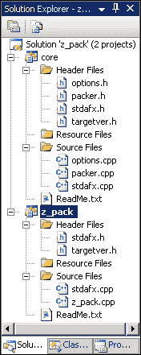

首先，让我们看看`core`库的源代码。这个库包含了应用程序的大部分功能实现。命令行解析和压缩机制都在这里实现。每个机制都被封装在一个单独的类中。`Options`类实现了命令行选项的解析。`Packer`类实现了压缩和解压缩算法。

让我们看看`Options`类。以下代码展示了`options.h`文件中的类声明：

```cpp
namespace po = boost::program_options;
class Options
{
public:
    Options(int argc, char* argv[]);

    std::string GetString(std::string option_name);
    po::options_description& GetDescription();
    bool IsUnzip();
    bool IsComplete();

private:
    po::variables_map options_;
    po::options_description description_;
};
```

以下代码展示了`options.cpp`文件中`Options`类的构造函数定义：

```cpp
Options::Options(int argc, char* argv[])
{
    description_.add_options()
        (kHelp.c_str(), "produce help message")
        (kInFile.c_str(), po::value<string>(), "input file name")
        (kOutFile.c_str(), po::value<string>(), "output file name")
        (kUnzip.c_str(), "unzip the archive");

    try
    {
        po::store(po::parse_command_line(argc, argv, description_),
                       options_);
    }
    catch(...)
    {
        cout << GetDescription() << "\n";
        exit(1);
    }
}
```

构造函数的输入参数是命令行参数的数量和参数值的向量。首先，在这里配置了 boost 库中的`options_description`类对象，名为`description_`，并带有可用的命令行参数。这个对象是`Options`类的一个字段。

所有可用的命令行参数都在`options.h`文件中定义为全局常量类型`string`：

```cpp
static const std::string kHelp = "help";
static const std::string kInFile = "in";
static const std::string kOutFile = "out";
static const std::string kUnzip = "unzip";
```

这些带有描述的参数传递给`description_`对象的`add_options`方法以配置它。现在这个对象存储了有关可用命令行参数的信息。之后，传递给构造函数的输入参数被解析并保存到变量映射中。这个映射是 boost 库中的`variables_map`类的一个对象，名为`options_`。这个对象是`Options`类的一个字段。

如果在解析参数的操作中发生任何异常，将打印出可用的命令行参数。在这种情况下，应用程序将通过`exit`函数终止。

以下代码是`options.cpp`文件中`Options`类`GetString`方法的定义：

```cpp
string Options::GetString(string option_name)
{
    if ( options_.count(option_name) == 0 )
        return string();

    return options_[option_name].as<string>();
}
```

该方法返回指定程序选项的`string`类型值，如果没有将选项作为命令行参数传递，则返回空字符串。我建议你在`Options`类的构造函数中解析命令行参数后将其命名为程序选项。

`Options`类的以下三个方法相当简单。这些方法对特定的程序选项的存在性进行检查或返回它们：

+   `IsComplete`方法检查输入和输出文件名是否作为命令行参数传递给了应用程序。如果文件名存在，该方法返回`true`值。

+   `IsUnzip`方法检查`--unzip`命令行参数是否存在。

+   `GetDescription`方法返回`Options`类中`description_`字段的引用。如果将此对象传递给`cout`标准输出流，你可以打印出可用的命令行参数。

核心库的第二类是`Packer`。这里实现了压缩和解压缩算法。此类包含`Compress`和`Decompress`静态方法。静态类方法对于实现无状态和可变数据的算法非常有帮助。调用静态方法不需要类的对象。

以下代码展示了`packer.h`文件中类的声明：

```cpp
class Packer
{
public:
  static void Compress(std::string in_file, std::string out_file);
  static void Decompress(std::string in_file, std::string out_file);
};
```

以下代码展示了`packer.cpp`文件中`Compress`方法的定义：

```cpp
void Packer::Compress(string in_file, string out_file)
{
  io::filtering_ostreambuf out;
  out.push(io::zlib_compressor());
  out.push(io::file_sink(out_file.c_str(), ios::binary));
  io::copy(io::file_source(in_file.c_str(), ios::binary), out);
}
```

此方法的输入参数是包含源文件和目标文件名的字符串。

压缩是通过 boost 库中的`copy`函数进行的，该函数将一个流的内容复制到另一个流。在这个函数中，使用了 boost 库中`file_source`类的流作为输入参数。`copy`函数生成了名为`out`的`filtering_ostreambuf`类对象。`file_source`类的流是匿名的，它由源文件名和流类型创建。在我们的例子中，这是`binary`类型。`out`对象已经通过`zlib_compressor`类型的压缩过滤器和 boost 库类`file_sink`的匿名流进行了配置。这个匿名流代表了目标文件。

执行 `Compress` 方法后，将创建具有指定目标文件名的压缩文件。

以下代码显示了 `packer.cpp` 文件中 `Packer` 类的 `Decompress` 方法定义：

```cpp
void Packer::Decompress(std::string in_file, std::string out_file)
{
  io::filtering_istreambuf in;
  in.push(io::zlib_decompressor());
  in.push(io::file_source(in_file.c_str(), ios::binary));
  io::copy(in, io::file_sink(out_file.c_str(), ios::binary));
}
```

此方法与 `Compress` 方法类似，但在此处使用了 `zlib_decompressor` 类型的过滤器。执行此方法后，将创建具有指定目标文件名的解压缩文件。

`core` 库的其余源文件已由 Visual C++ 自动生成。

另一个解决方案的项目是 `z_pack`。此项目将 `core` 库类的功能绑定在一起，以便在完整应用程序中使用。`z_pack` 项目包含一个具有 `main` 函数实现的源文件和由 Visual C++ 自动生成的几个文件。

以下代码显示了 `z_pack.cpp` 文件中 `main` 函数的定义：

```cpp
int main(int argc, char* argv[])
{
    Options options(argc, argv);

    If ( ! options.IsComplete() )
    {
        cout << options.GetDescription() << "\n";
        return 1;
    }

    if ( options.IsUnzip() )
        Packer::Decompress(options.GetString(kInFile), options.GetString(kOutFile));
    else
        Packer::Compress(options.GetString(kInFile), options.GetString(kOutFile));
    return 0;
}
```

此函数的输入参数与 `Options` 类构造函数相同。这些是命令行参数的数量和参数值的向量。首先在这里创建一个名为 `options` 的 `Options` 类对象。接下来的操作是使用 `options` 对象的 `IsComplete` 方法检查源文件和目标文件名的正确性。如果检查失败，将打印可用的命令行参数，并且应用程序将被终止。如果命令行参数正确，将执行指定的压缩或解压缩操作。`options` 对象的 `IsUnzip` 方法定义了必须执行的操作类型。`Compression` 和 `Decompression` 操作按照 `Packer` 类的静态方法执行。

这些方法的输入参数可以从 `Options` 类执行结果的 `GetString` 方法中获取。

Packt 网站上上传的代码包中提供了完整的 Visual C++ 项目源代码。

您可以构建此项目并检查其功能。编译项目需要 Visual C++ 版本的 boost 和 zlib 库。这两个库的舒适版本可在以下网站找到：

[`www.boostpro.com/download`](http://www.boostpro.com/download)

在构建一个示例应用之后，您可以测试其功能。输入以下命令以压缩现有文件：

```cpp
$ z_pack.exe --in test.txt --out test.zip

```

以下命令用于解压缩现有存档：

```cpp
$ z_pack.exe --unzip --in test.zip --out test.txt

```

现在您已经拥有了将我们的示例 Visual C++ 项目导入 MinGW 软件的必要信息。以下是将项目导入的逐步说明：

1.  为 MinGW 项目版本创建一个新目录，包含 `core` 和 `z_pack` 子目录。

1.  将 `options.h`、`options.cpp`、`packer.h` 和 `packer.cpp` 文件复制到 `core` 子目录。

1.  将 `z_pack.cpp` 文件复制到 `z_pack` 子目录。

1.  从具有 cpp 扩展名的所有项目中删除以下行：

    ```cpp
    #include "stdafx.h"
    ```

1.  将以下 `Makefile` 添加到根项目目录：

    ```cpp
    SUBDIRS = core z_pack

    .PHONY: all $(SUBDIRS)

    all: $(SUBDIRS)

    $(SUBDIRS):
      $(MAKE) -C $@ clean
      $(MAKE) -C $@
    ```

    这个 `Makefile` 允许你为 `core` 和 `z_pack` 子目录执行 `make clean` 和 `make` 命令。`make` 命令将构建你的应用，而 `make clean` 命令将删除编译器和链接器生成的输出文件。

1.  将以下 `Makefile` 添加到 `core` 子目录：

    ```cpp
    OBJ=options.o packer.o

    CXXFLAGS+=-IC:\MinGW\include

    libcore.a: $(OBJ)
      ar rcs $@ $^

    clean:
      rm -f *.o *.a
    ```

    `ar` 归档工具用于将 `options.o` 和 `packer.o` 对象文件维护到 `libcore.a` 归档中。这个归档将被用于与 `z_pack` 可执行文件的静态链接。`libcore.a` 归档在概念上与 Visual C++ 静态链接库相同。你可以通过执行以下命令来获取关于 `ar` 归档工具的更多信息：

    ```cpp
    $ ar --help

    ```

1.  将以下 `Makefile` 添加到 `z_pack` 子目录：

    ```cpp
    OBJ=z_pack.o

    MINGW_DIR=C:\MinGW
    CXXFLAGS+=-I..\core
    LIBS+=-L..\core -lcore -L$(MINGW_DIR)\lib -lboost_program_options -lboost_iostreams -L$(MINGW_DIR)\git\bin -lz

    z_pack.exe: $(OBJ)
      $(CXX) -o $@ $^ $(LIBS)

    clean:
      rm -f *.o *.exe
    ```

    在这里进行所有必要的外部库（boost 和 zlib）的链接，因为 `ar` 归档工具不执行任何链接。

1.  在根项目目录中输入 `make` 命令来构建我们的应用。

这就是你需要将我们的示例 Visual C++ 项目导入 MinGW 软件的全部内容。构建后，你将得到 `z_pack.exe` 可执行文件。

将 `libcore.a` 静态链接库更改为动态链接版本相当简单。你只需要更改 `z_pack` 可执行文件和 `core` 库的 `Makefile` 文件。

以下 `Makefile` 将创建动态链接的 `core` 库版本：

```cpp
OBJ=options.o packer.o

MINGW_DIR=C:\MinGW
CXXFLAGS+=-I$(MINGW_DIR)\include
LIBS+=-L$(MINGW_DIR)\lib -lboost_program_options -lboost_iostreams -L$(MINGW_DIR)\git\bin -lz

libcore.dll: $(OBJ)
  $(CXX) -shared -o $@ $^ $(LIBS)

clean:
  rm -f *.o *.dll
```

与静态链接的 `core` 库版本不同，这里将调用 C++ 编译器和链接器。此外，必须指定 `-shared` 编译器选项来创建动态链接库。

以下 `Makefile` 是为 `z_pack` 可执行文件动态链接 `core` 库而准备的：

```cpp
OBJ=z_pack.o

CXXFLAGS+=-I..\core
LIBS+=-L..\core -lcore

z_pack.exe: $(OBJ)
  $(CXX) -o $@ $^ $(LIBS)

clean:
  rm -f *.o *.exe *.dll
```

由于在 `core` 库构建中已经发生，这里不需要与外部库（boost 和 zlib）进行链接。

你必须将 `libcore.dll` 库和 `z_pack.exe` 可执行文件复制到同一个目录中才能运行应用。

重要的是要注意，使用 Visual C++ 和 MinGW 软件编译的库、对象和可执行文件是不兼容的。这意味着你需要 MinGW 版本的静态链接和动态链接库，这些库是你想要与使用 MinGW 软件编译的应用程序链接的。在将项目导入 MinGW 软件之前，你必须检查项目中使用的所有第三方库的现有 MinGW 版本。

## 4 – 应用程序调试

MinGW 软件包含 **GNU 调试器**（**GDB**）。这是一个用于调试使用 MinGW 软件开发的应用的标准化工具。你不能使用 GDB 来调试使用 Visual C++ 编译器编译的项目。

如果你的 MinGW 软件发行版中没有 GDB，你可以手动安装它。按照以下说明进行操作：

1.  从官方下载页面下载 GDB 应用程序归档：

    [`sourceforge.net/projects/mingw/files/MinGW/Extension/gdb`](http://sourceforge.net/projects/mingw/files/MinGW/Extension/gdb)

    可能会与最新 GDB 版本的启动出现一些问题。如果你遇到错误，请尝试安装之前的调试器版本。

1.  将下载的存档提取到 MinGW 软件安装目录中。如果你按照本书中的描述安装了带有 Git 的 MinGW 软件，我建议你将存档提取到 `C:\MinGW\git`。

    安装 GDB 后，你可以通过输入以下命令来测试其功能：

    ```cpp
    $ gdb --help

    ```

如果你看到应用程序使用信息，则表示 GDB 已正确安装。现在你有了必要的调试工具来开始调试基于 MinGW 的应用程序。

让我们使用 GDB 调试示例应用程序。该应用程序是一个包含空指针赋值的简单程序。

以下代码展示了名为 `segfault.cpp` 的源文件内容：

```cpp
#include <string.h>

void bar()
{
  int* pointer = NULL;
  *pointer = 10;
}

void foo()
{
  bar();
}

int main()
{
  foo();

  return 0;
}
```

空指针赋值操作发生在 `bar` 函数中。`bar` 函数由 `foo` 函数调用，而 `foo` 函数由 `main` 函数调用。

以下 `Makefile` 用于编译示例：

```cpp
OBJ=segfault.o

CXXFLAGS+=-g

segfault.exe: $(OBJ)
  $(CXX) -o $@ $^

clean:
  rm -f *.o *.exe
```

MinGW C++ 编译器默认不将调试信息包含在输出二进制文件中。我们需要在 `Makefile` 中添加 `-g` 编译器选项来实现这一点。

编译后，你会得到带有调试符号的 `segfault.exe` 可执行文件。这意味着 GDB 不仅会告诉你内存地址，还会告诉你例程和变量的名称。

输入以下命令以开始调试我们的示例应用程序：

```cpp
$ gdb segfault.exe

```

要使用命令行参数启动应用程序，请使用 `--args` GDB 选项。例如：

```cpp
$ gdb --args z_pack.exe --in test.txt --out test.zip

```

在这种情况下，输入和输出文件名将被传递到 `z_pack.exe` 应用程序。

启动调试器后，你会看到 GDB 命令提示符。输入 `r` 命令来运行已加载的应用程序：

```cpp
(gdb) r

```

这是 `run` 命令的简短变体。大多数 GDB 命令都有常用和简短的变体。所有未来的命令都将使用简短变体来描述，因为它们容易记忆和输入。

应用程序启动运行后，你会看到此程序崩溃信息，如下截图所示：

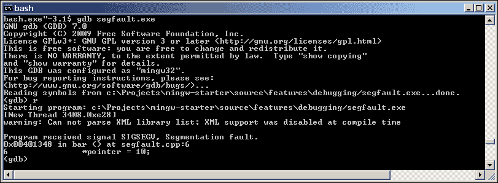

你可以看到程序终止时正在接收 `SIGSEGV` 信号。当 POSIX 系统检测到无效的虚拟内存引用或段错误时，它会向进程发送此信号。此外，发生错误的源文件行也会在这里显示。以下为 `segfault.cpp` 文件的第六行：

```cpp
*pointer = 10;
```

我们的示例程序在崩溃后停止执行。当程序停止时，你可以通过命令行与调试器交互。例如，你可以获取 **堆栈跟踪** 来探索嵌套函数的调用。如下输入 `bt` 命令：

```cpp
(gdb) bt

```

你将看到类似以下截图的内容：

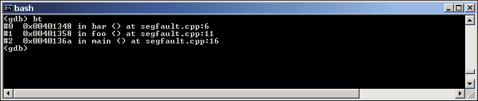

你将看到程序在崩溃前调用的函数名称和源文件行。

此外，您可以通过`l`命令获取错误位置处的源文件行列表：

```cpp
(gdb) l

```

您将看到`bar`函数的源代码。现在您有足够的信息来修复段错误错误。

要退出 GDB，请输入`q`命令：

```cpp
(gdb) q

```

并输入`y`以确认。

GDB 允许您在预定义的位置设置断点以停止程序执行。有几种断点类型。最简单的类型是在函数入口处设置断点和在源文件中的行设置断点。您需要指定应用程序源文件目录以提供对 GDB 的访问。在这种情况下启动应用程序调试的命令将如下所示：

```cpp
$ gdb --directory=. segfault.exe

```

`--directory`命令行选项定义源文件目录。在此示例中已添加当前目录（当前目录等于点符号）。

通过输入以下命令可以获取所有已加载的目录：

```cpp
(gdb) show directories

```

以下命令用于在`segfault.cpp`源文件的`foo`函数处设置断点：

```cpp
(gdb) b segfault.cpp:foo

```

要在`segfault.cpp`源文件的第五行设置断点，请输入以下命令：

```cpp
(gdb) b segfault.cpp:5

```

使用以下命令可以获取所有当前定义的断点信息列表：

```cpp
(gdb) i b

```

设置断点后，您可以运行我们的示例程序：

```cpp
(gdb) r

```

在设置断点后，程序执行将在`foo`函数的第一个断点处停止。您可以使用`c`命令继续执行：

```cpp
(gdb) c

```

输入此命令，然后在`segfault.cpp`源文件的第五行设置下一个断点。在每一个断点，都可以查看回溯信息和源文件行。

观察点是一种特殊的断点类型，用于检测读取和写入变量操作。此命令用于为`pointer`变量设置观察点：

```cpp
(gdb) aw pointer

```

如果在当前上下文中已定义了变量，GDB 可以设置此类观察点。这意味着您必须在`bar`函数处停止程序执行，然后为其局部`pointer`变量设置观察点。您可以在`main`函数中停止程序以设置任何全局变量的观察点。

此外，您还可以配置 GDB，在每次断点命中时显示具有当前值的变量列表。要将`pointer`变量添加到此列表中，请输入以下命令：

```cpp
(gdb) display pointer

```

在下一个断点程序停止时，将显示`pointer`变量的值。

您可以禁用任何类型的断点以防止程序在它处停止。执行此操作的命令如下：

```cpp
(gdb) disable 1

```

指定的数字是断点标识符。此标识符在断点信息列表中声明。

要启用断点，请输入以下命令：

```cpp
(gdb) enable 1

```

如果不再需要，可以删除断点：

```cpp
(gdb) d 1

```

有几个有用的命令用于跟踪程序：

+   继续运行程序，直到控制到达不同的源行（类似于进入跟踪）：

    ```cpp
    (gdb) s

    ```

+   继续到当前堆栈帧中的下一个源行（类似于步进）：

    ```cpp
    (gdb) n

    ```

+   继续执行，直到所选堆栈帧中的函数返回：

    ```cpp
    (gdb) fin

    ```

这些命令可以在程序运行后，通过断点停止后使用。

你可以在不包含调试信息的情况下重新构建你的应用程序，以生成可执行文件和库的发布版本。但有可能从现有的二进制文件中移除调试信息。使用以下`strip`命令：

```cpp
$ strip segfault.exe

```

GDB 对于调试异常程序行为（例如段错误）非常有用。但使用与测试套件和事件日志相同的方法可以完成 GDB 对算法正确性检查的功能。

## 5 – 分析应用程序

MinGW 软件包含 gprof 性能分析工具。这个工具对于追踪应用程序的瓶颈非常有用。gprof 工具是 GNU Binutils 集合的一部分，因此它存在于所有 MinGW 发行版中。你不能使用 gprof 来分析用 Visual C++编译器编译的应用程序的性能。

让我们使用 gprof 来分析一个示例应用程序。该应用程序从文件中读取字节到 STL `vector`类型容器，对它们进行排序，并将结果写入输出文件。应用程序的源代码位于名为`sorting.cpp`的文件中。

以下是`main`函数的定义：

```cpp
int main()
{
  ReadData();

  SortData();

  WriteResult();

  return 0;
}
```

你可以在该函数中看到基本的应用算法。首先，数据是从输入文本文件中读取的。然后，数据被排序并写入输出文件。这些步骤中的每一个都在单独的函数中实现。

以下代码显示了`ReadData`函数的定义：

```cpp
void ReadData()
{
  ifstream in_file("source.txt", ios::in | ios::binary);

  copy(istream_iterator<char>(in_file), istream_iterator<char>(), 
     back_inserter(gData));
}
```

这里使用具有`in_file`名称的`ifstream`类的流来读取`source.txt`输入文件的内容。然后使用 STL `copy`算法将`in_file`流的内容复制到全局`gData`容器中，该容器是`vector<char>`类的。我们在`copy`算法中使用`istream_iterator`类的迭代器来访问`in_file`流中的元素。

`SortData`函数实现了最简单的冒泡排序算法：

```cpp
void SortData()
{
  char temp;
  size_t size = gData.size();

  for (int i = (size - 1); i > 0; i--)
  {
    for (int j = 1; j <= i; j++)
    {
    if (gData[j-1] > gData[j])
    {
      temp = gData[j-1];
      gData[j-1] = gData[j];
      gData[j] = temp;
    }
    }
  }
}
```

此排序算法处理`gData`容器中的元素。

以下是`WriteResult`函数的定义：

```cpp
void WriteResult()
{
  ofstream out_file("result.txt", ios::out | ios::binary);
  out_file.write(&gData[0], gData.size());
}
```

这里使用具有`out_file`名称的`ofstream`类的流来将`gData`容器的内容写入输出`result.txt`文件。这里调用`out_file`流的`write`方法来执行文件写入操作。如果该文件已存在，将创建一个空文件`result.txt`来写入。`sorting.cpp`文件可在 Packt 网站上上传的代码包中找到。

以下是为示例应用程序的`Makefile`：

```cpp
OBJ=sorting.o

CXXFLAGS+=-pg

sorting.exe: $(OBJ)
  $(CXX) -o $@ $^ $(CXXFLAGS)

clean:
  rm -f *.o *.exe *.out *.dot
```

性能分析需要配置信息。这些信息可以通过可执行文件的额外代码生成。这种类型的额外代码创建是编译器的可选功能，并且可以通过编译器的 `-pg` 选项指定。此选项必须为每个对象文件编译和最终链接指定。在我们的 `Makefile` 中使用 `CXXFLAGS` 环境变量来完成此操作。

您可以在编译后测试我们的示例应用程序。只需将任何纯文本文件复制到项目目录中，命名为 `source.txt`，然后运行 `sorting.exe` 可执行文件。应用程序完成工作后，您将获得包含排序源文件内容的 `result.txt` 文件。执行以下步骤来分析我们的示例应用程序：

1.  启动应用程序的可执行文件。之后，您将在当前工作目录中获得包含分析数据的 `gmon.out` 文件。

1.  运行 gprof 工具来解释 `gmon.out` 文件信息，并将结果写入 `profile.txt` 输出文件：

    ```cpp
    $ gprof -zq sorting.exe > profile.txt
    ```

在前面的示例中使用了以下 gprof 工具选项：

+   `-z` 选项是必需的，以便在输出文件中包含所有使用的函数

+   `-q` 选项会导致程序调用图，以生成更详细的报告

您在 `profile.txt` 文件中得到了包含分析数据的文本报告。它可以在任何文本编辑器中打开。但是，这种分析信息的文本表示不太方便进行发现。有方便的工具可以可视化 gprof 报告。

对于可视化，我们需要以下工具：

+   Python 2.7 解释器

+   将 gprof 报告转换为 dot 文件格式的 Python 脚本

+   包含 dot 格式可视化工具的 Graphviz 软件包

您可以从以下官方网站下载 Python 2.7 版本：

[`python.org/download`](http://python.org/download)

Python 可以使用标准的 Windows 安装程序进行安装。为此，只需运行下载的 MSI 文件。

将 gprof 报告文本文件转换为 dot 格式的脚本可在以下开发者页面上找到：

[`code.google.com/p/jrfonseca/wiki/Gprof2Dot`](http://code.google.com/p/jrfonseca/wiki/Gprof2Dot)

此脚本是免费软件，您可以根据自己的意愿使用、分发和修改它。要安装此脚本，请将其复制到 `C:\MinGW\bin` 或 `C:\MinGW\git\bin`。

Graphviz 软件包可在以下官方网站获取：

[`www.graphviz.org/Download_windows.php`](http://www.graphviz.org/Download_windows.php)

Graphviz 可以像 Python 解释器一样使用 Windows 安装程序进行安装。

现在您已经有了必要的脚本和可视化工具来可视化我们的分析结果。执行以下步骤来完成此操作：

1.  运行 `gprof2dot.py` 脚本以获取 dot 文件：

    ```cpp
    $ gprof2dot.py -s profile.txt > profile.dot

    ```

    在这里使用了 `gprof2dot.py` 工具选项。

    `-s` 选项删除了函数和模板参数信息。

    之后，您将获得包含程序调用图的 `profile.dot` 文件。

1.  运行 `gvedit.exe` 应用程序。它可以从 Windows 的 **开始** 菜单中获取。从主菜单中选择 **文件** | **打开**。指定 `profile.dot` 文件。

您将看到程序如下截图所示的调用图：

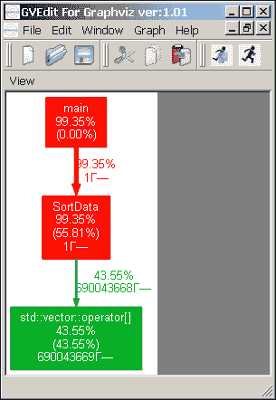

您可以在前面的截图中看到一个调用图。此图的节点用彩色边表示。这些节点代表分析程序中调用的函数。每条边包含以下信息：

+   **总时间百分比**是指在此函数及其所有子函数中花费的运行时间百分比

+   **自身时间百分比**（括号内）是指仅在此函数中花费的运行时间百分比

+   **总调用次数**是指此函数被调用的总次数（包括递归调用）

此外，节点根据总时间百分比值具有类似温度的彩色。耗时最多的函数显示为红色（热点）边，耗时最少的函数显示为深蓝色。

我们的示例应用程序的大部分执行时间都花在了红色的 `SortData` 函数上。图中的统计信息证实了这一点：

+   总时间是 99.35 百分比

+   自身时间是 55.81 百分比

+   总调用次数等于 1

我们可以使用 STL 的 `sort` 算法代替冒泡算法来优化我们的示例应用程序。让我们将 `SortData` 函数的代码修改如下：

```cpp
void SortData()
{
  sort(gData.begin(), gData.end());
}
```

现在您需要重新构建应用程序，运行应用程序，然后运行 gprof 和 `gprof2dot.py` 脚本。在 Graphviz 应用程序中打开生成的 dot 文件。您将看到如下截图所示的调用图：


红色边从图中消失。这意味着我们没有任何明显的瓶颈。所有程序执行时间在几个函数之间均匀分布。

您可以使用 `strip` 命令从可执行文件和库中删除分析后的额外代码：

```cpp
$ strip sorting.exe

```

分析是一种重要的技术，可以帮助您找到并移除应用程序中的瓶颈。这对于分析具有许多组件和库的复杂系统非常有帮助。MinGW 软件允许您以简单快捷的方式将这项技术纳入您的软件开发流程。

## 6 – 使用跨平台库进行开发

MinGW 软件允许您使用 MinGW C++ 编译器编译的任何库开发应用程序。开源库通常提供 Visual C++ 和 MinGW 编译变体。此外，您始终可以获取这些库的源代码，并使用您的 MinGW 软件构建它们。以下是一些著名的开源跨平台框架和工具包的描述：

+   Qt 框架

+   Gtk+ 小部件工具包

+   wxWidgets 框架

将使用这些库中的每一个开发相同的功能示例应用程序。这些示例的目标是展示部署和开始使用这些库的第一步。

我们的示例应用程序由一个包含两个按钮的窗口组成。点击第一个按钮会显示一条消息，点击第二个按钮会导致应用程序终止。这种功能与*快速入门*部分中描述的功能相同。

### Qt 框架

Qt 框架不仅提供用于 GUI 开发的跨平台小部件工具包，还包含用于 SQL 数据库访问、XML 解析、线程管理、网络交互和本地化支持的特性。Qt 框架拥有自己的容器类，如`Qstring`或`QVector`，以及一系列知名算法，如排序、搜索和复制，这些算法可以处理这些容器中的数据，允许你用 Qt 的能力替代 STL 和 Boost 库的功能。这种 Qt 框架的自给自足特性对于开发跨平台应用非常有优势。你只需为这个平台构建一个 Qt 框架，就可以将你的 Qt 应用程序导入到新的平台。Qt 框架的开发者支持许多平台：

+   Windows

+   Mac OS X

+   Linux

+   Solaris

+   Symbian

+   Android（名为 Ministro 的非官方框架端口）

让我们从 Qt 框架开始我们的工作。重要的是要注意，Qt 库是用特定的 MinGW 软件版本编译的。你的应用程序必须用相同的 MinGW 版本编译，因此你必须安装它。另一种方式是用你已安装的 MinGW 软件编译 Qt 库的源代码，但这个变体将不会在本书中描述。你可以在以下网站上找到一些有用的说明来完成这项工作：

[`www.formortals.com/build-qt-static-small-microsoft-intel-gcc-compiler`](http://www.formortals.com/build-qt-static-small-microsoft-intel-gcc-compiler)

这里描述的所有其他工具包都不需要特定的 MinGW 软件版本。以下是将 Qt 库版本 4.6.4 及其一些必要软件安装以开始开发的说明：

1.  从以下官方网站下载 Windows 版本的 Qt 库的 MinGW 版本：

    [`qt-project.org/downloads`](http://qt-project.org/downloads)

    注意，这个库是用特定的（在我们的案例中等于 4.4）MinGW 软件版本编译的。

1.  使用设置向导安装下载的 Qt 库。运行下载的 exe 文件即可完成。

1.  从以下官方下载页面下载版本 4.4 的 MinGW 软件：

    [`sourceforge.net/projects/mingw/files/MinGW/Base/gcc/Version4/Previous%20Release%20gcc-4.4.0/`](http://sourceforge.net/projects/mingw/files/MinGW/Base/gcc/Version4/Previous%20Release%20gcc-4.4.0/)

    需要的文件名为 `gcc-full-4.4.0-mingw32-bin-2.tar.lzma`。这是一个包含 MinGW 编译器的可执行文件和必要核心库的归档文件。

1.  将下载的 MinGW 软件归档文件解压到路径中不含空格的目录中（例如，`C:\MinGW4.4`）。

    您可以使用 7-Zip 应用程序提取 LZMA 归档类型。此应用程序可在以下官方网站上找到：

    [`www.7-zip.org/download.html`](http://www.7-zip.org/download.html)

1.  从以下官方下载页面下载 MinGW 的 GNU Binutils 软件：

    [`sourceforge.net/projects/mingw/files/MinGW/Base/binutils/binutils-2.19`](http://sourceforge.net/projects/mingw/files/MinGW/Base/binutils/binutils-2.19)

    需要的归档文件名为 `binutils-2.19-2-mingw32-bin.tar.gz`。

1.  将下载的 GNU Binutils 归档文件解压到与 MinGW 软件相同的目录中。在我们的例子中是 `C:\MinGW4.4`。

1.  从以下网页下载 GNU Make 工具：

    [`sourceforge.net/projects/mingw/files/MinGW/Extension/make/mingw32-make-3.80-3`](http://sourceforge.net/projects/mingw/files/MinGW/Extension/make/mingw32-make-3.80-3)

    您需要下载的文件是 `mingw32-make-3.80.0-3.exe`。

1.  将 GNU Make 工具安装到 MinGW 软件目录中（`C:\MinGW4.4`）。运行下载的 exe 文件，并使用安装向导来完成安装。

1.  将安装的 MinGW 软件路径添加到 `PATH` Windows 环境变量中。从那里删除其他 MinGW 软件安装的现有路径。在我们的例子中，必须添加 `C:\MinGW4.4\bin` 路径。

现在你已经拥有了必要的库和特定的 MinGW 软件版本，可以开始基于 Qt 框架开发应用程序了。

我们的示例应用程序是在 `main.cpp` 源文件中实现的。以下是对 `main` 函数的定义：

```cpp
int main(int argc, char* argv[])
{
  QApplication application(argc, argv);

  QMainWindow* window = CreateWindow();

  CreateMsgButton(window);

  CreateQuitButton(window, application);

  return application.exec();
}
```

首先，创建了一个名为 `application` 的 `QApplication` 类对象。这个对象用于管理应用程序的控制流和主要设置。之后，通过 `CreateWindow` 函数创建了名为 `window` 的 `QMainWindow` 类窗口。通过 `CreateMsgButton` 和 `CreateQuitButton` 函数创建了两个窗口按钮。当所有用户界面对象都创建完成后，调用 `application` 对象的 `exec` 方法进入主事件循环。现在应用程序开始处理按钮按下等事件。

以下是对封装主应用程序窗口创建的 `CreateWindow` 函数：

```cpp
QMainWindow* CreateWindow()
{
  QMainWindow* window = new QMainWindow(0, Qt::Window);

  window->resize(250, 150);
  window->setWindowTitle("Qt Application");
  window->show();

  return window;
}
```

主应用程序窗口是 `QMainWindow` 类的一个对象，名为 `window`。它通过一个具有两个输入参数的构造函数创建。第一个参数是 `QWidget*` 类型，这是一个指向窗口父窗口的指针。在我们的例子中，它等于零，这意味着没有父窗口。第二个参数是 `Qt::WindowFlags` 类型，它定义了窗口样式。它等于 `Qt::Window`，这与具有系统框架和标题栏的标准窗口外观相匹配。

在创建主窗口后，使用 `window` 对象的 `resize` 方法设置其大小。然后，使用 `window` 对象的 `setWindowTitle` 方法设置窗口标题。接下来的操作是使用 `window` 对象的 `show` 方法使主窗口可见。函数返回创建的 `window` 对象的指针。

以下代码展示了封装创建带有显示消息动作的按钮的 `CreateMsgButton` 函数：

```cpp
void CreateMsgButton(QMainWindow* window)
{
  QMessageBox* message = new QMessageBox(window);
  message->setText("Message text");

  QPushButton* button = new QPushButton("Message", window);
  button->move(85, 40);
  button->resize(80, 25);
  button->show();
  QObject::connect(button, SIGNAL(released()), message, SLOT(exec()));
}
```

首先，我们需要创建一个消息窗口，以便在点击按钮时显示它。这个消息窗口是 `QMessageBox` 类的一个对象，名为 `message`。它通过一个带有 `QWidget*` 类型输入参数的构造函数创建。这是一个指向父窗口的指针。消息窗口中显示的文本通过 `message` 对象的 `setText` 方法设置。

现在我们需要一个按钮，它将被放置在主窗口中。这个按钮是 `QPushButton` 类的一个对象，名为 `button`。这里使用带有两个输入参数的构造函数来创建这个对象。第一个参数是一个 `QString` 类的字符串，包含按钮文本。第二个参数是父窗口指针。`button` 对象的位置和大小通过 `move` 和 `resize` 方法设置。配置完按钮后，我们通过使用 `show` 方法使其可见。

现在我们需要绑定按钮按下事件和消息窗口显示。这里使用 `QObject` 类的 `connect` 静态方法来实现这个目标。它允许在 `button` 对象的释放信号和 `message` 对象的 `exec` 方法之间创建连接。`exec` 方法会导致显示带有消息的窗口。

以下代码展示了封装创建关闭应用程序按钮的 `CreateQuitButton` 函数：

```cpp
void CreateQuitButton(QMainWindow* window, QApplication& application)
{
  QPushButton* quit_button = new QPushButton("Quit", window);
  quit_button->move(85, 85);
  quit_button->resize(80, 25);
  quit_button->show();
  QObject::connect(quit_button, SIGNAL(released()), &application, SLOT(quit()));
}
```

这个函数与 `CreateMsgButton` 函数类似。但在这里没有创建消息窗口。关闭应用程序按钮是 `QPushButton` 类的一个对象，名为 `quit_button`。`quit_button` 按钮的 `release` 信号连接到 `application` 对象的 `quit` 方法。这个方法会导致应用程序以成功代码关闭。

完整的 `main.cpp` 文件可以在 Packt 网站上上传的代码包中找到。

现在你已经准备好构建一个示例应用程序。你需要执行以下指令：

1.  使用以下命令创建一个 Qt 项目文件：

    ```cpp
    $ qmake -project

    ```

    你将得到一个扩展名为`pro`且与当前目录同名的文件。

1.  使用以下命令创建`Makefile`、服务文件和子目录：

    ```cpp
    $ qmake

    ```

1.  使用 GNU Make 工具编译项目：

    ```cpp
    $ mingw32-make

    ```

GNU Make 工具的可执行文件名在官方发行版中是`mingw32-make`。这个版本是与 4.4 版本的 MinGW 软件一起安装的。

编译完成后，你将在`debug`子目录中找到`qt.exe`可执行文件。

这是我们示例应用的调试版本。输入以下命令以构建`release`版本：

```cpp
$ mingw32-make release

```

编译完成后，`qt.exe`可执行文件将在`release`子目录中创建。

### Gtk+ 小部件工具包

Gtk+ 是一个跨平台工具包，具有许多小部件来构建用户界面。重要的是要注意，Gtk+ 是用 C 语言编写的。这个工具包有一个对象模型，但没有 C++ 类和对象。你可以在你的 C++ 应用程序中使用这个工具包，但使用 gtkmm 可能会有所帮助。gtkmm 是 Gtk+ 的官方 C++ 接口。关于 gtkmm 接口，本书没有描述，但你可以在以下官方网站上获取更多信息：

[`www.gtkmm.org`](http://www.gtkmm.org)

如果你正在寻找用于创建用户界面的小部件工具包且不需要 Qt 框架提供的任何附加功能，Gtk+ 是一个好的选择。

以下是如何安装 Gtk+ 小部件工具包的说明：

1.  从以下官方网站下载包含 Gtk+ 小部件工具包的完整捆绑包存档：

    [`www.gtk.org/download/win32.php`](http://www.gtk.org/download/win32.php)

1.  将存档提取到路径中不含空格的目录中（例如，`C:\Gtk+`）。

1.  将 Gtk+ 工具包的安装路径添加到`PATH` Windows 环境变量中。在我们的例子中，路径`C:\Gtk+\bin`必须被添加。

1.  创建名为`PKG_CONFIG_PATH`的新 Windows 环境变量。将`pkg-config`实用程序文件的路径指定为该变量的值。在我们的例子中，这是`C:\Gtk+\lib\pkgconfig`。

现在你有了使用 Gtk+ 小部件工具包开发应用程序所需的库。与 Qt 框架不同，你不需要与 Gtk+ 库相同的 MinGW 软件版本，因为 Gtk+ 库是用 MinGW 软件编译的。任何已安装的 MinGW 软件都可以用来编译你的应用程序。

我们的示例应用程序是在`main.cpp`源文件中实现的。以下是`main`函数的定义：

```cpp
int main(int argc, char* argv[])
{
  gtk_init(&argc, &argv);

  GtkWidget* window = CreateWindow();

  GtkWidget* box = gtk_vbox_new(FALSE, 0);
  gtk_widget_show(box);

  CreateMsgButton(box);

  CreateQuitButton(box);

  gtk_container_add(GTK_CONTAINER(window), box);
  gtk_widget_show(window);
  gtk_main();

  return 0;
}
```

首先，调用`gtk_init`函数，它初始化我们使用 Gtk+ 工具包所需的一切。之后在`main`函数中创建了四个小部件。它们是主窗口、垂直框容器和两个按钮。主窗口是`CreateWindow`函数创建的`GtkWidget` Gtk+ 结构的指针。

需要使用盒式容器在主窗口中放置几个小部件（在我们的例子中是两个按钮）。这个盒式容器是指由 `gtk_vbox_new` Gtk+ 函数创建的 `GtkWidget` 结构的指针。此函数有两个输入参数。第一个参数是 `gboolean` 类型，用于定义是否所有子小部件都应获得相等的空间分配。第二个参数是 `gint` 类型，用于定义在子小部件之间放置的像素数。使用 `gtk_widget_show` 函数调用使盒式容器可见。

在 `CreateMsgButton` 和 `CreateQuitButton` 函数中创建了显示消息和关闭应用程序的按钮。

`gtk_container_add` 函数用于将一个小部件放入另一个小部件中。在我们的例子中，盒式容器已经被放入主窗口中。之后，使用 `gtk_widget_show` 函数使 `window` 小部件可见。

`gtk_main` 函数导致运行主应用程序循环以处理事件。

以下是为创建主窗口的 `CreateWindow` 函数：

```cpp
GtkWidget* CreateWindow()
{
  GtkWidget* window = gtk_window_new(GTK_WINDOW_TOPLEVEL);

  gtk_window_set_title(GTK_WINDOW(window), "Gtk+ Application");
  g_signal_connect(window, "delete-event",                           G_CALLBACK(gtk_main_quit), NULL);
  g_signal_connect(window, "destroy", G_CALLBACK(gtk_main_quit),               NULL);

  return window;
}
```

使用 `gtk_window_new` 函数在这里创建了 `GTK_WINDOW_TOPLEVEL` 类型的主窗口。此窗口类型等于一个常规应用程序窗口。然后使用 `gtk_window_set_title` 函数设置窗口标题。

现在我们必须绑定应用程序关闭和主窗口销毁事件。这是在主窗口关闭后关闭应用程序所需的。在 Gtk+ 术语中，事件被命名为信号。在这里使用 `g_signal_connect` 宏进行信号绑定。此宏有四个参数。第一个参数是需要连接到的窗口的指针。第二个参数是包含信号名称的字符串。第三个参数是处理此信号的回调函数。第四个参数是指向附加信号数据的指针。

有两个名为 `delete-event` 和 `destroy` 的信号与窗口关闭事件相匹配。在我们的情况下，当这些信号发生时，将调用 `gtk_main_quit` 函数。此函数将停止应用程序事件循环，并导致应用程序终止。

以下是为创建显示消息按钮的 `CreateMsgButton` 函数：

```cpp
void CreateMsgButton(GtkWidget* box)
{
  GtkWidget* button = gtk_button_new_with_label("Message"); 
  gtk_widget_show(button);	
  g_signal_connect(G_OBJECT(button), "clicked",
                     G_CALLBACK(ShowMessage), NULL);
  gtk_container_add(GTK_CONTAINER(box), button);
}
```

此函数有一个输入参数，即指向 `GtkWidget` 结构的指针。这用于传递按钮容器小部件的指针。

按钮小部件是指向名为 `button` 的 `GtkWidget` 结构的指针。它是由 `gtk_button_new_with_label` 函数创建的。此函数只有一个输入参数，即按钮标签字符串。之后，使用 `gtk_window_show` 函数使按钮小部件可见。按钮小部件的 `clicked` 信号连接到 `ShowMessage` 函数。当配置完成后，按钮小部件被添加到盒式容器中。

以下是为创建和显示消息窗口的 `ShowMessage` 函数：

```cpp
void ShowMessage(GtkWidget* widget, gpointer data)
{
  GtkWidget* message = gtk_message_dialog_new((GtkWindow*)data, GTK_DIALOG_MODAL, GTK_MESSAGE_INFO, GTK_BUTTONS_OK, "Message text");
  gtk_dialog_run(GTK_DIALOG(message));
  gtk_widget_destroy(message);
}
```

消息窗口是使用 `gtk_message_dialog_new` 函数创建的 Gtk+ 对话框小部件。父窗口指针、对话框标志、消息类型、对话框按钮和消息文本被传递给此函数。调用 `gtk_dialog_run` 函数以显示创建的对话框。当对话框按钮被点击时，此函数将返回控制权。下一行的 `gtk_widget_destroy` 函数将销毁我们的消息窗口。

以下是为创建退出按钮的 `CreateQuitButton` 函数：

```cpp
void CreateQuitButton(GtkWidget* box)
{
  GtkWidget* button = gtk_button_new_with_label("Quit"); 
  gtk_widget_show(button);	
  g_signal_connect(G_OBJECT(button), "clicked",
                     G_CALLBACK(gtk_main_quit), NULL);
  gtk_container_add(GTK_CONTAINER(box), button);
}
```

这与 `CreateMsgButton` 函数相同，但按钮标签不同。此外，此按钮的 `clicked` 信号绑定到 `gtk_main_quit` 函数。此函数将导致应用程序终止。

完整的 `main.cpp` 文件可在 Packt 网站上上传的代码包中找到。

以下是为编译我们的示例应用程序的 `Makefile`：

```cpp
OBJ=main.o

CXXFLAGS+='pkg-config --cflags gtk+-win32-2.0'
LIBS+='pkg-config --libs gtk+-win32-2.0'

gtk.exe: $(OBJ)
  $(CXX) -o $@ $^ $(LIBS)

clean:
  rm -f *.o *.exe
```

这里使用来自 Gtk+ 工具包的 `pkg-config` 工具来获取编译器和链接器 Gtk+ 特定标志。重音符号意味着包裹的字符串将被执行为一个命令，并且执行的结果将作为字符串值返回。

以下是在这里使用的 `pkg-config` 选项：

+   `--cflags`：这将打印预处理器和编译器标志，以便使用指定的库编译应用程序

+   `--libs`：这将打印链接器标志，以便将应用程序与指定的库链接

`gtk+-win32-2.0` 是我们想要链接的包含 Gtk+ 库的包的名称。

`pkg-config` 工具的执行结果被分配给 `CXXFLAGS` 和 `LIBS` 变量。

现在，您已经有了编译我们的示例应用程序所需的所有源文件。输入 `make` 命令来完成此操作。您将在当前目录中获得 `gtk.exe` 可执行文件。

### wxWidgets 框架

wxWidgets 框架包含用于用户界面开发的工具包和用于网络编程、线程支持、图像处理、数据库支持和 HTML 以及 XML 处理的功能。wxWidgets 有自己的一套容器和算法，这些足以仅使用此框架资源来开发应用程序。

实现自己的用户界面元素是许多小部件工具包和框架的常见做法。这就是 Qt 框架和 Gtk+ 小部件工具包的特点。与这些不同，wxWidgets 通过平台的 API 使用原生平台的用户界面元素。正因为如此，基于 wxWidgets 的应用程序看起来和感觉就像原生应用程序一样。

wxWidgets 是开发适用于 Mac OS X、Windows、Linux 和其他 Unix 家族操作系统的跨平台高质量、原生外观应用程序的好基础。

可以从官方网站下载几个 wxWidgets 框架版本作为源代码存档。您可以下载其中一个，并使用当前安装的 MinGW 软件构建它。

以下是为安装 wxWidgets 小部件工具包的说明：

1.  从以下官方网站下载 wxWidgets 的 wxMSV 版本：

    [wxWidgets 下载](http://www.wxwidgets.org/downloads)

1.  使用设置向导安装下载的 wxWidgets 工具包。运行下载的 exe 文件来完成此操作。例如，我们将假设已经指定了`C:\wxWidgets`目标目录。

1.  使用您已经安装的 MinGW 软件构建 wxWidgets 工具包。输入以下命令来完成此操作：

    ```cpp
    cd C:\wxWidgets\build\msw
    make -f makefile.gcc SHARED=1 UNICODE=1 BUILD=release clean
    make -f makefile.gcc SHARED=1 UNICODE=1 BUILD=release

    ```

1.  从开发者的页面下载`wx-config`实用程序：

    [wxWidgets 配置下载](http://code.google.com/p/wx-config-win)

    此实用程序用于通过 GNU Make 搜索 wxWidgets 工具包库和头文件。

1.  将`wx-config`实用程序复制到 wxWidgets 安装目录（在我们的例子中为`C:\wxWidgets`）。

1.  将 wxWidgets 安装目录的路径和动态链接库的路径添加到`PATH` Windows 环境变量中。在我们的例子中，必须添加`C:\wxWidgets`和`C:\wxWidgets\lib\gcc_dll`值。

现在您已经拥有了使用 wxWidgets 小部件工具包开发应用程序所需的库。

示例 wxWidgets 应用程序在`main.cpp`源文件中实现。与 Gtk+和 Qt 示例应用程序变体不同，必须在这里创建用户类。`MyApp`类是从 wxWidgets 库标准类`wxApp`派生的基本应用程序类。

以下为`MyApp`类的定义：

```cpp
class MyApp : public wxApp
{
public:
  virtual ~MyApp() {}

private:
  virtual bool OnInit();
};
```

在这里定义了虚拟析构函数和`OnInit`虚拟方法。虚拟析构函数在这里是必要的，用于正确删除父类数据。所有应用程序功能都在`MyApp`类的`OnInit`方法中实现。

以下为`MyApp`类的`OnInit`方法：

```cpp
bool MyApp::OnInit()
{
  MyDialog* dialog = new MyDialog(NULL, 0, _("wxWidgets application"));

  wxSizer* sizer = dialog->CreateButtonSizer(wxOK | wxCANCEL);
  sizer->SetDimension(175, 50, 100, 100);

    while ( dialog->ShowModal() == wxID_OK )
    {
      wxMessageBox(_("Message text"), 
                    _("Information"),
                    wxOK | wxICON_INFORMATION, dialog);
  }

  dialog->Destroy();
  return true;
}
```

在这里创建了主应用程序窗口。此窗口是具有`dialog`名称的`MyDialog`类的对象。`MyDialog`类是一个用户定义的类，它从`wxDialog`小部件类派生。`MyDialog`类的构造函数有三个输入参数。这些是父小部件指针、小部件标识符和标题栏字符串。

然后通过`CreateButtonSizer`方法为`dialog`对象创建了两个带有`OK`和`Cancel`标题的按钮。此方法有一个参数，用于定义创建标准按钮列表。这些按钮中的每一个都由位标志表示。`CreateButtonSizer`方法返回指向具有`sizer`名称的`wxSizer`类对象的指针。此对象代表包含按钮的子窗口。多亏了`sizer`对象，可以使用`SetDimensions`方法更改按钮的位置。此方法有四个输入参数。前两个参数是 x 和 y 坐标，后两个参数是`sizer`子窗口的宽度和高度。

在小部件初始化后，`dialog`对象的`ShowModal`方法将在循环中调用。这是主应用程序循环。当主应用程序窗口被销毁时，它将被中断。

当点击带有`wxID_OK`标识符的按钮时，将显示信息消息。使用`wxMessageBox`函数显示信息消息。此函数有六个输入参数。其中四个在这里使用，另外两个具有默认值。第一个参数是包含消息文本的字符串。第二个参数是包含消息窗口标题栏文本的字符串。第三个参数通过位标志定义消息窗口样式。第四个参数是指向父小部件的指针。最后两个参数是消息窗口的坐标。

当点击带有`Cancel`标题的按钮时，主应用程序窗口将被隐藏。在这里调用`dialog`对象的`Destroy`方法来销毁主应用程序窗口。

以下是`MyDialog`类的定义：

```cpp
class MyDialog : public wxDialog
{
public:
  MyDialog(wxWindow* parent, wxWindowID id,
              const wxString& title) : wxDialog(parent, id, title) {}
  virtual ~MyDialog() {}
};
```

`MyDialog`类是从`wxDialog`小部件派生出来的。类的构造函数和析构函数在这里定义。`MyDialog`类的构造函数只是将输入参数传递给父类构造函数。

您必须在`main.cpp`源文件中指定此宏来创建应用程序实例并启动程序：

```cpp
IMPLEMENT_APP(MyApp)
```

在 Packt 网站上上传的代码包中可以找到完整的`main.cpp`文件。

以下是我们示例应用的`Makefile`：

```cpp
OBJ=main.o

CXXFLAGS+='wx-config --cxxflags --wxcfg=gcc_dll/mswu'
LIBS+='wx-config --libs --wxcfg=gcc_dll/mswu'

wxwidgets.exe: $(OBJ)
  $(CXX) -o $@ $^ $(LIBS)

clean:
  rm -f *.o *.exe
```

在这里使用了`wx-config`实用工具。这是`wxWidgets`框架对 Gtk+工具包的`pkg-config`实用工具的替代品。在这里使用`wx-config`实用工具来获取编译器和链接器 wxWidgets 特定标志。

在这里使用了以下`wx-config`实用工具选项：

+   `--cxxflags`：这会打印出预处理器和编译器标志，以便使用 wxWidget 库编译应用程序

+   `--libs`：这会打印出链接器标志，以便将应用程序与 wxWidget 库链接

+   `--wxcfg`：这指定了到`build.cfg`配置文件的相对路径

现在，您已经准备好编译我们的示例应用了。输入`make`命令来执行它。编译后，您将在当前目录中获得`wxwidgets.exe`可执行文件。

重要的一点是，您可以使用 MinGW 软件工具（GDB 调试器和 gprof 分析器）基于任何描述的工具包和框架对您的应用程序进行调试和性能分析。

## 7 – 集成到 IDE

MinGW 软件可以与许多知名的免费 IDE 系统集成。以下将描述与以下系统的集成：

+   Code::Blocks

+   Qt Creator

+   Eclipse

在这种情况下，集成意味着能够编辑基于 MinGW 的项目源代码，构建此项目，并从 IDE 中进行调试。这种集成提供了一个舒适的用户界面，用于与最常用的 MinGW 工具进行交互。

### Code::Blocks

Code::Blocks 是一个开源的跨平台 IDE，用于开发 C 和 C++ 应用程序。Code::Blocks 具有开放架构。因此，IDE 功能可以通过插件进行扩展，从而显著简化软件开发过程。

Code::Blocks 支持许多 C 和 C++ 编译器和几个调试器。这个 IDE 是 Visual C++ 的良好替代品，用于开发 C++ 应用程序。

以下是如何安装和配置 Code::Blocks IDE 的说明：

1.  从官方网站下载已集成 MinGW 软件的 Code::Blocks IDE 发行版：

    [`www.codeblocks.org/downloads/binaries`](http://www.codeblocks.org/downloads/binaries)

1.  安装下载的 Code::Blocks 发行版。运行下载的 exe 文件来完成此操作。

1.  在安装过程中的 **选择组件** 对话框中，选择额外的 IDE 组件。

    默认的安装组件足以开始开发 C++ 应用程序。但您可以选择支持 GNU 工具和 IDE 插件的其他语言。

1.  启动已安装的 Code::Blocks 系统，并在编译器自动检测对话框中选择 **GNU GCC 编译器**。

现在，您已经准备好使用集成 MinGW 软件的 Code::Blocks IDE 系统。

如果您已经安装了 MinGW 软件，可以不集成 MinGW 软件安装 Code::Blocks IDE。以下是将 Code::Blocks 与已安装的 MinGW 软件一起设置的说明：

1.  运行 Code::Blocks IDE。

1.  在主菜单中选择 **设置** | **编译器和调试器...**，您将看到编译器设置对话框：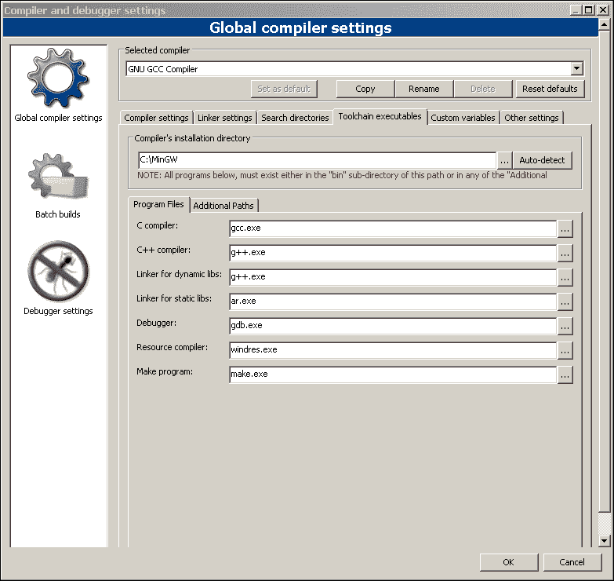

1.  切换到 **工具链可执行文件** 选项卡。指定 MinGW 软件安装目录及其实用程序可执行文件名。

执行以下操作以在 Code::Blocks IDE 中创建一个新的基于 MinGW 的项目：

1.  运行 Code::Blocks IDE。您将看到主系统窗口：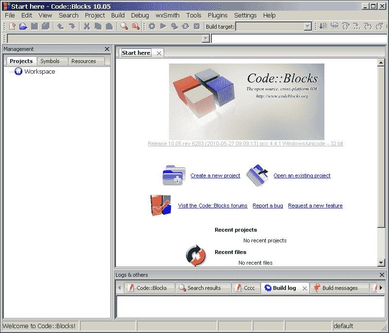

    您可以在窗口中间看到 **开始这里** 选项卡的内容。主要的 IDE 菜单位于窗口顶部。消息面板位于窗口底部。构建错误消息、构建日志、调试器消息和搜索结果将在此显示。

1.  在 **开始这里** 选项卡上单击 **创建新项目** 图标，或在主菜单中选择 **文件** | **新建** | **项目...**。

1.  在本例中，我们将创建一个模板 Windows 应用程序。在 **新建模板** 对话框中选择 **Win32GUI 项目** 图标来完成此操作。

1.  在下一个对话框中选择基于框架的项目类型。

1.  指定项目名称和存储源代码的路径。

1.  在最后一个对话框中，选择构建应用程序的编译器。默认情况下，它将等于 GNU GCC 编译器。保持不变。

您将获得基于 MinGW 的 Windows API 应用程序的模板源代码。此应用程序在启动时仅显示一个空窗口。

您可以从 **Code::Blocks IDE** 界面构建我们的示例应用程序。在主菜单中选择 **构建** | **构建**，或者按 *Ctrl* + *F9* 来执行。构建日志和构建消息将在之后的消息面板中显示。注意已执行哪个调试版本的构建。您可以通过切换主菜单中的 **构建目标** 组合框将其更改为发布版本。应用程序的可执行文件将创建在我们的项目目录的 `bin` 子目录中。

现在，应用程序已准备好运行。在主菜单中选择 **构建** | **运行**，或者按 *Ctrl* + *F10* 来运行应用程序。您将看到应用程序窗口和控制台窗口，其中将显示标准输出流消息。

Code::Blocks IDE 允许您使用 GDB 调试器调试应用程序。首先，您必须设置断点以在指定的位置停止程序执行。按 *F5* 键在源文件当前行设置断点。按 *F8* 或从主菜单中选择 **调试** | **开始** 来开始调试。之后，程序执行将在指定的行停止。现在，您可以获取有关变量、调用堆栈、CPU 寄存器和线程的信息，或者继续执行。所有这些功能都可通过 **调试** 子菜单访问。您可以使用下一个行 (*F7*) 和进入 (*Shift* + *F7*) 命令继续应用程序的调试。

### Qt Creator

Qt Creator 是一个跨平台的开源 IDE，它是 Qt 软件开发套件的一部分。它包括源代码编辑器、可视化调试器和表单设计器。它支持 MinGW 和 Visual C++ 软件。

Qt Creator 是开发基于 Qt 框架的 C++ 应用程序的最佳选择。但其他框架、工具包和编程语言的支持不佳。在选择此 IDE 进行应用程序开发时，必须考虑这个障碍。

MinGW 软件和 Qt 库不包含在 Qt Creator IDE 的发行版中，因此您必须单独安装这些软件。

以下是指示安装和配置 Qt Creator IDE 的说明：

1.  从官方网站下载 Qt Creator IDE 发行版：

    [`qt-project.org/downloads`](http://qt-project.org/downloads)

1.  在设置向导的帮助下安装 Qt Creator。只需运行下载的 exe 文件即可完成安装。运行已安装的 Qt Creator IDE。您将看到主系统窗口：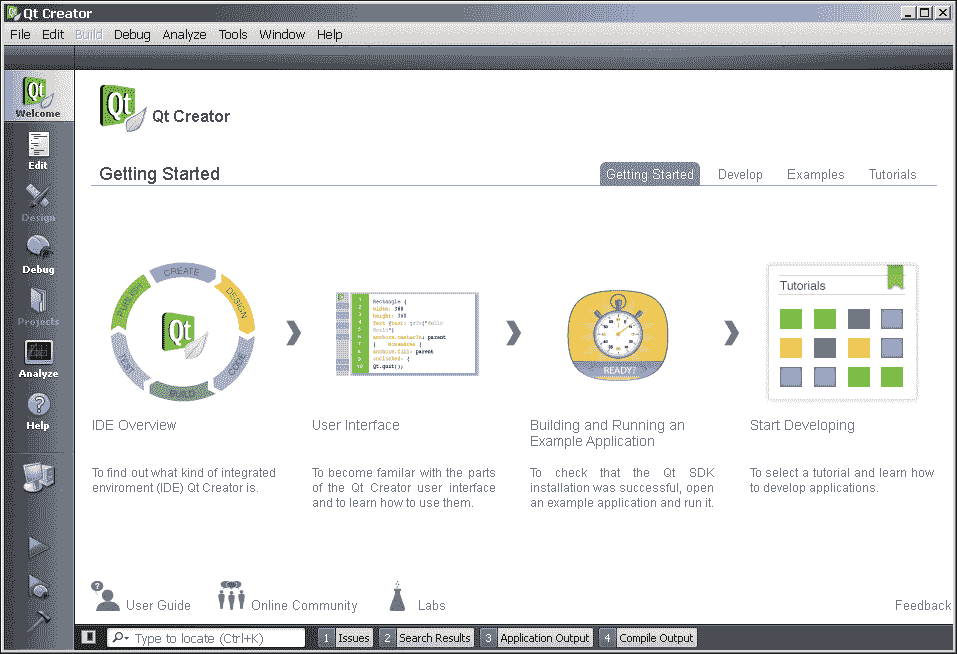

    **欢迎** 选项卡的内容放置在窗口的中间。您可以在窗口顶部看到主系统菜单。控制面板放置在窗口的左侧。最常用的命令都可用在此面板上。此外，不同 Qt Creator IDE 模式（编辑器、设计器等）的图标也放置在此处。消息输出面板位于窗口底部。

1.  在主菜单中选择 **工具** | **选项...**，您将看到 **选项** 对话框。

1.  切换到对话框面板左侧的**构建和运行**图标。

1.  切换到对话框窗口顶部的**Qt 版本**选项卡。现在你将看到以下截图：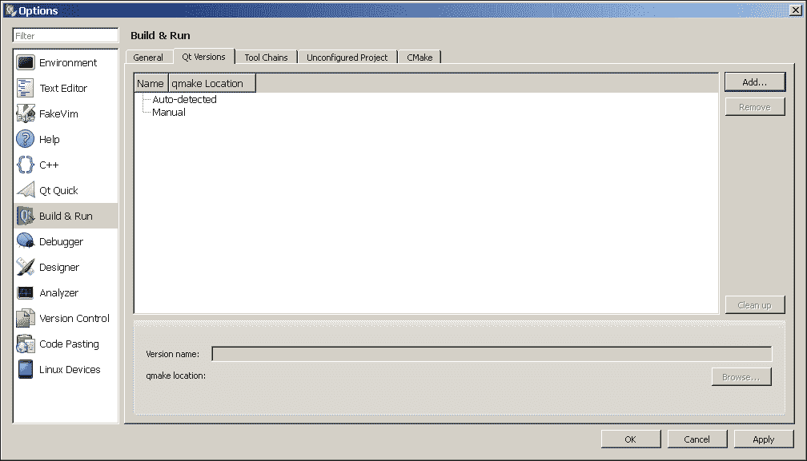

1.  点击**添加**按钮并指定`qmake.exe`文件的路径。对于默认的 Qt 库安装路径，此路径为`C:\Qt\4.6.4\bin\qmake.exe`。

1.  切换到对话框窗口顶部的**工具链**选项卡。你将看到以下截图：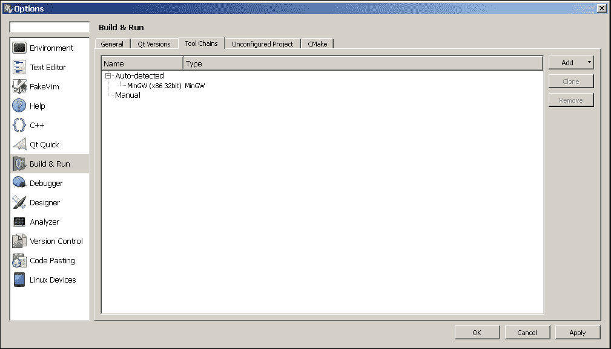

    Qt Creator 可以自动找到已安装的 MinGW 软件，但我建议你手动添加它以进行详细配置。

1.  点击**添加**按钮，并在弹出的列表中选择 MinGW 变体。

1.  点击**浏览...**按钮，该按钮位于**编译器路径**字段附近，并指定`g++.exe`文件的路径。如果 MinGW 软件已安装到`C:\MinGW4.4`目录，则此路径等于`C:\MinGW4.4\bin\g++.exe`。

1.  点击**浏览...**按钮，该按钮位于**调试器**输入字段附近，并指定`gdb.exe`文件的路径。如果你的 MinGW 软件发行版中尚未包含它，你可以单独安装 GDB 调试器。调试器路径等于`C:\MinGW4.4\bin\gdb.exe`，以我们的示例为例。

1.  点击**应用**然后**确定**按钮以完成配置。

现在，你已准备好使用集成 MinGW 软件和 Qt 库的 Qt Creator IDE 系统。请注意，你的 MinGW 软件版本必须与用于构建已安装 Qt 库的 MinGW 软件版本相同。

以下是在 Qt Creator IDE 中创建示例 Qt 应用程序的说明：

1.  从主菜单中选择**文件** | **新建文件**或**项目**。你将看到模板应用程序选择对话框。

1.  在项目类型选择字段中选择**应用程序**和**Qt Gui 应用程序**变体：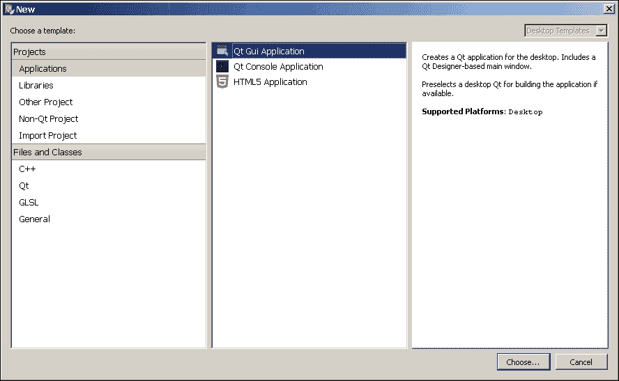

1.  点击**选择...**按钮。

1.  在**Qt Gui 应用程序**对话框的**位置**选项卡中指定项目名称（例如，`qt`）和存储源文件的路径。点击**下一步**按钮。

1.  在对话框的**目标**选项卡中选择**桌面**目标，然后点击**下一步**。

1.  你可以在**详细信息**选项卡中更改默认的源文件和类名。我建议你保持这些设置不变，以适应我们的示例应用程序。只需点击**下一步**按钮。

1.  你可以在**摘要**对话框选项卡中添加子项目和版本控制。将版本控制切换到**无**并点击**完成**按钮。

你将获得一个 Qt 应用程序模板，源文件位于指定的位置。

在控制面板的左侧点击**构建项目**图标或按*Ctrl* + *B*来构建我们的示例应用程序。`qt.exe`可执行文件将被创建在项目目录的`debug`子目录中。您可以在控制面板的项目配置子菜单中选择调试或发布构建版本（这位于**运行**图标之下）。

点击**运行**图标以启动我们的示例应用程序。您将看到一个带有状态栏和工具栏的空应用程序窗口。

Qt Creator IDE 允许您使用 GDB 调试器调试您的应用程序。这是执行此操作的标准程序；您必须在源文件行上设置断点然后开始调试。使用*F9*键设置断点，使用*F5*键开始调试。

变量的当前值、调用栈和观察点配置在调试模式下可用。您可以在 Qt Creator 主窗口的附加面板中找到所有这些信息。使用**步过**（*F10*）和**步入**（*F11*）**调试**子菜单项继续应用程序执行。

### Eclipse

Eclipse 是一个跨平台的开源 IDE，支持多语言。为这个 IDE 开发了大量的插件。Eclipse 支持许多编译器、解释器、调试器、版本控制系统、单元测试框架等等。您可以使用 Eclipse 开发任何流行编程语言和框架的应用程序。

Eclipse 是一个优秀的 IDE，适用于舒适的应用程序开发，但它是用 Java 开发的，具有庞大的架构。因此，对您计算机的性能有很高的要求。

这不是包含 MinGW 软件的 Eclipse IDE 系统分发版。您必须单独安装它以与 Eclipse 集成。

以下是在 Eclipse IDE 系统中安装和配置的说明：

1.  从官方网站下载**Java 运行时环境**（**JRE**）：

    [`www.oracle.com/technetwork/java/javase/downloads/index.html`](http://www.oracle.com/technetwork/java/javase/downloads/index.html)

1.  使用设置向导安装它。只需运行下载的 exe 文件即可。

1.  将 JRE 可执行文件路径添加到`PATH` Windows 环境变量中（例如，`C:\Program Files\Java\jre7\bin`）。

1.  从官方网站下载 Eclipse IDE for C/C++ Developers 版本存档：

    [`www.eclipse.org/downloads`](http://www.eclipse.org/downloads)

    注意您需要 32 位 Eclipse IDE 系统版本用于 32 位 JRE，64 位版本用于 64 位 JRE。

1.  将 Eclipse 存档解压到任何目录（例如，`C:\Program Files`）。

现在，您已经准备好使用 Eclipse IDE 系统。由于 Windows 环境变量的原因，MinGW 软件工具将自动集成。因此，必须指定包含可执行文件的 MinGW `bin`子目录。

以下是在 Eclipse IDE 中创建示例应用程序的说明：

1.  运行 Eclipse IDE。你会看到 **欢迎** 屏幕。

1.  从主菜单中选择 **文件** | **新建** | **C++ 项目**。你将看到以下截图所示的 项目配置对话框：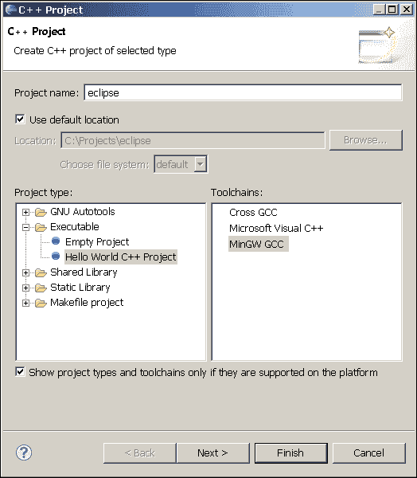

1.  在 **项目类型** 选择字段中选择 **Hello world C++ 项目** 项。在 **工具链** 选择字段中选择 **MinGW GCC** 项。点击 **下一步** 按钮。你将看到 **基本设置** 对话框。可以在这里指定作者、版权声明和源文件目录。

1.  点击 **下一步** 按钮。这是 **选择配置** 对话框。可以在这里选择调试、发布或两者都构建的配置。

1.  点击 **完成** 按钮。

之后，你将获得一个模板 C++ 控制台项目，源文件放置在项目目录的 `src` 子目录中。现在你看到的是以下截图所示的 Eclipse IDE 窗口：

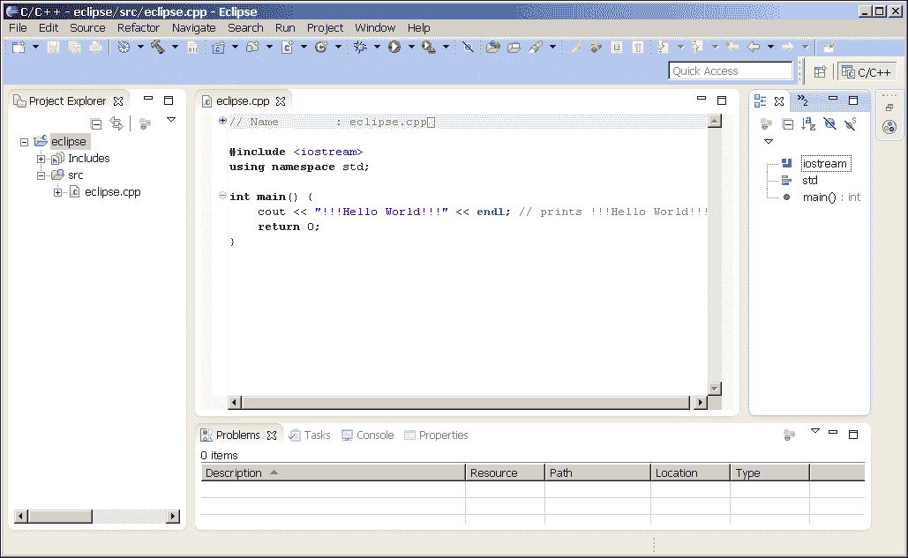

**项目资源管理器** 面板位于窗口的左侧。你可以在这里找到所有的项目源文件。源文件编辑器位于窗口的中间部分。你可以在窗口底部找到消息输出面板。

从主菜单中选择 **项目** | **构建项目** 来构建我们的示例应用程序。之后，可执行文件将创建在项目目录的 `Debug` 子目录中。你可以切换到发布配置来构建项目。点击主菜单中的构建图标（锤子图标），选择 **发布** 配置来构建。将创建一个 `Release` 子目录，其中包含编译后的可执行文件。

从主菜单中选择 **运行** | **运行** 或按 *Ctrl* + *F11* 键来启动我们的示例应用程序。你将在 Eclipse 窗口底部的控制台输出面板中看到应用程序执行的输出结果。

你可以使用 Eclipse IDE 系统进行调试。按 *Ctrl* + *Shift* + *B* 键在源文件的当前行设置断点。设置断点后，从主菜单选择 **运行** | **调试** 或按 *F11* 键开始调试。在调试模式下，你会看到包含调用栈、变量值、CPU 寄存器值、断点和加载的模块的面板。使用 **步过** (*F6*) 和 **步入** (*F5*) **运行** 子菜单项来继续应用程序执行。

# 你应该了解的人和地方

在互联网上可以找到大量关于 MinGW 软件的信息。你将从这个部分了解一些有用的资源。

## MinGW 官方网站

+   **主页**：[`www.mingw.org`](http://www.mingw.org)

+   **手册**：[`www.mingw.org/wiki/HOWTO`](http://www.mingw.org/wiki/HOWTO)

+   **Wiki**：[`www.mingw.org/wiki`](http://www.mingw.org/wiki)

+   **源代码和二进制文件**：[`sourceforge.net/projects/mingw/files/MinGW`](http://sourceforge.net/projects/mingw/%E2%80%A8files/MinGW)

+   **可用的邮件列表**: [`www.mingw.org/lists.shtml`](http://www.mingw.org/lists.shtml)

## MinGW-w64 官方网站

+   **主页**: [`mingw-w64.sourceforge.net`](http://mingw-w64.sourceforge.net)

+   **Wiki**: [`sourceforge.net/apps/trac/mingw-w64`](http://sourceforge.net/apps/trac/mingw-w64)

+   **源代码和二进制文件**: [`sourceforge.net/projects/mingw-w64/files`](http://sourceforge.net/projects/mingw-w64/files)

+   **讨论论坛**: [`sourceforge.net/projects/mingw-w64/forums/forum/723797`](http://sourceforge.net/projects/mingw-w64/forums/forum/723797)

+   **公共支持邮件列表**: [`lists.sourceforge.net/lists/listinfo/mingw-w64-public`](https://lists.sourceforge.net/lists/listinfo/mingw-w64-public)

+   **支持 IRC 频道**: [irc://irc.oftc.net/#mingw-w64](http://irc://irc.oftc.net/#mingw-w64)

## GNU 编译器集合官方网站

您可以在 GCC 官方网站上找到关于 MinGW 工具的大量有用信息：

+   **主页**: [`gcc.gnu.org`](http://gcc.gnu.org)

+   **手册和文档**: [`gcc.gnu.org/onlinedocs`](http://gcc.gnu.org/onlinedocs)

+   **Wiki**: [`gcc.gnu.org/wiki`](http://gcc.gnu.org/wiki)

+   **可用的邮件列表**: [`gcc.gnu.org/lists.html`](http://gcc.gnu.org/lists.html)

## GNU 调试器官方网站

所有关于使用 GNU 调试器调试应用程序的信息都可以在官方网站找到：

+   **主页**: [`www.gnu.org/software/gdb`](http://www.gnu.org/software/gdb)

+   **手册和文档**: [`www.gnu.org/software/gdb/documentation`](http://www.gnu.org/software/gdb/documentation)

+   **Wiki**: [`sourceware.org/gdb/wiki`](http://sourceware.org/gdb/wiki)

+   **可用的邮件列表**: [`www.gnu.org/software/gdb/mailing-lists`](http://www.gnu.org/software/gdb/mailing-lists)

## GNU Make 官方网站

+   **主页**: [`www.gnu.org/software/make`](http://www.gnu.org/software/make)

+   **手册和文档**: [`www.gnu.org/software/make/manual/html_node/index.html`](http://www.gnu.org/software/make/manual/%E2%80%A8html_node/index.html)

+   **邮件列表**: `<bug-make@gnu.org>`; `<help-make@gnu.org>`

## 文章和教程

这里您可以找到关于 MinGW 软件使用的几个有用的文章和教程：

+   [`www.cs.utah.edu/dept/old/texinfo/as/gprof.html`](http://www.cs.utah.edu/dept/old/texinfo/as/gprof.html): 这是一篇关于 gprof 分析器使用的详细文章

+   [`www.cs.colby.edu/maxwell/courses/tutorials/maketutor`](http://www.cs.colby.edu/maxwell/courses/tutorials/maketutor): 这是一个关于 GNU Make 工具的简单且具有示范性的教程

+   [`gcc.gnu.org/onlinedocs/gcc/Optimize-Options.html`](http://gcc.gnu.org/onlinedocs/gcc/Optimize-Options.html): 您将找到关于 MinGW C++ 编译器优化能力的详细信息

+   [`gcc.gnu.org/onlinedocs/gcc/Standards.html`](http://gcc.gnu.org/onlinedocs/gcc/Standards.html): 您可以找到有关编译器支持的标准的详细信息

## 社区

+   **最大的免费和开源-focused IRC 网络**: [`freenode.net`](http://freenode.net)

+   **非官方发行版**: [`nuwen.net/mingw.html`](http://nuwen.net/mingw.html); [`tdm-gcc.tdragon.net`](http://tdm-gcc.tdragon.net)

+   **几个 MinGW 开发者网站**: [`www.willus.com/mingw/colinp`](http://www.willus.com/mingw/colinp); [`www.megacz.com`](http://www.megacz.com); [`rmathew.com`](http://rmathew.com)

## Twitter

+   **Packt 出版公司**: [`twitter.com/packtopensource`](https://twitter.com/packtopensource)
