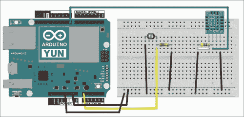
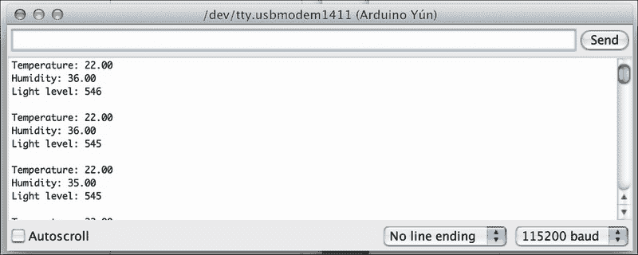
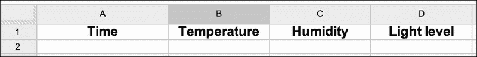
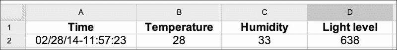
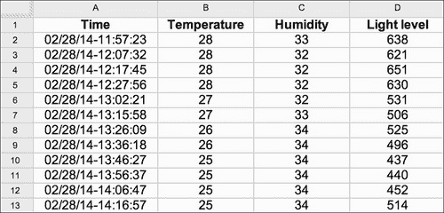
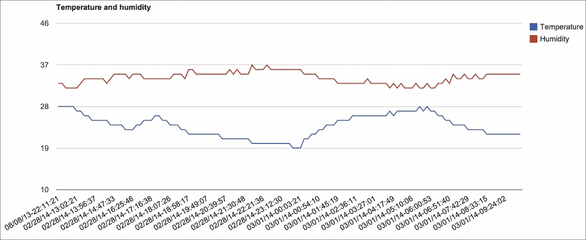
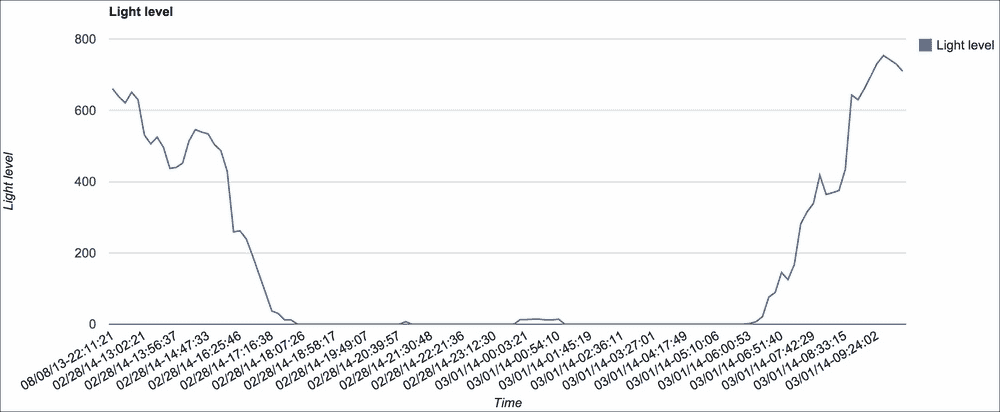

# 第一章：构建连接到云端的气象站

本章将向您介绍 Arduino Yún 微控制器板的功能。在本章中，您将学习如何创建一个简单的气象站，该气象站将使用基于 Web 的服务**Temboo**的功能将数据发送到云端。Temboo 并非完全免费，但您将能够使用他们的免费计划每月调用 Temboo 1000 次。您将学习如何将测量温度、湿度和光照水平的传感器连接到您的 Arduino Yún。这些传感器将首先分别进行测试，以确保您所做的硬件连接是正确的。

然后，我们将使用 Temboo Arduino 库将这些测量数据发送到云端和不同的 Web 服务，以便无论您在世界上的哪个地方都可以远程访问。Temboo 是一个基于 Web 的服务，允许您将不同的 Web 服务连接在一起，并为 Arduino Yún 提供现成的库。

例如，我们使用 Temboo 的第一件事是将您的测量数据发送到 Google Docs 电子表格中，其中它们将与测量数据一起记录。在这个电子表格中，您可以直接在您的网络浏览器中绘制这些数据，并看到存储在您的 Google Docs 账户中的数据。

然后，我们将再次使用 Temboo 根据记录的数据发送自动电子邮件。例如，您可能希望在室内温度降至某个水平以下时发送警报，这表明需要打开加热器。

最后，我们将使用 Temboo 在 Twitter 账户上定期发布数据，例如每分钟一次。通过这样做，我们可以为您的家庭创建一个专门的 Twitter 账户，家庭成员可以关注以获取有关您家庭的实时信息。

完成本章后，您将能够将您所学的内容应用到其他项目，而不仅仅是与气象相关的测量。您可以将本章中看到的内容应用到任何可以测量数据的项目中，以便在网络上记录这些数据并在 Twitter 上发布。

以下图片显示了 Arduino Yún 板：


# 所需的硬件和软件组件

当然，您需要在桌子上准备好您的 Arduino Yún 板和一根微型 USB 线，以便进行初始编程和测试。此外，我们建议您准备一个微型 USB 适配器电源插座，这样您可以直接从墙上为 Arduino Yún 供电，而不需要电脑在旁边。这在项目结束时将非常有用，因为您希望 Arduino Yún 板能够自主进行测量。

然后，你需要不同的传感器，这些传感器将用于感应环境数据。对于这个项目，我们将使用 DHT11 传感器来测量温度和湿度，以及一个简单的光敏电阻来测量光强度。DHT11 是一个非常便宜的数字温度和湿度传感器，广泛用于 Arduino 平台。你也可以使用 DHT22 传感器，它更精确，因为 Arduino 库对这两个传感器都是相同的。这些传感器有几个制造商，但你可以在 SparkFun 或 Adafruit 等地方轻松找到它们。对于光敏电阻，你可以使用你想要的任何品牌；只需确保它是一个根据环境光强度改变其电阻的组件。

要使 DHT11 传感器和光敏电阻工作，我们还需要一个 4.7k 欧姆电阻和一个 10k 欧姆电阻。你还需要一个至少有两排电源的小型面包板和一些公对公跳线，以便在各个组件之间进行电气连接。

在软件方面，你需要 Arduino IDE 的最新测试版，这是唯一支持 Arduino Yún 板的 IDE（我们在做这个项目时使用了版本 1.5.5）。你还需要 DHT11 传感器的 DHT 库，可以从[`github.com/adafruit/DHT-sensor-library`](https://github.com/adafruit/DHT-sensor-library)下载。

要安装库，只需解压文件并将`DHT`文件夹提取到你的主 Arduino 文件夹中的`libraries`文件夹。

# 将传感器连接到 Arduino Yún 板

在进行任何与网络相关的操作之前，我们首先确保我们的硬件能够正常工作。我们将确保不同组件之间有正确的硬件连接，并编写一个简单的 Arduino 草图来单独测试所有这些传感器。通过这样做，我们将确保你正确地完成了所有硬件连接，如果在本书下一部分使用更复杂的 Arduino 草图时遇到问题，这将非常有帮助。

我们项目所需的硬件连接实际上非常简单。我们必须通过以下步骤连接 DHT11 传感器，然后是负责光强度测量的光敏电阻部分：

1.  首先，我们将 Arduino Yún 板的+5V 引脚连接到面包板上的红色电源轨，并将地线引脚连接到蓝色电源轨。

1.  然后，我们将 DHT11 传感器的 1 号引脚连接到面包板上的红色电源轨，4 号引脚连接到蓝色电源轨。同时，将传感器的 2 号引脚连接到 Arduino Yún 板的 8 号引脚。

1.  要完成 DHT11 传感器的连接，将 4.7k 欧姆电阻夹在传感器的 1 号和 2 号引脚之间。

对于光敏电阻，首先将电阻器串联到面包板上的 10k 欧姆电阻器。这个下拉电阻器将确保在操作期间，如果没有光线，Arduino 板看到的电压将是 0V。然后，将光敏电阻的另一端连接到面包板上的红色轨道，并将电阻器的另一端连接到地。最后，将公共引脚连接到 Arduino Yún 板的模拟引脚 A0。

使用 Fritzing 软件制作的以下图像总结了硬件连接：



现在硬件连接完成，我们将测试传感器，而不上传任何内容到 Web。让我们看一下代码中的重要部分。

首先，我们必须按照以下方式导入 DHT11 传感器的库：

```cpp
#include "DHT.h"
```

然后，我们需要声明几个变量来存储测量值，如下面的代码所示。这些变量被声明为浮点数，因为 DHT 传感器库返回的是浮点数。

```cpp
int lightLevel;
float humidity;
float temperature;
```

此外，我们可以按照以下方式定义传感器引脚和传感器类型：

```cpp
#define DHTPIN 8 
#define DHTTYPE DHT11
```

按照以下方式创建 DHT 实例：

```cpp
DHT dht(DHTPIN, DHTTYPE);
```

现在，在代码的`setup()`部分，我们需要启动串行连接，如下所示：

```cpp
Serial.begin(115200);
```

接下来，为了初始化 DHT 传感器，我们有以下代码：

```cpp
dht.begin();
```

在`loop()`部分，我们将执行不同的测量。首先，我们将计算温度和湿度，如下所示：

```cpp
float humidity = dht.readHumidity();
float temperature = dht.readTemperature();
```

然后，测量光照水平，如下所示：

```cpp
int lightLevel = analogRead(A0);
```

最后，我们将在串行监视器中打印所有数据，如下面的代码所示：

```cpp
Serial.print("Temperature: ");
Serial.println(temperature);
Serial.print("Humidity: ");
Serial.println(humidity);
Serial.print("Light level: ");
Serial.println(lightLevel);
Serial.println("");
```

每 2 秒重复一次，如下所示：

```cpp
delay(2000);
```

该部分的完整代码可以在[`github.com/openhomeautomation/geeky-projects-yun/tree/master/chapter1/sensors_test`](https://github.com/openhomeautomation/geeky-projects-yun/tree/master/chapter1/sensors_test)找到。

现在是时候测试代码并将其上传到 Arduino 板上了。然后，打开串行监视器，您应该会看到来自传感器的数据，如下面的截图所示：



如果您可以看到像之前截图那样的不同测量值，这意味着您已经在面包板上正确地完成了硬件连接，并且可以继续本章的下一部分。

如果不是这样，请按照本节中的说明逐个检查所有连接。请确保你没有忘记 DHT 传感器上的 4.7k 欧姆电阻器，因为没有它，这个传感器的测量值将无法工作。

### 提示

**下载示例代码**

您可以从您在[`www.packtpub.com`](http://www.packtpub.com)的账户中下载您购买的所有 Packt 书籍的示例代码文件。如果您在其他地方购买了这本书，您可以访问[`www.packtpub.com/support`](http://www.packtpub.com/support)并注册，以便将文件直接通过电子邮件发送给您。

本书四个项目的所有最新代码也可以在 [`github.com/openhomeautomation/geeky-projects-yun`](https://github.com/openhomeautomation/geeky-projects-yun) 找到。

# 创建 Temboo 账户

本项目的下一步是在网络服务 Temboo 上创建和设置账户，这样您就可以使用 Temboo 提供的广泛服务将数据上传到 Google Docs，并使用他们的 Gmail 和 Twitter 库。实际上，这个账户将在本书的其余部分的其他项目中也会使用。

要这样做，第一步是简单地访问 Temboo 网站 [`temboo.com/`](http://temboo.com/)。

在主页上，只需输入您的电子邮件地址进行注册，然后点击 **注册**，如下面的截图所示：


然后，您将被要求输入一些关于您账户的基本信息，例如您的账户名称，如下面的截图所示：


然后，您将被提示创建您的第一个应用程序。请确保保存您账户的详细信息，例如您第一个应用程序的名称和将授予您的密钥；我们将在本书的其余部分需要它。

如果您需要再次获取这些值或创建新的应用程序，您可以通过点击以下截图所示的下方的 **MANAGE** 按钮，在 Temboo 网站的 **我的账户** 部分始终访问这些数据，就像以下截图所示：


现在，我们已经准备好开始使用为 Arduino Yún 板专门制作的 Temboo 库，并将一些数据上传到云端。

## 将数据发送到 Google Docs 并显示

在本节中，我们将使用我们的第一个 Temboo 库（称为 **Choreo**）将 Arduino Yún 的测量数据上传到网络，并将数据记录到 Google Docs 电子表格中。

首先，让我们看看什么是 Choreo 以及您如何为您的 Arduino Yún 板生成代码。如果您访问主 Temboo 页面，您会看到您可以选择不同的平台和语言，例如 Arduino、JavaScript 或 Python。每个链接都将允许您选择一个 Choreo，这是一个为所选平台编写的专用库，可以与给定的网络服务（如 Google Docs）接口。

对于 Arduino 平台，Temboo 甚至提供为您生成整个代码的服务。您可以在 Temboo 网站上点击 Arduino 图标，然后点击 Arduino Yún；您将获得一个逐步界面的访问权限来生成代码。然而，由于我们想要完全控制我们的设备并编写自己的代码，我们不会在这个项目中使用此功能。

Google Docs 真的很方便，因为它是由微软流行的 Office 软件的在线（且免费）版本。主要区别在于，因为它全部都在云端，你不需要在本地存储文件或保存它们——所有操作都在线上完成。对于我们项目来说，优势在于你可以从任何网络浏览器远程访问这些文件，即使你不在你常用的电脑上。你只需要你的 Google 账户名和密码，就可以访问所有文件。

如果你还没有 Google 账户，你可以在 [`drive.google.com/`](https://drive.google.com/) 在不到五分钟内创建一个。

这也将为 Gmail 服务创建一个账户，我们稍后也会使用它。请确保你有你的 Google Docs 用户名和密码，因为你很快就会需要它们。

在我们开始编写任何 Arduino 代码之前，我们需要准备一个将托管数据的 Google Docs 电子表格。只需在 Google Docs 账户的根目录下创建一个新的即可；你可以给它取任何你想要的名称（例如，`Yun`）。这可以通过点击 Google Docs 主页上的 **创建** 来完成。

在电子表格中，你需要设置将要记录的数据的列名；即，`时间`、`温度`、`湿度`和`光照水平`。这在上面的屏幕截图中有显示：



现在，让我们开始在 Arduino IDE 中构建 Arduino 脚本。我们首先需要导入所有必要的库，如下所示：

```cpp
#include <Bridge.h>
#include <Temboo.h>
#include <Process.h>
```

`Bridge` 库是为 Arduino Yún 板引入的，负责在 Yún 的 Linux 机器和 Atmel 处理器之间建立接口，我们的 Arduino 脚本将在其中运行。有了这个库，我们可以在 Arduino 脚本中直接使用 Linux 机器的强大功能。

将使用 `Process` 库在 Linux 端运行一些程序，而 Temboo 文件将包含所有与你的 Temboo 账户相关的信息。请进入此文件，输入与你自己的账户相对应的信息。这在上面的代码中有所体现：

```cpp
#define TEMBOO_ACCOUNT "temboo_account_name"  // Your Temboo account name 
#define TEMBOO_APP_KEY_NAME " temboo_app_name "  // Your Temboo app key name
#define TEMBOO_APP_KEY " temboo_api_key "  // Your Temboo app key
```

### 注意

注意，我们还在这段代码中包含了一个调试模式，如果你想在串行监视器上打印一些调试输出，可以将它设置为 `true`。然而，为了板的自主操作，我们建议你禁用此调试模式以节省 Yún 内部的内存。

在脚本中，我们接下来需要输入 Google Docs 的信息。你需要在这里输入你的 Google 用户名和密码，以及你想要记录数据的电子表格名称，如下面的代码所示：

```cpp
const String GOOGLE_USERNAME = "yourUserName";
const String GOOGLE_PASSWORD = "yourPassword";
const String SPREADSHEET_TITLE = "Yun";
```

在脚本的 `setup()` 部分，我们现在通过执行以下代码行来启动 Linux 机器和 Atmel 微控制器之间的桥接：

```cpp
Bridge.begin();
```

我们还在启动一个日期处理过程，这样我们也可以记录每次测量的数据，如下面的代码所示：

```cpp
time = millis();
if (!date.running())  {
  date.begin("date");
  date.addParameter("+%D-%T");
  date.run();
}
```

日期的格式将是：日期后跟时间。我们在这里使用的日期处理方法实际上是 Linux 中一个非常常见的实用工具，你可以在网上查找这个函数的文档，了解更多关于你可以使用的不同日期和时间格式。

现在，在草图的 `loop()` 部分中，我们使用以下函数连续发送测量数据：

```cpp
runAppendRow(lightLevel, temperature, humidity);
```

让我们深入了解这个函数的细节。它首先声明了我们将要使用的 Choreo（Temboo 服务）：

```cpp
TembooChoreo AppendRowChoreo;
```

前面的函数是针对 Google Docs 电子表格的特定函数，它通过在给定行上发送由逗号分隔的一组数据来工作。Temboo 连接到每个服务都有 Choreo，例如 Dropbox 和 Twitter。请参阅 Temboo 文档页面以获取有关此特定 Choreo 的详细信息。在声明 Choreo 之后，我们必须添加 Choreo 的不同参数作为输入。例如，Google 用户名，如下面的代码行所示：

```cpp
AppendRowChoreo.addInput("Username", GOOGLE_USERNAME);
```

同样，对其他所需的参数也做了同样的处理，如下面的代码所示：

```cpp
AppendRowChoreo.addInput("Password", GOOGLE_PASSWORD);
AppendRowChoreo.addInput("SpreadsheetTitle", SPREADSHEET_TITLE);
```

函数的重要部分是我们实际上格式化数据，以便它可以附加到电子表格中。记住，数据需要用逗号分隔，以便正确附加到电子表格的正确列中，如下面的代码所示：

```cpp
String data = "";
data = data + timeString + "," + String(temperature) + "," + String(humidity) + "," + String(lightLevel);
```

然后使用以下代码行执行 Choreo：

```cpp
unsigned int returnCode = AppendRowChoreo.run();
```

函数然后每 10 分钟重复一次。实际上，这些值通常在一天中缓慢变化，所以这对连续记录的数据来说是无用的。另外，记住 Temboo 的调用次数取决于你选择的计划（免费计划每月 1000 次调用，大约每小时 1 次调用）。这是使用延迟函数完成的，如下所示：

```cpp
delay(600000);
```

为了演示目的，数据每 10 分钟记录一次。但是，你可以通过更改 `delay()` 函数的参数来更改这一点。这部分完整的代码可以在 [`github.com/openhomeautomation/geeky-projects-yun/tree/master/chapter1/temboo_log`](https://github.com/openhomeautomation/geeky-projects-yun/tree/master/chapter1/temboo_log) 找到。

现在，你可以将草图上传到 Arduino Yún 板上，并打开 Google Docs 电子表格来查看发生了什么。它与 Google Docs 服务器实时同步，所以你不需要刷新任何内容。过了一会儿，你应该会看到第一组测量数据被记录下来，如下面的截图所示：



为了展示使用这个项目可以做到什么，我们使用了 Google Docs 的集成图表功能，通过我们获得的超过 24 小时的测量数据来绘制这些数据。以下截图是原始数据的一个提取：



现在，要实际绘制一些数据，您只需使用 Google Docs 的**插入图表**功能。我们为我们的数据选择了简单的**折线图**。以下截图显示了温度和湿度的结果：



我们对光级测量也做了同样的处理，如下面的截图所示：



这些图表可以自动放置到电子表格中相应的表格内，并且当然，当有新数据进来时，它们也会自动更新。您还可以使用 Google Docs 的共享功能将这些表格与任何人共享，这样他们也可以跟踪您家的测量情况。

## 创建自动电子邮件警报

在这部分，我们不仅将基于之前在 Google Docs 中做的操作，还会使用 Google 账户创建一些自动电子邮件警报。这次，我们将使用直接与 Gmail 接口的 Temboo 库，在这种情况下，将自动使用您的账户发送电子邮件。

我们将编程 Arduino Yún 板，当温度低于给定水平时向所选地址发送电子邮件，例如，表示您应该打开家中的暖气。

与之前的 Arduino 草图相比，我们需要添加目标电子邮件地址。我为了测试目的使用了我的电子邮件地址，但当然，这个目标地址可以与您的 Gmail 账户完全不同。例如，如果您想自动向负责您家的人发送电子邮件，如果发生某些情况，请执行以下代码行：

```cpp
const String TO_EMAIL_ADDRESS = "your_email_address";
```

请注意，将电子邮件发送给自己可能会被您的 Gmail 账户视为垃圾邮件。因此，建议将这些警报发送到您选择的另一个电子邮件地址，例如，为这些警报设置一个专门的账户。我们还需要在草图中设置一个温度限制。在我的项目版本中，这是 Arduino Yún 将发送电子邮件警报的温度，但当然，您可以修改这个温度限制的含义，如下面的代码行所示：

```cpp
int temperature_limit = 25.0;
```

在草图的`loop()`部分，与上一节的草图相比，我们可以在记录的温度与限制之间进行比较。这是通过一个简单的`if`语句完成的：

```cpp
if (temperature < temperature_limit) {
  if (debug_mode == true){Serial.println("Sending alert");}
    sendTempAlert("Temperature is too low!");
  }
```

然后，当温度低于限制时，会触发新的功能`sendTempAlert`，该功能会调用。该函数还接受一个字符串作为参数，这是当警报触发时将发送的消息内容。在函数内部，我们再次声明我们将使用的 Choreo 类型。这次，我们将使用的是针对 Gmail 的特定 Choreo，用于发送带有消息主题和正文的电子邮件，如下面的代码行所示：

```cpp
TembooChoreo SendEmailChoreo;
```

正如我们用来将数据记录到 Google Docs 的 Choreo 一样，这个新的 Choreo 需要一组在官方 Temboo 文档中定义的参数。我们需要指定 Choreo 的所有必需输入，例如，您可以个性化的电子邮件主题行，如下面的代码行所示：

```cpp
SendEmailChoreo.addInput("Subject", "ALERT: Home Temperature");
```

消息正文定义在以下代码行中：

```cpp
SendEmailChoreo.addInput("MessageBody", message);
```

注意，`message`变量是在草图中的`loop()`部分传递的，也可以个性化，例如，通过添加测量的温度值。最后，使用以下代码行执行 Choreo：

```cpp
SendEmailChoreo.run();
```

这一部分的完整代码可以在[`github.com/openhomeautomation/geeky-projects-yun/tree/master/chapter1/temboo_alerts`](https://github.com/openhomeautomation/geeky-projects-yun/tree/master/chapter1/temboo_alerts)找到。

现在，您可以将草图编译并更新到您的 Yún 板上。您还可以访问 Gmail 界面以检查新电子邮件。如果温度确实低于您设置的极限值，您应该在收件箱中收到以下内容：


再次，您可以玩这个草图，并根据您测量的数据创建更复杂的警报。例如，您可以将湿度和光照水平混合在一起，并为这些值创建专门的限制和警报。您还可以编程 Arduino Yún，使其在达到温度限制之前定期通过电子邮件发送数据。

# 使您的 Arduino Yún 板发送传感器数据推文

最后，在本项目的最后一部分，我们将使您的 Arduino Yún 板在 Twitter 上发送自己的消息。您甚至可以为您的 Yún 板创建一个新的 Twitter 账户，并告诉您认识的人关注它，这样他们就可以随时了解您家中的情况！

项目从 Twitter 网站开始，因为您必须在 Twitter 上声明一个新的应用。使用您的 Twitter 凭据登录，然后转到[`apps.twitter.com/`](https://apps.twitter.com/)。

现在，点击**创建新应用**以开始过程，如下面的截图所示：


您需要为您的应用起一个名字。例如，我们将其命名为`MyYunTemboo`。您需要从 Twitter 网站上获取大量信息。首先需要获取的是 API 密钥和 API 密钥。这些可以在**API 密钥**选项卡中找到，如下面的截图所示：


确保您的应用**访问级别**设置为**读取**、**写入**和**直接消息**。这可能不是默认设置，在第一次测试中，我的 Arduino 板没有再响应，因为我没有正确设置这些参数。所以，请确保您的应用具有正确的访问级别。

然后，您还需要为您的应用获取一个令牌。您可以通过访问**您的访问令牌**部分来完成此操作。从这个部分，您需要获取**访问令牌**和**访问令牌密钥**。再次确保您的令牌访问级别设置正确。

我们现在可以继续编写 Arduino 草图，以便 Arduino Yún 板可以自动发送推文。Twitter Choreo 因其占用 Yún 大量内存而闻名，因此这个草图只会发送数据而不会将数据记录到您的 Google Docs 账户中。我还建议您禁用串行端口上的任何调试消息以保留 Yún 的内存。在草图中，您首先需要定义您的 Twitter 应用信息，如下面的代码所示：

```cpp
const String TWITTER_ACCESS_TOKEN = "yourAccessToken";
const String TWITTER_ACCESS_TOKEN_SECRET = " yourAccessTokenSecret";
const String TWITTER_API_KEY = " yourApiKey";
const String TWITTER_API_SECRET = " yourApiKeySecret";
```

然后，草图将定期使用以下函数发布关于您家的数据：

```cpp
tweetAlert(lightLevel, temperature, humidity);
```

这个函数使用`delay()`函数每分钟重复一次，如下所示：

```cpp
delay(60000); 
```

当然，这个延迟可以根据您的需求进行更改。让我们看看这个函数的详细情况。它首先声明了正确的 Choreo 来发送 Twitter 上的更新：

```cpp
TembooChoreo StatusesUpdateChoreo;
```

然后，我们构建我们想要推文的文本作为字符串。在这种情况下，我们只是将传感器数据格式化在一个字符串中，如下面的代码所示：

```cpp
String tweetText = "Temperature: " + String(temperature) + ", Humidity: " + String(humidity) + ", Light level: " + String(light);
```

我们之前定义的访问令牌和 API 密钥被声明为输入：

```cpp
StatusesUpdateChoreo.addInput("AccessToken", TWITTER_ACCESS_TOKEN);
StatusesUpdateChoreo.addInput("AccessTokenSecret", TWITTER_ACCESS_TOKEN_SECRET);
StatusesUpdateChoreo.addInput("ConsumerKey", TWITTER_API_KEY);  
StatusesUpdateChoreo.addInput("ConsumerSecret", TWITTER_API_SECRET);
```

我们想要推文的文本也被简单地声明为 Twitter Choreo 的输入，使用我们之前构建的字符串变量：

```cpp
StatusesUpdateChoreo.addInput("StatusUpdate", tweetText);
```

这一部分的完整代码可以在[`github.com/openhomeautomation/geeky-projects-yun/tree/master/chapter1/temboo_twitter`](https://github.com/openhomeautomation/geeky-projects-yun/tree/master/chapter1/temboo_twitter)找到。

现在 Arduino 草图已经准备好了，我们可以对其进行测试。您只需将代码上传到您的 Arduino Yún，稍等片刻。您的板子应该会自动连接到您选择的 Twitter 流，并打印出新的消息，如下面的截图所示：


如果您的 Twitter 账户中没有显示任何内容，您可以检查几个方面。我已经提到了内存使用；尝试禁用串行端口上的调试输出以释放一些内存。同时，请确保您已经正确输入了关于您的 Twitter 应用的详细信息；在不同的 API 密钥和访问令牌之间出错是很常见的。

对于这个项目，我使用了我的专注于家庭自动化的网站上的 Twitter 账户，但当然，您可以为项目创建一个专门的 Twitter 账户，这样许多人就可以关注您家的最新更新了！

您还可以将这部分代码与上一节的想法结合起来，例如，根据测量的数据创建自动警报并在 Twitter 上相应地发布消息。

# 摘要

让我们总结一下本章所学的内容。我们基于 Arduino Yún 板构建了一个简单的气象测量站，该站能自动将数据发送到云端。

首先，你学习了如何将简单的传感器连接到你的 Arduino Yún 板，并编写一个用于 Yún 板的测试草图，以确保所有这些传感器都能正常工作。

然后，我们通过使用为 Yún 板定制的 Temboo 库，将 Arduino Yún 板与 Temboo 服务进行接口连接。使用这些库，我们在 Google Docs 电子表格中记录数据，根据我们的测量结果创建自动电子邮件警报，并将这些测量结果发布到 Twitter 上。

要进一步扩展，你可以将这个项目的不同部分组合在一起，也可以在项目的不同区域添加多个 Arduino Yún 板，例如，在你家的两个不同区域。在下一章中，我们将再次利用 Temboo 库的力量，将电力测量数据发送到网络，以便远程监控你家的能源消耗。
