# 第一章：设置英特尔 Edison

在每个**物联网**（**IoT**）或机器人项目中，我们都有一个控制器，它是整个系统的核心。同样，我们也有英特尔 Edison。英特尔 Edison 计算模块有两种不同的包装：一个是迷你断开板；另一个是 Arduino 兼容板。您可以使用板的原生状态，但在这种情况下，我们必须自己制作扩展板。Edison 基本上是 SD 卡的大小。由于其小巧的尺寸，它非常适合可穿戴设备。然而，它的功能使其适合物联网应用；更重要的是，强大的处理能力使其适合机器人应用。然而，我们并不简单地使用这种状态的设备。我们将板与扩展板连接起来。扩展板为用户提供足够的灵活性和兼容性，以便与其他单元接口。Edison 有一个操作系统，它运行整个系统。它运行 Linux 镜像。因此，要设置您的设备，您最初需要在硬件和软件级别进行配置。

在本章中，我们将介绍以下主题：

+   设置英特尔® Edison

+   设置开发者环境

+   使用 Arduino IDE、Intel XDK 和其他工具在板上运行示例程序

+   通过我们的 PC 与主板交互

# 初始硬件设置

我们将专注于随 Arduino 扩展板一起提供的 Edison 软件包。最初，您将获得两个不同的部件：

+   英特尔® Edison 主板

+   Arduino 扩展板

下图显示了设备的架构：

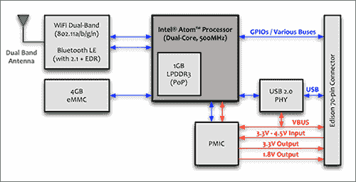

英特尔 Edison 的架构。图片来源：[`www.software.intel.com`](http://www.software.intel.com/)

我们需要将这两部分连接成一个单元。将 Edison 主板放在扩展板上，以便 GPIO 接口在一点上相遇。轻轻推压 Edison，您会听到一声点击。使用随包装提供的螺丝来紧固设置。一旦完成，我们现在将在硬件和软件级别设置设备以供进一步使用。以下是我们将详细介绍的步骤：

1.  下载必要的软件包

1.  将您的英特尔® Edison 连接到您的 PC

1.  使用 Linux 镜像刷写您的设备

1.  连接到 Wi-Fi 网络

1.  SSH 您的英特尔® Edison 设备

# 下载必要的软件包

要在这个平台上进行开发，我们需要下载并安装一些软件包，包括驱动程序和 IDE。以下是需要软件及其链接的列表：

+   英特尔®平台闪存工具 Lite ([`01.org/android-ia/downloads/intel-platform-flash-tool-lite`](https://01.org/android-ia/downloads/intel-platform-flash-tool-lite))

+   PuTTY ([`www.chiark.greenend.org.uk/~sgtatham/putty/download.html`](http://www.chiark.greenend.org.uk/~sgtatham/putty/download.html))

+   英特尔 XDK for IoT ([`software.intel.com/en-us/intel-xdk`](https://software.intel.com/en-us/intel-xdk))

+   Arduino IDE ([`www.arduino.cc/en/Main/Software`](https://www.arduino.cc/en/Main/Software))

+   FileZilla FTP 客户端 ([`filezilla-project.org/download.php`](https://filezilla-project.org/download.php))

+   Notepad ++或其他任何编辑器 ([`notepad-plus-plus.org/download/v7.3.html`](https://notepad-plus-plus.org/download/v7.3.html))

# 驱动程序和其他下载

驱动程序和其他杂项可以从以下网址下载：

+   最新 Yocto Poky 镜像

+   英特尔爱迪生 Windows 独立驱动程序

+   FTDI 驱动程序 ([`www.ftdichip.com/Drivers/VCP.htm`](http://www.ftdichip.com/Drivers/VCP.htm))

可以从[`software.intel.com/en-us/iot/hardware/edison/downloads`](https://software.intel.com/en-us/iot/hardware/edison/downloads)下载第一个和第二个软件包。 [](https://software.intel.com/en-us/iot/hardware/edison/downloads)

# 插入您的设备

软件和驱动程序安装完成后，我们将把设备连接到电脑。您需要两条 Micro-B USB 线来连接您的设备到电脑。您也可以使用 9V 电源适配器和一条 Micro-B USB 线，但现阶段我们不会使用电源适配器。电源适配器的主要用途将在本书的后续章节中介绍，特别是当我们需要与需要 USB 接口的其他设备交互时。以下图显示了英特尔爱迪生 Arduino 扩展板的各个部分：

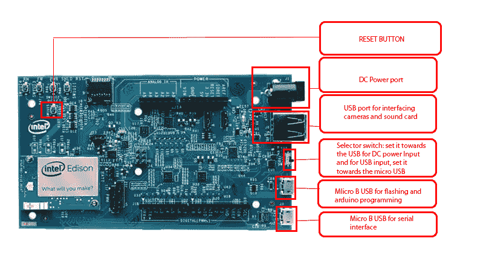

英特尔爱迪生 Arduino 扩展板的各个部分

在 USB 端口和 OTG 端口之间存在一个小开关。这个开关必须指向 OTG 端口，因为我们将从 OTG 端口为设备供电，而不是通过直流电源端口供电。一旦连接到您的电脑，打开设备管理器并展开端口部分。如果所有驱动程序的安装都成功了，您将看到两个端口：

+   英特尔爱迪生虚拟串行端口

+   USB 串行端口

# 烧录您的设备

一旦您的设备成功检测并安装，您需要使用 Linux 镜像对设备进行烧录。为此，我们将使用英特尔提供的闪存工具：

1.  打开闪存轻量级工具并将您的设备连接到电脑：

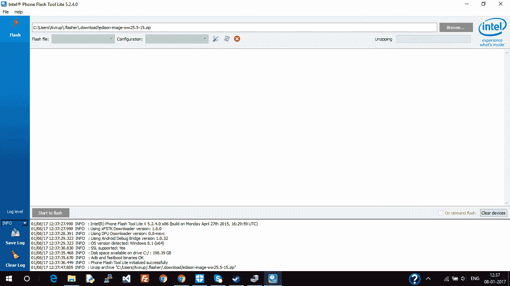

英特尔手机闪存轻量级工具

1.  打开闪存工具后，点击“浏览...”并浏览到您下载的 Linux 镜像的`.zip`文件。

1.  点击“确定”后，工具将自动解压文件。

1.  接下来，点击“开始”以进行烧录：

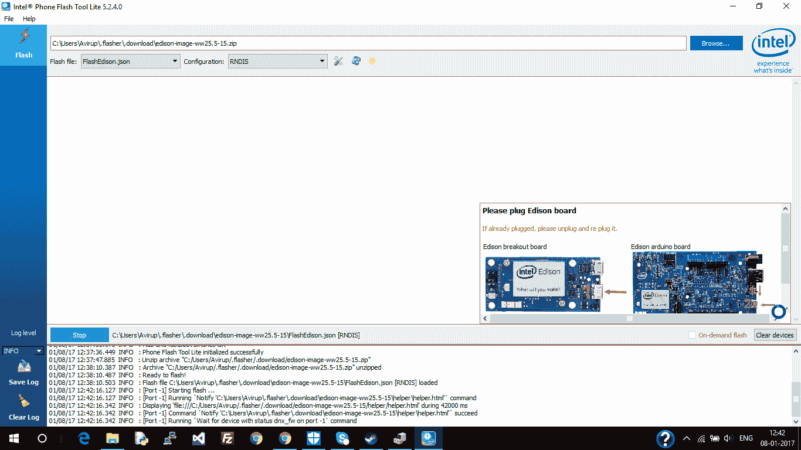

Intel® Phone flash lite tool — stage 1

1.  您将被要求断开并重新连接您的设备。这样做，板子应该开始烧录。烧录完成可能需要一些时间。在此过程中不要干扰设备。

1.  烧录完成后，我们可以配置设备：

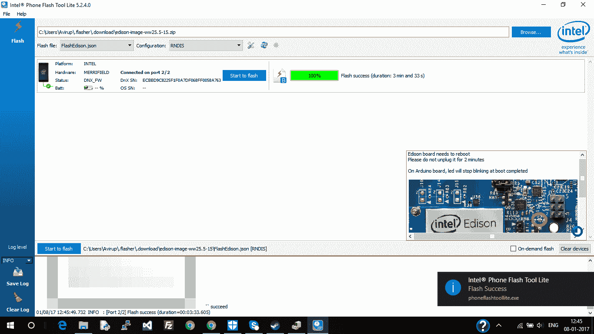

Intel® Phone flash lite 工具 — 完成

# 配置设备

焊接成功后，我们现在将配置设备。我们将使用 PuTTY 控制台进行配置。PuTTY 最初由 Simon Tatham 为 Windows 平台开发的一个 SSH 和 telnet 客户端。我们将在这里使用串行部分。

在打开 PuTTY 控制台之前，打开设备管理器并记下 USB 串行端口的端口号。这将在你的 PuTTY 控制台中使用：

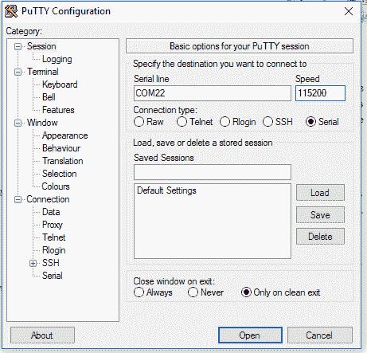

Intel® Edison 在 PuTTY 中的端口

接下来，在 PuTTY 控制台中选择串行，并输入端口号。使用波特率为`115,200`。按*Open*打开与设备通信的窗口：

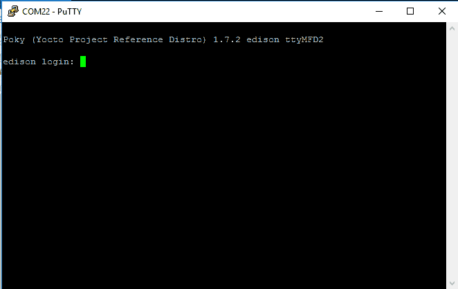

PuTTY 控制台 — 登录界面

一旦你进入 PuTTY 控制台，你可以执行命令来配置你的 Edison。以下是我们将在控制台中执行的任务集以配置设备：

1.  为你的设备提供一个名称。

1.  提供一个 root 密码（SSH 你的设备）。

1.  将你的设备连接到 Wi-Fi。

初始时，在控制台中，你会被要求登录。输入`root`并按*Enter*键。你会看到 root@edison，这意味着你已经在`root`目录下：

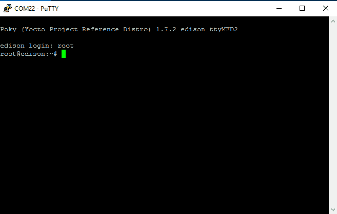

PuTTY 控制台 — 登录成功

现在，我们进入了设备的 Linux 终端。首先，我们将输入以下命令进行设置：

```cpp
configure_edison -setup

```

输入命令后按*Enter*键，整个配置将非常直接：

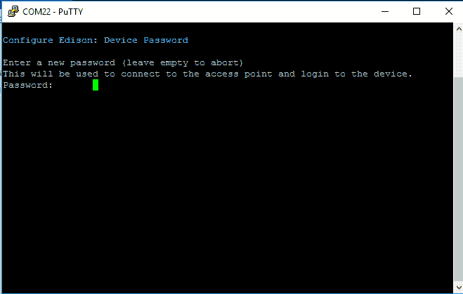

PuTTY 控制台 — 设置密码

首先，你会被要求设置一个密码。输入一个密码并按*Enter*键。你需要再次输入你的密码以进行确认。接下来，我们将为设备设置一个名称：

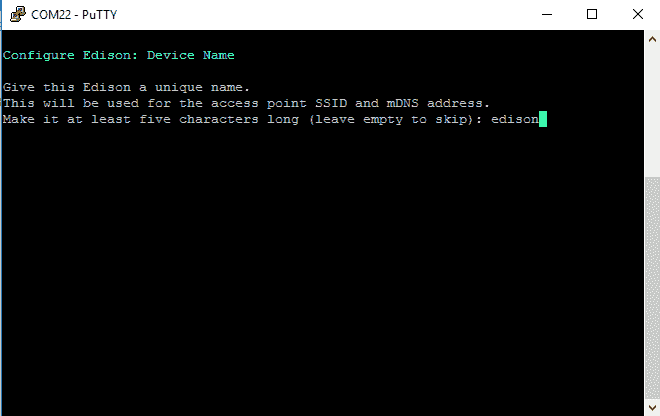

PuTTY 控制台 — 设置名称

为你的设备提供一个名称。请注意，这并不是你的设备的登录名。它只是你的设备的别名。此外，名称至少应该有五个字符长。一旦你输入了名称，它会要求你确认：按*y*进行确认。然后它会要求你设置 Wi-Fi。再次选择*y*继续。设置 Wi-Fi 不是强制性的，但建议这样做。我们需要 Wi-Fi 进行文件传输、下载软件包等：

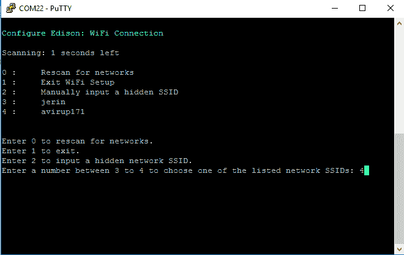

PuTTY 控制台 — 设置 Wi-Fi

一旦扫描完成，我们会得到一个可用网络列表。选择与你的网络对应的数字并按*Enter*键。在这种情况下，是`5`，对应 avirup171，这是我使用的 Wi-Fi。输入网络凭据。完成这些操作后，你的设备将连接到 Wi-Fi。设备连接后，你应该会得到一个 IP 地址：

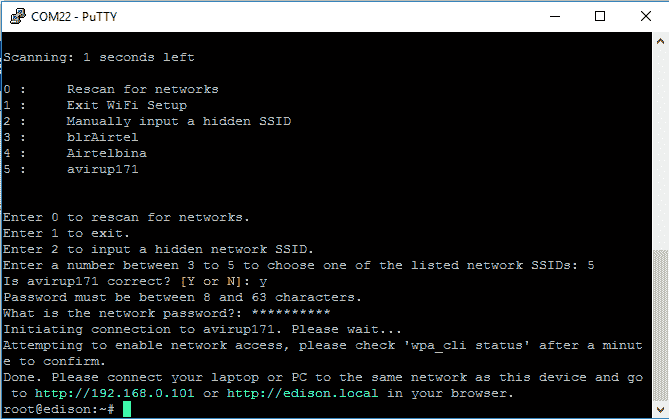

PuTTY 控制台 — 设置 Wi-Fi -2

连接成功后，你应该会看到这个屏幕。确保你的 PC 连接到相同的网络。在你的 PC 上打开浏览器，并输入控制台中显示的 IP 地址。你应该会看到一个类似的屏幕：

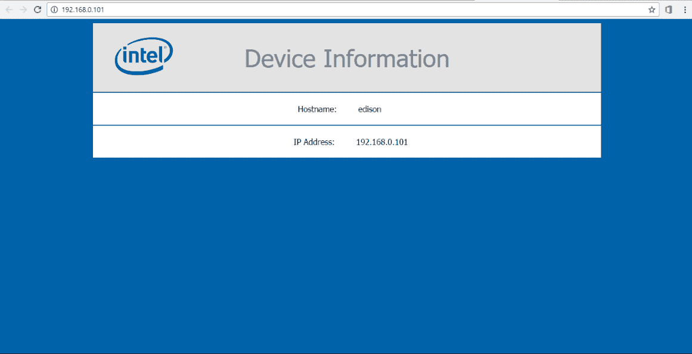

Wi-Fi 设置 — 完成

现在，我们已经完成了初始设置。然而，Wi-Fi 设置通常不会一次性完成。有时您的设备无法连接到 Wi-Fi，有时我们无法获取之前显示的页面。在这些情况下，您需要启动 `wpa_cli` 来手动配置 Wi-Fi。

有关详细信息，请参阅以下链接：

[英特尔支持](http://www.intel.com/content/www/us/en/support/boards-and-kits/000006202.html)

Wi-Fi 设置完成后，我们可以继续设置我们的开发环境。我们将介绍以下编程语言及其相应的 IDE：

+   Arduino 处理器语言（C/C++）

+   Python

+   Node.js

# Arduino IDE

Arduino IDE 是一个著名且广泛使用的集成开发环境，它不仅涵盖了 Arduino 板，还包括英特尔的其他许多板，如 Galileo、Edison、Node MCU 等。该语言基于 C/C++。一旦您从本章开头提到的链接下载了 Arduino IDE，您可能不会收到 Edison 板的软件包。我们需要从 IDE 本身手动下载该软件包。为此，打开您的 Arduino IDE，然后转到工具 | 板： "Arduino/Genuino Uno" | 板管理器...：

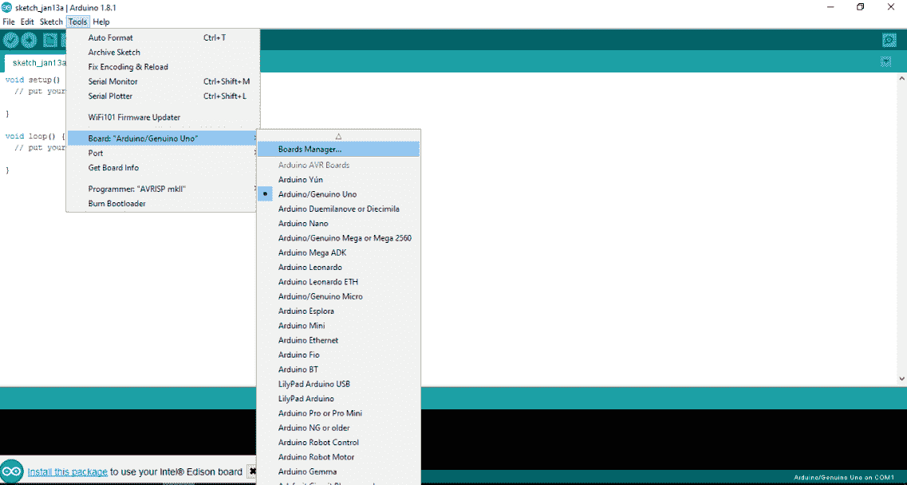

Arduino IDE

您现在需要点击板管理器并选择英特尔 i686 板。点击版本号，然后点击安装。板管理器是 IDE 的一个极其重要的组件。我们使用板管理器来添加外部兼容 Arduino 的板：

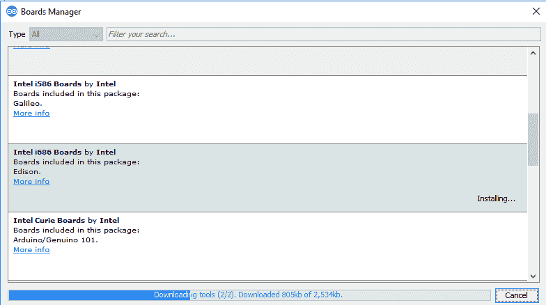

板管理器

一旦安装，您应该会在工具 | 板下看到您的板：

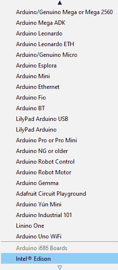

板安装成功

一旦成功安装，您现在将能够使用 IDE 编程设备。像每个入门程序一样，我们还将烧录一个简单的程序到英特尔 Edison，使其以我们设定的间隔闪烁板上的 LED。通过这种方式，使用 Arduino IDE 的程序基本结构也将变得清晰。当我们最初打开 IDE 时，我们得到两个函数：

+   `void setup()`

+   `void loop()`

设置函数是我们声明引脚是否要配置为输出模式或输入模式的地方。我们还在设置方法中启动各种其他服务，例如串行端口通信。根据用例，实现方式会有所不同。循环方法是指代码在无限序列中重复执行的段。我们的主要逻辑在这里。现在我们需要以 1 秒的间隔闪烁一个 LED：

```cpp
#define LED_PIN 13 
void setup() 
  { 
    pinMode(LED_PIN, OUTPUT); 
  } 

void loop() 
  { 
    digitalWrite(LED_PIN, HIGH); 
    delay(1000); 
    digitalWrite(LED_PIN, LOW); 
    delay(1000); 
  } 

```

在前面的代码中，行`#define LED_PIN 13`是一个用于定义 LED 引脚的宏。在 Arduino 扩展板上，一个 LED 和一个电阻已经连接到`pin 13`，因此我们现在不需要连接任何额外的 LED。在`setup`函数中，我们使用`pinMode`函数和两个参数定义了引脚的配置为输出。在`loop`函数中，我们最初使用`digitalWrite`函数和两个参数将引脚设置为高，然后定义了一个 1,000 毫秒的延迟，相当于 1 秒。延迟后，我们将引脚设置为低，然后再次定义一个 1 秒的延迟。前面的代码解释了在 Arduino IDE 中编写的 Arduino 代码的基本结构。

要将此程序烧录到 Edison 设备上，首先使用编译按钮编译代码，然后选择设备的端口号，最后点击上传按钮上传代码：

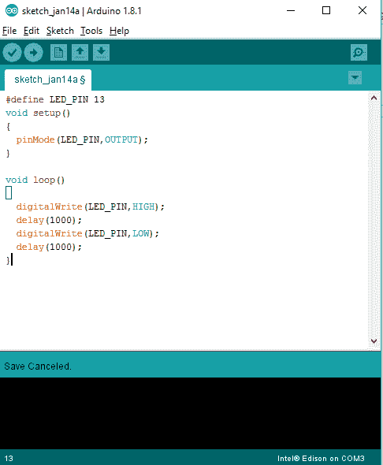

Arduino IDE — 闪烁

端口号可以在“工具 | 端口”下选择。

现在我们知道了如何使用 Arduino 编程，让我们看看它实际上是如何工作的，或者 Arduino IDE 内部发生了什么。

在上传代码的过程中，实际上会发生一系列步骤：

1.  首先，Arduino 环境执行一些小的转换，以确保代码是正确的 C 或 C++（两种常见的编程语言）。

1.  接着，它被传递给一个编译器（`avr-gcc`），将可读性代码转换为机器可读指令（或目标文件）。

1.  然后，你的代码将与标准 Arduino 库（链接到）结合，这些库提供了基本功能，例如`digitalWrite()`或`Serial.print()`。结果是单个 Intel hex 文件，其中包含需要写入 Arduino 板上芯片程序内存的特定字节。

1.  然后，该文件被上传到板子上，通过 USB 或串行连接通过芯片上已存在的引导加载程序或外部编程硬件进行传输。

# Python

Edison 也可以用 Python 编程。代码需要在设备上直接运行。我们可以直接使用任何编辑器（如 VI 编辑器）编程设备，或者首先在 PC 上编写代码，然后使用任何 FTP 客户端（如 FileZilla）传输。这里我们首先使用 Notepad++编写代码，然后传输脚本。这里我们也将执行一个简单的脚本，该脚本将使板载 LED 闪烁。在处理 Python 和硬件时，我们需要使用 MRAA 库来与 GPIO 引脚接口。这是一个用于 GNU/Linux 平台通信的低级骨架库。它支持几乎所有广泛使用的基于 Linux 的板子。因此，最初您需要在板上安装这个库。

打开 PuTTY 并登录到您的设备。登录后，我们将添加 AlexT 的非官方`opkg`仓库。

要做到这一点，请使用 VI 编辑器将以下行添加到`/etc/opkg/base-feeds.conf`中：

```cpp
src/gz all http://repo.opkg.net/edison/repo/all
src/gz edison http://repo.opkg.net/edison/repo/edison src/gz core2-32 http://repo.opkg.net/edison/repo/core2-32

```

接下来，通过执行以下命令更新包管理器并安装 git：

```cpp
opkg update
opkg install git  

```

我们将从 GitHub 克隆 Edison-scripts 以简化某些事情：

```cpp
git clone https://github.com/drejkim/edison-scripts.git ~/edison-scripts

```

接下来，我们将`~/edison-scripts`添加到路径中：

```cpp
echo 'export PATH=$PATH:~/edison-scripts' >> ~/.profile
source ~/.profile

```

现在，我们将运行以下脚本以完成此过程。请注意，前面的步骤不仅会为 MRAA 配置设备，还会为本书中的后续项目设置环境。

首先，运行以下脚本。只需输入：

```cpp
resizeBoot.sh
Then go for 
installPip.sh

```

之前的包是 Python 包管理器。这将在本书的后续部分中用于安装必要的 Python 包。最后，我们将通过执行以下命令安装 Mraa：

```cpp
installMraa.sh

```

MRAA 是 GNU/Linux 平台上的低级骨架库，用于通信。`Libmraa`是一个 C/C++库，具有与 Java、Python 和 JavaScript 的绑定，用于与 Galileo、Edison 和其他平台上的 IO 接口。简单来说，它允许我们在 IO 引脚上操作。

完成前面的步骤后，我们可以开始编写 Python 代码。为此，打开任何代码编辑器，例如 Notepad++，并输入以下代码：

```cpp
import mraa 
import time 

led = mraa.Gpio(13)
led.dir(mraa.DIR_OUT)

while True:
        led.write(1)
        time.sleep(0.2)
        led.write(0)
        time.sleep(0.2) 

```

请将前面的代码保存为`.py`扩展名，例如`blink.py`，现在，我们将逐行解释它。

初始时，使用导入语句，我们导入两个库：MRAA 和 time。MRAA 是用于与 GPIO 引脚接口的底层骨架库：

```cpp
led = mraa.Gpio(13)
led.dir(mraa.DIR_OUT)

```

在这里，我们初始化 LED 引脚并将其设置为输出模式：

```cpp
while True:
        led.write(1)
        time.sleep(0.2)
        led.write(0)
        time.sleep(0.2) 

```

在前面的块中，我们将我们的主要逻辑放在一个无限循环块中。现在，我们将将其传输到我们的设备。为此再次进入 PuTTY 控制台，并输入`ifconfig`。在`wlan0`部分下，记下你的 IP 地址：

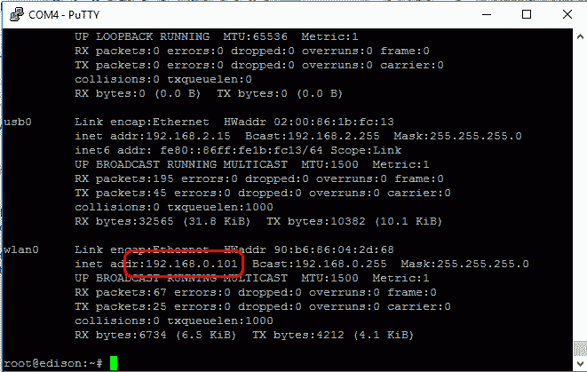

要使用的 IP 地址

现在打开 FileZilla 并输入你的凭据。确保你的设备和你的 PC 在同一个网络中：

+   主机：根据前面的截图获取的 IP 地址：`192.168.0.101`

+   用户名：`root`，因为你将登录到根目录

+   密码：你的 Edison 密码

+   端口：`22`

输入后，你将获得设备的文件夹结构。现在，我们将从我们的 PC 将 Python 代码传输到设备。为此，只需在 Windows 资源管理器中找到你的`.py`文件，并将其拖放到 FileZilla 控制台 Edison 文件夹中。目前，只需将文件粘贴到`root`目录下。一旦这样做并且成功，通过访问 PuTTY 控制台并执行`ls`命令，文件应该在你的 Edison 设备中可见。

另一种选择是在 FileZilla 的左侧找到你的文件；一旦找到，只需右键单击文件并点击上传。以下是 FileZilla 窗口的典型截图：

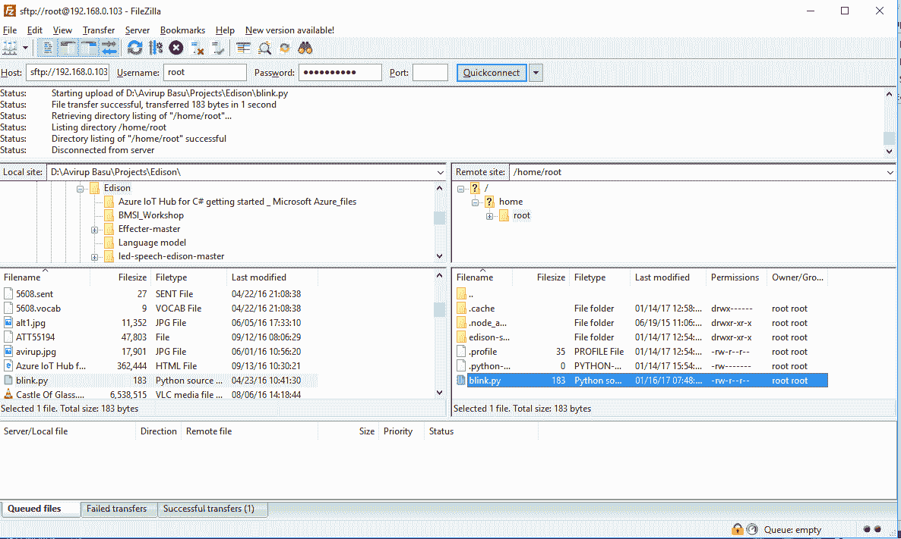

FileZilla 应用程序

一旦传输并成功使用`ls`命令列出，我们将运行脚本。要运行脚本，在 PuTTY 控制台中，转到你的`root`目录，并输入以下命令：

```cpp
python blink.py

```

如果文件存在，那么您应该会在设备上看到 LED 闪烁。恭喜！您已经在 Edison 板上成功编写了 Python 脚本。

# Intel XDK for IoT (Node.js)

我们还将介绍另一个 IDE，这是英特尔强大的跨平台开发工具：Intel XDK。这将用于运行我们的 Node.js 脚本。理想情况下，我们从 XDK 运行 Node.js 脚本，但始终有选项通过使用 FTP 客户端（如 FileZilla）将`.js`文件传输到您的设备，并使用`node FileName.js`来运行您的脚本。从本章开头提供的下载软件列表中下载并安装 XDK，然后打开它。您可能需要登录到英特尔开发者区。完成后，打开您的 XDK。然后，在物联网嵌入式应用程序下，选择一个空白物联网 Node.js 模板：

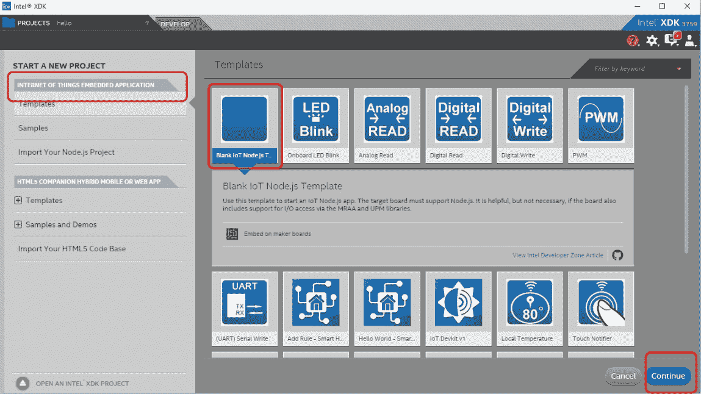

XDK 截图

一旦打开，将所有现有代码替换为以下代码：

```cpp
var m = require('mraa'); //require mraa 
console.log('MRAA Version: ' + m.getVersion()); //write the mraa version to the console 

varmyLed = new m.Gpio(13); //LED hooked up to digital pin 13 (or built in pin on Galileo Gen1 & Gen2 or Edison) 
myLed.dir(m.DIR_OUT); //set the gpio direction to output 
varledState = true; //Boolean to hold the state of Led 

functionperiodicActivity() 
  { 
    myLed.write(ledState?1:0);
    ledState = !ledState; 
    setTimeout(periodicActivity,1000); 
  }
periodicActivity(); //call the periodicActivity function 

```

如果您仔细查看代码，可能会注意到代码的结构与其他两个平台的大致相似。我们最初导入`MRAA`库：

```cpp
var m = require('mraa');
console.log('MRAA Version: ' + m.getVersion());  

```

我们还显示安装的`MRAA`版本（您可以跳过此步骤）。下一个任务是初始化和配置引脚为输出或输入模式：

```cpp
varmyLed = new m.Gpio(13); 
myLed.dir(m.DIR_OUT); 
varledState = true;

```

我们使用`ledState`来获取 LED 的当前状态。接下来，我们定义一个单独的函数来闪烁逻辑：

```cpp
functionperiodicActivity() 
  { 
    myLed.write(ledState?1:0);
    ledState = !ledState; 
    setTimeout(periodicActivity,1000); 
  } 
periodicActivity(); 

```

最后，我们调用函数。仔细检查代码，很明显我们只使用了一个毫秒级的延迟，因为我们使用三元运算符检查当前状态。为了在设备上执行代码，我们首先需要连接我们的设备。

要将您的设备连接到 XDK，请转到物联网设备部分，然后点击下拉菜单。您可能会在下拉菜单中看到您的设备。如果您看到了，请点击连接：

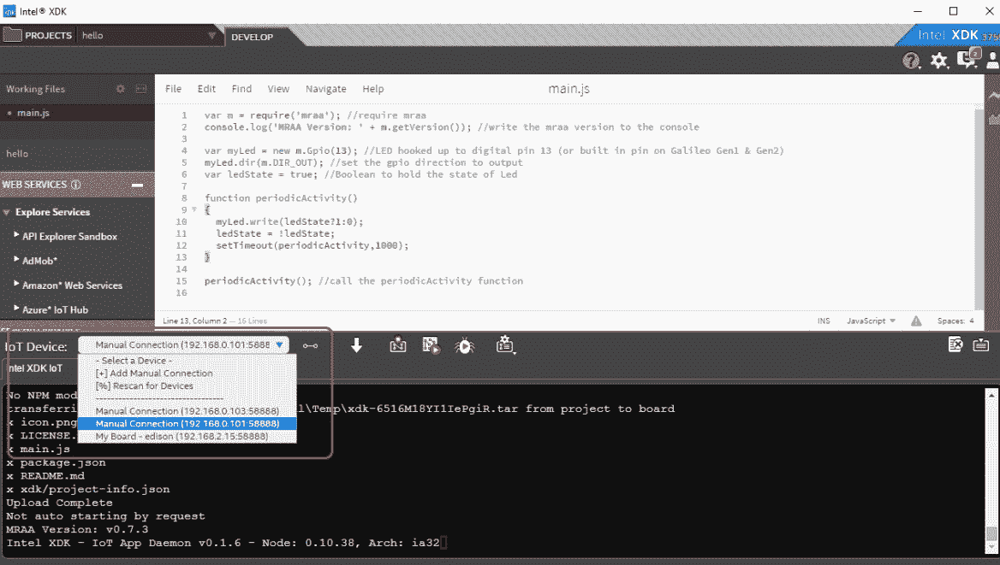

XDK 截图 — 连接面板

如果设备未列出，则需要添加手动连接。点击添加手动连接，然后添加凭证：

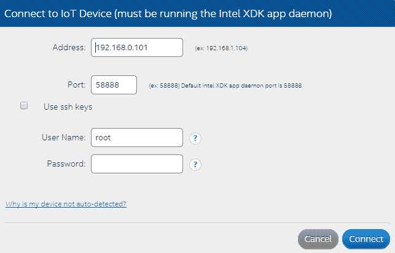

手动连接截图

在地址中，输入 FileZilla 中使用的 IP 地址。在用户名中插入`root`，密码是之前设置的密码。点击连接，您的设备应该会连接。点击上传以上传程序，点击运行以运行程序：

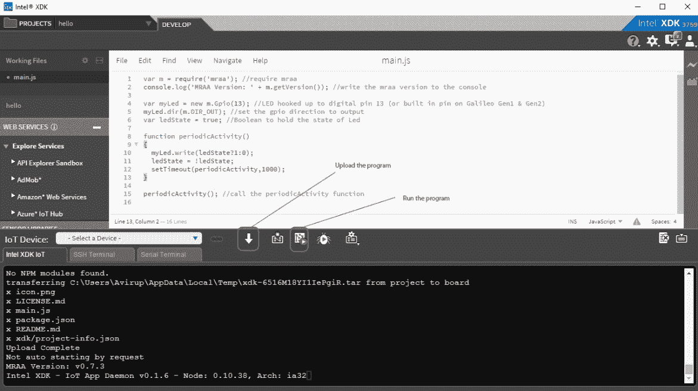

上传和执行代码截图

上传后，连接到`13`引脚的 LED 应该闪烁。通常，在处理复杂项目时，我们选择空白模板，以便更容易自定义并完成所需的工作。

更多示例和 XDK 的详细信息可在：[`software.intel.com/en-us/getting-started-with-xdk-and-iot`](https://software.intel.com/en-us/getting-started-with-xdk-and-iot)

# 摘要

在本章中，我们介绍了英特尔爱迪生的初始设置以及如何将其配置到网络中。我们还探讨了如何将文件传输到爱迪生以及从爱迪生传输文件，并设置了 Arduino、Python 和 Node.js 的开发环境。我们进行了一些示例编程，例如闪烁 LED 灯，使用了这三个平台。通过这个过程，我们对操作爱迪生和开发简单到复杂的项目有了相当的了解。

在第二章《气象站（物联网）》，我们将构建一个迷你气象站，并能够将项目部署在英特尔爱迪生（Intel Edison）上。
