# 第三章：英特尔爱迪生和物联网（家庭自动化）

在第二章，*气象站（物联网）*，我们处理了从爱迪生到云平台的数据传输。在这里，在本章中，我们将做相反的事情。我们将通过互联网控制设备。当我们谈论物联网时，通常首先想到的是家庭自动化。家庭自动化基本上是通过一个接口来控制和监控家用电器，这个接口可能是一个移动应用程序、一个网页界面、一个墙面触摸单元，或者更简单地说，是你的声音。因此，在本章中，我们将处理使用 MQTT 协议的家庭自动化的各种概念；然后，我们将使用 Android 应用程序和**Windows 演示基础**（**WPF**）应用程序通过 MQTT 协议控制一个电负载。我们将讨论的一些主题包括：

+   使用互联网 MQTT 协议控制设备的各种概念

+   使用爱迪生通过 MQTT 协议推送数据和获取数据

+   使用 MQTT 协议控制 LED

+   使用 MQTT 协议的家庭自动化用例

+   控制器应用在 Android（MyMqtt）和 WPF（待开发）

本章将使用一个名为 MyMqtt 的配套应用程序，该应用程序可以从 Play 商店下载。感谢开发者（Instant Solutions）开发此应用程序并将其免费上传到 Play 商店。MyMqtt 可以在这里找到：[h](https://play.google.com/store/apps/details?id=at.tripwire.mqtt.client&hl=en)[t](https://play.google.com/store/apps/details?id=at.tripwire.mqtt.client&hl=en)[t](https://play.google.com/store/apps/details?id=at.tripwire.mqtt.client&hl=en)[p](https://play.google.com/store/apps/details?id=at.tripwire.mqtt.client&hl=en)[s](https://play.google.com/store/apps/details?id=at.tripwire.mqtt.client&hl=en)[://p](https://play.google.com/store/apps/details?id=at.tripwire.mqtt.client&hl=en)[l](https://play.google.com/store/apps/details?id=at.tripwire.mqtt.client&hl=en)[a](https://play.google.com/store/apps/details?id=at.tripwire.mqtt.client&hl=en)[y](https://play.google.com/store/apps/details?id=at.tripwire.mqtt.client&hl=en)[.](https://play.google.com/store/apps/details?id=at.tripwire.mqtt.client&hl=en)[g](https://play.google.com/store/apps/details?id=at.tripwire.mqtt.client&hl=en)[o](https://play.google.com/store/apps/details?id=at.tripwire.mqtt.client&hl=en)[o](https://play.google.com/store/apps/details?id=at.tripwire.mqtt.client&hl=en)[g](https://play.google.com/store/apps/details?id=at.tripwire.mqtt.client&hl=en)[l](https://play.google.com/store/apps/details?id=at.tripwire.mqtt.client&hl=en)[e](https://play.google.com/store/apps/details?id=at.tripwire.mqtt.client&hl=en)[.](https://play.google.com/store/apps/details?id=at.tripwire.mqtt.client&hl=en)[c](https://play.google.com/store/apps/details?id=at.tripwire.mqtt.client&hl=en)[o](https://play.google.com/store/apps/details?id=at.tripwire.mqtt.client&hl=en)[m](https://play.google.com/store/apps/details?id=at.tripwire.mqtt.client&hl=en)[/s](https://play.google.com/store/apps/details?id=at.tripwire.mqtt.client&hl=en)[t](https://play.google.com/store/apps/details?id=at.tripwire.mqtt.client&hl=en)[o](https://play.google.com/store/apps/details?id=at.tripwire.mqtt.client&hl=en)[r](https://play.google.com/store/apps/details?id=at.tripwire.mqtt.client&hl=en)[e](https://play.google.com/store/apps/details?id=at.tripwire.mqtt.client&hl=en)[/a](https://play.google.com/store/apps/details?id=at.tripwire.mqtt.client&hl=en)[p](https://play.google.com/store/apps/details?id=at.tripwire.mqtt.client&hl=en)[p](https://play.google.com/store/apps/details?id=at.tripwire.mqtt.client&hl=en)[s](https://play.google.com/store/apps/details?id=at.tripwire.mqtt.client&hl=en)[/d](https://play.google.com/store/apps/details?id=at.tripwire.mqtt.client&hl=en)[e](https://play.google.com/store/apps/details?id=at.tripwire.mqtt.client&hl=en)[t](https://play.google.com/store/apps/details?id=at.tripwire.mqtt.client&hl=en)[a](https://play.google.com/store/apps/details?id=at.tripwire.mqtt.client&hl=en)[i](https://play.google.com/store/apps/details?id=at.tripwire.mqtt.client&hl=en)[l](https://play.google.com/store/apps/details?id=at.tripwire.mqtt.client&hl=en)[s](https://play.google.com/store/apps/details?id=at.tripwire.mqtt.client&hl=en)[?i](https://play.google.com/store/apps/details?id=at.tripwire.mqtt.client&hl=en)[d](https://play.google.com/store/apps/details?id=at.tripwire.mqtt.client&hl=en)[=a](https://play.google.com/store/apps/details?id=at.tripwire.mqtt.client&hl=en)[t](https://play.google.com/store/apps/details?id=at.tripwire.mqtt.client&hl=en)[.](https://play.google.com/store/apps/details?id=at.tripwire.mqtt.client&hl=en)[t](https://play.google.com/store/apps/details?id=at.tripwire.mqtt.client&hl=en)[r](https://play.google.com/store/apps/details?id=at.tripwire.mqtt.client&hl=en)[i](https://play.google.com/store/apps/details?id=at.tripwire.mqtt.client&hl=en)[p](https://play.google.com/store/apps/details?id=at.tripwire.mqtt.client&hl=en)[w](https://play.google.com/store/apps/details?id=at.tripwire.mqtt.client&hl=en)[i](https://play.google.com/store/apps/details?id=at.tripwire.mqtt.client&hl=en)[r](https://play.google.com/store/apps/details?id=at.tripwire.mqtt.client&hl=en)[e](https://play.google.com/store/apps/details?id=at.tripwire.mqtt.client&hl=en)[.](https://play.google.com/store/apps/details?id=at.tripwire.mqtt.client&hl=en)[m](https://play.google.com/store/apps/details?id=at.tripwire.mqtt.client&hl=en)[q](https://play.google.com/store/apps/details?id=at.tripwire.mqtt.client&hl=en)[t](https://play.google.com/store/apps/details?id=at.tripwire.mqtt.client&hl=en)[t](https://play.google.com/store/apps/details?id=at.tripwire.mqtt.client&hl=en)[.](https://play.google.com/store/apps/details?id=at.tripwire.mqtt.client&hl=en)[c](https://play.google.com/store/apps/details?id=at.tripwire.mqtt.client&hl=en)[l](https://play.google.com/store/apps/details?id=at.tripwire.mqtt.client&hl=en)[i](https://play.google.com/store/apps/details?id=at.tripwire.mqtt.client&hl=en)[e](https://play.google.com/store/apps/details?id=at.tripwire.mqtt.client&hl=en)[n](https://play.google.com/store/apps/details?id=at.tripwire.mqtt.client&hl=en)[t](https://play.google.com/store/apps/details?id=at.tripwire.mqtt.client&hl=en)[&h](https://play.google.com/store/apps/details?id=at.tripwire.mqtt.client&hl=en)[l](https://play.google.com/store/apps/details?id=at.tripwire.mqtt.client&hl=en)[=e](https://play.google.com/store/apps/details?id=at.tripwire.mqtt.client&hl=en)[n](https://play.google.com/store/apps/details?id=at.tripwire.mqtt.client&hl=en)

我们将开发自己的控制器，作为 WPF 应用程序，以实现协议并控制你的 Edison。

要开发 WPF 应用程序，我们将使用 Microsoft Visual Studio。您可以在[这里](https://msdn.microsoft.com/)下载它。

# 通过互联网控制设备 - 概念

当涉及到通过互联网控制设备时，一些关键因素开始发挥作用。首先，是使用的技术。这个领域有很多技术。一种快速的解决方案是使用 REST 服务，例如 HTTP `GET` 请求，我们从现有的数据库中获取数据。

这里讨论了一些解决方案。

# REST 服务

获取所需数据最常用的技术之一是通过 HTTP `GET` 调用。市场上大多数物联网平台都公开了 REST API。在那里，我们可以通过 HTTP `POST` 请求从设备向平台发送值，同时通过 HTTP `GET` 请求获取数据。实际上，在第二章“气象站（物联网）”，我们使用 `dweet.io` 从设备发送数据时，我们使用了 SDK。内部，SDK 也执行类似的 HTTP `POST` 调用来发送数据。

# 指令或警报（存在于大多数物联网平台上）

在某些物联网平台中，我们有一些现成的解决方案，我们只需要调用某个网络服务，连接就会建立。内部，它可能使用 REST API，但为了用户的便利，他们已经推出了自己的 SDK，我们在其中实现。

内部，一个平台可能遵循 REST 调用、MQTT 或 Web Sockets。然而，我们只是使用 SDK，我们不直接实现它，通过使用平台的 SDK，我们能够建立连接。这完全取决于平台。在这里，我们讨论了一种解决方案，我们使用 MQTT 协议直接控制我们的设备，而不使用任何物联网平台。

# 架构

在典型的系统中，物联网平台充当用户和控制器协议之间的桥梁，如下面的图所示：

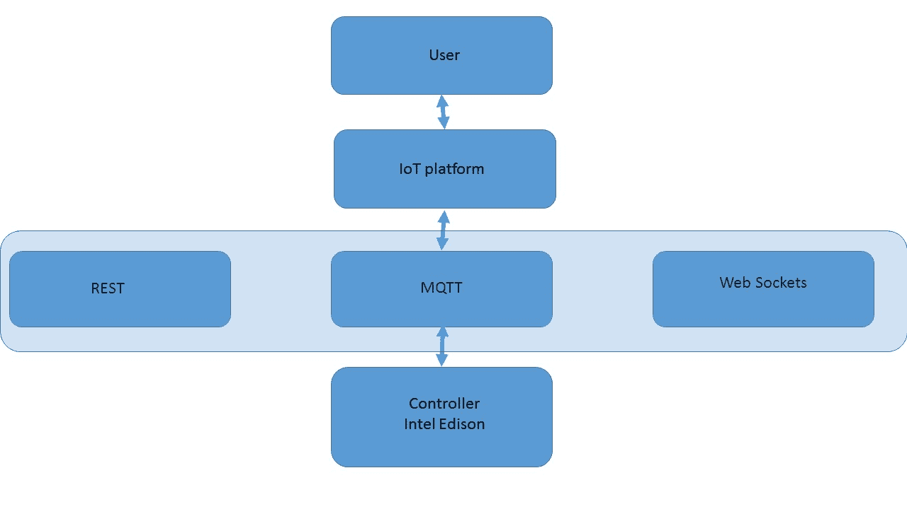

控制设备的物联网系统架构

前面的图像展示了使用互联网控制设备的典型工作流程或架构。需要注意的是，用户可以直接控制控制器，而无需使用物联网平台，就像我们在这里做的那样。然而，通常用户会使用物联网平台，它还提供了更高级别的安全性。用户可以使用任何网页界面、移动应用程序或墙面控制单元，通过任何标准协议来控制设备。在此图像中，只包括了 REST、MQTT 和 Web Sockets。然而，还有更多可以使用的协议，例如 AMQP 协议、MODBUS 协议等。协议的选择主要取决于系统的敏感性和系统需要达到的稳定性。

# MQTT 协议概述

MQTT 协议基于发布-订阅架构。它是一个非常轻量级的协议，其中消息交换是异步进行的。MQTT 协议的主要用途是在带宽和计算能力较低的地方。建立 MQTT 连接需要较小的代码占用空间。MQTT 协议中的每条通信都通过一个称为代理的中介进行。代理可以是订阅者或发布者。如果你想从爱迪生向服务器发送数据，那么你将通过代理发布数据。仪表板或应用程序使用通道凭证订阅代理，并提供数据。同样，当我们从任何应用程序控制设备时，爱迪生将作为订阅者，而我们的应用程序将作为发布者。这就是整个系统的工作方式。下面的屏幕截图解释了这一概念：


在爱迪生作为发布者的溢出情况

在前面的屏幕截图中，我们看到爱迪生作为发布者。这是一种使用案例，我们需要从爱迪生发送数据，就像在第二章中展示的类似示例，*气象站（物联网）*。应用程序将获取数据并作为发布者。下面的屏幕截图展示了本章将使用的使用案例：爱迪生作为订阅者的使用：

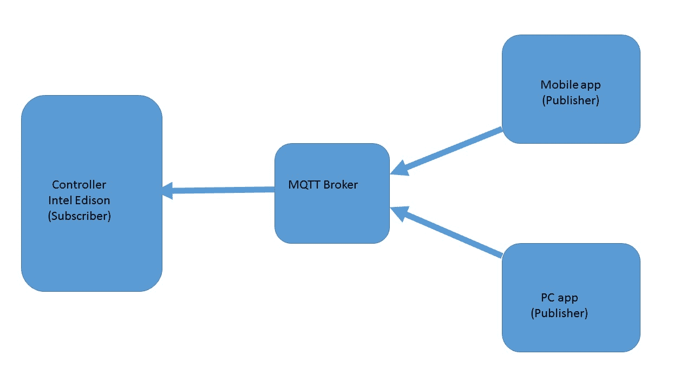

在爱迪生作为订阅者的溢出情况

在前面的案例中，我们对应用程序有一些控制。这些控制通过 MQTT 代理向爱迪生发送信号。现在，在这种情况下，应用程序将作为发布者，而爱迪生作为订阅者。

需要注意的是，在单个系统中，你可以使端点（设备或应用程序）同时作为发布者和订阅者。这种情况发生在我们想要从物联网设备（如英特尔爱迪生）获取数据，以及在紧急情况下控制设备时。同样，当我们需要控制家用电器的开关，以及远程监控它们时，也可能发生这种情况。尽管大多数系统是基于闭环反馈控制部署的，但总有远程监控的空间，同时根据从传感器接收到的反馈进行控制。

要实现 MQTT 协议，我们不会设置自己的服务器，而是使用现有的服务器。[`iot.eclipse.org/`](https://iot.eclipse.org/) 提供了一个沙盒服务器，将用于即将到来的项目。我们只需设置我们的代理，然后发布和订阅代理。对于 Intel Edison 方面，我们将使用 Node.js 及其相关库。对于应用程序端，我们将使用名为 MyMqtt 的现有 Android 应用程序。如果有人想开发自己的应用程序，则需要导入 `paho` 库来设置 MQTT。我们还在开发一个 PC 应用程序，其中我们将再次使用 MQTT 进行通信。

有关 Eclipse IoT 项目中 MQTT 和其他标准的详细信息，请参阅以下链接：

[`iot.eclipse.org/standards/`](https://iot.eclipse.org/standards/)

在下一节中，我们将为我们的项目设置和配置 Edison，并为 WPF 应用程序设置开发环境。

可以通过此链接访问 paho 项目：

[`eclipse.org/paho/`](https://eclipse.org/paho/)

# 使用 Intel Edison 通过 MQTT 协议推送数据

如前所述，本节将向用户展示如何使用 MQTT 协议从 Edison 推送数据到 Android 设备。以下截图显示了工作流程：

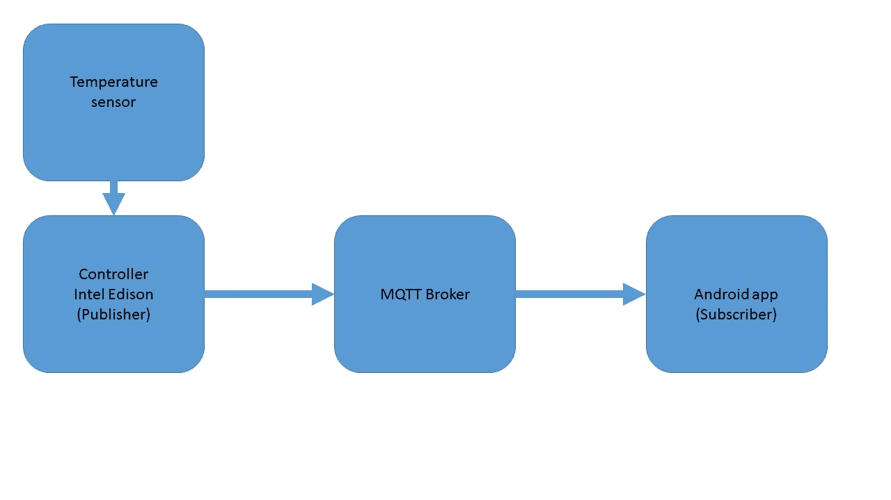

从 Edison 推送数据到 Android 应用程序的流程

从前面的示意图中可以看出，我们首先从温度传感器获取读数，然后使用 MQTT 代理将读数推送到 Android 应用程序。

首先，我们将把温度传感器连接到 Edison。参考 第二章，*气象站（物联网）* 中的电路图。连接完成后，启动您的编辑器编写以下 Node.js 代码：

```cpp
var mraa = require('mraa'); var mqtt = require('mqtt'); var B=4275;

var R0=100000;

var client = mqtt.connect('mqtt://iot.eclipse.org');
function sendData()

{

  var tempPin=new mraa.Aio(0);

//Processing of temperature var a=tempPin.read();

  var R=1023/a-1; R=100000*R;

  var temperature=1/(Math.log(R/100000)/B+1/298.15)-273.15; temperature
  = +temperature.toFixed(2);

//Converting type int to type string

  var sendTemp= temperature.toString();

//Publish the processed data client.publish('avirup/temperature',sendTemp); console.log("Sending data of temperature %d", temperature); setTimeout(sendData,1000);

}

sendData();

```

这里编写的代码与我们之前在 第二章，*气象站（物联网）* 中使用的代码类似。这里的区别是我们不是将其发送到 `dweet.io`，而是发送到 MQTT 代理。我们在 MQTT 代理的特定通道中发布获取到的数据。

然而，要执行此代码，您必须通过 `npm` 安装 MQTT 依赖项。在 PuTTY 控制台中输入以下命令：

```cpp
npm install mqtt

```

这将安装 MQTT 依赖项。

在前面的代码中，我们最初导入了所需的库或依赖项。在这种情况下，我们需要 `mraa` 和 `mqtt` 库：

```cpp
var mraa = require('mraa'); 
var mqtt = require('mqtt');

```

然后，我们需要初始化模拟引脚以读取温度。之后，我们将原始读数转换为标准值。

我们声明客户端变量，该变量将处理 MQTT 发布操作：

```cpp
var client = mqtt.connect('mqtt://iot.eclipse.org');

```

这里，[`iot.eclipse.org/`](https://iot.eclipse.org/) 是我们使用的免费代理。

接下来，在 `sendData` 函数中，在将数据发布到通道之前，计算了初始的温度处理：

```cpp
client.publish('avirup/temperature',sendTemp);

```

频道的名称是`avirup/temperature`。请注意`sendTemp`的类型。初始处理后的值存储在变量 temperature 中。在这里，在`client.publish`中，第二个参数必须是一个字符串。因此，我们将温度值存储为字符串类型在`sendTemp`中。最后，我们将温度打印到控制台。

我们还提供了一个 1 秒的延迟。现在使用`node`命令运行这个 Node.js 文件。

截图如下：

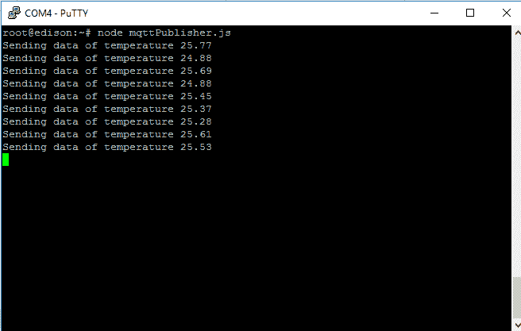

输出控制台日志

如前一个截图所示，日志被显示出来。现在我们需要在 Android MyMqtt 应用程序中看到这些数据。

在执行这个迷你项目以及随后在 MQTT 下讨论的项目时，请更改频道名称。我的一个项目可能是实时运行的，可能会引起问题。可以采用`NAME_OF_THE_USER/VARIABLE_NAME`约定。

在 Android 中打开 MyMqtt 应用程序并浏览到设置。在那里，在代理 URL 字段中插入`iot.eclipse.org`。你已经在你的 Node.js 片段中使用过这个了：

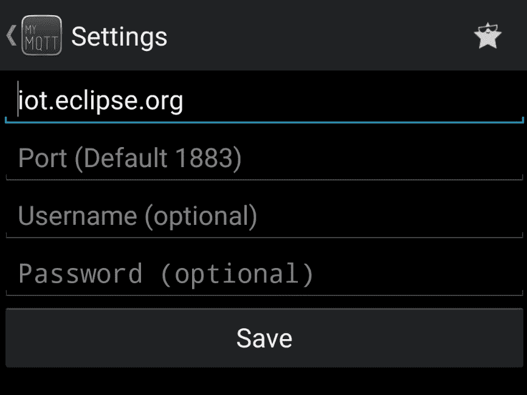

MyMqtt—1 的截图

接下来，转到“订阅”选项并输入基于你的 Node.js 代码的频道名称。在我们的例子中，它是`avirup/temperature`：

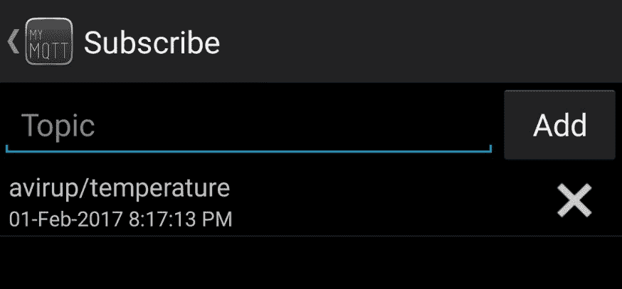

MyMqtt—2 的截图

点击添加以添加频道，然后最终转到仪表板以可视化你的数据：

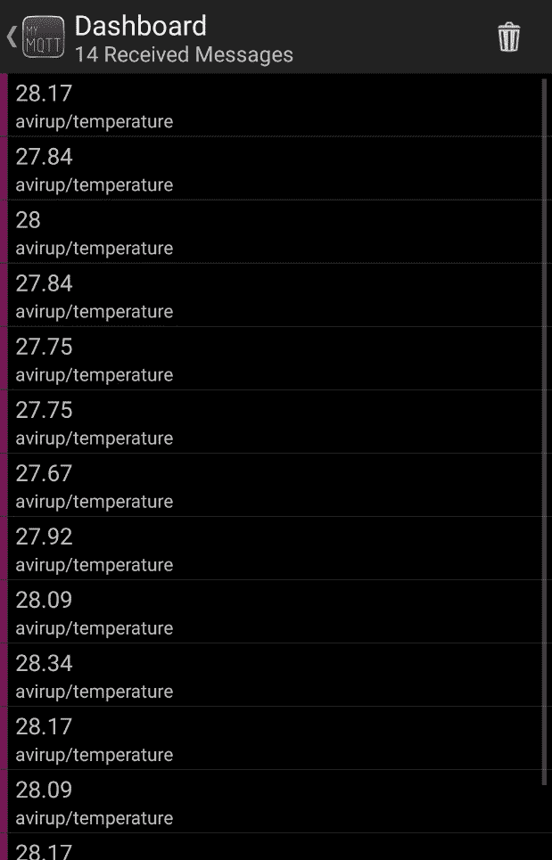

MyMqtt—3 的截图

如果你的设备上的代码与此并行运行，那么你应该在这个仪表板中获得实时数据流。

因此，现在你可以可视化从 Edison 发送的数据。

# 通过 MQTT 将数据发送到 Edison

我们一直在谈论家庭自动化控制电气负载，但每件事都有一个起点。最基本的启动器是控制通过互联网的 Edison——这就是它的全部内容。

当你有一个可以通过互联网控制的设备时，我们建议控制电气负载。在这个其他迷你项目中，我们将控制一个已经连接到 Intel Edison 的引脚`13`的简单 LED。为此不需要任何外部硬件，因为我们使用的是内置功能。现在，打开你的编辑器并输入以下代码：

```cpp
var mraa = require('mraa'); var mqtt = require('mqtt');

varledPin=new mraa.Gpio(13); ledPin.dir(mraa.DIR_OUT);

var client = mqtt.connect('mqtt://iot.eclipse.org'); client.subscribe('avirup/control/#') client.handleMessage=function(packet,callback)

{

  var payload = packet.payload.toString() console.log(payload);
  if(payload=='ON')

  ledPin.write(1); if(payload=='OFF') ledPin.write(0);
  callback();

}

```

前面的代码将订阅代理中的频道并等待接收信号。

初始时，我们将 GPIO 引脚`13`声明为输出模式，因为板载 LED 连接到这个引脚：

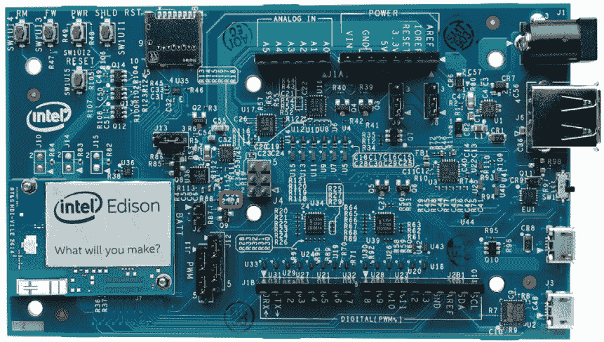

板载 LED 位置

前一个图像显示了板载 LED 的位置。

仔细查看代码，我们看到它最初导入库并设置 GPIO 引脚配置。然后，我们使用变量 client 初始化到代理的 MQTT 连接。

之后，我们继续将我们的设备订阅到频道，在这个例子中，该频道被命名为`avirup/control/#`。

我们有一个事件处理器，`handleMessage()`。此事件处理器将处理传入的消息。传入的消息将存储在包变量中。我们还实现了一个回调方法，`callback()`，它需要在 `handleMessage()` 中调用。

这使我们能够接收多条消息。请注意，与 Node.js 的其他片段不同，我们没有实现任何循环。功能实际上是由 `callback()` 方法处理的。

最后，在函数内部，我们获取有效载荷，即消息。然后将其转换为字符串，并执行条件检查。我们还打印接收到的值到控制台。

现在将此代码通过 FileZilla 推送到您的 Edison 并运行代码。

一旦运行代码，您在控制台将看不到任何内容。原因是没有任何消息。现在，转到 Android 应用程序 MyMqtt，浏览到应用程序的发布部分。

我们需要在这里插入通道名称。在这种情况下，它是 `avirup/control`：

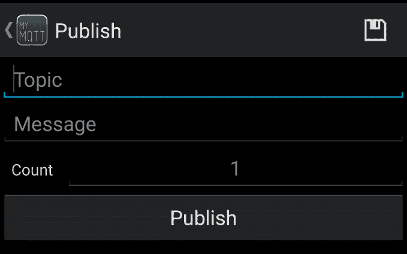

发布 MyMqtt

在主题部分，输入通道名称，在消息部分输入要发送给 Edison 的消息。

现在，同时运行您的 Node.js 代码。

一旦您的代码运行起来，我们将发送一条消息。在消息字段中键入 `ON` 并点击发布：

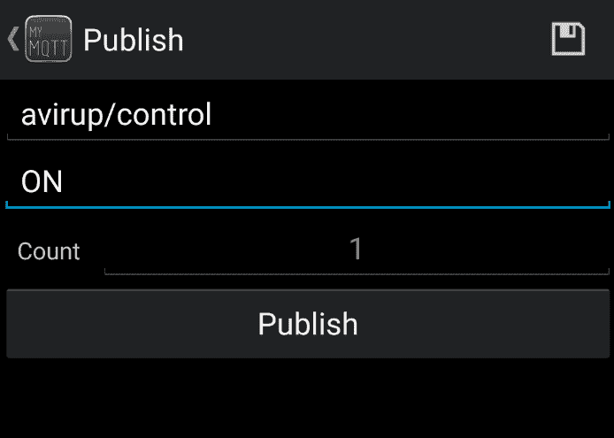

发送控制信号

一旦您从应用程序中发布，它应该会在 PuTTY 控制台中反映出来：

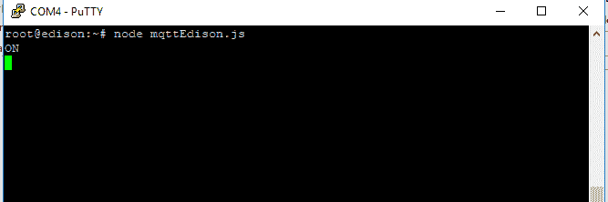

消息发送和接收——MQTT

现在您应该看到 LED 已经点亮。

同样，发送一条消息 `OFF` 来关闭板载 LED：

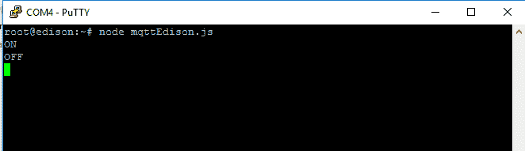

消息发送和接收。LED 应该熄灭

值得注意的是，即使 Edison 和设备没有连接到同一网络，这也会正常工作。

现在您可以使用您的 Android 应用程序控制您的 Intel Edison。从虚拟的角度来看，您现在可以控制您的家了。在下一节中，我们将深入了解家庭自动化场景，并开发一个用于控制的 WPF 应用程序。

# 使用 Intel Edison、MQTT、Android 和 WPF 进行家庭自动化

到目前为止，我们已经了解了 MQTT 协议以及如何使用应用程序和 Edison 订阅和发布数据。现在我们将处理一个实际用例，我们将使用 Intel Edison 控制一个电气负载，它再次将通过互联网控制。以下是关于我们将要处理的内容的简要介绍：

+   硬件组件和电路

+   开发用于控制 Intel Edison 的 WPF 应用程序

+   使用 MQTT 将一切连接起来

由于我们已经看到了如何使用 Android 应用程序控制 Edison，本节不会专注于这一点；相反，它将主要处理 WPF 应用程序。这只是为了给您一个简要的了解，了解一台 PC 如何控制物联网设备，不仅限于家庭自动化，还包括各种其他用例，从简单的概念验证场景到行业标准解决方案。

# 硬件组件和电路

当我们处理电气负载时，我们绝对不能直接将其连接到爱迪生或其他任何板子上，因为这会导致烧毁。为了处理这些负载，我们使用一个称为继电器的接口电路。继电器在其原始形式上是一系列机电开关。它们在直流电压下工作，并控制交流电源。以下列出了将要使用的组件：

+   英特尔爱迪生

+   5V 继电器模块

+   电灯泡电线

在进入电路之前，我们首先讨论继电器：

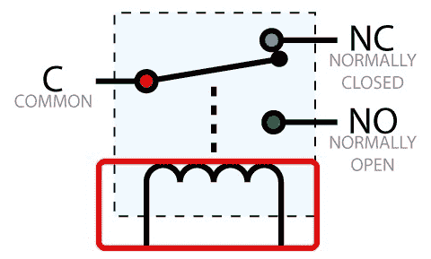

继电器电路图。图片来源：[h](http://www.phidgets.com/docs/3051_User_Guide)[t](http://www.phidgets.com/docs/3051_User_Guide)[t](http://www.phidgets.com/docs/3051_User_Guide)[p](http://www.phidgets.com/docs/3051_User_Guide)[://w](http://www.phidgets.com/docs/3051_User_Guide)[w](http://www.phidgets.com/docs/3051_User_Guide)[w](http://www.phidgets.com/docs/3051_User_Guide)[.](http://www.phidgets.com/docs/3051_User_Guide)[p](http://www.phidgets.com/docs/3051_User_Guide)[h](http://www.phidgets.com/docs/3051_User_Guide)[i](http://www.phidgets.com/docs/3051_User_Guide)[d](http://www.phidgets.com/docs/3051_User_Guide)[g](http://www.phidgets.com/docs/3051_User_Guide)[e](http://www.phidgets.com/docs/3051_User_Guide)[t](http://www.phidgets.com/docs/3051_User_Guide)[s](http://www.phidgets.com/docs/3051_User_Guide)[.](http://www.phidgets.com/docs/3051_User_Guide)[c](http://www.phidgets.com/docs/3051_User_Guide)[o](http://www.phidgets.com/docs/3051_User_Guide)[m](http://www.phidgets.com/docs/3051_User_Guide)[/d](http://www.phidgets.com/docs/3051_User_Guide)[o](http://www.phidgets.com/docs/3051_User_Guide)[c](http://www.phidgets.com/docs/3051_User_Guide)[s](http://www.phidgets.com/docs/3051_User_Guide)[/3051_](http://www.phidgets.com/docs/3051_User_Guide)[U](http://www.phidgets.com/docs/3051_User_Guide)[s](http://www.phidgets.com/docs/3051_User_Guide)[e](http://www.phidgets.com/docs/3051_User_Guide)[r](http://www.phidgets.com/docs/3051_User_Guide)[_](http://www.phidgets.com/docs/3051_User_Guide)[G](http://www.phidgets.com/docs/3051_User_Guide)[u](http://www.phidgets.com/docs/3051_User_Guide)[i](http://www.phidgets.com/docs/3051_User_Guide)[d](http://www.phidgets.com/docs/3051_User_Guide)[e](http://www.phidgets.com/docs/3051_User_Guide)

红色矩形区域代表电磁铁。我们用直流电压激发电磁铁，这会触发机械开关。仔细观察前面的图像，我们可以看到三个连接交流负载的端口：公共端口、常闭端口和常开端口。在默认条件下，即当电磁铁未被激发时，公共端口和常闭端口是连接的。目前我们感兴趣的是常开端口。

使用的继电器图像如下所示：

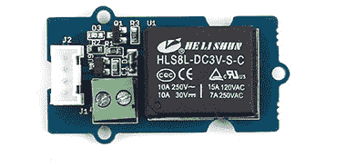

继电器单元。图片来源：Seed Studio

电气负载将有一个火线和零线。根据以下电路连接其中之一：

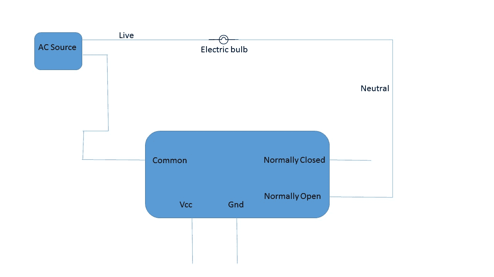

基本继电器连接

参考前面的图示，**Vcc** 和 **Gnd** 连接到控制器。交流电源直接连接到电负载的一端，而另一端通过继电器连接。其中一部分连接到公共端口，而另一部分可能是**常闭**（**NC**）或**常开**（**NO**）。当你将电负载的另一端连接到 NC 端口时，那么默认情况下，在没有电磁铁激励的情况下，电路是完整的。由于我们不希望当电磁铁未激励时灯泡在运行，所以将其连接到**NO**端口，而不是**NC**。因此，当通过在**Vcc**和**Gnd**上施加电压来激励电磁铁时，机械开关翻转到**NO**位置，从而将其与公共端口连接。

交流继电器操作背后的整个想法是使用机电开关来完成电路。然而，值得注意的是，并非所有继电器都基于相同的原理运行；一些继电器使用固态器件来操作。

**固态继电器**（**SSR**）与机电继电器不同，没有可移动部件。SSR 使用光电耦合器来隔离输入和输出。它们将电信号转换为光信号，这些信号通过空间传播，从而隔离整个电路。接收端的光耦合器连接到任何开关设备，例如 MOSFET，以执行开关动作。

使用 SSR 而不是机电继电器有一些优点。如下所示：

+   它们提供高速、高频的开关操作

+   接触点有故障

+   它们产生的噪音最小

+   它们不会产生操作噪音

尽管我们现在将使用机电继电器，但如果用例涉及高频开关，则最好选择 SSR。还应注意，当长时间使用时，SSR 会变热。

# 最终电路

整个连接在以下图中显示：

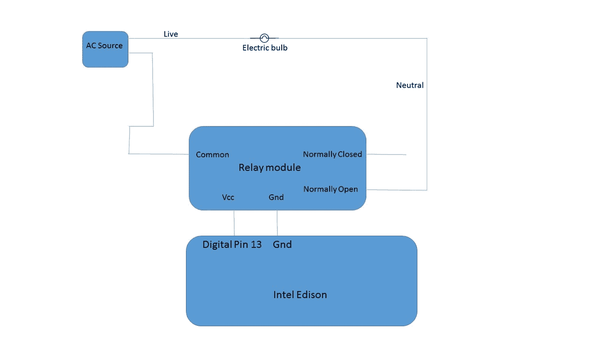

家庭自动化项目的电路图

电路添加 Intel Edison 是因为继电器电路将由控制器控制。这里的继电器仅作为 AC 负载的接口单元。

当继电器正在运行时，请不要触摸其底部，否则可能会遭受 AC 电击，这可能是危险的。

要测试电路是否工作，请尝试使用 Arduino IDE 编写一个简单的程序：

```cpp
#define RELAY_PIN 13 void setup()
{
  pinMode(RELAY_PIN,OUTPUT); //Set relay pin to output
}
void loop
{
  digitalWrite(RELAY_PIN, HIGH); //Set relay to on position
}

```

代码应将开关的位置从 NC 位置切换到 NO 位置，从而完成电路，使你的灯泡发光。别忘了打开 AC 电源。

一旦你准备好了最终电路，我们将继续进行 WPF 应用程序的开发，该应用程序将控制 Edison。

# 使用 MQTT 控制 Intel Edison 的 Android 应用程序

在上一节中，我们看到了如何使用代理来订阅和发布到通道的 Android 应用程序。在本节中，我们将开发自己的 Android 应用程序，用于通过 MQTT 控制设备。本节不会集中讨论 Android 的设置，而是将集中在开发方面。我们将使用 Android Studio IDE 来开发应用程序。请确保它已配置了所有最新的 SDK。

打开您的 Android Studio：

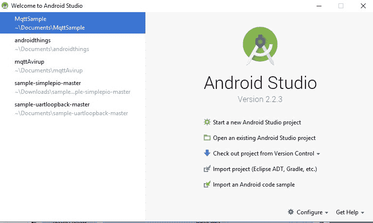

Android Studio—1

现在，选择“开始一个新的 Android Studio 项目”：

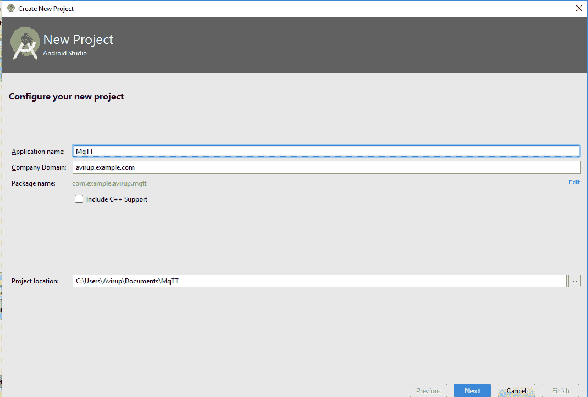

Android Studio—设置应用程序名称

为您的应用程序输入一个名称；在这里，我们输入了`MQTT`。点击“下一步”继续：

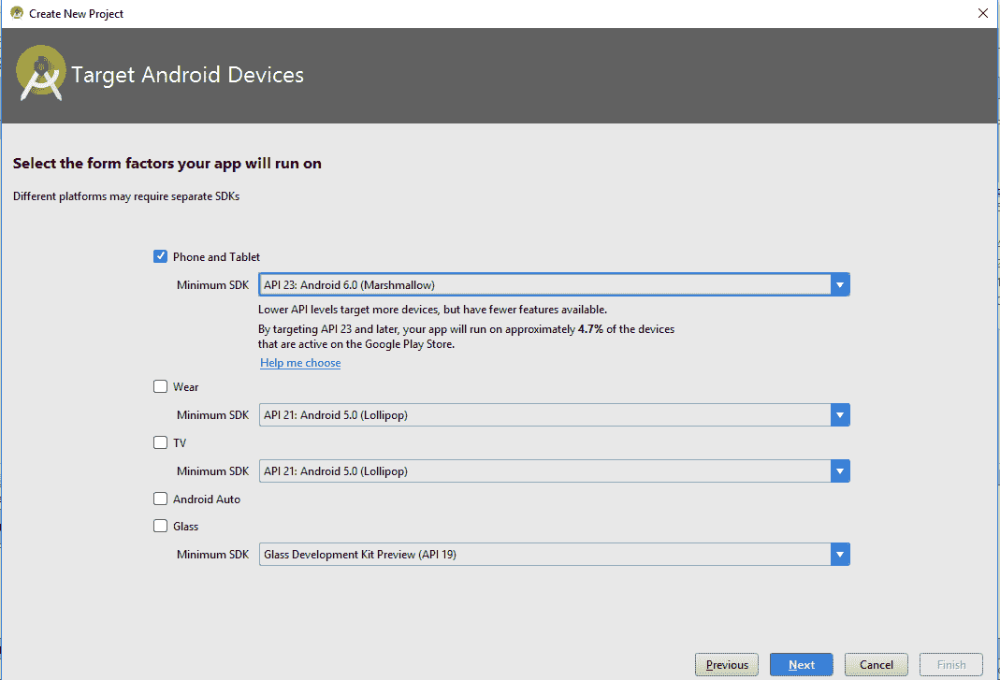

Android Studio：设置 API 级别

现在请选择最小 SDK 版本。选择 API 23：Android 6.0（棉花糖）。现在让我们选择活动类型：

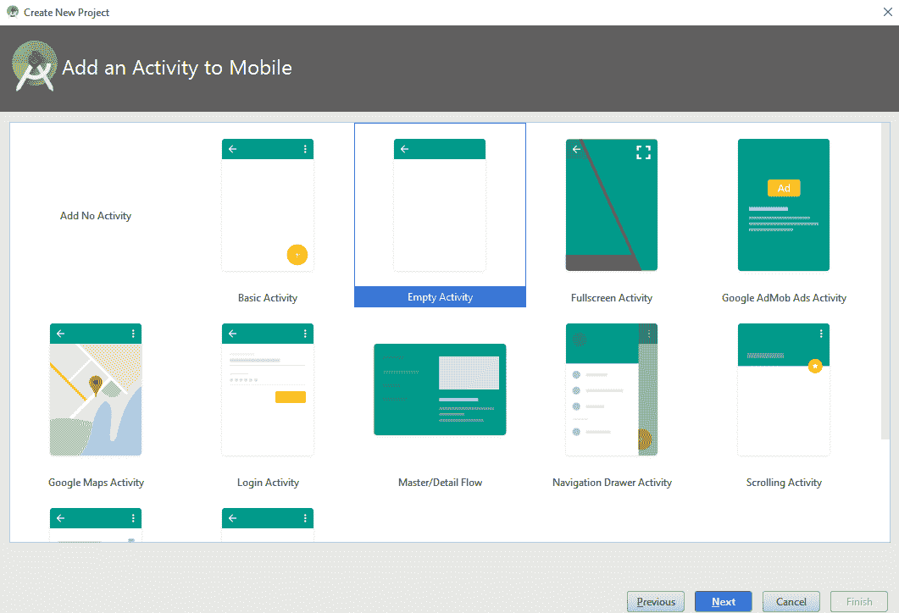

设置活动

选择“空活动”并点击“下一步”：

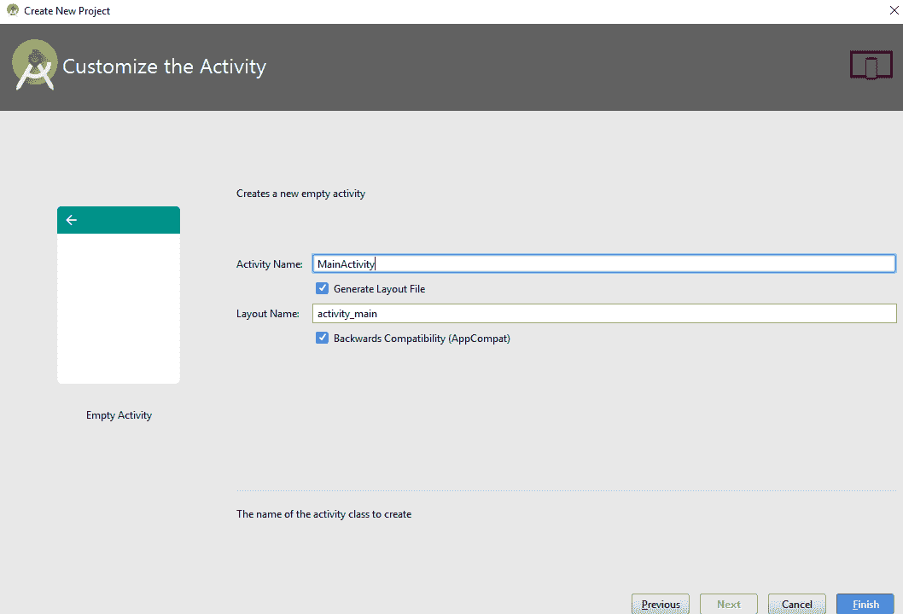

设置启动活动名称

给您的活动起一个名字并点击“完成”。设置项目可能需要几分钟时间。完成后，您可能会看到如下屏幕：

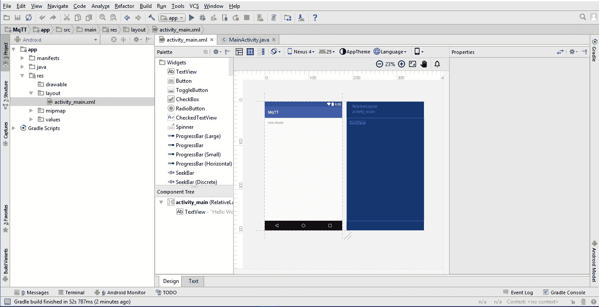

设计页面。activity_name.xml

如果您仔细查看项目文件夹，您会注意到我们有一些文件夹，如`java`、`res`、`values`等。让我们更仔细地看看这些文件夹实际上包含什么：

+   `java`: 这包含项目中所有的`.java`源文件。主活动，命名为`MainActivity.java`，也包含在这个项目中。

+   `res/drawable`: 这是一个用于此项目可绘制组件的目录。目前它不会被使用。

+   `res/layout`: 这包含所有负责应用程序 UI 的文件。

+   `res/values`: 这是一个包含资源定义的`xml`文件的其他类型的目录，例如字符串和颜色。

+   `AndroidManifest.xaml`: 这是一个定义应用程序以及应用程序所需权限的清单文件。

+   `build.gradle`: 这是一个自动生成的文件，其中包含诸如`compileSdkVersion`、`buildToolsVersion`、`applicationID`等信息。

在这个应用程序中，我们将使用一个名为 eclipse `paho`库的第三方资源或库来处理 MQTT。这些依赖项需要添加到`build.gradle`。

应该有两个`build.gradle`文件。我们需要在`build.gradle(Module:app)`文件中添加依赖项：

```cpp
repositories 
{ 
  maven 
    {
      url "https://repo.eclipse.org/content/repositories/paho-
      snapshots/"
    }
}
dependencies 
{
  compile('org.eclipse.paho:org.eclipse.paho.android.service:1.0.3-
  SNAPSHOT')
    {
      exclude module: 'support-v4'
    }
}

```

应该已经存在一个依赖块，因此您不需要再次编写整个内容。在这种情况下，只需在现有的依赖块中写入`compile('org.eclipse.paho:org.eclipse.paho.android.service:1.0.3-SNAPSHOT') { exclude module: 'support-v4'`即可。粘贴代码后，Android Studio 将要求您同步 gradle。在继续之前同步 gradle 是必要的：

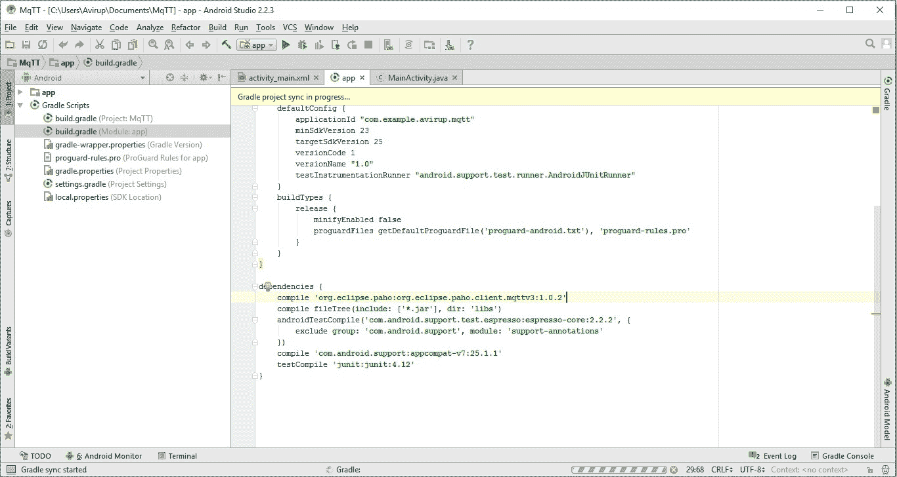

添加依赖项

现在我们需要向我们的项目中添加权限和服务。浏览到`AndroidManifest.xml`并添加以下权限和服务：

```cpp
<service android:name="org.eclipse.paho.android.service.MqttService" >
</service>
<uses- permission android:name="android.permission.INTERNET" />

```

完成此操作后，我们将继续进行 UI 设计。UI 需要在`layout`下的`activity_main.xml`文件中进行设计。

我们将拥有以下 UI 组件：

+   `EditText`：这是用于代理

+   `URL EditText`：这是用于通道的`EditText`端口

连接按钮：

+   按钮用于发送信号

+   关闭按钮用于发送关闭信号

将之前提到的组件拖放到设计器窗口中。或者，你可以在文本视图中直接编写它。

以下是你参考的最终设计的 XML 代码。请在相对布局选项卡中编写你的代码：

```cpp
<EditText 
  android:layout_width="wrap_content"
  android:layout_height="wrap_content" 
  android:text="android/edison" 
  android:id="@+id/channelID" 
  android:hint="Enter channel ID" 
  android:layout_centerVertical="true"
  android:layout_alignParentStart="true"
  android:layout_alignEnd="@+id/portNum" /> 

<Button 
  android:layout_width="wrap_content"
  android:layout_height="wrap_content" 
  android:text="On" 
  android:id="@+id/on"
  android:layout_below="@+id/connectMQTT"
  android:layout_alignParentStart="true" 
  android:layout_marginTop="45dp" /> 
<Button 
  android:layout_width="wrap_content"
  android:layout_height="wrap_content" 
  android:text="Off" 
  android:id="@+id/off"
  android:layout_alignTop="@+id/on" 
  android:layout_alignParentEnd="true" /> 

<EditText 
  android:layout_width="wrap_content"
  android:layout_height="wrap_content" 
  android:id="@+id/brokerAdd" 
  android:layout_alignParentTop="true"
  android:layout_alignParentStart="true" 
  android:layout_marginTop="40dp" 
  android:hint="Broker Address" 
  android:layout_alignParentEnd="true" 
  android:text="iot.eclipse.org" /> 

<EditText 
  android:layout_width="wrap_content"
  android:layout_height="wrap_content" 
  android:id="@+id/portNum" 
  android:layout_below="@+id/brokerAdd"
  android:layout_alignParentStart="true" 
  android:layout_marginTop="40dp" 
  android:hint="Port Default: 1883"
  android:layout_alignEnd="@+id/brokerAdd" 
  android:text="1883" /> 

<Button 
  android:layout_width="wrap_content"
  android:layout_height="wrap_content" 
  android:text="@string/connect" 
  android:id="@+id/connectMQQT" 
  android:layout_below="@+id/channelID"
  android:layout_alignParentStart="true"
  android:layout_alignEnd="@+id/channelID" />

```

现在单击设计视图；你会看到已经创建了一个 UI，它应该与以下截图中的类似：

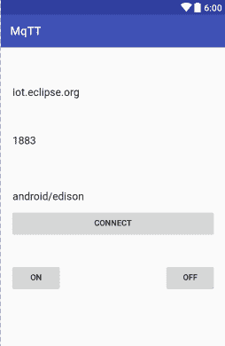

应用程序设计

现在仔细查看前面的代码，尝试找出所使用的属性。基本的属性如`height`、`width`和`position`已设置，这从代码中可以理解。主要的属性是`EditText`的`text`、`id`和`hint`。Android UI 中的每个组件都应该有一个唯一的 ID。除此之外，我们还设置了一个提示，以便用户知道在文本区域中应该输入什么。为了方便，我们定义了文本，这样在部署时就不需要再次进行设置。在最终的应用程序中，移除文本属性。还有一个选项可以从`strings.xml`获取值，该文件位于文本或提示的`values`下：

```cpp
android:text="@string/connect"

```

现在我们已经准备好了 UI，我们需要实现使用这些 UI 组件通过 MQTT 协议与设备交互的代码。我们也有适当的依赖项。主要的 Java 代码写在`MainActivity.java`中。

在进一步进行`MainActivity.java`活动之前，让我们创建一个将处理 MQTT 连接的类。这将使代码更容易理解且更高效。查看以下截图以了解`MainActivity.java`文件的位置：

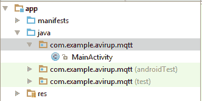

右键单击突出显示的文件夹，然后单击“新建 | Java 类”。这个类将处理应用程序和 MQTT 代理之间发生的所有必要的数据交换：

```cpp
package com.example.avirup.mqtt;
import org.eclipse.paho.client.mqttv3.IMqttDeliveryToken;
import org.eclipse.paho.client.mqttv3.MqttCallback;
import org.eclipse.paho.client.mqttv3.MqttClient;
import org.eclipse.paho.client.mqttv3.MqttException;
import org.eclipse.paho.client.mqttv3.MqttMessage;
import org.eclipse.paho.client.mqttv3.MqttPersistenceException;
import org.eclipse.paho.client.mqttv3.MqttSecurityException;
import org.eclipse.paho.client.mqttv3.persist.MemoryPersistence;
import java.io.UnsupportedEncodingException;
/** * Created by Avirup on 16-02-2017\. */
public class MqttClassimplements MqttCallback 
{ 
  String serverURI, port, clientID; 
  MqttClientclient; 
  MqttCallback callback;
//ConstructorMqttClass(String uri, String port, String clientID) 
    {
      this.serverURI=uri;
      this.port=port;
      this.clientID=clientID; 
    }
  public void MqttConnect() 
    {
      try 
        { 
          MemoryPersistencepersistance = new MemoryPersistence();
          StringBuilderServerURI = new StringBuilder();
          ServerURI.append("tcp://"); 
          ServerURI.append(serverURI);
          ServerURI.append(":"); 
          ServerURI.append(port); 
          String finalServerUri = ServerURI.toString();
          client = new MqttClient(finalServerUri, clientID,
          persistance);
          client.setCallback(callback);
          client.connect(); 
        }
      catch (MqttSecurityException e) 
        { 
          e.printStackTrace(); 
        } 
      catch (MqttException e) 
        { 
          e.printStackTrace(); 
        }
      }
    public void MqttPublish(String message) 
      { 
        String commId=clientID;
        try
          {
            byte[]
            payload=message.getBytes("UTF-8"); 
            MqttMessagefinalMsg= new MqttMessage(payload);
            client.publish(clientID,finalMsg); 
          }
        catch (UnsupportedEncodingException e) 
          { 
            e.printStackTrace(); 
          } 
        catch (MqttPersistenceExceptione) 
          { 
            e.printStackTrace(); 
          } 
        catch (MqttException e) 
          { 
            e.printStackTrace(); 
          } 
        } 
      @Override
      public void connectionLost(Throwable cause) 
        {
     }
       @Override
       public void messageArrived(String topic, MqttMessage
       message) throws Exception 
         {
       }
      @Override
      public void deliveryComplete(IMqttDeliveryToken token) 
        {
      } 
    }

```

之前粘贴的代码乍一看可能很复杂，但一旦理解了它，实际上非常简单。假设读者对面向对象编程概念有基本的了解。

导入包的语句都是自动完成的。创建类后，实现`MqttCallback`接口。这将添加需要重写的抽象方法。

初始时，我们为这个类编写一个参数化构造函数。我们还创建了一个全局引用变量用于`MqttClient`和`MqttCallback`类。还创建了三个全局变量用于`serverURI`、`port`和`clientID`：

```cpp
String serverURI, port, clientID; 
MqttClientclient; 
MqttCallback callback; 
MqttClass(String uri, String port, String clientID)
{
  this.serverURI=uri;
  this.port=port;
  this.clientID=clientID; 
}

```

参数是代理`URI`、`port`号码和`clientID`。

接下来，我们创建了三个全局变量，并将它们设置为参数。在`MqttConnect`方法中，我们最初形成一个字符串，因为我们只接受服务器 URI 作为输入。在这里，我们将其与`tcp://`和端口号连接，并创建一个`MemoryPersistence`类的对象：

```cpp
MemoryPersistencepersistance = new MemoryPersistence(); StringBuilderServerURI = new StringBuilder(); ServerURI.append("tcp://"); 
ServerURI.append(serverURI); 
ServerURI.append(":"); 
ServerURI.append(port); 
String finalServerUri = ServerURI.toString();

```

接下来，我们使用`new`关键字为全局引用变量创建对象：

```cpp
client = new MqttClient(finalServerUri, clientID, persistance);

```

请注意参数。

上述代码被 try-catch 块包围，以处理异常。catch 块如下所示：

```cpp
catch(MqttSecurityException e) 
{ 
  e.printStackTrace(); 
} 
catch (MqttException e) 
{
  e.printStackTrace(); 
}

```

连接部分已完成。下一个阶段是创建将数据发布到代理的`publish`方法。

参数只是字符串类型的`message`：

```cpp
public void MqttPublish(String message) 
{ 
  String commId=clientID;
  try
    {
      byte[] payload=message.getBytes("UTF-8"); 
      MqttMessagefinalMsg= new MqttMessage(payload);
      client.publish(clientID,finalMsg); 
    }
  catch (UnsupportedEncodingException e) 
    { 
      e.printStackTrace(); 
    } 
  catch (MqttPersistenceException
    { 
      e.printStackTrace(); 
    } 
  catch (MqttException e) 
    { 
      e.printStackTrace(); 
    } 
}

```

使用`client.publish`来发布数据。参数是一个字符串，它是`clientID`或`channelID`，以及一个`MqttMessage`类型的对象。`MqttMessage`包含我们的消息。然而，它不接受字符串。它使用一个字节数组。在 try 块中，我们首先将字符串转换为字节数组，然后使用`MqttMessage`类将最终消息发布到特定的频道。

对于这个特定的应用程序，不需要重写的方法，所以我们保持原样。

现在回到`MainActivity.java`类。我们将使用我们刚刚创建的`MqttClass`来进行发布操作。这里的任务是获取 UI 中的数据，并使用我们刚刚编写的类连接到代理。

默认情况下，`MainActivity.java`将包含以下代码：

```cpp
packagecom.example.avirup.mqtt;
import android.support.v7.app.AppCompatActivity;
import android.os.Bundle;
public class MainActivityextends AppCompatActivity 
{ 
  @Overrideprotected void onCreate(Bundle savedInstanceState)
  {
    super.onCreate(savedInstanceState);
    setContentView(R.layout.activity_main); 
  } 
}

```

每次应用程序打开时，`onCreate`方法都会被触发。仔细观察活动生命周期后，这个概念将变得清晰。

生命周期回调包括：

1.  `onCreate()`

1.  `onStart()`

1.  `onResume()`

1.  `onPause()`

1.  `onStop()`

1.  `onDestroy()`

更多关于生命周期的细节可以从以下链接获取：

[`developer.android.com/guide/components/activities/activity-lifecycle.html`](https://developer.android.com/guide/components/activities/activity-lifecycle.html)

现在我们需要将一些引用变量分配给 UI 组件。我们将在全局级别上完成这个操作。

在`onCreate`方法开始之前，即在`override`关键字之前，添加以下行：

```cpp
EditTextserverURI,port,channelID; 
Button connect,on,off;

```

现在，在`onCreate`方法中，我们需要分配我们刚刚声明的引用变量，并将它们显式转换为类类型：

```cpp
serverURI=(EditText)findViewById(R.id.brokerAdd);
port=(EditText)findViewById(R.id.port Num);
connect=(Button)findViewById(R.id.connectMQTT);
channelID=(EditText)findViewById(R.id.channelID);
on=(Button)findViewById(R.id.on);
off=( Button)findViewById(R.id.off);

```

在前面的行中，我们已将它们显式转换为`EditText`和`Button`，并将它们绑定到 UI 组件上。

现在我们将为连接按钮创建一个新的事件处理器：

```cpp
connect.setOnClickListener(new View.OnClickListener() 
{ 
  @Overridepublic void onClick(View v) 
    {
    } 
});

```

当我们按下连接按钮时，前面的块会被激活。该块包含一个参数为 view 的方法。当按钮被按下时需要执行的代码需要写入 `onCLick(View v)` 方法中。

在此之前，为之前创建的类创建一个全局引用变量：

```cpp
MqttClassmqttClass;

```

接下来，在方法内部，从编辑框中获取文本。事先声明那些类型为字符串的全局变量：

```cpp
String serverUri, portNo,channelid;

```

现在，在 `onClick` 方法中编写以下代码：

```cpp
serverUri=serverURI.getText().toString();
portNo=port.getText().toString();
channelid=channelID.getText().toString();

```

一旦我们获取了数据，我们将为 `MqttClass` 类创建一个对象，并将字符串作为参数传递，我们还将调用 `MqttConnect` 方法：

```cpp
mqttClass=new MqttClass(serverUri,portNo,channelid); mqttClass.MqttConnect(); 

```

现在，我们将为 `ON` 和 `OFF` 方法创建类似的案例：

```cpp
on.setOnClickListener(new View.OnClickListener() 
{ 
  @Overridepublic void onClick(View v) 
    {
      mqttClass.MqttPublish("ON"); 
    } 
});
off.setOnClickListener(new View.OnClickListener() 
{
  @Overridepublic void onClick(View v) 
    {
      mqttClass.MqttPublish("OFF"); 
    } 
});

```

我们使用了 `MqttClass` 的 `MqttPublish` 方法。参数只是一个字符串，基于当它被激活时发布数据的 `onClick` 方法。

现在应用程序已准备就绪，可以部署到您的设备上。您必须在您的 Android 设备上开启开发者模式，并将设备连接到 PC，然后按下运行按钮。现在您应该在设备上运行应用程序。要测试您的应用程序，您可以直接使用 Edison 或仅使用 MyMqtt 应用程序。

# 使用 MQTT 控制的 Windows Presentation Foundation 应用程序

WPF 是一个强大的 UI 框架，用于构建 Windows 桌面客户端应用程序。它支持广泛的应用程序功能，包括模型、控件、图形布局、数据绑定、文档和安全。编程基于 C# 的核心逻辑和 XAML 的 UI。

# WPF 中的“Hello World”示例应用程序

在开始开发控制 Intel Edison 的应用程序之前，让我们简要看看我们如何集成某些基本功能，例如按钮点击事件、处理显示数据等。打开您的 Visual Studio 并选择新建项目。

在低内存的 PC 上，安装 Visual Studio 可能需要一段时间，首次打开 Visual Studio 也是如此：

我们使用 WPF 的原因是它将在多个主题中使用，例如本章以及即将到来的关于机器人的章节。在机器人领域，我们将开发用于控制机器人的软件。还假设读者对 Visual Studio 有一定的了解。有关如何使用 Visual Studio 和 WPF 的详细信息，请参阅以下链接：

[`msdn.microsoft.com/en-us/library/aa970268(v%3Dvs.110).aspx`](https://msdn.microsoft.com/en-us/library/aa970268(v%3Dvs.110).aspx)

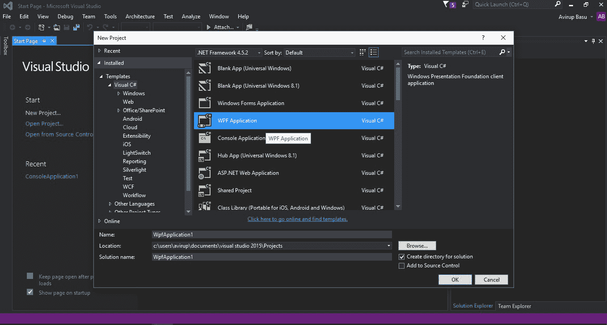

在 WPF 中创建新项目

点击新建项目，然后在 Visual C# 部分，点击 WPF 应用程序。在名称字段中输入例如 `Mqtt Controller` 的名称，然后点击确定。

一旦您点击确定，项目将被创建：

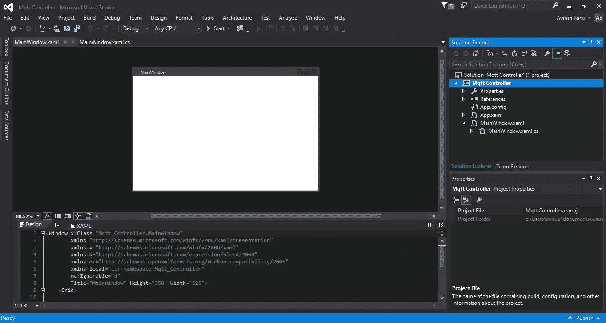

WPF 项目已创建

创建项目后，您应该得到一个类似于下面的显示。如果窗口中缺少某些显示组件，请转到视图并选择它们。现在仔细查看解决方案浏览器，它在图像的右侧可见。

在那里，查看项目结构：

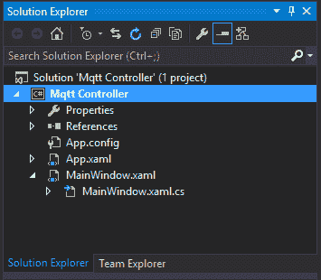

解决方案浏览器

应用程序有两个主要组件。第一个是 UI，它将在`MainWindow.xaml`中设计，第二个是逻辑，它将在`MainWindow.xaml.cs`中实现。

UI 使用 XAML 设计，而逻辑用 C#实现。

首先，我们只有一个按钮控件：一个用户将输入文本的字段和一个显示输入文本的区域。在我们对事件处理有了足够的了解之后，我们可以继续实现 MQTT。

最初，我们将为`MainPage.xaml.cs`中的双击设计 UI。这个文件是我们添加 UI 的 XAML 组件的地方。代码是用 XAML 编写的，大部分工作可以通过拖放功能完成。从应用右侧的工具箱中查找以下项：

+   `Button`

+   `TextBlock`

+   `TextBox`

添加组件有两种方式。第一种是手动在页面的 XAML 视图中添加代码，第二种是从组件工具箱中拖放。以下是一些需要注意的事项。

设计师窗口可以根据您的意愿进行编辑。一个快速的解决方案是选择您想要编辑的组件，这可以在属性窗口中完成。

属性也可以使用 XAML 进行编辑：

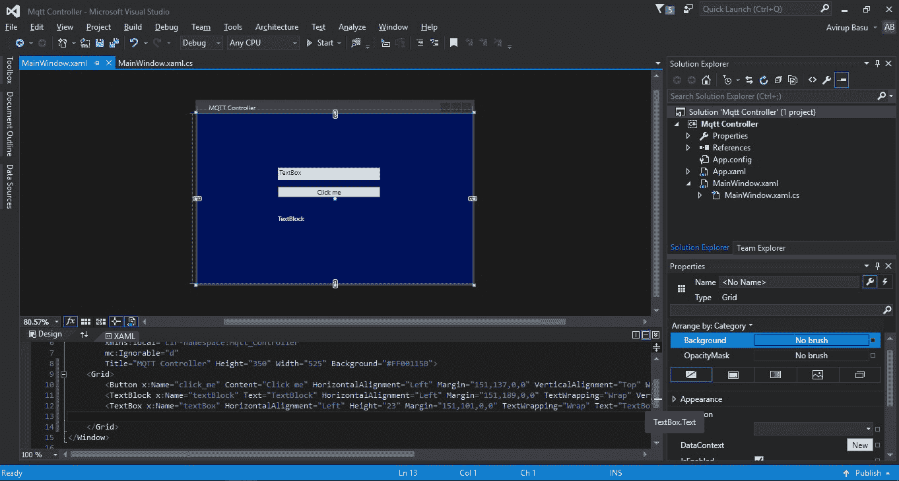

Visual Studio 布局

在前面的截图中，我们已更改了背景颜色并添加了组件。注意属性窗口中突出显示的背景颜色。

`TextBox`是用户输入文本的区域，而`TextBlock`是显示文本的区域。一旦您在设计视图中放置了组件并编辑了它们的属性，主要是组件的名称，我们将添加事件处理器。为了快速实现前面截图中的设计，请在`grid`标签内编写以下 XAML 代码：

```cpp
<Button x:Name="click_me" Content="Click me" HorizontalAlignment="Left" Margin="151,137,0,0" VerticalAlignment="Top" Width="193"/>
<TextBlock x:Name="textBlock" Text="TextBlock" HorizontalAlignment="Left"
Margin="151,189,0,0" TextWrapping="Wrap" VerticalAlignment="Top" Width="193" Foreground="White"/>
<TextBox x:Name="textBox" HorizontalAlignment="Left" Height="23" Margin="151,101,0,0" TextWrapping="Wrap" Text="TextBox" VerticalAlignment="Top" Width="193"/>

```

现在在设计师窗口中，双击按钮以创建一个用于点击事件的处理器。可用的事件可以在属性窗口中查看，如下面的截图所示：

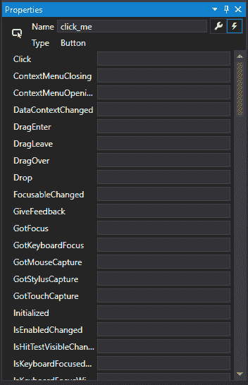

按钮的事件属性

双击后，您将自动重定向到`MainWindow.xaml.cs`，同时还有一个为该事件自动生成的函数。

您将得到一个类似于以下代码的方法：

```cpp
privatevoidclick_me_Click(object sender, RoutedEventArgs e)
{
}

```

在这里，我们将实现逻辑。最初，我们将读取`TextBox`中写入的数据。如果它是空的，我们将显示一条消息，说明它不能为空。然后，我们将只将消息传递给`TextBlock`。以下代码执行相同的功能：

```cpp
privatevoidclick_me_Click(object sender, RoutedEventArgs e)
{
  string res = textBox.Text; if(string.IsNullOrEmpty(res))
    {
      MessageBox.Show("No text entered. Please enter again");
    }
  else
    {
      textBlock.Text = res;
    }
}

```

前面的代码最初读取数据，然后检查它是否为 null 或空，然后将数据输出到`TextBlock`：

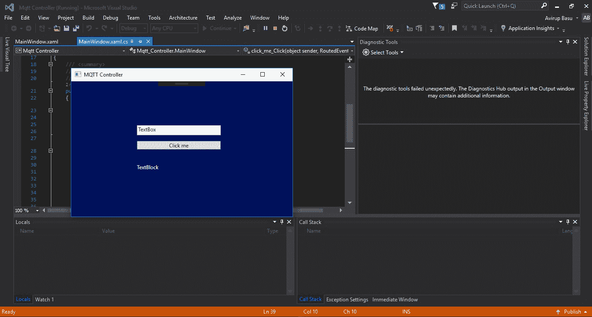

应用程序运行—1

按*F5*运行您的应用程序，然后前面的屏幕应该出现。接下来，删除文本框中的文本，然后点击“点击我”按钮：

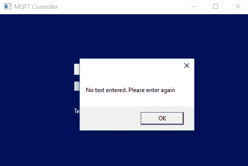

空文本

现在，在文本框中输入任何文本，然后点击“点击我”按钮。您输入的文本应该随后在文本块中显示：

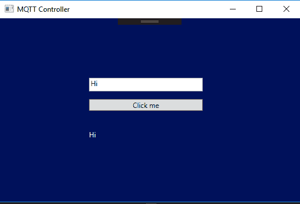

WPF HelloWorld

现在我们已经知道了如何创建一个简单的 WPF 应用程序，我们将编辑应用程序本身以实现 MQTT 协议。要实现 MQTT 协议，我们必须使用一个库，该库将通过 NuGet 包管理器添加。

现在，浏览到“引用”并点击“管理 NuGet 包”，然后添加`M2Mqtt`外部库：

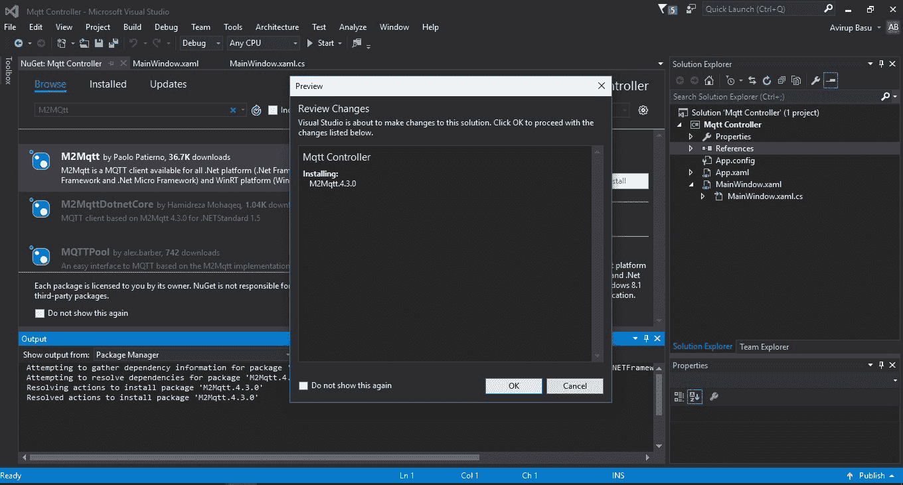

NuGet 包管理器

一旦我们有了包，我们就可以在项目中使用它们。对于这个项目，我们将在`MainWindow.xaml`中使用以下 UI 组件：

+   一个用于输入频道 ID 的文本框

+   一个用于显示最新控制命令的文本块

+   一个用于设置状态为开启的按钮

+   一个设置状态为关闭的按钮

+   一个用于连接的按钮

随意设计 UI：


控制应用程序的 UI

在前面的屏幕截图中，您将看到设计已更新，并且还添加了一个按钮。以下是将前面设计代码粘贴的代码。文本框是我们将输入频道 ID 的区域，然后我们将使用按钮来打开和关闭 LED，以及使用连接按钮连接到服务。现在，像之前做的那样，我们将为前面提到的两个按钮创建点击事件的处理器。要添加点击事件，只需在每个按钮上双击即可：

```cpp
<Button x:Name="on" Content="on" HorizontalAlignment="Left" Margin="151,180,0,0" VerticalAlignment="Top" Width="88" Click="on_Click"/>
  <TextBlock x:Name="statusBox" Text="status"
  HorizontalAlignment="Left" Margin="229,205,0,0" TextWrapping="Wrap"
  VerticalAlignment="Top" Width="115" Foreground="White"/>
  <TextBox x:Name="channelID" HorizontalAlignment="Left" Height="23"
  Margin="151,101,0,0" TextWrapping="Wrap" Text=""
  VerticalAlignment="Top" Width="193"/>
  <Button x:Name="off" Content="off" HorizontalAlignment="Left"
  Margin="256,180,0,0" VerticalAlignment="Top" Width="88"
  Click="off_Click"/>
  <Button x:Name="connect" Content="Connect" HorizontalAlignment="Left"
  VerticalAlignment="Top" Width="193" Margin="151,139,0,0"
  Click="connect_Click"/> 

```

前面的代码在网格标签中提到。

现在一旦有了设计，就转到`MainWindow.xaml.cs`并编写主要代码。您会注意到已经存在一个构造函数和两个事件处理器方法。

添加以下命名空间以使用库：

```cpp
uPLibrary.Networking.M2Mqtt;

```

现在创建`MqttClient`类的实例并声明一个全局字符串变量：

```cpp
MqttClient client = new MqttClient("iot.eclipse.org"); String channelID;

```

接下来，在连接按钮的事件处理器中，使用频道 ID 将其连接到代理。

连接按钮的事件处理器代码如下所示：

```cpp
channelID_text = channelID.Text;
if (string.IsNullOrEmpty(channelID_text))
{
  MessageBox.Show("Channel ID cannot be null");
}
else
{
  try
  {
    client.Connect(channelID_text); connect.Content = "Connected";
  }
catch (Exception ex)
{
  MessageBox.Show("Some issues occured: " + ex.ToString());
}
}

```

在前面的代码片段中，我们从包含频道 ID 的`textbox`中读取数据。如果它是 null，我们会要求用户再次输入。然后，最后，我们将它连接到频道 ID。请注意，它位于`try catch`块内。

还有另外两个事件处理器。我们需要向它们连接的频道发布一些值。

在“开启”按钮的事件处理器中，插入以下代码：

```cpp
private void on_Click(object sender, RoutedEventArgs e)
{
  byte[] array = Encoding.ASCII.GetBytes("on");
  client.Publish(channelID_text, array);
}

```

如前所述的代码所示，`Publish`方法的参数是主题，即`channelID`和一个包含消息的`byte[]`数组。

类似地，对于`off`方法，我们有：

```cpp
private void off_Click(object sender, RoutedEventArgs e)
{
  byte[] array = Encoding.ASCII.GetBytes("off");
  client.Publish(channelID_text, array);
}

```

就这些了。这是您家庭自动化 MQTT 控制器的全部代码。以下代码已粘贴供您参考：

```cpp
using System; 
usingSystem.Collections.Generic; 
usingSystem.Linq;
usingSystem.Text; 
usingSystem.Threading.Tasks; 
usingSystem.Windows; 
usingSystem.Windows.Controls; 
usingSystem.Windows.Data; 
usingSystem.Windows.Documents; 
usingSystem.Windows.Input; 
usingSystem.Windows.Media; 
usingSystem.Windows.Media.Imaging; 
usingSystem.Windows.Navigation; 
usingSystem.Windows.Shapes;
using uPLibrary.Networking.M2Mqtt; 
namespaceMqtt_Controller
{
/// <summary>
/// Interaction logic for MainWindow.xaml
/// </summary>
  public partial class MainWindow : Window
    {
      MqttClient client = new MqttClient("iot.eclipse.org"); 
      String channelID_text;
      publicMainWindow()
        {
          InitializeComponent();
        }
      private void on_Click(object sender, RoutedEventArgs e)
        {
          byte[] array = Encoding.ASCII.GetBytes("ON");
          client.Publish(channelID_text, array); 
          statusBox.Text = "on";
        }
      private void off_Click(object sender, RoutedEventArgs e)
        {
          byte[] array = Encoding.ASCII.GetBytes("OFF");
          client.Publish(channelID_text, array); 
          statusBox.Text = "off";
        }
      private void connect_Click(object sender, RoutedEventArgs e)
        {
          channelID_text = channelID.Text;
          if (string.IsNullOrEmpty(channelID_text))
            {
              MessageBox.Show("Channel ID cannot be null");
            }
          else
            {
              try
                {
                  client.Connect(channelID_text); 
                  connect.Content = "Connected";
                }
              catch (Exception ex)
                {
                  MessageBox.Show("Some issues occured: " +
                  ex.ToString());
                }
            }
        }
    }
}

```

按 *F5* 或启动按钮来执行此代码：


应用程序正在运行

接下来，在文本框中输入 `channelID`。在这里，我们将输入 `avirup/control`，然后我们将按下连接按钮：

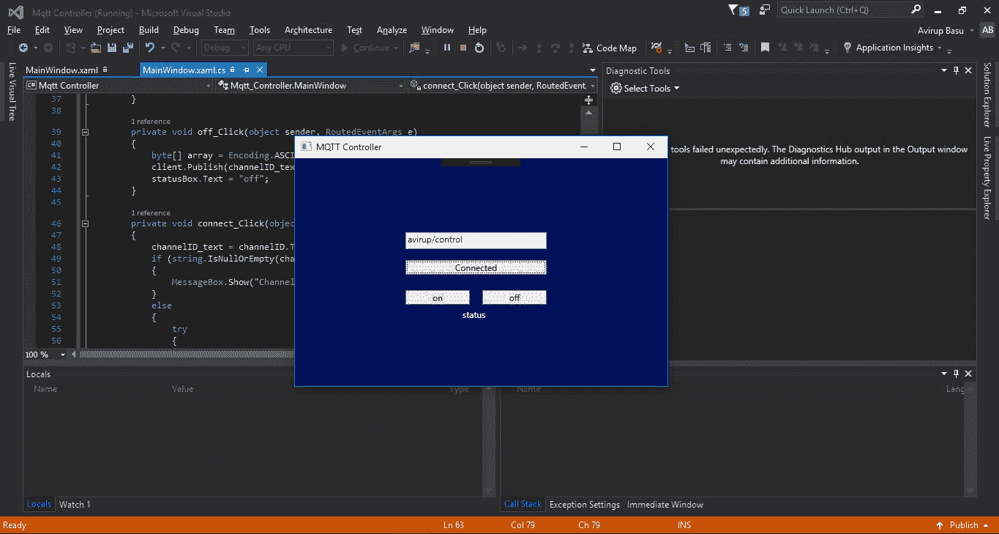

应用程序正在运行—2

现在打开您的 PuTTY 控制台并登录到英特尔爱迪生。使用 `ifconfig` 命令验证设备是否已连接到互联网。接下来，只需运行 Node.js 脚本。接下来，按下“开启”按钮：

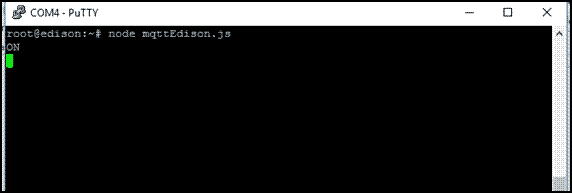

由 WPF 应用程序控制的 MQTT

类似地，按下“关闭”按钮时，您将看到以下类似的屏幕：

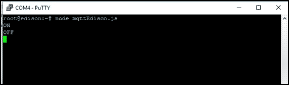

由 WPF 控制的 MQTT

持续按下“开启”和“关闭”，您将在英特尔爱迪生上看到效果。现在，我们记得我们已经连接了继电器和电灯泡，现在应该可以看到效果。如果将交流电源的主开关关闭，那么您将看不到灯泡被打开，但您会听到“滴答”声。这表明继电器现在处于“开启”位置。硬件设置的图片如下所示：

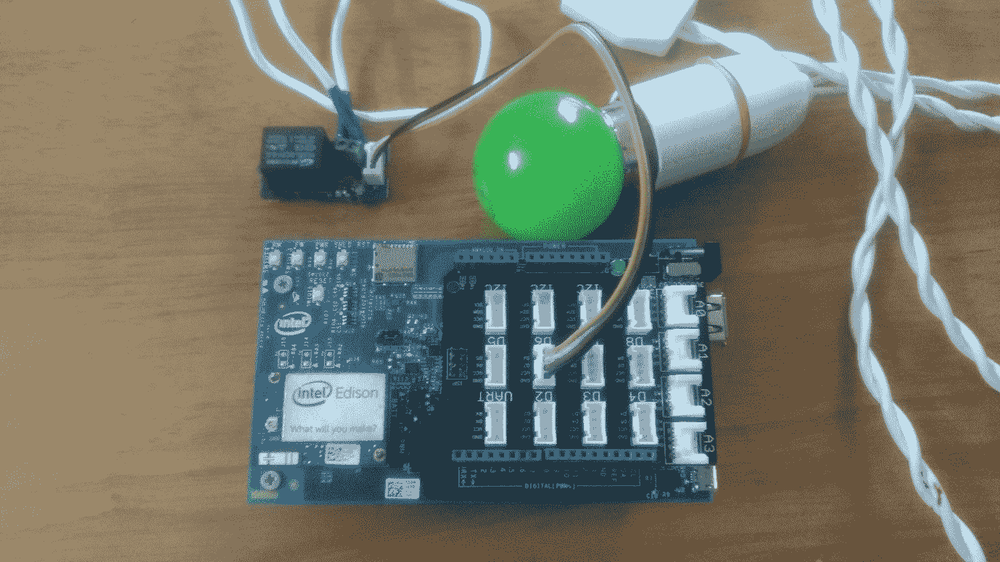

家庭自动化的硬件设置

因此，您已经准备好家庭自动化设置，您可以通过 PC 应用程序或 Android 应用程序来控制它。

如果您在办公室网络中，那么有时端口 `1883` 可能被阻止。在这种情况下，建议使用您自己的个人网络。

# 读者开放性任务

现在，您可能已经对家庭自动化中事物的工作方式有了大致的了解。我们在这一领域涵盖了多个方面。留给读者的任务不仅是集成单个控制命令，而是多个控制命令。这将使您能够控制多个设备。在 Android 和 WPF 应用程序中添加更多功能，并使用更多的字符串控制命令。将更多继电器单元连接到设备进行接口。

# 摘要

在本章中，我们了解了家庭自动化的基本概念。我们还学习了如何使用继电器控制电气负载。不仅如此，我们还学习了如何开发 WPF 应用程序并实现 MQTT 协议。在设备端，我们使用了 Node.js 代码将我们的设备连接到互联网，并通过代理订阅某些频道，最终接收信号来自动控制。在系统的 Android 端，我们使用了现成的 MyMqtt 应用程序，并使用它来获取和发布数据。然而，我们也详细介绍了 Android 应用程序的开发，并展示了如何使用它来实现 MQTT 协议来控制设备。

在第四章，*英特尔爱迪生与安全系统*，我们将学习如何使用英特尔爱迪生处理图像处理和语音处理应用。第四章，*英特尔爱迪生与安全系统*，将主要涉及 Python 编程以及一些开源库的使用。
