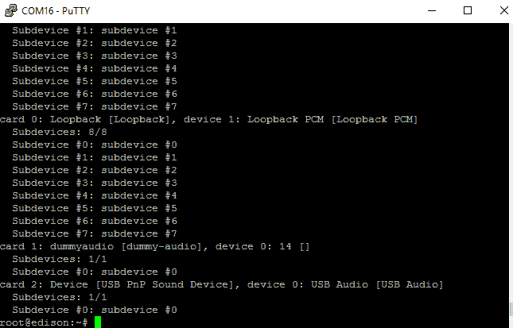
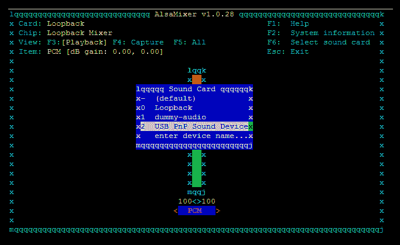
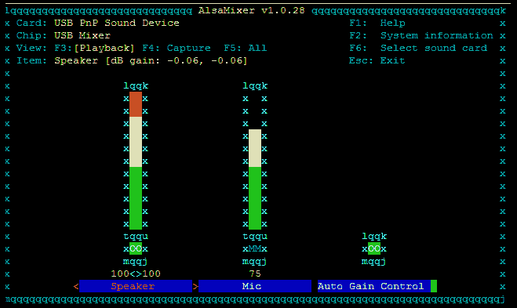
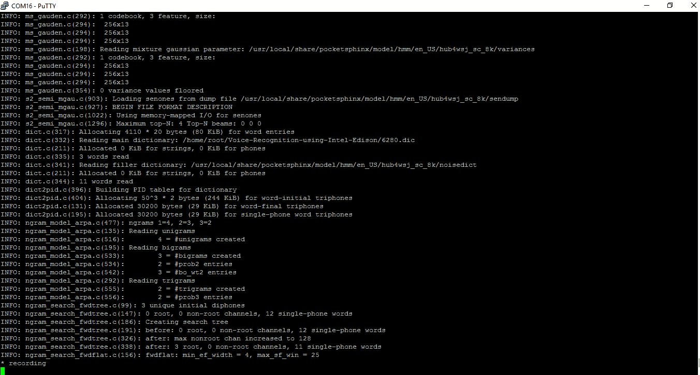
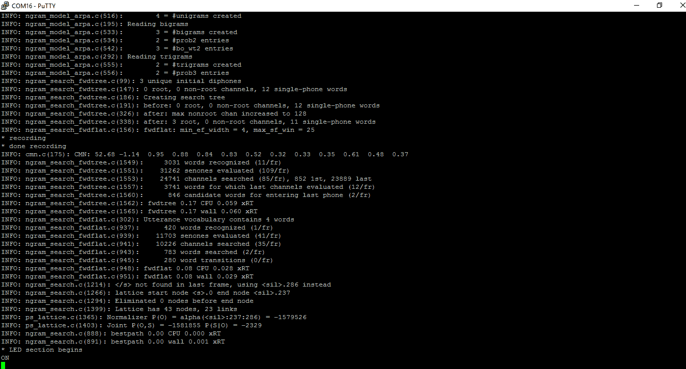
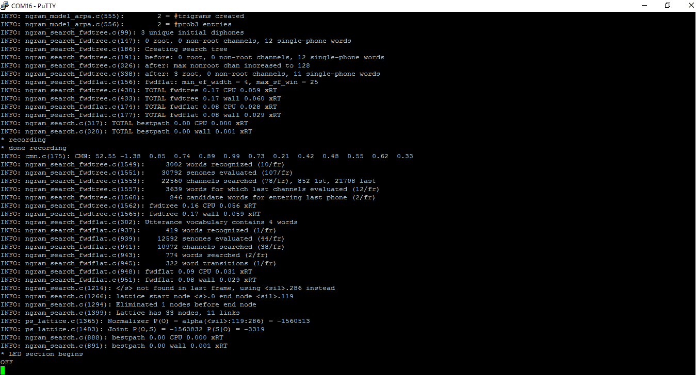
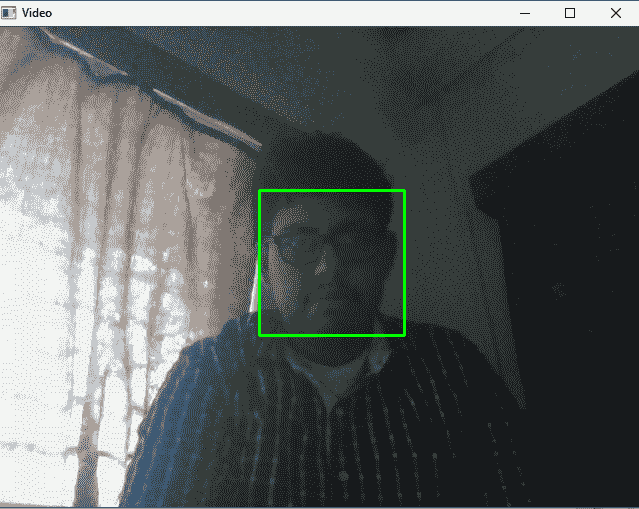
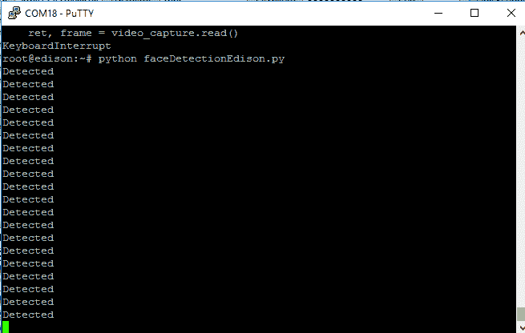
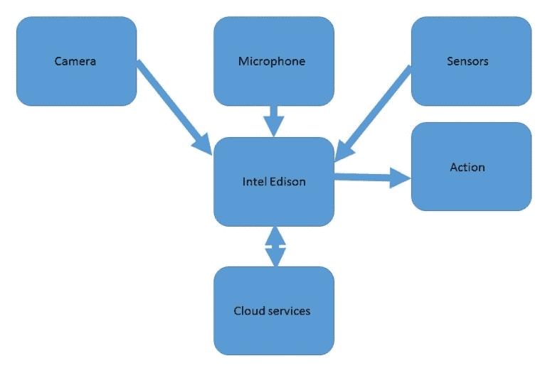

# 第四章：英特尔爱迪生和安全系统

在前面的章节中，我们学习了如何使用英特尔爱迪生开发与物联网相关的应用程序，我们展示了实时传感器数据，并控制了爱迪生本身。我们还学习了开发 Android 和 WPF 应用程序，这些应用程序用于控制英特尔爱迪生。嗯，本章更多地关注英特尔爱迪生的本地前端，我们将使用设备的内置功能。本章主要集中在这两个关键点上：

+   使用英特尔爱迪生进行语音和语音处理

+   使用英特尔爱迪生进行图像处理

所有代码都应使用 Python 编写，因此本章的一些部分也将专注于 Python 编程。在本章中，我们将使用语音命令操作英特尔爱迪生，然后最终使用英特尔爱迪生和摄像头检测人脸。因此，本章将探讨英特尔爱迪生的核心功能。由于大部分代码都是 Python 编写的，建议您从以下网站下载 Python 到您的电脑：

[`www.python.org/downloads/`](https://www.python.org/downloads/)

本章将分为两部分。第一部分将仅关注语音或语音处理，我们将基于此进行一个迷你项目；而第二部分将更详细，将关注使用 OpenCV 的图像处理方面。

# 使用爱迪生进行语音/语音处理

语音处理通常指的是应用于音频信号的各种数学技术，以对其进行处理。这可能是一些简单的数学运算，也可能是一些复杂的运算。它是数字信号处理的一个特例。然而，我们通常不将语音处理作为一个整体实体来处理。我们只对语音到文本转换的特定领域感兴趣。需要注意的是，本章中的一切都应由爱迪生本身执行，而不需要访问任何云服务。本章将首先解决的场景是我们将使爱迪生根据我们的语音命令执行一些任务。我们将使用轻量级的语音处理工具，但在继续所有代码和电路之前，请确保您有以下设备。最初，我们将向您展示如何开关 LED。接下来，我们将使用语音命令控制伺服电机。

# 所需设备

除了英特尔爱迪生外，我们还需要一些其他设备，如下所示：

+   英特尔爱迪生的 9V-1 A 电源适配器

+   USB 声卡

+   USB 集线器，最好是供电的

本项目将使用爱迪生外部供电，USB 端口将用于声卡。非供电 USB 集线器也可以使用，但由于电流问题，建议使用供电 USB 集线器。

确保 USB 声卡在 Linux 环境中受支持。选择开关应朝向 USB 端口。这是因为 Edison 将通过直流适配器供电，我们需要在提供直流电源时才激活的 USB 端口供电。

# 语音处理库

对于这个项目，我们将使用 PocketSphinx。它是卡内基梅隆大学创建的 CMU Sphinx 的一个轻量级版本。它是一个轻量级的语音识别引擎，适用于移动、手持设备和可穿戴设备。使用这个比任何基于云的服务最大的优势是它可以离线使用。

更多关于 PocketSphinx 的信息可以从以下链接获取：

[`cmusphinx.sourceforge.net/wiki/develop`](http://cmusphinx.sourceforge.net/wiki/develop)

[`github.com/cmusphinx/pocketsphinx`](https://github.com/cmusphinx/pocketsphinx)

设置库将在本章的后续部分讨论。

# 初始配置

在第一章中，我们对 Intel Edison 进行了一些非常基本的配置。在这里，我们需要使用所需的库和声卡设置来配置我们的设备。为此，您需要将 Intel Edison 连接到仅一个微型 USB 端口。这将用于通过 PuTTY 控制台进行通信，并使用 FileZilla FTP 客户端传输文件：


Arduino 扩展板组件

将 Intel Edison 连接到 Micro B USB，以通过串行接口连接到您的 PC。

一些步骤已在第一章中介绍，*设置 Intel Edison*；然而，我们将从开始展示所有步骤。打开您的 PuTTY 控制台并登录到您的设备。使用`configure_edison -wifi`连接到您的 Wi-Fi 网络。

最初，我们将添加 AlexT 的非官方`opkg`仓库。要添加它，编辑`/etc/opkg/base-feeds.conf`文件。

将以下行添加到前面的文件中：

```cpp
src/gz all http://repo.opkg.net/edison/repo/all
src/gz edison http://repo.opkg.net/edison/repo/edison
src/gz core2-32 http://repo.opkg.net/edison/repo/core2-32  

```

要做到这一点，请执行以下命令：

```cpp
echo "src/gz all http://repo.opkg.net/edison/repo/all
src/gz edison http://repo.opkg.net/edison/repo/edison
src/gz core2-32 http://repo.opkg.net/edison/repo/core2-32" >> /etc/opkg/base-feeds.conf 

```

更新包管理器：

```cpp
opkg update  

```

使用包管理器安装`git`：

```cpp
opkg install git  

```

我们现在将安装 Edison 辅助脚本以简化一些事情：

1.  首先克隆该包：

```cpp
 git clone https://github.com/drejkim/edison-scripts.git ~/edison
      scripts

```

1.  现在，我们必须将`~/edison-scripts`添加到路径中：

```cpp
 echo'export PATH=$PATH:~/edison-scripts'>>~/.profile
 source~/.profile  

```

1.  接下来我们将运行以下脚本：

```cpp
 # Resize /boot -- we need the extra space to add an additional
      kernel resizeBoot.sh

 # Install pip, Python's package manager installPip.sh

 # Install MRAA, the low level skeleton library for IO
      communication on, Edison, and other platforms installMraa.sh

```

初始配置已完成。现在我们将为声音配置 Edison。

1.  现在`安装`USB 设备的模块，包括 USB 摄像头、麦克风和扬声器。确保您的声卡已连接到 Intel Edison：

```cpp
      opkg install kernel-modules

```

1.  下一个目标是检查 USB 设备是否被检测到。要检查这一点，请输入`lsusb`命令：


USB 声卡

在前面的屏幕截图中显示了连接到 Intel Edison 的设备。它在框中被突出显示。一旦我们获取到连接到 Edison 的设备，我们就可以继续下一步。

现在我们将检查`alsa`是否能够检测到声卡。输入以下命令：

```cpp
aplay -Ll  

```



Alsa 设备检查

注意，我们的设备被检测为卡 2，命名为 `Device`。

现在我们必须创建一个 `~/.asoundrc` 文件，在其中我们需要添加以下行。请注意，`Device` 必须替换为系统上检测到的设备名称：

```cpp
pcm.!default sysdefault:Device

```

现在，一旦完成，退出并保存文件。接下来，为了测试一切是否正常工作，执行以下命令，你必须在连接的耳机上听到一些声音：

```cpp
aplay /usr/share/sounds/alsa/Front_Center.wav

```

你应该听到“前中心”这个词。

现在，我们的目标是记录一些内容并解释结果。所以让我们测试一下记录是否正常工作。

要录制一段剪辑，输入以下命令：

```cpp
arecord ~/test.wav

```

按 *Ctrl *+ *c* 停止录制。要播放前面的录音，输入以下命令：

```cpp
aplay ~/test.wav

```

你必须听到你录制的声音。如果你听不到声音，输入 `alsamixer` 并调整播放和录音音量。最初，你需要选择设备：



Alsamixer—1

接下来，使用箭头键调整音量：



Alsamixer—2

现在所有与声音相关的设置都已经完成。下一个目标是安装语音识别的包。

初始时，使用 Python 的 `pip` 来安装 `cython`：

```cpp
pip install cython

```

前面的包安装需要很长时间。一旦安装完成，还有一些需要执行的 shell 脚本。我已经为这个创建了一个 GitHub 仓库，其中包含所需的文件和代码。使用 git 命令克隆仓库 ([`github.com/avirup171/Voice-Recognition-using-Intel-Edison.git`](https://github.com/avirup171/Voice-Recognition-using-Intel-Edison.git))：

```cpp
 git clone 

```

接下来在 bin 文件夹中，你会找到这些包。在输入执行这些 shell 脚本的命令之前，我们需要提供权限。输入以下命令以添加权限：

```cpp
chmod +x <FILE_NAME>

```

接下来输入要执行的文件名。安装包可能需要一些时间：

```cpp
./installSphinxbase.sh

```

接下来输入以下内容以添加到路径：

```cpp
echo 'export LD_LIBRARY_PATH=/usr/local/lib' >> ~/.profile
echo 'export PKG_CONFIG_PATH=/usr/local/lib/pkgconfig' >> ~/.profile
source ~/.profile

```

接下来安装 `Pocketsphinx`：

```cpp
./installPocketsphinx.sh

```

最后，安装 `PyAudio`：

```cpp
./installPyAudio.sh

```

在这一步之后，所有配置都已经设置好，我们可以开始编码了。PocketSphinx 与一些特定的命令集一起工作。我们需要为要使用的单词创建一个语言模式和字典。我们将使用 Sphinx 知识库工具来完成这项工作：

[`www.speech.cs.cmu.edu/tools/lmtool-new.html`](http://www.speech.cs.cmu.edu/tools/lmtool-new.html)

上传包含我们希望引擎解码的命令集的文本文件。然后点击编译知识库。下载包含所需文件的 `.tgz` 文件。一旦我们有了这些文件，使用 FileZilla 将其复制到 Edison 上。注意包含以下扩展名的文件名称。理想情况下，每个文件都应该有相同的名称：

+   `.dic`

+   `.lm`

将整个集合移动到 Edison 上。

# 编写代码

**问题陈述**：使用如 `ON` 和 `OFF` 的语音命令来打开和关闭 LED。

在编写代码之前，让我们先讨论一下算法。请注意，我将算法以纯文本的形式编写，以便读者更容易理解。

# 让我们从算法开始

执行以下步骤以开始算法：

1.  导入所有必要的包。

1.  设置 LED 引脚。

1.  启动一个无限循环。从现在开始，所有部分或块都将位于 while 循环内。

1.  在路径中存储两个变量，用于`.lm`和`.dic`文件。

1.  记录并保存一个持续`3`秒的`.wav`文件。

1.  将`.wav`文件作为参数传递给语音识别引擎。

1.  获取结果文本。

1.  使用`if else`块测试`ON`和`OFF`文本，并使用`mraa`库来开关 LED。

算法相当直接。将以下代码与前面的算法进行比较，以全面掌握它：

```cpp
import collections 
import mraa 
import os 
import sys 
import time 

# Import things for pocketsphinx 
import pyaudio 
import wave 
import pocketsphinx as ps 
import sphinxbase 

led = mraa.Gpio(13)   
led.dir(mraa.DIR_OUT) 

print("Starting") 
while 1: 
         #PocketSphinx parameters 
         LMD   = "/home/root/vcreg/5608.lm" 
         DICTD = "/home/root/vcreg/5608.dic" 
         CHUNK = 1024 
         FORMAT = pyaudio.paInt16 
         CHANNELS = 1 
         RATE = 16000 
         RECORD_SECONDS = 3 
         PATH = 'vcreg' 
         p = pyaudio.PyAudio() 
         speech_rec = ps.Decoder(lm=LMD, dict=DICTD) 
         #Record audio 
         stream = p.open(format=FORMAT, channels=CHANNELS, rate=RATE,
         input=True, frames_per_buffer=CHUNK) 
         print("* recording") 
         frames = [] 
         fori in range(0, int(RATE / CHUNK * RECORD_SECONDS)): 
               data = stream.read(CHUNK) 
               frames.append(data) 
         print("* done recording") 
         stream.stop_stream() 
         stream.close() 
         p.terminate() 
         # Write .wav file 
         fn = "test.wav" 
         #wf = wave.open(os.path.join(PATH, fn), 'wb') 
         wf = wave.open(fn, 'wb') 
         wf.setnchannels(CHANNELS) 
         wf.setsampwidth(p.get_sample_size(FORMAT)) 
         wf.setframerate(RATE) 
         wf.writeframes(b''.join(frames)) 
         wf.close() 

         # Decode speech 
         #wav_file = os.path.join(PATH, fn) 
         wav_file=fn 
         wav_file = file(wav_file,'rb') 
         wav_file.seek(44) 
         speech_rec.decode_raw(wav_file) 
         result = speech_rec.get_hyp() 
         recognised= result[0] 
         print("* LED section begins") 
         print(recognised) 
         if recognised == 'ON.': 
               led.write(1) 
         else: 
               led.write(0) 
         cm = 'espeak "'+recognised+'"' 
         os.system(cm) 

```

我们逐行来看：

```cpp
import collections 
import mraa 
import os 
import sys 
import time 

# Import things for pocketsphinx 
import pyaudio 
import wave 
import pocketsphinx as ps 
import Sphinxbase 

```

前面的部分只是为了`导入`所有库和包：

```cpp
led = mraa.Gpio(13)   
led.dir(mraa.DIR_OUT) 

```

我们设置了 LED 引脚并将其方向设置为输出。接下来，我们将开始无限 while 循环：

```cpp
#PocketSphinx and Audio recording parameters 
         LMD   = "/home/root/vcreg/5608.lm" 
         DICTD = "/home/root/vcreg/5608.dic" 
         CHUNK = 1024 
         FORMAT = pyaudio.paInt16 
         CHANNELS = 1 
         RATE = 16000 
         RECORD_SECONDS = 3 
         PATH = 'vcreg' 
         p = pyaudio.PyAudio() 
         speech_rec = ps.Decoder(lm=LMD, dict=DICTD) 

```

前面的代码块只是 PocketSphinx 和音频记录的参数。我们将记录`3`秒。我们还提供了`.lmd`和`.dic`文件的路径以及一些其他音频记录参数：

```cpp
#Record audio 
         stream = p.open(format=FORMAT, channels=CHANNELS, rate=RATE,
         input=True, frames_per_buffer=CHUNK) 
         print("* recording") 
         frames = [] 
         fori in range(0, int(RATE / CHUNK * RECORD_SECONDS)): 
               data = stream.read(CHUNK) 
               frames.append(data) 
         print("* done recording") 
         stream.stop_stream() 
         stream.close() 
         p.terminate() 

```

在前面的代码中，我们记录了特定时间间隔的音频。

接下来，我们将它保存为`.wav`文件：

```cpp
# Write .wav file 
         fn = "test.wav" 
         #wf = wave.open(os.path.join(PATH, fn), 'wb') 
         wf = wave.open(fn, 'wb') 
         wf.setnchannels(CHANNELS) 
         wf.setsampwidth(p.get_sample_size(FORMAT)) 
         wf.setframerate(RATE) 
         wf.writeframes(b''.join(frames)) 
         wf.close() 

```

最后一步包含文件的解码和比较以影响 LED：

```cpp
# Decode speech 
         #wav_file = os.path.join(PATH, fn) 
         wav_file=fn 
         wav_file = file(wav_file,'rb') 
         wav_file.seek(44) 
         speech_rec.decode_raw(wav_file) 
         result = speech_rec.get_hyp() 
         recognised= result[0] 
         print("* LED section begins") 
         print(recognised) 
         if recognised == 'ON.': 
               led.write(1) 
         else: 
               led.write(0) 
         cm = 'espeak "'+recognised+'"' 
         os.system(cm) 

```

在前面的代码中，我们最初将`.wav`文件作为参数传递给语音处理引擎，然后使用结果进行比较。最后，根据语音处理引擎的输出开关 LED。前面代码执行的另一项活动是，使用`espeak`将识别的内容重新朗读出来。`espeak`是一个文本到语音引擎。它默认使用频谱共振峰合成，听起来像机器人，但可以配置为使用 Klatt 共振峰合成或 MBROLA 以产生更自然的音效。

使用 FileZilla 将代码传输到你的设备。假设代码被保存为名为`VoiceRecognitionTest.py`的文件。

在执行代码之前，你可能想要将一个 LED 连接到 GPIO 引脚 13，或者直接使用板载 LED 来完成这个目的。

要执行代码，请输入以下内容：

```cpp
python VoiceRecognitionTest.py 

```

初始时，控制台显示`*recording`，说`on`：



语音识别—1

然后，在你说话之后，语音识别引擎将识别你所说的单词，从现有的语言模型中：



语音识别—2

注意到显示的是`on`。这意味着语音识别引擎已经成功解码了我们刚才说的语音。同样，当我们通过麦克风说`off`时，另一个选项也会出现：



语音识别—3

现在我们已经准备好了一个语音识别的概念证明。现在，我们将对这个概念进行一些小的修改，以锁定和解锁门。

# 基于语音命令的锁门/解锁

在本节中，我们将根据语音命令打开和关闭门。类似于前一个章节，我们使用如`ON`和`OFF`之类的语音命令开关 LED，这里我们将使用伺服电机做类似的事情。主要目标是让读者理解英特尔爱迪生的核心概念，即我们使用语音命令执行不同的任务。可能会有人问，为什么我们使用伺服电机？

与普通直流电机不同，伺服电机可以旋转到操作者设定的特定角度。在正常情况下，控制门的锁定可能使用继电器。继电器的作用在第三章（3bd53219-a287-4d8f-9a58-5a06c5b14062.xhtml），*英特尔爱迪生和物联网（智能家居自动化）*中已有讨论。

让我们也探讨伺服电机的使用，以便我们可以扩大控制设备的范围。在这种情况下，当伺服电机设置为`0`度时，它是解锁的，当设置为`90`度时，它是锁定的。伺服电机的控制需要使用脉冲宽度调制引脚。英特尔爱迪生有四个 PWM 引脚：


伺服电机。图片来源：[`circuitdigest.com`](https://circuitdigest.com)

操作伺服电机有三个操作线路：

+   Vcc

+   Gnd

+   信号

典型的颜色编码如下：

+   黑色——地线

+   红色或棕色——电源

+   黄色或白色——控制信号

我们使用的是 5V 伺服电机；因此爱迪生足以供电。爱迪生和伺服电机必须共享一个公共地。最后，信号引脚连接到英特尔爱迪生的 PWM 引脚。随着我们进一步进行这个小型项目，事情将变得更加清晰。

# 电路图

以下是为语音识别设计的电路图：


语音识别电路图

如前所述，伺服电机需要 PWM 引脚来操作，英特尔爱迪生总共有六个 PWM 引脚。在这里，我们使用数字引脚 6 进行伺服控制，数字引脚 13 用于 LED。至于外围设备，将您的 USB 声卡连接到英特尔爱迪生的 USB 端口，您就设置好了。

# 为 Python 配置伺服库

要控制伺服电机，我们需要通过 PWM 引脚发送一些信号。我们选择使用一个库来控制伺服电机。

使用以下链接从 GitHub 仓库获取`Servo.py` Python 脚本：

[`github.com/MakersTeam/Edison/blob/master/Python-Examples/Servo/Servo.py`](https://github.com/MakersTeam/Edison/blob/master/Python-Examples/Servo/Servo.py)

下载文件并将其推送到你的爱迪生设备。之后，只需像执行 Python 脚本一样执行该文件：

```cpp
python Servo.py

```

现在你已经完成了，你就可以使用 Python 和你的英特尔爱迪生使用伺服电机了。

回到硬件部分，伺服电机必须连接到数字引脚`6`，这是一个 PWM 引脚。让我们编写一个 Python 脚本来测试库是否正常工作：

```cpp
from Servo import * 
import time 
myServo = Servo("Servo") 
myServo.attach(6) 
while True: 
   # From 0 to 180 degrees 
   for angle in range(0,180): 
         myServo.write(angle) 
         time.sleep(0.005) 
   # From 180 to 0 degrees 
   for angle in range(180,-1,-1): 
         myServo.write(angle) 
         time.sleep(0.005)             

```

上述代码基本上从`0`度扫到`180`度，然后再回到`0`度。电路与之前讨论的相同。最初，我们将伺服连接到伺服引脚。然后按照标准，我们将整个逻辑放在一个无限循环中。为了将伺服旋转到特定角度，我们使用`.write(angle)`。在两个 for 循环中，最初我们从`0`度旋转到`180`度，在第二个循环中，我们从`180`度旋转到`0`度。

还需要注意的是，`time.sleep(time_interval)`用于暂停代码一段时间。当你执行上述代码时，伺服应该旋转并回到初始位置。

现在，我们已经准备好了所有东西。我们只需将它们放在正确的位置，你的语音控制门就准备好了。最初，我们控制了一个 LED，然后我们学习了如何使用 Python 操作伺服。现在让我们使用 Sphinx 知识库工具创建一个语言模型。

# 语言模型

对于这个项目，我们将使用以下命令集。为了使事情简单，我们只使用两组命令：

+   `门打开`

+   `门关闭`

按照之前讨论的过程进行，创建一个文本文件并只写下三个独特的单词：

```cpp
door open close 

```

保存它并将其上传到 Sphinx 知识库工具并编译它。

下载完压缩文件后，使用以下代码继续下一步：

```cpp
import collections 
import mraa 
import os 
import sys 
import time 

# Import things for pocketsphinx 
import pyaudio 
import wave 
import pocketsphinx as ps 
import sphinxbase 
# Import for Servo  
from Servo import * 

led = mraa.Gpio(13)   
led.dir(mraa.DIR_OUT) 
myServo = Servo("First Servo") 
myServo.attach(6) 

print("Starting") 
while 1: 
         #PocketSphinx parameters 
         LMD   = "/home/root/Voice-Recognition-using-Intel-Edison/8578.lm" 
         DICTD = "/home/root/Voice-Recognition-using-Intel-Edison/8578.dic" 
         CHUNK = 1024 
         FORMAT = pyaudio.paInt16 
         CHANNELS = 1 
         RATE = 16000 
         RECORD_SECONDS = 3 
         PATH = 'Voice-Recognition-using-Intel-Edison' 
         p = pyaudio.PyAudio() 
         speech_rec = ps.Decoder(lm=LMD, dict=DICTD) 
         #Record audio 
         stream = p.open(format=FORMAT, channels=CHANNELS, rate=RATE, input=True, frames_per_buffer=CHUNK) 
         print("* recording") 
         frames = [] 
         fori in range(0, int(RATE / CHUNK * RECORD_SECONDS)): 
               data = stream.read(CHUNK) 
               frames.append(data) 
         print("* done recording") 
         stream.stop_stream() 
         stream.close() 
         p.terminate() 
         # Write .wav file 
         fn = "test.wav" 
         #wf = wave.open(os.path.join(PATH, fn), 'wb') 
         wf = wave.open(fn, 'wb') 
         wf.setnchannels(CHANNELS) 
         wf.setsampwidth(p.get_sample_size(FORMAT)) 
         wf.setframerate(RATE) 
         wf.writeframes(b''.join(frames)) 
         wf.close() 

         # Decode speech 
         #wav_file = os.path.join(PATH, fn) 
         wav_file=fn 
         wav_file = file(wav_file,'rb') 
         wav_file.seek(44) 
         speech_rec.decode_raw(wav_file) 
         result = speech_rec.get_hyp() 
         recognised= result[0] 
         print("* LED section begins") 
         print(recognised) 
         ifrecognised == 'DOOR OPEN': 
               led.write(1) 
               myServo.write(90) 
         else: 
               led.write(0) 
               myServo.write(0) 
         cm = 'espeak "'+recognised+'"' 
         os.system(cm) 

```

上述代码与切换 LED 开关的代码大致相似。唯一的区别是，将伺服控制机制添加到现有代码中。在一个简单的 if else 块中，我们检查`门打开`和`门关闭`条件。最后根据触发的内容，我们将 LED 和伺服设置到`90`度或`0`度位置。

# 使用英特尔爱迪生进行语音处理的结论

从之前讨论的项目中，我们探索了英特尔爱迪生的核心功能之一，并探索了通过语音控制英特尔爱迪生的新场景。一个流行的用例，实现了上述程序，可以是家庭自动化的案例，这在早期章节中已经实现。另一个用例是使用你的英特尔爱迪生构建一个虚拟语音助手。有多个机会可以使用基于语音的控制。这取决于读者的想象力，他们想探索什么。

在下一部分，我们将处理使用英特尔爱迪生进行图像处理的实现。

# 使用英特尔爱迪生进行图像处理

图像处理或计算机视觉是这样一个需要大量研究的领域。然而，我们在这里不会做火箭科学。我们选择了一个开源的计算机视觉库，称为`OpenCV`。`OpenCV`支持多种语言，我们将使用 Python 作为我们的编程语言来执行人脸检测。

通常，图像处理应用程序有一个输入图像；我们处理输入图像，并得到一个处理后的输出图像。

Intel Edison 没有显示单元。因此，本质上我们首先将在我们的 PC 上运行 Python 脚本。然后，在 PC 上代码成功运行后，我们将修改代码以在 Edison 上运行。当进行实际实施时，一切将变得更加清晰。

我们的目标是执行人脸检测，并在检测到人脸时执行某些操作。

# 初始配置

初始配置将包括在 Edison 设备和 PC 上安装`openCV`包。

对于 PC，从[`www.python.org/downloads/windows/`](https://www.python.org/downloads/windows/)下载 Python。然后，在您的系统上安装 Python。同时，从[`sourceforge.net/projects/opencvlibrary/`](https://sourceforge.net/projects/opencvlibrary/)下载最新版本的 openCV。

下载 openCV 后，将提取的文件夹移动到`C:\`。然后，浏览到`C:\opencv\build\python\2.7\x86`。

最后，将`cv2.pyd`文件复制到`C:\Python27\Lib\site-packages`。

我们还需要安装`numpy`。Numpy 代表**数值 Python**。下载并安装它。

一旦安装了所有组件，我们需要测试是否一切安装正常。为此，打开 idle Python GUI 并输入以下内容：

```cpp
importnumpy
import cv2 

```

如果没有错误发生，那么 PC 配置方面一切安装就绪。接下来，我们将为我们的设备进行配置。

要配置您的 Edison 与 openCV，最初执行以下操作：

```cpp
opkg update
opkg upgrade

```

最后，在成功执行前面的操作后，运行以下命令：

```cpp
opkg install python-numpy python-opencv

```

这应该会安装所有必要的组件。要检查是否一切设置就绪，请输入以下内容：

```cpp
python 

```

按下*Enter*键。这应该进入 Python shell 模式。接下来，输入以下内容：

```cpp
importnumpy
import cv2 

```

这是截图：


Python shell

如果没有返回任何错误消息，那么您已经准备就绪。

首先，我们将涵盖 PC 上的所有内容，然后我们将将其部署到 Intel Edison 上。

# 使用 OpenCV 进行实时视频显示

在我们继续进行人脸检测之前，让我们先看看我们是否可以访问我们的摄像头。为此，让我们编写一个非常简单的 Python 脚本来显示网络摄像头的视频流：

```cpp
import cv2 

cap = cv2.VideoCapture(0) 

while(True): 
    # Capture frame-by-frame 
    ret, frame = cap.read() 

    # Our operations on the frame come here 
    gray = cv2.cvtColor(frame, cv2.COLOR_BGR2GRAY) 

    # Display the resulting frame 
    cv2.imshow('frame',gray) 
    if cv2.waitKey(1) & 0xFF == ord('q'): 
      break 

# When everything done, release the capture 
cap.release() 
cv2.destroyAllWindows() 

```

在前面的代码中，我们最初导入 openCV 模块为`import cv2`。

接下来，我们初始化视频捕获设备并将索引设置为零，因为我们正在使用笔记本电脑附带的自带摄像头。对于桌面用户，您可能需要调整该参数。

初始化后，在一个无限循环中，我们使用`cap.read()`逐帧读取传入的视频帧：

```cpp
ret, frame = cap.read()

```

接下来，我们对传入的视频流应用一些操作。在这个示例中，我们将 RGB 视频帧转换为灰度图像：

```cpp
gray = cv2.cvtColor(frame, cv2.COLOR_BGR2GRAY)

```

最后，帧将在一个单独的窗口中显示：

```cpp
if cv2.waitKey(1) & 0xFF == ord('q'):
break

```

在前面的两行中，我们实现了键盘中断机制。当有人按下*q*或按下*Esc*键时，显示将关闭。

一旦你获取到传入的视频流，我们就准备好进行面部检测。

# 面部检测理论

面部检测是对象识别的一个非常具体的情况。有许多面部识别的方法。然而，我们将讨论这里给出的两种：

+   基于颜色的分割

+   基于特征的识别

# 基于颜色的分割

在这项技术中，面部是基于肤色进行分割的。输入通常是 RGB 图像，而在处理阶段我们将其转换为**色调饱和度值**（**HSV**）或 YIQ（亮度（Y），同相正交）颜色格式。在这个过程中，每个像素被分类为肤色像素或非肤色像素。使用除 RGB 之外的其他颜色模型的原因是，有时 RGB 无法在不同光照条件下区分肤色。使用其他颜色模型可以显著提高这一点。

此算法在此处不会使用。

# 基于特征的识别

在这项技术中，我们针对某些特征进行识别。使用基于 Haar 特征的级联进行面部检测是 Paul Viola 和 Michael Jones 在 2001 年发表的论文"*使用简单特征的快速对象检测*"中提出的一种有效对象检测方法。这是一种基于机器学习的方法，其中级联函数针对一组正面和负面的图像进行训练。然后它被用来检测其他图像中的对象。

算法最初需要大量的正面图像。在我们的案例中，这些是面部图像，而负面的图像则不包含面部图像。然后我们需要从中提取特征。

为了这个目的，以下图所示的 Haar 特征被使用。每个特征都是通过从白色矩形下的像素总和减去黑色矩形下的像素总和得到的单个值：


Haar 特征

Haar 分类器需要针对面部、眼睛、微笑等进行训练。OpenCV 包含一系列预定义的分类器。它们位于`C:\opencv\build\etc\haarcascades`文件夹中。既然我们知道如何进行面部检测，我们将使用预训练的 Haar 分类器进行面部检测。

# 面部检测的代码

以下是为面部检测的代码：

```cpp
import cv2 
import sys 
import os 

faceCascade = cv2.CascadeClassifier('C:/opencv/build/haarcascade_frontalface_default.xml') 
video_capture = cv2.VideoCapture(0) 
while (1): 
    # Capture frame-by-frame 
    ret, frame = video_capture.read() 

    gray = cv2.cvtColor(frame, cv2.COLOR_BGR2GRAY) 
    faces = faceCascade.detectMultiScale(gray, 1.3, 5)  
    # Draw a rectangle around the faces 

    for (x, y, w, h) in faces: 
      cv2.rectangle(frame, (x, y), (x+w, y+h), (0, 255, 0), 2) 

    # Display the resulting frame 
    cv2.imshow('Video', frame) 

    if cv2.waitKey(25) == 27: 
      video_capture.release() 
      break 

# When everything is done, release the capture 
video_capture.release() 
cv2.destroyAllWindows() 

```

让我们逐行查看代码：

```cpp
import cv2 
import sys 
import os 

```

导入所有必需的模块：

```cpp
faceCascade = cv2.CascadeClassifier('C:/opencv/build/haarcascade_frontalface_default.xml') 
video_capture = cv2.VideoCapture(0) 

```

我们选择级联分类器文件。同时，我们选择视频捕获设备。确保你正确地提到了路径：

```cpp
ret, frame = video_capture.read() 
gray = cv2.cvtColor(frame, cv2.COLOR_BGR2GRAY) 

```

在前面的行中，位于无限循环内部，我们读取视频帧并将其从 RGB 转换为灰度：

```cpp
faces = faceCascade.detectMultiScale(gray, 1.3, 5)  

```

前一行是代码中最重要的部分。我们实际上已经对传入的流应用了操作。

`detectMultiScale`包含三个重要参数。这是一个用于检测图像的通用函数，因为我们正在应用面部 Haar 级联，所以我们正在检测面部：

+   第一个参数是需要处理的输入图像。这里我们传递了原始图像的灰度版本。

+   第二个参数是缩放因子，它为我们提供了创建缩放金字塔的因子。通常，大约 1.01-1.5 是合适的。值越高，速度越快，但准确性降低。

+   第三个参数是`minNeighbours`，它影响检测区域的质量。较高的值会导致检测减少。3-6 的范围是好的：

```cpp
      # Draw a rectangle around the faces     
      for (x, y, w, h) in faces: 
      cv2.rectangle(frame, (x, y), (x+w, y+h), (0, 255, 0), 2) 

```

前面的行只是简单地围绕人脸绘制矩形。

最后，我们显示结果帧，并使用键盘中断来释放视频捕获设备并销毁窗口。

现在按*F5*运行代码。最初，它将要求保存文件，然后执行开始：



检测到人脸的图像窗口截图

到目前为止，如果一切操作都按正确的方式进行，你一定对人脸检测及其如何使用 OpenCV 实现有了大致的了解。但现在，我们需要将其转移到 Intel Edison 上。同时，我们还需要修改某些部分以适应设备的性能，因为它没有显示单元，最重要的是它只有 1GB 的 RAM。

# Intel Edison 代码

对于 Intel Edison，让我们找出实际上可以实现什么。我们没有显示屏，所以我们可以仅依赖控制台消息和 LED，也许，用于视觉信号。接下来，我们可能需要优化代码以在 Intel Edison 上运行。但首先，让我们编辑之前讨论的代码，以包括 LED 和一些类型的消息到图片中：

```cpp
import cv2 
import numpy as np 
import sys 
import os 

faceCascade = cv2.CascadeClassifier('C:/opencv/build/haarcascade_frontalface_default.xml') 
video_capture = cv2.VideoCapture(0) 
led = mraa.Gpio(13)   
led.dir(mraa.DIR_OUT) 
while (1): 
led.write(0) 
    # Capture frame-by-frame 
    ret, frame = video_capture.read() 

    gray = cv2.cvtColor(frame, cv2.COLOR_BGR2GRAY) 
    faces = faceCascade.detectMultiScale(gray, 2, 4) 
    iflen(faces) > 0: 
      print("Detected") 
        led.write(1) 
    else: 
      print("You are clear to proceed") 
        led.write(0) 
    if cv2.waitKey(25) == 27: 
      video_capture.release() 
      break 

# When everything is done, release the capture 
video_capture.release() 
cv2.destroyAllWindows() 

```

由于 Intel Edison 只有一个 USB 端口，因此我们已将`cv2.VideoCapture`的参数指定为`0`。同时请注意以下行：

```cpp
faces = faceCascade.detectMultiScale(gray, 2, 4) 

```

你会注意到参数已经被更改以优化它们在 Intel Edison 上的性能。你可以轻松地调整参数以获得良好的结果。

我们为 LED 添加了一些开关行：



使用 openCV 在图像中进行人脸检测的控制台输出

这时你开始注意到，由于 RAM 的限制，Intel Edison 根本不适合图像处理。

现在你正在处理高处理应用时，我们不能仅依赖 Intel Edison 的处理能力。

在这些情况下，我们选择基于云的解决方案。对于基于云的解决方案，存在多个框架。其中之一是微软的 Project Oxford([`www.microsoft.com/cognitive-services`](https://www.microsoft.com/cognitive-services))。

微软认知服务为我们提供了人脸检测、识别、语音识别等多个 API。使用前面的链接了解更多信息。

经过本章的所有讨论，我们现在知道语音识别表现相当不错。然而，图像处理方面并不理想。但我们为什么关注使用它呢？答案在于英特尔爱迪生确实可以用作图像收集设备，而其他处理可以在云端进行：



一瞥基于安全的系统架构

处理可以在设备端或云端进行。这完全取决于用例和资源的可用性。

# 读者开放性任务

本章的任务可能需要一些时间，但最终结果将会非常出色。实现微软认知服务以执行面部识别。使用爱迪生从用户那里收集数据并将其发送到服务进行处理，并根据结果执行一些操作。

# 摘要

在本章中，我们学习了使用英特尔爱迪生进行语音识别的一些技术。我们还学习了如何在 Python 中执行图像处理，并在英特尔爱迪生上实现了相同的功能。最后，我们探讨了现实生活中的基于安全的系统会是什么样子，以及微软认知服务的一个开放性问题。

第五章，《使用英特尔爱迪生的自主机器人》，将完全致力于机器人技术以及如何使用英特尔爱迪生与机器人结合。我们将涵盖自主和手动机器人技术。
