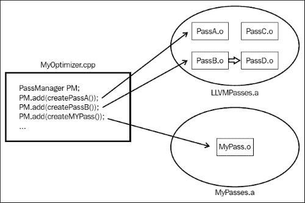

# 第一章. 玩转 LLVM

LLVM 编译器基础设施项目始于 2000 年的伊利诺伊大学，最初是一个研究项目，旨在为任意静态和动态编程语言提供基于现代、SSA 的编译技术。现在它已经发展成为一个包含许多子项目的母项目，提供了一组具有良好定义接口的可重用库。

LLVM 使用 C++ 实现，其核心是它提供的 LLVM 核心库。这些库为我们提供了 opt 工具，即目标无关的优化器，以及针对各种目标架构的代码生成支持。还有其他一些工具使用了核心库，但本书的主要关注点将是上述提到的三个。这些工具围绕 LLVM 中间表示（LLVM IR）构建，几乎可以映射所有高级语言。所以基本上，要使用 LLVM 的优化器和代码生成技术来处理某种编程语言编写的代码，我们只需要编写一个前端，该前端将高级语言转换为 LLVM IR。对于 C、C++、Go、Python 等语言，已经有许多前端可用。在本章中，我们将涵盖以下主题：

+   模块化设计和库集合

+   熟悉 LLVM IR

+   使用命令行使用 LLVM 工具

# 模块化设计和库集合

关于 LLVM 最重要的是它被设计为一个库集合。让我们通过 LLVM 优化器 opt 的例子来理解这些。优化器可以运行许多不同的优化过程。每个过程都作为从 LLVM 的 `Pass` 类派生出的 C++ 类来编写。每个编写的过程都可以编译成一个 **.o** 文件，随后它们被归档到一个 **.a** 库中。这个库将包含 `opt` 工具的所有过程。这个库中的所有过程都是松散耦合的，也就是说，它们明确地说明了对其他过程的依赖。

当优化器运行时，LLVM `PassManager` 使用明确提到的依赖信息，并以最佳方式运行过程。基于库的设计允许实现者选择过程的执行顺序，也可以根据需求选择要执行的过程。只有所需的过程会被链接到最终的应用程序，而不是整个优化器。

下图展示了每个过程如何链接到特定库中的特定对象文件。在下面的图中，**PassA** 引用了 **LLVMPasses.a** 以便为 **PassA.o**，而自定义过程则引用了不同的库 **MyPasses.a** 以便为 **MyPass.o** 对象文件。



代码生成器也像**优化器**一样利用这种模块化设计，将代码生成分割成单独的传递，即指令选择、寄存器分配、调度、代码布局优化和汇编输出。

在以下提到的每个阶段中，几乎每个目标都有一些共同点，例如为虚拟寄存器分配物理寄存器的算法，尽管不同目标的寄存器集合各不相同。因此，编译器编写者可以修改上述提到的每个传递，并创建自定义的目标特定传递。使用`tablegen`工具通过特定架构的表格描述`.td`文件来实现这一点。我们将在本书的后面讨论这是如何发生的。

从这一点产生的另一个能力是能够轻松地将错误定位到优化器中的特定传递。一个名为`Bugpoint`的工具利用这一能力来自动缩减测试用例并定位导致错误的传递。

# 熟悉 LLVM IR

LLVM **中间表示**（**IR**）是 LLVM 项目的核心。一般来说，每个编译器都会生成一个中间表示，在其上运行大多数优化。对于针对多种源语言和不同架构的编译器，在选择 IR 时的重要决策是它既不应非常高级，如非常接近源语言，也不应非常低级，如接近目标机器指令。LLVM IR 旨在成为一种通用的 IR，通过足够低的级别，使得高级思想可以干净地映射到它。理想情况下，LLVM IR 应该是目标无关的，但由于某些编程语言本身固有的目标依赖性，它并非如此。例如，当在 Linux 系统中使用标准 C 头文件时，头文件本身是目标相关的，它可能指定一个特定类型给实体，以便它与特定目标架构的系统调用相匹配。

大多数 LLVM 工具都围绕这个中间表示展开。不同语言的接口生成这种 IR 从高级源语言。LLVM 的优化器工具运行在这个生成的 IR 上以优化代码以获得更好的性能，代码生成器利用这个 IR 进行目标特定的代码生成。这种 IR 有三种等效形式：

+   内存中的编译器 IR

+   磁盘上的位码表示

+   人类可读形式（LLVM 汇编）

现在让我们通过一个例子来看看 LLVM IR 是如何看起来。我们将取一小段 C 代码，并使用 clang 将其转换为 LLVM IR，然后通过将其映射回源语言来理解 LLVM IR 的细节。

```cpp
$ cat add.c
int globvar = 12;

int add(int a) {
return globvar + a;
}

```

使用以下选项的 clang 前端将其转换为 LLVM IR：

```cpp
$ clang -emit-llvm -c -S add.c
$ cat add.ll
; ModuleID = 'add.c'
target datalayout = "e-m:e-i64:64-f80:128-n8:16:32:64-S128"
target triple = "x86_64-unknown-linux-gnu"

@globvar = global i32 12, align 4

; Function Attrs: nounwind uwtable
define i32 @add(i32 %a) #0 {
 %1 = alloca i32, align 4
 store i32 %a, i32* %1, align 4
 %2 = load i32, i32* @globvar, align 4
 %3 = load i32, i32* %1, align 4
 %4 = add nsw i32 %2, %3
 ret i32 %4
}

attributes #0 = { nounwind uwtable "less-precise-fpmad"="false" "no-frame-pointer-elim"="true" "no-frame-pointer-elim-non-leaf" "no-infs-fp-math"="false" "no-nans-fp-math"="false" "stack-protector-buffer-size"="8" "target-cpu"="x86-64" "unsafe-fp-math"="false" "use-soft-float"="false" }

!llvm.ident = !{!0}

```

现在，让我们来看看生成的 IR，看看它究竟是什么。你可以看到第一行给出了 ModuleID，它定义了 `add.c` 文件的 LLVM 模块。LLVM 模块是一个顶层数据结构，包含了整个输入 LLVM 文件的内容。它由函数、全局变量、外部函数原型和符号表条目组成。

以下几行显示了目标数据布局和目标三元组，我们可以从中知道目标是运行 Linux 的 x86_64 处理器。`datalayout` 字符串告诉我们机器的字节序（'`e`' 表示小端字节序），以及名称修饰（`m : e` 表示 elf 类型）。每个规范由 '`–`' 分隔，每个后续规范都提供了有关该类型及其大小的信息。例如，`i64:64` 表示 64 位整数是 64 位。

然后我们有一个全局变量 `globvar`。在 LLVM IR 中，所有全局变量都以 '`@`' 开头，所有局部变量都以 '`%`' 开头。变量前缀这些符号有两个主要原因。第一个原因是，编译器不必担心与保留字发生名称冲突，另一个原因是编译器可以快速生成一个临时名称，而无需担心与符号表冲突。这个第二个特性对于将 IR 表示为 **静态单赋值**（**SSA**）非常有用，其中每个变量只被赋值一次，每个变量的使用都紧随其定义。因此，在将普通程序转换为 SSA 形式时，我们为每个变量的重新定义创建一个新的临时名称，并限制早期定义的范围直到这个重新定义。

LLVM 将全局变量视为指针，因此需要使用加载指令显式地解引用全局变量。同样，要存储一个值，也需要使用显式存储指令。

局部变量分为两类：

+   **寄存器分配的局部变量**：这些是临时变量和分配的虚拟寄存器。在代码生成阶段，虚拟寄存器会被分配到物理寄存器中，我们将在本书的后续章节中看到这一点。它们是通过为变量使用新的符号来创建的：

    ```cpp
    %1 = some value

    ```

+   **栈分配的局部变量**：这些是通过在当前执行函数的栈帧上分配变量，使用 `alloca` 指令创建的。`alloca` 指令提供了一个指向分配类型的指针，需要显式使用加载和存储指令来访问和存储值。

    ```cpp
    %2 = alloca i32

    ```

现在我们来看看在 LLVM IR 中 `add` 函数是如何表示的。`define i32 @add(i32 %a)` 与 C 语言中函数的声明非常相似。它指定了函数返回整数类型 `i32` 并接受一个整数参数。此外，函数名前有一个 '`@`' 符号，意味着它具有全局可见性。

函数内部是实际的功能处理。在此处需要注意的一些重要事项是，LLVM 使用三地址指令，即数据处理指令，它有两个源操作数并将结果放置在单独的目标操作数中（`%4 = add i32 %2, %3`）。此外，代码是 SSA 形式，即 IR 中的每个值都有一个单独的赋值定义了该值。这对于许多优化非常有用。

在生成的 IR 中跟随的属性字符串指定了函数属性，这些属性与 C++ 属性非常相似。这些属性是为已定义的函数设置的。对于每个定义的函数，在 LLVM IR 中都有一组属性定义。

属性之后的代码是为 `ident` 指令设置的，该指令用于标识模块和编译器版本。

# LLVM 工具及其在命令行中的使用。

到目前为止，我们已经了解了 LLVM IR（可读形式）是什么以及它是如何用来表示高级语言的。现在，我们将查看一些 LLVM 提供的工具，这样我们就可以对这个 IR 进行格式转换，并再次转换回原始形式。让我们逐一查看这些工具，并附带示例。

+   **llvm-as**: 这是 LLVM 汇编器，它将汇编形式的 LLVM IR（可读）转换为位码格式。使用前面的 `add.ll` 作为示例将其转换为位码。要了解更多关于 LLVM 位码文件格式，请参阅 [`llvm.org/docs/BitCodeFormat.html`](http://llvm.org/docs/BitCodeFormat.html)。

    ```cpp
    $ llvm-as add.ll –o add.bc

    ```

    要查看此位码文件的内容，可以使用 `hexdump` 等工具。

    ```cpp
    $ hexdump –c add.bc

    ```

+   **llvm-dis**: 这是 LLVM 反汇编器。它接受位码文件作为输入，并输出 llvm 汇编。

    ```cpp
    $ llvm-dis add.bc –o add.ll

    ```

    如果你检查 `add.ll` 并与之前的版本进行比较，它将与之前的版本相同。

+   **llvm-link**: llvm-link 将两个或多个 llvm 位码文件链接起来，并输出一个 llvm 位码文件。要查看演示，请编写一个 `main.c` 文件，该文件调用 `add.c` 文件中的函数。

    ```cpp
    $ cat main.c
    #include<stdio.h>

    extern int add(int);

    int main() {
    int a = add(2);
    printf("%d\n",a);
    return 0;
    }

    ```

    使用以下命令将 C 源代码转换为 LLVM 位码格式。

    ```cpp
    $ clang -emit-llvm -c main.c

    ```

    现在将 `main.bc` 和 `add.bc` 链接起来生成 `output.bc`。

    ```cpp
    $ llvm-link main.bc add.bc -o output.bc

    ```

+   **lli**: lli 使用即时编译器或解释器直接执行 LLVM 位码格式的程序，如果当前架构有可用的解释器。lli 不像虚拟机，不能执行不同架构的 IR，只能为宿主架构进行解释。使用由 llvm-link 生成的位码格式文件作为 lli 的输入。它将在标准输出上显示输出。

    ```cpp
    $ lli output.bc
    14

    ```

+   **llc**: llc 是一个静态编译器。它将 LLVM 输入（汇编形式/位码形式）编译成指定架构的汇编语言。在以下示例中，它将由 llvm-link 生成的 `output.bc` 文件转换为汇编文件 `output.s`。

    ```cpp
    $ llc output.bc –o output.s

    ```

    让我们来看看`output.s`汇编的内容，特别是生成的代码的两个函数，这与本地汇编器生成的代码非常相似。

    ```cpp
    Function main:
      .type  main,@function
    main:                                   # @main
      .cfi_startproc
    # BB#0:
      pushq  %rbp
    .Ltmp0:
      .cfi_def_cfa_offset 16
    .Ltmp1:
      .cfi_offset %rbp, -16
      movq  %rsp, %rbp
    .Ltmp2:
      .cfi_def_cfa_register %rbp
      subq  $16, %rsp
      movl  $0, -4(%rbp)
      movl  $2, %edi
      callq  add
      movl  %eax, %ecx
      movl  %ecx, -8(%rbp)
      movl  $.L.str, %edi
      xorl  %eax, %eax
      movl  %ecx, %esi
      callq  printf
      xorl  %eax, %eax
      addq  $16, %rsp
      popq  %rbp
      retq
    .Lfunc_end0:

    Function: add
    add:                                    # @add
      .cfi_startproc
    # BB#0:
      pushq  %rbp
    .Ltmp3:
      .cfi_def_cfa_offset 16
    .Ltmp4:
      .cfi_offset %rbp, -16
      movq  %rsp, %rbp
    .Ltmp5:
      .cfi_def_cfa_register %rbp
      movl  %edi, -4(%rbp)
      addl  globvar(%rip), %edi
      movl  %edi, %eax
      popq  %rbp
      retq
    .Lfunc_end1:
    ```

+   `函数内联`

+   `**instcombine**`**: 用于合并冗余指令**

+   ****licm**: 循环不变量代码移动**

+   ****tailcallelim**: 尾调用消除**

### **注意**

**在继续之前，我们必须注意，本章中提到的所有工具都是为编译器编写者准备的。最终用户可以直接使用 clang 编译 C 代码，而无需将 C 代码转换为中间表示形式**

### **提示**

****下载示例代码**

**您可以从[`www.packtpub.com`](http://www.packtpub.com)上的账户下载示例代码文件，以获取您购买的所有 Packt Publishing 书籍。如果您在其他地方购买了这本书，您可以访问[`www.packtpub.com/support`](http://www.packtpub.com/support)并注册，以便将文件直接通过电子邮件发送给您。**

**# 摘要**

在本章中，我们探讨了 LLVM 的模块化设计：它在 LLVM 的 opt 工具中的应用，以及它在 LLVM 核心库中的应用。然后我们查看 LLVM 中间表示，以及语言的各种实体（变量、函数等）如何映射到 LLVM IR。在最后一节中，我们讨论了一些重要的 LLVM 工具，以及如何使用它们将 LLVM IR 从一种形式转换为另一种形式。

在下一章中，我们将看到如何使用 LLVM 工具编写一个可以输出 LLVM IR 的语言前端。**
