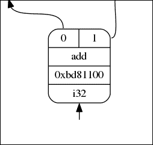
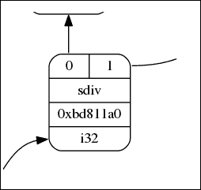
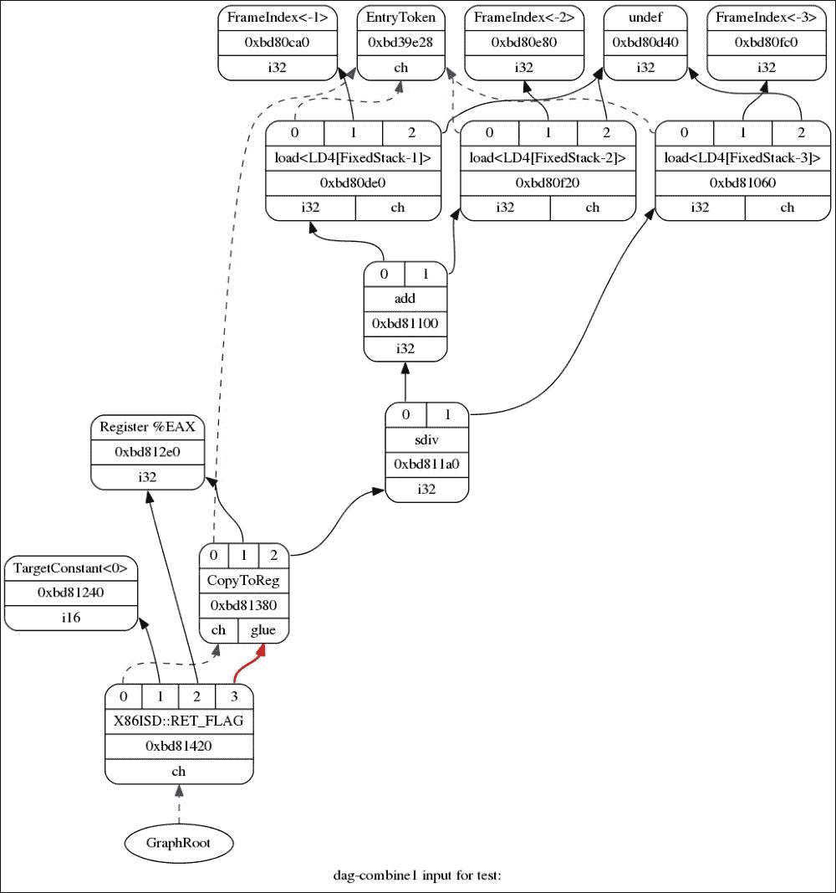
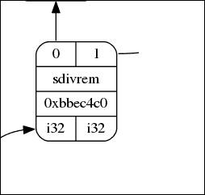
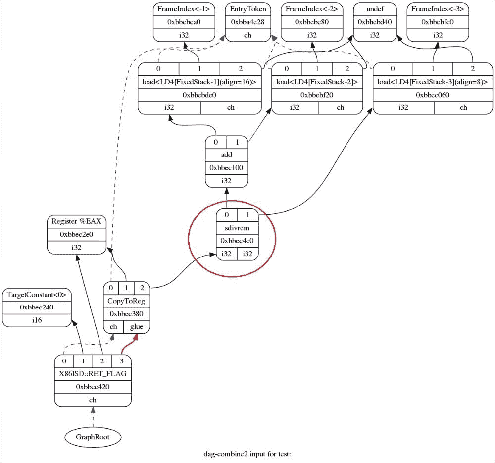
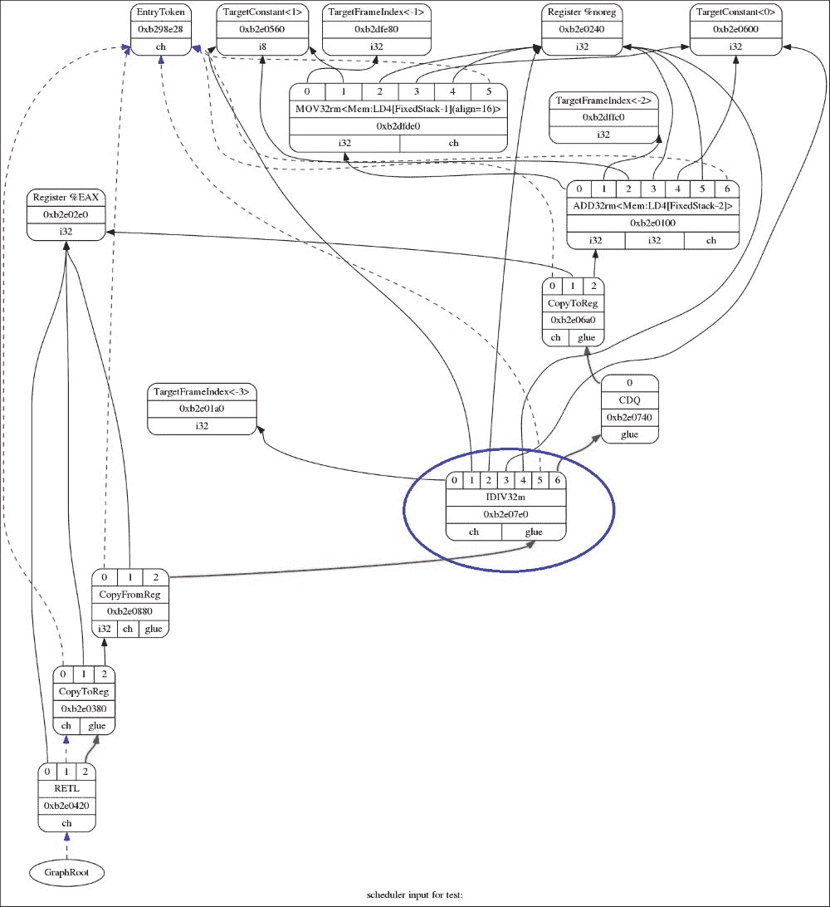

# 第六章：IR 到 Selection DAG 阶段

到上一章为止，我们看到了如何将前端语言转换为 LLVM IR。我们还看到了如何将 IR 转换为更优化的代码。经过一系列分析和转换过程后，最终的 IR 是最优化的机器无关代码。然而，IR 仍然是实际机器代码的抽象表示。编译器必须为目标架构生成执行代码。

LLVM 使用 DAG（有向无环图）来表示代码生成。其思路是将 IR 转换为`SelectionDAG`，然后经过一系列阶段——DAG 合并、合法化、指令选择、指令调度等，最终分配寄存器并生成机器代码。请注意，寄存器分配和指令调度是交织进行的。

在本章中，我们将介绍以下主题：

+   将 IR 转换为 selectionDAG

+   合法化 selectionDAG

+   优化 selectionDAG

+   指令选择

+   调度和生成机器指令

+   寄存器分配

+   代码生成

# 将 IR 转换为 selectionDAG

一个 IR 指令可以由一个 SDAG 节点表示。因此，整个指令集形成一个相互连接的有向无环图，每个节点对应一个 IR 指令。

例如，考虑以下 LLVM IR：

```cpp
$ cat test.ll
define i32 @test(i32 %a, i32 %b, i32 %c) {
%add = add nsw i32 %a, %b
%div = sdiv i32 %add, %c
ret i32 %div
}

```

LLVM 提供了一个`SelectionDAGBuilder`接口来创建与 IR 指令对应的 DAG 节点。考虑以下二进制运算：

```cpp
 %add = add nsw i32 %a, %b

```

当遇到给定的 IR 时，将调用以下函数：

```cpp
void SelectionDAGBuilder::visit(unsigned Opcode, const User &I) {
  // Note: this doesn't use InstVisitor, because it has to work with
  // ConstantExpr's in addition to instructions.
  switch (Opcode) {
  default: llvm_unreachable("Unknown instruction type encountered!");
    // Build the switch statement using the Instruction.def file.
#define HANDLE_INST(NUM, OPCODE, CLASS) \
    case Instruction::OPCODE: visit##OPCODE((const CLASS&)I); break;
#include "llvm/IR/Instruction.def"
  }
}
```

根据操作码（此处为`Add`），将调用相应的访问函数。在这种情况下，调用`visitAdd()`，它进一步调用`visitBinary()`函数。`visitBinary()`函数如下：

```cpp
void SelectionDAGBuilder::visitBinary(const User &I, unsigned OpCode) {
 SDValue Op1 = getValue(I.getOperand(0));
 SDValue Op2 = getValue(I.getOperand(1));

  bool nuw = false;
  bool nsw = false;
  bool exact = false;
  FastMathFlags FMF;

  if (const OverflowingBinaryOperator *OFBinOp =
          dyn_cast<const OverflowingBinaryOperator>(&I)) {
    nuw = OFBinOp->hasNoUnsignedWrap();
    nsw = OFBinOp->hasNoSignedWrap();
  }
  if (const PossiblyExactOperator *ExactOp =
          dyn_cast<const PossiblyExactOperator>(&I))
    exact = ExactOp->isExact();
  if (const FPMathOperator *FPOp = dyn_cast<const FPMathOperator>(&I))
    FMF = FPOp->getFastMathFlags();

  SDNodeFlags Flags;
  Flags.setExact(exact);
  Flags.setNoSignedWrap(nsw);
  Flags.setNoUnsignedWrap(nuw);
  if (EnableFMFInDAG) {
    Flags.setAllowReciprocal(FMF.allowReciprocal());
    Flags.setNoInfs(FMF.noInfs());
    Flags.setNoNaNs(FMF.noNaNs());
    Flags.setNoSignedZeros(FMF.noSignedZeros());
    Flags.setUnsafeAlgebra(FMF.unsafeAlgebra());
  }
 SDValue BinNodeValue = DAG.getNode(OpCode, getCurSDLoc(), Op1.getValueType(), Op1, Op2, &Flags);
  setValue(&I, BinNodeValue);
}
```

此函数从 IR 的二进制运算符中获取两个操作数并将它们存储到`SDValue`类型中。然后它使用二进制运算符的操作码调用`DAG.getNode()`函数。这导致形成一个 DAG 节点，其外观大致如下：



操作数`0`和`1`是加载 DAG 节点。

考虑以下中间表示（IR）：

```cpp
%div = sdiv i32 %add, %c

```

遇到`sdiv`指令时，将调用`visitSDiv()`函数。

```cpp
void SelectionDAGBuilder::visitSDiv(const User &I) {
  SDValue Op1 = getValue(I.getOperand(0));
  SDValue Op2 = getValue(I.getOperand(1));

  SDNodeFlags Flags;
  Flags.setExact(isa<PossiblyExactOperator>(&I) &&
                 cast<PossiblyExactOperator>(&I)->isExact());
  setValue(&I, DAG.getNode(ISD::SDIV, getCurSDLoc(), Op1.getValueType(), Op1, Op2, &Flags));
}
```

与`visitBinary()`类似，此函数也将两个操作数存储到`SDValue`中，并获取一个具有`ISD::SDIV`作为其运算符的 DAG 节点。节点的外观如下：



在我们的 IR 中，操作数 0 是`%add`。操作数`1`是`%c`，它作为参数传递给函数，在将 IR 转换为`SelectionDAG`时转换为加载节点。关于加载 DAG 节点的实现，请查阅`lib/CodeGen/SelectionDAG/SelectionDAGBuilder.cpp`文件中的`visitLoad()`函数。

在访问所有前面提到的 IR 指令后，最终将 IR 转换为以下`SelectionDAG`：



在前面的图中，请注意以下几点：

+   黑色箭头表示数据流依赖关系

+   红色箭头表示粘合依赖

+   蓝色虚线箭头表示链式依赖

Glue 防止两个节点在调度过程中被拆分。链式依赖防止具有副作用节点。数据依赖表示指令依赖于先前指令的结果。

# 合法化 SelectionDAG

在前一个主题中，我们看到了如何将 IR 转换为 `SelectionDAG`。整个过程没有涉及任何关于我们试图为其生成代码的目标架构的知识。DAG 节点可能对给定的目标架构是非法的。例如，X86 架构不支持 `sdiv` 指令。相反，它支持 `sdivrem` 指令。这种特定于目标的信息通过 `TargetLowering` 接口传达给 `SelectionDAG` 阶段。目标实现此接口来描述如何将 LLVM IR 指令降低为合法的 `SelectionDAG` 操作。

在我们的 IR 情况中，我们需要将 `sdiv` 指令扩展为 `'sdivrem'` 指令。在函数 `void SelectionDAGLegalize::LegalizeOp(SDNode *Node)` 中，遇到了 `TargetLowering::Expand` 情况，这会在该特定节点上调用 `ExpandNode()` 函数调用。

```cpp
void SelectionDAGLegalize::LegalizeOp(SDNode *Node){
…
…
case TargetLowering::Expand:
      ExpandNode(Node);
      return;
…
…
}
```

此函数将 SDIV 扩展到 SDIVREM 节点：

```cpp
case ISD::SDIV: {
    bool isSigned = Node->getOpcode() == ISD::SDIV;
    unsigned DivRemOpc = isSigned ? ISD::SDIVREM : ISD::UDIVREM;
    EVT VT = Node->getValueType(0);
    SDVTList VTs = DAG.getVTList(VT, VT);
    if (TLI.isOperationLegalOrCustom(DivRemOpc, VT) ||
        (isDivRemLibcallAvailable(Node, isSigned, TLI) &&
         useDivRem(Node, isSigned, true)))
      Tmp1 = DAG.getNode(DivRemOpc, dl, VTs, Node->getOperand(0),
                         Node->getOperand(1));
    else if (isSigned)
      Tmp1 = ExpandIntLibCall(Node, true,
                              RTLIB::SDIV_I8,
                              RTLIB::SDIV_I16, RTLIB::SDIV_I32,
                              RTLIB::SDIV_I64, RTLIB::SDIV_I128);
    else
      Tmp1 = ExpandIntLibCall(Node, false,
                              RTLIB::UDIV_I8,
                              RTLIB::UDIV_I16, RTLIB::UDIV_I32,
                              RTLIB::UDIV_I64, RTLIB::UDIV_I128);
    Results.push_back(Tmp1);
    break;
  }
```

最后，在合法化之后，节点变为 `ISD::SDIVREM`：



因此，上述指令已被 `'legalized'` 映射到目标架构上支持的指令。我们上面看到的是一个扩展合法化的示例。还有两种其他类型的合法化——提升和自定义。提升将一种类型提升到更大的类型。自定义合法化涉及特定于目标的钩子（可能是一个自定义操作——通常与 IR 内置函数一起看到）。我们将这些留给读者在 `CodeGen` 阶段进一步探索。

# 优化 SelectionDAG

在将 IR 转换为 `SelectionDAG` 之后，可能会出现许多优化 DAG 本身的机会。这些优化发生在 `DAGCombiner` 阶段。这些机会可能由于一组特定于架构的指令而出现。

让我们举一个例子：

```cpp
#include <arm_neon.h>
unsigned hadd(uint32x4_t a) {
  return a[0] + a[1] + a[2] + a[3];
}
```

IR 中的前一个示例看起来如下：

```cpp
define i32 @hadd(<4 x i32> %a) nounwind {
  %vecext = extractelement <4 x i32> %a, i32 3
  %vecext1 = extractelement <4 x i32> %a, i32 2
  %add = add i32 %vecext, %vecext1
  %vecext2 = extractelement <4 x i32> %a, i32 1
  %add3 = add i32 %add, %vecext2
  %vecext4 = extractelement <4 x i32> %a, i32 0
  %add5 = add i32 %add3, %vecext4
  ret i32 %add5
}
```

示例基本上是从 `<4xi32>` 向量中提取单个元素，并将向量的每个元素相加得到一个标量结果。

高级架构，如 ARM，有一个单独的指令来完成前面的操作——对单个向量进行加法。SDAG 需要通过在 `SelectionDAG` 中识别前面的模式来合并成一个 DAG 节点。

这可以在 `AArch64DAGToDAGISel` 中选择指令时完成。

```cpp
 SDNode *AArch64DAGToDAGISel::Select(SDNode *Node) {
…
…
  case ISD::ADD: {
     if (SDNode *I = SelectMLAV64LaneV128(Node))
       return I;
    if (SDNode *I = SelectADDV(Node))
 return I;
     break;
  }
}
```

我们定义 `SelectADDV()` 函数如下：

```cpp
SDNode *AArch64DAGToDAGISel::SelectADDV(SDNode *N) {
  if (N->getValueType(0) != MVT::i32)
    return nullptr;
  SDValue SecondAdd;
  SDValue FirstExtr;
  if (!checkVectorElemAdd(N, SecondAdd, FirstExtr))
    return nullptr;

  SDValue Vector = FirstExtr.getOperand(0);
  if (Vector.getValueType() != MVT::v4i32)
    return nullptr;

  uint64_t LaneMask = 0;
  ConstantSDNode *LaneNode = cast<ConstantSDNode>(FirstExtr->getOperand(1));
  LaneMask |= 1 << LaneNode->getZExtValue();

  SDValue ThirdAdd;
  SDValue SecondExtr;
  if (!checkVectorElemAdd(SecondAdd.getNode(), ThirdAdd, SecondExtr))
    return nullptr;
  if (Vector != SecondExtr.getOperand(0))
    return nullptr;
  ConstantSDNode *LaneNode2 = cast<ConstantSDNode>(SecondExtr->getOperand(1));
  LaneMask |= 1 << LaneNode2->getZExtValue();
  SDValue LHS = ThirdAdd.getOperand(0);
  SDValue RHS = ThirdAdd.getOperand(1);
  if (LHS.getOpcode() != ISD::EXTRACT_VECTOR_ELT ||
      RHS.getOpcode() != ISD::EXTRACT_VECTOR_ELT ||
      LHS.getOperand(0) != Vector ||
      RHS.getOperand(0) != Vector)
    return nullptr;
  ConstantSDNode *LaneNode3 = cast<ConstantSDNode>(LHS->getOperand(1));
  LaneMask |= 1 << LaneNode3->getZExtValue();
  ConstantSDNode *LaneNode4 = cast<ConstantSDNode>(RHS->getOperand(1));
  LaneMask |= 1 << LaneNode4->getZExtValue();
  if (LaneMask != 0x0F)
    return nullptr;
  return CurDAG->getMachineNode(AArch64::ADDVv4i32v, SDLoc(N), MVT::i32,
                                Vector);
}
```

注意，我们之前已经定义了一个辅助函数 `checkVectorElemAdd()` 来检查加法选择 DAG 节点的链。

```cpp
static bool checkVectorElemAdd(SDNode *N, SDValue &Add, SDValue &Extr) {
  SDValue Op0 = N->getOperand(0);
  SDValue Op1 = N->getOperand(1);
  const unsigned Opc0 = Op0->getOpcode();
  const unsigned Opc1 = Op1->getOpcode();

  const bool AddLeft  = (Opc0 == ISD::ADD && Opc1 == ISD::EXTRACT_VECTOR_ELT);
  const bool AddRight = (Opc0 == ISD::EXTRACT_VECTOR_ELT && Opc1 == ISD::ADD);

  if (!(AddLeft || AddRight))
    return false;

  Add  = AddLeft ? Op0 : Op1;
  Extr = AddLeft ? Op1 : Op0;
  return true;
}
```

让我们看看这如何影响代码生成：

```cpp
$ llc -mtriple=aarch64-linux-gnu -verify-machineinstrs hadd.ll

```

在前面的代码之前，生成的最终代码将如下所示：

```cpp
  mov  w8, v0.s[3]
  mov  w9, v0.s[2]
  add  w8, w8, w9
  mov  w9, v0.s[1]
  add  w8, w8, w9
  fmov  w9, s0
  add  w0, w8, w9
  ret
```

显然，前面的代码是标量代码。在添加前面的补丁并编译后，生成的代码将如下所示：

```cpp
  addv  s0, v0.4s
  fmov  w0, s0
  ret
```

# 指令选择

在这个阶段，`SelectionDAG` 已优化并合法化。然而，指令仍然不是机器代码形式。这些指令需要在 `SelectionDAG` 本身中映射到特定于架构的指令。`TableGen` 类帮助选择特定于目标的指令。

`CodeGenAndEmitDAG()` 函数调用 `DoInstructionSelection()` 函数，该函数遍历每个 DAG 节点并为每个节点调用 Select() 函数。`Select()` 函数是 targets 实现以选择节点的主要钩子。`Select()` 函数是一个由 targets 实现的虚拟方法。

为了考虑，假设我们的目标架构是 X86。`X86DAGToDAGISel::Select()` 函数拦截一些节点进行手动匹配，但将大部分工作委托给 `X86DAGToDAGISel::SelectCode()` 函数。`X86DAGToDAGISel::SelectCode()` 函数由 `TableGen` 自动生成。它包含匹配器表，然后调用通用的 `SelectionDAGISel::SelectCodeCommon()` 函数，并传递该表。

```cpp
SDNode *ResNode = SelectCode(Node);
```

例如，考虑以下：

```cpp
$ cat test.ll
define i32 @test(i32 %a, i32 %b, i32 %c) {
%add = add nsw i32 %a, %b
%div = sdiv i32 %add, %c
ret i32 %div
}

```

在指令选择之前，SDAG 看起来如下：

```cpp
$ llc –view-isel-dags test.ll

```



在指令选择之后，SDAG 看起来如下：

```cpp
$ llc –view-sched-dags test.ll

```



# 调度和发出机器指令

到目前为止，我们一直在 DAG 上执行操作。现在，为了机器能够执行，我们需要将 DAG 转换为机器可以执行的指令。朝着这个方向迈出的一步是将指令列表输出到 `MachineBasicBlock`。这是通过 `Scheduler` 完成的，其目标是线性化 DAG。调度依赖于目标架构，因为某些 Targets 将具有影响调度的特定于目标的钩子。

类 `InstrEmitter::EmitMachineNode` 将 `SDNode *Node` 作为输入参数之一，它将为该参数发出 `MachineInstr` 类的机器指令。这些指令被输出到 `MachineBasicBlock`。

该函数分别调用 `EmitSubregNode`、`EmitCopyToRegClassNode` 和 `EmitRegSequence` 来处理 `subreg` 插入/提取、`COPY_TO_REGCLASS` 和 `REG_SEQUENCE`。

调用 `MachineInstrBuilder` `MIB = BuildMI(*MF, Node->getDebugLoc(), II);` 用于构建机器指令。调用 `CreateVirtualRegisters` 函数以添加由该指令创建的结果寄存器值。

`for` 循环发出指令的操作数：

```cpp
for (unsigned i = NumSkip; i != NodeOperands; ++i)
    AddOperand(MIB, Node->getOperand(i), i-NumSkip+NumDefs, &II,
               VRBaseMap, /*IsDebug=*/false, IsClone, IsCloned);
MBB->insert(InsertPos, MIB); 
```

它将指令插入到 `MachineBasicBlock` 中的位置。

以下代码标记了未使用的寄存器为死亡：

```cpp
if (!UsedRegs.empty() || II.getImplicitDefs())
    MIB->setPhysRegsDeadExcept(UsedRegs, *TRI);
```

如我们之前讨论的那样，特定于目标的钩子会影响调度，该函数中的代码如下：

```cpp
if (II.hasPostISelHook())
    TLI->AdjustInstrPostInstrSelection(MIB, Node);
```

`AdjustInstrPostInstrSelection` 是由 Targets 实现的一个虚拟函数。

让我们通过一个例子来看看这一步生成的机器指令。为此，我们需要将命令行选项`-print-machineinstrs`传递给`llc`工具。让我们使用之前相同的`testcode`：

```cpp
$ cat test.ll
define i32 @test(i32 %a, i32 %b, i32 %c) {
%add = add nsw i32 %a, %b
%div = sdiv i32 %add, %c
ret i32 %div
}

```

现在，调用`llc`命令并将`–print-machineinstrs`传递给它。将`test.ll`作为输入文件，并将输出存储在输出文件中：

```cpp
llc -print-machineinstrs test.ll > outfile 2>&1

```

`outfile`很大，包含除调度之外许多其他代码生成阶段的输出。我们需要查看输出文件中`# After Instruction Selection:`后面的部分，如下所示：

```cpp
# After Instruction Selection:
# Machine code for function test: SSA
Function Live Ins: %EDI in %vreg0, %ESI in %vreg1, %EDX in %vreg2
BB#0: derived from LLVM BB %0
    Live Ins: %EDI %ESI %EDX
        %vreg2<def> = COPY %EDX; GR32:%vreg2
        %vreg1<def> = COPY %ESI; GR32:%vreg1
        %vreg0<def> = COPY %EDI; GR32:%vreg0
        %vreg3<def,tied1> = ADD32rr %vreg0<tied0>, %vreg1, %EFLAGS<imp-def,dead>; GR32:%vreg3,%vreg0,%vreg1
        %EAX<def> = COPY %vreg3; GR32:%vreg3
        CDQ %EAX<imp-def>, %EDX<imp-def>, %EAX<imp-use>
        IDIV32r %vreg2, %EAX<imp-def>, %EDX<imp-def,dead>, %EFLAGS<imp-def,dead>, %EAX<imp-use>, %EDX<imp-use>; GR32:%vreg2
        %vreg4<def> = COPY %EAX; GR32:%vreg4
        %EAX<def> = COPY %vreg4; GR32:%vreg4
        RETQ %EAX
# End machine code for function test.
```

我们可以在输出中看到某些位置被物理寄存器占用，而一些则由虚拟寄存器占用。我们还可以在输出中看到机器指令`IDIV32r`。在下一节中，我们将看到物理寄存器是如何分配给代码中存在的这些虚拟寄存器的。

# 寄存器分配

代码生成器的下一步是寄存器分配。正如我们在前面的例子中所看到的，一些正在使用的寄存器是虚拟寄存器。寄存器分配是将物理寄存器分配给这些虚拟寄存器的任务。在 LLVM 中，虚拟寄存器的数量可以是无限的，但物理寄存器的数量取决于目标，是有限的。因此，通过寄存器分配，我们旨在最大化分配给虚拟寄存器的物理寄存器数量。我们必须注意，物理寄存器的数量是有限的，因此并不是所有的虚拟寄存器都可以分配到物理寄存器。如果在某个时刻没有可用的物理寄存器，而我们需要一个物理寄存器来存储变量，我们可能会将存在于物理寄存器中的变量移动到主存储器中，从而将释放的寄存器分配给我们要存储的变量。将变量从物理寄存器移动到内存的过程称为**溢出**。有各种算法来计算应该从寄存器溢出到内存中的变量。

寄存器分配器扮演的另一个重要角色是 SSA 形式的分解。到目前为止，机器指令中存在的 phi 指令需要被替换为常规指令。传统的方法是将它替换为复制指令。

必须注意的是，一些机器片段已经分配了寄存器。这是由于目标要求，它希望某些寄存器固定到某些操作上。除了这些固定的寄存器之外，寄存器分配器负责处理其余的非固定寄存器。

将虚拟寄存器映射到物理寄存器的寄存器分配可以通过以下两种方式完成：

+   **直接映射**：它使用`TargetRegisterInfo`类和`MachineOperand`类。在这种情况下，开发者需要提供插入加载和存储指令的位置，以从内存中获取值并将值存储在内存中。

+   **间接映射**：在这里，`VirtRegMap` 类负责插入加载和存储操作。它也从内存中获取值并将值存储到内存中。我们需要使用 `VirtRegMap::assignVirt2Phys(vreg, preg)` 函数来将虚拟寄存器映射到物理寄存器。

LLVM 有四种寄存器分配技术。我们将简要地看看它们是什么，而不深入到算法的细节。这四个分配器如下：

+   **基本寄存器分配器**：这是所有技术中最基本的寄存器分配技术。它可以作为实现其他寄存器分配技术的起点。该算法使用溢出权重来优先处理虚拟寄存器。权重最小的虚拟寄存器将分配到寄存器。当没有物理寄存器可用时，虚拟寄存器将被溢出到内存中。

+   **快速寄存器分配器**：这种分配是在基本块级别上进行的，并试图通过延长寄存器中值的保留时间来重用寄存器中的值。

+   **PBQP 寄存器分配器**：如该寄存器分配器的源代码文件（`llvm/lib/CodeGen/RegAllocPBQP.cpp`）中所述，这个分配器通过将寄存器分配器表示为 PBQP 问题，然后使用 PBQP 求解器来解决它。

+   **贪婪寄存器分配器**：这是 LLVM 中效率较高的分配器之一，它跨函数工作。其分配是通过分割活动范围和最小化溢出成本来完成的。

让我们用一个例子来看看之前测试代码 `test.ll` 的寄存器分配，看看 vregs 是如何被实际寄存器替换的。让我们以贪婪分配器为例。你也可以选择其他任何分配器。使用的目标机器是 x86-64 机器。

```cpp
$ llc test.ll –regalloc=greedy –o test1.s
$ cat test1.s
 .text
 .file  "test.ll"
 .globl  test
 .align  16, 0x90
 .type  test,@function
test:                                   # @test
 .cfi_startproc
# BB#0:
 movl  %edx, %ecx
 leal  (%rdi,%rsi), %eax
 cltd
 idivl  %ecx
 retq
.Lfunc_end0:
 .size  test, .Lfunc_end0-test
 .cfi_endproc
 .section  ".note.GNU-stack","",@progbits

```

我们可以看到现在所有的 vregs 都已经消失了，并被实际寄存器所替换。这里使用的机器是 x86-64。你可以尝试使用 `pbqp` 分配器进行寄存器分配，看看分配的差异。`leal (%rdi,%rsi), %eax` 指令将被以下指令替换：

```cpp
movl  %esi, %edx
movl  %edi, %eax
leal  (%rax, %rdx), %eax.
```

# 代码生成

我们在第一部分从 LLVM IR 开始，将其转换为 `SelectioDAG`，然后转换为 `MachineInstr`。现在，我们需要生成这段代码。目前，我们有 LLVM JIT 和 MC 来完成这个任务。LLVM JIT 是在内存中直接生成目标对象代码的传统方式。我们更感兴趣的是 LLVM MC 层。

MC 层负责从之前步骤传递给它的 `MachineInstr` 生成汇编文件/对象文件。在 MC 层中，指令以 `MCInst` 的形式表示，它们是轻量级的，也就是说，它们不携带关于程序的信息，如 `MachineInstr`。

代码发射从`AsmPrinter`类开始，该类被目标特定的`AsmPrinter`类重载。这个类通过使用目标特定的`MCInstLowering`接口（对于 x86 是`lib/Target/x86/X86MCInstLower.cpp`文件中的`X86MCInstLower`类）将`MachineFunction`函数转换为 MC 标签结构，处理一般的降低过程。

现在，我们有了`MCInst`指令，这些指令被传递给`MCStreamer`类，以进行生成汇编文件或目标代码的下一步。根据`MCStreamer`的选择，它使用其子类`MCAsmStreamer`生成汇编代码，并使用`MCObjectStreamer`生成目标代码。

目标特定的`MCInstPrinter`由`MCAsmStreamer`调用以打印汇编指令。要生成二进制代码，`MCObjectStreamer`通过`MCObjectStreamer`调用 LLVM 对象代码汇编器。汇编器反过来调用`MCCodeEmitter::EncodeInstruction()`以生成二进制指令。

我们必须注意，MC 层是 LLVM 和 GCC 之间的一大区别。GCC 总是输出汇编，然后需要一个外部汇编器将这个汇编转换成目标文件，而对于 LLVM，使用它自己的汇编器，我们可以轻松地以二进制形式打印指令，并通过在它们周围添加一些包装来直接生成目标文件。这不仅保证了以文本或二进制形式输出的内容将相同，而且通过移除对外部过程的调用，比 GCC 节省了时间。

现在，让我们通过使用`llc`工具查看与汇编对应的 MC 指令的例子。我们使用本章前面使用的相同测试代码`test.ll`文件。

要查看 MC 指令，我们需要将命令行选项`–asm-show-inst`传递给`llc`。它将以汇编文件注释的形式显示 MC 指令。

```cpp
llc test.ll -asm-show-inst -o -
  .text
  .file  "test.ll"
  .globl  test
  .align  16, 0x90
  .type  test,@function
test:                                   # @test
  .cfi_startproc
# BB#0:
  movl  %edx, %ecx              # <MCInst #1674 MOV32rr
                                        #  <MCOperand Reg:22>
                                        #  <MCOperand Reg:24>>
  leal  (%rdi,%rsi), %eax       # <MCInst #1282 LEA64_32r
                                        #  <MCOperand Reg:19>
                                        #  <MCOperand Reg:39>
                                        #  <MCOperand Imm:1>
                                        #  <MCOperand Reg:43>
                                        #  <MCOperand Imm:0>
                                        #  <MCOperand Reg:0>>
  cltd                            # <MCInst #388 CDQ>
  idivl  %ecx                    # <MCInst #903 IDIV32r
                                        #  <MCOperand Reg:22>>
  retq                            # <MCInst #2465 RETQ
                                        #  <MCOperand Reg:19>>
.Lfunc_end0:
  .size  test, .Lfunc_end0-test
  .cfi_endproc

  .section  ".note.GNU-stack","",@progbits
```

我们在汇编注释中看到`MCInst`和`MCOperands`。我们还可以通过将选项`–show-mc-encoding`传递给`llc`来在汇编注释中查看二进制编码。

```cpp
$ llc test.ll -show-mc-encoding -o -
 .text 
 .file  "test.ll"
 .globl  test
 .align  16, 0x90
 .type  test,@function
test:                                   # @test
 .cfi_startproc
# BB#0:
 movl  %edx, %ecx              # encoding: [0x89,0xd1]
 leal  (%rdi,%rsi), %eax       # encoding: [0x8d,0x04,0x37]
 cltd                            # encoding: [0x99]
 idivl  %ecx                    # encoding: [0xf7,0xf9]
 retq                            # encoding: [0xc3]
.Lfunc_end0:
 .size  test, .Lfunc_end0-test
 .cfi_endproc

 .section  ".note.GNU-stack","",@progbits

```

# 摘要

在本章中，我们了解了如何将 LLVM IR 转换为 `SelectionDAG`。然后 SDAG 会经历各种转换。指令被合法化，数据类型也是如此。`SelectionDAG` 还会经过优化阶段，其中 DAG 节点被组合成最优节点，这些节点可能是特定于目标的。在 DAG 组合之后，它进入指令选择阶段，将目标架构指令映射到 DAG 节点。之后，DAGs 以线性顺序排列，以便 CPU 执行，这些 DAGs 转换为 `MachineInstr`，并且 DAGs 被销毁。在下一步中，对代码中出现的所有虚拟寄存器进行物理寄存器的分配。之后，MC 层出现并处理目标代码和汇编代码的生成。在下一章中，我们将看到如何定义一个目标；通过使用表描述文件和 `TableGen`，LLVM 如何表示目标的各个方面。
