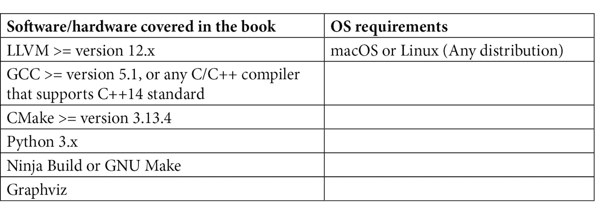

# 前言

编译器是程序员最常用的工具之一。大多数程序员在其开发流程中都有编译器——或某种形式的编译技术。现代编译器不仅将高级编程语言转换为低级机器代码，而且在优化编译的程序的速度、大小甚至内存占用方面也发挥着关键作用。具有这些特性，构建一个生产就绪的编译器一直是一项具有挑战性的任务。

LLVM 是一个用于编译器优化和代码生成的框架。它提供了构建块，可以显著减少开发者创建高质量优化编译器和编程语言工具的努力。它最著名的产物之一是 Clang——一个 C 系列语言的编译器，构建了包括 Google Chrome 浏览器和 iOS 应用在内的数千个广泛使用的软件。LLVM 也被用于许多不同编程语言的编译器中，如著名的 Swift 编程语言。当谈到创建新的编程语言时，说 LLVM 是最热门的话题之一并不过分。

随着数百个库和数千种不同的 API，LLVM 提供了广泛的功能，从优化程序的关键功能到更通用的实用工具。在这本书中，我们为 LLVM 中最重要两个子系统——Clang 和中间端——提供了全面而详尽的开发者指南。我们首先介绍了一些组件和开发最佳实践，这些都可以提高您使用 LLVM 的总体开发体验。然后，我们将向您展示如何使用 Clang 进行开发。更具体地说，我们将重点关注帮助您增强和定制 Clang 功能的话题。本书的最后部分，您将学习关于 LLVM IR 开发的关键知识。这包括如何使用最新语法编写 LLVM Pass，以及掌握处理不同的 IR 结构。我们还向您展示了几个可以极大地提高您在 LLVM 开发中生产力的实用工具。最后但同样重要的是，本书不假设任何特定的 LLVM 版本——我们努力保持最新，并包括 LLVM 源树中的最新功能。

本书在每一章都提供了一些代码片段和示例项目。我们鼓励您从本书的 GitHub 仓库下载它们，并尝试您自己的定制。

# 本书面向的对象

本书面向所有 LLVM 经验水平的人，需要具备对编译器的基本理解。如果您是使用 LLVM 进行日常工作的编译器工程师，本书提供了简洁的开发指南和参考。如果您是学术研究人员，本书将帮助您快速学习有用的 LLVM 技能，并构建原型和项目。编程语言爱好者在利用 LLVM 构建新的编程语言时，也会发现本书很有用。

# 本书涵盖的内容

*第一章*, *构建 LLVM 时节省资源*，简要介绍了 LLVM 项目，然后向您展示如何构建 LLVM 而不会耗尽您的 CPU、内存资源和磁盘空间。这为后续章节的更短的开发周期和更流畅的体验铺平了道路。

*第二章*, *探索 LLVM 的构建系统功能*，展示了如何编写用于树内和树外 LLVM 开发的 CMake 构建脚本。您将学习到利用 LLVM 的自定义构建系统功能编写更表达性和健壮的构建脚本的关键技能。

*第三章*, *使用 LLVM LIT 进行测试*，展示了如何使用 LLVM 的 LIT 基础设施运行测试。本章不仅使您更好地理解测试在 LLVM 源树中的工作方式，还使您能够将这种直观、可扩展的测试基础设施集成到任何项目中。

*第四章*, *TableGen 开发*，展示了如何编写 TableGen – 由 LLVM 发明的特殊**领域特定语言 (DSL)**。我们特别关注将 TableGen 作为处理结构数据的通用工具，为您提供灵活的技能，以便在 LLVM 之外使用 TableGen。

*第五章*, *探索 Clang 的架构*，标志着我们对 Clang 主题的探讨的开始。本章为您提供了 Clang 的概述，特别是其编译流程，并展示了 Clang 编译流程中各个组件的作用。

*第六章*, *扩展预处理器*，展示了 Clang 中预处理器的架构，更重要的是，展示了如何开发一个插件来扩展其功能，而无需修改 LLVM 源树中的任何代码。

*第七章*, *处理 AST*，展示了如何在 Clang 中使用**抽象语法树 (AST)** 进行开发。内容包括学习与 AST 的内存表示一起工作的重要主题，以及一个教程，介绍如何创建一个插件，将自定义 AST 处理逻辑插入到编译流程中。

*第八章*, *使用编译器标志和工具链*，介绍了向 Clang 添加自定义编译器标志和工具链的步骤。如果您想在 Clang 中支持新功能或新平台，这两项技能尤其关键。

*第九章*, *使用 PassManager 和 AnalysisManager*，标志着我们对 LLVM 中间端的讨论的开始。本章专注于编写 LLVM pass – 使用最新的新 PassManager 语法 – 以及如何通过 AnalysisManager 访问程序分析数据。

*第十章*，*处理 LLVM IR*，是一个包含关于 LLVM IR 的多种核心知识的章节，包括 LLVM IR 内存表示的结构以及与不同的 IR 单元（如函数、指令和循环）一起工作的有用技巧。

*第十一章*，*使用支持工具提高效率*，介绍了一些可以提高您与 LLVM IR 一起工作时生产力的工具——例如，获得更好的调试体验。

*第十二章*，*学习 LLVM IR 工具化*，展示了在 LLVM IR 上工具化的工作方式。它涵盖了两个主要用例：Sanitizer 和**基于配置文件优化（PGO）**。对于前者，您将学习如何创建自定义 Sanitizer。对于后者，您将学习如何在 LLVM Pass 中利用 PGO 数据。

# 要充分利用本书

本书旨在向您介绍 LLVM 的最新功能，因此我们鼓励您在本书中使用 LLVM 12.0 版本之后的版本，或者甚至整个开发分支——即主分支。

我们假设您正在使用 Linux 或 Unix 系统（包括 macOS）。本书中的工具和示例命令大多在命令行界面中运行，但您可以使用任何代码编辑器或 IDE 来编写您的代码。



在*第一章**，*在构建 LLVM 中节省资源*，我们将提供如何从源代码构建 LLVM 的详细信息。

**如果您正在使用本书的数字版，我们建议您亲自输入代码或通过 GitHub 仓库（下一节中提供链接）访问代码。这样做将帮助您避免与代码复制粘贴相关的任何潜在错误。**

# 下载示例代码文件

您可以从 GitHub 在[`github.com/PacktPublishing/LLVM-Techniques-Tips-and-Best-Practices-Clang-and-Middle-End-Libraries`](https://github.com/PacktPublishing/LLVM-Techniques-Tips-and-Best-Practices-Clang-and-Middle-End-Libraries)上下载本书的示例代码文件。如果代码有更新，它将在现有的 GitHub 仓库中更新。

我们还有其他来自我们丰富的图书和视频目录的代码包，可在[`github.com/PacktPublishing/`](https://github.com/PacktPublishing/)找到。查看它们吧！

# 下载彩色图像

我们还提供了一份包含本书中使用的截图/图表彩色图像的 PDF 文件。您可以从这里下载：[`static.packt-cdn.com/downloads/9781838824952_ColorImages.pdf`](https://static.packt-cdn.com/downloads/9781838824952_ColorImages.pdf)。

# 使用的约定

本书使用了多种文本约定。

`文本中的代码`：表示文本中的代码单词、数据库表名、文件夹名、文件名、文件扩展名、路径名、虚拟 URL、用户输入和 Twitter 昵称。以下是一个示例：“要将 Clang 包含在构建列表中，请编辑分配给`LLVM_ENABLE_PROJECTS` CMake 变量的值。”

代码块应如下设置：

```cpp
TranslationUnitDecl 0x560f3929f5a8 <<invalid sloc>> <invalid sloc>
|…
`-FunctionDecl 0x560f392e1350 <./test.c:2:1, col:30> col:5 foo 'int (int)'
```

当我们希望将您的注意力引到代码块中的特定部分时，相关的行或项目将以粗体显示：

```cpp
  |-ParmVarDecl 0x560f392e1280 <col:9, col:13> col:13 used c 'int'
  `-CompoundStmt 0x560f392e14c8 <col:16, col:30>
    `-ReturnStmt 0x560f392e14b8 <col:17, col:28>
      `-BinaryOperator 0x560f392e1498 <col:24, col:28> 'int' '+'
        |-ImplicitCastExpr 0x560f392e1480 <col:24> 'int' <LValueToRValue>
        | `-DeclRefExpr 0x560f392e1440 <col:24> 'int' lvalue ParmVar 0x560f392e1280 'c' 'int'
        `-IntegerLiteral 0x560f392e1460 <col:28> 'int' 1
```

任何命令行输入或输出都应如下所示：

```cpp
$ clang -fplugin=/path/to/MyPlugin.so … foo.cpp
```

**粗体**：表示新术语、重要单词或您在屏幕上看到的单词。例如，菜单或对话框中的单词在文本中显示如下。以下是一个示例：“从**管理**面板中选择**系统信息**。”

小贴士或重要注意事项

看起来像这样。

# 联系我们

我们欢迎读者的反馈。

**一般反馈**：如果您对本书的任何方面有疑问，请在邮件主题中提及书名，并将邮件发送至 customercare@packtpub.com。

**勘误表**：尽管我们已经尽最大努力确保内容的准确性，但错误仍然可能发生。如果您在这本书中发现了错误，我们将非常感激您能向我们报告。请访问[www.packtpub.com/support/errata](http://www.packtpub.com/support/errata)，选择您的书籍，点击勘误表提交表单链接，并输入详细信息。

**盗版**：如果您在互联网上以任何形式发现我们作品的非法副本，我们将非常感激您能提供位置地址或网站名称。请通过 copyright@packt.com 与我们联系，并提供材料的链接。

**如果您有兴趣成为作者**：如果您在某个领域有专业知识，并且您有兴趣撰写或为书籍做出贡献，请访问[authors.packtpub.com](http://authors.packtpub.com)。

# 评论

请留下评论。一旦您阅读并使用了这本书，为何不在购买它的网站上留下评论呢？潜在的读者可以查看并使用您的客观意见来做出购买决定，我们 Packt 可以了解您对我们产品的看法，我们的作者也可以看到他们对书籍的反馈。谢谢！

如需更多关于 Packt 的信息，请访问[packt.com](http://packt.com)。
