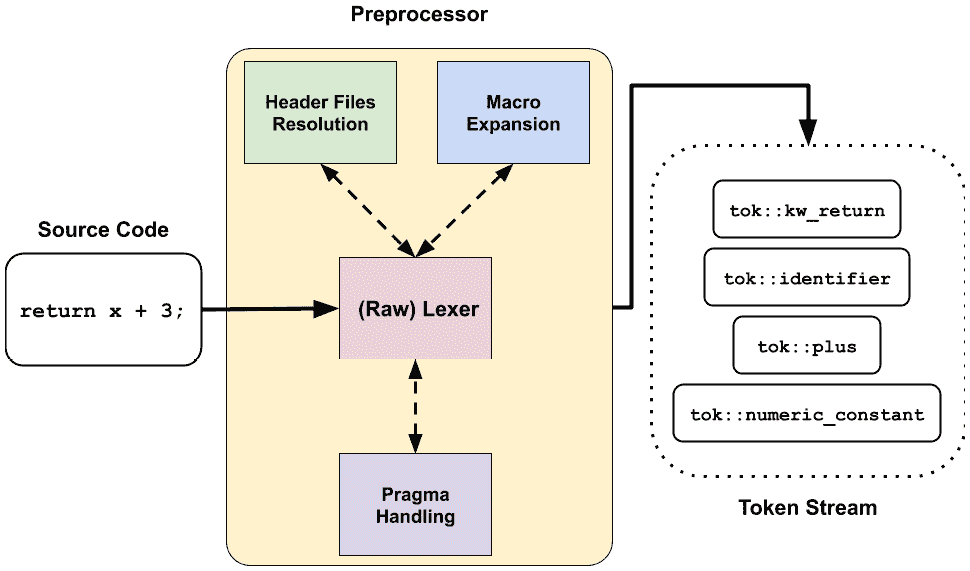

# 第六章：*第六章*：扩展预处理器

在上一章中，我们探讨了 Clang 的结构——C 家族语言的官方前端 **低级虚拟机 (LLVM)**，以及其中一些最重要的组件。我们还介绍了 Clang 的各种工具和扩展选项。在这一章中，我们将深入 Clang 前端管道的第一个阶段：预处理器。

对于 C 家族编程语言，`#`) 字符——例如 `#include` 和 `#define`——与一些其他文本内容（或某些罕见情况下的非文本 *令牌*）。例如，预处理器基本上会 *复制和粘贴* 由 `#include` 指令指定的头文件的内容，在解析它之前将其放入当前编译单元中。这种技术的好处是提取常用代码并重用它。

在本章中，我们将简要解释 Clang 的 `#pragma` 语法——例如 OpenMP 中使用的语法（例如 `#pragma omp loop`）——以更简单的方式。学习这些技术将在解决不同抽象层次的问题时为您提供更多选项。以下是本章各节的内容列表：

+   与 `SourceLocation` 和 `SourceManager` 一起工作

+   学习预处理器和词法分析器的基础知识

+   开发自定义预处理器插件和回调

# 技术要求

本章要求您有一个 Clang 可执行文件的构建。您可以通过运行以下命令来获取：

```cpp
$ ninja clang
```

这是一个有用的命令，可以在预处理后打印文本内容：

`clang` 的 `-E` 命令行选项在打印预处理后的文本内容方面非常有用。例如，`foo.c` 包含以下内容：

```cpp
#define HELLO 4
int foo(int x) {
  return x + HELLO;
}
```

使用以下命令：

```cpp
$ clang -E foo.c
```

上述命令将给出以下输出：

```cpp
…
int foo(int x) {
  return x + 4;
}
```

如您所见，代码中的 `HELLO` 被替换为 `4`。您可能可以使用这个技巧在后续章节开发自定义扩展时进行调试。

本章使用的代码可以在以下链接找到：[`github.com/PacktPublishing/LLVM-Techniques-Tips-and-Best-Practices-Clang-and-Middle-End-Libraries/tree/main/Chapter06`](https://github.com/PacktPublishing/LLVM-Techniques-Tips-and-Best-Practices-Clang-and-Middle-End-Libraries/tree/main/Chapter06)。

# 与 SourceLocation 和 SourceManager 一起工作

当与源文件紧密工作时，最基本的问题之一是编译器前端如何能够 *定位* 文件中的一段字符串。一方面，打印格式消息（例如编译错误和警告消息）是一项至关重要的工作，其中必须显示准确的行和列号。另一方面，前端可能需要同时管理多个文件，并以高效的方式访问它们的内存内容。在 Clang 中，这些问题主要是由两个类 `SourceLocation` 和 `SourceManager` 处理的。我们将简要介绍它们，并在本节余下的部分展示如何在实践中使用它们。

## 介绍 SourceLocation

`SourceLocation` 类用于表示代码片段在其文件中的位置。在其实施方面，`SourceLocation` 实例在 Clang 的代码库中被广泛使用，并且基本上贯穿整个前端编译管道。因此，使用简洁的方式存储其信息而不是两个 32 位整数（这甚至可能不够，因为我们还想知道原始文件！）是很重要的，这可以轻易地增加 Clang 的运行时内存占用。

Clang 通过优雅设计的 `SourceLocation` 解决了这个问题，因为 `SourceLocation` 只在底层使用单个无符号整数，这也意味着其实例仅仅是 `SourceLocation` 的指针，它只有在与我们所提到的 *数据缓冲区* 放在一起时才有意义和有用，该缓冲区由故事中的第二位主要角色 `SourceManager` 管理。

其他有用的工具

`SourceRange` 是一对表示源代码范围起始和结束的 `SourceLocation` 对象；`FullSourceLocation` 将正常的 `SourceLocation` 类及其关联的 `SourceManager` 类封装到一个类中，这样你只需要携带一个 `FullSourceLocation` 实例而不是两个对象（一个 `SourceLocation` 对象和一个 `SourceManager` 对象）。

### 简单可复制

我们通常被教导，除非有充分的理由，否则在编写 C++ 时，你应该避免在正常情况下通过值传递对象（例如作为函数调用参数）。因为这涉及到底层数据成员的大量 *复制*，你应该通过指针或引用来传递。然而，如果设计得很好，一个类类型实例可以轻松地来回复制，例如，没有成员变量或只有少量成员变量的类，加上默认的复制构造函数。如果一个实例是简单可复制的，你被鼓励通过其值来传递它。

## 介绍 SourceManager

`SourceManager` 类管理存储在内存中的所有源文件，并提供访问它们的接口。它还提供了通过我们刚刚介绍的 `SourceLocation` 实例处理源代码位置的 API。例如，要从 `SourceLocation` 实例获取行号和列号，请运行以下代码：

```cpp
void foo(SourceManager &SM, SourceLocation SLoc) {
  auto Line = SM.getSpellingLineNumber(SLoc),
       Column = SM.getSpellingColumnNumber(SLoc);
  …
}
```

上一段代码中的 `Line` 和 `Column` 变量分别是 `SLoc` 所指向的源位置行号和列号。

你可能会想知道为什么我们在上一段代码片段中使用 `spellingLineNumber` 而不是简单的 `LineNumber`。结果是，在宏展开（或在预处理期间发生的任何展开）的情况下，Clang 在展开前后跟踪宏内容的 `SourceLocation` 实例。拼写位置表示源代码最初被 *编写* 的位置，而展开位置是宏被展开的位置。

您也可以使用以下 API 创建新的拼写和扩展关联：

```cpp
SourceLocation NewSLoc = SM.createExpansionLoc(
  SpellingLoc,    // The original macro spelling location
  ExpansionStart, // Start of the location where macro is                   //expanded
  ExpansionEnd,   // End of the location where macro is                   // expanded
  Len             // Length of the content you want to expand
);
```

返回的 `NewSLoc` 现在关联了拼写和扩展位置，可以使用 `SourceManager` 进行查询。

这些是帮助您处理源代码位置的重要概念和 API，尤其是在后续章节中与预处理器一起工作时。下一节将为您介绍 Clang 中预处理器和词法分析器开发的一些背景知识，这对于在后续的“开发自定义预处理器插件和回调”部分工作将很有用。

# 学习预处理器和词法分析器的基础知识

在前面的“使用 SourceLocation 和 SourceManager”部分，我们学习了源位置，它是预处理器的一个重要部分，在 Clang 中的表示方式。在本节中，我们将首先解释 Clang 预处理器和词法分析器的原理，以及它们的工作流程。然后，我们将深入探讨这个流程中的一些重要组件，并简要说明它们在代码中的使用。这些内容也将为您在本书后面的“开发自定义预处理器插件和回调”部分的项目做好准备。

## 理解预处理器和词法分析器在 Clang 中的作用

Clang 的预处理器和词法分析器（分别由 `Preprocessor` 和 `Lexer` 类表示）所扮演的角色和执行的主要操作，如下面的图所示：



图 6.1 – Clang 预处理器和词法分析器的角色

我们相信大多数读者都会熟悉在词法分析器上下文中“标记”的概念——原始源代码的一个子串，它作为语义推理的最小构建块。在一些传统的编译器中，词法分析器负责将输入源代码切割成一系列标记或标记流，如前图所示。这个标记流随后将被送入解析器以构建语义结构。

在实现方面，Clang 与传统的编译器（或教科书中的编译器）采取了一条略有不同的路径：`Preprocessor` 使用的 `Lexer` 仍然是将源代码切割成标记的主要执行者。然而，当遇到预处理器指令（即以 `#` 开头的任何内容）或符号时，`Lexer` 会停止操作，并将该任务转交给 `Preprocessor` 组织的宏扩展、头文件解析器或预处理指令处理器。这些辅助组件在需要时向主标记流中注入额外的标记，这些标记最终会返回给 `Preprocessor` 的用户。

换句话说，大多数标记流消费者并不直接与 `Lexer` 交互，而是与 `Preprocessor` 实例交互。这使得人们将 `Lexer` 类称为 *原始* lexer（如前图所示），因为 `Lexer` 本身只生成未经预处理的标记流。为了给您一个更具体的使用 `Preprocessor` 来检索标记（流）的例子，以下简单的代码片段已经提供。这显示了从当前正在处理的源代码中获取下一个标记的方法：

```cpp
Token GetNextToken(Preprocessor &PP) {
  Token Tok;
  PP.Lex(Tok);
  return Tok;
}
```

如您所猜测的，`Token` 是 Clang 中表示单个标记的类，我们将在下一段落中简要介绍。

## 理解标记

`Token` 类是单个标记的表示，无论是来自源代码的还是具有特殊用途的 *虚拟* 标记。它也被预处理/词法分析框架广泛使用，就像我们之前介绍的 `SourceLocation` 一样。因此，它被设计得在内存中非常简洁，并且可以轻易地复制。

对于 `Token` 类，这里有两点我们想要强调，如下所述：

1.  **标记类型**告诉您这个标记是什么。

1.  `IdentifierInfo` 类用于携带额外的标识符信息，这部分内容我们将在本节稍后进行介绍。

### 标记类型

标记类型告诉您这个 `Token` 是什么。Clang 的 `Token` 被设计用来表示不仅仅是具体的、物理语言结构，如关键字和符号，还包括解析器插入的虚拟概念，以便使用单个 `Token` 尽可能地编码尽可能多的信息。为了可视化标记流中标记的类型，您可以使用以下命令行选项：

```cpp
$ clang -fsyntax-only -Xclang -dump-tokens foo.cc
```

`foo.cc` 包含以下内容：

```cpp
namespace foo {
  class MyClass {};
}
foo::MyClass Obj;
```

这是前面命令的输出：

```cpp
namespace 'namespace'    [StartOfLine]  Loc=<foo.cc:1:1>
identifier 'foo'         [LeadingSpace] Loc=<foo.cc:1:11>
l_brace '{'      [LeadingSpace] Loc=<foo.cc:1:15>
class 'class'    [StartOfLine] [LeadingSpace]   Loc=<foo.cc:2:3>
identifier 'MyClass'     [LeadingSpace] Loc=<foo.cc:2:9>
l_brace '{'      [LeadingSpace] Loc=<foo.cc:2:17>
r_brace '}'             Loc=<foo.cc:2:18>
semi ';'                Loc=<foo.cc:2:19>
r_brace '}'      [StartOfLine]  Loc=<foo.cc:3:1>
identifier 'foo'         [StartOfLine]  Loc=<foo.cc:5:1>
coloncolon '::'         Loc=<foo.cc:5:4>
identifier 'MyClass'            Loc=<foo.cc:5:6>
identifier 'Obj'         [LeadingSpace] Loc=<foo.cc:5:14>
semi ';'                Loc=<foo.cc:5:17>
eof ''          Loc=<foo.cc:5:18>
```

突出的部分是每个标记的标记类型。完整的标记类型列表可以在 `clang/include/clang/Basic/TokenKinds.def` 文件中找到。这个文件是了解任何语言结构（例如，`return` 关键字）与其标记类型对应（`kw_return`）之间映射的有用参考。

尽管我们无法可视化虚拟标记——或者 `::`（在前面指令中称为 `coloncolon` 的标记类型）有几种不同的用法。例如，它可以用于命名空间解析（在 *C++* 中更正式地称为 *作用域解析*），如前面代码片段所示，或者它可以（可选地）与 `new` 和 `delete` 操作符一起使用，如下面的代码片段所示：

```cpp
int* foo(int N) {
  return ::new int[N]; // Equivalent to 'new int[N]'
}
```

为了使解析处理更高效，解析器将首先尝试解决 `coloncolon` 标记是否是作用域解析。如果是，则标记将被替换为 `annot_cxxscope` 注解标记。

现在，让我们看看检索标记类型的 API。`Token` 类提供了一个 `getKind` 函数来检索其标记类型，如下面的代码片段所示：

```cpp
bool IsReturn(Token Tok) {
  return Tok.getKind() == tok::kw_return;
}
```

然而，如果您只是进行检查，就像前面的代码片段一样，有一个更简洁的函数可用，如下所示：

```cpp
bool IsReturn(Token Tok) {
  return Tok.is(tok::kw_return);
}
```

尽管很多时候，知道`Token`的类型就足以进行处理，但某些语言结构需要更多的证据来判断（例如，代表函数名的标记，在这种情况下，标记类型`identifier`并不像名称字符串那样重要）。Clang 使用一个专门的类`IdentifierInfo`来携带有关任何标识符的额外信息，我们将在下一段中介绍。

### 标识符

标准 C/C++使用`Token`这个词，它符合语言对标识符的标准定义，并辅以`IdentifierInfo`对象。此对象包含诸如底层字符串内容或此标识符是否与宏函数相关联等属性。以下是从`Token`类型变量`Tok`检索`IdentifierInfo`实例的方法：

```cpp
IdentifierInfo *II = Tok.getIdentifierInfo();
```

前面的`getIdentifierInfo`函数如果`Tok`不是按照语言标准的定义表示标识符时将返回 null。请注意，如果两个标识符具有相同的文本内容，它们将由相同的`IdentifierInfo`对象表示。这在您想要比较不同的标识符标记是否具有相同的文本内容时非常有用。

在各种标记类型之上使用专门的`IdentifierInfo`类型有以下优点：

+   对于具有`identifier`标记类型的`Token`，我们有时想知道它是否与宏相关联。您可以使用`IdentifierInfo::hasMacroDefinition`函数来找出这一点。

+   对于具有`identifier`标记类型的标记，将底层字符串内容存储在辅助存储（即`IdentifierInfo`对象）中可以节省`Token`对象的内存占用，这在前端的热路径上。您可以使用`IdentifierInfo::getName`函数检索底层字符串内容。

+   对于代表语言关键字的`Token`，尽管框架已经为这些类型的标记提供了专门的标记类型（例如，`kw_return`用于`return`关键字），但其中一些标记只有在后来的语言标准中才成为语言关键字。例如，以下代码片段在 C++11 之前的标准中是合法的：

    ```cpp
    void foo(int auto) {}
    ```

+   您可以使用以下命令进行编译：

    ```cpp
    $ clang++ -std=c++03 standard into -std=c++11 or a later standard. The error message in the latter case will say that auto, a language keyword since C++11, can't be used there. To give the frontend have an easier time judging if a given token is a keyword in any case, the IdentifierInfo object attached on keyword tokens is designed to answer if an identifier is a keyword under a certain language standard (or language feature), using the IdentifierInfo::isKeyword(…) function, for example, whereby you pass a LangOptions class object (a class carrying information such as the language standard and features currently being used) as the argument to that function.
    ```

在下一小节中，我们将介绍本节最后一个重要的`Preprocessor`概念：`Preprocessor`如何处理 C 系列语言的`macros`。

## 处理宏

C 系列语言的宏实现非同寻常。除了我们之前介绍过的源位置挑战——如何携带宏定义及其展开位置的双重源位置——能够重新定义和取消定义宏名称的能力使得整个问题更加复杂。以下是一个示例代码片段：

```cpp
#define FOO(X) (X + 1)
return FOO(3); // Equivalent to "return (3 + 1);"
#define FOO(X) (X - 100)
return FOO(3); // Now this is equivalent to "return (3 - 100);"
#undef FOO
return FOO(3); // "FOO(3)" here will not be expanded in                //preprocessor
```

前面的 C 代码显示，`FOO` 的定义（如果已定义）在不同词法位置（不同行）上有所不同。

本地宏与模块宏的区别

C++20 引入了一个新的语言概念，称为 `export`。本书中我们只涵盖局部宏。

为了模拟这个概念，Clang 构建了一个系统来记录定义和取消定义的链。在解释其工作原理之前，以下是该系统最重要的三个组件：

1.  `MacroDirective`：此类是给定宏标识符的 `#define` 或 `#undef` *语句*的逻辑表示。如前代码示例所示，同一个宏标识符上可以有多个 `#define`（和 `#undef`）语句，因此最终这些 `MacroDirective` 对象将形成一个按其词法出现顺序排列的链。更具体地说，`#define` 和 `#undef` 指令实际上分别由 `MacroDirective` 的子类 `DefMacroDirective` 和 `UndefMacroDirective` 表示。

1.  `MacroDefinition`：此类代表当前时间点宏标识符的*定义*。而不是包含完整的宏定义体，此实例更像是一个指针，指向不同的宏体，这些宏体将由稍后介绍的 `MacroInfo` 类表示，在解析不同的 `MacroDirective` 类时。此类还可以告诉你定义此 `MacroDefinition` 类的（最新）`DefMacroDirective` 类。

1.  `MacroInfo`：此类包含宏定义的体，包括体中的标记和宏参数（如果有）。

下面是一个图解，说明了这些类与前面示例代码之间的关系：


图 6.2 – 不同 C++ 宏类与前面代码示例的关系

要检索 `MacroInfo` 类及其 `MacroDefinition` 类，我们可以使用以下 `Preprocessor` API，如下所示：

```cpp
void printMacroBody(IdentifierInfo *MacroII, Preprocessor &PP) {
  MacroDefinition Def = PP.getMacroDefinition(MacroII);
  MacroInfo *Info = Def.getMacroInfo();
  …
}
```

`IdentifierInfo` 类型参数 `MacroII`，如前代码片段所示，代表宏名称。要进一步检查宏体，请运行以下代码：

```cpp
void printMacroBody(IdentifierInfo *MacroII, Preprocessor &PP) {
  …
  MacroInfo *Info = Def.getMacroInfo();
  for(Token Tok : Info->tokens()) {
    std::cout << Tok.getName() << "\n";
  }
}
```

从本节中，你已经了解了 `Preprocessor` 的工作流程，以及两个重要组件：`Token` 类和负责宏的子系统。学习这两个组件将帮助你更好地理解 Clang 的预处理工作方式，并为下一节中 `Preprocessor` 插件和自定义回调函数的开发做好准备。

# 开发自定义预处理器插件和回调函数

与 LLVM 和 Clang 的其他部分一样灵活，Clang 的预处理框架也提供了一种通过插件插入自定义逻辑的方法。更具体地说，它允许开发者编写插件来处理自定义 `#pragma my_awesome_feature`)。此外，`Preprocessor` 类还提供了一个更通用的方法来定义在任意 `#include` 指令被解析时触发的自定义回调函数，仅举几个例子。在本节中，我们将使用一个简单项目来利用这两种技术来演示它们的用法。

## 项目目标和准备

C/C++ 中的宏一直因其糟糕的 *设计卫生* 而臭名昭著，如果不小心使用，很容易导致编码错误。看看以下代码片段，看看这个例子：

```cpp
#define PRINT(val) \
  printf("%d\n", val * 2)
void main() {
  PRINT(1 + 3);
}
```

前一个代码片段中的 `PRINT` 看起来就像一个普通函数，因此很容易相信这个程序将打印出 `8`。然而，`PRINT` 是一个宏函数而不是普通函数，所以当它展开时，`main` 函数相当于以下内容：

```cpp
void main() {
  printf("%d\n", 1 + 3 * 2);
}
```

因此，实际上程序打印的是 `7`。当然，可以通过将宏体中 `val` 宏参数的每个出现都用括号括起来来解决这个问题，如下面的代码片段所示：

```cpp
#define PRINT(val) \
  printf("%d\n", (val) * 2)
```

因此，在宏展开后，`main` 函数将看起来像这样：

```cpp
void main() {
  printf("%d\n", (1 + 3) * 2);
}
```

我们将要做的项目是开发一个自定义的 `#pragma` 语法，以警告开发者如果某个由程序员指定的宏参数没有被正确地用括号包围，从而防止前面提到的 *卫生* 问题发生。以下是这个新语法的示例：

```cpp
#pragma macro_arg_guard val
#define PRINT(val) \
  printf("%d\n", val * 94 + (val) * 87);
void main() {
  PRINT(1 + 3);
}
```

与前面的例子类似，如果前面 `val` 参数的出现没有被括号包围，这可能会引入潜在的错误。

在新的 `macro_arg_guard` 预处理指令语法中，紧跟在指令名称后面的标记是下一个宏函数中要检查的宏参数名称。由于前一个代码片段中的 `val * 94` 表达式中的 `val` 没有被括号包围，它将打印以下警告信息：

```cpp
$ clang … foo.c
[WARNING] In foo.c:3:18: macro argument 'val' is not enclosed by parenthesis
```

这个项目，尽管是一个 *玩具示例*，但在宏函数变得相当大或复杂时实际上非常有用，在这种情况下，手动在每个宏参数出现处添加括号可能是一个容易出错的任务。一个能够捕捉这种错误的工具肯定会很有帮助。

在我们深入编码部分之前，让我们设置项目文件夹。以下是文件夹结构：

```cpp
MacroGuard
  |___ CMakeLists.txt
  |___ MacroGuardPragma.cpp
  |___ MacroGuardValidator.h
  |___ MacroGuardValidator.cpp
```

`MacroGuardPragama.cpp` 文件包含一个自定义的 `PragmaHandler` 函数，我们将在下一节中介绍，*实现自定义预处理指令处理器*。对于 `MacroGuardValidator.h/.cpp`，这包括一个自定义的 `PPCallbacks` 函数，用于检查指定的宏体和参数是否符合我们这里的规则。我们将在后面的 *实现自定义预处理器回调函数* 部分介绍。

由于我们在这里设置的是一个树外项目，如果你不知道如何导入 LLVM 自身的 CMake 指令（例如 `add_llvm_library` 和 `add_llvm_executable` CMake 函数），请参阅 *第二章* 的 *理解树外项目的 CMake 集成* 部分，*探索 LLVM 的构建系统功能*。并且因为我们在这里也处理 Clang，我们需要使用类似的方法来导入 Clang 的构建配置，如下面的代码片段中所示的 `include` 文件夹路径：

```cpp
# In MacroGuard/CmakeLists.txt
…
# (after importing LLVM's CMake directives)
find_package(Clang REQUIRED CONFIG)
include_directories(${CLANG_INCLUDE_DIRS})
```

我们在这里不需要设置 Clang 的库路径，是因为通常情况下，插件会动态链接到由加载程序（在我们的例子中是 `clang` 可执行文件）提供的库实现，而不是在构建时显式链接这些库。

最后，我们添加了插件的构建目标，如下所示：

```cpp
set(_SOURCE_FILES
    MacroGuardPragma.cpp
    MacroGuardValidator.cpp
    )
add_llvm_library(MacroGuardPlugin MODULE
                 ${_SOURCE_FILES}
                 PLUGIN_TOOL clang)
```

PLUGIN_TOOL 参数

```cpp
Windows platforms, since PLUGIN_TOOL is also used for specifying this plugin loader executable's name.
```

在设置好 `CMake` 脚本并构建插件后，你可以使用以下命令来运行插件：

```cpp
$ clang … -fplugin=/path/to/MacroGuardPlugin.so foo.c
```

当然，我们目前还没有编写任何代码，所以没有输出任何内容。在下一节中，我们将首先开发一个自定义的 `PragmaHandler` 实例来实现我们的新 `#pragma macro_arg_guard` 语法。

## 实现自定义的预处理指令处理器

实现上述功能的第一步是创建一个自定义的 `#pragma` 处理器。为此，我们首先在 `MacroGuardPragma.cpp` 文件中创建一个从 `PragmaHandler` 类派生的 `MacroGuardHandler` 类，如下所示：

```cpp
struct MacroGuardHandler : public PragmaHandler {
  MacroGuardHandler() : PragmaHandler("macro_arg_guard"){}
  void HandlePragma(Preprocessor &PP, PragmaIntroducer                     Introducer, Token &PragmaTok) override;
};
```

当 `Preprocessor` 遇到非标准预处理指令时，将调用 `HandlePragma` 回调函数。在这个函数中，我们将做两件事，如下所示：

1.  获取任何补充标记——被视为 `macro_arg_guard`）。

1.  注册一个 `PPCallbacks` 实例，该实例将扫描下一个宏函数定义的主体，以查看特定的宏参数是否被正确地用括号封装。我们将在下一节中概述这个任务的细节。

对于第一个任务，我们正在利用 `Preprocessor` 来帮助我们解析要封装的宏参数，即宏参数名称。当调用 `HandlePragma` 时，`Preprocessor` 将在宏名称标记之后立即停止，如下面的代码片段所示：

```cpp
#pragma macro_arg_guard val
                       ^--Stop at here
```

因此，我们所需做的只是继续解析和存储这些标记，直到遇到这一行的末尾：

```cpp
void MacroGuardHandler::HandlePragma(Preprocessor &PP,…) {
  Token Tok;
  PP.Lex(Tok);
  while (Tok.isNot(tok::eod)) {
    ArgsToEnclosed.push_back(Tok.getIdentifierInfo());
    PP.Lex(Tok);
  }
}
```

前面的代码片段中的 `eod` 标记类型表示 **指令结束**。它专门用于标记预处理器指令的结束。

对于 `ArgsToEscped` 变量，以下全局数组存储了指定的宏参数的 `IdentifierInfo` 对象：

```cpp
SmallVector<const IdentifierInfo*, 2> ArgsToEnclosed;
struct MacroGuardHandler: public PragmaHandler {
  …
};
```

我们在全局范围内声明 `ArgsToEnclosed` 的原因是，我们稍后需要用它来与我们的 `PPCallbacks` 实例进行通信，该实例将使用该数组内容来执行验证。

尽管我们的`PPCallbacks`实例，即`MacroGuardValidator`类的实现细节将在下一节中介绍，但它需要在第一次调用`HandlePragma`函数时与`Preprocessor`注册，如下所示：

```cpp
struct MacroGuardHandler : public PragmaHandler {
  bool IsValidatorRegistered;
  MacroGuardHandler() : PragmaHandler("macro_arg_guard"),
                        IsValidatorRegistered(false) {}
  …
};
void MacroGuardHandler::HandlePragma(Preprocessor &PP,…) {
  …
  if (!IsValidatorRegistered) {
    auto Validator = std::make_unique<MacroGuardValidator>(…);
    PP.addCallbackPPCallbacks(std::move(Validator));
    IsValidatorRegistered = true;
  }
}
```

我们还使用一个标志来确保它只注册一次。在此之后，每当发生预处理事件时，我们的`MacroGuardValidator`类将被调用以处理它。在我们的情况下，我们只对`宏定义`事件感兴趣，这会向`MacroGuardValidator`发出信号以验证它刚刚定义的宏体。

在结束`PragmaHandler`之前，我们需要一些额外的代码将处理程序转换为插件，如下所示：

```cpp
struct MacroGuardHandler : public PragmaHandler {
  …
};
static PragmaHandlerRegistry::Add<MacroGuardHandler>
  X("macro_arg_guard", "Verify if designated macro args are     enclosed");
```

在声明这个变量之后，当这个插件被加载到`clang`中时，一个`MacroGuardHandler`实例被插入到一个全局的`PragmaHandler`注册表中，该注册表将在`Preprocessor`遇到非标准的`#pragma`指令时被查询。现在，当插件加载时，Clang 能够识别我们的自定义`macro_arg_guard`指令。

## 实现自定义预处理器回调

`Preprocessor`提供了一组回调，`PPCallbacks`类，当某些预处理器事件（例如宏展开）发生时将被触发。前面的*实现自定义指令处理程序*部分展示了如何将你自己的`PPCallbacks`实现，即`MacroGuardValidator`，注册到`Preprocessor`。在这里，我们将展示`MacroGuardValidator`如何验证宏函数中的宏参数逃逸规则。

首先，在`MacroGuardValidator.h/.cpp`中，我们放入以下骨架：

```cpp
// In MacroGuardValidator.h
extern SmallVector<const IdentifierInfo*, 2> ArgsToEnclosed;
class MacroGuardValidator : public PPCallbacks {
  SourceManager &SM;
public:
  explicit MacroGuardValidator(SourceManager &SM) : SM(SM) {}
  void MacroDefined(const Token &MacroNameToke,
                    const MacroDirective *MD) override;
};
// In MacroGuardValidator.cpp
void MacroGuardValidator::MacroDefined(const Token &MacroNameTok, const MacroDirective *MD) {
}
```

在`PPCallbacks`中的所有回调函数中，我们只对`MacroDefined`感兴趣，当处理宏定义时将被调用，由`MacroDirective`类型函数参数（`MD`）表示。`SourceManager`类型成员变量（`SM`）用于在需要显示一些警告消息时打印`SourceLocation`。

专注于`MacroGuardValidator::MacroDefined`，这里的逻辑相当简单：对于`ArgsToEnclosed`数组中的每个标识符，我们正在扫描宏体标记以检查其出现是否有括号作为其前驱和后继标记。首先，让我们放入循环的骨架，如下所示：

```cpp
void MacroGuardValidator::MacroDefined(const Token &MacroNameTok, const MacroDirective *MD) {
  const MacroInfo *MI = MD->getMacroInfo();
  // For each argument to be checked…
  for (const IdentifierInfo *ArgII : ArgsToEnclosed) {
    // Scanning the macro body
    for (auto TokIdx = 0U, TokSize = MI->getNumTokens();
         TokIdx < TokSize; ++TokIdx) {
      …
    }
  }
}
```

如果宏体标记的`IdentifierInfo`参数匹配`ArgII`，这意味着存在一个宏参数出现，我们将检查该标记的前一个和下一个标记，如下所示：

```cpp
for (const IdentifierInfo *ArgII : ArgsToEnclosed) {
  for (auto TokIdx = 0U, TokSize = MI->getNumTokens();
       TokIdx < TokSize; ++TokIdx) {
    Token CurTok = *(MI->tokens_begin() + TokIdx);
    if (CurTok.getIdentifierInfo() == ArgII) {
      if (TokIdx > 0 && TokIdx < TokSize - 1) {
        auto PrevTok = *(MI->tokens_begin() + TokIdx - 1),
             NextTok = *(MI->tokens_begin() + TokIdx + 1);
        if (PrevTok.is(tok::l_paren) && NextTok.is            (tok::r_paren))
          continue;
      }
      …
    }  
  }
}
```

`IdentifierInfo`实例的唯一性

回想一下，相同的标识符字符串总是由相同的`IdentifierInfo`对象表示。这就是我们为什么可以在这里简单地使用指针比较的原因。

`MacroInfo::tokens_begin`函数返回一个迭代器，指向包含所有宏体标记的数组的开始。

最后，如果宏参数标记没有被括号包围，我们打印一条警告消息，如下所示：

```cpp
for (const IdentifierInfo *ArgII : ArgsToEnclosed) {
  for (auto TokIdx = 0U, TokSize = MI->getNumTokens();
       TokIdx < TokSize; ++TokIdx) {
    …
    if (CurTok.getIdentifierInfo() == ArgII) {
      if (TokIdx > 0 && TokIdx < TokSize - 1) {
        …
        if (PrevTok.is(tok::l_paren) && NextTok.is            (tok::r_paren))
          continue;
      }
      SourceLocation TokLoc = CurTok.getLocation();
      errs() << "[WARNING] In " << TokLoc.printToString(SM) << ": ";
      errs() << "macro argument '" << ArgII->getName()
             << "' is not enclosed by parenthesis\n";
    }  
  }
}
```

本节内容到此结束。你现在可以开发一个可以动态加载到 Clang 中以处理自定义 `#pragma` 指令的 `PragmaHandler` 插件。你还学会了如何实现 `PPCallbacks` 以便在预处理程序事件发生时插入自定义逻辑。

# 摘要

预处理程序和词法分析器标志着前端的开端。前者将预处理程序指令替换为其他文本内容，而后者将源代码切割成更有意义的标记。在本章中，我们学习了这两个组件如何相互协作以提供单个标记流视图，以便在后续阶段进行工作。此外，我们还了解了各种重要的 API，例如 `Preprocessor` 类、`Token` 类以及宏在 Clang 中的表示方式，这些 API 可以用于该部分的开发，特别是用于创建支持自定义 `#pragma` 指令的处理程序插件以及创建用于与预处理事件更深入集成的自定义预处理程序回调。

按照 Clang 的编译阶段顺序，下一章将向你展示如何处理抽象语法树（**AST**）以及如何开发一个可以将其逻辑插入其中的 AST 插件。

# 练习

这里有一些简单的问题和练习，你可能想自己尝试一下：

1.  尽管大多数时候 `Tokens` 都是从提供的源代码中收集的，但在某些情况下，`Tokens` 可能会在 `Preprocessor` 内部动态生成。例如，内置宏 `__LINE__` 被展开为当前行号，而宏 `__DATE__` 被展开为当前的日历日期。Clang 如何将这些生成的文本内容放入 `SourceManager` 的源代码缓冲区中？Clang 如何将这些 `SourceLocation` 分配给这些标记？

1.  当我们谈论实现自定义 `PragmaHandler` 时，我们正在利用 `Preprocessor::Lex` 来获取 `Tokens`，直到遇到 `eod` 标记类型。我们能否在 `eod` 标记之后继续进行词法分析？如果你可以在 `#pragma` 指令之后消费任意标记，你会做些什么有趣的事情？

1.  在“*开发自定义预处理程序插件和回调*”部分的 `macro guard` 项目中，警告信息的格式为 `[WARNING] In <source location>: ….`。显然，这并不是我们从 `clang` 看到的典型编译器警告，它看起来像 `<source location>: warning: …`，如下代码片段所示：

    ```cpp
    ./simple_warn.c:2:7: warning: unused variable 'y'…
      int y = x + 1;
          ^
    1 warning generated.
    ```

    `warning` 字符串甚至在支持的终端中被着色。我们如何打印这样的警告信息？Clang 中是否有基础设施来做这件事？
