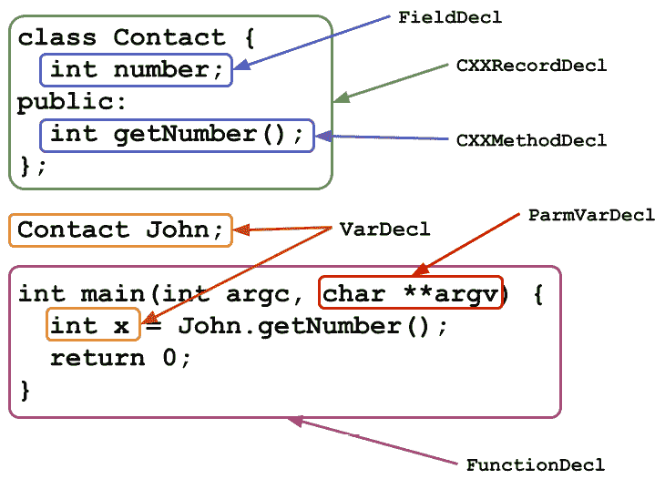
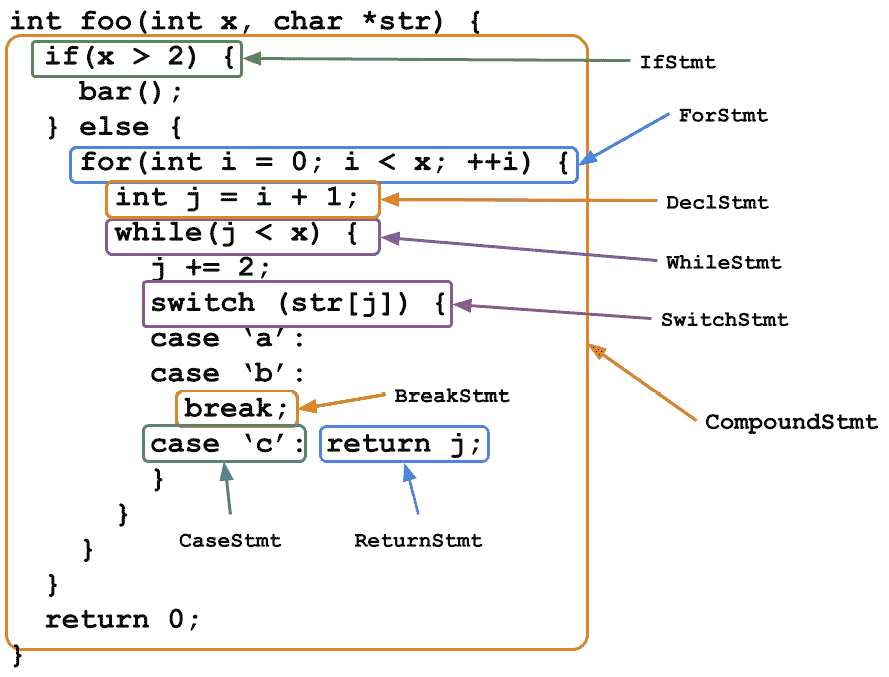
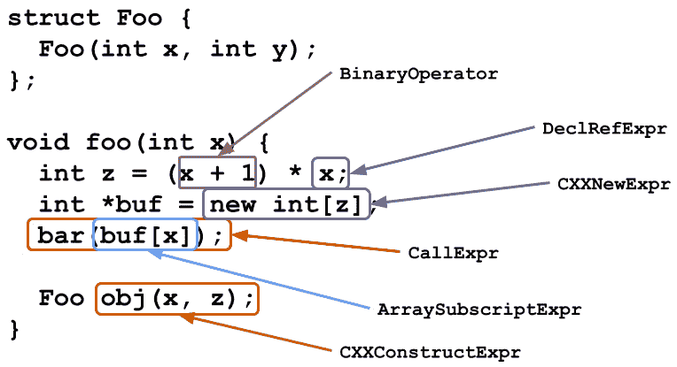
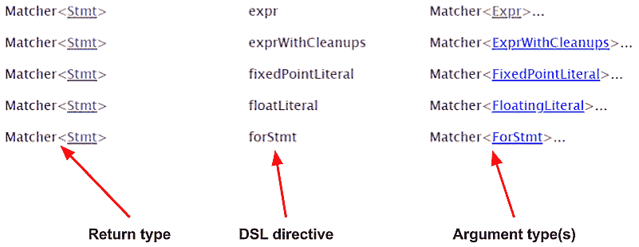
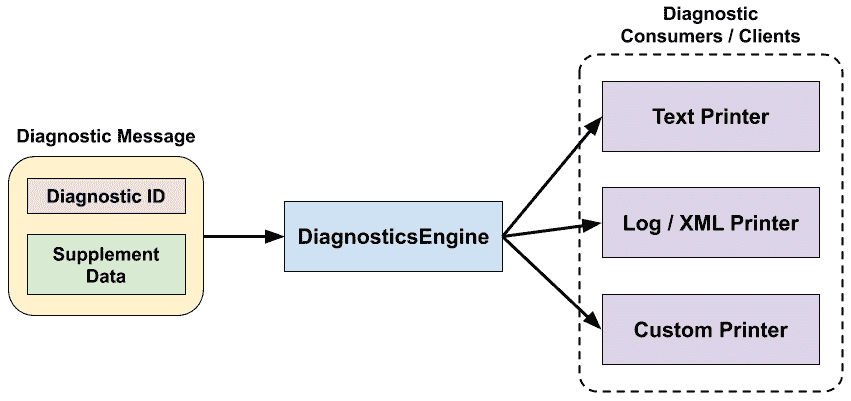

# 第七章：*第七章*：处理 AST

在上一章中，我们学习了 Clang 预处理器如何处理 C 家族语言的预处理指令。我们还学习了如何编写不同类型的预处理器插件，例如 pragma 处理器，以扩展 Clang 的功能。这些技能在实现特定领域的逻辑甚至自定义语言特性时特别有用。

在本章中，我们将讨论原始源代码文件解析后的**语义感知**表示，称为**抽象语法树 (AST)**。AST 是一种包含丰富语义信息的格式，包括类型、表达式树和符号等。它不仅用作生成后续编译阶段的 LLVM IR 的蓝图，也是执行静态分析的首选格式。除此之外，Clang 还为开发者提供了一个很好的框架，通过简单的插件接口在前端管道的中间拦截和操作 AST。

在本章中，我们将介绍如何在 Clang 中处理 AST，内存中 AST 表示的重要 API，以及如何编写 AST 插件以轻松实现自定义逻辑。我们将涵盖以下主题：

+   了解 Clang 中的 AST

+   编写 AST 插件

到本章结束时，你将了解如何使用 Clang 处理 AST 以在源代码级别分析程序。此外，你将了解如何通过 AST 插件以简单的方式将自定义 AST 处理逻辑注入 Clang。

# 技术要求

本章假设你已经构建了 `clang` 可执行文件。如果你还没有，请使用以下命令构建它：

```cpp
$ ninja clang
```

此外，你可以使用以下命令行标志来打印出 AST 的文本表示：

```cpp
$ clang -Xclang -ast-dump foo.c
```

例如，假设 `foo.c` 包含以下内容：

```cpp
int foo(int c) { return c + 1; }
```

通过使用 `-Xclang -ast-dump` 命令行标志，我们可以打印出 `foo.c` 的 AST：

```cpp
TranslationUnitDecl 0x560f3929f5a8 <<invalid sloc>> <invalid sloc>
|…
`-FunctionDecl 0x560f392e1350 <foo.c:2:1, col:30> col:5 foo 'int (int)'
  |-ParmVarDecl 0x560f392e1280 <col:9, col:13> col:13 used c 'int'
  `-CompoundStmt 0x560f392e14c8 <col:16, col:30>
    `-ReturnStmt 0x560f392e14b8 <col:17, col:28>
      `-BinaryOperator 0x560f392e1498 <col:24, col:28> 'int' '+'
        |-ImplicitCastExpr 0x560f392e1480 <col:24> 'int' <LValueToRValue>
        | `-DeclRefExpr 0x560f392e1440 <col:24> 'int' lvalue ParmVar 0x560f392e1280 'c' 'int'
        `-IntegerLiteral 0x560f392e1460 <col:28> 'int' 1
```

此标志有助于找出用于表示代码特定部分的 C++ 类。例如，形式函数参数/参数由 `ParmVarDecl` 类表示，这在之前的代码中已突出显示。

本章的代码示例可以在以下位置找到：[`github.com/PacktPublishing/LLVM-Techniques-Tips-and-Best-Practices-Clang-and-Middle-End-Libraries/tree/main/Chapter07`](https://github.com/PacktPublishing/LLVM-Techniques-Tips-and-Best-Practices-Clang-and-Middle-End-Libraries/tree/main/Chapter07)。

# 了解 Clang 中的 AST

在本节中，我们将了解 Clang 的 AST 内存表示及其基本 API 使用。本节的第一部分将为你提供一个 Clang AST 层次结构的高级概述；第二部分将关注 Clang AST 中类型表示的更具体主题；最后一部分将展示 AST 匹配器的基本用法，这在编写 AST 插件时非常有用。

## Clang AST 的内存结构

Clang 中 AST 的内存表示组织成一个类似于 C 家族语言程序语法结构的层次结构。从最高层开始，有两个类值得提及：

+   `TranslationUnitDecl`：此类表示一个输入源文件，也称为翻译单元（大多数情况下）。它包含所有顶级声明——全局变量、类和函数等，作为其子节点，其中每个顶级声明都有自己的子树，递归地定义了 AST 的其余部分。

+   `ASTContext`：正如其名称所示，此类跟踪来自输入源文件的所有 AST 节点和其他元数据。如果有多个输入源文件，每个文件都获得自己的 `TranslationUnitDecl`，但它们都共享相同的 `ASTContext`。

除了结构之外，AST 的主体——AST 节点——还可以进一步分为三个主要类别：`Decl`、`Expr` 和 `Stmt` 类。在以下各节中，我们将介绍这些内存中的 AST 表示。

### 声明

变量声明（全局和局部）、函数和结构/类声明等语言结构由 `Decl` 的子类表示。虽然我们不会在这里深入探讨每个子类，但以下图表显示了 C/C++ 中常见的声明结构及其对应的 AST 类：




图 7.1 – C/C++ 中常见的声明及其 AST 类

在更具体的子类，如 `FunctionDecl` 和 `Decl` 之间，有几个重要的 *抽象* 类代表某些语言概念：

+   `NamedDecl`：对于每个具有名称的声明。

+   `ValueDecl`：对于声明的实例可以是值的声明，因此与类型信息相关联。

+   `DeclaratorDecl`：对于每个使用声明符（基本上是 `<类型和限定符> <标识符名称>` 形式的语句）。它们提供了关于标识符之外部分的其他信息。例如，它们提供了对具有命名空间解析的内存对象的访问，这充当声明符中的限定符。

要了解更多关于其他类型声明的 AST 类，你始终可以通过在 LLVM 的官方 API 参考网站上导航 `Decl` 的子类来获取。

### 语句

程序中表示 *动作* 概念的大多数指令都可以归类为语句，并由 `Stmt` 的子类表示，包括即将讨论的 *表达式*。除了函数调用或返回点等命令式语句之外，`Stmt` 还涵盖了结构概念，如 `for` 循环和 `if` 语句。以下是显示 C/C++ 中由 `Stmt`（除表达式外）表示的常见语言结构及其对应 AST 类的图表：



图 7.2 – C/C++ 中常见的语句（不包括表达式）及其 AST 类

关于先前的图，有两点值得提及：

+   `CompoundStmt`，它是一个包含多个语句的容器，不仅代表了函数体，基本上还代表了任何由花括号 `('{', '}')` 包围的代码块。因此，尽管由于空间不足，在先前的图中没有显示，但 `IfStmt`、`ForStmt`、`WhileStmt` 和 `SwitchStmt` 都有一个 `CompoundStmt` 子节点来表示它们的主体。

+   在 `CompoundStmt` 中的声明将被 `DeclStmt` 节点包裹，其中实际的 `Decl` 实例是其子节点。这创建了一个更简单的 AST 设计。

语句是典型 C/C++ 程序中最普遍的指令之一。然而，值得注意的是，许多语句是有层次结构的（例如，`ForStmt` 及其循环体），因此你可能需要额外的步骤才能找到所需的 `Stmt` 节点。

### 表达式

Clang AST 中的表达式是一种特殊的语句。与其他语句不同，表达式总是生成 *值*。例如，一个简单的算术表达式，*3 + 4*，预期生成一个整数值。Clang AST 中的所有表达式都由 `Expr` 的子类表示。以下是一个图，展示了 C/C++ 中由 `Expr` 表示的常见语言结构及其对应的 AST 类：



图 7.3 – C/C++ 中常见的表达式及其 AST 类

一个重要的 `Expr` 类是 `DeclRefExpr`。它代表了符号引用的概念。你可以使用它的一个 API，`DeclRefExpr::getDecl()`，来检索被引用符号的 `Decl` 对象。这种方便的符号信息仅在 AST 生成后才会出现，因此这也是人们总是推荐在 AST 而不是更原始的形式（例如在解析器内部）上实现静态分析逻辑的原因之一。

另一个有趣的 `Expr` 类——由于空间不足，在先前的图中没有突出显示——是 `ParenExpr`，它代表了围绕表达式包裹的括号。例如，在先前的图中，`ParenExpr` 以一个表示 **x + 1** 的 `BinaryOperator` 作为其子节点。

## Clang AST 中的类型

类型系统是现代编译器中最重要的组件之一，特别是对于如 C/C++ 这样的静态类型语言。类型检查确保输入源代码具有良好的格式（在一定程度上）并在编译时尽可能捕获错误。虽然我们不需要在 Clang 中自行进行类型检查，但它是由我们之前在 *第五章* 中介绍的 `Sema` 子系统完成的，*探索 Clang 的架构*。当你处理 AST 时，你可能会需要利用这些信息。让我们学习如何在 Clang AST 中建模类型。

### 核心类

Clang AST 类型系统的核心是 `clang::Type` 类。输入代码中的每个类型——包括如 `int` 这样的原始类型和如结构体/类这样的用户定义类型——都由一个 `Type` 对象表示。

术语

在本章的其余部分，我们将把输入源代码中的类型称为 **源代码类型**。

为这些类型中的每一个创建一个 `Type` 对象。这种设计最大的优点之一是，你有一个更简单的方式来比较两个 `Type` 对象。假设你有两个 `Type` 指针。通过在它们上执行简单的指针比较（这非常快），你可以判断它们是否表示相同的源代码类型。

单例设计的一个反例

如果 Clang AST 中的 `Type` 不使用单例设计，要比较两个 `Type` 指针是否表示相同的源代码类型，你需要检查它们所指向的对象的内容，这并不高效。

如我们之前提到的，每个源代码类型实际上都由 `Type` 的一个子类表示。以下是一些常见的 `Type` 子类：

+   `BuiltinType`: 对于如 `int`、`char` 和 `float` 这样的原始类型。

+   `PointerType`: 对于所有指针类型。它有一个名为 `PointerType::getPointee()` 的函数，用于检索它所指向的源代码类型。

+   `ArrayType`: 对于所有数组类型。请注意，它还有其他子类，用于表示具有固定或可变长度的更特定数组。

+   `RecordType`: 对于结构体/类/联合体类型。它有一个名为 `RecordType::getDecl()` 的函数，用于检索底层的 `RecordDecl`。

+   `FunctionType`: 用于表示函数的签名；即函数的参数类型和返回类型（以及其他属性，如其调用约定）。

让我们现在继续学习有资格的类型。

### 有资格的类型

对于 Clang 代码库的新手来说，最令人困惑的事情之一是许多地方使用 `QualType` 类而不是 `Type` 的子类来表示源代码类型。`QualType` 代表 `Type`，用于表示如 `const <type>`、`volatile <type>` 和 `restrict <type>*` 这样的概念。

要从 `Type` 指针创建 `QualType`，可以使用以下代码：

```cpp
// If `T` is representing 'int'…
QualType toConstVolatileTy(Type *T) {
  return QualType(T, Qualifier::Const | Qualifier::Volatile);
} // Then the returned QualType represents `volatile const int`
```

在本节中，我们学习了 Clang AST 中的类型系统。现在让我们继续学习 ASTMatcher，这是一种匹配模式的语法。

## ASTMatcher

当我们处理程序的 AST 时——例如，我们正在检查是否存在任何子优化语法——搜索特定的 AST 节点 *模式* 通常是最先采取的步骤，也是人们最常做的事情之一。根据我们在上一节中学到的知识，我们知道这种模式匹配可以通过遍历 AST 节点及其内存类 API 来完成。例如，给定一个 `FunctionDecl`（函数的 AST 类）——你可以使用以下代码来找出其体中是否存在 `while` 循环，以及该循环的退出条件是否始终是一个字面量布尔值；即 `true`：

```cpp
// `FD` has the type of `const FunctionDecl&`
const auto* Body = dyn_cast<CompoundStmt>(FD.getBody());
for(const auto* S : Body->body()) {
  if(const auto* L = dyn_cast<WhileStmt>(S)) {
    if(const auto* Cond = dyn_cast<CXXBoolLiteralExpr>      (L->getCond()))
      if(Cond->getValue()) {
        // The exit condition is `true`!!
      }
  }
}
```

如你所见，它创建了超过三层（缩进）的 `if` 语句来完成这样一个简单的检查。更不用说在实际情况下，我们还需要在这些行之间插入更多的合理性检查！虽然 Clang 的 AST 设计不难理解，但我们需要一个更 *简洁* 的语法来完成模式匹配任务。幸运的是，Clang 已经提供了一种——那就是 **ASTMatcher**。

ASTMatcher 是一个实用工具，它通过一个干净、简洁且高效的 **领域特定语言**（**DSL**）帮助您编写 AST 模式匹配逻辑。使用 ASTMatcher，执行与之前代码片段中相同的匹配操作只需几行代码：

```cpp
functionDecl(compountStmt(hasAnySubstatement(
  whileStmt(
    hasCondition(cxxBoolLiteral(equals(true)))))));
```

之前代码片段中的大多数指令都很直观：例如 `compoundStmt(…)` 和 `whileStmt(…)` 函数调用检查当前节点是否匹配特定节点类型。在这里，这些函数调用中的参数要么代表其子树的模式匹配器，要么检查当前节点的额外属性。还有一些其他指令用于表达限定概念（例如，*在这个循环体中的所有子语句中，都存在一个返回值*），如 `hasAnySubstatement(…)`，以及用于表达数据类型和常量值的指令，例如 `cxxBoolLiteral(equals(true))` 的组合。

简而言之，使用 ASTMatcher 可以使你的模式匹配逻辑更加 *表达性*。在本节中，我们展示了这个优雅 DSL 的基本用法。

### 遍历 AST

在我们深入核心语法之前，让我们了解 ASTMatcher 如何遍历 AST 以及在匹配过程完成后如何将结果返回给用户。

`MatchFinder` 是模式匹配过程的一个常用驱动器。其基本用法相当简单：

```cpp
using namespace ast_matchers;
…
MatchFinder Finder;
// Add AST matching patterns to `MatchFinder`
Finder.addMatch(traverse(TK_AsIs, pattern1), Callback1);
Finder.addMatch(traverse(TK_AsIs, pattern2), Callback2);
…
// Match a given AST. `Tree` has the type of `ASTContext&`
// If there is a match in either of the above patterns,
// functions in Callback1 or Callback2 will be invoked // accordingly
Finder.matchAST(Tree);
// …Or match a specific AST node. `FD` has the type of // `FunctionDecl&`
Finder.match(FD, Tree);
```

`pattern1` 和 `pattern2` 是由 DSL 构建的模式对象，如之前所示。更有趣的是 `traverse` 函数和 `TK_AsIs` 参数。`traverse` 函数是模式匹配 DSL 的一部分，但它不是表达模式，而是描述遍历 AST 节点的动作。此外，`TK_AsIs` 参数代表 *遍历模式*。

当我们在本章前面展示了用于以文本格式转储 AST 的命令行标志（`-Xclang -ast-dump`）时，您可能已经发现许多*隐藏的 AST 节点*被插入到树中，以帮助程序语义而不是表示程序员编写的真实代码。例如，`ImplicitCastExpr`在许多地方被插入以确保程序的类型正确性。在编写模式匹配逻辑时处理这些节点可能是一种痛苦的经历。因此，`traverse`函数提供了一个替代的、*简化*的遍历树的方法。假设我们有以下输入源代码：

```cpp
struct B {
  B(int);
};
B foo() { return 87; }
```

当您将`TK_AsIs`作为`traverse`的第一个参数传递时，它观察树，类似于`-ast-dump`的行为：

```cpp
FunctionDecl
`-CompoundStmt
  `-ReturnStmt
    `-ExprWithCleanups
      `-CXXConstructExpr
        `-MaterializeTemporaryExpr
          `-ImplicitCastExpr
            `-ImplicitCastExpr
              `-CXXConstructExpr
                `-IntegerLiteral 'int' 87
```

然而，通过使用`TK_IgnoreUnlessSpelledInSource`作为第一个参数，观察到的树等于以下树：

```cpp
FunctionDecl
`-CompoundStmt
  `-ReturnStmt
    `-IntegerLiteral 'int' 87
```

如其名称所示，`TK_IgnoreUnlessSpelledInSource`仅访问实际在源代码中显示的节点。这极大地简化了编写匹配模式的过程，因为我们不再需要担心 AST 的细节。

另一方面，第一个片段中的`Callback1`和`Callback2`是`MatchFinder::MatchCallback`对象，它们描述了在匹配成功时执行的操作。以下是`MatchCallback`实现的骨架：

```cpp
struct MyMatchCallback : public MatchFinder::MatchCallback {
  void run(const MatchFinder::MatchResult &Result) override {
    // Reach here if there is a match on the corresponding     // pattern
    // Handling "bound" result from `Result`, if there is any
  }
};
```

在下一节中，我们将向您展示如何将模式的一部分与一个标签绑定，并在`MatchCallback`中检索它。

最后但同样重要的是，尽管我们在第一个片段中使用了`MatchFinder::match`和`MatchFinder::matchAST`来启动匹配过程，但还有其他方法可以做到这一点。例如，您可以使用`MatchFinder::newASTConsumer`创建一个`ASTConsumer`实例，该实例将运行所描述的模式匹配活动。或者，您可以使用`ast_matchers::match(…)`（不是`MatchFinder`下的成员函数，而是一个独立的函数）在单次运行中对提供的模式和`ASTContext`进行匹配，然后在返回匹配的节点之前。

### ASTMatcher DSL

ASTMatcher 提供了一个易于使用且简洁的 C++ DSL，以帮助进行 AST 匹配。正如我们之前所看到的，所需模式的*结构*通过嵌套函数调用表示，其中每个这样的函数代表要匹配的 AST 节点的*类型*。

使用这个 DSL 表达简单的模式简直不能再简单了。然而，当你试图用多个条件/谓词组合模式时，事情会变得稍微复杂一些。例如，虽然我们知道 for 循环（例如，`for(I = 0; I < 10; ++I){…}`）可以通过 `forStmt(…)` 指令进行匹配，但我们如何向其初始化语句（`I = 0`）和退出条件（`I < 10`）或其循环体添加条件？不仅官方 API 参考网站（我们通常使用的 doxygen 网站）在这方面缺乏清晰的文档，而且这些 DSL 函数在如何接受广泛的参数作为其子模式方面也非常灵活。例如，在回答匹配 `for` 循环的问题之后，你可以使用以下代码来仅检查循环体：

```cpp
forStmt(hasBody(…));
```

或者，你可以检查其循环体和退出条件，如下所示：

```cpp
forStmt(hasBody(…),
        hasCondition(…));
```

这个问题的广义版本将是，给定一个任意的 DSL 指令，我们如何知道可以与之组合的 *可用* 指令？

为了回答这个问题，我们将利用专门为 ASTMatcher 创建的 LLVM 文档网站：[`clang.llvm.org/docs/LibASTMatchersReference.html`](https://clang.llvm.org/docs/LibASTMatchersReference.html)。这个网站包含一个巨大的三列表格，显示了每个 DSL 指令返回的类型和参数类型：



图 7.4 – ASTMatcher DSL 参考的一部分

尽管这个表格只是正常 API 参考的简化版本，但它已经展示了如何搜索候选指令。例如，现在你知道 `forStmt(…)` 可以接受零个或多个 `Matcher<ForStmt>`，我们可以在表中搜索返回 `Matcher<ForStmt>` 或 `Matcher<ForStmt> 的父类>` 的指令，例如 `Matcher<Stmt>`。在这种情况下，我们可以快速找到 `hasCondition`、`hasBody`、`hasIncrement` 或 `hasLoopInit` 作为候选（当然，许多其他返回 `Matcher<Stmt>` 的指令也可以使用）。

当你进行模式匹配时，有许多情况你不仅想知道模式是否匹配，还想获取匹配的 AST 节点。在 ASTMatcher 的上下文中，其 DSL 指令仅检查 AST 节点的 *类型*。如果你想检索（部分）正在匹配的 concrete AST 节点，你可以使用 `bind(…)` API。以下是一个示例：

```cpp
forStmt(
  hasCondition(
    expr().bind("exit_condition")));
```

在这里，我们使用 `expr()` 作为通配符模式来匹配任何 `Expr` 节点。此指令还调用 `bind(…)` 将匹配的 `Expr` AST 节点与名称 `exit_condition` 关联。

然后，在之前介绍的 `MatchCallback` 中，我们可以使用以下代码检索绑定的节点：

```cpp
…
void run(const MatchFinder::MatchResult &Result) override {
  cons auto& Nodes = Result.Nodes;
  const Expr* CondExpr = Nodes.getNodeAs<Expr>    ("exit_condition");
  // Use `CondExpr`…
}
```

`getNodeAs<…>(…)` 函数试图获取给定名称下的绑定 AST 节点并将其转换为模板参数建议的类型。

注意，你可以将不同的 AST 节点绑定到同一个名称下，在这种情况下，只有最后绑定的节点会在`MatchCallback::run`中显示。

### 将一切整合

现在你已经了解了模式匹配 DSL 语法以及如何使用 ASTMatcher 遍历 AST，让我们将这两者结合起来。

假设我们想知道一个简单的`for`循环（循环索引从零开始，每次迭代增加一，由一个字面量整数限制）在函数中的迭代次数——也称为*遍历次数*）：

1.  首先，我们必须编写以下代码来进行匹配和遍历：

    ```cpp
    auto PatExitCondition = binaryOperator(
                               hasOperatorName("<"),
                               hasRHS(integerLiteral()
                               .bind("trip_count")));
    auto Pattern = functionDecl(
                     compountStmt(hasAnySubstatement(
                  forStmt(hasCondition(PatExitCondition)))));
    MatchFinder Finder;
    auto* Callback = new MyMatchCallback();
    Finder.addMatcher(traverse(TK_IgnoreUnlessSpelledInSource,
                               Pattern), Callback);
    ```

    前面的代码片段也展示了*模块化* DSL 模式的样子。你可以根据需要创建单个模式片段并将它们组合起来，只要它们是兼容的。

    最后，这是`MyMatchCallback::run`的样子：

    ```cpp
    void run(const MatchFinder::MatchResult &Result) override {
      const auto& Nodes = Result.Nodes;
      const auto* TripCount = 
            Nodes.getNodeAs<IntegerLiteral>("trip_count");
      if (TripCount)
        TripCount->dump(); // print to llvm::errs()
    }
    ```

1.  之后，你可以使用`Finder`在 AST 上匹配所需的模式（通过调用`MatchFinder::match`或`MatchFinder::matchAST`，或者通过使用`MatchFinder::newASTConsumer`创建`ASTConsumer`）来匹配。匹配的遍历次数将被打印到`stderr`。例如，如果输入源代码是`for(int i = 0; i < 10; ++i) {…}`，输出将简单地是`10`。

在本节中，我们学习了 Clang 如何结构其 AST，Clang AST 如何在内存中表示，以及如何使用 ASTMatcher 帮助开发者进行 AST 模式匹配。有了这些知识，在下一节中，我们将向你展示如何创建 AST 插件，这是将自定义逻辑注入 Clang 编译管道的最简单方法之一。

# 编写 AST 插件

在上一节中，我们学习了如何在 Clang 中表示 AST 以及它的内存中类的样子。我们还学习了可以使用的一些技巧来在 Clang AST 上执行模式匹配。在本节中，我们将学习如何编写插件，允许你将自定义的 AST 处理逻辑插入到 Clang 的编译管道中。

本节将分为三个部分：

+   **项目概述**：本节将要创建的演示项目的目标和概述。

+   `DiagnosticsEngine`，一个强大的子系统，可以帮助你打印出格式良好且具有意义的诊断信息。这将使我们的演示项目更适用于现实世界场景。

+   **创建 AST 插件**：本节将展示如何从头开始创建 AST 插件，填写所有实现细节，以及如何使用 Clang 运行它。

## 项目概述

在本节中，我们将创建一个插件，当输入代码中有可以转换为**三元运算符**的`if`-`else`语句时，它会提示用户警告信息。

快速回顾 – 三元运算符

当`x`条件为真时，三元运算符`x? val_1 : val_2`被评估为`val_1`。否则，它被评估为`val_2`。

例如，让我们看看以下 C/C++代码片段：

```cpp
int foo(int c) {
  if (c > 10) {
    return c + 100;
  } else {
    return 94;
  }
}
void bar(int x) {
  int a;
  if (x > 10) {
    a = 87;
  } else {
    a = x – 100;
  }
}
```

两个函数中的`if`-`else`语句可以转换为三元运算符，如下所示：

```cpp
int foo(int c) {
  return c > 10? c + 100 : 94;
}
void bar(int x) {
  int a;
  a = x > 10? 87 : x – 100;
}
```

在这个项目中，我们将只关注寻找两种潜在的三元运算符机会：

+   `then`块（真分支）和`else`块（假分支）都包含一个`return`语句。在这种情况下，我们可以合并它们的返回值和分支条件为一个三元运算符（作为新的返回值）。

+   `then`块（真分支）和`else`块（假分支）都只包含一个赋值语句。这两个语句都使用单个`DeclRefExpr` – 即符号引用 – 作为 LHS，并且这两个`DeclRefExpr`对象都指向同一个`Decl`（符号）。换句话说，我们正在涵盖前面代码片段中显示的`bar`函数的情况。请注意，我们不包括 LHS 更复杂的情况；例如，当使用数组索引`a[i]`作为 LHS 时。

在识别这些模式后，我们必须向用户提示警告信息，并提供额外信息以帮助用户修复此问题：

```cpp
$ clang …(flags to run the plugin) ./test.c
./test.c:2:3: warning: this if statement can be converted to ternary operator:
  if (c > 10) {
  ^
./test.c:3:12: note: with true expression being this:
    return c + 100;
           ^
./test.c:5:12: note: with false expression being this:
    return 94;
           ^
./test.c:11:3: warning: this if statement can be converted to ternary operator:
  if (x > 10) {
  ^
./test.c:12:9: note: with true expression being this:
    a = 87;
        ^
./test.c:14:9: note: with false expression being this:
    a = x - 100;
        ^
2 warnings generated.
```

每个警告信息 – 告诉你哪个`if`-`else`语句可以转换为三元运算符 – 后面跟着两个注释，指出为运算符构造的潜在表达式。

与我们在*第六章*的*扩展预处理器*部分中做的手动制作编译器信息相比，这里我们使用 Clang 的诊断基础设施来打印包含更丰富信息的消息，例如消息所引用的代码快照。我们将在下一节中向你展示如何使用这个诊断基础设施。

## 打印诊断信息

在*第六章*中，*扩展预处理器*，我们询问你是否可以改进示例项目中在*开发自定义预处理器插件和回调*部分显示的警告信息格式，使其更接近你从 Clang 看到的编译器信息。针对这个问题的解决方案之一是使用 Clang 的诊断框架。我们将在本节中探讨这一点。

Clang 的诊断框架由三个主要部分组成：

+   **诊断 ID**

+   **诊断引擎**

+   **诊断消费者（客户端**）

它们之间的关系可以在以下图中看到：



图 7.5 – Clang 诊断框架的高级组织结构

### 诊断信息

从前面图的左侧开始，大多数情况下，一个诊断信息 – 例如，*使用未声明的标识符" x"* – 与一个具有自己的诊断 ID 的消息**模板**相关联。例如，使用未声明的标识符消息，其消息模板看起来像这样：

```cpp
"use of undeclared identifier %0"
```

`%0` 是一个 `x`，在先前的示例消息中）。跟随 `%` 的数字也暗示了它将使用哪些补充数据。我们将在稍后详细介绍这种格式。

模板通过 TableGen 语法注册到诊断引擎中。例如，我们正在讨论的消息被放入 `clang/include/clang/Basic/DiagnosticSemaKinds.td`：

```cpp
def err_undeclared_var_use : Error<"use of undeclared identifier %0">;
```

我们在前面的片段中突出了两个部分。首先，此消息模板的名称 `err_undeclared_var_use` 将在以后作为唯一的诊断 ID 使用。其次，`Error` TableGen 类建议这是一个错误消息，或者更正式地说，它的 *诊断级别* 错误。

总结来说，一个诊断消息由一个唯一的诊断 ID 组成——它与一个消息模板及其诊断级别相关联——以及如果有的话，需要放入模板占位符中的补充数据。

### 诊断消费者

在将诊断消息发送到诊断引擎（由 `DiagnosticsEngine` 类表示）之后，引擎将消息格式化为文本内容，并将它们发送到 **诊断消费者**（在代码库中也称为 **客户端**；在本节的其余部分我们将使用术语 **消费者**）之一。

诊断消费者——`DiagnosticConsumer` 类的实现——对从 `DiagnosticsEngine` 发送的文本消息进行后处理，并通过不同的介质导出它们。例如，默认的 `TextDiagnosticPrinter` 将消息打印到命令行界面；另一方面，`LogDiagnosticPrinter` 在打印到日志文件之前，会用简单的 XML 标签装饰传入的消息。理论上，你甚至可以创建一个自定义的 `DiagnosticConsumer`，将诊断消息发送到远程主机！

### 报告诊断消息

现在你已经了解了 Clang 的诊断框架是如何工作的，让我们学习如何向 `DiagnosticEngine` 发送（报告）诊断消息：

1.  首先，我们需要获取对 `DiagnosticEngine` 的引用。该引擎本身位于 Clang 编译管道的核心，因此您可以从各种主要组件中获取它，例如 `ASTContext` 和 `SourceManager`。以下是一个示例：

    ```cpp
    // `Ctx` has the type of `ASTContext&`
    DiagnosticsEngine& Diag = Ctx.getDiagnostics();
    ```

1.  接下来，我们需要使用 `DiagnosticsEngine::Report` 函数。此函数始终将诊断 ID 作为其参数之一。例如，要报告我们之前介绍的 `err_undeclared_var_use`，请使用以下代码：

    ```cpp
    Diag.Report(err_undeclared_var_use takes one placeholder argument – namely, the identifier name – which is supplied through concatenating the Report function call with << operators:

    ```

    Diag.Report(diag::err_undeclared_var_use) << ident_name_str;

    ```cpp

    ```

1.  回想一下，`err_undeclared_var_use` 只有一个占位符 `%0`，因此它选择了 `<<` 流中的第一个值。让我们假设我们有一个诊断消息 `err_invalid_placement`，其模板如下：

    ```cpp
    "you cannot put %1 into %0"
    ```

1.  您可以使用以下代码来报告此内容：

    ```cpp
    Diag.Report(diag::err_invalid_placement)
                 << "boiling oil" << "water";
    ```

1.  除了简单的占位符之外，另一个有用的特性是 `%select` 指令。例如，我们有一个诊断消息 `warn_exceed_limit`，其模板如下：

    ```cpp
    "you exceed the daily %select directive consists of curly braces in which different message options are separated by |. Outside the curly braces, a number – 0, in the preceding code – indicates which supplement data is used to select the option within the braces. The following is an example of this:

    ```

    Diag.Report(diag::warn_exceed_limit) << 0 作为流操作符（<<）之后的参数：

    ```cpp
    Diag.Report(diag::warn_exceed_limit) << 0;
    ```

    这将导致一条消息指出**你超过了每日的 WiFi 限制**。

    ```cpp

    ```

1.  现在，假设你使用另一个版本的 `Report` 函数，它接受一个额外的 `SourceLocation` 参数：

    ```cpp
    // `SLoc` has the type of `SourceLocation`
    Diag.Report(SLoc:

    ```

    test.cc:2:10: 错误：使用了未声明的标识符 'x'

    return x + 1;

    ^

    ```cpp

    ```

1.  最后但同样重要的是，尽管大多数诊断消息是通过 TableGen 代码在 Clang 的源树内部注册到 `DiagnosticsEngine` 的，但这并不意味着开发者不能在不修改 Clang 的源树的情况下创建他们自己的新诊断消息。让我们介绍 `DiagnosticsEngine::getCustomDiagID(…)`，这是一个 API，它可以从开发者提供的消息模板和诊断级别创建一个新的诊断 ID：

    ```cpp
    auto MyDiagID = Diag.MyDiagID, that has a message template of Today's weather is %0 at its note diagnostic level. You can use this diagnostic ID just like any other ID:

    ```

    Diag.Report(MyDiagID) << "cloudy";

    ```cpp

    ```

在本节中，你学习了如何利用 Clang 的诊断框架打印出类似于正常编译器消息的消息。

接下来，我们将结合本章学到的所有技能来创建一个自定义的 AST 插件。

## 创建 AST 插件

在本章的前几节中，我们探索了 Clang 的 AST 并学习了如何在内存 API 中使用它。在本节中，我们将学习如何编写一个插件，该插件可以帮助你以简单的方式将自定义的 AST 处理逻辑插入到 Clang 的编译管道中。

在 *第五章* *探索 Clang 的架构* 中，我们学习了使用 Clang (AST) 插件的优势：即使你使用预构建的 `clang` 可执行文件，也可以开发它们；它们易于编写，并且与现有的工具链和构建系统有很好的集成，仅举几例。在 *第六章* *扩展预处理器* 中，我们开发了一个用于预处理器中自定义预处理指令处理的插件。在本章中，我们也将编写一个插件，但这个插件将设计用于自定义 AST 处理。这两个插件的代码框架也相当不同。

我们在本节的 *项目概述* 部分介绍了我们将使用此节的示例项目。此插件将在输入代码中的某些 `if`-`else` 语句可以转换为三元运算符时向用户显示警告消息。此外，它还提供了关于构建三元运算符的候选表达式的额外提示。

下面是构建插件的详细步骤：

1.  与我们在 *第六章* *扩展预处理器* 中看到的预处理指令插件类似，在 Clang 中创建插件基本上就像实现一个类。在 AST 插件的情况下，这将是一个 `PluginASTAction` 类。

    `PluginASTAction`是`ASTFrontendAction`的子类——一个专门用于处理 AST 的`FrontendAction`（如果你不熟悉`FrontendAction`，可以自由阅读*第五章*，*探索 Clang 的架构*）因此，我们需要实现`CreateASTConsumer`成员函数：

    ```cpp
    struct TernaryConverterAction : public PluginASTAction {
      std::unique_ptr<ASTConsumer>
        CreateASTConsumer(CompilerInstance &CI,
                          StringRef InFile) override;
    };
    ```

    我们稍后会填充这个函数。

1.  除了`CreateASTConsumer`之外，还有两个其他成员函数我们可以覆盖以改变一些功能：`getActionType`和`ParseArgs`。前者通过返回这里显示的枚举值之一来告诉 Clang**如何**执行此插件：

    a. `Cmdline`：如果用户提供了`-plugin <plugin name>`（前端）命令行标志，插件将在主动作之后执行。

    b. `ReplaceAction`：这会替换 Clang 原本要执行的动作。例如，如果 Clang 原本应该将输入代码编译成目标文件（`-c`标志），一旦插件被加载，它将执行插件的动作。

    c. `AddBefore/AfterMainAction`：原始的 Clang 动作仍然会被执行，插件动作将被添加到其前面或后面。

    在这里，我们将使用`Cmdline`动作类型：

    ```cpp
    struct TernaryConverterAction : public PluginASTAction {
      …
      ActionType getActionType() override { return ParseArgs member function, on the other hand, handles (frontend) command-line options specific to this plugin. In other words, you can create custom command-line flags for your plugin. In our case, we are going to create two flags: -no-detect-return and -no-detect-assignment. This allows us to decide whether we wish to detect potential ternary conversions regarding return statements or assignment statements, respectively:

    ```

    struct TernaryConverterAction : public PluginASTAction {

    …

    `NoReturn`和`NoAssignment`，用于携带命令行选项的值。需要知道的一个重要的事情是`ParseArgs`的返回值。`ParseArgs`实际上返回的是**插件是否应该继续其执行**，而不是**是否解析了任何自定义标志**。因此，在大多数情况下，你应该始终返回 true。

    ```cpp

    ```

1.  现在，我们将讨论`CreateASTConsumer`的内容。这个函数将返回一个`ASTConsumer`对象，这是我们将在其中放置自定义逻辑的主要部分。尽管如此，我们不会直接实现`ASTConsumer`。相反，我们将使用由*ASTMatcher*生成的`ASTConsumer`对象，我们在本章前面已经介绍过。

    回想一下，构建`MatchFinder`实例需要两个东西——ASTMatcher（模式匹配驱动程序）的主要模式匹配器和`MatchCallback`的实现。让我们将我们的模式和匹配器回调分为两类：基于`return`语句检测潜在三元运算符机会的模式，以及基于**赋值语句机会**的模式。

    下面是`CreateASTConsumer`的框架：

    ```cpp
    using namespace ast_matchers;
    struct TernaryConverterAction : public PluginASTAction {
      …
    private:
      std::unique_ptr<MatchFinder> unique_ptr type member variables: one for holding MatchFinder and two MatchCallback ones for return-based and assignment-based patterns.Why Use unique_ptr?The rationale behind using `unique_ptr` to store those three objects – or storing those objects *persistently* – is because the `ASTConsumer` instance we created at the end of `CreateASTConsumer` (`ASTFinder->newASTConsumer()`) keeps references to those three objects. Thus, we need a way to keep them alive during the lifetime of the frontend.In addition to that, we registered the pattern for traversal with MatchFinder by using `MatchFinder::addMatcher`, the `traverse` function, and `MatchCallback` instances. If you're not familiar with these APIs, feel free to check out the *ASTMatcher* section.Now, we only need to compose the matching patterns and implement some callbacks to print out warning messages if there is a match – as the `TODO` comments suggested in the preceding snippet.
    ```

1.  首先，我们来处理模式。我们正在寻找的模式——无论是基于返回值还是基于赋值的模式——在其最外层布局中都被一个函数（对于整个函数是`FunctionDecl`，对于函数体是`CompoundStmt`）包围的`if`-`else`语句（`IfStmt`）。在这两者内部，无论是`IfStmt`的真分支还是假分支，都只能存在一个语句。这个结构可以这样表示：

    ```cpp
    FunctionDecl 
      |_CompoundStmt
        |_(Other AST nodes we don't care)
        |_IfStmt
          |_(true branch: contain only one return/assign         statement)
          |_(false branch: contain only one return/assign         statement)
    ```

    要将这个概念转换为 ASTMatcher 的 DSL，以下是返回型和基于赋值型模式之间共享的 DSL 代码：

    ```cpp
    functionDecl(
      compoundStmt(hasAnySubstatement
        IfStmt(
          hasThen(/*CompoundStmt, you should always use quantifier directives such as hasAnySubstatement to match its body statements.We are going to use the previous `TODO` comments to customize for either return-based or assignment-based situations. Let's use subpattern variables to replace those `TODO` comments and put the preceding code into another function:

    ```

    StatementMatcher

    buildIfStmtMatcher(StatementMatcher truePattern,

    StatementMatcher falsePattern) {

    return functionDecl(

    compoundStmt(hasAnySubstatement

    IfStmt(

    hasThen(truePattern)

    hasElse(falsePattern))));

    }

    ```cpp

    ```

1.  对于基于返回的模式，上一步提到的 `if`-`else` 分支的子模式是相同的且简单的。我们还使用一个单独的函数来创建这个模式：

    ```cpp
    StatementMatcher buildReturnMatcher() {
      return compoundStmt(statementCountIs directive to match the code blocks with only one statement. Also, we specified that we don't want an empty return via hasReturnValue(…). The argument for hasReturnValue is necessary since the latter takes at least one argument, but since we don't care what type of node it is, we are using expr() as some sort of wildcard pattern.For assignment-based patterns, things get a little bit complicated: we don't just want to match a single assignment statement (modeled by the `BinaryOperator` class) in both branches – the LHS of those assignments need to be `DeclRefExpr` expressions that point to the same `Decl` instance. Unfortunately, we are not able to express all these predicates using ASTMatch's DSL. What we can do, however, is push off some of those checks into `MatchCallback` later, and only use DSL directives to check the *shape* of our desired patterns:

    ```

    StatementMatcher buildAssignmentMatcher() {

    return compoundStmt(statementCountIs(1),

    hasAnySubstatement(

    binaryOperator(

    hasOperatorName("="),

    hasLHS(declRefExpr())

    )));

    }

    ```cpp

    ```

1.  现在我们已经完成了模式框架，是时候实现 `MatchCallback` 了。在 `MatchCallback::run` 中，我们将做两件事。首先，对于基于赋值的模式，我们需要检查匹配的赋值候选的 LHS 的 `DeclRefExpr` 是否指向相同的 `Decl`。其次，我们想要打印出帮助用户将 `if`-`else` 分支重写为三元运算符的消息。换句话说，我们需要从一些匹配的 AST 节点中获取位置信息。

    让我们使用*AST 节点绑定技术*来解决第一个任务。计划是将候选赋值的 LHS `DeclRefExpr` 节点绑定，以便我们可以在稍后的 `MatchCallback::run` 中检索它们，并对它们的 `Decl` 节点进行进一步检查。让我们将 `buildAssignmentMatch` 改成这样：

    ```cpp
    StatementMatcher buildAssignmentMatcher() {
      return compoundStmt(statementCountIs(1),
                          hasAnySubstatement(
                            binaryOperator(
                              hasOperatorName("="),
                              hasLHS(DeclRefExpr is bound to the same name, meaning that the AST node that occurred later will overwrite the previously bound node. So, eventually, we won't get DeclRefExpr nodes from both branches as we previously planned.Therefore, let's use a different tags for `DeclRefExpr` that match from both branches: `dest.true` for the true branch and `dest.false` for the false branch. Let's tweak the preceding code to reflect this strategy:

    ```

    StatementMatcher buildAssignmentMatcher(StringRef buildAssignmentMatcher, we will pass different suffixes for the different branches – either .true or .false.Finally, we must retrieve the bound nodes in `MatchCallback::run`. Here, we are creating different `MatchCallback` subclasses for return-based and assignment-based scenarios – `MatchReturnCallback` and `MatchAssignmentCallback`, respectively. Here is a part of the code in `MatchAssignmentCallback::run`:

    ```cpp
    void
    MatchAssignmentCallback::run(const MatchResult &Result) override {
      const auto& Nodes = Result.Nodes;
      // Check if destination of both assignments are the   // same
      const auto *DestTrue =
                 Nodes.getNodeAs<DeclRefExpr>("dest.true"),
                 *DestFalse = 
                 Nodes.getNodeAs<DeclRefExpr>("dest.false");
      if (DestTrue->getDecl() == DestFalse->getDecl()) {
        // Can be converted into ternary operator!
      }
    }
    ```

    我们将在下一步解决第二个任务——向用户打印有用的信息。

    ```cpp

    ```

1.  为了打印有用的信息——包括*哪些*代码部分可以转换为三元运算符，以及*如何*构建那个三元运算符——我们需要在获取它们的源位置信息之前从匹配的模式中检索一些 AST 节点。为此，我们将使用一些节点绑定技巧，就像我们在上一步所做的那样。这次，我们将修改所有模式构建函数；即 `buildIfStmtMatcher`、`buildReturnMatcher` 和 `buildAssignmentMatcher`：

    ```cpp
    StatementMatcher
    buildIfStmtMatcher(StatementMatcher truePattern,
                       StatementMatcher falsePattern) {
      return functionDecl(
        compoundStmt(hasAnySubstatement
          IfStmt(
            hasThen(truePattern)
            hasElse(falsePattern)).IfStmt since we want to tell our users where the potential places that can be converted into ternary operators are:

    ```

    `StatementMatcher buildReturnMatcher(StringRef MatchCallback::run)` 和 `print out the message using the SourceLocation information that's attached to those nodes`。我们将使用 Clang 的诊断框架来打印这些消息（如果你不熟悉它，请随时再次阅读 *打印诊断消息* 部分）。由于预期的消息格式不是 Clang 代码库中的现有格式，我们将通过 `DiagnosticsEngine::getCustomDiagID(…)` 创建我们自己的诊断 ID。以下是我们在 `MatchAssignmentCallback::run` 中将要做的事情（我们只会演示 `MatchAssignmentCallback`，因为 `MatchReturnCallback` 类似）：

    ```cpp
    void
    MatchAssignmentCallback::run(const MatchResult &Result) override {
      …
      auto& Diag = Result.Context->getDiagnostics();
      auto DiagWarnMain = Diag.getCustomDiagID(
        DiagnosticsEngine::Warning,
        "this if statement can be converted to ternary      operator:");
      auto DiagNoteTrueExpr = Diag.getCustomDiagID(
        DiagnosticsEngine::Note,
        "with true expression being this:");
      auto DiagNoteFalseExpr = Diag.getCustomDiagID(
        DiagnosticsEngine::Note,
        "with false expression being this:");
      …
    }
    ```

    将此与节点检索结合使用，以下是我们将如何打印消息的方法：

    ```cpp
    void
    MatchAssignmentCallback::run(const MatchResult &Result) override {
      …
      if (DestTrue && DestFalse) {
          if (DestTrue->getDecl() == DestFalse->getDecl()) {
            // Can be converted to ternary!
            const auto* If = Nodes.getNodeAs<IfStmt>        ("if_stmt");
            Diag.Report(If->getBeginLoc(), DiagWarnMain);
            const auto* TrueValExpr = 
                        Nodes.getNodeAs<Expr>("val.true");
            const auto* FalseValExpr = 
                        Nodes.getNodeAs<Expr>("val.false");
            Diag.Report(TrueValExpr->getBeginLoc(), 
                        DiagNoteTrueExpr);
            Diag.Report(FalseValExpr->getBeginLoc(), 
                        DiagNoteFalseExpr);
          }
        }
    }
    ```

    ```cpp

    ```

1.  最后，回到 `CreateASTConsumer`。以下是我们将如何将所有这些内容拼接在一起：

    ```cpp
    std::unique_ptr<ASTConsumer>
    TernaryConverterAction::CreateASTConsumer(CompilerInstance &CI, StringRef InFile) {
      …
      // Return matcher
      if (!NoReturn) {
      ReturnMatchCB = std::make_unique<MatchReturnCallback>();
        ASTFinder->addMatcher(
          traverse(TK_IgnoreUnlessSpelledInSource,                          
                   buildIfStmtMatcher(
                     buildReturnMatcher(".true"),                                                 
                     buildReturnMatcher(".false"))),
          ReturnMatchCB.get()
        );
      }
      // Assignment matcher
      if (!NoAssignment) {
        AssignMatchCB = std::make_     unique<MatchAssignmentCallback>();
        ASTFinder->addMatcher(
          traverse(TK_IgnoreUnlessSpelledInSource,
                   buildIfStmtMatcher(
                     buildAssignmentMatcher(".true"),
                     buildAssignmentMatcher(".false"))),
          AssignMatchCB.get()
        );
      }
      return std::move(ASTFinder->newASTConsumer());
    }
    ```

    这就完成了我们所需做的所有事情！

1.  最后但同样重要的是，这是运行我们的插件的命令：

    ```cpp
    -no-detect-return and -no-detect-assignment in this project, please add the command-line options highlighted here:

    ```

    `-plugin-arg-<插件名称>` 格式。

    ```cpp

    ```

在本节中，你学习了如何编写一个 AST 插件，每当有可以转换为三元运算符的 `if`-`else` 语句时，它就会向用户发送消息。你是通过利用本章中涵盖的所有技术来做到这一点的；即，Clang AST 的内存表示、ASTMatcher 和诊断框架，仅举几例。

# 摘要

当涉及到程序分析时，AST 通常是推荐的介质，因为它包含丰富的语义信息和高级结构。在本章中，我们了解了 Clang 中使用的强大内存 AST 表示，包括其 C++类和 API。这为你提供了分析源代码的清晰图景。

此外，我们学习和实践了一种简洁的方法来进行 AST 上的模式匹配——这是程序分析的一个关键过程——通过 Clang 的 ASTMatcher。熟悉这项技术可以大大提高你在从输入源代码中过滤出有趣区域时的效率。最后但同样重要的是，我们学习了如何编写一个 AST 插件，这使得你更容易将自定义逻辑集成到默认的 Clang 编译管道中。

在下一章中，我们将探讨 Clang 中的 **驱动程序** 和 **工具链**。我们将向您展示它们是如何工作的以及如何自定义它们。
