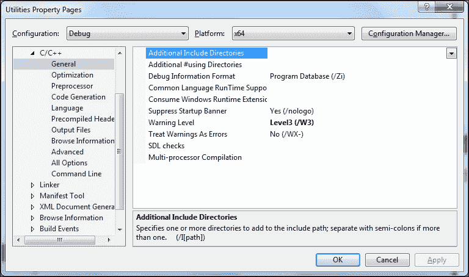
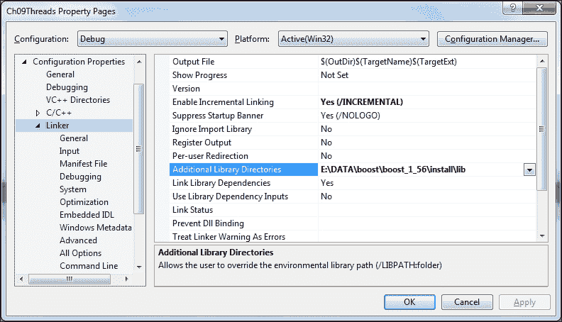
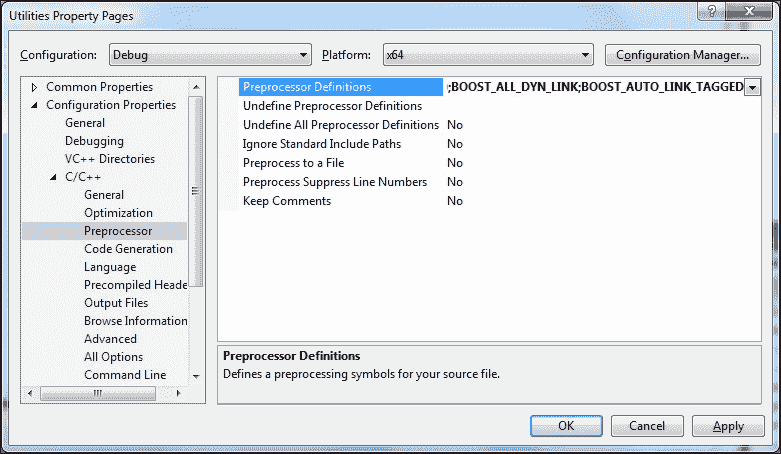
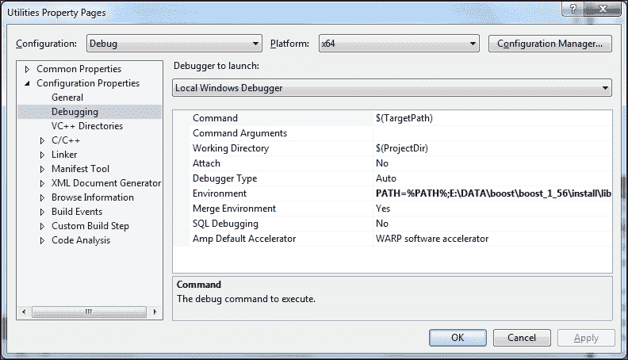
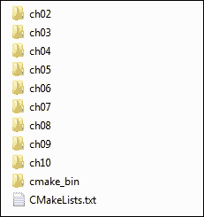
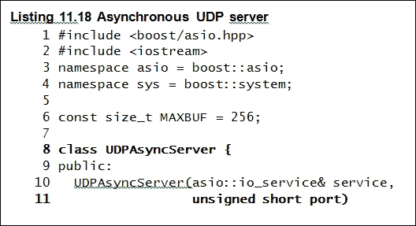

# 第一章：介绍 Boost

欢迎来了解关于最丰富的 C++库集合 Boost。在这个介绍性章节中，我们将看到：

+   Boost 的历史和发展

+   Boost 是什么？

+   使用 Boost 库入门

就像本书中的所有章节一样，这是一个需要您输入命令、编写和测试代码的实践性章节。因此，您应该有一台配备相当现代的 C++编译器和互联网连接的计算机，以下载免费软件，包括 Boost 库。

# 一切是如何开始的

大约在 1997-98 年，当第一个 C++标准的草案定稿为 ISO/IEC 标准出版时，IBM 实验室的 Robert Klarer 构想了一个名为 BOOSE（发音为“booz”）的编程语言的想法，它将与 Java 在高性能嵌入式软件开发领域竞争，而后者一直以来都是针对这个领域的。在 1998 年为现已停刊的*C++ Report*杂志撰写的一篇文章中，C++专家 Herb Sutter 以一种半开玩笑的方式讽刺了这种新语言，它的名字据说扩展为 Bjarne 的面向对象软件环境。在这篇文章中，他声称可移植性和“可饮性”是这种语言的关键优势之一，它还据说在团队环境中促进了非凡的友谊，并使开发人员过分快乐、善于交流和充满激情。

虽然这是 1998 年愚人节的一篇文章，但事实仍然是，第一个 C++标准将拥有一个相当基本的标准库，包括内存分配子系统、类型通用容器和算法、字符串类、输入和输出设备的基本抽象，以及各种实用工具。大约在同一时间，C++标准委员会的一些人成立了一个小组，致力于制作一套高质量、经过同行评审、免费且开源的 C++库集合，这些库将具有广泛的适用性，并补充标准 C++的功能。受到 BOOSE 的启发，也许是因为它声称与 Java 竞争，后者是一种更新的语言，但具有更丰富的库，他们将这一倡议命名为 Boost，这个工作名称一直沿用至今（来源：Boost 网站的常见问题解答，[`www.boost.org`](http://www.boost.org)）。

# Boost 是什么？

Boost 是一套免费、经过同行评审、可移植、开源的 C++库。截至目前为止，Boost 已经发布了 57 个版本的库。在这段时间里，Boost 发布了一些非常有用的库，促进了正确、可移植、高效和可读的 C++代码。一些著名的标准委员会成员也是 Boost 最活跃的参与者，C++标准化的后续方向受到了 Boost 工作的重大影响。Boost 为标准委员会提供了他们需要完善的想法，以便 C++应该具有最佳新功能。一些 Boost 库被包括在 C++标准委员会的*技术报告 1*中，这大大增强了 C++ 2003 修订标准中定义的功能；这些功能包括语言和库功能。其中大多数库已经包含在 2011 年发布的 C++11 标准中。一些起源于 Boost 的库功能已经添加到最新的 C++标准修订版 C++14（2014 年发布）中。

多年来，Boost 增加了用于字符串和文本处理的库，包括正则表达式处理，与标准库兼容的通用容器，用于高效异常安全内存管理的智能指针，并发编程，网络编程，进程间通信，文件系统处理，模板元编程等等。以下表格列出了一些主要的 Boost 库，按类别分组。这只是一部分：

| 类别 | 库 |
| --- | --- |
| 内存管理 | 智能指针，对齐，池 |
| 数据结构 | 容器，数组，多索引，双向映射，指针容器，可选，变体，任意，元组，分配 |
| 算法 | 算法，范围 |
| 字符串和文本 | 转换，字符串算法，正则表达式，标记化器，Spirit，Xpressive |
| 系统编程 | 系统，文件系统，Chrono，日期时间，线程，Asio，Interprocess |
| I/O | IOStreams，Locale，Serialization，Format |
| 高阶编程 | 函数，绑定，Phoenix，Signals2 |
| 通用编程 | 启用 If，类型特征，MPL，Fusion，Proto |
| 语言特性仿真 | Foreach，Move，Exception，Parameter |
| 正确性和测试 | 测试，静态断言 |
| 其他 | 实用程序，日志，UUID，程序选项，CRC |

由于一些高性能库（如 Boost.Asio 和 Boost.Intrusive）以及非常宽松和简单的 Boost 许可证，允许源重新分发、派生作品的分发以及非商业和商业目的的二进制形式的分发，Boost 库在行业中得到了各种用途。在接下来的部分中，我们将设置一个开发环境，使我们能够使用一致的约定在我们的 C++代码中使用任何 Boost 库。这应该能够为我们在本书的其余部分提供帮助。

# 开始使用 Boost 库

现在我们将为您设置一个开发沙箱，以便您可以使用 Boost 库编写代码。我们可以安装 Boost 库的二进制发行版，也可以从源代码构建它们。如果我们从源代码构建它们，我们需要解决一系列问题，从选择适当的库文件命名约定和构建库，到确保我们将它们链接到正确版本的库。还有需要处理的特定于平台的差异；我们将看看 Linux 和 Windows 环境。

## 必要的软件

在 Linux 上，我们只考虑 C++编译器（g++）版本 4.8.1 或更高版本，与**GNU 编译器集合**（**GCC**）一起分发。在 Windows 上，我们将使用 Visual Studio 2013。您可以在 Boost 网站上获取每个 Boost 版本的更详尽的软件支持矩阵。

### Linux 工具链

您应该能够在大多数主要的 Linux 发行版上构建 Boost。我使用的是 Lubuntu 14.04 32 位安装，配备了 GCC 4.8.1 和 Clang 3.4。您可能也可以在更旧的发行版上构建，因为 Boost 网站将 GCC 3.3 列为最低支持的版本。如果您还想要良好的 C++11 支持，请使用 GCC 4.8 或更高版本。

| 所需软件 | 最低版本 | 推荐版本 | Ubuntu 软件包 | Fedora/CentOS 软件包 |
| --- | --- | --- | --- | --- |
| GNU C++编译器 | 4.8.x | 4.8.4 | g++ | gcc-c++ |
| GNU 标准 C++库 | 4.8.x | 4.8.4 | libstdc++-dev | libstdc++-devel |
| GNU 标准 C++运行时 | 4.8.x | 4.8.4 | libstdc++ | libstdc++ |

如果您想使用 Clang 而不是 GCC，则推荐版本为 3.4 或更高版本。以下是 Ubuntu 上所需的软件包：

| 所需软件 | 最低版本 | 推荐版本 | Ubuntu 软件包 |
| --- | --- | --- | --- |
| LLVM 编译器工具链 | 3.2 | 3.4 | llvm |
| LLVM C、C++和 Objective-C 编译器 | 3.2 | 3.4 | clang |
| LLVM C++标准库 | 3.2 | 3.4 | libc++-dev |

### Windows 工具链

您应该能够在 Visual Studio 7.1 及更高版本上构建 Boost。我在 Windows 7 64 位安装的 Visual Studio 2013 上使用：

| 所需软件 | 最低版本 | 推荐版本 |
| --- | --- | --- |
| Visual Studio 与 Visual C++ | 7.1 | 12（2013） |

我还建议在 Windows 上安装 7-Zip，以从`.7z`或`.tar.bz2`存档中提取 Boost 源代码，这比`.zip`存档具有更好的压缩效果。

## 获取和构建 Boost 库

您可以从源代码构建 Boost 库，也可以在支持此类包的平台上将其安装为操作系统包。本书中的所有示例都使用 Boost 版本 1.57。您可以选择下载更近期的源代码版本，大部分讨论仍然适用。但是，一些细节可能会在不同版本之间发生变化，因此您应该准备查阅在线文档。

### 规划您的 Boost 沙盒

作为日常开发工作的一部分，我们需要访问 Boost 的头文件和库。大量的 Boost 库是*仅头文件*，这意味着您只需要包含适当的头文件并构建您的源代码。其他一些库必须构建为可以*静态或动态链接*到您的应用程序的二进制库。

如果我们从源代码构建，我们首先会在开发机器上确定一个目录，用于安装这些文件。选择是任意的，但如果存在惯例，我们可以遵循。因此，在 Linux 上，我们可以选择将库头文件和二进制文件安装在`/opt/boost`下。在 Windows 上，可以是`f:\code\libraries\Boost`。您可以选择不同的路径，只需避免其中包含空格以减少麻烦。

### 库命名约定

Boost 库二进制文件的名称可能一开始很难解读。因此，我们将学习库名称的构成。库名称有不同的布局。根据布局的不同，不同的组件会被添加到基本名称中，以便识别库的二进制兼容性和功能的不同方面。

### 库名称组件

每个库，无论是静态的还是共享的，都按照一个明确定义的方案命名。库的名称可以分为几个组件，其中并非所有都是必需的：

+   **前缀**：库可能有一个前缀，通常是`lib`。在 Windows 上，只有静态库有这个前缀，而在 Unix 上，所有库都有这个前缀。

+   **工具集标识符**：库名称可能会被标记为一个字符串，用于标识构建时所使用的工具集。工具集或工具链大致上是一组系统工具，包括编译器、链接器、存档工具等，用于构建库和程序。例如，`vc120`标识了 Microsoft Visual C++ 12.0 工具链。

+   **线程模型**：如果一个库是线程安全的，也就是说，它可以在多线程程序中使用而不需要额外的同步，那么它的名称可能会被标记为`mt`，代表多线程。

+   **ABI**：ABI 代表**应用程序二进制接口**。这个组件包含了一些细节，比如库是否是调试库（`d`），是否链接到调试版本的运行时（`g`），以及链接到运行时的方式是静态的（`s`）还是动态的。因此，一个静态链接到发布版本运行时的调试库只会被标记为`sd`，而一个动态链接到调试版本的库会被标记为`gd`。动态链接到发布版本运行时的发布版本库将没有 ABI 标记。

+   **版本**：这是 Boost 库的版本字符串。例如，`1_57`将是 Boost 1.57 库的版本标记。

+   **扩展名**：库扩展名标识文件类型。在 Windows 上，动态库的扩展名是`.dll`，而静态库和导入库的扩展名是`.lib`。在 Linux 和其他一些 Unix 系统上，动态库的扩展名是`.so`，而静态库或存档的扩展名是`.a`。动态库扩展名通常带有版本后缀，例如`.so.1.57.0`。

### 库名称布局

库名称由其组件组成的方式决定了其名称布局。Boost 支持三种名称布局：带版本号的、系统的和带标签的。

#### 带版本号的布局

这是最复杂的布局，也是 Windows 上的默认布局。版本化布局名称的一般结构是`libboost_<name>-<toolset>-<threading>-<ABI>-<version>.<ext>`。例如，这是 Windows 上`Boost.Filesystem`库的调试 DLL：`boost_filesystem-vc100-mt-gd-1_57.dll`。文件名中的标记讲述了完整的故事。这个 DLL 是使用 Visual C++ 10.0 编译器（`-vc100`）构建的，是线程安全的（`-mt`），是一个调试 DLL（`d`），动态链接到调试版本的运行时（`g`）。Boost 的版本是 1.57（`1_57`）。

#### 系统布局

Unix 上的默认布局是系统布局，去除了所有的名称装饰。在这个布局中，库名称的一般结构是`libboost_<name>.<ext>`。例如，这是 Linux 上的`Boost.System`共享库：`libboost_filesystem.so.1.57.0`。看着它，无法判断它是否支持多线程，是否是调试库，或者从版本化布局的文件名中获取的任何其他细节。扩展名的`1.57.0`后缀表示共享库的版本。这是 Unix 共享库版本的约定，不受 Boost 名称布局的影响。

#### 标记布局

还有第三种布局称为标记布局，它在细节上介于版本化布局和系统布局之间。它去除了所有版本信息，但保留了其他信息。它的一般结构是`libboost_<name>-<threading>-<ABI>.<ext>`。

这是使用非默认标记布局构建的 Windows 上的`Boost.Exception`静态库：`libboost_filesystem-mt.lib`。这是一个静态库，其`lib-`前缀表示。此外，`-mt`表示此库是线程安全的，缺少 ABI 指示器意味着这不是调试库（`d`），也不链接到静态运行时（`s`）。此外，它不链接到调试版本的运行时（`g`）。

版本化布局有点笨拙。在需要手动指定要链接的库名称的系统上，从一个 Boost 版本移动到下一个版本需要一些努力来修复构建脚本。系统布局有点简约，非常适合只需要给定库的一个变体的环境。但是，系统布局不能同时拥有库的调试版本和发布版本，或者线程安全和线程不安全的库。因此，在本书的其余部分，我们将只使用库的标记布局。我们还将只构建线程安全库（`-mt`）和共享库（`.dll`或`.so`）。一些库只能构建为静态库，并且会被 Boost 构建系统自动创建。因此，现在我们终于有足够的信息来开始创建我们的 Boost 沙箱。

### 安装 Boost 二进制发行版

在 Microsoft Windows 和几个 Linux 发行版上，您可以安装 Boost 库的二进制发行版。以下表格列出了在一些流行操作系统上安装 Boost 的方法：

| 操作系统 | 包名称 | 安装方法 |
| --- | --- | --- |
| Microsoft Windows | `boost_1_57_0-msvc-12.0-64.exe`（64 位）`boost_1_57_0-msvc-12.0-32.exe`（32 位） | 从[`sourceforge.net/projects/boost/files/boost-binaries/`](http://sourceforge.net/projects/boost/files/boost-binaries/)下载可执行文件并运行可执行文件进行安装 |
| Ubuntu | `libboost-all-dev` |

```cpp
sudo apt-get install libboost-all-dev
```

|

| Fedora/CentOS | `boost-devel` |
| --- | --- |

```cpp
sudo yum install boost-devel
```

|

安装二进制发行版很方便，因为这是最快的上手方式。

#### 在 Windows 上安装

从 Boost 1.54 开始，您可以从 SourceForge 下载使用 Microsoft Visual Studio 构建的 Boost 库的二进制发行版。下载可用作 64 位或 32 位可安装可执行文件，其中包含头文件、库、源代码、文档和工具。不同版本的 Visual Studio 有单独的发行版，从版本 12（VS 2013）向后退到版本 8（VS 2005）。可执行文件的名称形式为`boost_ver-msvc-vcver-W.exe`，其中`ver`是 Boost 版本（例如 1_57_0），`vcver`是 Visual C++的版本（例如 Visual Studio 2013 的 12.0），`W`是您操作系统的本机字长（例如 64 或 32）。

作为安装的一部分，您可以选择要安装 Boost 库的目录。假设您选择将其安装在`boost-dir`下。然后，以下目录包含必要的头文件和库：

| 目录 | 文件 |
| --- | --- |
| `boost-dir` | 这是 Boost 安装的基本目录。所有头文件都在`boost`子目录下的层次结构中。 |
| `boost-dir/libW-msvc-vcver` | 此目录包含所有变体的 Boost 库，静态和共享（DLL），调试和发布。库文件名遵循版本布局。W：32 或 64，取决于您安装的是 32 位版本还是 64 位版本。vcver：Visual Studio 版本。 |
| `boost-dir/doc` | 此目录包含 HTML 格式的库文档，并包含构建 PDF 文档的脚本。 |

#### 在 Linux 上安装

在 Ubuntu 上，您需要安装`libboost-all-dev`软件包。您需要使用超级用户权限执行安装，因此运行以下命令：

```cpp
$ sudo apt-get install libboost-all-dev

```

这将在以下目录中安装必要的头文件和库：

| 目录 | 文件 |
| --- | --- |
| `/usr/include` | 这包含了`boost`子目录下层次结构中存在的所有头文件。 |
| `/usr/lib/arch-linux-gnu` | 这包含了所有 Boost 库，静态和共享（DSO）。库文件名遵循系统布局。用`x86_64`替换 arch 以用于 64 位操作系统，用`i386`替换 arch 以用于 32 位操作系统。 |

在 CentOS/Fedora 上，您需要安装`boost-devel`软件包。您需要使用超级用户权限执行安装，因此运行以下命令：

```cpp
$ sudo yum install boost-devel

```

这将在以下目录中安装必要的头文件和库：

| 目录 | 文件 |
| --- | --- |
| `/usr/include` | 这包含了 boost 目录下层次结构中存在的所有头文件。 |
| `/usr/lib` | 这包含了所有 Boost 库，静态和共享（DSO）。库文件名遵循系统布局。 |

### 从源代码构建和安装 Boost 库

从源代码构建 Boost 库提供了更多的灵活性，因为可以轻松定制构建、使用替代编译器/工具链，并更改默认的名称布局，就像我们计划的那样。我们将从 Boost 网站[`www.boost.org`](http://www.boost.org)或[`sourceforge.net/projects/boost`](http://sourceforge.net/projects/boost)下载源代码存档。我更喜欢 7-Zip 或 bzip2 存档，因为它们具有最佳的压缩比。我们将使用 Boost 库版本 1.57，并且只会在 Linux 和 Windows 操作系统上构建它们。

#### 可选软件包

当存在时，有几个*可选*软件包用于提供某些 Boost 库的额外功能。这些包括：

+   `zlib`和`bzip2`开发库，被`Boost.IOStream`用于读取和写入`gzip`和`bzip2`格式的压缩存档

+   `ICU i18n`开发库，被`Boost.Locale`和`Boost.Regex`用于支持 Unicode 正则表达式

+   `expat` XML 解析器库，被`Boost.Graph`库用于支持描述图形的 GraphML XML 词汇

其中一些库可能通过您的本地软件包管理系统提供，特别是在 Linux 上。当从这些软件包安装时，Boost 构建系统可能会自动找到这些库并默认链接它们。如果您选择从源代码构建这些库并将它们安装在非标准位置，那么您应该使用特定的环境变量来指向这些库的安装目录或`include`和`library`目录。以下表总结了这些可选库、它们的源网站、Ubuntu 软件包名称以及 Boost 在从源代码安装时识别它们所需的环境变量：

| 库 | 详情 |
| --- | --- |
| Zlib 库([`www.zlib.net`](http://www.zlib.net)) | 环境变量：`ZLIB_SOURCE`（提取的源目录）Ubuntu 软件包：`zlib1g`，`zlib1g-dev`和`zlib1c` |
| Bzip2 库([`www.bzip.org/downloads.html`](http://www.bzip.org/downloads.html)) | 环境变量：`BZIP2_SOURCE`（提取的源目录）Ubuntu 软件包：`libbz2`和`libbz2-dev` |
| ICU 库([`www.icu-project.org/download`](http://www.icu-project.org/download)) | 环境变量：`HAVE_ICU=1``ICU_PATH`（安装根目录）Ubuntu 软件包：`libicu-dev` |
| Expat 库([`sourceforge.net/projects/expat`](http://sourceforge.net/projects/expat)) | 环境变量：`EXPAT_INCLUDE`（expat 包含目录）和`EXPAT_LIBPATH`（expat 库目录）Ubuntu 软件包：`libexpat1`和`libexpat1-dev` |

我们将在第九章*文件，目录和 IOStreams*中使用`gzip`和`bzip2`库来压缩数据，而我们将不会在本书的代码示例中使用 ICU 和 Expat 库。

#### 在 Linux 上构建 Boost 库

如果您选择不安装 Boost 的二进制发行版，或者如果您的平台上没有这样的发行版可用，那么您必须从源代码构建 Boost 库。下载 Boost 库、`zlib`和`bzip2`的源代码存档。假设您想要将 Boost 安装在`/opt/boost`目录中，从 shell 命令提示符执行以下步骤来使用 GNU 工具链构建 Boost：

1.  创建一个目录并在其中提取 Boost 源代码存档：

```cpp
$ mkdir boost-src
$ cd boost-src
$ tar xfj /path/to/archive/boost_1_57_0.tar.bz2
$ cd boost_1_57_0

```

1.  为您的工具集生成 Boost 构建系统。如果您正在使用**g++**构建，以下内容应该有效。

```cpp
$ ./bootstrap.sh

```

如果您使用的是 Clang，运行以下命令：

```cpp
$ ./bootstrap.sh toolset=clang cxxflags="-stdlib=libc++ -std=c++11" linkflags="-stdlib=libc++"

```

1.  提取`bzip2`和`zlib`源代码存档，并记下它们被提取到的目录。

1.  构建库并安装它们。对于 GCC，运行以下命令：

```cpp
$ ./b2 install --prefix=/opt/boost --build-dir=../boost-build --layout=tagged variant=debug,release link=shared runtime-link=shared threading=multi cxxflags="-std=c++11" -sZLIB_SOURCE=<zlib-source-dir> -sBZIP2_SOURCE=<bzip2-source-dir>

```

对于 Clang，改为运行以下命令：

```cpp
$ ./b2 install toolset=clang --prefix=/opt/boost --build-dir=../boost-build --layout=tagged variant=debug,release link=shared runtime-link=shared threading=multi cxxflags="-stdlib=libc++ -std=c++11" linkflags="-stdlib=libc++" -sZLIB_SOURCE=<zlib-source-dir> -sBZIP2_SOURCE=<bzip2-source-dir>

```

最后一步应该构建所有的 Boost 库并将它们安装在`/opt/boost`目录下，由`--prefix`选项标识。所有的库将安装在`/opt/boost/lib`下，所有的包含文件将安装在`/opt/boost/include`下。除了 Boost 库之外，您还应该看到`libboost_zlib-mt.so`和`libboost_bzip2-mt.so`——`zlib`和`bzip2`的动态共享对象，`libboost_iostreams-mt.so`依赖于它们。

+   `--build-dir`选项将标识构建的中间产品所在的目录。

+   `--layout=tagged`选项选择了库名称的标记布局。

+   如果可能的话，我们将只构建线程安全（`threading=multi`）的共享库（`link=shared`），将它们链接到动态运行时（`runtime-link=shared`）。我们需要库的调试和发布版本（`variant=debug,release`）。

+   使用`-sZLIB_SOURCE=<zlib-source-dir>`选项来指向构建目录，在第 3 步中提取`zlib`源代码的目录；同样，对于`bzip2`源代码目录，使用`-sBZIP2_SOURCE=<bzip2-source-dir>`。

+   如果您想要使用对 C++11 的支持构建 Boost 库，那么您应该使用`cxxflags="-std=c++11"`选项。在本书的其余部分，许多代码示例使用了 C++11 的特性。在这一点上启用 Boost 的 C++11 构建可能是一个好主意。确保您的编译器对 C++11 有良好的支持。对于 g++，版本应为 4.8.1 或更高。此外，确保您编译所有自己的代码时也使用了 Boost 库的 C++11。

### 注意

本书中的大多数示例使用了 C++11 的特性，因此在编译 Boost 时应该保持 C++11 选项开启。附录提供了本书中使用的重要 C++11 特性的简要介绍，并描述了如果您仍在使用旧编译器，如何使用 Boost 在 C++03 中模拟它们。

#### 在 Windows 上构建 Boost 库

一旦您下载了 Boost 源存档，在 Windows 资源管理器会话中，创建一个名为`boost-src`的目录，并在此目录中提取源存档。假设您想要在`boost-dir`目录中安装 Boost，并且`boost-build`是保存构建中间产品的目录，请从命令提示符执行以下步骤：

1.  初始化 32 位 Visual C++构建环境以构建 Boost 构建系统（即使您想要构建 64 位）：

```cpp
"C:\Program Files\Microsoft Visual Studio 12.0\VC\vcvarsall.bat" x86

```

1.  在 64 位系统上安装 32 位 Visual Studio 时，Visual Studio 通常安装在`C:\Program Files (x86)`下，因此您将不得不运行以下命令：

```cpp
"C:\Program Files (x86)\Microsoft Visual Studio 12.0\VC\vcvarsall.bat" x86

```

1.  为您的工具集生成 Boost 构建系统：

```cpp
cd /d drive:\path\to\boost-src
bootstrap.bat

```

1.  如果您想要构建 64 位 Boost 库，请初始化 64 位 Visual C++构建环境：

```cpp
"C:\Program Files\Microsoft Visual Studio 12.0\VC\vcvarsall.bat" x86_amd64

```

1.  在 64 位系统上安装 32 位 Visual Studio 时，您将不得不运行以下命令：

```cpp
"C:\Program Files (x86)\Microsoft Visual Studio 12.0\VC\vcvarsall.bat" x86_amd64

```

1.  提取`bzip2`和`zlib`源存档，并记下它们被提取到的目录。

1.  构建库并安装它们。如果您想要构建 32 位库，请使用以下命令行：

```cpp
b2 install --libdir=boost-dir\libs --includedir= boost-dir\include --build-dir= boost-build --layout=tagged variant=debug,release threading=multi link=shared runtime-link=shared -sZLIB_SOURCE=<zlib-src-dir> -sBZIP2_SOURCE=<bzip2-src-dir>

```

1.  如果您想要构建 64 位库，请使用以下命令行：

```cpp
b2 install --libdir=boost-dir\libs64 --includedir= boost-dir\include --build-dir= boost-build64 --layout=tagged variant=debug,release threading=multi link=shared runtime-link=shared address-model=64 –sZLIB_SOURCE=<zlib-src-dir> -sBZIP2_SOURCE=<bzip2-src-dir>

```

这最后一步在以下目录中构建并安装了必要的头文件和库：

| 目录 | 文件 |
| --- | --- |
| `boost-dir/include` | `boost`目录下的所有头文件。 |
| `boost-dir/libs` | 所有 32 位 Boost 库，静态和共享库（DLL），调试和发布。 |
| `boost-dir/libs64` | 所有 64 位 Boost 库，静态和共享库（DLL），调试和发布。 |

除了 Boost 库，您还应该看到`boost_zlib-mt.dll`和`boost_bzip2-mt.dll`——`boost_iostreams-mt.dll`依赖的`zlib`和`bzip2`的 DLL。

让我们来看看我们在前面命令中使用的各种选项：

+   `--build-dir`选项将标识出构建的中间产品所在的目录。

+   `--layout=tagged`选项选择了库名称的标记布局，如前所述。

+   我们将只构建共享库（`link=shared`）。如果可能的话，将它们链接到动态运行时（`runtime-link=shared`），并创建线程安全库（`threading=multi`）。

+   我们将需要库的调试版本和发布版本（`variant=debug,release`）。

+   32 位和 64 位构建将在由`--build-dir`选项标识的不同中间目录中进行，并将被复制到由`--libdir`选项标识的不同库目录中。

+   `address-model=64`选项将触发 64 位构建。

在 Visual Studio 2013 下，C++11 支持会自动启用，您无需为此使用任何特定的开关。

## 在您的项目中使用 Boost 库

现在我们将编写我们的第一个小型 C++程序，该程序使用 Boost 文件系统库来检查命令行传递的文件名的存在，并在 Linux 和 Windows 上构建。

这是`chkfile.cpp`的清单：

```cpp
 1 #include <iostream>
 2 #include <boost/filesystem.hpp>
 3 // define a short alias for the namespace
 4 namespace boostfs = boost::filesystem;
 5
 6 int main(int argc, char *argv[])
 7 {
 8   if (argc <= 1) {
 9     std::cerr << "Usage: " << argv[0] << " <filename>"
10               << std::endl;
11     return 1;
12   }
13
14   boostfs::path p(argv[1]);
15
16   if (boostfs::exists(p)) {17     std::cout << "File " << p << " exists." << std::endl;
18   } else {
19     std::cout << "File " << p << " does not exist." << '\n';
20   }
21
22   return 0;
23 }
```

### 在 Linux 上链接 Boost 库

如果您在非标准位置安装了 Boost（如果您没有从本机包安装它，这通常是情况），那么您需要确保您的预处理器可以使用编译器中的`-I`选项找到您包含的 Boost 头文件：

```cpp
$ g++ -c chkfile.cpp -I/opt/boost/include -std=c++11

```

这一步将创建一个名为`chkfile.o`的目标文件，我们将把它链接到二进制文件。您可以使用`-l`选项指定要链接到的库。在非标准安装的情况下，您需要确保链接器可以使用`-L`选项找到要链接的库的路径：

```cpp
$ g++ chkfile.o -o chkfile -L/opt/boost/lib -lboost_filesystem-mt -lboost_system-mt -std=c++11

```

### 注意

只有在使用 C++11 构建 Boost 库时才使用`-std=c++11`选项。

前面的命令行将适用于静态库或共享库。但是，如果找到了两种类型的库，它将使用共享版本。您可以使用适当的链接器选项覆盖此行为：

```cpp
$ g++ chkfile.o -o chkfile -L/opt/boost/lib -Wl,-Bstatic -lboost_filesystem-mt -Wl,-Bdynamic -lboost_system-mt -std=c++11

```

在前面的案例中，`filesystem`库是静态链接的，而其他库是动态链接的。使用`-Wl`开关将其参数传递给链接器。在这种情况下，它传递了`-Bstatic`和`-Bdynamic`开关。

如果您链接的是共享库，那么在运行时，动态链接器需要定位共享库并加载它。确保这一点的方法因 Unix 的不同版本而异。确保这一点的一种方法是使用`rpath`链接器指令在可执行文件中嵌入一个搜索路径：

```cpp
$ g++ -o chkfile chkfile.o -L/opt/boost/lib -lboost_filesystem-mt -lboost_system-mt -Wl,-rpath,/opt/boost/lib:/usr/lib/boost -std=c++11

```

在运行二进制文件`mytest`的目标系统上，动态链接器将在`/opt/boost/lib`和`/usr/lib/boost`下查找`filesystem`和`system`共享库。

除了使用`rpath`机制之外，还有其他方法。Linux 使用一个叫做`ldconfig`的实用程序来定位共享库并更新搜索路径。有关更多详细信息，请查看`ldconfig (8)`的 man 页面。在 Solaris 上，`crle`实用程序执行类似的操作。

### 在 Windows 上链接 Boost 库

使用 Visual Studio IDE，我们将不得不调整某些项目设置，以便链接到 Boost 库。

首先，确保您的编译器能够找到必要的头文件：

1.  在 Visual Studio 中打开您的 C++项目。从菜单中选择**项目** | **项目属性**。

1.  在弹出的**属性页**对话框中，展开**配置属性**并选择**C/C++**。

1.  通过添加路径到您的 Boost 包含目录，编辑**附加包含目录**的值。用分号与字段中的其他条目分隔开：

1.  接下来，确保您的链接器能够找到共享或静态库。在**项目属性**对话框中，在**配置属性**下，选择**链接器**。

1.  编辑**附加库目录**字段，添加路径到 Boost 库，用分号与字段中的其他条目分隔开：

1.  现在，您可以在 Windows 上利用 Boost 的*自动链接*功能自动链接到正确的库。要启用此功能，您必须定义`BOOST_ALL_DYN_LINK`预处理符号。要做到这一点，在**项目属性**对话框中，导航到**配置属性** | **C/C++** | **预处理器**，并将`BOOST_ALL_DYN_LINK`添加到**预处理器定义**字段中，并用分号与其他条目分隔开。

如果您在 Windows 上使用默认布局（带版本号）构建了 Boost 库，这就是您正确链接所需做的一切。如果我们使用了标记布局，我们还必须定义第二个预处理符号`BOOST_AUTO_LINK_TAGGED`。如果我们使用系统布局进行命名，我们将需要定义`BOOST_AUTO_LINK_NOMANGLE`。如果没有这些定义，您将收到链接器错误：



现在你应该能够在 IDE 中构建你的项目而不会出现任何问题。为了运行你的程序，动态链接器必须能够找到动态库。在 Windows 上，你可以将 Boost 库的路径添加到 PATH 环境变量中。在 IDE 中运行程序时，你可以通过导航到**调试** | **环境**，将 Boost 库的路径添加到 PATH 变量中，如下截图所示：



## 构建本书中的代码示例

本书的每一章都包括示例源代码，也可以从 Packt 网站（[`www.packtpub.com`](http://www.packtpub.com)）下载。你应该在你的开发机器上下载并构建这些示例。

### CMake

为了构建示例，你需要安装 CMake，这是 C++程序最流行的跨平台构建工具之一。使用 CMake，你可以在你选择的操作系统上轻松生成一个构建系统，使用一组 CMake 规范。

你可以从[www.cmake.org](http://www.cmake.org)下载 CMake 的二进制包，或者下载源代码存档并在你选择的平台上构建它。

### 注意

**最低版本要求**：CMake 2.8。

**Windows**：Windows 有一个 32 位的 exe 安装程序，适用于 32 位和 64 位版本。

**Linux**：CMake 通常捆绑在所有主要的 Linux 发行版中，并作为一个可选包提供。请查阅你的发行版软件包库。

### 代码示例

下载源代码存档并将其解压到开发机器上的一个目录。解压后的目录布局如下：



可下载的源代码存档包含每一章的单独目录。在每个章节目录中，你会找到每个示例的完整源代码。源代码文件的命名基于列表标识符。

列表标识符是本书中示例的唯一标签，如下截图所示：



在这里，列表标识符是**列表 11.18**，表示这是第十一章中的第 18 个示例，*使用 Boost Asio 进行网络编程*。因此，在`ch11`文件夹中，你会找到`listing11_18.cpp`，其中包含了出现在第十一章中的异步 UDP 服务器示例，*使用 Boost Asio 进行网络编程*。在某些情况下，一个大的示例被分解成文本中的多个列表，但它们都是同一个源文件的一部分。在这种情况下，列表会被标记为字母；例如，列表 7.22a，7.22b，7.22c 等。你仍然可以期望有一个名为`listing7_22.cpp`的文件，其中包含了这些列表中的代码。

为了构建本书中的所有示例，你需要按照以下步骤进行：

1.  确保安装了 CMake 2.8 或更高版本。

1.  将本书的源代码存档解压到一个目录，比如`srcdir`。

1.  切换到源目录下的`cmake_bin`目录：

```cpp
$ cd srcdir/lbcpp-src/cmake_bin

```

1.  导出`BOOST_DIR`环境变量，指向 Boost 安装目录。

例如，在 Linux 上，如果是`/opt/boost`，你可以运行以下命令：

```cpp
$ export BOOST_DIR=/opt/boost

```

如果你已经从发行版的软件包库中安装了 Boost，那么你可以跳过这一步。

在 Windows 上，如果你已经安装在`f:\boost`下，你可以运行这个命令：

```cpp
set BOOST_DIR=f:\boost

```

1.  如果 Boost 的包含目录和库目录没有共同的父目录，比如你安装了一个二进制发行版的 Boost，那么你应该跳过设置`BOOST_DIR`，而是设置以下两个环境变量：

+   `BOOST_INCDIR`应该设置为包含 Boost 头文件的目录，例如，在 Ubuntu 上为`/usr/include`。

+   `BOOST_LIBDIR`应该设置为包含 Boost 库文件的目录，例如，在 Ubuntu 上为`/usr/lib/x86_64-linux-gnu`。

1.  使用 CMake 生成你选择的构建系统。

在 Linux 上，运行以下命令：

```cpp
$ cmake

```

这将使用 GNU g++生成基于 Makefile 的构建系统。如果你想使用 clang++，可以像这样导出环境变量 CC 和 CXX：

```cpp
export CC=`which clang`
export CXX=`which clang++`
```

在 Windows 上，运行以下命令：

```cpp
$ cmake .. -G "Visual Studio 12"

```

这将生成一个 Visual C++ 2013 解决方案文件和项目文件。使用`-G`选项传递的字符串称为生成器字符串，用于标识要生成构建系统的工具链。CMake 文档列出了所有支持的生成器字符串。对于我们的目的，我们将使用**Visual Studio 12**或**Visual Studio 12 Win64**。

1.  使用生成的构建系统构建源代码。

在 Linux 上，你可以通过简单地运行以下命令来构建它：

```cpp
$ gmake

```

在 Windows 上，最好通过在 Visual C++ IDE 中打开生成的解决方案文件，然后构建所有源文件或一次构建一个源文件来构建。你可以通过运行在`srcdir/lbcpp-src/bin`下生成的可执行文件来运行示例。

我们在这本书中没有涵盖 CMake。值得自己进一步探索 CMake，一个很好的起点是 CMake Wiki（[`www.cmake.org/Wiki/CMake`](http://www.cmake.org/Wiki/CMake)）。

# 自测问题

1.  Boost 库支持的不同类型的名称布局是什么？

a. 标记，本地和混淆

b. 标记，混淆和版本化

c. 标记，版本化和系统

d. 版本化，系统和装饰

1.  Boost 允许你在 Windows 上自动链接到必要的 Boost 库。

a. 真

b. 错误

1.  以下文件名对你有什么了解？

`boost_date_time-vc100-mt-gd-1_57.dll`

选择所有适用的选项。

a. 这是 DateTime 库。

b. 这是一个线程安全的库。

c. 它是使用 g++构建的。

d. 这不是一个调试库。

1.  以下库的名称布局是什么？

`libboost_exception-mt-gd.lib`

a. 标记

b. 系统

c. 版本化

d. 默认

# 总结

在本章中，我们概述了 Boost C++库，并为我们设置了一个开发环境，这应该帮助我们轻松地构建和运行 C++程序，使用我们将在本书的其余部分学习的 Boost 库。

在下一章中，我们将学习使用不同的 Boost 库的各种技术，这些库简化了一些日常编程任务，并为我们在后面的章节中要完成的繁重工作做好了准备。
