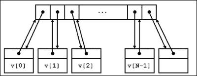

# 第五章：超越 STL 的有效数据结构

C++标准库提供了一套丰富的**通用容器**，可用于各种常见的编程任务。这些包括序列容器，如`std::vector`、`std::deque`、`std::list`、`std::forward_list`，以及有序和无序的关联容器，如`std::map`、`std::set`、`std::unordered_map`、`std::unordered_set`等等。

容器被遍历，并且它们的单个元素使用**迭代器**进行访问。C++根据它们对容器元素提供的访问类型（读取、写入、前向遍历、双向遍历和随机访问）定义了迭代器类别的层次结构。用于遍历容器的迭代器类型取决于容器的内部结构。

除了容器之外，还有一个**通用算法**库，用于读取和操作通用容器，使用一个或多个迭代器。这些库大量依赖**通用编程**，其中程序接口被抽象化，并且以数据类型的形式进行参数化。

这个通用容器、算法集合以及一堆相关的实用工具最初起源于**标准模板库**或**STL**，由亚历山大·斯蒂潘诺夫和孟李在惠普实验室开发，并于 1994 年被接受为 C++标准库的一部分。STL 这个名字一直沿用至今，用来指代源自这项工作的标准库的部分内容，我们会宽泛地使用它来指代这样的库的部分内容。STL 容器和算法自那时以来一直在 C++软件中被广泛使用，但存在一些限制。在 C++11 之前，你只能在容器中存储可复制的对象。标准库中缺少了一些容器类，比如基于哈希的关联容器，而其他一些容器，比如优先队列，受到了限制。

截至 C++14，标准库中还没有适合存储动态分配对象指针的容器，尽管有了`std::unique_ptr`的可用性，自 C++11 以来处理起来更容易。您无法有效地搜索关联容器的内容，比如通过值而不是键来搜索`std::map`，也无法轻松地为自定义容器类编写与 STL 算法良好配合的迭代器。没有一个简单的库可以从各种标准格式（XML、JSON 等）中读取属性集或键值对到内存数据结构中。还有许多其他常见的用途，如果只使用标准库，就需要付出很大的努力。

在本章和下一章中，我们将看一下填补这些空白的主要 Boost 库。本章分为以下几个部分：

+   Boost 容器库

+   使用 Boost 无序容器进行快速查找

+   用于动态分配对象的容器

+   使用 Boost.Assign 进行表达式初始化和赋值

+   使用 Boost.Iterator 进行迭代模式

本章应该为您提供了一个扎实的基础，以便使用 Boost 中各种各样的数据结构库。

# Boost 容器库

Boost 容器库实现了大部分 STL 容器模板，还提供了一些非标准容器。那么，重新实现 STL 容器有什么意义呢？为了理解这一点，让我们看看 STL 容器可以存储哪些对象，以及哪些对象不能存储。

要在`std::vector`中存储类型为`T`的对象，例如，类型`T`必须在定义类型为`std::vector<T>`的对象的地方是一个完整类型（即必须完全定义，而不仅仅是声明）。此外，在 C++11 之前，类型为`T`的对象必须是可复制和可赋值的。这些要求通常适用于除了`std::vector`之外的其他 STL 容器。一般来说，在 C++11 之前，STL 是一个复制密集型的框架：你将对象复制到 STL 容器中存储，容器在调整大小或重组时复制它们，容器在作用域结束时销毁这些副本。复制是一种在时间和内存方面昂贵的操作，也更容易出错，因此 STL 容器上的几个操作的异常安全性较弱。

C++11 引入了移动语义，使得可以通过移动或篡夺现有对象的状态来**移动构造**新对象，通常只交换整数和指针，完全避免任何非平凡和容易出错的复制操作。同样，对象的状态或内容可以在称为**移动赋值**的操作中移动到另一个现有对象中。在从临时对象构造或赋值时，默认应用移动语义，而在从左值对象复制时可以显式强制执行移动语义（参见附录，*C++11 语言特性模拟*）。这些能力使得 C++11 中标准库容器的操作可以得到显著优化，并且独立于**复制语义**。存储在 C++11 STL 容器中的对象如果是**可移动构造**的，则无需是**可复制**的。C++11 还允许在容器的布局中就地构造对象，而不需要先构造然后复制。

Boost Container 库提供了对移动感知的标准库容器的实现，不仅适用于 C++11 编译器，还适用于 C++03 编译器的 Boost 移动模拟（参见附录，*C++11 语言特性模拟*）。此外，它们还支持对象的就地构造。如果你在 C++03 编译器上，这是一个重要的功能。此外，Boost Container 库中的容器可以容纳不完整类型的对象，这使得可以定义有趣的递归结构，这是使用标准容器简单不可能的。

除了标准容器之外，Boost Container 库还实现了几个有用的非标准容器，适用于各种特定用途。

## 移动感知和原地构造

考虑以下用于封装`char`字符串的类，它是可移动但不可复制的。我们使用 Boost 移动模拟宏来定义其移动语义。在 C++11 环境中，这段代码转换为 C++11 移动语法，而在 C++03 中，它模拟了移动语义：

**清单 5.1：可移动但不可复制的字符串**

```cpp
 1 #include <boost/move/move.hpp>
 2 #include <boost/swap.hpp>
 3 #include <cstring>
 4
 5 class String
 6 {
 7 private:
 8   BOOST_MOVABLE_BUT_NOT_COPYABLE(String)
 9
10 public:
11   String(const char *s = nullptr) : str(nullptr), sz(0) {
12     str = heapcpy(s, sz);
13   }
14
15   ~String() {
16     delete[] str;
17     sz = 0;
18   }
19
20   String(BOOST_RV_REF(String) that) : str(nullptr), sz(0) {
21     swap(that);
22   }
23
24   String& operator = (BOOST_RV_REF(String) rhs) {
25     String tmp(boost::move(rhs));
28
29    return *this;
30   }
31
32   void swap(String& rhs) {
33     boost::swap(this->sz, rhs.sz);
34     boost::swap(this->str, rhs.str);
35   }
36
37   const char *get() const {
38     return str;
39   }
40
41 private:
42   char *str;
43   size_t sz;
44
45  static char *heapcpy(const char *str, size_t& sz) {
46     char *ret = nullptr;
47
48     if (str) {
49       sz = std::strlen(str) + 1;
50       ret = new char[sz];
51       std::strncpy(ret, str, sz);
52     }
53
54     return ret;
55   }
56 };
```

在 C++11 之前的编译器上，尝试将`String`的实例存储在标准容器中将导致编译错误，因为`String`是不可复制的。以下是一些将 String 实例移入`boost::container::vector`的代码，它是`std::vector`的 Boost 对应物：

**清单 5.2：将 String 对象推送到 Boost 向量**

```cpp
 1 #include <boost/container/vector.hpp>
 2 #include "String.h"  // for class String
 3 #include <cassert>
 4 
 5 int main() {
 6   boost::container::vector<String> strVec;
 7   String world("world");
 8   // Move temporary (rvalue)
 9   strVec.push_back(String("Hello"));
10   // Error, copy semantics needed
11   //strVec.push_back(world);
12   // Explicit move
13   strVec.push_back(boost::move(world));
14   // world nulled after move
15   assert(world.get() == nullptr);
16   // in-place construction
17   strVec.emplace_back("Hujambo Dunia!"); // Swahili
18
19   BOOST_FOREACH(String& str, strVec) {
20     std::cout <<str.get() << '\n';
21   }
22 }
```

在上述代码中，我们创建了一个 Boost `vector`（第 6 行），并将临时 String `"Hello"`附加到它（第 9 行）。这自动调用了移动语义，因为表达式`String("Hello")`是一个**rvalue**。我们构造了一个名为`world`的`String`变量（第 7 行），但如果我们尝试将它附加到`strVec`，将会失败，因为它会尝试复制`world`，但它是不可复制的（第 11 行）。

为了将`world`放入`strVec`，我们需要明确地移动它，使用`boost::move`（第 13 行）。一旦`world`移动到`strVec`中，它的内容就会移动到存储在`strVec`中的`String`对象中，因此其内容变为空（第 15 行）。最后，通过调用向量的`emplace_back`成员并传递 String 的构造函数参数来就地构造一个`String`对象（第 17 行）。清单 5.1 和 5.2 中的代码将在 C++11 编译器以及 C++11 上正确编译和工作。此外，在 C++11 上，Boost 移动模拟的宏简单地转换为 C++右值引用语法。请注意，我们使用`BOOST_FOREACH`宏而不是 C++11 基于范围的 for 循环来遍历向量（参见附录，*C++11 语言特性模拟*）。

代码打印以下行：

```cpp
Hello
world
Hujambo Dunia!
```

请注意，在基于范围的 for 循环中，循环变量`str`是使用`auto&`引入的。如果我们没有在`auto`后使用尾随的`&`，编译器将尝试生成代码将`strVec`的每个元素复制到`str`中，这将失败，因为`String`是不可复制的。使用尾随的`&`确保`str`是对连续元素的引用。

除了`vector`，Boost 容器库还实现了其他标准容器，如`deque`，`list`，`set`，`multiset`，`map`和`multimap`，以及`basic_string`。这些是移动感知容器，非常类似于它们的 C++11 对应物，并且可以在使用移动模拟（通过 Boost.Move）的 C++11 之前的环境中使用。

## 非标准容器

除了标准容器外，Boost 容器库还提供了几个有用的非标准容器。本节是对这些容器及其适用性的快速概述。

### 平面关联容器

标准关联容器有两种类型：**有序**和**无序**。有序容器如`std:set`，`std::multiset`，`std::map`和`std::multimap`通常使用平衡搜索树实现（优化的红黑树实现是**事实上的**）。因此，它们按排序顺序存储它们的元素。无序容器`std::unordered_set`，`std::unordered_multiset`，`std::unordered_map`和`std::unordered_multimap`基于哈希表。它们起源于 Boost 容器库，然后成为 C++TR1 发布和 C++11 标准库的一部分。这些容器将对象存储在称为**哈希表**的桶数组中，基于为对象计算的哈希值。在哈希表中存储对象的顺序没有固有的顺序，因此称为无序容器。

关联容器支持快速查找。有序容器使用平衡搜索树，支持对数时间搜索，无序容器使用哈希表，支持摊销常数时间搜索。这些不是唯一支持快速查找的数据结构。对排序序列进行二分搜索，允许对其元素进行随机位置访问，也可以在对数时间内执行。四个平面关联容器：`flat_set`，`flat_multiset`，`flat_map`和`flat_multimap`使用排序向量存储数据，并在向量上使用二分搜索执行查找。它们是标准库中有序和无序对应物的替代品，但对于插入和查找具有不同的性能特征：

**清单 5.3：使用平面映射**

```cpp
 1 #include <iostream>
 2 #include <string>
 3 #include <boost/container/flat_map.hpp>
 4 
 5 int main()
 6 {
 7   boost::container::flat_map<std::string, std::string> 
 8           newCapitals;
 9 
10   newCapitals["Sri Lanka"] = "Sri Jayawardenepura Kotte";
11   newCapitals["Burma"] = "Naypyidaw";
12   newCapitals["Tanzania"] = "Dodoma";
13   newCapitals["Cote d'Ivoire"] = "Yamoussoukro"; 
14   newCapitals["Nigeria"] = "Abuja";
15   newCapitals["Kazakhstan"] = "Astana";
16   newCapitals["Palau"] = "Ngerulmud";
17   newCapitals["Federated States of Micronesia"] = "Palikir";
18 
19   for (const auto& entries : newCapitals) {
20     std::cout<< entries.first << ": " << entries.second
21               << '\n';
22   }
23 }
```

这个第一个例子列出了一些国家，它们的首都在过去几十年里发生了变化。如果你认为拉各斯仍然是尼日利亚的首都，那你会感到惊讶。地理因素除外，在前面的代码中并没有太多令人惊讶的事情。我们为`boost::container::flat_map<std::string, std::string>`创建了一个`typedef`，并实例化了一个这种类型的地图`newCapitals`，插入了国家和它们的新首都的字符串对。如果我们用`std::map`替换`boost::container::flat_map`，那么代码将可以在不进行任何更改的情况下工作。

扁平关联容器可以存储可复制或可移动的对象。对象以连续布局存储，而不使用指针进行间接引用。因此，为了存储某种类型的给定数量的对象，扁平容器将比基于树和哈希的容器占用更少的内存。插入会保持排序顺序，因此比其他关联容器更昂贵；特别是对于可复制但不可移动的值类型。此外，与标准关联容器不同，插入任何新元素或删除现有元素都会使所有迭代器失效。 

迭代和查找往往比标准容器更快，缓存性能也更好，这是由于连续布局和二分查找的更快性能。插入到扁平容器中可能会导致重新分配，并且如果扁平容器的初始容量超过，则元素会被移动或复制。这可以通过在执行插入之前使用`reserve`成员函数来预留足够的空间来防止。下面的例子说明了这一方面：

**清单 5.4：使用扁平集**

```cpp
 1 #include <boost/container/flat_set.hpp>
 2 #include <iostream>
 3 #include <string>
 4
 5 template<typename C>
 6 void printContainerInternals(const C& container) {
 7   std::cout << "Container layout" << '\n'
 8             << "-------------\n";
 9 
10   for (const auto& elem : container) {
11     std::cout << "[Addr=" << &elem
12               << "] : [value=" << elem << "]\n";
13   }
14 }
15 
16 int main()
17 {
18   boost::container::flat_set<std::string> someStrings;
19   someStrings.reserve(8);
20 
21   someStrings.insert("Guitar");
22   printContainerInternals(someStrings);
23 
24   someStrings.insert("Mandolin");
25   printContainerInternals(someStrings);
26 
27   someStrings.insert("Cello");
28   printContainerInternals(someStrings);
29 
30   someStrings.insert("Sitar");
31   printContainerInternals(someStrings);
32 }
```

这个例子展示了一种方法，来找出扁平关联容器的内部布局在连续插入后如何改变。我们定义了一个名为`someStrings`的`flat_set`容器（第 18 行），并插入了八个字符串乐器的名称。在每次插入后，模板`printContainer`被调用以打印出内部向量中的连续地址，每个字符串都在其中。我们在插入之前（第 19 行）为八个元素保留了容量，并在此后插入了八个元素。由于一开始就有足够的容量，没有一个插入应该触发重新分配，你应该看到一组相当稳定的地址，只有字符串的顺序改变以保持排序顺序。如果我们注释掉保留的调用（第 19 行）并运行代码，我们可能会看到重新分配和地址的变化。

### slist

`boost::container::slist`容器是一个类似于 SGI STL 实现中可用但从未成为标准的同名容器模板的单链表抽象。`std::list`容器是一个双链表。C++最终在 C++11 中引入了`std::forward_list`，得到了自己的单链表。`slist`是可移动的。

单链表的内存开销比双链表小，尽管某些操作的时间复杂度从常数变为线性。如果你需要一个支持相对频繁插入且不需要向后遍历的序列容器，单链表是一个不错的选择：

**清单 5.5：使用 slist**

```cpp
 1 #include <boost/container/slist.hpp>
 2 #include <iostream>
 3 #include <string>
 4 
 5 int main()
 6 {
 7   boost::container::slist<std::string> geologic_eras;
 8 
 9   geologic_eras.push_front("Neogene");
10   geologic_eras.push_front("Paleogene");
11   geologic_eras.push_front("Cretaceous");
12   geologic_eras.push_front("Jurassic");
13   geologic_eras.push_front("Triassic");
14   geologic_eras.push_front("Permian");
15   geologic_eras.push_front("Carboniferous");
16   geologic_eras.push_front("Devonian");
17   geologic_eras.push_front("Silurian");
18   geologic_eras.push_front("Ordovician");
19   geologic_eras.push_front("Cambrian");
20 
21   for (const auto& str : geologic_eras) {
22     std::cout << str << '\n';
23   }
24 }
```

在这个简单的例子中，我们使用`slist`来存储连续的地质时代。与标准序列容器`std::list`不同，`slist`没有`push_back`方法来将元素追加到列表的末尾。这是因为为每个追加计算列表的末尾会使其成为一个线性操作，而不是一个常数操作。相反，我们使用`push_front`成员将每个新元素添加到列表的头部。列表中字符串的最终顺序是插入顺序的相反顺序（以及按照时期的年代顺序，最早的在前）。

单链表上的某些操作的时间复杂度比双链表上的等效操作要高。`insert`方法在`std::list`中是常数时间，但在`slist`中是线性时间。这是因为在双链表中，如`std::list`，可以使用前一个元素的链接来定位插入位置之前的元素，但在`slist`中需要从列表开头进行遍历。出于同样的原因，用于擦除给定位置的元素的`erase`成员函数和用于就地构造元素*在*另一个元素之前的`emplace`成员函数与它们的`std::list`对应物相比也具有线性复杂度。因此，`slist`提供了成员函数`insert_after`、`erase_after`和`emplace_after`，它们提供了类似的功能，稍微改变了在给定位置之后插入、擦除和就地构造对象的语义，以在常数时间内添加元素到`slist`的开头，您可以使用`before_begin`成员函数获取指向`head`指针的迭代器，这是一个不可解引用的迭代器，当递增时，指向`slist`中的第一个元素。

现在我们可以重写清单 5.5，按年代顺序将地质时期插入`slist`中：

**清单 5.6：将元素添加到 slist 的末尾**

```cpp
 1 #include <boost/container/slist.hpp>
 2 #include <iostream>
 3 #include <string>
 4 #include <cassert>
 5
 6 int main()
 7 {
 8   boost::container::slist<std::string> eras;
 9   boost::container::slist<std::string>::iterator last = 
10                                          eras.before_begin();
11
12   const char *era_names [] = {"Cambrian", "Ordovician", 
13                      "Silurian", "Devonian", "Carboniferous", 
14                      "Permian", "Triassic", "Jurassic", 
15                      "Cretaceous", "Paleogene", "Neogene"};
16
17   for (const char *period :era_names) {
18     eras.emplace_after(last, period);
19     ++last;
20   }
21
22   int i = 0;
23   for (const auto& str : eras) {
24     assert(str == era_names[i++]);
25   }
26 }
```

#### 拼接

除了`insert`和`emplace`之外，您还可以使用称为`splice`的操作在`slist`中的任何给定位置添加元素。拼接是链表上的一个有用操作，其中来自给定列表的一个或多个连续元素被移动到另一个链表的特定位置或同一列表中的不同位置。`std::list`容器提供了一个`splice`成员函数，允许您在常数时间内执行此操作。在`slist`中，`splice`成员函数的时间复杂度与被拼接的元素数量成线性关系，因为需要线性遍历来定位插入位置之前的元素。`splice_after`成员函数，像`insert_after`和`emplace_after`一样，在指定位置之后将元素移动到列表中：

**清单 5.7：拼接 slists**

```cpp
 1 #include <boost/container/slist.hpp>
 2 #include <string>
 3 #include <iostream>
 4 
 5 typedef boost::container::slist<std::string> list_type;
 6 typedef list_type::iterator iter_type;
 7 
 8 int main()
 9 {
10   list_type dinos;
11   iter_type last = dinos.before_begin();
12 
13   const char *dinoarray[] = {"Elasmosaurus", "Fabrosaurus",
14                        "Galimimus", "Hadrosaurus", "Iguanodon",
15                        "Appatosaurus", "Brachiosaurus",
16                        "Corythosaurus", "Dilophosaurus"};
17 
18   // fill the slist
19   for (const char *dino : dinoarray) {
20     dinos.insert_after(last, dino);
21     ++last;
22   }
23 
24   // find the pivot
25   last = dinos.begin();
26   iter_type iter = last;
27
28   while (++iter != dinos.end()) {
29     if (*last > *iter) {
30       break;
31     }
32     ++last;
33   }
34 
35   // find the end of the tail
36   auto itend = last;
37   while (iter != dinos.end()) {
38     ++itend;
39     ++iter;
40   }
41
42   // splice after
43   dinos.splice_after(dinos.before_begin(), dinos,
44                   last, itend);
45   for (const auto& str: dinos) {
46    std::cout <<str<< '\n';
47   }
48 }
```

在这个代码示例中，我们有一个包含八个恐龙名称的数组，以英文字母表的前八个字母开头（第 13-16 行）。它是一个排序列表，被旋转了四个位置，所以以`Elasmosaurus`开头，并且在中间某处有`Appatosaurus`。我们使用`insert_after`（第 20 行）将其转换为`slist`，然后定位词典顺序最小的字符串所在的枢轴（第 29-30 行）。在循环结束时，`iter`指向`dinos`列表中词典顺序最小的字符串，`last`指向`iter`的前一个元素。这是我们想要使用的`splice_after`重载的原型，用于将列表的尾部移动到开头：

```cpp
void splice_after(const_iterator add_after, slist& source,
          const_iterator start_after, const_iterator end);
```

要从源容器移动到目标的元素序列从`start_after`后面的元素开始，到`end`结束，两端都包括在内，即半开区间（`start_after`，`end`）。这些元素被插入到目标`slist`中，位置由`add_after`确定。我们可以使用第三个参数的迭代器`last`。对于第四个参数，我们计算列表中最后一个元素的位置（第 36-40 行）。迭代器`itend`现在指向列表中的最后一个元素。使用所选的`splice_after`重载，我们将所有元素从`last`开始，直到列表的末尾，移动到列表的开头（第 43-44 行）。

`std::forward_list`容器没有提供`size`成员函数来返回列表中元素的数量。这有助于确保其`splice_after`实现是常数时间。否则，在每次`splice_after`操作期间，需要计算转移到列表中的元素数量，并且需要将元素的总数增加相应的数量。仅仅为了支持这一点，`splice_after`将不得不是线性的，而不是常数时间。`slist`容器提供了一个`size`成员和几个`splice_after`的重载。我们使用的`splice_after`的重载是线性的，因为它使用线性遍历来计算这个数字。然而，如果我们在我们的代码中计算这个数字而不需要额外的循环，并将其传递给`splice_after`函数，那么它可以避免再次迭代并使用传递的数字。有两个`splice_after`的重载，它们接受用户提供的元素数量，并避免线性计算，从而提供常数时间的 splice。

以下是一个略微修改的片段来实现这一点：

```cpp
35   // find the end of the tail
36   size_t count = 0;
37   auto itend = last;
38
39   while (iter != dinos.end()) {
40     ++itend;
41     ++iter;
42     ++count;
43   }
44
45   // splice after
46   dinos.splice_after(dinos.before_begin(), dinos,
47                   last, itend, count);

```

我们在确定要移动的迭代器范围时计算`count`，并将其传递给`splice_after`。我们必须确保我们对`count`的计算是正确的，否则行为将是未定义的。这个重载很有用，因为我们有一种方法来确定计数，而不增加我们调用代码的复杂性。

对于`std::forward_list`，`splice_after`的签名在语义上与`boost::container::slist`略有不同。以下是`std::forward_list`的`splice_after`成员的一个重载的原型：

```cpp
void splice_after(const_iterator pos, std::forward_list& list,const_iterator before_first, const_iterator after_last);
```

迭代器`before_first`和`after_last`标识了一个开放区间，实际转移的元素将是从`before_first`后面的元素开始，到`after_last`前面的元素结束，即开放区间(`before_first`, `after_last`)。使用这个函数，我们在这种情况下不需要编写循环来确定最后一个元素，因为我们可以简单地使用`dinos.end()`作为结束位置的标记。如果`dinos`是`std::forward_list`的一个实例，我们将编辑列表 5.7，从而节省六行代码：

```cpp
37   dinos.splice_after(dinos.before_begin(), dinos,
38                      last, dinos.end());
```

`std::forward_list`中所有传输元素范围的`splice_after`重载都是线性的。虽然我们在`boost::container::slist`中看到了一个常数时间的重载，但我们必须编写线性复杂度的逻辑来传递正确的元素数量。因此，在许多情况下，如果您可以在不使用常数时间的`size`成员函数的情况下做到，使用`std::forward_list`的代码可能更易于维护，而且效率不会降低。

### stable_vector

`std::vector`容器在连续的内存中存储对象。`vector`根据需要重新分配内部存储并复制或移动对象到新的存储空间，以便容纳额外的新对象。它允许使用索引快速随机访问存储的对象。在向向量的任意位置插入元素比在末尾追加元素要昂贵，因为插入需要移动插入点后的元素，以便为新元素腾出空间。这种行为还有一个含义。考虑以下代码：

**列表 5.8：std::vector 中的迭代器失效**

```cpp
 1 #include <vector>
 2 #include <cassert>
 3 
 4 int main() {
 5   std::vector<int>v{1, 2, 3, 5};
 6   auto first = v.begin();
 7   auto last = first + v.size() - 1;
 8   assert(*last == 5);
 9   v.insert(last, 4);
10   // *last = 10;  // undefined behavior, invalid iterator
11   for (int i = 0; i < 1000; ++i) {
12     v.push_back(i);
13   }
14 
15   // *first = 0; // likely invalidated
16 }
```

在前面的代码中，我们创建了一个整数`vector`，名为`v`，并用四个整数进行初始化（第 5 行）。用于初始化向量的大括号括起来的逗号分隔值列表是一个非常方便的 C++11 构造，称为**初始化列表**。在 C++11 之前，您必须手动附加值，或者如我们将在本章后面看到的那样，使用`Boost.Assign`库。然后我们计算对象的最后一个元素的迭代器，作为从第一个迭代器的偏移量（第 7 行）。我们断言最后一个元素是 5（第 8 行）。接下来，我们在最后一个元素之前插入一个元素（第 9 行）。在此之后，迭代器`last`将被使无效，并且任何访问迭代器`last`的操作都将是未定义行为。实际上，在两个随机访问容器，即向量和双端队列中，迭代器的使无效经常发生。向向量执行任何写操作都可能使迭代器无效。例如，如果您在特定迭代器位置擦除一个元素，则所有现有的迭代器到后续位置的迭代器都将被使无效。甚至在向量的末尾添加一个元素也可能触发向量内部存储的调整大小，需要移动元素。这样的事件将使所有现有的迭代器无效。标准库`vector`是一个**不稳定的容器**。`boost::container::stable_vector`是一个序列容器，提供了稳定的迭代器的随机访问，除非它们所指向的元素被擦除。请查看 Boost 文档页面上关于 stable_vector 的以下图片（[`www.boost.org/doc/libs/1_58_0/doc/html/container/non_standard_containers.html#container.non_standard_containers.stable_vector`](http://www.boost.org/doc/libs/1_58_0/doc/html/container/non_standard_containers.html#container.non_standard_containers.stable_vector)）：



正如这里所说明的，`stable_vector`不会以连续的内存布局存储对象。相反，每个对象都存储在一个单独的节点中，并且一个连续的数组以插入顺序存储指向这些节点的指针。每个节点包含实际的对象，还包含指向数组中其位置的指针。迭代器指向这些节点，而不是数组中的位置。因此，具有现有对象的节点在插入新对象或删除一些现有对象后不会改变，并且它们的迭代器也保持有效。但是，当它们由于插入/删除而改变位置时，它们的后向指针会被更新。节点指针的连续数组仍然允许对元素进行随机访问。由于额外的指针和间接引用，`stable_vector`倾向于比`std::vector`慢，但这是稳定迭代器的权衡。以下是一些示例代码：

**清单 5.9：稳定向量示例**

```cpp
 1 #include <boost/container/stable_vector.hpp>
 2 #include <cassert>
 3 #include <string>
 4
 5 int main()
 6 {
 7   const char *cloud_names[] = {"cumulus", "cirrus", "stratus",
 8                 "cumulonimbus", "cirrostratus", "cirrocumulus",
 9                 "altocumulus", "altostratus"};
10
11   boost::container::stable_vector<std::string> clouds;
12   clouds.reserve(4);
13   clouds.resize(4);   // To circumvent a bug in Boost 1.54
14
15   size_t name_count = sizeof(cloud_names)/sizeof(const char*);
16   size_t capacity = clouds.capacity();
17
18   size_t i = 0;
19   for (i = 0; i < name_count && i < capacity; ++i) {
20     clouds[i] = cloud_names[i];
21   }
22
23   auto first = clouds.begin();
24
25   for (; i < name_count; ++i) {
26     clouds.push_back(cloud_names[i]);
27   }
28
29   auto sixth = clouds.begin() + 5;
30
31   // 1 erase @4
32   clouds.erase(clouds.begin() + 4);
33   // 2 inserts @3
34   clouds.insert(clouds.begin() + 3, "stratocumulus");
35   clouds.insert(clouds.begin() + 3, "nimbostratus");
36
37   assert(*first == cloud_names[0]);
38   assert(sixth == clouds.begin() + 6); // not +5
39   assert(*sixth == cloud_names[5]);
40 }
```

使用`stable_vector`与使用`vector`没有区别，而且它也是移动感知的。在前面的示例中，我们想要将不同类型的云的名称存储在`std::string`的`stable_vector`中。有一个名为`cloud_names`的数组中存在八个云的名称（第 7-9 行）。我们创建了一个名为`clouds`的`stable_vector`来存储这些名称，并为仅四个元素保留了容量（第 12-13 行）。我们想要展示的是，一旦我们添加超出`stable_vector`容量的元素，需要扩展基础数组并移动现有数据，那么在更改容量之前计算的迭代器仍然保持有效。`reserve`完全有可能分配比请求的更多的容量，如果这比我们拥有的云名称的总数还要多，那么我们的示例就没有意义。

我们首先存储云的名称（第 18-21 行），而不会超出容量，并计算第一个元素的迭代器（第 23 行）。然后，我们追加剩余的云名称（如果有的话）（第 25-27 行）。如果有剩余的云名称，那么当它们中的第一个被存储时，会导致调整大小。

我们计算第六个元素的迭代器（第 29 行），删除第五个元素（第 32 行），并在第四个元素之前插入两个云名称（第 34-35 行）。在所有这些之后，迭代器`first`仍然指向第一个元素（第 37 行）。在我们计算迭代器`sixth`的时候，它指向第六个元素，其值为`"cirrocumulus"`，即`cloud_names`数组中的第六个字符串。现在经过一次删除和两次插入，它应该是第七个元素（第 38 行），但其值应该保持不变（第 39 行）——就像迭代器一样稳定！

### 提示

自 Boost 1.54 以来，`stable_vector`的`capacity`成员函数在调用`reserve`后返回了一个不正确的容量值。通过在调用`capacity`之前使用与`reserve`传递的参数一样大的参数调用`resize`成员函数（第 13 行），我们可以规避这个 bug，并确保随后调用`capacity`返回正确的值。一旦 bug 在以后的版本中修复，调用`reserve`后的`resize`应该是不需要的。

### static_vector

`boost::container::static_vector`模板是一个类似于向量的容器，其大小上限在编译时定义。它在布局中分配了一个固定大小的未初始化存储空间，而不是在单独的缓冲区中动态分配。与`vector`或`stable_vector`不同，它不会在实例化时尝试对所有元素进行值初始化，后两者在构造函数参数中指定初始大小时会尝试对元素进行值初始化。由于没有堆分配和值初始化，`static_vector`实例化几乎没有开销。

`static_vector`就像普通的 vector 一样，但有一个重要的注意事项。尝试在`static_vector`中插入一个太多的元素会导致运行时错误，因此在尝试插入额外元素之前，您应该始终确保`static_vector`中有足够的空间：

**清单 5.10：使用 static_vector**

```cpp
 1 #include <boost/current_function.hpp>
 2 #include <boost/container/static_vector.hpp>
 3 #include <iostream>
 4
 5 class ChattyInit
 6 {
 7 public:
 8   ChattyInit() {
 9     std::cout << BOOST_CURRENT_FUNCTION << '\n';
10   }
11 };
12
13 int main()
14 {
15   boost::container::static_vector<ChattyInit, 10> myvector;
16   std::cout << "boost::container::static_vector initialized"
17             <<'\n';
18   while (myvector.size() < myvector.capacity()) {
19     myvector.push_back(ChattyInit());
20   }
21
22   // cisv.push_back(ChattyInit()); // runtime error
23 }
```

我们构造了一个`ChattyInit`对象的`static_vector`，`ChattyInit`是一个简单的类，其构造函数打印自己的名称。`static_vector`的固定大小被指定为一个数字模板参数（第 15 行）。运行上述代码在我的 GNU Linux 系统上使用 g++ 4.9 编译器打印如下内容：

```cpp
boost::container::static_vector initialized
ChattyInit::ChattyInit()
ChattyInit::ChattyInit()
… 8 more lines …
```

我们可以看到，在`static_vector`初始化的过程中没有创建任何对象，只有在追加时才实例化单个对象。我们确保插入的元素总数不超过容器的容量（第 18 行）。由于`static_vector`的元素默认情况下不进行值初始化，因此当没有显式添加元素时，`size`成员函数返回零。与`std::vector`相比：

```cpp
std::vector<ChattyInit> myvector(10); // 10 elems value-inited
assert(myvector.size() == 10);
```

如果我们实际上尝试添加一个太多的元素（第 22 行），程序将崩溃。`boost::container::static_vector`是一个有用的容器，如果您正在寻找一个快速的、大小受限的`vector`替代品。

# 使用 Boost 无序容器进行快速查找

C++03 中的四个标准关联容器：`std::set`、`std::map`、`std::multiset`和`std::multimap`都是有序容器，它们使用平衡二叉搜索树以某种排序顺序存储它们的键。它们要求为它们的键定义一个排序关系，并提供对数复杂度的插入和查找。给定排序关系和两个键 A 和 B，我们可以确定 A 是在 B 之前还是 B 在 A 之前。如果两者都不在对方之前，键 A 和 B 被称为等价；这并不意味着 A 和 B 相等。事实上，有序容器对相等是不关心的，甚至根本不需要定义相等的概念。这就是为什么这样的关系被称为**严格弱序**。

考虑以下示例：

```cpp
 1 #include <string>
 2 #include <tuple>
 3 
 4 struct Person  {
 5   std::string name;
 6   int age;
 7   std::string profession;
 8   std::string nationality;
 9 };
10
11 bool operator < (const Person& p1, const Person& p2)
12 {
13   return std::tie(p1.nationality, p1.name, p1.age)
14          < std::tie(p2.nationality, p2.name, p2.age);
15 }
```

我们定义了一个类型`Person`，代表一个人，使用字段`name`，`age`，`profession`和`nationality`（第 3-9 行），然后使用`operator<`定义了一个不考虑`profession`字段的排序关系（第 11-15 行）。这允许对`Person`对象进行排序，但不能进行相等比较。如果`!(p1 < p2)`和`!(p2 < p1)`都成立，那么两个`Person`对象`p1`和`p2`将被视为等价。这对于任何具有相同`name`，`age`和`nationality`的`Person`对象都是成立的，而不考虑它们的`profession`。有序容器`std::set`不允许具有相等键的多个键，而`std::multiset`允许。同样，`std::map`不允许具有等价键的多个键值对，而`std::multimap`允许。因此，向`std::map`添加一个已经包含等价键的键值对会覆盖旧值。

有序容器使用一种称为红黑树的平衡二叉搜索树进行实现，具有多种优化。除了能够在对数时间内查找和插入键之外，它们还提供了一个关键的功能——对容器中的键进行有序遍历。然而，如果您不需要有序遍历，那么有更高效的替代方案可用——哈希表是最明显的选择。哈希表的适当实现支持平均常数时间查找和摊销常数时间插入，这比有序容器具有更好的缓存性能，并具有略高的空间开销。

Boost Unordered 库引入了四个基于哈希表的有序容器的对应物：`boost::unordered_set`，`boost::unordered_map`，`boost::unordered_multiset`和`boost::unordered_multimap`，它们在 2007 年成为 C++ TR1 版本的一部分，并在 C++11 标准库中包含。当然，您可以在 C++03 编译器中使用 Boost Unordered。

无序容器需要为其存储的对象定义相等的概念，但不需要排序的概念。因此，对于无序容器，等价性是根据相等性而不是排序来定义的。此外，无序容器需要一种方法来计算每个键的哈希值，以确定键存储在表中的位置。在接下来的代码示例中，我们将看到如何使用无序容器和计算对象的哈希值，重用我们之前介绍的`Person`类型。

**清单 5.11：使用 unordered_sets**

```cpp
 1 #include <boost/unordered_set.hpp>
 2 #include <boost/functional/hash.hpp>
 3 #include <iostream>
 4 #include <cassert>
 5 #include "Person.h" // struct Person definition
 6
 7 bool operator==(const Person& left, const Person& right){
 8   return (left.name == right.name
 9          && left.age == right.age
10          && left.profession == right.profession
11          && left.nationality == right.nationality);
12 }
13
14 namespace boost
15 {
16   template <>
17   struct hash<Person>
18   {
19     size_t operator()(const Person& person) const{
20       size_t hash = 0;
21       boost::hash_combine(hash, 
22                          boost::hash_value(person.name)); 
23       boost::hash_combine(hash, 
24                        boost::hash_value(person.nationality)); 
25       return hash;
26     }
27   };
28 }
29
30 int main() {
31   boost::unordered_set<Person> persons;
32
33   Person p{"Ned Land", 40, "Harpooner","Canada"};
34   persons.insert(p); // succeeds
35
36   Person p1{"Ned Land", 32, "C++ Programmer","Canada"};
37   persons.insert(p1);  // succeeds
38
39   assert(persons.find(p) != persons.end());
40   assert(persons.find(p1) != persons.end());
41
42   Person p2 = p;
43   persons.insert(p2);   // fails
44   assert(persons.size() == 2);
45 }
```

前面的示例展示了如何使用`unordered_set`来存储我们在前面清单中定义的用户定义类型`Person`的对象。我们定义了一个`Person`对象的`unordered_set`（第 31 行），创建了两个`Person`对象`p`和`p1`，并将它们插入名为`Persons`的`unordered_set`（第 34、37 行）。我们定义了第三个`Person`对象`p2`，它是`p`的副本，并尝试插入此元素，但失败了（第 43 行）。容器作为一个集合（`unordered_set`）包含唯一元素。由于`p2`是`p`的副本并且等于它，它的插入失败了。

`unordered_set`有几种计算其存储的每个对象的哈希值的方法。我们演示其中一种方法：打开`boost`命名空间（第 14 行），为所讨论的`Person`类型定义`boost::hash`函数模板的特化（第 21-24 行）。为了计算`Person`对象的哈希值，我们只考虑它的两个字段：`name`和`nationality`。我们使用实用函数`boost::hash_value`和`boost::hash_combine`（生成各个字段的哈希值并将它们组合）。由于我们在确定`Person`对象的哈希值时只考虑一个人的姓名和国籍，因此代表具有相同姓名和国籍的个人的对象`p`和`p1`最终具有相同的哈希值。但是，它们并不相等，因为它们的其他字段不同，因此两个对象都成功添加到集合中。另一方面，对象`p2`是`p`的副本，当我们尝试将`p2`插入`persons`集合时，插入失败，因为集合不包含重复项，而`p2`是`p`的重复项。`boost::unordered_multiset`和`boost::unordered_multimap`容器是可以存储重复对象的基于哈希的容器。

计算好的哈希值对于确保对象在哈希表中分布良好非常重要。虽然`boost::hash_value`和`boost::hash_combine`实用函数模板有助于计算更复杂对象的哈希值，但它们的滥用可能导致低效的哈希算法。对于用户定义的类型，在许多情况下，最好使用经过数学验证的哈希算法，以利用用户定义类型的语义。如果您在`unordered_set`或`unordered_map`中使用原语或标准类型如`std::string`作为键，则无需自己编写哈希函数，因为`boost::hash`已经做得很好。

查找值通常使用无序关联容器的`find`和`count`成员函数进行。`find`返回指向容器中存储的实际对象的迭代器，对应于传递的键，而`count`只返回键的出现次数。`unordered_multiset`和`unordered_multimap`的`equal_range`成员函数返回匹配对象的范围。对于`unordered_set`和`unordered_map`，count 成员函数永远不会返回大于 1 的值。

# 动态分配对象的容器

面向对象编程在很大程度上依赖于使用多态基类引用来操作整个类层次结构的对象。往往，这些对象是动态分配的。当处理这样一整套对象时，STL 容器就显得力不从心；它们只能存储单一类型的具体对象，并需要复制或移动语义。不可能定义一个可以存储跨类层次结构的不同类对象的单一容器。虽然可以在容器中存储多态基类指针，但指针被视为 POD 类型，并且对于深复制语义几乎没有支持。动态分配对象的生命周期与 STL 无关。但是，定义一个需要单独管理指针生命周期的容器是笨拙的，而且没有任何来自容器的帮助。

Boost 指针容器库通过存储指向动态分配对象的指针并在容器生命周期结束时释放它们来解决这些问题。指针容器提供了一个接口，通过它可以操作底层对象，而无需进行指针间接。由于它们存储对象的指针，这些容器自然支持多态容器，无需任何额外的机制。

以下表格显示了指针容器及其标准库对应物：

| Boost 的指针容器 | 标准库容器 |
| --- | --- |
| boost::ptr_array | std::array |
| boost::ptr_vector | std::vector |
| boost::ptr_deque | std::deque |
| boost::ptr_list | std::list |
| boost::ptr_set / boost::ptr_multiset | std::set / std::multiset |
| boost::ptr_unordered_set / boost::ptr_unordered_multiset | std::unordered_set / std::unordered_multiset |
| boost::ptr_map / boost::ptr_multimap | std::map / std::multimap |
| boost::ptr_unordered_map / boost::ptr_unordered_multimap | std::unordered_map / std::unordered_multimap |

Boost 为所有标准容器定义了指针容器的等价物。这些容器可用于存储多态指针，存储指针指向的底层对象不需要可复制或可移动。以下是一个基本示例以便开始：

**清单 5.12：使用 Boost 指针容器**

```cpp
1 #include <boost/ptr_container/ptr_vector.hpp>
 2 #include <boost/noncopyable.hpp>
 3 #include <iostream>
 4 #include <boost/current_function.hpp>
 5
 6 class AbstractJob {
 7 public:
 8   virtual ~AbstractJob() {}
 9
10   void doJob() {
11     doStep1();
12     doStep2();
13   }
14
15 private:
16   virtual void doStep1() = 0;
17   virtual void doStep2() = 0;
18 };
19
20 class JobA : public AbstractJob
21 {
22   void doStep1() override {
23     std::cout << BOOST_CURRENT_FUNCTION << '\n';
24   }
25
26   void doStep2() override {
27     std::cout << BOOST_CURRENT_FUNCTION << '\n';
28   }
29 };
30
31 class JobB : public AbstractJob
32 {
33   void doStep1() override {
34     std::cout << BOOST_CURRENT_FUNCTION << '\n';
35   }
36
37   void doStep2() override {
38     std::cout << BOOST_CURRENT_FUNCTION << '\n';
39   }
40 };
41
42 int main()
43 {
44   boost::ptr_vector<AbstractJob> basePtrVec;
45
46   basePtrVec.push_back(new JobA);
47   basePtrVec.push_back(new JobB);
48
49   AbstractJob& firstJob = basePtrVec.front();
50   AbstractJob& lastJob = basePtrVec.back();
51
52   for (auto& job : basePtrVec) {
53     job.doJob();
54   }
55 }
```

在前面的例子中，`AbstractJob`是一个抽象基类（第 5 行），它定义了两个私有纯虚函数`doStep1`和`doStep2`（第 16、17 行），以及一个非虚公共函数`doJob`，该函数调用这两个函数（第 10 行）。`JobA`和`JobB`是`AbstractJob`的两个具体实现，它们实现了虚函数`doStep1`和`doStep2`。函数签名后面的`override`关键字（第 22、26、33 和 37 行）是 C++11 的一个特性，它澄清了特定函数覆盖了基类中的虚函数。在主函数中，我们创建了一个`ptr_vector`的`AbstractJobs`。注意模板参数不是指针类型（第 44 行）。然后我们将两个`JobA`和`JobB`的具体实例附加到向量中（第 46 和 47 行）。我们使用`front`（第 49 行）和`back`（第 50 行）成员函数访问向量中的第一个和最后一个元素，它们都返回对底层对象的引用，而不是它们的指针。最后，我们在一个基于范围的 for 循环中读取存储的对象（第 52 行）。循环变量`job`声明为引用（`auto&`），而不是指针。指针容器的成员函数和迭代器返回的是对存储指针的引用，而不是它们指向的底层对象，提供了语法上的便利。

虽然基于范围的 for 循环和`BOOST_FOREACH`使得遍历集合变得容易，但如果需要，也可以直接使用迭代器接口：

```cpp
49   typedef boost::ptr_vector<AbstractJob>::iterator iter_t;
50 
51   for (iter_t it = basePtrVec.begin(); 
52        it != basePtrVec.end(); ++it) {
53     AbstractJob& job = *it;
54     job.do();
55   }
```

再次注意，迭代器返回的是对底层对象的引用，而不是指针（第 53 行），即使容器存储的是指针。变量`job`是一个引用，因为`AbstractJob`是抽象的，不能被实例化。但是如果基类不是抽象的呢？考虑一个非抽象多态基类的以下示例：

**清单 5.13：可复制的具体基类的陷阱**

```cpp
 1 struct ConcreteBase
 2 {
 3   virtual void doWork() {}
 4 };
 5
 6 struct Derived1 : public ConcreteBase
 7 {
 8   Derived1(int n) : data(n) {}
 9   void doWork() override { std::cout <<data <<"\n"; }
10   int data;
11 };
12
13 struct Derived2 : public ConcreteBase
14 {
15   Derived2(int n) : data(n) {}
16   void doWork() override { std::cout <<data << "\n"; }
17   int data;
18 };
19
20 int main()
21 {
22   boost::ptr_vector<ConcreteBase> vec;
23   typedef boost::ptr_vector<ConcreteBase>::iterator iter_t;
24                                                     
25   vec.push_back(new Derived1(1));
26   vec.push_back(new Derived2(2));
27
28   for (iter_t it = vec.begin(); it != vec.end(); ++it) {
29     ConcreteBase obj = *it;
30     obj.doWork();
31   }
32 }
```

前面的代码编译干净，但可能不会产生您期望的结果。在 for 循环的主体中，我们将派生类的每个对象分配给一个基类实例（第 29 行）。`ConcreteBase`的复制构造函数生效，我们得到的是一个切片对象和不正确的行为。

因此，最好通过将基类本身从`boost::noncopyable`派生出来来防止在一开始就进行复制，如下所示：

```cpp
 1 #include <boost/noncopyable.hpp>
 2 
 3 class ConcreteBase : public boost::noncopyable
```

这将防止由于无意的复制而导致切片，从而使这样的代码被标记为编译错误。请注意，这将使层次结构中的所有类都不可复制。我们将在下一节中探讨如何向这样的层次结构添加复制语义。但在此之前，让我们看一下使用关联指针容器的方法。

我们可以在`boost::ptr_set`或`boost::ptr_multiset`中存储动态分配的对象，包括多态对象。由于这些是有序容器，我们必须为容器中存储的值类型定义一个严格的弱排序关系。通常通过为该类型定义`bool operator<`来完成。如果您存储类层次结构的多态指针对象，您必须为层次结构中的所有对象定义一个排序关系，而不仅仅是特定具体类型的对象之间：

清单 5.14：使用关联指针容器 - ptr_set

```cpp
 1 #include <boost/ptr_container/ptr_set.hpp>
 2 #include <boost/noncopyable.hpp>
 3 #include <string>
 4 #include <iostream>
 5 
 6 class Animal : boost::noncopyable
 7 {
 8 public:
 9   virtual ~Animal()
10   {};
11 
12   virtual std::string name() const = 0;
13 };
14 
15 class SnowLeopard : public Animal
16 {
17 public:
18   SnowLeopard(const std::string& name) : name_(name) {}
19 
20   virtual ~SnowLeopard() { std::cout << "~SnowLeopard\n"; }
21 
22   std::string name() const override
23   {
24     return name_ + ", the snow leopard";
25   }
26 
27 private:
28   std::string name_;
29 };
30 
31 class Puma : public Animal
32 {
33 public:
34   Puma(const std::string& name) : name_(name) {}
35   virtual ~Puma() { std::cout << "~Puma\n"; }
36 
37   virtual std::string name() const
38   {
39     return name_ + ", the puma";
40   }
41 
42 private:
43   std::string name_;
44 };
45 
46 bool operator<(const Animal& left, const Animal& right)
47 {
48   return left.name() < right.name();
49 }
50 
51 int main()
52 {
53   boost::ptr_set<Animal>animals;
54   animals.insert(new Puma("Kaju"));
55   animals.insert(new SnowLeopard("Rongi"));
56   animals.insert(new Puma("Juki"));
57 
58   for (auto&animal :animals) {
59     std::cout <<animal.name() << '\n';
60   }
61 }
```

这显示了使用“std :: ptr_set”存储动态分配对象的多态指针。 `Animal`抽象基类声明了一个纯虚函数`name`。两个派生类，`SnowLeopard`和`Puma`，（代表两种真实的哺乳动物物种）对它们进行了覆盖。我们定义了一个名为`animals`的`Animal`指针的`ptr_set`（第 53 行）。我们创建了两只名为`Kaju`和`Juki`的美洲狮和一只名为`Rongi`的雪豹，并将它们插入到集合`animals`中（第 54-56 行）。当我们遍历列表时，我们得到的是动态分配对象的引用，而不是指针（第 58, 59 行）。 “operator <”（第 46 行）比较任何两个动物，并按名称按字典顺序排序。如果没有此运算符，我们将无法定义`ptr_set`。以下是前述代码的输出：

```cpp
Juki, the puma
Kaju, the puma
Rongi, the snow leopard
~Puma
~Puma
~SnowLeopard
```

前三行列出了三种动物，然后调用每个对象的析构函数并打印其身份，因为`ptr_set`容器实例超出范围。

关联指针容器的另一个常见用途是在映射或多重映射中存储多态对象：

清单 5.15：使用关联指针容器

```cpp
 1 #include <boost/ptr_container/ptr_map.hpp>
 2 #include <iostream>
 3 // include definitions of Animal, SnowLeopard, Puma
 4 
 5 int main() {
 6   boost::ptr_multimap<std::string, Animal> animals;
 7   std::string kj = "Puma";
 8   std::string br = "Snow Leopard";
 9 
10   animals.insert(kj, new Puma("Kaju"));
11   animals.insert(br, new SnowLeopard("Rongi"));
12   animals.insert(kj, new Puma("Juki"));
13 
14   for (const auto&entry : animals) {
15     std::cout << "[" << entry.first << "]->" 
16               << entry.second->name() << '\n';
17   }
18 }
```

我们创建了一个名为`animals`的多重映射（第 6 行），它将物种名称作为键的类型为“std :: string”，并为每个键存储一个或多个该物种的动物的多态指针（第 10-12 行）。我们使用了与清单 5.14 中使用的相同的`Animal`层次结构。我们循环遍历多重映射中的所有条目，打印物种的名称，然后是特定动物的给定名称。以下是输出：

```cpp
[SnowLeopard]->Rongi, the snow leopard
[Puma]->Kaju, the puma
[Puma]->Juki, the puma
```

每个`Animal`条目都是类型为“std :: pair <std :: string，Animal *>”的，因此可以使用成员`first`和`second`访问键和值。请注意，`entry.second`返回存储的指针，而不是底层对象的引用（第 16 行）。

## 指针容器的所有权语义

我们已经看到指针容器“拥有”我们存储在其中的动态分配对象，即容器负责在其生命周期结束时对它们进行解除分配。对象本身既不需要支持复制语义也不需要支持移动语义，因此很自然地想知道复制指针容器意味着什么。实际上，指针容器是可复制的，并支持简单的复制语义 - 在复制构造或复制分配指针容器时，它会动态分配源容器中每个对象的副本并存储指向该对象的指针。这对于任何既不是 POD 类型也没有复制构造函数的非多态类型都可以正常工作。对于多态类型，此行为会导致切片或在基类为抽象或不可复制时无法编译。为了创建具有多态对象的容器的深层副本，对象必须支持克隆接口。

为了支持在命名空间`X`中创建多态类型`T`的对象的副本，必须在命名空间`X`中定义具有以下签名的自由函数：

```cpp
1 namespace X {
2   // definition of T
3   ...
4 
5   T* new_clone(const T& obj);
6 }
```

通过**参数相关查找**（**ADL**）找到函数`new_clone`，并且预期返回传递给它的对象`obj`的副本，其运行时类型应与`obj`的相同。我们可以扩展动物示例；我们可以通过在每个`Animal`的子类中定义一个被覆盖的`clone`虚函数来实现这一点，以返回对象的副本。然后，`new_clone`自由函数只需调用传递对象上的克隆函数并返回克隆的指针：

清单 5.16：使对象和指针容器可克隆

```cpp
1 #include <boost/ptr_container/ptr_vector.hpp>
 2 #include <boost/noncopyable.hpp>
 3 #include <string>
 4 #include <iostream>
 5 
 6 namespace nature
 7 {
 8 
 9 class Animal : boost::noncopyable
10 {
11 public:
12   // ...
13   virtual Animal *clone() const = 0;
14 };
15 
16 class SnowLeopard : public Animal
17 {
18 public:
19   // ...
20   SnowLeopard *clone() const override
21   {
22     return new SnowLeopard(name_);
23   }
24 
25 private:
26   std::string name_;
27 };
28 
29 class Puma : public Animal
30 {
31 public:
32   // ...
33   Puma *clone() const override
34   {
35     return new Puma(name_);
36   }
37 
38 private:
39   std::string name_;
40 };
41 
42 Animal *new_clone(const Animal& animal)
43 {
44   return animal.clone();
45 }
46 
47 } // end of namespace nature
48 
49 int main()
50 {
51   boost::ptr_vector<nature::Animal> animals, animals2;
52 
53   animals.push_back(new nature::Puma("Kaju"));
54   animals.push_back(new nature::SnowLeopard("Rongi"));
55   animals.push_back(new nature::Puma("Juki"));
56 
57   animals2 = animals.clone();
58 
59   for (auto&animal : animals2) {
60     std::cout <<animal.name() << '\n';
61   }
62 }
```

为了完全通用，我们将`Animal`及其派生类放入名为`nature`的命名空间（第 6 行），并在`Animal`中添加一个名为`clone`的纯虚函数（第 13 行）。我们在两个派生类中重写了`clone`方法（第 33、42 行），并根据`clone`方法实现了`new_clone`自由函数。我们声明了两个`nature::Animal`指针的`ptr_vector`容器：`animals`和`animals2`（第 51 行），用三个毛茸茸的哺乳动物初始化了`animals`（第 53-55 行），最后，将`animals`的克隆分配给`animals2`（第 57 行）。如果我们不调用`clone`，而是写如下代码会怎样：

```cpp
57   animals2 = animals;
```

在这种情况下，该行将无法编译，因为`Animal`是抽象且不可复制的，前一行将尝试对`animals`中的每个存储对象进行切片并将其复制到`animals2`中。如果`Animal`是可复制且非抽象的，这样的行将编译通过，但`animals2`将包含一些不幸的切片`Animals`。

指针容器支持将对象的所有权从一个容器移动到另一个容器，即使这些容器的类型不同。您可以移动单个元素、一系列元素或一个容器的整个内容到另一个容器，这些操作类似于标准库`std::list`中的`slice`。以下示例说明了其中一些技术：

**清单 5.17：在容器之间移动指针**

```cpp
 1 #include <boost/ptr_container/ptr_vector.hpp>
 2 #include <boost/ptr_container/ptr_list.hpp>
 3 #include <cassert>
 4 #include <iostream>
 5 // definitions of Animal, SnowLeopard, Puma in namespace nature 
 6 
 7 int main()
 8 {
 9   boost::ptr_vector<nature::Animal> mountA;
10   boost::ptr_vector<nature::Animal> mountB;
11   boost::ptr_list<nature::Animal> mountC;
12 
13   mountA.push_back(new nature::Puma("Kaju"));
14   mountA.push_back(new nature::SnowLeopard("Rongi"));
15   mountA.push_back(new nature::Puma("Juki"));
16   mountA.push_back(new nature::SnowLeopard("Turo"));
17 
18   size_t num_animals = mountA.size();
19 
20   for (auto&animal : mountA) {
21     std::cout << "MountA: " <<animal.name() << '\n';
22   }
23 
24   // Move all contents
25   mountB = mountA.release();
26   assert(mountA.size() == 0);
27   assert(mountB.size() == num_animals);
28 
29   // move one element
30   mountC.transfer(mountC.begin(), mountB.begin() + 1, mountB);
31   assert(mountB.size() == num_animals - 1);
32   assert(mountC.size() == 1);
33 
34   // move one element, second way
35   auto popped = mountB.pop_back();
36   mountC.push_back(popped.release());
37 
38   assert(mountB.size() + mountC.size() == num_animals);
39   assert(mountC.size() == 2);
40 
41   // move a range of elements
42   mountC.transfer(mountC.end(), mountB.begin(),
43                   mountB.end(), mountB);
44   assert(mountB.size() + mountC.size() == num_animals);
45   assert(mountC.size() == num_animals);
46 
47   for (auto&animal : mountC) {
48     std::cout << "MountC: " <<animal.name() << '\n';
49   }
50 }
```

上述示例说明了从一个容器移动元素到另一个容器的所有不同技术。两只`Puma`（`Kaju`和`Juki`）和两只`SnowLeopard`（`Rongi`和`Turo`）在 A 山上，因此向量`mountA`存储了 A 山上的动物。这四只动物决定搬到 B 山；向量`mountB`一开始是空的。然后，这四只`Animals`搬到了 B 山，因此我们使用`mountA`的`release`方法将`mountA`的内容移动到`mountB`（第 25 行）。在此之后，`mountA`中没有更多的`Animals`（第 26 行），而`mountB`包含了全部四只（第 27 行）。现在动物们想要过到 C 山，这是一种不同类型的山，很难攀登。C 山上的动物在名为`mountC`的`ptr_list`中被跟踪（而不是`ptr_vector`）。一开始，雪豹`Rongi`（`mountB`中的第二个元素）带头攀登并成为第一个到达 C 山的动物。因此，我们使用`mountC`的`transfer`成员函数将`mountB`的第二个元素移动到`mountC`的开头（第 30 行）。接下来，另一只雪豹`Turo`冒险过到 C 山。我们首先从`mountB`的末尾弹出`mountB`的最后一个元素（第 35 行），然后在`popped`对象上调用`release`，并将返回的指针附加到`mountC`（第 36 行）。此时，`mountB`上还有两只`Animals`（第 39 行）。剩下的元素（两只美洲狮）通过调用`mountC`的`transfer`成员函数（第 42、43 行）从`mountB`移动到`mountC`的末尾，从而完成了动物的迁徙（第 45 行）。

`transfer`的第一个参数是标识目标容器中插入移动元素位置的迭代器。在三参数重载（第 30 行），第二个参数标识源容器中需要移动的元素的迭代器，第三个参数是源容器的引用。在四参数重载中，第二和第三个参数标识需要移动的源容器元素范围，第四个参数是源容器的引用。

如果您使用的是 C++11 之前的版本，您无法使用`auto`关键字来摆脱您不关心的类型名称（第 35 行）。在这种情况下，您需要将`pop_back()`的结果（或其他从容器中移除并返回元素的方法）存储在类型为`container::auto_type`的变量中。例如：

```cpp
33   boost::ptr_vector<nature::Animal>::auto_type popped = 
34                                           mountB.pop_back();
```

## 指针容器中的空指针

考虑到指针容器存储指针并提供对基础对象的引用，如果存储空指针会发生什么？默认情况下，指针容器不允许空指针，并且尝试存储空指针将在运行时引发异常。您可以覆盖此行为并告诉编译器允许存储空指针。要做到这一点，您必须稍微修改容器定义，使用：

```cpp
boost::ptr_container<boost::nullable<Animal>> animals;
```

而不是：

```cpp
boost::ptr_container< Animal> animals;
```

优点有限，并且您还必须确保不解引用潜在的空指针。您的代码变得复杂，使用基于范围的 for 循环变得困难。这里是一个例子：

```cpp
 1 std::ptr_vector< boost::nullable<Animal>> animalsAndNulls;
 2 ... // assign animals
 3
 4 for (auto it = animalsAndNulls.begin();
 5 it != animalsAndNulls.end(); ++it)
 6 {
 7    if (!boost::is_null(it)) {
 8      Animal& a = *it;
 9      // do stuff ...
10    }
11 }
```

最好避免存储空指针，而是使用库作者建议的 Null Object Pattern。您可以查看 Boost 在线文档，了解有关 Null Object Pattern 的更多详细信息（[`www.boost.org/doc/libs/1_57_0/libs/ptr_container/doc/guidelines.html#avoid-null-pointers-in-containers-if-possible`](http://www.boost.org/doc/libs/1_57_0/libs/ptr_container/doc/guidelines.html#avoid-null-pointers-in-containers-if-possible)）。

总之，Boost 指针容器是一组完整的用于指向动态分配对象的指针的容器，并且非常适合处理多态对象。在 C++11 中，实现类似语义的另一种方法是使用`std::unique_ptr<T>`的容器。通过充分优化，`unique_ptr`包装器的开销可能很小，并且性能与 Boost 的指针容器相当。虽然使用`boost::shared_ptr<T>`（`T`为动态分配对象的类型）的容器适用于这里描述的用例，但它们具有更高的内存和运行时开销，除非需要共享所有权语义，否则不是最佳选择。

# 使用 Boost.Assign 进行表达式初始化和赋值

使用单个语句初始化对象或将一些文字值分配给它是生成对象内容的简洁方式。对于简单变量（如数字变量或字符串），这很容易做到，因为有现成的文字。另一方面，没有简单的语法方式来使用任意一组值初始化容器。这是因为使用文字表达更复杂的具有非平凡内部数据结构的对象是困难的。使用一些巧妙的模式和重载的运算符，Boost.Assign 库使得可以使用非常表达式的语法初始化和分配值给大量 STL 和 Boost 容器。

有了 C++11 中新的**初始化列表**和**统一初始化**语法，这些任务可以在没有 Boost.Assign 的情况下完成。但是 Boost.Assign 是在 C++11 之前完成工作的唯一方法，并且还提供了一些通过初始化列表和统一初始化不容易获得的额外功能。

## 将值列表分配给容器

Boost.Assign 是 Boost 中那些巧妙的小库之一，您会在最小的机会中习惯使用它。这里是一个例子：

**清单 5.18：将值列表分配给向量**

```cpp
 1 #include <string>
 2 #include <vector>
 3 #include <boost/assign.hpp>
 4 #include <cassert>
 5
 6 using namespace boost::assign;
 7
 8 int main()
 9 {
10   std::vector<std::string>greetings;
11   greetings += "Good morning", "Buenos dias", "Bongiorno";
12   greetings += "Boker tov", "Guten Morgen", "Bonjour";
13
14   assert(greetings.size() == 6);
15 }
```

向向量分配值列表从未像使用 Boost.Assign 那样有趣。通过重载逗号操作符（`operator,`）和`operator+=`，Boost Assign 库提供了一种简单的方法来向向量追加值列表。为了使用这些操作符，我们包含`boost/assign.hpp`（第 3 行）。`using namespace`指令使得在全局范围内可以使用 Boost Assign 中定义的操作符（第 6 行）。如果没有这个，我们将无法自由地使用这些操作符，表达能力也会消失。我们向向量`greetings`追加了三个英语、法语和意大利语的“早上好”问候语（第 11 行），然后又追加了三个希伯来语、德语和法语的问候语（第 12 行）。最终效果是一个包含六个字符串的向量（第 14 行）。我们也可以用 deque 替换向量，这样也能正常工作。如果你想要另一种插入模式，比如在列表或 deque 的头部插入，或者插入到地图中，Boost Assign 也可以满足你。这里还有一个例子：

**清单 5.19：向其他容器分配元素**

```cpp
 1 #include <string>
 2 #include <map>
 3 #include <list>
 4 #include <deque>
 5 #include <boost/assign.hpp>
 6 #include <iostream>
 7 #include <boost/tuple/tuple.hpp>
 8
 9 using namespace boost::assign;
10
11 int main(){
12   std::deque<std::string>greets;
13   push_front(greets) = "Good night", "Buenas noches", 
14       "Bounanotte", "Lyla tov", "Gute nacht", "Bonne nuit";
15
16   std::map<std::string, std::string> rockCharacters;
17   insert(rockCharacters)
18         ("John Barleycorn", "must die")       // Traffic
19         ("Eleanor Rigby", "lives in a dream") // Beatles
20         ("Arnold Layne", "had a strange hobby")   // Floyd
21         ("Angie", "can't say we never tried")    // Stones
22         ("Harry", "play the honkytonk"); // Dire Straits
23
24   std::list<boost::tuple<std::string, std::string, 
25                         std::string>> trios;
25   push_back(trios)("Athos", "Porthos", "Aramis")
26                   ("Potter", "Weasley", "Granger")
27                   ("Tintin", "Snowy", "Haddock")
28                   ("Geller", "Bing", "Tribbiani")
29                   ("Jones", "Crenshaw", "Andrews");
30
31   std::cout << "Night greets:\n";
32   for (const auto& greet: greets) {
33     std::cout << greet << '\n';
34   }
35
36   std::cout << "\nPeople:\n";
37   for (const auto&character: rockCharacters) {
38     std::cout << character.first << ": "
39               << character.second << '\n';
40   }
41
42   std::cout << "Trios:\n";
43   for (auto& trio: trios) {
44     std::cout << boost::get<0>(trio) << ", " 
45               << boost::get<1>(trio) << ", " 
46               << boost::get<2>(trio) << '\n';
47   }
48 }
```

在这里，我们看到了给三种不同类型的容器赋值的例子。我们首先将六个不同语言的“晚安”问候语推入`std::deque`的头部（第 13-14 行）。我们使用 Boost Assign 中的`push_front`适配器来执行同名方法`push_front`，将这些值推入`greets`的 deque 中。在这个操作之后，列表中的最后一个字符串（`"Bonne nuit"`）将位于队列的前面。

如果你对摇滚乐有兴趣，并且和我一样老，你可能会在下一个例子中识别出角色：一个`std::map`，其中包含摇滚乐歌曲和专辑中的角色，以及他们在歌曲中的行为。使用`insert`适配器，在`rockCharacters`地图上调用同名方法，我们插入了五对字符串，每对将一个角色映射到一个行为（第 17-22 行）。`insert`适配器和类似它的其他适配器返回一个重载了`operator()`的对象，可以进行链式调用。通过对这个操作符的调用进行链式调用，值列表被创建。

我们使用的最后一个容器是`std::list`，为了好玩，我们保留了一个虚构中著名的三人组的列表。`boost::tuple`模板可以用来定义任意数量的不同类型元素的元组。在这里，我们使用了三个字符串的`boost::tuple`来表示一个三人组，并将这样的三人组列表保存在变量`trios`中（第 24 行）。使用 Boost Assign 中的`push_back`适配器将这些三人组追加到列表的末尾。在清单 5.17 中与`std::vector`一起使用的`+=`操作符调用了基础容器的`push_back`。然而，在这种情况下，需要使用`push_back`适配器来允许将值元组推入列表。

接下来，我们打印数据结构的内容。为了访问列表`trios`中每个元组的每个元素，我们使用`boost::get`模板，通过基于 0 的索引访问元组中的元素（第 44-45 行）。运行这段代码会打印以下输出：

```cpp
Night greets:
Bonne nuit
Gute nacht
Lyla tov
Bounanotte
Buenas noches
Good night
People:
Angie: can't say we never tried
Arnold Layne: had a strange hobby
Eleanor Rigby: lives in a dream
John Barleycorn: must die
Harry: play the honkytonk
People:
Athos,Porthos, Aramis
Potter,Weasley, Granger
Tintin,Snowy, Haddock
Jones,Crenshaw, Andrews
```

## 使用值列表初始化容器

在前面的例子中，我们看到了向容器追加或插入值的各种方法，但 Boost.Assign 还允许您在构造时使用值初始化容器。语法与用于赋值的语法略有不同：

**清单 5.20：使用 Boost Assign 进行聚合初始化**

```cpp
 1 #include <boost/assign.hpp>
 2 #include <boost/rational.hpp>
 3 #include <iterator>
 4 
 5 using namespace boost::assign;
 6 
 7 int main()
 8 {
 9   std::cout << "Catalan numbers:\n";
10   const std::vector<int> catalan = list_of(1)(1)(2)(5)
11                        (14)(42) (132)(429)(1430)(4862);
12
13   std::ostream_iterator<int>os(std::cout, " ");
14   std::copy(catalan.begin(), catalan.end(), os);
15
16   std::cout << "\nBernoulli numbers:\n";
17   const std::map<int, boost::rational<int>>bernoulli = 
18                       map_list_of(0, boost::rational<int>(1))
19                             (1, boost::rational<int>(1, 2))
20                             (2, boost::rational<int>(1, 6))
21                             (3, boost::rational<int>(0))
22                             (4, boost::rational<int>(-1, 30))
23                             (5, boost::rational<int>(0))
24                             (6, boost::rational<int>(1, 42))
25                             (7, boost::rational<int>(0));
26
27   for (auto&b : bernoulli) {
28     std::cout << 'B' << b.first << ": " << b.second << ", ";
29   }
30   std::cout << '\n';
31 }
```

前面的例子构建了前十个卡特兰数的向量。第 n 个卡特兰数（n 为非负整数）等于包含 n 个左括号和 n 个右括号的字符串的排列数，其中所有括号都正确匹配。我们使用`boost::assign`命名空间中的`list_of`适配器来构造前十个卡特兰数的列表，并用它来初始化向量`catalan`（第 10-11 行）。我们使用`ostream_iterator`来打印这个列表（第 13-14 行）。

接下来，我们创建了一个包含前八个伯努利数的`std::map`：键是序数位置，值是数本身。伯努利数是一系列有理数（可以表示为两个整数的比值），在数论和组合数学中出现。为了初始化这样一个映射，我们使用`map_list_of`适配器传递键和值，如示例所示（第 17-25 行）。为了表示有理数，我们使用在头文件`boost/rational.hpp`中定义的`boost::rational`模板。

这段代码打印了以下输出：

```cpp
Catalan numbers:
1 1 2 5 14 42 132 429 1430 4862
Bernoulli numbers:
B0: 1/1, B1: 1/2, B2: 1/6, B3: 0/1, B4: -1/30, B5: 0/1, B6: 1/42, B7: 0/1,
```

有趣的是，你也可以使用 Boost Assign 创建匿名序列。这些序列可以构造为非常量 l-value 引用的序列，也可以构造为可以接受字面值的 const l-value 引用的序列。它们比`list_of`更有效地构造，并且可以用于初始化向量等序列容器。这些序列符合 Boost Range 概念，并且可以在任何可以使用范围的地方使用。以下是一个例子：

**清单 5.21：创建匿名序列**

```cpp
1 #include <boost/assign.hpp>
 2 #include <iostream>
 3 
 4 using namespace boost::assign;
 5 
 6 template<typename RangeType>
 7 int inspect_range(RangeType&& rng)
 8 {
 9   size_t sz = boost::size(rng);
10 
11   if (sz > 0) {
12     std::cout << "First elem: " << *boost::begin(rng) << '\n';
13     std::cout <<"Last elem: " << *(boost::end(rng) - 1) << '\n';
14   }
15 
16   return sz;
17 }
18 
19 int main()
20 {
21   std::cout << inspect_range(
22                  cref_list_of<10>(1)(2)(3)(4)(5)(6)(7)(8));
23 
24   typedef std::map<std::string, std::string> strmap_t;
25   strmap_t helloWorlds =
26          cref_list_of<3, strmap_t::value_type>
27             (strmap_t::value_type("hello", "world"))
28             (strmap_t::value_type("hola", "el mundo"))
29             (strmap_t::value_type("hallo", "Welt"));
30 }
```

我们使用`cref_list_of`适配器创建了一个大小为十的匿名序列，但实际上只放了八个值进去（第 22 行）。如果我们有变量要放进序列而不是字符字面值，我们可以使用`ref_list_of`适配器，这将创建一个可变序列。我们使用`boost::size`、`boost::begin`和`boost::end`函数来操作范围，确定序列的长度（第 9 行）以及它的第一个和最后一个元素（第 12-13 行）。接下来，我们使用一个字符串对的匿名列表来初始化一个`std::map`（第 26-29 行）。请注意，`map`中的`value_type`嵌套 typedef 表示地图中每个键值对的类型。

C++11 引入了非常方便的聚合初始化语法，使用这种语法可以初始化任意容器。使用聚合初始化程序语法进行初始化在语法上比 Boost Assign 更简单，并且可能更有效。在 C++11 之前的环境中，Boost Assign 的初始化语法仍然是唯一的选择。以下是一些 C++11 聚合初始化的例子：

```cpp
 1 std::vector<std::string>scholars{"Ibn Sina", "Ibn Rushd",
 2                                   "Al Khwarizmi", "Al Kindi"};
 3std::map<std::string, std::string> scholarsFrom
 4={{scholars[0], "Bukhara"},
 5      {scholars[1], "Cordoba"},
 6{scholars[2], "Khwarezm"},
 7                             {scholars[3], "Basra"}};
```

这个片段展示了使用花括号括起来的逗号分隔的值列表来初始化集合的方法。`scholars`向量用中世纪四位穆斯林学者的名字初始化，然后`scholarsFrom`映射用这些学者的名字作为键，他们的出生地作为值进行初始化。请注意，每个键值对都被括在花括号中，以逗号分隔的这样的对列表中。另外，请注意我们在初始化器中自由使用 l-values（比如`scholars[0]`）以及字面值。

## 初始化指针容器并分配值

Boost Assign 库提供了特殊支持，以一种异常安全的方式为指针容器分配值和初始化指针容器。

以下简短的例子总结了用法：

**清单 5.22：使用指针容器的 Boost Assign**

```cpp
 1 #include <boost/ptr_container/ptr_vector.hpp>
 2 #include <boost/ptr_container/ptr_map.hpp>
 3 #include <boost/assign/ptr_list_inserter.hpp>
 4 #include <boost/assign/ptr_map_inserter.hpp>
 5 #include <boost/assign/ptr_list_of.hpp>
 6 #include <string>
 7 #include <iostream>
 8 
 9 using namespace boost::assign;
10 
11 struct WorkShift
12 {
13   WorkShift(double start = 9.30, double end = 17.30)
14     : start_(start), end_(end)
15   {}
16 
17   double start_, end_;
18 };
19 
20 std::ostream& operator<<(std::ostream& os, const WorkShift& ws)
21 {
22   return os << "[" << ws.start_ <<" till " << ws.end_ << "]";
23 }
24 
25 int main()
26 {
27   boost::ptr_vector<WorkShift> shifts = ptr_list_of<WorkShift>
28                               (6.00, 14.00)();
29   ptr_push_back(shifts)(14.00, 22.00)(22.00, 6.00);
30 
31   boost::ptr_map<std::string, WorkShift> shiftMap;
32   ptr_map_insert(shiftMap)("morning", 6.00, 14.00)("day")
33             ("afternoon", 14.00, 22.00)("night", 22.00, 6.00);
34 
35   for (const auto& entry: shiftMap) {
36     std::cout << entry.first <<" " <<shiftMap.at(entry.first)
37               << '\n';
38   }
39 }
```

在这个例子中，我们定义了一个类型`WorkShift`，表示工作场所的一个班次，并封装了关于特定班次工作时间的信息。它的构造函数接受两个参数，班次的开始和结束时间，并将它们默认为 9.30 和 17.30（第 12 行）。我们创建了一个`ptr_vector`的`WorkShift`对象，并使用`ptr_list_of`适配器对它们进行初始化。我们不是传递构造好的对象，而是传递两个对象的构造函数参数：一个班次在 6.00 到 14.00 之间，另一个班次有默认的开始和结束时间（第 28 行）。

`ptr_list_of`的模板参数表示要实例化的类型。我们使用`ptr_push_back`适配器向`ptr_vector`添加了两个更多的 shifts。接下来，我们创建了一个名为`shiftMap`的`ptr_map`，其中包含字符串键，用于标识 shifts 的类型和指向值的 shift 对象（第 31 行）。然后，我们使用`ptr_map_insert`适配器将元素插入到地图中。我们通过调用`operator()`创建每个条目，将字符串键作为第一个参数传递，将`WorkShift`对象的构造函数参数作为剩余参数（第 32-33 行）。我们打印`ptr_map`的内容（第 35-38 行），使用`WorkShift`的重载流操作符（第 19 行）。以下是此程序的输出：

```cpp
afternoon [14 till 22]
general [9.3 till 17.3]
morning [6 till 14]
night [22 till 6]
```

重要的是要理解为什么为初始化指针容器使用了一个单独的适配器类。例如，以下是一个完全有效的代码：

```cpp
 1 boost::ptr_vector<WorkShift> shifts;
 2 boost::assign:push_back(shifts)(new WorkShift())
 3                              (new WorkShift(6.00, 14.00));
```

然而，在此示例中，库的用户（也就是我们）手动分配了两个新的`WorkShift`对象。这些分配的顺序不能由编译器保证。只有通过对`boost::assign::push_back`返回的适配器调用来保证它们附加到`shifts`的顺序。因此，对于前面的示例，编译器可能生成大致等效于以下内容的代码：

```cpp
 1 boost::ptr_vector<WorkShift> shifts;
 2 WorkShift *w1 = new WorkShift(6.00, 14.00);
 3 WorkShift *w2 = new WorkShift();
 4 boost::assign::push_back(shifts)(w2)(w1);
```

如果在构造`w2`时`WorkShift`的构造函数抛出异常（第 3 行），那么`w1`将会泄漏。为了确保异常安全，我们应该使用`ptr_push_back`：

```cpp
1 boost::ptr_vector<WorkShift> shifts;
2 boost::assign::ptr_push_back(shifts)()(6.00, 14.00);
```

相反，在`boost::assign::ptr_push_back`适配器中重载的`operator()`接受需要在`shifts`容器中的每个`WorkShift`对象的构造函数参数，并构造每个`WorkShift`对象，将这些参数转发到`WorkShift`构造函数。调用仅在构造对象后才返回到容器中。这确保在构造`WorkShift`对象时，所有先前构造的`WorkShift`对象已经是容器的一部分。因此，如果构造函数抛出异常，容器以及先前构造的对象都将被释放。

# 使用 Boost.Iterator 进行迭代模式

迭代是大多数编程问题中的基本任务，无论是遍历容器的元素，一系列自然数，还是目录中的文件。通过抽象化对值集合的迭代方式，我们可以编写通用代码来处理这样的集合，而不依赖于每个集合特定迭代方法。

标准库容器为此目的公开了迭代器，并且标准库中的通用算法可以通过其迭代器操作任何符合条件的容器，而不依赖于容器的特定类型或其内部结构。

Boost.Iterator 库提供了一个框架，用于为符合标准并与标准库中的算法兼容的自定义类编写迭代器。它还有助于将迭代概念推广到更抽象的对象集合，而不仅限于容器。

## 使用 Boost.Iterator 进行智能迭代

Boost Iterator 库提供了许多迭代器适配器，使得在容器和值序列上进行迭代更加表达和高效。迭代器适配器包装一个迭代器以产生另一个迭代器。适配的迭代器可能会或可能不会遍历底层迭代器所寻址的元素的整个范围。此外，它们可以被设计为返回不同的值，可能是不同类型的值，而不是底层迭代器。在本节中，我们将看一些来自 Boost 的此类迭代器适配器的示例。

### 过滤迭代器

过滤迭代器遍历基础元素序列的子序列。它们包装一个基础迭代器序列，并采用一元布尔谓词，用于确定从基础范围中包括哪些元素，跳过哪些元素。谓词将基础序列的一个元素作为单个参数，并返回 true 或 false。返回 true 的元素包括在迭代中，其余被过滤掉；因此得名。

您可以使用`boost::make_filter_iterator`函数模板创建过滤迭代器。您传递一个返回`bool`的一元函数对象（函数对象、lambda 或函数指针）。您还传递不是一个，而是两个迭代器：它包装的一个和标记序列结束的另一个。在下面的例子中，我们有一个`Person`对象的列表，我们需要编写代码，向每个七十岁或以上的人的银行帐户支付 100 美元：

**清单 5.23：使用过滤迭代器**

```cpp
 1 #include <boost/iterator/filter_iterator.hpp>
 2 #include <boost/assign.hpp>
 3 #include <vector>
 4 #include <string>
 5 #include <iostream>
 6
 7 struct Person
 8 {
 9   std::string name;
10   int age;
11   std::string bank_ac_no;
12
13   Person(const std::string& name, int years,
14          const std::string& ac_no) : 
15          name(name), age(years), bank_ac_no(ac_no) {}
16 };
17
17 void payout(double sum, const std::string& ac_no) {
19   std::cout << "Credited a sum of "<< sum
20             <<" to bank account number " << ac_no << '\n';
21 }
22
23 template<typename Itertype>
24 void creditSum(Itertype first, Itertype last, double sum)
25 {
26   while (first != last) {
27     payout(sum, first->bank_ac_no);
28     first++;
29   }
30 }
31
32 bool seventyOrOlder(const Person& person)
33 {
34   return person.age >= 70;
35 }
36
37 int main()
38 {
39   std::vector<Person> people{{"A Smith", 71, "5702750"},
40                 {"S Bates", 56, "3920774"}, 
41                 {"L Townshend", 73, "9513914"}, 
42                 {"L Milford", 68, "1108419"}, 
43                 {"F Cornthorpe", 81, "8143919"}}; 
44                 
45   auto first = boost::make_filter_iterator(seventyOrOlder,
46                                people.begin(), people.end());
47
48   auto last = boost::make_filter_iterator(seventyOrOlder,
49                                people.end(), people.end());
50
51   creditSum(first, last, 100);
52 }
```

在这个例子中，函数`payout`接受一个帐号和一个金额，并向该帐号发起付款（第 17 行）。函数`creditSum`接受定义`Person`对象序列和金额的一对迭代器，并向序列中的每个`Person`发起该金额的付款，为每个调用`payout`（第 23-24 行）。我们有一个`Person`对象的向量（第 39 行），我们使用 C++11 的统一初始化语法初始化了五个人的详细信息。我们不能直接在向量中的所有元素范围上调用`creditSum`，因为我们只想将其信用额度授予七十岁或以上的人。为此，我们首先定义了谓词函数`seventyOrOlder`（第 32 行），它帮助我们选择候选条目，然后定义了过滤迭代器`first`和`last`（第 45-49 行）。最后，我们使用一对过滤迭代器和要信用的总额调用`creditSum`（第 51 行）。

### 转换迭代器

转换迭代器允许您遍历序列，并在取消引用时返回将一元函数应用于序列的基础元素的结果。您可以使用`boost::make_tranform_iterator`构造转换迭代器，将一元函数对象和基础迭代器传递给它。

考虑包含科目名称作为键和科目分数作为值的`std::map`对象。我们使用转换迭代器来计算所有科目分数的总和，如下例所示：

**清单 5.24：使用转换迭代器**

```cpp
 1 #include <iostream>
 2 #include <string>
 3 #include <vector>
 4 #include <map>
 5 #include <algorithm>
 6 #include <functional>
 7 #include <boost/assign.hpp>
 8 #include <boost/iterator/transform_iterator.hpp>
 9 #include <numeric> // for std::accumulate
10 using namespace boost::assign;
11
12 typedef std::map<std::string, int> scoremap;
13
14 struct GetScore : std::unary_function<
15                         const scoremap::value_type&, int>
16 {
17   result_type operator()(argument_type entry) const
18   {
19     return entry.second;
20   }
21 };
22
23 int main()
24 {
25   scoremap subjectScores{{"Physics", 80}, {"Chemistry", 78},
26                      {"Statistics", 88}, {"Mathematics", 92}};
27
28   boost::transform_iterator<GetScore,
29                             scoremap::iterator>
30                      first(subjectScores.begin(), GetScore()),
31                      last(subjectScores.end(), GetScore());
32
33   std::cout << std::accumulate(first, last, 0) << '\n';
34 }
```

映射`subjectScores`包含存储在每个科目名称下的各科成绩。我们使用 C++11 统一初始化语法来初始化映射（第 25-26 行）。我们想要遍历这个映射中的值并计算它们的总和。遍历`subjectScores`将给我们提供科目名称和成绩的键值对。为了从一对中提取分数，我们定义了一个函数对象`GetScore`（第 14-15 行）。然后我们定义了一对转换迭代器`first`和`last`，每个都使用`GetScore`函数对象和基础迭代器构造，并指向`subjectScores`映射的开始和结束（第 28-31 行）。通过从`first`到`last`调用`std::accumulate`，我们对映射中的分数求和（第 33 行）并打印结果。

注意，`GetScore`派生自`std::unary_function<ArgType, RetType>`，其中`ArgType`是函数对象的单个参数的类型，`RetType`是函数对象的返回类型。这对于 C++11 不是必需的，您不需要在 C++11 中从任何特定类派生`GetScore`。

像`boost::transform_iterator`一样，`std::transform`算法允许对序列中的每个元素应用转换，但您还必须将结果存储在序列中。转换迭代器允许您创建一个延迟序列，其元素在访问时被评估，而无需将它们存储在任何地方。

### 函数输出迭代器

函数输出迭代器对分配给它们的每个元素应用一元函数。您可以使用`boost::make_function_output_iterator`函数模板创建函数输出迭代器，将一元函数对象传递给它。然后，您可以使用`std::copy`或类似的算法将序列中的元素分配给函数输出迭代器。函数输出迭代器只是在分配给它的每个元素上调用函数。您可以在提供的函数对象中封装任何逻辑，将它们打印在引号中，将它们添加到另一个容器中，保持已处理元素的计数等。

在下面的示例中，我们有一个目录名称列表，并使用`boost::function_output_iterator`，将它们用空格分隔起来连接在一起，确保引用任何包含嵌入空格的字符串：

**清单 5.25：使用函数输出迭代器**

```cpp
 1 #include <iostream>
 2 #include <string>
 3 #include <vector>
 4 #include <algorithm>
 5 #include <boost/assign.hpp>
 6 #include <boost/function_output_iterator.hpp>
 7
 8 struct StringCat
 9 {
10   StringCat(std::string& str) : result_(str) {}
11
12   void operator()(const std::string& arg) {
13     if (arg.find_first_of(" \t") != std::string::npos) {
14       result_ += " \"" + arg + "\"";
15     } else {
16       result_ += " " + arg;
17     }
18   }
19
20   std::string& result_;
21 };
22
23 int main()
24 {
25   std::vector<std::string> dirs{"photos", "videos",
26                             "books", "personal docs"};
27 
28   std::string dirString = "";
29   std::copy(dirs.begin(), dirs.end(),
30            boost::make_function_output_iterator(
31   StringCat(dirString)));
32   std::cout << dirString << '\n';
33 }
```

我们定义了一个函数对象`StringCat`，它在构造函数中存储对`std::string`的非常量引用（第 12 行）在一个名为`result_`的成员中。它定义了一个一元`operator()`，它接受一个字符串参数并将其附加到`result_`。如果传递的字符串中包含嵌入的空格或制表符，则用引号引起来并在前面加上一个空格（第 14 行）。否则，在前面加上一个空格而不引用（第 16 行）。

我们有一个名为`dirs`的目录名称列表（第 25-27 行），我们想按照这个方案将它们附加到一个名为`dirString`的字符串上（第 28 行）。为此，我们创建了一个`StringCat`的实例，将其传递给`dirString`的引用（第 31 行），并将其传递给`boost::make_function_output_iterator`，它返回一个输出迭代器（第 30 行）。我们使用`std::copy`将元素从`dirs`复制到返回的输出迭代器中，这样做的效果是通过多次调用`StringCat`函数对象来连接字符串。当`std::copy`返回时，`dirString`的内容如下：

```cpp
photos videos books "personal docs"
```

您可以看到`personal docs`，这是一个单个目录的名称，被适当地引用了。

除了上面列出的迭代器适配器之外，还有其他我们在这里没有涵盖的迭代器适配器，包括`boost::indirect_iterator`、`boost::function_input_iterator`、`boost::zip_iterator`、`boost::counting_iterator`和`boost::permutation_iterator`。使用 Boost 网站上的文档来熟悉它们的使用模式，并探索如何在自己的代码中使用它们。

迭代器适配器提供了来自函数式编程语言和库（如 Python 的**itertools**）的一组常见习语。当您的 API 接受一对迭代器但没有通过函数对象或谓词过滤或适应元素的选项时，迭代器适配器特别有用。迭代器适配器使能的许多功能也可以通过使用更现代的 Boost Range Adaptors 来实现，可能语法更简洁。但是，如果您的 API 期望迭代器而不是范围，那么这些迭代器适配器将非常方便。

## 为自定义类创建符合规范的迭代器

除了提供迭代器适配器模板外，Boost.Iterator 库还提供了创建符合规范的迭代器的框架。在本节中，我们将使用 Boost.Iterator 库为线程化二叉搜索树创建符合规范的迭代器。二叉搜索树是一种将元素存储在树结构中的抽象数据类型。粗略地说，树中的每个节点都有零个、一个或两个子节点。节点的左子树中的所有元素都小于节点，节点的右子树中的所有元素都大于节点。没有子节点的节点称为叶子节点。线程化二叉搜索树被优化为以排序顺序遍历其元素，即所谓的**中序遍历**。

我们实现了一个简单版本的线程化二叉搜索树，在其中我们将在每个节点中维护指向前驱和后继节点的指针。然后我们将提供一个双向迭代器接口，允许以元素顺序进行树的正向和反向遍历。

**清单 5.26：一个简单的线程化二叉搜索树**

```cpp
  1 #include <iostream>
  2 #include <algorithm>
  3 #include <vector>
  4 #include <boost/assign.hpp>
 5 #include <boost/iterator.hpp>
 6 #include <boost/iterator/iterator_facade.hpp>
  7
  8 template<typename T>
  9 struct TreeNode
 10 {
 11   T data;
 12   TreeNode<T> *left, *right;
 13   TreeNode<T> *prev, *next;
 14
 15   TreeNode(const T& elem) : data(elem),
 16          left(nullptr), right(nullptr),
 17          prev(nullptr), next(nullptr)
 18   {}
 19
 20   ~TreeNode()
 21   {
 22     delete left;
 23     delete right;
 24   }
 25 };
 26
 27 template<typename T>
 28 class BSTIterator :
 29   public boost::iterator_facade <BSTIterator<T>, T,
 30                   boost::bidirectional_traversal_tag>
 31 {
 32 public:
 33   BSTIterator() : node_ptr(nullptr) {}
 34   explicit BSTIterator(TreeNode<T> *node) :
 35      node_ptr(node) {}
 36   BSTIterator(const BSTIterator<T>& that) :
 37      node_ptr(that.node_ptr) {}
 38
 39 private:
 40   TreeNode<T> *node_ptr;
 41
 42   friend class boost::iterator_core_access;
 43
 44   void increment() { node_ptr = node_ptr->next; }
 45   void decrement() { node_ptr = node_ptr->prev; }
 46
 47   bool equal(const BSTIterator<T>& that) const {
 48     return node_ptr == that.node_ptr;
 49   }
 50
 51   T& dereference() const { return node_ptr->data; }
 52 };
 53
 54 template<typename T>
 55 class BinarySearchTree
 56 {
 57 public:
 58   BinarySearchTree() : root(nullptr), first(nullptr),
 59                        last(nullptr) {}
 60   ~BinarySearchTree() {
 61     delete root;
 62     delete last;
 63   }
 64
 65   void insert(const T& elem) {
 66     if (!root) {
 67       root = new TreeNode<T>(elem);
 68       first = root;
 69       last = new TreeNode<T>(T());
 70       first->next = last;
 71       last->prev = first;
 72     } else {
 73       insert(elem, root);
 74     }
 75   }
 76
 77   BSTIterator<T>begin() { return BSTIterator<T>(first); }
 78   BSTIterator<T>end() { return BSTIterator<T>(last); }
 79
 80   BSTIterator<T>begin() const {
 81     return BSTIterator<const T>(first);
 82   }
 83   BSTIterator<T>end() const {
 84     return BSTIterator<const T>(last);
 85   }
 86
 87 private:
 88   TreeNode<T> *root;
 89   TreeNode<T> *first;
 90   TreeNode<T> *last;
 91
 92   void insert(const T& elem, TreeNode<T> *node) {
 93     if (elem < node->data) {
 94       if (node->left) {
 95         insert(elem, node->left);
 96       } else {
 97         node->left = new TreeNode<T>(elem);
 98         node->left->prev = node->prev;
 99         node->prev = node->left;
100         node->left->next = node;
101
102         if (!node->left->prev) {
103           first = node->left;
104         } else {
105           node->left->prev->next = node->left;
106         }
107       }
108     } else if (node->data < elem) {
109       if (node->right) {
110         insert(elem, node->right);
111       } else {
112         node->right = new TreeNode<T>(elem);
113         node->right->next = node->next;
114         node->next = node->right;
115         node->right->prev = node;
116
117         if (node->right->next) {
118           node->right->next->prev = node->right;
119         }
120       }
121     }
122   }
123 };
```

我们可以在以下代码中使用`BinarySearchTree`模板：

```cpp
125 int main() 
126 {
127   BinarySearchTree<std::string> bst;
128   bst.insert("abc");
129   bst.insert("def");
130   bst.insert("xyz");
131
132   for(auto& x: bst) {
133     std::cout << x << '\n';
134   }
135 }
```

这个例子帮助我们说明了使用 Boost 迭代器框架为一个不太复杂的数据结构创建自定义迭代器的技术。线程化树的实现被故意简化以帮助理解。`TreeNode<T>`代表树中的每个节点，包含参数化类型`T`的值。`BinarySearchTree<T>`代表支持中序遍历的二叉搜索树。它存储三个`TreeNode<T>`类型的指针：树的根节点，指向最小元素的指针`first`，以及表示遍历结束的哨兵指针`last`（第 68-70 行）。最后，`BSTIterator<T>`代表`BinarySearchTree<T>`的双向迭代器类型，允许以两个方向遍历树的元素。

`TreeNode<T>`存储指向其`left`和`right`子节点的两个指针，以及指向其在值顺序中的前驱（`prev`）和后继（`next`）节点的两个指针（第 12-13 行）。新节点总是作为叶节点插入，新节点和在遍历顺序中其前后的节点的`prev`和`next`指针将被适当地调整。新元素是使用`insert`公共方法插入到树中的，插入的实际逻辑在`insert`方法的私有重载中（第 72-102 行）。`BinarySearchTree`的`begin`和`end`方法返回树中的第一个元素的迭代器和另一个标记遍历结束的节点。

`BSTIterator`模板是我们最感兴趣的迭代器实现，它派生自`boost::iterator_facade`的一个特化（第 29-30 行）。特化需要三个参数：`BSTIterator<T>`本身，类型参数`T`，以及一个标签`boost::bidirectional_traversal_tag`，用于标识迭代器支持的遍历类型（在本例中是双向）。以派生类作为参数的基本模板是一个众所周知的 C++习语，称为**奇异递归模板参数**，用于实现虚方法调用的效果，但没有运行时成本。我们现在定义一组成员来完成实现。

`BSTIterator`模板保持对树中节点的`TreeNode<T>`指针（第 40 行）。这是使用默认构造函数和带有节点指针的构造函数进行初始化的（第 33-35 行）。同样重要的是，我们必须使`BSTIterator`可复制（第 36-37 行）。我们定义了一组私有成员函数，这些函数由 Boost 迭代器框架访问。框架代码通过一个名为`boost::iterator_core_access`的类访问这些函数，因此将其定义为`friend`类（第 42 行）。`increment`函数（第 44 行）和`decrement`函数（第 45 行）在我们使用`operator++`或`operator--`增加或减少迭代器时被调用。它们将内部节点指针更改为指向遍历顺序（中序）中的下一个或上一个节点。当我们使用`operator*`对迭代器进行解引用时，将调用`dereference`函数。它返回对存储在每个节点中的数据元素的引用（第 51 行）。`equal`方法用于检查两个迭代器是否相等。例如，当您检查迭代器是否已经到达容器中值序列的末尾时，会调用它。

```cpp
if (it == container.end())
```

这是我们需要做的全部工作来定义一个完全功能的迭代器。容器内部还需要做一些额外的工作。我们定义`begin`和`end`方法，返回容器中值序列的开始和结束（第 77-78 行）。这些指针，`first`（第 89 行）和`last`（第 90 行），作为额外的成员，并由`BinarySearchTree`模板适当更新。指针`first`在每次插入新的最小元素时更新。指针`last`代表一个标记，超过这个标记前进遍历将永远无法进行，最初创建并且永远不会更新（第 69 行）。每次将新的最大元素添加到树中时，它的`next`指针指向`last`。提供`begin`和`end`成员函数的 const 版本（第 80-85 行）是为了确保在常量容器上调用它们会得到不可变的迭代器。基本上采用相同的模式，您可以为符合标准库迭代器概念的容器推出自己的迭代器。许多标准库算法可以通过这样的迭代器接口用于自定义容器。迭代器的简洁实现（第 27-51 行）得益于 Boost 迭代器框架提供的抽象。

# 自测问题

对于多项选择题，选择所有适用的选项：

1.  与有序/无序关联容器相比，对于平面关联容器以下哪些是正确的？

a. 需要更少的内存

b. 插入更快

c. 遍历较慢

d. 查找更快

1.  `std::forward_list`不提供`size()`成员函数，因为：

a. 线性时间大小成员不能支持单链表

b. 既 splice 又 size 成员不能是常数时间

c. 它将是线程不安全的

d. 以上所有

1.  `static_vector`的内部内存分配在哪里：

a. 栈

b. 取决于静态向量的创建位置

c. 自由存储区

d. 取决于使用的分配器

1.  为了将 X 类型的对象存储在无序容器中，必须为 X 类型的对象定义/可用以下哪些？

a. 排序关系

b. 哈希函数

c. 相等比较

d. 复制构造函数

1.  哪种数据结构允许对其元素进行随机访问，并支持在插入和删除其他元素时不会使迭代器失效？

a. `static_vector`

b. `unordered_map`

c. `stable_vector`

d. `circular_buffer`

# 总结

本章介绍了一系列 Boost 库，这些库提供了不同类型的容器，或者使得使用它们更容易。我们看了一些有用的非标准容器，扩展了标准库容器，看了一些设计用于存储动态分配对象指针的容器，看到了一些将元素分配给容器的表达方式，了解了基于哈希的无序容器，学习了不同的迭代集合的模式，并为自定义集合启用了迭代。

在下一章中，我们将继续研究 Boost 的容器库，并专注于支持根据多个条件高效查找对象的专用容器。

# 参考文献

在可能的情况下避免容器中的空指针：[`www.boost.org/doc/libs/1_57_0/libs/ptr_container/doc/guidelines.html#avoid-null-pointers-in-containers-if-possible`](http://www.boost.org/doc/libs/1_57_0/libs/ptr_container/doc/guidelines.html#avoid-null-pointers-in-containers-if-possible)
