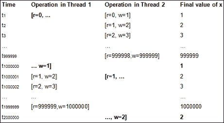

# 第十章：使用 Boost 进行并发

**线程**代表进程内的并发执行流。它们是**并发**的低级抽象，并由操作系统的系统编程库或系统调用接口公开，例如，POSIX 线程、Win32 线程。在多处理器或多核系统上，操作系统可以调度同一进程的两个线程在两个不同的核上并行运行，从而实现真正的**并行**。

线程是一种流行的机制，用于抽象可能与其他类似任务并行运行的并发任务。如果做得好，线程可以简化程序结构并提高性能。然而，并发和并行性引入了在单线程程序中看不到的复杂性和非确定性行为，做到正确通常是涉及线程时最大的挑战。不同操作系统上本地多线程库或接口的广泛差异使得使用线程编写可移植的并发软件的任务变得更加困难。Boost Thread 库通过提供一个可移植的接口来创建线程和更高级别的抽象来缓解这个问题。Boost Coroutine 库提供了一种创建协作*协程*或可以退出和恢复的函数的机制，在这些调用之间保留自动对象的状态。协程可以以更简单的方式表达事件驱动逻辑，并在某些情况下避免线程的开销。

本章是对使用 Boost Thread 库的实际介绍，还包括对 Boost Coroutine 库的简要介绍。它分为以下几个部分：

+   使用 Boost Thread 创建并发任务

+   并发、信号和同步

+   Boost 协程

即使您从未编写过多线程程序或并发软件，这也是一个很好的起点。我们还将涉及基于 Boost Thread 库的 C++11 标准库中的线程库，并引入额外的改进。

# 使用 Boost Thread 创建并发任务

考虑一个以不同语言打印问候语的程序。有一个用盎撒克逊语言，如英语、德语、荷兰语、丹麦语等的问候语列表。还有一个用罗曼语言，如意大利语、西班牙语、法语、葡萄牙语等的问候语列表。需要打印来自两种语言组的问候语，我们不希望因为其中一组的问候语而延迟打印另一组的问候语，也就是说，我们希望同时打印来自两个组的问候语。以下是同时打印两组问候语的一种方法：

**清单 10.1：交错任务**

```cpp
 1 #include <iostream>
 2 #include <string>
 3 #include <vector>
 4
 5 int main()
 6 {
 7   typedef std::vector<std::string> strvec;
 8
 9   strvec angloSaxon{"Guten Morgen!", "Godmorgen!", 
10                    "Good morning!", "goedemorgen"};
11
12   strvec romance{"Buenos dias!", "Bonjour!", 
13                  "Bom dia!", "Buongiorno!"};
14
15   size_t max1 = angloSaxon.size(), max2 = romance.size();
16   size_t i = 0, j = 0;
17
18   while (i < max1 || j < max2) {
19     if (i < max1)
20       std::cout << angloSaxon[i++] << '\n';
21
22     if (j < max2)
23       std::cout << romance[j++] << '\n';
24   }
25 }
```

在前面的示例中，我们有两个问候语的向量，并且在每个向量中打印问候语是一个独立的任务。我们通过从每个数组中打印一个问候语来交错这两个任务，因此这两个任务同时进行。从代码中，我们可以看出拉丁语和盎格鲁-撒克逊语的问候语将交替打印，顺序如下所示：

```cpp
Buenos dias!
Guten Morgen!
Bonjour!
Godmorgen!
Bom dia!
Good morning!
Buongiorno!
goedemorgen
```

虽然这两个任务是交替运行的，并且在某种意义上是同时进行的，但它们在代码中的区别完全混乱，以至于它们被编码在一个单一的函数中。通过将它们分开成单独的函数并在单独的线程中运行，这些任务可以完全解耦，但可以同时运行。此外，线程可以允许它们并行执行。

## 使用 Boost Threads

每个运行的进程至少有一个执行线程。传统的“hello world”程序具有一个`main`函数，也有一个单一线程，通常称为**主线程**。这样的程序称为**单线程**。使用 Boost Threads，我们可以创建具有多个执行线程的程序，这些线程并发运行任务。我们可以使用 Boost Threads 重写列表 10.1，以便将单个任务的代码清晰地分解出来，并且在有并行硬件可用时，任务可能并行运行。我们可以这样做：

**列表 10.2：作为线程的并发任务**

```cpp
 1 #include <boost/thread.hpp>
 2 #include <string>
 3 #include <vector>
 4 #include <iostream>
 5
 6 typedef std::vector<std::string> strvec;
 7 
 8 void printGreets(const strvec& greets)
 9 {
10   for (const auto& greet : greets) {
11     std::cout << greet << '\n';
12   }
13 }
14
15 int main()
16 {
17   strvec angloSaxon{"Guten Morgen!", "Godmorgen!", 
18                    "Good morning!", "goedemorgen"};
19
20   strvec romance{"Buenos dias!", "Bonjour!", 
21                  "Bom dia!", "Buongiorno!"};
15
16   boost::thread t1(printGreets, romance);
17   printGreets(angloSaxon);
18   t1.join();
19 }
```

我们定义了一个函数`printGreets`，它接受一个问候语的向量并打印向量中的所有问候语（第 8-13 行）。这是任务的代码，简化并分解出来。这个函数在两个问候语向量上分别被调用一次。它从`main`函数中调用一次，该函数在主线程中执行（第 17 行），并且从我们通过实例化`boost::thread`对象来生成的第二个执行线程中调用一次，传递给它要调用的函数和它的参数（第 16 行）。头文件`boost/thread.hpp`提供了使用 Boost Threads 所需的类型和函数（第 1 行）。

类型为`boost::thread`的对象`t1`包装了一个本地线程，例如`pthread_t`，Win32 线程`HANDLE`等。为了简洁起见，我们简单地指“线程`t1`”来表示底层线程以及包装它的`boost::thread`对象，除非有必要区分两者。通过传递函数对象（线 16）和传递给函数对象的所有参数来构造对象`t1`。在构造时，底层本地线程立即通过调用传递的函数和提供的参数开始运行。当此函数返回时，线程终止。这与从`main`函数调用的`printGreets`函数（第 17 行）同时发生。

这个程序的一个可能的输出是：

```cpp
Guten Morgen!
Buenos dias!
Godmorgen!
Bonjour!
Bom dia!
Good morning!
Buongiorno!
goedemorgen
```

拉丁语问候语按照它们在`romance`向量中出现的顺序打印，盎格鲁-撒克逊语问候语按照它们在`angloSaxon`向量中出现的顺序打印。但它们交错的顺序是不可预测的。这种缺乏确定性是并发编程的一个关键特征，也是一些困难的来源。可能更令人不安的是，甚至以下输出也是可能的：

```cpp
Guten Morgen!
Buenos dGodmorgeias!
n!
Bonjour!
Bom dia! Good morning!
Buongiorno!
goedemorgen
```

请注意，两个问候语`Buenos dias!`（西班牙语）和`Godmorgen!`（荷兰语）是交错的，而`Good morning!`在`Bom dia!`后的换行之前被打印出来。

我们在`t1`上调用`join`成员函数来等待底层线程终止（第 18 行）。由于主线程和线程`t1`并发运行，任何一个都可以在另一个之前终止。如果`main`函数先终止，它将终止程序，并且在线程`t1`中运行的`printGreets`函数在执行完之前将被终止。通过调用`join`，主函数确保在`t1`仍在运行时不会退出。

### 注意

链接到 Boost 线程库

Boost Thread 不是一个仅包含头文件的库，而是必须从源代码构建的。第一章，*介绍 Boost*，描述了从源代码构建 Boost 库的细节，它们的**名称布局变体**和命名约定。

要从列表 10.2 构建一个运行的程序，您需要将编译后的对象与这些库链接起来。要构建前面的示例，您必须链接 Boost 线程和 Boost 系统库。在 Linux 上，您还必须链接`libpthread`，其中包含 Pthreads 库的实现。

假设源文件是`Listing9_2.cpp`，以下是在 Linux 上编译和链接源代码以构建二进制文件的 g++命令行：

```cpp
$ g++ Listing9_2.cpp -o Listing9_2 -lboost_thread -lboost_system –lboost_chrono –pthread 
```

只有在使用 Boost Chrono 库时才需要链接到`libboost_chrono`。选项`-pthread`设置了必要的预处理器和链接器标志，以启用编译多线程应用程序并将其链接到`libpthread`。如果您没有使用本机包管理器在 Linux 上安装 Boost，或者正在尝试在其他平台上构建，比如 Windows，则请参考第一章中的详细构建说明，*介绍 Boost*。

如果您使用的是 C++11，可以使用标准库线程而不是 Boost Threads。为此，您必须包含标准库头文件`thread`，并使用`std::thread`代替`boost::thread`。Boost Thread 和`std::thread`不能直接替换彼此，因此可能需要进行一些更改。

### 移动线程和等待线程

`std::thread`对象与进程中的一个线程关联并管理。考虑以下代码片段：

```cpp
 1 void threadFunc() { ... }
 2
 3 boost::thread makeThread(void (*thrFunc)()) {
 4   assert(thrFunc);
 5   boost::thread thr(thrFunc);
 6   // do some work
 7   return thr;
 8 }
 9
10 int main() {
11   auto thr1 = makeThread(threadFunc);
12   // ...
13   thr1.join();
14 }
```

当创建`boost::thread`对象`thr`（第 4 行）时，它与一个新的本机线程（`pthread_t`，Windows 线程句柄等）相关联，该线程执行`thrFunc`指向的函数。现在`boost::thread`是可移动但不可复制的类型。当`makeThread`函数通过值返回`thr`（第 7 行）时，底层本机线程句柄的所有权从`makeThread`中的对象`thr`移动到`main`函数中的`thr1`（第 11 行）。因此，您可以在一个函数中创建一个线程，并将其返回给调用函数，在此过程中*转移所有权*。

最终，我们在`main`函数内等待线程完成执行，通过调用`join`（第 13 行）。这确保了在线程`thr1`终止之前，`main`函数不会退出。现在完全有可能，在`makeThread`返回`thr`时，底层线程已经完成了执行。在这种情况下，`thr1.join()`（第 13 行）会立即返回。另一方面，当主线程上的控制转移到`main`函数时，底层线程可能会继续执行，即使在`thr1`（第 13 行）上调用了`join`。在这种情况下，`thr1.join()`将会阻塞，等待线程退出。

有时，我们可能希望一个线程运行完毕并退出，之后就不再关心它了。此外，线程是否终止可能并不重要。想象一下，一个个人财务桌面应用程序具有一个巧妙的股票行情线程，它在窗口的一个角落不断显示一组可配置公司的股票价格。它由主应用程序启动，并继续执行其获取最新股票价格并显示的工作，直到应用程序退出。主线程在退出之前等待此线程没有多大意义。应用程序终止时，股票行情线程也会终止并在其退出时进行清理。我们可以通过在`boost::thread`对象上调用`detach`来显式请求线程的此行为，如下面的代码片段所示：

```cpp
 1 int main() {
 2   boost::thread thr(thrFunc, arg1, ...);
 3   thr.detach();
 4   // ...
 5 }
```

当我们在`boost::thread`对象上调用`detach`时，底层本机线程的所有权被传递给 C++运行时，它将继续执行线程，直到线程终止或程序终止并杀死线程。在调用`detach`之后，`boost::thread`对象不再引用有效线程，程序不再能够检查线程的状态或以任何方式与其交互。

只有在`boost::thread`对象上既没有调用`detach`也没有调用`join`时，线程才被认为是可连接的。`boost::thread`的`joinable`方法仅在线程可连接时返回`true`。如果您在不可连接的`boost::thread`对象上调用`detach`或`join`，则调用将立即返回，没有其他效果。如果我们没有在`boost::thread`对象上调用`join`，则在线程超出范围时将调用`detach`。

### 注意

`boost::thread`和`std::thread`之间的区别

必须在`std::thread`对象上调用`join`或`detach`；否则，`std::thread`的析构函数将调用`std::terminate`并中止程序。此外，在不可连接的`std::thread`上调用`join`或`detach`将导致抛出`std::system_error`异常。因此，您在`std::thread`上调用`join`和`detach`中的任何一个，并且只调用一次。这与我们刚刚描述的`boost::thread`的行为相反。

我们可以通过定义以下预处理器宏使`boost::thread`模拟`std::thread`的行为，而且在您编写的任何新代码中模拟`std::thread`的行为是一个好主意：

```cpp
BOOST_THREAD_TRHOW_IF_PRECONDITION_NOT_SATISFIED BOOST_THREAD_PROVIDES_THREAD_DESTRUCTOR_CALLS_TERMINATE_IF_JOINABLE
```

### 线程 ID

在任何时候，进程中的每个运行线程都有一个唯一的标识符。此标识符由类型`boost::thread::id`表示，并且可以通过调用`get_id`方法从`boost::thread`对象中获取。要获取当前线程的 ID，我们必须使用`boost::this_thread::get_id()`。可以使用重载的插入运算符（`operator<<`）将 ID 的字符串表示打印到`ostream`对象中。

线程 ID 可以使用`operator<`进行排序，因此它们可以轻松地存储在有序的关联容器（`std::set` / `std::map`）中。线程 ID 可以使用`operator==`进行比较，并且可以存储在无序的关联容器中（`std::unordered_set` / `std::unordered_map`）。将线程存储在由其 ID 索引的关联容器中是支持线程查找的有效手段：

**清单 10.3：使用线程 ID**

```cpp
 1 #include <boost/thread.hpp>
 2 #include <boost/chrono/duration.hpp>
 3 #include <vector>
 4 #include <map>
 5 #include <iostream>
 6 #include <sstream>
 7 #include <boost/move/move.hpp>
 8
 9 void doStuff(const std::string& name) {
10   std::stringstream sout;
11   sout << "[name=" << name << "]"
12     << "[id=" << boost::this_thread::get_id() << "]"
13     << " doing work\n";
14   std::cout << sout.str();
15   boost::this_thread::sleep_for(boost::chrono::seconds(2));
16 }
17
18 int main() {
19   typedef std::map<boost::thread::id, boost::thread> threadmap;
20   threadmap tmap;
21
22   std::vector<std::string> tnames{ "thread1", "thread2",
23                             "thread3", "thread4", "thread5" };
24   for (auto name : tnames) {
25     boost::thread thr(doStuff, name);
26     tmap[thr.get_id()] = boost::move(thr);
27   }
28
29   for (auto& thrdEntry : tmap) {
30     thrdEntry.second.join();
31     std::cout << thrdEntry.first << " returned\n";
32   }
33 }
```

在前面的例子中，我们创建了五个线程，每个线程都运行函数`doStuff`。函数`doStuff`被分配了一个线程运行的名称；我们将线程命名为`thread1`到`thread5`，并将它们放在一个由它们的 ID 索引的`std::map`中（第 26 行）。因为`boost::thread`是可移动但不可复制的，我们将线程对象移动到地图中。`doStuff`函数简单地使用`boost::this_thread::get_id`方法（第 12 行）打印当前线程的 ID 作为一些诊断消息的一部分，然后使用`boost::this_thread::sleep_for`休眠 2 秒，该方法接受`boost::chrono::duration`类型的持续时间（参见第八章，“日期和时间库”）。我们还可以使用 Boost Date Time 提供的持续时间类型，即`boost::posix_time::time_duration`及其子类型，而不是`boost::chrono`，但是为此我们需要使用`boost::this_thread::sleep`函数而不是`sleep_for`。

### 核心和线程

许多现代计算机在单个芯片上有多个 CPU 核心，并且处理器包中可能有多个芯片。要获取计算机上的物理核心数，可以使用静态函数`boost::thread::physical_concurrency`。

现代英特尔 CPU 支持英特尔的超线程技术，该技术通过使用两组寄存器最大限度地利用单个核心，允许在任何给定时间点上在核心上复用两个线程，并降低上下文切换的成本。在支持超线程的具有八个核心的英特尔系统上，可以并行调度的最大线程数为 8x2 = 16。静态函数`boost::thread::hardware_concurrency`为本地机器返回此数字。

这些数字对于决定程序中的最佳线程数是有用的。但是，如果这些数字在底层系统中不可用，这些函数可能会返回 0。您应该在计划使用它们的每个平台上彻底测试这些函数。

# 管理共享数据

进程中的所有线程都可以访问相同的全局内存，因此在一个线程中执行的计算结果相对容易与其他线程共享。对共享内存的并发只读操作不需要任何协调，但对共享内存的任何写入都需要与任何读取或写入同步。共享*可变数据*和其他资源的线程需要机制来*仲裁对共享数据的访问*并向彼此发出关于事件和状态更改的信号。在本节中，我们探讨了多个线程之间的协调机制。

## 创建和协调并发任务

考虑一个生成两个文本文件之间差异的程序，类似于 Unix 的 `diff` 实用程序。您需要读取两个文件，然后应用算法来识别相同部分和已更改部分。对于大多数文本文件，读取两个文件，然后应用适当的算法（基于最长公共子序列问题）都能很好地工作。算法本身超出了本书的范围，与当前讨论无关。

考虑我们需要执行的任务：

+   R1: 读取第一个文件的完整内容

+   R2: 读取第二个文件的完整内容

+   D: 对两个文件的内容应用差异算法

任务 R1 和 R2 可能产生包含文件内容的两个字符数组。任务 D 消耗了 R1 和 R2 产生的内容，并将差异作为另一个字符数组产生。R1 和 R2 之间不需要顺序，我们可以在单独的线程中同时读取两个文件。为简单起见，D 仅在 R1 和 R2 完成后才开始，也就是说，R1 和 R2 必须在 D 之前发生。让我们从编写读取文件的代码开始：

**清单 10.4a: 读取文件内容**

```cpp
 1 #include <vector>
 2 #include <string>
 3 #include <fstream>
 4 #include <boost/filesystem.hpp>
 5
 6 std::vector<char> readFromFile(const std::string& filepath)
 7 {
 8   std::ifstream ifs(filepath);
 9   size_t length = boost::filesystem::file_size(filepath);
10   std::vector<char> content(length);
11   ifs.read(content.data(), length);
12
13   return content;
14 }
15
16 std::vector<char> diffContent(const std::vector<char>& c1,
17                               const std::vector<char>& c2) {
18   // stub - returns an empty vector
19   return std::vector<char>();
20 }
```

给定文件名，函数 `readFromFile` 读取整个文件的内容并将其返回为 `vector<char>`。我们将文件内容读入 `vector` 的基础数组中，为了获取它，我们调用了 C++11 中引入的 `data` 成员函数（第 11 行）。我们打开文件进行读取（第 8 行），并使用 `boost::filesystem::size` 函数获取文件的大小（第 9 行）。我们还定义了一个计算两个文件内容差异的方法 `diffContent` 的存根。

我们如何使用 `readFromFile` 函数在单独的线程中读取文件并将包含文件内容的向量返回给调用线程？调用线程需要一种等待读取完成的方式，并且然后获取所读取的内容。换句话说，调用线程需要等待异步操作的未来结果。`boost::future` 模板提供了一种简单的方式来强制执行任务之间的这种顺序。

### boost::future 和 boost::promise

`boost::future<>` 模板用于表示可能在将来发生的计算结果。类型为 `boost::future<T>` 的对象代表将来可能产生的类型为 `T` 的对象的代理。粗略地说，`boost::future` 使调用代码能够等待或阻塞事件的发生——产生某种类型的值的事件。这种机制可以用于信号事件并从一个线程传递值到另一个线程。

值的生产者或事件的来源需要一种与调用线程中的 future 对象通信的方法。为此，使用与调用线程中的 future 对象关联的`boost::promise<T>`类型的对象来发出事件并发送值。因此，`boost::future`和`boost::promise`对象成对工作，以在线程之间传递事件和值。现在我们将看到如何使用 Boost futures 和 promises 来保证两个文件读取操作在两个线程中先于 diff 操作：

**列表 10.4b：使用 futures 和 promises 从线程返回值**

```cpp
 1 #define BOOST_THREAD_PROVIDES_FUTURE
 2 #include <boost/thread.hpp>
 3 #include <boost/thread/future.hpp>
 4 // other includes
 5
 6 std::vector<char> diffFiles(const std::string& file1, 
 7                             const std::string& file2) {
 8   // set up the promise-future pair
 9   boost::promise<std::vector<char>> promised_value;
10   boost::future<std::vector<char>> future_result
11                                = promised_value.get_future();
12   // spawn a reader thread for file2
13   boost::thread reader(
14                     [&promised_value, &file2]() {
15                       std::cout << "Reading " << file2 << '\n';
16                       auto content = readFromFile(file2);
17                       promised_value.set_value(content);
18                       std::cout << "Read of " << file2
19                                 << " completed.\n";
20                     });
21
22   std::cout << "Reading " << file1 << '\n';
23   auto content1 = readFromFile(file1);
24   std::cout << "Read of " << file1 << " completed.\n";
25
26   auto content2 = future_result.get(); // this blocks
27   auto diff = diffContent(content1, content2);
28   reader.join();
29   return diff; 
30 }
```

为了能够使用`boost::future`和`boost::promise`，我们需要包括`boost/thread/future.hpp`（第 3 行）。如果我们没有定义预处理符号`BOOST_THREAD_PROVIDES_FUTURE`（第 1 行），那么我们需要使用`boost::unique_future`而不是`boost::future`。如果我们用`boost::unique_future`替换`boost::future`，这个例子将不变，但一般来说，这两种设施的能力有所不同，我们在本书中坚持使用`boost::future`。

`diffFiles`函数（第 6 和 7 行）接受两个文件名并返回它们的差异。它同步读取第一个文件（第 23 行），使用列表 10.4a 中的`readFromFile`函数，并创建一个名为`reader`的线程并发读取第二个文件（第 13 行）。为了在`reader`线程完成读取并获取读取的内容时得到通知，我们需要设置一个 future-promise 对。由于我们想要从`reader`线程返回`std::vector<char>`类型的值，我们定义了一个名为`promised_value`的`boost::promise<std::vector<char>>`类型的 promise（第 9 行）。promise 对象的`get_future`成员返回关联的 future 对象，并用于移动构造`future_result`（第 10-11 行）。这将`promised_value`和`future_result`设置为我们要处理的 promise-future 对。

为了读取`file2`的内容，我们创建了`reader`线程，传递了一个 lambda（第 14-20 行）。lambda 捕获了`promised_value`和要读取的文件的名称（第 14 行）。它读取文件的内容并在 promise 对象上调用`set_value`，传递读取的内容（第 17 行）。然后打印诊断消息并返回。与此同时，调用线程也将另一个文件`file1`读入缓冲区`content1`，然后在`future_result`上调用`get`（第 26 行）。此调用会阻塞，直到通过调用`set_value`（第 17 行）设置了关联的 promise。它返回在 promise 中设置的`vector<char>`，并用于移动构造`content2`。如果在调用`get`时 promise 已经设置，它会返回值而不会阻塞调用线程。

现在我们有了计算差异所需的数据，并且通过将缓冲区`content1`和`content2`传递给`diffContent`函数（第 27 行）来进行计算。请注意，在返回`diff`之前，我们在`reader`线程上调用`join`（第 28 行）。只有在我们希望确保`reader`线程在函数返回之前退出时才需要这样做。我们也可以调用`detach`而不是`join`来不等待读取线程退出。

### 等待 future

`boost::future<>`的`get`成员函数会阻塞调用线程，直到关联的 promise 被设置。它返回 promise 中设置的值。有时，您可能希望阻塞一小段时间，如果 promise 没有设置，则继续进行。为此，您必须使用`wait_for`成员函数，并使用`boost::chrono::duration`指定等待的持续时间（参见第八章，“日期和时间库”）。

**列表 10.5：等待和超时 future**

```cpp
 1 #define BOOST_THREAD_PROVIDES_FUTURE
 2 #include <boost/thread.hpp>
 3 #include <boost/thread/future.hpp>
 4 #include <boost/chrono.hpp>
 5 #include <ctime>
 6 #include <cassert>
 7 #include <cstdlib>
 8 #include <iostream>
 9 
10 int main() {
11   boost::promise<void> promise;
12   boost::future<void> future = promise.get_future();
13
14   std::cout << "Main thread id=" 
15                       << boost::this_thread::get_id() << '\n';
16   boost::thread thr([&promise]() {
17          srand(time(0));
18          int secs = 10 + rand() % 10;
19          std::cout << "Thread " << boost::this_thread::get_id()
20                   << " sleeping for "
21                   << secs << " seconds\n";
22          boost::this_thread::sleep_for(
23               boost::chrono::seconds(secs));
24          promise.set_value();
25        });
26
27   size_t timeout_count = 0;
28   size_t secs = 2;
29
30   while (future.wait_for(boost::chrono::seconds(secs)) 
31           == boost::future_status::timeout) {
32     std::cout << "Main thread timed out\n";
33     ++timeout_count;
34   }
35   assert(future.is_ready());
36   assert(future.get_state() == boost::future_state::ready);
37
38   std::cout << "Timed out for " << timeout_count * secs 
39             << " seconds \n";
40   thr.join();
41 }
```

这个例子演示了我们如何在 future 对象上等待固定的持续时间。我们创建了一个 promise-future 对（第 11-12 行），但是`boost::future<>`和`boost::promise<>`的模板参数是 void。这意味着我们可以纯粹用于信号/等待，但不能在线程之间传输任何数据。

我们创建了一个线程`thr`（第 16 行），传递一个 lambda，它捕获了 promise 对象。这个线程简单地睡眠在 10 到 19 秒之间的随机持续时间，通过将随机持续时间传递给`boost::this_thread::sleep_for`（第 22 行），然后退出。持续时间是使用`boost::chrono::seconds`函数构造的（第 23 行），并传递了使用`rand`函数计算的随机间隔`secs`（第 18 行）。我们使用`rand`是为了简洁起见，尽管 Boost 和 C++11 中提供了更可靠和健壮的设施。要使用`rand`，我们需要调用`srand`来种子随机数生成器。在 Windows 上，我们必须在每个调用`rand`的线程中调用`srand`，就像我们在这里展示的（第 17 行），而在 POSIX 上，我们应该在每个进程中调用`srand`，这可以在`main`的开始处。

在特定持续时间后，线程`thr`调用 promise 的`set_value`并返回（第 24 行）。由于 promise 的类型是`boost::promise<void>`，`set_value`不带任何参数。

在主线程中，我们运行一个循环，每次调用与`promise`相关联的 future 的`wait_for`，传递 2 秒的持续时间（第 30 行）。`wait_for`函数返回枚举类型`boost::future_state`的值。每次`wait_for`超时，它返回`boost::future_state::timeout`。一旦 promise 被设置（第 24 行），`wait_for`调用返回`boost::future_state::ready`并且循环中断。`boost::future`的`is_ready`成员函数返回`true`（第 35 行），并且`get_state`成员函数返回的 future 状态是`boost::future_state::ready`（第 36 行）。

### 在线程之间抛出异常

如果传递给`boost::thread`构造函数的初始函数允许任何异常传播，那么程序将立即通过调用`std::terminate`中止。如果我们需要从一个线程向另一个线程抛出异常来指示问题，或者传播我们在一个线程中捕获的异常到另一个线程，那么 promise/future 机制也很方便。考虑一下，在清单 10.4a 和 10.4b 中，当文件不存在或不可读时，你将如何处理：

**清单 10.6：在线程之间传递异常**

```cpp
 1 #define BOOST_THREAD_PROVIDES_FUTURE
 2 #include <boost/thread.hpp>
 3 #include <boost/thread/future.hpp>
 4 // other includes
 5
 6 std::vector<char> readFromFile(const std::string& filepath)
 7 {
 8   std::ifstream ifs(filepath, std::ios::ate);
 9   if (!ifs) {
10     throw std::runtime_error(filepath + " unreadable");
11   }
12   ... // rest of the code – check Listing 10.4a
13 }
14
15 std::vector<char> diffFiles(const std::string& file1,
16                             const std::string& file2) {
17   // set up the promise-future pair
18   boost::promise<std::vector<char> > promised_value;
19   boost::future<std::vector<char> > future_result
20                                = promised_value.get_future();
21   // spawn a reader thread for file2
22   boost::thread reader(
23                        [&promised_value, &file2]() {
24                          try {
25                            auto content = readFromFile(file2);
26                            promised_value.set_value(content);
27                          } catch (std::exception& e) {
28                            promised_value.set_exception(
29                               boost::copy_exception(e));
30                          }
31                        });
32   ...
33   std::vector<char> diff;
34   try {
35     auto content2 = future_result.get(); // this blocks
36     diff = diffContent(content1, content2);
37   } catch (std::exception& e) {
38     std::cerr << "Exception caught: " << e.what() << '\n';
39   }
40   reader.join();
41   return diff; 
42 }
```

如果`file2`是一个不存在或不可读的文件的名称（第 25 行），那么`readFromFile`函数会抛出一个异常（第 10 行），被`reader`线程捕获（第 27 行）。`reader`线程使用`set_exception`成员函数在 promise 对象中设置异常（第 28-29 行）。请注意，我们使用`boost::copy_exception`创建异常对象的副本并将其设置在 promise 对象中（第 29 行）。一旦 promise 中设置了异常，对 future 对象的`get`调用（第 35 行）会抛出该异常，需要捕获和处理（第 38 行）。

### shared_future

`boost::future`对象只能由一个线程等待。它不可复制，但可移动；因此，它的所有权可以从一个线程转移到另一个线程，从一个函数转移到另一个函数，但不能共享。如果我们希望多个线程使用 future 机制等待相同的条件，我们需要使用`boost::shared_future`。在下面的示例中，我们创建一个发布者线程，在设置带有其线程 ID 的 promise 之前等待固定的持续时间。我们还创建了三个订阅者线程，它们以不同的周期性轮询与 promise 对象关联的`boost::shared_future`对象，直到它准备就绪，然后从`shared_future`中检索发布者对象的线程 ID：

**清单 10.7：使用 shared_future**

```cpp
 1 #include <string>
 2 #include <vector>
 3 #include <iostream>
 4 #define BOOST_THREAD_PROVIDES_FUTURE
 5 #include <boost/lexical_cast.hpp>
 6 #include <boost/thread.hpp>
 7 #include <boost/thread/future.hpp>
 8 #include <boost/chrono.hpp>
 9
10 int main() {
11   boost::promise<std::string> prom;
12   boost::future<std::string> fut(prom.get_future());
13   boost::shared_future<std::string> shfut(std::move(fut));
14   boost::thread publisher([&prom]() {
15               std::string id =
16                 boost::lexical_cast<std::string>(
17                                boost::this_thread::get_id());
18               std::cout << "Publisher thread " << id 
19                         << " starting.\n";
20               boost::this_thread::sleep_for(
21                                   boost::chrono::seconds(15));
22               prom.set_value(id);
23            });
24   auto thrFunc = [](boost::shared_future<std::string> sf, 
25                     int waitFor) {
26     while (sf.wait_for(boost::chrono::seconds(waitFor))
27         == boost::future_status::timeout) {
28       std::cout << "Subscriber thread " 
29                 << boost::this_thread::get_id()
30                 << " waiting ...\n";
31     }
32
33     std::cout << "\nSubscriber thread " 
34               << boost::this_thread::get_id()
35               << " got " << sf.get() << ".\n";
36   };
37
38   boost::thread subscriber1(thrFunc, shfut, 2);
39   boost::thread subscriber2(thrFunc, shfut, 4);
40   boost::thread subscriber3(thrFunc, shfut, 6);
41
42   publisher.join();
43   subscriber1.join();
44   subscriber2.join();
45   subscriber3.join();
46 }
```

按照熟悉的模式，我们创建一个 promise（第 11 行）和一个`boost::future`（第 12 行）。使用 future 对象，我们 move-initialize 一个`shared_future`对象`shfut`（第 13 行）。`publisher`线程捕获 promise（第 14 行），并在设置其 ID 字符串到 promise 之前睡眠 15 秒（第 21 行）。

对于订阅者线程，我们将 lambda 表达式生成的函数对象存储在名为`thrFunc`的变量中（第 24 行），以便可以多次重用。订阅者线程的初始函数通过值传递一个`shared_future`参数，并且还有一个`waitFor`参数，该参数指定以秒为单位轮询`shared_future`的频率。订阅者在一个循环中调用`shared_future`上的`wait_for`，在`waitFor`秒后超时。一旦 promise 被设置（第 22 行），它就会退出循环，并通过在`shared_future`上调用`get`（第 35 行）来检索 promise 中设置的值（发布者线程的 ID）。

三个订阅者线程被创建（第 38-40 行）。请注意，它们初始函数的参数，`shared_future`对象和以秒为单位的等待时间作为额外参数传递给`boost::thread`对象的可变构造函数模板。请注意，`shared_future`是可复制的，同一个`shared_future`对象`shfut`被复制到三个订阅者线程中。

### std::future 和 std::promise

C++11 标准库提供了`std::future<>`、`std::shared_future<>`和`std::promise<>`模板，它们的行为几乎与它们的 Boost 库对应物相同。Boost 版本的额外成员函数是实验性的，但是除此之外，它们与标准库对应物相同。例如，我们可以通过在程序文本中替换以下符号来重写 10.5 和 10.7 清单：

+   将`boost::thread`替换为`std::thread`

+   将`boost::future`替换为`std::future`

+   将`boost::promise`替换为`std::promise`

+   将`boost::shared_promise`替换为`std::shared_promise`

+   将`boost::chrono`替换为`std::chrono`

此外，我们需要用标准库头文件`thread`、`future`和`chrono`分别替换包含的头文件`boost/thread.hpp`、`boost/thread/future.hpp`和`boost/chrono.hpp`。

在 10.6 清单中，我们使用`boost::promise`的`set_exception`成员函数来实现在线程边界传递异常。这需要一些更改才能与`std::promise`一起工作。C++11 引入了`std::exception_ptr`，这是一种具有共享所有权语义的特殊智能指针类型，必须包装异常对象，以便它们可以在函数和线程之间传递（见附录，*C++11 语言特性模拟*）。`std::promise`的`set_exception`成员函数接受一个`std::exception_ptr`类型的参数，而不是`std::exception`。以下代码片段显示了如何更改 10.6 清单以使用标准库：

```cpp
 1 // include other headers
 2 #include <exception>
... // other code
22   boost::thread reader(
23                        [&promised_value, &file2]() {
24                          try {
25                            auto content = readFromFile(file2);
26                            promised_value.set_value(content);
27                          } catch (std::exception& e) {
28                            promised_value.set_exception(
29                                     std::current_exception());
30                          }
31                        });
```

在这里，我们调用`std::current_exception`（第 29 行），它返回一个包装在 catch 块中当前活动异常的`std::exception_ptr`对象。这个`exception_ptr`被传递给`std::promise`的`set_exception`成员函数（第 28 行）。这些类型和函数声明可以从标准库头文件`exception`（第 2 行）中获得。

我们还可以使用`std::make_exception_ptr`从异常对象创建一个`std::exception_ptr`对象，如下面的代码片段所示（第 29 行）：

```cpp
22   boost::thread reader(
23                        [&promised_value, &file2]() {
24                          try {
25                            auto content = readFromFile(file2);
26                            promised_value.set_value(content);
27                          } catch (std::exception& e) {
28                            promised_value.set_exception(
29                                  std::make_exception_ptr(e));
30                          }
31                        });
The exception stored in a std::exception_ptr can be thrown using std::rethrow_exception, as shown here:
01 void throwAgain(std::exception_ptr eptr) {
02   // do stuff
03   std::rethrow_exception(eptr);
04 }
```

### std::packaged_task 和 std::async

虽然线程是强大的构造，但它们提供的完整的通用性和控制是以简单性为代价的。在许多情况下，最好以比创建显式线程运行任务更高的抽象级别进行操作。标准库提供了`std::async`函数模板和`std::packaged_task`类模板，为创建并发任务提供了不同的抽象级别，从而使程序员免于在此过程中编写大量样板代码。它们在 Boost 库中有对应物（`boost::async`和`boost::packaged_task`），但在撰写本文时（Boost 版本 1.57），它们的实现不完整，且在早期 C++11 环境中使用起来不太方便。

#### std::packaged_task

`std::packaged_task<>`类模板用于创建异步任务。您需要显式创建一个运行任务的线程，或者使用`packaged_task`中重载的`operator()`手动调用任务。但您不需要手动设置 promise-future 对，也不需要以任何方式处理 promise。这里是使用`std::packaged_task`重写的列表 10.6：

**列表 10.8：使用 std::packaged_task**

```cpp
 1 #include <future>
 2 #include <thread>
 3 #include <vector>
 4 // other includes
 5
 6 std::vector<char> readFromFile(const std::string& filepath)
 7 {
 8   std::ifstream ifs(filepath, std::ios::ate);
 9   if (!ifs) {
10     throw std::runtime_error(filepath + " unreadable");
11   }
12   ... // rest of the code – check Listing 10.4a
13 }
14
15 std::vector<char> diffFiles(const std::string& file1,
16                             const std::string file2)
17 {
18   typedef std::vector<char> buffer_t;
19   std::packaged_task<buffer_t(const std::string&)>
20             readerTask(readFromFile);
21   auto future = readerTask.get_future();
22
23   try {
24     std::thread thread2(std::move(readerTask), file2);
25     auto content1 = readFromFile(file1);
26     std::cout << "Read from file " << file1 << " completed.\n";
27
28     auto content2 = future.get();
29     thread2.detach();
30     return diffContent(content1, content2);
31   } catch (std::exception& e) {
32     std::cout << "Exception caught: " << e.what() << '\n';
33   }
34
35   return std::vector<char>(); 
36 }
```

在这个例子中，我们读取两个文件并计算它们的差异。为了读取文件，我们使用`readFromFile`函数，它返回一个`vector<char>`中的文件内容，或者如果文件不可读则抛出异常。我们通过阻塞调用`readFromFile`（第 25 行）读取其中一个文件，并在单独的线程中读取另一个文件。

为了与第一个文件同时读取第二个文件，我们将`readFromFile`函数包装在名为`readerTask`的`std::packaged_task`中（第 19-20 行），并在单独的线程中运行它。`readerTask`的具体类型是`std::packaged_task<buffer_t(const std::string&)>`。`packaged_task`的模板参数是包装的函数类型。在将此任务在单独的线程上启动之前，我们必须首先获取与之关联的 future 对象的引用。我们通过调用`packaged_task`的`get_future`成员函数（第 21 行）来获取与 future 对象的引用。接下来，我们创建一个线程并将打包的任务移动到这个线程（第 24 行）。这是必要的，因为`packaged_task`是可移动的但不可复制的，这就是为什么必须在将`packaged_task`对象移动之前调用`get_future`方法的原因。

线程`thread2`通过调用传递给它的`readFromFile`函数来读取`file2`。通过调用与`readerTask`关联的 future 对象的`get`成员函数（第 28 行），可以获取`readFromFile`返回的`vector<char>`。`get`调用将抛出`readFromFile`最初抛出的任何异常，比如当命名文件不存在时。

#### std::async

`std::async`函数模板从一个函数对象创建一个任务，这个任务可以在一个单独的线程中并发运行。它返回一个`std::future`对象，可以用来阻塞任务或等待它。它通过标准库头文件`future`提供。使用`std::async`，我们不再需要显式创建线程。相反，我们将要执行的函数、要传递的参数以及可选的启动策略传递给`std::async`。`std::async`根据指定的启动策略，要么在不同的线程中异步运行函数，要么在调用线程中同步运行函数。这里是使用`std::async`简单重写列表 10.5 的示例：

**列表 10.9：使用 std::async 创建并发任务**

```cpp
 1 #include <iostream>
 2 #include <thread>
 3 #include <future>
 4 #include <chrono>
 5 #include <ctime>
 6 #include <cstdlib>
 7
 8 int main()
 9 {
10   int duration = 10 + rand() % 10;
11   srand(time(0));
12   std::cout << "Main thread id="
13             << std::this_thread::get_id() << '\n';
14 
15   std::future<int> future =
16     std::async(std::launch::async,
17        [](int secs) -> int {               
18            std::cout << "Thread " << std::this_thread::get_id()
19                     << " sleeping for "
20                     << secs << " seconds\n";
21            std::this_thread::sleep_for(
22                     std::chrono::seconds(secs));
23            return secs;
24        }, duration);
25   
26   size_t timeout_count = 0, secs = 2;
27 
28   while (future.wait_for(std::chrono::seconds(secs))
29           == std::future_status::timeout) {
30     std::cout << "Main thread timed out\n";
31     ++timeout_count;
32   }
33   std::cout << "Launched task slept for " 
34             << future.get() << '\n';
35   std::cout << "Timed out for " << timeout_count * secs 
36             << " seconds \n";
37 }
```

虽然`packaged_task`抽象了 promise，`std::async`抽象了线程本身，我们不再处理`std::thread`的对象。相反，我们调用`std::async`，传递一个启动策略`std::launch::async`（第 16 行），一个函数对象（第 17 行），以及函数对象所需的任意数量的参数。它返回一个 future 对象，并异步运行传递给它的函数。

与`thread`的构造函数一样，`std::async`是一个可变参数函数，并传递需要转发给函数对象的所有参数。函数对象使用 lambda 表达式创建，并且除了按参数传递的持续时间休眠外，几乎不做任何事情。`duration`是 10 到 19 秒之间的随机值，并作为函数对象的唯一参数传递给`async`调用（第 24 行）。函数对象返回休眠的持续时间（第 23 行）。我们调用 future 对象的`wait_for`成员函数，以等待短时间直到 future 设置（第 28 行）。我们通过调用其`get`成员函数从 future 对象中检索任务的返回值（第 34 行）。

##### 启动策略

我们使用启动策略`std::launch::async`来指示我们希望任务在单独的线程上运行。这将立即在单独的线程中启动任务。使用另一个标准启动策略`std::launch::deferred`，我们可以在首次调用与关联 future 对象的`get`或`wait`（非定时等待函数）时懒惰地启动任务。任务将在调用`get`或`wait`的线程中同步运行。这也意味着，如果使用`deferred`策略并且没有调用`get`或`wait`，任务将永远不会启动。

我们无法在列表 10.10 中使用`std::launch::deferred`。这是因为我们在同一线程中等待 future 准备好（第 28 行）之前调用`get`（第 34 行）。任务在我们调用`get`之前永远不会启动，但是除非任务启动并返回一个值，future 永远不会准备好；所以我们会在`while`循环中永远旋转。

在使用`std::async`创建任务时，我们也可以省略启动策略：

```cpp
auto future = std::async([]() {...}, arg1, arg2);
```

在这种情况下，行为等同于以下调用：

```cpp
auto future = std::async(std::launch::async|std::launch::deferred,
                          []() {...}, arg1, arg2);
```

实现可以选择符合`std::launch::async`或`std::launch::deferred`的行为。此外，只有在运行时库需要支持多线程的情况下，实现才会创建一个新线程并链接到程序。使用默认策略时，当启用多线程时，`std::async`要么在新线程中启动新任务，要么将它们发布到内部线程池。如果线程池中没有空闲线程或空闲核心，任务将被同步启动。

## 基于锁的线程同步方法

到目前为止，我们已经看到了如何使用`boost::thread`和`std::thread`委托函数在单独的线程上运行。我们看到了使用`boost::future`和`boost::promise`在线程之间通信结果和异常，并通过阻塞调用在任务之间施加顺序。有时，您可以将程序分解为可以并发运行的独立任务，产生一个值、一个副作用或两者，然后由程序的另一部分消耗。启动这样的任务并使用 futures 等待它们是一种有效的策略。一旦任务返回，您可以开始下一个消耗第一阶段结果的计算阶段。

然而，通常需要多个线程同时访问和修改相同的数据结构。这些访问需要可靠地排序并且相互隔离，以防止由于不协调的并发访问导致底层数据结构中出现不一致。在本节中，我们将看一下帮助我们解决这些问题的 Boost 库。

### 数据竞争和原子操作

考虑以下代码片段。我们创建两个线程，每个线程在循环中递增一个共享的整数变量固定次数：

```cpp
int main() {
  int x = 0;
  const int max = 1000000;

  auto thrFunc = [&x]() {
                          for (int i = 0; i < max; ++i) {
                            ++x;
                          }
                        };

  boost::thread t1(thrFunc);
  boost::thread t2(thrFunc);
  t1.join();
  t2.join();

  std::cout << "Value of x: " << x << '\n';
}
```

程序结束时`x`的值是多少？由于每个线程对`x`递增了一百万次，而且有两个线程，人们可能期望它是`2000000`。你可以自行验证，递增运算符在`x`上被调用的次数不少于`N*max`次，其中`N=2`是线程数，`max`是一百万。然而，我看到`2000000`被打印出来不止一次；每次都是一个较小的数字。这种行为可能会因操作系统和硬件而有所不同，但它是相当常见的。显然，一些递增操作没有生效。

当你意识到操作`++x`涉及读取`x`的值，将一个添加到该值，然后将结果写回`x`时，原因就变得清楚了。假设`x`的值是`V`，两个线程对`V`执行操作`++x`。两个线程中的每一个都可以将 V 读取为`x`的值，执行递增操作，然后将 V+1 写回。因此，两个线程分别对`x`进行一次递增操作后，`x`的值仍然可能是如果只递增了一次。根据机器架构的不同，对于某些“原始”数据类型，更新变量的值可能需要两个 CPU 指令。并发执行两个这样的操作可能会由于*部分写入*而将值设置为两者都不想要的值。

像这样交错的操作代表了**数据竞争**—执行它们的线程被认为在执行操作步骤及其确切顺序上相互竞争，因此结果是不可预测的。

让我们使用符号[r=v1，w=v2]来表示一个线程从变量`x`中*读取*值 v1 并*写回*值 v2。请注意，在线程读取变量`x`的值和写回值之间可能有任意长的持续时间。因此，符号[r=v1，…用于表示已经读取了值 v1，但尚未进行写回，符号…w=v2]表示待定的写回已经发生。现在考虑两个线程分别对`x`进行一百万次递增操作，如下所示：



为简单起见，假设部分写入是不可能发生的。在时间**t1**，线程 1 和线程 2 都将变量`x`的值读取为 0。线程 2 递增这个值，并将值写回为 1。线程 2 继续读取和递增`x`的值 999998 次，直到在时间**t999999**写回值 999999。之后，线程 1 递增了它在**t1**读取的值 0，并将值写回为 1。接下来，线程 1 和线程 2 都读取了值 1，线程 1 写回 2，但线程 2 挂起。线程 1 继续进行 999998 次迭代，读取和递增`x`的值。它在时间**t1999999**将值 1000000 写入`x`并退出。线程 2 现在递增了它在**t1000001**读取的值 1 并写回。对于两百万次递增，`x`的最终值可能是 2。你可以将迭代次数更改为大于或等于 2 的任意数字，将线程数更改为大于或等于 2 的任意数字，这个结果仍然成立——这是并发的不确定性和非直观方面的一种度量。当我们看到操作`++x`时，我们直观地认为它是一个不可分割的或*原子操作*，但实际上并非如此。

原子操作在没有任何可观察的中间状态的情况下运行。这些操作不能交错。原子操作创建的中间状态对其他线程不可见。机器架构提供了执行原子读取-修改-写入操作的特殊指令，操作系统通常提供了使用这些原语的原子类型和操作的库接口。

增量操作`++x`显然是不可重入的。变量`x`是一个共享资源，在一个线程的读取、增量和随后的写入`x`之间，其他线程可以进行任意数量的读取-修改-写入操作——这些操作可以交错进行。对于这样的不可重入操作，我们必须找到使它们**线程安全**的方法，即通过防止多个线程之间的操作交错，比如`++x`。

### 互斥排斥和临界区

使`++x`操作线程安全的一种方法是在**临界区**中执行它。临界区是一段代码，不能同时被两个不同的线程执行。因此，来自不同线程的两次对`x`的增量可以交错进行。线程必须遵守这个协议，并且可以使用**互斥对象**来实现。互斥对象是用于同步并发访问共享资源的原语，比如变量`x`。我们在这个示例中使用`boost::mutex`类来实现这一目的，如下例所示：

**清单 10.10：使用互斥对象**

```cpp
 1 #include <boost/thread/thread.hpp>
 2 #include <boost/thread/mutex.hpp>
 3 #include <iostream>
 4
 5 int main()
 6 {
 7   int x = 0;
 8   static const int max = 1000000;
 9   boost::mutex mtx;
10
11   auto thrFunc = [&x, &mtx]() {
12     for (int i = 0; i < max; ++i) {
13       mtx.lock();
14       ++x;
15       mtx.unlock();
16     }
17   };
18
19   boost::thread t1(thrFunc);
20   boost::thread t2(thrFunc);
21
22   t1.join();
23   t2.join();
24
25   std::cout << "Value of x: " << x << '\n';
26 }
```

我们声明了一个`boost::mutex`类型的互斥对象（第 9 行），在生成线程的初始函数的 lambda 中捕获它（第 11 行），然后在执行增量操作之前通过锁定互斥对象来保护变量`x`（第 13 行），并在之后解锁它（第 15 行）。对`x`的增量操作（第 14 行）是临界区。这段代码每次都会打印以下内容：

```cpp
2000000
```

这是如何工作的？互斥对象有两种状态：**锁定**和**未锁定**。第一个调用未锁定互斥对象的`lock`成员函数的线程会锁定它，并且`lock`的调用会返回。其他调用已锁定互斥对象的`lock`的线程会**阻塞**，这意味着操作系统调度程序不会安排这些线程运行，除非发生某些事件（比如所讨论的互斥对象解锁）。然后持有锁的线程增加`x`并调用互斥对象的`unlock`成员函数来释放它持有的锁。此时，阻塞在`lock`调用中的一个线程会被唤醒，该线程的`lock`调用返回，并且该线程被安排运行。等待唤醒的线程取决于底层的本地实现。这一过程会一直持续，直到所有线程（在我们的示例中，只有两个）都运行完成。锁确保在任何时刻，只有一个线程独占持有锁，并且可以自由地增加`x`。

我们选择用互斥对象保护的部分是关键的。我们也可以选择保护整个 for 循环，就像下面的代码片段所示：

```cpp
12     mtx.lock();
13     for (int i = 0; i < max; ++i) {
14       ++x;
15     }
16     mtx.unlock();
```

`x`的最终值仍然与 10.10 清单中一样（`2000000`），但临界区会更大（第 13-15 行）。一个线程会在另一个线程甚至只能增加`x`一次之前运行完整个循环。通过限制临界区的范围和线程持有锁的时间，多个线程可以取得更加公平的进展。

一个线程也可以选择探测并查看是否可以获取互斥对象的锁，但如果不能则不阻塞。为此，线程必须调用`try_lock`成员函数而不是`lock`成员函数。调用`try_lock`会在互斥对象被锁定时返回`true`，否则返回`false`，并且如果互斥对象未被锁定则不会阻塞：

```cpp
boost::mutex mtx;
if (mtx.try_lock()) {
  std::cout << "Acquired lock\n";
} else {
  std::cout << "Failed to acquire lock\n";
}
```

一个线程也可以选择在等待获取锁时阻塞指定的持续时间，使用`try_lock_for`成员函数。如果成功获取锁并且一旦获取锁，`try_lock_for`的调用会返回`true`。否则，它会在指定持续时间内阻塞，并且一旦超时而未获取锁则返回 false：

```cpp
boost::mutex mtx;
if (mtx.try_lock_for(boost::chrono::seconds(5))) { 
  std::cout << "Acquired lock\n";
} else {
  std::cout << "Failed to acquire lock\n";
}
```

### 注意

互斥对象应该在尽可能短的时间内持有，覆盖尽可能小的代码段。由于互斥对象串行化了临界区的执行，持有互斥对象的时间越长，等待锁定互斥对象的其他线程的进展就会延迟。

#### boost::lock_guard

在互斥锁上获取锁并未能释放它是灾难性的，因为任何其他等待互斥锁的线程都将无法取得任何进展。在互斥锁上的裸`lock` / `try_lock`和`unlock`调用并不是一个好主意，我们需要一些在异常安全方式下锁定和解锁互斥锁的方法。`boost::lock_guard<>`模板使用**资源获取即初始化**（**RAII**）范式在其构造函数和析构函数中锁定和解锁互斥锁：

**列表 10.11：使用 boost::lock_guard**

```cpp
 1 #include <boost/thread/thread.hpp>
 2 #include <boost/thread/mutex.hpp>
 3 #include <iostream>
 4
 5 int main()
 6 {
 7   int x = 0;
 8   static const int max = 1000000;
 9   boost::mutex mtx;
10
11   auto thrFunc = [&x, &mtx]() {
12     for (int i = 0; i < max; ++i) {
13       boost::lock_guard<boost::mutex> lg(mtx);
14       ++x;
16     }
17   };
18
19   boost::thread t1(thrFunc);
20   boost::thread t2(thrFunc);
21
22   t1.join();
23   t2.join();
24
25   std::cout << "Value of x: " << x << '\n';
26 }
```

使用`boost::lock_guard`对象（第 13 行），我们锁定在锁保护实例化后的代码部分，直到作用域结束。`lock_guard`在构造函数中获取锁，并在析构函数中释放锁。这确保即使在关键部分出现异常，一旦作用域退出，互斥锁总是被解锁。您将锁的类型作为模板参数传递给`lock_guard`。`boost::lock_guard`不仅可以与`boost::mutex`一起使用，还可以与符合**BasicLockable**概念的任何类型一起使用，即具有可访问的`lock`和`unlock`成员函数。

我们还可以使用`boost::lock_guard`来封装已经锁定的互斥锁。为此，我们需要向`lock_guard`构造函数传递第二个参数，指示它应该假定拥有互斥锁而不尝试锁定它：

```cpp
 1 boost::mutex mtx;
 2 ...
 3 mtx.lock();  // mutex locked
 4 ...
 5 {
 6   boost::lock_guard<boost::mutex> lk(mtx, boost::adopt_lock);
 7   ...
 8 } // end of scope
```

`boost::lock_guard`在其构造函数中锁定底层互斥锁，或者采用已经锁定的互斥锁。释放互斥锁的唯一方法是让`lock_guard`超出作用域。`lock_guard`既不可复制也不可移动，因此您不能将它们从一个函数传递到另一个函数，也不能将它们存储在容器中。您不能使用`lock_guard`等待特定持续时间的互斥锁。

#### boost::unique_lock

`boost::unique_lock<>`模板是一种更灵活的替代方案，它仍然使用 RAII 来管理类似互斥锁，但提供了手动锁定和解锁的接口。为了获得这种额外的灵活性，`unique_lock`必须维护一个额外的数据成员，以跟踪互斥锁是否被线程拥有。我们可以使用`unique_lock`来管理符合**Lockable**概念的任何类。如果一个类符合 Lockable 概念，那么它符合 BasicLockable，并且另外定义了一个可访问的`try_lock`成员函数，就像`boost::mutex`一样。

我们可以将`boost::unique_lock`用作`boost::lock_guard`的替代品，但是如果`lock_guard`足够用于某个目的，则不应使用`unique_lock`。当我们想要将手动锁定与异常安全的锁管理混合使用时，`unique_lock`通常很有用。例如，我们可以重写列表 10.11 以使用`unique_lock`，如下面的代码片段所示：

```cpp
 7   int x = 0;
 8   static const int max = 1000000;
 9   boost::mutex mtx;
10
11   auto thrFunc = [&x, &mtx]() {
12     boost::unique_lock<boost::mutex> ul(mtx, boost::defer_lock);
13     assert(!ul.owns_lock());
14
15     for (int i = 0; i < max; ++i) {
16       ul.lock();
17       ++x;
18       assert(ul.owns_lock());
19       assert(ul.mutex() == &mtx);
20
21       ul.unlock();
22     }
23   };
```

与列表 10.11 不同，我们不会在每次循环迭代中创建一个新的`lock_guard`对象。相反，我们在循环开始之前创建一个封装互斥锁的单个`unique_lock`对象（第 12 行）。传递给`unique_lock`构造函数的`boost::defer_lock`参数告诉构造函数不要立即锁定互斥锁。在调用`unique_lock`的`lock`成员函数（第 16 行）增加共享变量之前，互斥锁被锁定，并且在操作之后通过调用`unique_lock`的`unlock`成员函数（第 21 行）解锁。在发生异常时，如果互斥锁被锁定，`unique_lock`析构函数将解锁互斥锁。

`unique_lock`的`owns_lock`成员函数在`unique_lock`拥有互斥锁时返回`true`，否则返回`false`（第 13 行和第 18 行）。`unique_lock`的`mutex`成员函数返回存储的互斥锁的指针（第 19 行），如果`unique_lock`没有包装有效的互斥锁，则返回`nullptr`。

#### 死锁

互斥锁提供了对共享资源的独占所有权，而许多现实世界的问题涉及多个共享资源。以多人第一人称射击游戏为例。它实时维护和更新两个列表。一个是 A 组射手，他们是带有某种弹药的玩家，另一个是 U 组玩家，他们是手无寸铁的。当玩家用尽弹药时，她会从 A 组移动到 U 组。当她的弹药补充时，她会从 U 组移回 A 组。线程 1 负责将元素从 A 组移动到 U 组，线程 2 负责将元素从 U 组移动到 A 组。

当一个新玩家加入游戏时，她会被添加到 U 组或 A 组，具体取决于她是否有弹药。当玩家在游戏中被杀死时，她会从 U 组或 A 组中被移除。但当弹药用尽或补充时，玩家会在 U 组和 A 组之间移动；因此 U 组和 A 组都需要被编辑。考虑以下代码，其中一个线程负责在弹药用尽时将玩家从 A 组移动到 U 组，另一个线程负责在弹药补充时将玩家从 U 组移回 A 组：

**清单 10.12：死锁示例**

```cpp
 1 #include <iostream>
 2 #include <cstdlib>
 3 #include <ctime>
 4 #include <set>
 5 #include <boost/thread.hpp>
 6
 7 struct player {
 8   int id;
 9   // other fields
10   bool operator < (const player& that) const {
11     return id < that.id;
12   }
13 };
14
15 std::set<player> armed, unarmed; // A, U
16 boost::mutex amtx, umtx;
17
18 auto a2u = & {
19         boost::lock_guard<boost::mutex> lka(amtx);
20         auto it = armed.find(player{playerId}); 
21         if (it != armed.end()) {
22           auto plyr = *it;
23           boost::unique_lock<boost::mutex> lku(umtx);
24           unarmed.insert(plyr);
25           lku.unlock();
26           armed.erase(it);
27         }
28       };
29
30 auto u2a = & {
31         boost::lock_guard<boost::mutex> lku(umtx);
32         auto it = unarmed.find(player{playerId});
33         if (it != unarmed.end()) {
34           auto plyr = *it;
35           boost::unique_lock<boost::mutex> lka(amtx);
36           armed.insert(plyr);
37           lka.unlock();
38           unarmed.erase(it);
39         }
40       };
41
42 void onAmmoExhausted(int playerId) { // event callback
43   boost::thread exhausted(a2u, playerId);
44   exhausted.detach();
45 }
46
47 void onAmmoReplenished(int playerId) { // event callback
48   boost::thread replenished(a2u, playerId);
49   replenished.detach();
50 }
```

每当玩家的弹药用尽时，都会调用`onAmmoExhausted`（第 42 行）函数，并传递玩家的 ID。这个函数创建一个线程来运行`a2u`函数（第 18 行），将这个玩家从 A 组（武装）移动到 U 组（非武装）。同样，当玩家的弹药补充时，会调用`onAmmoReplenished`（第 47 行）函数，然后在一个单独的线程中运行`u2a`函数，将玩家从 U 组（非武装）移动到 A 组（武装）。

互斥锁`amtx`和`umtx`控制着对`armed`和`unarmed`组的访问。要将玩家从 A 组移动到 U 组，函数`a2u`首先获取`amtx`的锁（第 19 行），然后在`armed`中查找玩家（第 20 行）。如果找到了玩家，线程会在`umtx`上获取锁（第 23 行），将玩家放入`unarmed`（第 23 行），释放`umtx`上的锁（第 24 行），并从`armed`中移除玩家（第 25 行）。

函数`u2a`本质上具有相同的逻辑，但首先获取`umtx`的锁，然后是`amtx`，这导致了一个致命的缺陷。如果一个玩家在大约相同的时间内用尽弹药，另一个玩家补充弹药，两个线程可能会同时运行`a2u`和`u2a`。也许很少见，但可能发生的是，`exhausted`线程锁定了`amtx`（第 19 行），但在它可以锁定`umtx`（第 23 行）之前，`replenished`线程锁定了`umtx`（第 31 行）。现在，`exhausted`线程等待`umtx`，而`umtx`被`replenished`线程持有，而`replenished`线程等待`amtx`，而`amtx`被`exhausted`线程持有。这两个线程没有任何可能的方式可以从这种状态中继续，它们陷入了死锁。

**死锁**是指两个或更多个线程竞争共享资源时被阻塞，它们在等待某些资源的同时持有其他资源，以至于任何一个线程都*不可能*从这种状态中前进。

在我们的例子中，只涉及了两个线程，相对容易调试和修复问题。修复死锁的黄金标准是确保**固定的锁获取顺序**——任何线程以相同的顺序获取两个给定的锁。通过重写`u2a`，如下面的代码片段所示，我们可以确保不会发生死锁：

```cpp
30 auto u2a = & {
31     boost::unique_lock<boost::mutex> 
32       lka(amtx, boost::defer_lock),
33       lku(umtx, boost::defer_lock);
34                                              
35     boost::lock(lka, lku);  // ordered locking
36     auto it = unarmed.find(player{playerId});
37     if (it != unarmed.end()) {
38       auto plyr = *it;
39       armed.insert(plyr);
40       lka.unlock();
41       unarmed.erase(it);
42     }
43   };
```

在前面的代码中，我们确保`u2a`在锁定`umtx`之前先锁定`amtx`，就像`a2u`一样。我们本可以手动按照这个顺序获取锁，但相反，我们演示了使用`boost::lock`来实现这一点。我们创建了`unique_lock`对象`lka`和`lku`，并使用`defer_lock`标志来指示我们暂时不想获取锁。然后我们调用`boost::lock`，按照我们想要获取它们的顺序传递`unique_lock`，`boost::lock`确保了这个顺序被遵守。

在这个例子中，使用`boost::unique_lock`而不是`boost::lock_guard`有两个原因。首先，我们可以创建`unique_lock`而不立即锁定互斥锁。其次，我们可以调用`unlock`提前释放`unique_lock`（第 40 行），增加锁的粒度，促进并发。

除了固定的锁获取顺序，避免死锁的另一种方法是让线程探测锁（使用`try_lock`），如果未能获取特定锁，则回溯。这通常会使代码更复杂，但有时可能是必要的。

有许多现实世界的代码示例出现死锁，就像我们例子中的代码一样，可能多年来一直正常工作，但其中潜藏着死锁。有时，在一个系统上运行时命中死锁的概率可能非常低，但当你在另一个系统上运行相同的代码时，可能会立即遇到死锁，这纯粹是因为两个系统上的线程调度差异。

### 在条件上进行同步

互斥锁通过创建临界区来串行访问共享数据。临界区就像一个带有锁和外部等待区的房间。一个线程获取锁并占据房间，而其他线程在外面等待，等待占有者离开房间，然后按照某种定义好的顺序取代它的位置。有时，线程需要等待条件变为真，比如一些共享数据改变状态。让我们看看生产者-消费者问题，看看线程等待条件的例子。

#### 条件变量和生产者-消费者问题

Unix 命令行实用程序**grep**使用正则表达式在文件中搜索文本模式。它可以搜索整个文件列表。要在文件中搜索模式，必须读取完整内容并搜索模式。根据要搜索的文件数量，可以使用一个或多个线程并发地将文件内容读入缓冲区。缓冲区可以存储在某种数据结构中，通过文件和偏移量对其进行索引。然后多个线程可以处理这些缓冲区并搜索其中的模式。

我们刚刚描述的是生产者-消费者问题的一个例子，其中一组线程生成一些内容并将其放入数据结构中，第二组线程从数据结构中读取内容，并对其进行计算。如果数据结构为空，消费者必须等待，直到生产者添加一些内容。如果数据填满了数据结构，那么生产者必须等待消费者处理一些数据，并在尝试添加更多内容之前在数据结构中腾出空间。换句话说，消费者等待某些条件得到满足，这些条件是由生产者的行为导致的，反之亦然。

模拟这种条件、等待它们并发出信号的一种方法是使用`boost::condition_variable`对象。**条件变量**与程序中可测试的运行时条件或谓词相关联。线程测试条件，如果条件不成立，则线程使用`condition_variable`对象等待条件成立。导致条件成立的另一个线程发出条件变量的信号，这会唤醒一个或多个等待的线程。条件变量与共享数据固有相关，并表示共享数据的某个条件被满足。为了让等待的线程首先测试共享数据的条件，它必须获取互斥锁。为了让发出信号的线程改变共享数据的状态，它也需要互斥锁。为了让等待的线程醒来并验证变化的结果，它再次需要互斥锁。因此，我们需要使用`boost::mutex`与`boost::condition_variable`结合使用。

现在，我们将使用条件变量解决固定大小队列的生产者-消费者问题。队列的大小是固定的，这意味着队列中的元素数量是有限的。一个或多个线程生产内容并将其入队（追加到队列）。一个或多个线程出队内容（从队列头部移除内容）并对内容进行计算。我们使用在固定大小的`boost::array`上实现的循环队列，而不是任何 STL 数据结构，如`std::list`或`std::deque`。

**清单 10.13：使用条件变量实现线程安全的固定大小队列**

```cpp
 1 #include <boost/thread/thread.hpp>
 2 #include <boost/thread/mutex.hpp>
 3 #include <boost/thread/condition_variable.hpp>
 4 #include <boost/array.hpp>
 5
 6 template <typename T, size_t maxsize>
 7 struct CircularQueue
 8 {
 9   CircularQueue () : head_(0), tail_(0) {}
10
11   void pop() {
12     boost::unique_lock<boost::mutex> lock(qlock);
13     if (size() == 0) {
14       canRead.wait(lock, [this] { return size() > 0; });
15     }
16     ++head_;
17     lock.unlock();
18     canWrite.notify_one();
19   }
20
21   T top() {
22     boost::unique_lock<boost::mutex> lock(qlock);
23    if (size() == 0) {
24       canRead.wait(lock, [this] { return size() > 0; });
25     }
26     T ret = data[head_ % maxsize];
27     lock.unlock();
28
29     return ret;
30   }
31
32   void push(T&& obj) {
33     boost::unique_lock<boost::mutex> lock(qlock);
34     if (size() == capacity()) {
35       canWrite.wait(lock, [this] 
36                         { return size() < capacity(); });
37     }
38     data[tail_++ % maxsize] = std::move(obj);
39     lock.unlock();
40     canRead.notify_one();
41   }
42
43   size_t head() const { return head_; }
44   size_t tail() const { return tail_; }
45
46   size_t count() const {
47     boost::unique_lock<boost::mutex> lock(qlock);
48     return (tail_ - head_); 
49   }
50
51 private:
52   boost::array<T, maxsize> data;
53   size_t head_, tail_;
54 
55   size_t capacity() const { return maxsize; }
56   size_t size() const { return (tail_ - head_); };
57
58   mutable boost::mutex qlock;
59   mutable boost::condition_variable canRead;
60   mutable boost::condition_variable canWrite;
61 };
62
63 int main()
64 {
65   CircularQueue<int, 200> ds;
66
67   boost::thread producer([&ds] {
68             for (int i = 0; i < 10000; ++i) {
69               ds.push(std::move(i));
70               std::cout << i << "-->"
71                   << " [" << ds.count() << "]\n";
72             }
73          });
74
75   auto func = [&ds] {
76     for (int i = 0; i < 2500; ++i) {
77       std::cout << "\t\t<--" << ds.top() << "\n";
78       ds.pop();
79     }
80   };
81
82   boost::thread_group consumers;
83   for (int i = 0; i < 4; ++i) {
84     consumers.create_thread(func);
85   }
86 
87   producer.join();
88   consumers.join_all();
89 }
```

在这个清单中，我们定义了`CircularQueue<>`模板及其成员函数，包括特别感兴趣的`pop`（第 11 行）和`push`（第 32 行）成员函数。调用`push`会阻塞，直到队列中有空间添加新元素。调用`pop`会阻塞，直到能够从队列顶部读取并移除一个元素。实用函数`top`（第 21 行）会阻塞，直到能够从队列顶部读取一个元素，并返回其副本。

为了实现必要的同步，我们定义了互斥锁`qlock`（第 58 行）和两个条件变量，`canRead`（第 59 行）和`canWrite`（第 60 行）。`canRead`条件变量与一个检查队列中是否有可读元素的谓词相关联。`canWrite`条件变量与一个检查队列中是否还有空间可以添加新元素的谓词相关联。编辑队列和以任何方式检查队列状态都需要锁定`qlock`互斥锁。

`pop`方法首先在`qlock`（第 12 行）上获取锁，然后检查队列是否为空（第 13 行）。如果队列为空，调用必须阻塞，直到有可读取的项目为止。为此，`pop`调用`canRead`条件变量上的`wait`方法，传递锁`lock`和一个 lambda 谓词进行测试（第 14 行）。调用`wait`会解锁`lock`中的互斥锁并阻塞。如果另一个线程的`push`方法调用成功并且数据可用，`push`方法会解锁互斥锁（第 39 行）并通过调用`notify_one`方法（第 40 行）通知`canRead`条件变量。这会唤醒在`pop`方法调用内部的`wait`调用中阻塞的一个线程。`wait`调用会原子性地锁定互斥锁，检查谓词（`size() > 0`）是否为真，如果是，则返回（第 14 行）。如果谓词不为真，则再次解锁互斥锁并返回等待。

`pop`方法要么从等待中唤醒，并在重新获取互斥锁后验证是否有要读取的元素，要么根本不需要等待，因为已经有要读取的元素。因此，`pop`继续移除列表头部的元素（第 16 行）。在移除元素后，它会解锁互斥锁（第 17 行）并在`canWrite`条件上调用`notify_one`（第 18 行）。如果它从一个满队列中弹出一个元素，并且有线程在`push`中阻塞，等待队列中的空间，那么调用`notify_one`会唤醒在`push`内部的`canWrite.wait(...)`中阻塞的一个线程（第 35 行），并给它添加一个项目到队列的机会。

`push`的实现实际上是对称的，并使用了我们描述的`pop`相同的概念。我们将互斥锁传递给条件变量上的`wait`方法，用`unique_lock`包装而不是`lock_guard`，因为`wait`方法需要手动访问底层互斥锁进行解锁。通过调用`unique_lock`的`mutex`成员函数从`unique_lock`中检索底层互斥锁；`lock_guard`不提供这样的机制。

为了测试我们的实现，我们创建了一个包含 200 个`int`类型元素的`CircularQueue`（第 65 行），一个将 10,000 个元素推入队列的生产者线程（第 67 行），以及四个每个弹出 2,500 个元素的消费者线程（第 82-85 行）。

消费者线程不是单独创建的，而是作为**线程组**的一部分创建的。线程组是`boost::thread_group`类型的对象，它提供了一种管理多个线程的简单方法。由于我们想要使用相同的初始函数创建四个消费者线程并将它们全部加入，因此很容易创建一个`thread_group`对象（第 82 行），使用其`create_thread`成员函数在循环中创建四个线程（第 84 行），并通过调用`join_all`方法等待组中的所有线程（第 88 行）。

##### 条件变量细微差别

我们调用`notify_one`来通知`canRead`条件变量并唤醒等待读取的一个线程（第 39 行）。相反，我们可以调用`notify_all`来*广播*事件并唤醒所有等待的线程，它仍然可以工作。但是，我们每次调用`push`时只向队列中放入一个新元素，因此被唤醒的线程中只有一个会从队列中读取新元素。其他线程会检查队列中的元素数量，发现它为空，然后回到等待状态，导致不必要的上下文切换。

但是，如果我们向队列中添加了大量元素，调用`notify_all`可能比`notify_one`更好。调用`notify_one`只会唤醒一个等待的线程，它会在循环中逐个处理元素（第 63-65 行）。调用`notify_all`会唤醒所有线程，它们会并发地更快地处理元素。

一个常见的难题是在持有互斥锁时是否调用`notify_one`/`notify_all`，就像我们之前的例子中所做的那样，还是在释放锁之后。这两种选择都同样有效，但在性能上可能会有一些差异。如果在持有互斥锁时发出条件变量信号，被唤醒的线程会立即阻塞，等待释放锁。因此，每个线程会有两次额外的上下文切换，这可能会影响性能。因此，如果在发出条件变量信号之前先解锁互斥锁，可能会带来一些性能优势。因此，通常更倾向于在解锁之后发出信号。

### 读者-写者问题

以图书馆的在线目录为例。图书馆维护一张书籍查找表。为简单起见，让我们假设书籍只能通过标题查找，并且标题是唯一的。代表各种客户端的多个线程同时在图书馆进行查找。图书管理员不时地向目录中添加新书，很少从目录中取走一本书。只有在没有相同标题的书籍或者存在旧版标题时，才能添加新书。

在下面的代码片段中，我们定义了一个表示书目条目的类型，以及代表图书馆目录的`LibraryCatalog`类的公共接口：

**清单 10.14a：图书馆目录类型和接口**

```cpp
 1 struct book_t
 2 {
 3   std::string title;
 4   std::string author;
 5   int edition;
 6 };
 7
 8 class LibraryCatalog
 9 {
10 public:
11   typedef boost::unordered_map<std::string, book_t> map_type;
12   typedef std::vector<book_t> booklist_t;
13
14   boost::optional<book_t> find_book(const std::string& title) 
15                                                       const;
16   booklist_t find_books(const std::vector<std::string>& 
17                                            titles) const;
18   bool add_book(const book_t& book);
19   bool remove_book(const std::string& title);
20 };
```

成员函数`find_book`用于查找单个标题，并将其作为`book_t`对象包装在`boost::optional`中返回。使用`boost::optional`，如果找不到标题，我们可以返回一个空值（见第二章，“与 Boost 实用工具的初次接触”）。成员函数`find_books`查找作为`vector`传递给它的标题列表，并返回`book_t`对象的向量。成员函数`add_book`向目录中添加标题，`remove_book`从目录中删除标题。

我们希望实现该类以允许多个线程同时查找标题。我们还希望允许图书管理员在读取时并发地添加和删除标题，而不会影响正确性或一致性。

只要目录中的数据不发生变化，多个线程可以同时查找标题，而无需任何同步；因为只读操作不会引入不一致性。但由于目录允许图书管理员添加和删除标题，我们必须确保这些操作不会与读操作交错。在这样制定我们的要求时，我们刚刚陈述了众所周知的并发问题，即读者-写者问题。读者-写者问题规定了以下约束：

+   任何写线程必须对数据结构进行排他访问

+   在没有写入线程的情况下，任何读取线程都可以与其他读取线程共享对数据结构的访问。

在上述语句中，*读取线程*指的是只执行只读操作的线程，比如查找标题，*写入线程*指的是以某种方式修改数据结构内容的线程，比如添加和删除标题。这有时被称为**多读者单写者**（**MRSW**）模型，因为它允许多个并发读者或单个独占写者。

虽然`boost::mutex`允许单个线程获取排他锁，但它不允许多个线程共享锁。我们需要使用`boost::shared_mutex`来实现这一目的。`boost::shared_mutex`符合*SharedLockable*概念，它包含 Lockable 概念，并且另外定义了`lock_shared`和`unlock_shared`成员函数，应该由读取线程调用。因为`shared_mutex`也符合 Lockable，所以可以使用`boost::lock_guard`或`boost::unique_lock`来对其进行排他访问。现在让我们来看一下`LibraryCatalog`的实现：

**清单 10.14b：图书馆目录实现**

```cpp
 1 #include <vector>
 2 #include <string>
 3 #include <boost/thread.hpp>
 4 #include <boost/optional.hpp>
 5 #include <boost/unordered/unordered_map.hpp>
 6
 7 struct book_t { /* definitions */ };
 8
 9
10 class LibraryCatalog {
11 public:
12   typedef boost::unordered_map<std::string, book_t> map_type;
13   typedef std::vector<book_t> booklist_t;
14
15   boost::optional<book_t> find_book(const std::string& title)
16                                                       const {
17     boost::shared_lock<boost::shared_mutex> rdlock(mtx);
18     auto it = catalog.find(title);
19
20     if (it != catalog.end()) {
21       return it->second;
22     }
23     rdlock.unlock();
24
25     return boost::none;
26   }
27
28   booklist_t find_books(const std::vector<std::string>& titles)
29                                                         const {
30     booklist_t result;
31     for (auto title : titles) {
32       auto book = find_book(title);
33
34       if (book) {
35         result.push_back(book.get());
36       }
37     }
38
39     return result;
40   }
41
42   bool add_book(const book_t& book) {
43     boost::unique_lock<boost::shared_mutex> wrlock(mtx);
44     auto it = catalog.find(book.title);
45
46     if (it == catalog.end()) {
47       catalog[book.title] = book;
48       return true;
49     }
50     else if (it->second.edition < book.edition) {
51       it->second = book;
52       return true;
53     }
54
55     return false;
56   }
57
58   bool remove_book(const std::string& title) {
59     boost::unique_lock<boost::shared_mutex> wrlock(mtx);
60     return catalog.erase(title);
61   }
62
63 private:
64   map_type catalog;
65   mutable boost::shared_mutex mtx;
66 };
```

方法`find_book`对目录执行只读操作，因此使用`boost::shared_lock`模板（第 17 行）获取共享锁。在检索到匹配的书籍后释放锁（第 23 行）。方法`find_books`是根据`find_book`实现的，它在传递给它的列表中的每个标题上调用循环中的`find_book`。这允许更好地在读取线程之间实现整体并发性，但会因为重复锁定和解锁`shared_mutex`而导致轻微的性能损失。

`add_book`和`remove_book`都是可能改变目录中元素数量的变异函数。为了修改目录，这两种方法都需要对目录进行排他性或写入锁定。因此，我们使用`unique_lock`实例来获取`shared_mutex`（第 43 行和第 59 行）上的排他锁。

#### 可升级的锁

在清单 10.14b 中`add_book`和`remove_book`方法的实现中存在一个明显的问题。这两种方法都是有条件地修改目录，根据首先运行的查找的结果。然而，在这两个操作的开始处无条件地获取了排他锁。可以想象，可能会在循环中调用`remove_book`，并严重阻碍系统的并发性，因为标题不存在，或者使用已经在目录中的书的版本调用`add_book`。

如果我们获取了共享锁来执行查找，那么在获取排他锁修改目录之前，我们必须释放它。在这种情况下，查找的结果将不再可靠，因为在释放共享锁和获取排他锁之间，其他线程可能已经修改了目录。

这个问题可以通过使用`boost::upgrade_lock`和一组相关的原语来解决。这在以下`add_book`的重写中显示：

```cpp
 1 bool LibraryCatalog::add_book(const book_t& book) {
 2   boost::upgrade_lock<boost::shared_mutex> upglock(mtx);
 3   auto it = catalog.find(book.title);
 4
 5   if (it == catalog.end()) {
 6     boost::upgrade_to_unique_lock<boost::shared_mutex> 
 7                                             ulock(upglock);
 8     catalog[book.title] = book;
 9     return true;
10   } else if (it->second.edition > book.edition) {
11     boost::upgrade_to_unique_lock<boost::shared_mutex> 
12                                             ulock(upglock);
13     it->second = book;
14     return true;
15   }
16
17   return false;
18 }
```

我们不是从一开始就获取独占锁，而是在执行查找之前获取*升级锁*（第 2 行），然后只有在需要修改目录时才将其*升级*为唯一锁（第 6-7 行和第 11-12 行）。要获取升级锁，我们将共享互斥量包装在`upgrade_lock<boost::shared_mutex>`实例中（第 2 行）。如果互斥量上有独占锁或另一个升级锁在生效，则会阻塞，但否则即使有共享锁也会继续。因此，在任何时间点，互斥量上可以有任意数量的共享锁，最多只能有一个升级锁。因此，获取升级锁不会影响读并发性。一旦执行查找，并确定需要执行写操作，升级锁就会通过将其包装在`upgrade_to_unique_lock<boost::shared_mutex>`实例中（第 6-7 行和第 11-12 行）来升级为唯一锁。这会阻塞，直到没有剩余的共享锁，然后*原子地*释放升级所有权并在`shared_mutex`上获取独占所有权。

### 注意

获取升级锁表示有可能将其升级为独占锁并执行写入或修改。

#### 共享互斥量的性能

`boost::shared_mutex`比`boost::mutex`慢，但在已经被读锁定的互斥量上获取额外的读锁要快得多。它非常适合频繁的并发读取，很少需要独占写访问。每当需要频繁写入时，只需使用`boost::mutex`来提供独占写访问。

大多数 MRSW 问题的解决方案要么偏向读取者，要么偏向写入者。在**偏向读取的解决方案**中，当共享锁生效时，新的读取线程可以获取共享锁，即使有一个等待获取独占锁的写入者。这导致写入者饥饿，因为写入者只有在没有读取者时才能获取独占锁。在**偏向写入的解决方案**中，如果有一个写入者线程在等待独占锁，那么即使现有的读取者持有共享锁，新的读取者也会排队。这会影响读取的并发性。Boost 1.57（当前版本）提供了一个完全公平的共享/独占锁实现，既不偏向读取者也不偏向写入者。

### 标准库原语

C++11 标准库引入了`std::mutex`和一整套用于锁的 RAII 包装器，包括`std::lock_guard`、`std::unique_lock`和`std::lock`，都在头文件`mutex`中可用。C++11 标准库还引入了`std::condition_variable`，可在头文件`condition_variable`中使用。C++14 标准库引入了`std::shared_timed_mutex`，对应于`boost::shared_mutex`和`std::shared_lock`，都在头文件`mutex`中可用。它们对应于它们的同名 Boost 对应物，并且具有非常相似的接口。截至 C++14，标准库中没有升级锁设施，也没有方便的`boost::thread_group`的等效物。

# Boost 协程

协程是可以*yield*或放弃控制权给另一个协程的函数，然后再次获得控制权，从之前放弃控制权的地方继续执行。自动变量的状态在 yield 和恢复之间保持不变。协程可用于复杂的控制流模式，代码既简单又清晰。Boost 协程库提供了两种类型的协程：

+   非对称协程：非对称协程区分调用者和被调用者协程。使用非对称协程时，被调用者只能向调用者产生输出。它们通常用于从被调用者到调用者的单向数据传输，或者反之亦然。

+   对称协程：这种协程可以*yield*给其他协程，不管调用者是谁。它们可以用于生成复杂的协作协程链。

当协程放弃控制时，它被挂起，即它的寄存器被保存，并且它放弃控制给另一个函数。在恢复时，寄存器被恢复，执行继续到挂起点之后。Boost Coroutine 库利用 Boost Context 库来实现这一目的。

*堆栈协程*与*无堆栈协程*之间有区别。堆栈协程可以从由协程调用的函数中挂起，也就是说，从嵌套的堆栈帧中挂起。对于无堆栈协程，只有顶层例程可以挂起自己。在本章中，我们只关注不对称的堆栈协程。

## 不对称协程

用于定义不对称协程的核心模板称为`boost::coroutines::asymmetric_coroutine<>`。它接受一个表示从一个协程传输到另一个协程的值类型参数。如果不需要传输值，可以是`void`。

调用其他协程或向它们产出数据的协程必须有一种方式来引用其他协程。嵌套类型`asymmetric_coroutine<T>::push_type`表示提供类型为`T`的数据的协程，而嵌套类型`asymmetric_coroutine<T>::pull_type`表示消耗类型为`T`的数据的协程。这两种类型都是可调用类型，具有重载的`operator()`。使用这些类型，我们现在将编写一个程序，使用协程从元素的向量中读取数据：

**清单 10.15：使用不对称协程**

```cpp
 1 #include <iostream>
 2 #include <boost/coroutine/all.hpp>
 3 #include <boost/bind.hpp>
 4 #include <vector>
 5 #include <string>
 6
 7 template <typename T>
 8 using pull_type = typename
 9   boost::coroutines::asymmetric_coroutine<T>::pull_type;
10
11 template <typename T>
12 using push_type = typename
13   boost::coroutines::asymmetric_coroutine<T>::push_type;
14
15 template <typename T>
16 void getNextElem(push_type<T>& sink, 
17                  const std::vector<T>& vec)
18 {
19   for (const auto& elem: vec) {
20     sink(elem);
21   }
22 }
23
24 int main()
25 {
26   std::vector<std::string> vec{"hello", "hi", "hola", 
27                                "servus"};
28   pull_type<std::string> greet_func(
29       boost::bind(getNextElem<std::string>, ::_1, 
30       boost::cref(vec)));
31
32   while (greet_func) {
33     std::cout << greet_func.get() << '\n';
34     greet_func();
35   }
36 }
```

首先，我们定义了两个别名模板，称为`pull_type`和`push_type`，分别指向类型参数 T 的`asymmetric_coroutine<T>::pull_type`和`asymmetric_coroutine<T>::push_type`（第 7-9 行和 11-13 行）。

函数`getNextElem`（第 16 行）旨在用作协程，每次调用时将下一个元素从向量传递给调用者。`main`函数填充了这个向量（第 26-27 行），然后重复调用`getNextElem`以获取每个元素。因此，数据从`getNextElem`传输到`main`，`main`是调用者例程，`getNextElem`是被调用者例程。

根据协程是向调用者推送数据还是从中拉取数据，它应该具有以下两种签名之一：

+   `void (push_type&)`：协程向调用者推送数据

+   `void(pull_type&)`：协程从调用者拉取数据

传递给协程的`pull_type`或`push_type`引用表示调用上下文，并代表通过它向调用者推送数据或从调用者拉取数据的通道。

调用者例程必须使用`pull_type`或`push_type`包装函数，具体取决于它是打算从中拉取数据还是向其中推送数据。在我们的情况下，`main`函数必须在`pull_type`的实例中包装`getNextElem`。然而，`getNextElem`的签名是：

```cpp
void (push_type&, const std::vector<T>&)
```

因此，我们必须使用某种机制（如 lambda 或`bind`）将其调整为符合签名。我们使用`boost::bind`将`getNextElem`的第二个参数绑定到向量（第 29-30 行），并将结果的一元函数对象包装在名为`greet_func`的`pull_type`实例中。创建`pull_type`实例会首次调用`getNextElem`协程。

我们可以在布尔上下文中使用`greet_func`来检查是否从被调用者那里获得了值，并且我们使用这一点在循环中旋转（第 32 行）。在循环的每次迭代中，我们调用`pull_type`实例上的`get`成员函数，以获取`getNextElem`提供的下一个值（第 33 行）。然后，我们调用`pull_type`的重载`operator()`，将控制权交给`getNextElem`协程（第 34 行）。

另一方面，`getNextElem`协程不使用传统的返回值将数据发送回调用者。它通过向量进行迭代，并在调用上下文中使用重载的`operator()`来返回每个元素（第 20 行）。如果调用者必须将数据推送到被调用者，那么调用者将在`push_type`中包装被调用者，被调用者将传递给调用者的引用包装在`pull_type`中。在下一章中，我们将看到 Boost Asio 如何使用协程来简化异步事件驱动逻辑。

# 自测问题

对于多项选择题，选择所有适用的选项：

1.  如果在`boost::thread`对象和`std::thread`对象上不调用`join`或`detach`会发生什么？

a. 在`boost::thread`的基础线程上调用`join`。

b. 对于`std::thread`，将调用`std::terminate`，终止程序。

c. 在`boost::thread`的基础线程上调用`detach`。

d. 在`std::thread`的基础线程上调用`detach`。

1.  如果允许异常传播到创建`boost::thread`对象的初始函数之外会发生什么？

a. 程序将通过`std::terminate`终止。

b. 这是未定义的行为。

c. 在调用线程上`future`对象的`get`调用会抛出异常。

d. 线程终止，但异常不会传播。

1.  在不持有相关互斥量的情况下，您应该在`condition_variable`对象上调用`notify_one`或`notify_all`吗？

a. 不会，调用会阻塞。

b. 是的，但在某些情况下可能会导致优先级反转。

c. 不会，一些等待的线程可能会错过信号。

d. 是的，甚至可能更快。

1.  使用`boost::unique_lock`而不是`boost::lock_guard`的优势是什么？

a. `boost::unique_lock`更有效率和轻量级。

b. `boost::unique_lock`可以或者采用已经获取的锁。

c. `boost::lock_guard`不能在中间范围内解锁和重新锁定。

d. `boost::unique_lock`可以推迟获取锁。

1.  以下哪些关于`boost::shared_mutex`是正确的？

a. `shared_mutex`比`boost::mutex`更轻量级和更快。

b. Boost 对`shared_mutex`的实现没有读者或写者偏向。

c. `shared_mutex`可以用作可升级的锁。

d. `shared_mutex`非常适合高写入争用的系统。

# 摘要

在本章中，我们学习了如何使用 Boost Thread 库和 C++11 标准库来编写线程和任务的并发逻辑。我们学习了如何使用期望和承诺范式来定义并发任务之间的操作顺序，以及标准库中围绕期望和承诺的一些抽象。我们还研究了各种基于锁的线程同步原语，并将它们应用于一些常见的多线程问题。

多线程是一个困难而复杂的主题，本章仅介绍了 Boost 中可用的便携式 API 来编写并发程序。Boost Thread 库和 C++标准库中的并发编程接口是一个不断发展的集合，我们没有涵盖几个功能：C++内存模型和原子操作，Boost Lockfree，线程取消，使用`boost::future`进行实验性延续等等。设计并发系统和并发数据结构的架构问题是其他相关主题，超出了本书的范围。希望本章介绍的概念和方法能帮助您在这些方向上进一步探索。

# 参考

+   *C++ Concurrency in Action*, *Anthony Williams*, *Manning Publications*

+   无锁数据结构：[`www.boost.org/libs/lockfree`](http://www.boost.org/libs/lockfree)

+   *向 C++标准库添加协程的提案（修订版 1）*，*Oliver Kowalke* 和 *Nat Goodspeed*: [`www.open-std.org/jtc1/sc22/wg21/docs/papers/2014/n3985.pdf`](http://www.open-std.org/jtc1/sc22/wg21/docs/papers/2014/n3985.pdf)

+   无锁编程，Herb Sutter: [`youtu.be/c1gO9aB9nbs`](https://youtu.be/c1gO9aB9nbs)

+   atomic<> Weapons（视频），Herb Sutter:

+   [`channel9.msdn.com/Shows/Going+Deep/Cpp-and-Beyond-2012-Herb-Sutter-atomic-Weapons-1-of-2`](https://channel9.msdn.com/Shows/Going+Deep/Cpp-and-Beyond-2012-Herb-Sutter-atomic-Weapons-1-of-2)

+   [`channel9.msdn.com/Shows/Going+Deep/Cpp-and-Beyond-2012-Herb-Sutter-atomic-Weapons-2-of-2`](https://channel9.msdn.com/Shows/Going+Deep/Cpp-and-Beyond-2012-Herb-Sutter-atomic-Weapons-2-of-2)
