# 第一章：开始使用 C++17

学术界经常在理论上描述编程概念，但喜欢把实现留给别人，最好是来自行业的人。在这本书中，我们将涵盖所有内容：我们将描述 C++概念的理论，并实现我们自己的游戏。如果您是第一次编程，您有很多东西要学习！

我首先建议您做练习。仅仅通过阅读是学不会编程的。您必须在练习中应用理论，才能吸收并将来能够使用它。

我们将从编写非常简单的 C++程序开始。我知道您现在想要开始玩您完成的游戏。但是，您必须从头开始才能达到目标（如果您真的想要，可以跳到第十三章*，* *咒语书*，或打开一些示例来感受我们的方向）。

在本章中，我们将涵盖以下主题：

+   设置一个新项目（在 Visual Studio 或 Xcode 中）

+   您的第一个 C++项目

+   如何处理错误

+   什么是构建和编译？

# 设置我们的项目

我们的第一个 C++程序将在 UE4 之外编写。首先，我将为 Xcode 和 Visual Studio 2017 提供步骤，但在本章之后，我将尝试只讨论 C++代码，而不涉及您是使用 Microsoft Windows 还是 macOS。

# 在 Windows 上使用 Microsoft Visual Studio

在本节中，我们将安装一个允许您编辑 Windows 代码的**集成开发环境**（**IDE**），即微软的 Visual Studio。如果您使用的是 Mac，请跳到下一节。

# 下载和安装 Visual Studio

首先，下载并安装 Microsoft Visual Studio Community 2017。

Visual Studio 的 Community 版本是微软在其网站上提供的免费版本。前往[`www.visualstudio.com/downloads/`](http://www.visualstudio.com/en-us/products/visual-studio-express-vs.aspx)进行下载，然后开始安装过程。

您可以在这里找到完整的安装说明：[`docs.microsoft.com/en-us/visualstudio/install/install-visual-studio?view=vs-2017`](https://docs.microsoft.com/en-us/visualstudio/install/install-visual-studio?view=vs-2017)。当您到达“工作负载”部分时，您将需要选择“使用 C++进行桌面开发”。

安装了 Visual Studio Community 2017 后，打开它。软件的图标如下所示：

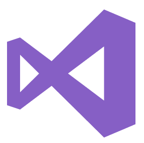

# 在 Visual Studio 中开始一个新项目

按照以下步骤进行，直到您能够实际输入代码：

1.  从“文件”菜单中，选择“新建 | 项目...”，如下截图所示：

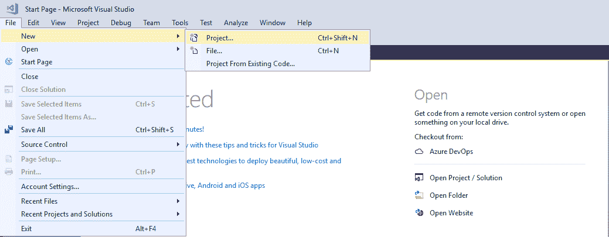

1.  您将会得到以下对话框：

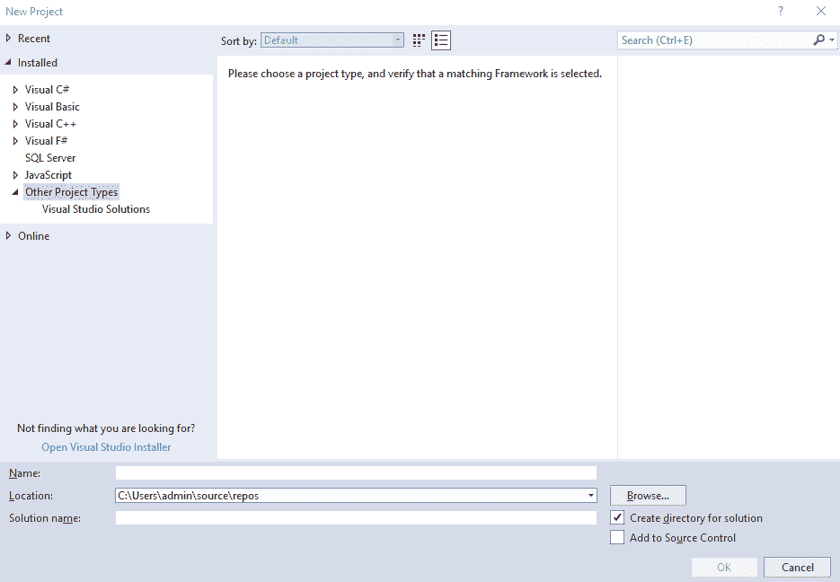

请注意底部有一个带有“解决方案名称”文本的小框。一般来说，Visual Studio 解决方案可能包含许多项目。但是，本书只使用单个项目，但有时您可能会发现将许多项目集成到同一个解决方案中很有用。

1.  现在有五件事情要处理，如下所示：

1.  从左侧面板选择“在线 | 模板 | Visual C++”

1.  从右侧面板选择“控制台应用程序（通用）项目模板”

1.  命名您的应用（我使用了`MyFirstApp`）

1.  选择一个文件夹保存您的代码

1.  点击“确定”按钮

1.  如果您以前从未使用过此模板，它将打开 VSIX 安装程序并显示此对话框：

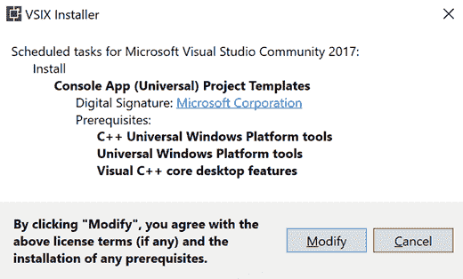

1.  点击“修改”。它将安装并关闭 Visual Studio。如果您看到此对话框，您可能需要点击“结束任务”：

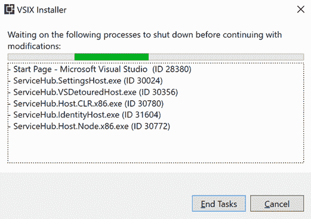

1.  然后，它将为您安装项目模板。这将需要很长时间，但您只需要做一次。完成后，点击“关闭”并重新启动 Visual Studio。

1.  您需要从文件|新建|项目...重新开始之前的步骤。这次，在已安装的项目下，Visual C++将显示出来：

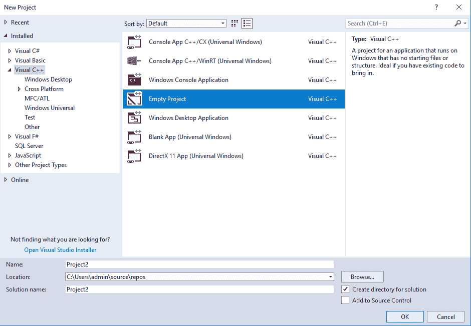

1.  选择空项目，您可以将名称从 Project1 更改为您想要的任何名称，在我的案例中是 MyFirstApp。

现在，您已经进入了 Visual Studio 2017 环境。这是您将进行所有工作和编码的地方。

然而，我们需要一个文件来写入我们的代码。因此，我们将通过在“解决方案资源管理器”中右键单击项目名称并选择添加|**新项目**来向我们的项目添加一个 C++代码文件，如下截图所示：

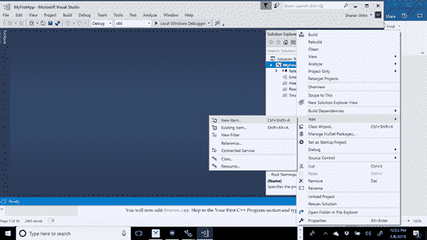

按照以下截图所示，添加您的新的 C++（`.cpp`）源代码文件：

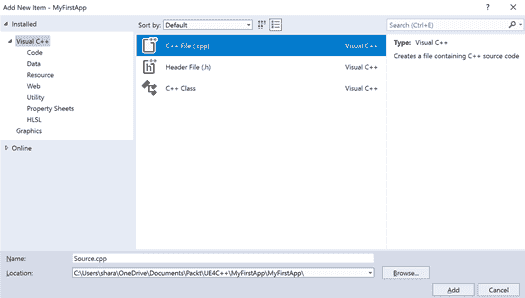

`Source.cpp`现在已经打开并准备好让您添加代码。跳转到*创建您的第一个 C++程序*部分并开始。

# 在 Mac 上使用 Xcode

在这一部分，我们将讨论如何在 Mac 上安装 Xcode。如果您使用 Windows，请跳转到下一节。

# 下载和安装 Xcode

Xcode 可以在 Apple 应用商店上的所有 Mac 电脑上免费获取。

如果可能的话，您应该获取最新版本。截至目前为止，它是 Xcode 10，但至少需要 macOS Sierra 或（最好是）High Sierra。如果您的 Mac 较旧并且运行较旧的操作系统，您可以免费下载操作系统更新，只要您使用的机器足够新来支持它。

只需在 Apple 应用商店上搜索 Xcode，如图所示：

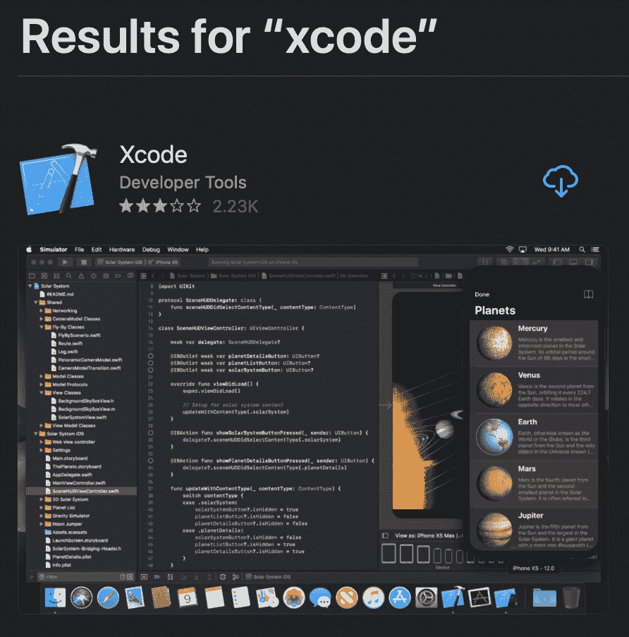

只需点击获取按钮，等待下载和安装。

# 在 Xcode 中开始一个新项目

1.  安装完 Xcode 后，打开它。然后，要么选择在打开的启动画面上创建一个新的 Xcode 项目，要么从屏幕顶部的系统菜单栏中导航到文件|新建|项目...，如下截图所示：

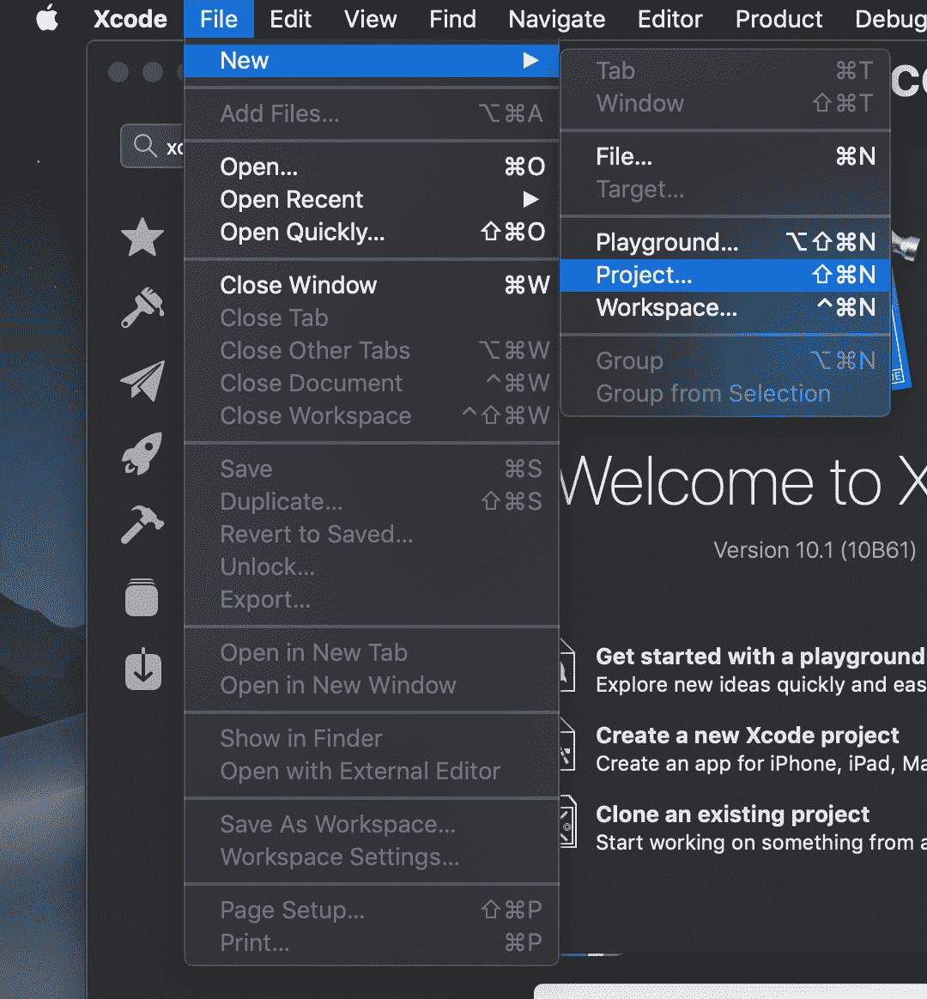

1.  在新项目对话框中，在屏幕顶部的 macOS 下的应用程序部分中，选择命令行工具。然后，点击下一步：

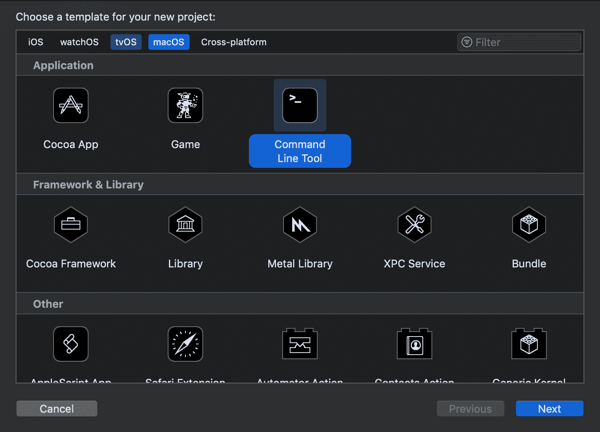

1.  在下一个对话框中，命名您的项目。确保填写所有字段，否则 Xcode 将不允许您继续。确保项目的类型设置为 C++，然后点击下一步按钮，如图所示：

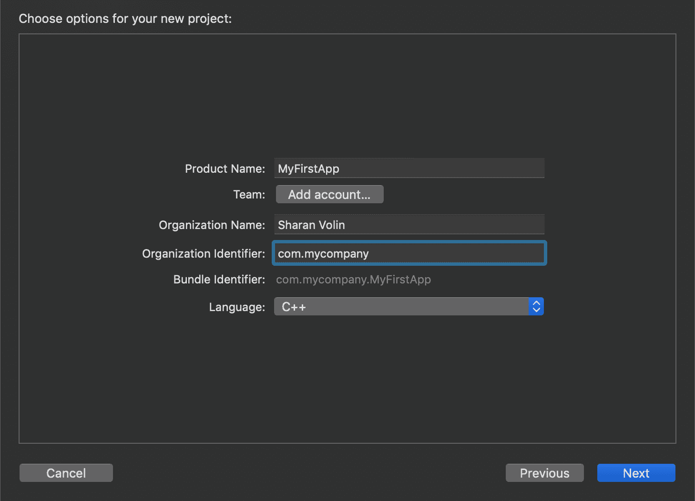

1.  接下来的弹出窗口将要求您选择一个位置以保存您的项目。在硬盘上选择一个位置并将其保存在那里。Xcode 默认情况下为您创建每个项目的 Git 存储库。您可以取消选中创建 git 存储库，因为我们在本章中不涉及 Git，如下截图所示：

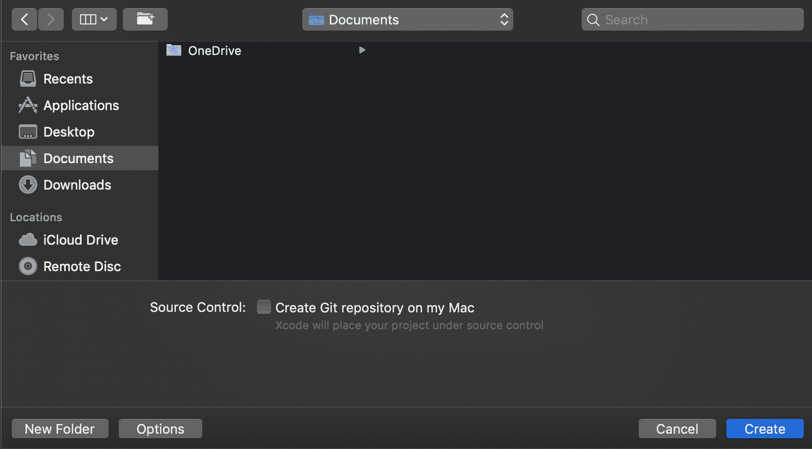

Git 是一个**版本控制系统**。这基本上意味着 Git 会定期（每次*提交*到存储库时）获取并保留项目中所有代码的快照。其他流行的**源代码控制管理**（**SCM**）工具包括 Mercurial、Perforce 和 Subversion。当多人在同一个项目上合作时，SCM 工具具有自动合并和复制其他人对存储库的更改到您的本地代码库的能力。

好了！您已经准备好了。在 Xcode 的左侧面板中点击`main.cpp`文件。如果文件没有出现，请确保首先选择左侧面板顶部的文件夹图标，如下截图所示：

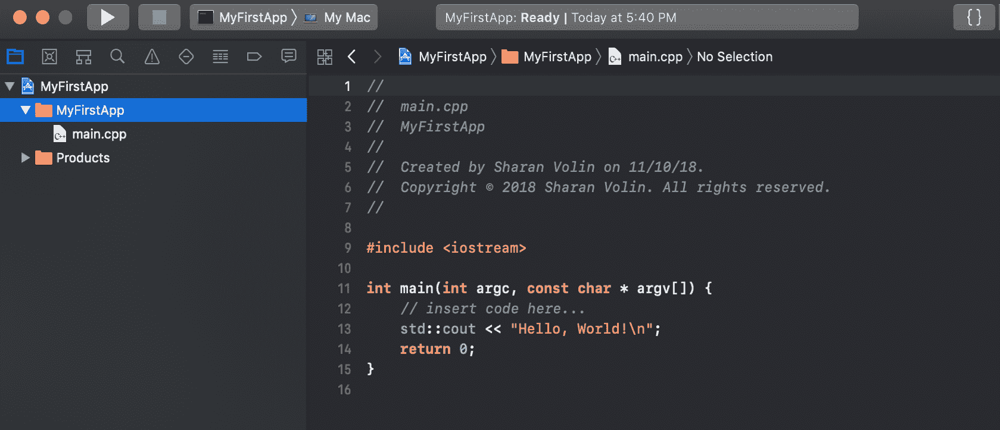

# 创建您的第一个 C++程序

我们现在要编写一些 C++源代码。我们称之为源代码有一个非常重要的原因：它是构建二进制可执行代码的源头。相同的 C++源代码可以在 Mac、Windows 和移动平台等不同平台上构建，并且理论上在每个相应的平台上执行相同操作的可执行代码应该是一样的。

在不太久远的过去，在引入 C 和 C++之前，程序员为他们单独针对的每台特定机器编写代码。他们用一种称为汇编语言的语言编写代码。但现在，有了 C 和 C++，程序员只需编写一次代码，就可以通过使用不同的编译器构建相同的源代码，将其部署到许多不同的机器上。

实际上，Visual Studio 的 C++版本和 Xcode 的 C++版本之间存在一些差异，但这些差异主要出现在处理高级 C++概念（如模板）时。在处理多个平台时，UE4 非常有帮助。

Epic Games 付出了大量的工作，以使相同的代码在 Windows 和 Mac 上以及许多其他平台（如移动平台和游戏机）上运行。

现实世界的提示

使代码在所有机器上以相同的方式运行非常重要，特别是对于联网游戏或允许诸如可共享的重放之类的游戏。这可以通过标准来实现。例如，IEEE 浮点标准用于在所有 C++编译器上实现十进制数学。这意味着诸如 200 * 3.14159 之类的计算结果应该在所有机器上相同。没有标准，不同的编译器可能（例如）以不同的方式四舍五入数字，而在有许多计算且代码需要精确时，这可能会导致不可接受的差异。

在 Microsoft Visual Studio 或 Xcode 中编写以下代码：

```cpp
#include <iostream>
using namespace std;  
int main() 
{ 
  cout << "Hello, world" << endl; 
  cout << "I am now a C++ programmer." << endl; 
  return 0;
} 
```

为了解释发生了什么，这里是相同的代码，但添加了注释（在`//`之后的任何内容都将被编译器忽略，但可以帮助解释发生了什么）。

```cpp
#include <iostream>  // Import the input-output library 
using namespace std; // allows us to write cout 
                     // instead of std::cout 
int main() 
{ 
  cout << "Hello, world" << endl; 
  cout << "I am now a C++ programmer." << endl; 
  return 0;      // "return" to the operating sys 
} 
```

按*Ctrl* + *F5*（或使用 Debug | Start Without Debugging 菜单）在 Visual Studio 中运行上述代码，或按*Command* + *R*（Product | Run）在 Xcode 中运行。在 Visual Studio 中第一次按*Ctrl* + *F5*时，您会看到此对话框：

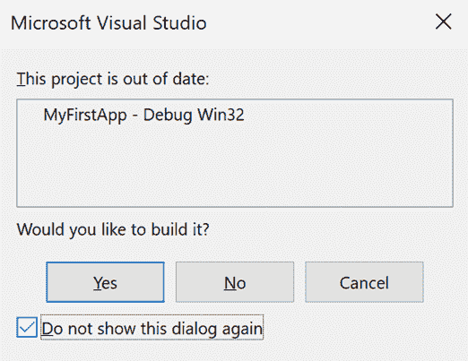

如果您不想每次运行程序时都看到这个对话框，请选择是并且不再显示此对话框。

以下是在 Windows 上应该看到的内容：

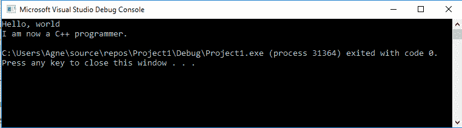

这是在 Mac 上的情况：

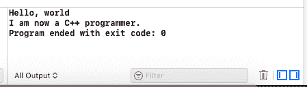

如果您在 Windows 上，您可能会注意到当您运行它时窗口会自动关闭，因此您无法看到结果。有各种方法可以解决这个问题，包括更改设置以暂停并让您按键继续。您可以在这里获取更多信息：[`stackoverflow.com/questions/454681/how-to-keep-the-console-window-open-in-visual-c/1152873#1152873`](https://stackoverflow.com/questions/454681/how-to-keep-the-console-window-open-in-visual-c/1152873#1152873)

您可能首先想到的是“哎呀！一大堆胡言乱语！”

实际上，您很少看到井号（#）符号的使用（除非您使用 Twitter）和花括号对`{``}`在正常的英文文本中。但是，在 C++代码中，这些奇怪的符号随处可见。您只需习惯它们。

因此，让我们解释一下这个程序，从第一行开始。

这是程序的第一行：

```cpp
#include <iostream>  // Import the input-output library 
```

这行有两个重要的要点需要注意：

1.  我们看到的第一件事是一个`#include`语句。我们要求 C++将另一个 C++源文件的内容，称为`<iostream>`，直接复制粘贴到我们的代码文件中。`<iostream>`是一个标准的 C++库，处理所有让我们将文本打印到屏幕上的代码。

1.  我们注意到的第二件事是一个`//`注释。如前所述，C++会忽略双斜杠（`//`）之后的任何文本，直到该行结束。注释非常有用，可以添加纯文本解释一些代码的功能。你可能还会在源代码中看到`/* */`多行 C 风格的注释。用斜杠星`/*`和星斜杠`*/`将任何文本（甚至跨多行）包围在 C 或 C++中，指示编译器删除该代码。

这是下一行代码：

```cpp
using namespace std; // allows us to write cout 
                     // instead of std::cout 
```

这一行旁边的注释解释了`using`语句的作用：它只是让你使用一个简写（例如，`cout`）而不是完全限定的名称（在这种情况下将是`std::cout`）来执行我们的许多 C++代码命令。有些人不喜欢`using namespace std;`语句；他们更喜欢每次使用`cout`时写`std::cout`的长格式。你可以就这样的事情进行长时间的争论。在本节文本中，我们更喜欢`using namespace std;`语句带来的简洁性。

另外，请注意本节第二行的注释与上一行的注释对齐。这是很好的编程实践，因为它在视觉上显示它是上一个注释的延续。

这是下一行：

```cpp
int main() 
```

这是应用程序的起点。你可以把`main`想象成比赛的起跑线。`int main()`语句是你的 C++程序知道从哪里开始的方式。

如果你没有一个`int main()`程序标记，或者`main`拼写错误，那么你的程序就不会工作，因为程序不知道从哪里开始。

下一行是一个你不经常看到的字符：

```cpp
{ 
```

这个`{`字符不是一个侧面的胡须。它被称为花括号，表示程序的起点。

接下来的两行将文本打印到屏幕上：

```cpp
cout << "Hello, world" << endl; 
cout << "I am now a C++ programmer." << endl; 
```

`cout`语句代表控制台输出。双引号之间的文本将以与引号之间的内容完全相同的方式输出到控制台。你可以在双引号之间写任何你想写的东西，除了双引号，它仍然是有效的代码。另外，请注意`endl`告诉`cout`添加一个换行（回车）字符，这对于格式化非常有用。

要在双引号之间输入双引号，你需要在你想要放在字符串中的双引号字符前面加上一个反斜杠（\），如下所示：

```cpp
cout << "John shouted into the cave \"Hello!\" The cave echoed."  
```

`\"`符号是转义序列的一个例子。还有其他转义序列可以使用；你会发现最常见的转义序列是`\n`，它用于将文本输出跳转到下一行。

程序的最后一行是`return`语句：

```cpp
return 0; 
```

这行代码表示 C++程序正在退出。你可以把`return`语句看作是返回到操作系统。

最后，你的程序的结束由闭合的花括号表示，这是一个相反的侧面胡须：

```cpp
} 
```

# 分号

分号（;）在 C++编程中很重要。请注意在前面的代码示例中，大多数代码行都以分号结束。如果你不在每行末尾加上分号，你的代码将无法编译，如果发生这种情况，你的雇主将不会很高兴（当然，一旦你做了一段时间，你会在他们发现之前找到并修复这些问题）。

# 处理错误

如果你在输入代码时犯了一个错误，那么你将会有一个语法错误。面对语法错误，C++会大声尖叫，你的程序甚至不会编译；而且，它也不会运行。

让我们试着在之前的 C++代码中插入一些错误：

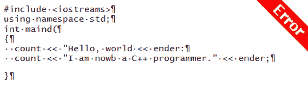

警告！这段代码清单包含错误。找到并修复所有错误是一个很好的练习！

作为练习，试着找到并修复这个程序中的所有错误。

请注意，如果你对 C++非常陌生，这可能是一个很难的练习。然而，这将向你展示在编写 C++代码时需要多么小心。

修复编译错误可能是一件麻烦的事情。然而，如果你将这个程序的文本输入到你的代码编辑器中并尝试编译它，它将导致编译器向你报告所有的错误。逐个修复错误，然后尝试重新编译（从列表中的第一个开始，因为它可能导致后面的一些错误）。一个新的错误将弹出，或者程序将正常工作，如下面的屏幕截图所示：

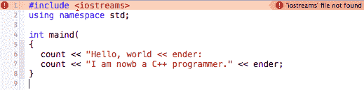

当你尝试编译代码时，你的编译器会显示代码中的错误（尽管如果你使用 Visual Studio，它会询问你是否要先运行之前成功的构建）。

我展示这个示例程序的原因是鼓励以下工作流程，只要你是 C++的新手：

1.  始终从一个可工作的 C++代码示例开始。你可以从*创建* *你的第一个 C++程序*部分分叉出一堆新的 C++程序。

1.  在小步骤中进行代码修改。当你是新手时，每写一行新代码后进行编译。不要一两个小时编码，然后一次性编译所有新代码。

1.  你可能需要几个月的时间才能写出第一次就能正常运行的代码。不要灰心。学习编码是有趣的。

# C++中的警告

编译器会标记它认为可能是错误的东西。这些是另一类编译器通知，称为警告。警告是你代码中的问题，你不必修复它们才能运行你的代码，但编译器建议修复。警告通常是代码不够完美的指示，修复代码中的警告通常被认为是良好的做法。

然而，并非所有的警告都会在你的代码中引起问题。一些程序员喜欢禁用他们认为不是问题的警告（例如，警告 4018 警告有符号/无符号不匹配，你很可能以后会看到）。

# 什么是构建和编译？

你可能听说过一个计算机进程术语叫做编译。编译是将你的 C++程序转换为可以在 CPU 上运行的代码的过程。构建你的源代码意味着与编译相同的事情。

看，你的源代码`code.cpp`文件实际上不会在计算机上运行。它必须首先进行编译才能运行。

这就是使用 Microsoft Visual Studio Community 或 Xcode 的全部意义。Visual Studio 和 Xcode 都是编译器。你可以在任何文本编辑程序中编写 C++源代码，甚至在记事本中。但是你需要一个编译器在你的机器上运行它。

每个操作系统通常都有一个或多个可以在该平台上运行的 C++编译器。在 Windows 上，你有 Visual Studio 和 Intel C++ Studio 编译器。在 Mac 上，有 Xcode，在 Windows、Mac 和 Linux 上都有**GNU 编译器集合**（**GCC**）。

我们编写的相同的 C++代码（源代码）可以使用不同的编译器在不同的操作系统上编译，并且理论上它们应该产生相同的结果。在不同平台上编译相同的代码的能力称为可移植性。一般来说，可移植性是一件好事。

# 示例输出

这是你的第一个 C++程序的屏幕截图：

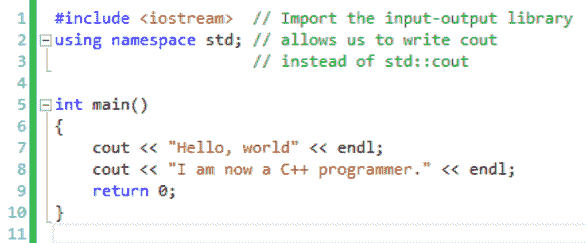

以下屏幕截图是它的输出，你的第一个胜利：

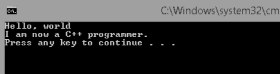

还有一类编程语言叫做脚本语言。这些包括诸如 PHP、Python 和`ActionScript`的语言。脚本语言不需要编译；对于 JavaScript、PHP 和 ActionScript，没有编译步骤。相反，它们在程序运行时从源代码中进行解释。脚本语言的好处是它们通常是平台无关的，因为解释器被设计得非常仔细以实现平台无关性。

# 练习 - ASCII 艺术

游戏程序员喜欢 ASCII 艺术。你可以只用字符绘制一幅图片。这里有一个 ASCII 艺术迷宫的例子：

```cpp
cout << "****************" << endl; 
cout << "*............*.*" << endl; 
cout << "*.*.*******..*.*" << endl; 
cout << "*.*.*..........*" << endl; 
cout << "*.*.*.**********" << endl; 
cout << "***.***........*" << endl; 
```

用 C++代码构建自己的迷宫，或者用字符绘制一幅图片。

# 总结

总之，我们学会了如何在集成开发环境（IDE，Visual Studio 或 Xcode）中用 C++编程语言编写我们的第一个程序。这是一个简单的程序，但是你应该把编译和运行你的第一个程序视为你的第一次胜利。在接下来的章节中，我们将组合更复杂的程序，并开始在我们的游戏中使用虚幻引擎。
