# 第二章：变量和内存

为了编写你的 C++游戏程序，你需要让你的计算机记住很多东西，比如玩家在世界的位置，他们有多少生命值，还剩下多少弹药，世界中物品的位置，它们提供的增益效果，以及组成玩家屏幕名字的字母。

你的计算机实际上有一种叫做**内存**或 RAM 的电子素描板。从物理上讲，计算机内存是由硅制成的，看起来与下面的照片相似：

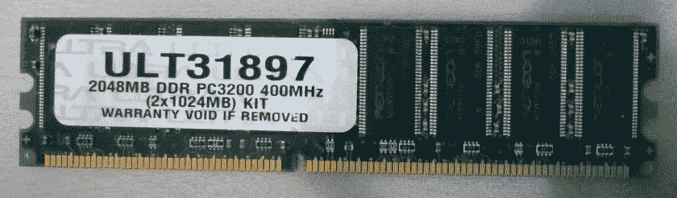

这块 RAM 看起来像停车场吗？因为这就是我们要使用的隐喻。

RAM 是随机存取存储器的缩写。它被称为随机存取，因为你可以随时访问它的任何部分。如果你还有一些 CD 在身边，它们就是非随机存取的例子。CD 是按顺序读取和播放的。我还记得很久以前在 CD 上切换曲目需要很长时间！然而，跳跃和访问 RAM 的不同单元并不需要太多时间。RAM 是一种快速存储器访问的类型，称为闪存存储器。

RAM 被称为易失性闪存存储器，因为当计算机关闭时，RAM 的内容被清除，除非它们首先保存到硬盘上，否则 RAM 的旧内容将丢失。

对于永久存储，你必须把你的数据保存到硬盘上。有两种主要类型的硬盘：

+   基于盘片的**硬盘驱动器**（**HDDs**）

+   **固态硬盘**（**SSD**）

SSD 比基于盘片的 HDD 更现代，因为它们使用 RAM 的快速访问（闪存）存储原理。然而，与 RAM 不同，SSD 上的数据在计算机关闭后仍然存在。如果你能得到一个 SSD，我强烈建议你使用它！基于盘片的驱动器已经过时了。

当程序运行时，访问存储在 RAM 中的数据比从 HDD 或 SSD 中访问要快得多，所以我们需要一种方法来在 RAM 上保留空间并从中读取和写入。幸运的是，C++使这变得容易。

# 变量

在计算机内存中保存的位置，我们可以读取或写入，称为**变量**。

变量是一个值可以变化的组件。在计算机程序中，你可以把变量看作是一个容器，可以在其中存储一些数据。在 C++中，这些数据容器（变量）有类型和名称，你可以用来引用它们。你必须使用正确类型的数据容器来保存你的程序中的数据。

如果你想保存一个整数，比如 1、0 或 20，你将使用`int`类型的容器。你可以使用 float 类型的容器来携带浮点（小数）值，比如 38.87，你可以使用字符串变量来携带字母字符串（把它想象成一串珍珠，其中每个字母都是一颗珍珠）。

你可以把你在 RAM 中保留的位置看作是在停车场预留一个停车位：一旦我们声明了我们的变量并为它获得了一个位置，操作系统就不会把那块 RAM 的其他部分分配给其他程序（甚至是在同一台机器上运行的其他程序）。你的变量旁边的 RAM 可能未被使用，也可能被其他程序使用。

操作系统的存在是为了防止程序相互干扰，同时访问计算机硬件的相同位。一般来说，文明的计算机程序不应该读取或写入其他程序的内存。然而，一些类型的作弊程序（例如，地图黑客）会秘密访问你程序的内存。像 PunkBuster 这样的程序被引入来防止在线游戏中的作弊。

# 声明变量——触摸硅

使用 C++在计算机内存中保留一个位置很容易。我们想要用一个好的、描述性的名字来命名我们将在其中存储数据的内存块。

例如，假设我们知道玩家的**生命值**（**hp**）将是一个整数（整数）数字，例如 1、2、3 或 100。为了让硅片在内存中存储玩家的`hp`，我们将声明以下代码行：

```cpp
int hp;     // declare variable to store the player's hp 
```

这行代码保留了一小块 RAM 来存储称为`hp`的整数（`int`是整数的缩写）。以下是我们用来存储玩家`hp`的 RAM 块的示例。这在内存中为我们保留了一个停车位（在所有其他停车位中），我们可以通过其标签（`hp`）引用内存中的这个空间：

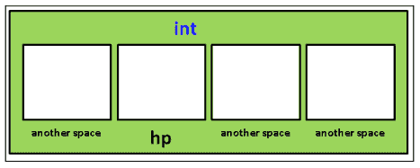

在内存中的所有其他空间中，我们有一个地方来存储我们的 hp 数据。

当您命名变量时，有一些规则。变量名称不能以数字开头，编译器不允许使用某些“保留字”（通常是因为它们被 C++本身使用）。随着您学习更多的 C++，您将学到这些，或者您可以在网上寻找保留字列表。

请注意，变量空间在此图中标记为`int`，如果它是双精度或其他类型的变量空间。C++不仅通过名称记住您在内存中为程序保留的空间，还通过变量的类型记住它。

请注意，我们还没有把任何东西放在 hp 的盒子里！我们稍后会这样做——现在，`hp`变量的值尚未设置，因此它将具有上一个占用者（也许是另一个程序留下的值）留在那个停车位上的值。告诉 C++变量的类型很重要！稍后，我们将声明一个变量来存储十进制值，例如 3.75。

# 读取和写入内存中保留的位置

将值写入内存很容易！一旦有了`hp`变量，您只需使用`=`符号写入它：

```cpp
hp = 500; 
```

哇！玩家有 500 hp。

读取变量同样简单。要打印变量的值，只需输入以下内容：

```cpp
cout << hp << endl; 
```

这将打印存储在`hp`变量中的值。`cout`对象足够聪明，可以弄清楚它是什么类型的变量，并打印内容。如果您更改`hp`的值，然后再次使用`cout`，将打印最新的值，如下所示：

```cpp
hp = 1200; 
cout << hp << endl; // now shows 1200 
```

# 数字和数学

标题说明了一切；在本节中，我们将深入探讨 C++中数字和数学的重要性。

# 数字就是一切

开始计算机编程时，你需要习惯的一件事是，令人惊讶的是，许多东西可以仅以数字形式存储在计算机内存中。玩家的生命值？正如我们在前一节中所看到的，生命值可以只是一个整数。如果玩家受伤，我们减少这个数字。如果玩家获得健康，我们增加这个数字。

颜色也可以存储为数字！如果您使用标准的图像编辑程序，可能会有滑块指示颜色使用了多少红色、绿色和蓝色，例如 Pixelmator 的颜色滑块，如果您使用过的话。Photoshop 没有滑块，但会显示数字，并允许您直接编辑以更改颜色。然后，颜色由三个数字表示。以下截图中显示的紫色是（R:`127`，G:`34`，B:`203`）：

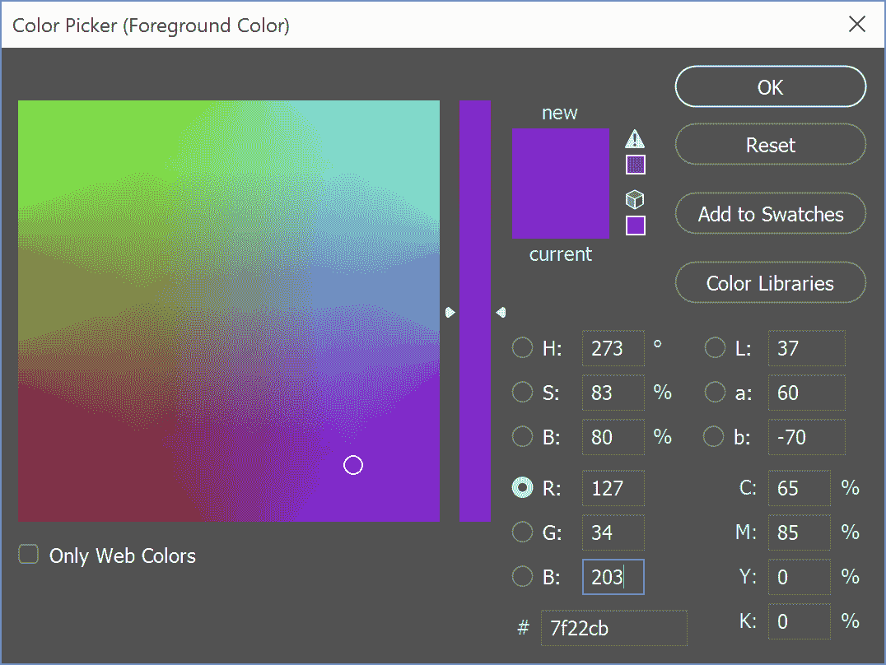

正如您所看到的，Photoshop 允许您使用其他数字来表示颜色，例如 HSB（色调、饱和度、亮度），这是表示颜色的另一种方式，或者 CMYK（青色、品红色、黄色、黑色），用于印刷，因为专业印刷机使用这些颜色油墨进行印刷。对于在计算机显示器上查看，您通常会坚持使用 RGB 颜色表示，因为这是显示器使用的颜色。

世界几何呢？这些也只是数字；我们所要做的就是存储一组 3D 空间点（*x*、*y*和*z*坐标），然后存储另一组解释这些点如何连接以形成三角形的点。在下面的屏幕截图中，我们可以看到 3D 空间点是如何用来表示世界几何的：


颜色和 3D 空间点的数字组合将让您在游戏世界中绘制大型且彩色的景观。

前面示例的技巧在于我们如何解释存储的数字，以便使它们意味着我们想要的意思。

# 有关变量的更多信息

您可以将变量看作宠物携带者。猫笼可以用来携带猫，但不能携带狗。同样，您应该使用浮点类型的变量来携带小数值。如果您将小数值存储在`int`变量中，它将不适合：

```cpp
int x = 38.87f; 
cout << x << endl; // prints 38, not 38.87 
```

这里真正发生的是 C++对`38.87`进行了自动类型转换，将其转换为整数以适应`int`的容器。它舍弃了小数部分，将`38.87`转换为整数值`38`。

因此，例如，我们可以修改代码以包括使用三种类型的变量，如下面的代码所示：

```cpp
#include <iostream> 
#include <string>  // need this to use string variables! 
using namespace std; 
int main() 
{ 
  string name; 
  int goldPieces; 
  float hp; 
  name = "William"; // That's my name 
  goldPieces = 322; // start with this much gold  
  hp = 75.5f;       // hit points are decimal valued 
  cout << "Character " << name << " has "  
           << hp << " hp and "  
           << goldPieces << " gold."; 
} 
```

在前三行中，我们声明了三个盒子来存储我们的数据部分，如下所示：

```cpp
string name; int goldPieces; float hp; 
```

这三行在内存中保留了三个位置（就像停车位）。接下来的三行将变量填充为我们想要的值，如下所示：

```cpp
name = "William"; 
goldPieces = 322; 
hp = 75.5f; 
```

在计算机内存中，这将看起来像以下图表：

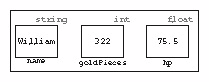

您可以随时更改变量的内容。您可以使用`=`赋值运算符来写入变量，如下所示：

```cpp
goldPieces = 522;// = is called the "assignment operator" 
```

您还可以随时读取变量的内容。代码的下三行就是这样做的，如下所示：

```cpp
cout << "Character " << name << " has "  
     << hp << " hp and "  
     << goldPieces << " gold."; 
```

看一下以下行：

```cpp
cout << "I have " << hp << " hp." << endl; 
```

在这一行中，单词`hp`有两种用法。一种是在双引号之间，而另一种则不是。双引号之间的单词总是精确输出为您键入的样子。当不使用双引号（例如`<< hp <<`）时，将执行变量查找。如果变量不存在，那么您将收到编译器错误（未声明的标识符）。

内存中有一个为名称分配的空间，一个为玩家拥有的`goldPieces`分配的空间，以及一个为玩家的 hp 分配的空间。

当您运行程序时，您应该看到以下内容：

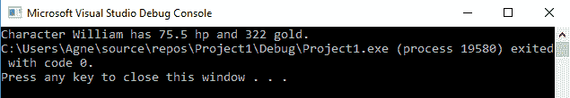

一般来说，您应该始终尝试将正确类型的数据存储在正确类型的变量中。如果您存储了错误类型的数据，您的代码可能会表现异常。例如，意外地将浮点数存储到`int`变量中将使您丢失小数点，并且将字符的值存储在`int`中将给出 ASCII 值，但不再将其视为字母。有时，甚至没有任何类型的自动类型转换，因此它将不知道如何处理该值。

# C++中的数学运算

C++中的数学运算很容易；`+`（加）、`-`（减）、`*`（乘）、`/`（除）都是常见的 C++操作，将遵循正确的**括号**、**指数**、**除法**、**乘法**、**加法**和**减法**（**BEDMAS**）顺序。例如，我们可以按照以下代码中所示的方式进行：

```cpp
int answer = 277 + 5 * 4 / 2 + 20; 
```

当然，如果你想要绝对确定顺序，使用括号总是一个好主意。你可能还不熟悉的另一个运算符是%（取模）。取模（例如，10 % 3）找到`x`（10）除以`y`（3）时的余数。请参考以下表格中的示例：

| 运算符（名称） | 示例 | 答案 |
| --- | --- | --- |
| + (plus) | 7 + 3 | 10 |
| - (minus) | 8 - 5 | 3 |
| * (times) | 5*6 | 30 |
| / (division) | 12/6 | 2 |
| % (modulus) | 10 % 3 | 1（因为 10/3 是 3，余数=1）。 |

然而，我们通常不希望以这种方式进行数学运算。相反，我们通常希望按一定计算的数量更改变量的值。这是一个更难理解的概念。假设玩家遇到一个小恶魔并受到 15 点伤害。

以下代码将用于减少玩家的`hp` `15`（信不信由你）：

```cpp
hp = hp - 15;                  // probably confusing :) 
```

你可能会问为什么。因为在右侧，我们正在计算 hp 的新值（`hp-15`）。找到 hp 的新值（比以前少 15），然后将新值写入`hp`变量。

将`hp`视为墙上特定位置的绘画。`-15`告诉您在绘画上画上胡须，但保持在原地。新的、留着胡须的绘画现在是`hp`。

陷阱

未初始化的变量具有在内存中保存的位模式。声明变量不会清除内存。

因此，假设我们使用以下行代码：

```cpp
int hp;   
hp = hp - 15;   
```

第二行代码将 hp 从其先前的值减少 15。如果我们从未设置`hp = 100`或其他值，那么它的先前值是多少？它可能是 0，但并非总是如此。

最常见的错误之一是在未初始化变量的情况下继续使用变量。

以下是进行此操作的简写语法：

```cpp
hp -= 15; 
```

除了`-=`，您还可以使用`+=`将一定数量添加到变量，`*=`将变量乘以一定数量，`/=`将变量除以一定数量。

如果您使用`int`并希望将其增加（或减少）1，可以缩短语法。您不需要编写以下内容：

```cpp
hp = hp + 1;
hp = hp - 1;
```

您也可以执行以下任何操作：

```cpp
hp++;
++hp;
hp--;
--hp;
```

将其放在变量之前会在使用变量之前递增或递减变量（如果您在较大的语句中使用它）。将其放在后面会在使用变量后更新变量。

# 练习

执行以下操作后写下`x`的值，然后与您的编译器进行检查：

| 练习 | 解决方案 |
| --- | --- |
| `int x = 4; x += 4;` | `8` |
| `int x = 9; x-=2;` | `7` |
| `int x = 900; x/=2;` | `450` |
| `int x = 50; x*=2;` | `100` |
| `int x = 1; x += 1;` | `2` |
| `int x = 2; x -= 200;` | `-198` |
| `int x = 5; x*=5;` | `25` |

# 广义变量语法

在前一节中，您了解到您在 C++中保存的每个数据都有一个类型。所有变量都是以相同的方式创建的；在 C++中，变量声明的形式如下：

```cpp
variableType variableName; 
```

`variableType`对象告诉您我们将在变量中存储什么类型的数据。`variableName`对象是我们将用来读取或写入该内存块的符号。

# 基本类型

我们之前谈到计算机内部的所有数据最终都将是一个数字。您的计算机代码负责正确解释该数字。

据说 C++只定义了一些基本数据类型，如下表所示：

| `Char` | 单个字母，例如*a*，*b*或*+*。它以 ASCII 存储为-127 到 127 的数字值，ASCII 是一种为每个字符分配特定数字值的标准。 |
| --- | --- |
| `Short` | 从`-32,767`到`+32,768`的整数。 |
| `Int` | 从`-2,147,483,647`到`+2,147,483,648`的整数。 |
| `Long` | 从`-2,147,483,647`到`+2,147,483,648`的整数。 |
| `Float` | 从约`-1x10³⁸`到`1x10³⁸`的任何小数值。 |
| `Double` | 从约`-1x10³⁰⁸`到`1x10³⁰⁸`的任何小数值。 |
| `Bool` | 真或假。 |

在前面的表中提到的每种变量类型都有无符号版本（当然，Bool 除外，这实际上没有什么意义）。无符号变量可以包含自然数，包括 0（x >= 0）。例如，无符号`short`的值可能在`0`和`65535`之间。如果需要，您还可以使用`long long`或`long long int`获得更大的整数。

变量的大小有时在不同的编译器中可能会有所不同，或者取决于您是为 32 位还是 64 位操作系统进行编译。如果您将来发现自己在处理不同的东西，请记住这一点。

在这种情况下，我们关注的是 Visual Studio 或 Xcode 和（很可能）64 位。

如果你对浮点数和双精度之间的区别感兴趣，请随时在互联网上查找。我只会解释用于游戏的最重要的 C++概念。如果你对这个文本未涵盖的内容感到好奇，请随时查找。

# 高级变量主题

C++的更新版本添加了一些与变量相关的新功能，还有一些尚未提及的功能。以下是一些你应该记住的事情。

# 自动检测类型

从 C++ 11 开始，有一种新的变量*类型*，可以用于你可能不确定期望得到的类型的情况。这种新类型叫做`auto`。它的意思是它将检测你首先分配给它的任何值的类型，然后使用它。比如你输入以下内容：

```cpp
auto x = 1.5;
auto y = true;
```

如果你这样做，`x`将自动成为一个浮点数，`y`将成为一个布尔值。一般来说，如果你知道变量的实际类型（大多数情况下你会知道），最好避免使用它。然而，你应该能够在看到它时识别它，并且在最终需要它的情况下了解它。

# 枚举

枚举类型已经存在很长时间了，但是从 C++ 11 开始，你可以更好地控制它们。枚举的想法有时是你想要在游戏中跟踪不同类型的东西，你只是想要一种简单的方法来给每个值，告诉你它是什么，以及你以后可以检查它。枚举看起来像下面这样：

```cpp
enum weapon {
    sword = 0;
    knife,
    axe,
    mace,
    numberOfWeaponTypes,
    defaultWeapon = mace
}; // Note the semicolon at the end
```

这将创建每种武器类型，并通过为每种武器类型加 1 来分配每种武器类型一个唯一的值，因此刀将等于 1，斧头将等于 2，依此类推。请注意，你不需要将第一个设置为 0（它会自动设置），但如果你想从不同的数字开始，你可以这样做（不仅仅是第一个可以设置为特定的值）。你还可以将任何`enum`成员分配给另一个不同的成员，它将具有相同的值（在这个例子中，`defaultWeapon`具有与`mace`相同的值：3）。在枚举列表中的任何地方分配特定值时，列表中之后添加的任何类型将从该值开始递增 1。

枚举类型一直包含一个 int 值，但是从 C++ 11 开始，你可以指定一个变量类型。例如，你可能想做类似以下的事情：

```cpp
enum isAlive : bool {
    alive = true,
    dead = false
}
```

虽然你可以用 0 和 1 来做到这一点，但在某些情况下，你可能会发现这更方便。

# 常量变量

有时你会有一个值，你不希望在游戏过程中改变。你不希望像生命值、最大生命值、达到特定级别所需的经验值或移动速度这样的东西改变（除非你的角色确实达到了那个级别，在这种情况下，你可能会切换到另一个常量值）。

在某些情况下，`enum`可以解决这个问题，但对于单个值，更容易创建一个新变量并声明它为`const`。这里有一个例子：

```cpp
const int kNumLives = 5;
```

在变量类型前面放置`const`告诉程序永远不要允许该值被更改，如果你尝试，它会给你一个错误。在变量名前面放置`k`是`const`变量的常见命名约定。许多公司会坚持要求你遵循这个标准。

# 构建更复杂的类型

事实证明，这些简单的数据类型本身可以用来构建任意复杂的程序。*怎么做？* 你会问。仅仅使用浮点数和整数来构建 3D 游戏难吗？

从`float`和`int`构建游戏并不是真的很困难，但更复杂的数据类型会有所帮助。如果我们使用松散的浮点数来表示玩家的位置，编程将会很乏味和混乱。

# 对象类型 - 结构

C++为你提供了将变量组合在一起的结构，这将使你的生活变得更加轻松。以以下代码块为例：

```cpp
#include <iostream> 
using namespace std; 
struct Vector        // BEGIN Vector OBJECT DEFINITION 
{ 
  float x, y, z;     // x, y and z positions all floats 
};                   // END Vector OBJECT DEFINITION. 
// The computer now knows what a Vector is 
// So we can create one. 
int main() 
{ 
  Vector v; // Create a Vector instance called v 
  v.x=20, v.y=30, v.z=40; // assign some values 
  cout << "A 3-space vector at " << v.x << ", " << v.y << ", " <<  
   v.z << endl; 
} 
```

在内存中的显示方式非常直观；**Vector**只是一个具有三个浮点数的内存块，如下图所示：

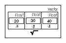

不要将前面的屏幕截图中的`struct Vector`与**标准模板库**（**STL**）的`std::vector`混淆-我们稍后会介绍这一点。前面的`Vector`对象用于表示三维向量，而 STL 的`std::vector`类型表示一组值。

关于前面的代码清单，这里有一些复习注意事项。

首先，甚至在我们使用`Vector`对象类型之前，我们必须定义它。C++没有内置的数学向量类型（它只支持标量数字，他们认为这已经足够了！）。因此，C++允许您构建自己的对象构造以使您的生活更轻松。我们首先有以下定义：

```cpp
struct Vector        // BEGIN Vector STRUCT DEFINITION 
{ 
  float x, y, z;     // x, y, and z positions all floats 
};                   // END Vector STRUCT DEFINITION. 
```

这告诉计算机`Vector`是什么（它是三个浮点数，所有这些都被声明为坐在内存中的相邻位置）。在前面的图中显示了`Vector`在内存中的样子。

接下来，我们使用我们的`Vector`对象定义来创建一个名为`v`的 Vector 实例：

```cpp
Vector v; // Create a Vector instance called v 
```

一旦您有了`Vector`的实例，您就可以使用我们称之为**点语法**来访问其中的变量。您可以使用`v.x`在 Vector `v`上访问变量`x`。`struct` Vector 定义实际上并不创建 Vector 对象，它只是定义了对象类型。您不能做`Vector.x = 1`。您在谈论哪个对象实例？C++编译器会问。您需要首先创建一个 Vector 实例，例如 Vector `v`。这将创建一个 Vector 的实例并将其命名为`v`。然后，您可以对`v`实例进行赋值，例如`v.x = 0`。

然后，我们使用这个实例来写入`v`中的值：

```cpp
v.x=20, v.y=30, v.z=40; // assign some values 
```

我们在前面的代码中使用逗号来初始化同一行上的一堆变量。这在 C++中是可以的。虽然您可以将每个变量放在自己的一行上，但在这里显示的方法也是可以的。

这使得`v`看起来像前面的图像。然后，我们将它们打印出来：

```cpp
cout << "A 3-space vector at " << v.x << ", " << v.y << ", " <<  
   v.z << endl;
```

在这里的两行代码中，我们通过简单地使用点（`.`）访问对象内的各个数据成员；`v.x`指的是对象`v`内的`x`成员。每个 Vector 对象内部将恰好有三个浮点数：一个称为`x`，一个称为`y`，一个称为`z`。

# 练习-玩家

为`Player`对象定义一个 C++数据结构。然后，创建您的`Player`结构的一个实例，并为每个数据成员填充值。

# 解决方案

让我们声明我们的`Player`对象。我们希望将与玩家有关的所有内容都放入`Player`对象中。我们这样做是为了使代码整洁。您在 Unreal Engine 中阅读的代码将在各个地方使用这样的对象，因此请注意：

```cpp
struct Player 
{ 
  string name; 
  int hp; 
  Vector position; 
}; // Don't forget this semicolon at the end! 
int main() 
{ 
  // create an object of type Player, 
  Player me; // instance named 'me' 
  me.name = "William"; 
  me.hp = 100; 
  me.position.x = me.position.y = me.position.z=0; 
} 
```

行`me.position.x = me.position.y = me.position.z=0;`意味着`me.position.z`设置为`0`，然后将该值传递给`me.position.y`设置为 0，然后传递并设置`me.position.x`为`0`。

`struct Player`定义告诉计算机如何在内存中布置`Player`对象。

我希望您注意到了结构声明末尾的必需分号。结构对象声明需要在末尾加上分号，但函数不需要（我们稍后会讨论函数）。这只是一个必须记住的 C++规则。

在`Player`对象内部，我们声明了一个字符串用于玩家的名称，一个浮点数用于他们的 hp，以及一个`Vector`对象用于他们完整的`x`，`y`和`z`位置。

当我说对象时，我的意思是 C++结构（稍后我们将介绍术语*类*）。

等等！我们把一个 Vector 对象放在一个 Player 对象里！是的，你可以这样做。只要确保 Vector 在同一个文件中定义。

在定义了`Player`对象内部的内容之后，我们实际上创建了一个名为`me`的`Player`对象实例，并为其分配了一些值。

# 指针

一个特别棘手的概念是指针的概念。指针并不难理解，但可能需要一段时间才能牢固掌握。指针基本上包含一个对象存储的内存地址，因此它们在内存中“指向”对象。

假设我们在内存中声明了一个`Player`类型的变量：

```cpp
Player me; 
me.name = "William"; 
me.hp = 100; 
```

我们现在声明一个指向`Player`的指针：

```cpp
Player* ptrMe;               // Declaring a pointer to 
                             // a Player object
```

`*`改变了变量类型的含义。`*`是使`ptrMe`成为`Player`对象的指针而不是常规`Player`对象的原因。

我们现在想要将`ptrMe`链接到`me`：

```cpp
ptrMe = &me;                  // LINKAGE 
```

这种链接步骤非常重要。如果在使用指针之前不将指针链接到对象，将会出现内存访问违规错误——尝试访问未设置的内存，因此可能包含随机数据甚至其他程序的一部分！

`ptrMe`指针现在指向与`me`相同的对象。更改`ptrMe`指向的对象中的变量的值将在`me`中更改，如下图所示：

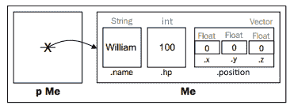

# 指针能做什么？

当我们建立指针变量和它所指向的东西之间的链接时，我们可以通过指针操纵它所指向的变量。

指针的一个用途是在代码中的多个不同位置引用同一个对象。如果您经常尝试访问它，您可能希望在本地存储一个指向它的指针，以便更容易访问。`Player`对象是一个很好的指向候选对象，因为您的代码中的许多地方可能会不断地访问它。

您可以创建任意数量的指针指向同一个对象，但您需要跟踪它们所有（除非您使用智能指针，我们稍后会介绍）。被指向的对象不一定知道自己被指向，但可以通过指针对对象进行更改。

例如，假设玩家受到了攻击。他们的 hp 减少将是结果，并且这种减少将使用指针来完成，如下面的代码所示：

```cpp
ptrMe->hp -= 33;      // reduced the player's hp by 33 
ptrMe->name = "John";// changed his name to John 
```

使用指针时，您需要使用`->`而不是`.`来访问指向的对象中的变量。

现在`Player`对象的外观如下：

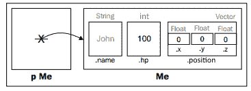

因此，我们通过改变`ptrMe->name`来改变`me.name`。因为`ptrMe`指向`me`，所以通过`ptrMe`的更改会直接影响`me`。

# 地址运算符（&）

请注意在前面的代码示例中使用了`&`符号。`&`运算符获取变量存储的内存地址。变量的内存地址是计算机内存空间中保留存储变量值的位置。C++能够获取程序内任何对象的内存地址。变量的地址是唯一的，也有点随机。

假设我们打印一个整数变量`x`的地址，如下所示：

```cpp
int x = 22; 
cout << &x << endl; // print the address of x 
```

在程序的第一次运行中，我的计算机打印如下：

```cpp
0023F744 
```

这个数字（`&x`的值）只是存储`x`的内存单元。这意味着在程序的这次启动中，`x`变量位于内存单元编号`0023F744`，如下图所示：

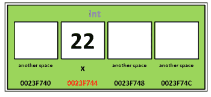

您可能会想为什么前面的数字包含一个`F`。地址是十六进制（基数 16），因此在 9 之后数字位用完了，但实际上 1 中无法容纳两个数字，因此将值设置为 10-15 分别为 A-F。因此 A = 10，B = 11，在这种情况下 F = 15。

现在，创建并将指针变量分配给`x`的地址：

```cpp
int *px; 
px = &x; 
```

我们在这里做的是将`x`的内存地址存储在`px`变量中。因此，我们用另一个不同的变量`px`来指向`x`变量。这可能看起来类似于以下图示中所示的内容：

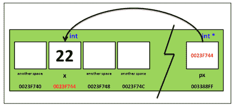

在这里，`px`变量中包含了`x`变量的地址。换句话说，`px`变量是对另一个变量的引用。对`px`进行解引用意味着访问`px`引用的变量。解引用使用`*`符号进行：

```cpp
cout << *px << endl; 
```

# 使用 nullptr

`nullptr`变量是一个值为`0`的指针变量。一般来说，大多数程序员喜欢在创建新指针变量时将指针初始化为`nullptr`（`0`）。一般来说，计算机程序无法访问内存地址`0`（它是保留的），因此如果尝试引用空指针，程序将崩溃。

*Pointer Fun with Binky*是一个关于指针的有趣视频。请查看[`www.youtube.com/watch?v=i49_SNt4yfk`](http://www.youtube.com/watch?v=i49_SNt4yfk)。

# 智能指针

指针可能很难管理。一旦我们在本书的后面开始创建和删除新对象，我们可能不知道所有指向特定对象的指针在哪里。删除仍在使用的另一个指针指向的对象可能太容易（导致崩溃），或者停止指向对象的唯一指针并使其漂浮在内存中而没有任何引用（这称为内存泄漏，并会减慢计算机的速度）。

智能指针跟踪特定对象存在多少引用，并将随着代码中的变化自动增加或减少这个数字。这使得更容易控制发生的事情，在实际编程中，尽可能使用普通指针更可取。

人们过去必须编写自己的智能指针，但自从 C++ 11 以来就不再需要了。现在有一个`shared_ptr`模板可用（我们稍后会讨论模板和 STL）。这将自动跟踪指向对象的指针，并在没有其他引用它时自动删除该对象，防止内存泄漏。这就是为什么最好使用智能指针而不是指针，因为普通指针可能最终指向已在代码的其他地方被删除的对象。

# 输入和输出

在编程中，您不断需要向用户传递信息，或者从用户那里获取信息。对于我们将要开始的简单情况（以及后来查找错误的许多情况），您需要输入和输出标准文本和数字。C++使这变得很容易。

# cin 和 cout 对象

我们已经在之前的例子中看到了`cout`的工作原理。`cin`对象是 C++传统上从用户输入程序中获取输入的方式。`cin`对象易于使用，因为它查看将值放入的变量类型，并使用该类型来确定放入其中的类型。例如，假设我们想要询问用户的年龄并将其存储在`int`变量中。我们可以这样做：

```cpp
cout << "What is your age?" << endl; 
int age; 
cin >> age; 
```

运行此代码时，它将打印`What is your age?`并等待您的回答。输入一个回答并按*Enter*进行输入。您可能想尝试输入除`int`变量之外的其他内容，以查看会发生什么！

# printf()函数

尽管到目前为止我们已经使用`cout`打印变量，但您还应该了解另一个常用函数，用于打印到控制台。这个函数称为`printf`函数，最初来自 C。`printf`函数包含在`<iostream>`库中，因此您无需`#include`任何额外的内容即可使用它。游戏行业的一些人更喜欢`printf`而不是`cout`，因此让我们介绍一下。

让我们继续讲解`printf()`的工作原理，如下面的代码所示：

```cpp
#include <iostream> 
#include <string> 
using namespace std; 
int main() 
{ 
  char character = 'A'; 
  int integer = 1; 
  printf( "integer %d, character %c\n", integer, character ); 
} 
```

下载示例代码

您可以从您在[`www.packtpub.com`](http://www.packtpub.com)的帐户中下载示例代码文件，用于您购买的所有 Packt 图书。如果您在其他地方购买了本书，您可以访问[`www.packtpub.com/support`](http://www.packtpub.com/support)并注册，以便直接通过电子邮件接收文件。

我们从一个格式字符串开始。格式字符串就像一个画框，变量将被插入到格式字符串中`%`的位置。然后，整个东西被倾倒到控制台上。在前面的例子中，整数变量将被插入到格式字符串中第一个`%`（`%d`）的位置，字符将被插入到格式字符串中第二个`%`（`%c`）的位置，如下面的屏幕截图所示：

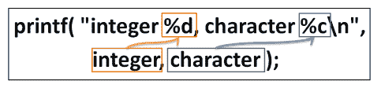

您必须使用正确的格式代码才能使输出正确格式化；请看下表：

| 数据类型 | 格式代码 |
| --- | --- |
| `Int` | `%d` |
| `Char` | `%c` |
| `String` | `%s` |

要打印 C++字符串，您必须使用`string.c_str()`函数：

```cpp
string s = "Hello"; printf( "string %s\n", s.c_str() ); 
```

`s.c_str()`函数访问字符串的 C 指针，这是`printf`所需要的。

如果您使用错误的格式代码，输出将不会正确显示，或者程序可能会崩溃。

您可能还会发现需要使用这种类型的格式来设置字符串的情况，所以了解这一点是很好的。但是，如果您更喜欢避免记住这些不同的格式代码，只需使用`cout`。它会为您找出类型。只要确保您使用您最终工作的公司所偏好的标准。在大多数编程事情中，这通常是一个好主意。

# 练习

询问用户姓名和年龄，并使用`cin`将它们输入。然后，使用`printf()`在控制台上为他们发出问候（而不是`cout`）。

# 解决方案

程序将如下所示：

```cpp
#include <iostream> 
#include <string> 
using namespace std; 
int main() 
{ 
  cout << "Name?" << endl; 
  string name; 
  cin >> name; 
  cout << "Age?" << endl;  
  int age; 
  cin >> age; 
  //Change to printf:
  cout << "Hello " << name << " I see you have attained " << age  
   << " years. Congratulations." << endl; 
} 
```

字符串实际上是一种对象类型。在内部，它只是一堆字符！

# 命名空间

到目前为止，我们已经在`std`的情况下看到了命名空间，并且大多数情况下通过在文件顶部放置以下内容来避免这个问题：

```cpp
using namespace std;
```

但是，您应该知道这对未来意味着什么。

命名空间是将相关代码分组在一起的方式，它允许您在不同的命名空间中使用相同的变量名称而不会出现任何命名冲突（当然，除非您在顶部为两者都使用了`using namespace`，这就是为什么许多人更喜欢不使用它的原因）。

您可以像这样在 C++文件中创建自己的命名空间：

```cpp
namespace physics {
    float gravity = 9.80665;
    //Add the rest of your your physics related code here...
}
```

一旦您创建了命名空间，您就可以像这样访问该代码：

```cpp
float g = physics::gravity;
```

或者，您可以在顶部放入一个使用语句（只要确保该名称没有用于其他用途）。但是，一般来说，您不希望在更复杂的程序中使用这个，因为命名空间允许您在不同的命名空间中重用相同的变量名称，因此如果您将其与一个包含当前命名空间中具有相同名称的变量的命名空间一起使用，并尝试访问它，编译器将不知道您指的是哪一个，这将导致冲突。

# 总结

在本章中，我们讨论了变量和内存。我们谈到了关于变量的数学运算，以及它们在 C++中是多么简单。

我们还讨论了如何使用这些更简单的数据类型（如浮点数、整数和字符）的组合来构建任意复杂的数据类型。这样的构造被称为对象。在下一章中，我们将开始讨论我们可以用这些对象做什么！
