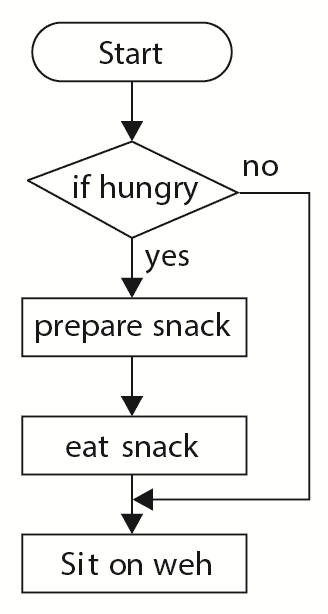
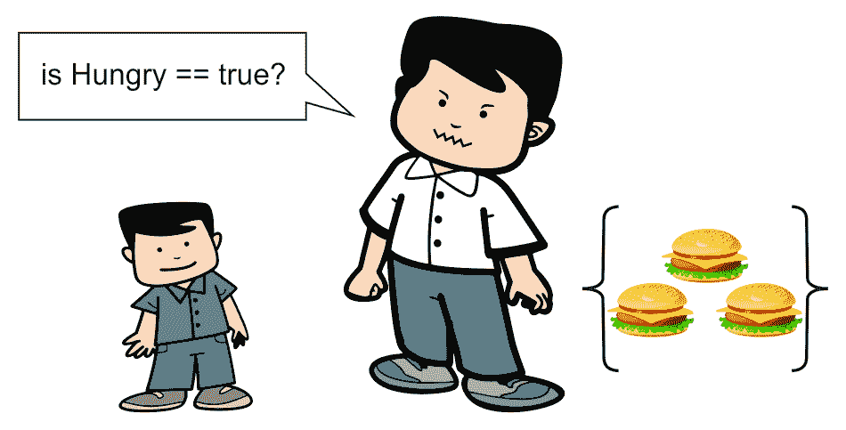
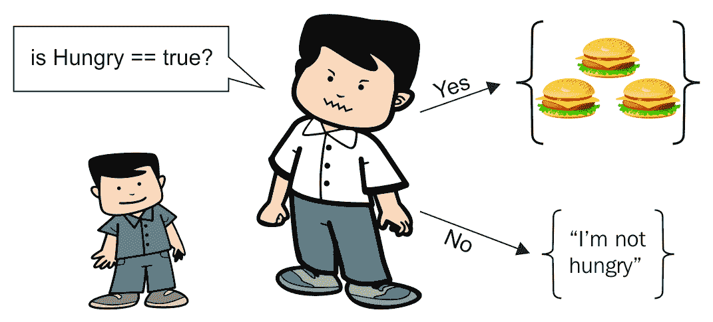
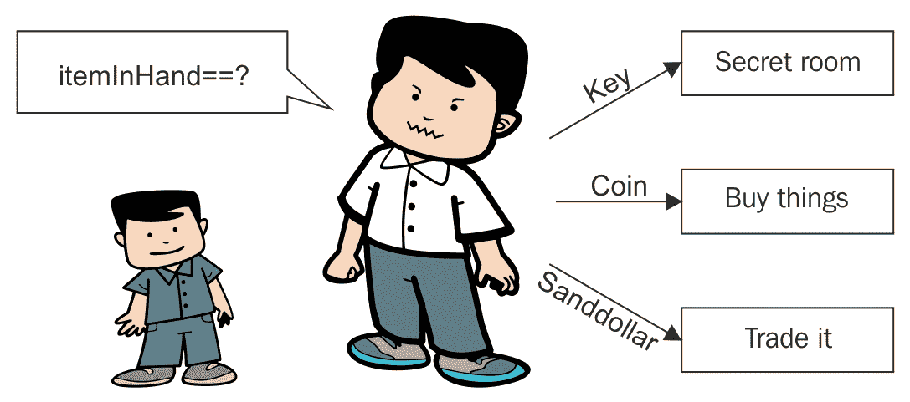
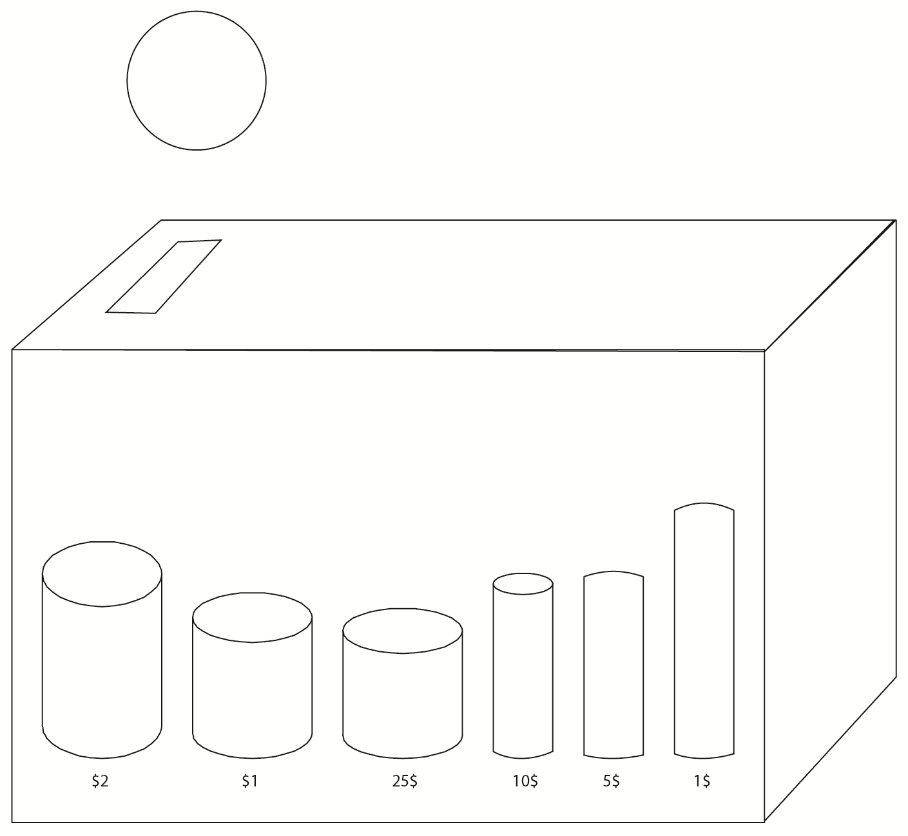
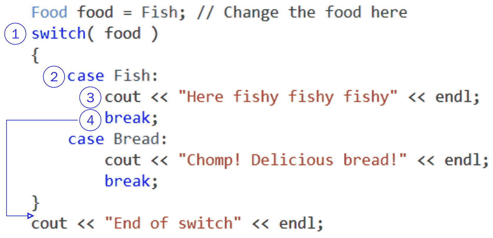
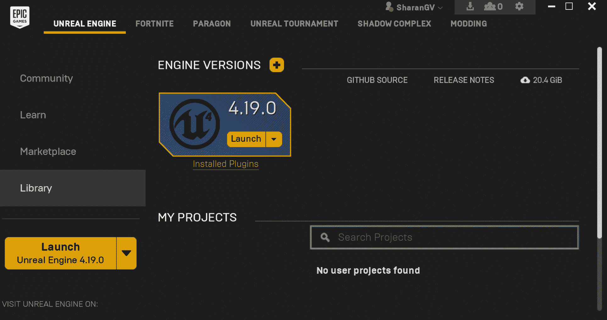
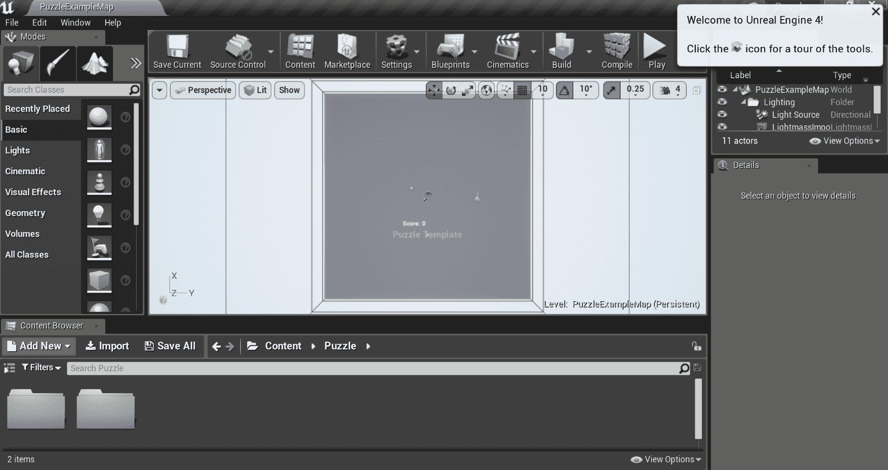
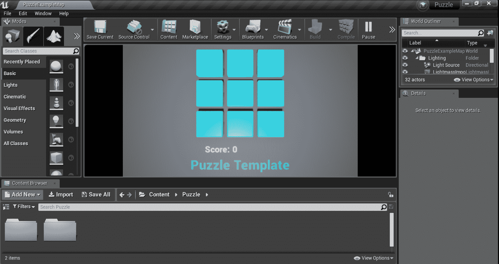

# If，Else 和 Switch

在上一章中，我们讨论了内存的重要性以及如何将数据存储在计算机内部。我们谈到了如何使用变量为程序保留内存，并且我们可以在变量中包含不同类型的信息。

在本章中，我们将讨论如何控制程序的流程以及如何通过控制流语句分支代码。在这里，我们将讨论不同类型的控制流，如下所示：

+   `If`语句

+   如何使用`==`运算符检查事物是否相等

+   `else`语句

+   如何测试不等式（即，如何使用`>`,`>=`,`<`,`<=`和`!=`运算符检查一个数字是否大于或小于另一个数字）

+   使用逻辑运算符（如非（`!`），和（`&&`），或（`||`））

+   分支超过两种方式：

+   `else if`语句

+   `switch`语句

+   我们的第一个虚幻引擎示例项目

# 分支

我们在第二章中编写的计算机代码只有一个方向：向下。有时，我们可能希望能够跳过代码的某些部分。我们可能希望代码能够分支到多个方向。从图表上看，我们可以这样表示：



换句话说，我们希望在特定条件下有选择地不运行某些代码行。上面的图表称为流程图。根据这个流程图，只有当我们饿了，我们才会准备三明治，吃完后就去休息。如果我们不饿，那么就不需要做三明治，我们会直接休息。

在本书中，我们有时会使用流程图，但在 UE4 中，您甚至可以使用流程图来编写游戏（使用称为蓝图的东西）。

这本书是关于 C++代码的，因此在本书中，我们将始终将我们的流程图转换为实际的 C++代码。

# 控制程序的流程

最终，我们希望代码在特定条件下以一种方式分支。更改下一行执行的代码的代码命令称为控制流语句。最基本的控制流语句是`if`语句。为了能够编写`if`语句，我们首先需要一种检查变量值的方法。

因此，首先让我们介绍`==`符号，用于检查变量的值。

# ==运算符

为了在 C++中检查两个事物是否相等，我们需要使用两个等号（`==`）而不是一个，如下所示：

```cpp
int x = 5; // as you know, we use one equals sign  
int y = 4; // for assignment.. 
// but we need to use two equals signs  
// to check if variables are equal to each other 
cout << "Is x equal to y? C++ says: " << (x == y) << endl; 
```

如果运行上述代码，您会注意到输出如下：

```cpp
Is x equal to y? C++ says: 0  
```

在 C++中，`1`表示`true`，`0`表示`false`。如果您希望在`1`和`0`之外显示`true`或`false`，可以在`cout`代码行中使用`boolalpha`流操纵器，如下所示：

```cpp
cout << "Is x equal to y? C++ says: " << boolalpha <<  
        (x == y) << endl; 
```

`==`运算符是一种比较运算符。C++使用`==`来检查相等性的原因是，我们已经使用了`=`符号作为赋值运算符！（请参阅第二章中的*关于变量的更多信息*部分）。如果使用单个`=`符号，C++将假定我们要用`y`覆盖`x`，而不是比较它们。

# 编写 if 语句

现在我们掌握了双等号，让我们编写流程图。上述流程图的代码如下：

```cpp
bool isHungry = true;  // can set this to false if not 
                       // hungry! 
if( isHungry == true ) // only go inside { when isHungry is true 
{ 
  cout << "Preparing snack.." << endl; 
  cout << "Eating .. " << endl; 
} 
cout << "Sitting on the couch.." << endl; 
```

这是我们第一次使用`bool`变量！`bool`变量可以保存值`true`或值`false`。

首先，我们从一个名为`isHungry`的`bool`变量开始，然后将其设置为`true`。

然后，我们使用`if`语句，如下所示：

```cpp
if( isHungry == true )
```

`if`语句就像是守卫下面的代码块（记住，代码块是在`{`和`}`中的一组代码）：



只有当`isHungry==true`时，您才能阅读`{`和`}`之间的代码。

只有当`isHungry==true`时，您才能访问大括号内的代码。否则，您将被拒绝访问并被迫跳过整个代码块。

基本上，任何可以作为布尔值进行评估的东西都可以放在`if（boolean）`中。因此，我们可以通过简单地编写以下代码行来实现相同的效果：

`if（isHungry）//只有在 isHungry 为 true 时才会到这里`这可以用作以下内容的替代：

`if（isHungry==true）`

人们可能使用`if（isHungry）`形式的原因是为了避免出错的可能性。意外写成`if（isHungry = true）`会使`isHungry`在每次命中`if`语句时都设置为 true！为了避免这种可能性，我们可以只写`if（isHungry）`。或者，一些（明智的）人使用所谓的 Yoda 条件来检查`if`语句：`if（true == isHungry）`。我们以这种方式编写`if`语句的原因是，如果我们意外地写成`if（true = isHungry）`，这将生成编译器错误，捕捉错误。

尝试运行此代码段以查看我的意思：

```cpp
int x = 4, y = 5; 
cout << "Is x equal to y? C++ says: " << (x = y) << endl; //bad! 
// above line overwrote value in x with what was in y, 
// since the above line contains the assignment x = y 
// we should have used (x == y) instead. 
cout << "x = " << x << ", y = " << y << endl; 
```

以下行显示了前面代码的输出：

```cpp
Is x equal to y? C++ says: 5 
x = 5, y = 5 
```

具有`(x = y)`的代码行会覆盖`x`的先前值（为 4）并用`y`的值（为 5）进行赋值。尽管我们试图检查`x`是否等于`y`，但在先前的语句中发生的是`x`被赋予了`y`的值。

# 编写 else 语句

`else`语句用于在`if`部分的代码未运行时执行我们的代码。

例如，假设我们还有其他事情要做，以防我们不饿，如下面的代码片段所示：

```cpp
bool isHungry = true; 
if( isHungry )      // notice == true is implied! 
{ 
  cout << "Preparing snack.." << endl; 
  cout << "Eating .. " << endl; 
} 
else                // we go here if isHungry is FALSE 
{ 
  cout << "I'm not hungry" << endl; 
} 
cout << "Sitting on the couch.." << endl; 
```

有几件重要的事情您需要记住关于`else`关键字，如下所示：

+   `else`语句必须紧随`if`语句之后。在`if`块结束和相应的`else`块之间不能有任何额外的代码行。

+   程序永远不会同时执行`if`和相应的`else`块。它总是一个或另一个：



如果 `isHungry` 不等于 true，则`else`语句是您将要执行的方式。

您可以将`if`/`else`语句视为将人们引导到左侧或右侧的守卫。每个人都会朝着食物走（当`isHungry==true`时），或者他们会远离食物（当`isHungry==false`时）。

# 使用其他比较运算符（>，>=，<，<=和!=）进行不等式测试

C++中可以很容易地进行其他逻辑比较。 `>` 和 `<` 符号的意思与数学中一样。它们分别表示大于（`>`）和小于（`<`）。`>=` 在数学中与 `≥` 符号具有相同的含义。`<=` 是 C++中 `≤` 的代码。由于键盘上没有 `≤` 符号，我们必须在 C++中使用两个字符来编写它。`!=` 是 C++中表示“不等于”的方式。因此，例如，假设我们有以下代码行：

```cpp
int x = 9; 
int y = 7; 
```

我们可以询问计算机是否 `x > y` 或 `x < y`，如下所示：

```cpp
cout << "Is x greater than y? " << (x > y) << endl; 
cout << "Is x greater than OR EQUAL to y? " << (x >= y) << endl; 
cout << "Is x less than y? " << (x < y) << endl; 
cout << "Is x less than OR EQUAL to y? " << (x <= y) << endl; 
cout << "Is x not equal to y? " << (x != y) << endl; 
```

我们需要在比较`x`和`y`时加上括号，因为有一个称为运算符优先级的东西。如果没有括号，C++将在`<<`和`<`运算符之间感到困惑。这很奇怪，您稍后会更好地理解这一点，但您需要 C++在输出结果（<<）之前评估`(x < y)`比较。有一个很好的可供参考的表格，网址为[`en.cppreference.com/w/cpp/language/operator_precedence`](http://en.cppreference.com/w/cpp/language/operator_precedence)。

# 使用逻辑运算符

逻辑运算符允许您进行更复杂的检查，而不仅仅是检查简单的相等或不相等。例如，要获得进入特殊房间的条件需要玩家同时拥有红色和绿色钥匙卡。我们想要检查两个条件是否同时成立。为了进行这种复杂的逻辑语句检查，我们需要学习三个额外的构造：非(`!`)、和(`&&`)和或(`||`)运算符。

# 非(!)运算符

`!`运算符很方便，可以颠倒`boolean`变量的值。以以下代码为例：

```cpp
bool wearingSocks = true; 
if( !wearingSocks ) // same as if( false == wearingSocks ) 
{
         cout << "Get some socks on!" << endl;
 } 
else 
{ 
        cout << "You already have socks" << endl; 
} 
```

这里的`if`语句检查您是否穿袜子。然后，您会收到一个命令来穿上一些袜子。`!`运算符将`boolean`变量中的值取反。

我们使用一个称为真值表的东西来显示在`boolean`变量上使用`!`运算符的所有可能结果，如下所示：

| `wearingSocks` | `!wearingSocks` |
| --- | --- |
| `true` | `false` |
| `false` | `true` |

因此，当`wearingSocks`的值为`true`时，`!wearingSocks`的值为`false`，反之亦然。

# 练习

1.  当`wearingSocks`的值为`true`时，您认为`!!wearingSocks`的值将是多少？

1.  在运行以下代码后，`isVisible`的值是多少？

```cpp
bool hidden = true; 
bool isVisible = !hidden; 
```

# 解决方案

1.  如果`wearingSocks`是`true`，那么`!wearingSocks`就是`false`。因此，`!!wearingSocks`再次变为`true`。这就像在说“我不饿”。双重否定，所以这句话意味着我实际上是饿了。

1.  第二个问题的答案是`false`。`hidden`的值是`true`，所以`!hidden`是`false`。然后`false`的值被保存到`isVisible`变量中。但`hidden`本身的值仍然是`true`。

`!`运算符有时在口语中被称为感叹号。前面的双重感叹号操作(`!!`)是双重否定和双重逻辑反转。如果您对`bool`变量进行双重否定，那么变量不会有任何变化。

当然，您可以在`int`上使用这些，如果`int`设置为零，`! int`将是`true`，如果大于零，`! int`将是`false`。因此，如果您对该`int`变量进行双重否定，且`int`值大于零，则它将简化为`true`。如果`int`值已经是 0，则它将简化为`false`。

# 和(&&)运算符

假设我们只想在两个条件都为`true`时运行代码的一部分。例如，只有在我们穿袜子和衣服时才算穿好衣服。您可以使用以下代码来检查：

```cpp
bool wearingSocks = true; 
bool wearingClothes = false; 
if( wearingSocks && wearingClothes )// && requires BOTH to be true 
{ 
        cout << "You are dressed!" << endl; 
} 
else 
{ 
        cout << "You are not dressed yet" << endl; 
} 
```

# 或(||)运算符

有时我们希望在变量中的任一个为`true`时运行代码的一部分。

例如，假设玩家在关卡中找到特殊星星或完成关卡所需的时间少于 60 秒时，可以获得特定的奖励。在这种情况下，您可以使用以下代码：

```cpp
bool foundStar = false; 
float levelCompleteTime = 25.f; 
float maxTimeForBonus = 60.f; 
// || requires EITHER to be true to get in the { below 
if( foundStar || (levelCompleteTime < maxTimeForBonus) ) 
{ 
        cout << "Bonus awarded!" << endl; 
} 
else 
{ 
        cout << "No bonus." << endl; 
} 
```

您可能会注意到我在`levelCompleteTime < maxTimeForBonus`周围添加了括号。尽管优先级规则可能让您在没有它们的情况下添加更长的语句，但我发现如果有任何疑问，最好还是添加它们。小心总比后悔好（对于稍后查看的其他人来说可能更清晰）。

# 练习

到目前为止，您应该已经注意到提高编程能力的最佳方法是通过实践。您必须经常练习编程才能显著提高。

创建两个整数变量，称为`x`和`y`，并从用户那里读取它们。编写一个`if`/`else`语句对，打印出值较大的变量的名称。

# 解决方案

上一个练习的解决方案如下所示：

```cpp
int x, y; 
cout << "Enter two numbers (integers), separated by a space " << endl; 
cin >> x >> y; 
if( x < y )  
{ 
  cout << "x is less than y" << endl; 
} 
else 
{ 
  cout << "x is greater than y" << endl; 
} 
```

当`cin`期望一个数字时不要输入字母。如果发生这种情况，`cin`可能会失败，并给您的变量一个错误的值。

# 以两种以上的方式分支代码

在以前的章节中，我们只能使代码在两种方式中的一种分支。在伪代码中，我们有以下代码：

```cpp
if( some condition is true ) 
{ 
  execute this; 
} 
else // otherwise 
{ 
  execute that; 
} 
```

伪代码是*假代码*。编写伪代码是一种很好的头脑风暴和计划代码的方法，特别是如果你还不太习惯 C++的话。

这段代码有点像是在一个象征性的岔路口，只有两个方向可选。

有时，我们可能希望代码分支不仅仅有两个方向。我们可能希望代码以三种方式或更多方式分支。例如，假设代码的走向取决于玩家当前持有的物品。玩家可以持有三种不同的物品：硬币、钥匙或沙元。C++允许这样做！事实上，在 C++中，你可以按照任意你希望的方向进行分支。

# `else if`语句

`else if`语句是一种编写超过两个可能分支方向的方法。在下面的代码示例中，代码将根据玩家持有的`Coin`、`Key`或`Sanddollar`对象的不同方式进行运行：

```cpp
#include <iostream> 
using namespace std; 
int main() 
{ 
  enum Item  // This is how enums come in handy!
  { 
    Coin, Key, Sanddollar // variables of type Item can have  
    // any one of these 3 values 
  };
  Item itemInHand = Key;  // Try changing this value to Coin,  
                          // Sanddollar 
  if( itemInHand == Key ) 
  { 
    cout << "The key has a lionshead on the handle." << endl; 
    cout << "You got into a secret room using the Key!" << endl; 
  } 
  else if( itemInHand == Coin ) 
  { 
    cout << "The coin is a rusted brassy color. It has a picture  
     of a lady with a skirt." << endl; 
    cout << "Using this coin you could buy a few things" << endl; 
  } 
  else if( itemInHand == Sanddollar ) 
  { 
    cout << "The sanddollar has a little star on it." << endl; 
    cout << "You might be able to trade it for something." <<  
     endl; 
  } 
  return 0;  
} 
```

请注意，前面的代码只会按三种不同的方式之一进行！在`if`、`else`和`else if`系列检查中，我们只会进入一个代码块。



# 练习

使用 C++程序回答代码后面的问题。一定要尝试这些练习，以便熟练掌握这些相等运算符：

```cpp
#include <iostream> 
using namespace std; 
int main() 
{ 
  int x; 
  int y; 
  cout << "Enter an integer value for x:" << endl; 
  cin >> x; // This will read in a value from the console 
  // The read in value will be stored in the integer  
  // variable x, so the typed value better be an integer! 
  cout << "Enter an integer value for y:" << endl; 
  cin >> y; 
  cout << "x = " << x << ", y = " << y << endl; 
  // *** Write new lines of code here 
} 
```

在标有(`// *** Write new...`)的位置写一些新的代码行：

1.  检查`x`和`y`是否相等。如果它们相等，打印`x and y are equal`。否则，打印`x and y are not equal`。

1.  一个关于不等式的练习：检查`x`是否大于`y`。如果是，打印`x is greater than y`。否则，打印`y is greater than x`。

# 解决方案

要评估相等性，请插入以下代码：

```cpp
if( x == y ) 
{ 
  cout << "x and y are equal" << endl; 
} 
else 
{ 
  cout << "x and y are not equal" << endl; 
} 
```

要检查哪个值更大，请插入以下代码：

```cpp
if( x > y ) 
{ 
  cout << "x is greater than y" << endl; 
} 
else if( x < y ) 
{ 
  cout << "y is greater than x" << endl; 
} 
else // in this case neither x > y nor y > x 
{ 
  cout << "x and y are equal" << endl; 
} 
```

# `switch`语句

`switch`语句允许你的代码以多种方式分支。`switch`语句将查看变量的值，并根据其值，代码将走向不同的方向。

我们还会在这里看到`enum`构造：

```cpp
#include <iostream> 
using namespace std; 
enum Food  // enums are very useful with switch! 
{ 
  // a variable of type Food can have any of these values 
  Fish, 
  Bread, 
  Apple, 
  Orange 
}; 
int main() 
{ 
  Food food = Bread; // Change the food here 
  switch( food ) 
  { 
    case Fish: 
      cout << "Here fishy fishy fishy" << endl; 
      break; 
    case Bread: 
      cout << "Chomp! Delicious bread!" << endl; 
      break; 
    case Apple: 
      cout << "Mm fruits are good for you" << endl; 
      break; 
    case Orange: 
      cout << "Orange you glad I didn't say banana" << endl; 
      break; 
    default:  // This is where you go in case none 
              // of the cases above caught 
      cout << "Invalid food" << endl; 
      break; 
  } 
  return 0; 
} 
```

`switch`就像硬币分类器。当你把 25 美分硬币放入硬币分类器时，它会自动进入 25 美分硬币堆。同样，`switch`语句将允许代码跳转到适当的部分。硬币分类的示例显示在下图中：



`switch`语句内的代码将继续运行（逐行），直到遇到`break;`语句。`break`语句会跳出`switch`语句。如果省略`break;`语句，它将继续运行下一个 case 语句内的代码，并且直到遇到`break;`或者`switch`结束才会停止。如果你想尝试，可以尝试去掉所有的`break;`语句，看看会发生什么！看一下下面的图表，了解`switch`的工作原理：



1.  首先检查`Food`变量。它有什么值？在这种情况下，它里面有`Fish`。

1.  `switch`命令跳转到正确的 case 标签。（如果没有匹配的 case 标签，`switch`将被跳过）。

1.  `cout`语句被执行，控制台上出现`Here fishy fishy fishy`。

1.  检查变量并打印用户响应后，`break`语句被执行。这使我们停止运行`switch`中的代码行，并退出`switch`。接下来要运行的代码行就是如果`switch`根本不存在的话，否则将是程序中的下一行代码（在`switch`语句的结束大括号之后）。是`return 0`退出程序。

# `switch`语句与`if`语句

开关类似于之前的`if` / `else if` / `else`链。但是，开关可以比`if` / `else if` / `else if` / `else`链更快地生成代码。直观地说，开关只会跳转到适当的代码部分以执行。`if` / `else if` / `else`链可能涉及更复杂的比较（包括逻辑比较），这可能需要更多的 CPU 时间。您将使用`if`语句的主要原因是，如果您要检查的内容比仅比较特定值集合中的内容更复杂。

`enum`的一个实例实际上是一个`int`。要验证这一点，请打印以下代码：

`cout << "Fish=" << Fish <<

" Bread=" << Bread <<

" Apple=" << Apple <<`

` "Orange=" << Orange << endl;`

您将看到`enum`的整数值-只是让您知道。

有时，程序员希望在相同的开关`case`标签下分组多个值。假设我们有一个如下所示的`enum`对象：

```cpp
enum Vegetables { Potato, Cabbage, Broccoli, Zucchini }; 
```

程序员希望将所有绿色物品分组在一起，因此他们编写了一个如下所示的`switch`语句：

```cpp
Vegetable veg = Zucchini;

switch( veg ) 
{ 
case Zucchini:             // zucchini falls through because no break 
case Broccoli:             // was written here 
  cout << "Greens!" << endl; 
  break; 
default: 
  cout << "Not greens!" << endl; 
  break; 
} 
```

在这种情况下，`Zucchini`会掉下来并执行与`Broccoli`相同的代码。

非绿色蔬菜位于`default` case 标签中。为了防止穿透，您必须记住在每个`case`标签后插入显式的`break`语句。

我们可以编写另一个版本的相同开关，它不会让 Zucchini 掉下来，而是在开关中明确使用`break`关键字：

```cpp
switch( veg ) 
{ 
case Zucchini:              // zucchini no longer falls due to break 
  cout << "Zucchini is a green" << endl; 
  break;// stops case zucchini from falling through 
case Broccoli:               // was written here 
  cout << "Broccoli is a green" << endl; 
  break; 
default: 
  cout << "Not greens!" << endl; 
  break; 
} 
```

请注意，即使它是最后一个列出的情况，`break` `default` case 也是良好的编程实践。

# 练习

完成以下程序，其中有一个`enum`对象，其中有一系列可供选择的坐骑。编写一个`switch`语句，为所选的坐骑打印以下消息：

| `Horse` | 这匹骏马是勇敢而强大的。 |
| --- | --- |
| `Mare` | 这匹母马是白色和美丽的。 |
| `Mule` | 你被给了一匹骡子骑。你对此感到愤慨。 |
| `Sheep` | 咩！这只羊几乎无法支撑您的重量。 |
| `Chocobo` | Chocobo! |  |

请记住，`enum`对象实际上是一个`int`语句。`enum`对象中的第一个条目默认为`0`，但您可以使用`=`运算符为`enum`对象指定任何起始值。`enum`对象中的后续值是按顺序排列的`ints`。

# 解决方案

上一个练习的解决方案显示在以下代码中：

```cpp
#include <iostream> 
using namespace std; 
enum Mount 
{ 
  Horse=1, Mare, Mule, Sheep, Chocobo 
  // Since Horse=1, Mare=2, Mule=3, Sheep=4, and Chocobo=5\. 
}; 
int main() 
{ 
  int mount;  // We'll use an int variable for mount 
              // so cin works 
  cout << "Choose your mount:" << endl; 
  cout << Horse << " Horse" << endl; 
  cout << Mare << " Mare" << endl; 
  cout << Mule << " Mule" << endl; 
  cout << Sheep << " Sheep" << endl; 
  cout << Chocobo << " Chocobo" << endl; 
  cout << "Enter a number from 1 to 5 to choose a mount" << endl; 
  cin >> mount; 
    // Describe what happens 
    // when you mount each animal in the switch below 
  switch( mount ) 
  { 
    default: 
      cout << "Invalid mount" << endl; 
      break; 
  } 
return 0; 
} 
```

# 位移的枚举

在`enum`对象中常见的做法是为每个条目分配一个位移值：

```cpp
enum   WindowProperties   
{   
    Bordered    = 1 << 0, // binary 001   
    Transparent = 1 << 1, // binary 010   
    Modal       = 1 << 2  // binary 100   
};   
```

位移值应该能够组合窗口属性。分配将如下所示：

```cpp
//   bitwise OR combines properties   
WindowProperties   wp = Bordered | Modal;   
```

检查已设置哪些`WindowProperties`涉及使用`按位 AND`进行检查：

```cpp
//   bitwise AND checks to see if wp is Modal   
if( wp   & Modal )   
{   
    cout << "You are looking at a modal window" << endl;
}   
```

位移是一种略微超出本书范围的技术，但我包含了这个提示，只是让您知道它。

# 我们在虚幻引擎中的第一个示例

我们需要开始使用虚幻引擎。

警告：当您打开第一个虚幻项目时，您会发现代码看起来非常复杂。不要灰心。只需专注于突出显示的部分。在您作为程序员的职业生涯中，您经常需要处理包含您不理解的部分的非常庞大的代码库。然而，专注于您理解的部分将使本节变得富有成效。

首先，您需要下载启动器以安装引擎。转到[`www.unrealengine.com/en-US/what-is-unreal-engine-4`](https://www.unrealengine.com/en-US/what-is-unreal-engine-4)，当您单击立即开始或下载时，您必须在下载启动器之前创建一个免费帐户。

下载启动器后，打开 Epic Games Launcher 应用程序。选择启动虚幻引擎 4.20.X（到您阅读此内容时可能会有新版本），如下截图所示：



如果您没有安装引擎，您需要转到虚幻引擎选项卡并下载一个引擎（~7 GB）。

一旦引擎启动（可能需要几秒钟），你将进入虚幻项目浏览器屏幕，就像下面的截图中所示的那样：


现在，在 UE4 项目浏览器中选择“新项目”标签页。选择 C++标签页并选择 Puzzle 项目。这是一个比较简单的项目，代码不是太多，所以很适合入门。我们稍后会转到 3D 项目。

在这个屏幕上有几件事情要注意：

+   确保你在“新项目”标签页中。

+   当你点击 Puzzle 时，确保它是 C++标签页上的一个，而不是蓝图标签页上的一个。

+   在“名称”框中输入项目名称`Puzzle`（这对我稍后给你的示例代码很重要）。

+   如果你想更改存储文件夹（比如更改到另一个驱动器），点击文件夹旁边的...按钮，这样浏览窗口就会出现。然后，找到你想要存储项目的目录。

完成所有这些后，选择创建项目。

注意：如果它告诉你无法创建项目，因为你没有安装 Windows 8.1 SDK，你可以从[`developer.microsoft.com/en-us/windows/downloads/sdk-archive`](https://developer.microsoft.com/en-us/windows/downloads/sdk-archive)下载它。

Visual Studio 2017 将打开你的项目代码，以及虚幻编辑器，就像下面的截图中所示的那样：



看起来复杂吗？哦，天哪，它确实复杂！我们稍后会探索一些工具栏中的功能。现在，只需选择播放，就像前面的截图中所示的那样。

这将启动游戏。它应该是这个样子的：



现在，尝试点击方块。一旦你点击一个方块，它就会变成橙色，这会增加你的分数。你可以通过点击“停止”或在键盘上按*Esc*来结束你的游戏会话。

我们要做的是找到这个部分并稍微改变一下行为。

找到并打开`PuzzleBlock.cpp`文件。在 C++类|拼图下找到 PuzzleBlock，双击它以在 IDE 中打开它。

在 Visual Studio 中，项目中的文件列表位于“解决方案资源管理器”中。如果你的“解决方案资源管理器”被隐藏了，只需点击顶部菜单中的“查看/解决方案资源管理器”。

在这个文件中，向下滚动到底部，你会找到一个以以下单词开头的部分：

```cpp
void APuzzleBlock::BlockClicked(UPrimitiveComponent* ClickedComp, FKey ButtonClicked)
```

`APuzzleBlock`是类名（我们稍后会介绍类），`BlockClicked`是函数名。每当一个拼图块被点击时，从起始`{`到结束`}`的代码部分就会运行。希望这发生的方式稍后会更有意义。

这在某种程度上有点像`if`语句。如果点击了一个拼图块，那么这组代码就会为该拼图块运行。

我们将逐步介绍如何使方块在被点击时翻转颜色（因此，第二次点击将把方块的颜色从橙色改回蓝色）。

以最大的小心进行以下步骤：

1.  打开`PuzzleBlock.h`文件。在包含以下代码的行之后：

```cpp
/** Pointer to blue material used on inactive blocks */
  UPROPERTY()
  class UMaterialInstance* BlueMaterial;

  /** Pointer to orange material used on active blocks */
  UPROPERTY()
  class UMaterialInstance* OrangeMaterial;
```

1.  现在，打开`PuzzleBlock.cpp`文件。查找以下代码：

```cpp
BlueMaterial = ConstructorStatics.BlueMaterial.Get();
OrangeMaterial = ConstructorStatics.OrangeMaterial.Get()
```

1.  在`PuzzleBlock.cpp`中，用以下代码替换 void `APuzzleBlock::BlockClicked`代码部分的内容：

```cpp
void APuzzleBlock::BlockClicked(UPrimitiveComponent* ClickedComp, FKey ButtonClicked) 
{ 
  // --REPLACE FROM HERE-- 
  bIsActive = !bIsActive; // flip the value of bIsActive 
  // (if it was true, it becomes false, or vice versa) 
  if ( bIsActive ) 
  { 
    BlockMesh->SetMaterial(0, OrangeMaterial); 
  } 
  else 
  { 
    BlockMesh->SetMaterial(0, BlueMaterial); 
  } 
  // Tell the Grid 
  if(OwningGrid != NULL) 
  { 
    OwningGrid->AddScore(); 
  } 
  // --TO HERE-- 
}
```

只替换`void APuzzleBlock::BlockClicked(UPrimitiveComponent* ClickedComp, FKey ButtonClicked)`语句内部。

不要替换以`void APuzzleBlock::BlockClicked`开头的那一行。你可能会出现错误（如果你没有将项目命名为`Puzzle`）。如果是这样，你可以通过使用正确的名称创建一个新项目来重新开始。

按下播放按钮，看看你的更改生效了！所以，让我们分析一下。这是第一行代码：

```cpp
bIsActive = !bIsActive; // flip the value of bIsActive 
```

这行代码只是翻转了`bIsActive`的值。`bIsActive`变量是一个`bool`变量（它在`APuzzleBlock.h`中创建），用于跟踪方块是否处于活动状态并且应该显示为橙色。这就像翻转开关一样。如果`bIsActive`为`true`，`!bIsActive`将为`false`。因此，每当这行代码被执行（通过点击任何方块时会发生），`bIsActive`的值就会被反转（从`true`到`false`或从`false`到`true`）。

让我们考虑下一段代码：

```cpp
if ( bIsActive ) 
  { 
    BlockMesh->SetMaterial(0, OrangeMaterial); 
  } 
  else 
  { 
    BlockMesh->SetMaterial(0, BlueMaterial); 
  } 
```

我们只是改变了方块的颜色。如果`bIsActive`为`true`，那么方块就会变成橙色。否则，方块就会变成蓝色。

# 总结

在本章中，您学会了如何分支代码。分支使代码可以朝不同的方向发展，而不是一直向下执行。

在下一章中，我们将继续讨论一种不同类型的控制流语句，它将允许您返回并重复执行一行代码一定次数。重复执行的代码部分将被称为循环。
