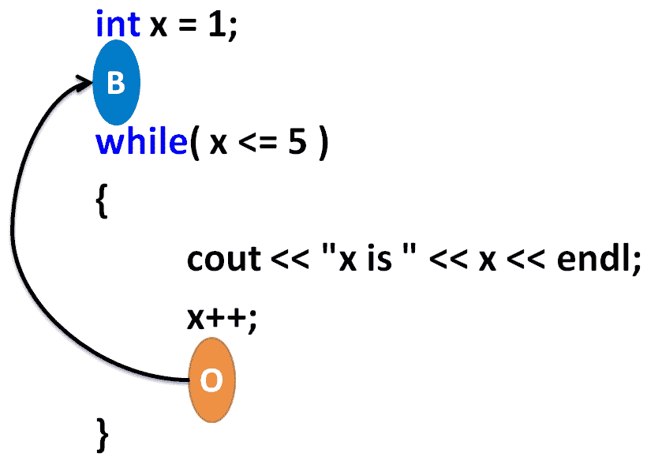
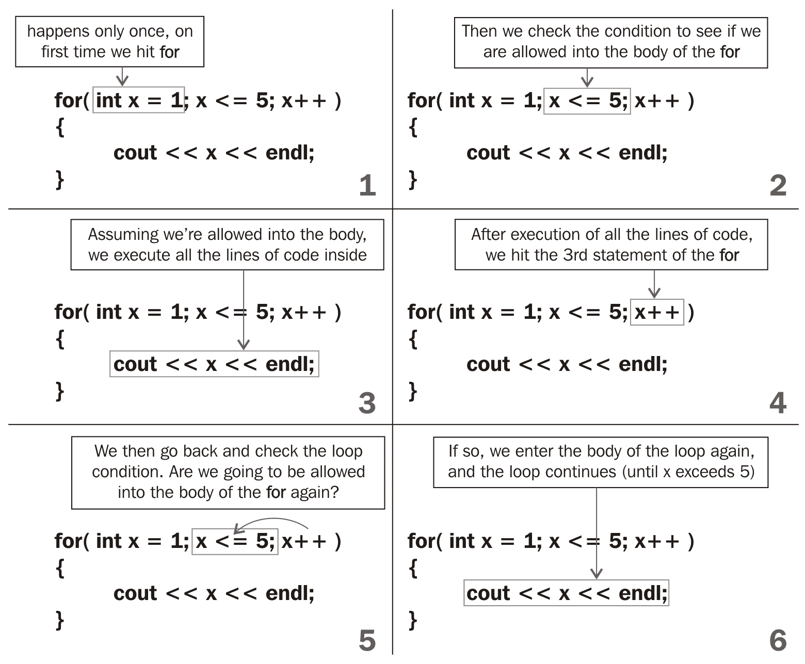
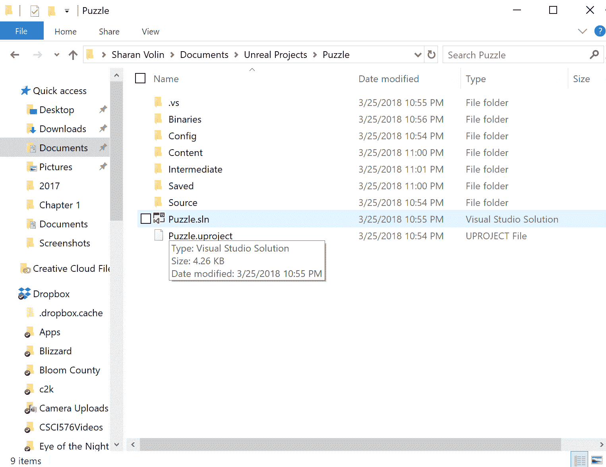
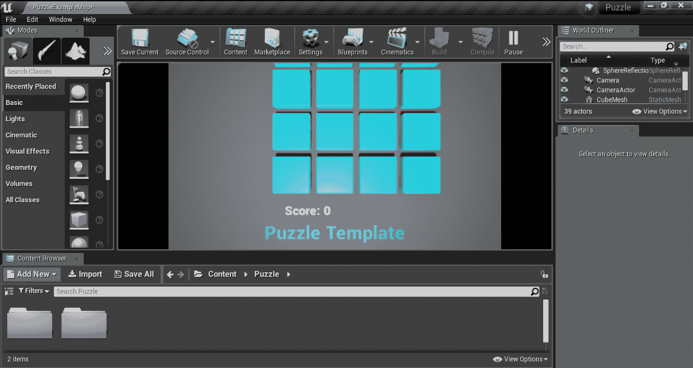

# 循环

在上一章中，我们讨论了`if`语句。`if`语句使您能够对一块代码的执行设置条件。

在本章中，我们将探讨循环，这些是代码结构，使您能够在某些条件下重复执行一块代码。一旦条件变为 false，我们就停止重复执行该代码块。

在本章中，我们将探讨以下主题：

+   while 循环

+   do/while 循环

+   for 循环

+   虚幻引擎中实际循环的简单示例

# while 循环

`while`循环用于重复运行代码的一部分。如果您有一组必须重复执行以实现某个目标的操作，这将非常有用。例如，以下代码中的`while`循环重复打印变量`x`的值，从`1`递增到 5：

```cpp
int x = 1; 
while( x <= 5 ) // may only enter the body of the while when x<=5 
{ 
  cout << "x is " << x << endl; 
  x++; 
} 
cout << "Finished" << endl; 
```

这是上述程序的输出：

```cpp
x is 1 
x is 2 
x is 3 
x is 4 
x is 5 
Finished 
```

在代码的第一行，创建了一个整数变量`x`并将其设置为`1`。然后，我们进入`while`条件。`while`条件表示，只要`x`小于或等于`5`，您必须留在后面的代码块中。

循环的每次迭代（迭代意味着执行`{`和`}`之间的所有内容一次）都会完成一些任务（打印数字`1`到`5`）。我们编程循环在任务完成后自动退出（当`x <= 5`不再为真时）。

与上一章的`if`语句类似，只有在满足`while`循环括号内的条件时（在上面的例子中为`x <= 5`），才允许进入以下块。您可以尝试在以下代码中将`while`循环的位置替换为`if`循环，如下所示：

```cpp
int x = 1; 
if( x <= 5 ) // you may only enter the block below when x<=5 
{ 
  cout << "x is " << x << endl; 
  x = x + 1; 
} 
cout << "End of program" << endl; 
```

上面的代码示例将只打印`x is 1`。因此，`while`循环与`if`语句完全相同，只是它具有自动重复自身直到`while`循环括号内的条件变为 false 的特殊属性。

我想用一个视频游戏来解释`while`循环的重复。如果您不了解 Valve 的*Portal*，您应该玩一下，即使只是为了理解循环。查看[`www.youtube.com/watch?v=TluRVBhmf8w`](https://www.youtube.com/watch?v=TluRVBhmf8w)以获取演示视频。

`while`循环在底部有一种魔法传送门，导致循环重复。以下屏幕截图说明了我的意思：



在 while 循环的末尾有一个传送门，可以将您带回起点

在上面的屏幕截图中，我们从橙色传送门（标记为`O`）回到蓝色传送门（标记为`B`）。这是我们第一次能够返回代码。这就像时间旅行，只不过是针对代码的。多么令人兴奋！

通过`while`循环块的唯一方法是不满足入口条件。在上面的例子中，一旦`x`的值变为 6（因此`x <= 5`变为 false），我们将不再进入`while`循环。由于橙色传送门在循环内部，一旦`x`变为 6，我们就能够退出循环。

# 无限循环

您可能会永远被困在同一个循环中。考虑以下代码块中修改后的程序（您认为输出会是什么？）：

```cpp
int x = 1; 
while( x <= 5 ) // may only enter the body of the while when x<=5 
{ 
  cout << "x is " << x << endl; 
} 
cout << "End of program" << endl; 
```

输出将如下所示：

```cpp
x is 1 
x is 1 
x is 1 
. 
. 
. 
(repeats forever) 
```

循环会永远重复，因为我们删除了改变`x`值的代码行。如果`x`的值保持不变且不允许增加，我们将被困在`while`循环的主体内。这是因为如果`x`在循环主体内部不发生变化，则无法满足循环的退出条件（`x`的值变为 6）。

只需单击窗口上的 x 按钮即可关闭程序。

以下练习将使用前几章中的所有概念，例如`+=`和递减操作。如果您忘记了某些内容，请返回并重新阅读前几节。

# 练习

让我们来看几个练习：

1.  编写一个`while`循环，将打印数字`1`到`10`

1.  编写一个`while`循环，将倒序打印从 10 到 1 的数字

1.  编写一个`while`循环，将打印 2 到 20 的数字，每次增加 2（例如 2、4、6、8）

1.  编写一个`while`循环，将打印数字 1 到 16 及其平方

以下是练习 4 的示例程序输出：

| `1` | `1` |
| --- | --- |
| `2` | `4` |
| `3` | `9` |
| `4` | `16` |
| `5` | `25` |

# 解决方案

前面练习的代码解决方案如下：

1.  `while`循环打印从`1`到`10`的数字的解决方案如下：

```cpp
int x = 1; 
while( x <= 10 ) 
{ 
  cout << x << endl; 
  x++; 
}
```

1.  `while`循环的解决方案，倒序打印从`10`到`1`的数字如下：

```cpp
int x = 10; // start x high 
while( x >= 1 ) // go until x becomes 0 or less 
{ 
  cout << x << endl; 
  x--; // take x down by 1 
} 
```

1.  `while`循环打印从`2`到`20`的数字，每次增加`2`的解决方案如下：

```cpp
int x = 2; 
while( x <= 20 ) 
{ 
  cout << x << endl; 
  x+=2; // increase x by 2's 
} 
```

1.  `while`循环的解决方案，打印从`1`到`16`的数字及其平方如下：

```cpp
int x = 1; 
while( x <= 16 ) 
{ 
  cout << x << "   " << x*x << endl; // print x and it's  
   square 
  x++; 
} 
```

# do/while 循环

`do`/`while`循环与`while`循环几乎相同。以下是一个等效于我们检查的第一个`while`循环的`do`/`while`循环的示例：

```cpp
int x = 1; 
do 
{ 
  cout << "x is " << x << endl; 
  x++; 
} while( x <= 5 ); // may only loop back when x<=5 
cout << "End of program" << endl; 
```

唯一的区别在于，我们在第一次进入循环时不必检查`while`条件。这意味着`do`/`while`循环的体至少会执行一次（而`while`循环如果第一次进入时条件为 false，则可以完全跳过）。

这里有一个例子：

```cpp
int val = 5;
while (val < 5)
{
    cout << "This will not print." << endl;
}
do {
    cout << "This will print once." << endl;
} while (val < 5);
```

# for 循环

`for`循环的解剖略有不同于`while`循环，但两者都非常相似。

让我们比较`for`循环的解剖和等效的`while`循环。以以下代码片段为例：

| `for`循环 | 等效的`while`循环 |
| --- | --- |
| for( int x = 1; x <= 5; x++ ){      cout << x << endl;} | int x = 1;while( x <= 5 ){     cout << x << endl;     x++;} |

`for`循环在其括号内有三个语句。让我们按顺序检查它们。

`for`循环的第一个语句(`int x = 1;`)只在我们第一次进入`for`循环体时执行一次。它通常用于初始化循环的计数变量的值（在本例中是变量`x`）。`for`循环括号内的第二个语句(`x <= 5;`)是循环的重复条件。只要`x <= 5`，我们必须继续留在`for`循环的体内。`for`循环括号内的最后一个语句(`x++;`)在每次完成`for`循环体后执行。

以下一系列图表解释了`for`循环的进展：



# 练习

让我们来看一些练习：

1.  编写一个`for`循环，将收集从`1`到`10`的数字的总和

1.  编写一个`for`循环，将打印`6`到`30`的`6`的倍数（6、12、18、24 和 30）

1.  编写一个`for`循环，将以`2`的倍数打印 2 到 100 的数字（例如，2、4、6、8 等）

1.  编写一个`for`循环，将打印数字`1`到`16`及其平方

# 解决方案

以下是前面练习的解决方案：

1.  打印从`1`到`10`的数字的总和的`for`循环的解决方案如下：

```cpp
int sum = 0; 
for( int x = 1; x <= 10; x++ ) 
{ 
  sum += x; 
} 
cout << sum << endl; 
```

1.  打印从`6`到`30`的`6`的倍数的`for`循环的解决方案如下：

```cpp
for( int x = 6; x <= 30; x += 6 ) 
{ 
  cout << x << endl; 
} 
```

1.  打印从`2`到`100`的数字的`2`的倍数的`for`循环的解决方案如下：

```cpp
for( int x = 2; x <= 100; x += 2 ) 
{ 
  cout << x << endl; 
}
```

1.  打印从`1`到`16`的数字及其平方的`for`循环的解决方案如下：

```cpp
for( int x = 1; x <= 16; x++ ) 
{ 
  cout << x << " " << x*x << endl; 
} 
```

# 使用虚幻引擎进行循环

在您的代码编辑器中，从第三章打开您的虚幻`Puzzle`项目，*If, Else, and Switch*。

有几种方法可以打开您的虚幻项目。在 Windows 上，最简单的方法可能是导航到`Unreal Projects`文件夹（默认情况下位于用户的`Documents`文件夹中），然后在 Windows 资源管理器中双击`.sln`文件，如下截图所示：



在 Windows 中，打开`.sln`文件以编辑项目代码。您也可以直接打开 Visual Studio，它会记住您最近使用过的项目，并显示它们，这样您就可以从中点击打开。您还需要从 Epic Games Launcher 中打开 Unreal Editor 中的项目进行测试。

现在，打开`PuzzleBlockGrid.cpp`文件。在这个文件中，向下滚动到以下语句开头的部分：

```cpp
void APuzzleBlockGrid::BeginPlay() 
```

请注意，这里有一个`for`循环来生成最初的九个方块，如下面的代码所示：

```cpp
// Loop to spawn each block 
for( int32 BlockIndex=0; BlockIndex < NumBlocks; BlockIndex++ ) 
{ 
  // ... 
} 
```

由于`NumBlocks`（用于确定何时停止循环）计算为`Size*Size`，我们可以通过改变`Size`变量的值来轻松改变生成的方块数量。转到`PuzzleBlockGrid.cpp`的第 24 行，将`Size`变量的值更改为`4`或`5`。然后，再次运行代码（确保您在 Unreal Editor 中按下编译按钮以使用更新后的代码）。

您应该看到屏幕上的方块数量增加（尽管您可能需要滚动才能看到它们全部），如下截图所示：



将大小设置为`14`会创建更多的方块。

# 摘要

在本章中，您学会了如何通过循环代码来重复执行代码行，从而使您可以多次运行它。这可以用于重复使用相同的代码行以完成任务。想象一下，如果不使用循环，打印从`1`到`10`（或 10,000！）的数字会是什么样子。

在下一章中，我们将探讨函数，这是可重复使用代码的基本单元。
