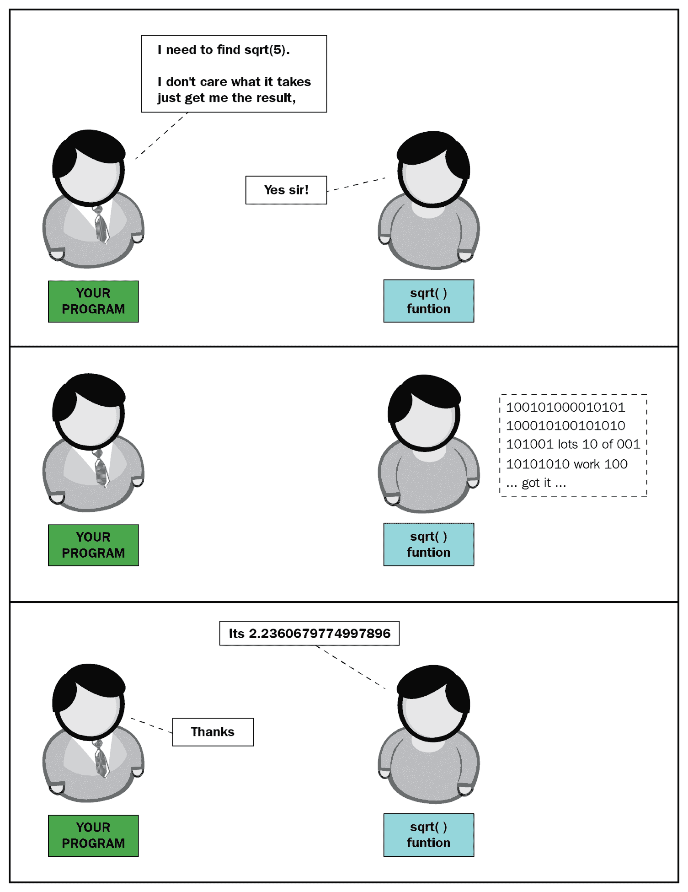
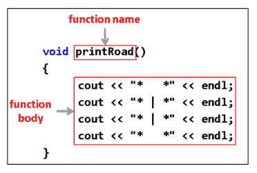
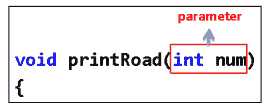
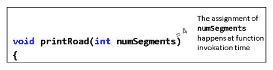
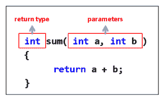
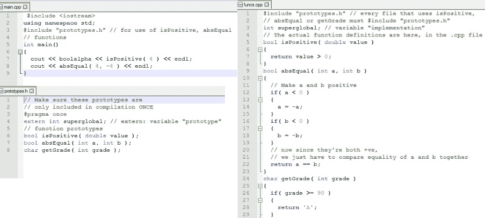

# 第五章：函数和宏

在编写代码时，你会发现自己需要多次运行相同的代码。 你最不想做的事情就是在许多不同的地方复制和粘贴相同的代码（毕竟，如果你需要做出改变会发生什么？）。 只写一次然后多次调用会不会更容易？ 这就是我们在本章中要讨论的内容。 我们将要涵盖的主题包括以下内容：

+   函数

+   带参数的函数

+   返回值的函数

+   初始化列表

+   更多关于变量

+   宏

+   Constexpr

# 函数

有些事情需要重复。 代码不是其中之一。 函数是一束可以被调用任意次数的代码，你希望多频繁就多频繁。

类比是很好的。 让我们探讨一个涉及服务员、厨师、披萨和函数的类比。 在英语中，当我们说一个人有一个功能时，我们的意思是这个人执行一些非常具体（通常非常重要）的任务。 他们可以一遍又一遍地做这个任务，每当他们被要求这样做时。

以下漫画展示了服务员（调用者）和厨师（被调用者）之间的互动。 服务员想要他的桌子上的食物，所以他叫厨师准备等待桌子所需的食物。 厨师准备食物，然后将结果返回给服务员：


在这里，厨师执行他烹饪食物的功能。 厨师接受了关于要烹饪什么类型的食物（三个意大利辣香肠披萨）的参数。 厨师然后离开，做了一些工作，然后带着三个披萨回来。 请注意，服务员不知道也不关心厨师如何烹饪披萨。 厨师为服务员抽象出了烹饪披萨的过程，所以对于服务员来说，烹饪披萨只是一个简单的单行命令。 服务员只是希望他的要求得到满足，并且披萨被送回给他。

当一个函数（厨师）被一些参数（要准备的披萨类型）调用时，函数执行一些操作（准备披萨）并可选地返回一个结果（实际完成的披萨）。

# 库函数的一个例子 - sqrt()

现在，让我们谈谈一个更实际的例子，并将其与披萨的例子联系起来。

在`<cmath>`库中有一个叫做`sqrt()`的函数。 让我快速说明它的用法，如下所示的代码：

```cpp
#include <iostream> 
#include <cmath> 
using namespace std; 
int main() 
{ 
  double rootOf5 = sqrt( 5 ); // function call to the sqrt  
   function 
  cout << rootOf5  << endl; 
} 
```

函数调用在`=`字符之后：`sqrt( 5 )`。 所以，`sqrt()`可以找到任何给定数字的数学平方根。

你知道如何找到一个像 5 这样的难题的平方根吗？ 这并不简单。 一个聪明的灵魂坐下来写了一个可以找到各种类型数字的平方根的函数。 你必须理解如何找到 5 的平方根的数学原理才能使用`sqrt(5)`函数调用吗？ 当然不！ 就像服务员不必理解如何烹饪披萨就能得到披萨一样，C++库函数的调用者不必完全理解库函数的内部工作原理就能有效地使用它。

使用函数的优点如下：

+   函数将复杂的任务抽象成一个简单的可调用例程。 这使得为了*烹饪披萨*所需的代码对于调用者（通常是你的程序）来说只是一个单行命令。

+   函数避免了不必要的代码重复。 假设我们有大约 20 行代码，可以找到一个双精度值的平方根。 我们将这些行代码包装成一个可调用的函数；而不是重复地复制和粘贴这 20 行代码，我们只需在需要根时简单地调用`sqrt`函数（带有要开方的数字）。

以下图表显示了找到平方根的过程：



# 编写我们自己的函数

假设我们想写一些代码，打印出一条道路，如下所示：

```cpp
cout << "*   *" << endl; 
cout << "* | *" << endl; 
cout << "* | *" << endl; 
cout << "*   *" << endl; 
```

现在，假设我们想要连续打印两条道路，或者三条道路。或者说我们想要打印任意数量的道路。我们将不得不重复产生第一条道路的四行代码，以每条道路一次的方式。

如果我们引入自己的 C++命令，允许我们在调用命令时打印一条道路，那将是什么样子：

```cpp
void printRoad() 
{ 
  cout << "*   *" << endl; 
  cout << "* | *" << endl; 
  cout << "* | *" << endl; 
  cout << "*   *" << endl; 
} 
```

这是函数的定义。C++函数具有以下结构：



`void`表示它不返回任何值，并且由于括号内没有任何内容，它不需要任何参数。我们稍后会讨论参数和返回值。使用函数很简单：我们只需通过名称调用要执行的函数，后面跟着两个圆括号`()`。例如，调用`printRoad()`函数将导致`printRoad()`函数运行。让我们跟踪一个示例程序，以充分理解这意味着什么。

# 一个示例程序跟踪

以下是函数调用的完整示例：

```cpp
#include <iostream> 
using namespace std; 
void printRoad() 
{ 
  cout << "*   *" << endl; 
  cout << "* | *" << endl; 
  cout << "* | *" << endl; 
  cout << "*   *" << endl; 
} 
int main() 
{ 
  cout << "Program begin!" << endl; 
  printRoad(); 
  cout << "Program end" << endl; 
  return 0; 
} 
```

让我们从头到尾跟踪程序的执行。请记住，对于所有 C++程序，执行都从`main()`的第一行开始。

`main()`也是一个函数。它监督整个程序的执行。一旦`main()`执行`return`语句，程序就结束了。

以下是对上述程序执行的逐行跟踪：

```cpp
void printRoad() 
{ 
  cout << "*   *" << endl;          // 3: then we jump up here 
  cout << "* | *" << endl;          // 4: run this 
  cout << "* | *" << endl;          // 5: and this 
  cout << "*   *" << endl;          // 6: and this 
} 
int main() 
{ 
  cout << "Program begin!" << endl; // 1: first line to execute 
  printRoad();                      // 2: second line.. 
  cout << "Program end" << endl;    // 7: finally, last line 
  return 0;                         // 8: and return to o/s 
} 
```

这是该程序的输出将是什么样子：

```cpp
Program begin! 
*   * 
* | * 
* | * 
*   * 
Program end 
```

以下是对上述代码的逐行解释：

1.  程序的执行从`main()`的第一行开始，输出`program begin!`。

1.  接下来运行的代码行是对`printRoad()`的调用。这样做的作用是将程序计数器跳转到`printRoad()`的第一行。然后按顺序执行`printRoad()`的所有行（第 3-6 行）。

1.  对`printRoad()`的函数调用完成后，控制权返回到`main()`语句。然后我们看到打印了`Program end`。

不要忘记在对`printRoad()`的函数调用后加上括号。函数调用后必须始终跟着圆括号`()`，否则函数调用将无效，并且会得到编译器错误。

以下代码用于打印四条道路：

```cpp
int main() 
{ 
        printRoad(); 
        printRoad(); 
        printRoad(); 
        printRoad(); 
} 
```

或者，您也可以使用以下代码：

```cpp
for( int i = 0; i < 4; i++ ) 
{
    printRoad();
}
```

因此，不需要每次打印一个方框时重复四行`cout`，我们只需调用`printRoad()`函数进行打印。此外，如果我们想要更改打印道路的外观，只需修改`printRoad()`函数的实现即可。

调用函数意味着逐行运行该函数的整个主体。函数调用完成后，程序的控制权会在函数调用点恢复。

# 练习

作为练习，找出以下代码的问题所在：

```cpp
#include <iostream> 
using namespace std; 
void myFunction() 
{ 
   cout << "You called?" << endl; 
} 
int main() 
{ 
   cout << "I'm going to call myFunction now." << endl; 
   myFunction; 
} 
```

# 解决方案

这个问题的正确答案是，在`main()`的最后一行中对`myFunction`的调用后没有跟着圆括号。所有函数调用后都必须跟着圆括号。`main()`的最后一行应该是`myFunction();`，而不仅仅是`myFunction`。

# 带参数的函数

我们如何扩展`printRoad()`函数以打印具有一定数量段的道路？答案很简单。我们可以让`printRoad()`函数接受一个名为`numSegments`的参数，以打印一定数量的道路段。

以下代码片段显示了它的外观：

```cpp
void printRoad(int numSegments) 
{ 
  // use a for loop to print numSegments road segments 
  for( int i = 0; i < numSegments; i++) 
  { 
    cout << "*   *" << endl; 
    cout << "* | *" << endl; 
    cout << "* | *" << endl; 
    cout << "*   *" << endl; 
  } 
} 
```

以下截图显示了接受参数的函数的解剖结构：



调用这个新版本的`printRoad()`，要求它打印四个段，如下所示：

```cpp
printRoad( 4 );    // function call 
```

在上述语句中，`function call`括号中的值`4`被赋给了`printRoad(int numSegments)`函数的`numSegments`变量。这就是`4`的值如何传递给`numSegments`的方式：



`printRoad(4)`将把值 4 赋给 numSegments 变量的示例

所以，`numSegments`被赋予了调用中括号内传递的值

`printRoad()`。

# 返回值的函数

函数的一个返回值的例子是`sqrt()`函数。`sqrt()`函数接受括号内的单个参数（要开方的数字），并返回该数字的实际平方根。

以下是使用`sqrt`函数的示例：

```cpp
cout << sqrt( 4 ) << endl; 
```

`sqrt()`函数做的事情类似于厨师准备比萨时所做的事情。

作为函数的调用者，你不关心`sqrt()`函数内部发生了什么；那些信息是无关紧要的，因为你只想要传递的数字的平方根的结果。

让我们声明一个简单的返回值函数，如下面的代码所示：

```cpp
int sum(int a, int b) 
{ 
  return a + b; 
} 
```

以下截图显示了带有参数和返回值的函数的解剖结构：



`sum`函数非常基本。它只是取两个`int`数，`a`和`b`，将它们加在一起，并返回一个结果。你可能会说我们甚至不需要一个完整的函数来只是加两个数字。你是对的，但请稍等片刻。我们将使用这个简单的函数来解释返回值的概念。

你将以这种方式使用`sum`函数（从`main()`）：

```cpp
int sum( int a, int b ) 
{ 
  return a + b; 
} 
int main() 
{ 
  cout << "The sum of 5 and 6 is " << sum( 5,6 ) << endl;  
} 
```

为了使`cout`命令完成，必须评估`sum(5,6)`函数调用。在`sum(5,6)`函数调用发生的地方，从`sum(5,6)`返回的值就放在那里。

换句话说，在评估`sum(5,6)`函数调用后，这是`cout`实际看到的代码行：

```cpp
cout << "The sum of 5 and 6 is " << 11 << endl;     
```

从`sum(5,6)`返回的值实际上是在函数调用点剪切和粘贴的。如果函数承诺返回一个值（如果函数的返回类型不是`void`），则必须始终返回一个值。

# 练习

1.  编写一个`isPositive`函数，当传递给它的双精度参数确实为正时返回`true`。

1.  完成以下函数定义：

```cpp
// function returns true when the magnitude of 'a' 
// is equal to the magnitude of 'b' (absolute value) 
bool absEqual(int a, int b)
 { 
    // to complete this exercise, try to not use 
    // cmath library functions 
}
```

1.  编写一个`getGrade()`函数，接受一个整数值（100 分制的分数）并返回等级（`A`、`B`、`C`、`D`或`F`）。

1.  数学函数的形式为`f(x) = 3x + 4`。编写一个返回`f(x)`值的 C++函数。

# 解决方案

1.  `isPositive`函数接受一个双精度参数并返回一个布尔值：

```cpp
bool isPositive( double value ) 
{ 
  return value > 0; 
} 
```

1.  以下是完成的`absEqual`函数：

```cpp
bool absEqual( int a, int b ) 
{ 
  // Make a and b positive 
  if( a < 0 ) 
  {
    a = -a;
  } 
  if( b < 0 ) 
  {
    b = -b; 
  }
  // now since they're both +ve, 
  // we just have to compare equality of a and b together 
  return a == b; 
} 
```

1.  `getGrade()`函数在以下代码中给出：

```cpp
char getGrade( int grade ) 
{ 
  if( grade >= 90 )
  { 
    return 'A'; 
  }
  else if( grade >= 80 ) 
  {
    return 'B'; 
  }
  else if( grade >= 70 ) 
  {
    return 'C'; 
  }
  else if( grade >= 60 ) 
  {
    return 'D'; 
  }
  else 
  {
    return 'F'; 
  }
} 
```

1.  这个程序是一个简单的程序，应该能让你娱乐一下。C++中的函数名实际上来自数学世界，如下面的代码所示：

```cpp
double f( double x ) 
{ 
  return 3*x + 4; 
} 
```

# 初始化列表

有时，你可能不知道要传递给数组多少个项目。C++的新版本添加了一种简单的方法，即初始化列表。这允许你在大括号内传递任意数量的项目，并用逗号分隔，就像这样：

```cpp
{ 1, 2, 3, 4 }
```

为了设置这个，你需要使用`initializer_list`作为类型：

```cpp
#include <initializer_list>
using namespace std;

int sum(initializer_list<int> list) {
    int total = 0;
    for (int e : list) { // Iterate through the list
        total += e;
    }

    return total;
}
```

这是一个模板，我们稍后会详细介绍，但现在你只需要知道放在列表中的对象类型在尖括号内，像这样：`<int>`。这也可以是另一种类型，比如`float`或`char`。

要调用这个函数，你可以像这样传入值：

```cpp
sum({ 1, 2, 3, 4 });
```

对于这种情况，结果将是`10`。

# 变量重温

现在你更深入地了解了 C++编程，重新讨论之前涉及的主题总是很好的。

# 全局变量

现在我们介绍了函数的概念，可以介绍全局变量的概念了。

什么是全局变量？全局变量是程序中所有函数都可以访问的任何变量。我们如何使一个变量可以被程序中所有函数访问？我们只需在代码文件的顶部声明全局变量，通常在`#include`语句之后或附近。

以下是一个带有一些全局变量的示例程序：

```cpp
#include <iostream> 
#include <string> 
using namespace std; 

string g_string;             // global string variable, 
// accessible to all functions within the program 
// (because it is declared before any of the functions 
// below!) 

void addA(){ g_string += "A"; } 
void addB(){ g_string += "B"; } 
void addC(){ g_string += "C"; } 

int main() 
{ 
  addA(); 
  addB(); 
  cout << g_string << endl; 
  addC(); 
  cout << g_string << endl; 
} 
```

在这里，相同的`g_string`全局变量可以被程序中的所有四个函数（`addA()`、`addB()`、`addC()`和`main()`）访问。全局变量在程序运行期间存在。

有时人们喜欢在全局变量前加上`g_`前缀，但在变量名前加上`g_`并不是变量成为全局变量的要求。

# 局部变量

局部变量是在代码块内定义的变量。局部变量在其声明的代码块结束时会超出范围。接下来的部分将举一些例子，*变量的作用域*。

# 变量的作用域

变量的作用域是变量可以使用的代码区域。任何变量的作用域基本上就是它定义的代码块。我们可以使用一个示例来演示变量的作用域，如下面的代码所示：

```cpp
int g_int; // global int, has scope until end of file 
void func( int arg ) 
{ 
  int fx; 
} // </fx> dies, </arg> dies 

int main() 
{ 
  int x = 0; // variable <x> has scope starting here.. 
         // until the end of main() 
  if( x == 0 ) 
  { 
    int y;  // variable <y> has scope starting here, 
            // until closing brace below 
  } // </y> dies 
  if( int x2 = x ) // variable <x2> created and set equal to <x> 
  { 
    // enter here if x2 was nonzero 
  } // </x2> dies 

  for( int c = 0; c < 5; c++ ) // c is created and has 
  { // scope inside the curly braces of the for loop 
    cout << c << endl; 
  } // </c> dies only when we exit the loop 
} // </x> dies 
```

定义变量的作用域的主要因素是代码块。让我们讨论前面代码示例中几个变量的作用域：

+   `g_int`：这是一个全局整数，其范围从声明它的地方一直到代码文件的末尾。也就是说，`g_int`可以在`func()`和`main()`中使用，但不能在其他代码文件中使用。要想在多个代码文件中使用单个全局变量，你需要一个外部变量。

+   `arg`（`func()`的参数）：这可以在`func()`的第一行（在开大括号`{`后）到最后一行（在闭大括号`}`前）使用。

+   `fx`：这可以在`func()`的闭合大括号`}`之前的任何地方使用。

+   `main()`（`main()`内的变量）：可以按照注释中标记的使用。

注意函数参数列表括号内声明的变量只能在该函数声明下面的代码块中使用，例如传递给`func()`的`arg`变量：

```cpp
void func( int arg ) 
{ 
  int fx; 
} // </fx> dies, </arg> dies 
```

`arg`变量将在`func()`函数的闭大括号`}`后消失。这与技术上圆括号在定义`{`块`}`之外的大括号外部是相悖的。

在`for`循环的圆括号内声明的变量也是一样。以以下`for`循环为例：

```cpp
for( int c = 0; c < 5; c++ ) 
{ 
  cout << c << endl; 
} // c dies here 
```

`int c`变量可以在`for`循环声明的圆括号内或在`for`循环声明下面的代码块中使用。`c`变量将在声明它的`for`循环的闭大括号后消失。如果希望`c`变量在`for`循环的大括号外继续存在，需要在`for`循环之前声明`c`变量，如下所示：

```cpp
int c; 
for( c = 0; c < 5; c++ ) 
{ 
  cout << c << endl; 
} // c does not die here 
```

# 静态局部变量

`static`局部变量具有局部作用域，但当退出函数时不会消失，而是记住调用之间的值，如下面的代码所示：

```cpp
void testFunc() 
{ 
  static int runCount = 0; // this only runs ONCE, even on 
  // subsequent calls to testFunc()! 
  cout << "Ran this function " << ++runCount << " times" << endl; 
} // runCount stops being in scope, but does not die here 

int main() 
{ 
  testFunc();  // says 1 time 
  testFunc();  // says 2 times! 
} 
```

在`testFunc()`内使用`static`关键字，`runCount`变量在调用`testFunc()`时记住了它的值。因此，两次分开运行`testFunc()`的输出如下：

```cpp
Ran this function 1 times 
Ran this function 2 times 
```

这是因为静态变量只会创建和初始化一次（在声明它的函数第一次运行时），之后静态变量会保留其旧值。假设我们将`runCount`声明为常规的、局部的、非静态变量：

```cpp
int runCount = 0; // if declared this way, runCount is local 
```

然后，输出将如下所示：

```cpp
Ran this function 1 times 
Ran this function 1 times 
```

在这里，我们看到`testFunc`两次都输出`Ran this function 1 time`。作为局部变量，`runCount`的值在函数调用之间不会保留。

您不应滥用静态局部变量。一般来说，只有在绝对必要时才应使用静态局部变量。

# 常量变量

`const`变量是一个变量，您承诺编译器在第一次初始化后不会更改其值。我们可以简单地声明一个，例如，对于`pi`的值：

```cpp
const double pi = 3.14159; 
```

由于`pi`是一个通用常量（您可以依赖的少数事物之一），因此在初始化后不应该有必要更改`pi`。实际上，编译器应该禁止对`pi`的更改。例如，尝试为`pi`分配一个新值：

```cpp
pi *= 2; 
```

我们将得到以下编译器错误：

```cpp
error C3892: 'pi' : you cannot assign to a variable that is const 
```

这个错误是完全合理的，因为除了初始化之外，我们不应该能够更改`pi`的值——这是一个常量变量。

# 常量和函数

`const`可以以多种方式使用，其中一些涉及函数。有时，您将一个变量传递到函数中，但您不希望函数对该值进行任何更改。您可能会认为，好吧，我可以确保我不改变它，不是吗？在您自己的项目中可能是这样，但如果您在一个有多个程序员的大团队中呢？您可以添加注释，但通常最好确保将参数标记为`const`。为此，您可以编写以下函数：

```cpp
int sum(const int x, const int y)
{
    return x + y;
}
```

现在，如果您尝试更改这些值中的任何一个，将会导致错误。例如，这样不起作用：

```cpp
int sum(const int x, const int y)
{
    x = x + y; //ERROR!
    return x;
}
```

你还可以通过将其更改为以下内容之一来返回一个常量值：

```cpp
const int returnConst()
```

只需确保将函数返回的值保存在一个也标记为`const`的变量中，否则将会出错。

# 函数原型

函数原型是函数的签名，不包括函数体。例如，让我们从以下练习中原型化`isPositive`，`absEqual`和`getGrade`函数：

```cpp
bool isPositive( double value ); 
bool absEqual( int a, int b ); 
char getGrade( int grade ); 
```

请注意，函数原型只是函数需要的返回类型、函数名称和参数列表。函数原型不包含函数体。函数的主体通常放在`.cpp`文件中。

# .h 和.cpp 文件

将函数原型放在`.h`文件中，将函数的主体放在`.cpp`文件中是典型的。这样做的原因是您可以在一堆`.cpp`文件中包含您的`.h`文件，而不会出现多重定义错误。

以下屏幕截图向您展示了`.h`和`.cpp`文件的清晰图像，显示了主代码和函数的`.cpp`文件，以及保存函数原型的`.h`文件：



在这个 Visual C++项目中，我们有三个文件：


# prototypes.h

`prototypes.h`文件包含函数原型。我们稍后将解释`extern`关键字的作用：

```cpp
// Make sure these prototypes are 
// only included in compilation ONCE 
#pragma once 
extern int superglobal; // extern: variable "prototype" 
// function prototypes 
bool isPositive( double value ); 
bool absEqual( int a, int b ); 
char getGrade( int grade ); 
```

# funcs.cpp

以下是`funcs.cpp`的内容：

```cpp
#include "prototypes.h" // every file that uses isPositive, 
// absEqual or getGrade must #include "prototypes.h" 
int superglobal; // variable "implementation" 
// The actual function definitions are here, in the .cpp file 
bool isPositive( double value ) 
{ 
  return value > 0; 
} 
bool absEqual( int a, int b ) 
{ 
  // Make a and b positive 
  if( a < 0 ) 
  {
    a = -a; 
  }
  if( b < 0 ) 
  {
    b = -b; 
  }
  // now since they're both +ve, 
  // we just have to compare equality of a and b together 
  return a == b; 
} 
char getGrade( int grade ) 
{ 
  if( grade >= 90 ) 
  {
    return 'A'; 
  }
  else if( grade >= 80 ) 
  {
    return 'B'; 
  }
  else if( grade >= 70 ) 
  {
    return 'C'; 
  }
  else if( grade >= 60 ) 
  {
    return 'D'; 
  }
  else 
  {
    return 'F'; 
  }
} 
```

# main.cpp

以下是`main.cpp`的内容：

```cpp
 #include <iostream> 
using namespace std; 
#include "prototypes.h" // for use of isPositive, absEqual  
// functions 
int main() 
{ 
  cout << boolalpha << isPositive( 4 ) << endl; 
  cout << absEqual( 4, -4 ) << endl; 
} 
```

当您将代码拆分为`.h`和`.cpp`文件时，`.h`文件（头文件）称为接口，而`.cpp`文件（其中包含实际函数的文件）称为实现。

对于一些程序员来说，最初令人困惑的部分是，如果我们只`#include`原型，C++如何知道`isPositive`和`getGrade`函数体在哪里？如果我们只`#include`原型，`main.cpp`中也应该`#include` `funcs.cpp`文件吗？

答案是*魔法*。您只需要在`main.cpp`和`funcs.cpp`中都`#include` `prototypes.h`头文件。只要这两个`.cpp`文件都包含在您的 C++ **集成开发环境**（**IDE**）项目中（即它们出现在左侧的解决方案资源管理器树视图中），编译器会自动完成原型与函数主体的链接。

# 外部变量

`extern`声明类似于函数原型，只是用于变量。您可以在`.h`文件中放置一个`extern`全局变量声明，并在许多其他文件中包含此`.h`文件。这样，您可以拥有一个单一的全局变量，可以在多个源文件中共享，而不会出现多次定义的符号找到链接器错误。您可以将实际的变量声明放在`.cpp`文件中，以便变量只被声明一次。在前面的示例中，`prototypes.h`文件中有一个`extern`变量。

# 宏

C++宏属于 C++命令类别中的一种称为预处理器指令的命令。预处理器指令以`#define`开头。例如，假设我们有以下宏：

```cpp
#define PI 3.14159 
```

在最低级别，宏只是在编译之前发生的复制和粘贴操作。在前面的宏语句中，文字`3.14159`将被复制和粘贴到程序中符号`PI`出现的每个地方。

以以下代码为例：

```cpp
#include <iostream> 
using namespace std; 
#define PI 3.14159 
int main() 
{ 
  double r = 4; 
  cout << "Circumference is " << 2*PI*r << endl; 
} 
```

C++预处理器将首先浏览代码，查找`PI`符号的任何使用。它将在这一行找到一个这样的使用：

```cpp
cout << "Circumference is " << 2*PI*r << endl; 
```

在编译之前，前面的行将转换为以下内容：

```cpp
cout << "Circumference is " << 2*3.14159*r << endl; 
```

所以，在`#define`语句中发生的一切就是，使用的符号（例如`PI`）的所有出现都会在编译之前被文字`3.14159`替换。使用宏的目的是避免将数字硬编码到代码中。符号通常比大而长的数字更容易阅读。

建议：尽可能使用`const`变量。

您可以使用宏来定义常量变量。您也可以使用`const`变量表达式。因此，假设我们有以下代码行：

```cpp
#define PI 3.14159 
```

我们将被鼓励使用以下内容：

```cpp
const double PI = 3.14159; 
```

将鼓励使用`const`变量，因为它将您的值存储在实际变量中。变量是有类型的，有类型的数据是一件好事。

# 带参数的宏

我们还可以编写接受参数的宏。以下是带参数的宏的示例：

```cpp
#define println(X) cout << X << endl; 
```

这个宏的作用是，每当代码中遇到`println("Some value")`时，右侧的代码（`cout << "Some value" << endl`）将被复制和粘贴到控制台中。注意括号中的参数是在`X`的位置被复制的。假设我们有以下代码行：

```cpp
println( "Hello there" ) 
```

这将被以下语句替换：

```cpp
cout << "Hello there" << endl; 
```

带参数的宏与非常简短的函数完全相同。宏中不能包含任何换行符。

建议：使用内联函数而不是带参数的宏。

您必须了解带参数的宏的工作原理，因为您会在 C++代码中经常遇到它们。然而，许多 C++程序员在可能的情况下更喜欢使用内联函数而不是带参数的宏。

正常的函数调用执行涉及`jump`指令到函数，然后执行函数。内联函数是指其代码行被复制到函数调用点，不发出跳转。通常情况下，使用内联函数是有意义的，因为它们是非常小的、简单的函数，没有很多代码行。例如，我们可能会内联一个简单的函数`max`，找到两个值中的较大值：

```cpp
inline int max( int a, int b ) 
{ 
  if( a > b ) return a; 
  else return b; 
} 
```

每次使用`max`函数时，函数体的代码将被复制和粘贴到函数调用点。不必跳转到函数可以节省执行时间，使内联函数实际上类似于宏。

使用内联函数有一个限制。内联函数的函数体必须完全包含在`.h`头文件中。这样编译器才能进行优化，并在使用的地方实际内联函数。通常将函数设置为内联是为了提高速度（因为不需要跳转到代码的另一个部分来执行函数），但代价是代码膨胀。

以下是内联函数优于宏的原因：

+   宏容易出错：宏的参数没有类型。

+   宏必须写在一行中，否则您将看到它们使用转义：

```cpp
 \
newline characters \
like this \
which is hard to read \ 
```

+   如果宏没有仔细编写，将导致难以修复的编译器错误。例如，如果您没有正确地使用括号括起参数，您的代码将是错误的。

+   大型宏很难调试。

应该说的是，宏确实允许您执行一些预处理编译的魔术。正如您将在后面看到的那样，UE4 大量使用带参数的宏。

# Constexpr

还有一种新的方法，您也可以在编译时执行某些操作，而不是在运行时，那就是使用`constexpr`。与宏一样，您可以创建变量和函数，编译器会自动将它们复制到它们被使用的地方。因此，您可以像这样创建变量：

```cpp
constexpr float pi = 3.14129f;
```

您还可以像这样将`constexpr`添加到要在编译时运行的函数中：

```cpp
constexpr int increment(int i)
{
    return i + 1;
}
```

您还可以在`if`语句中使用`constexpr`来在编译时评估某些内容。因此，如果您想在编译时为游戏的演示版本执行不同的操作，可以像这样做：

```cpp
if constexpr (kIsDemoVersion) {
    //use demo version code here
} else {
   //use regular version code here
}
```

当我们谈论模板时，您会发现更多用途。

# 总结

函数调用允许您重用基本代码。代码重用对许多原因都很重要，主要是因为编程很困难，应尽量避免重复劳动。编写`sqrt()`函数的程序员的工作不需要其他想解决同样问题的程序员重复。
