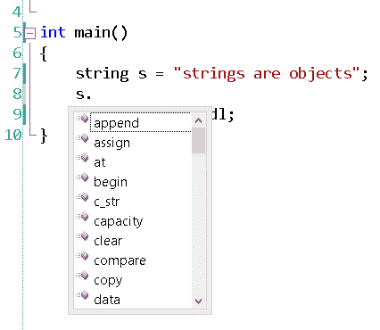
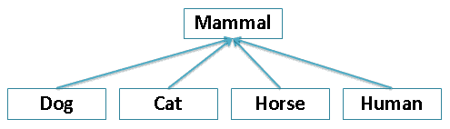
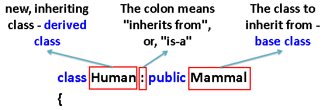
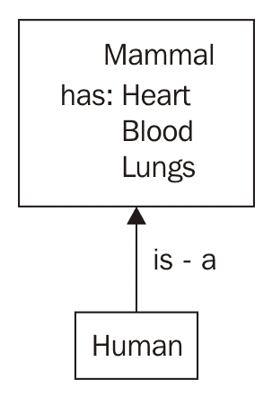
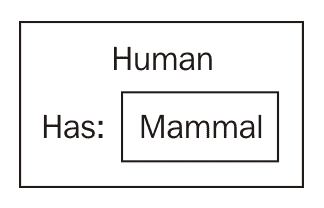
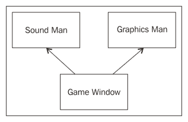
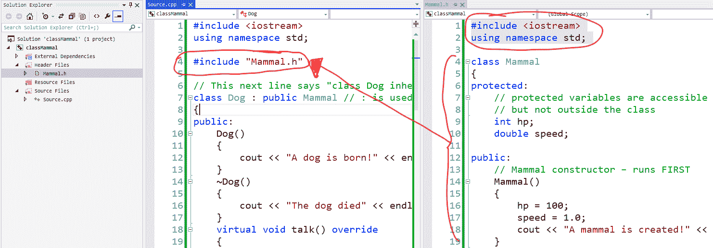
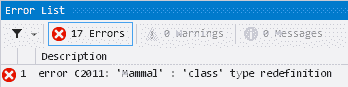
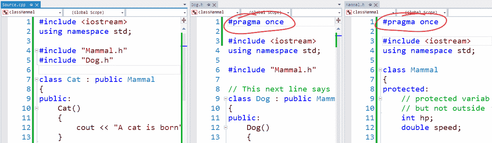
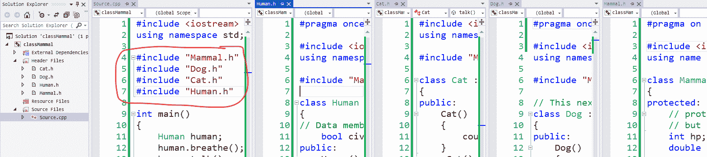

# 对象、类和继承

在上一章中，我们讨论了函数作为捆绑一堆相关代码行的方式。我们谈到了函数如何抽象出实现细节，以及`sqrt()`函数不需要您了解其内部工作原理就可以使用它来查找根。这是一件好事，主要是因为它节省了程序员的时间和精力，同时使查找平方根的实际工作变得更容易。当我们讨论对象时，这种抽象原则将再次出现。

在本章中，我们将涵盖：

+   什么是对象？

+   结构体

+   类与结构体

+   获取器和设置器

+   构造函数和析构函数

+   类继承

+   多重继承

+   将您的类放入头文件

+   面向对象的编程设计模式

+   可调用对象和调用

本章包含许多关键字，可能一开始很难理解，包括`virtual`和`abstract`。

不要让本章中更困难的部分拖住你。我包括了许多高级概念的描述以确保完整性。但请记住，您不需要完全理解本章的所有内容才能编写在 UE4 中工作的 C++代码。理解一切是有帮助的，但如果有些东西不合理，不要陷入困境。阅读一下，然后继续。可能会发生的情况是，一开始你可能不明白，但在编码时记住相关概念的参考。然后，当您再次打开这本书时，哇！它就会有意义了。

# 什么是对象？

简而言之，对象将方法（另一个词是函数）及其相关数据绑定到一个结构中。这个结构称为类。使用对象的主要思想是为游戏中的每个事物创建一个代码表示。代码中表示的每个对象都将具有操作该数据的数据和相关函数。因此，您将有一个对象来表示您的`Player`和相关函数，使`Player`可以`jump()`、`shoot()`和`pickupItem()`。您还将有一个对象来表示每个怪物实例和相关函数，如`growl()`、`attack()`，可能还有`follow()`。

对象是变量类型，对象将在内存中保留，只要您保留它们。当您的游戏中的事物创建时，您创建一个实例或特定表示对象的实例，并在表示的事物死亡时销毁对象实例。

对象可以用来表示游戏中的事物，但也可以用来表示任何其他类型的事物。例如，您可以将图像存储为对象。数据字段将是图像的宽度，高度和其中的像素集合。C++字符串也是对象。

# 结构对象

在 C++中，对象基本上是由一堆更简单的类型组成的任何变量类型。C++中最基本的对象是`struct`。我们使用`struct`关键字将一堆较小的变量粘合成一个大变量。如果您回忆起来，我们在第二章 *变量和内存*中简要介绍了`struct`。让我们回顾一下那个简单的例子：

```cpp
struct Player 
{ 
  string name; 
  int hp; 
}; 
```

这是定义`Player`对象的结构。`Player`有一个`name`的`string`和一个`hp`值的整数。

如果您回忆一下第二章 *变量和内存*，我们创建`Player`对象的实例的方式如下：

```cpp
Player me;    // create an instance of Player, called me 
```

从这里，我们可以这样访问`me`对象的字段：

```cpp
me.name = "Tom"; 
me.hp = 100; 
```

# 成员函数

现在，这是令人兴奋的部分。我们可以通过在`struct Player`定义内部编写这些函数来将成员函数附加到`struct`定义中：

```cpp
struct Player 
{ 
  string name; 
  int hp; 
  // A member function that reduces player hp by some amount 
  void damage( int amount )      
  { 
    hp -= amount; 
  } 
  void recover( int amount ) 
  { 
    hp += amount; 
  } 
}; 
```

成员函数只是在`struct`或`class`定义内声明的 C++函数。

这里有一个有趣的想法，所以我会直接说出来。`struct Player`的变量对`struct Player`内部的所有函数都是可访问的。在`struct Player`的每个成员函数内部，我们实际上可以访问`name`和`hp`变量，就好像它们是函数内部的局部变量一样。换句话说，`struct Player`的`name`和`hp`变量在`struct Player`的所有成员函数之间是共享的。

# this 关键字

在一些 C++代码（在后面的章节中），你会看到更多关于`this`关键字的引用。`this`关键字是一个指针，指向当前对象。例如，在`Player::damage()`函数内部，我们可以显式地写出对`this`的引用：

```cpp
void damage( int amount ) 
{ 
  this->hp -= amount; 
} 
```

`this`关键字只在成员函数内部有意义。我们可以在成员函数内部显式地包含`this`关键字的使用，但是不写`this`时，暗示着我们正在谈论当前对象的`hp`。因此，虽然在大多数情况下这并不是严格必要的，但这可能是个人或公司的偏好，并且可以使代码更易读。

# 字符串是对象吗？

是的，字符串是对象！每次你过去使用`string`变量时，你都在使用一个对象。让我们尝试一些`string`类的成员函数。

```cpp
#include <iostream> 
#include <string> 
using namespace std; 
int main() 
{ 
  string s = "strings are objects"; 
  s.append( "!!" ); // add on "!!" to end of the string! 
  cout << s << endl; 
} 
```

我们在这里所做的是使用`append()`成员函数在字符串的末尾添加两个额外的字符(`!!`)。成员函数总是适用于调用成员函数的对象（点左边的对象）。

要查看对象上可用的成员和成员函数的列表，请按照以下步骤操作：

1.  在 Visual Studio 中输入对象的变量名

1.  然后输入一个点(`.`)

1.  然后按下*Ctrl*和空格键

成员列表将如下弹出：



按下 Ctrl 和空格键将使成员列表出现

# 调用成员函数

成员函数可以用以下语法调用：

```cpp
objectName.memberFunction(); 
```

调用成员函数的对象在点的左边。要调用的成员函数在点的右边。成员函数调用总是在圆括号`()`后面，即使没有参数传递给括号。

因此，在程序中怪物攻击的部分，我们可以按如下方式减少`player`的`hp`值：

```cpp
player.damage( 15 );  // player takes 15 damage 
```

这比以下更可读吗？

```cpp
player.hp -= 15;      // player takes 15 damage 
```

当成员函数和对象有效地使用时，你的代码将更像散文或诗歌，而不是一堆操作符符号拼在一起。

除了美观和可读性，编写成员函数的目的是什么？在`Player`对象之外，我们现在可以用一行代码做更多事情，而不仅仅是减少`hp`成员 15。当`player`受到伤害时，我们还可以做其他事情，比如考虑`player`的护甲，检查玩家是否无敌，或者在`Player`受到伤害时发生其他效果。玩家受到伤害时发生的事情应该由`damage()`函数抽象出来。

现在，想象一下`Player`有一个`armorClass`。让我们为`struct Player`添加一个`armorClass`字段：

```cpp
struct Player 
{ 
  string name; 
  int hp; 
  int armorClass; 
}; 
```

我们需要减少`Player`的护甲等级所受到的伤害。因此，我们需要输入一个公式来减少`hp`。我们可以通过直接访问`Player`对象的数据字段来以非面向对象的方式进行：

```cpp
player.hp -= 15 - player.armorClass; // non OOP 
```

否则，我们可以通过编写一个更改`Player`对象的数据成员的成员函数来以面向对象的方式进行。在`Player`对象内部，我们可以编写一个`damage()`成员函数：

```cpp
struct Player 
{ 
  string name; 
  int hp; 
  int armorClass;  
  void damage( int dmgAmount )                
  { 
    hp -= dmgAmount - armorClass; 
  } 
}; 
```

# 练习

1.  在上述代码中`Player`的`damage`函数中存在一个细微的错误。你能找到并修复它吗？提示：如果造成的伤害小于`Player`的`armorClass`会发生什么？

1.  只有一个装甲等级的数字并不能提供关于装甲的足够信息！装甲的名字是什么？它是什么样子？为`Player`的装甲设计一个`struct`函数，其中包括`name`、`armorClass`和`durability`等字段。

# 解决方案

第一个练习的解决方案在下一节“私有和封装”中列出的`struct Player`代码中。

对于第二个问题，如何使用以下代码？

```cpp
struct Armor 
{ 
  string name; 
  int armorClass; 
  double durability; 
}; 
```

然后在`struct Player`内放置一个`Armor`的实例：

```cpp
struct Player 
{ 
  string name; 
  int hp; 
  Armor armor; // Player has-an Armor 
}; 
```

这意味着`Player`有一套装甲。记住这一点——我们将在以后探讨“有一个”与“是一个”关系。

到目前为止，所有变量名称都以小写字符开头。这是 C++代码的一个良好约定。你可能会发现一些特定团队或其他语言更喜欢使用大写字符来开始变量名称的情况，在这种情况下，最好只做你的公司的人们期望你做的事情。

# 私有和封装

所以现在我们定义了一些成员函数，其目的是修改和维护我们的`Player`对象的数据成员，但有些人提出了一个论点。

论点如下：

+   对象的数据成员应该只能通过其成员函数访问，而不是直接访问。

这意味着你不应该直接从对象外部访问对象的数据成员，换句话说，直接修改`player`的`hp`：

```cpp
player.hp -= 15 - player.armorClass; // bad: direct member access 
```

这应该是被禁止的，类的用户应该被强制使用正确的成员函数来改变数据成员的值：

```cpp
player.damage( 15 );  // right: access through member function 
```

这个原则被称为*封装*。封装是每个对象都应该只通过其成员函数进行交互的概念。封装表示不应直接访问原始数据成员。

封装背后的原因如下：

+   使类自包含：封装背后的主要思想是，对象在被编程时最好是这样的，即它们管理和维护自己的内部状态变量，而不需要类外部的代码来检查该类的私有数据。当对象以这种方式编码时，使对象更容易使用，即更容易阅读和维护。要使`Player`对象跳跃，你只需调用`player.jump()`；让`Player`对象管理其`y-height`位置的状态变化（使`Player`跳跃！）。当对象的内部成员未暴露时，与该对象的交互变得更加容易和高效。只与对象的公共成员函数交互；让对象管理其内部状态（我们将在下一节中解释关键字`private`和`public`）。

+   为了避免破坏代码：当类外部的代码只与该类的公共成员函数（类的公共接口）交互时，对象的内部状态管理可以自由更改，而不会破坏任何调用代码。这样，如果对象的内部数据成员因任何原因而更改，只要成员函数的签名（名称、返回类型和任何参数）保持不变，所有使用对象的代码仍然有效。

那么，我们如何防止程序员做错事并直接访问数据成员？C++引入了*访问修饰符*的概念，以防止访问对象的内部数据。

以下是我们如何使用访问修饰符来禁止从`struct Player`外部访问某些部分。

你要做的第一件事是决定`struct`定义的哪些部分可以在类外部访问。这些部分将被标记为`public`。所有其他不可在`struct`外部访问的区域将被标记为`private`。

如下：

```cpp
struct Player 
{ 
private:        // begins private section.. cannot be accessed  
                // outside the class until 
  string name; 
  int hp;  
  int armorClass; 
public:         //  until HERE. This begins the public section 
  // This member function is accessible outside the struct 
  // because it is in the section marked public: 
  void damage( int amount ) 
  { 
    int reduction = amount - armorClass; 
    if( reduction < 0 ) // make sure non-negative! 
      reduction = 0; 
    hp -= reduction; 
  } 
}; 
```

# 有些人喜欢公开

有些人毫不掩饰地使用`public`数据成员，并且不封装他们的对象。尽管这是一种偏好，但被认为是不良的面向对象编程实践。

然而，在 UE4 中的类有时会使用`public`成员。这是一个判断;数据成员应该是`public`还是`private`，这真的取决于程序员。

通过经验，您会发现，有时，当您将应该是`private`的数据成员变为`public`时，您需要进行相当多的重构（修改代码）。

# 类关键字与结构体

您可能已经看到了使用`class`关键字而不是`struct`来声明对象的不同方式，如下面的代码所示：

```cpp
class Player // we used class here instead of struct! 
{ 
  string name; 
  // 
}; 
```

C++中的`class`和`struct`关键字几乎是相同的。`class`和`struct`之间只有一个区别，那就是`struct`关键字内部的数据成员将默认声明为`public`，而在`class`关键字内部，类内部的数据成员将默认声明为`private`。（这就是我使用`struct`引入对象的原因；我不想莫名其妙地将`public`作为`class`的第一行。）

一般来说，`struct`更适用于不使用封装、没有许多成员函数并且必须向后兼容 C 的简单类型。类几乎在任何其他地方都可以使用。

从现在开始，让我们使用`class`关键字而不是`struct`。

# 获取器和设置器

您可能已经注意到，一旦我们在`Player`类定义中加入`private`，我们就无法从`Player`类外部读取或写入`Player`的名称。

假设我们尝试使用以下代码读取名称：

```cpp
Player me; 
cout << me.name << endl; 
```

或者写入名称，如下：

```cpp
me.name = "William"; 
```

使用带有`private`成员的`struct Player`定义，我们将得到以下错误：

```cpp
    main.cpp(24) : error C2248: 'Player::name' : cannot access private 
    member declared in class 'Player'
```

这正是我们在将`name`字段标记为`private`时所要求的。我们使其在`Player`类外部完全无法访问。

# 获取器

获取器（也称为访问器函数）用于将内部数据成员的副本传递给调用者。要读取`Player`的名称，我们将`Player`类装饰为一个成员函数，专门用于检索该`private`数据成员的副本：

```cpp
class Player 
{ 
private: 
  string name;  // inaccessible outside this class! 
                //  rest of class as before 
public: 
  // A getter function retrieves a copy of a variable for you 
  string getName() 
  { 
    return name; 
  } 
}; 
```

因此，现在可以读取`player`的`name`信息。我们可以使用以下代码语句来实现：

```cpp
cout << player.getName() << endl; 
```

获取器用于检索`private`成员，否则您将无法从类外部访问。

现实世界提示-const 关键字

在类内部，您可以在成员函数声明中添加`const`关键字。`const`关键字的作用是向编译器承诺，对象的内部状态不会因运行此函数而改变。附加`const`关键字看起来像这样：

`string getName() const`

{

返回名称;

`}`

在标记为`const`的成员函数内部不能对数据成员进行赋值。由于对象的内部状态保证不会因运行`const`函数而改变，编译器可以对`const`成员函数的函数调用进行一些优化。

# 设置器

设置器（也称为修改器函数或变异器函数）是一个成员函数，其唯一目的是更改类内部变量的值，如下面的代码所示：

```cpp
class Player 
{ 
private: 
  string name;  // inaccessible outside this class! 
                //  rest of class as before 
public: 
  // A getter function retrieves a copy of a variable for you 
  string getName() 
  { 
    return name; 
  } 
  void setName( string newName ) 
  { 
    name = newName; 
  } 
}; 
```

因此，我们仍然可以从类函数外部更改`private`变量，但只能通过设置函数来实现。

# 但是获取/设置操作有什么意义呢？

因此，当新手程序员第一次遇到对`private`成员进行获取/设置操作时，脑海中首先出现的问题是，获取/设置不是自相矛盾吗？我的意思是，当我们以另一种方式公开相同数据时，隐藏对数据成员的访问有什么意义呢？这就像说，“你不能吃巧克力，因为它们是私有的，除非你说请* `getMeTheChocolate()`。*然后，你可以吃巧克力。”

一些专家程序员甚至将获取/设置函数缩短为一行，就像这样：

```cpp
string getName(){ return name; } 
void setName( string newName ){ name = newName; } 
```

让我们来回答这个问题。获取/设置对暴露数据会破坏封装吗？

答案是双重的。首先，获取成员函数通常只返回被访问的数据成员的副本。这意味着原始数据成员的值保持受保护，并且不能通过`get()`操作进行修改。

`set()`（mutator 方法）操作有点反直觉。如果 setter 是一个`passthru`操作，比如`void setName( string newName ) { name=newName; }`，那么拥有 setter 可能看起来毫无意义。使用 mutator 方法而不是直接覆盖变量的优势是什么？

使用 mutator 方法的论点是在变量分配之前编写额外的代码，以防止变量采用不正确的值。

例如，我们为`hp`数据成员创建一个 setter，它将如下所示：

```cpp
void setHp( int newHp ) 
{ 
  // guard the hp variable from taking on negative values 
  if( newHp < 0 ) 
  { 
    cout << "Error, player hp cannot be less than 0" << endl; 
    newHp = 0; 
  } 
  hp = newHp; 
} 
```

mutator 方法应该防止内部的`hp`数据成员采用负值。您可能认为 mutator 方法有点事后诸葛亮。调用代码应该在调用`setHp( -2 )`之前检查它设置的值，而不是只在 mutator 方法中捕获。您可以使用`public`成员变量，并将确保变量不采用无效值的责任放在调用代码中，而不是在 setter 中。

这是使用 mutator 方法的核心原因。mutator 方法的理念是，调用代码可以将任何值传递给`setHp`函数（例如`setHp( -2 )`），而无需担心传递给函数的值是否有效。然后，`setHp`函数负责确保该值对于`hp`变量是有效的。

一些程序员认为直接的 mutator 函数，如`getHp()`/`setHp()`是一种代码异味。代码异味通常是一种糟糕的编程实践，人们通常不会明显注意到，只是会有一种不太优化的感觉。他们认为可以编写更高级别的成员函数来代替 mutators。例如，我们应该有`public`成员函数`heal()`和`damage()`，而不是`setHp()`成员函数。关于这个主题的文章可以在[`c2.com/cgi/wiki?AccessorsAreEvil`](http://c2.com/cgi/wiki?AccessorsAreEvil)找到。

# 构造函数和析构函数

在您的 C++代码中，构造函数是一个简单的小函数，当 C++对象实例首次创建时运行一次。析构函数在 C++对象实例被销毁时运行一次。假设我们有以下程序：

```cpp
#include <iostream> 
#include <string> 
using namespace std; 
class Player 
{ 
private: 
  string name;  // inaccessible outside this class! 
public: 
  string getName(){ return name; } 
// The constructor! 
  Player() 
  { 
    cout << "Player object constructed" << endl; 
    name = "Diplo"; 
  } 
  // ~Destructor (~ is not a typo!) 
  ~Player() 
  { 
    cout << "Player object destroyed" << endl; 
  } 
}; 

int main() 
  { 
    Player player; 
    cout << "Player named '" << player.getName() << "'" << endl; 
  } 
  // player object destroyed here 
```

在这里，我们创建了一个`Player`对象。这段代码的输出将如下所示：

```cpp
Player object constructed 
Player named 'Diplo' 
Player object destroyed 
```

对象构造期间发生的第一件事是构造函数实际运行。这打印出`Player object constructed`。随后，打印出带有`Player`名称的行：`Player named 'Diplo'`。为什么`Player`被命名为 Diplo？因为这是在`Player()`构造函数中分配的名称。

最后，在程序结束时，`Player`析构函数被调用，我们看到`Player object destroyed`。当`Player`对象在`main()`结束时（在`main`的`}`处）超出范围时，`Player`对象被销毁。

那么，构造函数和析构函数有什么好处？确切地说，它们的作用是设置和销毁对象。构造函数可用于初始化数据字段，析构函数可调用`delete`释放任何动态分配的资源（我们还没有涵盖动态分配的资源，所以不用担心这一点）。

# 类继承

当您想要基于现有代码类创建一个新的、更功能强大的代码类时，您使用继承。继承是一个棘手的话题。让我们从派生类（或子类）的概念开始。

# 派生类

考虑继承的最自然的方式是通过与动物王国的类比。生物的分类如下图所示：



这个图表的意思是**Dog**、**Cat**、**Horse**和**Human**都是哺乳动物。这意味着它们都共享一些共同的特征，比如拥有共同的器官（带有新皮质的大脑、肺、肝脏和雌性子宫），而在其他方面完全不同。它们的行走方式不同。它们的交流方式也不同。

如果你在编写生物代码，那意味着你只需要编写一次共同的功能。然后，你会为`Dog`、`Cat`、`Horse`和`Human`类中的每个不同部分专门实现代码。

前面图表的一个具体例子如下：

```cpp
#include <iostream> 
using namespace std; 
class Mammal 
{ 
protected: 
  // protected variables are like privates: they are 
  // accessible in this class but not outside the class. 
  // the difference between protected and private is 
  // protected means accessible in derived subclasses also 
int hp; 
  double speed; 

public: 
  // Mammal constructor - runs FIRST before derived class ctors! 
  Mammal() 
  { 
    hp = 100; 
    speed = 1.0; 
    cout << "A mammal is created!" << endl; 
  } 
  ~Mammal() 
  { 
    cout << "A mammal has fallen!" << endl; 
  } 
  // Common function to all Mammals and derivatives 
  void breathe() 
  { 
    cout << "Breathe in.. breathe out" << endl; 
  } 
  virtual void talk() 
  { 
    cout << "Mammal talk.. override this function!" << endl; 
  } 
  // pure virtual function, (explained below) 
  virtual void walk() = 0; 
}; 

// This next line says "class Dog inherits from class Mammal" 
class Dog : public Mammal // : is used for inheritance 
{ 
public: 
  Dog() 
  { 
    cout << "A dog is born!" << endl; 
  } 
  ~Dog() 
  { 
    cout << "The dog died" << endl; 
  } 
  virtual void talk() override 
  { 
    cout << "Woof!" << endl; // dogs only say woof! 
  } 
  // implements walking for a dog 
  virtual void walk() override 
  { 
    cout << "Left front paw & back right paw, right front paw &  
     back left paw.. at the speed of " << speed << endl; 
  } 
}; 

class Cat : public Mammal 
{ 
public: 
  Cat() 
  { 
    cout << "A cat is born" << endl; 
  } 
  ~Cat() 
  { 
    cout << "The cat has died" << endl; 
  } 
  virtual void talk() override 
  { 
    cout << "Meow!" << endl; 
  } 
  // implements walking for a cat.. same as dog! 
  virtual void walk() override 
  { 
    cout << "Left front paw & back right paw, right front paw &  
     back left paw.. at the speed of " << speed << endl; 
  } 
}; 

class Human : public Mammal 
{ 
  // Data member unique to Human (not found in other Mammals) 
  bool civilized; 
public: 
  Human() 
  { 
    cout << "A new human is born" << endl; 
    speed = 2.0; // change speed. Since derived class ctor 
    // (ctor is short for constructor!) runs after base  
    // class ctor, initialization sticks initialize member  
    // variables specific to this class 
    civilized = true; 
  } 
  ~Human() 
  { 
    cout << "The human has died" << endl; 
  } 
  virtual void talk() override 
  { 
    cout << "I'm good looking for a .. human" << endl; 
  } 
  // implements walking for a human.. 
  virtual void walk() override 
  { 
    cout << "Left, right, left, right at the speed of " << speed  
     << endl; 
  } 
  // member function unique to human derivative 
  void attack( Human & other ) 
  { 
    // Human refuses to attack if civilized 
    if( civilized ) 
      cout << "Why would a human attack another? I refuse" <<  
       endl; 
    else 
      cout << "A human attacks another!" << endl; 
  } 
}; 

int main() 
{ 
  Human human; 
  human.breathe(); // breathe using Mammal base class  
   functionality 
  human.talk(); 
  human.walk(); 

  Cat cat; 
  cat.breathe(); // breathe using Mammal base class functionality 
  cat.talk(); 
  cat.walk(); 

  Dog dog; 
  dog.breathe(); 
  dog.talk(); 
  dog.walk(); 
} 
```

所有的`Dog`、`Cat`和`Human`都继承自`class Mammal`。这意味着`dog`、`cat`和`human`都是哺乳动物，还有更多。

# 继承的语法

继承的语法非常简单。让我们以`Human`类定义为例。以下屏幕截图是典型的继承语句：



冒号（**:**）左边的类是新的派生类，冒号右边的类是基类。

# 继承的作用是什么？

继承的目的是让派生类继承基类的所有特征（数据成员和成员函数），然后通过更多功能来扩展它。例如，所有哺乳动物都有一个`breathe()`函数。通过从`Mammal`类继承，`Dog`、`Cat`和`Human`类都自动获得了`breathe()`的能力。

继承减少了代码的重复，因为我们不必为`Dog`、`Cat`和`Human`重新实现共同的功能（比如`.breathe()`）。相反，这些派生类中的每一个都可以重用`class Mammal`中定义的`breathe()`函数。

然而，只有`Human`类有`attack()`成员函数。这意味着在我们的代码中，只有`Human`类会攻击。`cat.attack()`函数会引发编译错误，除非你在`class Cat`（或`class Mammal`）中编写一个`attack()`成员函数。

# is-a 关系

继承通常被称为`is-a`关系。当`Human`类从`Mammal`类继承时，我们说人类*是*哺乳动物：



人类继承了哺乳动物的所有特征。

但是，如果`Human`对象内部包含一个`Mammal`对象，如下所示？

```cpp
class Human 
{ 
  Mammal mammal; 
}; 
```

在这个例子中，我们会说人类身上有一个`Mammal`（如果人类怀孕或者以某种方式携带哺乳动物，这是有意义的）：



这个`Human`类实例身上有一个哺乳动物

请记住，我们之前给`Player`一个`Armor`对象内部吗？`Player`对象继承`Armor`类是没有意义的，因为说`Player`*是一种 Armor*是没有意义的。在代码设计中决定一个类是否从另一个类继承时（例如，`Human`类是否从`Mammal`类继承），你必须始终能够自如地说`Human`类*是*`Mammal`。如果*是*语句听起来不对，那么很可能继承是那对对象的错误关系。

在前面的例子中，我们引入了一些新的 C++关键字。第一个是`protected`。

# 受保护的变量

`protected`成员变量与`public`或`private`变量不同。这三类变量在定义它们的类内部都是可访问的。它们之间的区别在于对类外部的可访问性。`public`变量在类内部和类外部都是可访问的。`private`变量在类内部是可访问的，但在类外部不可访问。`protected`变量在类内部和派生子类内部是可访问的，但在类外部不可访问。因此，`class Mammal`的`hp`和`speed`成员在派生类`Dog`、`Cat`、`Horse`和`Human`中是可访问的，但在这些类的外部（例如`main()`）是不可访问的。

# 虚函数

虚函数是一个成员函数，其实现可以在派生类中被覆盖。在这个例子中，`talk()`成员函数（在`class Mammal`中定义）被标记为`virtual`。这意味着派生类可能会选择实现自己的`talk()`成员函数的版本，也可能不选择。

# 纯虚函数

纯`virtual`函数（和抽象类）是指你必须在派生类中覆盖其实现的函数。`class Mammal`中的`walk()`函数是纯虚函数；它是这样声明的：

```cpp
virtual void walk() = 0; 
```

前面代码中的`= 0`部分是使函数成为纯虚函数的部分。

`class Mammal`中的`walk()`函数是纯虚函数，这使得`Mammal`类是抽象的。在 C++中，抽象类是指至少有一个纯虚函数的类。

如果一个类包含一个纯虚函数并且是抽象的，那么该类不能直接实例化。也就是说，你现在不能创建一个`Mammal`对象，因为有纯虚函数`walk()`。如果你尝试以下代码，你会得到一个错误：

```cpp
int main() 
{ 
  Mammal mammal; 
} 
```

如果你尝试创建一个`Mammal`对象，你会得到以下错误：

```cpp
error C2259: 'Mammal' : cannot instantiate abstract class 
```

然而，你可以创建`class Mammal`的派生实例，只要派生类实现了所有的纯虚成员函数。

你可能会想为什么要使用其中之一。好吧，你真的认为你会想在游戏中创建一个`Mammal`对象吗？不，你会想创建一个从`Mammal`派生的类型的对象，比如`Cat`或`Dog`。这样，你就不会意外地创建一个`Mammal`，这对`Player`来说会非常令人困惑！

# 多重继承

并不是所有的多重继承都像听起来那么好。多重继承是指派生类从多个基类继承。通常，如果我们从完全不相关的多个基类继承，这通常可以顺利进行。

例如，我们可以有一个从`SoundManager`和`GraphicsManager`基类继承的`Window`类。如果`SoundManager`提供了一个成员函数`playSound()`，`GraphicsManager`提供了一个成员函数`drawSprite()`，那么`Window`类将能够毫无问题地使用这些额外的功能：



Game Window 从 Sound Man 和 Graphics Man 继承意味着 Game Window 将拥有两组功能

然而，多重继承可能会产生负面后果。假设我们想创建一个从`Donkey`和`Horse`类派生的`Mule`类。然而，`Donkey`和`Horse`类都继承自`Mammal`基类。我们立即遇到了问题！如果我们调用`mule.talk()`，但`mule`没有覆盖`talk()`函数，应该调用哪个成员函数，`Horse`还是`Donkey`的？这是模棱两可的。

# 私有继承

C++中很少谈到的一个特性是`private`继承。每当一个类公开地继承另一个类时，所有代码都知道它属于哪个父类，例如：

```cpp
class Cat : public Mammal 
```

这意味着所有的代码都将知道`Cat`是`Mammal`的一个对象，并且将能够使用基类`Mammal*`指针指向`Cat*`实例。例如，以下代码将是有效的：

```cpp
Cat cat; 
Mammal* mammalPtr = &cat; // Point to the Cat as if it were a  
                          // Mammal 
```

将一个类的对象放入父类类型的变量中称为转换。如果`Cat`公开继承自`Mammal`，则前面的代码是正确的。私有继承是指`Cat`类外部的代码不允许知道父类：

```cpp
class Cat : private Mammal 
```

在这里，外部调用的代码将不会“知道”`Cat`类是从`Mammal`类派生的。当继承是私有的时候，编译器不允许将`Cat`实例转换为`Mammal`基类。当你需要隐藏某个类是从某个父类派生时，使用私有继承。

然而，私有继承在实践中很少使用。大多数类都使用公共继承。如果你想了解更多关于私有继承的信息，请参阅[`stackoverflow.com/questions/406081/why-should-i-avoid-multiple-inheritance-in-c`](http://stackoverflow.com/questions/406081/why-should-i-avoid-multiple-inheritance-in-c)。

# 将你的类放入头文件

到目前为止，我们的类都只是被粘贴到了`main()`之前。如果你继续以这种方式编程，你的代码将全部在一个文件中，并且看起来会像一个大杂乱的混乱。

因此，将你的类组织到单独的文件中是一个很好的编程实践。当项目中有多个类时，这样做可以更轻松地单独编辑每个类的代码。

拿`class Mammal`和它的派生类来说。我们将把之前的例子正确地组织到单独的文件中。让我们分步骤来做：

1.  在你的 C++项目中创建一个名为`Mammal.h`的新文件。将整个`Mammal`类剪切并粘贴到该文件中。请注意，由于`Mammal`类包含了对`cout`的使用，我们在该文件中也写入了`#include <iostream>`语句。

1.  在你的`Source.cpp`文件顶部写入`"#include``Mammal.h"`语句。

这是一个示例，如下截图所示：



当代码编译时，发生的情况是整个`Mammal`类被复制并粘贴（`#include`）到包含`main()`函数的`Source.cpp`文件中，其余的类都是从`Mammal`派生的。由于`#include`是一个复制和粘贴的功能，代码的功能将与之前完全相同；唯一的区别是它将更加有组织和易于查看。在此步骤中编译和运行你的代码，以确保它仍然有效。

经常检查你的代码是否能够编译和运行，特别是在重构时。当你不知道规则时，你很容易犯很多错误。这就是为什么你应该只在小步骤中进行重构。重构是我们现在正在做的活动的名称 - 我们正在重新组织源代码，使其对我们代码库的其他读者更有意义。重构通常不涉及太多的重写。

接下来你需要做的是将`Dog`，`Cat`和`Human`类分别放入它们自己的文件中。为此，创建`Dog.h`，`Cat.h`和`Human.h`文件，并将它们添加到你的项目中。

让我们从`Dog`类开始，如下截图所示。

如果你使用这个设置并尝试编译和运行你的项目，你会看到“Mammal”：'class'类型重定义错误，如下截图所示：



这个错误的意思是`Mammal.h`已经在你的项目中被包含了两次，一次在`Source.cpp`中，然后又在`Dog.h`中。这意味着，在编译代码中实际上添加了两个版本的`Mammal`类，C++不确定使用哪个版本。

有几种方法可以解决这个问题，但最简单的方法（也是虚幻引擎使用的方法）是`#pragma once`宏，如下截图所示：



我们在每个头文件的顶部写上`#pragma once`。这样，第二次包含`Mammal.h`时，编译器不会再次复制和粘贴它的内容，因为它已经被包含过了，它的内容实际上已经在编译组的文件中。

对`Cat.h`和`Human.h`做同样的事情，然后在您的`Source.cpp`文件中包含它们，您的`main()`函数位于其中：



包含所有类的屏幕截图

现在，我们已经将所有类包含到您的项目中，代码应该可以编译和运行。

# 使用`.h`和`.cpp`文件

组织的下一个级别是将类声明留在头文件（`.h`）中，并将实际函数实现体放在一些新的`.cpp`文件中。同时，保留`class Mammal`声明中的现有成员。

对于每个类，执行以下操作：

1.  删除所有函数体（在`{`和`}`之间的代码），并用分号替换它们。对于`Mammal`类，这将如下所示：

```cpp
// Mammal.h 
#pragma once 
class Mammal 
{ 
protected: 
  int hp; 
  double speed; 

public: 
  Mammal(); 
  ~Mammal(); 
  void breathe(); 
  virtual void talk(); 
  // pure virtual function,  
  virtual void walk() = 0; 
}; 
```

1.  创建一个名为`Mammal.cpp`的新`.cpp`文件。然后，简单地将成员函数体放在这个文件中：

```cpp
// Mammal.cpp 
#include <iostream> 
using namespace std; 

#include "Mammal.h" 
Mammal::Mammal() // Notice use of :: (scope resolution operator) 
{ 
  hp = 100; 
  speed = 1.0; 
  cout << "A mammal is created!" << endl; 
} 
Mammal::~Mammal() 
{ 
  cout << "A mammal has fallen!" << endl; 
} 
void Mammal::breathe() 
{ 
  cout << "Breathe in.. breathe out" << endl; 
} 
void Mammal::talk() 
{ 
  cout << "Mammal talk.. override this function!" << endl; 
} 
```

在声明成员函数体时，使用类名和作用域解析运算符（双冒号）是很重要的。我们在属于`Mammal`类的所有成员函数前面加上`Mammal::`。这表明它们属于该类（这使它们与`.`有所不同，`.`用于该类类型的特定对象实例）。

注意纯虚函数没有函数体；它不应该有！纯虚函数只是在基类中声明（并初始化为`0`），但稍后在派生类中实现。

# 练习

将上面不同生物类的分离完全转换为类头（`.h`）和类定义文件（`.cpp`）。

# 面向对象的编程设计模式

如果您一直在研究编程，您可能已经遇到了*设计模式*这个术语。设计模式很重要，因为它们是可以应用于许多编程项目的标准做事方式。如果您想了解更多，经典书籍*设计模式*是很重要的([`www.goodreads.com/book/show/85009.Design_Patterns`](https://www.goodreads.com/book/show/85009.Design_Patterns))。一旦您熟悉它们，您将在整个职业生涯中发现许多用途。并非所有都与对象有关，但以下是一些与对象有关的例子。

# 单例

有时，您只想要一个对象的实例。比如你在做一个王国模拟器。你只想要有一个国王。否则，你就会面临*权力的游戏*类型的情况，到处都是阴谋和红色婚礼，这不是你想要的游戏类型，对吧？（当然，你可能会记住这一点，用在另一个游戏中。）但对于这个特定的游戏，你只想要一个国王来管理一切。

那么，您如何确保其他国王不会到处出现？您可以使用单例。单例是一个保留对象实例的类，您想在任何地方使用它时，而不是创建一个新对象，您调用一个函数，该函数会给您访问对象实例的方法，然后您可以在其上调用函数。为了确保只创建一个对象实例，它在类内部的静态变量中保留了自身的副本（注意：我们将在下一节中更多地讨论静态类成员），当您调用`GetInstance()`时，它会检查您是否已经创建了对象的实例。如果有，它使用现有的实例。如果没有，它会创建一个新的。这里有一个例子：

```cpp
//King.h

#pragma once
#include <string>

using namespace std;

class King
{
public:
    ~King();

    static King* getInstance();

    void setName(string n) { name = n; };
    string getName() const { return name; };
    //Add more functions for King
private:
    King();

    static King* instance;
    string name;
};
```

这是`cpp`的代码：

```cpp
//King.cpp

#include "King.h"

King* King::instance = nullptr;

King::King()
{
}

King::~King()
{
}

King* King::getInstance()
{
    if (instance == nullptr)
    {
        instance = new King();
    }
    return instance;
}
```

构造函数在代码的`private:`部分中列出。这很重要。如果你这样做，构造函数将无法从类外部访问，这意味着其他程序员，可能意识不到这是一个单例，就不能开始创建新的`King`对象并在游戏中造成混乱。如果他们尝试，他们会得到一个错误。因此，这强制了这个类只能通过`getInstance()`函数访问。

要使用这个新的单例类，你可以这样做：

```cpp
    King::getInstance()->setName("Arthur");
    cout << "I am King " << King::getInstance()->getName();
```

一旦你设置了名称，它将输出“我是亚瑟王”，无论你从代码的哪个位置调用它（只需确保在文件顶部添加`#include "King.h"`）。

# 工厂

当你想到术语“工厂”时，你会想到什么？可能是一个大量生产物体的地方，比如汽车、鞋子或计算机。在代码中，`工厂`的工作方式也是一样的。工厂是一个可以创建其他类型对象的类。但它更加灵活，因为它可以创建不同类型的对象。

我们之前看到，哺乳动物可以是狗、猫、马或人类。因为所有四种类型都是从“哺乳动物”派生出来的，一个“工厂”对象可以有一个函数，你告诉它你想要哪种类型的“哺乳动物”，它就会创建一个该类型的对象，进行任何必要的设置，并返回它。由于一个叫做多态性的原则，你可以得到一个类型为“哺乳动物”的对象，但当你调用任何虚函数时，它知道要使用为“猫”、“狗”或“人类”创建的函数，取决于创建的对象类型。你的 C++编译器知道这一点，因为它在幕后维护一个虚函数表，它保留了你真正想要使用的每个虚函数的版本的指针，并将它们存储在每个对象中。

# 对象池

假设你正在创建大量对象，比如用于显示烟花的粒子系统，并且你不断需要在屏幕上创建新的烟花动画。过一段时间，你会注意到事情变慢了，甚至可能会耗尽内存并崩溃。幸运的是，有一个解决方法。

你可以创建一个对象池，它基本上是一组对象，应该足够大，以便在任何给定时间屏幕上包含每一个对象。当一个对象完成其动画并消失时，你不需要创建一个新的对象，而是将它扔回到池中，当你需要另一个对象时，你可以将它拿出来并重用它（你可能需要先更改颜色或其他设置）。从池中重用对象比不断创建新对象要快得多，处理时间也更短。它还有助于避免内存泄漏。

# 静态成员

正如我们在单例示例中看到的，类可以有静态成员。类的静态成员对于类的所有实例只存在一次，而不是对于每个实例都不同。你通常像我们为单例所做的那样访问它们：

```cpp
King::getInstance()->setName("Arthur");
```

静态变量也常用于与类相关的常量。但它们也可以用于跟踪某些东西，比如你有多少个对象的实例，通过在构造函数中递增静态变量，然后在析构函数中递减它。这类似于智能指针如何跟踪对象的引用数量。

# 可调用对象和调用

另一个新的 C++特性是可调用对象。这是一个高级话题，所以不要太担心在这一点上理解它，但我会给你一个简要的概述。但要解释它，首先，我需要提到另一个话题——运算符重载。

你可能认为你不能改变诸如`+`、`-`、`*`和`/`这样的运算符的含义。实际上，在 C++中，你可以。你可以添加一个名为`operator(symbol)`的函数。因此，如果你有一个字符串类，你可以创建一个`operator+`函数，使字符串被连接起来，而不是试图弄清楚如何添加两个实际上不是数字的对象。

可调用对象通过重载`()`与`operator()`更进一步。因此，你可以拥有一个可以作为对象调用的类。C++ 17 添加了一个新函数`invoke()`，它可以让你调用带参数的可调用对象。

# 总结

在本章中，你学习了 C++中的对象；它们是将数据成员和成员函数绑定在一起形成的一组代码，称为`class`或`struct`。面向对象编程意味着你的代码将充满各种东西，而不仅仅是`int`、`float`和`char`变量。你将拥有一个代表`Barrel`的变量，另一个代表`Player`的变量，以此类推，也就是说，一个变量代表游戏中的每个实体。你可以通过继承来重用代码；如果你需要编写`Cat`和`Dog`的实现，你可以在基类`Mammal`中编写通用功能。我们还讨论了封装以及如何更轻松、更高效地编写对象，使它们保持自己的内部状态。我们还介绍了一些对象的设计模式（你会发现还有许多其他设计模式）。

在下一章中，我们将讨论如何动态分配内存，以及数组和向量。
