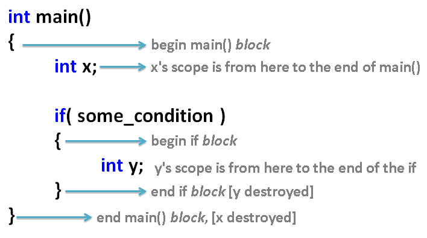
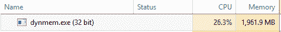
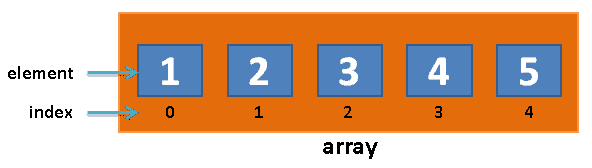
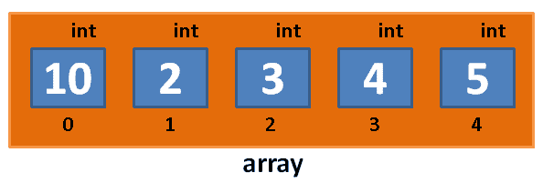

# 第七章：动态内存分配

在上一章中，我们讨论了类的定义以及如何设计自己的自定义类。我们讨论了通过设计自定义类，可以构造代表游戏或程序中实体的变量。

在这一章中，我们将讨论动态内存分配以及如何为对象组创建内存空间。让我们看看本章涵盖的主题：

+   构造函数和析构函数重访

+   动态内存分配

+   常规数组

+   C++风格的动态大小数组（new[]和 delete[]）

+   动态 C 风格数组

+   向量

# 构造函数和析构函数重访

假设我们有一个简化版本的`class Player`，与之前一样，只有构造函数和析构函数：

```cpp
class Player 
{ 
  string name; 
  int hp; 
public: 
  Player(){ cout << "Player born" << endl; } 
  ~Player(){ cout << "Player died" << endl; } 
}; 
```

我们之前谈到了 C++中变量的*作用域*；回顾一下，变量的作用域是程序中可以使用该变量的部分。变量的作用域通常在它声明的块内。块只是在`{`和`}`之间的任何代码段。下面是一个示例程序，说明了变量的作用域：



在这个示例程序中，x 变量在整个 main()函数中都有作用域。y 变量的作用域只在 if 块内部。

我们之前提到，一般情况下，变量在作用域结束时被销毁。让我们用`class Player`的实例来测试这个想法：

```cpp
int main() 
{ 
  Player player; // "Player born" 
}                // "Player died" - player object destroyed here 
```

这个程序的输出如下：

```cpp
Player born 
Player died 
```

`Player`对象的析构函数在玩家对象的作用域结束时被调用。由于变量的作用域是在代码的三行中定义的块内，`Player`对象将在`main()`结束时立即被销毁。

# 动态内存分配

现在，让我们尝试动态分配一个`Player`对象。这是什么意思？

我们使用`new`关键字来分配它：

```cpp
int main() 
{ 
  // "dynamic allocation" - using keyword new! 
  // this style of allocation means that the player object will 
  // NOT be deleted automatically at the end of the block where 
  // it was declared! Note: new always returns a pointer
Player *player = new Player(); 
} // NO automatic deletion! 
```

这个程序的输出如下：

```cpp
Player born 
```

玩家不会死！我们如何杀死玩家？我们必须明确调用`player`指针上的`delete`。

# 删除关键字

`delete`操作符在被删除的对象上调用析构函数，如下面的代码所示：

```cpp
int main() 
{ 
  // "dynamic allocation" - using keyword new! 
  Player *player = new Player(); 
  delete player; // deletion invokes dtor 
} 
```

程序的输出如下：

```cpp
Player born 
Player died 
```

因此，只有普通（或自动，也称为非指针类型）变量类型在它们声明的块结束时被销毁。指针类型（用`*`和`new`声明的变量）即使作用域结束时也不会自动销毁。

这有什么用呢？动态分配可以让你控制对象何时被创建和销毁。这将在以后派上用场。

# 内存泄漏

因此，用`new`动态分配的对象不会自动删除，除非你明确调用`delete`。这里存在风险！这被称为*内存泄漏*。内存泄漏发生在用`new`分配的对象从未被删除时。可能发生的情况是，如果你的程序中有很多对象是用`new`分配的，然后你不再使用它们，你的计算机最终会因为内存泄漏而耗尽内存。

以下是一个荒谬的示例程序，用来说明这个问题：

```cpp
#include <iostream> 
#include <string> 
using namespace std; 
class Player 
{ 
  string name; 
  int hp; 
public: 
  Player(){ cout << "Player born" << endl; } 
  ~Player(){ cout << "Player died" << endl; } 
}; 

int main() 
{ 
  while( true ) // keep going forever, 
  { 
    // alloc.. 
    Player *player = new Player(); 
    // without delete == Memory Leak! 
  } 
} 
```

如果让这个程序运行足够长的时间，最终会吞噬计算机的内存，如下面的截图所示：



用于 Player 对象的 2GB RAM。

请注意，没有人打算写一个存在这种问题的程序！内存泄漏问题是意外发生的。你必须小心你的内存分配，并且`delete`不再使用的对象。

# 常规数组

在 C++中，数组可以声明如下：

```cpp
#include <iostream> 
using namespace std; 
int main() 
{ 
  int array[ 5 ];  // declare an "array" of 5 integers 
                   // fill slots 0-4 with values 
array[ 0 ] = 1; 
array[ 1 ] = 2; 
array[ 2 ] = 3; 
array[ 3 ] = 4; 
array[ 4 ] = 5; 
  // print out the contents 
  for( int index = 0; index < 5; index++ ) 
    cout << array[ index ] << endl; 
} 
```

在内存中的样子大致如下：



也就是说，在`array`变量内部有五个槽或元素。在每个槽内部是一个常规的`int`变量。你也可以通过传入值来声明数组，就像这样：

```cpp
int array[ ] = {6, 0, 5, 19};
```

你也可以传入`int`变量来使用存储在那里的值。

# 数组语法

那么，如何访问数组中的一个`int`值？要访问数组的各个元素，我们使用方括号，如下行代码所示：

```cpp
array[ 0 ] = 10; 
```

这与最初创建数组的语法非常相似。上一行代码将更改数组的槽`0`中的元素为`10`：



通常情况下，要访问数组的特定槽，您将编写以下内容：

```cpp
array[ slotNumber ] = value to put into array; 
```

请记住，数组槽始终从`0`开始索引（有些语言可能从`1`开始，但这是不寻常的，可能会令人困惑）。要进入数组的第一个槽，请使用`array[0]`。数组的第二个槽是`array[1]`（而不是`array[2]`）。前一个数组的最后一个槽是`array[4]`（而不是`array[5]`）。`array[5]`数据类型超出了数组的边界！（在前面的图中没有索引为 5 的槽。最高索引为 4。）

不要超出数组的边界！有时可能会起作用，但其他时候您的程序将崩溃并显示**内存访问违规**（访问不属于您的程序的内存）。通常情况下，访问不属于您的程序的内存将导致您的应用程序崩溃，如果不立即崩溃，那么您的程序中将会有一个隐藏的错误，只会偶尔引起问题。索引数组时必须始终小心。

数组内置于 C++中，也就是说，您无需包含任何特殊内容即可立即使用数组。您可以拥有任何类型的数据数组，例如`int`、`double`、`string`，甚至您自己的自定义对象类型（`Player`）的数组。

# 练习

1.  创建一个包含五个字符串的数组，并在其中放入一些名称（虚构或随机 - 这无关紧要）。

1.  创建一个名为`temps`的双精度数组，其中包含三个元素，并将过去三天的温度存储在其中。

# 解决方案

1.  以下是一个包含五个字符串数组的示例程序：

```cpp
#include <iostream> 
#include <string> 
using namespace std; 
int main() 
{ 
  string array[ 5 ];  // declare an "array" of 5 strings 
                      // fill slots 0-4 with values 
array[ 0 ] = "Mariam McGonical"; 
array[ 1 ] = "Wesley Snice"; 
array[ 2 ] = "Kate Winslett"; 
array[ 3 ] = "Erika Badu"; 
array[ 4 ] = "Mohammad"; 
  // print out the contents 
  for( int index = 0; index < 5; index++ ) 
    cout << array[ index ] << endl; 
} 
```

1.  以下只是数组：

```cpp
double temps[ 3 ]; 
// fill slots 0-2 with values 
temps[ 0 ] = 0; 
temps[ 1 ] = 4.5; 
temps[ 2 ] = 11; 
```

# C++风格的动态大小数组（new[]和 delete[]）

您可能已经意识到，我们并不总是在程序开始时知道数组的大小。我们需要动态分配数组的大小。

但是，如果您尝试过，您可能已经注意到这行不通！

让我们尝试使用`cin`命令从用户那里获取数组大小。让我们询问用户他想要多大的数组，并尝试为他创建一个那么大的数组：

```cpp
#include <iostream> 
using namespace std; 
int main() 
{ 
  cout << "How big?" << endl; 
  int size;       // try and use a variable for size.. 
  cin >> size;    // get size from user 
  int array[ size ];  // get error
} 
```

我们得到一个错误。问题在于编译器希望分配数组的大小。然而，除非变量大小标记为`const`，否则编译器在编译时无法确定其值。C++编译器无法在编译时确定数组的大小，因此会生成编译时错误。

为了解决这个问题，我们必须动态分配数组（在“堆”上）：

```cpp
#include <iostream> 
using namespace std; 
int main() 
{ 
  cout << "How big?" << endl; 
  int size;       // try and use a variable for size.. 
  cin >> size; 
  int *array = new int[ size ];  // this works 
  // fill the array and print 
for( int index = 0; index < size; index++ ) 
{ 
  array[ index ] = index * 2; 
  cout << array[ index ] << endl; 
} 
delete[] array; // must call delete[] on array allocated with  
                // new[]! 
} 
```

因此，这里的教训如下：

+   要动态分配某种类型（例如`int`）的数组，必须使用`new int[数组中的元素数量]`。

+   使用`new[]`分配的数组必须稍后使用`delete[]`删除，否则将导致内存泄漏（带有方括号的`delete[]`；不是常规的 delete）！

# 动态 C 风格数组

C 风格数组是一个传统的话题，但仍然值得讨论，因为即使它们很古老，有时您仍然可能会看到它们被使用。

我们声明 C 风格数组的方式如下：

```cpp
#include <iostream> 
using namespace std; 
int main() 
{ 
  cout << "How big?" << endl; 
  int size;       // try and use a variable for size.. 
  cin >> size; 
  // the next line will look weird.. 
  int *array = (int*)malloc( size*sizeof(int) ); // C-style 
  // fill the array and print 
for( int index = 0; index < size; index++ ) 
  { 
    //At this point the syntax is the same as with regular arrays.
    array[ index ] = index * 2; 
    cout << array[ index ] << endl; 
  } 
free( array ); // must call free() on array allocated with  
               // malloc() (not delete[]!) 
} 
```

差异在这里突出显示。

使用`malloc()`函数创建 C 风格的数组。malloc 一词代表内存分配。此函数要求您传入要创建的数组的字节大小，而不仅仅是您想要的数组中的元素数量。因此，我们将请求的元素数量（大小）乘以数组内部类型的`sizeof`。以下表格列出了几种典型 C++类型的字节大小：

| C++基本类型 | `sizeof`（字节大小） |
| --- | --- |
| `int` | `4` |
| `float` | `4` |
| `double` | `8` |
| `long long` | `8` |

使用`malloc()`函数分配的内存必须使用`free()`来释放。

# 向量

还有一种创建本质上是数组的方式，这种方式是最容易使用的，也是许多程序员首选的方式——使用向量。想象一下，在以前的任何例子中，当你向数组中添加新项时，程序正在运行时突然用完了空间。你会怎么做？你可以创建一个全新的数组，把所有东西都复制过去，但是你可能会猜到，这是很多额外的工作和处理。那么，如果你有一种类型的数组，在幕后为你处理这样的情况，而你甚至都没有要求呢？

这就是向量的作用。向量是标准模板库的成员（我们将在接下来的几章中介绍模板，所以请耐心等待），就像其他例子一样，你可以在尖括号（`<>`）内设置类型。你可以像这样创建一个向量：

```cpp
vector<string> names; // make sure to add #include <vector> at the top
```

这基本上表示你正在创建一个名为 names 的字符串向量。要向向量添加新项，可以使用`push_back()`函数，就像这样：

```cpp
names.push_back("John Smith");
```

这将把你传入的项添加到向量的末尾。你可以调用`push_back()`任意次数，每当向量用完空间时，它都会自动增加大小，而你无需做任何事情！所以，你可以随意添加任意数量的项（在合理范围内，因为最终可能会用完内存），而不必担心内存是如何管理的。

向量还添加了其他有用的函数，比如`size()`，它告诉你向量包含多少项（在标准数组中，你必须自己跟踪这一点）。

一旦你创建了一个向量，你可以像访问标准数组一样对待它，使用`[]`语法来访问：

```cpp
//Make it unsigned int to avoid a signed/unsigned mismatch error
for (unsigned int i = 0; i < names.size(); i++)
{
    //If you get an error about << add #include <string> at the top
    cout << names[i] << endl; //endl tells it to go to the next line
}
```

# 总结

本章向你介绍了 C 和 C++风格的数组和向量。在大多数 UE4 代码中，你将使用 UE4 编辑器内置的集合类（`TArray<T>`），它们类似于向量。然而，你需要熟悉基本的 C 和 C++风格的数组，才能成为一个非常优秀的 C++程序员。

我们现在已经涵盖了足够的基本 C++知识，可以继续学习下一个章节，关于 UE4 的演员和棋子。
