# 第八章：演员和兵

现在，我们将真正深入 UE4 代码。起初，它看起来会让人望而生畏。UE4 类框架非常庞大，但不用担心：框架很大，所以你的代码不必如此。你会发现，你可以用更少的代码完成更多的工作并将更多内容显示在屏幕上。这是因为 UE4 引擎代码如此广泛和精心编写，以至于他们使得几乎任何与游戏相关的任务都变得容易。只需调用正确的函数，你想要看到的东西就会出现在屏幕上。整个框架的概念是设计让你获得想要的游戏体验，而不必花费大量时间来处理细节。

本章的学习成果如下：

+   演员与兵

+   创建一个放置演员的世界

+   UE4 编辑器

+   从头开始

+   向场景添加一个演员

+   创建一个玩家实体

+   编写控制游戏角色的 C++代码

+   创建非玩家角色实体

+   显示每个 NPC 对话框中的引用

# 演员与兵

在本章中，我们将讨论演员和兵。虽然听起来兵会比演员更基本，但实际情况恰恰相反。UE4 演员（`Actor`类）对象是可以放置在 UE4 游戏世界中的基本类型。为了在 UE4 世界中放置任何东西，你必须从`Actor`类派生。

兵是一个代表你或计算机的**人工智能**（**AI**）可以在屏幕上控制的对象。`Pawn`类派生自`Actor`类，具有直接由玩家或 AI 脚本控制的额外能力。当一个兵或演员被控制器或 AI 控制时，就说它被该控制器或 AI 所控制。

把`Actor`类想象成一个戏剧中的角色（尽管它也可以是戏剧中的道具）。你的游戏世界将由一堆*演员*组成，它们一起行动以使游戏运行。游戏角色、**非玩家角色**（**NPC**）甚至宝箱都将是演员。

# 创建一个放置演员的世界

在这里，我们将从头开始创建一个基本的关卡，然后把我们的游戏角色放进去。UE4 团队已经很好地展示了世界编辑器如何用于创建 UE4 中的世界。我希望你花点时间按照以下步骤创建自己的世界：

1.  创建一个新的空白 UE4 项目以开始。要做到这一点，在虚幻启动器中，点击最近的引擎安装旁边的启动按钮，如下截图所示：

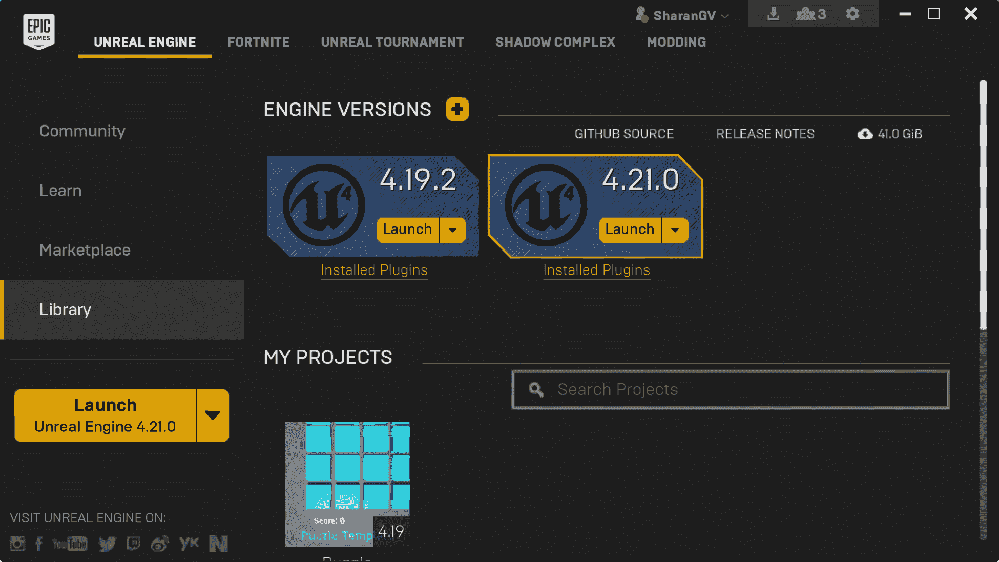

这将启动虚幻编辑器。虚幻编辑器用于可视化编辑你的游戏世界。你将花费大量时间在虚幻编辑器中，所以请花些时间进行实验和尝试。

我只会介绍如何使用 UE4 编辑器的基础知识。然而，你需要让你的创造力流淌，并投入一些时间来熟悉编辑器。

要了解更多关于 UE4 编辑器的信息，请查看*入门：UE4 编辑器简介*播放列表，网址为[`www.youtube.com/playlist?list=PLZlv_N0_O1gasd4IcOe9Cx9wHoBB7rxFl`](https://www.youtube.com/playlist?list=PLZlv_N0_O1gasd4IcOe9Cx9wHoBB7rxFl)。

1.  你将看到项目对话框。以下截图显示了需要执行的步骤，数字对应着需要执行的顺序：

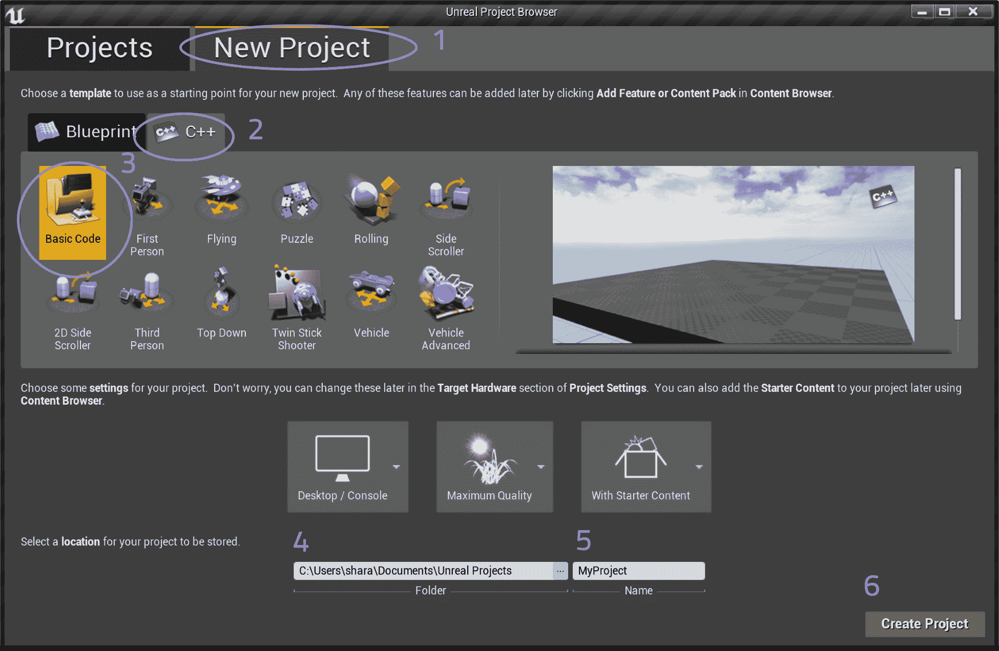

1.  执行以下步骤创建一个项目：

1.  在屏幕顶部选择新项目标签。

1.  点击 C++标签（第二个子标签）。

1.  从可用项目列表中选择基本代码。

1.  设置项目所在的目录（我的是 Y:Unreal Projects）。选择一个有很多空间的硬盘位置（最终项目大小约为 1.5GB）。

1.  命名您的项目。我把我的称为 GoldenEgg。

1.  单击“创建项目”以完成项目创建。

完成此操作后，UE4 启动器将启动 Visual Studio（或 Xcode）。这可能需要一段时间，进度条可能会出现在其他窗口后面。只有几个源文件可用，但我们现在不会去碰它们。

1.  确保从屏幕顶部的配置管理器下拉菜单中选择“开发编辑器”，如下截图所示：

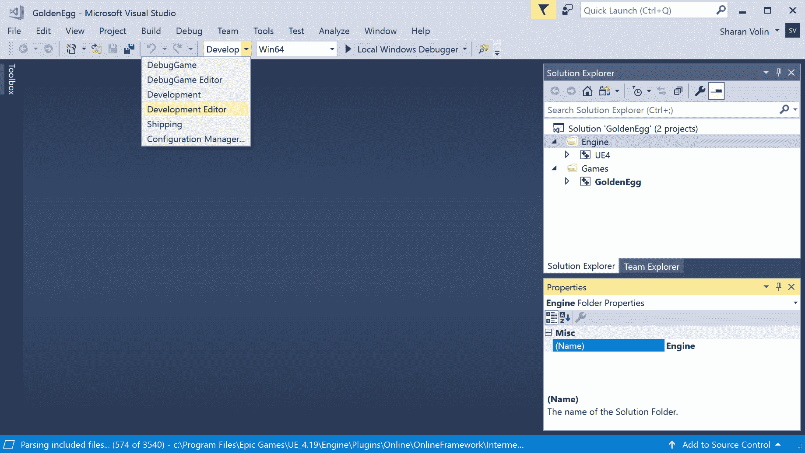

如下截图所示，虚幻编辑器也已启动：

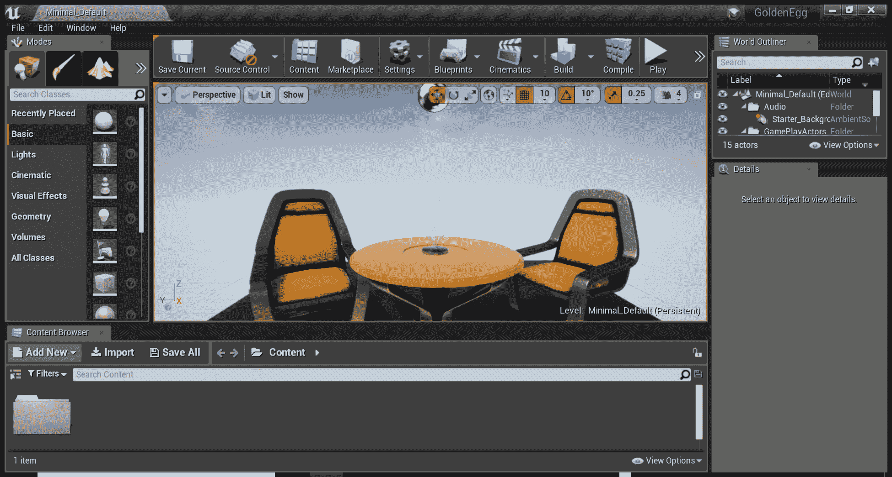

# UE4 编辑器

我们将在这里探索 UE4 编辑器。我们将从控件开始，因为了解如何在虚幻中导航很重要。

# 编辑器控件

如果您以前从未使用过 3D 编辑器，那么在编辑模式下，控件可能会很难学习。这些是在编辑模式下的基本导航控件：

+   使用箭头键在场景中移动

+   按*Page Up*或*Page Down*垂直上下移动

+   左键单击+向左或向右拖动以更改您所面对的方向

+   左键单击+向上或向下拖动以*移动*（将相机向前或向后移动，与按上/下箭头键相同）

+   右键单击+拖动以更改您所面对的方向

+   中键单击+拖动以平移视图

+   右键单击和*W*、*A*、*S*和*D*键用于在场景中移动

# 播放模式控制

单击顶部工具栏中的播放按钮，如下截图所示。这将启动播放模式：

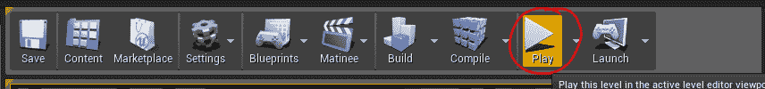

单击“播放”按钮后，控件会改变。在播放模式下，控件如下：

+   *W*、*A*、*S*和*D*键用于移动

+   使用左右箭头键分别向左或向右查看

+   鼠标的移动以改变您所看的方向

+   按*Esc*键退出播放模式并返回编辑模式

在这一点上，我建议您尝试向场景中添加一堆形状和对象，并尝试用不同的*材料*着色它们。

# 向场景添加对象

向场景添加对象就像从内容浏览器选项卡中拖放它们一样简单，如下所示：

1.  内容浏览器选项卡默认情况下停靠在窗口底部。如果看不到它，只需选择“窗口”，然后导航到“内容浏览器”即可使其出现：

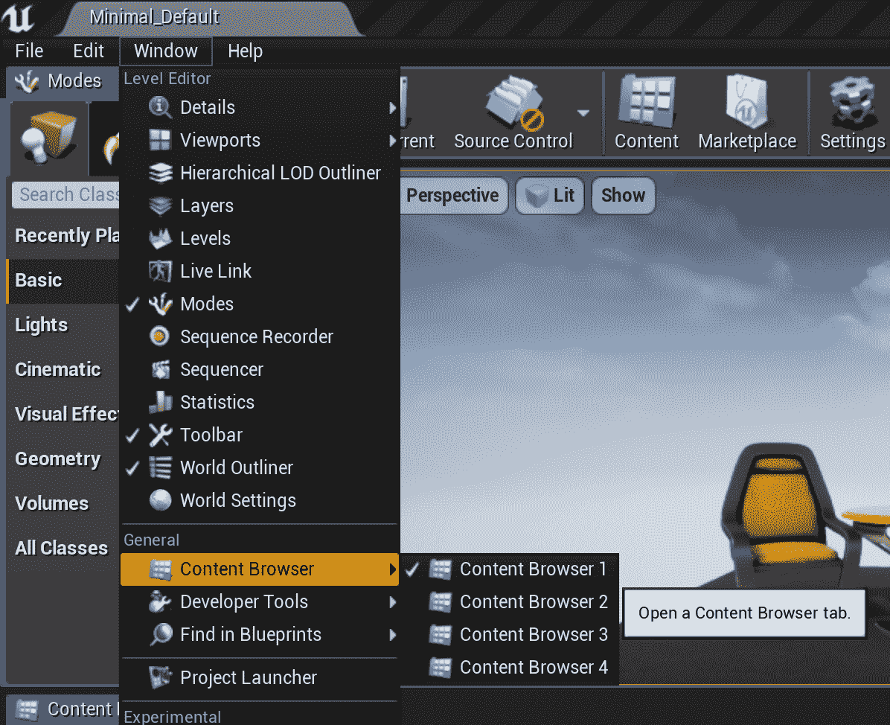

确保内容浏览器可见，以便向您的级别添加对象

1.  双击`StarterContent`文件夹以打开它。

1.  双击“道具”文件夹以查找可以拖放到场景中的对象。

1.  从内容浏览器中拖放物品到游戏世界中：

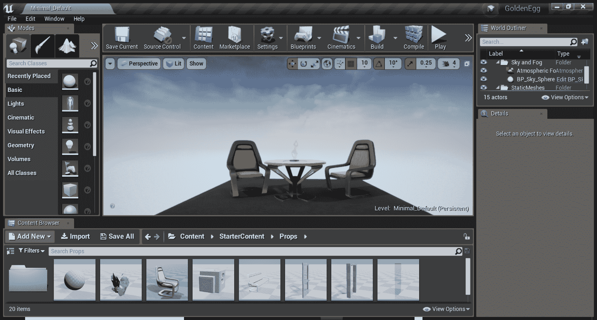

1.  要调整对象的大小，请在键盘上按*R*（再次按*W*移动它，或按*E*旋转对象）。对象周围的操作器将显示为方框，表示调整大小模式：

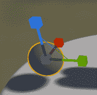

1.  要更改用于绘制对象的材料，只需从内容浏览器窗口中的材料文件夹内拖放新材料即可：

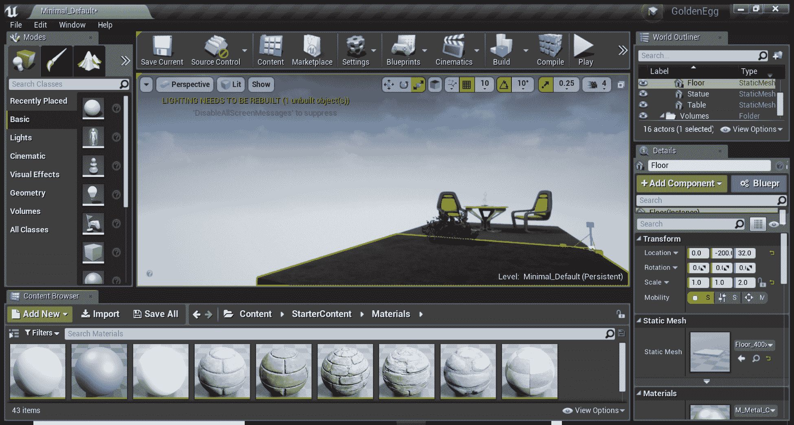

材料就像油漆。您可以通过简单地将所需的材料拖放到要涂抹的对象上，为对象涂上任何您想要的材料。材料只是表面深度；它们不会改变对象的其他属性（如重量）。

# 开始一个新级别

如果要从头开始创建级别，请执行以下步骤：

1.  单击“文件”，导航到“新建级别...”，如下所示：

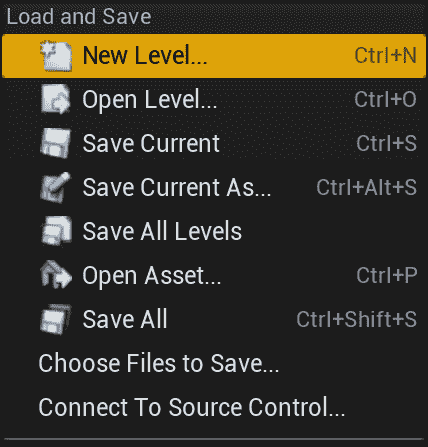

1.  然后可以在默认、VR-Basic 和空级别之间进行选择。我认为选择空级别是个好主意：

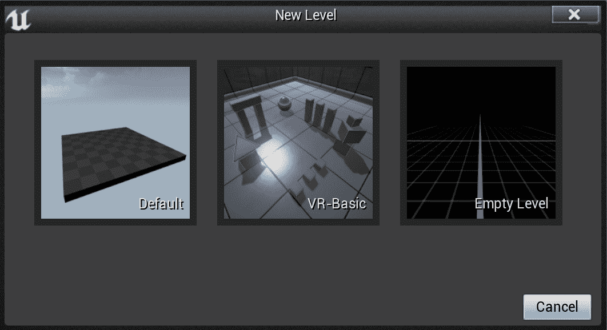

1.  新的级别一开始会完全黑暗。尝试再次从内容浏览器选项卡中拖放一些对象。

这次，我为地面添加了一个调整大小的形状/shape_plane（不要使用模式下的常规平面，一旦添加了玩家，你会穿过它），并用 T_ground_Moss_D 进行了纹理处理，还有一些道具/SM_Rocks 和粒子/P_Fire。

一定要保存你的地图。这是我的地图快照（你的是什么样子？）：

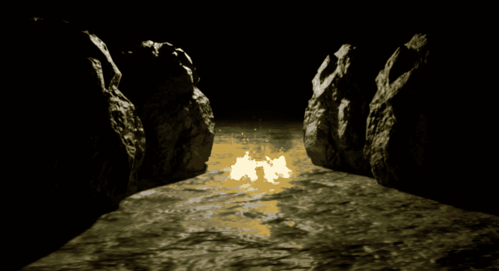

1.  如果你想要更改编辑器启动时打开的默认级别，转到编辑 | 项目设置 | 地图和模式；然后，你会看到一个游戏默认地图和编辑器启动地图设置，如下面的截图所示：

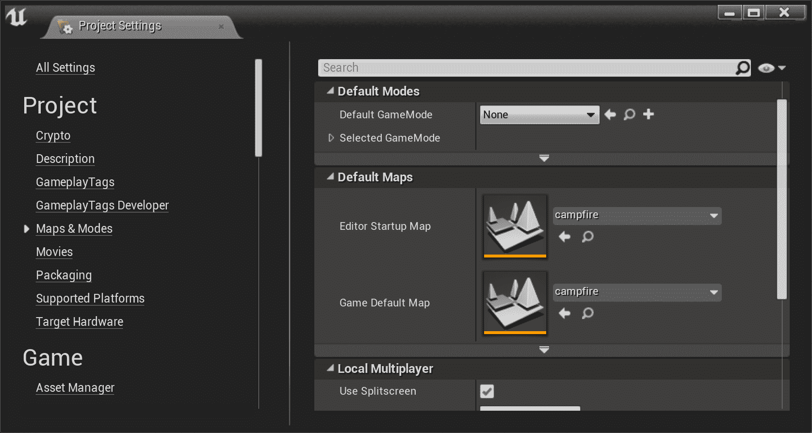

一定要确保你先保存当前场景！

# 添加光源

请注意，当你尝试运行时，你的场景可能会完全（或大部分）黑暗。这是因为你还没有在其中放置光源！

在之前的场景中，P_Fire 粒子发射器充当光源，但它只发出少量光线。为了确保你的场景中的一切都看起来被照亮，你应该添加一个光源，如下所示：

1.  转到窗口，然后点击模式，确保灯光面板显示出来：

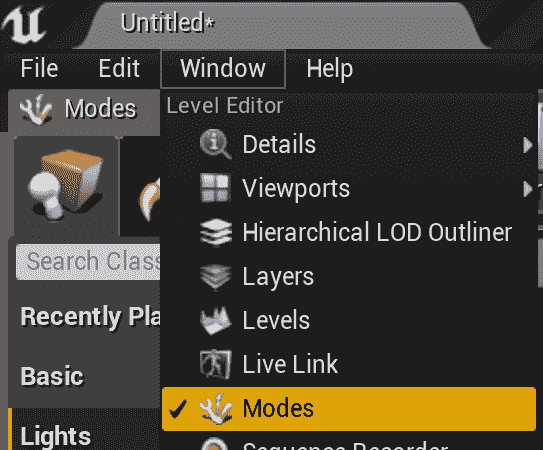

1.  从模式面板中，将一个灯光对象拖入场景中：

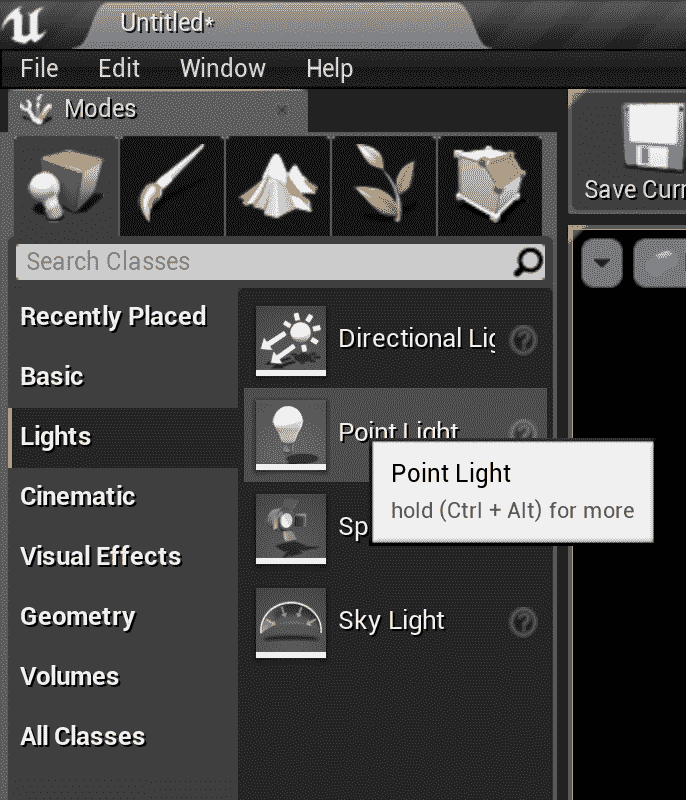

1.  选择灯泡和盒子图标（看起来像蘑菇，但实际上不是）。

1.  点击左侧面板中的灯光。

1.  选择你想要的灯光类型，然后将其拖入你的场景中。

如果你没有光源，当你尝试运行时（或者场景中没有物体时），你的场景将完全黑暗。

# 碰撞体积

到目前为止，你可能已经注意到，相机在播放模式下至少穿过了一些场景几何体。这不好。让我们让玩家不能只是在我们的场景中走过岩石。

有几种不同类型的碰撞体积。通常，完美的网格-网格碰撞在运行时成本太高。相反，我们使用一个近似值（边界体积）来猜测碰撞体积。

网格是对象的实际几何形状。

# 添加碰撞体积

我们首先要做的是将碰撞体积与场景中的每个岩石关联起来。

我们可以从 UE4 编辑器中这样做：

1.  点击场景中要添加碰撞体积的对象。

1.  在世界大纲选项卡中右键单击此对象（默认显示在屏幕右侧），然后选择编辑，如下面的截图所示：

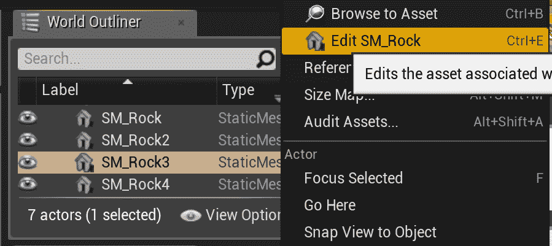

你会发现自己在网格编辑器中。

1.  转到碰撞菜单，然后点击添加简化碰撞胶囊：

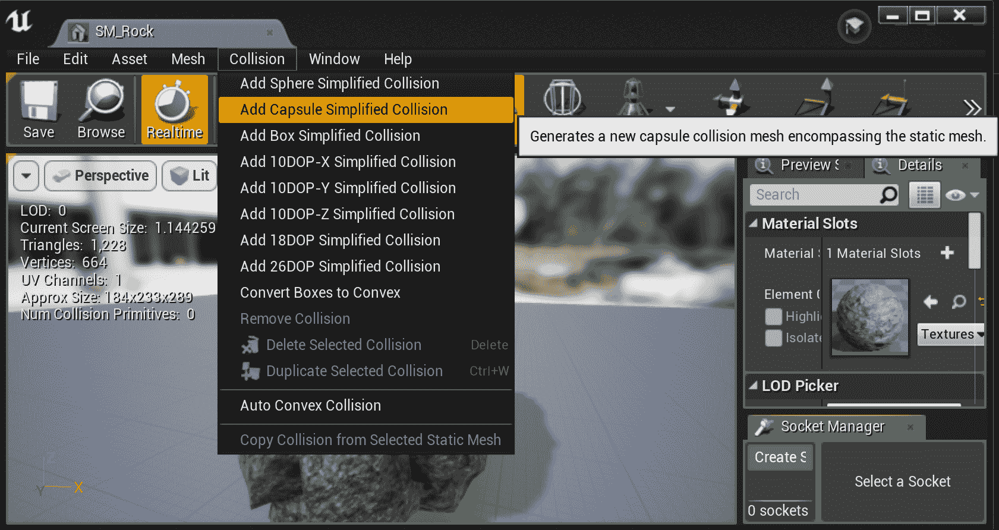

1.  成功添加碰撞体积后，碰撞体积将显示为一堆围绕对象的线，如下面的截图所示：

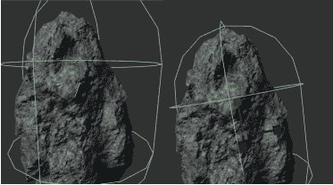

默认碰撞胶囊（左）和手动调整大小的版本（右）

1.  你可以调整（R）大小，旋转（E），移动（W），并根据需要更改碰撞体积，就像你在 UE4 编辑器中操作对象一样。

1.  当你添加完碰撞网格后，保存并返回到主编辑器窗口，然后点击播放；你会注意到你再也不能穿过你的可碰撞对象了。

# 将玩家添加到场景中

现在我们已经有了一个运行中的场景，我们需要向场景中添加一个角色。让我们首先为玩家添加一个角色，包括碰撞体积。为此，我们将不得不从 UE4 的`GameFramework`类中继承，比如`Actor`或`Character`。

为了创建玩家的屏幕表示，我们需要从虚幻中的`ACharacter`类派生。

# 从 UE4 GameFramework 类继承

UE4 使得从基础框架类继承变得容易。你只需要执行以下步骤：

1.  在 UE4 编辑器中打开你的项目。

1.  转到文件，然后选择新的 C++类...：

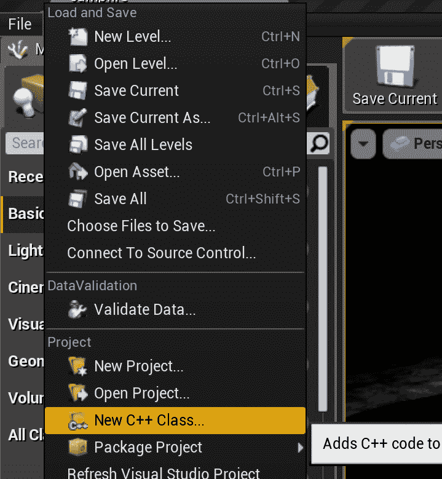

导航到文件|新的 C++类...将允许你从任何 UE4 GameFramework 类中派生

1.  选择你想要派生的基类。你有 Character、Pawn、Actor 等，但现在我们将从 Character 派生：

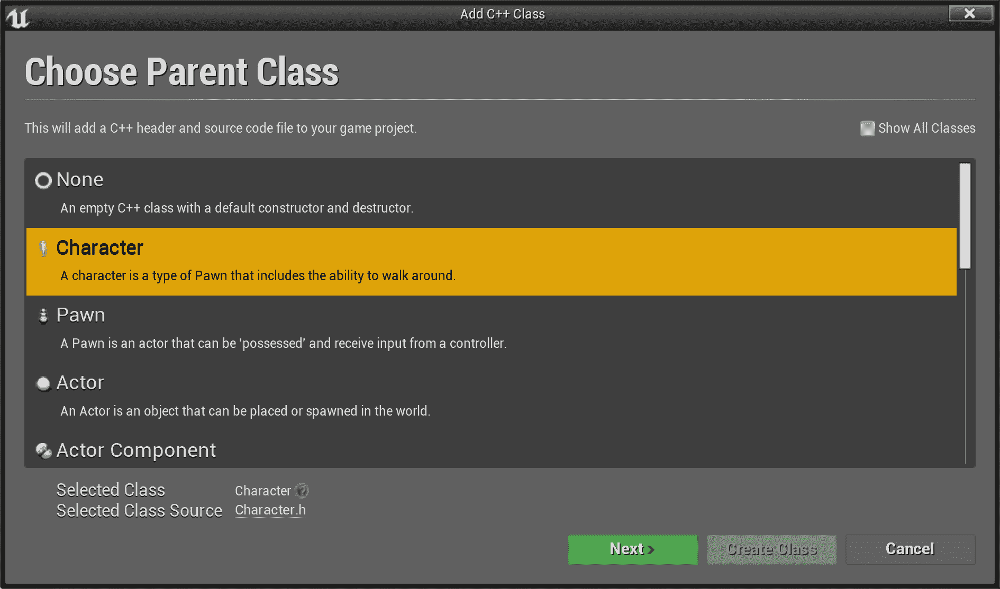

1.  选择你想要派生的 UE4 类。

1.  点击下一步，会弹出对话框，你可以在其中命名类。我将我的玩家类命名为`Avatar`：

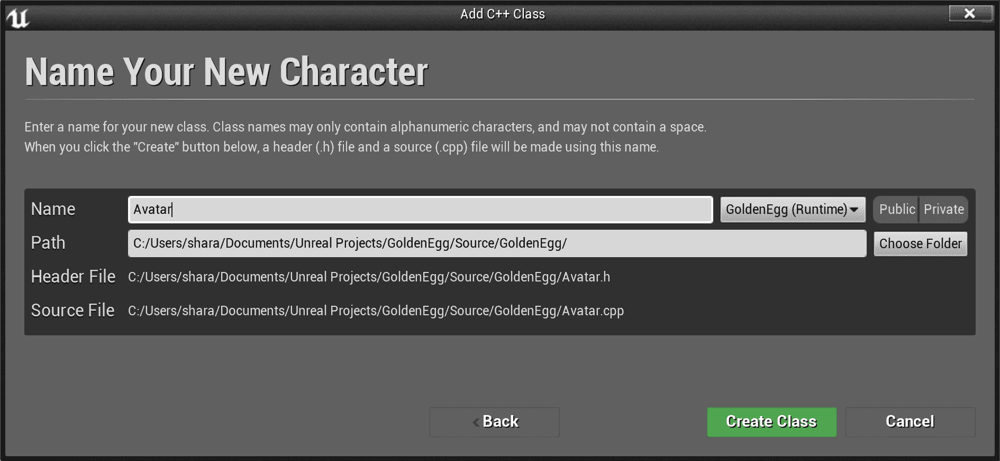

1.  点击 Create Class 在代码中创建类，如前面的截图所示。

如果需要，让 UE4 刷新你的 Visual Studio 或 Xcode 项目。从解决方案资源管理器中打开新的`Avatar.h`文件。

UE4 生成的代码看起来有点奇怪。记得我在第五章中建议你避免的宏吗，*函数和宏*？UE4 代码广泛使用宏。这些宏用于复制和粘贴样板启动代码，让你的代码与 UE4 编辑器集成。

`Avatar.h`文件的内容如下所示：

```cpp
#pragma once

#include "CoreMinimal.h"
#include "GameFramework/Character.h"
#include "Avatar.generated.h"

UCLASS()
class GOLDENEGG_API AAvatar : public ACharacter
{
    GENERATED_BODY()

public:
    // Sets default values for this character's properties
    AAvatar();

protected:
    // Called when the game starts or when spawned
    virtual void BeginPlay() override;

public:    
    // Called every frame
    virtual void Tick(float DeltaTime) override;

    // Called to bind functionality to input
    virtual void SetupPlayerInputComponent(class UInputComponent* PlayerInputComponent) override;

};
```

让我们来谈谈宏。

`UCLASS()`宏基本上使你的 C++代码类在 UE4 编辑器中可用。`GENERATED_BODY()`宏复制并粘贴了 UE4 需要的代码，以使你的类作为 UE4 类正常运行。

对于`UCLASS()`和`GENERATED_BODY()`，你不需要真正理解 UE4 是如何运作的。你只需要确保它们出现在正确的位置（在生成类时它们所在的位置）。

# 将模型与 Avatar 类关联

现在，我们需要将模型与我们的角色对象关联起来。为此，我们需要一个模型来操作。幸运的是，UE4 市场上有一整套免费的示例模型可供使用。

# 下载免费模型

要创建玩家对象，请执行以下步骤：

1.  从市场选项卡下载 Animation Starter Pack 文件（免费）。找到它的最简单方法是搜索它：


1.  从 Unreal Launcher 中，点击市场，搜索 Animation Starter Pack，在撰写本书时是免费的。

1.  一旦你下载了 Animation Starter Pack 文件，你就可以将它添加到之前创建的任何项目中，如下图所示：

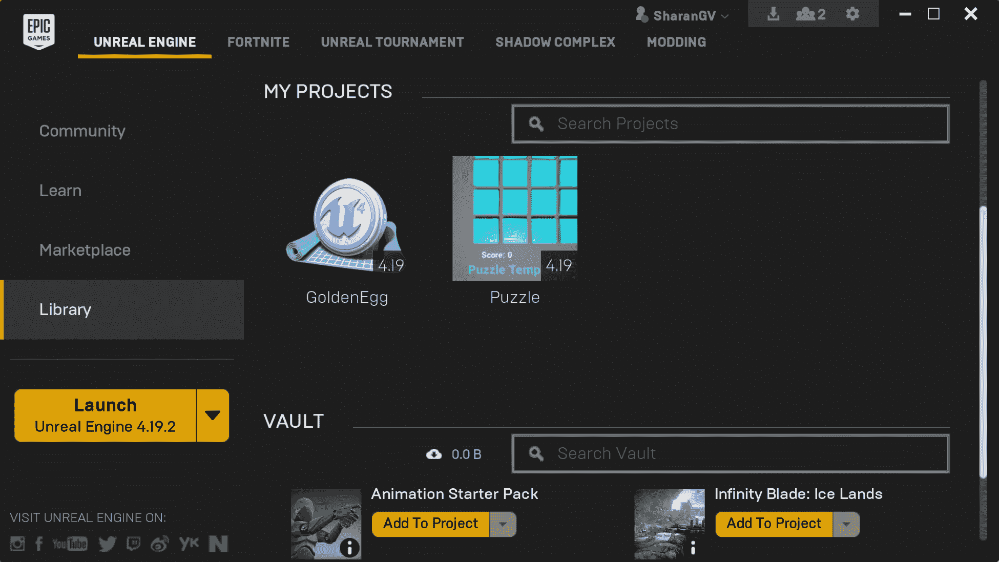

1.  当你点击 Animation Starter Pack 下的 Add to project 时，会弹出这个窗口，询问要将包添加到哪个项目中：

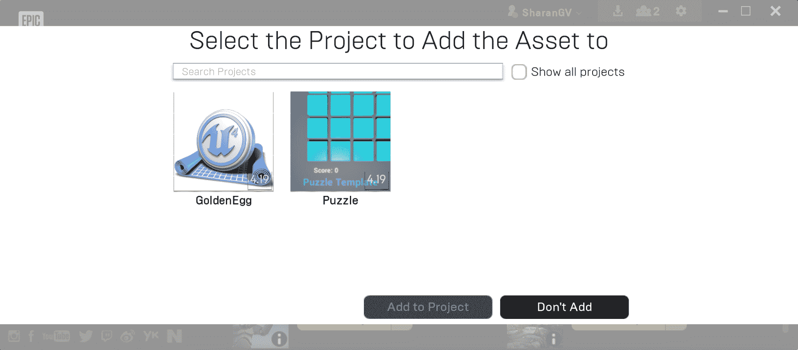

1.  只需选择你的项目，新的艺术作品将在你的内容浏览器中可用。

# 加载网格

一般来说，将你的资产（或游戏中使用的对象）硬编码到游戏中被认为是一种不好的做法。硬编码意味着你编写 C++代码来指定要加载的资产。然而，硬编码意味着加载的资产是最终可执行文件的一部分，这意味着在运行时更改加载的资产是不可修改的。这是一种不好的做法。最好能够在运行时更改加载的资产。

因此，我们将使用 UE4 蓝图功能来设置我们的`Avatar`类的模型网格和碰撞胶囊。

# 从我们的 C++类创建蓝图

让我们继续创建一个蓝图，这很容易：

1.  通过导航到窗口|开发者工具，然后点击 Class Viewer 来打开 Class Viewer 选项卡，如下所示：

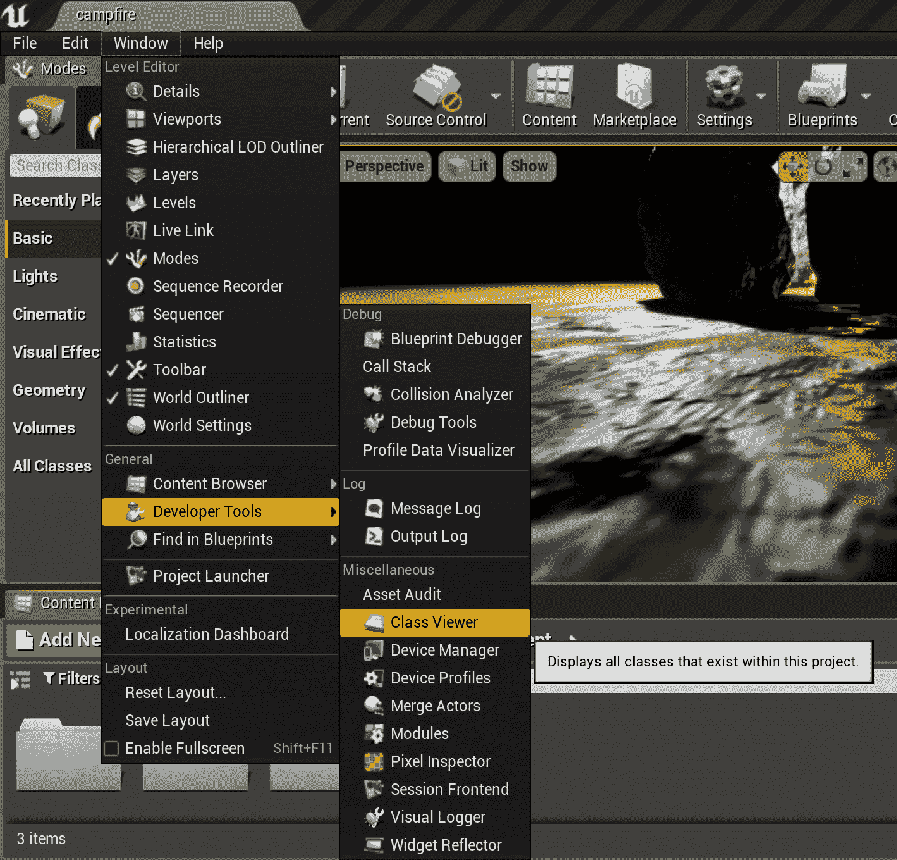

1.  在“类查看器”对话框中，开始输入你的 C++类的名称。如果你已经正确地从 C++代码中创建并导出了这个类，它将会出现，就像下面的截图所示：

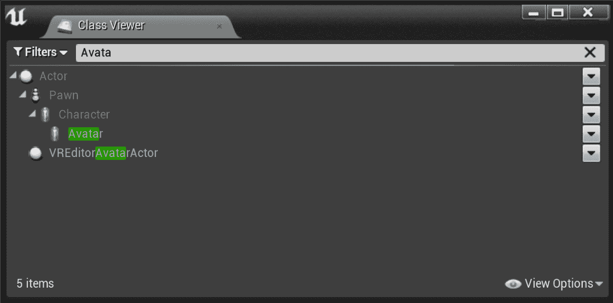

如果你的`Avatar`类没有显示出来，关闭编辑器，然后在 Visual Studio 或 Xcode 中重新编译/运行 C++项目。

1.  右键点击你想要创建蓝图的类（在我的例子中，是 Avatar 类），然后选择“创建蓝图类...”。

这是我的 Avatar 类），然后选择“创建蓝图类...”。

1.  给你的蓝图起一个独特的名字。我把我的蓝图叫做 BP_Avatar。BP_ 标识它是一个蓝图，这样以后搜索起来更容易。

1.  新的蓝图应该会自动打开以供编辑。如果没有，双击 BP_Avatar 打开它（在你添加它之后，它会出现在“类查看器”选项卡下的 Avatar 之下），就像下面的截图所示：

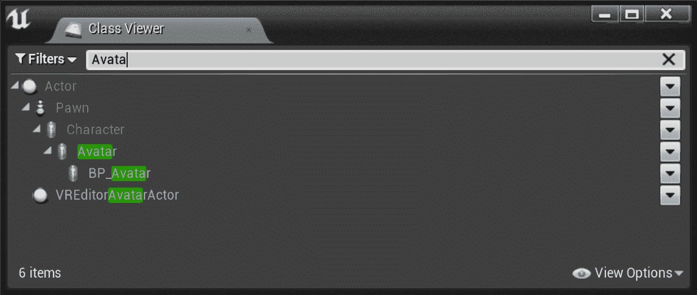

1.  你将会看到新的 BP_Avatar 对象的蓝图窗口，就像这样（确保选择“事件图”选项卡）：

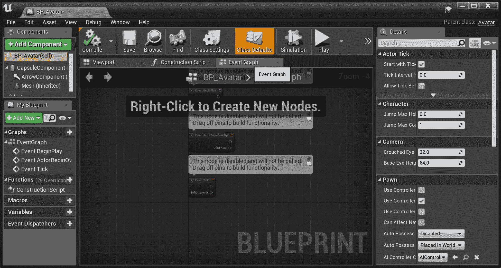

从这个窗口，你可以在视觉上将模型附加到`Avatar`类。同样，这是推荐的模式，因为通常是艺术家设置他们的资产供游戏设计师使用。

1.  你的蓝图已经继承了一个默认的骨骼网格。要查看它的选项，点击左侧的 CapsuleComponent 下的 Mesh（Inherited）：

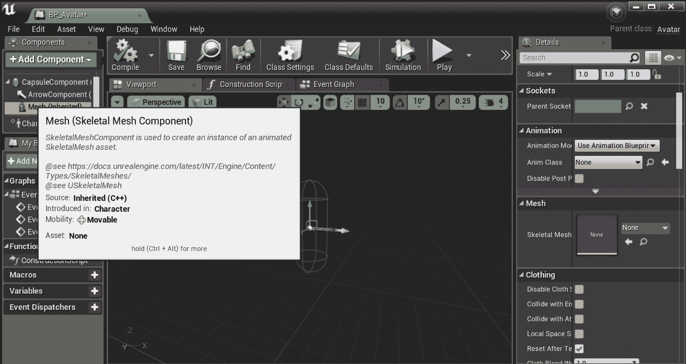

1.  点击下拉菜单，为你的模型选择 SK_Mannequin：

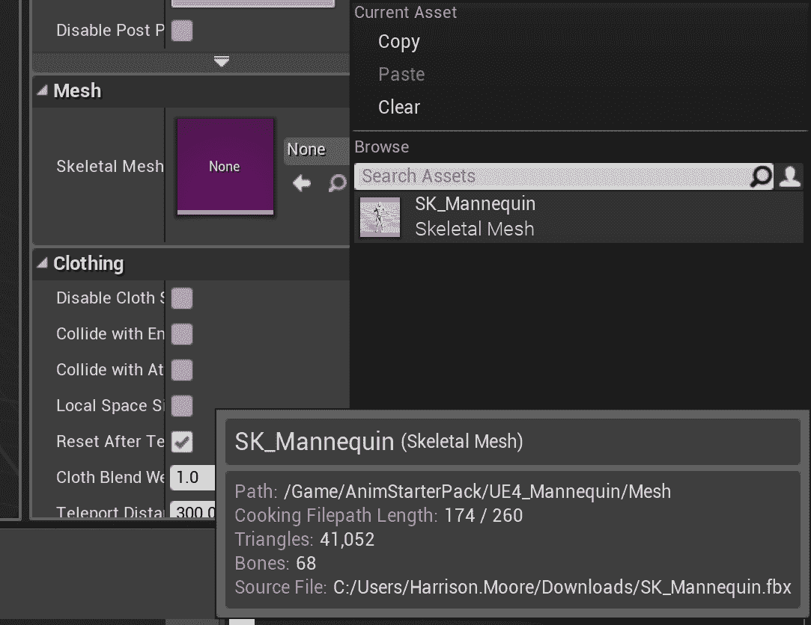

1.  如果 SK_Mannequin 没有出现在下拉菜单中，请确保你下载并将动画起始包添加到你的项目中。

1.  碰撞体积呢？你已经有一个叫做 CapsuleComponent 的了。如果你的胶囊没有包裹住你的模型，调整模型使其合适。

如果你的模型最终像我的一样，胶囊位置不对！我们需要调整它。

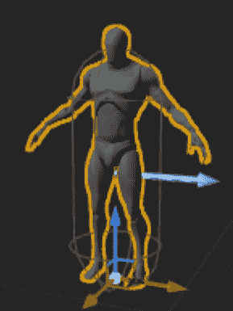

1.  点击 Avatar 模型，然后点击并按住向上的蓝色箭头，就像前面的截图所示。将他移动到合适的位置以适应胶囊。如果胶囊不够大，你可以在详细信息选项卡下调整它的大小，包括 Capsule Half-Height 和 Capsule Radius：

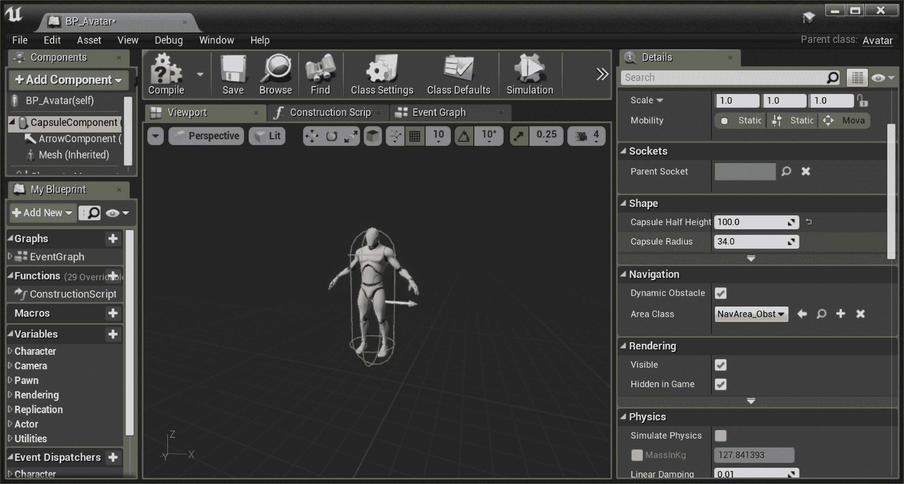

你可以通过调整 Capsule Half-Height 属性来拉伸你的胶囊。

1.  让我们把这个 Avatar 添加到游戏世界中。在 UE4 编辑器中，从“类查看器”选项卡中将 BP_Avatar 模型拖放到场景中：

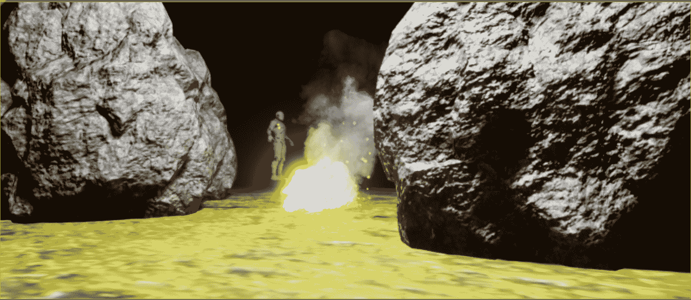

我们的 Avatar 类已经添加到场景中

Avatar 的姿势是默认的姿势。你想要他动起来，是吧！好吧，那很容易，只需按照以下步骤进行：

1.  在蓝图编辑器中点击你的 Mesh，你会在右侧的详细信息下看到 Animation。注意：如果你因为任何原因关闭了蓝图并重新打开它，你将看不到完整的蓝图。如果发生这种情况，点击链接打开完整的蓝图编辑器。

1.  现在你可以使用蓝图来进行动画。这样，艺术家可以根据角色的动作来正确设置动画。如果你从`AnimClass`下拉菜单中选择 UE4ASP_HeroTPP_AnimBlueprint，动画将会被蓝图（通常是由艺术家完成的）调整，以适应角色的移动：

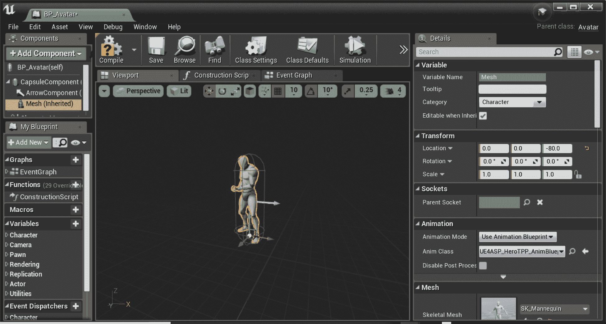

如果你保存并编译蓝图，并在主游戏窗口中点击播放，你将会看到空闲动画。

我们无法在这里覆盖所有内容。动画蓝图在第十一章中有介绍，*怪物*。如果你对动画真的感兴趣，不妨花点时间观看一些 Gnomon Workshop 关于 IK、动画和绑定的教程，可以在[gnomonworkshop.com/tutorials](http://gnomonworkshop.com/tutorials)找到。

还有一件事：让 Avatar 的相机出现在其后面。这将为您提供第三人称视角，使您可以看到整个角色，如下截图所示，以及相应的步骤：

1.  在 BP_Avatar 蓝图编辑器中，选择 BP_Avatar（Self）并单击添加组件。

1.  向下滚动以选择添加相机。

视口中将出现一个相机。您可以单击相机并移动它。将相机定位在玩家的后方某处。确保玩家身上的蓝色箭头面向相机的方向。如果不是，请旋转 Avatar 模型网格，使其面向与其蓝色箭头相同的方向：

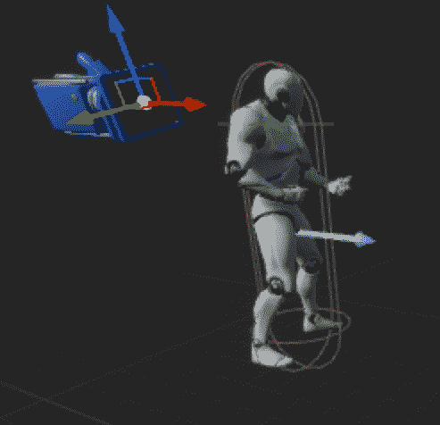

模型网格上的蓝色箭头表示模型网格的前进方向。确保相机的开口面向与角色的前向矢量相同的方向。

# 编写控制游戏角色的 C++代码

当您启动 UE4 游戏时，您可能会注意到相机没有改变。现在我们要做的是使起始角色成为我们`Avatar`类的实例，并使用键盘控制我们的角色。

# 使玩家成为 Avatar 类的实例

让我们看看我们如何做到这一点。在虚幻编辑器中，执行以下步骤：

1.  通过导航到 文件 | 新建 C++类... 并选择 Game Mode Base 来创建 Game Mode 的子类。我命名为`GameModeGoldenEgg`：

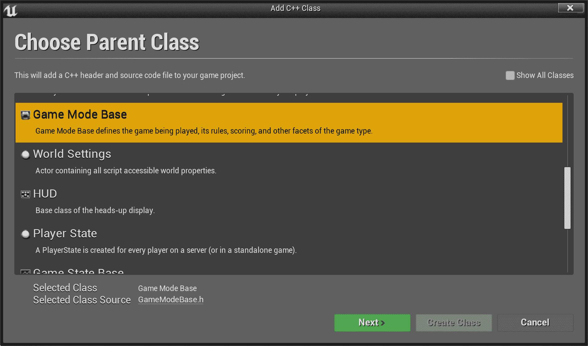

UE4 GameMode 包含游戏规则，并描述了游戏如何在引擎中进行。我们稍后将更多地使用我们的`GameMode`类。现在，我们需要对其进行子类化。

创建类后，它应该自动编译您的 C++代码，因此您可以创建`GameModeGoldenEgg`蓝图。

1.  通过转到顶部的菜单栏中的蓝图图标，单击 GameMode New，然后选择+ Create | GameModeGoldenEgg（或者您在步骤 1 中命名的 GameMode 子类）来创建 GameMode 蓝图：

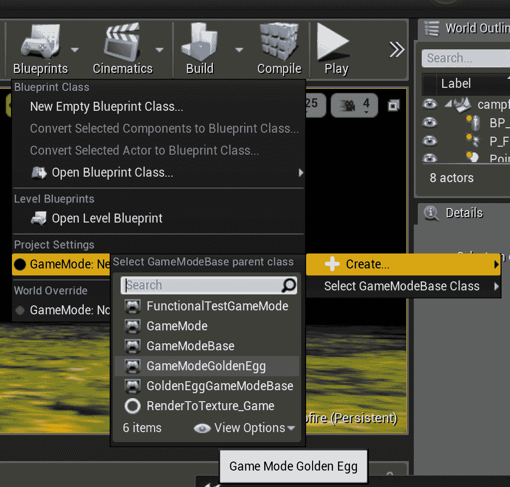

1.  命名您的蓝图；我称之为`BP_GameModeGoldenEgg`：

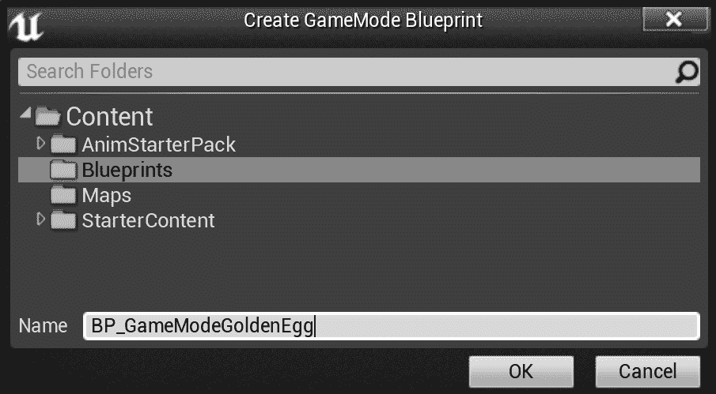

1.  您新创建的蓝图将在蓝图编辑器中打开。如果没有打开，您可以从类查看器选项卡中打开 BP_GameModeGoldenEgg 类。

1.  从默认 Pawn Class 面板中选择 BP_Avatar 类，如下截图所示。默认 Pawn Class 面板是将用于玩家的对象类型：

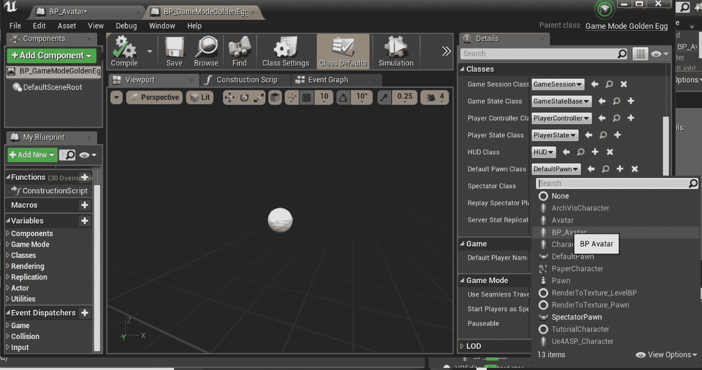

1.  启动您的游戏。您可以看到一个背面视图，因为相机放置在玩家后面：

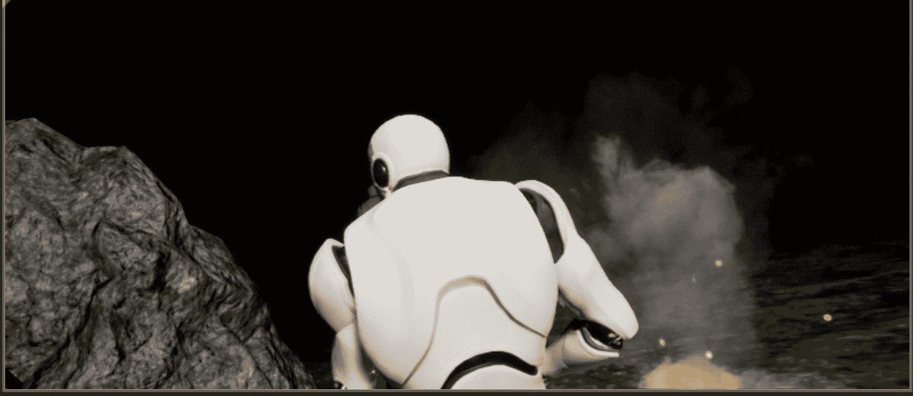

您会注意到您无法移动。为什么呢？答案是因为我们还没有设置控制器输入。接下来的部分将教您如何准确地进行操作。

# 设置控制器输入

以下是设置输入的步骤：

1.  要设置控制器输入，转到 设置 | 项目设置...：

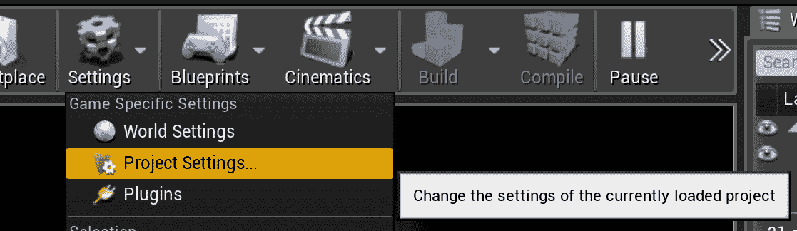

1.  在左侧面板中，向下滚动直到在引擎下看到输入：

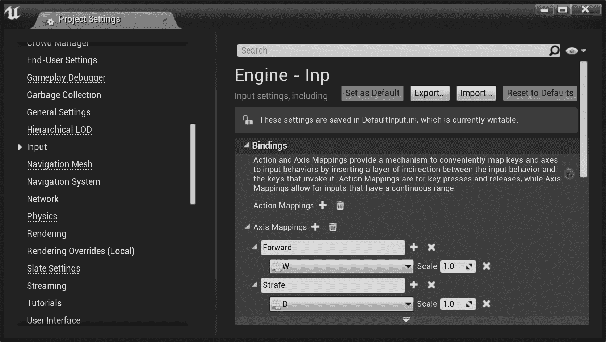

1.  在右侧，您可以设置一些绑定。单击+以添加新的绑定，然后单击 Axis Mappings 旁边的小箭头以展开它。开始添加两个轴映射，一个称为 Forward（连接到键盘字母*W*），另一个称为 Strafe（连接到键盘字母*D*）。记住您设置的名称；我们将在 C++代码中查找它们。

1.  关闭项目设置对话框。打开您的 C++代码。在`Avatar.h`构造函数中，您需要添加两个成员函数声明，如下所示：

```cpp
UCLASS()
class GOLDENEGG_API AAvatar : public ACharacter
{
    GENERATED_BODY()

public:
    // Sets default values for this character's properties
    AAvatar();

protected:
    // Called when the game starts or when spawned
    virtual void BeginPlay() override;

public:    
    // Called every frame
    virtual void Tick(float DeltaTime) override;

    // Called to bind functionality to input
    virtual void SetupPlayerInputComponent(class UInputComponent* PlayerInputComponent) override;

    // New! These 2 new member function declarations 
    // they will be used to move our player around! 
    void MoveForward(float amount);
    void MoveRight(float amount);

}; 
```

请注意，现有的函数`SetupPlayerInputComponent`和`Tick`是虚函数的重写。`SetupPlayerInputComponent`是`APawn`基类中的虚函数。我们还将向这个函数添加代码。

1.  在`Avatar.cpp`文件中，您需要添加函数主体。在`Super::SetupPlayerInputComponent(PlayerInputComponent);`下面的`SetupPlayerInputComponent`中，添加以下行：

```cpp
  check(PlayerInputComponent);
    PlayerInputComponent->BindAxis("Forward", this,
        &AAvatar::MoveForward);
    PlayerInputComponent->BindAxis("Strafe", this, &AAvatar::MoveRight);
```

这个成员函数查找我们刚刚在虚幻编辑器中创建的前进和横向轴绑定，并将它们连接到`this`类内部的成员函数。我们应该连接到哪些成员函数呢？为什么，我们应该连接到`AAvatar::MoveForward`和`AAvatar::MoveRight`。以下是这两个函数的成员函数定义：

```cpp
void AAvatar::MoveForward( float amount ) 
{ 
  // Don't enter the body of this function if Controller is 
  // not set up yet, or if the amount to move is equal to 0 
  if( Controller && amount ) 
  { 
    FVector fwd = GetActorForwardVector(); 
    // we call AddMovementInput to actually move the 
    // player by `amount` in the `fwd` direction 
    AddMovementInput(fwd, amount); 
  } 
} 

void AAvatar::MoveRight( float amount ) 
{ 
  if( Controller && amount ) 
  { 
    FVector right = GetActorRightVector(); 
    AddMovementInput(right, amount); 
  } 
} 
```

`Controller`对象和`AddMovementInput`函数在`APawn`基类中定义。由于`Avatar`类派生自`ACharacter`，而`ACharacter`又派生自`APawn`，因此我们可以免费使用`APawn`基类中的所有成员函数。现在，您看到了继承和代码重用的美丽之处了吗？如果您测试这个功能，请确保您点击游戏窗口内部，否则游戏将无法接收键盘事件。

# 练习

添加轴绑定和 C++函数以将玩家向左和向后移动。

这里有个提示：如果你意识到向后走实际上就是向前走的负数，那么你只需要添加轴绑定。

# 解决方案

通过导航到设置|项目设置...|输入，添加两个额外的轴绑定，如下所示：

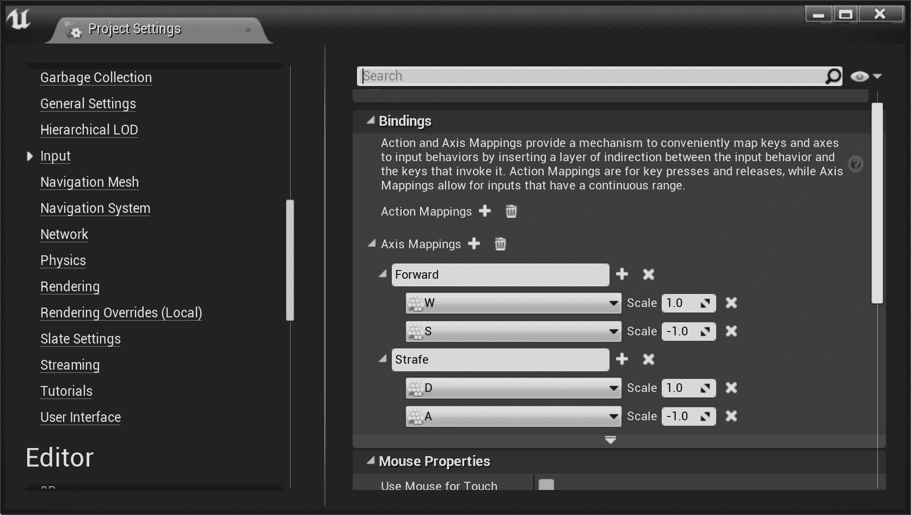

通过将 S 和 A 输入乘以-1.0 来缩放。这将反转轴，因此在游戏中按下*S*键将使玩家向前移动。试试看！

或者，您可以在`AAvatar`类中定义两个完全独立的成员函数，如下所示，并将*A*和*S*键分别绑定到`AAvatar::MoveLeft`和`AAvatar::MoveBack`（并确保为这些函数添加绑定到`AAvatar::SetupPlayerInputComponent`）：

```cpp
void AAvatar::MoveLeft( float amount ) 
{ 
  if( Controller && amount ) 
  { 
    FVector left = -GetActorRightVector(); 
    AddMovementInput(left, amount); 
  } 
} 
void AAvatar::MoveBack( float amount ) 
{ 
  if( Controller && amount ) 
  { 
    FVector back = -GetActorForwardVector(); 
    AddMovementInput(back, amount); 
  } 
} 
```

# 偏航和俯仰

我们可以通过设置控制器的偏航和俯仰来改变玩家的朝向。请查看以下步骤：

1.  按照以下截图所示，为鼠标添加新的轴绑定：

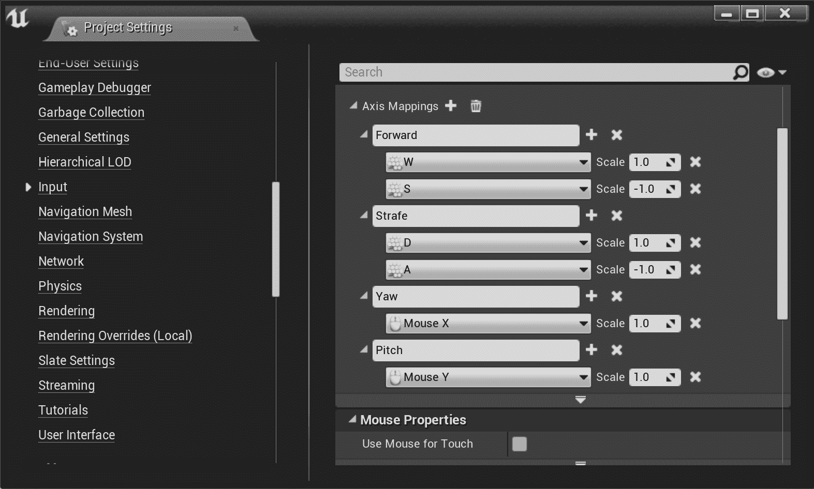

1.  从 C++中，向`AAvatar.h`添加两个新的成员函数声明：

```cpp
void Yaw( float amount ); 
void Pitch( float amount ); 
```

这些成员函数的主体将放在`AAvatar.cpp`文件中：

```cpp
void AAvatar::Yaw(float amount)
{
    AddControllerYawInput(200.f * amount * GetWorld()->GetDeltaSeconds());
}
void AAvatar::Pitch(float amount)
{
    AddControllerPitchInput(200.f * amount * GetWorld()->GetDeltaSeconds());
}
```

1.  在`SetupPlayerInputComponent`中添加两行：

```cpp
void AAvatar::SetupPlayerInputComponent(UInputComponent* PlayerInputComponent)
{ 
  // .. as before, plus: 
  PlayerInputComponent->BindAxis("Yaw", this, &AAvatar::Yaw);
  PlayerInputComponent->BindAxis("Pitch", this, &AAvatar::Pitch); 
} 
```

在这里，注意我如何将`Yaw`和`Pitch`函数中的`amount`值乘以 200。这个数字代表鼠标的灵敏度。您可以（应该）在`AAvatar`类中添加一个`float`成员，以避免硬编码这个灵敏度数字。

`GetWorld()->GetDeltaSeconds()`给出了上一帧和这一帧之间经过的时间。这不是很多；`GetDeltaSeconds()`大多数时候应该在 16 毫秒左右（如果您的游戏以 60fps 运行）。

注意：您可能会注意到现在俯仰实际上并不起作用。这是因为您正在使用第三人称摄像头。虽然对于这个摄像头可能没有意义，但您可以通过进入 BP_Avatar，选择摄像头，并在摄像头选项下勾选使用 Pawn 控制旋转来使其起作用：

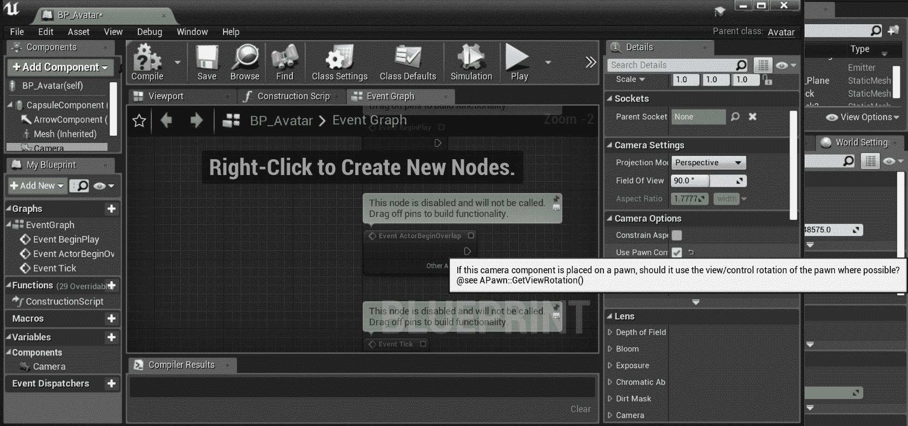

因此，现在我们有了玩家输入和控制。要为您的 Avatar 添加新功能，您只需要做到这一点：

1.  通过转到设置|项目设置|输入，绑定您的键盘或鼠标操作。

1.  添加一个在按下该键时运行的成员函数。

1.  在`SetupPlayerInputComponent`中添加一行，将绑定输入的名称连接到我们希望在按下该键时运行的成员函数。

# 创建非玩家角色实体

因此，我们需要创建一些**NPC**（**非玩家角色**）。NPC 是游戏中帮助玩家的角色。一些提供特殊物品，一些是商店供应商，一些有信息要提供给玩家。在这个游戏中，他们将在玩家靠近时做出反应。让我们在一些行为中编程：

1.  创建另一个 Character 的子类。在 UE4 编辑器中，转到文件 | 新建 C++类...，并选择可以创建子类的 Character 类。将您的子类命名为`NPC`。

1.  在 Visual Studio 中编辑您的代码。每个 NPC 都会有一条消息告诉玩家，因此我们在`NPC`类中添加了一个`UPROPERTY() FString`属性。

`FString`是 UE4 中 C++的`<string>`类型。在 UE4 中编程时，应该使用`FString`对象而不是 C++ STL 的`string`对象。一般来说，应该使用 UE4 的内置类型，因为它们保证跨平台兼容性。

1.  以下是如何向`NPC`类添加`UPROPERTY() FString`属性：

```cpp
UCLASS()
class GOLDENEGG_API ANPC : public ACharacter
{
    GENERATED_BODY()

    // This is the NPC's message that he has to tell us. 
    UPROPERTY(EditAnywhere, BlueprintReadWrite, Category =
        NPCMessage)
        FString NpcMessage;
    // When you create a blueprint from this class, you want to be  
    // able to edit that message in blueprints, 
    // that's why we have the EditAnywhere and BlueprintReadWrite  
    // properties. 
public:
    // Sets default values for this character's properties
    ANPC();

protected:
    // Called when the game starts or when spawned
    virtual void BeginPlay() override;

public:    
    // Called every frame
    virtual void Tick(float DeltaTime) override;

    // Called to bind functionality to input
    virtual void SetupPlayerInputComponent(class UInputComponent* PlayerInputComponent) override;

};
```

请注意，我们将`EditAnywhere`和`BlueprintReadWrite`属性放入了`UPROPERTY`宏中。这将使`NpcMessage`在蓝图中可编辑。

所有 UE4 属性说明符的完整描述可在[`docs.unrealengine.com/latest/INT/Programming/UnrealArchitecture/Reference/Properties/index.html`](https://docs.unrealengine.com/latest/INT/Programming/UnrealArchitecture/Reference/Properties/index.html)上找到。

1.  重新编译您的项目（就像我们为`Avatar`类所做的那样）。然后，转到类查看器，在您的`NPC`类上右键单击，并从中创建蓝图类。

1.  您想要创建的每个 NPC 角色都可以是基于`NPC`类的蓝图。为每个蓝图命名一个独特的名称，因为我们将为每个出现的 NPC 选择不同的模型网格和消息，如下面的屏幕截图所示：

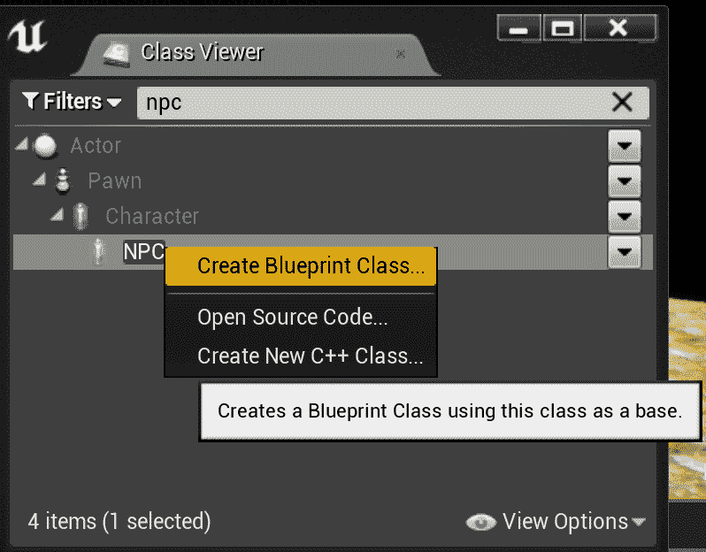

1.  打开蓝图并选择 Mesh（继承）。然后，您可以在骨骼网格下拉菜单中更改您的新角色的材质，使其看起来与玩家不同：

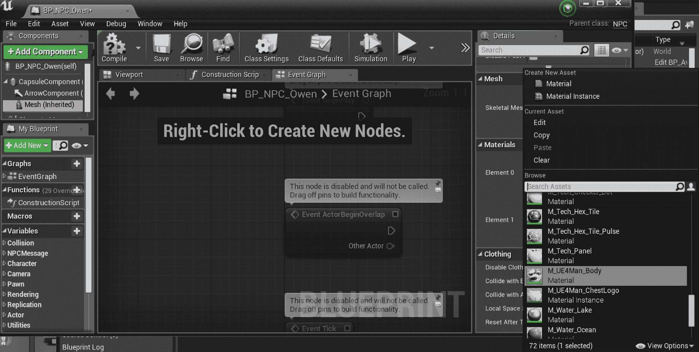

通过从下拉菜单中选择每个元素，更改您的角色在网格属性中的材质

1.  在组件选项卡中选择蓝图名称（self），在详细信息选项卡中查找`NpcMessage`属性。这是我们在 C++代码和蓝图之间的连接；因为我们在`FString NpcMessage`变量上输入了`UPROPERTY()`函数，该属性在 UE4 中显示为可编辑，如下面的屏幕截图所示：

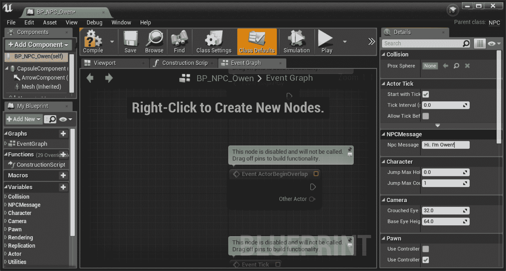

1.  将 BP_NPC_Owen 拖入场景中。您也可以创建第二个或第三个角色，并确保为它们提供独特的名称、外观和消息：

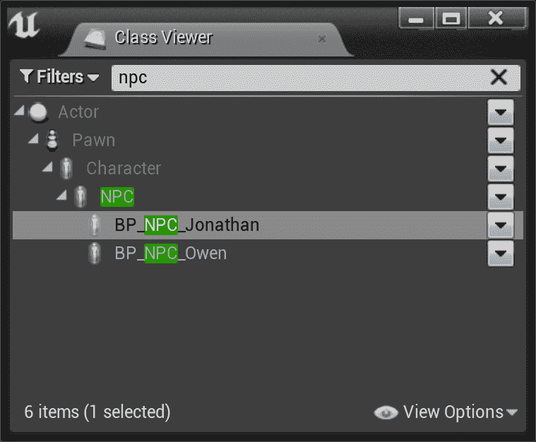

我已经为基于 NPC 基类的 NPC 创建了两个蓝图：BP_NPC_Jonathan 和 BP_NPC_Owen。它们对玩家有不同的外观和不同的消息：

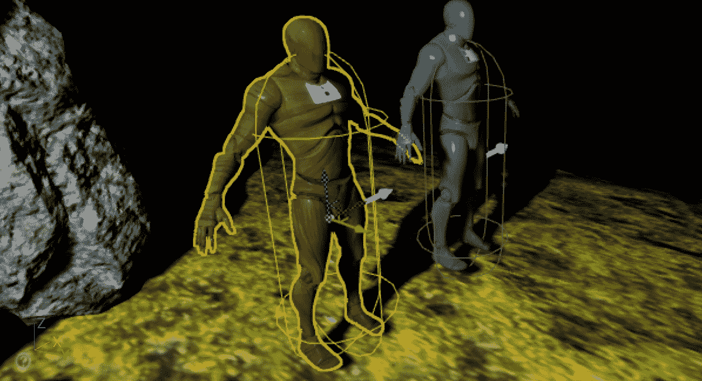

场景中的 Jonathan 和 Owen

# 显示每个 NPC 对话框中的引用

为了显示对话框，我们需要一个自定义的**悬浮显示**（**HUD**）。在 UE4 编辑器中，转到文件 | 新建 C++类...，并选择从中创建子类的`HUD`类（您需要向下滚动以找到它）。按您的意愿命名您的子类；我命名为`MyHUD`。

创建`MyHUD`类后，让 Visual Studio 重新加载。我们将进行一些代码编辑。

# 在 HUD 上显示消息

在`AMyHUD`类中，我们需要实现`DrawHUD()`函数，以便将我们的消息绘制到 HUD 上，并使用以下`MyHUD.h`中的代码初始化 HUD 的字体绘制：

```cpp
UCLASS()
class GOLDENEGG_API AMyHUD : public AHUD
{
    GENERATED_BODY()
public:
    // The font used to render the text in the HUD. 
    UPROPERTY(EditAnywhere, BlueprintReadWrite, Category = HUDFont)
    UFont* hudFont;
    // Add this function to be able to draw to the HUD! 
    virtual void DrawHUD() override;
};
```

HUD 字体将在`AMyHUD`类的蓝图版本中设置。`DrawHUD()`函数每帧运行一次。为了在帧内绘制，将一个函数添加到`AMyHUD.cpp`文件中：

```cpp
void AMyHUD::DrawHUD()
{
    // call superclass DrawHUD() function first 
    Super::DrawHUD();
    // then proceed to draw your stuff. 
    // we can draw lines.. 
    DrawLine(200, 300, 400, 500, FLinearColor::Blue);
    // and we can draw text! 
    const FVector2D ViewportSize = FVector2D(GEngine->GameViewport->Viewport->GetSizeXY());
    DrawText("Greetings from Unreal!", FLinearColor::White, ViewportSize.X/2, ViewportSize.Y/2, hudFont);
}
```

等等！我们还没有初始化我们的字体。让我们现在做这个：

1.  在蓝图中设置它。在编辑器中编译您的 Visual Studio 项目，然后转到顶部的蓝图菜单，导航到 GameMode | HUD | + Create | MyHUD:

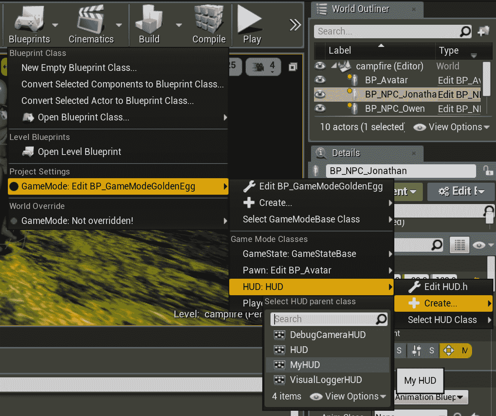

创建 MyHUD 类的蓝图

1.  我称我的为`BP_MyHUD`。找到`Hud Font`，选择下拉菜单，并创建一个新的字体资源。我命名为`MyHUDFont`：

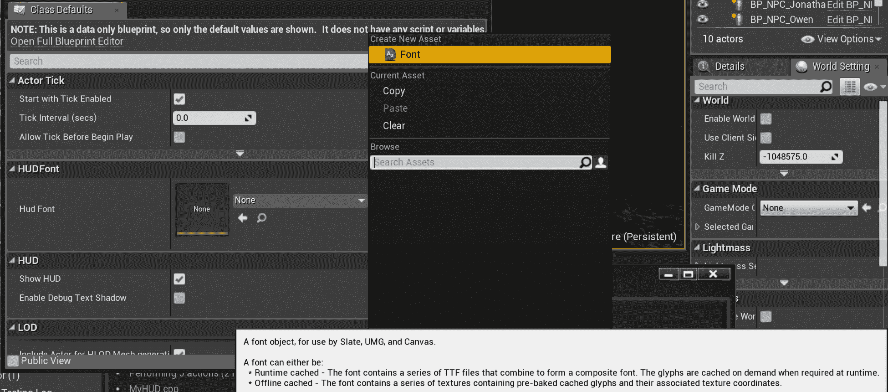

1.  在内容浏览器中找到 MyHUDFont 并双击以编辑它：

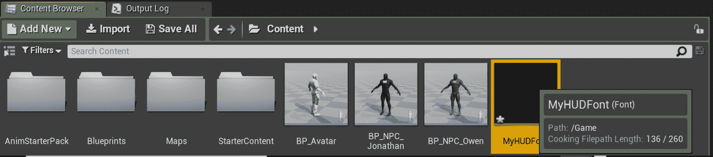

在随后的窗口中，您可以点击`+ Add Font`创建一个新的默认字体系列。您可以自行命名并单击文件夹图标选择硬盘上的字体（您可以在许多网站免费找到.TTF 或 TrueType 字体 - 我使用了找到的 Blazed 字体）；当您导入字体时，它将要求您保存字体。您还需要将 MyHUDFont 中的 Legacy Font Size 更改为更大的大小（我使用了 36）。

1.  编辑您的游戏模式蓝图（BP_GameModeGoldenEgg）并选择您的新`BP_MyHUD`（而不是`MyHUD`）类作为 HUD Class 面板：

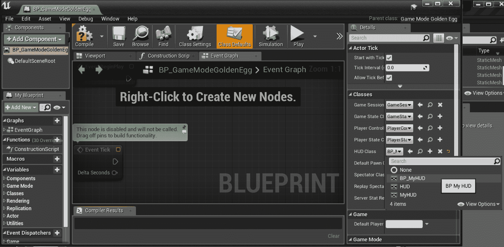

编译并测试您的程序！您应该在屏幕上看到打印的文本：

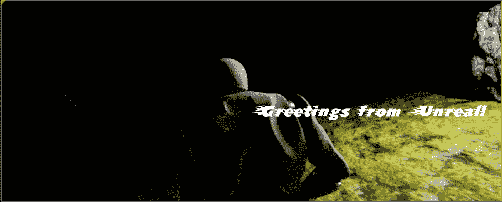

# 练习

您可以看到文本并没有完全居中。这是因为位置是基于文本的左上角而不是中间的。

看看你能否修复它。这里有一个提示：获取文本的宽度和高度，然后从视口宽度和高度/2 中减去一半。您将需要使用类似以下的内容：

```cpp
    const FVector2D ViewportSize = FVector2D(GEngine->GameViewport->Viewport->GetSizeXY());
    const FString message("Greetings from Unreal!");
    float messageWidth = 0;
    float messageHeight = 0;
    GetTextSize(message, messageWidth, messageHeight, hudFont);
    DrawText(message, FLinearColor::White, (ViewportSize.X - messageWidth) / 2, (ViewportSize.Y - messageHeight) / 2, hudFont);
```

# 使用 TArray<Message>

我们要显示给玩家的每条消息都将有一些属性：

+   用于消息的`FString`变量

+   用于显示消息的时间的`float`变量

+   用于消息颜色的`FColor`变量

因此，对我们来说，写一个小的`struct`函数来包含所有这些信息是有意义的。

在`MyHUD.h`的顶部，插入以下`struct`声明：

```cpp
struct Message 
{ 
  FString message; 
  float time; 
  FColor color; 
  Message() 
  { 
    // Set the default time. 
    time = 5.f; 
    color = FColor::White; 
  } 
  Message( FString iMessage, float iTime, FColor iColor ) 
  { 
    message = iMessage; 
    time = iTime; 
    color = iColor; 
  } 
}; 
```

现在，在`AMyHUD`类内，我们要添加一个这些消息的`TArray`。`TArray`是 UE4 定义的一种特殊类型的动态增长的 C++数组。我们将在第九章中详细介绍`TArray`的使用，但这种简单的`TArray`使用应该是对游戏中数组的有用性的一个很好的介绍。这将被声明为`TArray<Message>`：

```cpp
UCLASS()
class GOLDENEGG_API AMyHUD : public AHUD
{
    GENERATED_BODY()
public:
    // The font used to render the text in the HUD. 
    UPROPERTY(EditAnywhere, BlueprintReadWrite, Category = HUDFont)
        UFont* hudFont;
    // New! An array of messages for display 
    TArray<Message> messages;
    virtual void DrawHUD() override;
    // New! A function to be able to add a message to display 
    void addMessage(Message msg);
};
```

还要在文件顶部添加**`#include "CoreMinimal.h"`**。

现在，每当 NPC 有消息要显示时，我们只需要调用`AMyHud::addMessage()`并传入我们的消息。消息将被添加到要显示的消息的`TArray`中。当消息过期（在一定时间后），它将从 HUD 中移除。

在`AMyHUD.cpp`文件内，添加以下代码：

```cpp
void AMyHUD::DrawHUD()
{
    Super::DrawHUD();
    // iterate from back to front thru the list, so if we remove 
    // an item while iterating, there won't be any problems 
    for (int c = messages.Num() - 1; c >= 0; c--)
    {
        // draw the background box the right size 
        // for the message 
        float outputWidth, outputHeight, pad = 10.f;
        GetTextSize(messages[c].message, outputWidth, outputHeight,
            hudFont, 1.f);

        float messageH = outputHeight + 2.f*pad;
        float x = 0.f, y = c * messageH;

        // black backing 
        DrawRect(FLinearColor::Black, x, y, Canvas->SizeX, messageH
        );
        // draw our message using the hudFont 
        DrawText(messages[c].message, messages[c].color, x + pad, y +
            pad, hudFont);

        // reduce lifetime by the time that passed since last  
        // frame. 
        messages[c].time -= GetWorld()->GetDeltaSeconds();

        // if the message's time is up, remove it 
        if (messages[c].time < 0)
        {
            messages.RemoveAt(c);
        }
    }
}

void AMyHUD::addMessage(Message msg)
{
    messages.Add(msg);
}
```

`AMyHUD::DrawHUD()`函数现在绘制`messages`数组中的所有消息，并根据自上一帧以来经过的时间对`messages`数组中的每条消息进行排列。一旦消息的`time`值降至 0 以下，过期的消息将从`messages`集合中移除。

# 练习

重构`DrawHUD()`函数，使将消息绘制到屏幕的代码放在一个名为`DrawMessages()`的单独函数中。您可能希望创建至少一个样本消息对象，并调用`addMessage`以便您可以看到它。

`Canvas`变量仅在`DrawHUD()`中可用，因此您将不得不将`Canvas->SizeX`和`Canvas->SizeY`保存在类级变量中。

重构意味着改变代码的内部工作方式，使其更有组织或更容易阅读，但对于运行程序的用户来说，结果看起来是一样的。重构通常是一个好的实践。重构发生的原因是因为没有人在开始编写代码时确切地知道最终的代码应该是什么样子。

# 当玩家靠近 NPC 时触发事件

要在 NPC 附近触发事件，我们需要设置一个额外的碰撞检测体积，它比默认的胶囊形状稍宽。额外的碰撞检测体积将是每个 NPC 周围的一个球体。当玩家走进 NPC 的球体时，NPC（如下所示）会做出反应并显示一条消息：

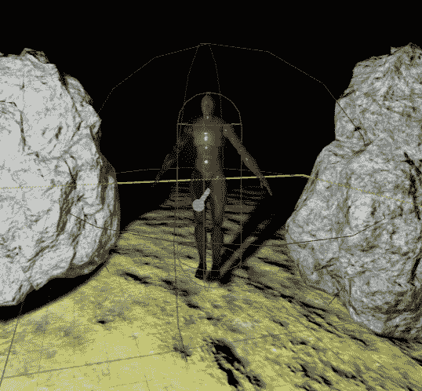

我们将向 NPC 添加深红色的球体，以便它可以知道玩家是否附近。

在`NPC.h`类文件中，添加`#include "Components/SphereComponent.h"`到顶部，并添加以下代码：

```cpp
UCLASS() class GOLDENEGG_API ANPC : public ACharacter {
    GENERATED_BODY()

public:
    // The sphere that the player can collide with tob
    UPROPERTY(VisibleAnywhere, BlueprintReadOnly, Category =
        Collision)
        USphereComponent* ProxSphere;
    // This is the NPC's message that he has to tell us. 
    UPROPERTY(EditAnywhere, BlueprintReadWrite, Category =
        NPCMessage)
        FString NpcMessage; // The corresponding body of this function is 
                            // ANPC::Prox_Implementation, __not__ ANPC::Prox()! 
                            // This is a bit weird and not what you'd expect, 
                            // but it happens because this is a BlueprintNativeEvent 
    UFUNCTION(BlueprintNativeEvent, Category = "Collision")
        void Prox(UPrimitiveComponent* OverlappedComponent, AActor* OtherActor, UPrimitiveComponent* OtherComp,
            int32 OtherBodyIndex, bool bFromSweep, const FHitResult& SweepResult);
    // You shouldn't need this unless you get a compiler error that it can't find this function.
    virtual int Prox_Implementation(UPrimitiveComponent* OverlappedComponent, AActor* OtherActor, UPrimitiveComponent* OtherComp,
        int32 OtherBodyIndex, bool bFromSweep, const FHitResult& SweepResult);

    // Sets default values for this character's properties
    ANPC(const FObjectInitializer& ObjectInitializer);

protected:
    // Called when the game starts or when spawned
    virtual void BeginPlay() override;

public:
    // Called every frame
    virtual void Tick(float DeltaTime) override;

    // Called to bind functionality to input
    virtual void SetupPlayerInputComponent(class UInputComponent* PlayerInputComponent) override;
};
```

这看起来有点凌乱，但实际上并不复杂。在这里，我们声明了一个额外的边界球体积，称为`ProxSphere`，它可以检测玩家是否靠近 NPC。

在`NPC.cpp`文件中，我们需要添加以下代码以完成接近检测：

```cpp
ANPC::ANPC(const FObjectInitializer& ObjectInitializer)
 : Super(ObjectInitializer)
{
 ProxSphere = ObjectInitializer.CreateDefaultSubobject<USphereComponent>(this,
 TEXT("Proximity Sphere"));
 ProxSphere->AttachToComponent(RootComponent, FAttachmentTransformRules::KeepWorldTransform);
 ProxSphere->SetSphereRadius(32.0f);
 // Code to make ANPC::Prox() run when this proximity sphere 
 // overlaps another actor. 
 ProxSphere->OnComponentBeginOverlap.AddDynamic(this, &ANPC::Prox);
 NpcMessage = "Hi, I'm Owen";//default message, can be edited 
 // in blueprints 
}

// Note! Although this was declared ANPC::Prox() in the header, 
// it is now ANPC::Prox_Implementation here. 
int ANPC::Prox_Implementation(UPrimitiveComponent* OverlappedComponent, AActor* OtherActor, UPrimitiveComponent* OtherComp,
 int32 OtherBodyIndex, bool bFromSweep, const FHitResult& SweepResult) 
{ 
    // This is where our code will go for what happens 
    // when there is an intersection 
    return 0;
} 
```

# 当玩家附近的 NPC 向 HUD 显示内容

当玩家靠近 NPC 的球体碰撞体积时，向 HUD 显示一条消息，提醒玩家 NPC 在说什么。

这是`ANPC::Prox_Implementation`的完整实现：

```cpp
int ANPC::Prox_Implementation(UPrimitiveComponent* OverlappedComponent, AActor* OtherActor, UPrimitiveComponent* OtherComp,
    int32 OtherBodyIndex, bool bFromSweep, const FHitResult& SweepResult)
{ 
    // if the overlapped actor is not the player, 
    // you should just simply return from the function 
    if( Cast<AAvatar>( OtherActor ) == nullptr ) { 
        return -1; 
    } 
    APlayerController* PController = GetWorld()->GetFirstPlayerController(); 
    if( PController ) 
    { 
        AMyHUD * hud = Cast<AMyHUD>( PController->GetHUD() ); 
        hud->addMessage( Message( NpcMessage, 5.f, FColor::White ) ); 
    } 
    return 0;
} 
```

还要确保在文件顶部添加以下内容：

```cpp
#include "Avatar.h"
#include "MyHud.h"
```

在这个函数中，我们首先将`OtherActor`（靠近 NPC 的物体）转换为`AAvatar`。当`OtherActor`是`AAvatar`对象时，转换成功（且不为`nullptr`）。我们获取 HUD 对象（它恰好附加到玩家控制器上），并将 NPC 的消息传递给 HUD。每当玩家在 NPC 周围的红色边界球体内时，消息就会显示出来：

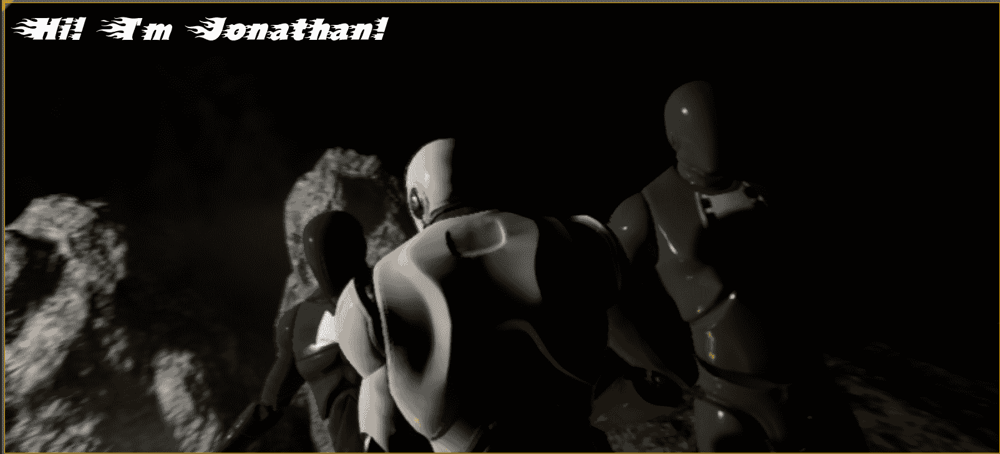

乔纳森的问候

# 练习

尝试这些以进行更多练习：

1.  为 NPC 的名称添加一个`UPROPERTY`函数名称，以便在蓝图中可编辑 NPC 的名称，类似于 NPC 对玩家的消息。在输出中显示 NPC 的名称。

1.  为 NPC 的面部纹理添加一个`UPROPERTY`函数（类型为`UTexture2D*`）。在输出中，将 NPC 的面部显示在其消息旁边。

1.  将玩家的 HP 渲染为一条条形图（填充矩形）。

# 解决方案

将以下属性添加到`ANPC`类中：

```cpp
// This is the NPC's name 
UPROPERTY(EditAnywhere, BlueprintReadWrite, Category = NPCMessage) 
FString name; 
```

然后，在`ANPC::Prox_Implementation`中，将传递给 HUD 的字符串更改为这样：

```cpp
name + FString(": ") + NpcMessage
```

这样，NPC 的名称将附加到消息上。

为`ANPC`类添加`this`属性：

```cpp
UPROPERTY(EditAnywhere, BlueprintReadWrite, Category = NPCMessage) 
UTexture2D* Face; 
```

然后，您可以在蓝图中选择要附加到 NPC 面部的面部图标。

将纹理附加到您的`struct Message`：

```cpp
UTexture2D* tex; 
```

要渲染这些图标，您需要添加一个调用`DrawTexture()`，并传入正确的纹理：

```cpp
DrawTexture( messages[c].tex, x, y, messageH, messageH, 0, 0, 1, 1  
   );
```

在渲染之前，请确保检查纹理是否有效。图标应该看起来与屏幕顶部所示的类似：

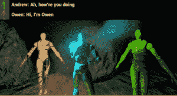

以下是绘制玩家剩余健康值的条形图的函数：

```cpp
void AMyHUD::DrawHealthbar()
{
    // Draw the healthbar. 
    AAvatar *avatar = Cast<AAvatar>(
b        UGameplayStatics::GetPlayerPawn(GetWorld(), 0));
    float barWidth = 200, barHeight = 50, barPad = 12, barMargin = 50;
    float percHp = avatar->Hp / avatar->MaxHp;
    const FVector2D ViewportSize = FVector2D(GEngine->GameViewport->Viewport->GetSizeXY());
    DrawRect(FLinearColor(0, 0, 0, 1), ViewportSize.X - barWidth -
        barPad - barMargin, ViewportSize.Y - barHeight - barPad -
        barMargin, barWidth + 2 * barPad, barHeight + 2 * barPad);  DrawRect(FLinearColor(1 - percHp, percHp, 0, 1), ViewportSize.X
            - barWidth - barMargin, ViewportSize.Y - barHeight - barMargin,
            barWidth*percHp, barHeight);
}
```

您还需要将`Hp`和`MaxHp`添加到 Avatar 类中（现在可以为测试设置默认值），并将以下内容添加到文件顶部：

```cpp
#include "Kismet/GameplayStatics.h"
#include "Avatar.h"
```

# 总结

在这一章中，我们涉及了很多材料。我们向您展示了如何创建一个角色并在屏幕上显示它，如何使用轴绑定来控制您的角色，以及如何创建和显示可以向 HUD 发布消息的 NPC。现在可能看起来令人生畏，但一旦您多练习就会明白。

在接下来的章节中，我们将通过添加库存系统和拾取物品来进一步开发我们的游戏，以及为玩家携带物品的代码和概念。不过，在做这些之前，下一章我们将深入探讨一些 UE4 容器类型。
