# 模板和常用容器

在第七章中，*动态内存分配*，我们讨论了如果要创建一个在编译时大小未知的新数组，您将如何使用动态内存分配。动态内存分配的形式为`int * array = new int[ number_of_elements ]`。

您还看到，使用`new[]`关键字进行动态分配需要稍后调用数组上的`delete[]`，否则将会出现内存泄漏。以这种方式管理内存是一项艰巨的工作。

是否有一种方法可以创建一个动态大小的数组，并且 C++可以自动为您管理内存？答案是肯定的。有 C++对象类型（通常称为容器）可以自动处理动态内存分配和释放。UE4 提供了一些容器类型，用于在动态可调整大小的集合中存储数据。

有两组不同的模板容器。有 UE4 容器系列（以`T*`开头）和 C++ **标准模板库**（**STL**）容器系列。UE4 容器和 C++ STL 容器之间存在一些差异，但这些差异并不重大。UE4 容器集是为游戏性能而编写的。C++ STL 容器也表现良好，它们的接口更加一致（API 的一致性是您所期望的）。您可以自行选择使用哪种容器集。但是，建议您使用 UE4 容器集，因为它保证在尝试编译代码时不会出现跨平台问题。

本章将涵盖以下主题：

+   在 UE4 中调试输出

+   模板和容器

+   UE4 的 TArray

+   TSet 和 TMap

+   常用容器的 C++ STL 版本

# 在 UE4 中调试输出

本章中的所有代码（以及后面的章节）都需要您在 UE4 项目中工作。为了测试`TArray`，我创建了一个名为`TArrays`的基本代码项目。在`ATArraysGameMode::ATArraysGameMode`构造函数中，我使用调试输出功能将文本打印到控制台。

以下是`TArraysGameMode.cpp`中的代码：

```cpp
#include "TArraysGameMode.h"
#include "Engine/Engine.h"

ATArraysGameMode::ATArraysGameMode(const FObjectInitializer& ObjectInitializer) : Super(ObjectInitializer)
{
    if (GEngine)
    {
        GEngine->AddOnScreenDebugMessage(-1, 30.f, FColor::Red, 
        TEXT("Hello!"));
    }
}
```

确保您还将函数添加到`.h`文件中。如果编译并运行此项目，您将在启动游戏时在游戏窗口的左上角看到调试文本。您可以使用调试输出随时查看程序的内部。只需确保在调试输出时`GEngine`对象存在。上述代码的输出显示在以下截图中（请注意，您可能需要将其作为独立游戏运行才能看到）：

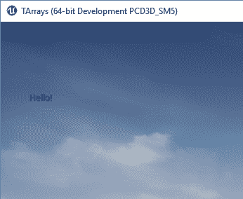

# 模板和容器

模板是一种特殊类型的对象。模板对象允许您指定它应该期望的数据类型。例如，很快您将看到，您可以运行一个`TArray<T>`变量。这是一个模板的例子。

要理解`TArray<T>`变量是什么，首先必须知道尖括号之间的`<T>`选项代表什么。`<T>`选项表示数组中存储的数据类型是一个变量。您想要一个`int`数组吗？然后创建一个`TArray<int>`变量。`double`的`TArray`变量？创建一个`TArray<double>`变量。

因此，通常情况下，无论何时出现`<T>`，您都可以插入您选择的 C++数据类型。

容器是用于存储对象的不同结构。模板对此特别有用，因为它们可以用于存储许多不同类型的对象。您可能希望使用 int 或 float 存储数字，字符串或不同类型的游戏对象。想象一下，如果您必须为您想要存储的每种对象类型编写一个新类。幸运的是，您不必这样做。模板让一个类足够灵活，可以处理您想要存储在其中的任何对象。

# 你的第一个模板

创建模板是一个高级主题，您可能多年不需要创建自己的模板（尽管您会一直使用标准模板）。但是，看看一个模板是什么样子可能有助于您了解幕后发生了什么。

想象一下，您想创建一个数字模板，让您可以使用 int、float 或其他类型。您可以做类似于这样的事情：

```cpp
template <class T>
class Number {
    T value;
public:
    Number(T val)
    {
        value = val;
    }

    T getSumWith(T val2);
};

template <class T>
T Number<T>::getSumWith(T val2)
{
    T retval;
    retval = value + val2;
    return retval;
}
```

第一部分是类本身。正如您所看到的，您想在模板中的任何地方使用类型，您制作类并使用`T`而不是指定特定类型。您还可以使用模板来指定发送到函数的值。在这种情况下，最后一部分允许您添加另一个数字并返回总和。

您甚至可以通过重载+运算符来简化事情，以便您可以像使用任何标准类型一样添加这些数字。这是通过一种称为运算符重载的东西。

# UE4 的 TArray<T>

TArrays 是 UE4 的动态数组版本，使用模板构建。与我们讨论过的其他动态数组一样，您无需担心自己管理数组大小。让我们继续并通过一个示例来看看这个。

# 使用 TArray<T>的示例

`TArray<int>`变量只是一个`int`数组。`TArray<Player*>`变量将是一个`Player*`指针数组。数组是动态可调整大小的，可以在创建后在数组末尾添加元素。

要创建一个`TArray<int>`变量，您只需使用正常的变量分配语法：

```cpp
TArray<int> array; 
```

对`TArray`变量的更改是使用成员函数完成的。有几个成员函数可以在`TArray`变量上使用：

您需要了解的第一个成员函数是如何向数组添加值，如下面的代码所示：

```cpp
array.Add( 1 ); 
array.Add( 10 ); 
array.Add( 5 ); 
array.Add( 20 ); 
```

以下四行代码将产生内存中的数组值，如下图所示：

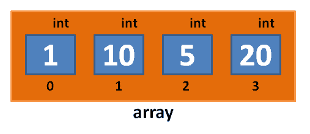

当您调用`array.Add(number)`时，新数字将添加到数组的末尾。由于我们按顺序向数组添加了数字**1**、**10**、**5**和**20**，因此它们将按照这个顺序进入数组。

如果要在数组的前面或中间插入一个数字，也是可能的。您只需使用`array.Insert(value, index)`函数，如下面的代码所示：

```cpp
array.Insert( 9, 0 ); 
```

此函数将数字`9`推入数组的位置`0`（在前面）。这意味着数组的其余元素将向右偏移，如下图所示：

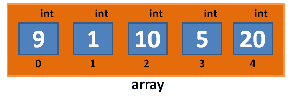

我们可以使用以下代码将另一个元素插入到数组的位置`2`：

```cpp
array.Insert( 30, 2 ); 
```

此函数将重新排列数组，如下图所示：

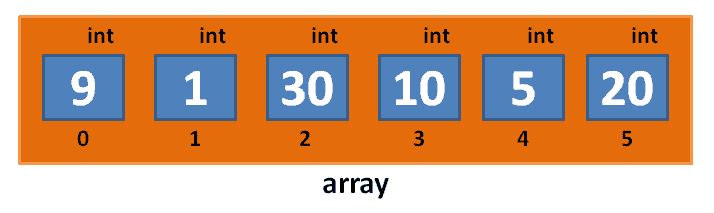

如果在数组中插入一个超出边界的位置的数字（它不存在），UE4 将崩溃。所以，要小心不要这样做。您可以使用`Add`来添加一个新项目。

# 迭代 TArray

您可以以两种方式迭代（遍历）`TArray`变量的元素：使用基于整数的索引或使用迭代器。我将在这里向您展示两种方法。

# 普通 for 循环和方括号表示法

使用整数来索引数组元素有时被称为普通的`for`循环。可以使用`array[index]`来访问数组的元素，其中`index`是数组中元素的数字位置：

```cpp
for( int index = 0; index < array.Num(); index++ ) 
{ 
  // print the array element to the screen using debug message 
  GEngine->AddOnScreenDebugMessage( -1, 30.f, FColor::Red,  
   FString::FromInt( array[ index ] ) ); 
} 
```

# 迭代器

您还可以使用迭代器逐个遍历数组的元素，如下面的代码所示：

```cpp
for (TArray<int>::TIterator it = array.CreateIterator(); it; ++it)
{
    GEngine->AddOnScreenDebugMessage(-1, 30.f, FColor::Green, FString::FromInt(*it));
}
```

迭代器是数组中的指针。迭代器可用于检查或更改数组中的值。迭代器的示例如下图所示：

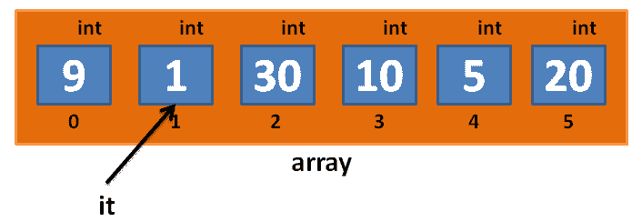

迭代器是一个外部对象，可以查看和检查数组的值。执行`++it`将迭代器移动到检查下一个元素。

迭代器必须适用于它正在遍历的集合。要遍历`TArray<int>`变量，您需要一个`TArray<int>::TIterator`类型的迭代器。

我们使用`*`来查看迭代器后面的值。在上述代码中，我们使用`(*it)`从迭代器中获取整数值。这称为解引用。解引用迭代器意味着查看其值。

`for`循环的每次迭代结束时发生的`++it`操作会递增迭代器，将其移动到指向列表中的下一个元素。

将代码插入程序并立即尝试。以下是我们迄今为止使用`TArray`创建的示例程序（全部在`ATArraysGameMode::ATArraysGameMode()`构造函数中）：

```cpp
ATArraysGameMode::ATArraysGameMode(const FObjectInitializer& ObjectInitializer) : Super(ObjectInitializer)
{
    if (GEngine)
    {
        TArray<int> array;
        array.Add(1);
        array.Add(10);
        array.Add(5);
        array.Add(20);
        array.Insert(9, 0);// put a 9 in the front 
        array.Insert(30, 2);// put a 30 at index 2 
        if (GEngine)
        {
            for (int index = 0; index < array.Num(); index++)
            {
                GEngine->AddOnScreenDebugMessage(index, 30.f, FColor::Red,
                    FString::FromInt(array[index]));
            }
        }
    }
}
```

以下是上述代码的输出：

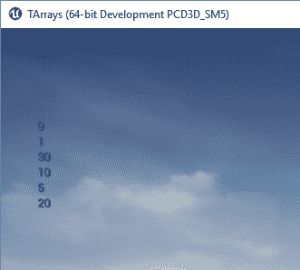

# 确定元素是否在 TArray 中

搜索我们的 UE4 容器很容易。通常使用`Find`成员函数来完成。使用我们之前创建的数组，我们可以通过输入以下代码来找到值为`10`的索引：

```cpp
int index = array.Find( 10 ); // would be index 3 in image above 
```

# TSet<T>

`TSet<int>`变量存储一组整数。`TSet<FString>`变量存储一组字符串。`TSet`和`TArray`之间的主要区别在于，`TSet`不允许重复；`TSet`中的所有元素都保证是唯一的。`TArray`变量不介意相同元素的重复。

要向`TSet`添加数字，只需调用`Add`。以下是一个例子：

```cpp
TSet<int> set; 
set.Add( 1 ); 
set.Add( 2 ); 
set.Add( 3 ); 
set.Add( 1 );// duplicate! won't be added 
set.Add( 1 );// duplicate! won't be added 
```

`TSet`将如下所示：

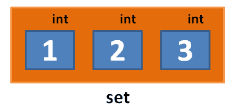

`TSet`中相同值的重复条目将不被允许。请注意，`TSet`中的条目没有编号，就像`TArray`中一样；您不能使用方括号来访问`TSet`数组中的条目。

# 迭代 TSet

要查看`TSet`数组，必须使用迭代器。您不能使用方括号表示法来访问`TSet`的元素：

```cpp
for( TSet<int>::TIterator it = set.CreateIterator(); it; ++it ) 
{ 
  GEngine->AddOnScreenDebugMessage( -1, 30.f, FColor::Red,  
   FString::FromInt( *it ) ); 
} 
```

# 交集 TSet 数组

`TSet`数组有两个`TArray`变量没有的特殊函数。两个`TSet`数组的交集基本上是它们共有的元素。如果我们有两个`TSet`数组，比如`X`和`Y`，并且我们对它们进行交集运算，结果将是一个第三个新的`TSet`数组，其中只包含它们之间的共同元素。看下面的例子：

```cpp
TSet<int> X; 
X.Add( 1 ); 
X.Add( 2 ); 
X.Add( 3 ); 
TSet<int> Y; 
Y.Add( 2 ); 
Y.Add( 4 ); 
Y.Add( 8 ); 
TSet<int> common = X.Intersect(Y); // 2 
```

`X`和`Y`之间的共同元素将只是元素`2`。

# 并集 TSet 数组

从数学上讲，两个集合的并集是指将所有元素插入到同一个集合中。由于我们在这里讨论的是集合，所以不会有重复项。

如果我们从前面的示例中获取`X`和`Y`集合并创建一个并集，我们将得到一个新的集合，如下所示：

```cpp
TSet<int> uni = X.Union(Y); // 1, 2, 3, 4, 8 
```

# 在 TSet 数组中查找

您可以通过在集合上使用`Find()`成员函数来确定元素是否在`TSet`中。如果元素存在于`TSet`中，`TSet`将返回与您的查询匹配的`TSet`中的条目的指针，如果您要查询的元素不存在于`TSet`中，它将返回`NULL`。

# TMap<T,S>

`TMap<T,S>`在 RAM 中创建了一种表。`TMap`表示左侧键到右侧值的映射。您可以将`TMap`视为一个两列表，左列中是键，右列中是值。

# 玩家库存的物品列表

例如，假设我们想要创建一个 C++数据结构，以便存储玩家库存的物品列表。在表的左侧（键）上，我们将使用`FString`表示物品的名称。在右侧（值）上，我们将使用`int`表示该物品的数量，如下表所示：

| 项目（键） | 数量（值） |
| --- | --- |
| `apples` | `4` |
| `donuts` | `12` |
| `swords` | `1` |
| `shields` | `2` |

要在代码中执行此操作，我们只需使用以下代码：

```cpp
TMap<FString, int> items; 
items.Add( "apples", 4 ); 
items.Add( "donuts", 12 ); 
items.Add( "swords", 1 ); 
items.Add( "shields", 2 ); 
```

创建了`TMap`之后，你可以使用方括号和在方括号之间传递键来访问`TMap`中的值。例如，在前面代码中的`items`映射中，`items[ "apples" ]`是`4`。

如果你使用方括号访问地图中尚不存在的键，UE4 会崩溃，所以要小心！C++ STL 如果这样做不会崩溃。

# 迭代 TMap

为了迭代`TMap`，你也需要使用迭代器：

```cpp
for( TMap<FString, int>::TIterator it = items.CreateIterator(); it; ++it ) 
{ 
  GEngine->AddOnScreenDebugMessage( -1, 30.f, FColor::Red, 
  it->Key + FString(": ") + FString::FromInt( it->Value ) ); 
} 
```

`TMap`迭代器与`TArray`或`TSet`迭代器略有不同。`TMap`迭代器包含`Key`和`Value`。我们可以使用`it->Key`访问键，并使用`it->Value`访问`TMap`中的值。

这里有一个例子：

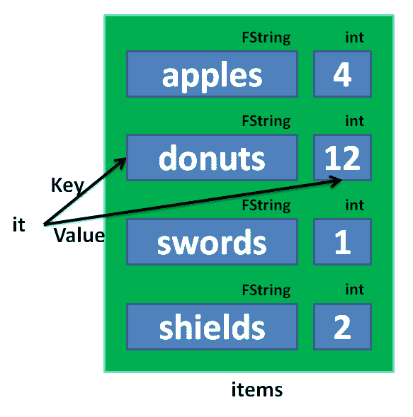

# TLinkedList/TDoubleLinkedList

当你使用 TArray 时，每个项目都有一个按数字顺序排列的索引，数组数据通常以相同的方式存储，因此每个条目在内存中都紧邻前一个条目。但是，如果你需要在中间某个位置放置一个新项目（例如，如果数组中填充了按字母顺序排列的字符串），该怎么办呢？

由于项目是相邻的，旁边的项目将不得不移动以腾出空间。但是为了做到这一点，旁边的那个也将不得不移动。这将一直持续到数组的末尾，当它最终到达可以在不移动其他东西的内存时。你可以想象，这可能会变得非常慢，特别是如果你经常这样做的话。

这就是链表派上用场的地方。链表没有任何索引。链表有包含项目并让你访问列表上第一个节点的节点。该节点有指向列表上下一个节点的指针，你可以通过调用`Next()`来获取。然后，你可以在那个节点上调用`Next()`来获取它后面的节点。它看起来像这样：

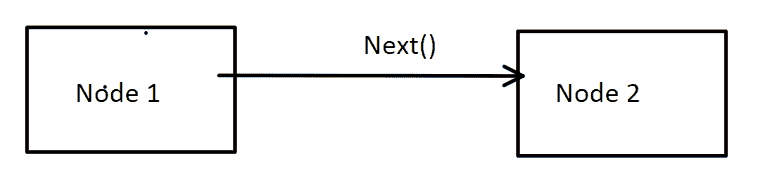

你可能会猜到，如果你在列表末尾寻找项目，这可能会变得很慢。但与此同时，你可能并不经常搜索列表，而是可能在中间添加新项目。在中间添加项目要快得多。比如，你想在**Node 1**和**Node 2**之间插入一个新节点，就像这样：

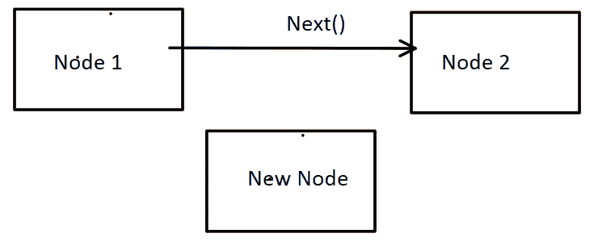

这次不需要在内存中移动东西来腾出空间。相反，要在另一个项目后插入一个项目，获取`Next()`指向的节点从**Node 1**（**Node 2**）开始。将新节点设置为指向该节点（**Node 2**）。然后，将 Node 1 设置为指向新节点。现在它应该看起来像这样：

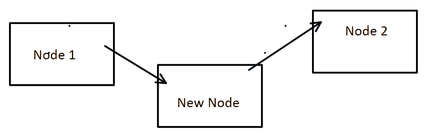

然后，你就完成了！

那么，如果你将花费更多时间查找列表末尾的项目怎么办？这就是`TDoubleLinkedList`派上用场的地方。双向链表可以给你列表中的第一个节点或最后一个节点。每个节点还有指向下一个节点和上一个节点的指针。你可以使用`GetNextLink()`和`GetPrevLink()`来访问这些。因此，你可以选择向前或向后遍历列表，甚至两者兼而有之，最终相遇在中间。

现在，你可能会问自己，“为什么要在我可以只使用 TArray 而不用担心它在幕后做什么的情况下？”首先，专业的游戏程序员总是要担心速度。计算机和游戏机的每一次进步都伴随着更多和更好的图形以及其他使事情变得更慢的进步。因此，优化速度总是很重要的。

另外，还有另一个实际的原因：我可以告诉你，根据我的经验，这个行业中有些人会在面试中拒绝你，如果你不使用链表。程序员都有自己偏好的做事方式，所以你应该熟悉可能出现的任何事情。

# 常用容器的 C++ STL 版本

现在，我们将介绍几种容器的 C++ STL 版本。STL 是标准模板库，大多数 C++编译器都附带。我想介绍这些 STL 版本的原因是它们的行为与相同容器的 UE4 版本有些不同。在某些方面，它们的行为非常好，但游戏程序员经常抱怨 STL 存在性能问题。特别是，我想介绍 STL 的`set`和`map`容器，但我也会介绍常用的`vector`。

如果您喜欢 STL 的接口但希望获得更好的性能，有一个由艺电重新实现的 STL 库，名为 EASTL，您可以使用。它提供与 STL 相同的功能，但实现了更好的性能（基本上是通过消除边界检查等方式）。它可以在 GitHub 上找到[`github.com/paulhodge/EASTL`](https://github.com/paulhodge/EASTL)。

# C++ STL set

C++ set 是一堆独特且排序的项目。STL `set`的好处是它保持了集合元素的排序。快速而粗糙的排序一堆值的方法实际上就是将它们塞入同一个`set`中。`set`会为您处理排序。

我们可以回到一个简单的 C++控制台应用程序来使用集合。要使用 C++ STL set，您需要包含`<set>`，如下所示：

```cpp
#include <iostream> 
#include <set> 
using namespace std; 

int main() 
{ 
  set<int> intSet; 
  intSet.insert( 7 ); 
  intSet.insert( 7 ); 
  intSet.insert( 8 ); 
  intSet.insert( 1 ); 

  for( set<int>::iterator it = intSet.begin(); it != intSet.end();  
   ++it ) 
  { 
    cout << *it << endl; 
  } 
} 
```

以下是前面代码的输出：

```cpp
1 
7 
8 
```

重复的`7`被过滤掉，并且元素在`set`中保持增序。我们遍历 STL 容器的方式类似于 UE4 的`TSet`数组。`intSet.begin()`函数返回一个指向`intSet`头部的迭代器。

停止迭代的条件是当它变为`intSet.end()`。`intSet.end()`实际上是`set`末尾的下一个位置，如下图所示：

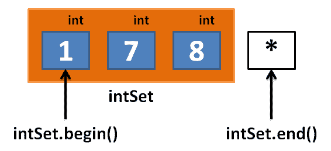

# 在<set>中查找元素

要在 STL `set`中查找元素，我们可以使用`find()`成员函数。如果我们要查找的项目出现在`set`中，我们将得到一个指向我们正在搜索的元素的迭代器。如果我们要查找的项目不在`set`中，我们将得到`set.end()`，如下所示：

```cpp
set<int>::iterator it = intSet.find( 7 ); 
if( it != intSet.end() ) 
{ 
  //  7  was inside intSet, and *it has its value 
  cout << "Found " << *it << endl; 
} 
```

# 练习

要求用户提供三个唯一名称的集合。逐个输入每个名称，然后按排序顺序打印它们。如果用户重复名称，请要求他们再输入一个，直到达到三个为止。

# 解决方案

前面练习的解决方案可以使用以下代码找到：

```cpp
#include <iostream> 
#include <string> 
#include <set> 
using namespace std; 
int main() 
{ 
  set<string> names; 
  // so long as we don't have 3 names yet, keep looping, 
  while( names.size() < 3 ) 
  { 
    cout << names.size() << " names so far. Enter a name" << endl; 
    string name; 
    cin >> name; 
    names.insert( name ); // won't insert if already there, 
  } 
  // now print the names. the set will have kept order 
  for( set<string>::iterator it = names.begin(); it !=  
   names.end(); ++it ) 
  { 
    cout << *it << endl; 
  } 
} 
```

# C++ STL map

C++ STL `map`对象很像 UE4 的`TMap`对象。它做的一件事是`TMap`不会在地图内部保持排序顺序。排序会引入额外的成本，但如果您希望地图排序，选择 STL 版本可能是一个不错的选择。

要使用 C++ STL `map`对象，我们包括`<map>`。在下面的示例程序中，我们使用一些键值对填充了一个项目的映射：

```cpp
#include <iostream> 
#include <string> 
#include <map> 
using namespace std; 
int main() 
{ 
  map<string, int> items; 
  items.insert( make_pair( "apple", 12 ) ); 
  items.insert( make_pair( "orange", 1 ) ); 
  items.insert( make_pair( "banana", 3 ) ); 
  // can also use square brackets to insert into an STL map 
  items[ "kiwis" ] = 44; 

  for( map<string, int>::iterator it = items.begin(); it !=  
   items.end(); ++it ) 
  { 
    cout << "items[ " << it->first << " ] = " << it->second <<  
     endl; 
  } 
} 
```

这是前面程序的输出：

```cpp
items[ apple ] = 12 
items[ banana ] = 3 
items[ kiwis ] = 44 
items[ orange ] = 1 
```

请注意，STL map 的迭代器语法与`TMap`略有不同；我们使用`it->first`访问键，使用`it->second`访问值。

请注意，C++ STL 还为`TMap`提供了一些语法糖；您可以使用方括号插入到 C++ STL `map`中。您不能使用方括号插入到`TMap`中。

# 在<map>中查找元素

您可以使用 STL map 的`find`成员函数在 map 中搜索<`key`，`value`>对。通常通过`key`进行搜索，它会给您该`key`的值。

# 练习

要求用户输入五个项目及其数量到空`map`中。以排序顺序打印结果（即按字母顺序或按数字顺序从低到高）。

# 解决方案

前面练习的解决方案使用以下代码：

```cpp
#include <iostream> 
#include <string> 
#include <map> 
using namespace std; 
int main() 
{ 
  map<string, int> items; 
  cout << "Enter 5 items, and their quantities" << endl; 
  while( items.size() < 5 ) 
  { 
    cout << "Enter item" << endl; 
    string item; 
    cin >> item; 
    cout << "Enter quantity" << endl; 
    int qty; 
    cin >> qty; 
    items[ item ] = qty; // save in map, square brackets 
    // notation 
  } 

  for( map<string, int>::iterator it = items.begin(); it !=  
   items.end(); ++it ) 
  { 
    cout << "items[ " << it->first << " ] = " << it->second <<  
     endl; 
  } 
} 
```

在这个解决方案代码中，我们首先创建`map<string, int> items`来存储我们要带入的所有物品。询问用户一个物品和数量；然后，我们使用方括号表示法将`item`保存在`items`映射中。

# C++ STL Vector

`Vector`是 STL 中`TArray`的等价物。它基本上是一个在幕后管理一切的数组，就像`TArray`一样。在使用 UE4 时可能不需要使用它，但了解它是很好的，以防其他人在项目中使用它。

# 摘要

UE4 的容器和 C++ STL 容器系列都非常适合存储游戏数据。选择合适的数据容器类型可以大大简化编程问题。

在下一章中，我们将通过跟踪玩家携带的物品并将这些信息存储在`TMap`对象中，实际开始编写游戏的开头部分。
