# 库存系统和拾取物品

我们希望玩家能够从游戏世界中拾取物品。在本章中，我们将为玩家编写和设计一个背包来存放物品。当用户按下*I*键时，我们将显示玩家携带的物品。

作为数据表示，我们可以使用上一章中介绍的`TMap<FString, int>`来存储我们的物品。当玩家拾取物品时，我们将其添加到地图中。如果物品已经在地图中，我们只需增加其值，即新拾取的物品的数量。

在本章中，我们将涵盖以下主题：

+   声明背包

+   PickupItem 基类

+   绘制玩家库存

# 声明背包

我们可以将玩家的背包表示为一个简单的`TMap<FString, int>`项目。为了让我们的玩家从世界中收集物品，打开`Avatar.h`文件并添加以下`TMap`声明：

```cpp
class APickupItem; //  forward declare the APickupItem class, 
                   // since it will be "mentioned" in a member  
                    function decl below 
UCLASS() 
class GOLDENEGG_API AAvatar : public ACharacter 
{ 
  GENERATED_BODY() 
public: 
  // A map for the player's backpack 
  TMap<FString, int> Backpack; 

  // The icons for the items in the backpack, lookup by string 
  TMap<FString, UTexture2D*> Icons; 

  // A flag alerting us the UI is showing 
  bool inventoryShowing; 
  // member function for letting the avatar have an item 
  void Pickup( APickupItem *item ); 
  // ... rest of Avatar.h same as before 
}; 
```

# 前向声明

在`AAvatar`类之前，请注意我们有一个`class APickupItem`的前向声明。在代码文件中需要前向声明的情况是当提到一个类（例如`APickupItem::Pickup( APickupItem *item );`函数原型）时，但文件中实际上没有使用该类型的对象的代码。由于`Avatar.h`头文件不包含使用`APickupItem`类型对象的可执行代码，我们需要前向声明。虽然包含一个.h 文件可能更容易，但有时最好避免这样做，否则可能会出现循环依赖（两个类互相包含可能会导致问题）。

缺少前向声明将导致编译错误，因为编译器在编译`class AAvatar`中的代码之前不知道`class APickupItem`。编译器错误将出现在`APickupItem::Pickup( APickupItem *item );`函数原型声明处。

我们在`AAvatar`类中声明了两个`TMap`对象。如下表所示：

| `FString`（名称） | `int`（数量） | `UTexture2D*`（im） |
| --- | --- | --- |
| `GoldenEgg` | `2` | 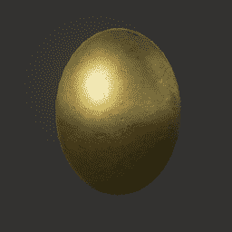 |
| `MetalDonut` | `1` | 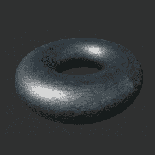 |
| `Cow` | `2` | 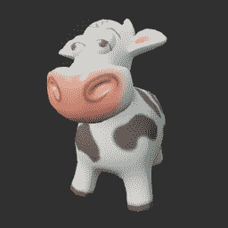 |

在`TMap`背包中，我们存储玩家持有的物品的`FString`变量。在`图标`映射中，我们存储玩家持有物品的图像的单个引用。

在渲染时，我们可以使用两个地图一起工作，查找玩家拥有的物品数量（在他的`背包`映射中），以及该物品的纹理资产引用（在`图标`映射中）。以下屏幕截图显示了 HUD 的渲染效果：

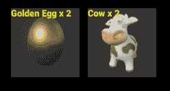

请注意，我们还可以使用一个包含`FString`变量和`UTexture2D*`的`struct`数组，而不是使用两个地图。

例如，我们可以使用`TArray<Item> Backpack;`和一个`struct`变量，如下面的代码所示：

```cpp
struct Item   
{   
  FString name;   
  int qty;   
  UTexture2D*   tex;   
};   
```

然后，当我们拾取物品时，它们将被添加到线性数组中。然而，计算我们在背包中每种物品的数量将需要通过遍历整个数组来进行不断的重新评估。例如，要查看您有多少个发夹，您需要遍历整个数组。这不如使用地图高效。

# 导入资产

您可能已经注意到前面屏幕截图中的 Cow 资产，这不是 UE4 在新项目中提供的标准资产集的一部分。为了使用 Cow 资产，您需要从内容示例项目中导入 cow。UE4 使用标准的导入过程。

在下面的屏幕截图中，我已经概述了导入 Cow 资产的过程。其他资产将使用相同的方法从 UE4 中的其他项目导入。

执行以下步骤导入 Cow 资产：

1.  下载并打开 UE4 的 Content Examples 项目。在 Epic Game Launcher 的 Learn 下找到它，如下所示：


1.  下载 Content Examples 后，打开它并单击

创建项目：

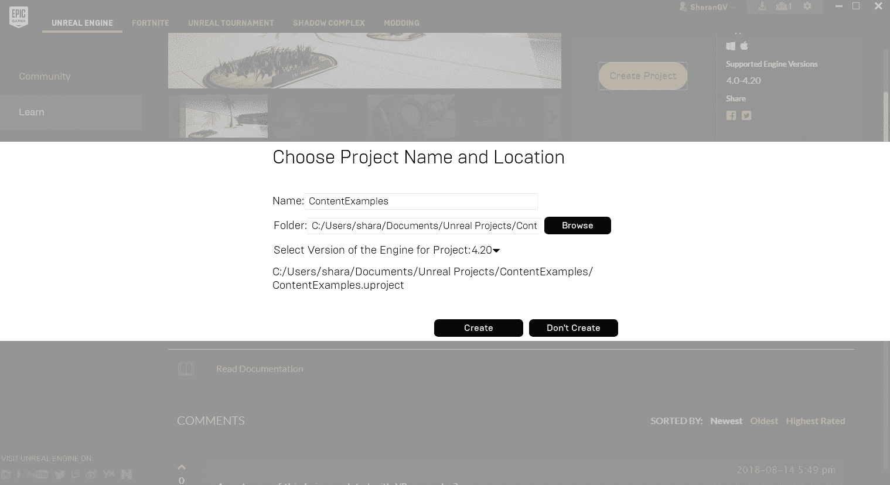

1.  接下来，命名您将放置`ContentExamples`的文件夹，然后单击创建。

1.  从库中打开您的`ContentExamples`项目。浏览项目中可用的资产，直到找到您喜欢的资产。按照惯例，搜索`SM_`将有所帮助，因为所有静态网格通常以`SM_`开头：

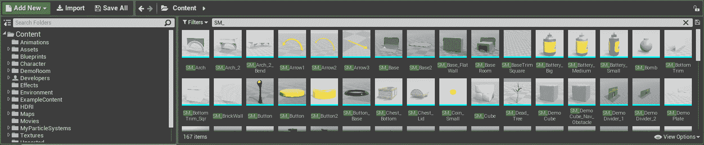

项目中可用的资产

1.  当您找到喜欢的资产时，通过右键单击资产，然后单击 Asset Actions > Migrate...将其导入到您的项目中：

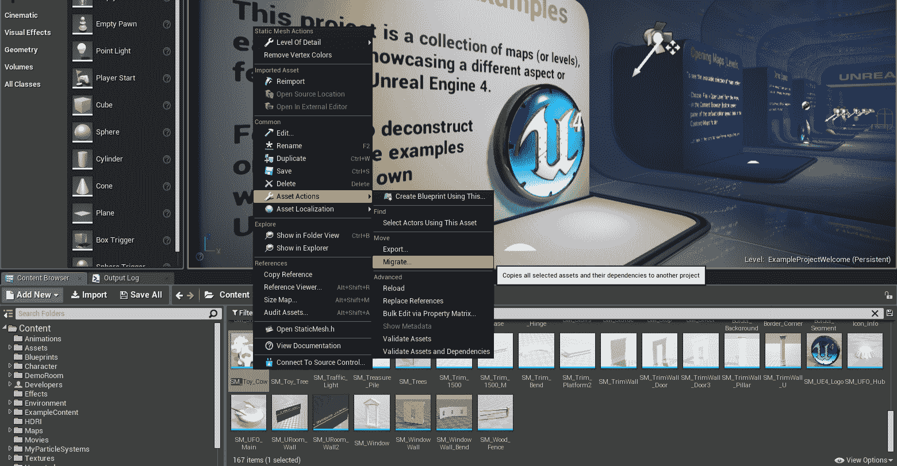

1.  在 Asset Report 对话框中单击确定：

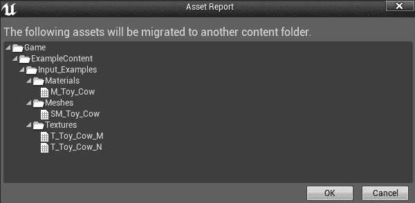

1.  从您要将 SM_Toy_Cow 文件添加到的项目的 Content 文件夹中选择。我们将把它添加到`/Documents/Unreal Projects/GoldenEgg/Content`，如下面的截图所示：

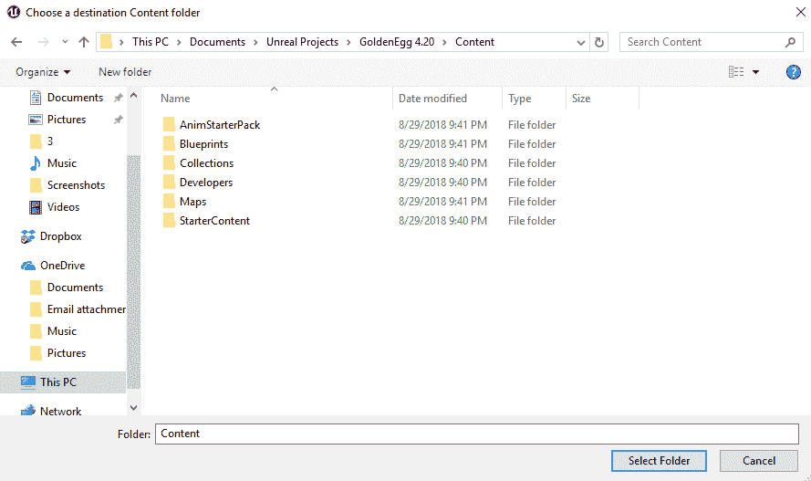

1.  如果导入成功完成，您将看到以下消息：

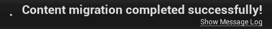

1.  一旦您导入资产，您将在项目内的资产浏览器中看到它显示出来：

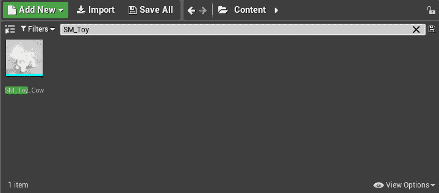

然后您可以在项目中正常使用该资产。

# 将动作映射附加到键

我们需要附加一个键来激活玩家库存的显示。在 UE4 编辑器中，按照以下步骤操作：

1.  添加一个名为`Inventory`的 Action Mappings+

1.  将其分配给键盘键*I*，如下所示：

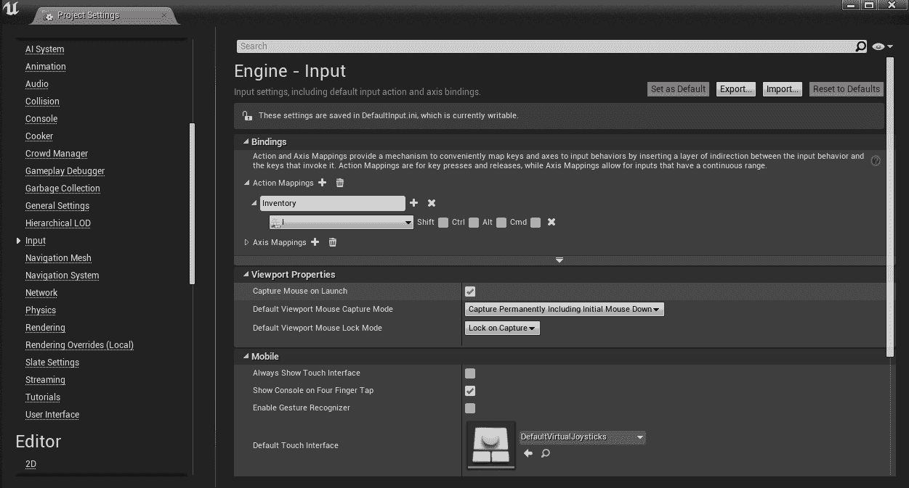

1.  接下来，在`Avatar.h`文件中，添加一个成员函数，以在需要显示玩家库存时运行：

```cpp
void ToggleInventory(); 
```

1.  在`Avatar.cpp`文件中，实现`ToggleInventory()`函数，如下面的代码所示：

```cpp
void AAvatar::ToggleInventory() 
{ 
  if( GEngine ) 
  { 
    GEngine->AddOnScreenDebugMessage( -1, 5.f, FColor::Red,  
     "Showing inventory..." ); 
  } 
} 
```

1.  然后，在`SetupPlayerInputComponent()`中将`"Inventory"`动作连接到`AAvatar::ToggleInventory()`：

```cpp
void AAvatar::SetupPlayerInputComponent(class UInputComponent*  
   InputComponent) 
{ 
 Super::SetupPlayerInputComponent(PlayerInputComponent);

    check(PlayerInputComponent);
    PlayerInputComponent->BindAction("Inventory", IE_Pressed, this,
        &AAvatar::ToggleInventory);
  // rest of SetupPlayerInputComponent same as before 
} 
```

# 拾取物品基类

我们需要在代码中定义拾取物品的外观。每个拾取物品将从一个共同的基类派生。现在让我们构造一个`PickupItem`类的基类。

`PickupItem`基类应该继承自`AActor`类。类似于我们如何从基础 NPC 类创建多个 NPC 蓝图，我们可以从单个`PickupItem`基类创建多个`PickupItem`蓝图，如下面的截图所示：


此截图中的文本不重要。此图让您了解如何从单个`PickupItem`基类创建多个`PickupItem`蓝图

创建`PickupItem`类后，打开其代码在 Visual Studio 中。

`APickupItem`类将需要相当多的成员，如下所示：

+   一个用于被拾取物品名称的`FString`变量

+   一个用于被拾取物品数量的`int32`变量

+   一个用于碰撞的球体的`USphereComponent`变量，以便拾取物品

+   一个用于保存实际`Mesh`的`UStaticMeshComponent`变量

+   一个用于表示物品的图标的`UTexture2D`变量

+   一个 HUD 的指针（稍后我们将初始化）

`PickupItem.h`中的代码如下：

```cpp
// Fill out your copyright notice in the Description page of Project Settings.

#pragma once

#include "CoreMinimal.h"
#include "GameFramework/Actor.h"
#include "Components/SphereComponent.h"
#include "Components/StaticMeshComponent.h"
#include "PickupItem.generated.h"

UCLASS()
class GOLDENEGG_API APickupItem : public AActor
{
    GENERATED_BODY()

public:    
    // Sets default values for this actor's properties
    APickupItem(const FObjectInitializer& ObjectInitializer);

    // The name of the item you are getting 
    UPROPERTY(EditAnywhere, BlueprintReadWrite, Category = Item)
        FString Name;

    // How much you are getting 
    UPROPERTY(EditAnywhere, BlueprintReadWrite, Category = Item)
        int32 Quantity;

    // the sphere you collide with to pick item up 
    UPROPERTY(VisibleDefaultsOnly, BlueprintReadOnly, Category = Item)
        USphereComponent* ProxSphere;

    // The mesh of the item 
    UPROPERTY(VisibleDefaultsOnly, BlueprintReadOnly, Category = Item)
        UStaticMeshComponent* Mesh;
    // The icon that represents the object in UI/canvas 
    UPROPERTY(EditAnywhere, BlueprintReadWrite, Category = Item) 
        UTexture2D* Icon; 
    // When something comes inside ProxSphere, this function runs 
    UFUNCTION(BlueprintNativeEvent, Category = Collision) 
        void Prox(UPrimitiveComponent* OverlappedComponent, AActor* OtherActor, UPrimitiveComponent* OtherComp,
            int32 OtherBodyIndex, bool bFromSweep, const FHitResult& SweepResult);
        virtual int Prox_Implementation(UPrimitiveComponent* OverlappedComponent, AActor* OtherActor, UPrimitiveComponent* OtherComp,
        int32 OtherBodyIndex, bool bFromSweep, const FHitResult& SweepResult);

protected:
    // Called when the game starts or when spawned
    virtual void BeginPlay() override;

public:    
    // Called every frame
    virtual void Tick(float DeltaTime) override;
};
```

所有这些`UPROPERTY()`声明的目的是使`APickupItem`完全可由蓝图配置。例如，Pickup 类别中的项目将在蓝图编辑器中显示如下：

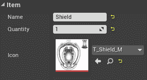

在`PickupItem.cpp`文件中，完成`APickupItem`类的构造函数，如下面的代码所示：

```cpp
APickupItem::APickupItem(const FObjectInitializer& ObjectInitializer)
    : Super(ObjectInitializer)
{
    Name = "UNKNOWN ITEM";
    Quantity = 0;

    // initialize the unreal objects 
    ProxSphere = ObjectInitializer.CreateDefaultSubobject<USphereComponent>(this,
        TEXT("ProxSphere"));  
    Mesh = ObjectInitializer.CreateDefaultSubobject<UStaticMeshComponent>(this,
            TEXT("Mesh"));

    // make the root object the Mesh 
    RootComponent = Mesh;
    Mesh->SetSimulatePhysics(true);

    // Code to make APickupItem::Prox() run when this 
    // object's proximity sphere overlaps another actor. 
    ProxSphere->OnComponentBeginOverlap.AddDynamic(this, &APickupItem::Prox);
    ProxSphere->AttachToComponent(Mesh, FAttachmentTransformRules::KeepWorldTransform); // very important!              
}
```

在前两行中，我们对`Name`和`Quantity`进行了初始化，使其值在游戏设计师看来是未初始化的。我们使用大写字母，以便设计师可以清楚地看到该变量以前从未被初始化过。

然后，我们使用`ObjectInitializer.CreateDefaultSubobject`初始化`ProxSphere`和`Mesh`组件。新初始化的对象可能已经初始化了一些默认值，但`Mesh`将为空。您将不得不稍后在蓝图中加载实际的网格。

对于网格，我们将其设置为模拟真实物理，以便如果放下或移动，捡起物品会弹跳和滚动。特别注意`ProxSphere->AttachToComponent(Mesh, FAttachmentTransformRules::KeepWorldTransform);`这一行。这行告诉您确保捡起物品的`ProxSphere`组件附加到`Mesh`根组件。这意味着当网格在级别中移动时，`ProxSphere`会跟随移动。如果忘记了这一步（或者反过来做了），那么`ProxSphere`在弹跳时将不会跟随网格。

# 根组件

在上述代码中，我们将`APickupItem`的`RootComponent`分配给了`Mesh`对象。`RootComponent`成员是`AActor`基类的一部分，因此每个`AActor`及其派生类都有一个根组件。根组件基本上是对象的核心，并且还定义了您与对象的碰撞方式。`RootComponent`对象在`Actor.h`文件中定义，如下面的代码所示：

```cpp
/** Collision primitive that defines the transform (location, rotation, scale) of this Actor. */
    UPROPERTY(BlueprintGetter=K2_GetRootComponent, Category="Utilities|Transformation")
    USceneComponent* RootComponent;
```

因此，UE4 的创建者打算`RootComponent`始终是对碰撞原语的引用。有时，碰撞原语可以是胶囊形状，其他时候可以是球形甚至是盒形，或者可以是任意形状，就像我们的情况一样，具有网格。然而，角落的盒子可能会被卡在墙上，因此很少有角色应该有盒状的根组件。通常更喜欢圆形。`RootComponent`属性显示在蓝图中，您可以在那里查看和操作它：

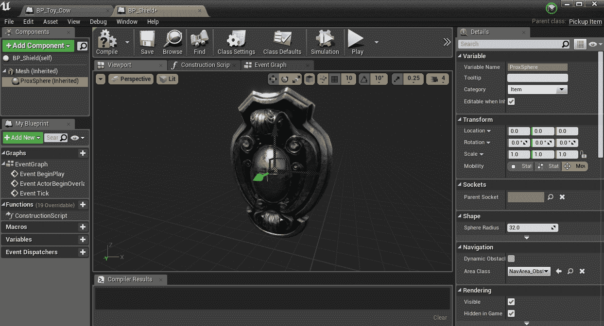

创建基于 PickupItem 类的蓝图后，可以从其蓝图中编辑 ProxSphere 根组件

最后，`Prox_Implementation`函数得到实现，如下所示：

```cpp
int APickupItem::Prox_Implementation(UPrimitiveComponent* OverlappedComponent, AActor* OtherActor, UPrimitiveComponent* OtherComp,
    int32 OtherBodyIndex, bool bFromSweep, const FHitResult& SweepResult)
{
    // if the overlapped actor is NOT the player, 
    // you simply should return 
    if (Cast<AAvatar>(OtherActor) == nullptr)
    {
        return -1;
    }

    // Get a reference to the player avatar, to give him 
    // the item 
    AAvatar *avatar = Cast<AAvatar>(UGameplayStatics::GetPlayerPawn(GetWorld(), 0));

    // Let the player pick up item 
    // Notice use of keyword this! 
    // That is how _this_ Pickup can refer to itself. 
    avatar->Pickup(this);

    // Get a reference to the controller 
    APlayerController* PController = GetWorld()->GetFirstPlayerController();

    // Get a reference to the HUD from the controller 
    AMyHUD* hud = Cast<AMyHUD>(PController->GetHUD());
    hud->addMessage(Message(Icon, FString("Picked up ") + FString::FromInt(Quantity) + FString(" ") + Name, 5.f, FColor::White)
);

    Destroy();

    return 0;
}
```

此外，请确保在文件顶部添加以下内容：

```cpp
#include "Avatar.h"
#include "MyHUD.h"
#include "Kismet/GameplayStatics.h"
```

这里有一些非常重要的提示：首先，我们必须访问一些*全局*对象来获取我们需要的对象。通过这些函数，我们将访问三个主要对象，这些对象操作 HUD：

+   控制器 (`APlayerController`)

+   HUD (`AMyHUD`)

+   玩家本身（`AAvatar`）

游戏实例中只有这三种类型的对象中的一个。UE4 使得找到它们变得很容易。

此外，为了编译这个，您还需要在`MyHud.h`中的`Message`结构中添加另一个构造函数。您需要一个可以让您像这样传递图像的构造函数：

```cpp
Message(UTexture2D* img, FString iMessage, float iTime, FColor iColor)
    {
        tex = img;
        message = iMessage;
        time = iTime;
        color = iColor;
    }
```

要编译，您还需要向结构体添加另一个变量`UTexture2D* tex;`。您还需要在 Avatar 中实现 Pickup 函数。

# 获取 avatar

`player`类对象可以通过简单调用以下代码从代码的任何地方找到：

```cpp
AAvatar *avatar = Cast<AAvatar>( 
  UGameplayStatics::GetPlayerPawn( GetWorld(), 0 ) ); 
```

然后我们通过调用之前定义的`AAvatar::Pickup()`函数将物品传递给玩家。

因为 PlayerPawn 对象实际上是一个 AAvatar 实例，所以我们将结果转换为 AAvatar 类，使用 Cast<AAvatar>命令。UGameplayStatics 函数族可以在代码的任何地方访问，因为它们是全局函数。

# 获取玩家控制器

检索玩家控制器也可以通过全局函数完成：

```cpp
APlayerController* PController = 
  GetWorld()->GetFirstPlayerController(); 
```

`GetWorld()`函数实际上是在`UObject`基类中定义的。由于所有 UE4 对象都派生自`UObject`，因此游戏中的任何对象实际上都可以访问`world`对象。

# 获取 HUD

尽管这种组织可能一开始看起来很奇怪，但 HUD 实际上是附加到玩家的控制器上的。您可以按如下方式检索 HUD：

```cpp
AMyHUD* hud = Cast<AMyHUD>( PController->GetHUD() ); 
```

我们对 HUD 对象进行转换，因为我们之前在蓝图中将 HUD 设置为`AMyHUD`实例。由于我们将经常使用 HUD，我们实际上可以在`APickupItem`类内部存储一个永久指针指向 HUD。我们稍后会讨论这一点。

接下来，我们实现`AAvatar::Pickup`，它将一个`APickupItem`类型的对象添加到 Avatar 的背包中：

```cpp
void AAvatar::Pickup(APickupItem *item)
{
    if (Backpack.Find(item->Name))
    {
        // the item was already in the pack.. increase qty of it 
        Backpack[item->Name] += item->Quantity;
    }
    else
    {
        // the item wasn't in the pack before, add it in now 
        Backpack.Add(item->Name, item->Quantity);
        // record ref to the tex the first time it is picked up 
        Icons.Add(item->Name, item->Icon);
    }
}
```

还要确保在文件顶部添加`#include "PickupItem.h"`。

在前面的代码中，我们检查玩家刚刚获得的捡起物品是否已经在他的背包中。如果是，我们增加它的数量。如果不在他的背包中，我们将其添加到他的背包和`Icons`映射中。

要将捡起物品添加到背包中，请使用以下代码行：

```cpp
avatar->Pickup( this ); 
```

`APickupItem::Prox_Implementation`是调用该成员函数的方式。

现在，当玩家按下*I*键时，我们需要在 HUD 中显示背包的内容。

# 绘制玩家库存

像*暗黑破坏神*这样的游戏中的库存屏幕会显示一个弹出窗口，其中过去捡起的物品的图标排列在一个网格中。我们可以在 UE4 中实现这种行为。

在 UE4 中绘制 UI 有许多方法。最基本的方法是简单地使用`HUD::DrawTexture()`调用。另一种方法是使用 Slate。还有一种方法是使用最新的 UE4 UI 功能：**虚幻运动图形**（**UMG**）设计师。

Slate 使用声明性语法在 C++中布局 UI 元素。Slate 最适合菜单等。UMG 自 UE 4.5 以来一直存在，并使用基于蓝图的工作流程。由于我们这里的重点是使用 C++代码的练习，我们将坚持使用`HUD::DrawTexture()`实现，但我们将在后面的章节中介绍 UMG。这意味着我们将不得不在我们的代码中管理所有与库存有关的数据。

# 使用 HUD::DrawTexture()

`HUD::DrawTexture()`是我们将在此时用来将库存绘制到屏幕上的方法。我们将分两步实现这一点：

1.  当用户按下*I*键时，我们将库存的内容推送到 HUD。

1.  然后，我们以网格方式将图标渲染到 HUD 中。

为了保存有关小部件如何渲染的所有信息，我们声明了一个简单的结构来保存有关它使用的图标、当前位置和当前大小的信息。

这是`Icon`和`Widget`结构的样子：

```cpp
struct Icon 
{ 
  FString name; 
  UTexture2D* tex; 
  Icon(){ name = "UNKNOWN ICON"; tex = 0; } 
  Icon( FString& iName, UTexture2D* iTex ) 
  { 
    name = iName; 
    tex = iTex; 
  } 
}; 

struct Widget 
{ 
  Icon icon; 
  FVector2D pos, size; 
  Widget(Icon iicon) 
  { 
    icon = iicon; 
  } 
  float left(){ return pos.X; } 
  float right(){ return pos.X + size.X; } 
  float top(){ return pos.Y; } 
  float bottom(){ return pos.Y + size.Y; } 
}; 
```

您可以将这些结构声明添加到`MyHUD.h`的顶部，或者您可以将它们添加到一个单独的文件中，并在使用这些结构的任何地方包含该文件。

注意`Widget`结构上的四个成员函数，以获取小部件的`left()`、`right()`、`top()`和`bottom()`函数。我们稍后将使用这些函数来确定点击点是否在框内。

1.  接下来，我们在`AMyHUD`类中声明将小部件渲染到屏幕上的函数。首先，在`MyHud.h`中，添加一个数组来保存小部件，以及一个向量来保存屏幕尺寸：

```cpp
    // New! An array of widgets for display 
    TArray<Widget> widgets;
    //Hold screen dimensions
    FVector2D dims;
```

1.  还要添加一行`void DrawWidgets();`。然后，将其添加到`MyHud.cpp`中：

```cpp
void AMyHUD::DrawWidgets()
{
    for (int c = 0; c < widgets.Num(); c++)
    {
        DrawTexture(widgets[c].icon.tex, widgets[c].pos.X,
            widgets[c].pos.Y, widgets[c].size.X, widgets[c].size.Y, 0, 0,
            1, 1);    DrawText(widgets[c].icon.name, FLinearColor::Yellow,
                widgets[c].pos.X, widgets[c].pos.Y, hudFont, .6f, false);
    }
}
```

1.  应该在`DrawHUD()`函数中添加对`DrawWidgets()`函数的调用，并且您可能希望将当前的消息处理代码移动到一个单独的`DrawMessages`函数中，以便您可以随后获取这一点（或者只是保留原始代码）：

```cpp
void AMyHUD::DrawHUD()
{
    Super::DrawHUD();
    // dims only exist here in stock variable Canvas 
    // Update them so use in addWidget() 
    const FVector2D ViewportSize = FVector2D(GEngine->GameViewport->Viewport->GetSizeXY());
    dims.X = ViewportSize.X;
    dims.Y = ViewportSize.Y;
    DrawMessages();
    DrawWidgets();
}
```

1.  接下来，我们将填充`ToggleInventory()`函数。这是用户按下*I*键时运行的函数：

```cpp
void AAvatar::ToggleInventory()
{
    // Get the controller & hud 
    APlayerController* PController = GetWorld()->GetFirstPlayerController();
    AMyHUD* hud = Cast<AMyHUD>(PController->GetHUD());

    // If inventory is displayed, undisplay it. 
    if (inventoryShowing)
    {
        hud->clearWidgets();
        inventoryShowing = false;
        PController->bShowMouseCursor = false;
        return;
    }

    // Otherwise, display the player's inventory 
    inventoryShowing = true;
    PController->bShowMouseCursor = true;
    for (TMap<FString, int>::TIterator it =
        Backpack.CreateIterator(); it; ++it)
    {
        // Combine string name of the item, with qty eg Cow x 5 
        FString fs = it->Key + FString::Printf(TEXT(" x %d"), it->Value);
        UTexture2D* tex;
        if (Icons.Find(it->Key))
        {
            tex = Icons[it->Key];
            hud->addWidget(Widget(Icon(fs, tex)));
        }    
    }
}
```

1.  为了使前面的代码编译，我们需要向`AMyHUD`添加两个函数：

```cpp
void AMyHUD::addWidget( Widget widget ) 
{ 
  // find the pos of the widget based on the grid. 
  // draw the icons.. 
  FVector2D start( 200, 200 ), pad( 12, 12 ); 
  widget.size = FVector2D( 100, 100 ); 
  widget.pos = start; 
  // compute the position here 
  for( int c = 0; c < widgets.Num(); c++ ) 
  { 
    // Move the position to the right a bit. 
    widget.pos.X += widget.size.X + pad.X; 
    // If there is no more room to the right then 
    // jump to the next line 
    if( widget.pos.X + widget.size.X > dims.X ) 
    { 
      widget.pos.X = start.X; 
      widget.pos.Y += widget.size.Y + pad.Y; 
    } 
  } 
  widgets.Add( widget ); 
} 

void AMyHUD::clearWidgets()
{
    widgets.Empty();
}
```

同样，确保在`.h`文件中添加以下内容：

```cpp
    void clearWidgets();
    void addWidget(Widget widget);
```

1.  我们继续使用`inventoryShowing`中的`Boolean`变量，以告诉我们库存当前是否显示。当显示库存时，我们还显示鼠标，以便用户知道他点击的是什么。此外，当显示库存时，玩家的自由运动被禁用。禁用玩家的自由运动的最简单方法是在实际移动之前从移动函数中返回。以下代码是一个示例：

```cpp
void AAvatar::Yaw( float amount ) 
{ 
  if( inventoryShowing ) 
  { 
    return; // when my inventory is showing, 
    // player can't move 
  } 
  AddControllerYawInput(200.f*amount * GetWorld()- 
   >GetDeltaSeconds()); 
} 
```

# 练习

在每个移动函数中添加`if( inventoryShowing ) { return; }`，这样当库存显示时，它将阻止所有移动。

# 检测库存项目点击

我们可以通过简单的测试来检测是否有人点击了我们的库存项目，以查看点是否在对象的`rect`（矩形）内。通过检查点击点与包含要测试区域的`rect`的内容，可以进行此测试。

要针对`rect`进行检查，向`struct Widget`添加以下成员函数：

```cpp
struct Widget 
{ 
  // .. rest of struct same as before .. 
  bool hit( FVector2D p ) 
  { 
    // +---+ top (0) 
    // |   | 
    // +---+ bottom (2) (bottom > top) 
    // L   R 
    return p.X > left() && p.X < right() && p.Y > top() && p.Y <  
     bottom(); 
  } 
}; 
```

针对`rect`的测试如下：

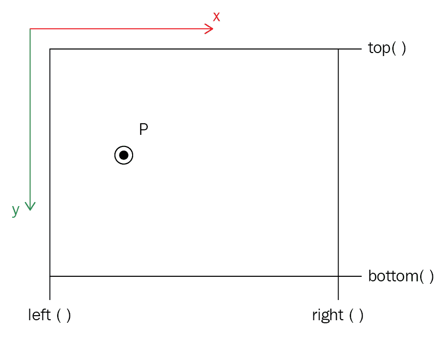

因此，如果`p.X`全部是命中：

+   `left() (p.X > left())`的右侧

+   `right() (p.X < right())`的左侧

+   在`top() (p.Y > top())`的下方

+   在`bottom() (p.Y < bottom())`的上方

请记住，在 UE4（以及通常的 UI 渲染中），*y*轴是反转的。换句话说，在 UE4 中，y 向下。这意味着`top()`小于`bottom()`，因为原点（`(0, 0)`点）位于屏幕的左上角。

# 拖动元素

我们可以轻松拖动元素：

1.  启用拖动的第一步是响应左鼠标按钮点击。首先，我们将编写在单击左鼠标按钮时执行的函数。在`Avatar.h`文件中，向类声明添加以下原型：

```cpp
void MouseClicked();
```

1.  在`Avatar.cpp`文件中，我们可以添加一个函数来执行鼠标点击，并将点击请求传递给 HUD，如下所示：

```cpp
void AAvatar::MouseClicked() 
{ 
  APlayerController* PController = GetWorld()- 
   >GetFirstPlayerController(); 
  AMyHUD* hud = Cast<AMyHUD>( PController->GetHUD() ); 
  hud->MouseClicked(); 
} 
```

1.  然后，在`AAvatar::SetupPlayerInputComponent`中，我们必须附加我们的响应者：

```cpp
PlayerInputComponent->BindAction( "MouseClickedLMB", IE_Pressed, this, &AAvatar::MouseClicked );
```

以下屏幕截图显示了如何设置绑定：

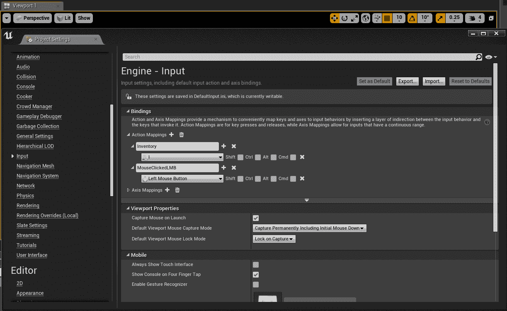

1.  向`AMyHUD`类添加一个成员，以及两个新的函数定义：

```cpp
    Widget* heldWidget;  // hold the last touched Widget in memory 

    void MouseClicked();
    void MouseMoved();
```

1.  接下来，在`AMyHUD::MouseClicked()`中，我们开始搜索命中的`Widget`：

```cpp
void AMyHUD::MouseClicked()
{
    FVector2D mouse;
    APlayerController* PController = GetWorld()->GetFirstPlayerController();
    PController->GetMousePosition(mouse.X, mouse.Y);
    heldWidget = NULL; // clear handle on last held widget 
                       // go and see if mouse xy click pos hits any widgets 
    for (int c = 0; c < widgets.Num(); c++)
    {
        if (widgets[c].hit(mouse))
        {
            heldWidget = &widgets[c];// save widget 
            return;                  // stop checking 
        }
    }
}
```

1.  在`AMyHUD::MouseClicked`函数中，我们循环遍历屏幕上的所有小部件，并检查当前鼠标位置是否命中。您可以随时通过简单查找`PController->GetMousePosition()`来获取控制器的当前鼠标位置。 

1.  每个小部件都与当前鼠标位置进行检查，鼠标点击命中的小部件将在鼠标拖动时移动。一旦确定了命中的小部件，我们就可以停止检查，所以我们从`MouseClicked()`函数中得到一个`return`值。

1.  然而，仅仅命中小部件是不够的。当鼠标移动时，我们需要拖动被命中的小部件。为此，我们需要在`AMyHUD`中实现`MouseMoved()`函数：

```cpp
void AMyHUD::MouseMoved()
{
    static FVector2D lastMouse;
    FVector2D thisMouse, dMouse;
    APlayerController* PController = GetWorld()->GetFirstPlayerController();
    PController->GetMousePosition(thisMouse.X, thisMouse.Y);
    dMouse = thisMouse - lastMouse;
    // See if the left mouse has been held down for 
    // more than 0 seconds. if it has been held down, 
    // then the drag can commence. 
    float time = PController->GetInputKeyTimeDown(
        EKeys::LeftMouseButton);
    if (time > 0.f && heldWidget)
    {
        // the mouse is being held down. 
        // move the widget by displacement amt 
        heldWidget->pos.X += dMouse.X;
        heldWidget->pos.Y += dMouse.Y; // y inverted 
    }
    lastMouse = thisMouse;
}
```

拖动函数查看鼠标位置在上一帧和本帧之间的差异，并移动所选小部件相应的距离。一个`static`变量（局部范围内的全局变量）用于在`MouseMoved()`函数调用之间记住`lastMouse`位置。

我们如何将鼠标的移动链接到在`AMyHUD`中运行`MouseMoved()`函数？如果您记得，我们已经在`Avatar`类中连接了鼠标移动。我们使用的两个函数是这些：

+   `AAvatar::Pitch()`（y 轴）

+   `AAvatar::Yaw()`（x 轴）

扩展这些函数将使您能够将鼠标输入传递给 HUD。我现在将向您展示`Yaw`函数，您可以从中推断出`Pitch`将如何工作：

```cpp
void AAvatar::Yaw( float amount ) 
{ 
  //x axis 
  if( inventoryShowing ) 
  { 
    // When the inventory is showing, 
    // pass the input to the HUD 
    APlayerController* PController = GetWorld()- 
     >GetFirstPlayerController(); 
    AMyHUD* hud = Cast<AMyHUD>( PController->GetHUD() ); 
    hud->MouseMoved(); 
    return; 
  } 
  else 
  { 
    AddControllerYawInput(200.f*amount * GetWorld()- 
     >GetDeltaSeconds()); 
  } 
} 
```

`AAvatar::Yaw()`函数首先检查库存是否显示。如果显示，输入将直接路由到 HUD，而不影响`Avatar`。如果 HUD 没有显示，输入将直接传递给`Avatar`。

确保你在文件顶部添加了`#include "MyHUD.h"`，这样才能正常工作。

# 练习

1.  完成`AAvatar::Pitch()`函数（y 轴）以将输入路由到 HUD 而不是`Avatar`。

1.  从第八章中的 NPC 角色，*角色和棋子*中获取，并在玩家靠近它们时给予玩家一个物品（比如`GoldenEgg`）。

# 把事情放在一起

现在你有了所有这些代码，你会想把它们放在一起并看到它们运行。使用你复制过来的 Meshes 创建新的蓝图，方法是在类查看器中右键单击`PickupItem`类并选择创建蓝图类，就像我们之前做的那样。设置值（包括 Mesh），然后将对象拖入游戏中。当你走进它们时，你会收到一个被拾取的消息。此时，你可以按*I*键查看你的库存。

# 总结

在本章中，我们介绍了如何为玩家设置多个拾取物品，以便在关卡中显示并拾取。我们还在屏幕上显示了它们，并添加了拖动小部件的功能。在第十一章中，*怪物*，我们将介绍怪物以及如何让它们跟随并攻击玩家。
