# 第十一章：怪物

在本章中，我们将为玩家添加对手。我们将创建一个新的景观供其漫游，并且当怪物足够接近以侦测到它们时，它们将开始朝玩家走去。一旦它们进入玩家的射程范围，它们还将发动攻击，为您提供一些基本的游戏玩法。

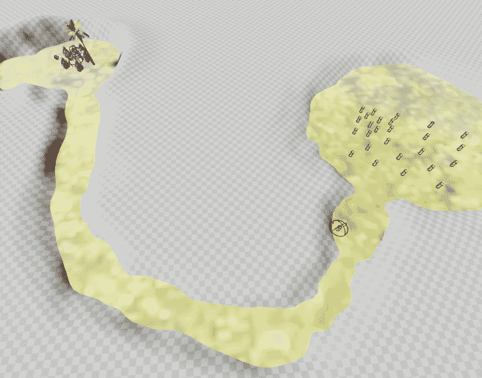

让我们来看看本章涵盖的主题：

+   景观

+   创建怪物

+   怪物对玩家的攻击

# 景观

我们在本书中尚未涵盖如何雕刻景观，所以我们将在这里进行。首先，您必须有一个景观可供使用。要做到这一点，请按照以下步骤进行：

1.  通过导航到文件|新建级别...开始一个新文件。您可以选择一个空的级别或一个带有天空的级别。在这个例子中，我选择了没有天空的那个。

1.  要创建景观，我们必须从模式面板中工作。确保通过导航到窗口|模式显示模式面板：

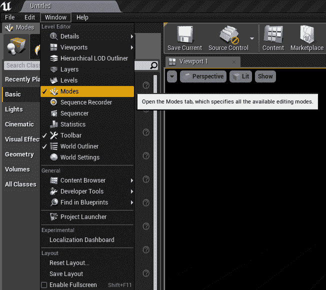

1.  景观可以通过三个步骤创建，如下面的屏幕截图所示：

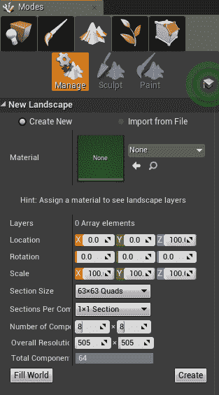

三个步骤如下：

1.  1.  单击模式面板中的景观图标（山的图片）

1.  单击管理按钮

1.  单击屏幕右下角的创建按钮

1.  现在您应该有一个景观可以使用。它将显示为主窗口中的灰色瓷砖区域：

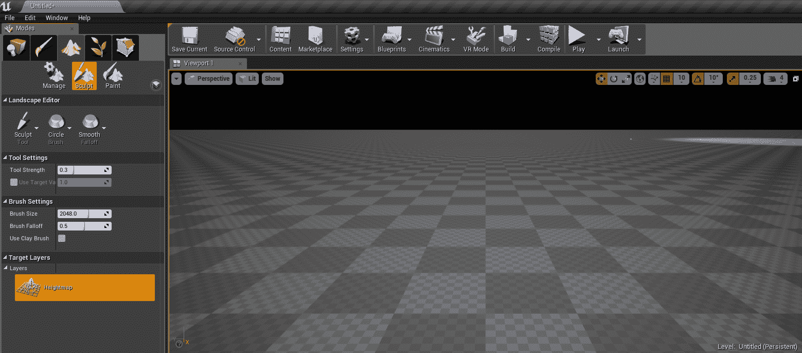

您在景观场景中要做的第一件事是为其添加一些颜色。没有颜色的景观算什么？

1.  在您的灰色瓷砖景观对象的任何位置单击。在右侧的详细信息面板中，您将看到它填充了信息，如下面的屏幕截图所示：

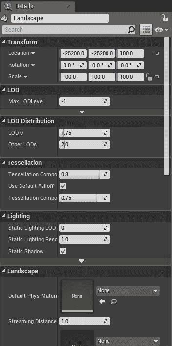

1.  向下滚动，直到看到景观材料属性。您可以选择 M_Ground_Grass 材料，使地面看起来更逼真。

1.  向场景添加光。您可能应该使用定向光，以便所有地面都有一些光线。我们在第八章中已经介绍了如何做到这一点，*演员和棋子*。

# 雕刻景观

一个平坦的景观可能会很无聊。我们至少应该在这个地方添加一些曲线和山丘。要这样做，请执行以下步骤：

1.  单击模式面板中的雕刻按钮：

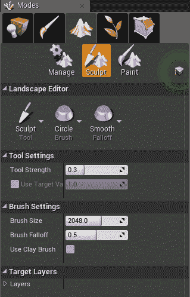

您的刷子的强度和大小由模式窗口中的刷子大小和工具强度参数确定。

1.  单击您的景观并拖动鼠标以改变草皮的高度。

1.  一旦您对您所拥有的内容感到满意，请单击播放按钮进行尝试。结果输出如下屏幕截图所示：

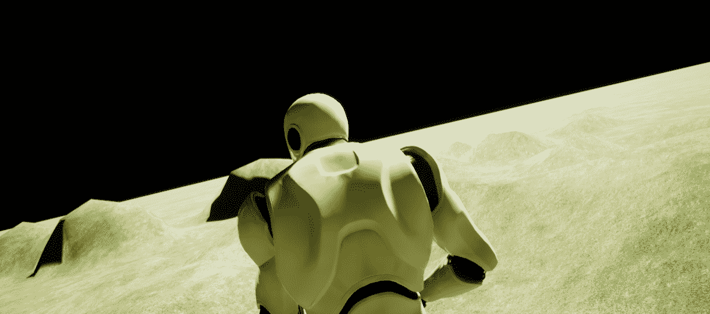

1.  玩弄您的景观并创建一个场景。我所做的是将景观降低到一个平坦的地面平面周围，以便玩家有一个明确定义的平坦区域可以行走，如下面的屏幕截图所示：

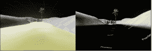

随意处理您的景观。如果愿意，您可以将我在这里所做的作为灵感。

我建议您从 ContentExamples 或 StrategyGame 导入资产，以便在游戏中使用它们。要做到这一点，请参考第十章中的*导入资产*部分，*库存系统和拾取物品*。导入资产完成后，我们可以继续将怪物带入我们的世界。

# 创建怪物

我们将以与我们编程 NPC 和`PickupItem`相同的方式开始编程怪物。我们将编写一个基类（通过派生自 character）来表示`Monster`类，然后为每种怪物类型派生一堆蓝图。每个怪物都将有一些共同的属性，这些属性决定了它的行为。以下是共同的属性：

+   它将有一个用于速度的`float`变量。

+   它将有一个用于`HitPoints`值的`float`变量（我通常使用浮点数来表示 HP，这样我们可以轻松地模拟 HP 流失效果，比如走过一片熔岩池）。

+   它将有一个用于击败怪物所获得的经验值的`int32`变量。

+   它将有一个用于怪物掉落的战利品的`UClass`函数。

+   它将有一个用于每次攻击造成的`BaseAttackDamage`的`float`变量。

+   它将有一个用于`AttackTimeout`的`float`变量，这是怪物在攻击之间休息的时间。

+   它将有两个`USphereComponents`对象：其中一个是`SightSphere`——怪物能看到的距离。另一个是`AttackRangeSphere`，这是它的攻击范围。`AttackRangeSphere`对象始终小于`SightSphere`。

按照以下步骤进行操作：

1.  从`Character`类派生你的`Monster`类。你可以在 UE4 中通过转到文件 | 新建 C++类...，然后从菜单中选择你的基类的 Character 选项来完成这个操作。

1.  填写`Monster`类的基本属性。

1.  确保声明`UPROPERTY(EditAnywhere, BlueprintReadWrite, Category = MonsterProperties)`，以便可以在蓝图中更改怪物的属性。这是你应该在`Monster.h`中拥有的内容：

```cpp
#pragma once

#include "CoreMinimal.h"
#include "GameFramework/Character.h"
#include "Components/SphereComponent.h"
#include "Monster.generated.h"

UCLASS()
class GOLDENEGG_API AMonster : public ACharacter
{
    GENERATED_BODY()
public:
    AMonster(const FObjectInitializer& ObjectInitializer);

        // How fast he is 
        UPROPERTY(EditAnywhere, BlueprintReadWrite, Category =
            MonsterProperties)
        float Speed;

    // The hitpoints the monster has 
    UPROPERTY(EditAnywhere, BlueprintReadWrite, Category =
        MonsterProperties)
        float HitPoints;

    // Experience gained for defeating 
    UPROPERTY(EditAnywhere, BlueprintReadWrite, Category =
        MonsterProperties)
        int32 Experience;

    // Blueprint of the type of item dropped by the monster 
    UPROPERTY(EditAnywhere, BlueprintReadWrite, Category =
        MonsterProperties)
        UClass* BPLoot;

    // The amount of damage attacks do 
    UPROPERTY(EditAnywhere, BlueprintReadWrite, Category =
        MonsterProperties)
        float BaseAttackDamage;

    // Amount of time the monster needs to rest in seconds 
    // between attacking 
    UPROPERTY(EditAnywhere, BlueprintReadWrite, Category =
        MonsterProperties)
        float AttackTimeout;

    // Time since monster's last strike, readable in blueprints 
    UPROPERTY(VisibleAnywhere, BlueprintReadOnly, Category =
        MonsterProperties)
        float TimeSinceLastStrike;

    // Range for his sight 
    UPROPERTY(VisibleDefaultsOnly, BlueprintReadOnly, Category =
        Collision)
        USph.ereComponent* SightSphere;

    // Range for his attack. Visualizes as a sphere in editor, 
    UPROPERTY(VisibleDefaultsOnly, BlueprintReadOnly, Category =
        Collision)
        USphereComponent* AttackRangeSphere;
};
```

1.  你需要在`Monster`构造函数中添加一些最基本的代码，以初始化怪物的属性。在`Monster.cpp`文件中使用以下代码（这应该替换默认构造函数）：

```cpp
AMonster::AMonster(const FObjectInitializer& ObjectInitializer)
 : Super(ObjectInitializer)
{
 Speed = 20;
 HitPoints = 20;
 Experience = 0;
 BPLoot = NULL;
 BaseAttackDamage = 1;
 AttackTimeout = 1.5f;
 TimeSinceLastStrike = 0;

 SightSphere = ObjectInitializer.CreateDefaultSubobject<USphereComponent>
 (this, TEXT("SightSphere"));
 SightSphere->AttachToComponent(RootComponent, FAttachmentTransformRules::KeepWorldTransform);

 AttackRangeSphere = ObjectInitializer.CreateDefaultSubobject
 <USphereComponent>(this, TEXT("AttackRangeSphere"));
 AttackRangeSphere->AttachToComponent(RootComponent, FAttachmentTransformRules::KeepWorldTransform);
}
```

1.  编译并运行代码。

1.  打开虚幻编辑器，并基于你的`Monster`类派生一个蓝图（称之为`BP_Monster`）。

1.  现在，我们可以开始配置我们怪物的`Monster`属性。对于骨骼网格，我们不会使用相同的模型，因为我们需要怪物能够进行近战攻击，而相同的模型没有近战攻击。然而，Mixamo 动画包文件中的一些模型具有近战攻击动画。

1.  因此，从 UE4 市场（免费）下载 Mixamo 动画包文件：

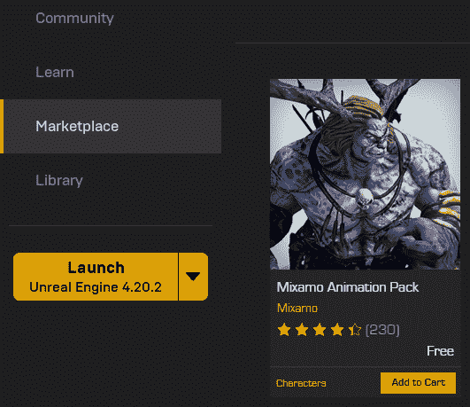

包中有一些相当恶心的模型，我会避免使用，但其他一些模型非常好。

1.  你应该将 Mixamo 动画包文件添加到你的项目中。它已经有一段时间没有更新了，但你可以通过勾选显示所有项目并从下拉列表中选择 4.10 版本来添加它，如下面的截图所示：

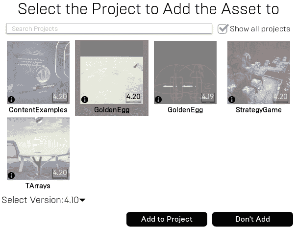

1.  编辑`BP_Monster`蓝图的类属性，并选择 Mixamo_Adam（实际上在包的当前版本中是 Maximo_Adam）作为骨骼网格。确保将其与胶囊组件对齐。同时，选择 MixamoAnimBP_Adam 作为动画蓝图：

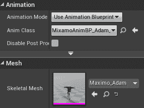

我们将稍后修改动画蓝图，以正确地包含近战攻击动画。

在编辑`BP_Monster`蓝图时，将`SightSphere`和`AttackRangeSphere`对象的大小更改为你认为合理的值。我让我的怪物的`AttackRangeSphere`对象足够大，大约是手臂长度（60 个单位），他的`SightSphere`对象是这个值的 25 倍大（大约 1500 个单位）。

记住，一旦玩家进入怪物的`SightSphere`，怪物就会开始朝玩家移动，一旦玩家进入怪物的`AttackRangeSphere`对象，怪物就会开始攻击玩家：

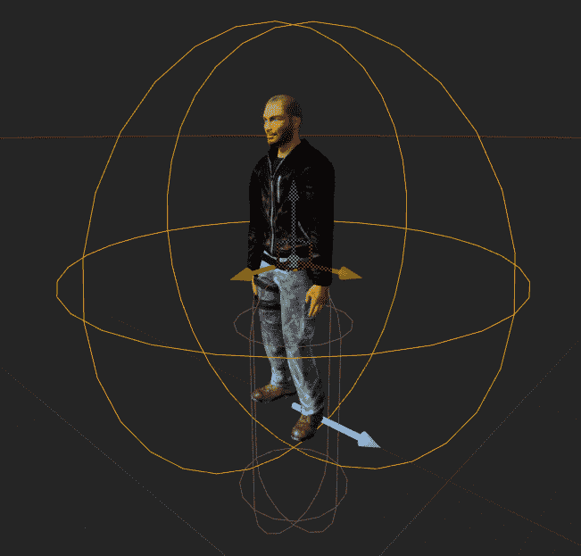

在游戏中放置一些`BP_Monster`实例；编译并运行。没有任何驱动`Monster`角色移动的代码，你的怪物应该只是闲置在那里。

# 基本怪物智能

在我们的游戏中，我们只会为`Monster`角色添加基本智能。怪物将知道如何做两件基本的事情：

+   追踪玩家并跟随他

+   攻击玩家

怪物不会做其他事情。当玩家首次被发现时，你可以让怪物嘲讽玩家，但我们会把这留给你作为练习。

# 移动怪物-转向行为

非常基本的游戏中的怪物通常没有复杂的运动行为。通常，它们只是朝着目标走去并攻击它。我们将在这个游戏中编写这种类型的怪物，但你可以通过让怪物在地形上占据有利位置进行远程攻击等方式获得更有趣的游戏体验。我们不会在这里编写，但这是值得考虑的事情。

为了让“怪物”角色朝向玩家移动，我们需要在每一帧动态更新“怪物”角色移动的方向。为了更新怪物面对的方向，我们在`Monster::Tick()`方法中编写代码。

`Tick`函数在游戏的每一帧中运行。Tick 函数的签名如下：

```cpp
virtual void Tick(float DeltaSeconds) override; 
```

你需要在`Monster.h`文件中的`AMonster`类中添加这个函数的原型。如果我们重写了`Tick`，我们可以在每一帧中放置我们自己的自定义行为，这样`Monster`角色就应该做。下面是一些基本的代码，将在每一帧中将怪物移向玩家：

```cpp
void AMonster::Tick(float DeltaSeconds) {
    Super::Tick(DeltaSeconds); 

    //basic intel : move the monster towards the player 
    AAvatar *avatar = Cast<AAvatar>(
            UGameplayStatics::GetPlayerPawn(GetWorld(), 0)); 
    if (!avatar) return;
    FVector toPlayer = avatar->GetActorLocation() - GetActorLocation(); 
    toPlayer.Normalize(); // reduce to unit vector 
                        // Actually move the monster towards the player a bit
    AddMovementInput(toPlayer, Speed*DeltaSeconds); // At least face the target
    // Gets you the rotator to turn something // that looks in the `toPlayer`direction 
    FRotator toPlayerRotation = toPlayer.Rotation();
    toPlayerRotation.Pitch = 0; // 0 off the pitch
    RootComponent->SetWorldRotation(toPlayerRotation);
}
```

你还需要在文件顶部添加以下包含：

```cpp
#include "Avatar.h"

#include "Kismet/GameplayStatics.h"
```

为了使`AddMovementInput`起作用，你必须在蓝图中的 AIController 类面板下选择一个控制器，如下图所示：

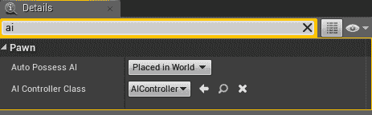

如果你选择了`None`，对`AddMovementInput`的调用将不会产生任何效果。为了防止这种情况发生，请选择`AIController`类或`PlayerController`类作为你的 AIController 类。确保你对地图上放置的每个怪物都进行了检查。

上面的代码非常简单。它包括了敌人智能的最基本形式-每一帧向玩家移动一小部分：

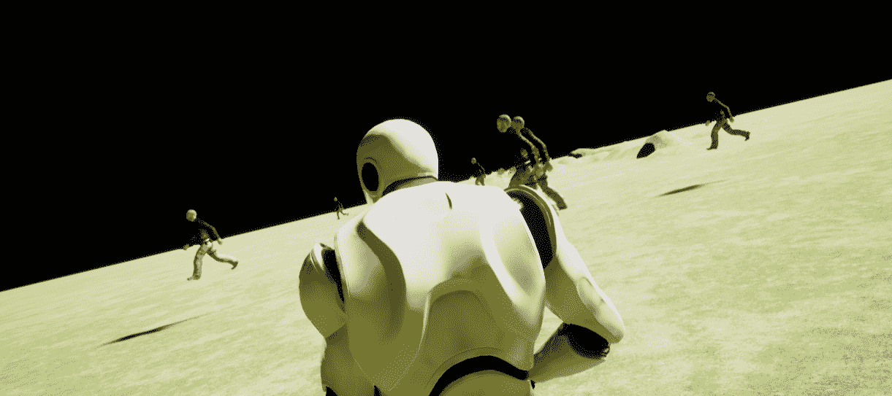

如果你的怪物面向玩家的反方向，请尝试在 Z 方向上将网格的旋转角度减少 90 度。

经过一系列帧后，怪物将跟踪并围绕关卡追随玩家。要理解这是如何工作的，你必须记住`Tick`函数平均每秒调用约 60 次。这意味着在每一帧中，怪物都会离玩家更近一点。由于怪物以非常小的步伐移动，它的动作看起来平滑而连续（实际上，它在每一帧中都在做小跳跃）：

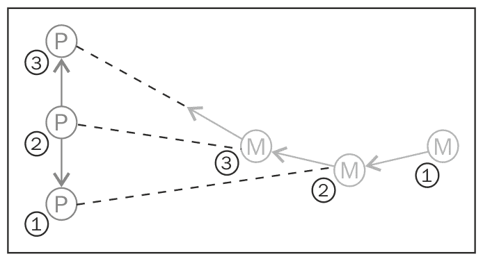

跟踪的离散性-怪物在三个叠加帧上的运动

怪物每秒移动约 60 次的原因是硬件限制。典型显示器的刷新率为 60 赫兹，因此它作为每秒有用的更新次数的实际限制器。以高于刷新率的帧率进行更新是可能的，但对于游戏来说并不一定有用，因为在大多数硬件上，你每 1/60 秒只能看到一张新图片。一些高级的物理建模模拟几乎每秒进行 1,000 次更新，但可以说，你不需要那种分辨率的游戏，你应该将额外的 CPU 时间保留给玩家会喜欢的东西，比如更好的 AI 算法。一些新硬件宣称刷新率高达 120 赫兹（查找游戏显示器，但不要告诉你的父母我让你把所有的钱都花在上面）。

# 怪物运动的离散性

计算机游戏是离散的。在前面的截图中，玩家被视为沿着屏幕直线移动，以微小的步骤。怪物的运动也是小步骤。在每一帧中，怪物朝玩家迈出一个小的离散步骤。怪物在移动时遵循一条明显的曲线路径，直接朝向每一帧中玩家所在的位置。

将怪物移向玩家，按照以下步骤进行：

1.  我们必须获取玩家的位置。由于玩家在全局函数`UGameplayStatics::GetPlayerPawn`中可访问，我们只需使用此函数检索指向玩家的指针。

1.  我们找到了从`Monster`函数(`GetActorLocation()`)指向玩家(`avatar->GetActorLocation()`)的向量。

1.  我们需要找到从怪物指向 avatar 的向量。为此，您必须从怪物的位置中减去 avatar 的位置，如下面的截图所示：

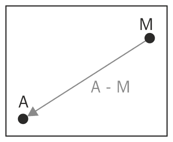

这是一个简单的数学规则，但往往容易出错。要获得正确的向量，始终要从目标（终点）向量中减去源（起点）向量。在我们的系统中，我们必须从`Monster`向量中减去`Avatar`向量。这是因为从系统中减去`Monster`向量会将`Monster`向量移动到原点，而`Avatar`向量将位于`Monster`向量的左下方：

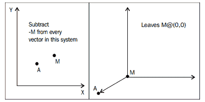

确保尝试你的代码。此时，怪物将朝向你的玩家奔跑并围拢在他周围。通过上述代码的设置，它们不会攻击，只会跟随他，如下面的截图所示：

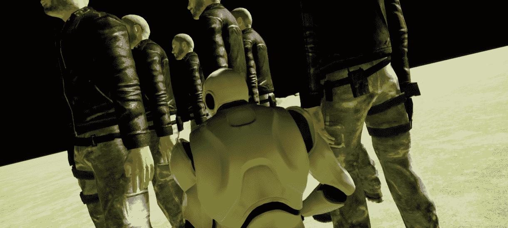

# Monster SightSphere

目前，怪物并未注意`SightSphere`组件。也就是说，在世界中无论玩家在哪里，怪物都会朝向他移动。我们现在想要改变这一点。

要做到这一点，我们只需要让`Monster`遵守`SightSphere`的限制。如果玩家在怪物的`SightSphere`对象内，怪物将进行追击。否则，怪物将对玩家的位置视而不见，不会追击玩家。

检查对象是否在球体内很简单。在下面的截图中，如果点**p**和中心**c**之间的距离**d**小于球体半径**r**，则点**p**在球体内：

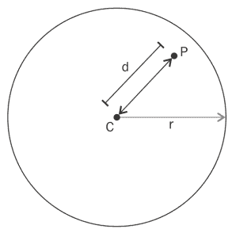

当 d 小于 r 时，P 在球体内

因此，在我们的代码中，前面的截图翻译成以下内容：

```cpp
void AMonster::Tick(float DeltaSeconds) 
{ 
  Super::Tick( DeltaSeconds ); 
  AAvatar *avatar = Cast<AAvatar>(  
   UGameplayStatics::GetPlayerPawn(GetWorld(), 0) ); 
  if( !avatar ) return; 
    FVector toPlayer = avatar->GetActorLocation() -  
     GetActorLocation(); 
  float distanceToPlayer = toPlayer.Size(); 
  // If the player is not in the SightSphere of the monster, 
  // go back 
  if( distanceToPlayer > SightSphere->GetScaledSphereRadius() ) 
  { 
    // If the player is out of sight, 
    // then the enemy cannot chase 
    return; 
  } 

  toPlayer /= distanceToPlayer;  // normalizes the vector 
  // Actually move the monster towards the player a bit 
  AddMovementInput(toPlayer, Speed*DeltaSeconds); 
  // (rest of function same as before (rotation)) 
} 
```

前面的代码为`Monster`角色添加了额外的智能。`Monster`角色现在可以在玩家超出怪物的`SightSphere`对象范围时停止追逐玩家。结果如下：

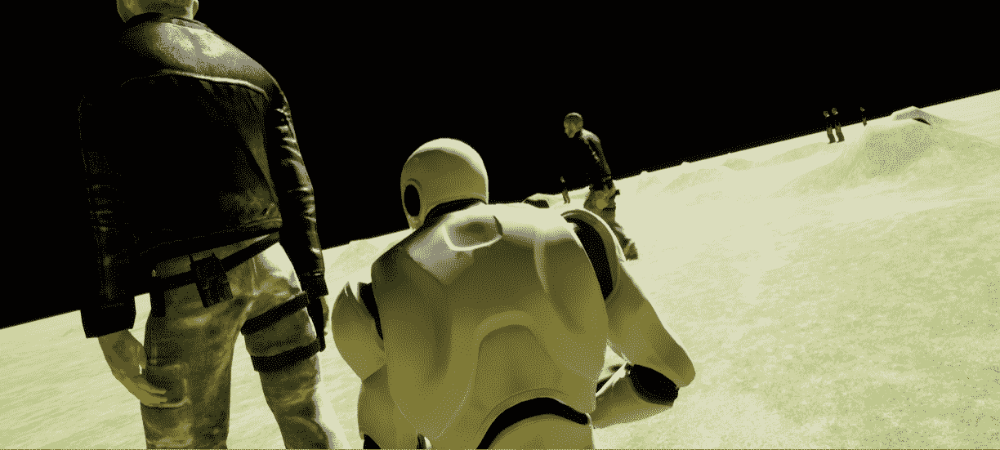

在这里要做的一个好事情是将距离比较封装到一个简单的内联函数中。我们可以在`Monster`头文件中提供这两个内联成员函数，如下所示：

```cpp
inline bool isInSightRange( float d ) 
{ return d < SightSphere->GetScaledSphereRadius(); } 
inline bool isInAttackRange( float d ) 
{ return d < AttackRangeSphere->GetScaledSphereRadius(); } 
```

这些函数在传递的参数`d`在相关的球体内时返回值`true`。

内联函数意味着该函数更像是一个宏而不是函数。宏被复制并粘贴到调用位置，而函数则由 C++跳转并在其位置执行。内联函数很好，因为它们能够提供良好的性能，同时保持代码易于阅读。它们是可重用的。

# 怪物对玩家的攻击

怪物可以进行几种不同类型的攻击。根据`Monster`角色的类型，怪物的攻击可能是近战或远程攻击。

`Monster`角色将在玩家进入其`AttackRangeSphere`对象时攻击玩家。如果玩家超出怪物的`AttackRangeSphere`对象的范围，但玩家在怪物的`SightSphere`对象中，则怪物将向玩家靠近，直到玩家进入怪物的`AttackRangeSphere`对象。

# 近战攻击

*melee*的词典定义是一群混乱的人。近战攻击是在近距离进行的攻击。想象一群*zerglings*与一群*ultralisks*激烈战斗（如果你是星际争霸玩家，你会知道 zerglings 和 ultralisks 都是近战单位）。近战攻击基本上是近距离的肉搏战。要进行近战攻击，您需要一个近战攻击动画，当怪物开始近战攻击时，它会打开。为此，您需要在 UE4 的动画编辑器中编辑动画蓝图。

Zak Parrish 的系列是学习在蓝图中编程动画的绝佳起点：[`www.youtube.com/watch?v=AqYmC2wn7Cg&list=PL6VDVOqa_mdNW6JEu9UAS_s40OCD_u6yp&index=8`](https://www.youtube.com/watch?v=AqYmC2wn7Cg&list=PL6VDVOqa_mdNW6JEu9UAS_s40OCD_u6yp&index=8)。

现在，我们只会编写近战攻击，然后担心以后在蓝图中修改动画。

# 定义近战武器

我们将有三个部分来定义我们的近战武器。它们如下：

+   代表它的 C++代码

+   模型

+   连接代码和模型的 UE4 蓝图

# 用 C++编写近战武器

我们将定义一个新类`AMeleeWeapon`（派生自`AActor`），代表手持战斗武器（您现在可能已经猜到，A 会自动添加到您使用的名称中）。我将附加一些蓝图可编辑的属性到`AMeleeWeapon`类，并且`AMeleeWeapon`类将如下所示：

```cpp
#include "CoreMinimal.h"
#include "GameFramework/Actor.h"
#include "Components/BoxComponent.h"
#include "MeleeWeapon.generated.h"

class AMonster;

UCLASS()
class GOLDENEGG_API AMeleeWeapon : public AActor
{
    GENERATED_BODY()

public:
    AMeleeWeapon(const FObjectInitializer& ObjectInitializer);

    // The amount of damage attacks by this weapon do 
    UPROPERTY(EditAnywhere, BlueprintReadWrite, Category =
        MeleeWeapon)
        float AttackDamage;

    // A list of things the melee weapon already hit this swing 
    // Ensures each thing sword passes thru only gets hit once 
    TArray<AActor*> ThingsHit;

    // prevents damage from occurring in frames where 
    // the sword is not swinging 
    bool Swinging;

    // "Stop hitting yourself" - used to check if the  
    // actor holding the weapon is hitting himself 
    AMonster *WeaponHolder;

    // bounding box that determines when melee weapon hit 
    UPROPERTY(VisibleDefaultsOnly, BlueprintReadOnly, Category =
        MeleeWeapon)
        UBoxComponent* ProxBox;

    UPROPERTY(VisibleDefaultsOnly, BlueprintReadOnly, Category =
        MeleeWeapon)
        UStaticMeshComponent* Mesh;

    UFUNCTION(BlueprintNativeEvent, Category = Collision)
        void Prox(UPrimitiveComponent* OverlappedComponent, AActor* OtherActor, UPrimitiveComponent* OtherComp,
            int32 OtherBodyIndex, bool bFromSweep, const FHitResult& SweepResult);

    // You shouldn't need this unless you get a compiler error that it can't find this function.
    virtual int Prox_Implementation(UPrimitiveComponent* OverlappedComponent, AActor* OtherActor, UPrimitiveComponent* OtherComp,
        int32 OtherBodyIndex, bool bFromSweep, const FHitResult& SweepResult);

    void Swing();
    void Rest();
};
```

请注意，我在`ProxBox`中使用了边界框，而不是边界球。这是因为剑和斧头更适合用盒子而不是球来近似。这个类内部还有两个成员函数`Rest()`和`Swing()`，让`MeleeWeapon`知道演员处于什么状态（休息或挥舞）。这个类内还有一个`TArray<AActor*> ThingsHit`属性，用于跟踪每次挥舞时被这个近战武器击中的演员。我们正在编程，以便武器每次挥舞只能击中每个事物一次。

`AMeleeWeapon.cpp`文件将只包含一个基本构造函数和一些简单的代码，用于在我们的剑击中`OtherActor`时发送伤害。我们还将实现`Rest()`和`Swing()`函数以清除被击中的事物列表。`MeleeWeapon.cpp`文件包含以下代码：

```cpp
#include "MeleeWeapon.h"
#include "Monster.h"

AMeleeWeapon::AMeleeWeapon(const FObjectInitializer& ObjectInitializer)
    : Super(ObjectInitializer)
{
    AttackDamage = 1;
    Swinging = false;
    WeaponHolder = NULL;

    Mesh = ObjectInitializer.CreateDefaultSubobject<UStaticMeshComponent>(this,
        TEXT("Mesh"));
    RootComponent = Mesh;

    ProxBox = ObjectInitializer.CreateDefaultSubobject<UBoxComponent>(this,
        TEXT("ProxBox"));  
    ProxBox->OnComponentBeginOverlap.AddDynamic(this,
            &AMeleeWeapon::Prox);
    ProxBox->AttachToComponent(RootComponent, FAttachmentTransformRules::KeepWorldTransform);
}

int AMeleeWeapon::Prox_Implementation(UPrimitiveComponent* OverlappedComponent, AActor* OtherActor, UPrimitiveComponent* OtherComp,
    int32 OtherBodyIndex, bool bFromSweep, const FHitResult& SweepResult)
{
    // don't hit non root components 
    if (OtherComp != OtherActor->GetRootComponent())
    {
        return -1;
    }

    // avoid hitting things while sword isn't swinging, 
    // avoid hitting yourself, and 
    // avoid hitting the same OtherActor twice 
    if (Swinging && OtherActor != (AActor *) WeaponHolder &&
        !ThingsHit.Contains(OtherActor))
    {
        OtherActor->TakeDamage(AttackDamage + WeaponHolder->BaseAttackDamage, FDamageEvent(), NULL, this);
        ThingsHit.Add(OtherActor);
    }

    return 0;
}

void AMeleeWeapon::Swing()
{
    ThingsHit.Empty();  // empty the list 
    Swinging = true;
}

void AMeleeWeapon::Rest()
{
    ThingsHit.Empty();
    Swinging = false;
}
```

# 下载一把剑

要完成这个练习，我们需要一把剑放在模型的手中。我从[Kaan Gülhan](http://tf3dm.com/3d-model/sword-95782.html)添加了一个名为*Kilic*的剑到项目中。以下是您可以获得免费模型的其他地方的列表：

+   [`www.turbosquid.com/`](http://www.turbosquid.com/)

+   [`tf3dm.com/`](http://tf3dm.com/)

+   [`archive3d.net/`](http://archive3d.net/)

+   [`www.3dtotal.com/`](http://www.3dtotal.com/)

秘诀

乍看之下，在[TurboSquid.com](http://TurboSquid.com)上似乎没有免费模型。实际上，秘诀在于您必须在价格下选择免费：

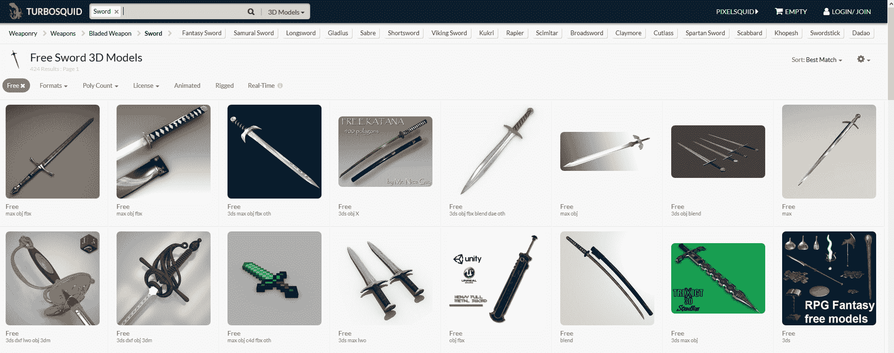

我不得不稍微编辑 kilic 剑网格，以修复初始大小和旋转。您可以将任何**Filmbox**（**FBX**）格式的网格导入到您的游戏中。kilic 剑模型包含在本章的示例代码包中。要将您的剑导入 UE4 编辑器，请执行以下步骤：

1.  右键单击要将模型添加到的任何文件夹

1.  导航到新资产|导入到（路径）...

1.  从弹出的文件资源管理器中，选择要导入的新资产。

1.  如果 Models 文件夹不存在，您可以通过在左侧的树视图上右键单击并在内容浏览器选项卡的左侧窗格中选择新文件夹来创建一个。

我从桌面上选择了`kilic.fbx`资产：

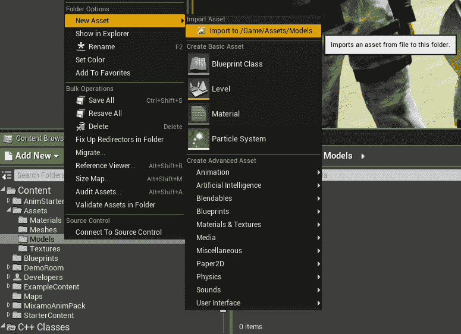

# 为近战武器创建蓝图

创建近战武器蓝图的步骤如下：

1.  在 UE4 编辑器中，创建一个基于`AMeleeWeapon`的蓝图，名为`BP_MeleeSword`。

1.  配置`BP_MeleeSword`以使用 kilic 刀片模型（或您选择的任何刀片模型），如下截图所示：

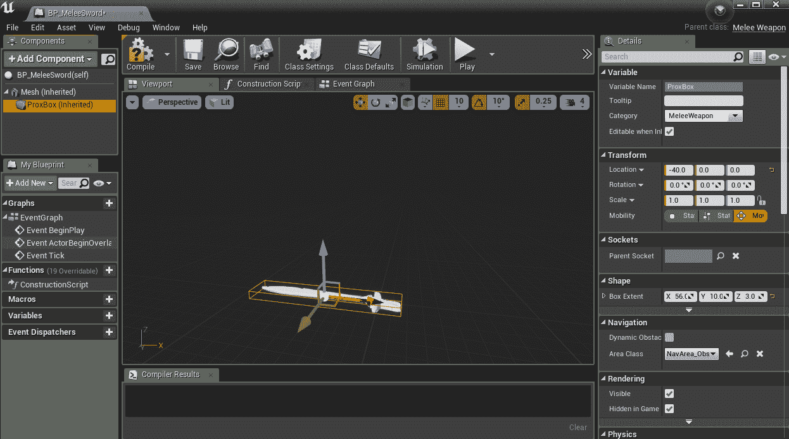

1.  `ProxBox`类将确定武器是否击中了某物，因此我们将修改`ProxBox`类，使其仅包围剑的刀片，如下截图所示：

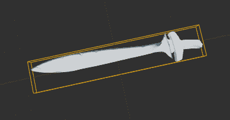

1.  在碰撞预设面板下，对于网格（而不是 BlockAll），选择 NoCollision 选项非常重要。如下截图所示：

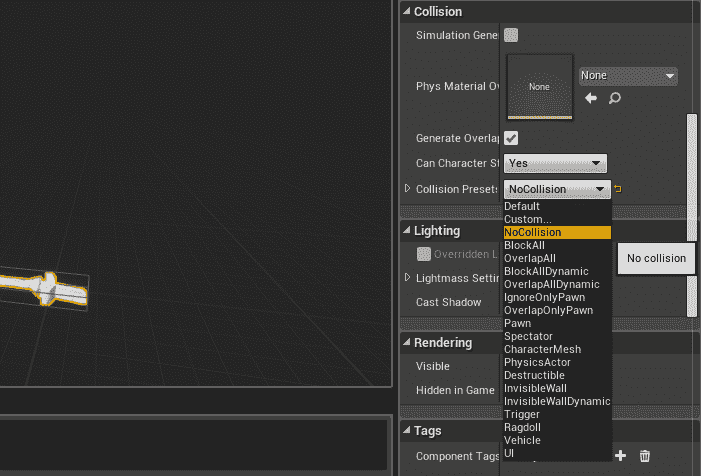

1.  如果选择 BlockAll，则游戏引擎将自动解决剑和角色之间的所有相互穿透，通过推开剑触碰到的物体。结果是，每当挥动剑时，您的角色将似乎飞起来。

# 插座

在 UE4 中，插座是一个骨骼网格上的插座，用于另一个`Actor`。您可以在骨骼网格身上的任何地方放置插座。在正确放置插座后，您可以在 UE4 代码中将另一个`Actor`连接到此插座。

例如，如果我们想要在怪物的手中放一把剑，我们只需在怪物的手上创建一个插座。我们可以通过在玩家的头上创建一个插座，将头盔连接到玩家身上。

# 在怪物的手中创建一个骨骼网格插座

要将插座连接到怪物的手上，我们必须编辑怪物正在使用的骨骼网格。由于我们使用了 Mixamo_Adam 骨骼网格用于怪物，我们必须打开并编辑此骨骼网格。为此，请执行以下步骤：

1.  双击内容浏览器选项卡中的 Mixamo_Adam 骨骼网格（这将显示为 T 形），以打开骨骼网格编辑器。

1.  如果在内容浏览器选项卡中看不到 Mixamo Adam，请确保已经从 Unreal Launcher 应用程序将 Mixamo 动画包文件导入到项目中：

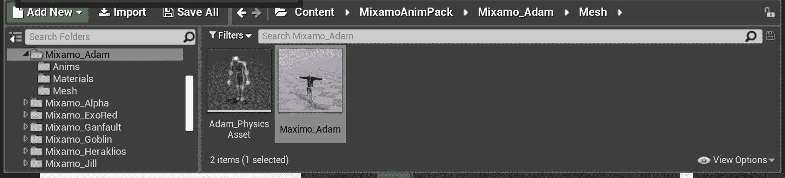

1.  单击屏幕右上角的 Skeleton。

1.  在左侧面板的骨骼树中向下滚动，直到找到 RightHand 骨骼。

1.  我们将在此骨骼上添加一个插座。右键单击 RightHand 骨骼，然后选择 Add Socket，如下截图所示：

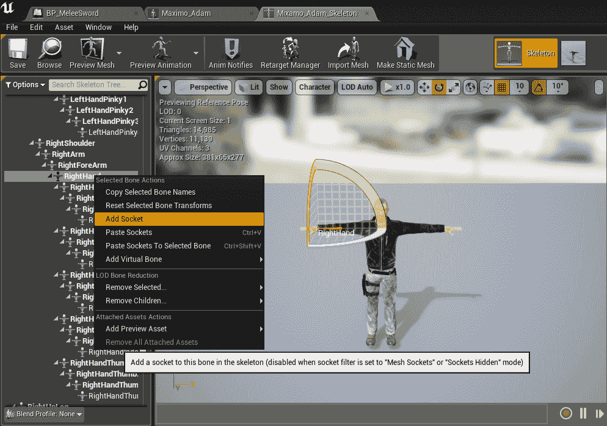

1.  您可以保留默认名称（RightHandSocket），或者根据需要重命名插座，如下截图所示：

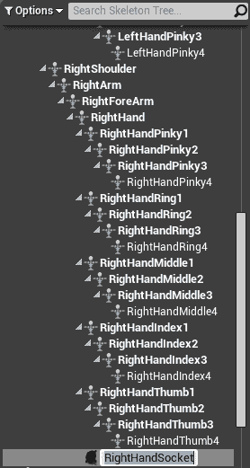

接下来，我们需要将剑添加到角色的手中。

# 将剑连接到模型

连接剑的步骤如下：

1.  打开 Adam 骨骼网格，找到树视图中的 RightHandSocket 选项。由于 Adam 用右手挥舞，所以应该将剑连接到他的右手上。

1.  右键单击 RightHandSocket 选项，选择 Add Preview Asset，并在出现的窗口中找到剑的骨骼网格：

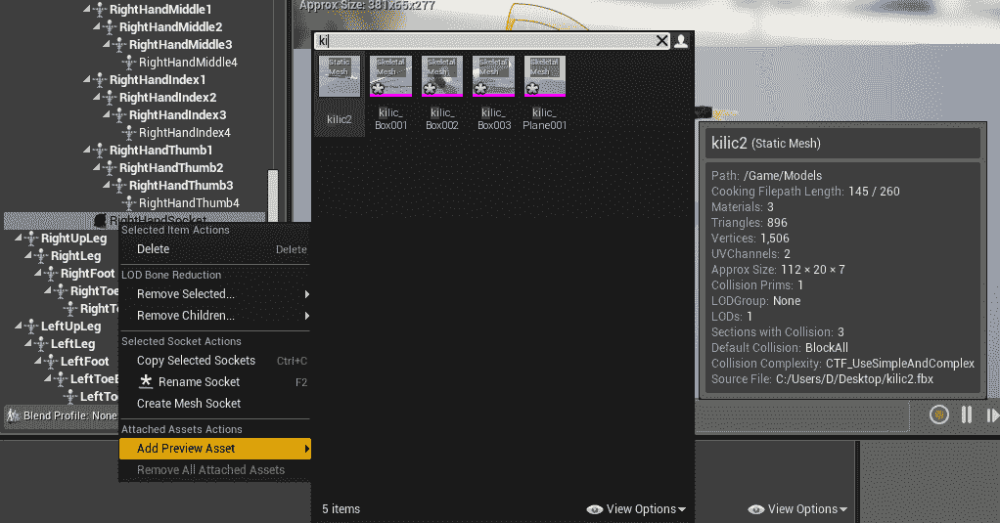

1.  您应该在模型的图像中看到 Adam 握着剑，如下截图所示：

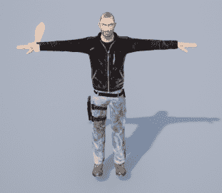

1.  现在，点击 RightHandSocket 并放大 Adam 的手。我们需要调整预览中插座的位置，以便剑能正确放入其中。

1.  使用移动和旋转操作器或手动更改详细窗口中的插座参数，使剑正确放入他的手中：

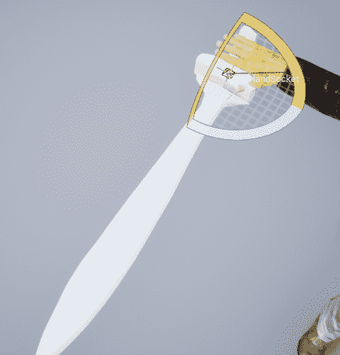

一个现实世界的提示

如果您有几个剑模型，想要在同一个`RightHandSocket`中切换，您需要确保这些不同的剑之间有相当的一致性（没有异常）。

1.  您可以通过转到屏幕右上角的动画选项卡来预览手中拿着剑的动画：

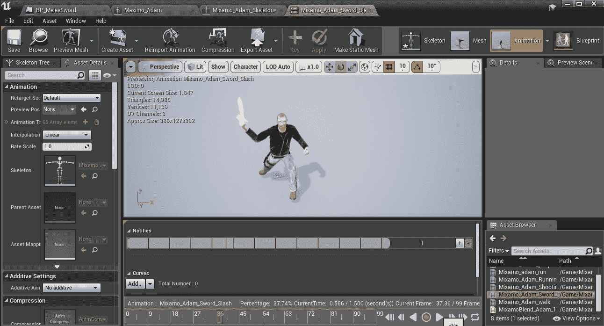

然而，如果您启动游戏，Adam 将不会拿着剑。这是因为在 Persona 中将剑添加到插槽仅用于预览目的。

# 给玩家装备剑的代码

要从代码中为玩家装备一把剑并将其永久绑定到角色，需要在怪物实例初始化后实例化一个`AMeleeWeapon`实例，并将其附加到`RightHandSocket`。我们在`PostInitializeComponents()`中执行此操作，因为在这个函数中，`Mesh`对象已经完全初始化。

在`Monster.h`文件中，添加一个选择要使用的近战武器的`Blueprint`类名称（`UClass`）的挂钩。此外，使用以下代码添加一个变量的挂钩来实际存储`MeleeWeapon`实例：

```cpp
// The MeleeWeapon class the monster uses 
// If this is not set, he uses a melee attack 
UPROPERTY(EditAnywhere, BlueprintReadWrite, Category =  
   MonsterProperties) 
UClass* BPMeleeWeapon; 

// The MeleeWeapon instance (set if the character is using 
// a melee weapon) 
AMeleeWeapon* MeleeWeapon; 
```

此外，请确保在文件顶部添加`#include "MeleeWeapon.h"`。现在，在怪物的蓝图类中选择`BP_MeleeSword`蓝图。

在 C++代码中，您需要实例化武器。为此，我们需要为`Monster`类声明和实现一个`PostInitializeComponents`函数。在`Monster.h`中，添加原型声明：

```cpp
virtual void PostInitializeComponents() override; 
```

`PostInitializeComponents`在怪物对象的构造函数完成并且对象的所有组件都初始化（包括蓝图构造）之后运行。因此，现在是检查怪物是否附加了`MeleeWeapon`蓝图的完美时机，并在有的情况下实例化这个武器。以下代码被添加到`Monster.cpp`的`AMonster::PostInitializeComponents()`实现中以实例化武器：

```cpp
void AMonster::PostInitializeComponents()
{
    Super::PostInitializeComponents();

    // instantiate the melee weapon if a bp was selected 
    if (BPMeleeWeapon)
    {
        MeleeWeapon = GetWorld()->SpawnActor<AMeleeWeapon>(
            BPMeleeWeapon, FVector(), FRotator());

        if (MeleeWeapon)
        {
            const USkeletalMeshSocket *socket = GetMesh()->GetSocketByName(
                FName("RightHandSocket")); // be sure to use correct 
                                    // socket name! 
            socket->AttachActor(MeleeWeapon, GetMesh());
            MeleeWeapon->WeaponHolder = this;
        }
    }
}
```

此外，请确保在文件顶部添加`#include "Engine/SkeletalMeshSocket.h"`。如果为怪物的蓝图选择了`BPMeleeWeapon`，那么怪物现在将会从一开始就拿着剑：

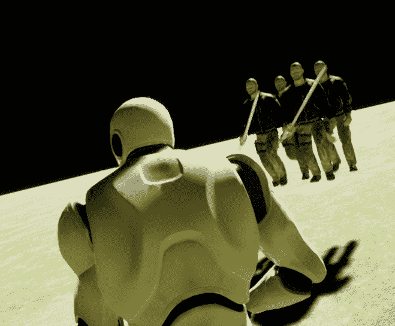

# 触发攻击动画

默认情况下，我们的 C++ `Monster`类与触发攻击动画之间没有连接；换句话说，`MixamoAnimBP_Adam`类无法知道怪物何时处于攻击状态。

因此，我们需要更新 Adam 骨骼的动画蓝图（`MixamoAnimBP_Adam`），以包括在`Monster`类变量列表中查询并检查怪物是否处于攻击状态。我们在本书中之前没有使用过动画蓝图（或者一般的蓝图），但是按照这些说明一步一步来，你应该能够看到它的实现。

我会在这里温和地介绍蓝图术语，但我鼓励您去看一下 Zak Parrish 的教程系列，了解蓝图的初步介绍。

# 蓝图基础知识

UE4 蓝图是代码的视觉实现（不要与有时人们说 C++类是类实例的比喻蓝图混淆）。在 UE4 蓝图中，您不需要实际编写代码，而是将元素拖放到图表上并连接它们以实现所需的播放。通过将正确的节点连接到正确的元素，您可以在游戏中编写任何您想要的东西。

本书不鼓励使用蓝图，因为我们试图鼓励您编写自己的代码。然而，动画最好使用蓝图，因为这是艺术家和设计师所熟悉的。

让我们开始编写一个示例蓝图，以了解它们的工作原理：

1.  单击顶部的蓝图菜单栏，选择“打开级别蓝图”，如下图所示：

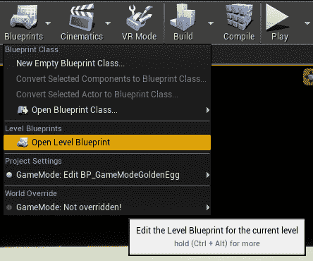

级别蓝图选项在开始级别时会自动执行。打开此窗口后，您应该看到一个空白的画布，可以在上面创建游戏玩法，如下图所示：

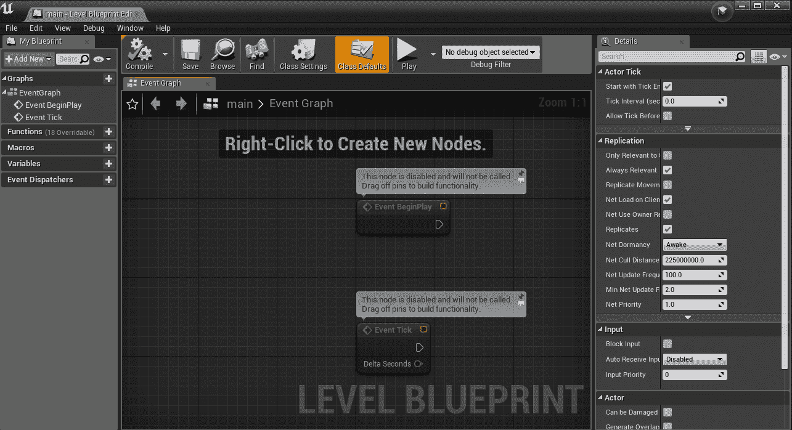

1.  在图纸上的任何位置右键单击。

1.  开始键入`begin`，然后从下拉列表中选择“事件开始播放”选项。

确保选中上下文敏感复选框，如下图所示：

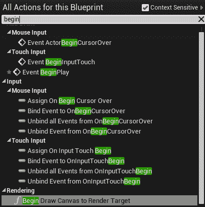

1.  在单击“事件开始播放”选项后，屏幕上会出现一个红色框。右侧有一个白色引脚。这被称为执行引脚，如下所示：

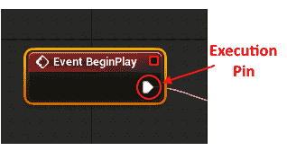

关于动画蓝图，您需要了解的第一件事是白色引脚执行路径（白线）。如果您以前见过蓝图图表，您一定会注意到白线穿过图表，如下图所示：

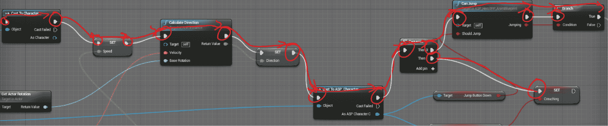

白色引脚执行路径基本上相当于将代码排成一行并依次运行。白线确定了将执行哪些节点以及执行顺序。如果一个节点没有连接白色执行引脚，那么该节点将根本不会被执行。

1.  将白色执行引脚拖出“事件开始播放”。

1.  首先在“可执行操作”对话框中键入`draw debug box`。

1.  选择弹出的第一项（fDraw Debug Box），如下图所示：

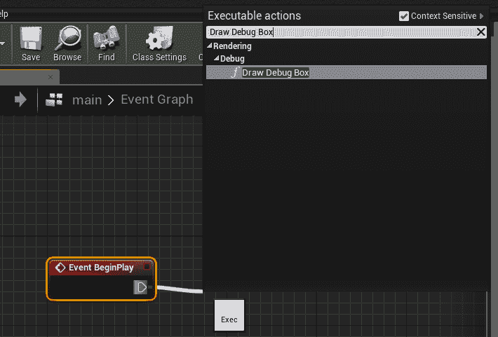

1.  填写一些关于盒子外观的细节。在这里，我选择了蓝色的盒子，盒子的中心在（0, 0, 100），盒子的大小为（200, 200, 200），持续时间为 180 秒（请确保输入足够长的持续时间，以便您可以看到结果），如下图所示：

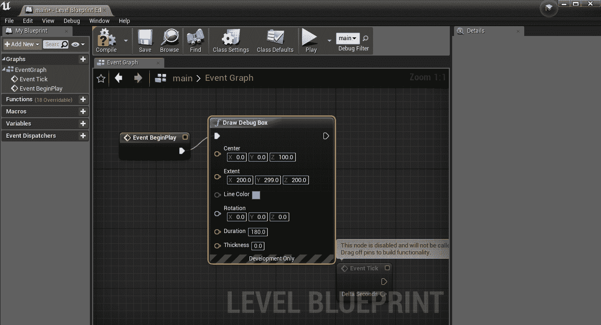

1.  现在，单击“播放”按钮以实现图表。请记住，您必须找到世界原点才能看到调试框。

1.  通过在（0, 0，（某个 z 值））放置一个金色蛋来找到世界原点，如下图所示，或者尝试增加线条粗细以使其更加可见：

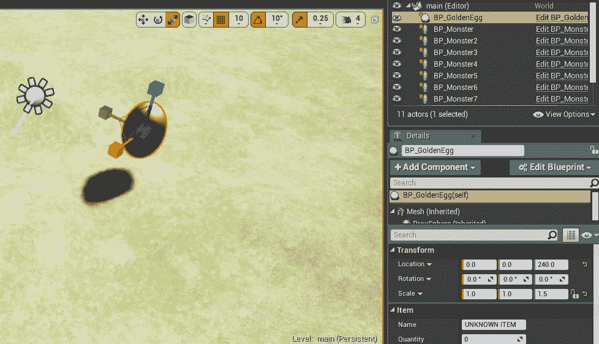

这是在级别中盒子的样子：

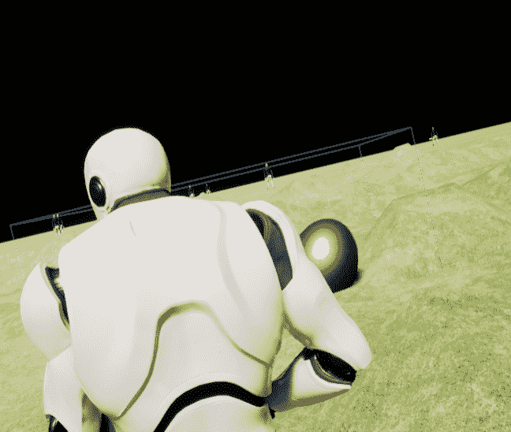

# 修改 Mixamo Adam 的动画蓝图

要集成我们的攻击动画，我们必须修改蓝图。在内容浏览器中，打开`MixamoAnimBP_Adam`。

你会注意到的第一件事是，图表在事件通知部分上方有两个部分：

+   顶部标有“基本角色移动...”。

+   底部显示“Mixamo 示例角色动画...”。

基本角色移动负责模型的行走和奔跑动作。我们将在负责攻击动画的 Mixamo 示例角色动画部分进行工作。我们将在图表的后半部分进行工作，如下图所示：

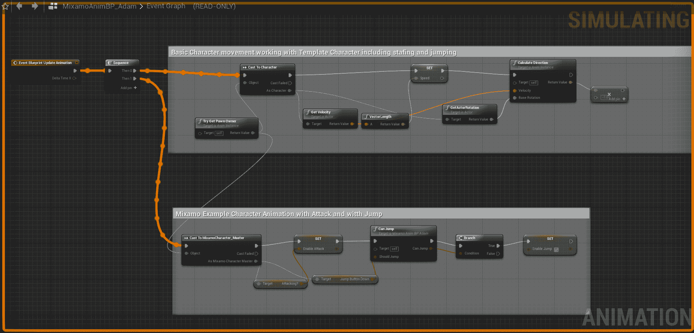

当您首次打开图表时，它会首先放大到靠近底部的部分。要向上滚动，右键单击鼠标并向上拖动。您还可以使用鼠标滚轮缩小，或者按住*Alt*键和右键同时向上移动鼠标来缩小。

在继续之前，您可能希望复制 MixamoAnimBP_Adam 资源，以防需要稍后返回并进行更改而损坏原始资源。这样可以让您轻松返回并纠正问题，如果发现您在修改中犯了错误，而无需重新安装整个动画包的新副本到您的项目中：

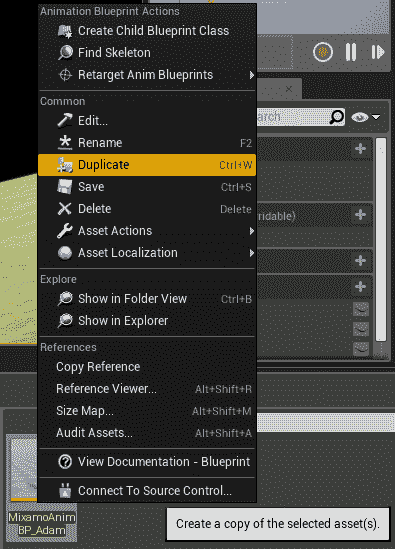

当从虚幻启动器向项目添加资产时，会复制原始资产，因此您现在可以在项目中修改 MixamoAnimBP_Adam，并在以后的新项目中获得原始资产的新副本。

我们要做的只是让 Adam 在攻击时挥动剑。让我们按照以下顺序进行：

1.  删除说“正在攻击”的节点：

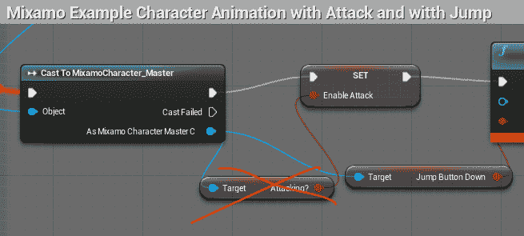

1.  重新排列节点，如下所示，使 Enable Attack 节点单独位于底部：

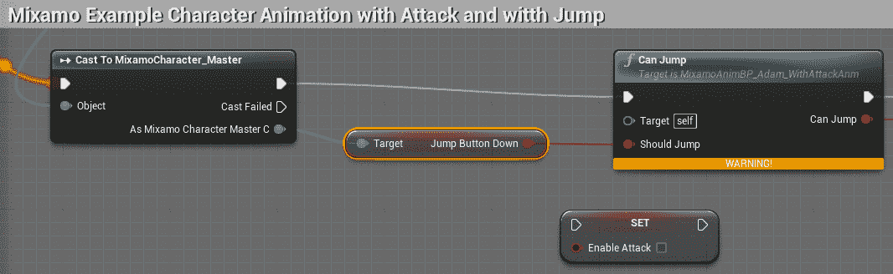

1.  我们将处理此动画正在播放的怪物。向上滚动一点图表，并拖动标有 Try Get Pawn Owner 对话框中的 Return Value 的蓝点。将其放入图表中，当弹出菜单出现时，选择 Cast to Monster（确保已选中上下文敏感，否则 Cast to Monster 选项将不会出现）。Try Get Pawn Owner 选项获取拥有动画的`Monster`实例，这只是`AMonster`类对象，如下图所示：

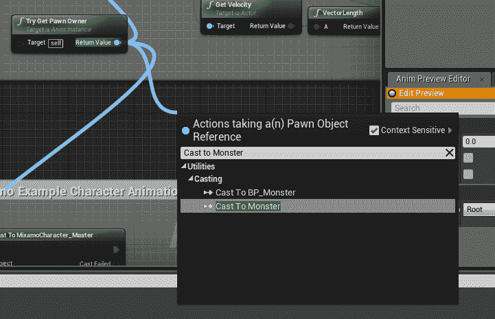

1.  单击 Sequence 对话框中的+，并从 Sequence 组将另一个执行引脚拖动到 Cast to Monster 节点实例，如下图所示。这确保了 Cast to Monster 实例实际上被执行：

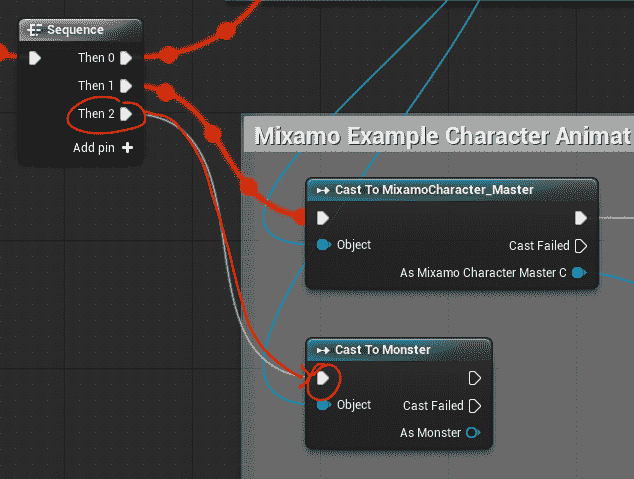

1.  下一步是从 Cast to Monster 节点的 As Monster 端口拉出引脚，并查找 Is in Attack Range 属性：

为了显示这一点，您需要回到`Monster.h`并在 is in Attack Range 函数之前添加以下行，并编译项目（稍后将对此进行解释）：

`UFUNCTION(BlueprintCallable, Category = Collision)`

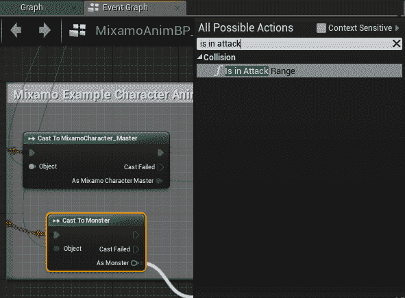

1.  应该自动从左侧 Cast to Monster 节点的白色执行引脚到右侧 Is in Attack Range 节点有一条线。接下来，从 As Monster 再拖出一条线，这次查找 Get Distance To：

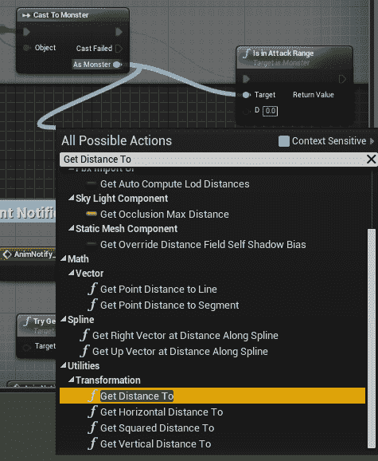

1.  您需要添加一个节点来获取玩家角色并将其发送到 Get Distance To 的 Other Actor 节点。只需右键单击任何位置，然后查找 Get Player Character：

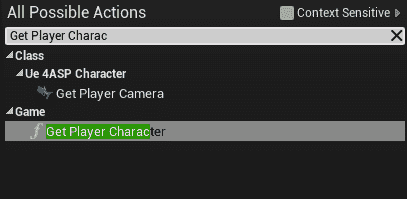

1.  将 Get Player Character 的返回值节点连接到 Other Actor，将 Get Distance To 的返回值连接到 Is In Attack Range 的 D：

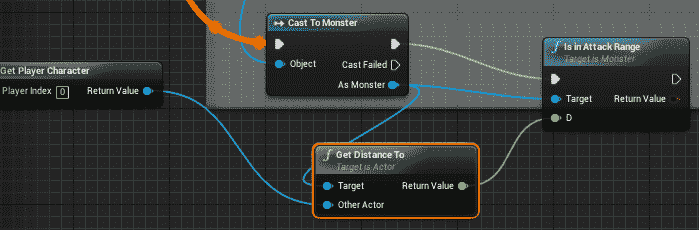

1.  将白色和红色引脚拖到 SET 节点上，如图所示：

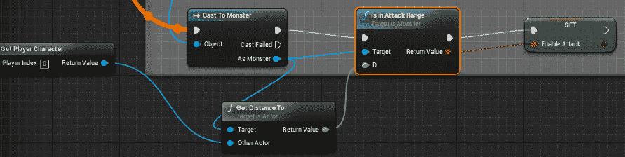

前面蓝图的等效伪代码类似于以下内容：

```cpp
if(   Monster.isInAttackRangeOfPlayer() )   
{   
    Monster.Animation = The Attack Animation;   
}   
```

测试您的动画。怪物应该只在玩家范围内挥动。如果不起作用并且您创建了副本，请确保将`animBP`切换到副本。此外，默认动画是射击，而不是挥动剑。我们稍后会修复这个问题。

# 挥动剑的代码

我们希望在挥动剑时添加动画通知事件：

1.  声明并向您的`Monster`类添加一个蓝图可调用的 C++函数：

```cpp
// in Monster.h: 
UFUNCTION( BlueprintCallable, Category = Collision ) 
void SwordSwung(); 
```

`BlueprintCallable`语句意味着可以从蓝图中调用此函数。换句话说，`SwordSwung()`将是一个我们可以从蓝图节点调用的 C++函数，如下所示：

```cpp
// in Monster.cpp 
void AMonster::SwordSwung() 
{ 
  if( MeleeWeapon ) 
  { 
    MeleeWeapon->Swing(); 
  } 
} 
```

1.  双击 Content Browser 中的 Mixamo_Adam_Sword_Slash 动画（应该在 MixamoAnimPack/Mixamo_Adam/Anims/Mixamo_Adam_Sword_Slash 中）打开。

1.  找到 Adam 开始挥动剑的地方。

1.  右键单击 Notifies 栏上的那一点，然后在 Add Notify...下选择 New Notify，如下截图所示：

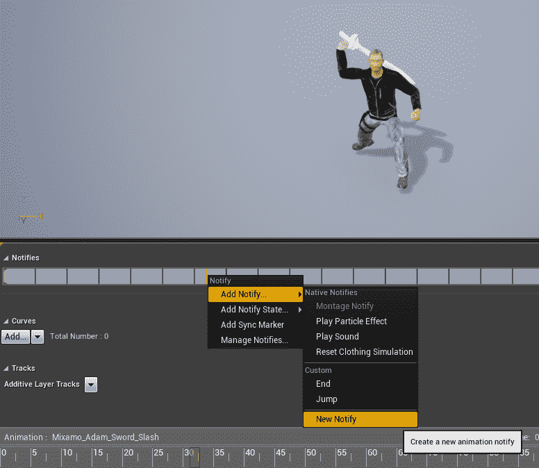

1.  将通知命名为`SwordSwung`：

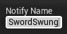

通知名称应出现在动画的时间轴上，如下所示：

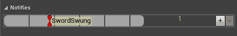

1.  保存动画，然后再次打开您的 MixamoAnimBP_Adam 版本。

1.  在 SET 节点组下面，创建以下图表：

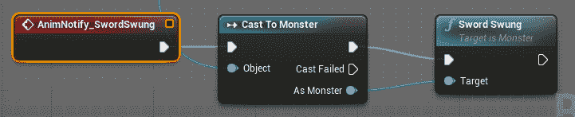

1.  当您右键单击图表（打开上下文敏感）并开始输入`SwordSwung`时，将出现 AnimNotify_SwordSwung 节点。Monster 节点再次从 Try Get Pawn Owner 节点中输入，就像*修改 Mixamo Adam 动画蓝图*部分的第 2 步一样。

1.  Sword Swung 是`AMonster`类中可调用的蓝图 C++函数（您需要编译项目才能显示）。

1.  您还需要进入 MaximoAnimBP_Adam 的 AnimGraph 选项卡。

1.  双击状态机以打开该图表。

1.  双击攻击状态以打开。

1.  选择左侧的 Play Mixamo_Adam Shooting。

1.  射击是默认动画，但显然这不是我们想要发生的。因此，删除它，右键单击并查找 Play Mixamo_Adam_Sword_Slash。然后，从一个人的小图标拖动到最终动画姿势的结果：

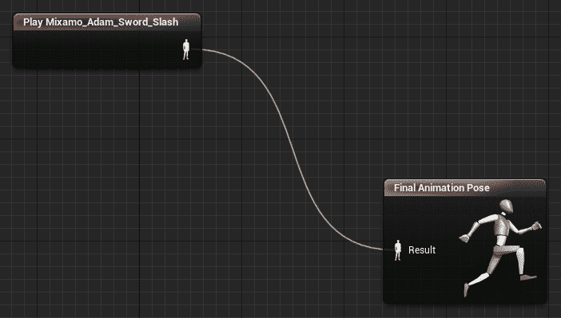

如果现在开始游戏，您的怪物将在实际攻击时执行它们的攻击动画。如果您还在`AAvatar`类中重写`TakeDamage`以在剑的边界框与您接触时减少 HP，您将看到您的 HP 条减少一点（请回忆，HP 条是在第八章的最后添加的，*Actors and Pawns*，作为一个练习）：

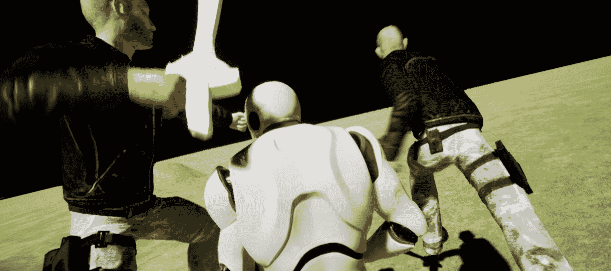

# 投射或远程攻击

远程攻击通常涉及某种抛射物。抛射物可以是子弹之类的东西，但也可以包括闪电魔法攻击或火球攻击之类的东西。要编写抛射物攻击，您应该生成一个新对象，并且只有在抛射物到达玩家时才对玩家造成伤害。

要在 UE4 中实现基本的子弹，我们应该派生一个新的对象类型。我从`AActor`类派生了一个`ABullet`类，如下所示：

```cpp
#pragma once

#include "CoreMinimal.h"
#include "GameFramework/Actor.h"
#include "Components/SphereComponent.h"
#include "Bullet.generated.h"

UCLASS()
class GOLDENEGG_API ABullet : public AActor
{
 GENERATED_BODY()

public:
 // Sets default values for this actor's properties
 ABullet(const FObjectInitializer& ObjectInitializer);

 // How much damage the bullet does. 
 UPROPERTY(EditAnywhere, BlueprintReadWrite, Category =
 Properties)
 float Damage;

 // The visible Mesh for the component, so we can see 
 // the shooting object 
 UPROPERTY(VisibleDefaultsOnly, BlueprintReadOnly, Category =
 Collision)
 UStaticMeshComponent* Mesh;

 // the sphere you collide with to do impact damage 
 UPROPERTY(VisibleDefaultsOnly, BlueprintReadOnly, Category =
 Collision)
 USphereComponent* ProxSphere;

 UFUNCTION(BlueprintNativeEvent, Category = Collision)
 void Prox(UPrimitiveComponent* OverlappedComponent, AActor* OtherActor, UPrimitiveComponent* OtherComp,
 int32 OtherBodyIndex, bool bFromSweep, const FHitResult& SweepResult);

 // You shouldn't need this unless you get a compiler error that it can't find this function.
 virtual int Prox_Implementation(UPrimitiveComponent* OverlappedComponent, AActor* OtherActor, UPrimitiveComponent* OtherComp,
 int32 OtherBodyIndex, bool bFromSweep, const FHitResult& SweepResult); };
```

`ABullet`类中有一些重要的成员，如下所示：

+   一个`float`变量，用于表示子弹接触时造成的伤害

+   一个`Mesh`变量，用于表示子弹的主体

+   一个`ProxSphere`变量，用于检测子弹最终击中物体的情况

+   当`Prox`检测到靠近物体时运行的函数

`ABullet`类的构造函数应该初始化`Mesh`和`ProxSphere`变量。在构造函数中，我们将`RootComponent`设置为`Mesh`变量，然后将`ProxSphere`变量附加到`Mesh`变量上。`ProxSphere`变量将用于碰撞检查。应该关闭`Mesh`变量的碰撞检查，如下所示：

```cpp
ABullet::ABullet(const FObjectInitializer& ObjectInitializer)
    : Super(ObjectInitializer)
{
    Mesh = ObjectInitializer.CreateDefaultSubobject<UStaticMeshComponent>(this,
        TEXT("Mesh"));
    RootComponent = Mesh;

    ProxSphere = ObjectInitializer.CreateDefaultSubobject<USphereComponent>(this,
        TEXT("ProxSphere"));
    ProxSphere->AttachToComponent(RootComponent, FAttachmentTransformRules::KeepWorldTransform);

    ProxSphere->OnComponentBeginOverlap.AddDynamic(this,
        &ABullet::Prox);
    Damage = 1;
}
```

我们在构造函数中将`Damage`变量初始化为`1`，但一旦我们从`ABullet`类创建蓝图，可以在 UE4 编辑器中更改这个值。接下来，`ABullet::Prox_Implementation()`函数应该在我们与其他角色的`RootComponent`碰撞时对角色造成伤害。我们可以通过代码实现这一点：

```cpp
int ABullet::Prox_Implementation(UPrimitiveComponent* OverlappedComponent, AActor* OtherActor, UPrimitiveComponent* OtherComp,
    int32 OtherBodyIndex, bool bFromSweep, const FHitResult& SweepResult)
{
    if (OtherComp != OtherActor->GetRootComponent())
    {
        // don't collide w/ anything other than 
        // the actor's root component 
        return -1;
    }

    OtherActor->TakeDamage(Damage, FDamageEvent(), NULL, this);
    Destroy();
    return 0;
}
```

# 子弹物理

要使子弹飞过关卡，您可以使用 UE4 的物理引擎。

创建一个基于`ABullet`类的蓝图。我选择了 Shape_Sphere 作为网格，并将其缩小到更合适的大小。子弹的网格应启用碰撞物理，但子弹的包围球将用于计算伤害。

配置子弹的行为是有点棘手的，所以我们将在四个步骤中进行介绍，如下所示：

1.  在组件选项卡中选择 Mesh（继承）。`ProxSphere`变量应该在 Mesh 下面。

1.  在详细信息选项卡中，勾选模拟物理和模拟生成碰撞事件。

1.  从碰撞预设下拉列表中选择自定义....

1.  从碰撞启用下拉菜单中选择碰撞启用（查询和物理）。同时，勾选碰撞响应框，如图所示；对于大多数类型（WorldStatic、WorldDynamic 等），勾选 Block，但只对 Pawn 勾选 Overlap：

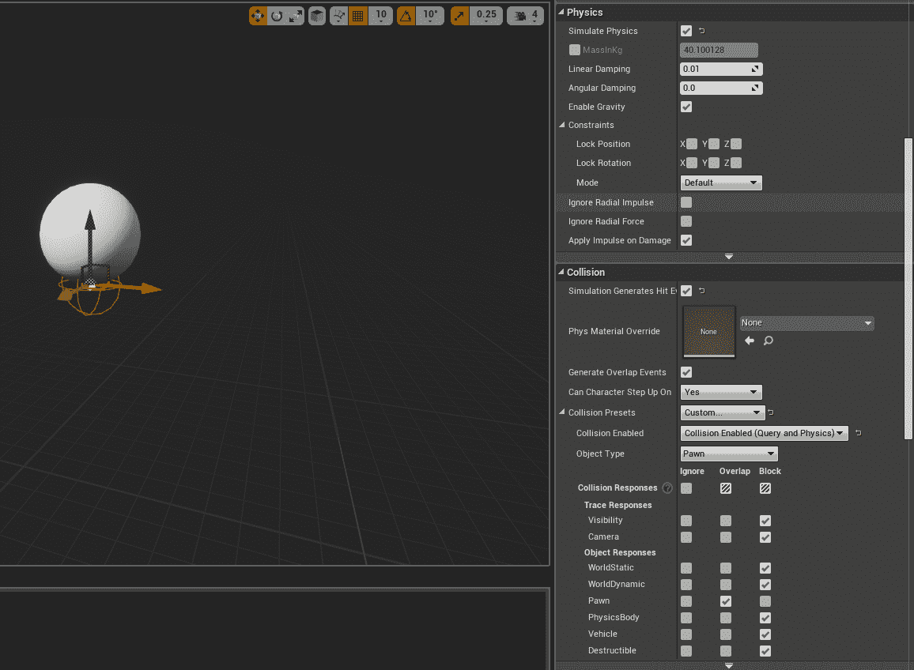

模拟物理复选框使`ProxSphere`属性受到重力和对其施加的冲量力的影响。冲量是瞬时的力量推动，我们将用它来驱动子弹的射击。如果不勾选模拟生成碰撞事件复选框，那么球体将掉到地板上。阻止所有碰撞的作用是确保球体不能穿过任何物体。

如果现在直接从内容浏览器选项卡将几个`BP_Bullet`对象拖放到世界中，它们将简单地掉到地板上。当它们在地板上时，你可以踢它们。下面的截图显示了地板上的球体对象：

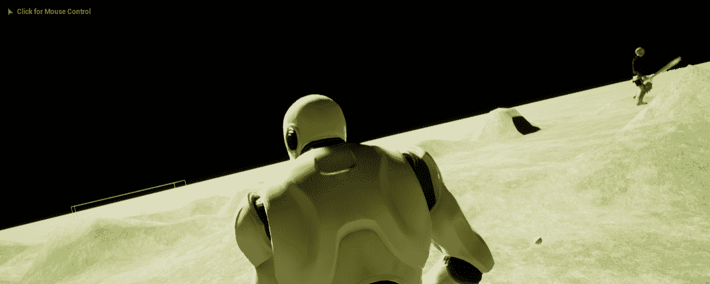

然而，我们不希望子弹掉在地板上。我们希望它们被射出。因此，让我们把子弹放在`Monster`类中。

# 将子弹添加到怪物类

让我们逐步来看一下如何做到这一点：

1.  向`Monster`类添加一个接收蓝图实例引用的成员。这就是`UClass`对象类型的用途。此外，添加一个蓝图可配置的`float`属性来调整射出子弹的力量，如下所示：

```cpp
// The blueprint of the bullet class the monster uses 
UPROPERTY(EditAnywhere, BlueprintReadWrite, Category =  
   MonsterProperties) 
UClass* BPBullet; 
// Thrust behind bullet launches 
UPROPERTY(EditAnywhere, BlueprintReadWrite, Category =  
   MonsterProperties) 
float BulletLaunchImpulse; 
```

1.  编译并运行 C++项目，打开你的`BP_Monster`蓝图。

1.  现在可以在`BPBullet`下选择一个蓝图类，如下图所示：

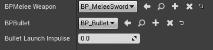

1.  一旦选择了怪物射击时要实例化的蓝图类类型，就必须编写代码让怪物在玩家处于其射程范围内时进行射击。

怪物从哪里射击？实际上，它应该从一个骨骼中射击。如果你对这个术语不熟悉，骨骼只是模型网格中的参考点。模型网格通常由许多“骨骼”组成。

1.  查看一些骨骼，通过在内容浏览器选项卡中双击资产打开 Mixamo_Adam 网格，如下截图所示：

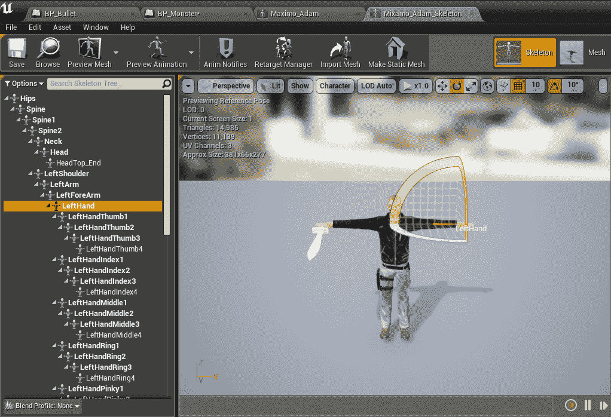

1.  转到骨架选项卡，你将在左侧看到所有怪物骨骼的树形视图列表。我们要做的是选择一个骨骼从中发射子弹。在这里，我选择了`LeftHand`选项。

艺术家通常会在模型网格中插入一个额外的骨骼来发射粒子，这可能在枪口的尖端。

从基础模型网格开始，我们可以获取`Mesh`骨骼的位置，并在代码中让怪物从该骨骼发射`Bullet`实例。

可以使用以下代码获得完整的怪物`Tick`和`Attack`函数：

```cpp
void AMonster::Tick(float DeltaSeconds) 
{ 
  Super::Tick( DeltaSeconds ); 

  // move the monster towards the player 
  AAvatar *avatar = Cast<AAvatar>(  
   UGameplayStatics::GetPlayerPawn(GetWorld(), 0) ); 
  if( !avatar ) return; 

  FVector playerPos = avatar->GetActorLocation(); 
  FVector toPlayer = playerPos - GetActorLocation(); 
  float distanceToPlayer = toPlayer.Size(); 

  // If the player is not the SightSphere of the monster, 
  // go back 
  if( distanceToPlayer > SightSphere->GetScaledSphereRadius() ) 
  { 
    // If the player is OS, then the enemy cannot chase 
    return; 
  } 

  toPlayer /= distanceToPlayer;  // normalizes the vector 

  // At least face the target 
  // Gets you the rotator to turn something 
  // that looks in the `toPlayer` direction 
  FRotator toPlayerRotation = toPlayer.Rotation(); 
  toPlayerRotation.Pitch = 0; // 0 off the pitch 
  RootComponent->SetWorldRotation( toPlayerRotation ); 

  if( isInAttackRange(distanceToPlayer) ) 
  { 
    // Perform the attack 
    if( !TimeSinceLastStrike ) 
    { 
      Attack(avatar); 
    } 

    TimeSinceLastStrike += DeltaSeconds; 
    if( TimeSinceLastStrike > AttackTimeout ) 
    { 
      TimeSinceLastStrike = 0; 
    } 

    return;  // nothing else to do 
  } 
  else 
  { 
    // not in attack range, so walk towards player 
    AddMovementInput(toPlayer, Speed*DeltaSeconds); 
  } 
} 
```

`AMonster::Attack`函数相对简单。当然，我们首先需要在`Monster.h`文件中添加原型声明，以便在`.cpp`文件中编写我们的函数：

```cpp
void Attack(AActor* thing); 
```

在`Monster.cpp`中，我们实现`Attack`函数，如下所示：

```cpp
void AMonster::Attack(AActor* thing) 
{ 
  if( MeleeWeapon ) 
  { 
    // code for the melee weapon swing, if  
    // a melee weapon is used 
    MeleeWeapon->Swing(); 
  } 
  else if( BPBullet ) 
  { 
    // If a blueprint for a bullet to use was assigned, 
    // then use that. Note we wouldn't execute this code 
    // bullet firing code if a MeleeWeapon was equipped 
    FVector fwd = GetActorForwardVector(); 
    FVector nozzle = GetMesh()->GetBoneLocation( "RightHand" ); 
    nozzle += fwd * 155;// move it fwd of the monster so it  
     doesn't 
    // collide with the monster model 
    FVector toOpponent = thing->GetActorLocation() - nozzle; 
    toOpponent.Normalize(); 
    ABullet *bullet = GetWorld()->SpawnActor<ABullet>(  
     BPBullet, nozzle, RootComponent->GetComponentRotation()); 

    if( bullet ) 
    { 
      bullet->Firer = this; 
      bullet->ProxSphere->AddImpulse(  
        toOpponent*BulletLaunchImpulse ); 
    } 
    else 
    { 
      GEngine->AddOnScreenDebugMessage( 0, 5.f,  
      FColor::Yellow, "monster: no bullet actor could be spawned.  
       is the bullet overlapping something?" ); 
    } 
  } 
} 
```

还要确保在文件顶部添加`#include "Bullet.h"`。我们将实现近战攻击的代码保持不变。假设怪物没有持有近战武器，然后我们检查`BPBullet`成员是否已设置。如果`BPBullet`成员已设置，则意味着怪物将创建并发射`BPBullet`蓝图类的实例。

特别注意以下行：

```cpp
ABullet *bullet = GetWorld()->SpawnActor<ABullet>(BPBullet,  
   nozzle, RootComponent->GetComponentRotation() );
```

这就是我们向世界添加新角色的方式。`SpawnActor()`函数将`UCLASS`的一个实例放在您传入的`spawnLoc`中，并具有一些初始方向。

在我们生成子弹之后，我们调用`AddImpulse()`函数来使其`ProxSphere`变量向前发射。

还要在 Bullet.h 中添加以下行：

```cpp
AMonster *Firer;
```

# 玩家击退

为了给玩家添加击退效果，我在`Avatar`类中添加了一个名为`knockback`的成员变量。每当 avatar 受伤时就会发生击退：

```cpp
FVector knockback; // in class AAvatar
```

为了弄清楚击中玩家时将其击退的方向，我们需要在`AAvatar::TakeDamage`中添加一些代码。这将覆盖`AActor`类中的版本，因此首先将其添加到 Avatar.h 中：

```cpp
virtual float TakeDamage(float DamageAmount, struct FDamageEvent const& DamageEvent, class AController* EventInstigator, AActor* DamageCauser) override;
```

计算从攻击者到玩家的方向向量，并将该向量存储在`knockback`变量中：

```cpp
float AAvatar::TakeDamage(float DamageAmount, struct FDamageEvent const& DamageEvent, class AController* EventInstigator, AActor* DamageCauser)
{
    // add some knockback that gets applied over a few frames 
    knockback = GetActorLocation() - DamageCauser->GetActorLocation();
    knockback.Normalize();
    knockback *= DamageAmount * 500; // knockback proportional to damage 
    return AActor::TakeDamage(DamageAmount, DamageEvent, EventInstigator, DamageCauser);
}
```

在`AAvatar::Tick`中，我们将击退应用到 avatar 的位置：

```cpp
void AAvatar::Tick( float DeltaSeconds ) 
{ 
  Super::Tick( DeltaSeconds ); 

  // apply knockback vector 
  AddMovementInput( -1*knockback, 1.f ); 

  // half the size of the knockback each frame 
  knockback *= 0.5f; 
} 
```

由于击退向量会随着每一帧而减小，所以随着时间的推移它会变得越来越弱，除非击退向量在受到另一次打击时得到更新。

为了使子弹起作用，您需要将 BPMelee Weapon 设置为 None。您还应该增加 AttackRangeSphere 的大小，并调整子弹发射冲量到一个有效的值。

# 摘要

在本章中，我们探讨了如何在屏幕上实例化怪物，让它们追逐玩家并攻击他。我们使用不同的球体来检测怪物是否在视线范围或攻击范围内，并添加了具有近战或射击攻击能力的能力，具体取决于怪物是否有近战武器。如果您想进一步实验，可以尝试更改射击动画，或者添加额外的球体，并使怪物在移动时继续射击，并在攻击范围内切换到近战。在下一章中，我们将通过研究先进的人工智能技术来进一步扩展怪物的能力。
