# 第十二章：用先进的 AI 构建更聪明的怪物

到目前为止，我们所拥有的怪物并没有做很多事情。他们站在一个地方，直到他们能看到你，然后他们会朝你走去，根据你设置的情况，进行近战攻击或射击攻击。在一个真正的游戏中，你希望你的角色做的事情比这多得多，这样他们看起来更真实。这就是**人工智能**（**AI**）的作用。

AI 是一个庞大的主题，有整本书专门讨论它，但我们将介绍一些 UE4 支持的使 AI 编程更容易的方法，这样你就可以轻松地创建更真实的怪物。我们将快速概述以下主题：

+   导航 - 路径查找和 NavMesh

+   行为树

+   环境查询系统

+   群集

+   机器学习和神经网络

+   遗传算法

如果你对此感兴趣，并且想了解更多，那么有很多优秀的书籍可以供你深入了解 AI 的其他方面。

# 导航 - 路径查找和 NavMesh

目前，我们创建的怪物只能朝一个方向移动——直线朝着你的位置。但是如果有山、建筑、树木、河流或其他物体挡住了怪物的路怎么办？在许多情况下，直线是不可能的。目前，如果怪物撞到墙上，它就会停在那里，这并不是很现实。这就是路径查找的作用。

# 什么是路径查找？

路径查找是一种找到路径（通常是最短和/或最容易的路径）到达目的地的方法。将整个环境想象成一个网格，每个单元格中都有一个数字，表示导航的难度。因此，一个有墙挡住去路的单元格将具有非常高的值，而陡峭的路径可能比容易的路径具有更高的值。路径查找的目标是找到所有沿着该路径的单元格的总值最低的路径。

有不同的算法或方法来处理路径查找。最知名的是称为 A*（发音为*A 星*）的算法。

# 什么是 A*？

我们这里不会使用 A*，但是如果你打算在未来进行 AI 编程，你至少应该对它有所了解，所以我会做一个简要的概述。A*基本上搜索围绕角色的单元格，优先考虑成本最低的单元格。它计算到目前为止路径的成本（通过累加到该点的成本）加上一个启发式，即从该点到目标的成本的猜测。

有很多计算启发式的方法。它可以是直接到目标的距离（你可能会说，像乌鸦飞一样简单）。如果启发式实际上比实际成本要低，那么结果会更好，所以这样做效果很好。

一旦找到成本最低的单元格，然后再向前一步，查看周围的单元格。一直持续到达目标。如果你发现自己到达了以前去过的单元格，并且这种方式的总路径成本更低，你可以用更低成本的路径替换它。这有助于你获得更短的路径。一旦到达目标，你可以沿着路径向后走，你就会得到一条完整的通往目标的路径。

你可以在网上或人工智能书籍中找到更多关于 A*和其他路径查找算法的信息。如果你在更复杂的项目中进行这项工作，你需要了解它们，但对于这个，UE4 有一个更简单和更容易的方法：使用`NavMesh`。

# 使用 NavMesh

`NavMesh`是 UE4 中的一个对象，你可以将其放置在世界中，告诉它你希望角色能够导航的环境的哪些部分。要做到这一点，请执行以下步骤：

1.  添加一些障碍。你可以添加立方体、圆柱体或其他任何你想要添加的东西来阻挡移动，就像这样：

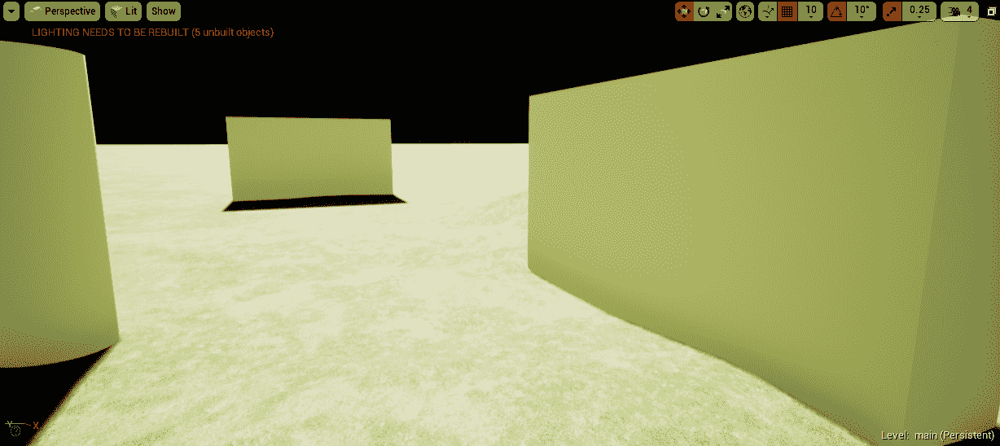

1.  一旦你按照自己的意愿设置了级别，在模式窗口中，转到体积，找到 Nav Mesh Bounds Volume，将其拖放到级别上，并缩放以覆盖你希望怪物能够导航的整个区域。

如果您现在尝试，您仍然会看到怪物走进墙壁然后停下来。这是因为我们需要改变移动的方式。我们将通过创建自己的`AIController`类来实现这一点。

# 创建一个 AIController 类

让我们按步骤来做这个：

1.  创建一个新的 C++类。在这种情况下，您需要勾选“显示所有类”复选框并搜索找到`AIController`：

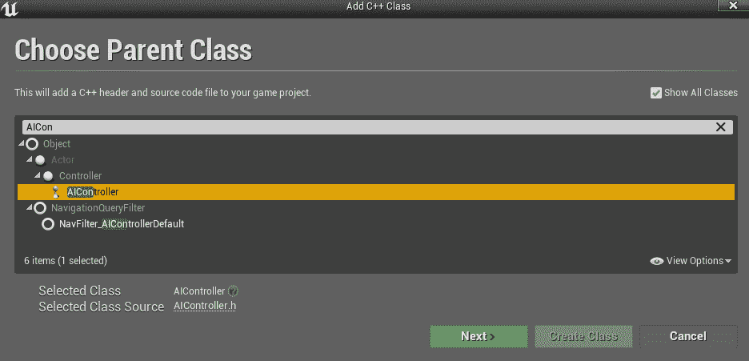

1.  将类命名为`MonsterAIController`。您的`MonsterAIController.h`应该如下所示：

```cpp
UCLASS()
class GOLDENEGG_API AMonsterAIController : public AAIController
{
    GENERATED_BODY()

public:
    //Start following the player
    void StartFollowingPlayer();
};
```

`MonsterAIController.cpp`应该实现以下函数：

```cpp
void AMonsterAIController::StartFollowingPlayer()
{
    AActor *player = Cast<AActor>(
        UGameplayStatics::GetPlayerPawn(GetWorld(), 0));
    FVector playerPos = player->GetActorLocation();
    MoveToLocation(playerPos);
}
```

还要确保在文件顶部添加`#include "Kismet/GameplayStatics.h"`。

1.  返回`Monster.cpp`中的`Tick()`函数。在`else`子句中找到以下行：

```cpp
AddMovementInput(toPlayer, Speed*DeltaSeconds);
```

删除这一行，用这个替换：

```cpp

        if (GetController() != nullptr)
        {
            Cast<AMonsterAIController>(GetController())-
            >StartFollowingPlayer();
        }
```

还在文件顶部添加`#include "MonsterAIController.h"`，并进入`BP_Monster`，将 Ai Controller 类更改为`MonsterAIController`。现在怪物可以绕过墙壁找到你。如果它们不动，检查确保`NavMesh`覆盖了该区域并且足够高以覆盖角色。

# 行为树

现在，控制怪物的所有逻辑都在`Monster.cpp`的`Tick()`函数中。但到目前为止，您所做的事情相当简单。在大型复杂的游戏中，怪物将有更多的行为。它们可以在一个区域巡逻，直到看到您，甚至与您交流，只有在对话不顺利时才会攻击。所有这些逻辑将变得过于复杂，无法将所有内容都放在一个函数中，甚至在`AMonster`类中。

幸运的是，UE4 还有另一种管理复杂任务的方法，那就是行为树。行为树让您可以直观地设置一系列任务，以便更容易管理。由于我们在这里专注于 C++，我们将以这种方式创建任务本身，但总体树似乎更容易在蓝图中管理。

行为树主要由两种不同类型的节点控制：

+   **选择器**：选择器将从左到右运行其子节点，直到一个成功，然后返回树。将其视为一个“或”语句——一旦找到一个真实的参数，该“或”本身就是真的，所以它完成了。

+   **序列**：序列会从左到右依次遍历子节点，直到有一个失败为止。这更像是一个“和”语句，会一直执行直到出现假的情况，使整个语句变为假。

因此，如果您想运行多个步骤，您将使用序列，而如果您只想成功运行一个并停止，您将使用选择器。

# 设置行为树

首先，您需要进入您的库（将其放在一个有意义的文件夹名称中，这样您将记得在哪里找到它，或者蓝图也可以工作），然后从“添加新内容”中选择“人工智能|行为树”：

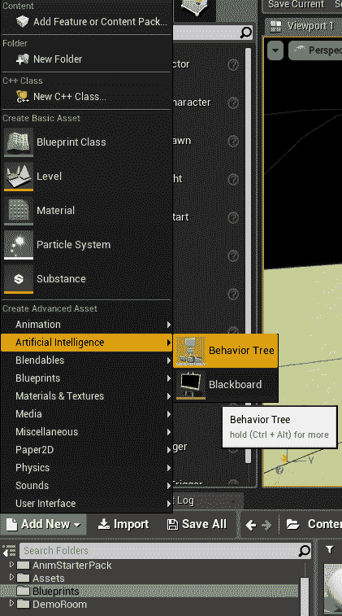

我将其命名为`MonsterBT`。您还需要创建一个黑板。这将存储您将在行为树中使用的数据，并允许您在 AI Controller 和行为树之间轻松传输。您可以通过转到“添加新内容”，然后选择“人工智能|黑板”来创建它。我将其命名为`MonsterBlackboard`：

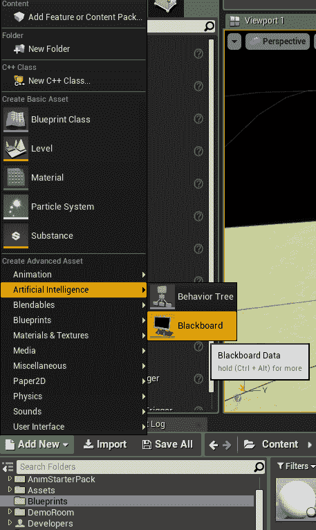

# 设置黑板值

接下来，您需要在刚刚创建的黑板中设置值。您可以通过选择新键，然后选择类型（在这种情况下是 Bool）来完成此操作。对于此操作，我添加了两个，IsInAttackRange 和 IsInFollowRange：

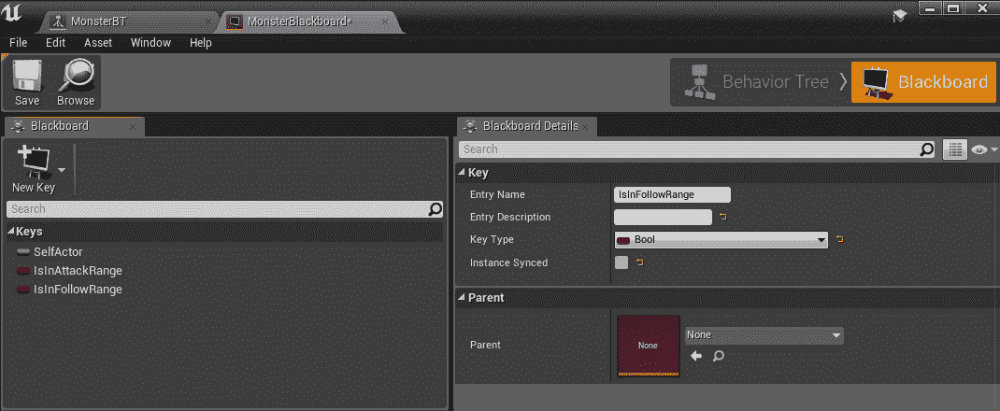

您还可以为每个添加一个描述其用途的描述。

# 设置 BTTask

我们将创建一个 C++任务来处理跟随玩家。要做到这一点，执行以下步骤：

1.  添加一个新的 C++类，并以 BTTaskNode 为基础（您需要查看所有类并搜索它）：

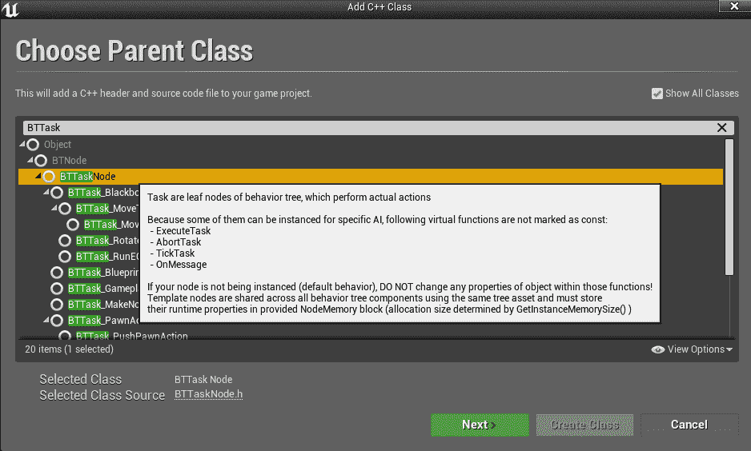

我命名了新类`BTTask_FollowPlayer`

1.  在`BTTaskFollowPlayer.h`中，添加以下内容：

```cpp
UCLASS()
class GOLDENEGG_API UBTTask_FollowPlayer : public UBTTaskNode
{
    GENERATED_BODY()

    virtual EBTNodeResult::Type ExecuteTask(UBehaviorTreeComponent& OwnerComp, uint8* NodeMemory) override;
    virtual void OnGameplayTaskActivated(UGameplayTask& Task) override {}
};
```

我们不会使用`OnGameplayTaskActivated`，但是，如果没有声明它，你的代码可能无法编译（如果你收到关于它不存在的投诉，那就是原因）

1.  在`BTTaskFollowPlayer.cpp`中，添加以下内容：

```cpp
#include "BTTask_FollowPlayer.h"
#include "MonsterAIController.h"

EBTNodeResult::Type UBTTask_FollowPlayer::ExecuteTask(UBehaviorTreeComponent& OwnerComp, uint8* NodeMemory)
{
    AMonsterAIController* Controller = Cast<AMonsterAIController>(OwnerComp.GetAIOwner());
    if (Controller == nullptr)
    {
        return EBTNodeResult::Failed;
    }

    Controller->StartFollowingPlayer();

    return EBTNodeResult::Succeeded;
}
```

一旦你做到了这一点，你可以回去创建另一个`BTTask`来处理攻击，以及你可能想要的任何其他行为。

# 设置行为树本身

一旦你设置好了任务，就该设置树本身了：

1.  双击它以打开蓝图：

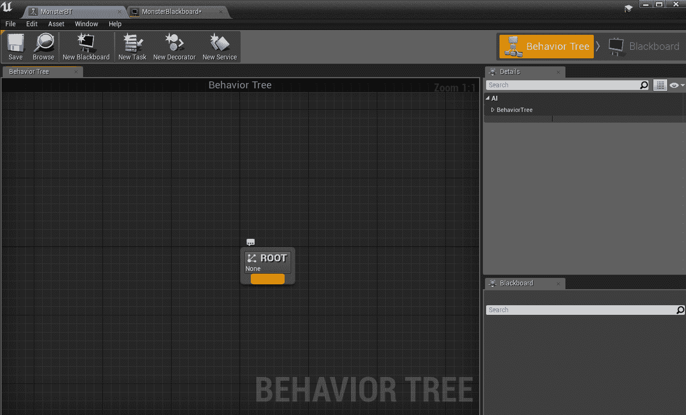

1.  点击 Root 底部的黄色区域并拖动以创建一个新的节点（它是黑色的，但当鼠标滚动到它上面时会变成黄色）。

1.  从弹出的菜单中选择类型（我们将使用选择器）：

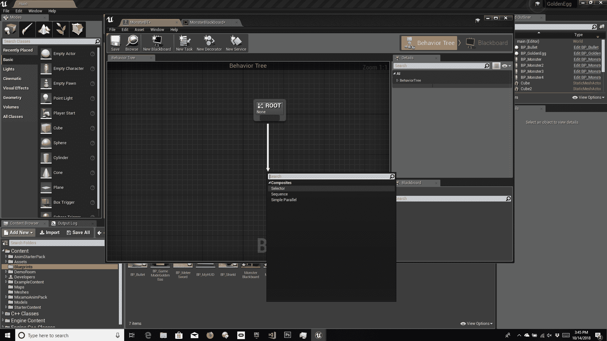

中心标签中的选择器图标

1.  你应该有以下内容：

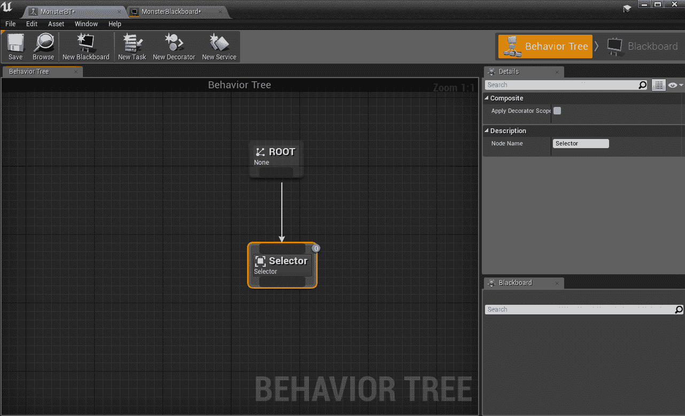

如前所述，选择器将按从左到右的顺序遍历节点，直到一个成功为止，然后停止。在这种情况下，我们有三种可能的状态：在攻击范围内，在视野范围内，以及两者都不满足（忽略玩家）。首先，你需要检查自己是否足够接近进行攻击，这意味着你需要在你的黑板中检查 IsInAttackRange。

不要先进行跟随，因为攻击范围在技术上仍然在跟随范围内，但你不想使用跟随功能，所以选择器在检查跟随范围后就会停止，因为这是它进行的第一个检查，所以它永远不会检查攻击范围（这才是它真正应该检查的）。

要检查它需要处于哪种状态，你需要检查黑板值，这可以通过使用装饰器来实现。为此，点击选择器的底部并向左拖动一个新的节点，就像你创建那个节点时所做的那样，并选择一个复合选择器节点。这个节点允许你右键单击；选择添加装饰器...，确保你选择了黑板类型。添加后，你可以选择顶部的蓝色装饰器。你应该能够检查 Key Query IsSet 并选择你想要检查的值，这种情况下是 IsInAttackRange（如果它没有显示出来，请确保 MonsterBlackboard 在详细信息中设置为黑板；通常情况下应该自动设置）：

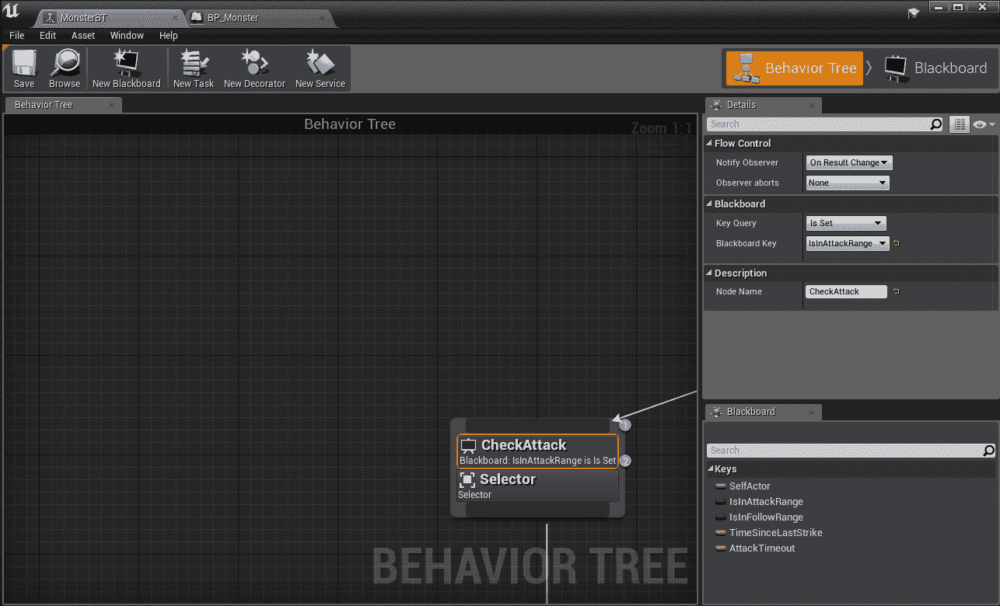

攻击节点最终会转到一个攻击任务，但现在，我只是放了一个等待作为占位符（一个内置任务，允许你指定等待时间（以秒为单位））。

在它的右侧，你还需要添加另一个复合节点，带有一个检查 IsInFollowRange 的装饰器。这将使用你创建的新任务（如果它没有显示出来，请确保你已经编译了你的代码，并且没有任何错误）。

在那之后，我在事件中添加了一个等待任务，以防两种情况都失败。完成后，你应该有类似这样的东西：

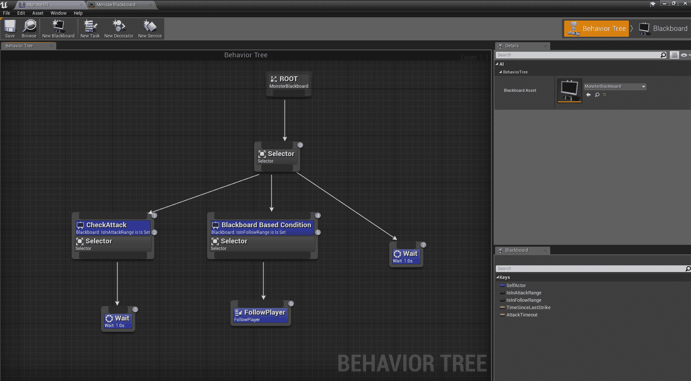

现在你可以回去修改你现有的代码来使用所有这些。

# 更新 MonsterAIController

现在你将为你的`AIController`类添加更多功能来支持行为树：

1.  你的新`MonsterAIController.h`应该是这样的：

```cpp
UCLASS()
class GOLDENEGG_API AMonsterAIController : public AAIController
{
    GENERATED_BODY()

public:
    AMonsterAIController(const FObjectInitializer& ObjectInitializer);

    virtual void Possess(class APawn* InPawn) override;

    virtual void UnPossess() override;

    UBehaviorTreeComponent* BehaviorTreeCmp;

    UBlackboardComponent* BlackboardCmp;

    //Start following the player
    void StartFollowingPlayer();
    void SetFollowRange(bool val);
    void SetAttackRange(bool val);
};
```

还要确保在文件顶部添加`#include "BehaviorTree/BehaviorTreeComponent.h"`。在这里，你重写了构造函数以及`Possess`和`UnPossess`类。`SetFollowRange`和`SetAttackRange`函数是新的，让你设置黑板值。

1.  在`MonsterAIController.cpp`中添加以下函数：

```cpp
AMonsterAIController::AMonsterAIController(const class FObjectInitializer& ObjectInitializer)
    : Super(ObjectInitializer)
{
    BehaviorTreeCmp = ObjectInitializer.CreateDefaultSubobject<UBehaviorTreeComponent>(this, TEXT("MonsterBT"));
    BlackboardCmp = ObjectInitializer.CreateDefaultSubobject<UBlackboardComponent>(this, TEXT("MonsterBlackboard"));
}

void AMonsterAIController::Possess(class APawn* InPawn)
{
    Super::Possess(InPawn);

    AMonster* Monster = Cast<AMonster>(InPawn);
    if (Monster)
    {
        if (Monster->BehaviorTree->BlackboardAsset)
        {
            BlackboardCmp->InitializeBlackboard(*Monster->BehaviorTree->BlackboardAsset);
        }

        BehaviorTreeCmp->StartTree(*Monster->BehaviorTree);
    }
}

void AMonsterAIController::UnPossess()
{
    Super::UnPossess();

    BehaviorTreeCmp->StopTree();
}

void AMonsterAIController::SetFollowRange(bool val)
{
    BlackboardCmp->SetValueAsBool("IsInFollowRange", val);
}

void AMonsterAIController::SetAttackRange(bool val)
{
    BlackboardCmp->SetValueAsBool("IsInAttackRange", val);
}
```

还要在文件顶部添加以下行：

```cpp
#include "Monster.h"
#include "BehaviorTree/BehaviorTree.h"
#include "BehaviorTree/BlackboardComponent.h"
```

`StartFollowingPlayer`保持不变，所以这里不列出来，但确保你留下它！现在是时候更新你的`Monster`类了（在这之前你无法编译）。

# 更新 Monster 类

我们将在`Monster`类中进行以下更新：

+   在`Monster.h`中，您唯一要做的更改是添加以下代码行：

```cpp
    UPROPERTY(EditDefaultsOnly, Category = "AI")
        class UBehaviorTree* BehaviorTree;
```

+   在`Monster.cpp`中，您将对`Tick()`函数进行一些重大更改，因此这是完整版本：

```cpp
// Called every frame
void AMonster::Tick(float DeltaSeconds)
{
    Super::Tick(DeltaSeconds);

    // move the monster towards the player 
    AAvatar *avatar = Cast<AAvatar>(
        UGameplayStatics::GetPlayerPawn(GetWorld(), 0));
    if (!avatar) return;

    FVector playerPos = avatar->GetActorLocation();
    FVector toPlayer = playerPos - GetActorLocation();
    float distanceToPlayer = toPlayer.Size();
    AMonsterAIController* controller = Cast<AMonsterAIController>(GetController());

    // If the player is not the SightSphere of the monster, 
    // go back 
    if (distanceToPlayer > SightSphere->GetScaledSphereRadius())
    {
        // If the player is OS, then the enemy cannot chase 
        if (controller != nullptr)
        {
            controller->SetAttackRange(false);
            controller->SetFollowRange(false);
        }
        return;
    }

    toPlayer /= distanceToPlayer;  // normalizes the vector 

                                   // At least face the target 
                                   // Gets you the rotator to turn something 
                                   // that looks in the `toPlayer` direction 
    FRotator toPlayerRotation = toPlayer.Rotation();
    toPlayerRotation.Pitch = 0; // 0 off the pitch 
    RootComponent->SetWorldRotation(toPlayerRotation);

    if (isInAttackRange(distanceToPlayer))
    {
        if (controller != nullptr)
        {
            controller->SetAttackRange(true);
        }

        // Perform the attack 
        if (!TimeSinceLastStrike)
        {
            Attack(avatar);
        }

        TimeSinceLastStrike += DeltaSeconds;
        if (TimeSinceLastStrike > AttackTimeout)
        {
            TimeSinceLastStrike = 0;
        }

        return;  // nothing else to do 
    }
    else
    {
        // not in attack range, so walk towards player 
        //AddMovementInput(toPlayer, Speed*DeltaSeconds);

        if (controller != nullptr)
        {
            controller->SetAttackRange(false);
            controller->SetFollowRange(true);
        }
    }
}
```

更改是设置攻击和跟随范围的值。攻击代码仍然存在，但是如果将 TimeSinceLastStrike 和 AttackTimeout 移入黑板，您可以使用它将所有功能移入`BTTask`。现在确保一切都编译完成。

+   一旦编译完成，您需要打开`BP_Monster`蓝图，并设置行为树如下（如果您希望它们不同，也可以在单个怪物上设置）：

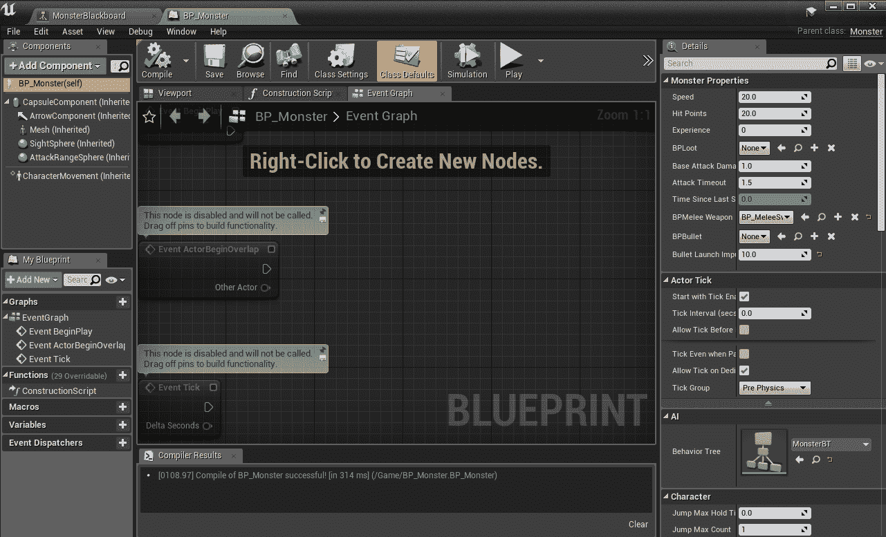

还要确保 AI 控制器设置为 MonsterAIController。如果此时运行游戏，功能应该是相同的，但是行为树将控制玩家的跟随。

如果您想了解更多，请查看将`Attack`代码移入`BTTask`类，并查看在您不在范围内时怪物可以做什么（阅读下一节可能有所帮助）。

# 环境查询系统

**环境查询系统**（**EQS**）是新的，仍在试验阶段。它允许您在行为树中创建一个查询，以搜索级别中的项目，并找到最符合您设置的条件的项目。也许您希望怪物在玩家超出范围时在设置的路径点之间徘徊，而不是站在原地。您可以设置一个查询来寻找最接近的路径点，或使用其他一些条件。EQS 允许您这样做。

您需要在设置中启用此功能才能使用它们。要执行此操作，请执行以下步骤：

1.  进入编辑|编辑器首选项：

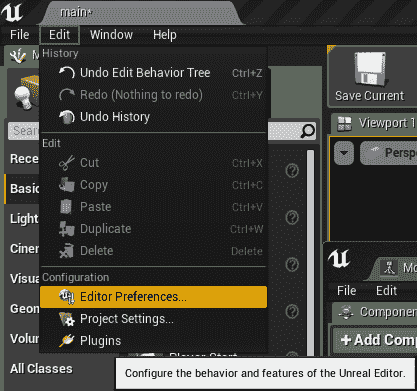

1.  在实验|AI 下，勾选环境查询系统：

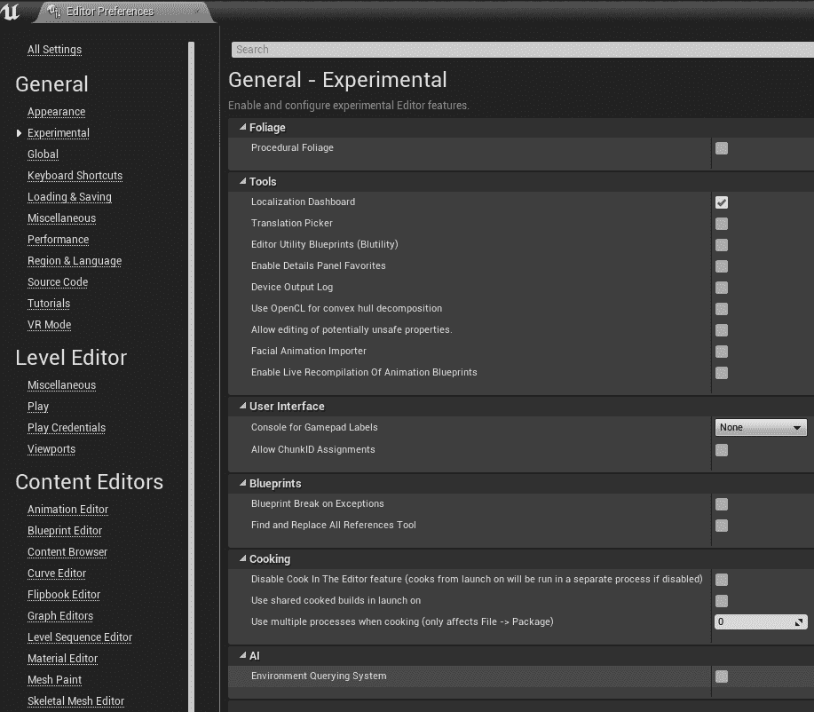

1.  通过转到添加新|人工智能来添加新查询。环境查询现在将出现在行为树和黑板下：

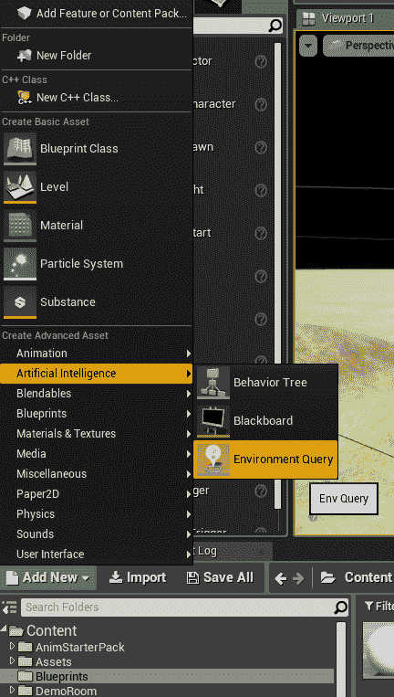

您还需要在蓝图中创建`上下文`和`生成器`（`生成器`将获取特定类型的所有项目，例如路径点）。要实际运行查询，您需要在行为树中创建一个运行 EQS 查询任务节点。有关环境查询系统的工作原理的更多信息，请参阅[`docs.unrealengine.com/en-us/Engine/AI/EnvironmentQuerySystem`](https://docs.unrealengine.com/en-us/Engine/AI/EnvironmentQuerySystem)中的虚幻文档。

# 集群

如果屏幕上有很多怪物同时移动，您希望它们以看起来真实的方式移动。您不希望它们互相撞到，或者朝不同的方向走开。

AI 研究人员已经研究过这个问题，并提出了处理这个问题的算法。它们被称为集群算法，因为它们基于鸟群的行为。

在一起移动时，怪物不仅要考虑到达相同目标，还要考虑与其一起移动的怪物。他们必须确保不要离其周围的怪物太近，也不应该移动得太远，否则它们会分散开来。

在许多情况下，有一个怪物被选为领导者。该怪物朝着目标前进，其他怪物专注于跟随该领导者。

在线上有很多关于集群的好参考资料。它没有内置到 UE4 中，但您可以购买扩展或编写自己的集群系统。

# 机器学习和神经网络简介

机器学习和神经网络是一个巨大的话题，所以我在这里只会做一个简要介绍。机器学习是如何教导程序去找出如何回应某事情的方法，而不仅仅是给它规则。有许多不同的算法可以做到这一点，但它们都需要大量的样本数据。

基本上，你给学习程序大量的例子（越多越好），*和*每个案例的最佳结果。你可以用不同的方式对它们进行评价。通过观察这么多案例，它可以根据它过去看到的结果对类似案例做出最佳猜测。通过足够的训练数据，结果可以非常好，尽管你仍然可能遇到它不适用的情况。

由于这需要如此多的数据（更不用说处理能力），除了在罕见的情况下，这是在游戏公司在游戏发售前完成的（如果有的话——这种事情往往会因为截止日期而被取消）。训练是离线完成的，程序已经学会了该做什么。

神经网络是一种特定类型的机器学习，旨在模拟大脑处理数据的方式。有工作像神经元的节点。可以有多层节点，每一层处理前一层的结果。

数据被发送到多个节点，每个节点根据一定的阈值调整数据。只有数据可以被传递回（或向前）到节点，然后调整这些阈值以获得更准确的训练数据结果。一旦它们被训练过，这些阈值就可以用于未来的决策。

虽然我们离真正的人工智能还有很长的路要走，但神经网络已经被用于产生有趣的结果。神经网络已经在特定流派的音乐上进行了训练，然后生成了非常令人印象深刻（和原创的）音乐，听起来类似于它接受训练的流派。我也听说过神经网络被编写来尝试写书。不过我认为我们离一个可以编写 UE4 程序的神经网络还有很长的路要走！

# 遗传算法

回想一下你高中学的生物学；你可能学过遗传学。来自两个不同父母的染色体结合在一起，创造一个结合了两个父母 DNA 的孩子，而随机的基因突变也可以引起变化。遗传算法基于相同的原则。

就像达尔文的适者生存一样，你可以在代码中做类似的事情。遗传算法有三个基本原则：

+   **选择**: 你选择那些有最佳结果的例子，它们是下一代的基础。

+   **交叉**: 选择的两个例子然后结合在一起，创造一个同时具有两者特点的孩子，就像在生物学中一样。

+   **引入随机基因突变**: 可能有一些好的特征是旧的没有的，或者被其他特征淹没了而被抛弃。这意味着你不会错过一些潜在的优秀特征，只是因为它们不在原始种群中。

# 总结

正如你所看到的，人工智能是一个巨大的话题，我们在这里只是触及了基础知识。我们已经了解了基础的寻路（使用 NavMesh）、行为树、环境查询系统、群集、机器学习和神经网络以及遗传算法。如果你想了解更多，还有整整一本书，以及许多网站，比如[`aigamedev.com/`](http://aigamedev.com/)，和[`www.gamasutra.com`](https://www.gamasutra.com)上的文章。

在下一节中，我们将学习施展咒语来保护你的玩家免受怪物的侵害。
