# 第十三章：法术书

玩家目前还没有自卫手段。我们现在将为玩家配备一种非常有用和有趣的方式，称为魔法法术。玩家将使用魔法法术来影响附近的怪物，因此现在可以对它们造成伤害。

我们将从描述如何创建自己的粒子系统开始本章。然后，我们将把粒子发射器包装到一个`Spell`类中，并为角色编写一个`CastSpell`函数，以便实际`CastSpells`。

本章将涵盖以下主题：

+   什么是法术？

+   粒子系统

+   法术类角色

+   将右键单击附加到`CastSpell`

+   创建其他法术

# 什么是法术？

实际上，法术将是粒子系统与由边界体积表示的影响区域的组合。每一帧都会检查边界体积中包含的角色。当一个角色在法术的边界体积内时，那么该角色就会受到该法术的影响。

以下是暴风雪法术的截图，其中突出显示了边界体积：

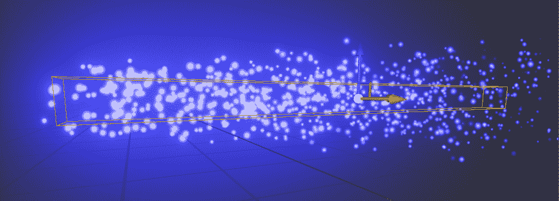

暴风雪法术有一个长方形的边界体积。在每一帧中，都会检查边界体积中包含的角色。法术边界体积中包含的任何角色在该帧中都将受到该法术的影响。如果角色移出法术的边界体积，那么该角色将不再受到该法术的影响。请记住，法术的粒子系统仅用于可视化；粒子本身不会影响游戏角色。

我们在第八章中创建的`PickupItem`类，*角色和卫兵*，可用于允许玩家拾取代表法术的物品。我们将扩展`PickupItem`类，并附加一个法术的蓝图以施放每个`PickupItem`。从 HUD 中点击法术的小部件将施放它。界面将看起来像这样：

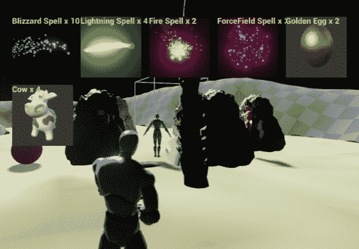

# 设置粒子系统

首先，我们需要一个放置所有华丽特效的地方。为此，我们将按照以下步骤进行：

1.  在您的内容浏览器选项卡中，右键单击内容根目录，创建一个名为`ParticleSystems`的新文件夹。

1.  右键单击该新文件夹，然后选择 New Asset | Particle System，如下截图所示：

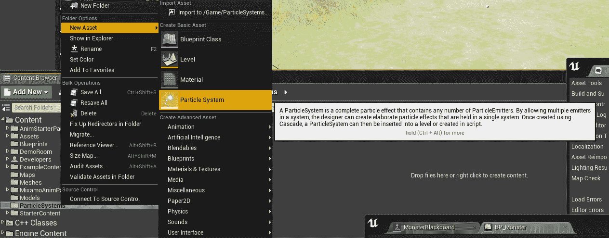

查看此虚幻引擎 4 粒子系统指南，了解虚幻粒子发射器的工作原理：[`www.youtube.com/watch?v=OXK2Xbd7D9w&amp;index=1&amp;list=PLZlv_N0_O1gYDLyB3LVfjYIcbBe8NqR8t`](https://www.youtube.com/watch?v=OXK2Xbd7D9w&index=1&list=PLZlv_N0_O1gYDLyB3LVfjYIcbBe8NqR8t)。

1.  双击出现的 NewParticleSystem 图标，如下截图所示：

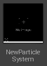

完成上述步骤后，您将进入 Cascade，粒子编辑器。环境如下截图所示：

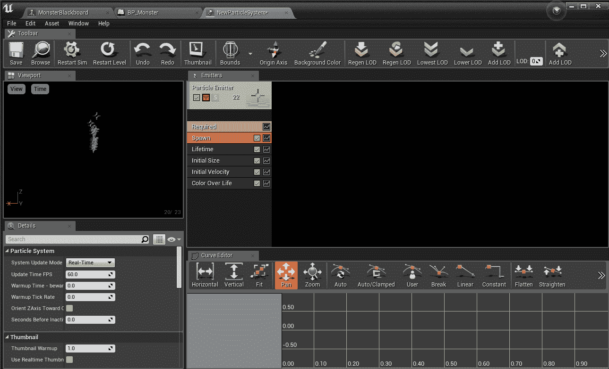

这里有几个不同的窗格，每个窗格显示不同的信息。它们如下： 

+   左上角是视口窗格。这显示了当前发射器的动画，因为它当前正在工作。

+   右侧是`Emitters`面板。在其中，您可以看到一个名为 Particle Emitter 的单个对象（您的粒子系统中可以有多个发射器，但我们现在不需要）。粒子发射器的模块列表显示在其下。从前面的截图中，我们有`Required`、`Spawn`、`Lifetime`、`Initial Size`、`Initial Velocity`和`Color Over Life`模块。

# 更改粒子属性

默认粒子发射器会发射类似十字准星的形状。我们想要将其更改为更有趣的东西。要做到这一点，请按照以下步骤进行：

1.  单击`Emitters`面板下的黄色`Required`框，然后在`Details`面板中打开`Material`下拉菜单。

将弹出所有可用的粒子材料列表（您可以在顶部输入`particles`以便更容易找到您想要的材料）。

1.  选择 m_flare_01 选项来创建我们的第一个粒子系统，如下截图所示：

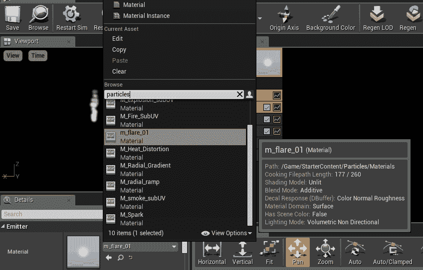

1.  现在，让我们更改粒子系统的行为。单击发射器窗格下的 Color Over Life 条目。底部的详细信息窗格显示了不同参数的信息，如下截图所示：

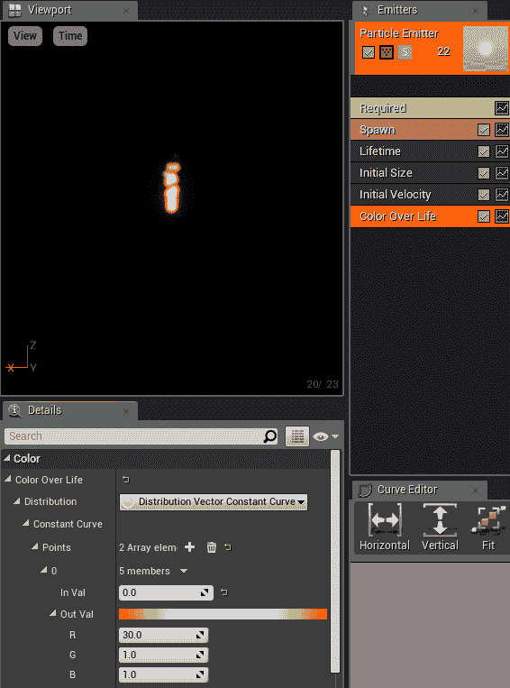

1.  在 Color Over Life 条目的详细信息窗格中，我增加了 R，但没有增加 G 和 B。这给了粒子系统一种红色的发光效果。（R 是红色，G 是绿色，B 是蓝色）。您可以在条上看到颜色。

然而，您可以通过更直观地更改粒子颜色来编辑原始数字。如果您点击发射器下的 Color Over Life 条目旁边的绿色锯齿按钮，您将看到 Color Over Life 的图表显示在曲线编辑器选项卡中，如下截图所示：

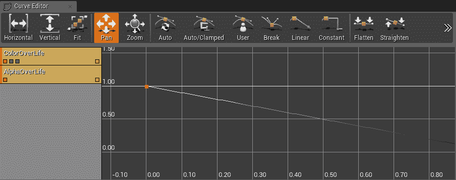

现在我们可以更改颜色随生命周期变化的参数。在曲线编辑器选项卡中的图表显示了发射的颜色与粒子存活时间的关系。您可以通过拖动点来调整数值。按住*Ctrl*键+鼠标左键可以在线条上添加新的点（如果不起作用，请点击黄色框取消选择 AlphaOverLife，确保只选择 ColorOverLife）：

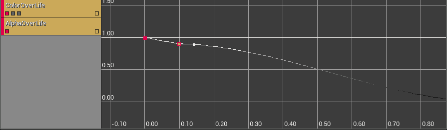

您可以调整粒子发射器设置，创建自己的法术可视化效果。

# 暴风雪法术的设置

此时，我们应该将粒子系统从 NewParticleSystem 重命名为更具描述性的名称。让我们将其重命名为`P_Blizzard`。

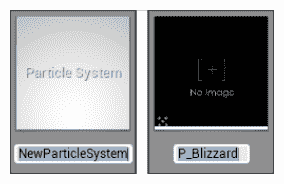

您可以通过单击粒子系统并按下*F2 来重命名您的粒子系统，如下所示：

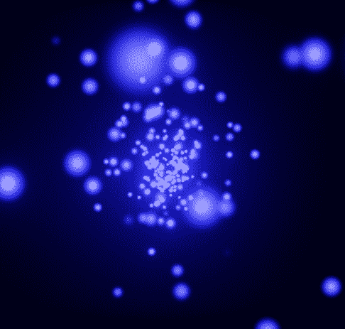

我们将调整一些设置，以获得暴风雪粒子效果法术。执行以下步骤：

1.  返回 P_Blizzard 粒子系统进行编辑。

1.  在 Spawn 模块下，将生成速率更改为`200.0`。这会增加可视化效果的密度，如下所示：

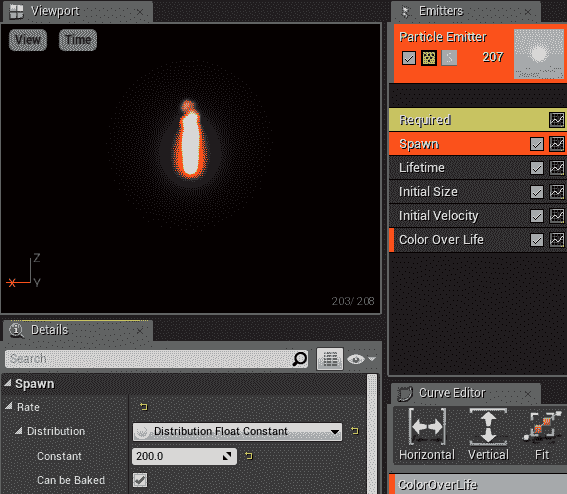

1.  在 Lifetime 模块下，将 Max 属性从`1.0`增加到`2.0`，如下截图所示。这会使发射的粒子的存活时间产生一些变化，一些发射的粒子的存活时间会比其他的长：

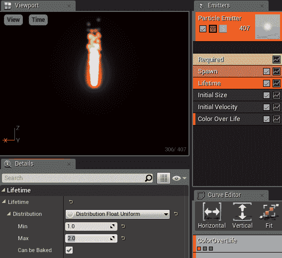

1.  在 Initial Size 模块下，将 Min 属性大小更改为`12.5`，如下截图所示：

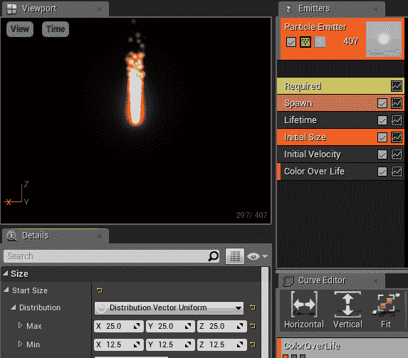

1.  在 Initial Velocity 模块下，将 Min / Max 值更改为以下数值：

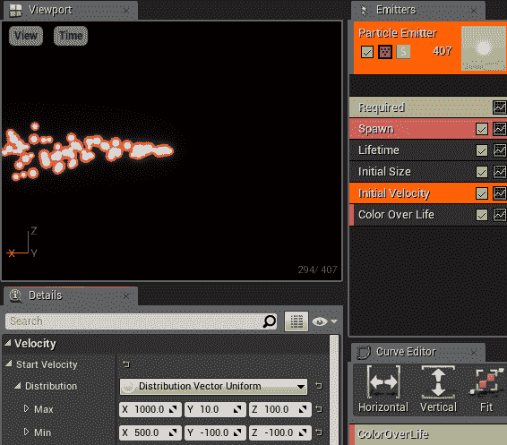

1.  我们之所以让暴风雪向+X 方向吹，是因为玩家的前进方向从+X 开始。由于法术将来自玩家的手，我们希望法术指向与玩家相同的方向。

1.  在 Color Over Life 菜单下，将蓝色（B）值更改为`100.0`。同时将 R 更改回`1.0`。您会立即看到蓝色发光的变化：

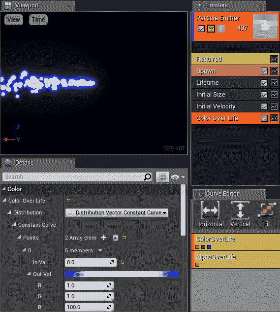

现在它开始看起来有点神奇了！

1.  右键单击 Color Over Life 模块下方的黑色区域。选择 Location | Initial Location，如截图所示：

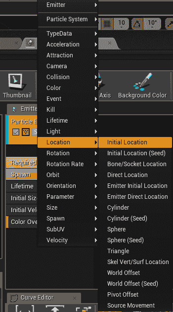

1.  按照以下截图所示，在 Start Location | Distribution 下输入数值：

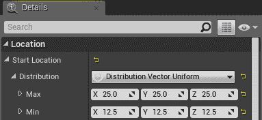

1.  您应该看到一个如此的暴风雪：

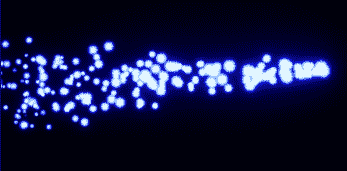

1.  将相机移动到你喜欢的位置，然后点击顶部菜单栏中的缩略图选项。这将在内容浏览器选项卡中为你的粒子系统生成一个缩略图图标，如下截图所示：

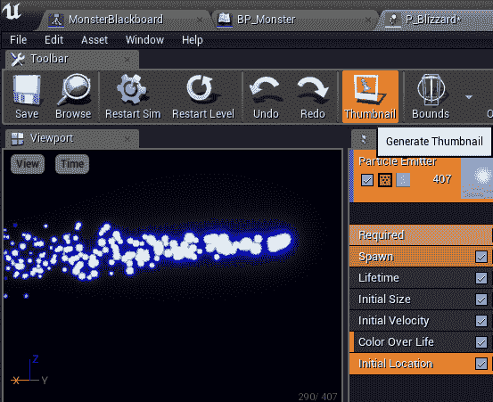

# 法术类角色

`Spell`类最终会对所有怪物造成伤害。为此，我们需要在`Spell`类角色中包含粒子系统和边界框。当角色施放`Spell`类时，`Spell`对象将被实例化到关卡中并开始`Tick()`功能。在`Spell`对象的每个`Tick()`上，任何包含在法术边界体积内的怪物都将受到影响。

`Spell`类应该看起来像以下代码：

```cpp
#include "CoreMinimal.h"
#include "GameFramework/Actor.h"
#include "Components/BoxComponent.h"
#include "Runtime/Engine/Classes/Particles/ParticleSystemComponent.h"
#include "Spell.generated.h"

UCLASS()
class GOLDENEGG_API ASpell : public AActor
{
    GENERATED_BODY()

public:    
    ASpell(const FObjectInitializer&amp; ObjectInitializer);

    // box defining volume of damage 
    UPROPERTY(VisibleDefaultsOnly, BlueprintReadOnly, Category =
        Spell)
        UBoxComponent* ProxBox;

    // the particle visualization of the spell 
    UPROPERTY(VisibleDefaultsOnly, BlueprintReadOnly, Category =
        Spell)
        UParticleSystemComponent* Particles;

    // How much damage the spell does per second 
    UPROPERTY(EditAnywhere, BlueprintReadWrite, Category = Spell)
        float DamagePerSecond;

    // How long the spell lasts 
    UPROPERTY(EditAnywhere, BlueprintReadWrite, Category = Spell)
        float Duration;

    // Length of time the spell has been alive in the level 
    float TimeAlive;

    // The original caster of the spell (so player doesn't 
    // hit self) 
    AActor* Caster;

    // Parents this spell to a caster actor 
    void SetCaster(AActor* caster);

    // Runs each frame. override the Tick function to deal damage  
    // to anything in ProxBox each frame. 
    virtual void Tick(float DeltaSeconds) override;
};
```

我们只需要担心实现三个函数，即`ASpell::ASpell()`构造函数，`ASpell::SetCaster()`函数和`ASpell::Tick()`函数。

打开`Spell.cpp`文件。在`Spell.h`的包含行下面，添加一行包括`Monster.h`文件的代码，这样我们就可以在`Spell.cpp`文件中访问`Monster`对象的定义（以及其他一些包括），如下代码所示：

```cpp
#include "Monster.h" 
#include "Kismet/GameplayStatics.h"
#include "Components/CapsuleComponent.h"
```

首先是构造函数，它设置了法术并初始化了所有组件，如下代码所示：

```cpp
ASpell::ASpell(const FObjectInitializer&amp; ObjectInitializer)
 : Super(ObjectInitializer)
{
 ProxBox = ObjectInitializer.CreateDefaultSubobject<UBoxComponent>(this,
 TEXT("ProxBox")); 
 Particles = ObjectInitializer.CreateDefaultSubobject<UParticleSystemComponent>(this,
 TEXT("ParticleSystem"));

 // The Particles are the root component, and the ProxBox 
 // is a child of the Particle system. 
 // If it were the other way around, scaling the ProxBox 
 // would also scale the Particles, which we don't want 
 RootComponent = Particles;
 ProxBox->AttachToComponent(RootComponent, FAttachmentTransformRules::KeepWorldTransform);

 Duration = 3;
 DamagePerSecond = 1;
 TimeAlive = 0;

 PrimaryActorTick.bCanEverTick = true;//required for spells to 
 // tick! 
}
```

特别重要的是这里的最后一行，`PrimaryActorTick.bCanEverTick = true`。如果你不设置它，你的`Spell`对象将永远不会调用`Tick()`。

接下来，我们有`SetCaster()`方法。这是为了让`Spell`对象知道施法者是谁。我们可以通过以下代码确保施法者不能用自己的法术伤害自己：

```cpp
void ASpell::SetCaster(AActor *caster)
{
 Caster = caster;
 RootComponent->AttachToComponent(caster->GetRootComponent(), FAttachmentTransformRules::KeepRelativeTransform);
}
```

最后，我们有`ASpell::Tick()`方法，它实际上对所有包含的角色造成伤害，如下面的代码所示：

```cpp
void ASpell::Tick(float DeltaSeconds)
{
    Super::Tick(DeltaSeconds);

    // search the proxbox for all actors in the volume. 
    TArray<AActor*> actors;
    ProxBox->GetOverlappingActors(actors);

    // damage each actor the box overlaps 
    for (int c = 0; c < actors.Num(); c++)
    {
        // don't damage the spell caster 
        if (actors[c] != Caster)
        {
            // Only apply the damage if the box is overlapping 
            // the actors ROOT component. 
            // This way damage doesn't get applied for simply  
            // overlapping the SightSphere of a monster 
            AMonster *monster = Cast<AMonster>(actors[c]);

            if (monster &amp;&amp; ProxBox->IsOverlappingComponent(Cast<UPrimitiveComponent>(monster->GetCapsuleComponent())))
            {
                monster->TakeDamage(DamagePerSecond*DeltaSeconds,
                    FDamageEvent(), 0, this);
            }

            // to damage other class types, try a checked cast  
            // here.. 
        }
    }

    TimeAlive += DeltaSeconds;
    if (TimeAlive > Duration)
    {
        Destroy();
    }
}
```

`ASpell::Tick()`函数会执行一些操作，如下所示：

+   它获取所有与`ProxBox`重叠的角色。如果组件重叠的不是施法者的根组件，那么任何角色都会受到伤害。我们必须检查与根组件的重叠，因为如果不这样做，法术可能会与怪物的`SightSphere`重叠，这意味着我们会受到很远处的攻击，这是我们不想要的。

+   请注意，如果我们有另一个应该受到伤害的东西类，我们将不得不尝试对每种对象类型进行转换。每种类别可能具有不同类型的边界体积应该进行碰撞；其他类型甚至可能没有`CapsuleComponent`（它们可能有`ProxBox`或`ProxSphere`）。

+   它增加了法术存在的时间。如果法术超过了分配的施法时间，它将从关卡中移除。

现在，让我们专注于玩家如何获得法术，通过为玩家可以拾取的每个法术对象创建一个单独的`PickupItem`。

# 蓝图化我们的法术

编译并运行刚刚添加的`Spell`类的 C++项目。我们需要为我们想要施放的每个法术创建蓝图。要做到这一点，请按照以下步骤进行：

1.  在 Class Viewer 选项卡中，开始输入`Spell`，你应该看到你的 Spell 类出现

1.  右键单击 Spell，创建一个名为 BP_Spell_Blizzard 的蓝图，如下截图所示：

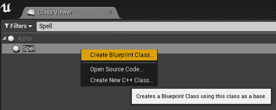

1.  如果它没有自动打开，请双击打开它。

1.  在法术的属性中，选择 P_Blizzard 法术作为粒子发射器，如下截图所示：

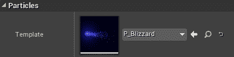

如果找不到它，请尝试在组件下选择 Particles (Inherited)。

选择 BP_SpellBlizzard(self)，向下滚动直到到达法术类别，并更新每秒伤害和持续时间参数为你喜欢的值，如下截图所示。在这里，暴风雪法术将持续`3.0`秒，每秒造成`16.0`点伤害。三秒后，暴风雪将消失：

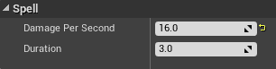

在配置了默认属性之后，切换到组件选项卡进行一些进一步的修改。点击并改变`ProxBox`的形状，使其形状合理。盒子应该包裹粒子系统最强烈的部分，但不要过分扩大其大小。`ProxBox`对象不应该太大，因为那样你的暴风雪法术会影响到甚至没有被暴风雪触及的东西。如下截图所示，一些离群值是可以接受的：

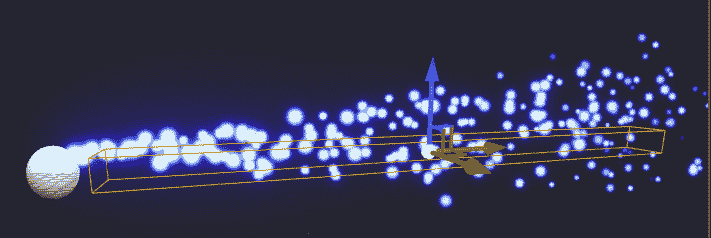

你的暴风雪法术现在已经制作成蓝图，并准备好供玩家使用。

# 捡起法术

回想一下，我们之前编程使我们的库存在用户按下*I*时显示玩家拥有的捡起物品的数量。然而，我们想做的不仅仅是这样：

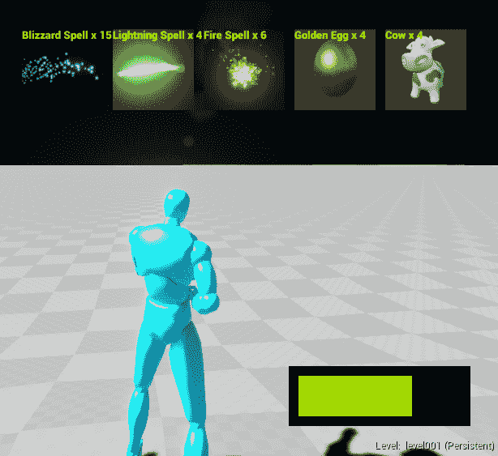

用户按下 I 时显示的物品

为了让玩家捡起法术，我们将修改`PickupItem`类，包括一个用以下代码使用的法术蓝图的槽：

```cpp
// inside class APickupItem: 
// If this item casts a spell when used, set it here 
UPROPERTY(EditAnywhere, BlueprintReadWrite, Category = Item) 
UClass* Spell;
```

一旦你为`APickupItem`类添加了`UClass* Spell`属性，重新编译并重新运行你的 C++项目。现在，你可以继续为你的`Spell`对象制作`PickupItem`实例的蓝图。

# 创建施放法术的 PickupItems 的蓝图

创建一个名为 BP_Pickup_Spell_Blizzard 的 PickupItem 蓝图，如下截图所示：

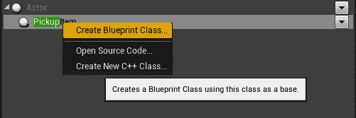

它应该自动打开，这样你就可以编辑它的属性。我将暴风雪物品的捡起属性设置如下：

物品的名称是暴风雪法术，每个包装中有`5`个。我拍摄了暴风雪粒子系统的截图，并将其导入到项目中，因此图标被选为该图像。在法术下，我选择了 BP_Spell_Blizzard 作为要施放的法术的名称（而不是 BP_Pickup_Spell_Blizzard），如下截图所示：

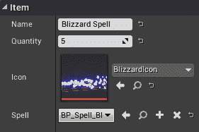

我为`PickupItem`类的`Mesh`类选择了一个蓝色的球（你也可以使用 M_Water_Lake 材质来获得有趣的效果）。对于图标，我在粒子查看器预览中拍摄了暴风雪法术的截图，保存到磁盘，并将该图像导入到项目中，如下截图所示（在示例项目的内容浏览器选项卡中查看`images`文件夹）：

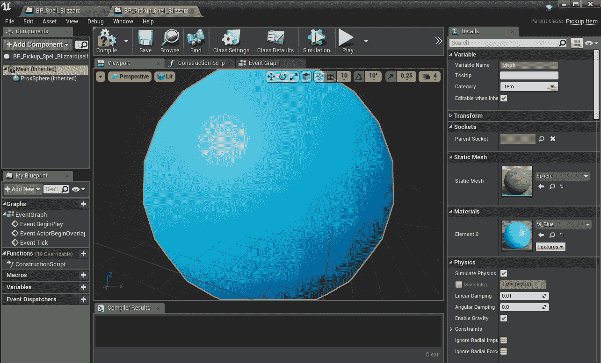

在你的关卡中放置一些`PickupItem`。如果我们捡起它们，我们的库存中将有一些暴风雪法术（如果你捡不起来，请确保你的 ProxSphere 足够大）：

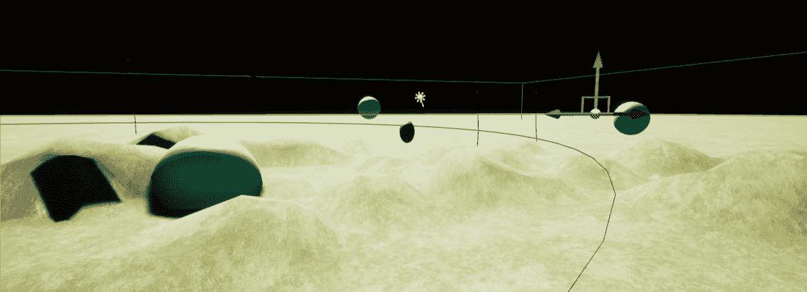

现在，我们需要激活暴风雪。由于我们已经在第十章中将左键单击附加到拖动图标的*库存系统和捡起物品*，让我们将右键单击附加到施放法术。

# 将右键单击附加到 CastSpell

在调用角色的`CastSpell`方法之前，右键单击将经过多次函数调用。调用图看起来会像下面的截图所示：

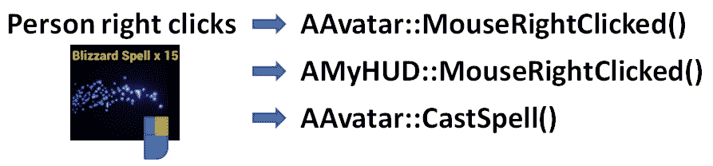

在右键单击和施法之间会发生一些事情。它们如下：

+   正如我们之前看到的，所有用户鼠标和键盘交互都通过`Avatar`对象路由。当`Avatar`对象检测到右键单击时，它将通过`AAvatar::MouseRightClicked()`将点击事件传递给`HUD`。

+   在第十章中，*库存系统和拾取物品*，我们使用了一个`struct Widget`类来跟踪玩家拾取的物品。`struct Widget`只有三个成员：

```cpp
struct Widget 
{ 
  Icon icon; 
  FVector2D pos, size; 
  ///.. and some member functions 
}; 
```

+   现在，我们需要为`struct Widget`类添加一个额外的属性来记住它施放的法术。

+   `HUD`将确定点击事件是否在`AMyHUD::MouseRightClicked()`中的`Widget`内。

+   如果点击的是施放法术的`Widget`，则`HUD`将通过调用`AAvatar::CastSpell()`向 avatar 发出施放该法术的请求。

# 编写 avatar 的 CastSpell 函数

我们将以相反的方式实现前面的调用图。我们将首先编写实际在游戏中施放法术的函数`AAvatar::CastSpell()`，如下面的代码所示：

```cpp
void AAvatar::CastSpell( UClass* bpSpell ) 
{ 
  // instantiate the spell and attach to character 
  ASpell *spell = GetWorld()->SpawnActor<ASpell>(bpSpell,  
   FVector(0), FRotator(0) ); 

  if( spell ) 
  { 
    spell->SetCaster( this ); 
  } 
  else 
  { 
    GEngine->AddOnScreenDebugMessage( 1, 5.f, FColor::Yellow,  
    FString("can't cast ") + bpSpell->GetName() ); } 
} 
```

还要确保将该函数添加到`Avatar.h`中，并在该文件的顶部添加`#include "Spell.h"`。

您可能会发现实际施放法术非常简单。施放法术有两个基本步骤：

1.  使用世界对象的`SpawnActor`函数实例化法术对象

1.  将其附加到 avatar

一旦`Spell`对象被实例化，当该法术在关卡中时，它的`Tick()`函数将在每一帧运行。在每个`Tick()`上，`Spell`对象将自动感知关卡中的怪物并对它们造成伤害。每个先前提到的代码行都会发生很多事情，因此让我们分别讨论每一行。

# 实例化法术- GetWorld()->SpawnActor()

从蓝图创建`Spell`对象，我们需要从`World`对象调用`SpawnActor()`函数。`SpawnActor()`函数可以使用任何蓝图在关卡中实例化它。幸运的是，`Avatar`对象（实际上任何`Actor`对象）可以随时通过简单调用`GetWorld()`成员函数获得`World`对象的句柄。

将`Spell`对象带入关卡的代码行如下：

```cpp
ASpell *spell = GetWorld()->SpawnActor<ASpell>( bpSpell,  
   FVector(0), FRotator(0) );
```

关于上述代码行有几件事情需要注意：

+   `bpSpell`必须是要创建的`Spell`对象的蓝图。尖括号中的`<ASpell>`对象表示期望。

+   新的`Spell`对象从原点(`0`, `0`, `0`)开始，并且没有应用额外的旋转。这是因为我们将`Spell`对象附加到`Avatar`对象，后者将为`Spell`对象提供平移和方向组件。

# if(spell)

我们始终通过检查`if( spell )`来测试对`SpawnActor<ASpell>()`的调用是否成功。如果传递给`CastSpell`对象的蓝图实际上不是基于`ASpell`类的蓝图，则`SpawnActor()`函数返回一个`NULL`指针而不是`Spell`对象。如果发生这种情况，我们会在屏幕上打印错误消息，指示在施放法术期间出现了问题。

# spell->SetCaster(this)

在实例化时，如果法术成功，则通过调用`spell->SetCaster( this )`将法术附加到`Avatar`对象。请记住，在`Avatar`类内编程的上下文中，`this`方法是对`Avatar`对象的引用。

那么，我们如何实际将 UI 输入的法术施放连接到首先调用`AAvatar::CastSpell()`函数呢？我们需要再次进行一些`HUD`编程。

# 编写 AMyHUD::MouseRightClicked()

法术施放命令最终将来自 HUD。我们需要编写一个 C++函数，遍历所有 HUD 小部件，并测试点击是否在其中任何一个上。如果点击在`widget`对象上，则该`widget`对象应该通过施放其法术来做出响应，如果它有一个已分配的话。

我们必须扩展我们的`Widget`对象以具有保存要施放的法术蓝图的变量。使用以下代码向您的`struct Widget`对象添加成员：

```cpp
struct Widget
{
    Icon icon;
    // bpSpell is the blueprint of the spell this widget casts 
    UClass *bpSpell;
    FVector2D pos, size;
    //...
};
```

现在回想一下，我们的`PickupItem`之前附有其施放的法术的蓝图。但是，当玩家从级别中拾取`PickupItem`类时，然后`PickupItem`类被销毁，如下面的代码所示：

```cpp
// From APickupItem::Prox_Implementation(): 
avatar->Pickup( this ); // give this item to the avatar 
// delete the pickup item from the level once it is picked up 
Destroy(); 
```

因此，我们需要保留每个`PickupItem`施放的法术的信息。当首次拾取`PickupItem`时，我们可以这样做。

在`AAvatar`类中，通过以下代码添加额外的映射来记住物品施放的法术的蓝图，按物品名称：

```cpp
// Put this in Avatar.h 
TMap<FString, UClass*> Spells; 
```

现在，在`AAvatar::Pickup()`中，使用以下代码记住`PickupItem`类实例化的法术类：

```cpp
// the spell associated with the item 
Spells.Add(item->Name, item->Spell); 
```

现在，在`AAvatar::ToggleInventory()`中，我们可以在屏幕上显示的`Widget`对象。通过查找`Spells`映射来记住它应该施放的法术。

找到我们创建小部件的行，并修改它以添加`Widget`施放的`bpSpell`对象的赋值，如下面的代码所示：

```cpp
// In AAvatar::ToggleInventory() 
Widget w(Icon(fs, tex));
w.bpSpell = Spells[it->Key];
hud->addWidget(w);
```

将以下函数添加到`AMyHUD`，每当在图标上单击鼠标右键时，我们将其设置为运行：

```cpp
void AMyHUD::MouseRightClicked()
{
    FVector2D mouse;
    APlayerController *PController = GetWorld()->GetFirstPlayerController();
    PController->GetMousePosition(mouse.X, mouse.Y);
    for (int c = 0; c < widgets.Num(); c++)
    {
        if (widgets[c].hit(mouse))
        {
            AAvatar *avatar = Cast<AAvatar>(
                UGameplayStatics::GetPlayerPawn(GetWorld(), 0));
            if (widgets[c].bpSpell)
                avatar->CastSpell(widgets[c].bpSpell);
        }
    }
}
```

这与我们的左键单击功能非常相似。我们只需检查点击位置是否与所有小部件相交。如果任何`Widget`被鼠标右键点击，并且该`Widget`与`Spell`对象相关联，则将通过调用角色的`CastSpell()`方法施放法术。

# 激活鼠标右键点击

要使此 HUD 功能运行，我们需要将事件处理程序附加到鼠标右键点击。我们可以通过执行以下步骤来实现：

1.  转到设置 | 项目设置；对话框弹出

1.  在引擎 - 输入下，添加一个右键鼠标按钮的操作映射，如下面的屏幕截图所示：

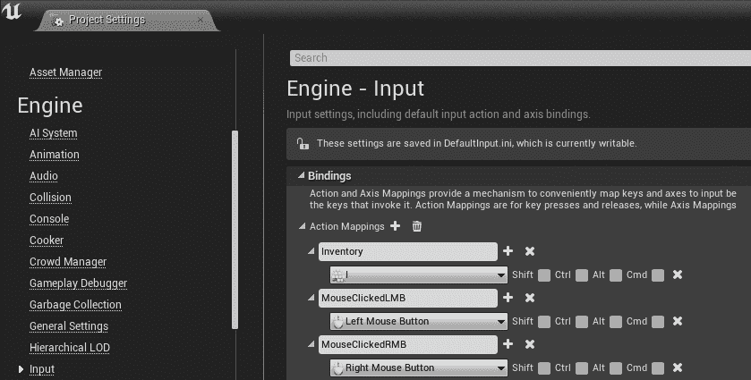

1.  在`Avatar.h`/`Avatar.cpp`中声明一个名为`MouseRightClicked()`的函数，使用以下代码：

```cpp
void AAvatar::MouseRightClicked() 
{ 
  if( inventoryShowing ) 
  { 
    APlayerController* PController = GetWorld()- 
     >GetFirstPlayerController(); 
    AMyHUD* hud = Cast<AMyHUD>( PController->GetHUD() ); 
    hud->MouseRightClicked(); 
  } 
}
```

1.  然后，在`AAvatar::SetupPlayerInputComponent()`中，我们应该将`MouseClickedRMB`事件附加到`MouseRightClicked()`函数：

```cpp
// In AAvatar::SetupPlayerInputComponent(): 
PlayerInputComponent->BindAction("MouseClickedRMB", IE_Pressed, this,
        &amp;AAvatar::MouseRightClicked);
```

我们终于连接了施法。试一试；游戏玩起来非常酷，如下面的屏幕截图所示：

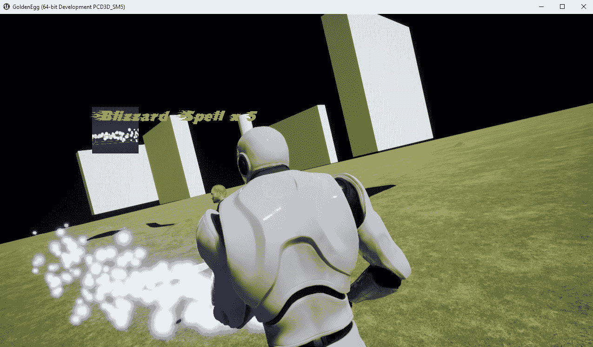

# 创建其他法术

通过玩弄粒子系统，您可以创建各种不同的法术，产生不同的效果。您可以创建火焰、闪电或将敌人推开的法术。在玩其他游戏时，您可能已经遇到了许多其他可能的法术。

# 火焰法术

通过将粒子系统的颜色更改为红色，您可以轻松创建我们暴风雪法术的火焰变体。这是我们暴风雪法术的火焰变体的外观：

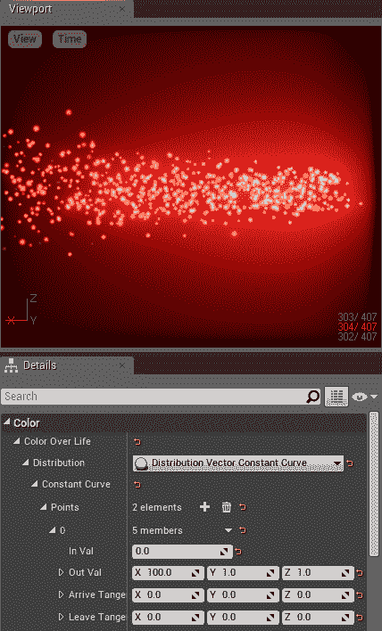

颜色的输出值更改为红色

# 练习

尝试以下练习：

+   **闪电法术**：使用光束粒子创建闪电法术。按照 Zak 的教程示例，了解如何创建光束并朝一个方向发射，网址为[`www.youtube.com/watch?v=ywd3lFOuMV8&amp;list=PLZlv_N0_O1gYDLyB3LVfjYIcbBe8NqR8t&amp;index=7`](https://www.youtube.com/watch?v=ywd3lFOuMV8&list=PLZlv_N0_O1gYDLyB3LVfjYIcbBe8NqR8t&index=7)。

+   **力场法术**：力场将使攻击偏转。对于任何玩家来说都是必不可少的。建议实现：派生`ASpell`的子类称为`ASpellForceField`。向该类添加一个边界球，并在`ASpellForceField::Tick()`函数中使用它将怪物推出。

# 摘要

现在您知道如何在游戏中创建防御法术。我们使用粒子系统创建了可见的法术效果，并且可以用来对任何在其中的敌人造成伤害的区域。您可以扩展所学知识以创建更多内容。

在下一章中，我们将探讨一种更新且更容易的构建用户界面的方法。
