# 通过 UMG 和音频改进 UI 反馈

在游戏中，用户反馈非常重要，因为用户需要了解游戏中发生的情况（得分、生命值、显示库存等）。在以前的章节中，我们创建了一个非常简单的 HUD 来显示文本和库存中的物品，但是如果您想要一个看起来专业的游戏，您将需要一个比那更好得多的**用户界面**（**UI**）！

幸运的是，现在有更简单的方法来使用虚幻动态图形 UI 设计师（UMG）构建 UI，这是 UE4 附带的系统，专门用于此目的。本章将向您展示如何使用它来接管我们之前所做的工作，并制作看起来更好并具有更多功能的东西。我们将开始更新库存窗口，并我将提出您可以继续该过程并更新其余 UI 的建议。

通过音频提供反馈的另一种方法是，无论是在游戏本身还是通过 UI 与其交互时，我们还将介绍如何播放声音。

我们将要涵盖的主题如下：

+   UMG 是什么？

+   更新库存窗口

+   布局您的 UI

+   更新您的 HUD 并添加生命条

+   播放音频

# UMG 是什么？

您可能已经注意到，我们用来在屏幕上绘制的代码非常复杂。每个元素都需要手动放置在屏幕上。您可能会问自己是否有更简单的方法。有！那就是虚幻动态图形 UI 设计师，或者 UMG。

UMG 通过使用特殊蓝图简化了创建 UI 的过程，允许您以可视方式布局界面。这也可以让您让精通技术的艺术家为您设计布局，而您则将一切连接起来。我们将使用这个，但由于这是一本 C++书，我们将在 C++中处理大部分幕后功能。

要使用 UMG，首先需要在 Visual Studio 项目中找到`GoldenEgg.Build.cs`文件。`.cs`文件通常是 C#，而不是 C++，但您不必担心，因为我们只会对此文件进行轻微更改。找到这一行：

```cpp
PublicDependencyModuleNames.AddRange(new string[] { "Core", "CoreUObject", "Engine", "InputCore" });
```

并将以下内容添加到列表中：

```cpp
, "UMG", "Slate", "SlateCore"
```

您可能需要在这样做后重新启动引擎。然后您将准备好在 UMG 中编码！

# 更新库存窗口

我们将从更新库存窗口开始。我们现在拥有的不是一个真正的窗口，只是在屏幕上绘制的图像和文本，但现在您将看到如何轻松创建看起来更像真正窗口的东西——带有背景和关闭按钮，代码将更简单。

# WidgetBase 类

要为 UMG 小部件创建 C++类，您需要基于`UserWidget`创建一个新类。在添加新的 C++类时，需要检查显示所有类并搜索它以找到它： 

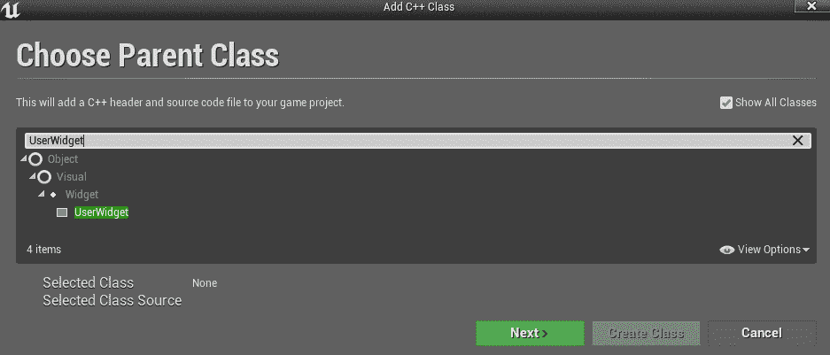

将您的类命名为`WidgetBase`。这将是您派生任何其他小部件类的基类。这使您可以在此类中放置将在许多不同小部件中重复使用的功能。在这种情况下，我在那里放置了`CloseButton`的功能。并非所有小部件都需要一个，但是如果您想要一个标准窗口，通常是一个好主意。

这是`WidgetBase.h`的代码：

```cpp
#include "CoreMinimal.h"
#include "Blueprint/UserWidget.h"
#include "UMG/Public/Components/Button.h"
#include "WidgetBase.generated.h"

/**
 * WidgetBase.h
 */
UCLASS()
class GOLDENEGG_API UWidgetBase : public UUserWidget
{
    GENERATED_BODY()

public:
    UPROPERTY(meta = (BindWidgetOptional))
    UButton* CloseButton;

    bool isOpen;

    bool Initialize();
    void NativeConstruct();

    UFUNCTION(BlueprintCallable)
    void CloseWindow();
};
```

这将设置允许您使用按钮关闭窗口的所有代码。`CloseButton`将是我们在设计蓝图中创建的按钮的名称。

行`UPROPERTY(meta = (BindWidgetOptional))`应自动将`CloseWindow`变量链接到稍后将在蓝图中创建的具有相同名称的`Button`对象。如果您知道小部件将始终存在，则可以改用`UPROPERTY(meta = (BindWidget))`，但在这种情况下，可能存在不需要关闭窗口的按钮的情况。

这里是`WidgetBase.cpp`：

```cpp
#include "WidgetBase.h"
#include "Avatar.h"
#include "Kismet/GameplayStatics.h"

bool UWidgetBase::Initialize()
{
    bool success = Super::Initialize();
    if (!success)  return false;

    if (CloseButton != NULL)
    {
        CloseButton->OnClicked.AddDynamic(this, &UWidgetBase::CloseWindow);
    }

    return true;
}

void UWidgetBase::NativeConstruct()
{
    isOpen = true;
}

void UWidgetBase::CloseWindow()
{
    if (isOpen)
    {
        AAvatar *avatar = Cast<AAvatar>(
            UGameplayStatics::GetPlayerPawn(GetWorld(), 0));

        avatar->ToggleInventory();
        isOpen = false;
    }
}
```

如果本章中包含的 UMG 对您不起作用，您可能需要在路径前面添加`Runtime/`。但它们应该像这样工作（并且在我的项目中确实工作）。

以下行是将`OnClicked`事件设置为调用特定函数的内容：

```cpp
CloseButton->OnClicked.AddDynamic(this, &UWidgetBase::CloseWindow);
```

我们不再需要像以前那样在输入设置中设置所有内容，因为 UMG 按钮已经设置好处理`OnClicked`，您只需要告诉它要调用哪个函数。如果由于某种原因它不起作用，我将向您展示如何通过稍后在蓝图中设置`OnClicked`来解决问题。由于`CloseButton`是可选的，您确实需要检查它以确保它未设置为`NULL`以避免错误。

`isOpen`变量用于处理常见的 UI 问题，有时点击（或按键）会注册多次，导致函数被调用多次，这可能会导致错误。通过将`isOpen`设置为 true，第一次调用`OnClicked`函数时，您确保它不会运行多次，因为它只会在值为 false 时运行。当然，您还需要确保在重新打开窗口时重置该值，这就是`NativeConstruct()`函数的作用。

# 库存小部件类

现在，您将要创建一个专门处理库存小部件的类，该类派生自`WidgetBase`。如果由于某种原因找不到`WidgetBase`以通常的方式创建类，则在过滤器下取消选中仅限于演员。将其命名为`InventoryWidget`。

创建了该类后，您可以开始添加代码。首先，这是`InventoryWidget.h`：

```cpp
#include "CoreMinimal.h"
#include "WidgetBase.h"
#include "UMG/Public/Components/Image.h"
#include "UMG/Public/Components/TextBlock.h"
#include "UMG/Public/Components/Button.h"
#include "InventoryWidget.generated.h"

/**
 * 
 */
UCLASS()
class GOLDENEGG_API UInventoryWidget : public UWidgetBase
{
    GENERATED_BODY()

public:
    const int kNumWidgets = 2;
    //image widgets
    UPROPERTY(meta = (BindWidget))
        UImage* InventoryImage1;

    UPROPERTY(meta = (BindWidget))
        UImage* InventoryImage2;

    //text widgets
    UPROPERTY(meta = (BindWidget))
        UTextBlock* InventoryText1;

    UPROPERTY(meta = (BindWidget))
        UTextBlock* InventoryText2;

    //Invisible Buttons
    UPROPERTY(meta = (BindWidget))
        UButton* InventoryButton1;

    UPROPERTY(meta = (BindWidget))
        UButton* InventoryButton2;

    bool Initialize();

    void HideWidgets();
    void AddWidget(int idx, FString name, UTexture2D* img);

    UFUNCTION(BlueprintCallable)
    void MouseClicked1();
    UFUNCTION(BlueprintCallable)
    void MouseClicked2();
};
```

这个文件要复杂得多。我们再次使用`BindWidget`来在蓝图中设置对象。虽然您可以像以前一样在代码中布置小部件（但您应该能够创建包括图像、文本和按钮的子小部件），但为了保持简单，我只在屏幕上布置了两个小部件，并分别引用它们。您随时可以自己添加更多以供练习。

因此，在这种特殊情况下，我们为两个图像、两个文本块和两个按钮设置了小部件。有一个`Initialize`函数来设置它们，以及用于添加小部件、隐藏所有小部件以及每个按钮的鼠标点击处理程序的函数。

然后，我们需要编写`InventoryWidget.cpp`。首先，在文件顶部添加包含：

```cpp
#include "InventoryWidget.h"
#include "MyHUD.h"
#include "Runtime/UMG/Public/Components/SlateWrapperTypes.h"
```

然后设置`Initialize`函数：

```cpp
bool UInventoryWidget::Initialize()
{
    bool success = Super::Initialize();
    if (!success)  return false;

    if (InventoryButton1 != NULL)
    {
        InventoryButton1->OnClicked.AddDynamic(this, &UInventoryWidget::MouseClicked1);
    }
    if (InventoryButton2 != NULL)
    {
        InventoryButton2->OnClicked.AddDynamic(this, &UInventoryWidget::MouseClicked2);
    }

    return true;
}
```

此函数为按钮设置了`OnClicked`函数。然后添加处理小部件的函数：

```cpp
void UInventoryWidget::HideWidgets()
{
    InventoryImage1->SetVisibility(ESlateVisibility::Hidden);
    InventoryText1->SetVisibility(ESlateVisibility::Hidden);
    InventoryImage2->SetVisibility(ESlateVisibility::Hidden);
    InventoryText2->SetVisibility(ESlateVisibility::Hidden);
}

void UInventoryWidget::AddWidget(int idx, FString name, UTexture2D* img)
{
    if (idx < kNumWidgets)
    {
        switch (idx)
        {
        case 0:
            InventoryImage1->SetBrushFromTexture(img);
            InventoryText1->SetText(FText::FromString(name));
            InventoryImage1->SetVisibility(ESlateVisibility::Visible);
            InventoryText1->SetVisibility(ESlateVisibility::Visible);
            break;
        case 1:
            InventoryImage2->SetBrushFromTexture(img);
            InventoryText2->SetText(FText::FromString(name));
            InventoryImage2->SetVisibility(ESlateVisibility::Visible);
            InventoryText2->SetVisibility(ESlateVisibility::Visible);
            break;
        }

    }
}
```

`HideWidgets`隐藏窗口中的所有小部件，因此如果没有任何内容，它们将不会显示出来。`AddWidget`接受索引、名称和图像本身的纹理，然后为该索引设置小部件。文本小部件具有`SetText`函数，允许您传递`FText`（`FText::FromString`将其从`FString`转换为`FText`）。图像小部件具有`SetBrushFromTexture`，用于设置图像。

最后，您需要设置`MouseClicked`函数：

```cpp
void UInventoryWidget::MouseClicked1()
{
    // Get the controller & hud 
    APlayerController* PController = GetWorld()->GetFirstPlayerController();
    AMyHUD* hud = Cast<AMyHUD>(PController->GetHUD());
    hud->MouseClicked(0);
}

void UInventoryWidget::MouseClicked2()
{
    // Get the controller & hud 
    APlayerController* PController = GetWorld()->GetFirstPlayerController();
    AMyHUD* hud = Cast<AMyHUD>(PController->GetHUD());
    hud->MouseClicked(1);
}
```

这些只是使用 HUD 的`MouseClicked`函数调用按钮的索引（提示：在更新 HUD 函数以接受索引之前，这不会编译）。如果您想进一步实验，稍后可以研究另一种根据单击的按钮获取索引的方法，以便您可以为所有按钮使用相同的函数。

# 设置小部件蓝图

接下来，您需要设置蓝图。由于这是一种特殊类型的蓝图，因此使用其自己的类设置一个蓝图有点棘手。您不能只创建该类的蓝图，否则您将没有设计蓝图。相反，您必须首先创建设计蓝图，然后更改父级。

要做到这一点，请进入内容浏览器，选择要放置的目录，然后选择添加新项|用户界面|小部件蓝图：

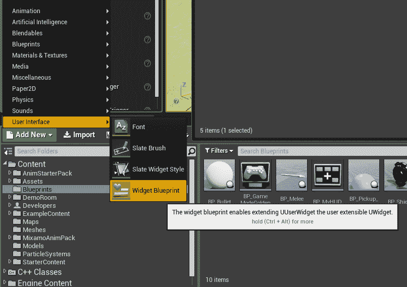

将其重命名为`BP_InventoryWidget`，然后双击打开它。您应该会看到类似于这样的东西：

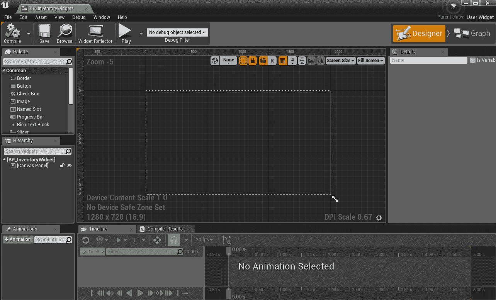

在中心，您将直观地布置屏幕，方框代表您所瞄准的理论屏幕的边缘。在左侧，调色板向您展示了可以添加到屏幕上的基本 UI 对象。您将看到许多常见的对象，例如图像、文本字段、进度条、按钮、复选框和滑块。这基本上是您免费获得的许多功能。一旦您开始为游戏设置设置窗口，其中许多功能将派上用场。

但首先，我们需要更改此处的父类。在右上角选择图表，顶部工具栏上的类设置，然后在详细信息下查找类选项，并选择父类旁边的下拉菜单。在那里选择 InventoryWidget：

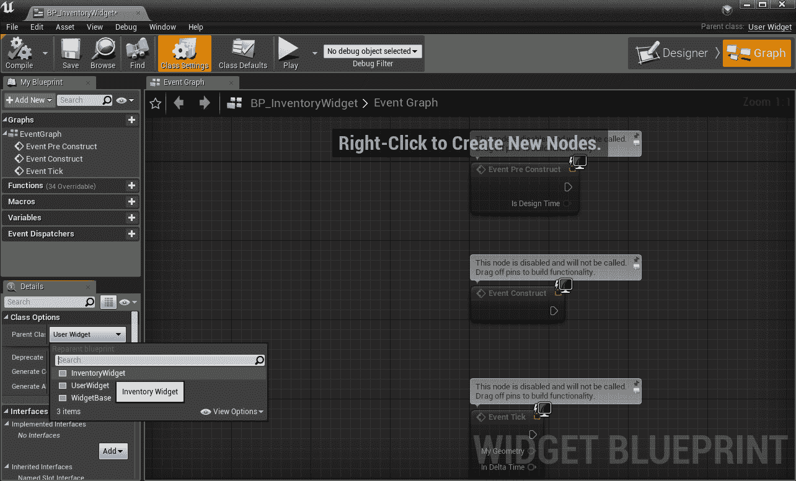

现在我们要回到设计师，开始布置屏幕！

屏幕上应该已经有一个画布面板。您可以单击右下角并拖动以使其成为所需的大小。画布通常应该是整个屏幕的大小。所有其他 UI 小部件都将放在画布内。当您拖动时，它将显示您所瞄准的各种分辨率。您将要选择与您所瞄准的分辨率类似的分辨率。

然后在调色板下选择边框，并将其拖出到屏幕上。这将是窗口的背景。您可以单击角落并将其拖动到所需的大小。您还可以在右侧找到颜色条（在详细信息下的外观>刷子颜色旁边），单击它以打开颜色选择器选择背景的颜色：

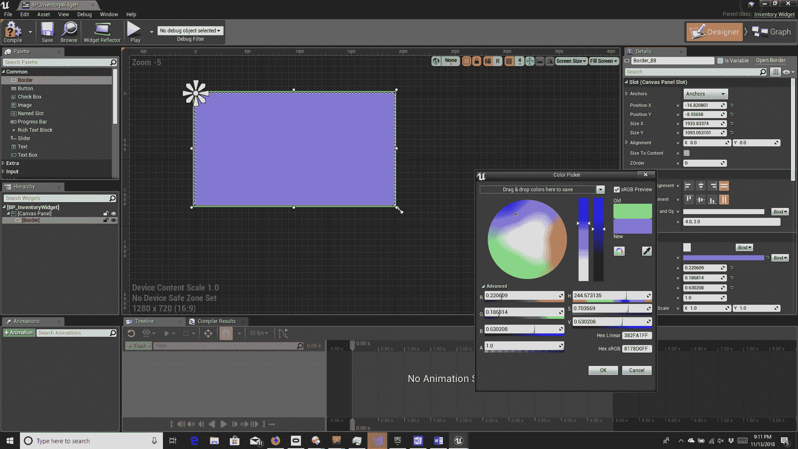

您还可以在详细信息下重命名对象。一旦您完成了这些操作，点击并拖动一个按钮到屏幕上，并将其定位在背景的右上角。如果它试图填满整个边框对象，请确保您在层次结构中选择了画布面板，或者将其拖到边框对象之外，然后将其拖到其上方。确保将其命名为`CloseButton`。如果您想使其看起来更像关闭按钮，还可以在其中放置一个带有字母 X 的文本对象。您应该在详细信息中的行为下取消选中“已启用”，以便它不会阻止鼠标点击。

接下来，您将要定位两个图像对象和两个文本对象（稍后可以添加更多）。确保名称与您在代码中使用的名称完全匹配，否则它们将无法工作。在文本字段中，设置字体会更容易。在详细信息|外观下，您将找到字体选项，就像您在任何文字处理器中习惯的那样，并且您可以使用计算机上已有的字体（尽管，如果您仍然想要下载字体，没有任何阻止您的东西）。您还可以使用之前添加的字体。

另外，对于`OnClicked`，您将要添加一个按钮。您可以只在下面添加一个，但我使用了一种常见的 UI 方法：隐形按钮。拖动一个按钮出来，让它覆盖一个图像和一个文本。然后进入背景颜色并将 alpha（A）设置为`0`。Alpha 是颜色透明度的度量，`0`表示您根本看不到它。

如果以后点击按钮时遇到麻烦，可能会有其他对象挡住了。尝试将它们拖到按钮后面，或者研究一下如何禁用这些对象上的点击。

最后，您应该有类似于这样的东西：

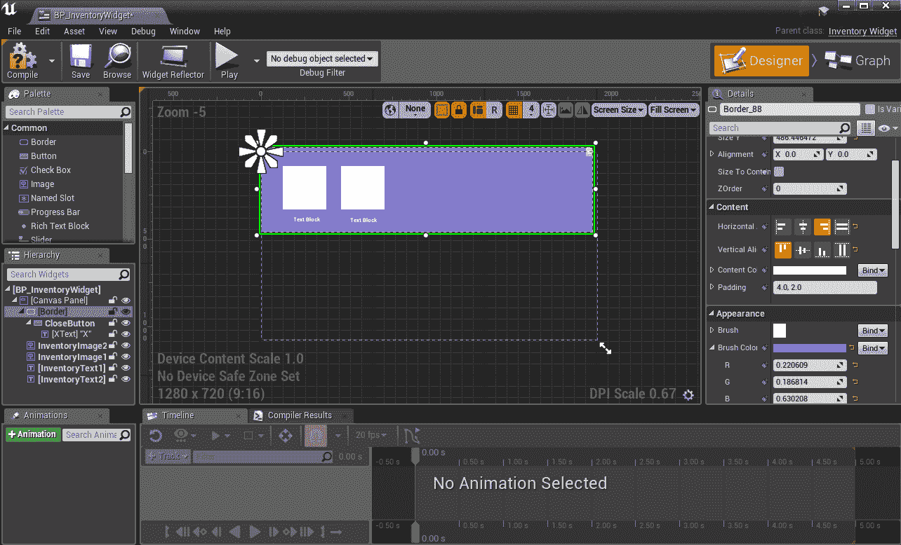

还要仔细注意在选择边框时右侧的内容选项。这是您可以设置水平和垂直对齐的地方。始终尝试设置这些，因此如果您希望某些内容始终位于屏幕的左上角，对齐将设置为水平对齐左侧和垂直对齐顶部。如果您没有为每个对象设置对齐，不同屏幕分辨率下的结果可能是不可预测的。稍后我会更详细地介绍这一点。

但现在，这将是你的库存窗口。它不一定要看起来和我的一样，所以玩得开心，尝试一下视觉布局！尽管记住，你可能不希望它占据整个屏幕，这样你就可以在点击后看到施放的咒语（尽管你可以在以后点击咒语时关闭窗口）。

# AMyHUD 更改

但这还不是全部！我们仍然需要修改我们现有的类来支持这个新的小部件，首先是`AMyHud`类。为了简化事情，我们不会在这里复制所有以前的功能。相反，我们将设置`OnClicked`函数来施放咒语，因为在游戏中这将比在屏幕上拖动物品更有用。右键点击不会被 UMG 自动处理，但如果你想以后添加它，你可以自己更深入地了解一下，你也可以查看以前的点击和拖动功能，所以如果你认为以后可能会用到它，你可能会想注释掉旧的代码而不是删除它。

目前，`MouseMoved`和`MouseRightClicked`函数已经消失，`MouseClicked`函数现在接受一个`int`索引。我们还有新的函数`OpenInventory`和`CloseInventory`，所以`MyHUD.h`现在应该是这样的：

```cpp
    void MouseClicked(int idx);

    UPROPERTY(EditAnywhere, BlueprintReadWrite, Category = "Widgets") 
        TSubclassOf<class UUserWidget> wInventory;

    UInventoryWidget* Inventory;

    void OpenInventory();
    void CloseInventory();
```

还要在文件顶部添加#include "InventoryWidget.h"。一些其他函数也将被修改。所以，现在我们将看一下`AMyHUD.cpp`，你将看到新版本的函数有多么简单。以下是处理小部件的新函数：

```cpp
void AMyHUD::DrawWidgets()
{
    for (int c = 0; c < widgets.Num(); c++)
    {
        Inventory->AddWidget(c, widgets[c].icon.name, widgets[c].icon.tex);
    }
}

void AMyHUD::addWidget(Widget widget)
{
    widgets.Add(widget);
}

void AMyHUD::clearWidgets()
{
    widgets.Empty();
}
```

我们还需要将`MouseClicked`函数更新为这样：

```cpp
void AMyHUD::MouseClicked(int idx)
{
    AAvatar *avatar = Cast<AAvatar>(
        UGameplayStatics::GetPlayerPawn(GetWorld(), 0));
    if (widgets[idx].bpSpell)
    {
        avatar->CastSpell(widgets[idx].bpSpell);
    }

}
```

这将根据传入的索引施放咒语。然后有新的函数来打开和关闭库存：

```cpp
void AMyHUD::OpenInventory()
{
    if (!Inventory)
    {
        Inventory = CreateWidget<UInventoryWidget>(GetOwningPlayerController(), wInventory);
    }
    Inventory->AddToViewport();
    Inventory->HideWidgets();
}

void AMyHUD::CloseInventory()
{
    clearWidgets();
    if (Inventory)
    {
        Inventory->HideWidgets();
        Inventory->RemoveFromViewport();
    }
}
```

主要部分是向`Viewport`添加或删除新的小部件。我们还希望在视觉上隐藏小部件，以防止空的小部件显示，并在关闭窗口时清除所有小部件。

我们还改变了`struct Widget`以删除所有的定位信息。对它的任何引用都应该被删除，但如果你以后遇到任何错误（在你修改 Avatar 类之前，你将无法编译），确保`MouseMoved`和`MouseRightClicked`已经消失或被注释掉，并且没有其他东西在引用它们。新的、更简单的小部件应该看起来像这样：

```cpp
struct Widget
{
    Icon icon;
    // bpSpell is the blueprint of the spell this widget casts 
    UClass *bpSpell;
    Widget(Icon iicon)
    {
        icon = iicon;
    }
};
```

# AAvatar 更改

在`AAvatar`中，我们主要将修改`ToggleInventory`函数。新的函数将如下所示：

```cpp

void AAvatar::ToggleInventory()
{
    // Get the controller & hud 
    APlayerController* PController = GetWorld()->GetFirstPlayerController();
    AMyHUD* hud = Cast<AMyHUD>(PController->GetHUD());

    // If inventory is displayed, undisplay it. 
    if (inventoryShowing)
    {
        hud->CloseInventory();
        inventoryShowing = false;
        PController->bShowMouseCursor = false;
        return;
    }

    // Otherwise, display the player's inventory 
    inventoryShowing = true;
    PController->bShowMouseCursor = true;
    hud->OpenInventory();
    for (TMap<FString, int>::TIterator it =
        Backpack.CreateIterator(); it; ++it)
    {
        // Combine string name of the item, with qty eg Cow x 5 
        FString fs = it->Key + FString::Printf(TEXT(" x %d"), it->Value);
        UTexture2D* tex;
        if (Icons.Find(it->Key))
        {
            tex = Icons[it->Key];
            Widget w(Icon(fs, tex));
            w.bpSpell = Spells[it->Key];
            hud->addWidget(w);
        }    
    }
    hud->DrawWidgets();
}
```

正如你所看到的，许多相同的 HUD 函数被重用，但现在从这里调用`OpenInventory`和`CloseInventory`的新函数，所以 HUD 可以在添加小部件之前显示窗口，并在关闭窗口时删除窗口。

还要从`Yaw`和`Pitch`函数中删除以下行：

```cpp
        AMyHUD* hud = Cast<AMyHUD>(PController->GetHUD());
        hud->MouseMoved();
```

还要从`MouseRightClicked`中删除以下行（或删除该函数，但如果你这样做，请确保你也从`SetupPlayerInputComponent`中删除它）：

```cpp
        AMyHUD* hud = Cast<AMyHUD>(PController->GetHUD());
        hud->MouseRightClicked();
```

最后，从`MouseClicked`中删除这些行（因为你不希望在点击不属于库存的地方时意外触发一个咒语）：

```cpp
    AMyHUD* hud = Cast<AMyHUD>(PController->GetHUD());
    hud->MouseClicked();
```

现在你应该能够编译了。一旦你这样做了，进入 BP_MyHUD 并将类默认值>小部件>W 库存下拉菜单更改为 BP_InventoryWidget。

# 关于 OnClicked 的说明

可能你的`OnClicked`函数可能无法正常工作（我自己遇到了这个问题）。如果你找不到解决办法，你可以通过蓝图绕过，这就是为什么我把所有的鼠标点击函数都设置为蓝图可调用的原因。

如果这种情况发生在你身上，进入你的小部件蓝图的设计师，对于每个按钮点击它并找到详细信息下的事件，然后点击旁边的绿色+按钮。这将为该按钮添加`OnClicked`到图表并切换到该按钮。然后，从节点中拖出并添加你想要的功能。它应该看起来像这样：

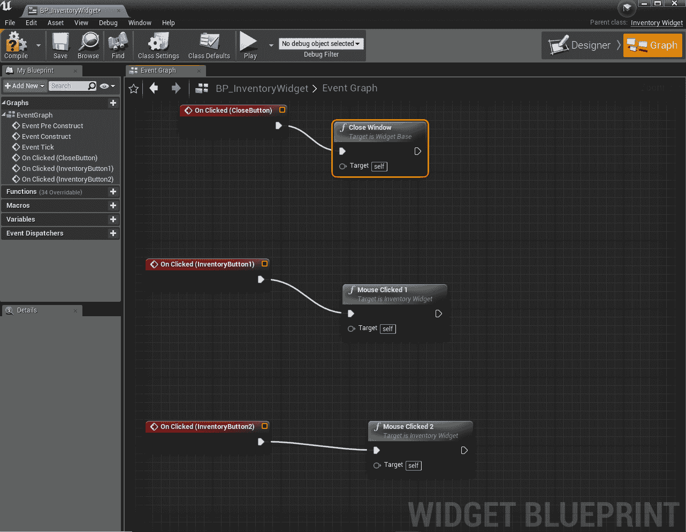

# 布局您的 UI

当您布局 UI 时，有一些重要的事情需要牢记，UMG 有工具可以让这更容易。其中最重要的一点是，您的游戏不会总是以相同的分辨率运行。如果您在做移动游戏，可能会有许多不同分辨率的设备，您希望您的游戏在所有设备上看起来基本相同。即使是游戏机也不再免于这个问题，因为 Xbox One 和 PS4 现在都有 4K 选项。因此，您的游戏需要以一种可以实现这一点的方式设置。

如果您将所有的小部件都设置为特定的像素大小，然后在分辨率更高的情况下运行，它可能会变得非常小，看起来难以阅读，按钮可能也很难点击。在较低的分辨率下，它可能太大而无法适应屏幕。所以，请记住这一点。

您之前设置的画布面板将直观地显示您所追求的大小。但是对于所需大小的变化，您需要牢记几件事情。

首先，始终使用锚点。在详细信息下，您将看到一个锚点的下拉列表。打开它，您应该会看到类似这样的内容：

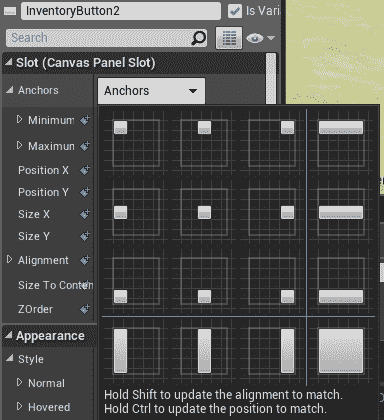

蓝线左上角的九个选项是用来对齐对象的。行对齐到屏幕的顶部、中部和底部，而列对齐到屏幕的左侧、中部和右侧。因此，如果您希望某些内容始终出现在屏幕的左上角（比如得分或生命条），您将选择左上角的选项。如果您希望其他内容水平和垂直居中，请选择第二行、第二列。小白色方块基本上显示了您的定位。

剩下的选项可以让您在整个屏幕上拉伸某些内容（无论大小如何）。因此，如果您希望在顶部、中部或底部水平拉伸某些内容，请查看右列。对于垂直方向，请查看底部行。如果您希望窗口横跨整个屏幕，请查看右下角的选项。

您还可以从调色板中添加一个比例框，如果您希望其中的所有内容都按比例缩放以适应屏幕大小。虽然如果您有一些希望保持固定大小的东西，比如一张图片，您可以勾选“大小自适应内容”来防止它自动调整大小。

如果您想要更高级一点，您可以添加代码来检查屏幕大小并交换部分或整个 UI，但这超出了本书的范围，所以如果您想在自己的项目中稍后尝试，请记住这一点！

您的 UI 的另一个重要事项是本地化。如果您希望在自己国家之外的任何地方发布游戏，您将需要进行本地化。这意味着您不仅要习惯于不直接编写文本，而是使用内置的本地化系统来添加您设置的字符串 ID，而不是直接编写文本。代码将寻找特定的 ID，并将其替换为相应的本地化文本。您可以在这里了解内置的本地化系统：[`docs.unrealengine.com/en-us/Gameplay/Localization`](https://docs.unrealengine.com/en-us/Gameplay/Localization)。

这也会影响您布局 UI 的方式。当您第一次将游戏本地化为德语时，您会发现一切都变成了两倍长！虽然您可能能让翻译人员想出更短的表达方式，但您可能会希望使文本块比您认为需要的更长，或者考虑找到使文本收缩以适应或滚动的方法。

# 更新您的 HUD 并添加生命条

我不会在这里给出完整的说明，但以下是一些关于更新 HUD 的提示。一旦您这样做，它将进一步简化您的代码！

# 创建一个 HUD 类

您需要创建一个从 WidgetBase 派生的新类，用于您的新 HUD。在这种情况下，您将需要 Canvas Panel，但不需要背景。确保所有内容都会延伸到整个屏幕。

您将希望将大部分 UI 放在角落里，因此您可以在屏幕的左上角添加一个进度条小部件来显示健康。此外，考虑添加一个文本小部件来告诉它是什么，和/或在屏幕上显示实际数字。

对于消息，您可以将文本小部件对齐到屏幕的顶部中间，并使用它们来显示文本。

# 添加健康条

如果您已添加了推荐的进度条小部件，您会发现绘制健康条现在更容易了。您需要像其他小部件一样获取对它的引用。然后，您所需要做的就是调用`SetPercent`来显示当前的健康值（并在健康值改变时重置它）。

您不再需要自己绘制整个东西，但是您可以使用`SetFillColorAndOpacity`来自定义外观！

# 播放音频

我们将回到您的代码，做最后一件真正有助于您的游戏反馈的事情，但是在创建游戏时，这似乎总是最后一个人会考虑到的事情：音频。

音频可以真正增强您的游戏，从在单击按钮时播放声音到添加音效、对话、背景音乐和环境音效。如果您在夜晚独自在树林中行走，蟋蟀的鸣叫声、您自己的脚步声和不祥的音乐可以真正营造氛围。或者，您可以播放鸟鸣和愉快的音乐，营造完全不同的氛围。这都取决于您！

我们将在你施放暴风雪咒语时添加一个声音。因此，请寻找一个免费的风声。有很多网站提供免版税的声音文件。其中一些要求您在使用它们时在您的制作人员名单中提到他们。对于这个，我在一个名为[SoundBible.com](http://www.soundbible.com)的网站上找到了一个公共领域的声音，这意味着任何人都可以使用它。但是请寻找您喜欢的声音。

有些网站可能会要求您注册以下载声音。如果您感到有雄心壮志，甚至可以自己录制一个！

我使用了.wav 文件，这是一种标准格式，尽管其他格式可能也有效。但是对于小声音，您可能希望坚持使用.wav，因为 MP3 使用了压缩，这可能会稍微减慢游戏速度，因为它需要对其进行解压缩。

一旦您找到喜欢的文件，请为声音创建一个文件夹，并从文件管理器将声音文件拖入其中。然后在同一文件夹中右键单击并选择 Sounds | Sound Cue：

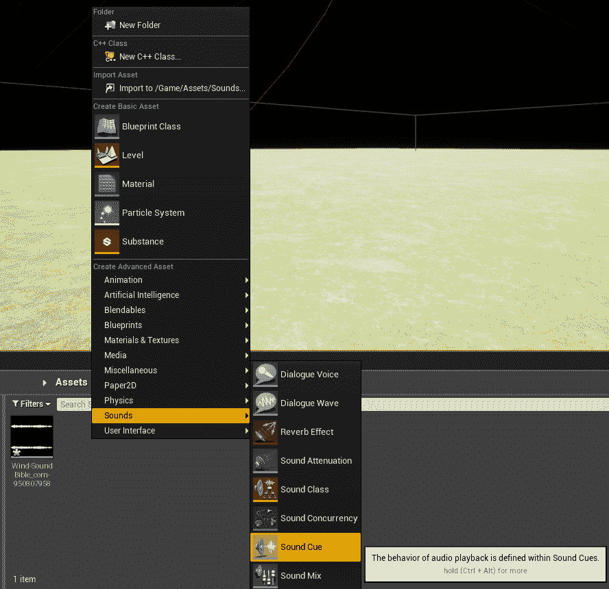

将其重命名为 WindCue，然后双击它以在蓝图编辑器中打开它。它应该看起来像这样：

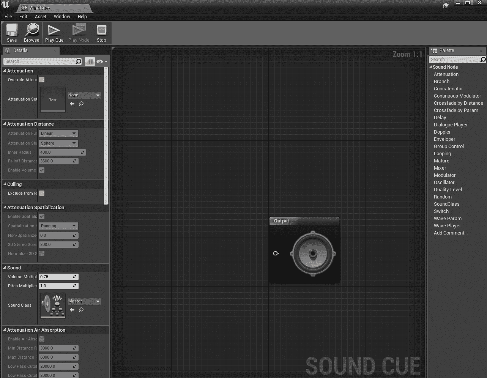

声音提示是我们设置声音的地方。首先，右键单击任何位置，然后选择 Wave Player 添加一个：

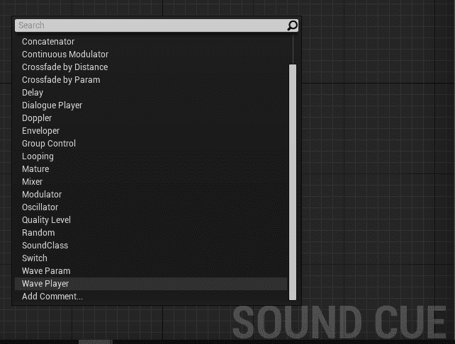

然后，选择 Wave Player。在详细信息中，您将看到一个名为 Sound Wave 的选项。选择下拉列表并搜索您添加的.wav 文件以选择它：

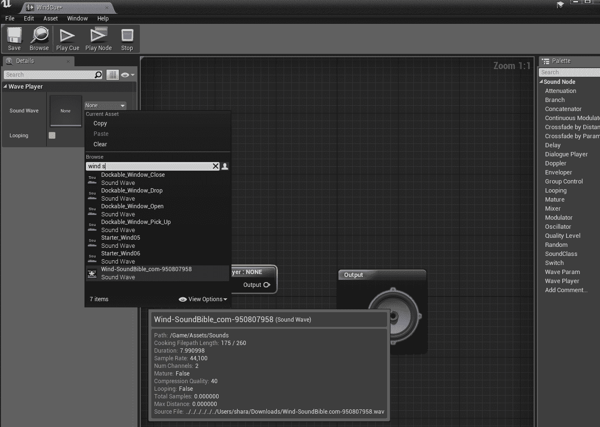

然后，从 Wave Player 的输出处拖动并放入输出（带有小扬声器图像）。这将连接它。要测试它，您可以选择播放提示，然后您应该听到声音，并且看到线条变成橙色，表示声音被传输到输出：

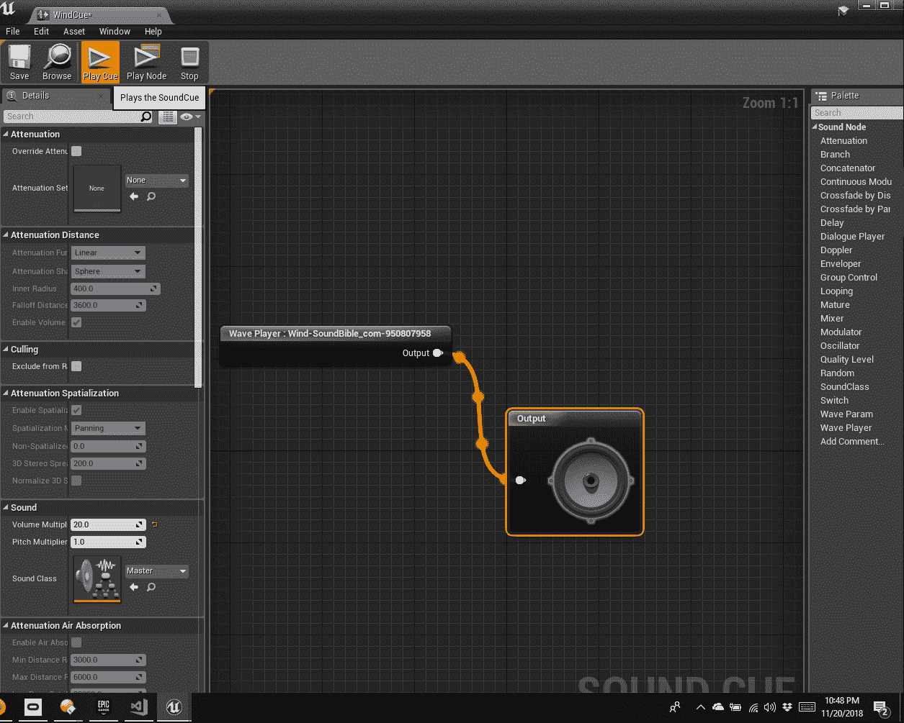

如果您不喜欢声音的方式，请尝试详细信息下的选项。我使用的声音对我想要的效果太安静了，所以我增加了音量倍增器使其响亮得多。

现在我们已经设置好声音，是时候将其添加到代码中了。在这种情况下，我们将更新`AMyHUD`类。首先，在`MyHUD.h`的顶部添加以下行：

```cpp
#include "Sound/SoundCue.h"
```

此外，在同一文件中添加以下内容：

```cpp
UPROPERTY(EditAnywhere, BlueprintReadWrite, Category = "Sound")
    USoundCue* audioCue;
```

您将希望将`SoundCue`引用存储在蓝图中以便于更新。

现在，转到`MyHUD.cpp`并在`MouseClicked`函数中的`CastSpell`调用之后添加以下行：

```cpp
        UGameplayStatics::PlaySound2D(this, audioCue);
```

这将实际播放声音。确保在该文件中包含`#include "Kismet/GameplayStatics.h"`才能正常工作。对于这种情况，因为它在玩家附近每当您施放它时，2D 声音就可以了。如果您希望环境中的事物（如怪物）发出自己的声音，您将需要研究 3D 声音。UE4 将让您做到这一点！

现在，返回编辑器并编译所有内容，然后返回 HUD 蓝图。您需要将创建的`SoundCue`添加到蓝图中。

您可以从下拉列表中选择它，并像这样搜索它：

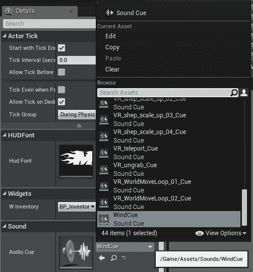

现在，保存、编译并运行游戏。四处奔跑，直到您捡起了一个暴风雪咒语并按*I*打开库存。点击暴风雪咒语。您不仅应该看到咒语施放，还应该听到它！

# 摘要

现在，您已经深入了解了如何使用 UMG 创建用户界面，以及如何添加音频以进一步增强您的体验！还有很多工作要做，但请考虑练习！

我们已经完成了这部分的代码，但书还没有完成。接下来，我们将看看如何将我们所拥有的内容在虚拟现实中查看！我会给你一些建议，然后我们将以 UE4 中的一些其他高级功能概述结束。
