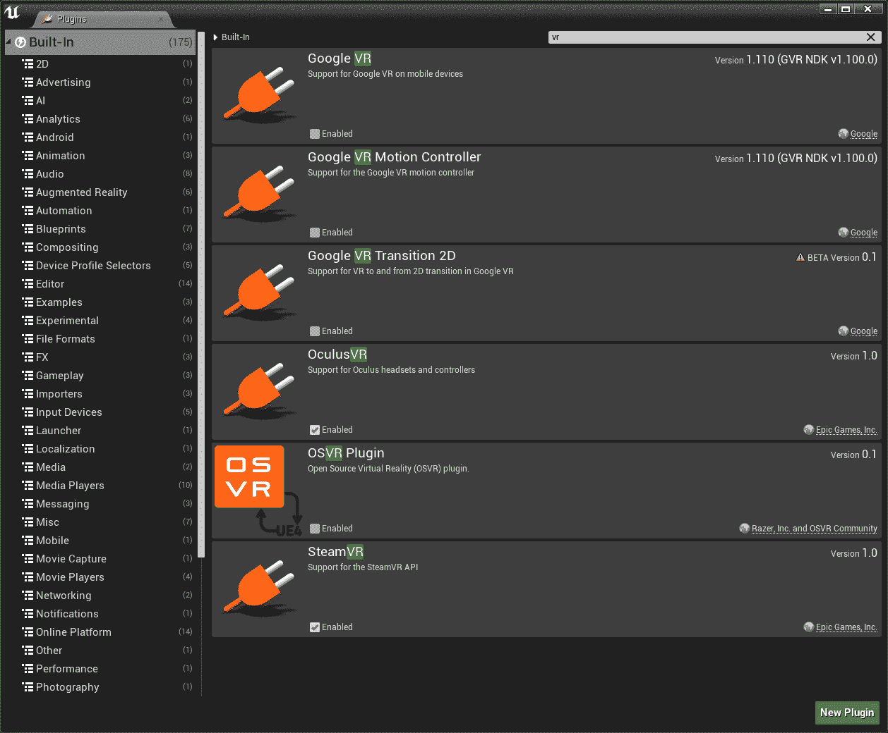
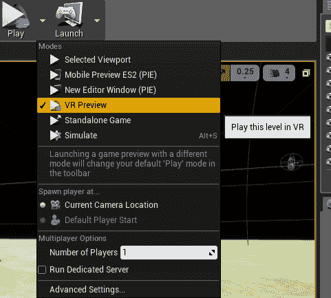
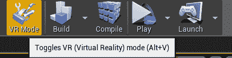
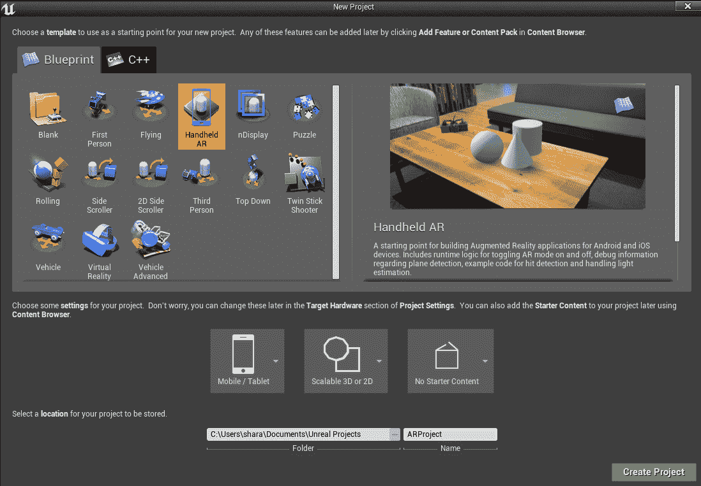
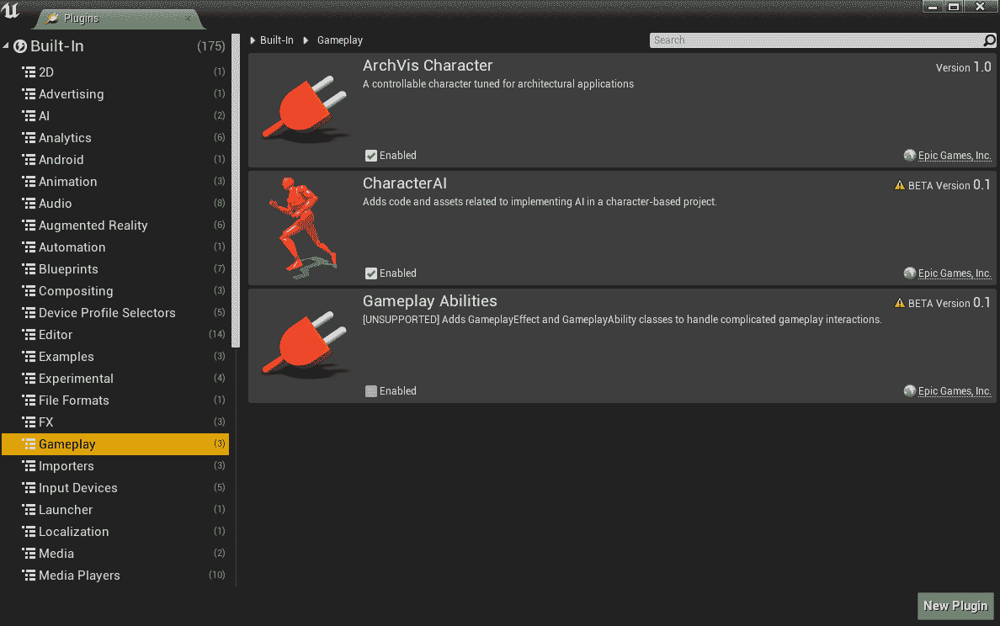
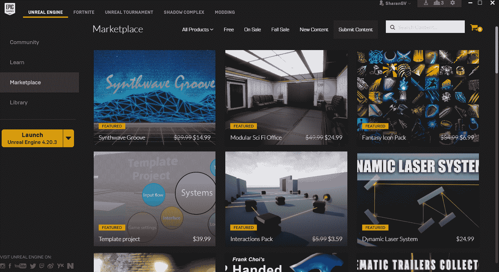
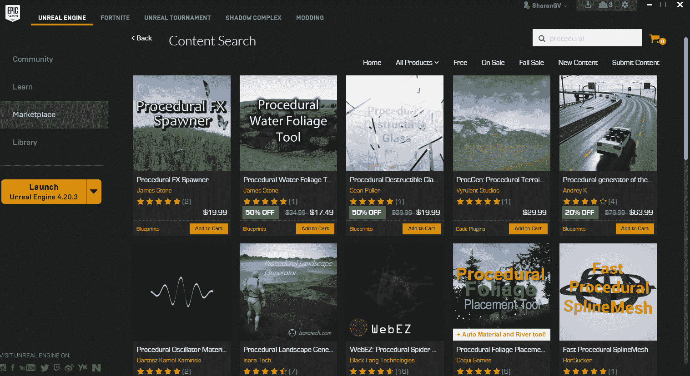

# 虚拟现实及更多内容

除非你一直住在山洞里，你可能已经听说过虚拟现实（VR）。VR 是目前游戏界最热门的趋势之一，还有增强现实（AR），这将在本章后面进行介绍。由于诸如超便宜的谷歌 Cardboard 和类似设备的创新，让你可以在最新的智能手机上查看基本的 VR，所以很容易获得 VR 技术的访问权限。

无论你只有一个谷歌 Cardboard，还是你有一个更高端的设备，比如 Oculus Rift 或 HTC VIVE，UE4 都可以轻松为 VR 编程。当然，如果你有 PlayStation VR，你需要成为索尼的官方开发者才能为其编程（就像为 PlayStation 编程其他内容一样），所以除非你在一家正在开发 PSVR 标题的公司工作，否则你可能无法做到这一点。

在这里，你将获得关于 VR 和 UE4 的概述，这应该可以帮助你入门。以下是我们将要涵盖的内容：

+   为 VR 做好准备

+   使用 VR 预览和 VR 模式

+   VR 中的控制

+   VR 开发的技巧

我还将介绍 UE4 的一些更高级的功能。我们将首先看看目前的另一个热门技术 AR，然后转向其他技术。以下是我们将要涵盖的内容：

+   增强现实

+   过程式编程

+   使用插件和附加组件扩展功能

+   移动，游戏机和其他平台

# 为 VR 做好准备

现在是一个激动人心的时刻，开始进行 VR 开发。也许你正在尝试进入最新的热门技术。或者，就像我一样，你在威廉·吉布森、尼尔·斯蒂芬森、威尔海尔米娜·贝尔德和布鲁斯·贝思克等作家的赛博朋克书籍中读到 VR 几十年，现在它终于出现了。无论哪种情况，以下是你可以为进入 VR 编程之旅做好准备的方法。

要开始使用 Oculus Rift 或 HTC Vive 进行 VR，首先你需要一台 VR-ready 的电脑。Oculus 在他们的网站上有一个免费的程序可以下载[`ocul.us/compat-tool`](https://ocul.us/compat-tool)，或者去他们的支持页面，它会告诉你是否有图形卡的问题。

即使你有一台最新的电脑，除非你专门购买了一个标记为 VR-ready 的电脑，你很可能需要一张新的显卡。VR 需要极高的图形性能，因此需要一张相当高端（通常也相当昂贵）的显卡。

当然，如果你只想在手机上进行 VR，你可能可以不用它，但你将不得不在手机上进行所有测试，并且无法使用 UE4 的许多很酷的功能，比如 VR 编辑。

一旦你有一台可以处理的电脑，你可能会想要购买 Oculus Rift 或 HTC Vive（或者两者都有，如果你真的很认真并且有足够的钱投入其中，因为两者都不便宜）。无论你选择哪种设备，都会在设置过程中安装你所需的所有驱动程序。

然后，进入 UE4，转到编辑|插件，并确保你拥有你所拥有设备的插件（你可以搜索它们）。根据你的 VR 硬件，它应该看起来像这样：

另外，请确保你的 VR 软件正在运行（当你打开 UE4 时，它可能会自动启动，这取决于你的 VR 硬件）。

# 使用 VR 预览和 VR 模式

如果你想在 VR 中查看某些内容，好消息是你不需要编写任何新内容！只需进入现有项目，点击播放按钮旁边的箭头，然后选择 VR 预览：

现在，只需戴上你的 VR 头盔，你就可以在 VR 中看到游戏了！

一旦你运行游戏，你就可以看到游戏世界。你无法四处移动（在 VR 中看不到键盘或鼠标），但你可以转动头部四处观看。

如果你容易晕动病，一定要非常小心。这在 VR 中是一个严重的问题，尽管有方法可以减轻游戏中的影响，我们稍后会谈到。在你习惯了它并知道它对你的影响之前，你可能不想在 VR 模式下待太久。

UE4 还有另一个工具可以帮助你，那就是 VR 模式。这允许你实际在 VR 中查看和编辑游戏，这样你就可以在进行更改时看到它们的效果。这可能非常有帮助，因为许多东西在 VR 中看起来与非 VR 游戏中不一样。

要激活 VR 模式，可以在工具栏中点击 VR 模式，或者按下*Alt* + *V*：

你可以四处张望，在 VR 模式下，你将能够使用你的运动控制器

在游戏中，你可能想在开始之前查找你需要的控制方式。

第一次进入 VR 模式。在 Unreal 网站上有关 VR 模式和你可以在其中使用的控制的详细说明：[`docs.unrealengine.com/en-us/Engine/Editor/VR`](https://docs.unrealengine.com/en-us/Engine/Editor/VR)。

如果你想进一步，通过为特定的 VR 系统编程，比如 Oculus Rift、Vive、Steam VR 或其他系统，Unreal 网站上有许多不同 VR 系统的详细说明。你可以在这里找到它们：[`docs.unrealengine.com/en-us/Platforms/VR`](https://docs.unrealengine.com/en-us/Platforms/VR)。

# VR 中的控制

你可能会注意到，在 VR 模式下，通常的控制方式不起作用。你甚至看不到戴着 VR 头显的键盘和鼠标，这使得使用它们非常困难。幸运的是，高端设备有自己的控制器可用，UE4 有一个运动控制器组件，你可以添加到你的玩家角色中，这样你就可以用它指向东西，而不是用鼠标。

如果你从一开始就知道你的目标是 VR，UE4 有专门针对 VR 的类和模板可供使用，这将自动添加一些你需要的功能。还有一个非常有用的 VR 扩展插件，如果你不是一个庞大的开发团队，你真的应该考虑一下。你可以在这里找到它：[`forums.unrealengine.com/development-discussion/vr-ar-development/89050-vr-expansion-plugin`](https://forums.unrealengine.com/development-discussion/vr-ar-development/89050-vr-expansion-plugin)

在 VR 中，用户界面非常棘手，许多人仍在努力找出最佳的方法。你最好的选择可能是玩很多现有的游戏，看看你认为哪种方式最适合你。而且一定要尽可能多地进行实验，因为这是了解什么方法有效的最佳方式！

# VR 开发的一些建议

VR 是一项新的令人兴奋的技术。人们仍在摸索有效的方法，因此有很多的实验空间，也有很多实验正在进行。但你仍然需要牢记一些最佳实践，因为你不希望玩你的游戏的人有糟糕的体验，甚至在玩你的游戏时感到恶心。如果他们这样做了，他们可能不会再玩这个游戏，并且不太可能购买你的下一个游戏。所以，你希望每个人的体验都是好的。

VR 最大的问题是模拟晕动病（或晕动病）。有些人受到的影响比其他人更大，但如果你不小心，即使平时不容易晕动病的人也会有问题。因此，非常重要要小心。而且一定要让其他人测试你的游戏，因为虽然你可能习惯了，但这并不意味着其他人不会有麻烦。

最重要的考虑之一是保持非常高的帧率。不同的设备对于最低帧率有不同的建议，如果低于这些帧率，人们可能会开始出现问题。

总的来说，保持尽可能高的质量非常重要。任何看起来虚假或糟糕的东西都可能使人感到不适，并引起晕动病。因此，如果您尝试实现的任何效果看起来不如您预期的那样，可以尝试做其他事情。

您可能会注意到许多 VR 游戏在游戏中几乎不让玩家移动，或者让他们坐在移动的车辆中。这是避免模拟晕动病的另一种方式。移动是最大的问题，特别是垂直移动，比如跳跃，或者通过控制器旋转而不是只转动头部。基本上，您的大脑认为您在移动，但您的身体得到了矛盾的信息，因为它没有感受到移动。如果您认为自己坐在车上，您的身体就不会期望感受到移动，所以这就是为什么它似乎效果更好。尽管如此，如果玩家在玩游戏时站着，他们可能会遇到更少的问题。

关于 VR 和最佳实践的信息在网上有很多。Unreal 网站上有一篇关于最佳实践的页面，其中包含一些非常好的 UE4 特定信息。我建议在开始项目之前先阅读一遍，因为从一开始就牢记最佳实践比在项目结束时发现一些事情不起作用或效果不好要好得多。

正如我之前所说，让人们来测试它非常重要。VR 技术是如此新颖

您需要确保它能够尽可能地适用于更多的人。

# AR

AR 与 VR 类似，只是在这种情况下，您看到的是放置在真实世界中的虚拟物体（通过摄像头查看）。这可以通过头戴式设备实现，例如微软的 HoloLens 或 Magic Leap。但由于这些设备都是新的，目前只能作为面向开发人员的昂贵设备，因此您主要会通过移动设备看到 AR。

移动设备上流行的 AR 游戏包括 Pokemon Go，您可以在其中捕捉 Pokemon 并在您周围的世界中查看它们。在 AR 模式下，您必须四处张望，直到找到 Pokemon（它会显示需要转向的方向）并捕捉它。您甚至可以拍照，这会产生一些有趣的图像。它的前身 Ingress 让您在游戏中去真实世界的地点，但 Pokemon Go 真的扩展了这一点。

由于该游戏的成功，移动 AR 游戏现在非常受欢迎。由于您正在处理无法控制的现实世界物体，这可能涉及一些复杂的计算机视觉，但幸运的是，UE4 具有内置功能来帮助您。

UE4 支持的两种主要移动 AR 系统是 iOS 的 ARKit 和 Android 的 ARCore。您可以在 Unreal 网站上找到有关 AR 编程和每种类型的先决条件的更详细信息。要启动任何一个，您都需要使用手持 AR 模板创建一个新项目：

如前面的屏幕截图所示，您的设置应该是移动/平板电脑，可扩展的 3D 或 2D，没有初始内容。创建项目后，您可以将手机连接到计算机，如果完全设置好（取决于您的手机，您可能需要在计算机上安装软件才能看到它），当您单击“启动”旁边的箭头时，您应该会在设备下看到它。否则，您仍然可以在播放下使用移动预览 ES2（PIE）。

虽然您可能不会很快为 Magic Leap 编程，但 Unreal 网站上提供了早期访问文档：[`docs.unrealengine.com/en-us/Platforms/AR/MagicLeap`](https://docs.unrealengine.com/en-us/Platforms/AR/MagicLeap)。

# 程序化编程

最近，游戏中的过程式编程非常受欢迎。如果您玩过《Minecraft》、《无人之境》或《孢子》，您就玩过过程式游戏。过程游戏的历史可以追溯到几十年前，到旧的基于文本的游戏，如 Moria、Angband 和 NetHack。类似 Rogue 的游戏（以最初的 Rogue 命名）仍然是一种使用过程技术生成随机关卡的流行游戏类型，因此每次玩都会得到完全不同的游戏。因此，过程式编程增加了难以通过手工建造关卡获得的可重复性。

过程式编程可以让您通过代码中的规则和算法创建游戏的部分，无论是环境、关卡，甚至是音频。基本上，代码会为您设置每一个细节，而不是由人类设置。

结果可能是不可预测的，特别是在 3D 中，这比在 2D 文本字符中绘制房间和路径要复杂得多。因此，有时，过程级别是提前创建的，以便设计人员可以在将它们添加到游戏之前选择他们喜欢的级别。

有许多不同的技术可以帮助进行过程式编程。其中之一是使用**体素**，它可以让您以一种简单的方式引用 3D 空间中的点，基于它们与其他体素的关系。体素已经在许多项目中使用，包括现在已经停止运营的游戏 Landmark（我曾参与其中），并且原本计划在现在取消的 EverQuest Next 中使用。UE4 通过插件支持体素，例如 Voxel Plugin（[`voxelplugin.com/`](https://voxelplugin.com/)）。

过程式编程也可以用于音乐。有一些项目已经对特定类型的音乐进行了神经网络训练，并以类似风格创作了一些非常出色的音乐。您还可以根据游戏中发生的情况修改播放的音乐。Spore 在这方面做了一些非常令人印象深刻的事情。

如果您有兴趣了解更多信息，请查找 David Cope，他是一位研究人员，已经撰写了几本关于这个主题的书。或者，您可以查看 Unreal 的开发人员在这里对过程音频所做的工作：[`proceduralaudionow.com/aaron-mcleran-and-dan-reynolds-procedural-audio-in-the-new-unreal-audio-engine/`](http://proceduralaudionow.com/aaron-mcleran-and-dan-reynolds-procedural-audio-in-the-new-unreal-audio-engine/)。您还可以找到 UE4 的附加组件，例如我过去使用过的过程 MIDI 插件。

# 通过插件和附加组件扩展功能

我们已经看到了一些插件和其他附加组件的示例，以及它们如何可以扩展 UE4，从为您特定的 VR 头显添加 VR 功能到添加支持体素或过程音乐功能。但是还有很多其他可用的插件。

对于插件，您可以转到编辑|插件，并按类别查看所有已经可用的内容：

这些是内置插件。

但是，如果您想了解更多信息，您需要查看 Epic Games Launcher 中的市场：

虽然您将看到的大部分是图形和模型，但有很多可用的功能可以添加。其中一些是免费的，而另一些则需要付费。例如，这是对过程式的搜索：

UE4 是一个非常受欢迎的游戏引擎，所以如果有任何您需要的东西，很有可能其他人已经为其开发了附加组件。您还可以在互联网上找到许多项目，其中许多是开源的，开发人员乐意帮助您实施。但是这可能需要额外的工作来实施，并且您需要小心并确切知道您正在下载和安装的内容。

# 移动、控制台和其他平台

正如我们提到 AR 时所看到的，你可以在 UE4 中为移动设备开发，并在计算机或手机上预览你的游戏。UE4 的一个很棒的特点是它支持许多不同的平台。

许多 AAA 游戏工作室使用 UE4，因此它绝对支持所有主要游戏主机（Xbox One、PS4、Switch，甚至包括 3DS 和 Vita 等移动主机）。对于这些主机的技巧是，通常你不能只是为它们开发游戏——你需要成为授权开发者，并且通常需要在 DevKit 上花费大量资金（DevKit 是专门用于开发的主机版本，可以让你在主机上进行调试）。

幸运的是，随着主机独立游戏市场的发展，现在开发者获取权限的门槛比过去低得多。但在你开始研究这个之前，你可能还需要更多的经验和已发布的游戏标题。

与此同时，你的游戏还有许多不同的选择和平台。一旦你为一个平台开发了游戏，将这个游戏移植到另一个平台就会变得更容易（UE4 使这一切变得非常容易！）。

主要的区别将是控制方式，因为你可能会使用触摸屏、控制器、运动控制器（在 VR 中）或键盘和鼠标。每种方式都有不同的要求，会稍微改变游戏玩法。但只要你从一开始就记住你要瞄准的平台，你就能够规划你的游戏，使其适用于所有平台。

# 总结

在这本书中，我们涵盖了很多内容，但现在我们已经到了尽头。我们学习了 C++的基础知识，并在 UE4 中创建了一个非常简单的游戏，包括一些基本的人工智能、部分 UI 包括库存，以及使用粒子系统施放法术的能力。我们还了解了 VR、AR 和其他新兴技术，UE4 可以帮助你应对这些技术。

你现在已经学到了足够的知识来开始制作自己的游戏。如果你需要更多关于特定主题的信息，还有许多其他高级书籍和网站可以供你参考，但是现在你应该对你正在研究的内容有了更清晰的认识。

希望你们喜欢这次的旅程。祝你们未来的项目好运！
