# 第三章。If，Else 和 Switch

在上一章中，我们讨论了内存的重要性以及如何使用它来在计算机内部存储数据。我们讲述了如何使用变量为程序保留内存，以及我们如何在变量中包含不同类型的信息。

在本章中，我们将讨论如何控制程序的流程以及我们如何通过使用控制流语句来改变执行哪些代码。在这里，我们将讨论不同类型的控制流，如下所示：

+   If 语句

+   如何使用`==`运算符检查相等性

+   Else 语句

+   如何测试不等式（即，如何使用运算符>，>=，<，<=和!=检查一个数字是否大于或小于另一个）

+   使用逻辑运算符（如 not (!)，and (&&)，or (||))

+   我们使用虚幻引擎的第一个示例项目

+   多于两种方式的分支：

    +   ElseIf 语句

    +   Switch 语句

# 分支

我们在第二章中编写的计算机代码，“变量和内存”是单向的：直接向下。有时，我们可能希望能够跳过代码的一部分。我们可能希望代码能够以多于一个方向分支。从图解的角度来看，我们可以用以下方式表示：

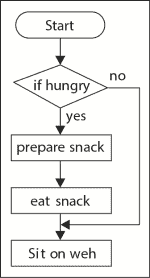

流程图

换句话说，我们希望在特定条件下不运行某些代码行。前面的图称为流程图。根据这个流程图，如果我们饿了，那么我们将准备三明治，吃掉它，然后去沙发上休息。如果我们不饿，那么没有必要做三明治，所以我们只需在沙发上休息。

我们在这本书中只会偶尔使用流程图，但在 UE4 中，你甚至可以使用流程图来编写你的游戏（使用称为蓝图的东西）。

### 注意

本书是关于 C++代码的，因此在这本书中，我们将始终将我们的流程图转换为实际的 C++代码。

# 控制程序的流程

最终，我们希望代码在特定条件下以某种方式分支。改变下一行代码执行顺序的代码命令被称为控制流语句。最基本的控制流语句是`if`语句。为了能够编写`if`语句，我们首先需要一种检查变量值的方法。

因此，首先，让我们介绍`==`符号，它用于检查变量的值。

## `==`运算符

为了在 C++中检查两个事物是否相等，我们需要使用不是一条而是两条连续的等号(`==`)，如下所示：

```cpp
int x = 5; // as you know, we use one equals sign 
int y = 4; // for assignment..
// but we need to use two equals signs 
// to check if variables are equal to each other
cout << "Is x equal to y? C++ says: " << (x == y) << endl;
```

如果你运行前面的代码，你会注意到输出如下：

```cpp
Is x equal to y? C++ says: 0 
```

在 C++中，1 表示真，0 表示假。如果你想用 true 或 false 代替 1 和 0，你可以在`cout`代码行的`boolalpha`流操作符中使用，如下所示：

```cpp
cout << "Is x equal to y? C++ says: " << boolalpha << 
        (x == y) << endl;
```

`==` 操作符是一种比较操作符。C++ 使用 `==` 来检查相等性而不是仅仅使用 `=` 的原因是因为我们已经在赋值操作符上使用了 `=` 符号了！（参见第二章中的*更多关于变量*部分，*变量和内存*)。如果我们使用单个 `=` 符号，C++ 会假设我们想要将 `x` 覆盖为 `y`，而不是比较它们。

## 编写 if 语句

现在我们已经掌握了双等号，让我们编写流程图。前面流程图代码如下：

```cpp
bool isHungry = true;  // can set this to false if not
                       // hungry!
if( isHungry == true ) // only go inside { when isHungry is true
{
  cout << "Preparing snack.." << endl;
  cout << "Eating .. " << endl;
}
cout << "Sitting on the couch.." << endl;
}
```

### 提示

这是我们第一次使用 `bool` 变量！一个 `bool` 变量要么持有 `true` 的值，要么持有 `false` 的值。

首先，我们从一个名为 `isHungry` 的 `bool` 变量开始，并将其设置为 `true`。

然后，我们使用 if 语句，如下所示：

```cpp
if( isHungry == true )
```

如果语句就像是对其下代码块的一个守护者。（记住，一个代码块是一组被 `{` 和 `}` 包围的代码。）

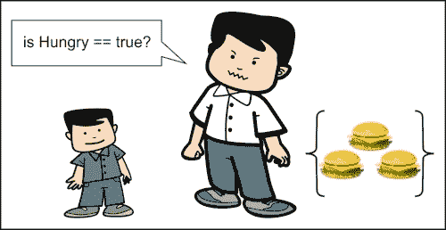

只有当 `isHungry == true` 时，你才能读取 `{` 和 `}` 之间的代码。

只有当 `isHungry == true` 时，你才能访问花括号内的代码。否则，你将无法访问，并被迫跳过整个代码块。

### 提示

我们可以通过简单地写下以下代码行来达到相同的效果：

```cpp
if( isHungry )     // only go here if isHungry is true
```

这可以用作以下内容的替代：

```cpp
if( isHungry == true )
```

人们可能使用 `if( isHungry )` 形式的原因是为了避免出错的可能性。不小心写成 `if( isHungry = true )` 将会在每次 `if` 语句被执行时将 `isHungry` 设置为 `true`！为了避免这种可能性，我们只需写 `if( isHungry )`。或者，有些人（明智的人）使用所谓的 Yoda 条件来检查 if 语句：`if( true == isHungry )`。我们这样写 if 语句的原因是，如果我们不小心写成 `if( true = isHungry )`，这将生成编译器错误，捕捉到这个错误。

尝试运行这段代码来理解我的意思：

```cpp
int x = 4, y = 5;
cout << "Is x equal to y? C++ says: " << (x = y) << endl; //bad!
// above line overwrote value in x with what was in y,
// since the above line contains the assignment x = y
// we should have used (x == y) instead.
cout << "x = " << x << ", y = " << y << endl;
```

下面的行显示了前面代码行的输出：

```cpp
Is x equal to y? C++ says: 5
x = 5, y = 5
```

包含 `(x = y)` 的代码行将 `x` 的前一个值（它是 4）覆盖为 `y` 的值（它是 5）。尽管我们试图检查 `x` 是否等于 `y`，但在前面的语句中发生的情况是 `x` 被赋值为 `y` 的值。

## 编写 else 语句

当 `isHungry == true` 时，我们使用 `else` 语句来让我们的代码在代码的 `if` 部分不运行的情况下执行某些操作。

例如，假设我们还有其他事情要做，假设我们不是很饿，如下面的代码片段所示：

```cpp
bool isHungry = true;
if( isHungry )      // notice == true is implied!
{
  cout << "Preparing snack.." << endl;
  cout << "Eating .. " << endl;
}
else                // we go here if isHungry is FALSE
{
  cout << "I'm not hungry" << endl;
}
```

```cpp
cout << "Sitting on the couch.." << endl;
}
```

关于 `else` 关键字，你需要记住以下几点重要事项：

+   `else` 语句必须始终紧随 `if` 语句之后。在 if 块的末尾和相应的 else 块之间不能有任何额外的代码行。

+   你永远不能同时进入 if 和相应的 else 块。总是只有一个。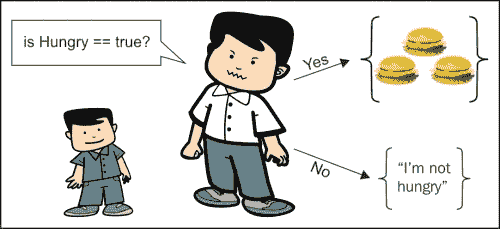

    当`isHungry`不等于 true 时，else 语句是你会采取的方式

你可以把`if`/`else`语句看作是一个守卫，将人们引向左边或右边。每个人要么走向食物（当`isHungry==true`时），要么远离食物（当`isHungry==false`时）。

## 使用其他比较运算符（`>`, `>=`, `<`, `<=`, 和 `!=`）测试不等式

其他逻辑比较也可以在 C++中轻松完成。`>`和`<`符号在数学中的含义就是它们所表示的。它们分别是大于（`>`）和小于（`<`）符号。`>=`的含义与数学中的`≥`符号相同。`<=`是 C++中`≤`的代码。由于键盘上没有`≤`符号，我们不得不在 C++中使用两个字符来表示它。`!=`是我们在 C++中表示“不等于”的方式。例如，如果我们有以下几行代码：

```cpp
int x = 9;
int y = 7;
```

我们可以像这里所示那样询问计算机`x > y`或`x < y`：

```cpp
cout << "Is x greater than y? " << (x > y) << endl;
cout << "Is x greater than OR EQUAL to y? " << (x >= y) << endl;
cout << "Is x less than y? " << (x < y) << endl;
cout << "Is x less than OR EQUAL to y? " << (x <= y) << endl;
cout << "Is x not equal to y? " << (x != y) << endl;
```

### 小贴士

我们需要在 x 和 y 的比较周围加上括号，这是因为有一个叫做运算符优先级的东西。如果我们没有括号，C++会在`<<`和`<`运算符之间感到困惑。这很奇怪，你稍后会更好地理解这一点，但你需要 C++在输出结果（`<<`）之前先评估`(x < y)`的比较。有一个优秀的表格可供参考，链接为[`en.cppreference.com/w/cpp/language/operator_precedence`](http://en.cppreference.com/w/cpp/language/operator_precedence)。

# 使用逻辑运算符

逻辑运算符允许你进行更复杂的检查，而不仅仅是检查简单的相等或不等。例如，要进入一个特殊房间，玩家需要同时拥有红色和绿色的钥匙卡。我们想要检查两个条件是否同时为真。为了进行这种复杂的逻辑语句检查，我们需要学习三个额外的结构：*not*（`!`）、*and*（`&&`）和*or*（`||`）运算符。

## 非（`!`）运算符

`!`运算符可以用来反转布尔变量的值。以下是一个示例代码：

```cpp
bool wearingSocks = true;
if( !wearingSocks ) // same as if( false == wearingSocks )
{
cout << "Get some socks on!" << endl;
}
else
{
	cout << "You already have socks" << endl;
}
```

这里的`if`语句检查你是否穿了袜子。然后，你会接到一个命令去拿一些袜子。`!`运算符将布尔变量中的值反转为其相反值。

我们使用所谓的真值表来显示对布尔变量使用`!`运算符的所有可能结果，如下所示：

| wearingSocks | !wearingSocks |
| --- | --- |
| true | false |
| false | true |

因此，当`wearingSocks`的值为 true 时，`!wearingSocks`的值为`false`，反之亦然。

### 练习

1.  当`wearingSocks`的值为 true 时，你认为`!!wearingSocks`的值会是什么？

1.  在以下代码运行后，`isVisible`的值是多少？

```cpp
bool hidden = true;
bool isVisible = !hidden;
```

### 解决方案

1.  如果`wearingSocks`为真，则`!wearingSocks`为假。因此，`!!wearingSocks`再次变为真。这就像说*我不饿*。双重否定是“不不”，所以这句话的意思是我实际上饿了。

1.  第二个问题的答案是假的。`hidden`为真，所以`!hidden`为假。假随后被保存到`isVisible`变量中。

### 小贴士

`!`运算符有时被俗称为感叹号。前面的双感叹号运算符(`!!`)是双重否定和双重逻辑反转。如果你对一个`bool`变量进行双感叹号操作，变量没有净变化。如果你对一个`int`变量进行双感叹号操作，它变成一个简单的`bool`变量（`true`或`false`）。如果`int`值大于零，它将简化为`true`。如果`int`值已经是 0，它将简化为`false`。

## 与（&&）运算符

假设我们只想在两个条件都为真时运行代码段。例如，如果我们穿着袜子并且穿着衣服，我们才算穿衣服。你可以使用以下代码来检查这一点：

```cpp
bool wearingSocks = true;
bool wearingClothes = false;
if( wearingSocks && wearingClothes )// && requires BOTH to be true
{
	cout << "You are dressed!" << endl;
}
else
{
	cout << "You are not dressed yet" << endl;
}
```

## 或（||）运算符

我们有时希望如果任何一个变量为`true`，就运行代码段。

例如，如果玩家在关卡中找到特殊星星或完成关卡的时间少于 60 秒，他将获得一定的奖励，在这种情况下，你可以使用以下代码：

```cpp
bool foundStar = true;
float levelCompleteTime = 25.f;
float maxTimeForBonus = 60.f;
// || requires EITHER to be true to get in the { below
if( foundStar || levelCompleteTime < maxTimeForBonus )
{
	cout << "Bonus awarded!" << endl;
}
else
{
	cout << "No bonus." << endl;
}
```

# 我们第一个虚幻引擎的示例

我们需要开始使用虚幻引擎。

### 小贴士

一个警告：当你打开你的第一个虚幻项目时，你会发现代码看起来非常复杂。不要气馁。只需关注突出显示的部分。在你作为程序员的整个职业生涯中，你将经常不得不处理包含你不懂的部分的非常大的代码库。然而，关注你理解的部分将使这部分工作变得富有成效。

打开**虚幻引擎启动器**应用程序（具有蓝色 UE4 图标 ）。选择**启动虚幻引擎 4.4.3**，如下截图所示：

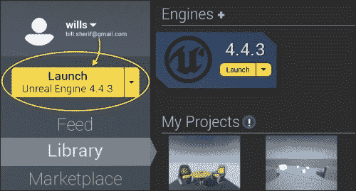

### 小贴士

如果**启动**按钮变灰，你需要转到**库**选项卡并下载一个引擎（约 3 GB）。

一旦启动引擎（可能需要几秒钟），你将进入**虚幻项目浏览器**屏幕（黑色 UE4 图标 ），如下截图所示。

现在，在 UE4 项目浏览器中选择**新建项目**选项卡。向下滚动，直到到达**代码拼图**。这是几个较简单的项目之一，代码不多，所以是一个好的开始。我们稍后会进入 3D 项目。

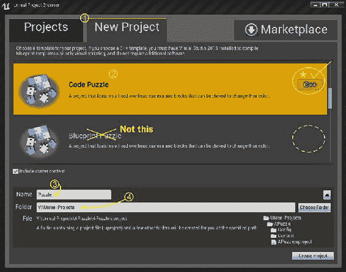

在这个屏幕上，这里有几点需要注意：

+   确保你处于**新建项目**选项卡

+   当你点击**代码拼图**时，确保它右边有**C++**图标，而不是**蓝图拼图**

+   在**名称**框中输入你的项目名称，`Puzzle`（这对于我稍后提供的示例代码非常重要）

+   如果你想要更改存储文件夹（到不同的驱动器），点击下箭头，以便文件夹出现。然后，命名你想要存储项目的目录。

完成所有这些后，选择**创建项目**。

Visual Studio 2013 将打开你的项目代码。

按*Ctrl*+*F5*构建并启动项目。

一旦项目编译并运行，你应该会看到如以下截图所示的虚幻引擎编辑器：

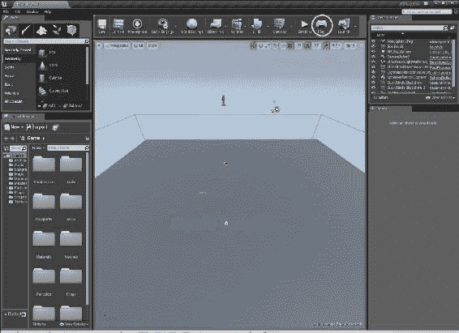

看起来很复杂吗？哦，确实如此！我们稍后会在侧边的工具栏中探索一些功能。现在，只需选择**播放**（如前一张截图所示，标记为黄色）。

这将启动游戏。它应该看起来像这样：

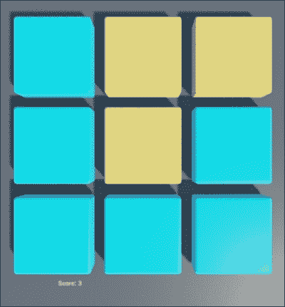

现在，尝试点击这些方块。一旦点击一个方块，它就会变成橙色，这会增加你的分数。

我们将要找到执行此操作的代码段，并稍作修改其行为。

查找并打开`PuzzleBlock.cpp`文件。

### 提示

在 Visual Studio 中，项目中的文件列表位于**解决方案资源管理器**内。如果你的**解决方案资源管理器**被隐藏，只需从顶部菜单点击**视图**/**解决方案资源管理器**。

在此文件中，向下滚动到底部，你会找到一个以以下词开始的代码段：

```cpp
void APuzzleBlock::BlockClicked(UPrimitiveComponent* ClickedComp)
```

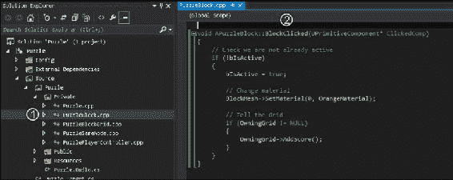

`APuzzleBlock`是类名，`BlockClicked`是函数名。每当拼图块被点击时，从起始{到结束}的代码段就会运行。希望这会在稍后变得更加清晰。

它有点像`if`语句。如果一个拼图块被点击，那么这个代码块就会为该拼图块运行。

我们将逐步讲解如何使方块在被点击时改变颜色（因此，第二次点击会将方块的颜色从橙色变回蓝色）。

以下步骤请务必小心操作：

1.  打开`PuzzleBlock.h`文件。在行 25（包含以下代码）之后：

    ```cpp
    /** Pointer to orange material used on active blocks */
    UPROPERTY()
    class UMaterialInstance* OrangeMaterial;
    ```

    在前面的代码行之后插入以下代码：

    ```cpp
    UPROPERTY()
    class UMaterialInstance* BlueMaterial;
    ```

1.  现在，打开`PuzzleBlock.cpp`文件。在行 40（包含以下代码）之后：

    ```cpp
    // Save a pointer to the orange material
    OrangeMaterial = ConstructorStatics.OrangeMaterial.Get();
    ```

    在前面的代码行之后插入以下代码：

    ```cpp
    BlueMaterial = ConstructorStatics.BlueMaterial.Get();
    ```

1.  最后，在`PuzzleBlock.cpp`中，将`void APuzzleBlock::BlockClicked`代码段的内容（第 44 行）替换为以下代码：

    ```cpp
    void APuzzleBlock::BlockClicked(UPrimitiveComponent* ClickedComp)
    {
      // --REPLACE FROM HERE--
      bIsActive = !bIsActive; // flip the value of bIsActive
      // (if it was true, it becomes false, or vice versa)
      if ( bIsActive )
      {
        BlockMesh->SetMaterial(0, OrangeMaterial);
      }
      else
      {
        BlockMesh->SetMaterial(0, BlueMaterial);
      }
      // Tell the Grid
      if(OwningGrid != NULL)
      {
        OwningGrid->AddScore();
      }
      // --TO HERE--
    }
    ```

### 提示

只需在`void APuzzleBlock::BlockClicked (UPrimitiveComponent* ClickedComp)`语句内部替换。

不要替换以`void APuzzleBlock::BlockClicked`开头的行。如果你没有将项目命名为 Puzzle，可能会出现错误（警告过你了）。

那么，让我们分析一下。这是第一行代码：

```cpp
bIsActive = !bIsActive; // flip the value of bIsActive
```

这行代码只是翻转了 `bIsActive` 的值。`bIsActive` 是一个 `bool` 变量（它在 `APuzzleBlock.h` 中创建）。如果 `bIsActive` 为真，则 `!bIsActive` 将为假。所以，每当执行此行代码时（这发生在点击任何块上），`bIsActive` 的值就会反转（从 `true` 到 `false` 或从 `false` 到 `true`）。

让我们考虑下一块代码：

```cpp
if ( bIsActive )
  {
    BlockMesh->SetMaterial(0, OrangeMaterial);
  }
  else
  {
    BlockMesh->SetMaterial(0, BlueMaterial);
  }
```

我们只是改变了块的颜色。如果 `bIsActive` 为真，则块变为橙色。否则，块变为蓝色。

## 练习

到现在为止，你应该注意到，提高编程技能的最佳方式就是实际编程。你必须大量练习编程，才能显著提高编程技能。

创建两个整数变量，称为 x 和 y，并从用户那里读取它们。编写一个 `if`/`else` 语句对，打印较大值的变量名。

## 解答

前面练习的解答如下所示：

```cpp
int x, y;
cout << "Enter two numbers integers, separated by a space " << endl;
cin >> x >> y;
if( x < y ) 
{
  cout << "x is less than y" << endl;
}
else
{
  cout << "x is greater than y" << endl;
}
```

### 小贴士

当 `cin` 期望一个数字时，不要输入字母。如果发生这种情况，`cin` 可能会失败，并给变量一个错误值。

## 多于两种方式的分支代码

在前面的章节中，我们只能使代码以两种方式之一分支。在模拟代码中，我们有以下代码：

```cpp
if( some condition is true )
{
  execute this;
}
else // otherwise
{
  execute that;
}
```

### 小贴士

模拟代码是 *假代码*。编写模拟代码是头脑风暴和规划代码的绝佳方式，尤其是如果你还不习惯 C++。

这段代码有点像一条道路上的比喻性分叉，只有两个方向可以选择。

有时候，我们可能想要代码分支超过两个方向。我们可能希望代码以三种方式分支，甚至更多。例如，假设代码的走向取决于玩家当前持有的物品。玩家可以持有三种不同的物品之一：硬币、钥匙或沙币。C++ 允许这样做！实际上，在 C++ 中，你可以按需以任意数量的方向分支。

## `else if` 语句

`else if` 语句是一种在超过两个可能的分支方向上进行编码的方式。在以下代码示例中，代码将根据玩家是否持有 `Coin`、`Key` 或 `Sanddollar` 对象而以三种不同的方式之一执行。

```cpp
#include <iostream>
using namespace std;
int main()
{
  enum Item  // enums define a new type of variable!
  {
    Coin, Key, Sanddollar // variables of type Item can have 
    // any one of these 3 values
  }
  Item itemInHand = Key;  // Try changing this value to Coin, 
                          // Sanddollar
  if( itemInHand == Key )
  {
    cout << "The key has a lionshead on the handle." << endl;
    cout << "You got into a secret room using the Key!" << endl;
  }
  else if( itemInHand == Coin )
  {
    cout << "The coin is a rusted brassy color. It has a picture  of a lady with a skirt." << endl;
    cout << "Using this coin you could buy a few things" << endl;
  }
  else if( itemInHand == Sanddollar )
  {
    cout << "The sanddollar has a little star on it." << endl;
    cout << "You might be able to trade it for something." <<  endl;
  }
  return 0; 
}
```

### 注意

注意，前面的代码只会在三种不同的方式中的一种。在 `if`、`else if` 和 `else if` 系列检查中，我们只会进入一个代码块。

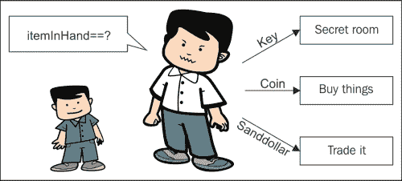

### 练习

使用 C++ 程序回答以下问题。务必尝试这些练习，以便熟练掌握这些相等运算符。

```cpp
#include <iostream>
using namespace std;
int main()
{
  int x;
  int y;
  cout << "Enter an integer value for x:" << endl;
  cin >> x; // This will read in a value from the console
  // The read in value will be stored in the integer 
  // variable x, so the typed value better be an integer!
  cout << "Enter an integer value for y:" << endl;
  cin >> y;
  cout << "x = " << x << ", y = " << y << endl;
  // *** Write new lines of code here
}
```

在指出 (`// *** Write new...`) 的位置编写一些新的代码行：

1.  检查 `x` 和 `y` 是否相等。如果它们相等，打印 `x and y are equal`。否则，打印 `x and y are not equal`。

1.  一个关于不等式的练习：检查 `x` 是否大于 `y`。如果是，打印 `x is greater than y`。否则，打印 `y is greater than x`。

### 解答

要评估相等性，请插入以下代码：

```cpp
if( x == y )
{
  cout << "x and y are equal" << endl;
}
else
{
  cout << "x and y are not equal" << endl;
}
```

要检查哪个值更大，请插入以下代码：

```cpp
if( x > y )
{
  cout << "x is greater than y" << endl;
}
else if( x < y )
{
  cout << "y is greater than x" << endl;
}
else // in this case neither x > y nor y > x
{
  cout << "x and y are equal" << endl;
}
```

## `switch` 语句

`switch` 语句允许你的代码以多种方式分支。`switch` 语句将要执行的操作是查看变量的值，并根据其值，代码将走向不同的方向。

我们还将在这里介绍 `enum` 构造：

```cpp
#include <iostream>
using namespace std;
enum Food  // enums define a new type of variable!
{
  // a variable of type Food can have any of these values
  Fish,
  Bread,
  Apple,
  Orange
};
int main()
{
  Food food = Bread; // Change the food here
  switch( food )
  {
    case Fish:
      cout << "Here fishy fishy fishy" << endl;
      break;
    case Bread:
      cout << "Chomp! Delicious bread!" << endl;
      break;
    case Apple:
      cout << "Mm fruits are good for you" << endl;
      break;
    case Orange:
      cout << "Orange you glad I didn't say banana" << endl;
      break;
    default:  // This is where you go in case none
              // of the cases above caught
      cout << "Invalid food" << endl;
      break;
  }
  return 0;
}
```

`switch` 就像硬币分类器。当你投入 25 美分的硬币时，它会找到其所属的 25 美分堆。同样，`switch` 语句将简单地允许代码跳转到适当的部分。以下图表展示了分类硬币的示例：

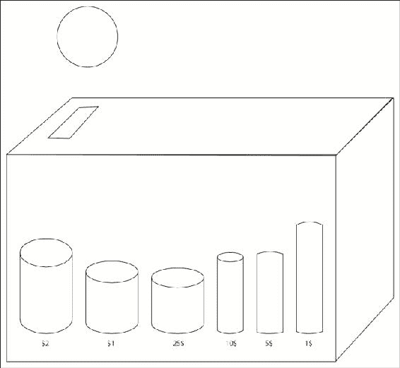

`switch` 语句内部的代码将继续运行（逐行），直到遇到 `break;` 语句。`break` 语句会跳出 `switch` 语句。请查看以下图表以了解 `switch` 的工作原理：

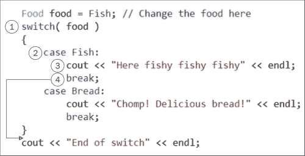

1.  首先，检查 `Food` 变量。它有什么值？在这种情况下，它包含 `Fish`。

1.  `switch` 命令会跳转到正确的案例标签。（如果没有匹配的案例标签，`switch` 将会被跳过）。

1.  执行了 `cout` 语句，控制台上出现了`Here fishy fishy fishy`。

1.  在检查变量并打印用户响应后，执行了 `break` 语句。这使得我们停止在 `switch` 中运行代码行，并退出 `switch`。接下来运行的代码行只是如果没有 `switch` 的话，程序中原本应该运行的下一行代码（在 `switch` 语句的闭合花括号之后）。这是底部的打印语句，它说“switch 结束”。

### `switch` 与 `if` 的比较

`switch` 与 `if` / `else if` / `else` 链的比较。然而，`switch` 可以比 `if` / `else if` / `else if` / `else` 链更快地生成代码。直观地说，`switch` 只会跳转到代码的适当部分以执行。`if` / `else if` / `else` 链可能涉及更复杂的比较（包括逻辑比较），这可能会占用更多的 CPU 时间。你将使用 `if` 语句的主要原因是在括号内进行更多自定义的比较。

### 小贴士

枚举实际上是一个整型。为了验证这一点，请打印以下代码：

```cpp
cout <<  "Fish=" << Fish << 
         " Bread=" << Bread << 
         " Apple=" << Apple << 
         " Orange=" << Orange << endl;
```

你将看到枚举的整数值——仅此而已。

有时，程序员想要在同一个 `switch` `case` 标签下分组多个值。比如说，我们有一个如下所示的 `enum` 对象：

```cpp
enum Vegetables { Potato, Cabbage, Broccoli, Zucchini };
```

一个程序员想要将所有绿色蔬菜放在一起，因此他编写了以下 `switch` 语句：

```cpp
switch( veg )
{
case Zucchini:	// zucchini falls through because no break
case Broccoli:	// was written here
  cout << "Greens!" << endl;
  break;
default:
  cout << "Not greens!" << endl;
  break;
}
```

在这种情况下，`Zucchini` 会穿透并执行与 `Broccoli` 相同的代码。非绿色蔬菜在 `default` 案例标签中。为了防止穿透，你必须记得在每个 `case` 标签后插入显式的 `break` 语句。

我们可以通过在`switch`中显式使用关键字`break`来编写一个不允许西葫芦掉过的相同`switch`版本：

```cpp
switch( veg )
{
case Zucchini:	// zucchini no longer falls due to break
  cout << "Zucchini is a green" << endl;
  break;// stops case zucchini from falling through
case Broccoli:	// was written here
  cout << "Broccoli is a green" << endl;
  break;
default:
  cout << "Not greens!" << endl;
  break;
}
```

注意，良好的编程实践是即使它是列出的最后一个`case`，也应该`break`掉`default`情况。

### 练习

完成以下程序，该程序有一个`enum`对象，其中包含一系列可供选择骑乘的坐骑。编写一个`switch`语句，为选定的坐骑打印以下消息：

| 马匹 | 骑手英勇而强大 |
| --- | --- |
| 骆马 | 这匹骆马又白又美丽 |
| 骆驼 | 你被分配了一匹骆驼来骑。你对此感到不满。 |
| 羊群 | 咩！羊群几乎承受不住你的重量。 |
| 马儿 | 马儿！ |

记住，`enum`对象实际上是一个`int`声明。`enum`对象中的第一个条目默认为 0，但你可以使用`=`运算符给`enum`对象赋予任何你想要的起始值。`enum`对象中的后续值是按顺序排列的`int`。

### 小贴士

**位移后的枚举**

在`enum`对象中，一个常见的做法是为每个条目分配一个位移后的值：

```cpp
enum WindowProperties
{
  Bordered    = 1 << 0, // binary 001
  Transparent = 1 << 1, // binary 010
  Modal       = 1 << 2  // binary 100
};
```

位移后的值应该能够组合窗口属性。这是赋值将如何看起来：

```cpp
// bitwise OR combines properties
WindowProperties wp = Bordered | Modal;
```

检查哪些`WindowProperties`已被设置涉及到使用`位与`的检查：

```cpp
// bitwise AND checks to see if wp is Modal
if( wp & Modal )
{
cout << "You are looking at a modal window" << endl;
}
```

位运算是一种稍微超出本文范围的技术，但我包括这个提示只是为了让你知道。

### 解决方案

前一个练习的解决方案如下所示：

```cpp
#include <iostream>
using namespace std;
enum Mount
{
  Horse=1, Mare, Mule, Sheep, Chocobo
  // Since Horse=1, Mare=2, Mule=3, Sheep=4, and Chocobo=5.
};
int main()
{
  int mount;  // We'll use an int variable for mount
              // so cin works
  cout << "Choose your mount:" << endl;
  cout << Horse << " Horse" << endl;
  cout << Mare << " Mare" << endl;
  cout << Mule << " Mule" << endl;
  cout << Sheep << " Sheep" << endl;
  cout << Chocobo << " Chocobo" << endl;
  cout << "Enter a number from 1 to 5 to choose a mount" << endl;
  cin >> mount;
    // Write your switch here. Describe what happens
    // when you mount each animal in the switch below
  switch( mount )
  {
    default:
      cout << "Invalid mount" << endl;
      break;
  }
return 0;
}
```

# 概述

在本章中，你学习了如何分支代码。分支使得代码能够走向不同的方向，而不是直接向下执行。

在下一章中，我们将继续介绍另一种类型的控制流语句，这将允许你返回并重复一行代码一定次数。重复的代码段将被称为循环。
