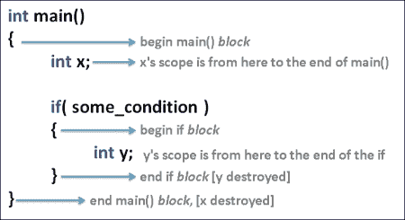
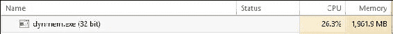
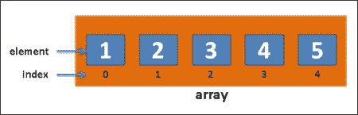
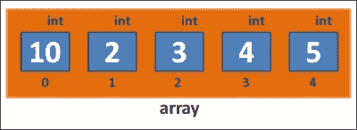

# 第七章。动态内存分配

在上一章中，我们讨论了类定义以及如何设计自己的自定义类。我们讨论了通过设计自己的自定义类，我们可以构建代表游戏或程序中实体的变量。

在本章中，我们将讨论动态内存分配以及如何在内存中为对象组创建空间。

假设我们有一个简化的 `class Player` 版本，如之前所述，只有一个构造函数和一个析构函数：

```cpp
class Player
{
  string name;
  int hp;
public:
  Player(){ cout << "Player born" << endl; }
  ~Player(){ cout << "Player died" << endl; }
};
```

我们之前讨论过 C++ 中变量的 *作用域*；为了回顾，变量的作用域是该变量可以被使用的程序部分。变量的作用域通常在其声明的代码块内部。代码块只是任何位于 { 和 } 之间的代码部分。以下是一个示例程序，说明了变量作用域：



在这个示例程序中，x 变量的作用域贯穿整个 `main()` 函数。y 变量的作用域仅限于 if 块内部

我们之前提到，通常变量在超出作用域时被销毁。让我们通过 `class Player` 的实例来测试这个想法：

```cpp
int main()
{
  Player player; // "Player born"
}                // "Player died" - player object destroyed here
```

该程序的输出如下：

```cpp
Player born
Player died
```

玩家对象的析构函数在玩家对象的作用域结束时被调用。由于变量的作用域是在定义它的三行代码中的代码块，因此 `Player` 对象将在 `main()` 函数结束时立即被销毁，当它超出作用域时。

# 动态内存分配

现在，让我们尝试动态分配一个 `Player` 对象。这是什么意思？

我们使用 `new` 关键字来分配它！

```cpp
int main()
{
  // "dynamic allocation" – using keyword new!
  // this style of allocation means that the player object will
  // NOT be deleted automatically at the end of the block where
  // it was declared!
Player *player = new Player();
} // NO automatic deletion!
```

该程序的输出如下：

```cpp
Player born
```

玩家没有死！我们如何杀死玩家？我们必须显式地调用 `delete` 在 `player` 指针上。

## 删除关键字

`delete` 操作符会调用正在删除的对象的析构函数，如下面的代码所示：

```cpp
int main()
{
  // "dynamic allocation" – using keyword new!
  Player *player = new Player();
  delete player; // deletion invokes dtor
}
```

该程序的输出如下：

```cpp
Player born
Player died
```

因此，只有“正常”（或“自动”，也称为非指针类型）的变量类型在它们声明的代码块结束时被销毁。指针类型（使用 `*` 和 `new` 声明的变量）即使在超出作用域时也不会自动销毁。

这有什么用？动态分配允许你控制对象的创建和销毁时间。这将在以后派上用场。

## 内存泄漏

因此，使用 `new` 创建的动态分配的对象不会自动删除，除非你明确地调用 `delete`。这里有一个风险！这被称为 *内存泄漏*。当使用 `new` 分配的对象从未被删除时，就会发生内存泄漏。可能发生的情况是，如果你的程序中有许多对象使用 `new` 分配，然后你停止使用它们，由于内存泄漏，你的计算机最终会耗尽内存。

下面是一个荒谬的示例程序来说明这个问题：

```cpp
#include <iostream>
#include <string>
using namespace std;
class Player
{
  string name;
  int hp;
public:
  Player(){ cout << "Player born" << endl; }
  ~Player(){ cout << "Player died" << endl; }
};

int main()
{
  while( true ) // keep going forever,
  {
    // alloc..
    Player *player = new Player();
    // without delete == Memory Leak!
  }
}
```

如果这个程序运行足够长的时间，最终会消耗掉计算机的内存，如下面的截图所示：



用于 `Player` 对象的 2 GB RAM！

注意，没有人打算编写包含这种类型问题的程序！内存泄漏问题意外发生。你必须注意你的内存分配，并删除不再使用的对象。

# 常规数组

C++ 中的数组可以声明如下：

```cpp
#include <iostream>
using namespace std;
int main()
{
  int array[ 5 ];  // declare an "array" of 5 integers
                   // fill slots 0-4 with values
array[ 0 ] = 1;
array[ 1 ] = 2;
array[ 2 ] = 3;
array[ 3 ] = 4;
array[ 4 ] = 5;
  // print out the contents
  for( int index = 0; index < 5; index++ )
    cout << array[ index ] << endl;
}
```

在内存中，它看起来可能像这样：



即，在 `array` 变量中有五个槽位或元素。每个槽位中都有一个常规的 `int` 变量。

## 数组语法

那么，你是如何访问数组中的一个 `int` 值的呢？要访问数组的单个元素，我们使用方括号，如下面的代码行所示：

```cpp
array[ 0 ] = 10;
```

上述代码行会将数组槽位 0 的元素更改为 10：



通常，要访问数组的特定槽位，你会写下以下内容：

```cpp
array[ slotNumber ] = value to put into array;
```

请记住，数组槽位始终从 0 开始索引。要进入数组的第一个槽位，使用 `array[0]`。数组的第二个槽位是 `array[1]`（不是 `array[2]`）。上面数组的最后一个槽位是 `array[4]`（不是 `array[5]`）。`array[5]` 的数据类型超出了数组的范围！（前面图中没有索引为 5 的槽位。最高的索引是 4。）

不要超出数组的范围！有时它可能起作用，但有时你的程序会因为**内存访问违规**（访问不属于你的程序的内存）而崩溃。一般来说，访问不属于你的程序的内存会导致你的应用程序崩溃，而且如果它没有立即这样做，你的程序中会有一个隐藏的漏洞，它只会偶尔引起问题。你总是在索引数组时必须小心。

数组是 C++ 内置的，也就是说，你不需要包含任何特殊的东西就可以立即使用数组。你可以有任何类型的数据的数组，例如，`int`、`double`、`string`，甚至你自己的自定义对象类型（`Player`）。

## 练习

1.  创建一个包含五个字符串的数组，并在其中放入一些名字（可以是虚构的或随机的，这无关紧要）。

1.  创建一个名为 `temps` 的双精度浮点数数组，包含三个元素，并将过去三天内的温度存储在其中。

## 解答

1.  以下是一个包含五个字符串数组的示例程序：

    ```cpp
    #include <iostream>
    #include <string>
    using namespace std;
    int main()
    {
      string array[ 5 ];  // declare an "array" of 5 strings
                          // fill slots 0-4 with values
    array[ 0 ] = "Mariam McGonical";
    array[ 1 ] = "Wesley Snice";
    array[ 2 ] = "Kate Winslett";
    array[ 3 ] = "Erika Badu";
    array[ 4 ] = "Mohammad";
      // print out the contents
      for( int index = 0; index < 5; index++ )
        cout << array[ index ] << endl;
    }
    ```

1.  以下只是一个数组：

    ```cpp
    double temps[ 3 ];
    // fill slots 0-2 with values
    temps[ 0 ] = 0;
    temps[ 1 ] = 4.5;
    temps[ 2 ] = 11;
    ```

# C++ 风格的动态大小数组（new[] 和 delete[]）

你可能已经想到，我们并不总是在程序开始时就知道数组的大小。我们需要动态地分配数组的大小。

然而，如果你尝试过，你可能已经注意到这并不起作用！

让我们尝试使用 `cin` 命令从用户那里获取数组大小。让我们询问用户他想要多大的数组，并尝试为他创建一个该大小的数组：

```cpp
#include <iostream>
using namespace std;
int main()
{
  cout << "How big?" << endl;
  int size;       // try and use a variable for size..
  cin >> size;    // get size from user
  int array[ size ];  // get error: "unknown size"
}
```

我们得到以下错误：

```cpp
error C2133: 'array' : unknown size
```

问题在于编译器想要分配数组的大小。然而，除非变量的大小被标记为 `const`，否则编译器在编译时无法确定其值。C++ 编译器无法在编译时确定数组的大小，因此会生成编译时错误。

为了解决这个问题，我们必须动态分配数组（在“堆”上）：

```cpp
#include <iostream>
using namespace std;
int main()
{
  cout << "How big?" << endl;
  int size;       // try and use a variable for size..
  cin >> size;
  int *array = new int[ size ];  // this works
  // fill the array and print
for( int index = 0; index < size; index++ )
{
  array[ index ] = index * 2;
  cout << array[ index ] << endl;
}
delete[] array; // must call delete[] on array allocated with 
                // new[]!
}
```

因此，这里的教训如下：

+   为了动态分配某种类型（例如，`int`）的数组，你必须使用 `new int[numberOfElementsInArray]`。

+   使用 `new[]` 分配的数组必须在之后使用 `delete[]` 删除，否则您将得到内存泄漏！（这是 `delete[]` 带有方括号的！不是常规的 `delete`）。

# 动态 C 风格数组

C 风格数组是一个遗留话题，但它们仍然值得讨论，因为尽管它们很旧，您有时仍然可能会看到它们被使用。

我们声明 C 风格数组的做法如下：

```cpp
#include <iostream>
using namespace std;
int main()
{
  cout << "How big?" << endl;
  int size;       // try and use a variable for size..
  cin >> size;
  // the next line will look weird..
  int *array = (int*)malloc( size*sizeof(int) ); // C-style
  // fill the array and print
for( int index = 0; index < size; index++ )
  {
    array[ index ] = index * 2;
    cout << array[ index ] << endl;
  }
free( array ); // must call free() on array allocated with 
               // malloc() (not delete[]!)
}
```

这里突出显示了差异。

使用 `malloc()` 函数创建 C 风格数组。malloc 一词代表“内存分配”。此函数要求您传入数组的字节数以创建，而不仅仅是您想在数组中包含的元素数量。因此，我们将请求的元素数量（大小）乘以数组内类型的 `sizeof`。以下表格列出了几种典型 C++ 类型在字节数上的大小：

| C++ 原始类型 | sizeof (字节大小) |
| --- | --- |
| `int` | 4 |
| `float` | 4 |
| `double` | 8 |
| `long long` | 8 |

使用 `malloc()` 函数分配的内存必须在之后使用 `free()` 释放。

# 摘要

本章向您介绍了 C 和 C++ 风格的数组。在大多数 UE4 代码中，您将使用 UE4 编辑器内置的集合类 (`TArray<T>`)。然而，为了成为一名优秀的 C++ 程序员，您需要熟悉基本的 C 和 C++ 风格数组。
