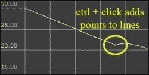
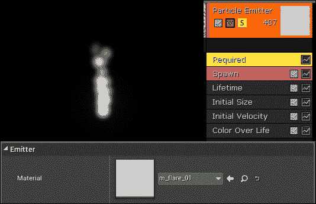

# 第十二章 咒语书

玩家目前还没有防御自己的手段。我们将为玩家配备一种非常实用且有趣的方法，即所谓的魔法咒语。玩家将使用魔法咒语来影响附近的怪物。

实际上，咒语将是粒子系统与表示作用范围的边界体积的组合。在每一帧中，都会检查包含在边界体积内的演员。当一个演员位于咒语的边界体积内时，该演员将受到该咒语的影响。

下面的截图显示了暴风咒和力场咒，它们的边界体积用橙色突出显示：


暴风咒的视觉效果可以在右侧看到，有一个长方形的边界体积。推动怪物远离的力场咒的视觉效果，具有球形的边界体积，如图所示：


在每一帧中，都会检查包含在边界体积内的演员。任何在咒语边界体积内的演员在这一帧内都将受到该咒语的影响。如果演员移动到咒语边界体积之外，该演员将不再受到该咒语的影响。记住，咒语的粒子系统仅用于可视化；粒子本身不会影响游戏演员。《第八章》（part0056_split_000.html#1LCVG1-dd4a3f777fc247568443d5ffb917736d "第八章。演员和代理"）中我们创建的`PickupItem`类，*演员和代理*可以用来允许玩家捡起代表咒语的物品。我们将扩展`PickupItem`类，并将咒语的蓝图附加到每个`PickupItem`上。点击 HUD 上的咒语小部件将施展它。界面看起来可能像这样：


玩家捡到的物品，包括四种不同的咒语

我们将首先描述如何创建我们自己的粒子系统。然后，我们将继续将粒子发射器封装成一个`Spell`类，并为角色编写一个`CastSpell()`函数，以便角色能够真正地施展咒语。

# 粒子系统

首先，我们需要一个地方来放置所有我们的华丽效果。在你的**内容浏览器**标签页中，右键单击**游戏**根目录，创建一个名为**ParticleSystems**的新文件夹。右键单击该新文件夹，然后选择**新建资产** | **粒子系统**，如图所示：


### 小贴士

查看这个虚幻引擎 4 粒子系统指南，了解虚幻粒子发射器的工作原理：[`www.youtube.com/watch?v=OXK2Xbd7D9w&index=1&list=PLZlv_N0_O1gYDLyB3LVfjYIcbBe8NqR8t`](https://www.youtube.com/watch?v=OXK2Xbd7D9w&index=1&list=PLZlv_N0_O1gYDLyB3LVfjYIcbBe8NqR8t)。

双击出现的**NewParticleSystem**图标，如图所示：


你将进入级联，粒子编辑器。以下截图显示了环境的描述：


这里有几个不同的面板，每个面板都显示不同的信息。它们如下所示：

+   在左上角是**视口**面板。这显示了当前发射器的动画，正如它当前正在工作一样。

+   在右侧是**发射器**面板。在其内部，你可以看到一个名为**粒子发射器**的单个对象（你可以在你的粒子系统中拥有多个发射器，但现在我们不想那样做）。**粒子发射器**的模块列表出现在其下方。从前面的截图，我们有**必需的**、**生成**、**生命周期**、**初始大小**、**初始速度**和**颜色随生命周期变化**模块。

## 更改粒子属性

默认的粒子发射器发射类似十字准线的形状。我们想将其更改为更有趣的东西。点击**发射器**面板下的黄色**必需**框，然后在**详细信息**面板的**材质**下输入`particles`。将弹出一个包含所有可用粒子材质的列表。选择**m_flare_01**选项来创建我们的第一个粒子系统，如下面的截图所示：


现在，让我们改变粒子系统的行为。点击**发射器**面板下的**颜色随生命周期变化**条目。底部的**详细信息**面板显示了不同参数的信息，如下面的截图所示：


在**颜色随生命周期变化**条目的**详细信息**面板中，我增加了**X**，但没有增加**Y**和没有增加**Z**。这给粒子系统带来了一种红色光泽。（**X**是红色，**Y**是绿色，**Z**是蓝色）。

然而，你实际上可以通过更直观的方式来更改粒子颜色。如果你点击**颜色随生命周期变化**条目旁边的绿色波形按钮，你将看到**颜色随生命周期变化**的图表在**曲线编辑器**选项卡中显示，如下面的截图所示：


我们现在可以更改**颜色随生命周期变化**参数。**曲线编辑器**选项卡中的图表显示了发射颜色与粒子存活时间的对比。你可以通过拖动点来调整值。按下*Ctrl* + 左键鼠标按钮向线条添加一个新点：



Ctrl + 点击为线条添加点。

你可以玩弄粒子发射器的设置来创建你自己的法术可视化。

## 雪崩法术的设置

在这一点上，我们应该将我们的粒子系统重命名为**NewParticle System**，改为更具描述性的名称。让我们将其重命名为**P_Blizzard**。你可以通过简单地点击它并按下*F2*来重命名你的粒子系统。


在内容浏览器中的对象上按下 *F2* 来重命名它


我们将调整一些设置以获得暴风雪粒子效果法术。执行以下步骤：

1.  在**发射器**标签页下，点击**必需**框。在**详细信息**面板中，将**发射器**材质更改为**m_flare_01**，如下所示：

1.  在**生成**模块下，将生成速率更改为 200。这将增加可视化的密度，如下所示：

1.  在**生命周期**模块下，将**最大**属性从 1.0 增加到 2.0。这会给粒子存活时间的长度带来一些变化，其中一些发射的粒子比其他粒子存活时间更长。

1.  在**初始大小**模块下，将**最小**属性大小在**X**、**Y**和**Z**方向上更改为 12.5：

1.  在**初始速度**模块下，将**最小**/**最大**值更改为显示的值：

1.  我们让暴风雪向+X 方向吹的原因是因为玩家的前方方向最初在+X。由于法术将从玩家的手中发出，我们希望法术指向与玩家相同的方向。

1.  在**颜色随生命周期变化**菜单下，将蓝色（**Z**）值更改为 100.0。您将看到立即变为蓝色光芒的变化：

    现在它开始看起来像魔法一样了！

1.  右键单击**颜色随生命周期变化**模块下方的深色区域。选择**位置** | **初始位置**：

1.  按照以下所示在**起始位置** | **分布**下输入值：

1.  您应该得到一个看起来像这样的暴风雪：

1.  将摄像机移动到您喜欢的位置，然后在顶部菜单栏中点击**缩略图**选项。这将在**内容浏览器**标签页中为您粒子系统生成一个缩略图图标。

    在顶部菜单栏中点击缩略图将生成您粒子系统的迷你图标

# `Spell`类演员

`Spell`类最终会对所有怪物造成伤害。为此，我们需要在`Spell`类演员内部包含一个粒子系统和边界框。当化身施放`Spell`类时，`Spell`对象将被实例化到关卡中并开始`Tick()`功能。在`Spell`对象的每个`Tick()`上，任何位于法术边界体积内的怪物都将受到该`Spell`的影响。

`Spell`类应该看起来像以下代码：

```cpp
UCLASS()
class GOLDENEGG_API ASpell : public AActor
{
  GENERATED_UCLASS_BODY()

  // box defining volume of damage
  UPROPERTY(VisibleDefaultsOnly, BlueprintReadOnly, Category =  Spell)
  TSubobjectPtr<UBoxComponent> ProxBox;

  // the particle visualization of the spell
  UPROPERTY(VisibleDefaultsOnly, BlueprintReadOnly, Category =  Spell)
  TSubobjectPtr<UParticleSystemComponent> Particles;

  // How much damage the spell does per second
  UPROPERTY(EditAnywhere, BlueprintReadWrite, Category = Spell)
  float DamagePerSecond;

  // How long the spell lasts
  UPROPERTY(EditAnywhere, BlueprintReadWrite, Category = Spell)
  float Duration;

  // Length of time the spell has been alive in the level
  float TimeAlive;

  // The original caster of the spell (so player doesn't
  // hit self)
  AActor* Caster;

  // Parents this spell to a caster actor
  void SetCaster( AActor* caster );

  // Runs each frame. override the Tick function to deal damage 
  // to anything in ProxBox each frame.
  virtual void Tick( float DeltaSeconds ) override;
};
```

我们只需要关注实现三个函数，即`ASpell::ASpell()`构造函数、`ASpell::SetCaster()`函数和`ASpell::Tick()`函数。

打开 `Spell.cpp` 文件。添加一行以包含 `Monster.h` 文件，这样我们就可以在 `Spell.cpp` 文件中访问 `Monster` 对象的定义，如下面的代码行所示：

```cpp
#include "Monster.h"
```

首先，是构造函数，它设置了咒语并初始化所有组件，如下面的代码所示：

```cpp
ASpell::ASpell(const class FPostConstructInitializeProperties&  PCIP) : Super(PCIP)
{
  ProxBox = PCIP.CreateDefaultSubobject<UBoxComponent>(this,  TEXT("ProxBox"));
  Particles = PCIP.CreateDefaultSubobject<UParticleSystemComponent>(this,  TEXT("ParticleSystem"));

  // The Particles are the root component, and the ProxBox
  // is a child of the Particle system.
  // If it were the other way around, scaling the ProxBox
  // would also scale the Particles, which we don't want
  RootComponent = Particles;
  ProxBox->AttachTo( RootComponent );

  Duration = 3;
  DamagePerSecond = 1;
  TimeAlive = 0;

  PrimaryActorTick.bCanEverTick = true;//required for spells to 
  // tick!
}
```

特别重要的是这里的最后一行，`PrimaryActorTick.bCanEverTick = true`。如果您不设置它，您的 `Spell` 对象将永远不会调用 `Tick()`。

接下来，我们有 `SetCaster()` 方法。这个方法被调用是为了让施法者被 `Spell` 对象所知晓。我们可以通过以下代码确保施法者不会用他的咒语伤害到自己：

```cpp
void ASpell::SetCaster( AActor *caster )
{
  Caster = caster;
  AttachRootComponentTo( caster->GetRootComponent() );
}
```

最后，我们有 `ASpell::Tick()` 方法，它实际上会对所有包含的演员造成伤害，如下面的代码所示：

```cpp
void ASpell::Tick( float DeltaSeconds )
{
  Super::Tick( DeltaSeconds );

  // search the proxbox for all actors in the volume.
  TArray<AActor*> actors;
  ProxBox->GetOverlappingActors( actors );

  // damage each actor the box overlaps
  for( int c = 0; c < actors.Num(); c++ )
  {
    // don't damage the spell caster
    if( actors[ c ] != Caster )
    {
      // Only apply the damage if the box is overlapping
      // the actors ROOT component.
      // This way damage doesn't get applied for simply 
      // overlapping the SightSphere of a monster
      AMonster *monster = Cast<AMonster>( actors[c] );

      if( monster && ProxBox->IsOverlappingComponent( monster- >CapsuleComponent ) )
      {
        monster->TakeDamage( DamagePerSecond*DeltaSeconds,  FDamageEvent(), 0, this );
      }

      // to damage other class types, try a checked cast 
      // here..
    }
  }

  TimeAlive += DeltaSeconds;
  if( TimeAlive > Duration )
  {
    Destroy();
  }
}
```

`ASpell::Tick()` 函数执行多项操作，具体如下：

+   获取所有重叠 `ProxBox` 的演员。如果与重叠的组件是那个对象的根组件，则任何不是施法者的演员都会受到伤害。我们必须检查与根组件重叠的原因是因为如果我们不这样做，咒语可能会重叠怪物的 `SightSphere`，这意味着我们会从非常远的地方受到攻击，这是我们不想看到的。

+   注意，如果我们有另一种应该受到伤害的东西，我们就必须尝试对每个对象类型进行施法。每个类类型可能有不同类型的边界体积需要与之碰撞，其他类型甚至可能没有 `CapsuleComponent`（它们可能有 `ProxBox` 或 `ProxSphere`）。

+   增加咒语存活的时间量。如果咒语超过了分配给它的施法持续时间，它将被从关卡中移除。

现在，让我们关注玩家如何获得咒语，通过为玩家可以拾取的每个咒语对象创建一个单独的 `PickupItem`。

## 设计我们的咒语

编译并运行您添加了 `Spell` 类的 C++ 项目。我们需要为想要能够施法的每个咒语创建蓝图。在 **类查看器** 选项卡中，开始键入 `Spell`，你应该能看到你的 `Spell` 类出现。右键单击 **Spell**，创建一个名为 **BP_Spell_Blizzard** 的蓝图，然后双击打开它，如下面的屏幕截图所示：


在咒语的属性中，选择 **P_Blizzard** 咒语作为粒子发射器，如下面的屏幕截图所示：


滚动直到到达 **Spell** 类别，并将 **每秒伤害** 和 **持续时间** 参数更新为您喜欢的值。在这里，暴风咒语将持续 3.0 秒，并且每秒造成 16.0 的总伤害。三秒后，暴风咒语将消失。


在配置完 **默认** 属性后，切换到 **组件** 选项卡以进行一些进一步的修改。点击并更改 `ProxBox` 的形状，使其形状合理。箱子应该包裹粒子系统的最强烈部分，但不要过分扩大其尺寸。`ProxBox` 对象不应该太大，因为这样你的暴风雪法术就会影响到连暴风雪都没有触及的东西。如下截图所示，几个异常值是可以接受的。


你的暴风雪法术现在已创建蓝图并准备好供玩家使用。

## 拾取法术

回想一下，我们之前编程我们的库存，当用户按下 *I* 时显示玩家拥有的拾取物品数量。然而，我们想做的不仅仅是这样。


用户按下 *I* 时显示的物品

为了允许玩家拾取法术，我们将修改 `PickupItem` 类以包含一个用于玩家施法的法术蓝图的槽位，使用以下代码：

```cpp
// inside class APickupItem:
// If this item casts a spell when used, set it here
UPROPERTY(EditAnywhere, BlueprintReadWrite, Category = Item)
UClass* Spell;
```

一旦你将 `UClass* Spell` 属性添加到 `APickupItem` 类中，重新编译并重新运行你的 C++ 项目。现在，你可以继续为你的 `Spell` 对象创建 `PickupItem` 实例的蓝图。

### 为施法拾取物品创建蓝图

创建一个名为 **BP_Pickup_Spell_Blizzard** 的 **PickupItem** 蓝图。双击它以编辑其属性，如下截图所示：


我将暴风雪物品的拾取属性设置为以下内容：

物品的名称是 **Blizzard Spell**，每个包装袋中有五个。我截取了暴风雪粒子系统的截图并将其导入到项目中，因此 **图标** 被选为该图像。在法术下，我选择了 **BP_Spell_Blizzard** 作为要施法的法术名称（不是 **BP_Pickup_Spell_Blizzard**），如下截图所示：


我为 `PickupItem` 类的 `Mesh` 类选择了蓝色球体。对于 **图标**，我在粒子查看器预览中截取了暴风雪法术的截图，将其保存到磁盘，并将该图像导入到项目中（请参阅示例项目的 **内容浏览器** 选项卡中的图像文件夹）。


在你的关卡中放置几个这样的 `PickupItem`。如果我们拾取它们，我们将在我们的库存中获得一些暴风雪法术。


左：游戏世界中的暴风雪法术拾取物品。右：库存中的暴风雪法术拾取物品。

现在我们需要激活暴风雪。由于我们已经在 第十章 中将左键点击附加到拖动图标，让我们将右键点击附加到施法法术。

# 将右键点击附加到施法法术

右键点击必须经过相当多的函数调用，才能调用角色的 `CastSpell` 方法。调用图可能看起来像以下截图：


在右键点击和施法之间发生了一些事情。具体如下：

+   如我们之前所看到的，所有用户鼠标和键盘交互都通过 `Avatar` 对象路由。当 `Avatar` 对象检测到右键点击时，它将通过 `AAvatar::MouseRightClicked()` 将点击事件传递给 `HUD`。

+   回想一下 第十章，*库存系统和拾取物品*，在那里我们使用 `struct Widget` 类来跟踪玩家拾取的物品。`struct Widget` 只有三个成员：

    ```cpp
    struct Widget
    {
      Icon icon;
      FVector2D pos, size;
      ///.. and some member functions
    };
    ```

    我们需要为 `struct Widget` 类添加一个额外的属性来记住它所施的法术。

    `HUD` 将确定点击事件是否发生在 `AMyHUD::MouseRightClicked()` 中的 `Widget` 内。

+   如果点击的是施法 `Widget`，则 `HUD` 会通过调用 `AAvatar::CastSpell()` 将请求施法该法术的请求传回角色。

## 编写角色的 CastSpell 函数

我们将逆向实现前面的调用图。首先，我们将编写实际在游戏中施法的函数，即 `AAvatar::CastSpell()`，如下面的代码所示：

```cpp
void AAvatar::CastSpell( UClass* bpSpell )
{
  // instantiate the spell and attach to character
  ASpell *spell = GetWorld()->SpawnActor<ASpell>(bpSpell,  FVector(0), FRotator(0) );

  if( spell )
  {
    spell->SetCaster( this );
  }
  else
  {
    GEngine->AddOnScreenDebugMessage( 1, 5.f, FColor::Yellow,  FString("can't cast ") + bpSpell->GetName() );
  }
}
```

你可能会发现实际调用法术非常简单。施法有两个基本步骤：

+   使用世界对象的 `SpawnActor` 函数实例化施法对象

+   将其附加到角色上

一旦 `Spell` 对象被实例化，其 `Tick()` 函数将在该法术在关卡中的每一帧运行。在每次 `Tick()` 中，`Spell` 对象将自动感知关卡内的怪物并对其造成伤害。之前提到的每一行代码都涉及很多操作，所以让我们分别讨论每一行。

### 实例化施法对象 – GetWorld()->SpawnActor()

要从蓝图创建 `Spell` 对象，我们需要从 `World` 对象调用 `SpawnActor()` 函数。`SpawnActor()` 函数可以接受任何蓝图并在关卡内实例化它。幸运的是，`Avatar` 对象（以及任何 `Actor` 对象）可以通过简单地调用 `GetWorld()` 成员函数在任何时候获取到 `World` 对象的句柄。

将 `Spell` 对象引入关卡的那行代码如下：

```cpp
ASpell *spell = GetWorld()->SpawnActor<ASpell>( bpSpell,  FVector(0), FRotator(0) );

```

关于前面一行代码，有几个需要注意的点：

+   `bpSpell` 必须是要创建的 `Spell` 对象的蓝图。尖括号中的 `<ASpell>` 对象表示这种期望。

+   新的 `Spell` 对象最初位于原点（0, 0, 0），并且没有对其应用额外的旋转。这是因为我们将 `Spell` 对象附加到 `Avatar` 对象上，该对象将为 `Spell` 对象提供平移和方向组件。

### if(spell)

我们总是通过检查 `if( spell )` 来测试 `SpawnActor<ASpell>()` 调用是否成功。如果传递给 `CastSpell` 对象的蓝图实际上不是基于 `ASpell` 类的蓝图，那么 `SpawnActor()` 函数将返回一个 `NULL` 指针而不是 `Spell` 对象。如果发生这种情况，我们将在屏幕上打印一条错误消息，表明施法过程中出了问题。

### spell->SetCaster(this)

在实例化时，如果施法成功，我们将通过调用 `spell->SetCaster(this)` 将施法附加到 `Avatar` 对象上。记住，在 `Avatar` 类的编程上下文中，`this` 方法是对 `Avatar` 对象的引用。

那么，我们实际上如何将 UI 输入的施法连接起来，首先调用 `AAvatar::CastSpell()` 函数呢？我们需要再次进行一些 `HUD` 编程。

## 编写 AMyHUD::MouseRightClicked()

施法命令最终将来自用户界面（HUD）。我们需要编写一个 C++ 函数，该函数将遍历所有 HUD 小部件并测试是否点击了其中任何一个。如果点击的是 `widget` 对象，那么该 `widget` 对象应该通过施法其分配的施法来响应。

我们必须扩展我们的 `Widget` 对象，使其具有一个变量来保存要施放的施法蓝图。通过以下代码在您的 `struct Widget` 对象中添加一个成员：

```cpp
struct Widget
{
  Icon icon;
  // bpSpell is the blueprint of the spell this widget casts
  UClass *bpSpell;
  FVector2D pos, size;
  Widget(Icon iicon, UClass *iClassName)
}
```

现在回想一下，我们的 `PickupItem` 之前已经附加了它所施法的施法蓝图。然而，当玩家从关卡中拾取 `PickupItem` 类时，`PickupItem` 类就会被销毁。

```cpp
// From APickupItem::Prox_Implementation():
avatar->Pickup( this ); // give this item to the avatar
// delete the pickup item from the level once it is picked up
Destroy();
```

因此，我们需要保留每个 `PickupItem` 施法的施法信息。我们可以在 `PickupItem` 首次被拾取时做到这一点。

在 `AAvatar` 类内部，添加一个额外的映射来记住物品名称对应的施法蓝图：

```cpp
// Put this in Avatar.h
TMap<FString, UClass*> Spells;
```

现在在 `AAvatar::Pickup()` 中，记住 `PickupItem` 类使用以下代码行实例化的施法类：

```cpp
// the spell associated with the item
Spells.Add(item->Name, item->Spell);
```

现在，在 `AAvatar::ToggleInventory()` 中，我们可以拥有显示在屏幕上的 `Widget` 对象。通过查找 `Spells` 映射来记住它应该施放哪个施法。

找到创建小部件的行，并在其下方添加分配 `Widget` 施法的 `bpSpell` 对象：

```cpp
// In AAvatar::ToggleInventory()
Widget w( Icon( fs, tex ) );
w.bpSpell = Spells[it->Key];
```

将以下函数添加到 `AMyHUD` 中，我们将将其设置为在右鼠标按钮点击图标时运行：

```cpp
void AMyHUD::MouseRightClicked()
{
  FVector2D mouse;
  APlayerController *PController = GetWorld()- >GetFirstPlayerController();
  PController->GetMousePosition( mouse.X, mouse.Y );
  for( int c = 0; c < widgets.Num(); c++ )
  {
    if( widgets[c].hit( mouse ) )
    {
      AAvatar *avatar = Cast<AAvatar>(  UGameplayStatics::GetPlayerPawn(GetWorld(), 0) );
      if( widgets[c].spellName )
        avatar->CastSpell( widgets[c].spellName );
    }
  }
}
```

这与我们的左键点击功能非常相似。我们只是将点击位置与所有小部件进行比较。如果任何`Widget`被右键点击，并且该`Widget`与一个`Spell`对象相关联，那么将通过调用角色的`CastSpell()`方法施放一个法术。

### 激活右键点击

要将此 HUD 函数连接到运行，我们需要将事件处理程序附加到鼠标右键。我们可以通过转到**设置** | **项目设置**，然后从弹出的对话框中添加一个**输入**选项，用于**右键按钮**，如下面的截图所示：


在`Avatar.h`/`Avatar.cpp`中声明一个名为`MouseRightClicked()`的函数，代码如下：

```cpp
void AAvatar::MouseRightClicked()
{
  if( inventoryShowing )
  {
    APlayerController* PController = GetWorld()- >GetFirstPlayerController();
    AMyHUD* hud = Cast<AMyHUD>( PController->GetHUD() );
    hud->MouseRightClicked();
  }
}
```

然后，在`AAvatar::SetupPlayerInputComponent()`中，我们应该将`MouseClickedRMB`事件附加到`MouseRightClicked()`函数：

```cpp
// In AAvatar::SetupPlayerInputComponent():
InputComponent->BindAction( "MouseClickedRMB", IE_Pressed, this,  &AAvatar::MouseRightClicked );
```

我们终于连接了施法。试试看，游戏玩法相当酷，如下面的截图所示：


# 创建其他法术

通过玩弄粒子系统，你可以创建各种不同的法术，产生不同的效果。

## 火焰法术

你可以轻松地通过将粒子系统的颜色改为红色来创建我们暴风雪法术的火焰变体：


颜色值变为红色

## 练习

尝试以下练习：

1.  **闪电法术**：通过使用光束粒子创建闪电法术。遵循 Zak 的教程，了解如何创建和向某个方向发射光束的示例，请参阅[`www.youtube.com/watch?v=ywd3lFOuMV8&list=PLZlv_N0_O1gYDLyB3LVfjYIcbBe8NqR8t&index=7`](https://www.youtube.com/watch?v=ywd3lFOuMV8&list=PLZlv_N0_O1gYDLyB3LVfjYIcbBe8NqR8t&index=7)。

1.  **护盾法术**：护盾会反弹攻击。这对任何玩家都是必不可少的。建议实现：从`ASpell`派生一个子类，称为`ASpellForceField`。向该类添加一个边界球体，并在`ASpellForceField::Tick()`函数中使用它将怪物推出。

接下来是什么？我强烈建议你扩展我们的小游戏。以下是一些扩展的想法：

+   创建更多环境，扩展地形，添加更多房屋和建筑

+   添加来自 NPC 的任务

+   定义更多近战武器，例如，剑

+   为玩家定义盔甲，例如，盾牌

+   为玩家添加出售武器的商店

+   添加更多怪物类型

+   实现怪物掉落物品

你面前的工作时间实际上有成千上万个小时。如果你碰巧是一个独立程序员，与其他程序员建立工作关系。你无法独自在游戏市场中生存。

独自一人去是危险的——带上一个朋友。

# 摘要

这就结束了这一章。你已经走了很长的路。从对 C++编程一无所知，到希望能够在 UE4 中编写一个基本的游戏程序。
