# 深入现代 C++

自 1979 年发明以来，C++编程语言发生了巨大变化。在这个时代，有些人可能会有点害怕使用 C++语言编码，因为它不够用户友好。我们有时必须处理的内存管理有时会让人不愿意使用这种语言。幸运的是，自**C++11**--也被称为**现代 C++**，以及**C++14**和**C++17**--发布以来，已经引入了许多功能来简化我们在 C++语言中的代码。而且，最好的部分是 C++编程语言是任何项目的绝佳语言，从低级编程到 Web 编程，以及函数式编程。

这一章是我们在本书中开始旅程的最佳地方，因为它是为 C++程序员设计的，可以更新他们的知识，并将讨论以下主题：

+   理解现代 C++中的一些新功能

+   在现代 C++中实现 C++标准库

+   使用 Lambda 表达式和 C++ Lambda 中包含的所有功能

+   使用智能指针避免手动内存管理

+   使用元组处理多个返回值

# 深入了解现代 C++中的一些新功能

那么，现代 C++与旧版本相比有什么新功能？与旧版本相比，现代 C++中有很多变化，如果我们讨论所有这些变化，书页将大幅增加。然而，我们将讨论现代 C++中的新功能，我们应该了解这些功能，以使我们在编码活动中更加高效。我们将讨论几个新关键字，如`auto`、`decltype`和`nullptr`。我们还将讨论`begin()`和`end()`函数的增强，这些函数现在已成为非成员类函数。我们还将讨论对使用`range-based for loop`技术迭代集合的`for-each`技术的增强支持。

本章的接下来几个小节还将讨论现代 C++的新功能，即 Lambda 表达式、智能指针和元组，这些功能刚刚在 C++11 发布中添加。

# 使用`auto`关键字自动定义数据类型

在现代 C++之前，C++语言有一个名为`auto`的关键字，用于明确指定变量应具有**自动持续时间**。遵循变量的自动持续时间将在定义点创建变量（如果相关，则初始化），并在退出定义它们的块时销毁变量。例如，局部变量将在函数开始时定义并在程序退出包含局部变量的函数时销毁。

自 C++11 以来，`auto`关键字用于告诉编译器从其初始化程序推断出正在声明的变量的实际类型。自 C++14 以来，该关键字还可以应用于函数，以指定函数的返回类型，即尾随返回类型。现在，在现代 C++中，使用`auto`关键字指定自动持续时间已被废除，因为默认情况下所有变量都设置为自动持续时间。

以下是一个`auto.cpp`代码，演示了变量中使用`auto`关键字。我们将使用`auto`关键字定义四个变量，然后使用`typeid()`函数找出每个变量的数据类型。让我们来看一下：

```cpp
    /* auto.cpp */

    #include <iostream>
    #include <typeinfo>

    int main()
    {
      std::cout << "[auto.cpp]" << std::endl;

      // Creating several auto-type variables
      auto a = 1;
      auto b = 1.0;
      auto c = a + b;
      auto d = {b, c};

      // Displaying the preceding variables' type
      std::cout << "type of a: " << typeid(a).name() << std::endl;
      std::cout << "type of b: " << typeid(b).name() << std::endl;
      std::cout << "type of c: " << typeid(c).name() << std::endl;
      std::cout << "type of d: " << typeid(d).name() << std::endl;
      return 0;
    }

```

正如我们在前面的代码中看到的，我们有一个将存储`整数`值的变量`a`，并且有一个将存储`双精度`值的变量`b`。我们计算`a`和`b`的加法，并将结果存储在变量`c`中。在这里，我们期望`c`将存储`双精度`对象，因为我们添加了`整数`和`双精度`对象。最后是将存储`initializer_list<double>`数据类型的变量`d`。当我们运行前面的代码时，将在控制台上看到以下输出：

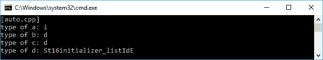

如前面的快照所示，我们只给出了数据类型的第一个字符，比如`i`代表`整数`，`d`代表`双精度`，`St16initializer_listIdE`代表`initializer_list<double>`，最后一个小写的`d`字符代表`双精度`。

我们可能需要在编译器选项中启用**运行时类型信息**（**RTTI**）功能来检索数据类型对象。然而，GCC 已经默认启用了这个功能。此外，`typeid()`函数的使用输出取决于编译器。我们可能会得到原始类型名称，或者就像我们在前面的例子中所做的那样，只是一个符号。

此外，对于变量，正如我们之前讨论的那样，`auto`关键字也可以应用于函数，自动推断函数的返回类型。假设我们有以下名为`add()`的简单函数来计算两个参数的加法：

```cpp
    int add(int i, int j)
    {
      return i + j;
    }

```

我们可以重构前面的方法来使用`auto`关键字，如下所示的代码行：

```cpp
    auto add(int i, int j)
    {
      return i + j;
    }

```

与自动类型变量类似，编译器可以根据函数的返回值决定正确的返回类型。正如前面的代码所示，该函数确实返回整数值，因为我们只是添加了两个整数值。

现代 C++中使用`auto`关键字的另一个特性是尾返回类型语法。通过使用这个特性，我们可以指定返回类型，函数原型的其余部分，或函数签名。从前面的代码中，我们可以重构它以使用以下特性：

```cpp
    auto add(int i, int j) -> int
    {
      return i + j;
    }

```

你可能会问我为什么我们在箭头符号(`->`)之后再次指定数据类型，即使我们已经使用了`auto`关键字。当我们在下一节讨论`decltype`关键字时，我们将找到答案。此外，通过使用这个特性，我们现在可以通过修改`main()`方法的语法来稍微重构前面的`auto.cpp`代码，而不是`main()`函数签名的以下语法：

```cpp
    int main()
    {
      // The body of the function
    }

```

我们可以将签名语法改为以下代码行：

```cpp
    auto main -> int
    {
      // The body of the function
    }

```

现在，我们将看到本书中的所有代码都使用这个尾返回类型特性来应用现代 C++语法。

# 使用 decltype 关键字查询表达式的类型

我们在前面的部分讨论了`auto`关键字可以根据其存储的值的类型自动推断变量的类型。该关键字还可以根据其返回值的类型推断函数的返回类型。现在，让我们结合`auto`关键字和`decltype`关键字，获得现代 C++的功能。

在我们结合这两个关键字之前，我们将找出`decltype`关键字的用途--它用于询问对象或表达式的类型。让我们看一下以下几行简单的变量声明：

```cpp
    const int func1();
    const int& func2();
    int i;

    struct X { double d; };
    const X* x = new X();

```

现在，基于前面的代码，我们可以使用`decltype`关键字声明其他变量，如下所示：

```cpp
    // Declaring const int variable
    // using func1() type
    decltype(func1()) f1;

    // Declaring const int& variable
    // using func2() type
    decltype(func2()) f2;

    // Declaring int variable
    // using i type
    decltype(i) i1;

    // Declaring double variable
    // using struct X type
    decltype(x->d) d1; // type is double
    decltype((x->d)) d2; // type is const double&

```

正如我们在前面的代码中所看到的，我们可以根据另一个对象的类型指定对象的类型。现在，假设我们需要重构前面的`add()`方法成为一个模板。没有`auto`和`decltype`关键字，我们将有以下模板实现：

```cpp
    template<typename I, typename J, typename K>
    K add(I i, J j)
    {
      return i + j;
    }

```

幸运的是，由于`auto`关键字可以指定函数的返回类型，即尾返回类型，而`decltype`关键字可以根据表达式推断类型，我们可以将前面的模板重构如下：

```cpp
    template<typename I, typename J>
    auto add(I i, J j) -> decltype(i + j)
    {
      return i + j;
    }

```

为了证明，让我们编译和运行以下的`decltype.cpp`代码。我们将使用以下模板来计算两种不同值类型--`整数`和`双精度`的加法：

```cpp
    /* decltype.cpp */
    #include <iostream>

    // Creating template
    template<typename I, typename J>
    auto add(I i, J j) -> decltype(i + j)
    {
      return i + j;
    }

    auto main() -> int
    {
      std::cout << "[decltype.cpp]" << std::endl;

      // Consuming the template
      auto d = add<int, double>(2, 2.5);

      // Displaying the preceding variables' type
      std::cout << "result of 2 + 2.5: " << d << std::endl;

      return 0;
    }

```

编译过程应该可以顺利进行，没有错误。如果我们运行前面的代码，我们将在屏幕上看到以下输出：

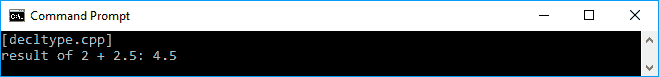

正如我们所看到的，我们成功地结合了`auto`和`decltype`关键字，创建了一个比现代 C++宣布之前通常更简单的模板。

# 指向空指针

现代 C++中的另一个新功能是一个名为`nullptr`的关键字，它取代了`NULL`宏来表示空指针。现在，在使用`NULL`宏表示零数字或空指针时不再存在歧义。假设我们在声明中有以下两个方法的签名：

```cpp
    void funct(const char *);
    void funct(int)

```

前一个函数将传递一个指针作为参数，后一个将传递整数作为参数。然后，我们调用`funct()`方法并将`NULL`宏作为参数传递，如下所示：

```cpp
    funct(NULL);

```

我们打算调用前一个函数。然而，由于我们传递了`NULL`参数，它基本上被定义为`0`，后一个函数将被调用。在现代 C++中，我们可以使用`nullptr`关键字来确保我们将传递一个空指针给参数。调用`funct()`方法应该如下：

```cpp
    funct(nullptr);

```

现在编译器将调用前一个函数，因为它将一个空指针传递给参数，这是我们期望的。不再存在歧义，将避免不必要的未来问题。

# 使用非成员 begin()和 end()函数返回迭代器

在现代 C++之前，要迭代一个序列，我们需要调用每个容器的`begin()`和`end()`成员方法。对于数组，我们可以通过迭代索引来迭代它的元素。自 C++11 以来，语言有一个非成员函数--`begin()`和`end()`--来检索序列的迭代器。假设我们有以下元素的数组：

```cpp
    int arr[] = { 0, 1, 2, 3, 4, 5, 6, 7, 8, 9 };

```

当语言没有`begin()`和`end()`函数时，我们需要使用索引来迭代数组的元素，可以在下面的代码行中看到：

```cpp
    for (unsigned int i = 0; i < sizeof(arr)/sizeof(arr[0]); ++i)
    // Do something to the array

```

幸运的是，使用`begin()`和`end()`函数，我们可以重构前面的`for`循环如下：

```cpp
    for (auto i = std::begin(arr); i != std::end(arr); ++i)
    // Do something to the array

```

正如我们所看到的，使用`begin()`和`end()`函数创建了一个紧凑的代码，因为我们不需要担心数组的长度，因为`begin()`和`end()`的迭代器指针会为我们做这件事。为了比较，让我们看一下以下的`begin_end.cpp`代码：

```cpp
    /* begin_end.cpp */
    #include <iostream>

    auto main() -> int
    {
      std::cout << "[begin_end.cpp]" << std::endl;

      // Declaring an array
      int arr[] = { 0, 1, 2, 3, 4, 5, 6, 7, 8, 9 };

      // Displaying the array elements
      // using conventional for-loop
      std::cout << "Displaying array element using conventional for-
       loop";
      std::cout << std::endl;
      for (unsigned int i = 0; i < sizeof(arr)/sizeof(arr[0]); ++i)
      std::cout << arr[i] << " ";
      std::cout << std::endl;

      // Displaying the array elements
      // using non-member begin() and end()
      std::cout << "Displaying array element using non-member begin()
       and end()";
      std::cout << std::endl;
      for (auto i = std::begin(arr); i != std::end(arr); ++i)
       std::cout << *i << " ";
      std::cout << std::endl;

      return 0;
    }

```

为了证明前面的代码，我们可以编译代码，当我们运行它时，应该在控制台屏幕上显示以下输出：

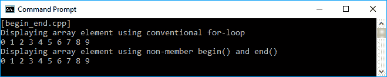

正如我们在屏幕截图中看到的，当我们使用传统的`for-loop`或`begin()`和`end()`函数时，我们得到了完全相同的输出。

# 使用基于范围的 for 循环迭代集合

在现代 C++中，有一个新功能被增强，支持`for-each`技术来迭代集合。如果你想对集合或数组的元素做一些操作而不关心元素的数量或索引，这个功能就很有用。这个功能的语法也很简单。假设我们有一个名为`arr`的数组，我们想要使用`range-based for loop`技术迭代每个元素，我们可以使用以下语法：

```cpp
    for (auto a : arr)
    // Do something with a

```

因此，我们可以重构我们之前的`begin_end.cpp`代码，使用`range-based for loop`，如下所示：

```cpp
    /* range_based_for_loop.cpp */
    #include <iostream>

    auto main() -> int
    {
      std::cout << "[range_based_for_loop.cpp]" << std::endl;

      // Declaring an array
      int arr[] = {0, 1, 2, 3, 4, 5, 6, 7, 8, 9};

      // Displaying the array elements
      // using non-member begin() and end()
      std::cout << "Displaying array element using range-based for
        loop";
      std::cout << std::endl;
      for (auto a : arr) std::cout << a << " ";
      std::cout << std::endl;

      return 0;
    }

```

我们在前面的代码中看到的语法现在更简单了。如果我们编译前面的代码，应该不会出现错误，如果我们运行代码，应该在控制台屏幕上看到以下输出：

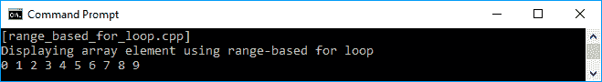

现在我们有了一种新的技术来迭代集合，而不必关心集合的索引。我们将在本书中继续使用它。

# 利用 C++语言与 C++标准库

C++标准库是一个强大的类和函数集合，具有创建应用程序所需的许多功能。它们由 C++ ISO 标准委员会控制，并受到**标准模板库**（**STL**）的影响，在 C++11 引入之前是通用库。标准库中的所有功能都在`std 命名空间`中声明，不再以`.h`结尾的头文件（除了 18 个 ISO C90 C 标准库的头文件，它们被合并到了 C++标准库中）。

C++标准库中包含了几个头文件，其中包含了 C++标准库的声明。然而，在这些小章节中几乎不可能讨论所有的头文件。因此，我们将讨论一些我们在日常编码活动中最常使用的功能。

# 将任何对象放入容器中

**容器**是用来存储其他对象并管理它所包含的对象的内存的对象。数组是 C++11 中添加的一个新特性，用于存储特定数据类型的集合。它是一个序列容器，因为它存储相同数据类型的对象并将它们线性排列。让我们看一下以下代码片段：

```cpp
    /* array.cpp */
    #include <array>
    #include <iostream>

    auto main() -> int
    {
      std::cout << "[array.cpp]" << std::endl;

      // Initializing an array containing five integer elements
      std::array<int, 10> arr = { 0, 1, 2, 3, 4, 5, 6, 7, 8, 9 };

      // Displaying the original elements of the array
      std::cout << "Original Data : ";
      for(auto a : arr) std::cout << a << " ";
      std::cout << std::endl;

      // Modifying the content of
      // the 1st and 3rd element of the array
      arr[1] = 9;
      arr[3] = 7;

      // Displaying the altered array elements
      std::cout << "Manipulated Data: ";
      for(auto a : arr) std::cout << a << " ";
      std::cout << std::endl;

      return 0;
     }

```

正如我们在前面的代码中所看到的，我们实例化了一个名为`arr`的新数组，将其长度设置为`10`，并且只批准`int`元素。我们可以猜到，代码的输出是一行数字`0`到`9`，显示了原始数据，另一行将显示更改后的数据，如我们在以下截图中所看到的：

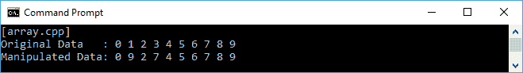

如果我们使用`std::array`声明一个数组，就不会有性能问题；我们在`array.cpp`代码中使用它，并将其与在`begin_end.cpp`代码中使用的普通数组进行比较。然而，在现代 C++中，我们有一个新的数组声明，它具有友好的值语义，因此可以按值传递给函数或从函数中返回。此外，这个新数组声明的接口使得更方便地找到大小，并与**标准模板库**（**STL**）风格的基于迭代器的算法一起使用。

使用数组作为容器是很好的，因为我们可以存储数据并对其进行操作。我们还可以对其进行排序，并查找特定元素。然而，由于数组是一个在编译时不可调整大小的对象，我们必须在最开始决定要使用的数组的大小，因为我们不能后来改变大小。换句话说，我们不能在现有数组中插入或删除元素。作为解决这个问题的方法，以及为了最佳实践使用容器，我们现在可以使用`vector`来存储我们的集合。让我们看一下以下代码：

```cpp
    /* vector.cpp */
    #include <vector>
    #include <iostream>

    auto main() -> int
    {
      std::cout << "[vector.cpp]" << std::endl;

      // Initializing a vector containing three integer elements
      std::vector<int> vect = { 0, 1, 2 };

      // Displaying the original elements of the vector
      std::cout << "Original Data : ";
      for (auto v : vect) std::cout << v << " ";
      std::cout << std::endl;

      // Adding two new data
      vect.push_back(3);
      vect.push_back(4);

      // Displaying the elements of the new vector
      // and reverse the order
      std::cout << "New Data Added : ";
      for (auto v : vect) std::cout << v << " ";
      std::cout << std::endl;

      // Modifying the content of
      // the 2nd and 4th element of the vector
      vect.at(2) = 5;
      vect.at(4) = 6;

      // Displaying the altered array elements
      std::cout << "Manipulate Data: ";
      for (auto v : vect) std::cout << v << " ";
      std::cout << std::endl;

      return 0;
    }

```

现在，在我们之前的代码中有一个`vector`实例，而不是一个`array`实例。正如我们所看到的，我们使用`push_back()`方法为`vector`实例添加了一个额外的值。我们可以随时添加值。每个元素的操作也更容易，因为`vector`有一个`at()`方法，它返回特定索引的元素的引用。运行代码时，我们将看到以下截图作为输出：

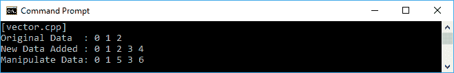

当我们想要通过索引访问`vector`实例中的特定元素时，最好始终使用`at()`方法而不是`[]`运算符。这是因为，当我们意外地访问超出范围的位置时，`at()`方法将抛出一个`out_of_range`异常。否则，`[]`运算符将产生未定义的行为。

# 使用算法

我们可以对`array`或`vector`中的集合元素进行排序，以及查找特定内容的元素。为了实现这些目的，我们必须使用 C++标准库提供的算法功能。让我们看一下以下代码，以演示算法功能中排序元素的能力：

```cpp
    /* sort.cpp */
    #include <vector>
    #include <algorithm>
    #include <iostream>

    bool comparer(int a, int b)
    {
      return (a > b);
    }

    auto main() -> int
    {
      std::cout << "[sort.cpp]" << std::endl;

      // Initializing a vector containing several integer elements
      std::vector<int> vect = { 20, 43, 11, 78, 5, 96 };

      // Displaying the original elements of the vector
      std::cout << "Original Data : ";
      for (auto v : vect)
      std::cout << v << " ";
      std::cout << std::endl;

      // Sorting the vector element ascending
      std::sort(std::begin(vect), std::end(vect));

      // Displaying the ascending sorted elements
      // of the vector
      std::cout << "Ascending Sorted : ";
      for (auto v : vect)
      std::cout << v << " ";
      std::cout << std::endl;

      // Sorting the vector element descending
      // using comparer
      std::sort(std::begin(vect), std::end(vect), comparer);

      // Displaying the descending sorted elements
      // of the vector
      std::cout << "Descending Sorted: ";
      for (auto v : vect)
      std::cout << v << " ";
      std::cout << std::endl;

      return 0;
   }

```

正如我们在前面的代码中看到的，我们两次调用了`sort()`方法。首先，我们只提供了我们想要排序的元素的范围。然后，我们添加了比较函数`comparer()`，以便将其提供给`sort()`方法，以获得更多灵活性。从前面的代码中，我们将在控制台上看到的输出如下：

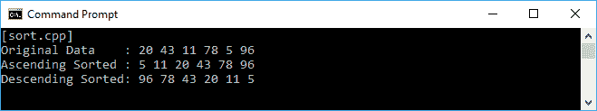

从前面的截图中，我们可以看到一开始`vector`中有六个元素。然后，我们使用简单的`sort()`方法对向量的元素进行排序。然后，我们再次调用`sort()`方法，但现在不是简单的`sort()`方法，而是将`comparer()`提供给`sort()`方法。结果，向量元素将按降序排序，因为`comparer()`函数从两个输入中寻找更大的值。

现在，让我们转向算法特性具有的另一个功能，即查找特定元素。假设我们在代码中有`Vehicle`类。它有两个名为`m_vehicleType`和`m_totalOfWheel`的私有字段，我们可以从 getter 方法`GetType()`和`GetNumOfWheel()`中检索值。它还有两个构造函数，分别是默认构造函数和用户定义的构造函数。类的声明应该如下所示：

```cpp
    /* vehicle.h */
    #ifndef __VEHICLE_H__
    #define __VEHICLE_H__

    #include <string>

    class Vehicle
    {
      private:
        std::string vehicleType;
        int totalOfWheel;

      public:
        Vehicle(
          const std::string &type,
          int _wheel);
        Vehicle();
        ~Vehicle();
        std::string GetType() const {return vehicleType;}
        int GetNumOfWheel() const {return totalOfWheel;}
    };

    #endif // End of __VEHICLE_H__

```

`Vehicle`类的实现如下：

```cpp
    /* vehicle.cpp */
    #include "vehicle.h"

    using namespace std;

    // Constructor with default value for
    // m_vehicleType and m_totalOfWheel
    Vehicle::Vehicle() : m_totalOfWheel(0)
    {
    }

    // Constructor with user-defined value for
    // m_vehicleType and m_totalOfWheel
    Vehicle::Vehicle( const string &type, int wheel) :
     m_vehicleType(type),
     m_totalOfWheel(wheel)
    {
    }

    // Destructor
    Vehicle::~Vehicle()
    {
    }

```

我们将在`vector`容器中存储一组`Vehicle`，然后根据其属性搜索一些元素。代码如下：

```cpp
    /* find.cpp */
    #include <vector>
    #include <algorithm>
    #include <iostream>
    #include "../vehicle/vehicle.h"

    using namespace std;

    bool TwoWheeled(const Vehicle &vehicle)
    {
      return _vehicle.GetNumOfWheel() == 2 ? 
        true : false;
     }

    auto main() -> int
    {
      cout << "[find.cpp]" << endl;

      // Initializing several Vehicle instances
      Vehicle car("car", 4);
      Vehicle motorcycle("motorcycle", 2);
      Vehicle bicycle("bicycle", 2);
      Vehicle bus("bus", 6);

      // Assigning the preceding Vehicle instances to a vector
      vector<Vehicle> vehicles = { car, motorcycle, bicycle, bus };

      // Displaying the elements of the vector
      cout << "All vehicles:" << endl;;
      for (auto v : vehicles)
        std::cout << v.GetType() << endl;
      cout << endl;

      // Displaying the elements of the vector
      // which are the two-wheeled vehicles
      cout << "Two-wheeled vehicle(s):" << endl;;
      auto tw = find_if(
                      begin(vehicles),
                      end(vehicles),
                      TwoWheeled);
      while (tw != end(vehicles))
      {
        cout << tw->GetType() << endl ;
        tw = find_if(++tw, end(vehicles), TwoWheeled);
      }
      cout << endl;

      // Displaying the elements of the vector
      // which are not the two-wheeled vehicles
      cout << "Not the two-wheeled vehicle(s):" << endl;;
      auto ntw = find_if_not(begin(vehicles),
                           end(vehicles),
                           TwoWheeled);
      while (ntw != end(vehicles))
      {
        cout << ntw->GetType() << endl ;
        ntw = find_if_not(++ntw, end(vehicles), TwoWheeled);
      }

      return 0;
     }

```

正如我们所看到的，我们实例化了四个`Vehicle`对象，然后将它们存储在`vector`中。在那里，我们试图找到有两个轮子的车辆。`find_if()`函数用于此目的。我们还有`TwoWheeled()`方法来提供比较值。由于我们正在寻找两轮车辆，我们将通过调用`GetNumOfWheel()`方法来检查`Vehicle`类中的`totalOfWheel`变量。相反，如果我们想找到不符合比较值的元素，我们可以使用在 C++11 中添加的`find_if_not()`函数。我们得到的输出应该是这样的：

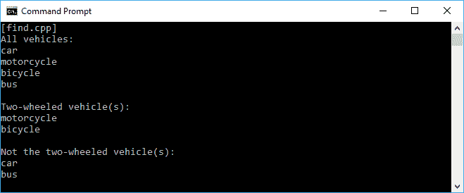

正如我们在`vehicle.cpp`代码和`find.cpp`代码中看到的，我们现在在`*.cpp`文件中添加了`using namespace std;`行。我们这样做是为了使我们的编码活动变得更加高效，因为我们不必输入太多的单词。相反，在`vehicle.h`中，我们仍然使用`std::`后跟方法或属性名称，而不是在开头使用 std 命名空间。在头文件中最好不要声明`using namespace`，因为头文件是我们将为实例创建一些库时要交付的文件。我们库的用户可能有与我们的库具有相同名称的函数。这肯定会在这两个函数之间创建冲突。

我们将最常使用的另一个算法特性是`for_each`循环。使用`for_each`循环而不是使用`for`循环，在许多情况下会使我们的代码更简洁。它也比`for`循环更简单，更不容易出错，因为我们可以为`for_each`循环定义一个特定的函数。现在让我们重构我们之前的代码以使用`for_each`循环。代码如下所示：

```cpp
    /* for_each.cpp */
    #include <vector>
    #include <algorithm>
    #include <iostream>
    #include "vehicle.h"

    using namespace std;

    void PrintOut(const Vehicle &vehicle)
    {
      cout << vehicle.GetType() << endl;
    }

    auto main() -> int
   {
      cout << "[for_each.cpp]" << endl;

      // Initializing several Vehicle instances
      Vehicle car("car", 4);
      Vehicle motorcycle("motorcycle", 2);
      Vehicle bicycle("bicycle", 2);
      Vehicle bus("bus", 6);

      // Assigning the preceding Vehicle instances to a vector
      vector<Vehicle> vehicles = { car, motorcycle, bicycle, bus };

      // Displaying the elements of the vector
      cout << "All vehicles:" << endl;
      for_each(begin(vehicles), end(vehicles), PrintOut);

      return 0;
    }

```

现在，使用`for_each`循环，我们有了更清晰的代码。我们只需要提供第一个和最后一个迭代器，然后传递一个函数--在这种情况下是`PrintOut()`函数--它将在范围内的每个元素中被调用。

# 使用 Lambda 表达式简化函数表示

Lambda 表达式是一个匿名符号，表示执行操作或计算的东西。在函数式编程中，Lambda 表达式对于生成第一类和纯函数非常有用，我们将在本书的不同章节中讨论。现在，让我们通过研究 Lambda 表达式的三个基本部分来熟悉 C++11 中引入的这个新特性。

+   捕获列表: []

+   参数列表: ()

+   主体: {}

这三个基本部分的顺序如下：

```cpp
    [](){} 

```

捕获列表部分也用作标记来识别 Lambda 表达式。它是一个占位符，用于在表达式中涉及的值。唯一的捕获默认值是和符号（`&`），它将隐式地通过引用捕获自动变量，以及等号（`=`），它将隐式地通过复制捕获自动变量（我们将在接下来的部分进一步讨论）。参数列表类似于每个函数中的捕获列表，我们可以向其传递值。主体是函数本身的实现。

# 使用 Lambda 表达式进行微小函数

想象我们有一个只调用一次的微小单行函数。最好的做法是在需要时直接编写该函数的操作。实际上，在我们讨论 C++标准库时，我们在之前的示例中就有这样的函数。只需返回到`for_each.cpp`文件，我们将找到`for_each()`仅调用一次的`PrintOut()`函数。如果我们使用 Lambda，可以使这个`for_each`循环更易读。让我们看一下以下代码片段，以查看我们如何重构`for_each.cpp`文件：

```cpp
    /* lambda_tiny_func.cpp */
    #include <vector>
    #include <algorithm>
    #include <iostream>
    #include "../vehicle/vehicle.h"

    using namespace std;

    auto main() -> int
    {
      cout << "[lambda_tiny_func.cpp]" << endl;

      // Initializing several Vehicle instances
      Vehicle car("car", 4);
      Vehicle motorcycle("motorcycle", 2);
      Vehicle bicycle("bicycle", 2);
      Vehicle bus("bus", 6);

      // Assigning the preceding Vehicle instances to a vector
      vector<Vehicle> vehicles = { car, motorcycle, bicycle, bus };

      // Displaying the elements of the vector
      // using Lambda expression
      cout << "All vehicles:" << endl;
      for_each(
             begin(vehicles),
             end(vehicles),
             [](const Vehicle &vehicle){
                 cout << vehicle.GetType() << endl;
            });

      return 0;
    }

```

如我们所见，我们已经将在`for_each.cpp`文件中使用的`PrintOut()`函数转换为 Lambda 表达式，并将其传递给`for_each`循环。它确实会产生与`for_each.cpp`文件相同的输出。但是，现在我们的代码变得更加简洁和易读。

# 用于多行函数的 Lambda 表达式

Lambda 表达式也可以用于多行函数，因此我们可以将函数的主体放在其中。这将使我们的代码更易读。让我们编写一个新代码。在该代码中，我们将有一个整数集合和一个意图来检查所选元素是否为质数。我们可以创建一个单独的函数，例如`PrintPrime()`，然后调用它。但是，由于质数检查操作只调用一次，如果我们将其转换为 Lambda 表达式，代码会更易读。代码应该如下所示：

```cpp
    /* lambda_multiline_func.cpp */
    #include <vector>
    #include <algorithm>
    #include <iostream>

    using namespace std;

    auto main() -> int
    {
      cout << "[lambda_multiline_func.cpp]" << endl;

      // Initializing a vector containing integer element
      vector<int> vect;
      for (int i = 0; i < 10; ++i)
        vect.push_back(i);

      // Displaying whether or not the element is prime number
      for_each(
             begin(vect),
             end(vect),
             [](int n) {
                cout << n << " is";
                if(n < 2)
                {
                  if(n == 0)
                  cout << " not";
                }
                else
                {
                  for (int j = 2; j < n; ++j)
                    {
                       if (n % j == 0)
                       {
                         cout << " not";
                         break;
                       }
                   }
                 }

                cout << " prime number" << endl;
            });

        return 0;
     }

```

我们应该在屏幕上看到的输出如下：

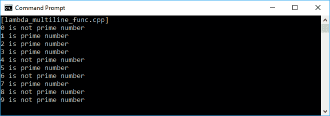

如我们在前面的屏幕截图中所见，我们已成功使用 Lambda 表达式识别了质数。

# 从 Lambda 表达式返回值

我们之前的两个 Lambda 表达式示例只是用于在控制台上打印。这意味着函数不需要返回任何值。但是，我们可以要求 Lambda 表达式返回一个值，例如，如果我们在函数内部进行计算并返回计算结果。让我们看一下以下代码，以查看如何使用这个 Lambda：

```cpp
    /* lambda_returning_value.cpp */
    #include <vector>
    #include <algorithm>
    #include <iostream>

    using namespace std;

    auto main() -> int
    {
      cout << "[lambda_returning_value.cpp]" << endl;

      // Initializing a vector containing integer element
      vector<int> vect;
      for (int i = 0; i < 10; ++i)
        vect.push_back(i);

      // Displaying the elements of vect
      cout << "Original Data:" << endl;
      for_each(
             begin(vect),
             end(vect),
             [](int n){
                cout << n << " ";
            });
      cout << endl;

      // Creating another vect2 vector
      vector<int> vect2;
      // Resize the size of vect2 exactly same with vect
      vect2.resize(vect.size());
      // Doubling the elements of vect and store to vect2
      transform(
              begin(vect),
              end(vect),
              begin(vect2),
              [](int n) {
                return n * n;
            });

      // Displaying the elements of vect2
      cout << "Squared Data:" << endl;
      for_each(
             begin(vect2),
             end(vect2),
             [](int n) {
                cout << n << " ";
            });
      cout << endl;

      // Creating another vect3 vector
      vector<double> vect3;
      // Resize the size of vect3 exactly same with vect
      vect3.resize(vect.size());
      // Finding the average of the elements of vect
      // and store to vect2
      transform(
              begin(vect2),
              end(vect2),
              begin(vect3),
              [](int n) -> double {
                return n / 2.0;
            });

      // Displaying the elements of vect3
      cout << "Average Data:" << endl;
      for_each(
             begin(vect3),
             end(vect3),
             [](double d) {
                cout << d << " ";
            });
      cout << endl;

      return 0;
     }

```

当我们在前面的代码中使用`transform()`方法时，我们有一个 Lambda 表达式，它从`n * n`的计算中返回一个值。但是，表达式中没有声明返回类型。这是因为我们可以省略返回类型的声明，因为编译器已经理解到表达式将返回一个`整数`值。因此，在我们有另一个与`vect`大小相同的向量`vect2`之后，我们可以调用`transform()`方法以及 Lambda 表达式，`vect`的值将加倍并存储在`vect2`中。

如果我们愿意，我们可以为 Lambda 表达式指定返回类型。正如我们在前面的代码中所看到的，我们根据`vect`向量的所有值转换了`vect3`向量，但现在我们使用箭头符号(`->`)指定了返回类型为`double`。前面代码的结果应该如下截图所示：

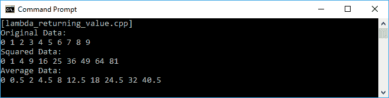

正如我们从前面的截图中所看到的，我们已经成功地使用 Lambda 表达式找到了加倍和平均值的结果。

# 捕获值到 Lambda 表达式

在我们之前的 Lambda 表达式示例中，我们保持了捕获部分和方括号(`[]`)为空，因为 Lambda 没有捕获任何东西，并且在编译器生成的匿名对象中没有任何额外的成员变量。我们还可以通过在这个方括号中指定要捕获的对象来指定我们想要在 Lambda 表达式中捕获的对象。让我们看一下以下代码片段来讨论一下：

```cpp
    /* lambda_capturing_by_value.cpp */
    #include <vector>
    #include <algorithm>
    #include <iostream>

    using namespace std;

    auto main() -> int
    {
      cout << "[lambda_capturing_by_value.cpp]" << endl;

      // Initializing a vector containing integer element
      vector<int> vect;
      for (int i = 0; i < 10; ++i)
      vect.push_back(i);

      // Displaying the elements of vect
      cout << "Original Data:" << endl;
      for_each(
             begin(vect),
             end(vect),
             [](int n){
                cout << n << " ";
             });
      cout << endl;

      // Initializing two variables
      int a = 2;
      int b = 8;

      // Capturing value explicitly from the two variables
      cout << "Printing elements between " << a;
      cout << " and " << b << " explicitly [a,b]:" << endl;
      for_each(
             begin(vect),
             end(vect),
             a,b{
                if (n >= a && n <= b)
                cout << n << " ";
             });
      cout << endl;

      // Modifying variable a and b
      a = 3;
      b = 7;

      // Capturing value implicitly from the two variables
      cout << "printing elements between " << a;
      cout << " and " << b << " implicitly[=]:" << endl;
      for_each(
             begin(vect),
             end(vect),
             ={
                if (n >= a && n <= b)
                cout << n << " ";
            });
      cout << endl;

      return 0;
    }

```

在前面的代码中，我们将尝试在 Lambda 表达式中显式和隐式地捕获值。假设我们有两个变量`a`和`b`，我们想要显式地捕获这些值，我们可以在 Lambda 表达式中使用`[a,b]`语句指定它们，然后在函数体内部使用这些值。此外，如果我们希望隐式地捕获值，只需使用`[=]`作为捕获部分，然后表达式将知道我们在函数体中指定的变量。如果我们运行前面的代码，我们将在屏幕上得到以下输出：

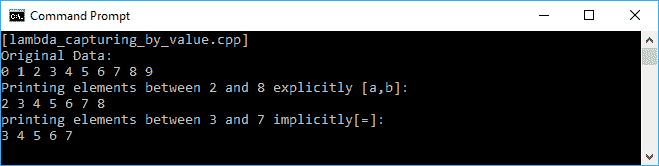

我们还可以改变我们捕获的值的状态，而不修改 Lambda 表达式函数体外的值。为此，我们可以使用与之前相同的技术，并在以下代码块中添加`mutable`关键字：

```cpp
    /* lambda_capturing_by_value_mutable.cpp */
    #include <vector>
    #include <algorithm>
    #include <iostream>

    using namespace std;

    auto main() -> int
    {
      cout << "[lambda_capturing_by_value_mutable.cpp]" << endl;

      // Initializing a vector containing integer element
      vector<int> vect;
      for (int i = 0; i < 10; ++i)
        vect.push_back(i);

      // Displaying the elements of vect
      cout << "Original Data:" << endl;
      for_each(
             begin(vect),
             end(vect),
             [](int n){
                 cout << n << " ";
            });
      cout << endl;

      // Initializing two variables
      int a = 1;
      int b = 1;

      // Capturing value from the two variables
      // without mutate them
      for_each(
             begin(vect),
             end(vect),
             = mutable {
                 const int old = x;
                 x *= 2;
                 a = b;
                 b = old;
             });

      // Displaying the elements of vect
      cout << "Squared Data:" << endl;
      for_each(
             begin(vect),
             end(vect),
             [](int n) {
                  cout << n << " ";
            });
      cout << endl << endl;

      // Displaying value of variable a and b
      cout << "a = " << a << endl;
      cout << "b = " << b << endl;

      return 0;
    }

```

前面的代码将对`vect`向量的元素进行加倍。它在 Lambda 表达式中使用值捕获，并且使用了`mutable`关键字。正如我们所看到的，我们通过引用传递了向量元素`(int& x)`并将其乘以 2，然后改变了`a`和`b`的值。然而，由于我们使用了`mutable`关键字，`a`和`b`的最终结果将保持不变，尽管我们已经通过引用传递了向量。控制台上的输出如下截图所示：

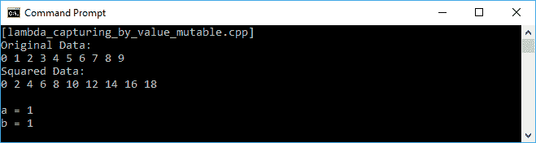

如果我们想要改变`a`和`b`变量的值，我们必须使用 Lambda 表达式通过引用进行捕获。我们可以通过在 Lambda 表达式的尖括号中传递引用来实现这一点，例如`[&a, &b]`。更多细节，请看以下代码片段：

```cpp
    /* lambda_capturing_by_reference.cpp */
    #include <vector>
    #include <algorithm>
    #include <iostream>

    using namespace std;

    auto main() -> int
    {
      cout << "[lambda_capturing_by_reference.cpp]" << endl;

      // Initializing a vector containing integer element
      vector<int> vect;
      for (int i = 0; i < 10; ++i)
        vect.push_back(i);

      // Displaying the elements of vect
      cout << "Original Data:" << endl;
      for_each(
             begin(vect),
             end(vect),
             [](int n){
                 cout << n << " ";
            });
      cout << endl;

      // Initializing two variables
      int a = 1;
      int b = 1;

      // Capturing value from the two variables
      // and mutate them
      for_each(
             begin(vect),
             end(vect),
             &a, &b{
                 const int old = x;
                 x *= 2;
                 a = b;
                 b = old;
            });

      // Displaying the elements of vect
      cout << "Squared Data:" << endl;
      for_each(
             begin(vect),
             end(vect),
             [](int n) {
                 cout << n << " ";
            });
      cout << endl << endl;

      // Displaying value of variable a and b
      cout << "a = " << a << endl;
      cout << "b = " << b << endl;

      return 0;
     }

```

前面的代码与`lambda_capturing_by_value_mutable.cpp`文件具有相同的行为，它将对`vect`向量的元素进行加倍。然而，通过引用捕获，它现在在`for_each`循环中处理`a`和`b`的值时也会修改它们。`a`和`b`的值将在代码结束时被改变，正如我们在以下截图中所看到的：

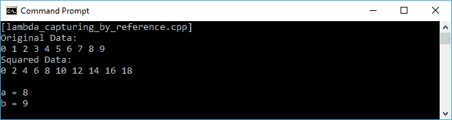

# 使用初始化捕获准备值

C++14 中 Lambda 表达式的另一个重要特性是其初始化捕获。该表达式可以捕获变量的值并将其赋给表达式的变量。让我们看一下以下实现初始化捕获的代码片段：

```cpp
    /* lambda_initialization_captures.cpp */
    #include <iostream>

    using namespace std;

    auto main() -> int
    {
      cout << "[lambda_initialization_captures.cpp]" << endl;

      // Initializing a variable
      int a = 5;
      cout << "Initial a = " << a << endl;

      // Initializing value to lambda using the variable
      auto myLambda = [&x = a]() { x += 2; };

      // Executing the Lambda
      myLambda();

      // Displaying a new value of the variable
      cout << "New a = " << a << endl;

      return 0;
     }

```

正如我们在前面的代码中所看到的，我们有一个名为`a`的 int 变量，其值为`5`。然后，Lambda 表达式`myLambda`捕获了`a`的值并在代码中执行。结果是现在`a`的值将是`7`，因为它被加上了`2`。当我们运行前面的代码时，以下输出截图应该出现在我们的控制台窗口中：

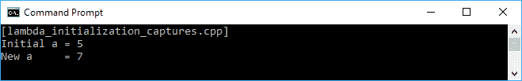

从上面的快照中，我们可以看到可以在 Lambda 表达式中准备要包含在计算中的值。

# 编写一个通用的 Lambda 表达式，可以多次使用，适用于许多不同的数据类型

在 C++14 之前，我们必须明确声明参数列表的类型。幸运的是，现在在 C++14 中，Lambda 表达式接受`auto`作为有效的参数类型。因此，我们现在可以构建一个通用的 Lambda 表达式，如下面的代码所示。在该代码中，我们只有一个 Lambda 表达式，用于找出传递给表达式的两个数字中的最大值。我们将在参数声明中使用`auto`关键字，以便可以传递任何数据类型。因此，`findMax()`函数的参数可以传递`int`和`float`数据类型。代码应该如下所示：

```cpp
    /* lambda_expression_generic.cpp */
    #include <iostream>

    using namespace std;

    auto main() -> int
    {
      cout << "[lambda_expression_generic.cpp]" << endl;

      // Creating a generic lambda expression
      auto findMax = [](auto &x, auto &y){
        return x > y ? x : y; };

      // Initializing various variables
      int i1 = 5, i2 = 3;
      float f1 = 2.5f, f2 = 2.05f;

      // Consuming generic lambda expression
      // using integer data type
      cout << "i1 = 5, i2 = 3" << endl;
      cout << "Max: " << findMax(i1, i2) << endl << endl;

      // Consuming generic lambda expression
      // using double data type
      cout << "f1 = 2.5f, f2 = 2.05f" << endl;
      cout << "Max: " << findMax(f1, f2) << endl << endl;

      return 0;
     }

```

我们在控制台上看到的输出应该如下所示：

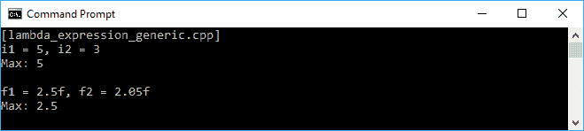

C++17 语言计划为 Lambda 表达式引入两个新特性--它们是捕获`*this`，允许表达式通过复制捕获封闭对象，以及`constexpr` Lambda 表达式，允许我们在编译时使用 Lambda 表达式的结果并生成`constexpr`对象。然而，由于 C++17 尚未发布，我们现在无法尝试它。

# 使用智能指针避免手动内存管理

智能指针在使用 C++时非常有用，并且对于高效使用 C++来说具有重要的知识。C++11 在`memory`头文件中添加了许多智能指针的新功能。在 C++11 之前的很长一段时间里，我们使用`auto_ptr`作为智能指针。然而，它相当不安全，因为它具有不兼容的复制语义。它现在也已经被弃用，我们不应该再使用它。幸运的是，C++引入了`unique_ptr`，它具有类似的功能，但具有额外的功能，例如添加`deleters`和对数组的支持。我们可以用`unique_ptr`做任何`auto_ptr`能做的事情，而且应该使用`unique_ptr`来代替。我们将深入讨论`unique_ptr`以及 C++11 中的其他新智能指针--`shared_ptr`和`weak_ptr`。

# 使用 unique_ptr 替换原始指针

接下来我们将看到的指针是`unique_ptr`指针。它快速、高效，并且几乎可以直接替换原始指针。它提供独占所有权语义，独占它指向的对象。由于其独占性，如果它具有非空指针，则可以在其析构函数被调用时销毁对象。由于其独占性，它也不能被复制。它没有复制构造函数和复制赋值。尽管它不能被复制，但它可以被移动，因为它提供了移动构造函数和移动赋值。

这些是我们可以用来构造`unique_ptr`的方法：

```cpp
    auto up1 = unique_ptr<int>{};
    auto up2 = unique_ptr<int>{ nullptr };
    auto up3 = unique_ptr<int>{ new int { 1234 } };

```

根据上述代码，`up1`和`up2`将构造指向空（null）的两个新的`unique_ptr`，而`up3`将指向保存`1234`值的地址。然而，C++14 添加了一个新的库函数来构造`unique_ptr`，即`make_unique`。因此，我们可以按照以下方式构造一个新的`unique_ptr`指针：

```cpp
    auto up4 = make_unique<int>(1234);

```

`up4`变量也将指向保存`1234`值的地址。

现在，让我们看一下以下代码块：

```cpp
    /* unique_ptr_1.cpp */
    #include <memory>
    #include <iostream>

    using namespace std;

    struct BodyMass
    {
      int Id;
      float Weight;

      BodyMass(int id, float weight) :
        Id(id),
        Weight(weight)
        {
          cout << "BodyMass is constructed!" << endl;
          cout << "Id = " << Id << endl;
          cout << "Weight = " << Weight << endl;
        }

       ~BodyMass()
       {
         cout << "BodyMass is destructed!" << endl;
       }
     };

     auto main() -> int
     {
       cout << "[unique_ptr_1.cpp]" << endl;
       auto myWeight = make_unique<BodyMass>(1, 165.3f);
       cout << endl << "Doing something!!!" << endl << endl;
       return 0;
     }

```

我们尝试构造一个新的`unique_ptr`指针，该指针指向保存`BodyMass`数据类型的地址。在`BodyMass`中，我们有一个构造函数和一个析构函数。现在，让我们通过运行上述代码来看看`unique_ptr`指针是如何工作的。我们在屏幕上得到的输出应该如下截图所示：


正如我们在前面的截图中看到的，当我们构造`unique_ptr`时，构造函数被调用。此外，与传统的 C++语言不同，我们在使用指针时必须释放内存，而在现代 C++中，当超出范围时，内存将自动释放。我们可以看到，当程序退出时，`BodyMass`的析构函数被调用，这意味着`myWeight`已经超出范围。

现在，让我们通过分析以下代码片段来测试`unique_ptr`的独占性：

```cpp
    /* unique_ptr_2.cpp */
    #include <memory>
    #include <iostream>

    using namespace std;

    struct BodyMass
    {
      int Id;
      float Weight;

      BodyMass(int id, float weight) :
        Id(id), 
        Weight(weight)
        {
          cout << "BodyMass is constructed!" << endl;
          cout << "Id = " << Id << endl;
          cout << "Weight = " << Weight << endl;
        }

 BodyMass(const BodyMass &other) :
 Id(other.Id),
 Weight(other.Weight)
 {
 cout << "BodyMass is copy constructed!" << endl;
 cout << "Id = " << Id << endl;
 cout << "Weight = " << Weight << endl;
 }

      ~BodyMass()
       {
          cout << "BodyMass is destructed!" << endl;
       }
    };

    auto main() -> int
    {
      cout << "[unique_ptr_2.cpp]" << endl;

      auto myWeight = make_unique<BodyMass>(1, 165.3f);

      // The compiler will forbid to create another pointer
      // that points to the same allocated memory/object
      // since it's unique pointer
      //auto myWeight2 = myWeight;

      // However, we can do the following expression
      // since it actually copies the object that has been allocated
      // (not the unique_pointer)
      auto copyWeight = *myWeight;

      return 0;
    }

```

正如我们在前面的代码中看到的，我们不能将`unique_ptr`实例分配给另一个指针，因为这将破坏`unique_ptr`的独占性。如果我们执行以下表达式，编译器将抛出错误：

```cpp
    auto myWeight2 = myWeight;

```

然而，我们可以将`unique_ptr`的值分配给另一个对象，因为它已经被分配。为了证明这一点，我们已经添加了一个复制构造函数来记录当执行以下表达式时：

```cpp
    auto copyWeight = *myWeight;

```

如果我们运行前面的`unique_ptr_2.cpp`代码，我们将在屏幕上看到以下输出：


正如我们在前面的截图中看到的，当执行复制赋值时，复制构造函数被调用。这证明了我们可以复制`unique_ptr`对象的值，但不能复制对象本身。

正如我们之前讨论的，`unique_ptr`已经移动了构造函数，尽管它没有复制构造函数。这种构造的使用可以在以下代码片段中找到：

```cpp
    /* unique_ptr_3.cpp */
    #include <memory>
    #include <iostream>

    using namespace std;

    struct BodyMass
    {
      int Id;
      float Weight;

      BodyMass(int id, float weight) :
        Id(id), 
        Weight(weight)
        {
          cout << "BodyMass is constructed!" << endl;
          cout << "Id = " << Id << endl;
          cout << "Weight = " << Weight << endl;
        }

      ~BodyMass()
       {
         cout << "BodyMass is destructed!" << endl;
       }
    };

    unique_ptr<BodyMass> GetBodyMass()
    {
      return make_unique<BodyMass>(1, 165.3f);
    }

    unique_ptr<BodyMass> UpdateBodyMass(
      unique_ptr<BodyMass> bodyMass)
      {
        bodyMass->Weight += 1.0f;
        return bodyMass;
      }

     auto main() -> int
     {
       cout << "[unique_ptr_3.cpp]" << endl;

       auto myWeight = GetBodyMass();

       cout << "Current weight = " << myWeight->Weight << endl;

       myWeight = UpdateBodyMass(move(myWeight));

       cout << "Updated weight = " << myWeight->Weight << endl;

       return 0;
     }

```

在前面的代码中，我们有两个新函数--`GetBodyMass()`和`UpdateBodyMass()`。我们从`GetBodyMass()`函数构造一个新的`unique_ptr`对象，然后使用`UpdateBodyMass()`函数更新其*Weight*的值。我们可以看到，当我们将参数传递给`UpdateBodyMass()`函数时，我们使用`move`函数。这是因为`unique_ptr`没有复制构造函数，必须移动才能更新其属性的值。前面代码的屏幕输出如下：

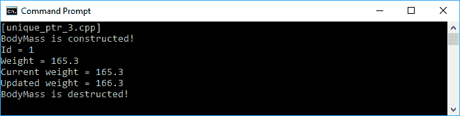

# 使用 shared_ptr 共享对象

与`unique_ptr`相比，`shared_ptr`实现了共享所有权语义，因此提供了复制构造函数和复制赋值。尽管它们在实现上有所不同，但`shared_ptr`实际上是`unique_ptr`的计数版本。我们可以调用`use_count()`方法来查找`shared_ptr`引用的计数值。每个`shared_ptr`有效对象的实例被计为一个。我们可以将`shared_ptr`实例复制到其他`shared_ptr`变量中，引用计数将增加。当销毁`shared_ptr`对象时，析构函数会减少引用计数。只有当计数达到零时，对象才会被删除。现在让我们来检查以下`shared_ptr`代码：

```cpp
    /* shared_ptr_1.cpp */
    #include <memory>
    #include <iostream>

    using namespace std;

    auto main() -> int
    {
      cout << "[shared_ptr_1.cpp]" << endl;

      auto sp1 = shared_ptr<int>{};

      if(sp1)
         cout << "sp1 is initialized" << endl;
      else
         cout << "sp1 is not initialized" << endl;
      cout << "sp1 pointing counter = " << sp1.use_count() << endl;
      if(sp1.unique())
         cout << "sp1 is unique" << endl;
      else
        cout << "sp1 is not unique" << endl;
      cout << endl;

      sp1 = make_shared<int>(1234);

      if(sp1)
        cout << "sp1 is initialized" << endl;
      else
        cout << "sp1 is not initialized" << endl;
      cout << "sp1 pointing counter = " << sp1.use_count() << endl;
      if(sp1.unique())
        cout << "sp1 is unique" << endl;
      else
        cout << "sp1 is not unique" << endl;
      cout << endl;

      auto sp2 = sp1;

      cout << "sp1 pointing counter = " << sp1.use_count() << endl;
      if(sp1.unique())
        cout << "sp1 is unique" << endl;
      else
        cout << "sp1 is not unique" << endl;
      cout << endl;

      cout << "sp2 pointing counter = " << sp2.use_count() << endl;
      if(sp2.unique())
        cout << "sp2 is unique" << endl;
      else
        cout << "sp2 is not unique" << endl;
      cout << endl;

      sp2.reset();

      cout << "sp1 pointing counter = " << sp1.use_count() << endl;
      if(sp1.unique())
        cout << "sp1 is unique" << endl;
      else
        cout << "sp1 is not unique" << endl;
      cout << endl;

      return 0;
    }

```

在我们检查前面代码的每一行之前，让我们来看一下应该出现在控制台窗口上的以下输出：

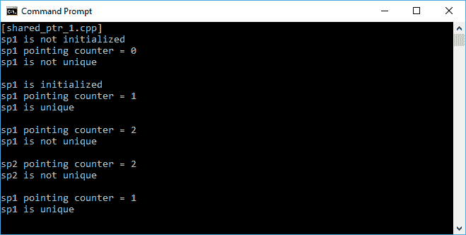

首先，我们创建一个名为`sp1`的`shared_ptr`对象，但没有实例化它。从控制台上，我们看到`sp1`没有被初始化，计数器仍然是`0`。它也不是唯一的，因为指针指向了空。然后我们使用`make_shared`方法构造`sp1`。现在，`sp1`被初始化，计数器变为`1`。它也变得唯一，因为它是唯一的`shared_ptr`对象之一（计数器的值为`1`证明了这一点）。接下来，我们创建另一个名为`sp2`的变量，并将`sp1`复制给它。结果，`sp1`和`sp2`现在共享相同的对象，计数器和唯一性值证明了这一点。然后，在`sp2`中调用`reset()`方法将销毁`sp2`的对象。现在，`sp1`的计数器变为`1`，它再次变得唯一。

在`shared_ptr_1.cpp`代码中，我们使用`shared_ptr<int>`声明`unique_ptr`对象，然后调用`make_shared<int>`来实例化指针。这是因为我们只需要分析`shared_ptr`的行为。然而，我们应该为共享指针使用`make_shared<>`，因为它必须在内存中保留引用计数，并且将对象的计数器和内存一起分配，而不是两个单独的分配。

# 使用 weak_ptr 指针跟踪对象

我们在前面的部分讨论了`shared_ptr`。该指针实际上是一个有点胖的指针。它逻辑上指向两个对象，即被管理的对象和使用`use_count()`方法的指针计数器。每个`shared_ptr`基本上都有一个防止对象被删除的强引用计数和一个不防止对象被删除的弱引用计数，尽管我们甚至没有使用弱引用计数。因此，我们可以只使用一个引用计数，因此我们可以使用`weak_ptr`指针。`weak_ptr`指针指向由`shared_ptr`管理的对象。`weak_ptr`的优势在于，它可以用来引用一个对象，但只有在对象仍然存在且不会阻止其他引用持有者删除对象时才能访问它，如果强引用计数达到零。这在处理数据结构时非常有用。让我们看一下下面的代码块，分析`weak_ptr`的使用：

```cpp
    /* weak_ptr_1.cpp */
    #include <memory>
    #include <iostream>

    using namespace std;

    auto main() -> int
    {
      cout << "[weak_ptr_1.cpp]" << endl;

      auto sp = make_shared<int>(1234);

      auto wp = weak_ptr<int>{ sp };

      if(wp.expired())
       cout << "wp is expired" << endl;
      else
       cout << "wp is not expired" << endl;
      cout << "wp pointing counter = " << wp.use_count() << endl;
      if(auto locked = wp.lock())
       cout << "wp is locked. Value = " << *locked << endl;
      else
      {
        cout << "wp is unlocked" << endl;
        wp.reset();
      }
      cout << endl;

      sp = nullptr;

      if(wp.expired())
       cout << "wp is expired" << endl;
      else
       cout << "wp is not expired" << endl;
      cout << "wp pointing counter = " << wp.use_count() << endl;
      if(auto locked = wp.lock())
       cout << "wp is locked. Value = " << *locked << endl;
      else
      {
        cout << "wp is unlocked" << endl;
        wp.reset();
      }
      cout << endl;

      return 0;
     }

```

在分析前面的代码之前，让我们看一下如果运行代码，从输出控制台中得到的以下截图：

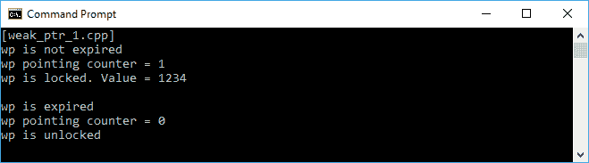

首先，我们实例化`shared_ptr`，正如我们之前讨论的，`weak_ptr`指向由`shared_ptr`管理的对象。然后我们将`wp`赋给`shared_ptr`变量`sp`。有了`weak_ptr`指针后，我们可以检查它的行为。通过调用`expired()`方法，我们可以判断引用的对象是否已经被删除。由于`wp`变量刚刚构造，它还没有过期。`weak_ptr`指针还通过调用`use_count()`方法来保存对象计数的值，就像我们在`shared_ptr`中使用的那样。然后我们调用`locked()`方法来创建一个管理引用对象的`shared_ptr`，并找到`weak_ptr`指向的值。现在我们有一个`shared_ptr`变量指向持有`1234`值的地址。

然后我们将`sp`重置为`nullptr`。虽然我们没有触及`weak_ptr`指针，但它也发生了变化。从控制台截图中可以看到，现在`wp`已经过期，因为对象已被删除。计数器也变为`0`，因为它指向了空。此外，它已解锁，因为`shared_ptr`对象已被删除。

# 使用元组存储许多不同的数据类型

我们将熟悉元组，这是一个能够容纳一系列元素的对象，每个元素可以是不同类型的。这是 C++11 中的一个新特性，为函数式编程赋予了力量。当创建一个返回值的函数时，元组将是最有用的。此外，由于在函数式编程中函数不会改变全局状态，我们可以返回元组以替代所有需要改变的值。现在，让我们来看一下下面的代码片段：

```cpp
    /* tuples_1.cpp */
    #include <tuple>
    #include <iostream>

    using namespace std;

    auto main() -> int
    {
      cout << "[tuples_1.cpp]" << endl;

      // Initializing two Tuples
      tuple<int, string, bool> t1(1, "Robert", true);
      auto t2 = make_tuple(2, "Anna", false);

      // Displaying t1 Tuple elements
      cout << "t1 elements:" << endl;
      cout << get<0>(t1) << endl;
      cout << get<1>(t1) << endl;
      cout << (get<2>(t1) == true ? "Male" : "Female") << endl;
      cout << endl;

      // Displaying t2 Tuple elements
      cout << "t2 elements:" << endl;
      cout << get<0>(t2) << endl;
      cout << get<1>(t2) << endl;
      cout << (get<2>(t2) == true ? "Male" : "Female") << endl;
      cout << endl;

      return 0;
    }

```

在前面的代码中，我们使用`tuple<int, string, bool>`和`make_tuple`使用不同的构造技术创建了两个元组`t1`和`t2`。然而，这两种不同的技术将给出相同的结果。显然，在代码中，我们使用`get<x>(y)`访问元组中的每个元素，其中`x`是索引，`y`是元组对象。并且，我们将在控制台上得到以下结果：

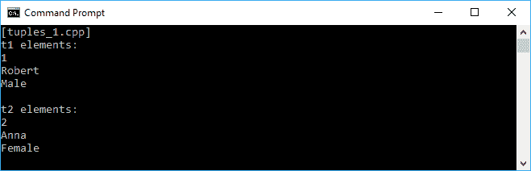

# 解包元组值

元组类中的另一个有用成员是 `tie()`，它用于将元组解包为单独的对象或创建 `lvalue` 引用的元组。此外，我们在元组中还有 `ignore` 辅助类，用于在使用 `tie()` 解包元组时跳过一个元素的占位符。让我们看看下面的代码块中 `tie()` 和 `ignore` 的用法：

```cpp
    /* tuples_2.cpp */
    #include <tuple>
    #include <iostream>

    using namespace std;

    auto main() -> int
   {
      cout << "[tuples_2.cpp]" << endl;

      // Initializing two Tuples
      tuple<int, string, bool> t1(1, "Robert", true);
      auto t2 = make_tuple(2, "Anna", false);

      int i;
      string s;
      bool b;

      // Unpacking t1 Tuples
      tie(i, s, b) = t1;
      cout << "tie(i, s, b) = t1" << endl;
      cout << "i = " << i << endl;
      cout << "s = " << s << endl;
      cout << "b = " << boolalpha << b << endl;
      cout << endl;

      // Unpacking t2 Tuples
      tie(ignore, s, ignore) = t2;
      cout << "tie(ignore, s, ignore) = t2" << endl;
      cout << "new i = " << i << endl;
      cout << "new s = " << s << endl;
      cout << "new b = " << boolalpha << b << endl;
      cout << endl;

      return 0;
    }

```

在上面的代码中，我们有与 `tuples_1.cpp` 相同的两个元组。我们想要使用 `tie()` 方法将 `t1` 解包为变量 `i`、`s` 和 `b`。然后，我们只将 `t2` 解包到变量 `s` 中，忽略 `t2` 中的 `int` 和 `bool` 数据。如果我们运行代码，输出应该如下所示：

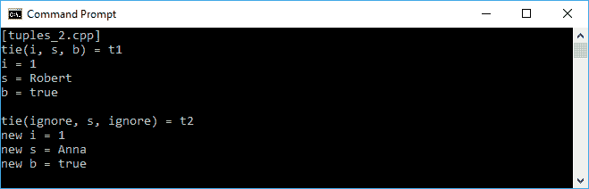

# 返回元组值类型

正如我们之前讨论的，当我们想要编写一个返回多个数据的函数时，我们可以在函数式编程中最大程度地利用元组。让我们看看下面的代码块，了解如何返回元组并访问返回值：

```cpp
    /* tuples_3.cpp */
    #include <tuple>
    #include <iostream>

    using namespace std;

    tuple<int, string, bool> GetData(int DataId)
    {
      if (DataId == 1) 
        return std::make_tuple(0, "Chloe", false);
      else if (DataId == 2) 
        return std::make_tuple(1, "Bryan", true);
      else 
        return std::make_tuple(2, "Zoey", false);
     }

    auto main() -> int
    {
      cout << "[tuples_3.cpp]" << endl;

      auto name = GetData(1);
      cout << "Details of Id 1" << endl;
      cout << "ID = " << get<0>(name) << endl;
      cout << "Name = " << get<1>(name) << endl;
      cout << "Gender = " << (get<2>(name) == true ? 
        "Male" : "Female");
      cout << endl << endl;

      int i;
      string s;
      bool b;
      tie(i, s, b) = GetData(2);
      cout << "Details of Id 2" << endl;
      cout << "ID = " << i << endl;
      cout << "Name = " << s << endl;
      cout << "Gender = " << (b == true ? "Male" : "Female");
      cout << endl;

      return 0;
    }

```

正如我们在上面的代码中所看到的，我们有一个名为 `GetData()` 的新函数，返回一个 `Tuple` 值。从该函数中，我们将消耗返回的数据。我们首先创建名为 name 的变量，并从 `GetData()` 函数中获取值。我们还可以使用 `tie()` 方法解包从 `GetData()` 函数返回的元组，正如我们在代码中访问 ID = `2` 时所看到的。当我们运行代码时，控制台上的输出应该如下截图所示：

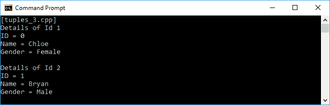

# 总结

通过完成本章，我们已经刷新了对 C++ 语言的经验。现在我们知道 C++ 更加现代化，它带来了许多功能，帮助我们创建更好的程序。我们可以使用标准库使我们的代码更加高效，因为我们不需要编写太多冗余的函数。我们可以使用 Lambda 表达式使我们的代码整洁、易读和易于维护。我们还可以使用智能指针，这样我们就不需要再担心内存管理了。此外，由于我们关注函数式编程中的不可变性，我们将在下一章中更深入地讨论这一点；元组的使用可以帮助我们确保我们的代码中不涉及全局状态。

在下一章中，我们将讨论头等和纯函数，它用于净化我们的类并确保当前函数中不涉及外部状态。因此，它将避免我们的函数式代码中产生副作用。
