# 第二章：在函数式编程中操作函数

在上一章中，我们深入讨论了现代 C++，特别是 C++11 中的新功能——Lambda 表达式。正如我们之前讨论的，Lambda 表达式在简化函数表示法方面非常有用。因此，在本章中，我们将再次应用 Lambda 表达式的威力，它将用于函数式代码，特别是在谈论柯里化时——这是一种分割和减少当前函数的技术。

在本章中，我们将讨论以下主题：

+   应用头等函数和高阶函数，使我们的函数不仅可以作为函数调用，还可以分配给任何变量，传递函数，并返回函数

+   纯函数，以避免我们的函数产生副作用，因为它不再接触外部状态

+   柯里化，正如本章开头提到的，以减少多个参数函数，这样我们可以评估一系列函数，每个函数中只有一个参数

# 在所有函数中应用头等函数

头等函数只是一个普通的类。我们可以像对待其他数据类型一样对待头等函数。然而，在支持头等函数的语言中，我们可以在不递归调用编译器的情况下执行以下任务：

+   将函数作为另一个函数的参数传递

+   将函数分配给变量

+   将函数存储在集合中

+   在运行时从现有函数创建新函数

幸运的是，C++可以用来解决前面的任务。我们将在接下来的主题中深入讨论。

# 将函数作为另一个函数的参数传递

让我们开始将一个函数作为函数参数传递。我们将选择四个函数中的一个，并从其主函数调用该函数。代码将如下所示：

```cpp
    /* first_class_1.cpp */
    #include <functional>
    #include <iostream>

    using namespace std;

    // Defining a type of function named FuncType
    // representing a function
    // that pass two int arguments
    // and return an int value
    typedef function<int(int, int)> FuncType;

    int addition(int x, int y)
    {
      return x + y;
    }

    int subtraction(int x, int y)
    {
      return x - y;
    }

    int multiplication(int x, int y)
    {
      return x * y;
    }

    int division(int x, int y)
    {
      return x / y;
    }

    void PassingFunc(FuncType fn, int x, int y)
    {
      cout << "Result = " << fn(x, y) << endl;
    }

    auto main() -> int
    {
      cout << "[first_class_1.cpp]" << endl;
      int i, a, b;
      FuncType func;

      // Displaying menu for user
      cout << "Select mode:" << endl;
      cout << "1\. Addition" << endl;
      cout << "2\. Subtraction" << endl;
      cout << "3\. Multiplication" << endl;
      cout << "4\. Division" << endl;
      cout << "Choice: ";
      cin >> i;

      // Preventing user to select
      // unavailable modes
      if(i < 1 || i > 4)
      {
         cout << "Please select available mode!";
         return 1;
      }

      // Getting input from user for variable a
      cout << "a -> ";
      cin >> a;

      // Input validation for variable a
      while (cin.fail())
      {
        // Clearing input buffer to restore cin to a usable state
        cin.clear();

        // Ignoring last input
        cin.ignore(INT_MAX, '\n');

        cout << "You can only enter numbers.\n";
        cout << "Enter a number for variable a -> ";
        cin >> a;
      }

      // Getting input from user for variable b
      cout << "b -> ";
      cin >> b;

      // Input validation for variable b
      while (cin.fail())
      {
        // Clearing input buffer to restore cin to a usable state
        cin.clear();

        // Ignoring last input
        cin.ignore(INT_MAX, '\n');

        cout << "You can only enter numbers.\n";
        cout << "Enter a number for variable b -> ";
        cin >> b;
      }
      switch(i)
      {
        case 1: PassingFunc(addition, a, b); break;
        case 2: PassingFunc(subtraction, a, b); break;
        case 3: PassingFunc(multiplication, a, b); break;
        case 4: PassingFunc(division, a, b); break;
      }

      return 0;
    }

```

从前面的代码中，我们可以看到我们有四个函数，我们希望用户选择一个，然后运行它。在 switch 语句中，我们将根据用户的选择调用四个函数中的一个。我们将选择的函数传递给`PassingFunc()`，如下面的代码片段所示：

```cpp
    case 1: PassingFunc(addition, a, b); break;
    case 2: PassingFunc(subtraction, a, b); break;
    case 3: PassingFunc(multiplication, a, b); break;
    case 4: PassingFunc(division, a, b); break;

```

我们还有输入验证，以防止用户选择不可用的模式，以及为变量`a`和`b`输入非整数值。我们在屏幕上看到的输出应该是这样的：

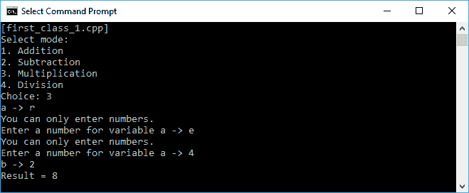

前面的屏幕截图显示，我们从可用模式中选择了“乘法”模式。然后，我们尝试为变量`a`输入`r`和`e`变量。幸运的是，程序拒绝了它，因为我们已经进行了输入验证。然后，我们给变量`a`赋值`4`，给变量`b`赋值`2`。正如我们期望的那样，程序给我们返回`8`作为结果。

正如我们在`first_class_1.cpp`程序中看到的，我们使用`std::function`类和`typedef`关键字来简化代码。`std::function`类用于存储、复制和调用任何可调用函数、Lambda 表达式或其他函数对象，以及成员函数指针和数据成员指针。然而，`typedef`关键字用作另一个类型或函数的别名。

# 将函数分配给变量

我们还可以将函数分配给变量，这样我们可以通过调用变量来调用函数。我们将重构`first_class_1.cpp`，代码将如下所示：

```cpp
    /* first_class_2.cpp */
    #include <functional>
    #include <iostream>

    using namespace std;

    // Defining a type of function named FuncType
    // representing a function
    // that pass two int arguments
    // and return an int value
    typedef function<int(int, int)> FuncType;

    int addition(int x, int y)
    {
      return x + y;
    }

    int subtraction(int x, int y)
    {
      return x - y;
    }

    int multiplication(int x, int y)
    {
      return x * y;
    }

    int division(int x, int y)
    {
      return x / y;
    }

    auto main() -> int
    {
      cout << "[first_class_2.cpp]" << endl;

      int i, a, b;
      FuncType func;

      // Displaying menu for user
      cout << "Select mode:" << endl;
      cout << "1\. Addition" << endl;
      cout << "2\. Subtraction" << endl;
      cout << "3\. Multiplication" << endl;
      cout << "4\. Division" << endl;
      cout << "Choice: ";
      cin >> i;

      // Preventing user to select
      // unavailable modes
      if(i < 1 || i > 4)
      {
        cout << "Please select available mode!";
        return 1;
      }

      // Getting input from user for variable a
      cout << "a -> ";
      cin >> a;

      // Input validation for variable a
      while (cin.fail())
      {
        // Clearing input buffer to restore cin to a usable state
        cin.clear();

        // Ignoring last input
        cin.ignore(INT_MAX, '\n');

        cout << "You can only enter numbers.\n";
        cout << "Enter a number for variable a -> ";
        cin >> a;
      }

      // Getting input from user for variable b
      cout << "b -> ";
      cin >> b;

      // Input validation for variable b
      while (cin.fail())
      {
        // Clearing input buffer to restore cin to a usable state
        cin.clear();

        // Ignoring last input
        cin.ignore(INT_MAX, '\n');

        cout << "You can only enter numbers.\n";
        cout << "Enter a number for variable b -> ";
        cin >> b;
      }

      switch(i)
      {
        case 1: func = addition; break;
        case 2: func = subtraction; break;
        case 3: func = multiplication; break;
        case 4: func = division; break;
      }

      cout << "Result = " << func(a, b) << endl;

      return 0;
    }

```

我们现在将根据用户的选择分配四个函数，并将所选函数存储在`func`变量中的 switch 语句内，如下所示：

```cpp
    case 1: func = addition; break;
    case 2: func = subtraction; break;
    case 3: func = multiplication; break;
    case 4: func = division; break;

```

在`func`变量被赋予用户的选择后，代码将像调用函数一样调用变量，如下面的代码行所示：

```cpp
    cout << "Result = " << func(a, b) << endl;

```

然后，如果我们运行代码，我们将在控制台上获得相同的输出。

# 将函数存储在容器中

现在，让我们将函数保存到容器中。在这里，我们将使用**vector**作为容器。代码编写如下：

```cpp
    /* first_class_3.cpp */
    #include <vector>
    #include <functional>
    #include <iostream>

    using namespace std;

    // Defining a type of function named FuncType
    // representing a function
    // that pass two int arguments
    // and return an int value
    typedef function<int(int, int)> FuncType;

    int addition(int x, int y)
    {
      return x + y;
    }

    int subtraction(int x, int y)
    {
      return x - y;
    }

    int multiplication(int x, int y)
    {
      return x * y;
    }

    int division(int x, int y)
    {
      return x / y;
    }

    auto main() -> int
    {
      cout << "[first_class_3.cpp]" << endl;

      // Declaring a vector containing FuncType element
      vector<FuncType> functions;

      // Assigning several FuncType elements to the vector
      functions.push_back(addition);
      functions.push_back(subtraction);
      functions.push_back(multiplication);
      functions.push_back(division);

      int i, a, b;
      function<int(int, int)> func;

      // Displaying menu for user
      cout << "Select mode:" << endl;
      cout << "1\. Addition" << endl;
      cout << "2\. Subtraction" << endl;
      cout << "3\. Multiplication" << endl;
      cout << "4\. Division" << endl;
      cout << "Choice: ";
      cin >> i;

      // Preventing user to select
      // unavailable modes
      if(i < 1 || i > 4)
      {
        cout << "Please select available mode!";
        return 1;
      }

      // Getting input from user for variable a
      cout << "a -> ";
      cin >> a;

      // Input validation for variable a
      while (cin.fail())
      {
        // Clearing input buffer to restore cin to a usable state
        cin.clear();

        // Ignoring last input
        cin.ignore(INT_MAX, '\n');

        cout << "You can only enter numbers.\n";
        cout << "Enter a number for variable a -> ";
        cin >> a;
      }

      // Getting input from user for variable b
      cout << "b -> ";
      cin >> b;

      // Input validation for variable b
      while (cin.fail())
      {
        // Clearing input buffer to restore cin to a usable state
        cin.clear();

        // Ignoring last input
        cin.ignore(INT_MAX, '\n');

        cout << "You can only enter numbers.\n";
        cout << "Enter a number for variable b -> ";
        cin >> b;
      }

      // Invoking the function inside the vector
      cout << "Result = " << functions.at(i - 1)(a, b) << endl;

      return 0;
    }

```

从前面的代码中，我们可以看到我们创建了一个名为 functions 的新向量，然后将四个不同的函数存储到其中。就像我们之前的两个代码示例一样，我们也要求用户选择模式。然而，现在代码变得更简单了，因为我们不需要添加 switch 语句；我们可以通过选择向量索引直接选择函数，就像我们在下面的代码片段中看到的那样：

```cpp
    cout << "Result = " << functions.at(i - 1)(a, b) << endl;

```

然而，由于向量是基于零的索引，我们必须调整菜单选择的索引。结果将与我们之前的两个代码示例相同。

# 在运行时从现有函数创建新函数

现在让我们从现有函数中在运行时创建一个新函数。假设我们有两个函数集合，第一个是双曲函数，第二个是第一个函数的反函数。除了这些内置函数之外，我们还在第一个集合中添加一个用户定义的函数来计算平方数，在第二个集合中添加平方数的反函数。然后，我们将实现函数组合，并从两个现有函数构建一个新函数。

**函数组合**是将两个或多个简单函数组合成一个更复杂的函数的过程。每个函数的结果作为下一个函数的参数传递。最终结果是从最后一个函数的结果获得的。在数学方法中，我们通常使用以下符号来表示函数组合：`compose(f, g) (x) = f(g(x))`。假设我们有以下代码：

`double x, y, z; // ... y = g(x); z = f(y);`

因此，为了简化表示，我们可以使用函数组合，并对*z*有以下表示：

`z = f(g(x));`

如果我们运行双曲函数，然后将结果传递给反函数，我们将看到我们确实得到了传递给双曲函数的原始值。现在，让我们看一下以下代码：

```cpp
    /* first_class_4.cpp */
    #include <vector>
    #include <cmath>
    #include <algorithm>
    #include <functional>
    #include <iostream>

    using std::vector;
    using std::function;
    using std::transform;
    using std::back_inserter;
    using std::cout;
    using std::endl;

    // Defining a type of function named HyperbolicFunc
    // representing a function
    // that pass a double argument
    // and return an double value
    typedef function<double(double)> HyperbolicFunc;

    // Initializing a vector containing four functions
    vector<HyperbolicFunc> funcs = {
      sinh,
      cosh,
      tanh,
      [](double x) {
        return x*x; }
    };

    // Initializing a vector containing four functions
    vector<HyperbolicFunc> inverseFuncs = {
      asinh,
      acosh,
      atanh,
      [](double x) {
        return exp(log(x)/2); }
    };

    // Declaring a template to be able to be reused
    template <typename A, typename B, typename C>
    function<C(A)> compose(
      function<C(B)> f,
      function<B(A)> g) {
        return f,g {
            return f(g(x));
      };
    }

    auto main() -> int
    {
      cout << "[first_class_4.cpp]" << endl;

      // Declaring a template to be able to be reused
      vector<HyperbolicFunc> composedFuncs;

      // Initializing a vector containing several double elements
      vector<double> nums;
      for (int i = 1; i <= 5; ++i)
        nums.push_back(i * 0.2);

      // Transforming the element inside the vector
      transform(
        begin(inverseFuncs),
        end(inverseFuncs),
        begin(funcs),
        back_inserter(composedFuncs),
        compose<double, double, double>);

      for (auto num: nums)
      {
        for (auto func: composedFuncs)
            cout << "f(g(" << num << ")) = " << func(num) << endl;

        cout << "---------------" << endl;
      }

      return 0;
    }

```

正如我们在前面的代码中所看到的，我们有两个函数集合--`funcs`和`inverseFuncs`。此外，正如我们之前讨论的，`inverseFuncs`函数是`funcs`函数的反函数。`funcs`函数包含三个内置的双曲函数，以及一个用户定义的函数来计算平方数，而`inverseFuncs`包含三个内置的反双曲函数，以及一个用户定义的函数来计算平方数的反函数。

正如我们在前面的`first_class_4.cpp`代码中所看到的，当调用`using`关键字时，我们将使用单独的类/函数。与本章中的其他代码示例相比，在单独的类/函数中使用`using`关键字是不一致的，因为我们使用`using namespace std`。这是因为在`std`命名空间中有一个冲突的函数名称，所以我们必须单独调用它们。

通过使用这两个函数集合，我们将从中构建一个新函数。为了实现这个目的，我们将使用`transform()`函数来组合来自两个不同集合的两个函数。代码片段如下：

```cpp
 transform(
 begin(inverseFuncs), 
 inverseFuncs.end(inverseFuncs), 
 begin(funcs), 
 back_inserter(composedFuncs), 
 compose<double, double, double>);

```

现在，我们在`composedFuncs`向量中存储了一个新的函数集合。我们可以迭代集合，并将我们在`nums`变量中提供的值传递给这个新函数。如果我们运行代码，我们应该在控制台上获得以下输出：

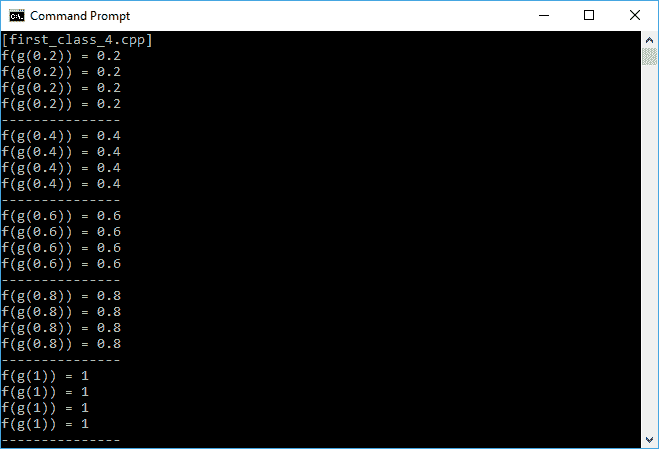

从前面的输出中可以看出，无论我们传递给变换函数什么，我们都将得到与输入相同的输出。在这里，我们可以证明 C++编程可以用于从两个或多个现有函数组合一个函数。

在前面的`first_class_4.cpp`代码中，我们在代码中使用了`template<>`。如果您需要关于`template<>`的更详细解释，请参考第七章，*使用并行执行运行并发*。

# 在高阶函数中熟悉三种功能技术

我们讨论了在一等函数中，C++语言将函数视为值，这意味着我们可以将它们传递给其他函数，分配给变量等。然而，在函数式编程中，我们还有另一个术语，即高阶函数，这是指可以处理其他函数的函数。这意味着高阶函数可以将函数作为参数传递，也可以返回一个函数。

高阶函数的概念可以应用于一般的函数，比如数学函数，而不仅仅是适用于函数式编程语言的一等函数概念。现在，让我们来看看函数式编程中三个最有用的高阶函数--**map**，**filter**和**fold**。

# 使用 map 执行每个元素列表

我们不会将 map 作为 C++语言中的容器来讨论，而是作为高阶函数的一个特性。这个特性用于将给定的函数应用于列表的每个元素，并按相同的顺序返回结果列表。我们可以使用`transform()`函数来实现这个目的。正如你所知，我们之前已经讨论过这个函数。然而，我们可以看一下下面的代码片段，查看`transform()`函数的使用：

```cpp
    /* transform_1.cpp */
    #include <vector>
    #include <algorithm>
    #include <iostream>

    using namespace std;

    auto main() -> int
    {
      cout << "[transform_1.cpp]" << endl;

      // Initializing a vector containing integer element
      vector<int> v1;
      for (int i = 0; i < 5; ++i)
        v1.push_back(i);

      // Creating another v2 vector
      vector<int> v2;
      // Resizing the size of v2 exactly same with v1
      v2.resize(v1.size());

      // Transforming the element inside the vector
      transform (
        begin(v1),
        end(v1),
        begin(v2),
        [](int i){
            return i * i;});

      // Displaying the elements of v1
      std::cout << "v1 contains:";
      for (auto v : v1)
        std::cout << " " << v;
      std::cout << endl;

      // Displaying the elements of v2
      std::cout << "v2 contains:";
      for (auto v : v2)
        std::cout << " " << v;
      std::cout << endl;

      return 0;
    }

```

正如我们在高阶函数中的 map 的前面定义中所看到的，它将对列表的每个元素应用给定的函数。在前面的代码中，我们尝试使用 Lambda 表达式将`v1`向量映射到`v2`向量，给定的函数如下：

```cpp
 transform (
      begin(v1), 
      end(v1), 
      begin(v2), 
      [](int i){
        return i * i;});

```

如果我们运行代码，应该在控制台屏幕上得到以下输出：

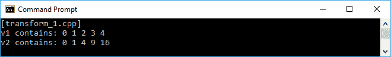

正如我们在输出显示中所看到的，我们使用 Lambda 表达式中给定的函数将`v1`转换为`v2`，这个函数是将输入值加倍。

# 使用过滤器提取数据

在高阶函数中，过滤器是一个从现有数据结构中生成新数据结构的函数，新数据结构中的每个元素都与返回布尔值的给定谓词完全匹配。在 C++语言中，我们可以应用`copy_if()`函数，它是在 C++11 中添加的，来进行过滤过程。让我们看一下下面的代码片段，分析使用`copy_if()`函数进行过滤过程：

```cpp
    /* filter_1.cpp */
    #include <vector>
    #include <algorithm>
    #include <iterator>
    #include <iostream>

    using namespace std;

    auto main() -> int
    {
      cout << "[filter_1.cpp]" << endl;

      // Initializing a vector containing integer elements
      vector<int> numbers;
      for (int i = 0; i < 20; ++i)
        numbers.push_back(i);

       // Displaying the elements of numbers
       cout << "The original numbers: " << endl;
       copy(
        begin(numbers),
        end(numbers),
        ostream_iterator<int>(cout, " "));
       cout << endl;

       // Declaring a vector containing int elements
       vector<int> primes;

      // Filtering the vector
      copy_if(
        begin(numbers),
        end(numbers),
        back_inserter(primes),
        [](int n) {
            if(n < 2) {
                return (n != 0) ? true : false;}
            else {
                for (int j = 2; j < n; ++j) {
                    if (n % j == 0){
                        return false;}
            }

            return true;
         }});

        // Displaying the elements of primes
        // using copy() function
        cout << "The primes numbers: " << endl;
        copy(
         begin(primes),
         end(primes),
         ostream_iterator<int>(cout, " "));
         cout << endl;

         return 0;
    }

```

正如我们在前面的代码中所看到的，我们使用`copy_if()`函数将`numbers`向量过滤为`0`素数向量。我们将传递 Lambda 表达式来决定所选元素是否为素数，就像我们在第一章中的`lambda_multiline_func.cpp`代码中所使用的那样，我们还将使用`copy()`函数将所选向量中的所有元素复制出来打印。当我们运行前面的代码时，结果应该是这样的：

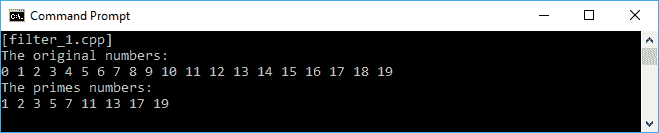

除了`copy_if()`函数，我们还可以使用`remove_copy_if()`函数来过滤数据结构。使用`remove_copy_if()`函数将不选择匹配谓词元素的现有数据结构中的元素，而是选择不匹配的元素，并将其存储在新的数据结构中。让我们重构我们的`filter_1.cpp`代码，并创建一个不是素数的新向量。代码将如下所示：

```cpp
    /* filter_2.cpp */
    #include <vector>
    #include <algorithm>
    #include <iterator>
    #include <iostream>

    using namespace std;

    int main()
   {
      cout << "[filter_2.cpp]" << endl;

      // Initializing a vector containing integer elements
      vector<int> numbers;
      for (int i = 0; i < 20; ++i)
        numbers.push_back(i);

      // Displaying the elements of numbers
      cout << "The original numbers: " << endl;
      copy(
        begin(numbers),
        end(numbers),
        ostream_iterator<int>(cout, " "));
      cout << endl;

      // Declaring a vector containing int elements
      vector<int> nonPrimes;

      // Filtering the vector
      remove_copy_if(
        numbers.begin(),
        numbers.end(),
        back_inserter(nonPrimes),
        [](int n) {
            if(n < 2){
                return (n != 0) ? true : false;}
            else {
                for (int j = 2; j < n; ++j){
                    if (n % j == 0) {
                        return false;}
            }

            return true;
        }});

      // Displaying the elements of nonPrimes
      // using copy() function
      cout << "The non-primes numbers: " << endl;
      copy(
        begin(nonPrimes),
        end(nonPrimes),
        ostream_iterator<int>(cout, " "));
      cout << endl;

      return 0;
    }

```

从前面突出显示的代码中，我们重构了以前的代码，并使用`remove_copy_if()`函数选择非素数。正如我们所期望的，控制台窗口将显示以下输出：

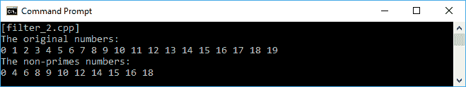

现在我们有了非素数，而不是像在`filter_1.cpp`代码中那样的素数。

# 使用折叠组合列表的所有元素

在函数式编程中，折叠是一种将数据结构减少为单个值的技术。有两种类型的折叠——左折叠（`foldl`）和右折叠（`foldr`）。假设我们有一个包含 0、1、2、3 和 4 的列表。让我们使用折叠技术来添加列表的所有内容，首先使用`foldl`，然后使用`foldr`。然而，两者之间有一个显著的区别——`foldl`是左结合的，这意味着我们首先组合最左边的元素，然后向右边移动。例如，通过我们拥有的列表，我们将得到以下括号：

```cpp
    ((((0 + 1) + 2) + 3) + 4)

```

而`foldr`是右结合的，这意味着我们将首先组合最右边的元素，然后向左边移动。括号将如下代码行所示：

```cpp
    (0 + (1 + (2 + (3 + 4))))

```

现在，让我们来看一下以下的代码：

```cpp
    /* fold_1.cpp */
    #include <vector>
    #include <numeric>
    #include <functional>
    #include <iostream>

    using namespace std;

    auto main() -> int
    {
      cout << "[fold_1.cpp]" << endl;

      // Initializing a vector containing integer elements
      vector<int> numbers = {0, 1, 2, 3, 4};

      // Calculating the sum of the value
      // in the vector
      auto foldl = accumulate(
        begin(numbers),
        end(numbers),
        0,
        std::plus<int>());

      // Calculating the sum of the value
      // in the vector
      auto foldr = accumulate(
        rbegin(numbers),
        rend(numbers),
        0,
        std::plus<int>());

      // Displaying the calculating result
      cout << "foldl result = " << foldl << endl;
      cout << "foldr result = " << foldr << endl;

      return 0;
    }

```

在 C++编程中，我们可以使用`accumulate()`函数应用`fold`技术。正如我们在前面的代码中看到的，我们在`foldl`中使用前向迭代器，而在`foldr`中使用后向迭代器。控制台上的输出应该如下截图所示：

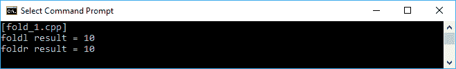

正如我们在前面的输出截图中看到的，我们对`foldl`和`foldr`技术得到了相同的结果。对于那些好奇求和的顺序的人，我们可以将前面的代码重构为以下代码：

```cpp
    /* fold_2.cpp */
    #include <vector>
    #include <numeric>
    #include <functional>
    #include <iostream>

    using namespace std;

    // Function for logging the flow
    int addition(const int& x, const int& y)
    {
      cout << x << " + " << y << endl;
      return x + y;
    }

    int main()
    {
      cout << "[fold_2.cpp]" << endl;

      // Initializing a vector containing integer elements
      vector<int> numbers = {0, 1, 2, 3, 4};

      // Calculating the sum of the value
      // in the vector
      // from left to right
      cout << "foldl" << endl;
      auto foldl = accumulate(
          begin(numbers),
          end(numbers),
          0,
          addition);

      // Calculating the sum of the value
      // in the vector
      // from right to left
      cout << endl << "foldr" << endl;
      auto foldr = accumulate(
          rbegin(numbers),
          rend(numbers),
          0,
          addition);

      cout << endl;

      // Displaying the calculating result
      cout << "foldl result = " << foldl << endl;
      cout << "foldr result = " << foldr << endl;

      return 0;
    }

```

在前面的代码中，我们传递了一个新的`addition()`函数并将其传递给`accumulate()`函数。从`addition()`函数中，我们将跟踪每个元素的操作。现在，让我们运行前面的代码，其输出将如下所示：

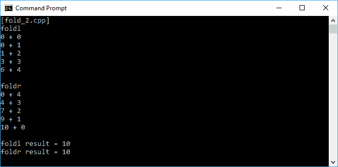

从前面的输出截图中，我们可以看到，即使`foldl`和`foldr`都给出了完全相同的结果，它们执行的操作顺序不同。由于我们将初始值设置为`0`，加法操作从`foldl`技术中的第一个元素开始，然后在`foldr`技术中的最后一个元素开始。

我们将初始值设置为`0`，因为`0`是不会影响加法结果的加法恒等元。然而，在乘法中，我们必须考虑将初始值更改为`1`，因为`1`是乘法的单位元。

# 通过纯函数避免副作用

**纯函数**是一个函数，每次给定相同的输入时都会返回相同的结果。结果不依赖于任何信息或状态，也不会产生**副作用**，或者改变函数之外的系统状态。让我们看看以下代码片段：

```cpp
    /* pure_function_1.cpp */
    #include <iostream>

    using namespace std;

    float circleArea(float r)
    {
      return 3.14 * r * r;
    }

    auto main() -> int
    {
      cout << "[pure_function_1.cpp]" << endl;

      // Initializing a float variable
      float f = 2.5f;

      // Invoking the circleArea() function
      // passing the f variable five times
      for(int i = 1; i <= 5; ++i)
      {
        cout << "Invocation " << i << " -> ";
        cout << "Result of circleArea(" << f << ") = ";
        cout << circleArea(f) << endl;
      }

      return 0;
    }

```

从前面的代码中，我们可以看到一个名为`circleArea()`的函数，根据给定的半径计算圆的面积。然后我们调用该函数五次并传递相同的半径值。控制台上的输出应该如下截图所示：

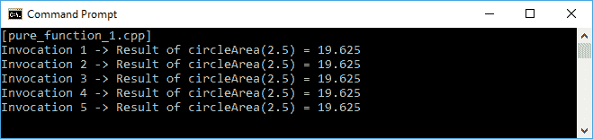

正如我们所看到的，在五次调用中传递相同的输入，函数返回的输出也是相同的。因此我们可以说`circleArea()`是一个纯函数。现在，让我们看看在以下代码片段中不纯的函数是什么样子的：

```cpp
    /* impure_function_1.cpp */
    #include <iostream>

    using namespace std;

    // Initializing a global variable
    int currentState = 0;

    int increment(int i)
    {
      currentState += i;
      return currentState;
    }

    auto main() -> int
    {
      cout << "[impure_function_1.cpp]" << endl;

      // Initializing a local variable
      int fix = 5;

      // Involving the global variable
      // in the calculation
      for(int i = 1; i <= 5; ++i)
      {
        cout << "Invocation " << i << " -> ";
        cout << "Result of increment(" << fix << ") = ";
        cout << increment(fix) << endl;
      }

       return 0;
    }

```

在前面的代码中，我们看到一个名为`increment()`的函数增加了`currentState`变量的值。正如我们所看到的，`increment()`函数依赖于`currentState`变量的值，因此它不是一个纯函数。让我们通过运行前面的代码来证明这一点。控制台窗口应该显示以下截图：

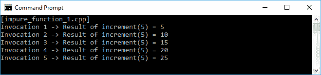

我们看到`increment()`函数给出了不同的结果，即使我们传递相同的输入。这是不纯函数的副作用，当它依赖于外部状态或改变外部状态的值时。

我们已经能够区分纯函数和不纯函数。然而，请考虑以下代码：

```cpp
    /* im_pure_function_1.cpp */
    #include <iostream>

    using namespace std;

    // Initializing a global variable
    float phi = 3.14f;

    float circleArea(float r)
    {
      return phi * r * r;
    }

    auto main() -> int
    {
      cout << "[im_pure_function_1.cpp]" << endl;

      // Initializing a float variable
      float f = 2.5f;

      // Involving the global variable
      // in the calculation
      for(int i = 1; i <= 5; ++i)
      {
        cout << "Invocation " << i << " -> ";
        cout << "Result of circleArea(" << f << ") = ";
        cout << circleArea(f) << endl;
      }

      return 0;
    }

```

上述代码来自`pure_function_1.cpp`，但我们添加了一个全局状态`phi`。如果我们运行上述代码，我们肯定会得到与`pure_function_1.cpp`相同的结果。尽管函数在五次调用中返回相同的结果，但`im_pure_function_1.cpp`中的`circleArea()`不是一个纯函数，因为它依赖于`phi`变量。

副作用不仅是函数所做的全局状态的改变。向屏幕打印也是副作用。然而，由于我们需要显示我们创建的每个代码的结果，我们无法避免在我们的代码中存在向屏幕打印的情况。在下一章中，我们还将讨论不可变状态，这是我们可以将不纯函数转变为纯函数的方法。

# 使用柯里化来减少多参数函数

柯里化是一种将接受多个参数的函数拆分为评估一系列具有单个参数的函数的技术。换句话说，我们通过减少当前函数来创建其他函数。假设我们有一个名为`areaOfRectangle()`的函数，它接受两个参数，`length`和`width`。代码将如下所示：

```cpp
    /* curry_1.cpp */

    #include <functional>
    #include <iostream>

    using namespace std;

    // Variadic template for currying
    template<typename Func, typename... Args>
    auto curry(Func func, Args... args)
    {
      return =
      {
        return func(args..., lastParam...);
      };
    }

    int areaOfRectangle(int length, int width)
    {
      return length * width;
    }

    auto main() -> int
    {
      cout << "[curry_1.cpp]" << endl;

      // Currying the areaOfRectangle() function
      auto length5 = curry(areaOfRectangle, 5);

      // Invoking the curried function
      cout << "Curried with spesific length = 5" << endl;
      for(int i = 0; i <= 5; ++i)
      {
        cout << "length5(" << i << ") = ";
        cout << length5(i) << endl;
      }

      return 0;
    }

```

如前面的代码中所示，我们有一个可变模板和名为`curry`的函数。我们将使用此模板来构建一个柯里化函数。在正常的函数调用中，我们可以如下调用`areaOfRectangle()`函数：

```cpp
    int i = areaOfRectangle(5, 2);

```

如前面的代码片段中所示，我们将`5`和`2`作为参数传递给`areaOfRectangle()`函数。但是，使用柯里化函数，我们可以减少`areaOfRectangle()`函数，使其只有一个参数。我们只需要调用柯里化函数模板，如下所示：

```cpp
 auto length5 = curry(areaOfRectangle, 5);

```

现在，我们有了`areaOfRectangle()`函数，它具有名为`length5`的`length`参数的值。我们可以更容易地调用函数，并只添加`width`参数，如下面的代码片段所示：

```cpp
 length5(i) // where i is the width parameter we want to pass

```

让我们来看看当我们运行上述代码时，控制台上会看到的输出：

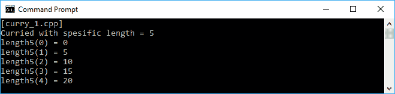

可变模板和函数已经帮助我们将`areaOfRectangle()`函数减少为`length5()`函数。但是，它也可以帮助我们减少具有两个以上参数的函数。假设我们有一个名为`volumeOfRectanglular()`的函数，它传递三个参数。我们也将减少该函数，如下面的代码所示：

```cpp
    /* curry_2.cpp */

    #include <functional>
    #include <iostream>

    using namespace std;

    // Variadic template for currying
    template<typename Func, typename... Args>
    auto curry(Func func, Args... args)
    {
      return =
      {
        return func(args..., lastParam...);
      };
    }

    int volumeOfRectanglular(
      int length,
      int width,
      int height)
     {
        return length * width * height;
     }

    auto main() -> int
    {
      cout << "[curry_2.cpp]" << endl;

      // Currying the volumeOfRectanglular() function
      auto length5width4 = curry(volumeOfRectanglular, 5, 4);

      // Invoking the curried function
      cout << "Curried with spesific data:" << endl;
      cout << "length = 5, width 4" << endl;
      for(int i = 0; i <= 5; ++i)
      {
        cout << "length5width4(" << i << ") = ";
        cout << length5width4(i) << endl;
      }

      return 0;
    }

```

如前面的代码中所示，我们已成功将`length`和`width`参数传递给`volumeOfRectanglular()`函数，然后将其减少为`length5width4()`。我们可以调用`length5width4()`函数，并只传递其余参数`height`。如果我们运行上述代码，我们将在控制台屏幕上看到以下输出：

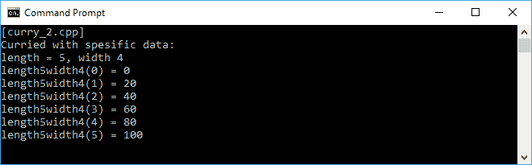

通过使用柯里化技术，我们可以通过减少函数来部分评估多个参数函数，使其只传递单个参数。

# 总结

我们已经讨论了一些操纵函数的技术。我们将从中获得许多优势。由于我们可以在 C++语言中实现头等函数，我们可以将一个函数作为另一个函数的参数传递。我们可以将函数视为数据对象，因此可以将其分配给变量并存储在容器中。此外，我们可以从现有函数中组合出一个新的函数。此外，通过使用 map、filter 和 fold，我们可以在我们创建的每个函数中实现高阶函数。

我们还有另一种技术可以实现更好的函数式代码，那就是使用纯函数来避免副作用。我们可以重构所有函数，使其不会与外部变量或状态交互，并且不会改变或检索外部状态的值。此外，为了减少多参数函数，以便我们可以评估其顺序，我们可以将柯里化技术应用到我们的函数中。

在下一章中，我们将讨论另一种避免副作用的技术。我们将使代码中的所有状态都是不可变的，这样每次调用函数时都不会发生状态变化。
