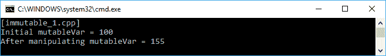
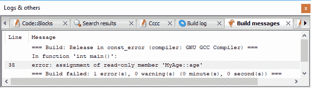
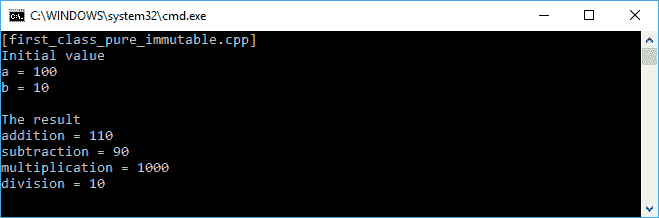
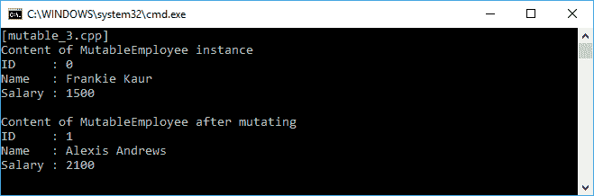
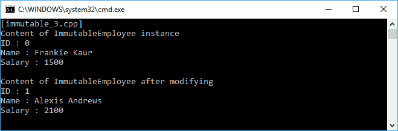

# 将不可变状态应用于函数

在上一章讨论了头等函数和纯函数之后，现在让我们谈谈可变和不可变对象。正如您所学到的，我们必须能够在头等函数中将一个函数传递给另一个函数，并确保如果我们传递相同的参数，函数返回相同的值。我们将讨论的不可变对象可以帮助我们使这两个函数式编程概念在我们的代码中可用。本章我们将讨论以下主题：

+   以函数式编程方法修改变量

+   演示使用`const`关键字来避免值修改

+   将头等函数和纯函数应用于不可变对象

+   将可变对象重构为不可变对象

+   不可变对象比可变对象的好处

# 从不可变对象中理解基本部分

在面向对象编程中，我们通常多次操纵变量对象，甚至在类本身内部，我们通常描述为属性。此外，我们有时会从特定函数更改全局变量。然而，为了在函数式编程中获得不可变性特性，我们必须遵守两条规则。首先，我们不允许更改局部变量。其次，我们必须避免在函数中涉及全局变量，因为这将影响函数结果。

# 修改局部变量

当我们谈论变量时，我们谈论的是一个容器，用于存储我们的数据。在我们日常编程中，我们通常会重用我们创建的变量。为了更清楚，让我们看一下`mutable_1.cpp`代码。我们有`mutableVar`变量并将`100`存储到其中。然后我们为`i`变量迭代操纵其值。代码如下所示：

```cpp
    /* mutable_1.cpp */
    #include <iostream>

    using namespace std;

    auto main() -> int
    {
      cout << "[mutable_1.cpp]" << endl;

      // Initializing an int variable
      int mutableVar = 100;
      cout << "Initial mutableVar = " << mutableVar;
      cout << endl;

      // Manipulating mutableVar
      for(int i = 0; i <= 10; ++i)
        mutableVar = mutableVar + i;

      // Displaying mutableVar value
      cout << "After manipulating mutableVar = " << mutableVar;
      cout << endl;

      return 0;
    }

```

我们在屏幕上应该看到的结果将如下截图所示：


正如我们所看到的，我们成功地操纵了`mutableVar`变量。然而，我们将`mutableVar`变量视为可变对象。这是因为我们多次重用`mutableVar`变量。换句话说，我们打破了之前讨论的不可变规则。如果我们愿意，我们可以重构`mutable_1.cpp`代码成为不可变的。让我们分析`immutable_1.cpp`代码。在这里，每次我们打算改变之前的变量时，我们将创建一个新的局部变量。代码如下所示：

```cpp
    /* immutable_1.cpp */
    #include <iostream>

    using namespace std;

    auto main() -> int
    {
      cout << "[immutable_1.cpp]" << endl;

      // Initializing an int variable
      int mutableVar = 100;
      cout << "Initial mutableVar = " << mutableVar;
      cout << endl;

      // Manipulating mutableVar using immutable approach
      int mutableVar0 = mutableVar + 0;
 int mutableVar1 = mutableVar0 + 1;
 int mutableVar2 = mutableVar1 + 2;
 int mutableVar3 = mutableVar2 + 3;
 int mutableVar4 = mutableVar3 + 4;
 int mutableVar5 = mutableVar4 + 5;
 int mutableVar6 = mutableVar5 + 6;
 int mutableVar7 = mutableVar6 + 7;
 int mutableVar8 = mutableVar7 + 8;
 int mutableVar9 = mutableVar8 + 9;
 int mutableVar10 = mutableVar9 + 10;

      // Displaying mutableVar value in mutable variable
      cout << "After manipulating mutableVar = " << mutableVar10;
      cout << endl;

      return 0;
    }

```

正如我们所看到的，为了避免更改局部变量`mutableVar`，我们创建了其他十个局部变量。结果存储在`mutableVar10`变量中。然后我们将结果显示到控制台。的确，在我们的编程活动习惯中，这是不常见的。然而，这是我们可以做到获得不可变对象的方式。通过采用这种不可变方法，我们永远不会错过以前的状态，因为我们拥有所有状态。此外，通过运行`immutable_1.cpp`获得的输出与`mutable_1.cpp`代码的输出完全相同，如我们在以下截图中所见：



然而，由于`immutable_1.cpp`代码中有更多的代码行比`mutable_1.cpp`代码，因此`immutable_1.cpp`代码的性能将比`mutable_1.cpp`代码慢。此外，当然，`mutable_1.cpp`代码比`immutable_1.cpp`代码更有效率。

# 修改传递给函数的变量

现在，我们将讨论当变量传递给函数时如何修改变量。假设我们有一个名为`n`的变量，其中包含一个字符串数据。然后，我们将其作为参数传递给名为`Modify()`的函数。在函数内部，我们操纵了名称变量。让我们看一下以下`immutable_2.cpp`代码并分析它：

```cpp
    /* immutable_2.cpp */
    #include <iostream>

    using namespace std;

    void Modify(string name)
    {
      name = "Alexis Andrews";
    }

    auto main() -> int
    {
      cout << "[immutable_2.cpp]" << endl;

      // Initializing a string variable
      string n = "Frankie Kaur";
      cout << "Initial name = " << n;
      cout << endl;

      // Invoking Modify() function
      // to modify the n variable
      Modify(n);

      // Displaying n value
      cout << "After manipulating = " << n;
      cout << endl;

      return 0;
    }

```

从前面的代码中，我们看到将`Frankie Kaur`存储为`n`变量的初始值，然后在`Modify()`函数中修改为`Alexis Andrews`。现在，让我们看看运行前面的代码时屏幕上的输出：


从前面的截图中可以看出，尽管我们在`Modify()`函数中对其进行了修改，但`name`变量仍然包含`Frankie Kaur`作为其值。这是因为我们在`main()`函数中传递了`n`变量，而`Modify()`函数接收了存储在`name`变量中的值的副本，因此`name`变量保持不变，包含原始值。如果我们将其作为引用传递，我们可以改变`n`变量，就像我们在下面的`mutable_2.cpp`代码中看到的那样：

```cpp
    /* mutable_2.cpp */
    #include <iostream>

    using namespace std;

    void Modify(string &name)
    {
      name = "Alexis Andrews";
    }

    auto main() -> int
    {
      cout << "[mutable_2.cpp]" << endl;

      // Initializing a string variable
      string n = "Frankie Kaur";
      cout << "Initial name = " << n;
      cout << endl;

      // Invoking Modify() function
      // to modify the n variable
      Modify(n);

      // Displaying n value
      cout << "After manipulating = " << n;
      cout << endl;

      return 0;
    }

```

只需在`Modify()`函数的参数中添加`&`符号，现在将参数作为引用传递。屏幕上的输出将如下截图所示：


根据前面的截图，`n`变量现在已经成功在`Modify()`函数中被更改，因为我们传递的是`n`变量的引用，而不是值本身。还有另一种更好的方法来改变变量，使用结构体或类类型，就像我们在下面的`mutable_2a.cpp`代码中看到的那样：

```cpp
     /* mutable_2a.cpp */
     #include <iostream>

     using namespace std;

 class Name
 {
       public:
 string str;
 };

     void Modify(Name &name)
     {
       name.str = "Alexis Andrews";
     }

     auto main() -> int
     {
       cout << "[mutable_2a.cpp]" << endl;

       // Initializing a string variable
       Name n = {"Frankie Kaur"};
       cout << "Initial name = " << n.str;
       cout << endl;

       // Invoking Modify() function
       // to modify the n variable
       Modify(n);

       // Displaying n value
       cout << "After manipulating = " << n.str;
       cout << endl;

       return 0;
    }

```

从前面的代码中，我们可以看到一个名为`Name`的类，其中包含一个字符串变量。一开始，我们使用初始值实例化`Name`类。然后我们修改了类内部的`str`值。如果我们运行代码，我们将得到与`mutable_2.cpp`代码完全相同的输出。然而，我们看到尽管`n`变量没有改变，`name.str`却改变了。

# 防止值的修改

不可变性的关键点是防止值的修改。在 C++编程语言中，有一个关键字可以防止代码修改值。这个关键字是`const`，我们将在`const.cpp`代码中使用它。我们有一个名为`MyAge`的类，其中包含一个名为`age`的公共字段，我们将其设置为`const`。我们将对这个`const`字段进行操作，代码将如下所示：

```cpp
    /* const.cpp */
    #include <iostream>

    using namespace std;

    // My Age class will store an age value
    class MyAge
    {
       public:
         const int age;
         MyAge(const int initAge = 20) :
          age(initAge)
         {
         }
     };

    auto main() -> int
    {
      cout << "[const.cpp]" << endl;

      // Initializing several MyAge variables
      MyAge AgeNow, AgeLater(8);

      // Displaying age property in AgeNow instance
      cout << "My current age is ";
      cout << AgeNow.age << endl;

      // Displaying age property in AgeLater instance
      cout << "My age in eight years later is ";
      cout << AgeLater.age << endl;

      return 0;
    }

```

在前面的代码中，我们实例化了两个`MyAge`类；它们分别是`AgeNow`和`AgeLater`。对于`AgeNow`，我们使用年龄的初始值，而对于`AgeLater`，我们将`8`赋给`age`字段。控制台上的输出将如下所示：


然而，不可能插入对年龄字段的赋值。以下的`const_error.cpp`代码将无法运行，因为编译器会拒绝它：

```cpp
    /* const_error.cpp */
    #include <iostream>

    using namespace std;

    // My Age class will store an age value
    class MyAge
    {
       public:
         const int age;
         MyAge(const int initAge = 20) :
          age(initAge)
        {
        }
    };

    auto main() -> int
    {
      cout << "[const_error.cpp]" << endl;

      // Initializing several MyAge variables
      MyAge AgeNow, AgeLater(8);

      // Displaying age property in AgeNow instance
      cout << "My current age is ";
      cout << AgeNow.age << endl;

      // Displaying age property in AgeLater instance
      cout << "My age in eight years later is ";
      cout << AgeLater.age << endl;

      // Trying to assign age property
      // in AgeLater instance
      // However, the compiler will refuse it
      AgeLater.age = 10;

      return 0;
    }

```

正如我们所看到的，我们将`age`的值修改为`10`。编译器将拒绝运行，因为`age`被设置为`const`，并显示以下错误：



因此，我们成功地通过添加`const`关键字创建了一个不可变对象。

# 将头等函数和纯函数应用于不可变对象

从前面的讨论中，我们对不可变对象有了一个介绍。正如您在上一章中所学到的，我们可以利用头等函数和纯函数来创建一种不可变的编程方法。让我们借用第二章中的代码，*在函数式编程中操作函数*，即`first_class_1.cpp`。我们将在下面的`first_class_pure_immutable.cpp`代码中拥有`addition()`、`subtraction()`、`multiplication()`和`division()`方法。然后我们将在类上调用纯函数，并将结果赋给变量。代码如下所示：

```cpp
    /* first_class_pure_immutable.cpp */
    #include <iostream>

    using namespace std;

    // MyValue class stores the value
    class MyValue
    {
      public:
        const int value;
        MyValue(int v) : value(v)
       {
       }
    };

    // MyFunction class stores the methods
    class MyFunction
    {
      public:
        const int x, y;

        MyFunction(int _x, int _y) :
        x(_x), y(_y)
       {
       }

      MyValue addition() const
      {
        return MyValue(x + y);
      }

      MyValue subtraction() const
     {
        return MyValue(x - y);
      }

     MyValue multiplication() const
     {
        return MyValue(x * y);
     }

     MyValue division() const
     {
        return MyValue(x / y);
     }
   };

    auto main() -> int
    {
      cout << "[first_class_pure_immutable.cpp]" << endl;

      // Setting the initial value
      // for MyFunction class constructor
      int a = 100;
      int b = 10;

      // Displaying initial value
      cout << "Initial value" << endl;
      cout << "a = " << a << endl;
      cout << "b = " << b << endl;
      cout << endl;

      // Constructing the MyFunction class
      MyFunction func(a, b);

      // Generating wrapper for each function
      // in the MyFunction class
      // so it will be the first-class function
      auto callableAdd = mem_fn(&MyFunction::addition);
      auto callableSub = mem_fn(&MyFunction::subtraction);
      auto callableMul = mem_fn(&MyFunction::multiplication);
      auto callableDiv = mem_fn(&MyFunction::division);

      // Invoking the functions
      auto value1 = callableAdd(func);
      auto value2 = callableSub(func);
      auto value3 = callableMul(func);
      auto value4 = callableDiv(func);

      // Displaying result
      cout << "The result" << endl;
      cout << "addition = " << value1.value << endl;
      cout << "subtraction = " << value2.value << endl;
      cout << "multiplication = " << value3.value << endl;
      cout << "division = " << value4.value << endl;

      return 0;
    }

```

正如我们在前面的代码中所看到的，`addition()`、`subtraction()`、`multiplication()`和`division()`方法是纯函数，因为只要它们接收相同的输入，它们就会产生相同的输出。我们还创建了一个名为`MyValue`的类，并将其设置为`const`以使其不可变。然后，为了使我们的函数成为一流函数，我们使用`mem_fn()`函数将每个方法包装在`MyFunction`类中。然后，我们使用函数包装器分配了四个变量。屏幕上的输出应该如下截图所示：



# 开发不可变对象

在我们讨论了不可变性的概念之后，现在让我们开发不可变对象。我们将从可变对象开始，然后将其重构为不可变对象。

# 从可变对象开始

现在，让我们继续。我们将创建另一个类来设计一个不可变对象。首先，我们将创建一个名为`MutableEmployee`的可变类。在该类中有一些字段和方法。该类的头文件将如下所示：

```cpp
    /* mutableemployee.h */
    #ifndef __MUTABLEEMPLOYEE_H__
    #define __MUTABLEEMPLOYEE_H__

    #include <string>

    class MutableEmployee
    {
      private:
        int m_id;
        std::string m_firstName;
        std::string m_lastName;
        double m_salary;

     public:
       MutableEmployee(
         int id,
         const std::string& firstName,
         const std::string& lastName,
         const double& salary);
       MutableEmployee();

       void SetId(const int id);
       void SetFirstName(
        const std::string& FirstName);
       void SetLastName(
        const std::string& LastName);
       void SetSalary(
        const double& Salary);

       int Id() const {return m_id;}
       std::string FirstName() const {return m_firstName;}
       std::string LastName() const {return m_lastName;}
       double Salary() const {return m_salary;}
     };

    #endif // End of __MUTABLEEMPLOYEE_H__

```

正如我们所看到的，我们有四个字段--`m_id`、`m_firstName`、`m_lastName`和`m_salary`。我们还定义了四个方法来存储这些字段的任何值。这些方法的实现如下：

```cpp
    /* mutableemployee.cpp */
    #include "mutableemployee.h"

    using namespace std;

    MutableEmployee::MutableEmployee() :
      m_id(0),
      m_salary(0.0)
    {
    }

    MutableEmployee::MutableEmployee(
      int id,
      const string& firstName,
      const string& lastName,
      const double& salary) :
        m_id(id),
        m_firstName(firstName),
        m_lastName(lastName),
        m_salary(salary)
    {
    }

    void MutableEmployee::SetId(const int id)
    {
      m_id = id;
    }

    void MutableEmployee::SetFirstName(
      const std::string& FirstName) {
        m_firstName = FirstName;
      }

    void MutableEmployee::SetLastName(
      const std::string& LastName) {
        m_lastName = LastName;
      }

   void MutableEmployee::SetSalary(
      const double& Salary) {
        m_salary = Salary;
      }

```

正如我们在前面的代码中所看到的，我们有一个良好的面向对象的代码，其中成员是私有的；然而，我们可以通过 setter 和 getter 访问它们。换句话说，任何代码都可以更改任何值，因此它是可变的。现在，让我们使用即将到来的`mutable_3.cpp`代码来使用前面的类。我们将使用初始值实例化该类，并尝试改变它们。代码将如下所示：

```cpp
    /* mutable_3.cpp */
    #include <iostream>
    #include "../mutableemployee/mutableemployee.h"

    using namespace std;

    auto main() -> int
    {
      cout << "[mutable_3.cpp]" << endl;

      // Initializing several variables
      string first = "Frankie";
      string last = "Kaur";
      double d = 1500.0;

      // Creating an instance of MutableEmployee
      MutableEmployee me(0, first, last, d);

      // Displaying initial value
      cout << "Content of MutableEmployee instance" << endl;
      cout << "ID : " << me.Id() << endl;
      cout << "Name : " << me.FirstName();
      cout << " " << me.LastName() << endl;
      cout << "Salary : " << me.Salary() << endl << endl;

      // Mutating the instance of MutableEmployee
      me.SetId(1);
      me.SetFirstName("Alexis");
      me.SetLastName("Andrews");
      me.SetSalary(2100.0);

      // Displaying mutate value
      cout << "Content of MutableEmployee after mutating" << endl;
      cout << "ID : " << me.Id() << endl;
      cout << "Name : " << me.FirstName();
      cout << " " << me.LastName() << endl;
      cout << "Salary : " << me.Salary() << endl;

      return 0;
    }

```

正如我们在前面的代码中所看到的，我们将初始值存储在三个变量--`first`、`last`和`d`中。然后我们将成功地使用 setter 改变实例。输出应该如下所示：



前面的截图显示了`MutableEmployee`类的变异结果。由于我们需要避免通过避免变异状态来避免副作用，我们必须将类重构为不可变类。

# 将可变对象重构为不可变对象

正如我们之前讨论的，为了避免副作用，我们必须设计我们的类为不可变对象。我们将重构以前的`MutableEmployee`类。让我们看一下以下头文件类：

```cpp
    /* immutableemployee.h */
    #ifndef __IMMUTABLEEMPLOYEE_H__
    #define __IMMUTABLEEMPLOYEE_H__

    #include <string>

    class ImmutableEmployee
    {
      private:
        int m_id;
        std::string m_firstName;
        std::string m_lastName;
        double m_salary;

     public:
       ImmutableEmployee(
         const int id,
         const std::string& firstName,
         const std::string& lastName,
         const double& _salary);
       ImmutableEmployee();

       const int Id() const {
          return m_id;
       }

       const std::string& FirstName() const {
         return m_firstName;
       }

       const std::string& LastName() const {
         return m_lastName;
       }

       const double Salary() const {
        return m_salary;
       }
    };

    #endif // End of __IMMUTABLEEMPLOYEE_H__

```

正如我们在前面的头文件代码中所看到的，我们从以前的`MutableEmployee`类中删除了 setter。我们这样做是为了使`ImmutableEmployee`类成为不可变的。头文件的实现可以在以下代码中找到：

```cpp
    /* immutableemployee.cpp */
    #include "immutableemployee.h"

    using namespace std;

    ImmutableEmployee::ImmutableEmployee() :
      m_id(0),
      m_salary(0.0)
      {
      }

    ImmutableEmployee::ImmutableEmployee(
      const int id,
      const string& firstName,
      const string& lastName,
      const double& salary) :
        m_id(id),
        m_firstName(firstName),
        m_lastName(lastName),
        m_salary(salary)
      {
      }

```

现在，让我们分析`ImmutableEmployee`类并将其与`MutableEmployee`类进行比较。我们应该得到以下结果：

+   我们现在将所有成员变量设置为`const`，这意味着变量只能在构造函数中初始化。这将是创建不可变对象的最佳方法。然而，`const`成员阻止将移动操作应用于其他成员，这是一个巧妙的 C++11 优化。

+   获取方法现在返回`const`引用而不是值。由于不可变对象不能修改值，最好返回对它们的引用。

+   获取器现在返回`const`值，以避免结果被其他语句修改。它还可以防止一些常见错误，比如在比较中使用`=`而不是`==`。它声明了我们使用不可变类型的事实。

如果我们想要更改`m_firstName`或`m_salary`字段，就会出现问题。为了解决这个问题，我们可以向`ImmutableEmployee`类添加 setter。然而，它现在返回`ImmutableEmployee`实例，而不是变异字段目标。`immutableemployee.h`代码将如下所示：

```cpp
    /* immutableemployee.h */
    #ifndef __IMMUTABLEEMPLOYEE_H__
    #define __IMMUTABLEEMPLOYEE_H__

    #include <string>

    class ImmutableEmployee
    {
      private:
       int m_id;
       std::string m_firstName;
       std::string m_lastName;
       double m_salary;

      public:
        ImmutableEmployee(
          const int id,
          const std::string& firstName,
          const std::string& lastName,
          const double& _salary);
        ImmutableEmployee();
        ~ImmutableEmployee();

        const int Id() const {
          return m_id;
        }

        const std::string& FirstName() const {
          return m_firstName;
        }

        const std::string& LastName() const {
          return m_lastName;
         }

        const double Salary() const {
          return m_salary;
         }

        const ImmutableEmployee SetId(
          const int id) const {
            return ImmutableEmployee(
              id, m_firstName, m_lastName, m_salary);
          }

       const ImmutableEmployee SetFirstName(
          const std::string& firstName) const {
            return ImmutableEmployee(
              m_id, firstName, m_lastName, m_salary);
          }

       const ImmutableEmployee SetLastName(
          const std::string& lastName) const {
            return ImmutableEmployee(
              m_id, m_firstName, lastName, m_salary);
          }

       const ImmutableEmployee SetSalary(
          const double& salary) const {
            return ImmutableEmployee(
              m_id, m_firstName, m_lastName, salary);
          }
      };

    #endif // End of __IMMUTABLEEMPLOYEE_H__

```

正如我们现在所看到的，在`immutableemployee.h`文件中，我们有四个 setter。它们是`SetId`、`SetFirstName`、`SetLastName`和`SetSalary`。尽管`ImmutableEmployee`类中 setter 的名称与`MutableEmployee`类完全相同，但在`ImmutableEmployee`类中，setter 会返回类的实例，正如我们之前讨论的那样。通过使用这个`ImmutableEmployee`类，我们必须采用函数式方法，因为这个类是不可变对象。以下的代码是`immutable_3.cpp`，我们从`mutable_3.cpp`文件中重构而来：

```cpp
    /* immutable_3.cpp */
    #include <iostream>
    #include "../immutableemployee/immutableemployee.h"

    using namespace std;

    auto main() -> int
    {
      cout << "[immutable_3.cpp]" << endl;

      // Initializing several variables
      string first = "Frankie";
      string last = "Kaur";
      double d = 1500.0;

      // Creating the instance of ImmutableEmployee
      ImmutableEmployee me(0, first, last, d);

      // Displaying initial value
      cout << "Content of ImmutableEmployee instance" << endl;
      cout << "ID : " << me.Id() << endl;
      cout << "Name : " << me.FirstName()
      << " " << me.LastName() << endl;
      cout << "Salary : " << me.Salary() << endl << endl;

      // Modifying the initial value
      ImmutableEmployee me2 = me.SetId(1);
      ImmutableEmployee me3 = me2.SetFirstName("Alexis");
      ImmutableEmployee me4 = me3.SetLastName("Andrews");
      ImmutableEmployee me5 = me4.SetSalary(2100.0);

      // Displaying the new value
      cout << "Content of ImmutableEmployee after modifying" << endl;
      cout << "ID : " << me5.Id() << endl;
      cout << "Name : " << me5.FirstName()
      << " " << me5.LastName() << endl;
      cout << "Salary : " << me5.Salary() << endl;

      return 0;
    }

```

正如我们在前面的代码中看到的，我们通过实例化其他四个`ImmutableEmployee`类--`me2`、`me3`、`me4`和`me5`--来修改内容。这类似于我们在`immutable_1.cpp`中所做的。然而，我们现在处理的是一个类。前面代码的输出应该看起来像以下的截图：



通过获得前面的输出，我们可以说我们已经成功地修改了`ImmutableEmployee`类的实例，而不是对其进行突变。

# 列举不可变性的好处

经过我们的讨论，我们现在知道不可变对象是函数式编程的重要部分。以下是我们可以从不可变对象中获得的好处：

+   我们不会处理副作用。这是因为我们已经确保没有外部状态被修改。我们每次打算改变对象内部的值时，也会创建一个新对象。

+   没有无效对象的状态。这是因为我们总是处于一个不一致的状态。如果我们忘记调用特定的方法，我们肯定会得到正确的状态，因为方法之间没有连接。

+   它将是线程安全的，因为我们可以同时运行许多方法，而无需锁定在池中运行的第一个方法。换句话说，我们永远不会遇到任何同步问题。

# 摘要

首先，在本章中，我们尝试以函数式的方式修改局部变量。我们无法重用我们创建的变量；相反，当我们需要修改它时，我们必须创建另一个变量。我们还讨论了将变量传递给另一个函数进行修改的技术。我们必须通过引用传递参数，而不是按值传递参数，以使其改变。

然后，我们深入使用`const`关键字来为函数提供不可变行为。通过使用这个关键字，我们可以确保类内部的变量不能被修改。另一个讨论是应用第一类和纯函数--你在上一章中学到的东西--以获得不可变性的力量。

我们还创建了可变类，然后将其重构为不可变类。我们现在能够区分可变和不可变对象，并将其应用于我们的函数式代码中。最后，在本章中，我们列举了不可变对象的好处，因此我们有信心在我们的日常代码中使用它。

现在我们的头脑中可能会出现另一个问题。如果我们必须处理不可变对象，我们如何运行递归呢？我们甚至不能在方法中修改一个变量。在下一章中，我们将通过讨论函数式编程中的递归来解决这个问题。
