# 第四章：使用递归算法重复方法调用

在上一章中，您了解了使我们不处理副作用的不可变状态。在本章中，让我们来看看递归的概念。作为面向对象编程的程序员，我们通常使用迭代来重复过程，而不是递归。然而，递归比迭代更有益。例如，一些问题（尤其是数学问题）使用递归更容易解决，而且幸运的是，所有算法都可以递归地定义。这使得可视化和证明变得更加容易。要了解更多关于递归的知识，本章将讨论以下主题：

+   迭代和递归调用的区别

+   重复不可变函数的调用

+   在递归中找到更好的方法，使用尾递归

+   列举三种递归--函数式、过程式和回溯递归

# 递归地重复函数调用

作为程序员，尤其是在面向对象编程中，我们通常使用迭代技术来重复我们的过程。现在，我们将讨论递归方法来重复我们的过程，并在功能方法中使用它。基本上，递归和迭代执行相同的任务，即逐步解决复杂的任务，然后将结果组合起来。然而，它们有所不同。迭代过程强调我们应该不断重复过程，直到任务完成，而递归强调需要将任务分解成更小的部分，直到我们能够解决任务，然后将结果组合起来。当我们需要运行某个过程直到达到限制或读取流直到达到`eof()`时，我们可以使用迭代过程。此外，递归在某些情况下可以提供最佳值，例如在计算阶乘时。

# 执行迭代过程来重复过程

我们将从迭代过程开始。正如我们之前讨论过的，阶乘的计算如果使用递归方法设计会更好。然而，也可以使用迭代方法来设计。在这里，我们将有一个名为`factorial_iteration_do_while.cpp`的代码，我们可以用它来计算阶乘。我们将有一个名为`factorial()`的函数，它传递一个参数，将计算我们在参数中传递的阶乘值。代码应该如下所示：

```cpp
    /* factorial_iteration_do_while.cpp */
    #include <iostream>

    using namespace std;

    // Function containing
    // do-while loop iteration

    int factorial (int n)
    {
      int result = 1;
      int i = 1;

      // Running iteration using do-while loop
      do
       {
         result *= i;
       }
       while(++i <= n);

       return result;
    }

    auto main() -> int
    {
      cout << "[factorial_iteration_do_while.cpp]" << endl;

      // Invoking factorial() function nine times
      for(int i = 1; i < 10; ++i)
      {
        cout << i << "! = " << factorial(i) << endl;
      }

      return 0;
    } 

```

正如我们在先前的代码中所看到的，我们依赖于我们传递给`factorial()`函数的`n`的值，来确定将发生多少次迭代。每次迭代执行时，`result`变量将与计数器`i`相乘。最后，`result`变量将通过组合迭代的结果值来保存最后的结果。我们应该在屏幕上得到以下输出：

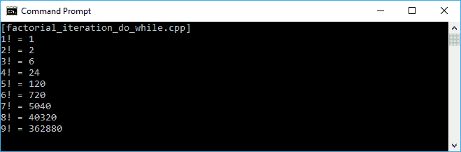

迭代中的另一种技术是使用另一个迭代过程。我们可以重构先前的代码，使用`for`循环在`factorial()`函数中。以下是从我们先前的`factorial_iteration_do_while.cpp`代码重构而来的`factorial_iteration_for.cpp`代码：

```cpp
    /* factorial_iteration_do_while.cpp */
    #include <iostream>

    using namespace std;

    // Function containing
    // for loop iteration
    int factorial (int n)
    {
      int result = 1;

      // Running iteration using for loop
 for(int i = 1; i <= n; ++i)
 {
 result *= i;
 }

      return result;
     }

     auto main() -> int
     {
      cout << "[factorial_iteration_for.cpp]" << endl;

      // Invoking factorial() function nine times
      for(int i = 1; i < 10; ++i)
       {
         cout << i << "! = " << factorial(i) << endl;
       }

      return 0;
    }

```

正如我们所看到的，我们用`for`循环替换了`do-while`循环。然而，程序的行为将完全相同，因为它也会每次迭代执行时将当前结果与`i`计数器相乘。在这个迭代结束时，我们将从这个乘法过程中获得最终结果。屏幕应该显示以下输出：

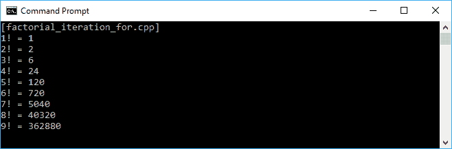

现在我们已经成功地使用迭代来实现了阶乘目的，可以使用`do-while`或`for`循环。

当我们尝试将`do-while`循环重构为`for`循环时，看起来太琐碎了。我们可能知道，`for`循环允许我们在知道要运行多少次时运行循环，而`do-while`循环在我们放入其中以及何时停止时给我们更大的灵活性，例如`while(i > 0)`或使用布尔值，如`while(true)`。然而，根据前面的例子，我们现在可以说我们可以将`for`循环或`do-while`循环切换为递归。

# 执行递归过程以重复该过程

我们之前讨论过，递归在函数式编程中具有更好的性能。我们还以迭代方式开发了`factorial()`函数。现在，让我们将之前的代码重构为`factorial_recursion.cpp`，它将使用递归方法而不是迭代方法。该代码将执行与我们之前的代码相同的任务。但是，我们将修改`factorial()`函数，使其在函数末尾调用自身。代码如下所示：

```cpp
    /* factorial_recursion.cpp */
    #include <iostream>

    using namespace std;

    int factorial(int n)
    {
      // Running recursion here
      if (n == 0)
        return 1;
      else
        return n * factorial (n - 1);
    }

    auto main() -> int
    {
       cout << "[factorial_recursion.cpp]" << endl;

      for(int i = 1; i < 10; ++i)
      {
        cout << i << "! = " << factorial(i) << endl;
      }

      return 0;
    }

```

正如我们所看到的，在前面的代码中，`factorial()`函数调用自身直到`n`为`0`。每次函数调用自身时，它会减少`n`参数。当传递的参数为`0`时，函数将立即返回`1`。与我们之前的两个代码块相比，我们也将得到相同的输出，如下面的屏幕截图所示：


尽管递归为我们提供了易于维护代码所需的简单性，但我们必须注意我们传递给递归函数的参数。例如，在`factorial_recursion.cpp`代码中的`factorial()`函数中，如果我们将负数传递给`n < 0`函数，我们将得到无限循环，并且可能会导致设备崩溃。

# 重复不可变函数

正如我们在前一章中讨论的，我们需要递归循环不可变函数。假设我们有一个不可变的`fibonacci()`函数。然后，我们需要将其重构为递归函数。`fibonacci_iteration.cpp`代码以迭代方式实现了`fibonacci()`函数。代码如下所示：

```cpp
    /* fibonacci_iteration.cpp */
    #include <iostream>

    using namespace std;

    // Function for generating
    // Fibonacci sequence using iteration
    int fibonacci(int n)
    {
      if (n == 0)
        return 0;

      int previous = 0;
      int current = 1;

      for (int i = 1; i < n; ++i)
      {
        int next = previous + current;
        previous = current;
        current = next;
      }

      return current;
    }

    auto main() -> int
    {
      cout << "[fibonacci_iteration.cpp]" << endl;

      // Invoking fibonacci() function ten times
      for(int i = 0; i < 10; ++i)
       {
         cout << fibonacci(i) << " ";
       }
      cout << endl;

      return 0;
    }

```

正如我们在前面的代码中所看到的，`fibonacci()`函数是不可变的，因为每次它获得相同的`n`输入时都会返回相同的值。输出应该如下屏幕截图所示：

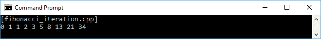

如果我们需要将其重构为递归函数，我们可以使用以下`fibonacci_recursion.cpp`代码：

```cpp
    /* fibonacci_recursion.cpp */
    #include <iostream>

    using namespace std;

    // Function for generating
    // Fibonacci sequence using recursion
    int fibonacci(int n)
    {
      if(n <= 1)
        return n;

      return fibonacci(n-1) + fibonacci(n-2);
    }

    auto main() -> int
    {
      cout << "[fibonacci_recursion.cpp]" << endl;

      // Invoking fibonacci() function ten times
      for(int i = 0; i < 10; ++i)
      {
        cout << fibonacci(i) << " ";
      }
      cout << endl;

      return 0;
    }

```

正如我们所看到的，前面的代码采用了递归方法，因为它在函数末尾调用函数本身。现在我们有了递归`fibonacci()`函数，它将在控制台上给出以下输出：

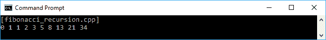

现在，与`fibonacci_iteration.cpp`代码相比，`fibonacci_recursion.cpp`代码显示了完全相同的输出。

# 接近尾递归

当递归调用在函数末尾执行时，发生尾递归。它被认为比我们之前开发的非尾递归代码更好，因为编译器可以更好地优化代码。由于递归调用是函数执行的最后一个语句，因此在此函数中没有更多的事情要做。结果是编译器不需要保存当前函数的堆栈帧。让我们看看以下`tail_recursion.cpp`代码实现尾递归：

```cpp
    /* tail_recursion.cpp */
    #include <iostream>

    using namespace std;

    void displayNumber(long long n)
    {
      // Displaying the current n value
      cout << n << endl;

      // The last executed statement 
      // is the recursive call
      displayNumber(n + 1);
    }

    auto main() -> int
    {
      cout << "[tail_recursion.cpp]" << endl;

      // Invoking the displayNumber() function
      // containing tail recursion
      displayNumber(0);

      return 0;
    }

```

正如我们在前面的代码中所看到的，`displayNumber()`函数是一个尾递归调用函数，因为它在过程结束时调用自身。确实，如果运行前述的`tail_recursion.cpp`代码，程序将不会结束，因为它会增加`displayNumber()`函数中的`n`的值。当`n`的值达到`long long`数据类型的最大值时，程序可能会崩溃。然而，由于尾递归不会在堆栈中存储值，程序将不会出现堆栈问题（堆栈溢出）。

此外，我们还可以重构`tail_recursion.cpp`代码中的前述`displayNumber()`函数，使用`goto`关键字而不是一遍又一遍地调用函数。重构后的代码可以在以下`tail_recursion_goto.cpp`代码中看到：

```cpp
    /* tail_recursion_goto.cpp */
    #include <iostream>

    using namespace std;

    void displayNumber(long long n)
    {
 loop:
        // Displaying the current n value
        cout << n << endl;

       // Update parameters of recursive call
 // and replace recursive call with goto
 n++;
 goto loop;
    }

    auto main() -> int
    {
      cout << "[tail_recursion_goto.cpp]" << endl;

      // Invoking the displayNumber() function
      // containing tail recursion
      displayNumber(0);

      return 0;
    }

```

在前面的代码中，我们可以看到，可以使用`goto`关键字在`displayNumber()`函数中删除最后一个调用。这就是编译器通过执行尾调用消除来优化尾递归的方式，它将用`goto`关键字替换最后一个调用。我们还会看到，在`displayNumber()`函数中不需要堆栈。

不要忘记使用编译器提供的优化选项编译包含尾递归的代码。由于我们使用 GCC，始终启用优化级别 2（`-O2`）以获得优化的代码。未启用优化编译的效果是，我们前面的两个程序（`tail_recursion.cpp`和`tail_recursion_goto.cpp`）将因堆栈溢出问题而崩溃。有关 GCC 中优化选项的更多信息，请查看[`gcc.gnu.org/onlinedocs/gcc-7.1.0/gcc/Optimize-Options.html`](https://gcc.gnu.org/onlinedocs/gcc-7.1.0/gcc/Optimize-Options.html)。

现在，让我们创建一个有用的尾递归调用。在前一节中，我们已经成功地将迭代函数重构为递归函数。`factorial()`函数现在已经成为一个递归函数，并在函数末尾调用自身。然而，它并不是尾递归，尽管函数在函数末尾调用自身。如果我们仔细观察，`factorial(n-1)`返回的值被`factorial(n)`使用，所以对`factorial(n-1)`的调用不是`factorial(n)`所做的最后一件事。

我们可以将我们的`factorial_recursion.cpp`代码改为尾递归函数。我们将开发以下`factorial_recursion_tail.cpp`代码，修改`factorial()`函数，并添加一个名为`factorialTail()`的新函数。代码如下所示：

```cpp
    /* factorial_recursion_tail.cpp */
    #include <iostream>

    using namespace std;

 // Function for calculating factorial
 // tail recursion
 int factorialTail(int n, int i)
 {
 if (n == 0)
 return i;

 return factorialTail(n - 1, n * i);
 } 
 // The caller of tail recursion function
 int factorial(int n)
 {
 return factorialTail(n, 1);
 }

    auto main() -> int
    {
      cout << "[factorial_recursion_tail.cpp]" << endl;

      // Invoking fibonacci() function ten times
      for(int i = 1; i < 10; ++i)
      {
        cout << i << "! = " << factorial(i) << endl;
      }

     return 0;
    }

```

正如我们所看到的，我们已经将`factorial()`函数从`factorial_recursion.cpp`代码移动到`factorial_recursion_tail.cpp`代码中的`factorialTail()`函数，该函数需要两个参数。结果是，在我们调用`factorial(i)`之后，它将调用`factorialTail()`函数。在这个函数的末尾，只有`factorialTail()`函数被调用。以下图片是`factorial_recursion_tail.cpp`代码的输出，与`factorial_recursion.cpp`代码完全相同。这也证明我们已成功将`factorial_recursion.cpp`代码重构为尾递归。

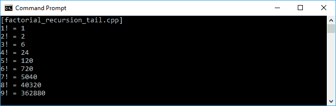

# 熟悉函数式、过程式和回溯递归。

现在我们已经了解了一点关于递归，递归函数将在其内部调用自身。递归只有在达到一定值时才会停止。我们将立即讨论三种类型的递归--**功能递归**，**过程递归**和**回溯递归**；然而，这三种递归可能不是标准术语。功能递归是一个返回某个值的递归过程。过程递归是一个不返回值的递归过程，但在每次递归中执行动作。回溯递归是一个将任务分解为一小组子任务的递归过程，如果它们不起作用，可以取消。让我们在下面的讨论中考虑这些递归类型。

# 期待从功能递归中得到结果

在功能递归中，该过程试图通过递归地组合子问题的结果来解决问题。我们组合的结果来自子问题的返回值。假设我们有一个计算一个数的幂的问题，例如，`2`的`2`次方是`4`（`2² = 4`）。通过使用迭代，我们可以构建一个像下面的`exponential_iteration.cpp`代码的代码。我们有一个名为`power()`的函数，它将通过两个参数--`base`和`exp`来传递。符号将是`base^(exp)`，代码看起来像这样：

```cpp
    /* exponential_iteration.cpp */
    #include <iostream>

    using namespace std;

    // Calculating the power of number
    // using iteration
    int power(int base, int exp)
    {
      int result = 1;

      for(int i = 0; i < exp; ++i)
       {
         result *= base;
       }

       return(result);
    } 

    auto main() -> int
    {
      cout << "[exponential_iteration.cpp]" << endl;

      // Invoking power() function six times
      for(int i = 0; i <= 5; ++i)
      {
        cout << "power (2, " << i << ") = ";
        cout << power(2, i) << endl;
      }

      return 0;
    }

```

正如我们在前面的代码中所看到的，我们首先使用迭代版本，然后再使用递归版本，因为我们通常在日常生活中最常使用迭代。我们通过将`result`值在每次迭代中乘以`base`值来组合结果。如果我们运行上面的代码，我们将在控制台上得到以下输出：

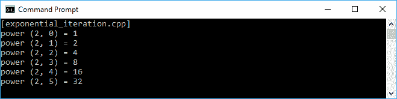

现在，让我们将我们之前的代码重构为递归版本。我们将有`exponential_recursion.cpp`代码，它将具有相同的`power()`函数签名。然而，我们将不使用`for`循环，而是使用递归，函数在函数的末尾调用自身。代码应该写成如下所示：

```cpp
    /* exponential_recursion.cpp */
    #include <iostream>

    using namespace std;

    // Calculating the power of number
    // using recursion
    int power(int base, int exp)
    {
      if(exp == 0)
        return 1;
      else
        return base * power(base, exp - 1);
    }

    auto main() -> int
    {
      cout << "[exponential_recursion.cpp]" << endl;

      // Invoking power() function six times
      for(int i = 0; i <= 5; ++i)
      {
        cout << "power (2, " << i << ") = ";
        cout << power(2, i) << endl;
      }

      return 0;
    }

```

正如我们之前讨论的，功能递归返回值，`power()`函数是一个功能递归，因为它返回`int`值。我们将从每个子函数返回的值得到最终结果。因此，我们将在控制台上得到以下输出：

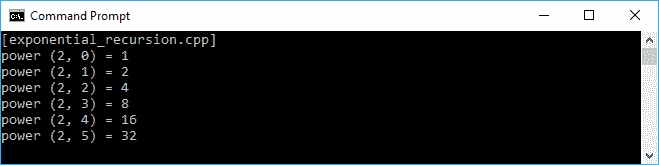

# 在过程递归中递归运行任务

因此，我们有一个期望从函数中得到返回值的功能递归。有时，我们不需要返回值，因为我们在函数内部运行任务。为了实现这个目的，我们可以使用过程递归。假设我们想要对一个短字符串进行排列，以找到它的所有可能的排列。我们只需要在每次递归执行时打印结果，而不需要返回值。

我们有以下的`permutation.cpp`代码来演示这个任务。它有一个`permute()`函数，将被调用一次，然后它将递归地调用`doPermute()`函数。代码应该写成如下所示：

```cpp
    /* permutation.cpp */
    #include <iostream>

    using namespace std;

    // Calculation the permutation
    // of the given string
    void doPermute(
      const string &chosen,
      const string &remaining)
      {
       if(remaining == "")
       {
          cout << chosen << endl;
       }
       else
       {
         for(uint32_t u = 0; u < remaining.length(); ++u)
         {
            doPermute(
              chosen + remaining[u],
              remaining.substr(0, u)
              + remaining.substr(u + 1));
         }
       }
    }     

    // The caller of doPermute() function
    void permute(
      const string &s)
    {
      doPermute("", s);
    }

    auto main() -> int
    {
      cout << "[permutation.cpp]" << endl;

      // Initializing str variable
      // then ask user to fill in
      string str;
      cout << "Permutation of a string" << endl;
      cout << "Enter a string: ";
      getline(cin, str);

      // Finding the possibility of the permutation
      // by calling permute() function
      cout << endl << "The possibility permutation of ";
      cout << str << endl;
      permute(str);

      return 0;
    }

```

正如我们在前面的代码中所看到的，我们要求用户输入一个字符串，然后代码将使用`permute()`函数找到这个排列的可能性。它将从`doPermute()`中的空字符串开始，因为来自用户的给定字符串也是可能的。控制台上的输出应该如下所示：

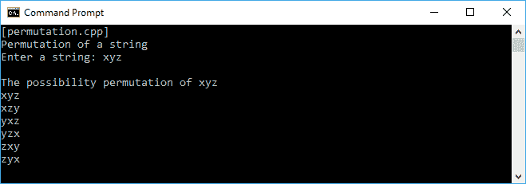

# 回溯递归

正如我们之前讨论的，如果子任务不起作用，我们可以撤消这个过程。让我们尝试一个迷宫，我们必须找到从起点到终点的路。假设我们必须找到从`S`到`F`的路，就像下面的迷宫一样：

```cpp
    # # # # # # # #
    # S           #
    # # #   # # # #
    #   #   # # # #
    #             #
    #   # # # # # #
    #           F #
    # # # # # # # #

```

为了解决这个问题，我们必须决定我们需要的路线，以找到终点。但是，我们将假设每个选择都是好的，直到我们证明它不是。递归将返回一个布尔值，以标记它是否是正确的方式。如果我们选择了错误的方式，调用堆栈将解开，并且将撤消选择。首先，我们将在我们的代码中绘制`labyrinth`。在以下代码中，将会有`createLabyrinth()`和`displayLabyrinth()`函数。代码看起来像这样：

```cpp
    /* labyrinth.cpp */
    #include <iostream>
    #include <vector>

    using namespace std;

    vector<vector<char>> createLabyrinth()
    {
      // Initializing the multidimensional vector
      // labyrinth 
      // # is a wall
      // S is the starting point
      // E is the finishing point
      vector<vector<char>> labyrinth = 
      {
        {'#', '#', '#', '#', '#', '#', '#', '#'},
        {'#', 'S', ' ', ' ', ' ', ' ', ' ', '#'},
        {'#', '#', '#', ' ', '#', '#', '#', '#'},
        {'#', ' ', '#', ' ', '#', '#', '#', '#'},
        {'#', ' ', ' ', ' ', ' ', ' ', ' ', '#'},
        {'#', ' ', '#', '#', '#', '#', '#', '#'},
        {'#', ' ', ' ', ' ', ' ', ' ', 'F', '#'},
        {'#', '#', '#', '#', '#', '#', '#', '#'}
     };

     return labyrinth;
    }

    void displayLabyrinth(vector<vector<char>> labyrinth)
    {
      cout << endl;
      cout << "====================" << endl;
      cout << "The Labyrinth" << endl;
      cout << "====================" << endl;

      // Displaying all characters in labyrinth vector
      for (int i = 0; i < rows; i++)
      {
        for (int j = 0; j < cols; j++)
        {
            cout << labyrinth[i][j] << " ";
        }
        cout << endl;
      }
      cout << "====================" << endl << endl;
    }

    auto main() -> int
    {
      vector<vector<char>> labyrinth = createLabyrinth();
      displayLabyrinth(labyrinth);

      string line;
      cout << endl << "Press enter to continue..." << endl;
      getline(cin, line);

      return 0;
    }

```

正如我们所看到的，前面的代码中没有递归。`createLabyrinth()`函数只是创建一个包含`labyrinth`模式的二维数组，而`displayLabyrinth()`只是将数组显示到控制台。如果我们运行前面的代码，我们将在控制台上看到以下输出：

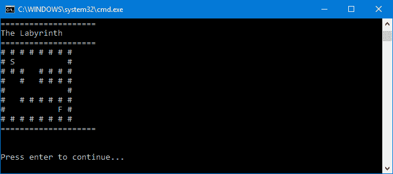

从前面的截图中，我们可以看到有两个点--`S`是起点，`F`是终点。代码必须找到从`S`到`F`的路径。预期的路线应该如下：

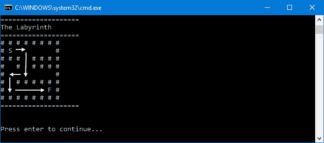

在前面的截图中，白色箭头是我们期望从`S`到达`F`的路径。现在，让我们开发解决这个迷宫问题的代码。我们将创建一个名为`navigate`的函数，通过确定以下三种状态来找到可能的路线：

+   如果我们在[*x*,*y*]位置找到`F`，例如`labyrinth[2][4]`，那么我们已经解决了问题，只需返回`true`作为返回值。

+   如果[*x*,*y*]位置是`#`，这意味着我们面对墙壁，必须重新访问其他[*x*,*y*]位置。

+   否则，我们在该位置打印`*`来标记我们已经访问过它。

在分析了三种状态之后，我们将从递归情况开始：

+   如果路径搜索器可以导航到`row - 1`，并且大于或等于`0`（`row - 1 >= 0 && navigate(labyrinth, row - 1, col)`），它将向上移动

+   如果路径搜索器可以导航到`row + 1`，并且小于`8`（`row + 1 < 8 && navigate(labyrinth, row + 1, col)`），它将向下移动

+   如果路径搜索器可以导航到`col - 1`，并且大于或等于`0`（`col - 1 >= 0 && navigate(labyrinth, row, col - 1)`），它将向左移动

+   如果路径搜索器可以导航到`col + 1`，并且小于`8`（`col + 1 < 8 && navigate(labyrinth, row, col + 1)`），它将向右移动

我们将有以下`navigate()`函数：

```cpp
    bool navigate(
      vector<vector<char>> labyrinth,
      int row,
      int col)
    {
      // Displaying labyrinth
      displayLabyrinth(labyrinth);

      cout << "Checking cell (";
      cout << row << "," << col << ")" << endl;

      // Pause 1 millisecond
      // before navigating
      sleep(1);

      if (labyrinth[row][col] == 'F')
      {
        cout << "Yeayy.. ";
        cout << "Found the finish flag ";
        cout << "at point (" << row << ",";
        cout << col << ")" << endl;
        return (true);
      }
      else if (
        labyrinth[row][col] == '#' ||
        labyrinth[row][col] == '*')
      {
        return (false);
      }
      else if (labyrinth[row][col] == ' ')
      {
        labyrinth[row][col] = '*';
      }

      if ((row + 1 < rows) &&
        navigate(labyrinth, row + 1, col))
        return (true);

      if ((col + 1 < cols) &&
        navigate(labyrinth, row, col + 1))
        return (true);

      if ((row - 1 >= 0) &&
        navigate(labyrinth, row - 1, col))
        return (true);

      if ((col - 1 >= 0) &&
        navigate(labyrinth, row, col - 1))
        return (true);

        return (false);
    }

```

现在我们有了`navigate()`函数来找出正确的路径以找到`F`。但是，在运行`navigate()`函数之前，我们必须确保`S`在那里。然后我们必须开发名为`isLabyrinthSolvable()`的辅助函数。它将循环遍历迷宫数组，并告知`S`是否存在。以下代码片段是`isLabyrinthSolvable()`函数的实现：

```cpp
    bool isLabyrinthSolvable(
      vector<vector<char>> labyrinth)
    {
      int start_row = -1;
      int start_col = -1;
      for (int i = 0; i < rows; i++)
      {
        for (int j = 0; j < cols; j++)
        {
            if (labyrinth[i][j] == 'S')
            {
                start_row = i;
                start_col = j;
                break;
            }
        }
      }

      if (start_row == -1 || start_col == -1)
      {
        cout << "No valid starting point found!" << endl;
        return (false);
      }

      cout << "Starting at point (" << start_row << ",";
      cout << start_col << ")" << endl;

      return navigate(labyrinth, start_row, start_col);
    }

```

正如我们在前面的代码片段中所看到的，我们提到了`rows`和`cols`变量。我们将它们初始化为全局变量，就像我们在以下代码片段中所看到的那样：

```cpp
    const int rows = 8;
    const int cols = 8;

```

现在，让我们看一下以下代码，如果我们将`navigate()`和`isLabyrinthSolvable()`函数插入到`labyrinth.cpp`代码中：

```cpp
    /* labyrinth.cpp */
    #include <iostream>
    #include <vector>
 #include <unistd.h>

    using namespace std;

 const int rows = 8;
 const int cols = 8;

    vector<vector<char>> createLabyrinth()
    {
      // Initializing the multidimensional vector
      // labyrinth
      // # is a wall
      // S is the starting point
      // E is the finishing point
      vector<vector<char>> labyrinth =
      {
        {'#', '#', '#', '#', '#', '#', '#', '#'},
        {'#', 'S', ' ', ' ', ' ', ' ', ' ', '#'},
        {'#', '#', '#', ' ', '#', '#', '#', '#'},
        {'#', ' ', '#', ' ', '#', '#', '#', '#'},
        {'#', ' ', ' ', ' ', ' ', ' ', ' ', '#'},
        {'#', ' ', '#', '#', '#', '#', '#', '#'},
        {'#', ' ', ' ', ' ', ' ', ' ', 'F', '#'},
        {'#', '#', '#', '#', '#', '#', '#', '#'}
       };

     return labyrinth;
    }

    void displayLabyrinth(
      vector<vector<char>> labyrinth)
    {
      cout << endl;
      cout << "====================" << endl;
      cout << "The Labyrinth" << endl;
      cout << "====================" << endl;
      // Displaying all characters in labyrinth vector
      for (int i = 0; i < rows; i++)
      {
        for (int j = 0; j < cols; j++)
        {
            cout << labyrinth[i][j] << " ";
        }
        cout << endl;
       }
      cout << "====================" << endl << endl;
    }

 bool navigate(
 vector<vector<char>> labyrinth,
 int row,
 int col)
 {
 // Displaying labyrinth
 displayLabyrinth(labyrinth);

 cout << "Checking cell (";
 cout << row << "," << col << ")" << endl;

 // Pause 1 millisecond
 // before navigating
 sleep(1);

 if (labyrinth[row][col] == 'F')
 {
 cout << "Yeayy.. ";
 cout << "Found the finish flag ";
        cout << "at point (" << row << ",";
 cout << col << ")" << endl;
 return (true);
 }
 else if (
 labyrinth[row][col] == '#' ||
 labyrinth[row][col] == '*')
 {
 return (false);
 }
 else if (labyrinth[row][col] == ' ')
 {
 labyrinth[row][col] = '*';
 }

 if ((row + 1 < rows) &&
 navigate(labyrinth, row + 1, col))
 return (true); 
 if ((col + 1 < cols) &&
 navigate(labyrinth, row, col + 1))
 return (true); 
 if ((row - 1 >= 0) &&
 navigate(labyrinth, row - 1, col))
 return (true); 
 if ((col - 1 >= 0) &&
 navigate(labyrinth, row, col - 1))
 return (true); 
 return (false);
 } 
 bool isLabyrinthSolvable(
 vector<vector<char>> labyrinth)
 {
 int start_row = -1;
 int start_col = -1;
 for (int i = 0; i < rows; i++)
 {
 for (int j = 0; j < cols; j++)
 {
 if (labyrinth[i][j] == 'S')
 {
 start_row = i;
 start_col = j;
 break;
 }
 }
 }

 if (start_row == -1 || start_col == -1)
 {
 cerr << "No valid starting point found!" << endl;
 return (false);
 }

 cout << "Starting at point (" << start_row << ",";
 cout << start_col << ")" << endl;

 return navigate(labyrinth, start_row, start_col);
 }

    auto main() -> int
    {
      vector<vector<char>> labyrinth = createLabyrinth();
      displayLabyrinth(labyrinth);

      string line;
      cout << endl << "Press enter to continue..." << endl;
      getline(cin, line);

 if (isLabyrinthSolvable(labyrinth))
 cout << "Labyrinth solved!" << endl;
 else
 cout << "Labyrinth could not be solved!" << endl;

     return 0;
    }

```

正如我们在前面的引用中所看到的，在`main()`函数中，我们首先运行`isLabyrinthSolvable()`函数，然后调用`navigate()`函数。`navigate()`函数将通过迷宫找出正确的路径。以下是代码的输出：

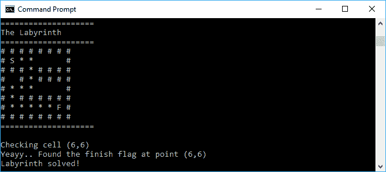

然而，如果我们追踪程序如何解决迷宫，当它找到终点时，它会面临错误的路线，就像我们在以下截图中所看到的：

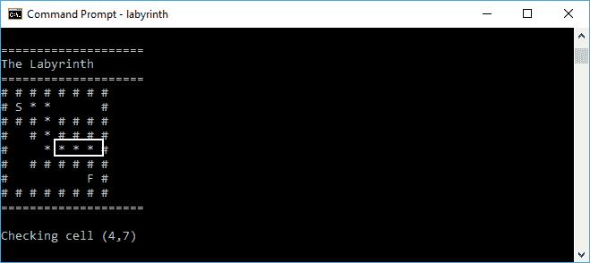

摘要

正如我们所看到的，在前面的截图中有一个白色的方块。当它寻找正确的路径时，这是错误的选择。一旦遇到障碍，它就会返回并寻找其他方法。它还会撤消它所做的选择。让我们看看下面的截图，它向我们展示了当递归找到另一条路线并撤消先前的选择时：

在前面的截图中，我们可以看到递归尝试另一条路线，之前失败的路线已经消失，因为回溯递归取消了该路线。递归现在有了正确的路径，它可以继续直到找到终点旗。因此，我们现在成功地开发了回溯递归。

# 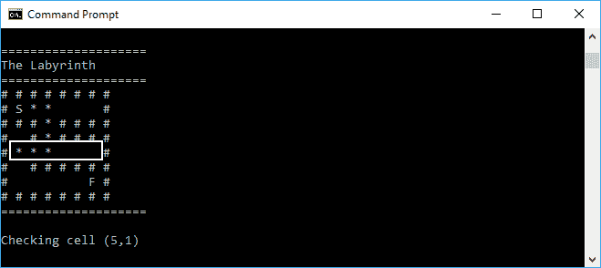

本章为我们提供了使用迭代和递归重复函数调用的技术。然而，由于递归比迭代更加功能化，我们强调了对递归而不是迭代的讨论。我们从迭代和递归的区别开始。然后我们继续讨论了重构不可变函数以成为递归不可变函数。

在学习了递归之后，我们发现了其他更好的递归技术。我们还讨论了尾递归以获得这种改进的技术。最后，我们列举了三种递归--功能递归、过程递归和回溯递归。当我们期望递归的返回值时，通常使用功能递归。否则，我们使用过程递归。如果我们需要分解问题并在递归不起作用时撤消递归性能，我们可以使用回溯递归来解决问题。

在下一章中，我们将讨论延迟评估以使代码运行更快。这将使代码变得更有效，因为它将确保不必要的代码不会被执行。
