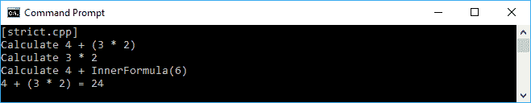
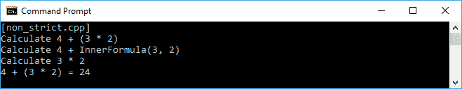
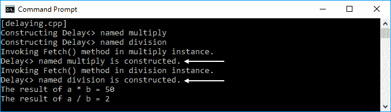
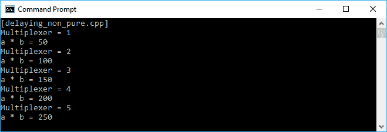
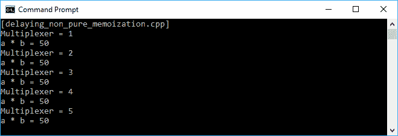
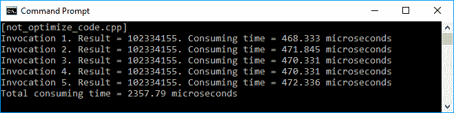
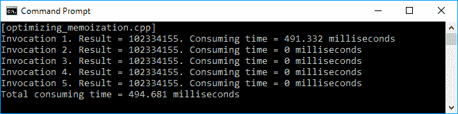
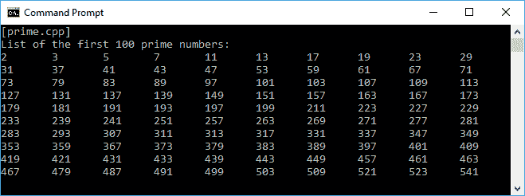
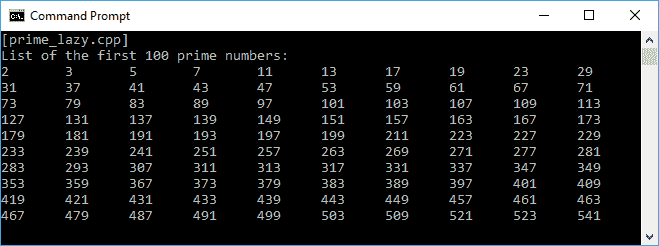

# 第五章：使用懒惰评估拖延执行过程

在前一章中，我们讨论了在函数式方法中重复函数调用的递归。现在，我们将讨论懒惰评估，它可以使我们的代码变得更加高效，因为它只在我们需要时才运行。我们还将应用递归，这是我们在前一章中讨论过的话题，以生成懒惰代码。

在本章中，我们讨论**懒惰评估**，以使代码运行更快。这将使代码变得高效，因为它将确保不必要的代码不会被执行。以下是我们将讨论的主题，以深入了解懒惰评估：

+   区分急切和懒惰评估之间的差异

+   使用缓存技术优化代码

+   将急切评估重构为懒惰评估

+   设计有用的类，可以在其他的函数式代码中重复使用

# 评估表达式

每种编程语言都有其确定何时评估函数调用的参数以及必须传递给参数的值类型的策略。在编程语言中，有两种主要使用的策略评估--**严格**（急切）评估和**非严格**（懒惰）评估。

# 立即运行表达式进行严格评估

严格评估在大多数命令式编程语言中使用。它将立即执行我们的代码。假设我们有以下方程：

```cpp
    int i = (x + (y * z));

```

在严格评估中，最内层的括号将首先计算，然后向外计算前面的方程。这意味着我们将计算`y * z`，然后将结果加到`x`上。为了更清楚，让我们看看以下的`strict.cpp`代码：

```cpp
    /* strict.cpp */
    #include <iostream>

    using namespace std;

    int OuterFormula(int x, int yz)
    {
      // For logging purpose only
      cout << "Calculate " << x << " + ";
      cout << "InnerFormula(" << yz << ")";
      cout << endl;

      // Returning the calculation result
      return x * yz;
    }

    int InnerFormula(int y, int z)
    {
      // For logging purpose only
      cout << "Calculate " << y << " * ";
      cout << z << endl;

      // Returning the calculation result
      return y * z;
    }

    auto main() -> int
    {
      cout << "[strict.cpp]" << endl;

      // Initializing three int variables
      // for the calculation
      int x = 4;
      int y = 3;
      int z = 2;

      // Calculating the expression
      cout << "Calculate " << x <<" + ";
      cout << "(" << y << " * " << z << ")";
      cout << endl;
      int result = OuterFormula(x, InnerFormula(y, z));

      // For logging purpose only
      cout << x << " + ";
      cout << "(" << y << " * " << z << ")";
      cout << " = " << result << endl;

      return 0;
    }

```

正如我们之前讨论的，前面代码的执行将首先是`y * z`，然后我们将结果加到`x`上，正如我们在以下输出中所看到的：



前面的执行顺序是我们通常期望的。然而，在非严格评估中，我们将重新安排这个执行过程。

# 使用非严格评估延迟表达式

在非严格评估中，`+`运算符首先被简化，然后我们简化内部公式，即`(y * z)`。我们将看到评估将从外到内开始。我们将重构我们之前的`strict.cpp`代码，使其成为非严格评估。代码应该像以下的`non_strict.cpp`代码：

```cpp
    /* non_strict.cpp */
    #include <functional>
    #include <iostream>

    using namespace std;

 int OuterFormulaNonStrict(
 int x,
 int y,
 int z,
 function<int(int, int)> yzFunc)
 {
 // For logging purpose only
 cout << "Calculate " << x << " + ";
 cout << "InnerFormula(" << y << ", ";
 cout << z << ")" << endl;

 // Returning the calculation result
 return x * yzFunc(y, z);
 }

     int InnerFormula(int y, int z)
     {
       // For logging purpose only
       cout << "Calculate " << y << " * ";
       cout << z << endl;

       // Returning the calculation result
       return y * z;
     }

     auto main() -> int
     {
       cout << "[non_strict.cpp]" << endl;

       // Initializing three int variables
       // for the calculation
       int x = 4;
       int y = 3;
       int z = 2;

       // Calculating the expression
       cout << "Calculate " << x <<" + ";
       cout << "(" << y << " * " << z << ")";
       cout << endl;
       int result = OuterFormulaNonStrict(x, y, z, InnerFormula);

       // For logging purpose only
       cout << x << " + ";
       cout << "(" << y << " * " << z << ")";
       cout << " = " << result << endl;

       return 0;
    }

```

正如我们所看到的，我们将`strict.cpp`代码中的`OuterFormula()`函数修改为`non_strict.cpp`代码中的`OuterFormulaNonStrict()`函数。在`OuterFormulaNonStrict()`函数中，我们除了三个变量`x`、`y`和`z`之外，还将一个函数作为参数传递。因此，前面表达式的执行顺序发生了变化。当我们运行`non_strict.cpp`代码时，我们应该在控制台屏幕上看到以下内容：



从前面的输出中，我们已经证明我们的代码正在执行非严格评估，因为它现在首先计算加法运算符(`+`)而不是乘法(`*`)。然而，结果仍然是正确的，尽管顺序已经改变。

# 懒惰评估的基本概念

在创建懒惰代码之前，让我们讨论懒惰评估的基本概念。我们将使用延迟过程使我们的代码变得懒惰，使用缓存技术来增加代码的性能，避免不必要的计算，以及优化技术，通过存储昂贵的函数调用的结果并在再次出现相同的输入时返回缓存的结果来加快代码的速度。在我们看完这些技术之后，我们将尝试开发真正的懒惰代码。

# 延迟过程

懒惰的基本概念是延迟一个过程。在本节中，我们将讨论如何延迟特定过程的执行。我们将创建一个名为`Delay`的新类。当我们构造类时，我们将把一个函数传递给它。除非我们调用`Fetch()`方法，否则函数不会运行。函数的实现如下：

```cpp
    template<class T> class Delay
    {
      private:
        function<T()> m_func;

      public:
        Delay(
          function<T()> func)
          : m_func(func)
          {
          }

        T Fetch()
        {
          return m_func();
        }
    };

```

现在，让我们使用`Delay`类来推迟执行。我们将创建一个名为`delaying.cpp`的文件，其中将运行两个函数--`multiply`和`division`。然而，只有在调用`Fetch()`方法之后，这两个函数才会被运行。文件的内容如下：

```cpp
    /* delaying.cpp */
    #include <iostream>
    #include <functional>

    using namespace std;

    template<class T> class Delay
    {
      private:
        function<T()> m_func;

      public:
        Delay(function<T()> func) : m_func(func)
        {
        }

        T Fetch()
        {
          return m_func();
        }
    };

    auto main() -> int
    {
      cout << "[delaying.cpp]" << endl;

      // Initializing several int variables
      int a = 10;
      int b = 5;

      cout << "Constructing Delay<> named multiply";
      cout << endl;
      Delay<int> multiply([a, b]()
      {
        cout << "Delay<> named multiply";
        cout << " is constructed." << endl;
        return a * b;
      });

     cout << "Constructing Delay<> named division";
     cout << endl;
     Delay<int> division([a, b]()
     {
       cout << "Delay<> named division ";
       cout << "is constructed." << endl;
       return a / b; 
     });

     cout << "Invoking Fetch() method in ";
     cout << "multiply instance." << endl;
     int c = multiply.Fetch();

     cout << "Invoking Fetch() method in ";
     cout << "division instance." << endl;
     int d = division.Fetch();

     // Displaying the result
     cout << "The result of a * b = " << c << endl;
     cout << "The result of a / b = " << d << endl;

     return 0;
    }

```

正如我们在第一章中讨论的，*深入现代 C++*，我们可以使用 Lambda 表达式来构建`multiply`和`division`函数，然后将它们传递给每个`Delay`构造函数。在这个阶段，函数还没有运行。它将在调用`Fetch()`方法后运行--`multiply.Fetch()`和`division.Fetch()`。我们将在屏幕上看到以下的输出截图：



正如我们在前面的输出截图中所看到的，当调用`Fetch()`方法时，`multiply`和`division`实例被构造（见两个白色箭头），而不是在调用`Delay`类的构造函数时。现在，我们已经成功地延迟了执行，并且我们可以说只有在需要时才执行这个过程。

# 使用记忆化技术缓存值

我们现在已经成功地延迟了通过消耗`Delay`类来执行函数。然而，由于每次调用`Fetch()`方法时`Delay`类实例的函数将被运行，如果函数不是纯函数或具有副作用，可能会出现意外结果。让我们通过修改`multiply`函数来重构我们之前的`delaying.cpp`代码。这个函数现在变成了一个非纯函数，因为它依赖于外部变量。代码应该是这样的：

```cpp
    /* delaying_non_pure.cpp */
    #include <iostream>
    #include <functional>

    using namespace std;

    template<class T> class Delay
    {
      private:
        function<T()> m_func;

      public:
        Delay(function<T()> func) : m_func(func)
        {
        }

        T Fetch()
        {
          return m_func();
        }
    };

    auto main() -> int
    {
      cout << "[delaying_non_pure.cpp]" << endl;

      // Initializing several int variables
      int a = 10;
      int b = 5;
      int multiplexer = 0;

      // Constructing Delay<> named multiply_impure
      Delay<int> multiply_impure([&]()
      {
        return multiplexer * a * b;
      });

      // Invoking Fetch() method in multiply_impure instance
      // multiple times
      for (int i = 0; i < 5; ++i)
      {
        ++multiplexer;
        cout << "Multiplexer = " << multiplexer << endl;
        cout << "a * b = " << multiply_impure.Fetch();
        cout << endl;
      }

      return 0;
    }

```

正如我们在前面的代码中所看到的，我们现在有一个名为`multiply_impure`的新 Lambda 表达式，这是我们在`delaying.cpp`代码中创建的`multiply`函数的重构版本。`multiply_impure`函数依赖于`multiplexer`变量，其值将在我们调用`Fetch()`方法之前每次增加。我们应该在屏幕上看到以下的截图输出：



正如我们所看到的，`Fetch()`方法每次被调用时都会给出不同的结果。我们现在必须重构`Delay`类，以确保每次`Fetch()`方法运行函数时都返回相同的结果。为了实现这一点，我们将使用记忆化技术，它存储函数调用的结果，并在再次出现相同的输入时返回缓存的结果。

我们将`Delay`类重命名为`Memoization`类。这不仅会延迟函数调用，还会记录具有特定传递参数的函数。因此，下一次具有这些参数的函数发生时，函数本身将不会运行，而只会返回缓存的结果。为了方便我们的讨论，让我们来看一下以下的`Memoization`类实现：

```cpp
    template<class T> class Memoization
    {
      private:
        T const & (*m_subRoutine)(Memoization *);
        mutable T m_recordedFunc;
        function<T()> m_func;

        static T const & ForceSubroutine(Memoization * d)
        {
          return d->DoRecording();
        }

        static T const & FetchSubroutine(Memoization * d)
        {
          return d->FetchRecording();
        }

        T const & FetchRecording()
        {
          return m_recordedFunc;
        }

        T const & DoRecording()
        {
          m_recordedFunc = m_func();
          m_subRoutine = &FetchSubroutine;
          return FetchRecording();
        }

     public:
        Memoization(function<T()> func) : m_func(func),
         m_subRoutine(&ForceSubroutine),
         m_recordedFunc(T())
        {
        }

       T Fetch()
       {
         return m_subRoutine(this);
       }
    };

```

正如我们在前面的代码片段中所看到的，我们现在有`FetchRecording()`和`DoRecording()`来获取和设置我们存储的函数。此外，当类被构造时，它将记录传递的函数并将其保存到`m_subRoutine`中。当调用`Fetch()`方法时，类将检查`m_subRoutine`，并查找它是否具有当前传递参数的函数值。如果是，它将简单地返回`m_subRoutine`中的值，而不是运行函数。现在，让我们看一下以下的`delaying_non_pure_memoization.cpp`代码，它使用`Memoization`类：

```cpp
    /* delaying_non_pure_memoization.cpp */
    #include <iostream>
    #include <functional>

    using namespace std;

    template<class T> class Memoization
    {
      private:
        T const & (*m_subRoutine)(Memoization *);
        mutable T m_recordedFunc;
        function<T()> m_func;

        static T const & ForceSubroutine(Memoization * d)
        {
          return d->DoRecording();
        }

       static T const & FetchSubroutine(Memoization * d)
       {
          return d->FetchRecording();
       }

       T const & FetchRecording()
       {
          return m_recordedFunc;
       }

       T const & DoRecording()
       {
          m_recordedFunc = m_func();
          m_subRoutine = &FetchSubroutine;
          return FetchRecording();
       }

     public:
       Memoization(function<T()> func) : m_func(func),
        m_subRoutine(&ForceSubroutine),
        m_recordedFunc(T())
       {
       }

      T Fetch()
      {
        return m_subRoutine(this);
      }
    };

    auto main() -> int
    {
      cout << "[delaying_non_pure_memoization.cpp]" << endl;

      // Initializing several int variables
      int a = 10;
      int b = 5;
      int multiplexer = 0;

 // Constructing Memoization<> named multiply_impure
 Memoization<int> multiply_impure([&]()
 {
 return multiplexer * a * b;
 });

      // Invoking Fetch() method in multiply_impure instance
      // multiple times
      for (int i = 0; i < 5; ++i)
      {
        ++multiplexer;
        cout << "Multiplexer = " << multiplexer << endl;
        cout << "a * b = " << multiply_impure.Fetch();
        cout << endl;
      }

      return 0;
    }

```

从前面的代码片段中，我们看到在`main()`函数中没有太多修改。我们修改的只是用于`multiply_impure`变量的类类型，从`Delay`改为`Memoization`。然而，结果现在已经改变，因为我们将从`multiply_impure()`函数的五次调用中获得完全相同的返回值。让我们看看以下截图来证明：



从前面的截图中，我们可以看到即使`Multiplexer`的值增加了，计算的返回值始终相同。这是因为记录了第一次函数调用的返回值，所以不需要为剩余的调用再次运行函数。

正如我们在第二章中讨论的，*在函数式编程中操作函数*，在函数式编程中有一个不纯的函数似乎是错误的。将不纯的函数隐藏在记忆化后，如果代码确实需要不同的结果（非缓存结果），也可能会导致错误。明智地使用前述技术来缓存不纯的函数。

# 使用记忆化技术优化代码

记忆化对于应用于非纯函数或具有副作用的函数非常有用。然而，它也可以用于优化代码。通过使用记忆化，我们开发的代码将运行得更快。假设我们需要多次使用完全相同的函数和完全相同的传递参数运行。如果代码从我们记录值的地方获取值而不是运行函数，它将更快。对于昂贵的函数调用，使用记忆化也更好，因为我们不需要一遍又一遍地执行不必要的昂贵函数调用。

让我们创建一个代码来讨论进一步的优化。我们将使用`Delay`类来演示与`Memoization`类相比，它不是一个优化的代码。我们将有一个`not_optimize_code.cpp`代码，它将使用`Delay`类。在这个未优化的代码中，我们将调用我们在第四章中创建的`fibonacci()`函数，*使用递归算法重复方法调用*。我们将把`40`作为参数传递给`fibonacci()`函数，并从`fib40`类实例中调用`Fetch()`方法五次。我们还将计算每次调用方法的经过时间，使用`chrono`头文件中的`high_resolution_clock`类记录**开始**和**结束**时间，通过用结束值减去开始值来获取经过时间。除了每个`Fetch()`方法调用的经过时间，我们还计算整个代码的经过时间。`not_optimize_code.cpp`代码的实现如下：

```cpp
    /* not_optimize_code.cpp */
    #include <iostream>
    #include <functional>
    #include <chrono>

    using namespace std;

    template<class T> class Delay
    {
      private:
        function<T()> m_func;

      public:
        Delay(function<T()> func): m_func(func)
        {
        }

        T Fetch()
        {
          return m_func();
        }
    };

    // Function for calculating Fibonacci sequence
    int fibonacci(int n)
    {
      if(n <= 1)
         return n;
      return fibonacci(n-1) + fibonacci(n-2);
    }

    auto main() -> int
    {
      cout << "[not_optimize_code.cpp]" << endl;

      // Recording start time for the program
      auto start = chrono::high_resolution_clock::now();

      // Initializing int variable to store the result
      // from Fibonacci calculation
      int fib40Result = 0;

      // Constructing Delay<> named fib40
      Delay<int> fib40([]()
      {
        return fibonacci(40);
      });

      for (int i = 1; i <= 5; ++i)
      {
        cout << "Invocation " << i << ". ";

        // Recording start time
        auto start = chrono::high_resolution_clock::now();

        // Invoking the Fetch() method
        // in fib40 instance
        fib40Result = fib40.Fetch();

        // Recording end time
        auto finish = chrono::high_resolution_clock::now();

        // Calculating the elapsed time
        chrono::duration<double, milli> elapsed = finish - start;

        // Displaying the result
        cout << "Result = " << fib40Result << ". ";

        // Displaying elapsed time
        // for each fib40.Fetch() invocation
        cout << "Consuming time = " << elapsed.count();
        cout << " milliseconds" << endl;
      }

       // Recording end time for the program
       auto finish = chrono::high_resolution_clock::now();

       // Calculating the elapsed time for the program
       chrono::duration<double, milli> elapsed = finish - start;

       // Displaying elapsed time for the program
       cout << "Total consuming time = ";
       cout << elapsed.count() << " milliseconds" << endl;

       return 0;
    }

```

现在，让我们运行代码来获取前面代码处理的经过时间。以下截图是我们将在屏幕上看到的内容：



从前面的截图中，我们可以看到处理代码大约需要`2357.79`毫秒。每次调用`fib40.Fetch()`方法时，平均需要约`470`毫秒，尽管我们将完全相同的参数传递给`fibonacci()`函数，即`40`。现在，让我们看看如果我们在前面的代码中使用记忆化技术会发生什么。我们不会修改代码太多，只是重构`fib40`的实例化。现在它不再是从`Delay`类实例化，而是从`Memoization`类实例化。代码应该如下所示：

```cpp
    /* optimizing_memoization.cpp */
    #include <iostream>
    #include <functional>
    #include <chrono>

    using namespace std;

    template<class T> class Memoization
    {
      private:
        T const & (*m_subRoutine)(Memoization *);
        mutable T m_recordedFunc;
        function<T()> m_func;

        static T const & ForceSubroutine(Memoization * d)
        {
          return d->DoRecording();
        }

        static T const & FetchSubroutine(Memoization * d)
        {
          return d->FetchRecording();
        }

        T const & FetchRecording()
        {
          return m_recordedFunc;
        }

        T const & DoRecording()
        {
          m_recordedFunc = m_func();
          m_subRoutine = &FetchSubroutine;
          return FetchRecording();
        }

      public:
        Memoization(function<T()> func): m_func(func),
          m_subRoutine(&ForceSubroutine),
          m_recordedFunc(T())
          {
          }

        T Fetch()
        {
          return m_subRoutine(this);
        }
     };

       // Function for calculating Fibonacci sequence
       int fibonacci(int n)
       {
         if(n <= 1)
           return n;
           return fibonacci(n-1) + fibonacci(n-2);
       }

       auto main() -> int
       {
         cout << "[optimizing_memoization.cpp]" << endl;

         // Recording start time for the program
         auto start = chrono::high_resolution_clock::now();

         // Initializing int variable to store the result
         // from Fibonacci calculation
         int fib40Result = 0;

         // Constructing Memoization<> named fib40
 Memoization<int> fib40([]()
 {
 return fibonacci(40);
 });

         for (int i = 1; i <= 5; ++i)
         {
           cout << "Invocation " << i << ". ";

           // Recording start time
           auto start = chrono::high_resolution_clock::now();

           // Invoking the Fetch() method
           // in fib40 instance
           fib40Result = fib40.Fetch();

           // Recording end time
           auto finish = chrono::high_resolution_clock::now();

           // Calculating the elapsed time
           chrono::duration<double, milli> elapsed = finish - start;

           // Displaying the result
           cout << "Result = " << fib40Result << ". ";

           // Displaying elapsed time
           // for each fib40.Fetch() invocation
           cout << "Consuming time = " << elapsed.count();
           cout << " milliseconds" << endl;
       }

          // Recording end time for the program
          auto finish = chrono::high_resolution_clock::now();

          // Calculating the elapsed time for the program
          chrono::duration<double, milli> elapsed = finish - start;

          // Displaying elapsed time for the program
          cout << "Total consuming time = ";
          cout << elapsed.count() << " milliseconds" << endl;

          return 0;
     }

```

当我们运行`optimizing_memoization.cpp`代码时，我们将在控制台屏幕上看到以下内容：



令人惊讶的是，我们只需要`494.681`毫秒来执行`optimizing_memoization.cpp`代码。与`not_optimize_code.cpp`代码相比，代码的速度大约快了`4.7`倍。这是因为代码成功地缓存了将`40`传递给其参数的`fibonacci()`函数的结果。每次我们再次调用`fib40.Fetch()`方法时，它将再次调用`fibonacci()`函数，输入完全相同。代码将只返回缓存的结果，因此可以避免运行不必要的昂贵函数调用。

# 惰性评估的实际应用

在讨论了惰性评估的基本概念之后，让我们通过设计懒惰的方法来深入了解惰性评估。在本节中，我们将首先开发急切评估代码，然后将该代码重构为懒惰评估代码。我们开发的代码将生成一系列质数。首先，我们将使用`for`循环迭代整数以获得急切评估中的质数。以下是我们所说的`prime.cpp`代码：

```cpp
    /* prime.cpp */
    #include <iostream>
    #include <cmath>

    using namespace std;

    bool PrimeCheck(int i)
    {
      // All even numbers are not prime number
      // except 2
      if ((i % 2) == 0)
      {
        return i == 2;
      }

      // Calculating the square root of i
      // and store in int data type variable
      // if the argument i is not even number,
      int sqr = sqrt(i);

      // For numbers 9 and below,
      // the prime numbers is simply the odd numbers
      // For number above 9
      // the prime numbers is all of odd numbers
      // except the square number
      for (int t = 3; t <= sqr; t += 2)
      {
        if (i % t == 0)
        {
            return false;
        }
      }

       // The number 1 is not prime number
       // but still passing the preceding test
       return i != 1;
    }

    auto main() -> int
    {
      cout << "[delaying.cpp]" << endl;

      // Initializing a counting variable
      int n = 0;

      // Displaying the first 100 prime numbers
      cout << "List of the first 100 prime numbers:" << endl;
      for (int i = 0; ; ++i)
      {
        if (PrimeCheck(i))
        {
            cout << i << "\t";

            if (++n == 100)
                return 0;
        }
      }

      return 0;
    }

```

在前面的代码中，我们有一个简单的`PrimeCheck()`函数来分析整数是否是质数。之后，代码使用`for`循环迭代无限整数，然后检查它是否是质数。如果我们得到了一百个质数，循环将结束。下面的截图是我们应该在控制台上看到的输出：



我们现在有一个使用急切评估生成质数的代码。如前面的截图所示，我们使用`for`循环生成了一百个质数。接下来，我们将将其重构为懒惰代码。

# 设计 Chunk 和 Row 类

在`prime.cpp`代码中，我们使用`for`循环生成一行整数。在这一行中，有几个被称为**Chunk**的数字。现在，在重构代码之前，我们将为进一步讨论准备一个名为`Row`和`Chunk`的类。根据我们之前的类比，`Row`类将保存整数序列，而`Chunk`类将保存单个数字。我们将从数据中最小的部分开始，也就是 chunk。以下是`Chunk`类的实现：

```cpp
    template<class T> class Chunk
    {
      private:
        T m_value;
        Row<T> m_lastRow;

      public:
        Chunk()
         {
         }

        Chunk(T value, Row<T> lastRow): m_value(value),
         m_lastRow(std::move(lastRow))
        {
        }

        explicit Chunk(T value) : m_value(value)
        {
        }

        T Value() const
        {
          return m_value;
        }

        Row<T> ShiftLastToFirst() const
        {
          return m_lastRow;
        }
    };

```

由于`Row`类是由几个`Chunk`类构成的，除了`Chunk`本身的值之外，`Chunk`类还具有当前`Row`中`Chunk`的下一个值，由`m_lastRow`成员变量表示。我们还可以通过调用`ShiftLastToFirst()`方法获取`m_lastRow`的值。现在，让我们转到`Row`类。该类的实现如下：

```cpp
    template<class T> class Row
    {
      private:
        std::shared_ptr <Memoization<Chunk<T>>>
        m_lazyChunk;

      public:
         Row()
         {
         }

         explicit Row(T value)
         {
           auto chunk = ChunkPreparation<T>(value);
           m_lazyChunk = std::make_shared<Memoization<Chunk<T>>> 
           (chunk);
         }

         Row(T value, Row row)
         {
           auto chunk = ChunkPreparation<T>( value, std::move(row));

           m_lazyChunk = std::make_shared<Memoization<Chunk<T>>>(
           chunk);
         }

         Row(std::function<Chunk<T>()> func): m_lazyChunk(
         std::make_shared<Memoization<Chunk<T>>>(func))
         {
         }

         bool IsEmpty() const
         {
           return !m_lazyChunk;
         }

         T Fetch() const
         {
           return m_lazyChunk->Fetch().Value();
         }

         Row<T> ShiftLastToFirst() const
         {
          return m_lazyChunk->Fetch().ShiftLastToFirst();
         }

         Row Pick(int n) const
         {
           if (n == 0 || IsEmpty())
            return Row();

          auto chunk = m_lazyChunk;
          return Row([chunk, n]()
          {
            auto val = chunk->Fetch().Value();
            auto row = chunk->Fetch().ShiftLastToFirst();
            return Chunk<T>(val, row.Pick(n - 1));
          });
         }
    };

```

如前面的代码片段所示，`Row`类只有一个私有成员来存储`Chunk`数据的记忆。`Row`类有四个构造函数，我们将在下一段代码中全部使用。它还有`Fetch()`方法，我们在上一节中设计`Memoization`类时得到，用于获取`m_lazyChunk`的值。其他方法对我们下一个懒惰的代码也很有用。`IsEmpty()`方法将检查`m_lazyChunk`的值是否为空，`ShiftLastToFirst()`方法将获取`m_lazyChunk`的最后一行，`Pick(int n)`方法将取出我们稍后需要取出一百个整数质数的前`n`行元素。

我们还可以看到`Row`的一个构造函数调用了`ChunkPreparation`类的构造函数。`ChunkPreparation`类将使用给定的值和上一行的值初始化一个新的`Chunk`类构造函数。该类的实现如下：

```cpp
    template<class T> class ChunkPreparation
    {
      public:
        T m_value;
        Row<T> m_row;

        ChunkPreparation(T value, Row<T> row) :
          m_value(value),
          m_row(std::move(row))
          {
          }

        explicit ChunkPreparation(T value) :
          m_value(value)
          {
          }

        Chunk<T> operator()()
        {
          return Chunk<T>(
            m_value,
            m_row);
        }
    };

```

如我们所见，通过调用`operator()`，将使用给定的`m_value`和`m_row`值生成新的`Chunk`。

# 连接几行

当我们计划生成一行质数时，我们必须能够将当前行与代码生成的新行连接起来。为了满足这个需求，以下是将连接两行的`ConcatenateRows()`函数的实现：

```cpp
    template<class T> Row<T> ConcatenateRows(
      Row<T> leftRow,
      Row<T> rightRow)
      {
        if (leftRow.IsEmpty())
          return rightRow;

        return Row<T>([=]()
        {
          return Chunk<T>(
            leftRow.Fetch(),
            ConcatenateRows<T>(
             leftRow.ShiftLastToFirst(),
             rightRow));
         });
       }

```

当我们看一下前面的代码片段时，就可以清楚地知道`ConcatenateRows()`函数的作用。如果`leftRow`仍为空，只需返回第二行，即`rightRow`。如果`leftRow`和`rightRow`都可用，我们可以返回已形成行的给定行的块。

# 迭代每个 Row 类的元素

在构建了质数行之后，我们需要迭代每行的元素进行操作，例如将值打印到控制台。为此，我们必须开发以下`ForEach()`方法：

```cpp
    template<class T, class U> void ForEach( Row<T> row, U func)
     {
        while (!row.IsEmpty())
        {
          func(row.Fetch());
          row = row.ShiftLastToFirst();
         }
     }

```

我们将把行本身和一个函数传递给`ForEach()`方法。我们传递给它的函数将对行的每个元素运行。

为了方便我们在本章中开发惰性代码，我将把我们之前讨论的`template`类捆绑到一个名为`lazyevaluation.h`的单个头文件中；我们也可以在其他项目中重用它。头文件将包含`Memoization`、`Row`、`Chunk`、`ChunkPreparation`、`ConcatenateRows`和`ForEach`模板类。您可以自己创建头文件，也可以从 Packt 网站的代码库（[`github.com/PacktPublishing/LearningCPPFunctionalProgramming`](https://github.com/PacktPublishing/LearningCPPFunctionalProgramming)）下载。

# 生成无限整数行

现在是时候生成无限整数行了，就像我们在之前的`prime.cpp`代码中使用`for`循环一样。但是，我们现在将创建一个名为`GenerateInfiniteIntRow()`的新函数，以从几个整数块生成一个整数行。以下代码片段是该函数的实现：

```cpp
    Row<int> GenerateInfiniteIntRow( int initialNumber)
    {
      return Row<int>([initialNumber]()
      {
        return Chunk<int>(
            initialNumber,
            GenerateInfinityIntRow(
             initialNumber + 1));
      });
    }

```

如我们所见，首先我们从`initialNumber`创建`Chunk`直到无穷大。这些块最终将转换为`Row`数据类型。为了停止这个递归函数，我们可以在`Row`类中调用`Pick()`方法。

# 生成无限质数行

成功生成无限数字后，我们现在必须限制行只生成质数。我们将修改`prime.cpp`代码中的`CheckPrime()`函数。如果不是质数，我们将更改函数的返回值为`Row<void*>(nullptr)`，如果相反，则为`Row<void*>()`。函数的实现应该如下：

```cpp
    Row<void*> PrimeCheck(int i)
    {
      if ((i % 2) == 0)
      {
        if (i == 2)
            return Row<void*>(nullptr);
        else
            return Row<void*>();
      }

      int sqr = sqrt(i);

      for (int t = 3; t <= sqr; t = t + 2)
      {
        if (i % t == 0)
        {
            return Row<void*>();
        }
      }

      if (i == 1)
        return Row<void*>();
      else
        return Row<void*>(nullptr);
    }

```

为什么我们需要改变函数的返回值？因为我们想将返回值传递给`JoiningPrimeNumber()`函数，它将使用以下实现连接生成的 Chunk：

```cpp
    template<class T, class U> 
    auto JoiningPrimeNumber(
      Row<T> row, U func) -> decltype(func())
      {
         return JoiningAllRows(
           MappingRowByValue(row, func));
      }

```

此外，`MappingRowByValue()`函数将给定的行映射到给定的函数。函数的实现如下：

```cpp
    template<class T, class U> 
    auto MappingRowByValue(
      Row<T> row, U func) -> Row<decltype(func())>
    {
      using V = decltype(func());

      if (row.IsEmpty())
        return Row<V>();

      return Row<V>([row, func]()
      {
        return Chunk<V>(
          func(),
          MappingRowByValue(
            row.ShiftLastToFirst(),
            func));
      });
    }

```

成功使用`JoiningPrimeNumber()`函数连接所有质数后，我们必须使用以下实现将其绑定到现有行使用`Binding()`函数：

```cpp
    template<class T, class U> Row<T> 
    Binding( Row<T> row, U func)
    {
       return JoiningAllRows( MappingRow( row, func));
    }

```

从前面的代码片段中，`MappingRow()`函数将给定的行映射到给定的函数，然后`JoiningAllRows()`将连接`MappingRow()`的返回值中的所有行。`MappingRow()`和`JoiningAllRows()`函数的实现如下：

```cpp
    template<class T, class U>
    auto MappingRow(
      Row<T> row, U func) -> Row<decltype(
        func(row.Fetch()))>
      {
        using V = decltype(func(row.Fetch()));

        if (row.IsEmpty())
          return Row<V>();

        return Row<V>([row, func]()
        {
          return Chunk<V>(func(
            row.Fetch()),
            MappingRow(
              row.ShiftLastToFirst(),
              func));
       });
    }

    template<class T> Row<T> 
    JoiningAllRows(
      Row<Row<T>> rowOfRows)
    {
      while (!rowOfRows.IsEmpty() && 
        rowOfRows.Fetch().IsEmpty())
      {
        rowOfRows = rowOfRows.ShiftLastToFirst();
      }

     if (rowOfRows.IsEmpty()) 
        return Row<T>();

     return Row<T>([rowOfRows]()
     {
        Row<T> row = rowOfRows.Fetch();

        return Chunk<T>(
          row.Fetch(), 
          ConcatenateRows(
            row.ShiftLastToFirst(), 
            JoiningAllRows(
              rowOfRows.ShiftLastToFirst())));
     });
    }

```

现在我们可以创建一个函数来限制无限整数行，实现如下：

```cpp
    Row<int> GenerateInfinitePrimeRow()
    {
      return Binding(
        GenerateInfiniteIntRow(1),
        [](int i)
        {
          return JoiningPrimeNumber(
            PrimeCheck(i),
            [i]()
            {
              return ConvertChunkToRow(i);
            });
        });
     }

```

由于`JoiningPrimeNumber()`函数的第二个参数需要一个行作为数据类型，我们需要使用以下实现使用`ConvertChunkToRow()`函数将`Chunk`转换为`Row`：

```cpp
    template<class T> Row<T> 
    ConvertChunkToRow(
      T value)
      {
        return Row<T>([value]()
        {
          return Chunk<T>(value);
        });
      }

```

现在我们可以使用所有前面的类和函数来重构我们的`prime.cpp`代码。

# 重构急切评估为惰性评估

我们已经拥有了重构`prime.cpp`代码为懒惰代码所需的所有函数。我们将创建一个`prime_lazy.cpp`代码，首先生成无限整数，然后选择其中的前一百个元素。之后，我们迭代一百个元素，并将它们传递给将值打印到控制台的函数。代码应该如下所示：

```cpp
    /* prime_lazy.cpp */
    #include <iostream>
    #include <cmath>
    #include "../lazyevaluation/lazyevaluation.h"

    using namespace std;

    Row<void*> PrimeCheck(int i)
    {
      // Use preceding implementation
    }

    Row<int> GenerateInfiniteIntRow(
      int initialNumber)
    {
      // Use preceding implementation
    }

    template<class T, class U>
    auto MappingRow(
      Row<T> row, U func) -> Row<decltype(
        func(row.Fetch()))>
      {     
        // Use preceding implementation
      }

    template<class T, class U>
    auto MappingRowByValue(
      Row<T> row, U func) -> Row<decltype(func())>
      {
        // Use preceding implementation
      }

    template<class T> Row<T>
    ConvertChunkToRow(
      T value)
    {
      // Use preceding implementation
    }

    template<class T> Row<T>
    JoiningAllRows(
      Row<Row<T>> rowOfRows)
    {
      // Use preceding implementation
    }

    template<class T, class U> Row<T>
    Binding(
      Row<T> row, U func)
      {
        // Use preceding implementation
      }

    template<class T, class U>
    auto JoiningPrimeNumber(
      Row<T> row, U func) -> decltype(func())
      {
        // Use preceding implementation
      }

    Row<int> GenerateInfinitePrimeRow()
    {
      // Use preceding implementation
    }

    auto main() -> int
    {
      cout << "[prime_lazy.cpp]" << endl;

      // Generating infinite prime numbers list
      Row<int> r = GenerateInfinitePrimeRow();

      // Picking the first 100 elements from preceding list
      Row<int> firstAHundredPrimeNumbers = r.Pick(100);

      // Displaying the first 100 prime numbers
      cout << "List of the first 100 prime numbers:" << endl;
      ForEach(
        move(firstAHundredPrimeNumbers),
        [](int const & i)
        {
            cout << i << "\t";
        });

      return 0;
    }

```

从前面的代码中可以看出，我们有一个`r`来保存无限的数字，然后我们选择了前一百个质数，并将它们存储到`firstAHundredPrimeNumbers`中。为了将元素的值打印到控制台上，我们使用了`ForEach()`函数，并将 Lambda 表达式传递给它。如果我们运行代码，结果与`prime.cpp`代码完全相同，只是使用了不同的标题。如果我们运行`prime_lazy.cpp`代码，我们应该在控制台上看到以下输出：



通过使用`template`类，我们在本章中已经发现可以开发其他懒惰的代码来获得懒惰的好处。

在前面的`prime_lazy.cpp`代码中，我省略了几行代码，这些代码是在前一节中编写的，以避免代码冗余。如果你发现由于代码不完整而难以跟踪代码，请转到[`github.com/PacktPublishing/LearningCPPFunctionalProgramming`](https://github.com/PacktPublishing/LearningCPPFunctionalProgramming)。

# 总结

惰性评估不仅对函数式编程有用，而且对命令式编程也有好处。使用惰性评估，我们可以通过实现缓存和优化技术来拥有高效和更快的代码。

在下一章中，我们将讨论在函数式方法中可以使用的元编程。我们将讨论如何使用元编程来获得所有其好处，包括代码优化。
