# 使用元编程优化代码

我们在上一章讨论了使用惰性评估的优化技术，并使用了延迟处理、缓存技术和记忆化来使我们的代码运行更快。在本章中，我们将使用**元编程**来优化代码，我们将创建一个将创建更多代码的代码。本章我们将讨论的主题如下：

+   元编程简介

+   构建模板元编程的部分

+   将流程控制重构为模板元编程

+   在编译时执行代码

+   模板元编程的优缺点

# 元编程简介

简单来说，元编程是一种通过使用代码来创建代码的技术。实现元编程时，我们编写一个计算机程序，操作其他程序并将它们视为数据。此外，模板是 C++中的一种编译时机制，它是**图灵完备**的，这意味着任何可以由计算机程序表达的计算都可以在运行时之前以某种形式通过模板元编程来计算。它还大量使用递归，并具有不可变变量。因此，在元编程中，我们创建的代码将在编译代码时运行。

# 使用宏预处理代码

要开始我们关于元编程的讨论，让我们回到 ANSI C 编程语言流行的时代。为了简单起见，我们使用了 C 预处理器创建了一个宏。C 参数化宏也被称为**元函数**，是元编程的一个例子。考虑以下参数化宏：

```cpp
    #define MAX(a,b) (((a) > (b)) ? (a) : (b))

```

由于 C++编程语言对 C 语言的兼容性有缺陷，我们可以使用 C++编译器编译前面的宏。让我们创建代码来使用前面的宏，代码如下：

```cpp
    /* macro.cpp */
    #include <iostream>

    using namespace std;

    // Defining macro
    #define MAX(a,b) (((a) > (b)) ? (a) : (b))

    auto main() -> int
    {
      cout << "[macro.cpp]" << endl;

      // Initializing two int variables
      int x = 10;
      int y = 20;

      // Consuming the MAX macro
      // and assign the result to z variable
      int z = MAX(x,y);

      // Displaying the result
      cout << "Max number of " << x << " and " << y;
      cout << " is " << z << endl;

      return 0;
    }

```

如前面的`macro.cpp`代码所示，我们将两个参数传递给`MAX`宏，因为它是一个参数化的宏，这意味着参数可以从用户那里获得。如果我们运行前面的代码，应该在控制台上看到以下输出：

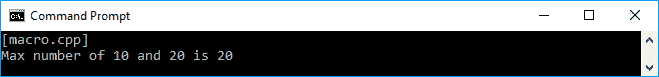

正如我们在本章开头讨论的那样，元编程是在编译时运行的代码。通过在前面的代码中使用宏，我们可以展示从`MAX`宏生成的新代码。预处理器将在编译时解析宏并带来新的代码。在编译时，编译器将修改代码如下：

```cpp
    auto main() -> int
    {
      // same code
      // ...

      int z = (((a) > (b)) ? (a) : (b)); // <-- Notice this section

      // same code
      // ...

      return 0;
    }

```

除了单行宏预处理器之外，我们还可以生成多行宏元函数。为了实现这一点，我们可以在每行末尾使用反斜杠字符。假设我们需要交换两个值。我们可以创建一个名为`SWAP`的参数化宏，并像下面的代码一样使用它：

```cpp
    /* macroswap.cpp */
    #include <iostream>

    using namespace std;

    // Defining multi line macro
    #define SWAP(a,b) { \
      (a) ^= (b); \
      (b) ^= (a); \
      (a) ^= (b); \
    }

    auto main() -> int
    {
      cout << "[macroswap.cpp]" << endl;

      // Initializing two int variables
      int x = 10;
      int y = 20;

      // Displaying original variable value
      cout << "before swapping" << endl;
      cout << "x = " << x << ", y = " << y ;
      cout << endl << endl;

      // Consuming the SWAP macro
      SWAP(x,y);

      // Displaying swapped variable value
      cout << "after swapping" << endl;
      cout << "x = " << x << ", y = " << y;
      cout << endl;

      return 0;
    }

```

如前面的代码所示，我们将创建一个多行预处理器宏，并在每行末尾使用反斜杠字符。每次调用`SWAP`参数化宏时，它将被替换为宏的实现。如果我们运行前面的代码，将在控制台上看到以下输出：

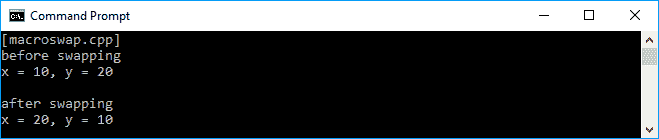

现在我们对元编程有了基本的了解，特别是在元函数中，我们可以在下一个主题中进一步学习。

在每个宏预处理器的实现中，我们为每个变量使用括号，因为预处理器只是用宏的实现替换我们的代码。假设我们有以下宏：

`MULTIPLY(a,b) (a * b)` 如果我们将数字作为参数传递，那么这不会成为问题。然而，如果我们将一个操作作为参数传递，就会出现问题。例如，如果我们像下面这样使用`MULTIPLY`宏：

`MULTIPLY(x+2,y+5);`

然后编译器将其替换为`(x+2*y+5)`。这是因为宏只是用`x + 2`表达式替换`a`变量，用`y + 5`表达式替换`b`变量，而没有额外的括号。因为乘法的顺序高于加法，我们将得到以下结果：

`(x+2y+5)`

这并不是我们期望的结果。因此，最好的方法是在参数的每个变量中使用括号。

# 解剖标准库中的模板元编程

我们在第一章中讨论了标准库，*深入现代 C++*，并在上一章中也处理了它。C++语言中提供的标准库主要是一个包含不完整函数的模板。然而，它将用于生成完整的函数。模板元编程是 C++模板，用于在编译时生成 C++类型和代码。

让我们挑选标准库中的一个类--`Array`类。在`Array`类中，我们可以为其定义一个数据类型。当我们实例化数组时，编译器实际上会生成我们定义的数据类型的数组的代码。现在，让我们尝试构建一个简单的`Array`模板实现，如下所示：

```cpp
    template<typename T>
    class Array
    {
      T element;
    };

```

然后，我们实例化`char`和`int`数组如下：

```cpp
    Array<char> arrChar;
    Array<int> arrInt;

```

编译器所做的是基于我们定义的数据类型创建这两个模板的实现。虽然我们在代码中看不到这一点，但编译器实际上创建了以下代码：

```cpp
    class ArrayChar
    {
      char element;
    };

    class ArrayInt
    {
      int element;
    };

    ArrayChar arrChar;
    ArrayInt arrInt;

```

正如我们在前面的代码片段中所看到的，模板元编程是在编译时创建另一个代码的代码。

# 构建模板元编程

在进一步讨论模板元编程之前，最好讨论一下构建模板元编程的骨架。有四个因素构成模板元编程--**类型**，**值**，**分支**和**递归**。在这个话题中，我们将深入探讨构成模板的因素。

# 在模板中添加一个值到变量

在本章的开头，我们讨论了元函数的概念，当我们谈到宏预处理器时。在宏预处理器中，我们明确地操纵源代码；在这种情况下，宏（元函数）操纵源代码。相反，在 C++模板元编程中，我们使用类型。这意味着元函数是一个与类型一起工作的函数。因此，使用模板元编程的更好方法是尽可能只使用类型参数。当我们谈论模板元编程中的变量时，实际上它并不是一个变量，因为它上面的值是不能被修改的。我们需要的是变量的名称，这样我们才能访问它。因为我们将使用类型编码，命名的值是`typedef`，正如我们在以下代码片段中所看到的：

```cpp
    struct ValueDataType
    {
      typedef int valueDataType;
    };

```

通过使用前面的代码，我们将`int`类型存储到`valueDataType`别名中，这样我们就可以使用`valueDataType`变量来访问数据类型。如果我们需要将值而不是数据类型存储到变量中，我们可以使用`enum`，这样它将成为`enum`本身的数据成员。如果我们想要存储值，让我们看一下以下代码片段：

```cpp
    struct ValuePlaceHolder
    {
      enum 
       { 
        value = 1 
       };
    };

```

基于前面的代码片段，我们现在可以访问`value`变量以获取其值。

# 将函数映射到输入参数

我们可以将变量添加到模板元编程中。现在，我们接下来要做的是检索用户参数并将它们映射到一个函数。假设我们想要开发一个`Multiplexer`函数，它将两个值相乘，我们必须使用模板元编程。以下代码片段可用于解决这个问题：

```cpp
    template<int A, int B>
    struct Multiplexer
    {
      enum 
      {
        result = A * B 
      };
    };

```

正如我们在前面的代码片段中所看到的，模板需要用户提供两个参数`A`和`B`，它将使用它们来通过将这两个参数相乘来获取`result`变量的值。我们可以使用以下代码访问结果变量：

```cpp
    int i = Multiplexer<2, 3>::result;

```

如果我们运行前面的代码片段，`i`变量将存储`6`，因为它将计算`2`乘以`3`。

# 根据条件选择正确的过程

当我们有多个函数时，我们必须根据某些条件选择其中一个。我们可以通过提供`template`类的两个替代特化来构建条件分支，如下所示：

```cpp
    template<typename A, typename B>
    struct CheckingType
    {
      enum 
      { 
        result = 0 
      };
    };

    template<typename X>
    struct CheckingType<X, X>
    {
      enum 
      { 
        result = 1 
      };
    };

```

正如我们在前面的`template`代码中所看到的，我们有两个模板，它们的类型分别为`X`和`A`/`B`。当模板只有一个类型，即`typename X`时，这意味着我们比较的两种类型（`CheckingType <X, X>`）完全相同。否则，这两种数据类型是不同的。以下代码片段可以用来使用前面的两个模板：

```cpp
    if (CheckingType<UnknownType, int>::result)
    {
      // run the function if the UnknownType is int
    } 
    else 
    { 
      // otherwise run any function 
    }

```

正如我们在前面的代码片段中所看到的，我们试图将`UnknownType`数据类型与`int`类型进行比较。`UnknownType`数据类型可能来自其他过程。然后，我们可以通过使用模板来比较这两种类型来决定我们想要运行的下一个过程。

到目前为止，你可能会想知道模板多编程如何帮助我们进行代码优化。很快我们将使用模板元编程来优化代码。然而，我们需要讨论其他事情来巩固我们在模板多编程中的知识。现在，请耐心阅读。

# 递归重复这个过程

我们已经成功地将值和数据类型添加到模板中，然后根据当前条件创建了一个分支来决定下一个过程。在基本模板中，我们还需要考虑重复这个过程。然而，由于模板中的变量是不可变的，我们无法迭代序列。相反，我们必须像我们在第四章中讨论的那样，通过递归算法重复这个过程。

假设我们正在开发一个模板来计算阶乘值。我们首先要做的是开发一个将`I`值传递给函数的通用模板，如下所示：

```cpp
    template <int I>
    struct Factorial
    {
      enum 
      { 
        value = I * Factorial<I-1>::value 
      };
    };

```

正如我们在前面的代码中所看到的，我们可以通过运行以下代码来获得阶乘的值：

```cpp
    Factorial<I>::value;

```

在前面的代码中，`I`是一个整数。

接下来，我们必须开发一个模板来确保它不会陷入无限循环。我们可以创建以下模板，将零（`0`）作为参数传递给它：

```cpp
    template <>
    struct Factorial<0>
    {
      enum 
      { 
        value = 1 
      };
    };

```

现在我们有一对模板，可以在编译时生成阶乘的值。以下是一个示例代码，用于在编译时获取`Factorial(10)`的值：

```cpp
    int main()
    {
      int fact10 = Factorial<10>::value;
    }

```

如果我们运行前面的代码，我们将得到`10`的阶乘的结果`3628800`。

# 在编译时选择类型

正如我们在前面的主题中讨论的，`type`是模板的基本部分。然而，我们可以根据用户的输入选择特定的类型。让我们创建一个模板，可以决定变量中应该使用什么类型。以下的`types.cpp`代码将展示模板的实现：

```cpp
    /* types.cpp */
    #include <iostream>

    using namespace std;

 // Defining a data type
 // in template
 template<typename T>
 struct datatype
 {
 using type = T;
 };

    auto main() -> int
    {
      cout << "[types.cpp]" << endl;

      // Selecting a data type in compile time
      using t = typename datatype<int>::type;

      // Using the selected data type
      t myVar = 123;

      // Displaying the selected data type
      cout << "myVar = " << myVar;

      return 0;
    }

```

正如我们在前面的代码中所看到的，我们有一个名为`datatype`的模板。这个模板可以用来选择我们传递给它的`type`。我们可以使用`using`关键字将一个变量分配给`type`。从前面的`types.cpp`代码中，我们将把一个变量`t`分配给`datatype`模板中的`type`。现在，`t`变量将是`int`，因为我们将`int`数据类型传递给了模板。

我们还可以创建一个代码来根据当前条件选择正确的数据类型。我们将有一个`IfElseDataType`模板，它接受三个参数，即`predicate`，当`predicate`参数为 true 时的数据类型，以及当`predicate`参数为 false 时的数据类型。代码将如下所示：

```cpp
    /* selectingtype.cpp */
    #include <iostream>

    using namespace std;

    // Defining IfElseDataType template
    template<
      bool predicate,
      typename TrueType,
      typename FalseType>
      struct IfElseDataType
      {
      };

    // Defining template for TRUE condition
    // passed to 'predicate' parameter
    template<
      typename TrueType,
      typename FalseType>
      struct IfElseDataType<
       true,
       TrueType,
       FalseType>
       {
         typedef TrueType type;
       };

    // Defining template for FALSE condition
    // passed to 'predicate' parameter
    template<
      typename TrueType,
      typename FalseType>
      struct IfElseDataType<
      false,
      TrueType,
      FalseType>
      {
         typedef FalseType type;
      };

    auto main() -> int
    {
      cout << "[types.cpp]" << endl;

      // Consuming template and passing
      // 'SHRT_MAX == 2147483647'
      // It will be FALSE
      // since the maximum value of short
      // is 32767
      // so the data type for myVar
      // will be 'int'
      IfElseDataType<
        SHRT_MAX == 2147483647,
        short,
        int>::type myVar;

      // Assigning myVar to maximum value
      // of 'short' type
      myVar = 2147483647;

      // Displaying the data type of myVar
      cout << "myVar has type ";
      cout << typeid(myVar).name() << endl;

      return 0;
    }

```

现在，通过`IfElseDataType`模板，我们可以根据我们的条件选择正确的类型给变量。假设我们想要将`2147483647`赋给一个变量，以便我们可以检查它是否是一个短数字。如果是，`myVar`将是`short`类型，否则将是`int`类型。此外，由于`short`类型的最大值是`32767`，通过给定谓词为`SHRT_MAX == 2147483647`将导致`FALSE`。因此，`myVar`的类型将是`int`类型，如我们将在控制台上看到的以下输出：

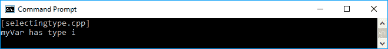

# 使用模板元编程进行流程控制

代码流是编写程序的重要方面。在许多编程语言中，它们有`if-else`，`switch`和`do-while`语句来安排代码的流程。现在，让我们将通常的代码流重构为基于模板的流程。我们将首先使用`if-else`语句，然后是`switch`语句，最后以模板的形式结束`do-while`语句。

# 根据当前条件决定下一个过程

现在是时候使用我们之前讨论过的模板了。假设我们有两个函数，我们必须根据某个条件进行选择。我们通常会使用`if-else`语句，如下所示：

```cpp
    /* condition.cpp */
    #include <iostream>

    using namespace std;

    // Function that will run
    // if the condition is TRUE
    void TrueStatement()
    {
      cout << "True Statement is run." << endl;
    }

    // Function that will run
    // if the condition is FALSE
    void FalseStatement()
    {
      cout << "False Statement is run." << endl;
    }

    auto main() -> int
    {
      cout << "[condition.cpp]" << endl;

      // Choosing the function
      // based on the condition
      if (2 + 3 == 5)
        TrueStatement();
      else
        FalseStatement();

      return 0;
    }

```

正如我们在前面的代码中所看到的，我们有两个函数--`TrueStatement()`和`FalseStatement()`。我们在代码中还有一个条件--`2 + 3 == 5`。由于条件是`TRUE`，因此`TrueStatement()`函数将被运行，如我们在下面的截图中所看到的：

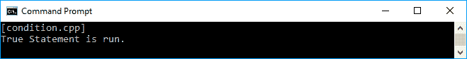

现在，让我们重构前面的`condition.cpp`代码。我们将在这里创建三个模板。首先，输入条件的初始化模板如下：

```cpp
    template<bool predicate> class IfElse

```

然后，我们为每个条件创建两个模板--`TRUE`或`FALSE`。名称将如下：

```cpp
    template<> class IfElse<true>
    template<> class IfElse<false> 

```

前面代码片段中的每个模板将运行我们之前创建的函数--`TrueStatement()`和`FalseStatement()`函数。我们将得到完整的代码，如下所示的`conditionmeta.cpp`代码：

```cpp
    /* conditionmeta.cpp */
    #include <iostream>

    using namespace std;

    // Function that will run
    // if the condition is TRUE
    void TrueStatement()
    {
      cout << "True Statement is run." << endl;
    }

    // Function that will run
    // if the condition is FALSE
    void FalseStatement()
    {
      cout << "False Statement is run." << endl;
    }

    // Defining IfElse template
    template<bool predicate>
    class IfElse
    {
    };

    // Defining template for TRUE condition
    // passed to 'predicate' parameter
    template<>
    class IfElse<true>
    {
      public:
        static inline void func()
        {
          TrueStatement();
        }
    };

    // Defining template for FALSE condition
    // passed to 'predicate' parameter
    template<>
    class IfElse<false>
    {
      public:
        static inline void func()
        {
          FalseStatement();
        }
    };

    auto main() -> int
    {
      cout << "[conditionmeta.cpp]" << endl;

      // Consuming IfElse template
      IfElse<(2 + 3 == 5)>::func();

      return 0;
    }

```

正如我们所看到的，我们将条件放在`IfElse`模板的括号中，然后在模板内调用`func()`方法。如果我们运行`conditionmeta.cpp`代码，我们将得到与`condition.cpp`代码完全相同的输出，如下所示：

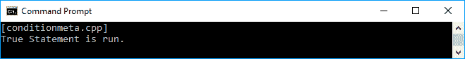

现在我们有了`if-else`语句来流动我们的模板元编程代码。

# 选择正确的语句

在 C++编程中，以及其他编程语言中，我们使用`switch`语句根据我们给`switch`语句的值来选择某个过程。如果值与 switch case 中的一个匹配，它将运行该 case 下的过程。让我们看一下下面的`switch.cpp`代码，它实现了`switch`语句：

```cpp
    /* switch.cpp */
    #include <iostream>

    using namespace std;

    // Function to find out
    // the square of an int
    int Square(int a)
    {
      return a * a;
    }

    auto main() -> int
    {
      cout << "[switch.cpp]" << endl;

      // Initializing two int variables
      int input = 2;
      int output = 0;

      // Passing the correct argument
      // to the function
      switch (input)
      {
        case 1:
            output = Square(1);
            break;
        case 2:
            output = Square(2);
            break;
        default:
            output = Square(0);
            break;
      }

      // Displaying the result
      cout << "The result is " << output << endl;

      return 0;
    }

```

正如我们在前面的代码中所看到的，我们有一个名为`Square()`的函数，它接受一个参数。我们传递给它的参数是基于我们给 switch 语句的值。由于我们传递给 switch 的值是`2`，`Square(2)`方法将被运行。下面的截图是我们将在控制台屏幕上看到的内容：

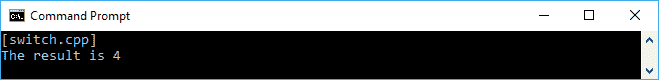

要将`switch.cpp`代码重构为模板元编程，我们必须创建三个包含我们计划运行的函数的模板。首先，我们将创建初始化模板以从用户那里检索值，如下所示：

```cpp
    template<int val> class SwitchTemplate 

```

前面的初始化模板也将用于默认值。接下来，我们将为每个可能的值添加两个模板，如下所示：

```cpp
    template<> class SwitchTemplate<1>
    template<> class SwitchTemplate<2> 

```

每个前面的模板将运行`Square()`函数并根据模板的值传递参数。完整的代码如下所示：

```cpp
    /* switchmeta.cpp */
    #include <iostream>

    using namespace std;

    // Function to find out
    // the square of an int
    int Square(int a)
    {
      return a * a;
    }

    // Defining template for
    // default output
    // for any input value
    template<int val>
    class SwitchTemplate
    {
      public:
        static inline int func()
        {
          return Square(0);
        }
    };

    // Defining template for
    // specific input value
    // 'val' = 1
    template<>
    class SwitchTemplate<1>
    {
       public:
         static inline int func()
         {
           return Square(1);
         }
    };

    // Defining template for
    // specific input value
    // 'val' = 2
    template<>
    class SwitchTemplate<2>
    {
       public:
         static inline int func()
         {
            return Square(2);
         }
    };

    auto main() -> int
    {
      cout << "[switchmeta.cpp]" << endl;

      // Defining a constant variable
      const int i = 2;

      // Consuming the SwitchTemplate template
      int output = SwitchTemplate<i>::func();

      // Displaying the result
      cout << "The result is " << output << endl;

      return 0;
    }

```

如我们所见，我们与`conditionmeta.cpp`做的一样--我们调用模板内的`func()`方法来运行所选的函数。此`switch-case`条件的值是我们放在尖括号中的模板。如果我们运行前面的`switchmeta.cpp`代码，我们将在控制台上看到以下输出：

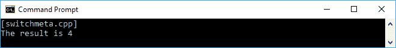

如前面的截图所示，与`switch.cpp`代码相比，我们对`switchmeta.cpp`代码得到了完全相同的输出。因此，我们已成功将`switch.cpp`代码重构为模板元编程。

# 循环该过程

当我们迭代某些内容时，通常使用`do-while`循环。假设我们需要打印某些数字，直到达到零（`0`）。代码如下所示：

```cpp
    /* loop.cpp */
    #include <iostream>

    using namespace std;

    // Function for printing
    // given number
    void PrintNumber(int i)
    {
      cout << i << "\t";
    }

    auto main() -> int
    {
      cout << "[loop.cpp]" << endl;

      // Initializing an int variable
      // marking as maximum number
      int i = 100;

      // Looping to print out
      // the numbers below i variable
      cout << "List of numbers between 100 and 1";
      cout << endl;
      do
      {
        PrintNumber(i);
      }
      while (--i > 0);
      cout << endl;

      return 0;
    }

```

如前面的代码所示，我们将打印数字`100`，减少其值，并再次打印。它将一直运行，直到数字达到零（`0`）。控制台上的输出应该如下所示：

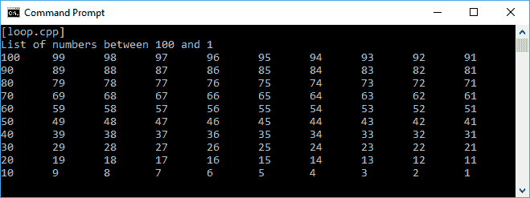

现在，让我们将其重构为模板元编程。在这里，我们只需要两个模板来实现模板元编程中的`do-while`循环。首先，我们将创建以下模板：

```cpp
    template<int limit> class DoWhile

```

前面代码中的限制是传递给`do-while`循环的值。为了不使循环变成无限循环，当它达到零（`0`）时，我们必须设计`DoWhile`模板，如下所示：

```cpp
    template<> class DoWhile<0>

```

前面的模板将什么也不做，因为它只用于中断循环。对`do-while`循环的完全重构如下`loopmeta.cpp`代码：

```cpp
    /* loopmeta.cpp */
    #include <iostream>

    using namespace std;

    // Function for printing
    // given number
    void PrintNumber(int i)
    {
      cout << i << "\t";
    }

    // Defining template for printing number
    // passing to its 'limit' parameter
    // It's only run
    // if the 'limit' has not been reached
    template<int limit>
    class DoWhile
    {
       private:
         enum
         {
           run = (limit-1) != 0
         };

       public:
         static inline void func()
         {
           PrintNumber(limit);
           DoWhile<run == true ? (limit-1) : 0>
            ::func();
         }
    };

    // Defining template for doing nothing
    // when the 'limit' reaches 0
    template<>
    class DoWhile<0>
    {
      public:
        static inline void func()
        {
        }
    };

    auto main() -> int
    {
      cout << "[loopmeta.cpp]" << endl;

      // Defining a constant variable
      const int i = 100;

      // Looping to print out
      // the numbers below i variable
      // by consuming the DoWhile
      cout << "List of numbers between 100 and 1";
      cout << endl;
      DoWhile<i>::func();
      cout << endl;

      return 0;
    }

```

然后我们调用模板内的`func()`方法来运行我们想要的函数。如果我们运行代码，我们将在屏幕上看到以下输出：

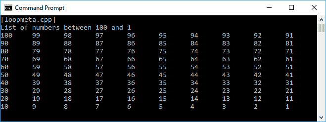

同样，我们已成功将`loop.cpp`代码重构为`loopmeta.cpp`代码，因为两者的输出完全相同。

# 在编译时执行代码

正如我们之前讨论的，模板元编程将通过创建新代码在编译时运行代码。现在，让我们看看如何获取编译时常量并在本节生成编译时类。

# 获取编译时常量

为了检索编译时常量，让我们创建一个包含斐波那契算法模板的代码。我们将使用模板，这样编译器将在编译时提供值。代码应该如下所示：

```cpp
    /* fibonaccimeta.cpp */
    #include <iostream>

    using namespace std;

    // Defining Fibonacci template
    // to calculate the Fibonacci sequence
    template <int number>
    struct Fibonacci
    {
      enum
      {
        value =
            Fibonacci<number - 1>::value +
            Fibonacci<number - 2>::value
      };
    };

    // Defining template for
    // specific input value
    // 'number' = 1
    template <>
    struct Fibonacci<1>
    {
      enum
      {
        value = 1
      };
    };

    // Defining template for
    // specific input value
    // 'number' = 0
    template <>
    struct Fibonacci<0>
    {
      enum
      {
        value = 0
      };
    };

    auto main() -> int
    {
      cout << "[fibonaccimeta.cpp]" << endl;

      // Displaying the compile-time constant
      cout << "Getting compile-time constant:";
      cout << endl;
      cout << "Fibonacci(25) = ";
      cout << Fibonacci<25>::value;
      cout << endl;

      return 0;
    }

```

如前面的代码所示，斐波那契模板中的值变量将提供编译时常量。如果我们运行前面的代码，我们将在控制台屏幕上看到以下输出：

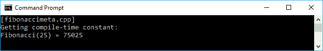

现在，我们有`75025`，这是由编译器生成的编译时常量。

# 使用编译时类生成生成类

除了生成编译时常量之外，我们还将在编译时生成类。假设我们有一个模板来找出范围为`0`到`X`的质数。以下的`isprimemeta.cpp`代码将解释模板元编程的实现以找到质数：

```cpp
    /* isprimemeta.cpp */
    #include <iostream>

    using namespace std;

    // Defining template that decide
    // whether or not the passed argument
    // is a prime number
    template <
      int lastNumber,
      int secondLastNumber>
    class IsPrime
    {
      public:
        enum
        {
          primeNumber = (
            (lastNumber % secondLastNumber) &&
            IsPrime<lastNumber, secondLastNumber - 1>
                ::primeNumber)
        };
     };

    // Defining template for checking
    // the number passed to the 'number' parameter
    // is a prime number
    template <int number>
    class IsPrime<number, 1>
    {
      public:
        enum
        {
          primeNumber = 1
        };
    };

    // Defining template to print out
    // the passed argument is it's a prime number
    template <int number>
    class PrimeNumberPrinter
    {
      public:
        PrimeNumberPrinter<number - 1> printer;

      enum
      {
        primeNumber = IsPrime<number, number - 1>
            ::primeNumber
      };

      void func()
      {
        printer.func();

        if (primeNumber)
        {
            cout << number << "\t";
        }
      }
    };

    // Defining template to just ignoring the number
    // we pass 1 as argument to the parameter
    // since 1 is not prime number
    template<>
    class PrimeNumberPrinter<1>
    {
      public:
        enum
        {
          primeNumber = 0
        };

        void func()
        {
        }
    };

    int main()
    {
      cout << "[isprimemeta.cpp]" << endl;

      // Displaying the prime numbers between 1 and 500
      cout << "Filtering the numbers between 1 and 500 ";
      cout << "for of the prime numbers:" << endl;

      // Consuming PrimeNumberPrinter template
      PrimeNumberPrinter<500> printer;

      // invoking func() method from the template
      printer.func();

      cout << endl;
      return 0;
    }

```

有两种不同角色的模板--**质数检查器**，确保传递的数字是质数，以及**打印机**，将质数显示到控制台。当代码访问`PrimeNumberPrinter<500> printer`和`printer.func()`时，编译器将在编译时生成类。当我们运行前面的`isprimemeta.cpp`代码时，我们将在控制台屏幕上看到以下输出：

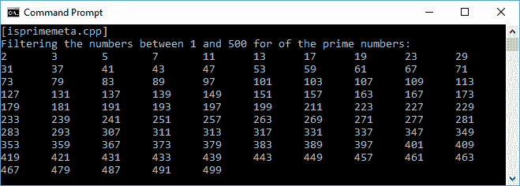

由于我们将`500`传递给模板，我们将从`0`到`500`得到质数。前面的输出证明了编译器成功生成了一个编译时类，因此我们可以得到正确的值。

# 元编程的利与弊

在我们讨论完模板元编程之后，以下是我们得到的优点：

+   模板元编程没有副作用，因为它是不可变的，所以我们不能修改现有类型

+   与不实现元编程的代码相比，代码可读性更好

+   它减少了代码的重复

尽管我们可以从模板元编程中获得好处，但也有一些缺点，如下所示：

+   语法相当复杂。

+   编译时间较长，因为现在我们在编译时执行代码。

+   编译器可以更好地优化生成的代码并执行内联，例如 C 中的`qsort()`函数和 C++中的`sort`模板。在 C 中，`qsort()`函数接受一个指向比较函数的指针，因此将有一个未内联的`qsort`代码副本。它将通过指针调用比较例程。在 C++中，`std::sort`是一个模板，它可以接受一个`functor`对象作为比较器。对于每种不同类型用作比较器，都有一个不同的`std::sort`副本。如果我们使用一个具有重载的`operator()`函数的`functor`类，比较器的调用可以轻松地内联到`std::sort`的这个副本中。

# 总结

元编程，特别是模板元编程，可以自动为我们创建新的代码，这样我们就不需要在源代码中编写大量的代码。通过使用模板元编程，我们可以重构代码的流程控制，并在编译时执行代码。

在下一章中，我们将讨论并发技术，这将为我们构建的应用程序带来响应性增强。我们可以使用并行技术同时运行代码中的进程。
