# 使用并发运行并行执行

在前一章中，我们讨论了模板元编程，它将使代码在编译时执行。它还将改善我们的代码流程控制，因为我们可以使用模板重构流程。现在，在本章中，我们将讨论 C++中的并发，当我们同时运行两个或更多个进程时，我们必须再次控制流程。在本章中，我们将讨论以下主题：

+   在 C++编程中运行单个和多个线程

+   同步线程以避免死锁

+   在 Windows 中使用**handle**资源创建线程

# C++中的并发

许多编程语言今天都提供了对并发的支持。在并发编程中，代码的计算在重叠的时间段内执行，而不是顺序执行。这将使我们的程序响应迅速，因为代码不需要等待所有计算完成。假设我们想开发一个可以同时播放视频和下载大型视频文件的程序。如果没有并发技术，我们必须等待视频成功下载后才能播放另一个视频文件。通过使用这种技术，我们可以分割这两个任务，播放和下载视频，然后同时并发运行它们。

在 C++11 宣布之前，C++程序员依赖于`Boost::thread`来使用多线程技术创建并发程序。在多线程中，我们将进程分解为最小的序列，并同时运行这些小进程。现在，在 C++11 库中，我们得到了`thread`类来满足我们使用多线程技术的并发需求。

# 处理单线程代码

要使用`thread`类，我们只需要创建一个`std::thread`的实例，并将函数名作为参数传递。然后我们调用`std::join()`来暂停进程，直到所选线程完成其进程。让我们看一下以下`singlethread.cpp`的代码：

```cpp
    /* singlethread.cpp */
    #include <thread>
    #include <iostream>

    using namespace std;

    void threadProc()
    {
      cout << "Thread ID: ";
      cout << this_thread::get_id() << endl;
    }

    auto main() -> int
    {
      cout << "[singlethread.cpp]" << endl;

      thread thread1(threadProc);
      thread1.join();

      return 0;
    }

```

正如我们在前面的代码中所看到的，我们有一个名为`threadProc()`的函数，并将其传递给`main()`函数中的`thread1`初始化。初始化后，我们调用`join()`方法来执行`thread1`对象。我们在控制台上看到的输出应该如下：

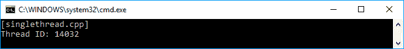

我们已经成功地在我们的代码中运行了一个线程。现在，让我们在`main()`函数中添加一行代码，来迭代一行代码。我们将同时并发运行它们。`singlethread2.cpp`的代码如下：

```cpp
    /* singlethread2.cpp */
    #include <thread>
    #include <chrono>
    #include <iostream>

    using namespace std;

    void threadProc()
    {
      for (int i = 0; i < 5; i++)
      {
        cout << "thread: current i = ";
        cout << i << endl;
      }
    }

    auto main() -> int
    {
      cout << "[singlethread2.cpp]" << endl;

      thread thread1(threadProc);

      for (int i = 0; i < 5; i++)
 {
 cout << "main : current i = " << i << endl;

        this_thread::sleep_for(
            chrono::milliseconds(5)); }

      thread1.join();

      return 0;
    }

```

正如我们在前面的代码中所看到的，我们添加了一个`for`循环来迭代一些代码，并与`thread1`同时运行。为了理解它，我们也在`threadProc()`函数中添加了一个`for`循环。让我们看一下以下截图，以弄清楚我们将得到什么输出：

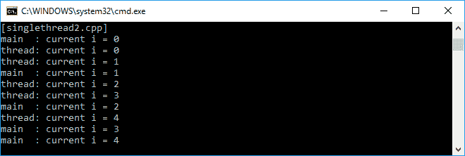

我们看到`threadProc()`函数和`main()`函数中的代码同时并发运行。你们可能会得到不同的结果，但没关系，因为结果是无法预测的，这取决于设备本身。然而，目前我们已经能够同时运行两个进程。

我多次运行了前面的代码，以获得我们在前面截图中看到的输出。你可能会看到`threadProc()`和`main()`函数之间的不同顺序，或者得到混乱的输出，因为线程的流程是不可预测的。

# 处理多线程代码

在多线程技术中，我们同时运行两个或更多个线程。假设我们同时运行五个线程。我们可以使用以下`multithread.cpp`代码，将这五个线程存储在一个数组中：

```cpp
    /* multithread.cpp */
    #include <thread>
    #include <iostream>

    using namespace std;

    void threadProc()
    {
      cout << "Thread ID: ";
      cout << this_thread::get_id() << endl;
    }

    auto main() -> int
    {
      cout << "[multithread.cpp]" << endl;

      thread threads[5];

      for (int i = 0; i < 5; ++i)
      {
        threads[i] = thread(threadProc);
      }

      for (auto& thread : threads)
      {
        thread.join();
      }

      return 0;
    }

```

在我们根据前面的代码初始化这五个线程之后，我们将运行`join()`方法来执行所有线程。通过使用`join()`方法，程序将等待调用线程中的所有进程完成，然后继续下一个进程（如果有的话）。我们在控制台中看到的结果如下：

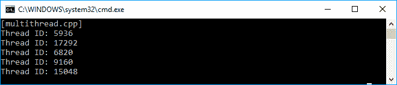

在前面的截图中，我们看到所有五个线程都已成功执行。我们也可以使用 Lambda 表达式来初始化线程。下面的`lambdathread.cpp`代码是从前面使用 Lambda 而不是创建一个单独的函数进行重构的代码：

```cpp
    /* lambdathread.cpp */
    #include <thread>
    #include <iostream>

    using namespace std;

    auto main() -> int
    {
      cout << "[lambdathread.cpp]" << endl;

      thread threads[5];

      for (int i = 0; i < 5; ++i)
      {
 threads[i] = thread([]()
 {
 cout << "Thread ID: ";
 cout << this_thread::get_id() << endl;
 });
       }

      for (auto& thread : threads)
      {
        thread.join();
      }

      return 0;
    }

```

如果我们看`lambdathread.cpp`代码与`multithread.cpp`代码，没有什么显著的变化。然而，由于该函数只会被调用一次，最好使用 Lambda，这样更容易维护。我们在控制台上看到的输出如下截图所示，与`multithread.cpp`代码的输出相比并没有太大的不同：

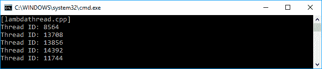

尽管在运行`lambdathread.cpp`与`multithread.cpp`代码进行比较时我们得到了相同的输出，但是当我们使用 Lambda 表达式初始化线程时，我们有一个清晰的代码。我们不需要创建另一个方法传递给`Thread`，例如`threadProc()`，因为这个方法实际上只使用一次。

再次注意，您在屏幕上看到的结果可能与我给出的截图不同。

# 使用互斥锁同步线程

到目前为止，我们已经成功地执行了一个多线程代码。然而，如果我们在线程内部使用一个共享对象并对其进行操作，就会出现问题。这被称为**同步**。在本节中，我们将尝试通过应用`mutex`技术来避免这个问题。

# 避免同步问题

正如我们之前讨论的，在这一部分，我们必须确保在线程中运行的共享对象在执行时给出正确的值。假设我们有一个名为`counter`的全局变量，并且我们计划在我们拥有的所有五个线程中增加它的值。每个线程将执行`10000`次增量迭代，因此我们期望得到所有五个线程的结果为`50000`。代码如下：

```cpp
    /* notsync.cpp */
    #include <thread>
    #include <iostream>

    using namespace std;

    auto main() -> int
    {
      cout << "[notsync.cpp]" << endl;

      int counter = 0;

      thread threads[5];

      for (int i = 0; i < 5; ++i)
      {
        threads[i] = thread([&counter]()
        {
 for (int i = 0; i < 10000; ++i)
 {
 ++counter;
 cout << "Thread ID: ";
 cout << this_thread::get_id();
 cout << "\tCurrent Counter = ";
 cout << counter << endl;
 }
        });
      }

      for (auto& thread : threads)
      {
        thread.join();
      }

      cout << "Final result = " << counter << endl;

      return 0;
    }

```

现在，让我们看一下当我们运行前面的代码时，我们可能在控制台上看到的以下截图：

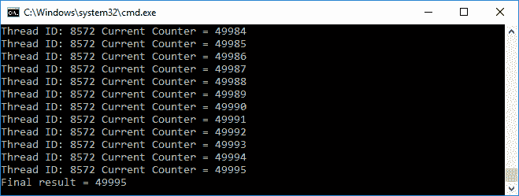

不幸的是，根据前面的截图，我们没有得到我们期望的结果。这是因为增量过程不是一个原子操作，原子操作将保证并发进程的隔离。

如果您得到了不同的输出，不要担心，我们仍然在正确的轨道上，因为这个程序展示了同步问题，接下来您将看到。

如果我们深入追踪输出，我们会看到有两个线程执行`counter`变量的完全相同的值，正如我们在下面的截图中所看到的：

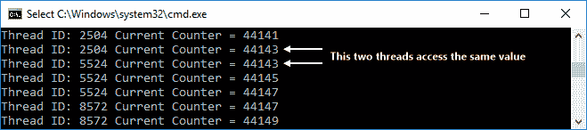

我们看到 ID 为`2504`和`5524`的线程在`counter`变量的值为`44143`时访问了该变量。这就是当我们运行前面的代码时为什么会得到意外的结果。现在我们需要使增量操作成为一个原子操作，这样就可以在操作期间不允许其他进程读取或更改被读取或更改的状态。

为了解决这个问题，我们可以使用`mutex`类来使我们的计数器变量`线程安全`。这意味着在线程访问计数器变量之前，它必须确保该变量不被其他线程访问。我们可以使用`mutex`类中的`lock()`和`unlock()`方法来锁定和解锁目标变量。让我们看一下下面的`mutex.cpp`代码来演示`mutex`的实现：

```cpp
    /* mutex.cpp */
    #include <thread>
    #include <mutex>
    #include <iostream>

    using namespace std;

    auto main() -> int
    {
      cout << "[mutex.cpp]" << endl;

      mutex mtx;
      int counter = 0;

      thread threads[5];

      for (int i = 0; i < 5; ++i)
      {
        threads[i] = thread([&counter, &mtx]()
        {
           for (int i = 0; i < 10000; ++i)
           {
             mtx.lock();
             ++counter;
             mtx.unlock();

             cout << "Thread ID: ";
             cout << this_thread::get_id();
             cout << "\tCurrent Counter = ";
             cout << counter << endl;
           }
        });
      }

      for (auto& thread : threads)
      {
        thread.join();
      }

      cout << "Final result = " << counter << endl;

      return 0;
    }

```

在前面的代码中，我们可以看到，在代码递增`counter`变量之前，它调用了`lock()`方法。之后，它调用`unlock()`方法来通知其他线程，`counter`变量现在可以自由操作。如果我们运行前面的代码，应该在控制台上看到以下输出：

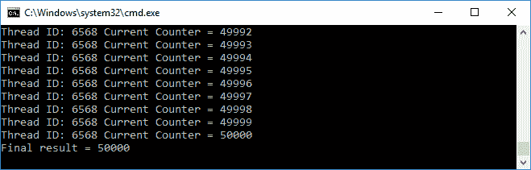

通过使用`mutex`类，现在我们得到了我们期望的结果，如前面的截图所示。

# 自动解锁变量

现在我们知道如何锁定变量，以确保没有两个线程同时处理相同的值。然而，如果在线程调用`unlock()`方法之前抛出异常，问题就会发生。如果变量的状态保持锁定，程序将完全被锁定。为了解决这个问题，我们可以使用`lock_guard<mutex>`来锁定变量，并确保无论发生什么情况，它都将在作用域结束时解锁。以下代码片段是通过添加`lock_guard<mutex>`功能从前面的代码重构而来的：

```cpp
    /* automutex.cpp */
    #include <thread>
    #include <mutex>
    #include <iostream>

    using namespace std;

    auto main() -> int
    {
      cout << "[automutex.cpp]" << endl;

      mutex mtx;
      int counter = 0;

      thread threads[5];

      for (int i = 0; i < 5; ++i)
      {
        threads[i] = thread([&counter, &mtx]()
        {
          for (int i = 0; i < 10000; ++i)
          {
            {
              lock_guard <mutex> guard(mtx);
              ++counter;
             }

             cout << "Thread ID: ";
             cout << this_thread::get_id();
             cout << "\tCurrent Counter = ";
             cout << counter << endl;
          }
         });
       }

       for (auto& thread : threads)
       {
          thread.join();
       }

      cout << "Final result = " << counter << endl;

      return 0;
    }

```

从前面的`automutex.cpp`代码中可以看出，在递增`counter`变量之前，它调用了`lock_guard <mutex> guard(mtx)`。如果我们运行代码，我们将得到与`mutex.cpp`代码完全相同的输出。然而，现在我们有一个不会不可预测地被锁定的程序。

# 使用递归互斥量避免死锁

在前一节中，我们使用`lock_guard`来确保变量不被多个线程访问。然而，如果多个`lock_guard`获取锁，我们仍然会面临问题。在下面的代码片段中，我们有两个函数将调用`lock_guard`--`Multiplexer()`和`Divisor()`。除此之外，我们还有一个函数将调用这两个函数--`RunAll()`，它将在调用这两个函数之前先调用`lock_guard`。代码应该如下所示：

```cpp
    /* deadlock.cpp */
    #include <thread>
    #include <mutex>
    #include <iostream>

    using namespace std;

    struct Math
    {
      mutex mtx;
      int m_content;

      Math() : m_content(0)
      {
      }

      // This method will lock the mutex
      void Multiplexer(int i)
      {
        lock_guard<mutex> lock(mtx);
        m_content *= i;
        cout << "Multiplexer() is called. m_content = ";
        cout << m_content << endl;
      }

      // This method will lock the mutex also
      void Divisor(int i)
      {
        lock_guard<mutex> lock(mtx);
        m_content /= i;
        cout << "Divisor() is called. m_content = ";
        cout << m_content << endl;
      }

      // This method will invoke 
      // the two preceding methods
      // which each method locks the mutex
      void RunAll(int a)
      {
        lock_guard<mutex> lock(mtx);
        Multiplexer(a);
        Divisor(a);
      }
    };

    auto main() -> int
    {
      cout << "[deadlock.cpp]" << endl;

      // Instantiating Math struct
      // and invoking the RunAll() method 
      Math math;
      math.RunAll(10);

      return 0;
    }

```

我们将成功编译以下代码片段。然而，如果我们运行前面的代码，由于**死锁**，程序将无法退出。这是因为同一个互斥量不能被多个线程两次获取。当调用`RunAll()`函数时，它会获取`lock`对象。`RunAll()`函数内部的`Multiplexer()`函数也想要获取`lock`。然而，`lock`已经被`RunAll()`函数锁定。为了解决这个问题，我们可以将`lock_guard<mutex>`替换为`lock_guard<recursive_mutex>`，如下面的代码片段所示：

```cpp
    /* recursivemutex.cpp */
    #include <thread>
    #include <mutex>
    #include <iostream>

    using namespace std;

    struct Math
    {
 recursive_mutex mtx;
      int m_content;

      Math() : m_content(1)
      {
      }

      // This method will lock the mutex
      void Multiplexer(int i)
      {
        lock_guard<recursive_mutex> lock(mtx);
        m_content *= i;
        cout << "Multiplexer() is called. m_content = ";
        cout << m_content << endl;
      }

      // This method will lock the mutex also
      void Divisor(int i)
      {
        lock_guard<recursive_mutex> lock(mtx);
        m_content /= i;
        cout << "Divisor() is called. m_content = ";
        cout << m_content << endl;
      }

      // This method will invoke 
      // the two preceding methods
      // which each method locks the mutex
      void RunAll(int a)
      {
        lock_guard<recursive_mutex> lock(mtx);
        Multiplexer(a);
        Divisor(a);
      }
    };

    auto main() -> int
    {
      cout << "[recursivemutex.cpp]" << endl;

      // Instantiating Math struct
      // and invoking the RunAll() method 
      Math math;
      math.RunAll(10);

      return 0;
    }

```

现在，我们可以成功编译和运行前面的代码。我们可以使用`lock_guard<recursive_mutex>`类，它允许多次锁定互斥量而不会陷入死锁。当我们运行前面的代码时，控制台上将看到以下截图：

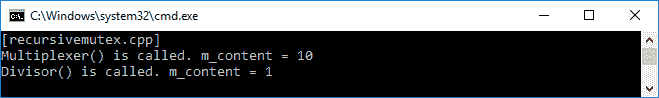

现在，我们知道如果我们想要调用递归锁定相同的`mutex`的函数，我们需要使用一个递归`mutex`。

# 了解 Windows 操作系统中的线程处理

让我们转向一个被许多用户计算机广泛使用的特定操作系统，那就是 Windows。我们的代码必须在来自领先操作系统供应商的商业平台上运行，比如微软。因此，我们现在将在 Windows 操作系统中运行线程。在这个操作系统中，线程是一个内核资源，这意味着它是由操作系统内核创建和拥有的对象，并且存在于内核中。内核本身是一个核心程序，对系统中的一切都有完全控制。在本节中，我们将在 Windows 操作系统中开发一个线程，以便我们的程序可以在这个操作系统中正常工作。

# 使用句柄处理

在 Windows 操作系统中，句柄是对资源的抽象引用值。在本讨论中，我们将使用抽象引用来持有线程。假设我们有一个`threadProc()`函数，将在`hnd`变量中持有的线程中调用。代码如下：

```cpp
    /* threadhandle.cpp */
    #include <iostream>
    #include <windows.h>

    using namespace std;

    auto threadProc(void*) -> unsigned long
    {
      cout << "threadProc() is run." << endl;
      return 100;
    }

    auto main() -> int
    {
      cout << "[threadhandle.cpp]" << endl;

      auto hnd = HANDLE
      {
        CreateThread(
            nullptr,
            0,
            threadProc,
            nullptr,
            0,
            nullptr)
      };

      if (hnd)
      {
        WaitForSingleObject(hnd, INFINITE);

        unsigned long exitCode;
        GetExitCodeThread(hnd, &exitCode);

        cout << "The result = " << exitCode << endl;

        CloseHandle(hnd);
      }

      return 0;
    }

```

如前所述，我们使用`windows.h`头文件提供的`CreateThread()`函数生成线程。目前，我们只传递`nullptr`值作为默认参数，除了`threadProc`作为我们将从线程中调用的函数。

在我们初始化线程的句柄之后，我们可以确保`hnd`变量包含线程的句柄，然后调用`WaitForSingleObject()`函数。这类似于我们在前面一节中使用的`join()`方法，它将运行线程并等待直到线程完成。由于线程句柄是我们使用的资源，请不要忘记使用`CloseHandle()`函数释放它。如果我们运行上述代码，我们将在控制台屏幕上看到以下输出：

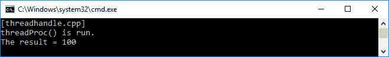

正如我们所看到的，我们成功地运行了线程，因为我们从`threadProc()`函数中得到了预期的进程。

# 重构为唯一句柄

现在，为了简化我们的编程过程，我们将创建一个名为`NullHandle`的类，它将在我们不再需要它时自动释放资源。它将从我们也将开发的`UniqueHandle`类构造而来。这些类可以在`uniquehandle.h`文件中找到。`UniqueHandle`的实现如下：

```cpp
    template <typename C>
    class UniqueHandle
    {
      private:
        HANDLE m_val;

        void Close()
        {
          if (*this)
          {
            C::Exit(m_val);
          }
        }

      public:
        // Copy assignment operator 
        UniqueHandle(UniqueHandle const &) = delete;
        auto operator=(UniqueHandle const &)->UniqueHandle & = delete;

        // UniqueHandle constructor
        explicit UniqueHandle(HANDLE value = C::Invalid()) :
        m_val{ value }
        {
        }

        // Move assignment operator
        UniqueHandle(UniqueHandle && other) :
        m_val{ other.Release() }
        {
        }

        // Move assignment operator
        auto operator=(UniqueHandle && other) -> UniqueHandle &
        {
          if (this != &other)
          {
            Reset(other.Release());
          }

          return *this;
        }

        // Destructor of UniqueHandle class
        ~UniqueHandle()
        {
          Close();
        }

        // bool operator for equality
        explicit operator bool() const 
        {
          return m_val != C::Invalid();
        }

        // Method for retrieving the HANDLE value
        HANDLE Get() const
        {
          return m_val;
        }

       // Method for releasing the HANDLE value
       HANDLE Release()
       {
         auto value = m_val;
         m_val = C::Invalid();
         return value;
       }

       // Method for reseting the HANDLE
       bool Reset(HANDLE value = C::Invalid())
       {
        if (m_val != value)
        {
           Close();
           m_val = value;
        }

         return static_cast<bool>(*this);
       }
    };

```

如我们所见，我们有一个完整的`UniqueHandle`类实现，可以被实例化，并且将在其析构函数中自动关闭句柄。要使用`NullHandle`对象，我们将使用以下代码：

```cpp
    using NullHandle = UniqueHandle<NullHandleCharacteristics>;

```

`NullHandleCharacteristics`结构的实现如下：

```cpp
    struct NullHandleCharacteristics
    {
      // Returning nullptr when the HANDLE is invalid
      static HANDLE Invalid()
      {
         return nullptr;
      }

      // Exit the HANDLE by closing it
      static void Exit(HANDLE val)
      {
         CloseHandle(val);
      }
    };

```

现在，让我们重构之前的`threadhandle.cpp`代码。我们将用`NullHandle`替换`HANDLE`，代码如下：

```cpp
    auto hnd = NullHandle
    {
      CreateThread(
        nullptr,
        0,
        threadProc,
        nullptr,
        0,
        nullptr)
    };

```

然后，我们将创建一个名为`WaitOneThread()`的新函数来调用线程本身，并等待直到它完成。实现应该如下：

```cpp
    auto WaitOneThread(
      HANDLE const h,
      DWORD const ms = INFINITE) -> bool
      {
        auto const r = WaitForSingleObject(
        h,
        ms);

        // Inform that thread is not idle
        if (r == WAIT_OBJECT_0)
          return true;

        // Inform that thread is not idle
        if (r == WAIT_TIMEOUT)
          return false;

        throw WinException();
      }

```

通过使用`WaitOneThread()`函数，我们可以知道线程是否已经运行。`WinException`结构可以实现如下：

```cpp
    struct WinException
    {
      unsigned long error;

      explicit WinException(
        unsigned long value = GetLastError()) :
        error{ value }
       {
       }
    };

```

现在，在我们初始化`hnd` HANDLE 之后，我们可以添加以下代码片段到`main()`函数中：

```cpp
    if (hnd)
    {
      if (WaitOneThread(hnd.Get(), 0))
        cout << "Before running thread" << endl;

      WaitOneThread(hnd.Get());

      if (WaitOneThread(hnd.Get(), 0))
        cout << "After running thread" << endl;

      unsigned long exitCode;
      GetExitCodeThread(hnd.Get(), &exitCode);

      cout << "The result = " << exitCode << endl;
    }

```

从上述代码中可以看出，我们调用`WaitOneThread()`函数，并将`0`作为`ms`参数传递给`WaitForSingleObject()`函数调用，以了解其状态。我们可以将`INFINITE`值传递给它，以调用线程并等待直到它完成。以下是从`threadhandle.cpp`代码重构而来并使用了`UniqueHandle`类的`threaduniquehandle.cpp`代码：

```cpp
    /* threaduniquehandle.cpp */
    #include <iostream>
    #include <windows.h>
    #include "../uniquehandle_h/uniquehandle.h"

    using namespace std;

    unsigned long threadProc(void*)
    {
      cout << "threadProc() is run." << endl;
      return 100;
    }

    struct WinException
    {
      unsigned long error;
      explicit WinException(
        unsigned long value = GetLastError()) :
        error{ value }
        {
        }
    };

    auto WaitOneThread(
      HANDLE const h,
      DWORD const ms = INFINITE) -> bool
      {
        auto const r = WaitForSingleObject(
        h,
        ms);

       // Inform that thread is not idle
       if (r == WAIT_OBJECT_0)
         return true;

       // Inform that thread is not idle
       if (r == WAIT_TIMEOUT)
         return false;

       throw WinException();
      }

    auto main() -> int
    {
      cout << "[threaduniquehandle.cpp]" << endl;

      auto hnd = NullHandle
      {
        CreateThread(
            nullptr,
            0,
            threadProc,
            nullptr,
            0,
            nullptr)
      };

      if (hnd)
      {
        if (WaitOneThread(hnd.Get(), 0))
          cout << "Before running thread" << endl;

        WaitOneThread(hnd.Get());

        if (WaitOneThread(hnd.Get(), 0))
          cout << "After running thread" << endl;

        unsigned long exitCode;
        GetExitCodeThread(hnd.Get(), &exitCode);

        cout << "The result = " << exitCode << endl;
      }

     return 0;
    }

```

以下截图是我们应该在控制台屏幕上看到的输出：

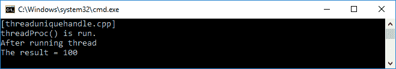

从上述截图中可以看出，我们没有`Before running thread`行。这是因为每次未调用线程时，我们将得到`WAIT_TIMEOUT`输出。而且，我们成功执行了`threadProc()`函数中的代码。

# 触发事件

在 Windows 中玩耍线程之后，让我们尝试另一种并发类型--`Event`。它是系统可以触发的动作。要进一步了解它，让我们看一下以下代码片段，其中我们创建了一个名为`Event`的新类，它实现了`UniqueHandle`：

```cpp
    class Event
    {
      private:
        NullHandle hnd;

      public:
        Event(Event const &) = delete;
        auto operator=(Event const &)->Event & = delete;
        ~Event() = default;

        explicit Event(bool manual) :
         hnd
         {
           CreateEvent(nullptr,
            manual, false, nullptr)
         }
         {
           if (!hnd)
            throw WinException();
         }

        explicit Event(EventType evType) :
         hnd
         {
           CreateEvent(
            nullptr,
            static_cast<BOOL>(evType),
            false,
            nullptr)
         }
         {
           if (!hnd)
            throw WinException();
         }

         Event(Event && other) throw() :
           hnd
           {
             other.hnd.Release()
           }
           {
           }

         auto operator=(Event && other) throw()->Event &
         {
           hnd = move(other.hnd);
         }

         void Set()
         {
           cout << "The event is set" << endl;
           SetEvent(hnd.Get());
         }

         void Clear()
         {
           cout << "The event is cleared" << endl;
           ResetEvent(hnd.Get());
         }

         auto Wait(
           DWORD const ms = INFINITE) -> bool
           {
             auto const result = WaitForSingleObject(
             hnd.Get(), ms);

            return result == WAIT_OBJECT_0;
           }
     };

```

如我们在上述`Event`类实现中所看到的，我们有`Set()`、`Clear()`和`Wait()`方法来分别设置事件、清除事件和等待事件完成。我们有两种事件类型，即自动重置和手动重置，声明如下：

```cpp
    enum class EventType
    {
      AutoReset,
      ManualReset
    };

```

现在，我们将在`main()`函数中创建内容。我们首先实例化`Event`类，然后检查事件信号。如果没有被标记，我们将设置事件。相反，我们将清除事件。代码将是下面的`event.cpp`代码：

```cpp
    /* event.cpp */
    #include <iostream>
    #include <windows.h>
    #include "../uniquehandle_h/uniquehandle.h"

    using namespace std;

    struct WinException
    {
      unsigned long error;

      explicit WinException(
        unsigned long value = GetLastError()) :
        error{ value }
        {
        }
    };

    enum class EventType
    {
      AutoReset,
      ManualReset
    };

    class Event
    {
      private:
        NullHandle hnd;

      public:
        Event(Event const &) = delete;
        auto operator=(Event const &)->Event & = delete;
        ~Event() = default;

        explicit Event(bool manual) :
         hnd
         {
           CreateEvent(nullptr,
           manual, false, nullptr)
         }
         {
           if (!hnd)
            throw WinException();
         }

         explicit Event(EventType evType) :
          hnd
          {
            CreateEvent(
            nullptr,
            static_cast<BOOL>(evType),
            false,
            nullptr)
          }
          {
            if (!hnd)
             throw WinException();
          }

          Event(Event && other) throw() :
            hnd
            {
              other.hnd.Release()
            }
            {
            }

          auto operator=(Event && other) throw() -> Event &
          {
              hnd = move(other.hnd);
          }

          void Set()
          {
              cout << "The event is set" << endl;
              SetEvent(hnd.Get());
          }

          void Clear()
          {
               cout << "The event is cleared" << endl;
               ResetEvent(hnd.Get());
          }

          auto Wait(
            DWORD const ms = INFINITE) -> bool
              {
                auto const result = WaitForSingleObject(
                  hnd.Get(), ms);

                return result == WAIT_OBJECT_0;
             }
          };

          void CheckEventSignaling( bool b)
          {
            if (b)
            {
              cout << "The event is signaled" << endl;
            }
            else
            {
             cout << "The event is not signaled" << endl;
            }
         }

         auto main() -> int
         {
           cout << "[event.cpp]" << endl;

           auto ev = Event{
             EventType::ManualReset };

             CheckEventSignaling(ev.Wait(0));

             ev.Set();

             CheckEventSignaling(ev.Wait(0));

             ev.Clear();

             CheckEventSignaling(ev.Wait(0));

             return 0;
          }

```

正如我们在前面的代码中所看到的，这是代码的作用：

1.  它在`main()`函数中创建了`Event`类的实例，并手动重置了事件。

1.  它调用`CheckEventSignaling()`函数，通过将`Wait()`函数传递给`CheckEventSignaling()`函数来找出事件的状态，然后调用`WaitForSingleObject()`函数。

1.  它调用了`Set()`和`Reset()`函数。

1.  现在运行前面的`event.cpp`代码。您将在控制台上看到以下输出：

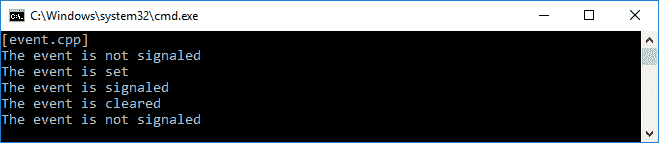

如果我们看一下前面的截图，首先`Event`类的初始化没有被标记。然后我们设置了事件，现在它被标记为`CheckEventSignaling()`方法的状态。在这里，我们可以通过调用`WaitForSingleObject()`函数来检查标记事件的状态。

# 从线程调用事件

现在，让我们使用线程调用`Event`类。但在此之前，我们必须能够包装多个线程，一起调用它们，并等待它们的进程完成。以下代码块是将打包线程的`Wrap()`函数：

```cpp
    void Wrap(HANDLE *)
    {
    }

    template <typename T, typename... Args>
    void Wrap(
      HANDLE * left,
      T const & right,
      Args const & ... args)
      {
        *left = right.Get();
        Wrap(++left, args...);
      }

```

当我们加入所有线程时，我们将调用前面的`Wrap()`函数。因此，我们将需要另一个名为`WaitAllThreads()`的函数，正如我们在下面的代码片段中所看到的：

```cpp
    template <typename... Args>
    void WaitAllThreads(Args const & ... args)
    {
      HANDLE handles[sizeof...(Args)];

      Wrap(handles, args...);

      WaitForMultipleObjects(
        sizeof...(Args),
        handles,
        true,
        INFINITE);
    }

```

现在，我们可以创建我们的完整代码，将使用以下`eventthread.cpp`代码运行两个线程：

```cpp
    /* eventthread.cpp */
    #include <iostream>
    #include <windows.h>
    #include "../uniquehandle_h/uniquehandle.h"

    using namespace std;

    void Wrap(HANDLE *)
    {
    }

    template <typename T, typename... Args>
    void Wrap(
      HANDLE * left,
      T const & right,
      Args const & ... args)
      {
        *left = right.Get();
        Wrap(++left, args...);
      }

    template <typename... Args>
    void WaitAllThreads(Args const & ... args)
    {
      HANDLE handles[sizeof...(Args)];

      Wrap(handles, args...);

      WaitForMultipleObjects(
        sizeof...(Args),
        handles,
        true,
        INFINITE);
    }

    auto threadProc(void*) -> unsigned long
    {
      cout << "Thread ID: ";
      cout << GetCurrentThreadId() << endl;
      return 120;
    }

    auto main() -> int
    {
      cout << "[eventthread.cpp]" << endl;

      auto thread1 = NullHandle
      {
        CreateThread(
          nullptr,
          0,
          threadProc,
          nullptr,
          CREATE_SUSPENDED,
          nullptr)
      };

      auto thread2 = NullHandle
      {
        CreateThread(
          nullptr,
          0,
          threadProc,
          nullptr,
          CREATE_SUSPENDED,
          nullptr)
     };

 ResumeThread(thread1.Get());
 ResumeThread(thread2.Get());

     WaitAllThreads(thread1, thread2);

     return 0;
    }

```

此外，如果我们运行前面的`eventthread.cpp`代码，我们将在控制台屏幕上看到以下输出：

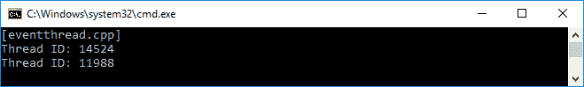

我们已成功触发了一个`Event`，因此它可以被设置为标记，并且可以在`event.cpp`代码中被清除为未标记。我们还成功地包装了多个线程，然后在`eventthread.cpp`代码中一起调用它们。现在，让我们将这两个代码连接起来，这样我们就可以从线程中访问事件。代码应该像下面的`eventthread2.cpp`代码一样：

```cpp
    /* eventthread2.cpp */
    #include <iostream>
    #include <windows.h>
    #include "../uniquehandle_h/uniquehandle.h"

    using namespace std;

    struct WinException
    {
      unsigned long error;

      explicit WinException(
        unsigned long value = GetLastError()) :
        error{ value }
        {
        }
    };

    enum class EventType
    {
      AutoReset,
      ManualReset
     };

    class Event
    {
      private:
        NullHandle hnd;

      public:
        Event(Event const &) = delete;
        auto operator=(Event const &)->Event & = delete;
        ~Event() = default;

        explicit Event(bool manual) :
          hnd
          {
            CreateEvent(nullptr,
            manual, false, nullptr)
          }
          {
            if (!hnd)
             throw WinException();
          }

        explicit Event(EventType evType) :
          hnd
          {
            CreateEvent(
              nullptr,
              static_cast<BOOL>(evType),
              false,
              nullptr)
           }
           {
             if (!hnd)
              throw WinException();
           }

        Event(Event && other) throw() :
          hnd
          {
            other.hnd.Release()
          }
          {
          }

        auto operator=(Event && other) throw() -> Event &
        {
          hnd = move(other.hnd);
        }

        void Set()
        {
          cout << "The event is set" << endl;
          SetEvent(hnd.Get());
        }

        void Clear()
        {
          cout << "The event is cleared" << endl;
          ResetEvent(hnd.Get());
        }

        auto Wait( DWORD const ms = INFINITE) -> bool
        {
           auto const result = WaitForSingleObject(
            hnd.Get(), ms);

           return result == WAIT_OBJECT_0;
        }
     };

        void Wrap(HANDLE *)
        {
        }

        template <typename T, typename... Args>
        void Wrap(
        HANDLE * left,
        T const & right,
        Args const & ... args)
        {
          *left = right.Get();
           Wrap(++left, args...);
        }

        template <typename... Args>
        void WaitAllThreads(Args const & ... args)
        {
        HANDLE handles[sizeof...(Args)];

        Wrap(handles, args...);

        WaitForMultipleObjects(
          sizeof...(Args),
          handles,
          true,
          INFINITE);
        }

        static auto ev = Event{
        EventType::ManualReset };

        auto threadProc(void*) -> unsigned long
        {
          cout << "Thread ID: ";
          cout << GetCurrentThreadId() << endl;

          ev.Wait();

          cout << "Run Thread ID: ";
          cout << GetCurrentThreadId() << endl;

          return 120;
        }

        auto main() -> int
        {
          cout << "[eventthread2.cpp]" << endl;

          auto thread1 = NullHandle
          {
            CreateThread(
              nullptr,
              0,
              threadProc,
              nullptr,
              0,
              nullptr)
          };

          auto thread2 = NullHandle
          {
            CreateThread(
              nullptr,
              0,
              threadProc,
              nullptr,
              0,
              nullptr)
         };

 Sleep(100);
 ev.Set();
 Sleep(100);

         WaitAllThreads(thread1, thread2);

         return 0;
    }

```

在前面的`eventthread2.cpp`代码中，我们尝试使用线程触发事件。首先我们初始化了两个`NullHandle`对象线程。然后，我们设置了事件，并调用`Sleep()`函数使事件激活。然后`WaitAllThreads()`函数调用`threadProc()`函数并运行每个线程。这将通过调用`ev.Wait()`函数来触发事件。然后线程将运行。以下截图是我们将在控制台屏幕上看到的输出：

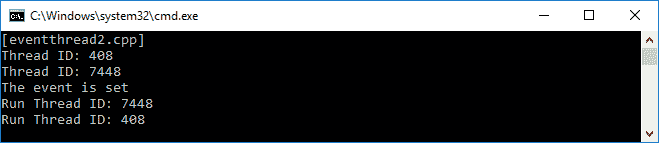

前面的代码是我们手动设置为重置事件的事件。这意味着我们必须说明何时清除事件。现在，我们将`AutoReset`传递给事件实例。我们还将稍微修改`threadProc()`函数。我们正在谈论的是以下`eventthread3.cpp`代码：

```cpp
    /* eventthread3.cpp */
    #include <iostream>
    #include <windows.h>
    #include "../uniquehandle_h/uniquehandle.h"

    using namespace std;

    struct WinException
    {
      unsigned long error;

      explicit WinException(
        unsigned long value = GetLastError()) :
        error{ value }
        {
        }
    };

    enum class EventType
    {
      AutoReset,
      ManualReset
    };

    class Event
    {
       private:
         NullHandle hnd;

       public:
         Event(Event const &) = delete;
         auto operator=(Event const &)->Event & = delete;
         ~Event() = default;

         explicit Event(bool manual) :
           hnd
           {
             CreateEvent(nullptr,
             manual, false, nullptr)
           }
           {
             if (!hnd)
              throw WinException();
           }

          explicit Event(EventType evType) :
             hnd
             {
               CreateEvent(
                 nullptr,
                 static_cast<BOOL>(evType),
                 false,
                 nullptr)
             }
             {
               if (!hnd)
                throw WinException();
             }

         Event(Event && other) throw() :
           hnd
           {
             other.hnd.Release()
           }
           {
           }

         auto operator=(Event && other) throw() -> Event &
           {
              hnd = move(other.hnd);
           }

          void Set()
          {
             cout << "The event is set" << endl;
             SetEvent(hnd.Get());
          }

          void Clear()
          {
              cout << "The event is cleared" << endl;
              ResetEvent(hnd.Get());
          }

          auto Wait(
            DWORD const ms = INFINITE) -> bool
            {
              auto const result = WaitForSingleObject(
                hnd.Get(), ms);

             return result == WAIT_OBJECT_0;
            }
       };

         void Wrap(HANDLE *)
         {
         }

         template <typename T, typename... Args>
         void Wrap(
           HANDLE * left,
           T const & right,
           Args const & ... args)
           {
             *left = right.Get();
             Wrap(++left, args...);
           }

           template <typename... Args>
           void WaitAllThreads(Args const & ... args)
           {
              HANDLE handles[sizeof...(Args)];

              Wrap(handles, args...);

              WaitForMultipleObjects(
                sizeof...(Args),
                handles,
                true,
                INFINITE);
           }

 static auto ev = Event{
 EventType::AutoReset };

           auto threadProc(void*) -> unsigned long
           {
             cout << "Thread ID: ";
             cout << GetCurrentThreadId() << endl;

             ev.Wait();

             cout << "Run Thread ID: ";
             cout << GetCurrentThreadId() << endl;

             Sleep(1000);
 ev.Set();

             return 120;
           }

           auto main() -> int
           {
             cout << "[eventthread3.cpp]" << endl;

             auto thread1 = NullHandle
             {
               CreateThread(
                 nullptr,
                 0,
                 threadProc,
                 nullptr,
                 0,
                 nullptr)
             };

             auto thread2 = NullHandle
             {
                CreateThread(
                  nullptr,
                  0,
                  threadProc,
                  nullptr,
                  0,
                  nullptr)
             };

             Sleep(100);
             ev.Set();
             Sleep(100);

             WaitAllThreads(thread1, thread2);

             return 0;
       }

```

正如我们在前面的代码中所看到的，我们将事件的`Set()`方法从`main()`函数移动到`threadProc()`函数中。现在，每次调用`threadProc()`函数时，事件都会自动设置。以下截图是我们应该在控制台屏幕上看到的输出：

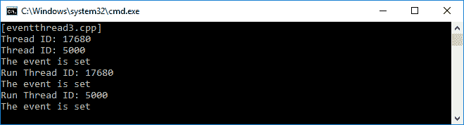

# 总结

在本章中，我们学习了 C++并发的概念。我们现在可以处理单个线程以及多线程。我们还可以同步多线程，使其可以平稳运行；因此，我们可以避免同步问题和死锁。最后，我们可以使用 Windows 中的句柄资源来创建线程，并使用该事件触发事件。

在下一章中，我们将运用前几章学到的知识以函数式的方式来制作一个应用程序。它还将解释如何测试使用 C++语言构建的应用程序。
