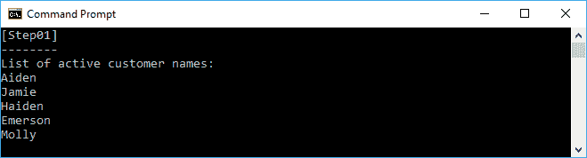
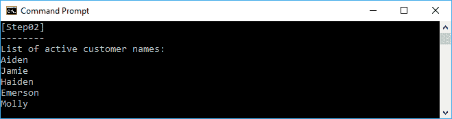
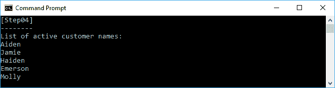
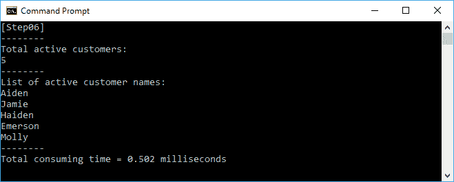
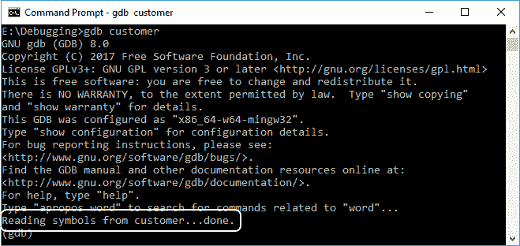
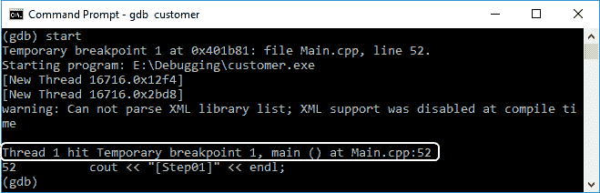
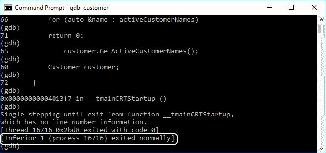
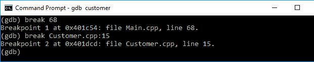
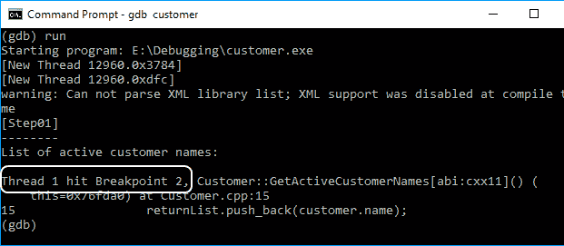
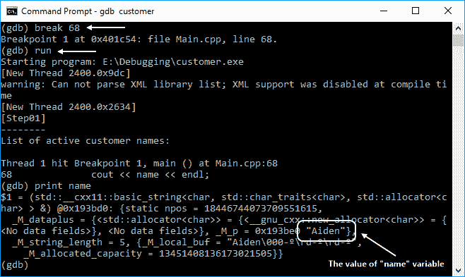

# 第八章：在函数式方法中创建和调试应用程序

我们在前几章讨论了一些基本的技术，以函数式编程的方式开发，包括一等函数、纯函数和不可变对象。在本章中，我们将使用我们在前几章中学到的所有技术，以函数式的方式产生一个应用程序。它还将解释如何调试使用 C++语言构建的应用程序。

在本章中，我们将涵盖以下主题：

+   准备一个命令式代码作为基本代码，以便转换为函数式代码

+   实现纯函数到基本代码

+   实现模板元编程到基本代码

+   使用 Lambda 表达式实现基本代码的过滤技术

+   实现递归技术到基本代码

+   实现备忘录技术到基本代码

+   调试代码以解决，如果我们得到了意外的结果

# 准备一个命令式类

我们现在将开发功能类，这样我们就可以将其用于我们的功能程序。在那之前，让我们准备一个名为`Customer`的新的命令式类。该类将有一个名为`id`的`int`属性，作为唯一的客户 ID 号。它还有四个字符串属性，用于存储关于我们客户的信息--`name`、`address`、`phoneNumber`和`email`。该类还有一个标志--`isActive`--用于指示我们的客户是否活跃。如果客户与我们签订了合同，他们被视为活跃客户。另一个属性是`registeredCustomers`，用于保存我们所有已注册的客户，无论是否活跃。我们将使`registeredCustomers`成员变为`static`，这样我们就可以从类外部填充它，并且可以保持`Customer`类的列表。

除了这些属性，我们的类还将有四个方法来访问我们属性的列表。它们将是以下方法：

+   `GetActiveCustomerNames()`: 这可以用来获取活跃客户的名称列表

+   `GetActiveCustomerAddresses()`: 这可以用来获取活跃客户的地址列表

+   `GetActiveCustomerPhoneNumbers()`: 这可以用来获取活跃客户的电话号码列表

+   `GetActiveCustomerEmails()`: 这可以用来获取活跃客户的电子邮件列表

现在，让我们看一下我们可以在`Step01`文件夹中找到的以下`Customer.h`代码，以适应我们之前的情景：

```cpp
    /* Customer.h - Step01 */
    #ifndef __CUSTOMER_H__
    #define __CUSTOMER_H__

    #include <string>
    #include <vector>

    class Customer
    {
      public:
        static std::vector<Customer> registeredCustomers;
        int id = 0;
        std::string name;
        std::string address;
        std::string phoneNumber;
        std::string email;
        bool isActive = true;

        std::vector<std::string> GetActiveCustomerNames();
        std::vector<std::string> GetActiveCustomerAddresses();
        std::vector<std::string> GetActiveCustomerPhoneNumbers();
        std::vector<std::string> GetActiveCustomerEmails();
    };
    #endif // __CUSTOMER_H__

```

从前面的代码中，我们有四个尚未定义的公共方法。现在，让我们定义它们，就像我们在以下`Customer.cpp`代码中所看到的那样：

```cpp
    /* Customer.cpp - Step01 */
    #include "Customer.h"

    using namespace std;

    vector<Customer> Customer::registeredCustomers;

    vector<string> Customer::GetActiveCustomerNames()
    {
      vector<string> returnList;
      for (auto &customer : Customer::registeredCustomers)
      {
        if (customer.isActive)
        {
            returnList.push_back(customer.name);
        }
      }
       return returnList;
    }

    vector<string> Customer::GetActiveCustomerAddresses()
    {
      vector<string> returnList;
      for (auto &customer : Customer::registeredCustomers)
      {
        if (customer.isActive)
        {
            returnList.push_back(customer.address);
        }
      }
      return returnList;
    }

    vector<string> Customer::GetActiveCustomerPhoneNumbers()
    {
      vector<string> returnList;
      for (auto &customer : Customer::registeredCustomers)
      {
        if (customer.isActive)
        {
            returnList.push_back(customer.phoneNumber);
        }
      }
      return returnList;
    }

    vector<string> Customer::GetActiveCustomerEmails()
    {
      vector<string> returnList;
      for (auto &customer : Customer::registeredCustomers)
      {
        if (customer.isActive)
        {
            returnList.push_back(customer.email);
        }
      }
      return returnList;
    } 

```

从前面的代码中，我们可以看到`Customer`类中我们有四个方法的定义。例如，在`GetActiveCustomerNames()`方法中，代码循环遍历`registeredCustomers`向量中的每个元素，以找出活跃客户。如果找到了，代码将提取每个客户的名称并将其存储到`returnList`向量中。方法完成后，方法将把`returnList`的结果提供给方法用户。

现在，让我们使用以下`main.cpp`代码来使用前面的类：

```cpp
    /* Main.cpp - Step01 */
    #include <iostream>
    #include <algorithm>
    #include "Customer.h"

    using namespace std;

    void RegisterCustomers()
    {
      int i = 0;
      bool b = false;

      // Initialize name
      vector<string> nameList =
      {
        "William",
        "Aiden",
        "Rowan",
        "Jamie",
        "Quinn",
        "Haiden",
        "Logan",
        "Emerson",
        "Sherlyn",
        "Molly"
       };

       // Clear the registeredCustomers vector array
       Customer::registeredCustomers.clear();

       for (auto name : nameList)
       {
         // Create Customer object
         // and fill all properties
         Customer c;
         c.id = i++;
         c.name = name;
         c.address = "somewhere";
         c.phoneNumber = "0123";
         c.email = name + "@xyz.com";
         c.isActive = b;

         // Flip the b value
         b = !b;

         // Send data to the registeredCustomers
         Customer::registeredCustomers.push_back(c);
      }
    }

    auto main() -> int
    {
      cout << "[Step01]" << endl;
      cout << "--------" << endl;

      // Fill the Customer::registeredCustomers
      // with the content
      RegisterCustomers();

      // Instance Customer object
      Customer customer;

      // Get the active customer names
      cout << "List of active customer names:" << endl;
      vector<string> activeCustomerNames =
        customer.GetActiveCustomerNames();
      for (auto &name : activeCustomerNames)
      {
        cout << name << endl;
      }

      return 0;
    }

```

从前面的代码中，在`main()`方法中，我们可以看到我们首先从`RegisterCustomers()`方法中注册我们的客户。在那里，我们用一堆我们的客户信息填充了`Customer`类的静态公共属性`registeredCustomers`。之后，代码实例化了`Customer`类，并调用了类的名为`GetActiveCustomerNames()`的方法。正如我们所看到的，该方法返回一个包含我们将在`activeCustomerNames`向量中存储的活跃客户名称列表的字符串向量。现在，我们可以迭代向量以提取活跃客户名称的列表。以下是我们应该在控制台中看到的输出：



正如我们在`RegisterCustomer()`方法中所看到的，十个客户中只有五个是活跃的，所以并不是所有的名字都会在前面的输出中列出。我们可以尝试剩下的三种方法来获取关于活跃客户的信息，特别是他们的地址、电话号码和电子邮件地址。本章的目标是利用我们在前几章学到的概念，使用函数式方法来制作一个应用程序。所以，让我们看看我们如何能够实现这一点。

# 重构命令式类为函数式类

实际上，前面的`Customer`类可以很好地工作，我们已经成功地调用了它的方法。然而，这个类仍然可以通过将其转换为一个函数式类来进行调整。正如我们在前面的代码中所看到的，我们可以实现一个纯函数、一等函数、高阶函数和记忆化，使其变得函数式。因此，在本节中，我们将重构`Customer`类，使其成为一个函数式类，并使用我们从前几章学到的知识。在接下来的部分，我们将实现我们在前一章中讨论过的函数式方法，即一等函数。

# 将函数作为参数传递

正如我们在第二章中讨论的*函数式编程中的函数操作*，我们可以重写函数成为一等函数，这意味着我们可以将一个函数传递给另一个函数。我们将简化`Step01`代码中所有四个方法的定义，然后通过将其传递给另一个名为`GetActiveCustomerByFunctionField()`的方法来调用该函数。我们还将创建一个名为`GetActiveCustomerByField()`的新方法来选择我们应该运行的正确方法。`Customer`类的定义现在如下`Customer.h`代码所示：

```cpp
    /* Customer.h - Step02 */
    #ifndef __CUSTOMER_H__
    #define __CUSTOMER_H__

    #include <string>
    #include <vector>
    #include <functional>

    class Customer
    {
      private:
        std::string GetActiveCustomerNames(
          Customer customer) const;
        std::string GetActiveCustomerAddresses(
          Customer customer) const;
        std::string GetActiveCustomerPhoneNumbers(
          Customer customer) const;
        std::string GetActiveCustomerEmails(
          Customer customer) const;

      public:
        static std::vector<Customer> registeredCustomers;
        int id = 0;
        std::string name;
        std::string address;
        std::string phoneNumber;
        std::string email;
        bool isActive = true;

 std::vector<std::string> GetActiveCustomerByField(
 const std::string &field);

 std::vector<std::string> GetActiveCustomerByFunctionField(
 std::function<std::string(const Customer&, Customer)> 
 funcField);
     };
     #endif //#ifndef __CUSTOMER_H__

```

正如我们在前面的头文件中所看到的，除了四个私有方法之外，我们还添加了一个名为`GetActiveCustomerByFunctionField()`的新公共方法，当我们需要一个属性列表时，我们将调用它。现在，让我们定义前面头文件中创建的四个方法。代码应该如下`Customer.cpp`文件所示：

```cpp
    /* Customer.cpp - Step02 */
    #include <stdexcept>
    #include "Customer.h"

    using namespace std;

    vector<Customer> Customer::registeredCustomers;

    string Customer::GetActiveCustomerNames(
      Customer customer) const
      {
        return customer.name;
      }

    string Customer::GetActiveCustomerAddresses(
      Customer customer) const
      {
        return customer.address;
      }

    string Customer::GetActiveCustomerPhoneNumbers(
      Customer customer) const
      {
        return customer.phoneNumber;
      }

    string Customer::GetActiveCustomerEmails(
      Customer customer) const
      {
 return customer.email;
      }

 vector<string> Customer::GetActiveCustomerByFunctionField(
 function<string(const Customer&, Customer)> funcField)
 {
 vector<string> returnList;

 Customer c;

 for (auto customer : Customer::registeredCustomers)
 {
 if (customer.isActive)
 {
 returnList.push_back(
 funcField(c, customer));
 }
 }
 return returnList;
 }

 vector<string> Customer::GetActiveCustomerByField(
 const string &field)
 {
 function<string(const Customer&, Customer)> funct;

 if (field == "name")
 {
 funct = &Customer::GetActiveCustomerNames;
 }
 else if (field == "address")
 {
 funct = &Customer::GetActiveCustomerAddresses;
 }
 else if (field == "phoneNumber")
 {
 funct = &Customer::GetActiveCustomerPhoneNumbers;
 }
 else if (field == "email")
 {
 funct = &Customer::GetActiveCustomerEmails;
 }
 else
 {
 throw invalid_argument("Unknown field");
 }

 return GetActiveCustomerByFunctionField(funct);
 }

```

与`Step01`代码相比，`GetActiveCustomerNames()`、`GetActiveCustomerAddresses()`、`GetActiveCustomerPhoneNumbers()`和`GetActiveCustomerEmails()`方法的实现现在更加简洁。它们只包含一行代码。然而，我们需要一个新的方法来容纳获取类的私有属性列表的过程，即`GetActiveCustomerByField()`方法。该方法被传递给函数，使其成为一等函数，正如我们在前面的代码中所看到的。在这个`Step02`文件夹中，`main.cpp`代码应该如下所示：

```cpp
    /* Main.cpp - Step02 */
    #include <iostream>
    #include "Customer.h"

    using namespace std;

    void RegisterCustomers()
    {
      int i = 0;
      bool b = false;

      // Initialize name
      vector<string> nameList =
      {
        "William",
        "Aiden",
        "Rowan",
        "Jamie",
        "Quinn",
        "Haiden",
        "Logan",
        "Emerson",
        "Sherlyn",
        "Molly"
       };

      // Clear the registeredCustomers vector array
      Customer::registeredCustomers.clear();
      for (auto name : nameList)
      {
        // Create Customer object
        // and fill all properties
        Customer c;
        c.id = i++;
        c.name = name;
        c.address = "somewhere";
        c.phoneNumber = "0123";
        c.email = name + "@xyz.com";
        c.isActive = b;

        // Flip the b value
        b = !b;

        // Send data to the registeredCustomers
        Customer::registeredCustomers.push_back(c);
       }
    }

    auto main() -> int
    {
      cout << "[Step02]" << endl;
      cout << "--------" << endl;

      // Fill the Customer::registeredCustomers
      // with the content
      RegisterCustomers();

      // Instance Customer object
      Customer customer;

      // Get the active customer names
      cout << "List of active customer names:" << endl;
      vector<string> activeCustomerNames =
 customer.GetActiveCustomerByField("name");
      for (auto &name : activeCustomerNames)
      {
        cout << name << endl;
      }

      return 0;
    }

```

正如我们在前面的`main.cpp`代码中所看到的，我们现在将调用`GetActiveCustomerByField()`方法，而不是像在`Step01`中那样调用`GetActiveCustomerNames()`。我们只需要将一个字符串数据类型的字段名传递给`GetActiveCustomerNames()`方法，它就会调用适当的方法来检索属性值。例如，我们将检索`name`属性值，因为我们在`GetActiveCustomerByField()`方法中传递了`name`。如果我们运行前面的`Step02`代码，我们应该会看到以下的截图，这与我们在`Step01`代码中看到的完全相同：



虽然我们的代码可以正常运行，但如果我们想要向类中添加更多的字段或属性，然后需要收集该新字段的列表，我们将面临一个问题。通过使用前面的代码，我们必须在`GetActiveCustomerByFunctionField()`方法中添加一个新的`else`部分。接下来，我们将找到解决方法来解决这个问题。

# 添加一个基类

如果我们想在类中添加更多字段，并且每次添加新字段时都希望轻松访问它的列表，我们必须创建一个从包含虚函数的基类派生出来的新类。通过这样做，我们可以派生出基类的虚方法，并为其实现正确的代码。在这里，我们还将获得模板元编程的能力，因为我们将设计基类为模板。基类的声明应该如下：

```cpp
    template<typename T, typename U>
    class BaseClass
    {
      public:
        virtual U InvokeFunction(
          const std::shared_ptr<T>&) = 0;
    };

```

现在，我们可以从基类派生出四个新类，用于类中的四种方法。类的声明应该如下：

```cpp
    class CustomerName :
      public BaseClass<Customer, std::string>
      {
        public:
          virtual std::string InvokeFunction(
            const std::shared_ptr<Customer> &customer)
          {
             return customer->name;
          }
      };

    class CustomerAddress :
      public BaseClass<Customer, std::string>
      {
        public:
          virtual std::string InvokeFunction(
            const std::shared_ptr<Customer> &customer)
            {
              return customer->address;
            }
      };

    class CustomerPhoneNumber :
      public BaseClass<Customer, std::string>
      {
         public:
           virtual std::string InvokeFunction(
             const std::shared_ptr<Customer> &customer)
             {
               return customer->phoneNumber;
             }
      };

    class CustomerEmail :
      public BaseClass<Customer, std::string>
      {
        public:
          virtual std::string InvokeFunction(
            const std::shared_ptr<Customer> &customer)
            {
              return customer->email;
            }
    };

```

此外，`GetActiveCustomerByFunctionField()`方法的参数类型也需要修改，因此方法的签名应该如下：

```cpp
    template<typename T>
    static std::vector<T> GetActiveCustomerByFunctionField(
      const std::shared_ptr<BaseClass<Customer, T>>
        &classField);

```

此外，实现了前述代码的`Step03`代码的完整头文件应该如下：

```cpp
    /* Customer.h - Step03 */
    #ifndef __CUSTOMER_H__
    #define __CUSTOMER_H__

    #include <string>
    #include <vector>
    #include <memory>

    class Customer
    {
      private:
        template<typename T, typename U>
        class BaseClass
        {
          public:
            virtual U InvokeFunction(
            const std::shared_ptr<T>&) = 0;
         };

        class CustomerName :
          public BaseClass<Customer, std::string>
          {
            public:
              virtual std::string InvokeFunction(
                const std::shared_ptr<Customer> &customer)
                {
                  return customer->name;
                }
          };

        class CustomerAddress :
          public BaseClass<Customer, std::string>
          {
            public:
              virtual std::string InvokeFunction(
                const std::shared_ptr<Customer> &customer)
                {
                  return customer->address;
                }
          };

        class CustomerPhoneNumber :
          public BaseClass<Customer, std::string>
          {
            public:
            virtual std::string InvokeFunction(
              const std::shared_ptr<Customer> &customer)
              {
                return customer->phoneNumber;
               }
          };

        class CustomerEmail :
          public BaseClass<Customer, std::string>
          {
            public:
              virtual std::string InvokeFunction(
                const std::shared_ptr<Customer> &customer)
                {
                  return customer->email;
                }
           };

         public:
           static std::vector<Customer> registeredCustomers;
           int id = 0;
           std::string name;
           std::string address;
           std::string phoneNumber;
           std::string email;
           bool isActive = true;

           static std::vector<std::string> GetActiveCustomerNames();
           static std::vector<std::string> 
             GetActiveCustomerAddresses();
           static std::vector<std::string> 
             GetActiveCustomerPhoneNumbers();
           static std::vector<std::string> GetActiveCustomerEmails();

           template<typename T>
           static std::vector<T> GetActiveCustomerByFunctionField(
             const std::shared_ptr<BaseClass<Customer, T>>
             &classField);
      };
     #endif // __CUSTOMER_H__

```

现在，每个前述类中的方法都有不同的任务，并且可以通过类名进行识别。我们还将修改`GetActiveCustomerByFunctionField()`方法的实现，因为它现在传递了一个新的参数类型，即类名。通过传递一个类，现在更容易传递我们在类方法中的期望任务。`GetActiveCustomerByFunctionField()`方法的实现应该如下：

```cpp
    template<typename T>
    vector<T> Customer::GetActiveCustomerByFunctionField(
      const shared_ptr<BaseClass<Customer, T>> &classField)
      {
        vector<T> returnList;
        for (auto customer : Customer::registeredCustomers)
        {
          if (customer.isActive)
           {
            returnList.push_back(
              classField->InvokeFunction(
                make_shared<Customer>(customer)));
           }
         }
         return returnList;
       }

```

正如我们所看到的，前面的方法可以运行我们传递的类的方法，即`classField`。此外，由于我们的类是从`BaseClass`类派生出来的，我们可以通知方法接收类型为`BaseClass`的参数。

现在我们可以实现在头文件中声明的公共方法--`GetActiveCustomerNames()`、`GetActiveCustomerAddresses()`、`GetActiveCustomerPhoneNumbers()`和`GetActiveCustomerEmails()`方法。这四个方法将调用`GetActiveCustomerByFunctionField()`方法，并传递`InvokeFunction()`方法的定义。代码应该如下：

```cpp
    vector<string> Customer::GetActiveCustomerNames()
    {
      return Customer::GetActiveCustomerByFunctionField<string>(
        make_shared<CustomerName>());
    }

    vector<string> Customer::GetActiveCustomerAddresses()
    {
      return Customer::GetActiveCustomerByFunctionField<string>(
        make_shared<CustomerAddress>());
    }

    vector<string> Customer::GetActiveCustomerPhoneNumbers()
    {
      return Customer::GetActiveCustomerByFunctionField<string>(
        make_shared<CustomerPhoneNumber>());
    }

    vector<string> Customer::GetActiveCustomerEmails()
    {
      return Customer::GetActiveCustomerByFunctionField<string>(
        make_shared<CustomerEmail>());
    }

```

然后，我们将得到一个完整的`Customer.cpp`文件，如下所示：

```cpp
    /* Customer.cpp - Step03 */
    #include "Customer.h"

    using namespace std;

    vector<Customer> Customer::registeredCustomers;

    vector<string> Customer::GetActiveCustomerNames()
    {
      return Customer::GetActiveCustomerByFunctionField<string>(
        make_shared<CustomerName>());
    }

    vector<string> Customer::GetActiveCustomerAddresses()
    {
      return Customer::GetActiveCustomerByFunctionField<string>(
        make_shared<CustomerAddress>());
    }

    vector<string> Customer::GetActiveCustomerPhoneNumbers()
    {
      return Customer::GetActiveCustomerByFunctionField<string>(
        make_shared<CustomerPhoneNumber>());
    }

    vector<string> Customer::GetActiveCustomerEmails()
    {
      return Customer::GetActiveCustomerByFunctionField<string>(
        make_shared<CustomerEmail>());
    }

    template<typename T>
    vector<T> Customer::GetActiveCustomerByFunctionField(
    const shared_ptr<BaseClass<Customer, T>> &classField)
    {
      vector<T> returnList;
      for (auto &customer : Customer::registeredCustomers)
      {
        if (customer.isActive)
        {
          returnList.push_back(
            classField->InvokeFunction(
              make_shared<Customer>(customer)));
         }
       }
       return returnList;
    }

```

通过在`Step03`文件夹中拥有`Customer.h`和`Customer.cpp`代码，我们现在更容易获取`Customer`类中的属性列表。例如，如果我们想要检索活跃客户的列表，我们可以直接调用`GetActiveCustomerNames()`方法，就像我们在下面的`main.cpp`代码中看到的那样：

```cpp
    /* Main.cpp - Step03 */
    #include <iostream>
    #include "Customer.h"

    using namespace std;

    void RegisterCustomers()
    {
      int i = 0;
      bool b = false;

      // Initialize name
      vector<string> nameList =
      {
        "William",
        "Aiden",
        "Rowan",
        "Jamie",
        "Quinn",
        "Haiden",
        "Logan",
        "Emerson",
        "Sherlyn",
        "Molly"
      };

      // Clear the registeredCustomers vector array
      Customer::registeredCustomers.clear();

      for (auto name : nameList)
      {
        // Create Customer object
        // and fill all properties
        Customer c;
        c.id = i++;
        c.name = name;
        c.address = "somewhere";
        c.phoneNumber = "0123";
        c.email = name + "@xyz.com";
        c.isActive = b;

        // Flip the b value
        b = !b;

        // Send data to the registeredCustomers
        Customer::registeredCustomers.push_back(c);
      }
    }

    auto main() -> int
    {
      cout << "[Step03]" << endl;
      cout << "--------" << endl;

      // Fill the Customer::registeredCustomers
      // with the content
      RegisterCustomers();

      // Instance Customer object
      Customer customer;

      // Get the active customer names
      cout << "List of active customer names:" << endl;
 vector<string> activeCustomerNames =
 customer.GetActiveCustomerNames();
      for (auto &name : activeCustomerNames)
      {
        cout << name << endl;
      }

       return 0;
    }

```

现在，让我们在`Step03`文件夹中运行程序。我们应该在控制台上看到以下截图：


再次，我们得到了与上一步相同的输出。我们将在下一节中使`Customer`类变得纯净。所以，继续前进！

# 将类转换为纯净的

正如我们在第二章中讨论的*函数式编程中的函数操作*，我们必须在函数式编程中创建一个纯函数以避免副作用。如果我们回到之前的`GetActiveCustomerByFunctionField()`方法定义，它迭代了一个全局变量`registeredCustomers`。这将是一个问题，因为`GetActiveCustomerByFunctionField()`方法将提供一个不同的输出，尽管传递的参数完全相同。

为了解决这个问题，我们必须废除这个全局变量。然后，我们必须修改方法的定义如下：

```cpp
    template<typename T>
    vector<T> Customer::GetActiveCustomerByFunctionField(
      vector<Customer> customers,
      const shared_ptr<BaseClass<Customer, T>>
        &classField)
        {
          vector<T> returnList;
          for (auto &customer : customers)
          {
            if (customer.isActive)
            {
              returnList.push_back(
                classField->InvokeFunction(
                make_shared<Customer>(customer)));
            }
          }
          return returnList;
        }

```

由于我们不再拥有`registeredCustomers`属性，我们还必须将注册的客户列表传递给`GetActiveCustomerByFunctionField()`方法。然后，该方法将迭代我们传递的客户列表，以找到活跃客户。此外，由于我们修改了方法签名，我们还必须修改`Customer.h`文件中的方法声明，如下所示：

```cpp
    template<typename T>
    static std::vector<T> GetActiveCustomerByFunctionField(
      std::vector<Customer> customers,
      const std::shared_ptr<BaseClass<Customer, T>>
        &classField);

```

我们讨论了`GetActiveCustomerByFunctionField()`方法是由`Customer`类中的其他方法调用的。因此，我们还必须修改方法的实现，就像我们在下面的代码片段中看到的那样：

```cpp
    vector<string> Customer::GetActiveCustomerNames(
      vector<Customer> customers)
      {
        return Customer::GetActiveCustomerByFunctionField<string>(
        customers,
        make_shared<CustomerName>());
      }

    vector<string> Customer::GetActiveCustomerAddresses(
      vector<Customer> customer)
      {
        return Customer::GetActiveCustomerByFunctionField<string>(
        customer,
        make_shared<CustomerAddress>());
      }

    vector<string> Customer::GetActiveCustomerPhoneNumbers(
      vector<Customer> customer)
      {
        return Customer::GetActiveCustomerByFunctionField<string>(
        customer,
        make_shared<CustomerPhoneNumber>());
      }

   vector<string> Customer::GetActiveCustomerEmails(
     vector<Customer> customer)
     {
        return Customer::GetActiveCustomerByFunctionField<string>(
        customer,
        make_shared<CustomerEmail>());
     }

```

我们还需要修改`Customer.h`文件中的方法声明，如下面的代码片段所示：

```cpp
    static std::vector<std::string> GetActiveCustomerNames(
      std::vector<Customer> customer);
    static std::vector<std::string> GetActiveCustomerAddresses(
      std::vector<Customer> customer);
    static std::vector<std::string> GetActiveCustomerPhoneNumbers(
      std::vector<Customer> customer);
    static std::vector<std::string> GetActiveCustomerEmails(
      std::vector<Customer> customer);

```

现在，`Customer.h`文件将包含以下完整的代码块：

```cpp
    /* Customer.h - Step04 */
    #ifndef __CUSTOMER_H__
    #define __CUSTOMER_H__

    #include <string>
    #include <vector>
    #include <memory>

    class Customer
    {
      private:
        template<typename T, typename U>
        class BaseClass
        {
          public:
            virtual U InvokeFunction(
            const std::shared_ptr<T>&) = 0;
        };

        class CustomerName :
          public BaseClass<Customer, std::string>
          {
            public:
              virtual std::string InvokeFunction(
                const std::shared_ptr<Customer> &customer)
                {
                  return customer->name;
                }
          };

       class CustomerAddress :
         public BaseClass<Customer, std::string>
         {
           public:
             virtual std::string InvokeFunction(
               const std::shared_ptr<Customer> &customer)
              {
            return customer->address;
          }
    };

      class CustomerPhoneNumber :
        public BaseClass<Customer, std::string>
        {
          public:
            virtual std::string InvokeFunction(
              const std::shared_ptr<Customer> &customer)
              {
                return customer->phoneNumber;
              }
       };

     class CustomerEmail :
        public BaseClass<Customer, std::string>
        {
          public:
            virtual std::string InvokeFunction(
            const std::shared_ptr<Customer> &customer)
            {
              return customer->email;
            }
        };

      public:
        int id = 0;
        std::string name;
        std::string address;
        std::string phoneNumber;
        std::string email;
        bool isActive = true;

        static std::vector<std::string> GetActiveCustomerNames(
          std::vector<Customer> customer);
       static std::vector<std::string> GetActiveCustomerAddresses(
          std::vector<Customer> customer);
       static std::vector<std::string> GetActiveCustomerPhoneNumbers(
          std::vector<Customer> customer);
       static std::vector<std::string> GetActiveCustomerEmails(
          std::vector<Customer> customer);

       template<typename T>
       static std::vector<T> GetActiveCustomerByFunctionField(
        std::vector<Customer> customers,
        const std::shared_ptr<BaseClass<Customer, T>>
          &classField);
    };
    #endif // __CUSTOMER_H__

```

而且，`Customer.cpp`文件将如下所示：

```cpp
    /* Customer.cpp - Step04 */
    #include "Customer.h"

    using namespace std;

    vector<string> Customer::GetActiveCustomerNames(
      vector<Customer> customers)
      {
        return Customer::GetActiveCustomerByFunctionField<string>(
        customers,
        make_shared<CustomerName>());
      }

    vector<string> Customer::GetActiveCustomerAddresses(
      vector<Customer> customer)
      {
        return Customer::GetActiveCustomerByFunctionField<string>(
          customer,
        make_shared<CustomerAddress>());
       }

    vector<string> Customer::GetActiveCustomerPhoneNumbers(
      vector<Customer> customer)
      {
        return Customer::GetActiveCustomerByFunctionField<string>(
         customer,
        make_shared<CustomerPhoneNumber>());
      }

    vector<string> Customer::GetActiveCustomerEmails(
      vector<Customer> customer)
      {
        return Customer::GetActiveCustomerByFunctionField<string>(
        customer,
        make_shared<CustomerEmail>());
       }

    template<typename T>
    vector<T> Customer::GetActiveCustomerByFunctionField(
      vector<Customer> customers,
      const shared_ptr<BaseClass<Customer, T>>
        &classField)
        {
          vector<T> returnList;
          for (auto &customer : customers)
          {
            if (customer.isActive)
            {
              returnList.push_back(
                classField->InvokeFunction(
                make_shared<Customer>(customer)));
             }
           }
           return returnList;
         }

```

由于`Customer`类已经更改，不再有`registeredCustomer`变量，我们还需要修改`main.cpp`文件中的`RegisterCustomers()`方法。方法的先前版本没有返回值。现在，我们将使代码返回客户列表。我们还需要修改`main()`方法，因为我们必须在`Main.cpp`文件中使用新的`RegisterCustomers()`方法。该文件将包含以下代码块：

```cpp
    /* Main.cpp - Step04 */
    #include <iostream>
    #include "Customer.h"

    using namespace std;

 vector<Customer> RegisterCustomers()
    {
      int i = 0;
      bool b = false;

      vector<Customer> returnValue;

      // Initialize name
      vector<string> nameList =
      {
        "William",
        "Aiden",
        "Rowan",
        "Jamie",
        "Quinn",
        "Haiden",
        "Logan",
        "Emerson",
        "Sherlyn",
        "Molly"
       };

      for (auto name : nameList)
      {
        // Create Customer object
        // and fill all properties
        Customer c;
        c.id = i++;
        c.name = name;
        c.address = "somewhere";
        c.phoneNumber = "0123";
        c.email = name + "@xyz.com";
        c.isActive = b;
        // Flip the b value
        b = !b;
        // Send data to the registeredCustomers
        returnValue.push_back(c);
      }

      return returnValue;
    }

    auto main() -> int
    {
      cout << "[Step04]" << endl;
      cout << "--------" << endl;

      // Instance Customer object
      Customer customer;

      // Get the active customer names
      cout << "List of active customer names:" << endl;
      vector<string> activeCustomerNames =
        customer.GetActiveCustomerNames(
            RegisterCustomers());
      for (auto name : activeCustomerNames)
      {
        cout << name << endl;
       }

       return 0;
    }

```

正如我们在前面的`main()`方法中所看到的，我们调用了`GetActiveCustomerNames()`方法，并传递了`RegisterCustomers()`方法的结果。现在，让我们尝试在`Step06`文件夹中运行程序。当我们运行程序时，控制台应该输出以下内容：



再次，我们得到了与之前步骤中相同的输出，但采用了函数式编程的新方法。接下来，我们将重构代码，使用 Lambda 表达式来简化过滤任务。

# 过滤条件并实现 Lambda 表达式

让我们专注于`GetActiveCustomerByFunctionField()`方法。在那里，我们可以找到一个`if`结构来过滤活跃客户。正如我们在前几章中讨论的，我们可以使用`copy_if()`方法来过滤条件。以下代码片段实现了`copy_if()`方法来过滤活跃客户：

```cpp
    template<typename T>
    vector<T> Customer::GetActiveCustomerByFunctionField(
      vector<Customer> customers,
      const shared_ptr<BaseClass<Customer, T>>
        &classField)
        {
 vector<Customer> activeCustomers;
          vector<T> returnList;

 copy_if(
 customers.begin(),
 customers.end(),
 back_inserter(activeCustomers),
 [](Customer customer)
 {
 if (customer.isActive)
 return true;
 else
 return false;
 });

            for (auto &customer : customers)
             {
                if (customer.isActive)
                {
                  returnList.push_back(
                  classField->InvokeFunction(
                  make_shared<Customer>(customer)));
                 }
             }

          return returnList;
      }

```

正如我们在前面的代码片段中所看到的，我们创建了一个匿名方法，如果我们传递的客户实例是活跃的，则返回 true。此外，我们还可以重构前面的`GetActiveCustomerByFunctionField()`方法，使其再次使用匿名方法，如下面的代码片段所示：

```cpp
    template<typename T>
    vector<T> Customer::GetActiveCustomerByFunctionField(
      vector<Customer> customers,
      const shared_ptr<BaseClass<Customer, T>> 
        &classField)
        {
          vector<Customer> activeCustomers;
          vector<T> returnList;

          copy_if(
            customers.begin(),
            customers.end(),
            back_inserter(activeCustomers),
            [](Customer customer)
            {
              if (customer.isActive)
                return true;
              else
                return false;
             });

 for_each(
 activeCustomers.begin(),
 activeCustomers.end(),
 &returnList, &classField
 {
 returnList.push_back(
 classField->InvokeFunction(
 make_shared<Customer>(customer))
 );
 });

         return returnList;
    }

```

除了使用 Lambda 表达式实现过滤技术之外，我们还将在`Customer`类中添加一个名为`CountActiveCustomers()`的方法。该方法将计算活跃客户的数量。该方法的定义应该如下：

```cpp
    int Customer::CountActiveCustomers(
      vector<Customer> customer)
      {
        int add = 0;

        for (auto cust : customer)
        {
          // Adding 1 if the customer is active
          if(cust.isActive)
            ++add;
        }

        return add;
    }

```

现在，我们将在`Step05`代码块中有`Customer.cpp`代码如下：

```cpp
    /* Customer.cpp - Step05 */
    #include <algorithm>
    #include "Customer.h"

    using namespace std;

    vector<string> Customer::GetActiveCustomerNames(
      vector<Customer> customers)
      {
        return Customer::GetActiveCustomerByFunctionField<string>(
        customers,
        make_shared<CustomerName>());
      }

    vector<string> Customer::GetActiveCustomerAddresses(
      vector<Customer> customer)
      {
        return Customer::GetActiveCustomerByFunctionField<string>(
          customer,
        make_shared<CustomerAddress>());
      }

    vector<string> Customer::GetActiveCustomerPhoneNumbers(
      vector<Customer> customer)
      {
        return Customer::GetActiveCustomerByFunctionField<string>(
          customer,
        make_shared<CustomerPhoneNumber>());
      }

    vector<string> Customer::GetActiveCustomerEmails(
      vector<Customer> customer)
      {
        return Customer::GetActiveCustomerByFunctionField<string>(
        customer,
        make_shared<CustomerEmail>());
      }

 int Customer::CountActiveCustomers(
 vector<Customer> customer)
 {
 int add = 0;

 for (auto cust : customer)
 {
 // Adding 1 if the customer is active
 if(cust.isActive)
 ++add;
 }

 return add;
 }

    template<typename T>
    vector<T> Customer::GetActiveCustomerByFunctionField(
 vector<Customer> customers,
      const shared_ptr<BaseClass<Customer, T>>
        &classField)
        {
 vector<Customer> activeCustomers;
          vector<T> returnList;

 copy_if(
 customers.begin(),
 customers.end(),
 back_inserter(activeCustomers),
 [](Customer customer)
 {
 if (customer.isActive)
 return true;
 else
 return false;
 });

 for_each(
 activeCustomers.begin(),
 activeCustomers.end(),
 &returnList, &classField
 {
 returnList.push_back(
 classField->InvokeFunction(
 make_shared<Customer>(customer))
 );
 });

 return returnList;
     }

```

不要忘记修改`Customer.h`文件，因为我们已经向类中添加了一个新方法。该文件应包含以下代码片段：

```cpp
    /* Customer.h - Step05 */
    #ifndef __CUSTOMER_H__
    #define __CUSTOMER_H__

    #include <string>
    #include <vector>
    #include <memory>

    class Customer
    {
      private:
        template<typename T, typename U>
        class BaseClass
        {
          public:
            virtual U InvokeFunction(
            const std::shared_ptr<T>&) = 0;
        };

        class CustomerName :
          public BaseClass<Customer, std::string>
          {
            public:
              virtual std::string InvokeFunction(
                const std::shared_ptr<Customer> &customer)
                {
                  return customer->name;
                 }
          };

        class CustomerAddress :
          public BaseClass<Customer, std::string>
          {
             public:
               virtual std::string InvokeFunction(
                 const std::shared_ptr<Customer> &customer)
                 {
                   return customer->address;
                 }
          };

        class CustomerPhoneNumber :
          public BaseClass<Customer, std::string>
          {
            public:
              virtual std::string InvokeFunction(
                const std::shared_ptr<Customer> &customer)
                {
                 return customer->phoneNumber;
                }
           };

    class CustomerEmail :
        public BaseClass<Customer, std::string>
    {
    public:
        virtual std::string InvokeFunction(
            const std::shared_ptr<Customer> &customer)
        {
            return customer->email;
        }
    };

    public:
      int id = 0;
      std::string name;
      std::string address;
      std::string phoneNumber;
      std::string email;
      bool isActive = true;

      static std::vector<std::string> GetActiveCustomerNames(
        std::vector<Customer> customer);
      static std::vector<std::string> GetActiveCustomerAddresses(
        std::vector<Customer> customer);
      static std::vector<std::string> GetActiveCustomerPhoneNumbers(
        std::vector<Customer> customer);
      static std::vector<std::string> GetActiveCustomerEmails(
        std::vector<Customer> customer);

 static int CountActiveCustomers(
 std::vector<Customer> customer);

      template<typename T>
      static std::vector<T> GetActiveCustomerByFunctionField(
        std::vector<Customer> customers,
        const std::shared_ptr<BaseClass<Customer, T>>
            &classField);
    };
    #endif // __CUSTOMER_H__

```

现在，我们将在我们的`main()`函数中调用`CountActiveCustomers()`方法。我们将通过检查以下`Main.cpp`代码块来看看我们是如何做到的：

```cpp
    /* Main.cpp - Step05 */
    #include <iostream>
    #include <chrono>
    #include "Customer.h"

    using namespace std;

    vector<Customer> RegisterCustomers()
    {
      int i = 0;
      bool b = false;

      vector<Customer> returnValue;

      // Initialize name
      vector<string> nameList =
      {
        "William",
        "Aiden",
        "Rowan",
        "Jamie",
        "Quinn",
        "Haiden",
        "Logan",
        "Emerson",
        "Sherlyn",
        "Molly"
      };

      for (auto name : nameList)
      {
        // Create Customer object
        // and fill all properties
        Customer c;
        c.id = i++;
        c.name = name;
        c.address = "somewhere";
        c.phoneNumber = "0123";
        c.email = name + "@xyz.com";
        c.isActive = b;

        // Flip the b value
        b = !b;

        // Send data to the registeredCustomers
        returnValue.push_back(c);
      }

     return returnValue;
    }

    auto main() -> int
    {
      cout << "[Step05]" << endl;
      cout << "--------" << endl;

 // Recording start time for the program
 auto start = chrono::high_resolution_clock::now();

      // Instance Customer object
      Customer customer;

 // Counting active customers
 cout << "Total active customers: " << endl;
 cout << customer.CountActiveCustomers(
 RegisterCustomers());
 cout << endl << "--------" << endl;

      // Get the active customer names
      cout << "List of active customer names:" << endl;
      vector<string> activeCustomerNames =
        customer.GetActiveCustomerNames(
            RegisterCustomers());
      for (auto name : activeCustomerNames)
      {
        cout << name << endl;
      }

 // Recording end time for the program
 auto finish = chrono::high_resolution_clock::now();

 // Calculating the elapsed time for the program
 chrono::duration<double, milli> elapsed = finish - start;

 // Displaying elapsed time for the program
 cout << "--------" << endl;
 cout << "Total consuming time = ";
 cout << elapsed.count() << " milliseconds" << endl;

      return 0;
    }

```

正如我们在前面的代码中所看到的，我们调用了`CountActiveCustomers()`方法，并将`RegisterCustomers()`方法的输出作为参数传递。我们还添加了一个简单的秒表来计算程序运行所需的时间。前面代码的输出应该如下：


正如我们所看到的，我们需要`0.997`毫秒来运行这一步的代码。然而，我们可以通过实现递归和记忆化来优化前面的代码，使其运行更快，这将在下一节中讨论。

事实上，我们可以通过运行`activeCustomerNames.size()`方法来找出活跃客户的总数，以获取运行以下代码行后向量中元素的数量：

`vector<string> activeCustomerNames =`

customer.GetActiveCustomerNames(RegisterCustomers())`

然而，前面的代码示例想要向我们展示如何将`for`循环转换为递归，以优化执行速度。我们将在接下来讨论这个问题

部分。

# 在`Customer`类中实现递归和记忆化技术

如果我们看一下`Step05`中`CountActiveCustomers()`方法的定义，我们使用`for`循环来计算活跃客户。然而，我们可以重写该方法以使用递归技术。让我们看一下以下代码，这是`CountActiveCustomers()`方法的新定义：

```cpp
    int Customer::CountActiveCustomers(
      vector<Customer> customer)
      {
        if(customer.empty())
          return 0;
        else
        {
          // Adding 1 if the customer is active
          int add = customer.front().isActive ? 1 : 0;

          // Removing the first element of vector
          // It's similar with removing head
          // and pass the tail
          customer.erase(customer.begin());

          // Running the recursion
          return add + CountActiveCustomers(
            customer);
         }
       }

```

正如我们在上面的代码片段中所看到的，我们使用尾递归来实现`CountActiveCustomers()`方法。我们只需要在`customer`向量中找到一个活跃的客户时每次增加`add`变量。然后，代码会删除`customer`向量的第一个元素，并将其传递给`CountActiveCustomers()`方法。我们递归这个过程，直到`customer`向量的元素为空为止。

此外，我们还使用了我们在第五章中讨论的`Memoization`类，即**使用惰性求值推迟执行过程**，来优化我们的代码。我们将修改`Main.cpp`文件中的`main()`函数，使`main()`函数包含以下代码片段：

```cpp
    auto main() -> int
    {
      cout << "[Step06]" << endl;
      cout << "--------" << endl;

      // Recording start time for the program
      auto start = chrono::high_resolution_clock::now();

      // Instance Customer object
      Customer customer;

      // Counting active customers
      cout << "Total active customers: " << endl;
      cout << customer.CountActiveCustomers(
        RegisterCustomers());
      cout << endl << "--------" << endl;

 // Initializing memoization instance
 Memoization<vector<string>> custMemo(
 [customer]()
 {
 return customer.GetActiveCustomerNames(
 RegisterCustomers());
 });

      // Get the active customer names
      cout << "List of active customer names:" << endl;
 vector<string> activeCustomerNames =
 custMemo.Fetch();
      for (auto name : activeCustomerNames)
      {
        cout << name << endl;
      }

      // Recording end time for the program
      auto finish = chrono::high_resolution_clock::now();

      // Calculating the elapsed time for the program
      chrono::duration<double, milli> elapsed = finish - start;

      // Displaying elapsed time for the program
      cout << "--------" << endl;
      cout << "Total consuming time = ";
      cout << elapsed.count() << " milliseconds" << endl;

      return 0;
    }

```

在上面的代码片段中，我们现在通过调用`Fetch()`方法从`Memoization`实例运行`GetActiveCustomerNames()`方法。如果我们运行`Step06`代码，我们应该在控制台上看到以下输出：



现在，该代码只需要`0.502`毫秒来运行。与`Step05`代码相比，代码执行的速度几乎快了一倍。这证明，通过使用功能性方法，我们不仅可以获得更好的代码结构，还可以进行速度优化。

# 调试代码

有时，在编码过程中，当我们运行代码时，一个或多个变量会出现意外的结果。这可能发生在执行过程中。为了避免陷入这种情况，我们可以通过逐步运行程序来分析我们的程序。我们可以使用 GCC 编译器中包含的调试器工具--**GDB**（**GNU 项目调试器**）。这个工具允许我们弄清楚目标程序在执行时发生了什么，或者在它崩溃时正在做什么。在本节中，我们将应用 GDB 来简化我们的编程任务，并找到问题的解决方案并处理它。

# 启动调试工具

现在，让我们准备要分析的可执行文件。我们将使用`Step01`文件夹中的代码，因为它是一个简单的代码，我们可以很容易地从中学习。我们必须使用`-g`选项重新编译代码，并将可执行文件命名为`customer.exe`。以下是编译代码以便进行调试的三个命令：

```cpp
g++ -Wall -g -c Main.cpp -o Main.o
g++ -Wall -g -c Customer.cpp -o Customer.o
g++ Main.o Customer.o -o Customer.exe

```

GDB 只能分析包含调试信息和符号的可执行文件，这些信息和符号在调试过程中很重要。我们可以在编译源代码时插入`-g`选项，以便将调试信息和符号添加到可执行文件中。

在控制台上输入`gdb customer`将打开调试器工具，并加载来自`customer.exe`文件的调试器信息和符号。然后我们将在控制台上看到以下截图：



正如我们在上一张截图中所看到的，它已成功从`customer.exe`文件中读取了符号。然后，在 GDB 控制台中输入`start`来启动分析过程。调试器将在`main()`方法的第一行创建一个临时断点。启动 GDB 后，我们将在控制台上看到以下截图：



现在，程序正在进行调试过程。我们可以继续分析程序的运行情况。在下一节中，我们可以选择逐步进行或者运行程序直到找到下一个断点。

要开始调试过程，我们可以调用`run`或`start`命令。前者将在 GDB 下启动我们的程序，而后者将类似地行为，但将逐行执行代码。区别在于，如果我们还没有设置断点，程序将像调用`run`命令时一样运行，而调试器将自动在主代码块中设置断点，如果我们使用`start`命令开始，程序将在达到该断点时停止。

# 继续和步进调试过程

在前面的部分中有三个继续步骤的命令。它们如下：

+   `continue`: 这将恢复程序的执行，直到程序正常完成。如果找到断点，执行将停在设置断点的行。

+   `step`: 这只执行程序的下一步。步骤可能是源代码的一行，也可能是一条机器指令。如果找到函数的调用，它将进入函数并在函数内再运行一步。

+   `next`: 这将继续执行当前堆栈帧中的下一行。换句话说，如果`next`命令找到函数的调用，它将不会进入函数。

由于我们还没有设置断点，让我们输入`next`命令，这样调试指针就会移到代码的下一行。我们将多次运行`next`命令，直到到达代码的末尾（或者直到我们看到进程正常退出）。当我们多次应用`next`命令时，应该看到以下截图：



正如我们在前面的截图中看到的，我们可以逐步运行程序来分析我们的程序。接下来，如果我们有怀疑的对象需要分析，我们将设置断点。

我们只需要按下`Enter`键来运行 GDB 中的上一个命令。按下*Q*键将使调试控制台退出到窗口控制台。

# 设置和删除断点

让我们通过输入*Q*键退出调试控制台。我们需要重新启动调试，因此我们需要在窗口控制台上再次输入`gdb customer`。之后，我们不需要输入`start`命令，而是在继续进程之前设置断点。在 GDB 控制台中分别输入`break 68`和`break Customer.cpp:15`。输出如下所示：



现在，我们在不同文件中有两个断点--`Main.cpp`和`Customer.cpp`。我们现在可以在 GDB 控制台中输入`run`来启动调试器，如下截图所示：



由于调试器首先命中了`GetActiveCustomerNames()`方法，它停在我们在该方法中设置断点的行，即`Customer.cpp`文件中的第`15`行。只需输入`continue`命令，然后多次按*Enter*，直到它在`Main.cpp`文件的第`69`行命中断点。

# 打印对象值

让我们通过在`Main.cpp`文件的第`68`行设置断点，然后启动调试器，直到它命中断点。命中断点后，输入`print name`来查看`name`变量的值。以下截图显示了该过程的步骤：



正如我们在前面的截图中看到的，`name`变量的值是`Aiden`。我们可以通过输入`continue`命令来继续调试，这样调试器就会再次在`for`循环中触发断点，然后输入`print name`来找出下一个名称的值。

GDB 中有很多命令，如果在本书中写出来会很多。如果您需要在 GDB 中找到更多命令，请参考以下链接：

[`www.gnu.org/software/gdb/documentation/`](https://www.gnu.org/software/gdb/documentation/)

# 总结

在本书的最后一章中，我们成功地通过重构将功能类从命令式类中开发出来，我们可以使用它来创建一个更复杂的程序。我们实现了前几章学到的知识。我们还讨论了调试技术，这是一种在面对意外结果或程序中间崩溃时非常有用的武器。
