# CUDA 编程简介

自 2007 年首次发布以来，**统一计算设备架构**（**CUDA**）已经成长为使用**图形计算单元**（**GPU**）进行通用计算的事实标准，即非图形应用程序。那么，CUDA 到底是什么？有人可能会问以下问题：

+   这是一种编程语言吗？

+   这是一个编译器吗？

+   这是一种新的计算范式吗？

在本章中，我们将揭开有关 GPU 和 CUDA 的一些神秘之谜。本章通过提供对**高性能计算**（**HPC**）历史的简化视图，并用摩尔定律和丹纳德缩放等法则加以证实，为异构计算奠定基础，这些法则一直在推动半导体行业，因此也推动了处理器架构本身。您还将了解 CUDA 编程模型，并了解 CPU 和 GPU 架构之间的根本区别。通过本章的学习，您将能够使用 C 语言中的 CUDA 编程构造编写和理解`Hello World!`程序。

尽管本章主要使用 C 语言来演示 CUDA 构造，但我们将在其他章节中涵盖其他编程语言，如 Python、Fortran 和 OpenACC。

本章将涵盖以下主题：

+   高性能计算的历史

+   来自 CUDA 的 Hello World

+   使用 CUDA 进行矢量加法

+   CUDA 的错误报告

+   CUDA 中的数据类型支持

# 高性能计算的历史

高性能计算一直在不断突破极限，以实现科学发现。处理器架构和设计的根本转变有助于跨越 FLOP 障碍，从**百万浮点运算**（**MFLOPs**）开始，现在能够在一秒内进行 PetaFLOP 计算。

每秒**浮点运算**（**FLOPs**）是衡量任何计算处理器理论峰值的基本单位。MegaFLOP 代表 FLOPS 的 10 的 6 次方。PetaFLOP 代表 FLOPS 的 10 的 15 次方。

**指令级并行性**（**ILP**）是一个概念，其中独立于代码的指令可以同时执行。为了使指令并行执行，它们需要彼此独立。所有现代 CPU 架构（甚至 GPU 架构）都提供了五到 15 个以上的阶段，以实现更快的时钟频率：

`Instr 1: add = inp1 + inp2`

`Instr 2: mult = inp1 * inp2`

`Instr 3: final_result = mult / add`

用于计算`mult`和`add`变量的操作不相互依赖，因此可以在计算`final_result`时同时计算，而`final_result`依赖于`Instr 1`和`Instr 2`操作的结果。因此，在计算`add`和`mult`之前无法计算它。

当我们从技术变革的角度看高性能计算的历史，这些变革导致了新处理器设计的根本转变，以及对科学界的影响，有三个主要的变革可以被称为时代：

+   **时代 1**：超级计算机的历史可以追溯到 CRAY-1，它基本上是一个提供峰值 160 MegaFLOP/MFLOP 计算能力的单一矢量 CPU 架构。

+   **时代 2**：通过从单核设计转向 CRAY-2 的多核设计，跨越了 MegaFLOP 障碍，CRAY-2 是一个 4 核矢量 CPU，提供了 2 GigaFLOPs 的峰值性能。

+   **时代 3**：跨越 GigaFLOP 计算性能是一个根本性的转变，需要计算节点相互协作，并通过网络进行通信，以提供更高的性能。 Cray T3D 是第一批提供 1 TeraFLOP 计算性能的机器之一。网络是 3D Torus，提供 300 MB/s 的带宽。这是标准微处理器周围丰富*shell*的第一个重要实现。

此后，将近 20 年没有根本性的创新。技术创新主要集中在三个架构创新上：

+   从 8 位到 16 位再到 32 位，现在是 64 位指令集

+   增加 ILP

+   增加核心数量

这得到了时钟频率的增加，目前为 4 GHz。由于驱动半导体行业的基本定律，这是可能的。

摩尔定律：这个定律观察到密集集成电路中的晶体管数量每两年翻一番。

摩尔的预测在几十年来一直准确无误。摩尔定律是对历史趋势的观察和预测。

Dennard 缩放：这是一个使摩尔定律保持活力的缩放定律。Dennard 观察到晶体管尺寸和功率密度之间的关系，并用以下公式总结了这一观察：

*P = QfCV² + V I[leakage]*

在这个方程中，*Q*是晶体管数量，*f*是操作频率，*C*是电容，*V*是操作电压，*I[leakage]*是泄漏电流。

Dennard 缩放和摩尔定律彼此相关，因为可以推断出，减小晶体管的尺寸可以在成本效益方面导致芯片上的晶体管数量越来越多。

根据 Dennard 缩放规则，对于给定尺寸的芯片，多个处理器世代的总芯片功率保持不变。晶体管数量翻倍，而尺寸不断缩小（*1/S*速率），并且每两年以 40%的速度增加频率。当特征尺寸达到 65 纳米以下时，这种情况停止了，因为泄漏电流呈指数增长，这些规则不再能够持续。为了减少泄漏电流的影响，新的创新被强制执行在开关过程中。然而，这些突破仍然不足以恢复电压的缩放。电压在许多处理器设计中保持在 1V 恒定。不再可能保持功率包络恒定。这也被称为 Powerwall。

Dennard 缩放从 1977 年一直持续到 1997 年，然后开始衰退。因此，从 2007 年到 2017 年，处理器从 45 纳米变为 16 纳米，但导致每芯片能耗增加了三倍。

同时，管线阶段从五个阶段发展到了最新架构的 15+个阶段。为了保持指令管线的充分，使用了先进的技术，比如推测。推测单元涉及预测程序的行为，比如预测分支和内存地址。如果预测准确，它可以继续；否则，它会撤销已经完成的工作并重新开始。深层管线阶段和传统软件的编写方式导致了未使用的晶体管和浪费的时钟周期，这意味着应用性能没有改善。

然后出现了 GPU，最初主要用于图形处理。研究人员马克·哈里斯首次利用 GPU 进行了非图形任务，并创造了新术语**使用 GPU 进行通用计算**（GPGPU）。GPU 在某些数据并行类任务方面被证明是有效的。毫不奇怪，许多 HPC 应用程序中的大部分计算密集型任务在性质上都是数据并行的。它们主要是矩阵乘法，这在**基本线性代数规范**（BLAS）中是常规且广泛使用的。

用户在适应和使用 GPU 时唯一的问题是他们必须了解图形管线以利用 GPU。提供给 GPU 上任何计算工作的唯一接口围绕着着色器执行。需要提供一个更通用的接口，让在 HPC 社区工作的开发人员熟悉。这个问题在 2007 年引入 CUDA 时得到解决。

虽然 GPU 架构也受到相同的定律约束（摩尔定律和 Dennard 缩放），但处理器的设计采用了不同的方法，为不同的用途专门分配晶体管，并实现了比传统的同质架构更高的性能。

以下图表显示了计算机体系结构从顺序处理到分布式内存的演变及其对编程模型的影响：

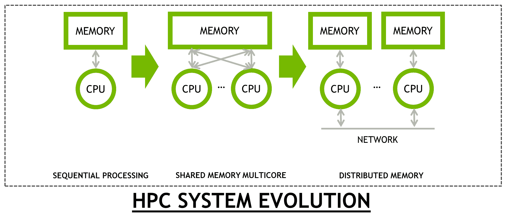

随着 GPU 被添加到现有服务器上，应用程序在两种处理器（CPU 和 GPU）上运行，引入了异构的概念。这是我们将在下一节介绍的内容。

# 异构计算

围绕 GPU 的一个常见误解是它是 CPU 的替代品。GPU 用于加速代码中并行的部分。**加速器**是一个常用术语，用于描述 GPU，因为它们通过更快地运行代码的并行部分来加速应用程序，而 CPU 运行另一部分代码，即延迟绑定的部分。因此，高效的 CPU 与高吞吐量的 GPU 相结合，可以提高应用程序的性能。

以下图表代表了在多种处理器类型上运行的应用程序：

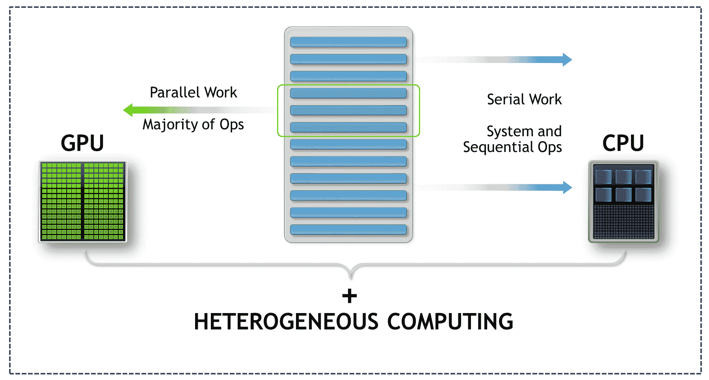

这个概念可以很好地用阿姆达尔定律来定义。阿姆达尔定律用于定义当应用程序的一部分被并行化时可以实现的最大加速。为了演示这一点，前面的图表显示了代码的两个部分。一个部分是延迟绑定的，而另一个是吞吐量绑定的。我们将在下一节中介绍这两个术语，区分 CPU 和 GPU 体系结构。

关键点是，CPU 对于某些延迟绑定的代码部分很好，而 GPU 擅长并行运行代码的**单指令多数据**（**SIMD**）部分。如果在优化后只有其中一个，即 CPU 代码或 GPU 代码，运行速度更快，这不一定会导致整体应用程序的速度提升。需要的是，当两个处理器都得到最佳利用时，性能方面才能获得最大的好处。这种从处理器上**卸载**某些类型的操作到 GPU 的方法被称为**异构计算**。

以下图表描述了所有应用程序具有的两种部分，即延迟绑定和吞吐量绑定：

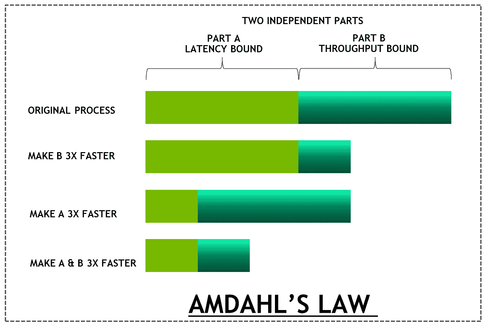

在这里，使用阿姆达尔定律演示了改进两个部分的重要性。

# 编程范式

计算机体系结构的分类是使用弗林分类法进行的，描述了四类体系结构。弗林的分类之一 SIMD 用于描述 GPU 体系结构。然而，两者之间存在微妙的差异。SIMD 用于描述同一指令并行应用于多个数据点的体系结构。这种描述适用于具有矢量化能力的处理器。相比之下，在**单指令多线程**（**SIMT**）中，不是单个线程发出指令，而是多个线程向不同的数据发出相同的指令。与 SIMD 相比，GPU 体系结构更适合 SIMT 类别。

让我们看一个例子，将两个数组相加并将数据存储在第三个数组中。这个操作的数据集包括数组*A*、*B*和*C*。用于加法的相同操作被用于数组的每个元素：

*Cx = Ax + Bx*

显然，每个任务都是独立的，但所有线程都在应用相同的操作。

以下截图显示了矢量加法，展示了这种范例的一个例子：

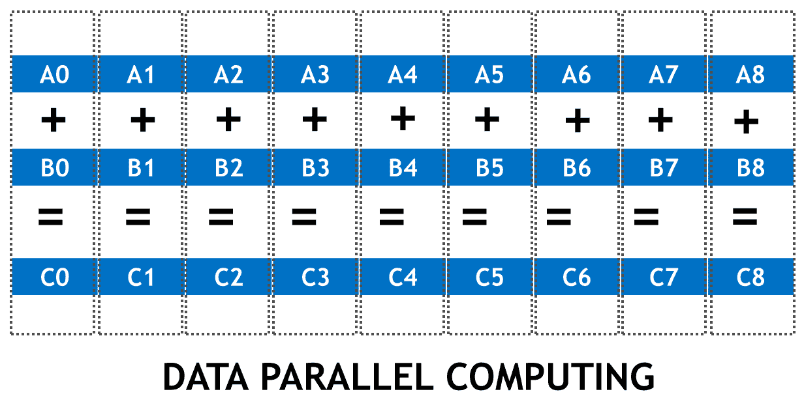

# 低延迟与高吞吐量

正如我们在前一节中提到的，CPU 架构被优化用于低延迟访问，而 GPU 架构被优化用于数据并行吞吐量计算。如下截图所示，与 GPU 相比，CPU 架构具有大量缓存并且具有许多类型。我们越高，即从 L3 到 L1，缓存的数量就越少，但延迟就越低。CPU 架构旨在实现对缓存数据集的低延迟访问。大量晶体管用于实现推测执行和乱序执行。由于 CPU 以非常高的时钟速度运行，因此有必要通过频繁地将使用的数据存储在缓存中并预测下一条要执行的指令来隐藏获取数据的延迟。可以最佳地利用 CPU 缓存的应用程序可以探索这种时间局部性。此外，可以利用填充指令管线的应用程序，例如代码中没有`if`和`else`语句的应用程序，通过隐藏获取指令的延迟来受益。因此，CPU 架构是一种减少延迟的架构。

以下截图显示了 CPU 和 GPU 架构如何为不同的内存和计算单元分配芯片芯片区域。GPU 使用大量晶体管进行计算 ALUs，而 CPU 使用它来减少延迟。

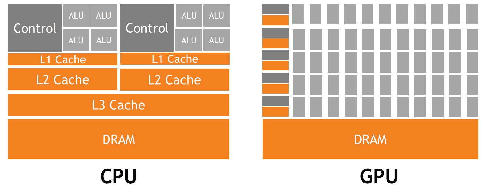

另一方面，GPU 架构被称为“减少延迟”或“高吞吐量架构”。GPU 架构通过来自其他线程的计算来隐藏延迟。当一个线程在等待数据可用进行计算时，其他线程可以开始执行，因此不会浪费任何时钟周期。如果您熟悉 CUDA，那么您可能已经了解到 warp 的概念。我们将在接下来的章节中介绍 warp 的概念。（在 CUDA 中，执行单元是 warp 而不是线程。因此，上下文切换发生在 warp 而不是线程之间）。

有些人可能已经在想为什么我们不能在 CPU 中创建这些线程并做同样的事情来隐藏延迟。原因是 GPU 有大量的寄存器，并且所有线程上下文切换信息已经存在于其中。这是最快的内存。然而，在 CPU 中，寄存器集是有限的，因此线程相关的信息通常存储在较低的内存层次结构中，比如缓存。例如，Volta 包含 20MB 的寄存器存储。因此，与 GPU 相比，CPU 中线程之间的上下文切换时间要长得多。

现在，让我们来看看在 GPU 编程方面的不同方法。

# GPU 的编程方法

现在，让我们回到我们最初的问题，即 CUDA 是什么？CUDA 是由 NVIDIA 开发的并行计算平台和编程模型架构，它将 GPU 上的通用计算作为一流能力进行暴露。与任何其他处理器一样，GPU 架构可以使用各种方法进行编码。提供快速加速的最简单方法是利用现有库。另外，开发人员可以选择使用 OpenACC 指令以获得快速加速结果和可移植性。另一种选择是选择通过使用 C、C++、Fortran、Python 等语言构造来深入研究 CUDA，以获得最高的性能和灵活性。我们将在接下来的章节中详细介绍所有这些方法。

以下截图表示了我们可以进行 GPU 编程的各种方式。

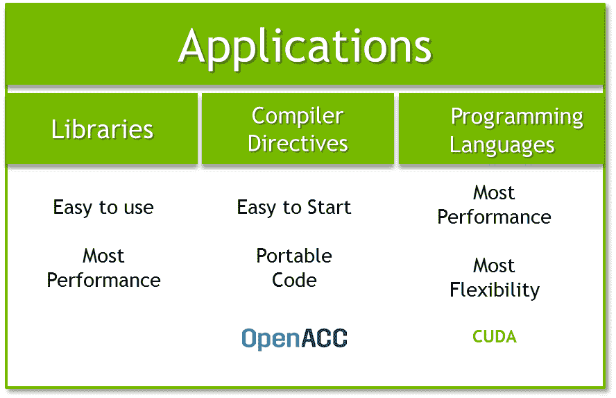

在本节中，我们为您提供了处理器和高性能计算随时间演变的视角。我们为您提供了异构编程模型对于从应用程序中获得最佳性能的关键性概述，以及 GPU 编程的方法。在下一节中，我们将开始在 GPU 上编写一个 Hello World 程序。

# 技术要求

本章需要一台安装了现代 NVIDIA GPU（Pascal 架构及以上）的 Linux/Windows PC，以及所有必要的 GPU 驱动程序和安装了 CUDA Toolkit（10.0 及以上版本）。如果您不确定您的 GPU 架构，请访问 NVIDIA 的 GPU 网站（[`developer.nvidia.com/cuda-gpus`](https://developer.nvidia.com/cuda-gpus)）并确认您的 GPU 架构。本章的代码也可以在 GitHub 上找到：[`github.com/PacktPublishing/Learn-CUDA-Programming`](https://github.com/PacktPublishing/Learn-CUDA-Programming)。

本章的代码示例是使用 CUDA Toolkit 的 10.1 版本开发和测试的，但建议尽可能使用最新的 CUDA 版本。

# 来自 CUDA 的 Hello World

CUDA 是一个包括 CPU 和 GPU 在内的异构编程模型。CUDA C/C++编程接口由 C 语言扩展组成，以便您可以将源代码的部分目标定为在设备（GPU）上并行执行。它基于行业标准的 C/C++，并提供了一系列 C 函数库，可以在主机（CPU）上执行，以便它可以与设备进行交互。

在 CUDA 中，有两个相互配合的处理器。主机通常被称为 CPU，而设备通常被称为 GPU。主机负责调用设备函数。正如我们已经提到的，运行在 GPU 上的代码的一部分被称为**设备代码**，而在 CPU 上运行的串行代码被称为**主机代码**。

让我们从在 C 中编写我们的第一个 CUDA 代码开始。我们的意图是采取一个系统化的逐步方法，从一些顺序代码开始，通过添加一些额外的关键字将其转换为 CUDA 感知代码。正如我们之前提到的，没有必要学习一门新语言，我们只需要在现有语言中添加一些关键字，以便在 CPU 和 GPU 的异构环境中运行它。

让我们来看看我们的第一段代码。这段代码的作用只是从主机和设备上打印 Hello World!

```cpp
#include<stdio.h>
#include<stdlib.h>

__global__ void print_from_gpu(void) {
    printf("Hello World! from thread [%d,%d] \
        From device\n", threadIdx.x,blockIdx.x);
}

int main(void) {
    printf("Hello World from host!\n");
    print_from_gpu<<<1,1>>>();
    cudaDeviceSynchronize();
    return 0;
}

```

让我们尝试编译和运行前面的代码片段：

1.  **编译代码**：将前面的代码放入一个名为`hello_world.cu`的文件中，并使用**NVIDIA C Compiler**（**nvcc**）进行编译。请注意，文件的扩展名是`.cu`，这告诉编译器这个文件里面有 GPU 代码：

```cpp
$ nvcc -o hello_world hello_world.cu
```

1.  **执行 GPU 代码**：在执行 GPU 代码后，我们应该收到以下输出：

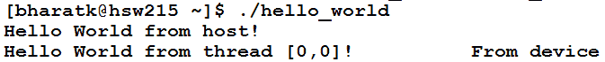

到目前为止，您可能已经注意到 CUDA C 代码的使用方式并没有太大不同，只需要学习一些额外的构造来告诉编译器哪个函数是 GPU 代码，以及如何调用 GPU 函数。这并不像我们需要完全学习一门新语言。

在前面的代码中，我们添加了一些构造和关键字，如下：

+   `__global__`：在函数之前添加此关键字，告诉编译器这是一个将在设备上而不是主机上运行的函数。但请注意，它是由主机调用的。这里另一个重要的事情是设备函数的返回类型始终是"void"。算法的数据并行部分在设备上作为内核执行。

+   `<<<,>>>`: 这个关键字告诉编译器这是对设备函数的调用，而不是对主机函数的调用。此外，`1,1`参数基本上决定了在内核中启动的线程数。我们将稍后介绍尖括号内的参数。目前，`1,1`参数基本上意味着我们只启动一个线程的内核，也就是说，除了打印之外，我们在代码中没有做任何重要的事情。

+   `threadIdx.x`*,* `blockIdx.x`: 这是给所有线程的唯一 ID。我们将在下一节更详细地介绍这个主题。

+   `cudaDeviceSynchronize()`: CUDA 中的所有内核调用都是异步的。在调用内核后，主机变得空闲，并在之后开始执行下一条指令。这应该不足为奇，因为这是一个异构环境，因此主机和设备都可以并行运行，以利用可用的处理器类型。如果主机需要等待设备完成，CUDA 编程提供了 API 使主机代码等待设备函数完成。其中一个 API 是`cudaDeviceSynchronize`，它会等待所有先前对设备的调用完成。

尝试删除`cudaDeviceSynchronize()`调用，看看设备输出是否可见。或者，尝试在打印主机代码之前放置这个调用。

# 线程层次结构

现在，让我们开始玩弄两个参数，即`threadIdx.x`和`blockIdx.x`。

**实验 1**：首先，将参数从`<<<1,1>>>`更改为`<<<2,1>>>`并查看输出。运行多个线程-单个块的 Hello World 代码的输出应该如下：

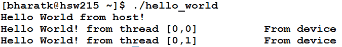

正如我们所看到的，现在我们不是一个线程，而是两个线程打印值。请注意，它们的唯一 ID 是不同的。

**实验 2**：现在，不要更改第一个参数，而是更改第二个参数，即将`<<<1,1>>>`更改为`<<<1,2>>>`，并观察运行多个单线程块的 Hello World 代码的输出，如下所示：

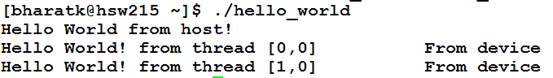

如您所见，被启动到内核中的线程总数是两个，就像以前一样——唯一的区别是它们的 ID 不同。那么，这些线程和块的概念是什么？为了解决这个问题，让我们更深入地了解 GPU 架构。

# GPU 架构

CUDA 变得如此受欢迎的一个关键原因是因为硬件和软件被设计和紧密绑定，以获得应用程序的最佳性能。因此，有必要展示软件 CUDA 编程概念与硬件设计本身之间的关系。

以下截图显示了 CUDA 的两个方面：

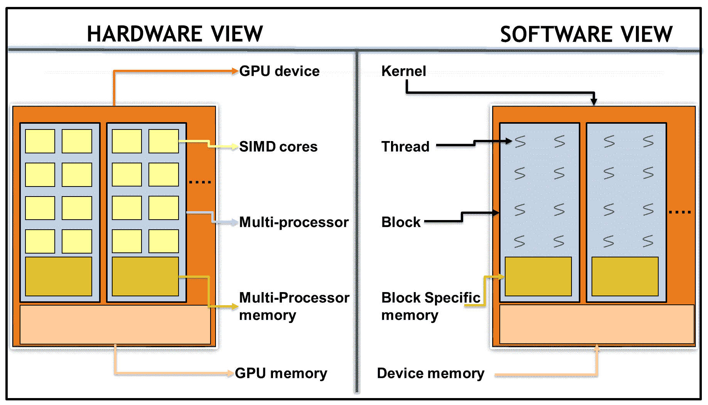

我们可以看到，CUDA 软件已经映射到了 GPU 硬件。

根据前面的截图，以下表解释了 CUDA 编程模型的软件和硬件映射：

| **软件** | **执行于/作为** | **硬件** |
| --- | --- | --- |
| CUDA 线程 | CUDA 核心/SIMD 代码 |
| CUDA 块 | 流多处理器 |
| 网格/内核 | GPU 设备 |

让我们详细看一下前表的组件：

+   **CUDA 线程**：CUDA 线程在 CUDA 核心上执行。CUDA 线程不同于 CPU 线程。CUDA 线程非常轻量级，并提供快速的上下文切换。快速上下文切换的原因是由于 GPU 中有大量的寄存器和硬件调度器。线程上下文存在于寄存器中，而不是像 CPU 中那样在较低的内存层次结构中，比如缓存中。因此，当一个线程处于空闲/等待状态时，另一个准备好的线程几乎可以立即开始执行。每个 CUDA 线程必须执行相同的内核，并且独立地处理不同的数据（SIMT）。

+   **CUDA 块**：CUDA 线程被组合成一个称为 CUDA 块的逻辑实体。CUDA 块在单个**流多处理器**（**SM**）上执行。一个块在一个 SM 上运行，也就是说，一个块内的所有线程只能在一个 SM 的核心上执行，不会在其他 SM 的核心上执行。每个 GPU 可能有一个或多个 SM，因此为了有效地利用整个 GPU，用户需要将并行计算划分为块和线程。

+   **GRID/核心**：CUDA 块被组合成一个称为 CUDA GRID 的逻辑实体。然后在设备上执行 CUDA GRID。

乍一看，这可能听起来有些复杂。在接下来的部分，我们将以向量加法的示例来解释这个问题。希望事情会变得更清晰。

# 使用 CUDA 进行向量加法

我们要解决的问题是向量加法。正如我们所知，**向量**加法是一种数据并行操作。我们的数据集包括三个数组：*A*、*B*和*C*。每个元素执行相同的操作：

*Cx = Ax + Bx*

每个加法是相互独立的，但所有 CUDA 线程都执行相同的操作。要开始，根据以下步骤配置您的环境：

1.  准备你的 GPU 应用程序。这段代码将放在`01_cuda_introduction/01_vector_addition`中。

1.  使用`nvcc`编译器编译您的应用程序，命令如下：

```cpp
$nvcc -o vector_addition vector_addition.cu
```

上述代码是顺序代码。我们将按照以下步骤逐步将此代码转换为可以在 GPU 上运行的代码：

```cpp
#include<stdio.h>
#include<stdlib.h>

#define N 512

void host_add(int *a, int *b, int *c) {
    for(int idx=0;idx<N;idx++)
        c[idx] = a[idx] + b[idx];
}

//basically just fills the array with index.
void fill_array(int *data) {
    for(int idx=0;idx<N;idx++)
        data[idx] = idx;
}

void print_output(int *a, int *b, int*c) {
    for(int idx=0;idx<N;idx++)
        printf("\n %d + %d = %d", a[idx] , b[idx], c[idx]);
}

int main(void) {
    int *a, *b, *c;
    int size = N * sizeof(int);
   // Alloc space for host copies of a, b, c and setup input values
    a = (int *)malloc(size); fill_array(a);
    b = (int *)malloc(size); fill_array(b);
    c = (int *)malloc(size);
    host_add(a,b,c);
    print_output(a,b,c);
    free(a); free(b); free(c);
    return 0;
}
```

在转换顺序代码之前，让我们看一下 CUDA 代码和顺序代码之间所采取的基本变化或步骤：

| **顺序代码** | **CUDA 代码** |
| --- | --- |
| 步骤 1 | 在 CPU 上分配内存，即`malloc new`。 | 步骤 1 | 在 CPU 上分配内存，即`malloc new`。 |
| 步骤 2 | 填充/初始化 CPU 数据。 | 步骤 2 | 在 GPU 上分配内存，即`cudaMalloc`。 |
| 步骤 3 | 调用处理数据的 CPU 函数。在这种情况下，实际算法是向量加法。 | 步骤 3 | 填充/初始化 CPU 数据。 |
| 步骤 4 | 处理数据，这里是打印出来的。 | 步骤 4 | 用`cudaMemcpy`将数据从主机传输到设备。 |
| 步骤 5 | 用`<<<,>>>`括号调用 GPU 函数。 |
| 步骤 6 | 用`cudaDeviceSynchronize`同步设备和主机。 |
| 步骤 7 | 用`cudaMemcpy`将数据从设备传输到主机。 |
| 步骤 8 | 处理数据，这里是打印出来的。 |

本书不是 CUDA API 指南的替代品，也不涵盖所有 CUDA API。如需广泛使用 API，请参考 CUDA API 指南。

正如我们所看到的，CUDA 处理流程有一些额外的步骤需要添加到顺序代码中。具体如下：

1.  **在 GPU 上分配内存：**CPU 内存和 GPU 内存是物理上分开的内存。`malloc`在 CPU 的 RAM 上分配内存。GPU 核心/设备函数只能访问已分配/指向设备内存的内存。要在 GPU 上分配内存，我们需要使用`cudaMalloc` API。与`malloc`命令不同，`cudaMalloc`不会返回指向已分配内存的指针；相反，它以指针引用作为参数，并更新相同的已分配内存。

1.  **将数据从主机内存传输到设备内存：**主机数据然后被复制到使用前一步中使用的`cudaMalloc`命令分配的设备内存。用于在主机和设备之间复制数据的 API 是`cudaMemcpy`。与其他`memcopy`命令一样，此 API 需要目标指针、源指针和大小。它额外需要一个参数，即复制的方向，也就是说，我们是从主机到设备复制，还是从设备到主机复制。在 CUDA 的最新版本中，这是可选的，因为驱动程序能够理解指针是指向主机内存还是设备内存。请注意，`cudaMemcpy`有一个异步的替代方案。这将在其他章节中更详细地介绍。

1.  **调用和执行 CUDA 函数：**如同在 Hello World CUDA 程序中所示，我们通过`<<<,>>>`括号调用一个核函数，它提供了块和线程大小的参数。在完成所有步骤后，我们将更详细地介绍这一点。

1.  **同步：**正如我们在 Hello World 程序中提到的，核函数调用是异步的。为了确保主机确保核执行已完成，主机调用`cudaDeviceSynchronize`函数。这确保了之前启动的所有设备调用都已完成。

1.  **将数据从主机内存传输到设备内存：**使用相同的`cudaMemcpy` API 将数据从设备复制回主机，用于后处理或验证任务，如打印。与第一步相比，唯一的变化是我们颠倒了复制的方向，也就是说，目标指针指向主机，而源指针指向在内存中分配的设备。

1.  **释放分配的 GPU 内存：**最后，使用`cudaFree` API 释放分配的 GPU 内存。

更改顺序向量加法代码的`main`函数以反映这些新步骤。`main`函数将如下所示：

```cpp
int main(void) {
    int *a, *b, *c;
    int *d_a, *d_b, *d_c; // device copies of a, b, c
    int size = N * sizeof(int);

    // Alloc space for host copies of a, b, c and setup input values
    a = (int *)malloc(size); fill_array(a);
    b = (int *)malloc(size); fill_array(b);
    c = (int *)malloc(size);

    // Alloc space for device copies of vector (a, b, c)
    cudaMalloc((void **)&d_a, N* * sizeof(int));
    cudaMalloc((void **)&d_b, N* *sizeof(int));
    cudaMalloc((void **)&d_c, N* * sizeof(int));

    // Copy from host to device
    cudaMemcpy(d_a, a, N * sizeof(int), cudaMemcpyHostToDevice);
    cudaMemcpy(d_b, b, N* sizeof(int), cudaMemcpyHostToDevice);

    device_add<<<1,1>>>(d_a,d_b,d_c);

    // Copy result back to host
    cudaMemcpy(c, d_c, N * sizeof(int), cudaMemcpyDeviceToHost);

    print_output(a,b,c);
    free(a); free(b); free(c);

    //free gpu memory
    cudaFree(d_a); cudaFree(d_b); cudaFree(d_c);

    return 0;
} 
```

现在，让我们看一下如何编写核心代码并管理线程和块大小。为此，我们将进行多个实验。

# 实验 1 - 创建多个块

在这一部分，我们将利用 CUDA 块在 GPU 上并行运行向量加法代码。将会暴露与我们如何索引 CUDA 块相关的附加关键字。更改对`device_add`函数的调用如下：

```cpp
//changing from device_add<<<1,1>>> to
device_add<<<N,1>>>
```

这将使`device_add`函数并行执行`N`次，而不是一次。`device_add`函数的每个并行调用称为一个块。现在，让我们添加一个`__global__`设备函数，如下所示：

```cpp
__global__ void device_add(int *a, int *b, int *c) {
 c[blockIdx.x] = a[blockIdx.x] + b[blockIdx.x];
}
```

通过使用`blockIdx.x`来索引数组，每个块处理数组的不同元素。在设备上，每个块可以并行执行。让我们看一下以下的屏幕截图：

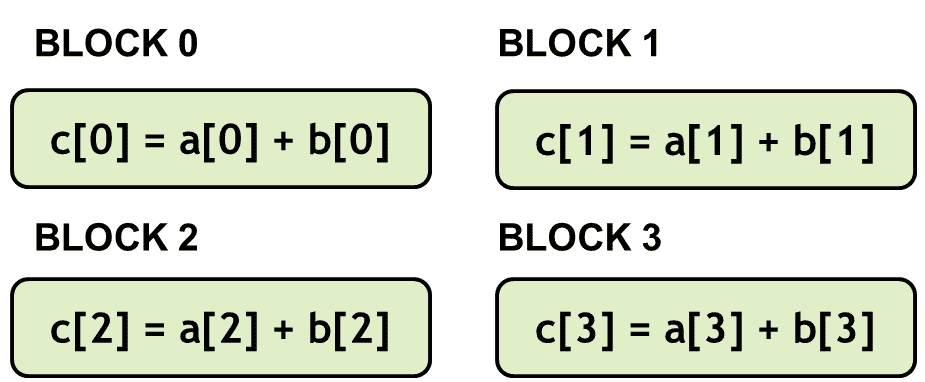

前面的屏幕截图代表了向量加法 GPU 代码，其中每个块显示了多个单线程块的索引。

# 实验 2 - 创建多个线程

在这一部分，我们将利用 CUDA 线程在 GPU 上并行运行向量加法代码。将会暴露与我们如何索引 CUDA 线程相关的附加关键字。

一个块可以分成多个线程。更改对`device_add`函数的调用如下：

```cpp
//changing from device_add<<<1,1>>> to
device_add<<<1,N>>>
```

这将并行执行`device_add`函数`N`次，而不是一次。`device_add`函数的每个并行调用被称为一个线程。更改设备例程以反映内核，如下所示：

```cpp
__global__ void device_add(int *a, int *b, int *c) {
     c[threadIdx.x] = a[threadIdx.x] + b[threadIdx.x];
}
```

一个显著的区别是，我们使用`threadIdx.x`而不是`blockIdx.x`，如下面的截图所示：

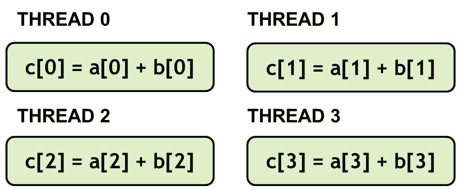

前面的截图代表了向量加法 GPU 代码，其中每个块显示了单个块-多个线程的索引。

# 实验 3 - 结合块和线程

到目前为止，我们已经通过在*实验 1 - 创建多个块*部分使用多个块和一个线程，以及在*实验 2 - 创建多个线程*部分使用一个块和多个线程来查看并行向量加法。在这个实验中，我们将使用多个块以及包含多个线程的单独块。在如何找到索引方面，这变得更具挑战性，因为我们需要结合`threadIdx`和`blockIdx`来生成一个唯一的 ID。

让我们看一下两种不同组合的场景，开发人员可以从中选择：

+   **场景 1：** 假设向量元素的总数是 32。每个块包含八个线程，总共有四个块。

+   **场景 2：** 假设向量元素的总数是 32。每个块包含四个线程，总共有八个块。

在这两种情况下，并行执行的数量都是 32，所有 32 个元素都会并行填充。开发人员根据问题的大小和每个硬件的限制选择块内的线程和块的数量。我们将在另一章节中详细介绍基于架构的正确尺寸选择的细节。

以下截图显示了不同块和线程配置的向量加法 GPU 索引代码：

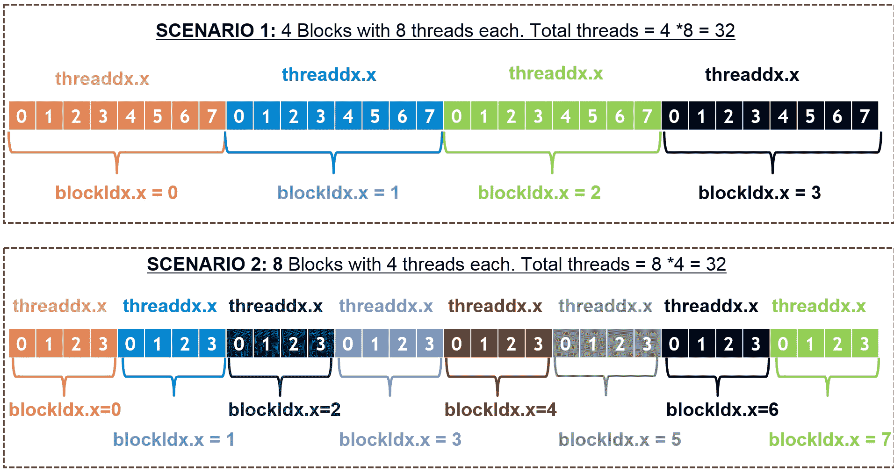

现在，让我们看看如何改变内核代码以结合线程和块来计算全局索引：

```cpp
__global__ void device_add(int *a, int *b, int *c) {
     int index = threadIdx.x + blockIdx.x * blockDim.x;
     c[index] = a[index] + b[index];
}
```

在从`main()`函数中调用内核时，开发人员选择了块和线程的配置，如前面提到的两种情况所示的代码：

+   **场景 1：** 以下是用于计算每个块八个线程的向量加法 GPU 网格和块大小的代码：

```cpp
threads_per_block = 8;
no_of_blocks = N/threads_per_block;
device_add<<<no_of_blocks,threads_per_block>>>(d_a,d_b,d_c);
```

+   **场景 2：** 以下是用于计算每个块四个线程的向量加法 GPU 网格和块大小的代码：

```cpp
threads_per_block = 4;
no_of_blocks = N/threads_per_block;
device_add<<<no_of_blocks,threads_per_block>>>(d_a,d_b,d_c);
```

通过线程和块的组合，可以计算出线程的唯一 ID。如前面的代码所示，所有线程都被赋予另一个变量。这被称为`blockDim`。这个变量包含了块的维度，也就是每个块的线程数。让我们看一下下面的截图：

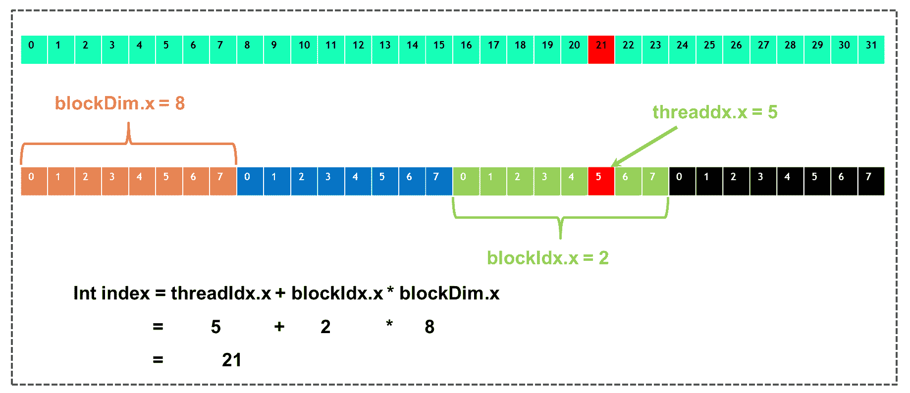

在这里，我们可以看到场景 1 的向量加法 GPU 索引计算。

# 为什么要费心处理线程和块？

可能不明显为什么我们需要这种额外的线程和块的层次结构。它增加了开发人员需要找到正确的块和网格大小的复杂性。全局索引也变得具有挑战性。这是因为 CUDA 编程模型设置了限制。

与并行块不同，线程有有效的通信和同步机制。现实世界的应用程序需要线程之间进行通信，并且可能希望在继续之前等待某些数据进行交换。这种操作需要线程进行通信，CUDA 编程模型允许同一块内的线程进行通信。属于不同块的线程在内核执行期间无法进行通信/同步。这种限制允许调度程序独立地在 SM 上调度块。其结果是，如果发布了具有更多 SM 的新硬件，并且代码具有足够的并行性，则代码可以线性扩展。换句话说，这允许硬件根据 GPU 的能力并行运行块的数量。

线程之间使用一种称为共享内存的特殊内存进行通信。我们将在第二章中广泛介绍共享内存，即*CUDA 内存管理*，在那里我们将介绍 GPU 中的其他内存层次结构及其最佳使用方法。以下屏幕截图演示了在不同 GPU 上扩展块，这些 GPU 包含不同数量的 SM：

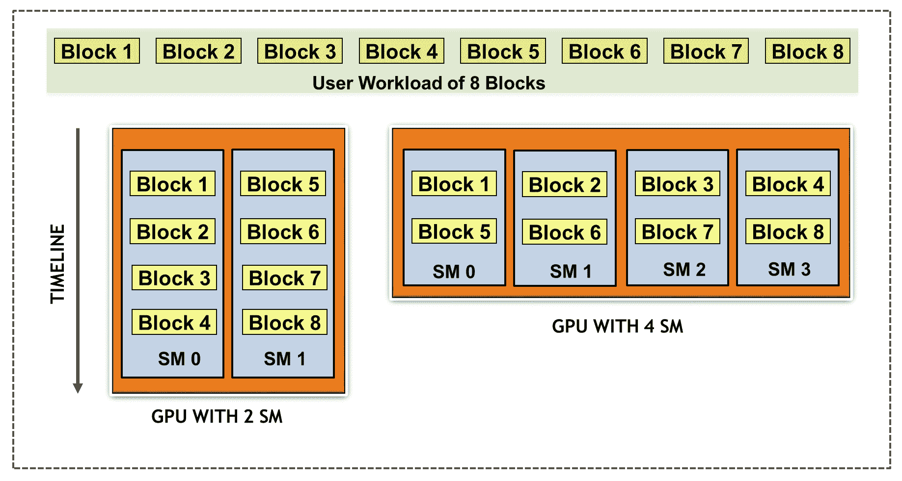

现在，让我们更多地了解在多个维度中启动内核。

# 在多个维度中启动内核

到目前为止，我们一直在一维中启动线程和块。这意味着我们只使用一个维度的索引；例如，我们一直在使用`threadIdx.x`，其中`x`表示我们只使用一个`x`维度的线程索引。同样，我们一直在使用`blockIdx.x`，其中`x`表示我们只使用一个`x`维度的块索引。我们可以在一、二或三个维度中启动线程和块。在二维中启动线程和块的一个例子是当我们在图像上进行并行操作，例如使用滤波器模糊图像。开发人员可以选择在二维中启动线程和块，这是一个更自然的选择，因为图像在本质上是二维的。

重要的是要了解每个 GPU 架构也对线程和块的维度施加了限制。例如，NVIDIA Pascal 卡允许在`x`和`y`维度中每个线程块最多有 1,024 个线程，而在`z`维度中，您只能启动 64 个线程。同样，在 Pascal 架构中，网格中的最大块数限制为`y`和`z`维度中的 65,535 个，`x`维度中为`2³¹ -1`。如果开发人员使用不受支持的维度启动内核，应用程序会抛出运行时错误。

到目前为止，我们一直假设我们编写的代码是没有错误的。但在现实世界中，每个程序员都会写有错误的代码，必须捕捉这些错误。在下一节中，我们将看看 CUDA 中的错误报告是如何工作的。

# CUDA 中的错误报告

在 CUDA 中，主机代码管理错误。大多数 CUDA 函数调用`cudaError_t`，它基本上是一个枚举类型。`cudaSuccess`（值 0）表示`0`错误。用户还可以使用`cudaGetErrorString()`函数，该函数返回描述错误条件的字符串。

```cpp
 cudaError_t e;
 e = cudaMemcpy(...);
 if(e)
     printf("Error: %sn", cudaGetErrorString(err));
```

内核启动没有返回值。我们可以在这里使用`cudaGetLastError()`这样的函数，它返回最后一个 CUDA 函数（包括内核启动）的错误代码。在多个错误的情况下，只报告最后一个错误：

```cpp
MyKernel<<< ... >>> (...);
cudaDeviceSynchronize();
e = cudaGetLastError();
```

在生产代码中，建议在逻辑检查点处使用错误检查代码，因为即使 GPU 内核崩溃，CPU 代码也会继续正常执行，导致结果不正确。

在下一节中，我们将向您介绍 CUDA 编程模型中支持的数据类型。

# CUDA 中的数据类型支持

与任何处理器架构一样，GPU 也有不同类型的内存，每种用于不同的目的。我们将在第二章中更详细地介绍它们，*CUDA 内存管理*。然而，重要的是要理解支持的不同数据类型及其对性能和精度的影响。CUDA 编程支持开发人员在其各自语言中熟悉的所有标准数据类型。除了不同大小的标准数据类型（`char`为 1 字节，`float`为 4 字节，`double`为 8 字节等）之外，它还支持矢量类型，如`float2`和`float4`。

建议数据类型自然对齐，因为对于大小为 1、2、4、8 或 16 字节的数据类型的对齐数据访问，可以确保 GPU 调用单个内存指令。如果它们没有对齐，编译器将生成多个交错的指令，导致内存和指令总线的低效利用。因此，建议在 GPU 内存中使用自然对齐的类型。对于`char`、`short`、`int`、`long`、`long long`、`float`和`double`等内置类型，如`float2`和`float4`，对齐要求会自动满足。

此外，CUDA 编程还支持复杂的数据结构，如结构和类（在 C 和 C++的上下文中）。对于复杂的数据结构，开发人员可以利用对齐说明符来强制编译器满足对齐要求，如下面的代码所示：

```cpp
struct __align__(16) {
    float r;
    float g;
    float b;
};
```

每个 GPU 都有一组有限的核心，因此 FLOPS 是不同的。例如，具有 Volta 架构的 Tesla V100 卡具有 2560 个 FP64 核心（双精度），而具有两倍数量的 32 位单精度核心。很明显，根据算法的精度要求使用正确的数据类型是至关重要的。现在正在开发混合精度算法，以利用不同类型的核心，其中算法的某些部分以更高精度运行，而某些部分以较低精度运行。我们将在即将到来的章节中更多地涵盖这个主题。目前，重要的是要理解 GPU 内存层次结构是不同的，因此使用正确的数据类型很重要。

虽然这是对 GPU 支持的数据类型的一般介绍，但有关所有支持的数据类型的更多详细信息可以在[`docs.nvidia.com/cuda/cuda-c-programming-guide/index.html#built-in-vector-types`](https://docs.nvidia.com/cuda/cuda-c-programming-guide/index.html#built-in-vector-types)找到。

# 总结

在本章中，我们通过历史和高性能计算为您提供了异构计算的视角。我们详细介绍了两个处理器，即 CPU 和 GPU 的不同之处。我们还在 GPU 上编写了一个 Hello World 和矢量加法 CUDA 程序。最后，我们看了如何检测 CUDA 中的错误，因为对 CUDA API 的大多数调用都是异步的。

在下一章中，我们将看一下不同类型的 GPU 内存以及如何最优地利用它们。
