# CUDA 内存管理

正如我们在第一章中所描述的，*CUDA 编程简介*，CPU 和 GPU 架构在根本上是不同的，它们的内存层次结构也是不同的。它们不仅在大小和类型上有所不同，而且在目的和设计上也有所不同。到目前为止，我们已经学习了每个线程如何通过索引（`blockIdx`和`threadIdx`）访问自己的数据。我们还使用了诸如`cudaMalloc`之类的 API 在设备上分配内存。GPU 中有许多内存路径，每个路径的性能特征都不同。启动 CUDA 核心可以帮助我们实现最大性能，但只有在以最佳方式使用正确类型的内存层次结构时才能实现。将数据集映射到正确的内存类型是开发人员的责任。

根据经验，如果我们绘制一个图表，概述 GPU 上的顶级应用性能约束，它将看起来像以下图表：

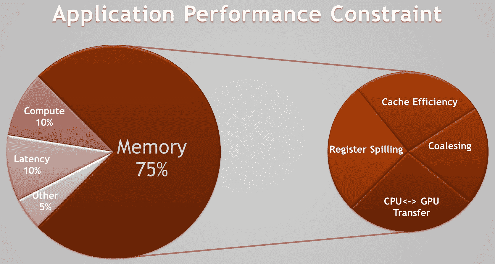

上述饼图粗略地分解了大多数基于 CUDA 的应用程序中出现的性能问题。很明显，大多数情况下，应用程序的性能将受到与内存相关的约束的限制。根据应用程序和采取的内存路径，内存相关的约束进一步划分。

让我们以不同的方式来看待这种方法，并了解有效使用正确类型的内存的重要性。最新的 NVIDIA GPU 采用 Volta 架构，提供了 7,000 GFLOP 的峰值性能，其设备内存带宽为 900 GB/s。您将首先注意到的是 FLOP 与内存带宽的比率，大约为 7:1。这是假设所有线程都访问 4 字节（浮点数）数据执行操作。执行此操作所需的总带宽是*4*7,000 = 28,000* GB/s，即达到峰值性能所需的带宽。900 GB/s 将执行限制为 225 GFLOP。这将执行速率限制为峰值的 3.2%（225 GFLOP 是设备的 7,000 GFLOP 峰值的 3.2%）。正如您现在所知，GPU 是一种隐藏延迟的架构，有许多可用于执行的线程，这意味着它在理论上可以容忍长的内存访问延迟。然而，对内存的过多调用可能会导致一些 SMs 空闲，导致一些线程停顿或等待。CUDA 架构提供了其他几种方法，我们可以使用这些方法来访问内存，以解决内存瓶颈问题。

从 CPU 内存到被 SM 用于处理的数据路径在下图中展示。在这里，我们可以看到数据元素在到达 SM 核心进行计算之前的旅程。每个内存带宽的数量级都不同，访问它们的延迟也不同：

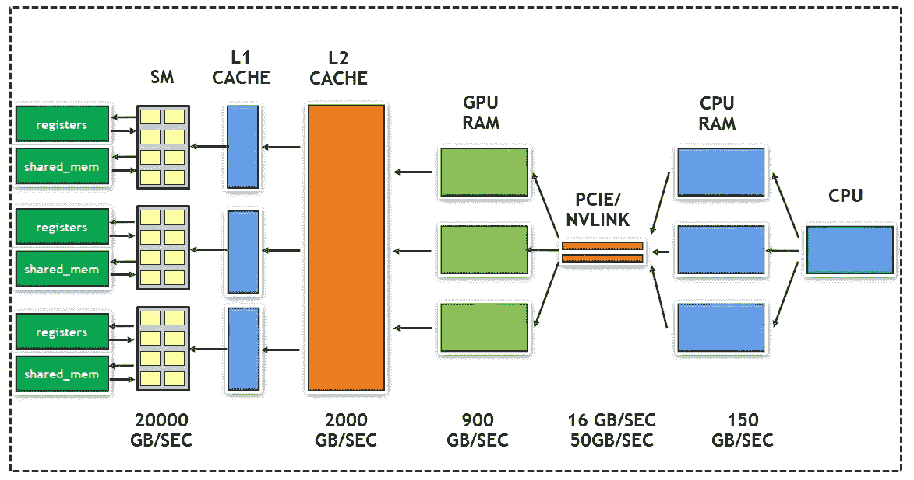

在上图中，我们可以看到从 CPU 到达寄存器的数据路径，最终计算是由 ALU/核心完成的。

下图显示了最新 GPU 架构中存在的不同类型的内存层次结构。每种内存可能具有不同的大小、延迟、吞吐量和应用程序开发人员的可见性：

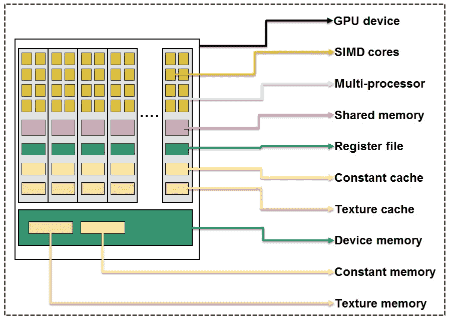

上图显示了最新 GPU 架构中存在的不同类型的内存及其在硬件中的位置。

在本章中，您将学习如何最佳地利用不同类型的 GPU 内存。我们还将研究 GPU 统一内存的最新特性，这使得程序员的生活变得更简单。本章将详细介绍以下内存主题：

+   全局内存/设备内存

+   共享内存

+   只读数据/缓存

+   固定内存

+   统一内存

但在我们查看内存层次结构之前，我们将遵循优化周期，如下所示：

+   步骤 1：分析

+   步骤 2：并行化

+   步骤 3：优化

对应用程序的分析要求我们不仅要了解我们应用程序的特性，还要了解它在 GPU 上的有效运行方式。为此，我们将首先向您介绍 Visual Profiler，然后再进入 GPU 内存。由于我们在这里使用了一些最新的 CUDA 功能，请在继续本章之前阅读以下部分。

# 技术要求

本章需要一台带有现代 NVIDIA GPU（Pascal 架构或更高版本）的 Linux PC，以及安装了所有必要的 GPU 驱动程序和 CUDA Toolkit（10.0 或更高版本）。如果您不确定您的 GPU 架构，请访问 NVIDIA GPU 网站[`developer.nvidia.com/cuda-gpus`](https://developer.nvidia.com/cuda-gpus)进行确认。本章的代码也可以在 GitHub 上找到[`github.com/PacktPublishing/Learn-CUDA-Programming`](https://github.com/PacktPublishing/Learn-CUDA-Programming)。

本章的示例代码示例是使用 CUDA Toolkit 的 10.1 版本开发和测试的。但是，建议使用最新的 CUDA 版本或更高版本。

在下一节中，我们将向您介绍 Visual Profiler，它将帮助我们分析我们的应用程序。我们还将看一下它在 GPU 上的运行情况。

# NVIDIA Visual Profiler

为了了解不同内存层次结构的有效利用，重要的是在运行时分析应用程序的特性。分析器是非常方便的工具，可以测量和显示不同的指标，帮助我们分析内存、SM、核心和其他资源的使用方式。 NVIDIA 决定提供一个 API，供分析器工具的开发人员用于连接到 CUDA 应用程序，随着时间的推移，一些分析工具已经发展出来，如 TAU 性能系统、Vampir Trace 和 HPC Toolkit。所有这些工具都利用**CUDA 分析器工具接口**（**CUPTI**）为 CUDA 应用程序提供分析信息。

NVIDIA 本身开发并维护作为 CUDA Toolkit 的一部分提供的分析工具。本章使用这两个分析工具（NVPROF 和 NVVP）来演示不同内存类型的有效使用，并不是分析工具的指南。

我们将使用 NVPROF 或 NVVP 来演示 CUDA 应用程序的特性。NVPROF 是一个命令行工具，而`nvvp`具有可视化界面。`nvvp`有两种格式，一种是独立版本，另一种是集成在 Nsisght Eclipse 中的版本。

我们将广泛使用的 NVVP 分析器窗口如下所示：

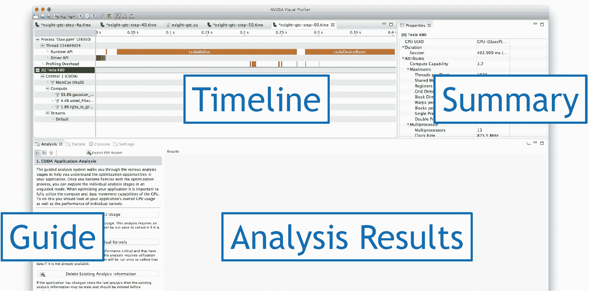

这是在 macOS 上拍摄的 NVVP 9.0 版本窗口快照。

窗口中有四个视图可用：时间轴、指南、分析结果和摘要。时间轴视图显示了随时间发生的 CPU 和 GPU 活动。Visual Profiler 显示了 CUDA 编程模型的内存层次结构的摘要视图。分析视图显示了分析结果。Visual Profiler 提供了两种分析模式：

+   **引导分析：**顾名思义，它通过逐步方法指导开发人员了解关键性能限制器。我们建议初学者在成为了解不同指标的专家之前先使用此模式，然后再转到无引导模式。

+   **无引导分析：**开发人员必须手动查看此模式下的结果，以了解性能限制器。

CUDA Toolkit 提供了两个 GPU 应用程序性能分析工具，**NVIDIA Profiler**（**NVPROF**）和**NVIDIA Visual Profiler**（**NVVP**）。为了获得性能限制器信息，我们需要进行两种类型的分析：时间线分析和度量分析。此代码可在 `02_memory_overview/04_sgemm` 中访问。分析命令可以执行如下：

```cpp
$ nvcc -o sgemm sgemm.cu
$ nvprof -o sgemm.nvvp ./sgemm
$ nvprof --analysis-metrics -o sgemm-analysis.nvvp ./sgemm
```

让我们打开 Visual Profiler。如果你使用的是 Linux 或 OSX，你可以在终端中执行 `nvvp`。或者，你可以从安装了 CUDA Toolkit 的二进制文件中找到 `nvvp` 可执行文件。如果你使用的是 Windows，你可以使用 Windows 搜索框执行该工具，命令为 `nvvp`。

要打开两个分析数据，我们将使用“文件”|“导入...”菜单，如下所示：

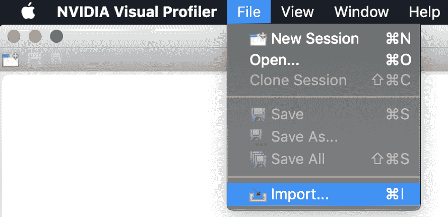

然后，我们将继续点击底部的“下一步”按钮：

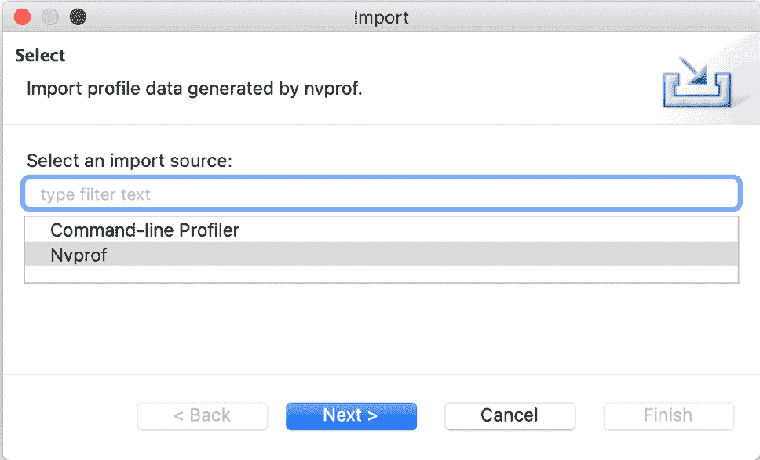。

我们的 CUDA 应用程序使用一个进程。因此，让我们继续点击底部的“下一步”按钮：

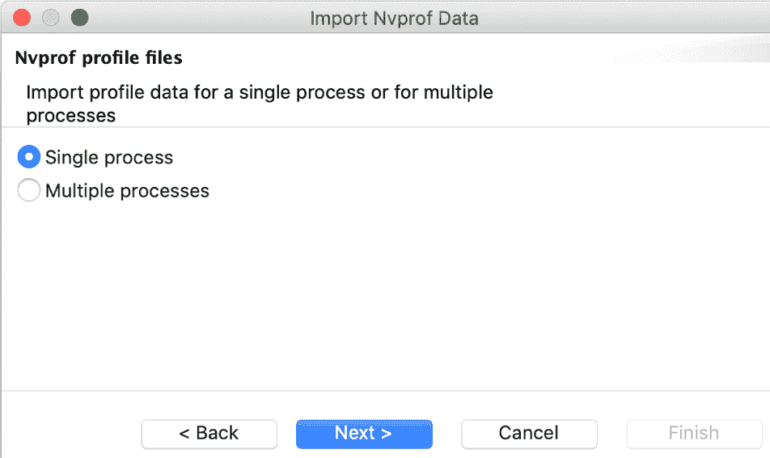

现在，让我们将收集的分析数据放入 Visual Profiler 中。以下截图显示了一个示例。通过右侧的“浏览...”按钮，将时间线数据放入第二个文本框。然后，以相同的方式将度量分析数据放入下一个文本框中：

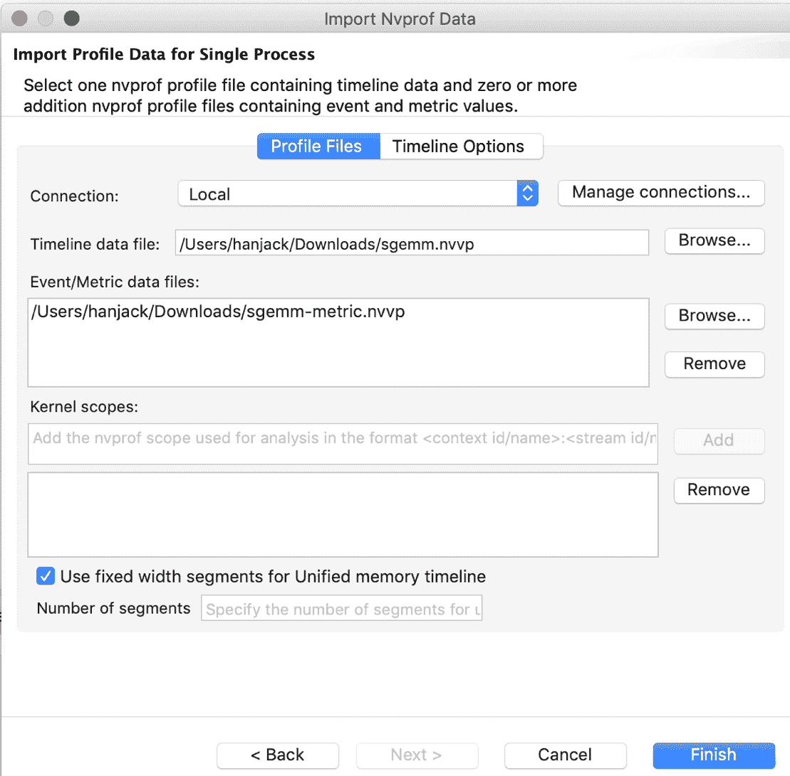

有关性能分析工具的详细使用，请参阅 CUDA Profiling 指南，该指南作为 CUDA Toolkit 的一部分提供（相应的网页链接为 [`docs.nvidia.com/cuda/profiler-users-guide/index.html`](https://docs.nvidia.com/cuda/profiler-users-guide/index.html)）。

在基于 Windows 的系统中，在安装了 CUDA Toolkit 后，你可以从“开始”菜单中启动 Visual Profiler。在具有 X11 转发的 Linux 系统中，你可以通过运行 `nvvp` 命令来启动 Visual Profiler，`nvvp` 代表 NVIDIA Visual Profiler：

```cpp
$ ./nvvp
```

既然我们现在对将要使用的分析工具有了一个公平的理解，让我们进入第一个也是绝对最关键的 GPU 内存——全局内存/设备内存。

# 全局内存/设备内存

本节将详细介绍如何使用全局内存，也称为设备内存。在本节中，我们还将讨论如何高效地将数据从全局内存加载/存储到缓存中。由于全局内存是一个暂存区，所有数据都从 CPU 内存中复制到这里，因此必须充分利用这种内存。全局内存或设备内存对于内核中的所有线程都是可见的。这种内存也对 CPU 可见。

程序员使用 `cudaMalloc` 和 `cudaFree` 显式地管理分配和释放。数据使用 `cudaMalloc` 分配，并声明为 `__device__`。全局内存是从 CPU 使用 `cudaMemcpy` API 传输的所有内存的默认暂存区。

# 全局内存上的矢量加法

我们在第一章中使用的矢量加法示例演示了全局内存的使用。让我们再次查看代码片段，并尝试理解全局内存的使用方式：

```cpp
__global__ void device_add(int *a, int *b, int *c) {
     int index = threadIdx.x + blockIdx.x * blockDim.x;
     c[index] = a[index] + b[index];
}
int main (void) {
...
    // Alloc space for device copies of a, b, c
    cudaMalloc((void **)&d_a, size);
    cudaMalloc((void **)&d_b, size);
    cudaMalloc((void **)&d_c, size);
...

   // Free space allocated for device copies
   cudaFree(d_a); cudaFree(d_b); cudaFree(d_c);
...

}
```

`cudaMalloc` 在设备内存上分配数据。内核中的参数指针（`a`、`b` 和 `c`）指向这个设备内存。我们使用 `cudaFree` API 释放这个内存。正如你所看到的，块中的所有线程都可以在内核中访问这个内存。

此代码可在 `02_memory_overview/01_vector_addition` 中访问。要编译此代码，可以使用以下命令：

```cpp
$ nvcc -o vec_addition ./vector_addition_gpu_thread_block.cu
```

这是一个使用全局内存的简单示例。在下一节中，我们将看看如何最优地访问数据。

# 合并与未合并的全局内存访问

为了有效使用全局内存，了解 CUDA 编程模型中 warp 的概念是非常重要的，这是我们到目前为止忽略的。warp 是 SM 中的线程调度/执行单位。一旦一个块被分配给一个 SM，它被划分为一个 32 个线程的单位，称为**warp**。这是 CUDA 编程中的基本执行单位。

为了演示 warp 的概念，让我们看一个例子。如果两个块被分配给一个 SM，每个块有 128 个线程，那么块内的 warp 数量是*128/32 = 4*个 warp，SM 上的总 warp 数量是*4 * 2 = 8*个 warp。以下图表显示了 CUDA 块如何在 GPU SM 上被划分和调度：

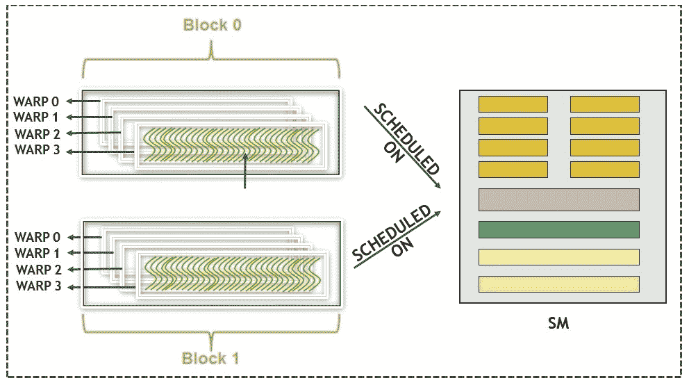

块和 warp 在 SM 和其核心上的调度更多地是与体系结构相关的，对于 Kepler、Pascal 和最新的 Volta 等不同的架构，情况会有所不同。目前，我们可以忽略调度的完整性。在所有可用的 warp 中，具有下一条指令所需操作数的 warp 变得可以执行。根据运行 CUDA 程序的 GPU 的调度策略，选择要执行的 warp。当被选择时，warp 中的所有线程执行相同的指令。CUDA 遵循**单指令，多线程**（**SIMT**）模型，也就是说，warp 中的所有线程在同一时间实例中获取和执行相同的指令。为了最大程度地利用全局内存的访问，访问应该合并。合并和未合并之间的区别如下：

+   **合并的全局内存访问：** 顺序内存访问是相邻的。

+   **未合并的全局内存访问：** 顺序内存访问不是相邻的。

以下图表更详细地展示了这种访问模式的示例。图表的左侧显示了合并访问，其中 warp 中的线程访问相邻数据，因此导致了一个 32 位宽的操作和 1 次缓存未命中。图表的右侧显示了一种情况，即 warp 内的线程访问是随机的，可能导致调用 32 次单个宽度的操作，因此可能有 32 次缓存未命中，这是最坏的情况：

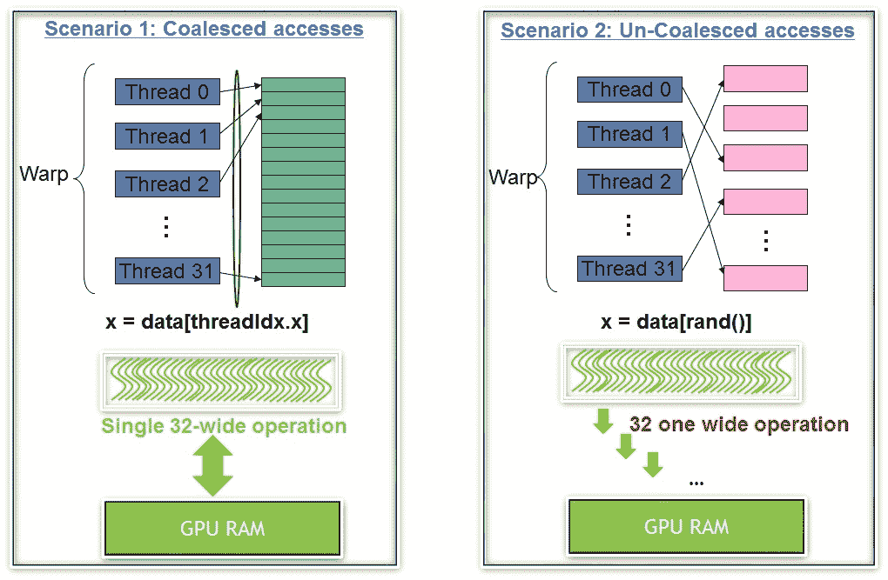

为了进一步理解这个概念，我们需要了解数据如何通过缓存行从全局内存到达。

**情况 1：** warp 请求 32 个对齐的、4 个连续的字节

地址落在 1 个缓存行内和一个 32 位宽的操作内。总线利用率为 100%，也就是说，我们利用从全局内存中获取的所有数据到缓存中，并没有浪费任何带宽。如下图所示：

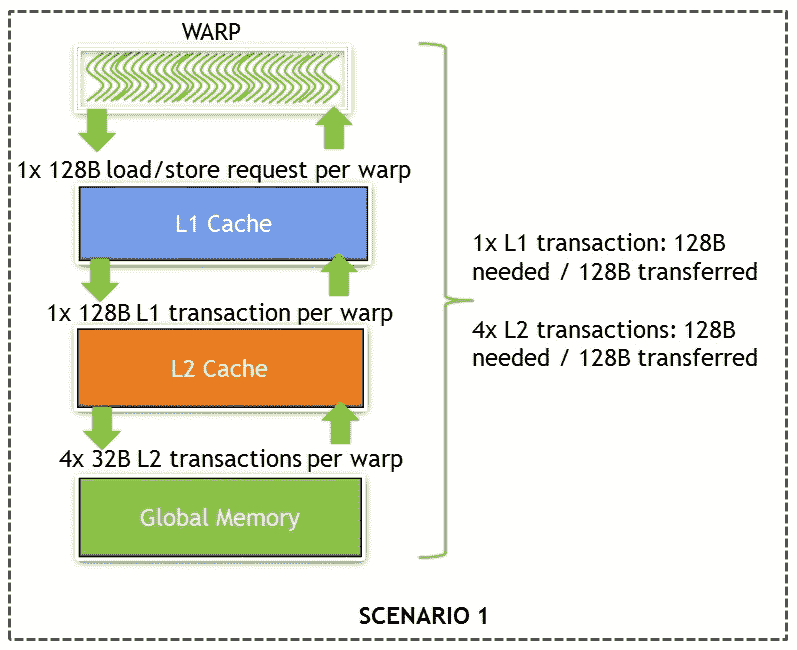

上图显示了合并的访问，导致了总线的最佳利用。

**情况 2：** warp 请求 32 个分散的 4 字节单词

虽然 warp 需要 128 字节，但在未命中时执行了 32 次单个宽度的获取，导致*32 * 128*字节在总线上移动。如下图所示，总线利用率实际上低于 1%：

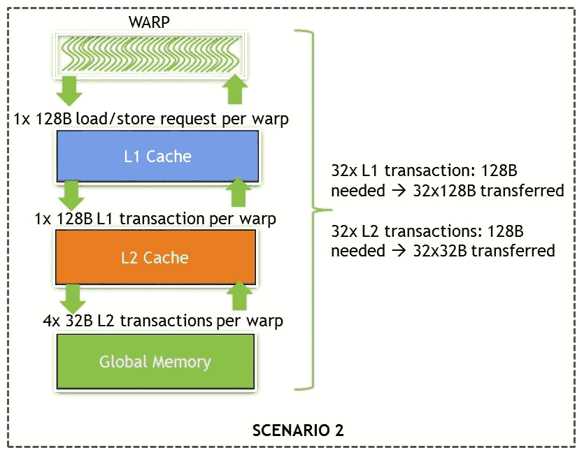

上图显示了未合并的访问，导致了总线带宽的浪费。

正如我们在前面的图表中看到的，warp 内的线程如何从全局内存中访问数据非常重要。为了最大程度地利用全局内存，改善合并是非常重要的。有多种可以使用的策略。其中一种策略是改变数据布局以改善局部性。让我们看一个例子。将滤波器应用于图像或将掩模应用于图像的计算机视觉算法需要将图像存储到数据结构中。当开发人员声明图像类型时，有两种选择。

以下代码片段使用`Coefficients_SOA`数据结构以数组格式存储数据。`Coefficients_SOA`结构存储与图像相关的数据，如 RGB、色调和饱和度值：

```cpp
//Data structure representing an image stored in Structure of Array Format
struct Coefficients_SOA {
 int r;
 int b;
 int g;
 int hue;
 int saturation;
 int maxVal;
 int minVal;
 int finalVal;
};
```

以下图表显示了关于`Coefficients_SOA`存储数据的数据布局，以及在内核中由不同线程访问数据的情况：

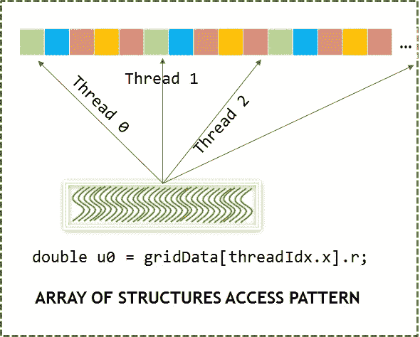

通过这样做，我们可以看到 AOS 数据结构的使用导致了不连续的全局内存访问。

同样的图像可以以数组结构格式存储，如下面的代码片段所示：

```cpp
//Data structure representing an image stored in Array of Structure Format
struct Coefficients_AOS {
 int* r;
 int* b;
 int* g;
 int* hue;
 int* saturation;
 int* maxVal;
 int* minVal;
 int* finalVal;
};
```

以下图表显示了关于`Coefficients_AOS`存储数据的数据布局，以及在内核中由不同线程访问数据的情况：

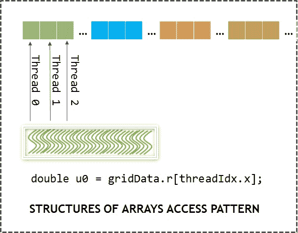

通过这样做，我们可以看到使用 SOA 数据结构导致了不连续的全局内存访问。

虽然 CPU 上的顺序代码更喜欢 AOS 以提高缓存效率，但在**单指令多线程**（**SIMT**）模型（如 CUDA）中，SOA 更受欢迎，以提高执行和内存效率。

让我们尝试通过使用分析器来分析这一方面。根据以下步骤配置你的环境：

1.  准备好你的 GPU 应用程序。例如，我们将使用两段代码来演示全局内存的有效使用。`aos_soa.cu`文件包含了使用 AOS 数据结构的朴素实现，而`aos_soa_solved.cu`则使用了 SOA 数据结构，可以有效地利用全局内存。这段代码可以在`02_memory_overview/02_aos_soa`中找到。

1.  使用`nvcc`编译器编译你的应用程序，然后使用`nvprof`编译器对其进行分析。以下命令是对此的一个`nvcc`命令的示例。然后我们使用`nvprof`命令对应用程序进行分析。还传递了`--analysis-metrics`标志，以便我们可以获得内核的指标。

1.  生成的分析文件，即`aos_soa.prof`和`aos_soa_solved.prof`，然后加载到 NVIDIA Visual Profiler 中。用户需要从“文件|打开”菜单中加载分析输出。此外，不要忘记在文件名选项中选择“所有文件”。

```cpp
$ nvcc -o aos_soa ./aos_soa.cu
$ nvcc -o aos_soa_solved ./aos_soa_solved.cu
$ nvprof --analysis-metrics --export-profile aos_soa.prof ./aos_soa
$ nvprof --analysis-metrics --export-profile aos_soa_solved.prof ./aos_soa_solved
```

以下是分析输出的屏幕截图。这是一个使用 AOS 数据结构的朴素实现：

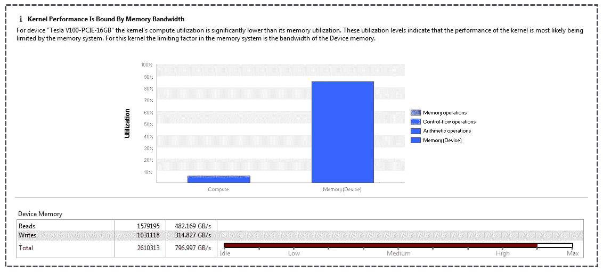

前面的图表显示了在引导分析模式下分析器的输出。

你将看到的第一件事是分析器明确指出应用程序受到内存限制。正如你所看到的，分析器不仅显示指标，还分析了这些指标的含义。在这个例子中，由于我们使用 AOS，分析器明确指出访问模式不高效。但编译器是如何得出这个结论的呢？让我们看一下下面的屏幕截图，它提供了更多的细节：

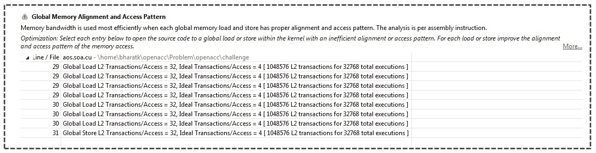

正如我们所看到的，它清楚地说明了访问数据的理想事务数为四，而实际运行时进行了 32 次事务/访问。

当我们将数据结构从 AOS 更改为 SOA 时，瓶颈得到了解决。当你运行`aos_soa_solved`可执行文件时，你会发现内核时间减少了，这对我们的计时来说是一个改进。在 V100 16 GB 卡上，时间从 104 微秒减少到 47 微秒，这是一个`2.2x`的加速因子。分析输出`aos_soa_solved.prof`将显示内核仍然受到内存限制，这是非常明显的，因为我们读写的内存数据比进行计算时要多。

# 内存吞吐量分析

对于应用程序开发人员来说，了解应用程序的内存吞吐量非常重要。这可以通过两种方式来定义：

+   **从应用程序的角度来看：** 计算应用程序请求的字节数

+   **从硬件的角度来看：** 计算硬件传输的字节数

这两个数字完全不同。其中许多原因包括未协调的访问导致未利用所有事务字节，共享内存银行冲突等。我们应该从内存角度使用两个方面来分析应用程序：

+   地址模式：在实际代码中确定访问模式是非常困难的，因此使用诸如性能分析器之类的工具变得非常重要。性能分析器显示的指标，如全局内存效率和每次访问的 L1/L2 事务，需要仔细观察。

+   **飞行中的并发访问数量：**由于 GPU 是一种隐藏延迟的架构，饱和内存带宽变得非常重要。但是确定并发访问的数量通常是不够的。此外，从硬件的角度来看，吞吐量与理论值相比要不同得多。

下图演示了每个 SM 中飞行的约 6KB 数据可以达到 Volta 架构峰值带宽的 90%。在以前的一代架构上进行相同的实验会得到不同的图表。一般来说，建议了解特定架构的 GPU 内存特性，以便从硬件中获得最佳性能：

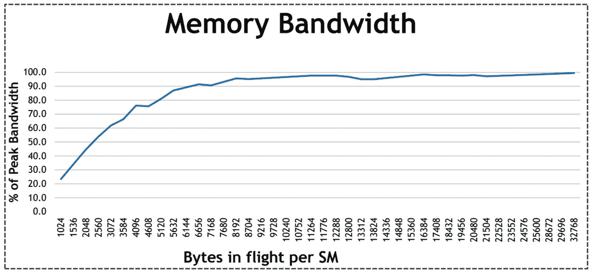

本节为我们提供了全局内存的示例用法以及如何以最佳方式利用它。有时，全局内存的协调数据访问很困难（例如，在 CFD 领域，对于非结构化网格，相邻单元格的数据可能不会相邻存储在内存中）。为了解决这样的问题或减少对性能的影响，我们需要利用另一种形式的内存，称为共享内存。

# 共享内存

共享内存一直在 CUDA 内存层次结构中扮演着重要角色，被称为**用户管理的缓存**。这为用户提供了一种机制，可以以协调的方式从全局内存中读取/写入数据并将其存储在内存中，这类似于缓存但可以由用户控制。在本节中，我们不仅将介绍利用共享内存的步骤，还将讨论如何有效地从共享内存中加载/存储数据以及它在银行中的内部排列。共享内存只对同一块中的线程可见。块中的所有线程看到共享变量的相同版本。

共享内存具有类似于 CPU 缓存的好处；然而，CPU 缓存无法明确管理，而共享内存可以。共享内存的延迟比全局内存低一个数量级，带宽比全局内存高一个数量级。但共享内存的关键用途来自于块内线程可以共享内存访问。CUDA 程序员可以使用共享变量来保存在内核执行阶段中多次重复使用的数据。此外，由于同一块内的线程可以共享结果，这有助于避免冗余计算。直到 9.0 版本，CUDA Toolkit 没有提供可靠的通信机制来在不同块的线程之间进行通信。我们将在后续章节中更详细地介绍 CUDA 9.0 通信机制。目前，我们将假设在 CUDA 中只能通过使用共享内存来实现线程之间的通信。

# 共享内存上的矩阵转置

用于演示共享内存的最原始的例子之一是矩阵转置。矩阵转置是一个内存绑定的操作。以下代码片段使用`matrix_transpose_naive`内核，展示了矩阵转置内核的示例实现：

```cpp
__global__ void matrix_transpose_naive(int *input, int *output) {
     int indexX = threadIdx.x + blockIdx.x * blockDim.x;
     int indexY = threadIdx.y + blockIdx.y * blockDim.y;
     int index = indexY * N + indexX;
     int transposedIndex = indexX * N + indexY;
     output[index] = input[transposedIndex];
}
```

上述代码展示了使用全局内存的矩阵转置的朴素实现。如果以朴素的方式实现，这将导致在读取矩阵或写入矩阵时出现未协调的访问。在 V100 PCIe 16 GB 卡上，内核的执行时间约为 60 微秒。

根据以下步骤配置您的环境：

1.  准备您的 GPU 应用程序。此代码可以在`02_memory_overview/02_matrix_transpose`中找到。

1.  使用`nvcc`编译器编译您的应用程序，然后使用`nvprof`编译器对其进行分析。以下命令是对此的`nvcc`命令的一个示例。然后，我们使用`nvprof`命令对应用程序进行分析。还传递了`--analysis-metrics`标志以获取内核的指标。

1.  生成的配置文件，即`matrix_transpose.prof`，然后加载到 NVIDIA Visual Profiler 中。用户需要从“文件|打开”菜单中加载分析输出。还要记得选择“所有文件”作为文件名选项的一部分：

```cpp
$ nvcc -o matrix_transpose ./matrix_transpose.cu
$ nvcc -o conflict_solved ./conflict_solved.cu
$ nvprof --analysis-metrics --export-profile matrix_transpose.prof ./matrix_transpose
$ nvprof --analysis-metrics --export-profile conflict_solved.prof ./conflict_solved
```

以下截图显示了性能分析的输出。输出清楚地表明对全局内存的访问是未协调的，这是需要解决的关键指标，以便我们可以提高性能：

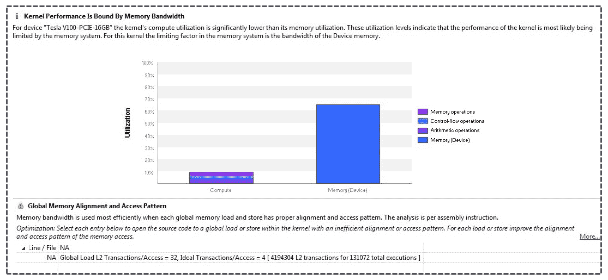

解决这个问题的一种方法是利用高带宽和低延迟的内存，比如共享内存。这里的诀窍是以协调的方式从全局内存读取和写入。在这里，对共享内存的读取或写入可以是未协调的模式。使用共享内存会带来更好的性能，时间缩短到 21 微秒，这是 3 倍的加速时间：

```cpp
__global__ void matrix_transpose_shared(int *input, int *output) {

    __shared__ int sharedMemory [BLOCK_SIZE] [BLOCK_SIZE];

    //global index
     int indexX = threadIdx.x + blockIdx.x * blockDim.x;
     int indexY = threadIdx.y + blockIdx.y * blockDim.y;

    //transposed global memory index
     int tindexX = threadIdx.x + blockIdx.y * blockDim.x;
     int tindexY = threadIdx.y + blockIdx.x * blockDim.y;

    //local index
     int localIndexX = threadIdx.x;
     int localIndexY = threadIdx.y;
     int index = indexY * N + indexX;
     int transposedIndex = tindexY * N + tindexX;

    //transposed the matrix in shared memory. 
    // Global memory is read in coalesced fashion
     sharedMemory[localIndexX][localIndexY] = input[index];
     __syncthreads();

    //output written in global memory in coalesed fashion.
     output[transposedIndex] = sharedMemory[localIndexY][localIndexX];
}
```

上述代码片段显示了使用共享内存的矩阵转置的实现。全局内存读取/写入是协调的，而转置发生在共享内存中。

# 银行冲突及其对共享内存的影响

与使用全局内存相比的良好加速并不一定意味着我们有效地使用了共享内存。如果我们转换从引导分析到未引导分析的分析器输出，即`matrix_transpose.prof`，我们将看到共享内存访问模式显示出对齐问题，如下截图所示：

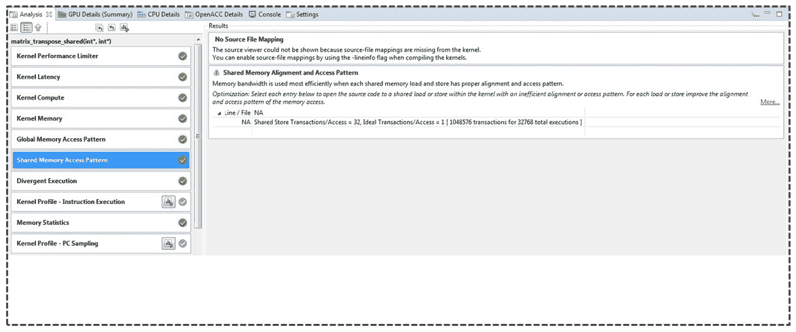

我们可以看到分析器显示了共享内存的非最佳使用，这是银行冲突的一个迹象。

为了有效地理解这个对齐问题，重要的是要理解*bank*的概念。共享内存被组织成 bank 以实现更高的带宽。每个 bank 可以在一个周期内服务一个地址。内存可以为它有的 bank 提供多个同时访问。Volta GPU 有 32 个 bank，每个 bank 宽度为 4 字节。当一个数组存储在共享内存中时，相邻的 4 字节单词会进入连续的 bank，如下图所示：

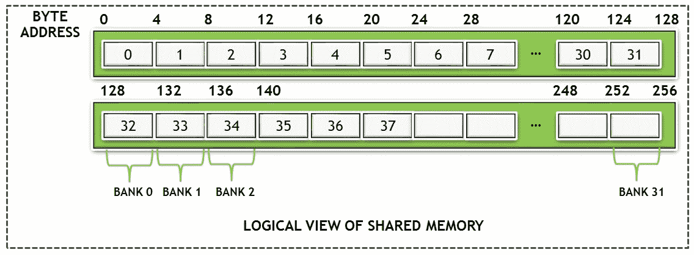

上述图中的逻辑视图显示了数据在共享内存中的存储方式。

warp 内的线程对 bank 的多个同时访问会导致 bank 冲突。换句话说，当 warp 内的两个或多个线程访问同一个 bank 中的不同 4 字节单词时，就会发生 bank 冲突。从逻辑上讲，这是当两个或多个线程访问同一个 bank 中的不同*行*时。以下图示例展示了不同*n*-way bank 冲突的例子。最坏的情况是 32-way 冲突 | 31 次重播 - 每次重播都会增加一些延迟：

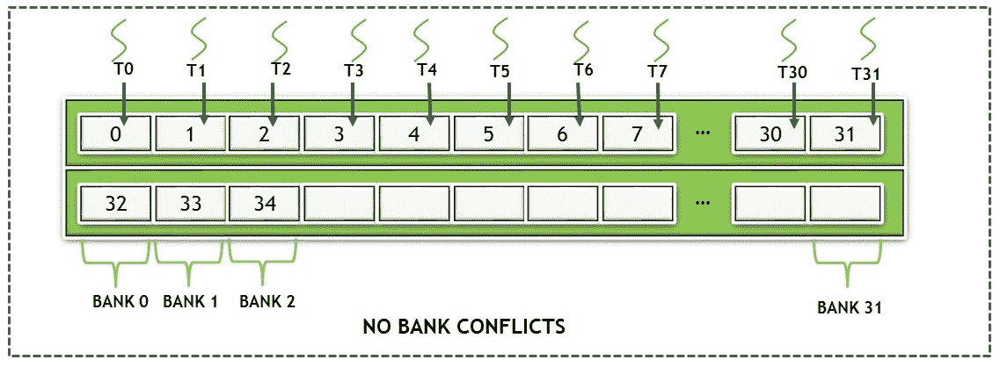

上述情景显示了来自同一个 warp 的线程访问驻留在不同 bank 中的相邻 4 字节元素，导致没有 bank 冲突。看一下下图：

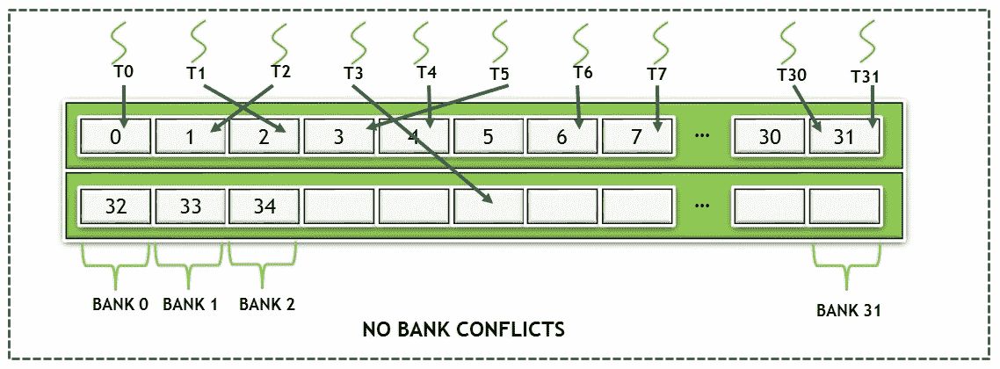

这是另一个没有银行冲突的场景，同一 warp 的线程访问随机的 4 字节元素，这些元素位于不同的银行中，因此没有银行冲突。由于共享内存中的 2 路银行冲突，顺序访问如下图所示：

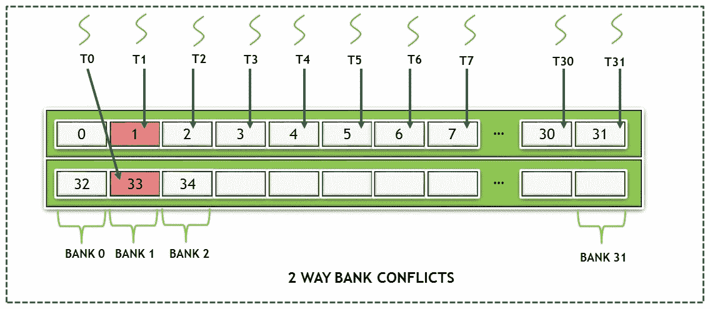

前面的图表显示了一个场景，其中来自同一 warp 的线程 T0 和 T1 访问同一银行中的 4 字节元素，因此导致了 2 路银行冲突。

在前面的矩阵转置示例中，我们利用了共享内存来获得更好的性能。然而，我们可以看到 32 路银行冲突。为了解决这个问题，可以使用一种称为填充的简单技术。所有这些都是在共享内存中填充一个虚拟的，即一个额外的列，这样线程就可以访问不同的银行，从而获得更好的性能：

```cpp
__global__ void matrix_transpose_shared(int *input, int *output) {

     __shared__ int sharedMemory [BLOCK_SIZE] [BLOCK_SIZE + 1];

    //global index
     int indexX = threadIdx.x + blockIdx.x * blockDim.x;
     int indexY = threadIdx.y + blockIdx.y * blockDim.y;

    //transposed index
     int tindexX = threadIdx.x + blockIdx.y * blockDim.x;
     int tindexY = threadIdx.y + blockIdx.x * blockDim.y;
     int localIndexX = threadIdx.x;
     int localIndexY = threadIdx.y;
     int index = indexY * N + indexX;
     int transposedIndex = tindexY * N + tindexX;

    //reading from global memory in coalesed manner 
    // and performing tanspose in shared memory
     sharedMemory[localIndexX][localIndexY] = input[index];

    __syncthreads();

    //writing into global memory in coalesed fashion 
    // via transposed data in shared memory
     output[transposedIndex] = sharedMemory[localIndexY][localIndexX];
}
```

前面的代码片段中，我们使用了`matrix_transpose_shared`内核，展示了填充的概念，这样可以消除银行冲突，从而更好地利用共享内存带宽。像往常一样，运行代码并借助可视化分析器验证这种行为。通过这些更改，您应该看到内核的时间减少到 13 微秒，这进一步提高了 60%的速度。

在本节中，我们看到了如何最大限度地利用共享内存，它提供了读写访问作为一个临时存储器。但有时，数据只是只读输入，不需要写访问。在这种情况下，GPU 提供了一种称为**纹理**内存的最佳内存。我们将在下一章中详细介绍这一点，以及它为开发人员提供的其他优势。我们将在下一节中介绍只读数据。

# 只读数据/缓存

根据内存名称，只读缓存适合存储只读数据，并且在内核执行过程中不会发生更改。该缓存针对此目的进行了优化，并且根据 GPU 架构，释放并减少了其他缓存的负载，从而提高了性能。在本节中，我们将详细介绍如何利用只读缓存，以及如何使用图像处理代码示例进行图像调整。

GPU 中的所有线程都可以看到只读数据。对于 GPU 来说，这些数据被标记为只读，这意味着对这些数据的任何更改都会导致内核中的未指定行为。另一方面，CPU 对这些数据具有读写访问权限。

传统上，这个缓存也被称为纹理缓存。虽然用户可以显式调用纹理 API 来利用只读缓存，但是在最新的 GPU 架构中，开发人员可以在不显式使用 CUDA 纹理 API 的情况下利用这个缓存。使用最新的 CUDA 版本和像 Volta 这样的 GPU，标记为`const __restrict__`的内核指针参数被视为只读数据，通过只读缓存数据路径传输。开发人员还可以通过`__ldg`内在函数强制加载这个缓存。

只读数据在算法要求整个 warp 读取相同地址/数据时理想地使用，这主要导致每个时钟周期对所有请求数据的线程进行广播。纹理缓存针对 2D 和 3D 局部性进行了优化。随着线程成为同一 warp 的一部分，从具有 2D 和 3D 局部性的纹理地址读取数据往往会获得更好的性能。纹理在要求随机内存访问的应用程序中已被证明是有用的，特别是在 Volta 架构之前的显卡中。

纹理支持双线性和三线性插值，这对于图像处理算法如缩放图像特别有用。

下图显示了一个 warp 内的线程访问空间位置在 2D 空间中的元素的示例。纹理适用于这类工作负载：

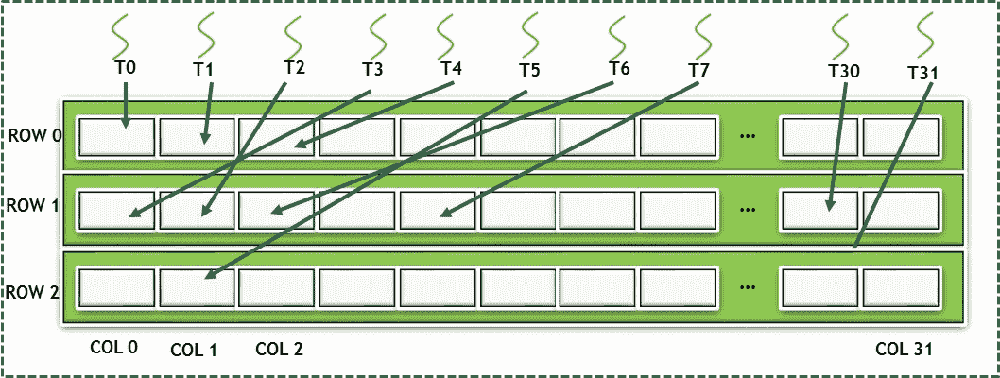

现在，让我们看一个关于缩放的小型实际算法，以演示纹理内存的使用。

# 计算机视觉-使用纹理内存进行图像缩放

我们将使用图像缩放作为示例来演示纹理内存的使用。图像缩放的示例如下截图所示：


图像缩放需要在 2 维中插值图像像素。纹理提供了这两个功能（插值和对 2D 局部性的高效访问），如果直接通过全局内存访问，将导致内存访问不连续。

根据以下步骤配置您的环境：

1.  准备您的 GPU 应用程序。此代码可以在`02_memory_overview/03_image_scaling`中找到。

1.  使用`nvcc`编译器编译您的应用程序，使用以下命令：

```cpp
$nvcc -c scrImagePgmPpmPackage.cpp 
$nvcc -c image_scaling.cu
$nvcc -o image_scaling image_scaling.o scrImagePgmPpmPackage.o
```

`scrImagePgmPpmPackage.cpp`文件包含了读取和写入`.pgm`扩展名图像的源代码。纹理代码位于`image_scaling.cu`中。

用户可以使用 IrfanView（[`www.irfanview.com/main_download_engl.htm`](https://www.irfanview.com/main_download_engl.htm)）等查看器来查看`pgm`文件，这些查看器是免费使用的。

主要有四个步骤是必需的，以便我们可以使用纹理内存：

1.  声明纹理内存。

1.  将纹理内存绑定到纹理引用。

1.  在 CUDA 内核中使用纹理引用读取纹理内存。

1.  从纹理引用中解绑纹理内存。

以下代码片段显示了我们可以使用的四个步骤来使用纹理内存。从 Kepler GPU 架构和 CUDA 5.0 开始，引入了一项名为无绑定纹理的新功能。这暴露了纹理对象，它基本上是一个可以传递给 CUDA 内核的 C++对象。它们被称为无绑定，因为它们不需要手动绑定/解绑，这是早期 GPU 和 CUDA 版本的情况。纹理对象使用`cudaTextureObject_t`类 API 声明。现在让我们通过这些步骤：

1.  首先，声明纹理内存：

```cpp
texture<unsigned char, 2, cudaReadModeElementType> tex;
```

创建一个通道描述，我们在链接到纹理时将使用：

```cpp
cudaArray* cu_array;
cudaChannelFormatKind kind = cudaChannelFormatKindUnsigned;
cudaChannelFormatDesc channelDesc = cudaCreateChannelDesc(8, 0, 0, 0, kind);
```

1.  然后，指定纹理对象参数：

```cpp
struct cudaTextureDesc texDesc;
memset(&texDesc, 0, sizeof(texDesc)); 
//set the memory to zero
texDesc.addressMode[0] = cudaAddressModeClamp; 
// setting the x dimension addressmode to Clamp
texDesc.addressMode[1] = cudaAddressModeClamp; 
//Setting y dimension addressmode to Clamp
texDesc.filterMode = cudaFilterModePoint; 
// Filter mode set to Point
texDesc.readMode = cudaReadModeElementType; 
// Reading element type and not interpolated
texDesc.normalizedCoords = 0;
```

1.  接下来，在 CUDA 内核中从纹理引用中读取纹理内存：

```cpp
imageScaledData[index] = tex2D<unsigned char>(texObj,(float)(tidX*scale_factor),(float)(tidY*scale_factor));
```

1.  最后，销毁纹理对象：

```cpp
cudaDestroyTextureObject(texObj);
```

纹理内存的重要方面，它们像配置一样由开发人员设置，如下所示：

+   **纹理维度：**这定义了纹理是作为 1D、2D 还是 3D 数组寻址。纹理中的元素也称为纹素。深度、宽度和高度也被设置以定义每个维度。请注意，每个 GPU 架构都定义了可接受的每个维度的最大尺寸。

+   **纹理类型：**这定义了基本整数或浮点纹素的大小。

+   **纹理读取模式：**纹理的读取模式定义了元素的读取方式。它们可以以`NormalizedFloat`或`ModeElement`格式读取。标准化浮点模式期望在[0.0 1.0]和[-1.0 1.0]范围内的索引，对于无符号整数和有符号整数类型。

+   **纹理寻址模式：**纹理的一个独特特性是它如何寻址超出范围的访问。这听起来可能很不寻常，但实际上在许多图像算法中非常常见。例如，如果您正在通过平均相邻像素来应用插值，那么边界像素的行为应该是什么？纹理为开发人员提供了这个选项，以便他们可以选择将超出范围视为夹紧、包裹或镜像。在调整大小的示例中，我们已将其设置为夹紧模式，这基本上意味着超出范围的访问被夹紧到边界。

+   **纹理过滤模式：**设置模式定义在获取纹理时如何计算返回值。支持两种类型的过滤模式：`cudaFilterModePoint`和`cudaFilterModeLinear`。当设置为线性模式时，可以进行插值（1D 的简单线性，2D 的双线性和 3D 的三线性）。仅当返回类型为浮点类型时，线性模式才有效。另一方面，`ModePoint`不执行插值，而是返回最近坐标的纹素。

在本节中引入纹理内存的关键目的是为您提供其用法的示例，并向您展示纹理内存的有用之处。它提供了不同配置参数的良好概述。有关更多信息，请参阅 CUDA API 指南（[`docs.nvidia.com/cuda/cuda-runtime-api/index.html`](https://docs.nvidia.com/cuda/cuda-runtime-api/index.html)）。

在本节中，我们通过示例描述了使用纹理内存的目的。在下一节中，我们将研究 GPU 内存中最快（最低延迟）的可用内存（寄存器）。与 CPU 相比，GPU 中富裕地存在这种内存。

# GPU 中的寄存器

CPU 和 GPU 架构之间的一个基本区别是 GPU 中寄存器的丰富性相对于 CPU。这有助于线程将大部分数据保存在寄存器中，从而减少上下文切换的延迟。因此，使这种内存达到最佳状态也很重要。

寄存器的范围是单个线程。在 GRID 中为所有启动的线程创建变量的私有副本。每个线程都可以访问其变量的私有副本，而其他线程的私有变量则无法访问。例如，如果使用 1,000 个线程启动内核，那么作为线程范围的变量将获得其自己的变量副本。

作为内核的一部分声明的局部变量存储在寄存器中。中间值也存储在寄存器中。每个 SM 都有一组固定的寄存器。在编译期间，编译器（`nvcc`）尝试找到每个线程的最佳寄存器数量。如果寄存器数量不足，通常发生在 CUDA 内核较大且具有许多局部变量和中间计算时，数据将被推送到本地内存，该内存可以位于 L1/L2 缓存中，甚至更低的内存层次结构中，例如全局内存。这也被称为寄存器溢出。每个线程的寄存器数量在 SM 上可以激活多少个块和线程方面起着重要作用。这个概念在下一章中有详细介绍，该章节专门讨论了占用率。一般来说，建议不要声明大量不必要的局部变量。如果寄存器限制了可以在 SM 上调度的线程数量，那么开发人员应该考虑通过将内核拆分为两个或更多个（如果可能）来重新构建代码。

作为`vecAdd`内核的一部分声明的变量存储在寄存器内存中。传递给内核的参数，即`A`、`B`和`C`，指向全局内存，但变量本身存储在基于 GPU 架构的共享内存或寄存器中。以下图显示了 CUDA 内存层次结构和不同变量类型的默认位置：

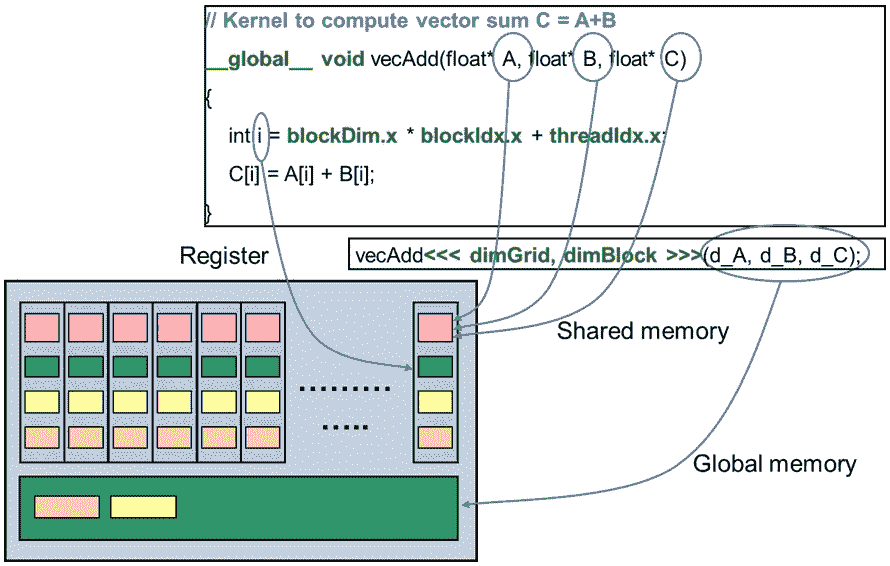

到目前为止，我们已经看到了关键内存层次结构（全局、纹理、共享和寄存器）的目的和最佳用法。在下一节中，我们将看一些可以提高应用程序性能并增加开发人员在编写 CUDA 程序时的生产力的 GPU 内存的优化和特性。

# 固定内存

现在是时候回想一下数据的路径，即从 CPU 内存到 GPU 寄存器，最终由 GPU 核心用于计算。尽管 GPU 具有更高的计算性能和更高的内存带宽，但由于 CPU 内存和 GPU 内存之间的传输，应用程序获得的加速效果可能会变得规范化。数据传输是通过总线/链接/协议进行的，例如 PCIe（对于英特尔和 AMD 等 CPU 架构）或 NVLink（对于 OpenPower Foundation 的`power`等 CPU 架构）。

为了克服这些瓶颈，建议采用以下技巧/指南：

+   首先，建议在可能的情况下尽量减少主机和设备之间传输的数据量。这甚至可能意味着将顺序代码的一部分作为 GPU 上的内核运行，与在主机 CPU 上顺序运行相比，几乎没有或没有加速。

+   其次，通过利用固定内存，重要的是在主机和设备之间实现更高的带宽。

+   建议将小的传输批量成一个大的传输。这有助于减少调用数据传输 CUDA API 所涉及的延迟，根据系统配置，这可能从几微秒到几毫秒不等。

+   最后，应用程序可以利用异步数据传输来重叠内核执行和数据传输。

我们将在本节中更详细地介绍固定内存传输。异步传输将在第四章中更详细地介绍，*内核执行模型和优化策略*，在那里我们将使用一个称为 CUDA 流的概念。

# 带宽测试-固定与分页

默认情况下，称为`malloc()`的内存分配 API 分配的是可分页的内存类型。这意味着，如果需要，作为页面映射的内存可以被其他应用程序或操作系统本身交换出去。因此，大多数设备，包括 GPU 和其他设备（如 InfiniBand 等），也位于 PCIe 总线上，都希望在传输之前将内存固定。默认情况下，GPU 将不访问可分页内存。因此，当调用内存传输时，CUDA 驱动程序会分配临时固定内存，将数据从默认可分页内存复制到此临时固定内存，然后通过**设备内存控制器**（**DMA**）将其传输到设备。

这个额外的步骤不仅会增加延迟，还有可能会将请求的页面传输到已经被交换并需要重新传输到 GPU 内存的 GPU 内存。

为了了解使用固定内存的影响，让我们尝试编译和运行一段示例代码。这已作为 CUDA 示例的一部分提供。根据以下步骤配置您的环境：

1.  准备您的 GPU 应用程序。此代码位于`<CUDA_SAMPLES_DIR>/1_Utilities/bandwidthTest`中。

1.  使用`make`命令编译您的应用程序。

1.  以`分页`和`固定`两种模式运行可执行文件，如下所示：

```cpp
$make
$./bandwidthTest --mode=shmoo --csv --memory=pageable > pageable.csv
$./bandwidthTest --mode=shmoo --csv --memory=pinned >  pinned.csv
```

注意，`CUDA_SAMPLES_DIR`是 CUDA 安装所在目录的路径。

正如我们所看到的，与之前的代码相比，关键的变化是我们迄今为止编写的是数据分配 API。以下代码片段显示了使用`cudaMallocHost` API 而不是`malloc`来分配内存：

```cpp
cudaError_t status = cudaMallocHost((void**)&h_aPinned, bytes);
if (status != cudaSuccess)
 printf("Error allocating pinned host memory\n");
```

`cudaMallocHost` API 使内存成为固定内存而不是分页内存。虽然分配 API 已更改，但我们仍然可以使用相同的数据传输 API，即`cudaMemcpy()`。现在，重要的问题是，*固定内存是什么，为什么它提供更好的带宽？*我们将在下一节中介绍这个问题。

性能的影响可以从带宽测试的输出中看出。我们已经将结果绘制成图表，以便您可以轻松理解影响。*x*轴显示了以 KB 为单位传输的数据，而*y*轴显示了以 MB/sec 为单位的实现带宽。

第一个图是**主机到设备**的传输，而第二个图是**设备到主机**的传输。您将看到的第一件事是可实现的最大带宽约为 12 GB/sec。PCIe Gen3 的理论带宽为 16 GB/sec，但实际可实现的范围在 12 GB/sec 左右。可实现的带宽高度取决于系统（主板、CPU、PCIe 拓扑等）：

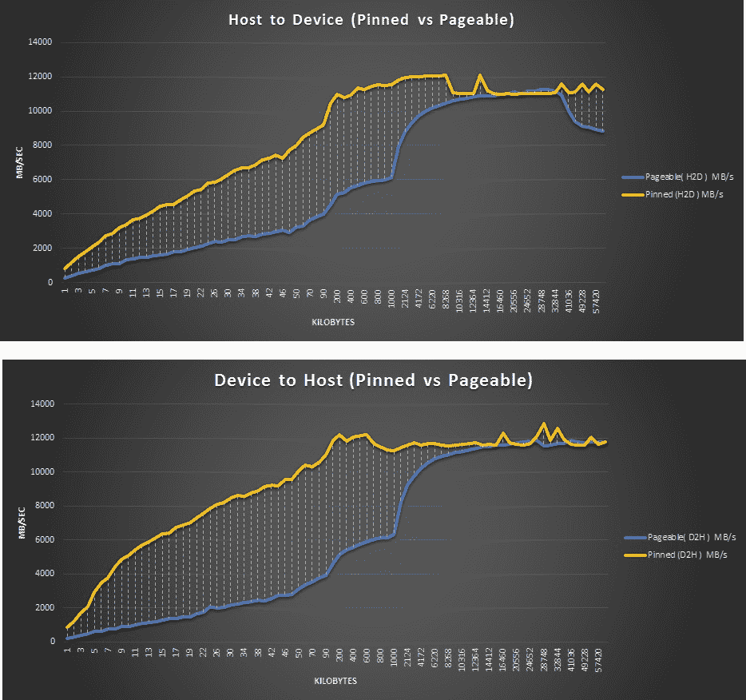

如您所见，对于固定内存，在较小的传输大小时带宽始终更高，而在可分页内存中，随着数据大小的增加，带宽变得相等，因为驱动程序和 DMA 引擎开始通过应用诸如重叠的概念来优化传输。尽管建议使用固定内存，但过度使用也有缺点。为应用程序分配整个系统内存作为固定内存可能会降低整体系统性能。这是因为它会占用其他应用程序和操作系统任务可用的页面。应该固定的正确大小非常依赖于应用程序和系统，并且没有通用的公式可用。我们能做的最好的事情是在可用系统上测试应用程序并选择最佳的性能参数。

此外，重要的是要了解新的互连技术，如 NVLink，为受这些数据传输限制的应用程序提供了更高的带宽和更低的延迟。目前，CPU 和 GPU 之间的 NVLink 仅与 Power CPU 一起提供。

在本节中，我们将看看如何提高 CPU 和 GPU 之间的数据传输速度。现在我们将继续利用 CUDA 的一个新特性，称为统一内存，这有助于提高编写 CUDA 程序的开发人员的生产力。

# 统一内存

随着每一次新的 CUDA 和 GPU 架构发布，都会添加新的功能。这些新功能提供了更高的性能和更便捷的编程，或者允许开发人员实现新的算法，否则无法使用 CUDA 在 GPU 上进行移植。从 CUDA 6.0 开始发布的一个重要功能是统一内存，从 Kepler GPU 架构开始实现。在本章中，我们将统一内存称为 UM。

以更简单的话来说，UM 为用户提供了一个单一内存空间的视图，所有 GPU 和 CPU 都可以访问该空间。下图对此进行了说明：

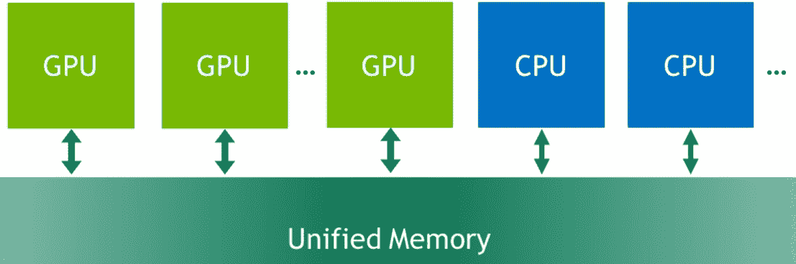

在本节中，我们将介绍如何使用 UM，优化它，并突出利用它的关键优势。与全局内存访问一样，如果以不连续的方式进行，会导致性能不佳，如果未正确使用 UM 功能，也会导致应用程序整体性能下降。我们将采取逐步的方法，从一个简单的程序开始，并在此基础上构建，以便我们可以理解 UM 及其对性能的影响。

让我们尝试编译和运行一些示例代码。根据以下步骤配置您的环境：

1.  准备您的 GPU 应用程序。此代码可以在`02_memory_overview/unified_memory`中找到。

1.  使用以下`nvcc`命令编译您的应用程序：

```cpp
$nvcc -o unified_simple.out unified_memory.cu
$nvcc -o unified_initialized.out unified_memory_initialized.cu
$nvcc -o unified_prefetch.out unified_memory_prefetch.cu
$nvcc -o unified_64align.out unified_memory_64align.cu
```

请注意，本节中显示的结果是针对 Tesla P100 卡的。当在其他架构（如 Kepler）上运行相同的代码时，预计会产生不同的结果。本节的重点是最新的架构，如 Pascal 和 Volta。

# 了解统一内存页面分配和传输

让我们从 UM 的朴素实现开始。代码的第一部分`unified_memory.cu`演示了这个概念的基本用法。代码中的关键更改是使用`cudaMallocManaged()`API 来分配内存，而不是使用`malloc`，如下面的代码片段所示：

```cpp
float *x, *y;
int size = N * sizeof(float);
...
cudaMallocManaged(&x, size);
cudaMallocManaged(&y, size);
...

 for (int ix = 0; ix < N; ix++) {
    x[ix] = rand()%10;
    y[ix] = rand()%20;
  }
...

 add<<<numBlocks, blockSize>>>(x, y, N);
```

如果我们仔细查看源代码，我们会发现`x`和`y`变量只被分配一次并指向统一内存。同一个指针被发送到 GPU 的`add<<<>>>()`内核，并且在 CPU 中使用`for`循环进行初始化。这对程序员来说非常简单，因为他们不需要跟踪指针是指向 CPU 内存还是 GPU 内存。但这是否意味着我们能获得良好的性能或传输速度呢？不一定，所以让我们尝试通过对这段代码进行性能分析来深入了解，如下面的屏幕截图所示：

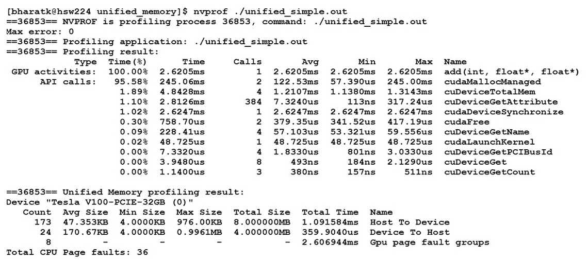

我们使用以下命令来获取性能分析输出：

```cpp
$ nvprof ./unified_simple.out
```

正如预期的那样，大部分时间都花在了`add<<<>>>`内核上。让我们尝试理论计算带宽。我们将使用以下公式来计算带宽：

*带宽 = 字节/秒 = (3 * 4,194,304 字节 * 1e-9 字节/GB) / 2.6205e-3 秒 = 5 GB/s*

如您所见，P100 提供了 720 GB/s 的理论带宽，而我们只能实现 5 GB/s，这实在是太差了。您可能想知道为什么我们只计算内存带宽。这是因为应用程序受内存限制，因为它完成了三次内存操作和仅一次加法。因此，只集中在这个方面是有意义的。

从 Pascal 卡开始，`cudaMallocManaged()`不再分配物理内存，而是基于首次触摸的基础上分配内存。如果 GPU 首次触摸变量，页面将被分配并映射到 GPU 页表；否则，如果 CPU 首次触摸变量，它将被分配并映射到 CPU。在我们的代码中，`x`和`y`变量在 CPU 中用于初始化。因此，页面被分配给 CPU。在`add<<<>>>`内核中，当访问这些变量时，会发生页面错误，并且页面迁移的时间被添加到内核时间中。这是内核时间高的根本原因。现在，让我们深入了解页面迁移的步骤。

页面迁移中完成的操作顺序如下：

1.  首先，我们需要在 GPU 和 CPU 上分配新页面（首次触摸）。如果页面不存在并且映射到另一个页面，会发生设备页表页错误。当在 GPU 中访问当前映射到 CPU 内存的**page 2**中的**x**时，会发生页面错误。请看下图：

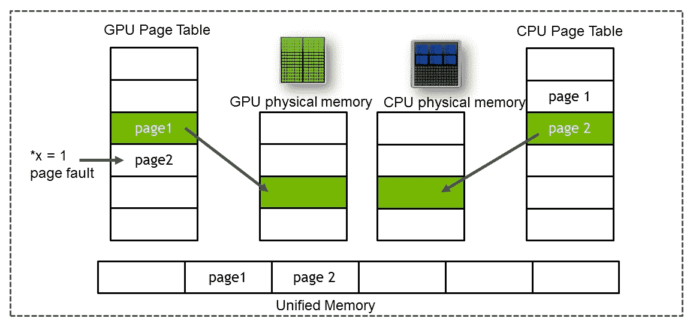

1.  接下来，CPU 上的旧页面被取消映射，如下图所示：

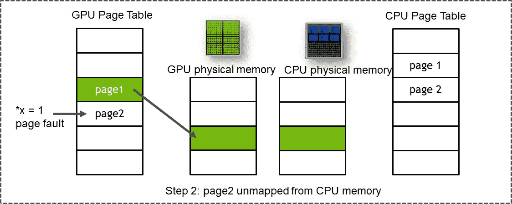

1.  接下来，数据从 CPU 复制到 GPU，如下图所示：

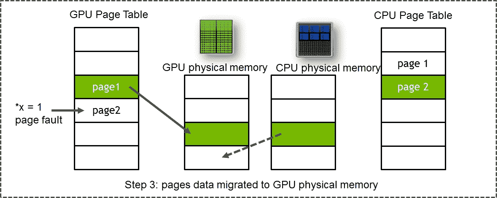

1.  最后，新页面在 GPU 上映射，旧页面在 CPU 上释放，如下图所示：

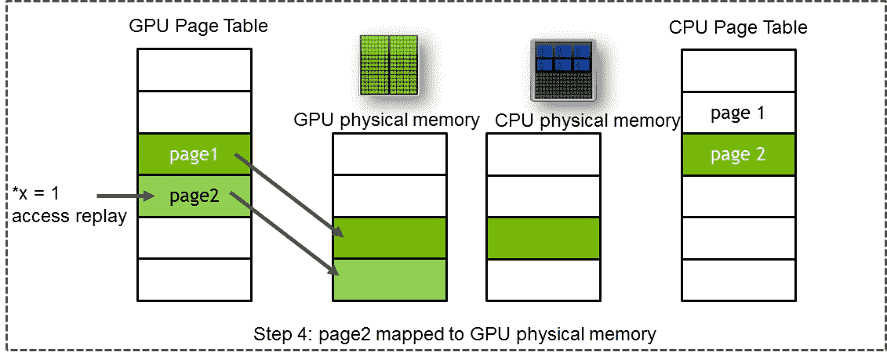

GPU 中的**转换后备缓冲器**（**TLB**）与 CPU 中的类似，执行从物理地址到虚拟地址的地址转换。当发生页面错误时，相应 SM 的 TLB 被锁定。这基本上意味着新指令将被暂停，直到执行前面的步骤并最终解锁 TLB。这是为了保持一致性并在 SM 内维护内存视图的一致状态。驱动程序负责删除这些重复项，更新映射并传输页面数据。正如我们之前提到的，所有这些时间都被添加到总体内核时间中。

所以，我们现在知道问题所在。但解决方案是什么呢？为了解决这个问题，我们将采用两种方法：

+   首先，我们将在 GPU 上创建一个初始化内核，以便在`add<<<>>>`内核运行期间没有页面错误。然后，我们将通过利用每页的 warp 概念来优化页面错误。

+   我们将预取数据。

我们将在接下来的部分中介绍这些方法。

# 使用每页 warp 优化统一内存

让我们从第一种方法开始，即初始化内核。如果你看一下`unified_memory_initialized.cu`文件中的源代码，我们在那里添加了一个名为`init<<<>>>`的新内核，如下所示：

```cpp
__global__ void init(int n, float *x, float *y) {
 int index = threadIdx.x + blockIdx.x * blockDim.x;
 int stride = blockDim.x * gridDim.x;
 for (int i = index; i < n; i += stride) {
   x[i] = 1.0f;
   y[i] = 2.0f;
  }
}
```

通过在 GPU 本身添加一个初始化数组的内核，页面在`init<<<>>>`内核中首次被触摸时被分配和映射到 GPU 内存。让我们来看看这段代码的性能分析结果输出，其中显示了初始化内核的性能分析输出：

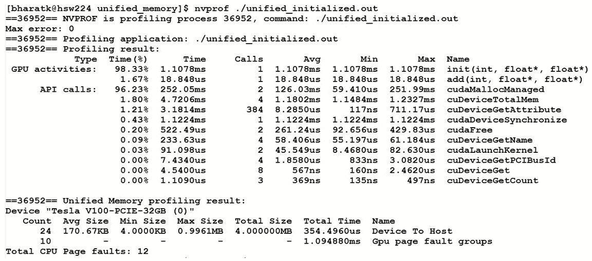

我们使用以下命令获取了性能分析输出

```cpp
nvprof ./unified_initialized.out
```

正如你所看到的，`add<<<>>>`内核的时间减少到了 18 微秒。这有效地给了我们以下内核带宽：

*带宽 = 字节/秒 = (3 * 4,194,304 字节 * 1e-9 字节/GB) / 18.84e-6 秒 = 670 GB/s*

这个带宽是你在非统一内存场景中所期望的。正如我们从前面截图中的天真实现中所看到的，性能分析输出中没有主机到设备的行。然而，你可能已经注意到，即使`add<<<>>>`内核的时间已经减少，`init<<<>>>`内核也没有成为占用最长时间的热点。这是因为我们在`init<<<>>>`内核中首次触摸内存。此外，你可能想知道这些 GPU 错误组是什么。正如我们之前讨论的，个别页面错误可能会根据启发式规则和访问模式进行分组，以提高带宽。为了进一步深入了解这一点，让我们使用`--print-gpu-trace`重新对代码进行分析，以便我们可以看到个别页面错误。正如你从以下截图中所看到的，GPU 跟踪显示了错误的整体跟踪和发生错误的虚拟地址：

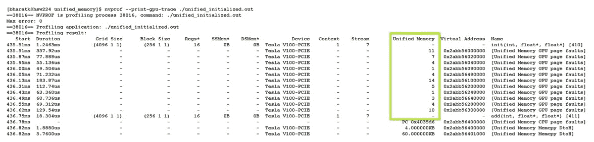

我们使用以下命令获取了性能分析输出：

```cpp
$ nvprof --print-gpu-trace ./unified_initialized.out
```

第二行显示了相同页面的 11 个页面错误。正如我们之前讨论的，驱动程序的作用是过滤这些重复的错误并只传输每个页面一次。在复杂的访问模式中，通常驱动程序没有足够的信息来确定哪些数据可以迁移到 GPU。为了改善这种情况，我们将进一步实现每页 warp 的概念，这基本上意味着每个 warp 将访问位于相同页面中的元素。这需要开发人员额外的努力。让我们重新实现`init<<<>>>`内核。你可以在之前编译的`unified_memory_64align.cu`文件中看到这个实现。以下是内核的快照：

```cpp
#define STRIDE_64K 65536
__global__ void init(int n, float *x, float *y) {
  int lane_id = threadIdx.x & 31;
  size_t warp_id = (threadIdx.x + blockIdx.x * blockDim.x) >> 5;
  size_t warps_per_grid = (blockDim.x * gridDim.x) >> 5;
  size_t warp_total = ((sizeof(float)*n) + STRIDE_64K-1) / STRIDE_64K;
  for(; warp_id < warp_total; warp_id += warps_per_grid) {
    #pragma unroll
    for(int rep = 0; rep < STRIDE_64K/sizeof(float)/32; rep++) {
      size_t ind = warp_id * STRIDE_64K/sizeof(float) + rep * 32 + lane_id;
      if (ind < n) {
        x[ind] = 1.0f;
        y[ind] = 2.0f;
      }
    }
  }
}
```

该内核显示索引是基于`warp_id`。 GPU 中的 warp 大小为 32，负责填充具有 64KB 范围的索引中的`x`和`y`变量，也就是说，warp 1 负责前 64KB 的部分，而 warp 2 负责接下来 64KB 的元素。warp 中的每个线程循环（最内层的`for`循环）以填充相同 64KB 内的索引。让我们来看看这段代码的性能分析结果。正如我们从以下截图中的性能分析输出中所看到的，`init<<<>>>`内核的时间已经减少，GPU 错误组也大大减少：

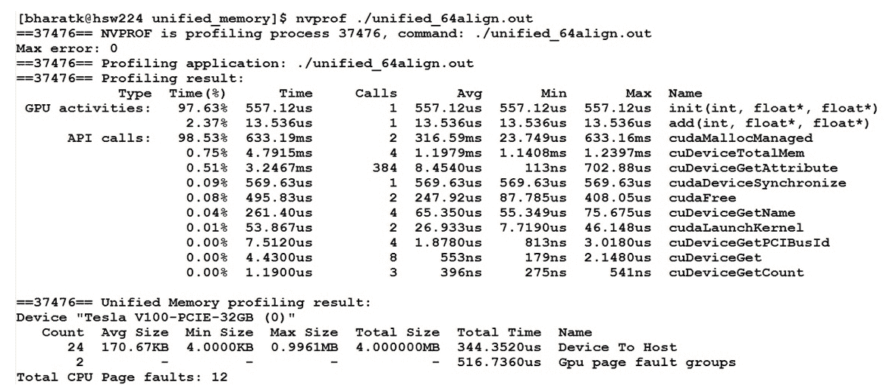

我们可以通过使用`--print-gpu-trace`运行分析器来重新确认这一点：

```cpp
$ nvprof --print-gpu-trace ./unified_64align.out
```

以下截图清楚地显示了 GPU 每页的页面错误已经减少：

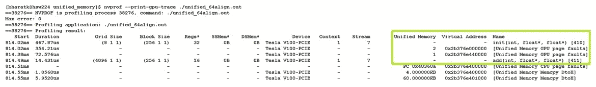

# 统一内存的优化使用数据预取

现在，让我们看一个更简单的方法，称为数据预取。CUDA 的一个关键特点是它为开发人员提供了不同的方法，从最简单的方法到需要忍者编程技能的方法。**数据预取**基本上是对驱动程序的提示，以在使用设备之前预取我们认为将在设备中使用的数据。CUDA 为此目的提供了一个名为`cudaMemPrefetchAsync()`的预取 API。要查看其实现，请查看我们之前编译的`unified_memory_prefetch.cu`文件。以下代码片段显示了此代码的快照：

```cpp
// Allocate Unified Memory -- accessible from CPU or GPU
 cudaMallocManaged(&x, N*sizeof(float));  cudaMallocManaged(&y, N*sizeof(float));
// initialize x and y arrays on the host
 for (int i = 0; i < N; i++) {  x[i] = 1.0f;  y[i] = 2.0f;  } 
//prefetch the memory to GPU
cudaGetDevice(&device);
cudaMemPrefetchAsync(x, N*sizeof(float), device, NULL);
cudaMemPrefetchAsync(y, N*sizeof(float), device, NULL); 
...
 add<<<numBlocks, blockSize>>>(N, x, y);
//prefetch the memory to CPU
 cudaMemPrefetchAsync(y, N*sizeof(float), cudaCpuDeviceId, NULL);
 // Wait for GPU to finish before accessing on host
 cudaDeviceSynchronize();
...
for (int i = 0; i < N; i++)
 maxError = fmax(maxError, fabs(y[i]-3.0f));

```

代码非常简单，而且解释自己。概念相当简单：在已知将在特定设备上使用哪些内存的情况下，可以预取内存。让我们来看一下在以下截图中显示的分析结果。

正如我们所看到的，`add<<<>>>`内核提供了我们期望的带宽：

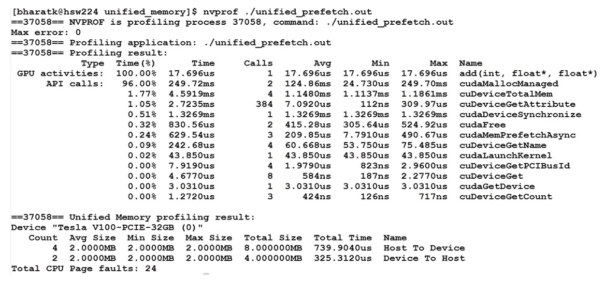

统一内存是一个不断发展的功能，随着每个 CUDA 版本和 GPU 架构的发布而发生变化。预计您通过访问最新的 CUDA 编程指南（[`docs.nvidia.com/cuda/cuda-c-programming-guide/index.html#um-unified-memory-programming-hd`](https://docs.nvidia.com/cuda/cuda-c-programming-guide/index.html#um-unified-memory-programming-hd)）来保持自己的信息。

到目前为止，我们已经看到了 UM 概念的用处，它不仅提供了编程的便利（不需要使用 CUDA API 显式管理内存），而且在移植原本不可能移植到 GPU 上的应用程序或者原本移植困难的应用程序时更加强大和有用。使用 UM 的一个关键优势是超额订阅。与 CPU 内存相比，GPU 内存非常有限。最新的 GPU（Volta 卡 V100）每个 GPU 提供 32GB 的最大内存。借助 UM，多个 GPU 内存片段以及 CPU 内存可以被视为一个大内存。例如，拥有 16 个 Volta GPU 的 NVIDIA DGX2 机器，其内存大小为 323GB，可以被视为具有最大 512GB 大小的 GPU 内存集合。这对于诸如计算流体动力学（CFD）和分析等应用程序来说是巨大的优势。以前，很难将问题大小适应 GPU 内存，现在却是可能的。手动移动片段容易出错，并且需要调整内存大小。

此外，高速互连的出现，如 NVLink 和 NVSwitch，允许 GPU 之间进行高带宽和低延迟的快速传输。您实际上可以通过统一内存获得高性能！

数据预取，结合指定数据实际所在位置的提示，对于需要同时访问相同数据的多个处理器是有帮助的。在这种情况下使用的 API 名称是`cudaMemAdvice()`。因此，通过全面了解您的应用程序，您可以通过利用这些提示来优化访问。如果您希望覆盖某些驱动程序启发式方法，这些提示也是有用的。目前 API 正在采用的一些建议如下：

+   `cudaMemAdviseSetReadMostly`：顾名思义，这意味着数据大部分是只读的。驱动程序会创建数据的只读副本，从而减少页面错误。重要的是要注意，数据仍然可以被写入。在这种情况下，页面副本将变得无效，除了写入内存的设备：

```cpp
// Sets the data readonly for the GPU
cudaMemAdvise(data, N, ..SetReadMostly, processorId); 
mykernel<<<..., s>>>(data, N); 
```

+   `cudaMemAdviseSetPreferredLocation`：此建议将数据的首选位置设置为设备所属的内存。设置首选位置不会立即导致数据迁移到该位置。就像在以下代码中，`mykernel<<<>>>`将会出现页面错误并在 CPU 上生成数据的直接映射。驱动程序试图*抵制*将数据迁离设置的首选位置，使用`cudaMemAdvise`：

```cpp
cudaMemAdvise(input, N, ..PreferredLocation, processorId); 
mykernel<<<..., s>>>(input, N); 
```

+   `cudaMemAdviseSetAccessedBy`：这个建议意味着数据将被设备访问。设备将在 CPU 内存中创建输入的直接映射，不会产生页面错误：

```cpp
cudaMemAdvise(input, N, ..SetAccessedBy, processorId); 
mykernel<<<..., s>>>(input, N); 
```

在接下来的部分，我们将以整体的视角来看 GPU 中不同的内存是如何随着新的架构而发展的。

# GPU 内存的演变

GPU 架构随着时间的推移发生了变化，内存架构也发生了相当大的变化。如果我们看一下过去四代的情况，会发现一些共同的模式，其中一些如下：

+   内存容量总体上已经提高了几个级别。

+   内存带宽和容量随着新一代架构的出现而增加。

以下表格显示了过去四代的属性：

| **内存类型** | **属性** | **Volta V100** | **Pascal P100** | **Maxwell M60** | **Kepler K80** |
| --- | --- | --- | --- | --- | --- |
| **寄存器** | 每个 SM 的大小 | 256 KB | 256 KB | 256 KB | 256 KB |
| **L1** | 大小 | 32...128 KiB | 24 KiB | 24 KiB | 16...48 KiB |
| 行大小 | 32 | 32 B | 32 B | 128 B |
| **L2** | 大小 | 6144 KiB | 4,096 KiB | 2,048 KiB | 1,536 Kib |
| 行大小 | 64 B | 32B | 32B | 32B |
| **共享内存** | 每个 SMX 的大小 | 高达 96 KiB | 64 KiB | 64 KiB | 48 KiB |
| 每个 GPU 的大小 | 高达 7,689 KiB | 3,584 KiB | 1,536 KiB | 624 KiB |
| 理论带宽 | 13,800 GiB/s | 9,519 GiB/s | 2,410 GiB/s | 2,912 GiB/s |
| **全局内存** | 内存总线 | HBM2 | HBM2 | GDDR5 | GDDR5 |
| 大小 | 32,152 MiB | 16,276 MiB | 8,155 MiB | 12,237 MiB |
| 理论带宽 | 900 GiB/s | 732 GiB/s | 160 GiB/s | 240 GiB/s |

总的来说，前面的观察结果已经帮助 CUDA 应用在新的架构下运行得更快。但与此同时，CUDA 编程模型和内存架构也进行了一些根本性的改变，以便为 CUDA 程序员简化工作。我们观察到的一个这样的改变是纹理内存，之前在 CUDA 5.0 之前，开发人员必须手动绑定和解绑纹理，并且必须在全局声明。但在 CUDA 5.0 中，这是不必要的。它还取消了应用程序中开发人员可以拥有的纹理引用数量的限制。

我们还研究了 Volta 架构以及为简化开发人员编程而进行的一些根本性改变。Volta 的总容量是每个 SM 128 KB，比其上一代显卡 Pascal P100 多了七倍，这为开发人员提供了更大的缓存。此外，由于 Volta 架构中 L1 缓存的延迟要小得多，这使得它对频繁重用的数据具有高带宽和低延迟的访问。这样做的关键原因是让 L1 缓存操作获得共享内存性能的好处。共享内存的关键问题是需要开发人员显式控制。在使用 Volta 等新架构时，这种需求就不那么必要了。但这并不意味着共享内存变得多余。一些极客程序员仍然希望充分利用共享内存的性能，但许多其他应用程序不再需要这种专业知识。Pascal 和 Volta L1 缓存和共享内存之间的区别如下图所示： 

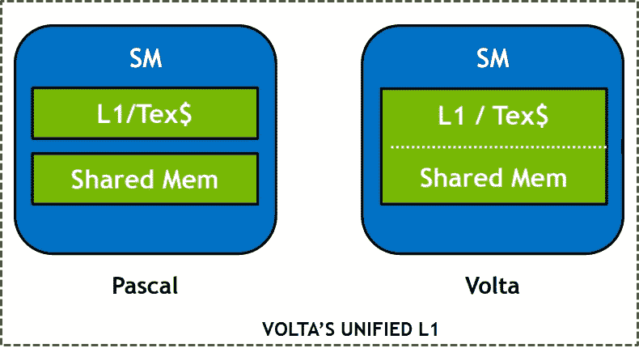

前面的图表显示了与 Pascal 相比共享内存和 L1 缓存的统一。重要的是要理解，CUDA 编程模型从诞生以来几乎保持不变。尽管每个架构的内存容量、带宽或延迟都在变化，但相同的 CUDA 代码将在所有架构上运行。不过，随着这些架构变化，性能的影响肯定会发生变化。例如，在 Volta 之前利用共享内存的应用程序，与使用全局内存相比可能会看到性能提升，但在 Volta 中可能不会看到这样的加速，因为 L1 和共享内存的统一。

# 为什么 GPU 有缓存？

在这个演变过程中，还很重要的一点是要理解 CPU 和 GPU 缓存是非常不同的，而且有不同的用途。作为 CUDA 架构的一部分，我们通常在每个 SM 上启动数百到数千个线程。数万个线程共享 L2 缓存。因此，L1 和 L2 对每个线程来说都很小。例如，在每个 SM 上有 2,048 个线程，共有 80 个 SM，每个线程只能获得 64 字节的 L1 缓存和 38 字节的 L2 缓存。GPU 缓存中存储着许多线程访问的公共数据。这有时被称为空间局部性。一个典型的例子是当线程的访问是不对齐和不规则的时候。GPU 缓存可以帮助减少寄存器溢出和局部内存的影响，因为 CPU 缓存主要用于时间局部性。

# 总结

我们在本章开始时介绍了不同类型的 GPU 内存。我们详细讨论了全局、纹理和共享内存，以及寄存器。我们还看了 GPU 内存演变提供了哪些新功能，例如统一内存，这有助于提高程序员的生产力。我们看到了这些功能在最新的 GPU 架构（如 Pascal 和 Volta）中是如何实现的。

在下一章中，我们将深入讨论 CUDA 线程编程的细节，以及如何最优地启动不同的线程配置，以发挥 GPU 硬件的最佳性能。我们还将介绍新的 CUDA Toolkit 功能，例如用于灵活线程编程的协作组和 GPU 上的多精度编程。
