# CUDA 线程编程

CUDA 具有分层线程架构，因此我们可以控制 CUDA 线程的分组。了解它们在 GPU 上并行工作的方式有助于您编写并行编程代码并实现更好的性能。在本章中，我们将介绍 CUDA 线程操作及其与 GPU 资源的关系。作为实际经验，我们将研究并行减少算法，并看看如何通过使用优化策略来优化 CUDA 代码。

在本章中，您将学习 CUDA 线程在 GPU 中的操作：并行和并发线程执行，warp 执行，内存带宽问题，控制开销，SIMD 操作等等。

本章将涵盖以下主题：

+   层次化的 CUDA 线程操作

+   了解 CUDA 占用率

+   跨多个 CUDA 线程共享数据

+   识别应用程序的性能限制

+   最小化 CUDA warp 分歧效应

+   增加内存利用率和网格跨距循环

+   用于灵活线程处理的协作组

+   warp 同步编程

+   低/混合精度操作

# 技术要求

本章建议使用比 Pascal 架构更晚的 NVIDIA GPU 卡。换句话说，您的 GPU 的计算能力应等于或大于 60。如果您不确定您的 GPU 架构，请访问 NVIDIA 的 GPU 网站[`developer.nvidia.com/cuda-gpus`](https://developer.nvidia.com/cuda-gpus)，并确认您的 GPU 的计算能力。

在我们写这本书的时候，示例代码是使用 10.1 版本开发和测试的。一般来说，如果适用的话，建议使用最新的 CUDA 版本。

在本章中，我们将通过对代码进行性能分析来进行 CUDA 编程。如果您的 GPU 架构是图灵架构，建议安装 Nsight Compute 来对代码进行性能分析。它是免费的，您可以从[`developer.nvidia.com/nsight-compute`](https://developer.nvidia.com/nsight-compute)下载。在我们写这本书的时候，这是性能分析工具的过渡时刻。您可以在第五章的*使用 Nsight Compute 对内核进行性能分析*部分了解其基本用法，*CUDA 应用性能分析和调试*。

# CUDA 线程、块和 GPU

CUDA 编程中的基本工作单元是 CUDA 线程。基本的 CUDA 线程执行模型是**单指令多线程**（**SIMT**）。换句话说，内核函数的主体是单个 CUDA 线程的工作描述。但是，CUDA 架构执行具有相同操作的多个 CUDA 线程。

在概念上，多个 CUDA 线程以组的形式并行工作。CUDA 线程块是多个 CUDA 线程的集合。多个线程块同时运行。我们称线程块的组为网格。以下图表显示了它们之间的关系：

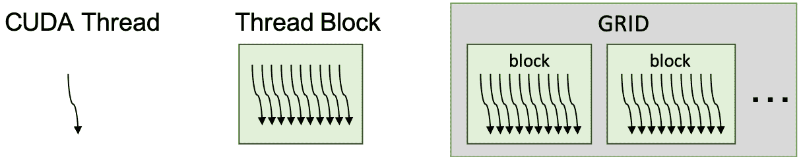

这些分层的 CUDA 线程操作与分层的 CUDA 架构相匹配。当我们启动 CUDA 内核时，每个流多处理器上会执行一个或多个 CUDA 线程块。此外，根据资源的可用性，一个流多处理器可以运行多个线程块。线程块中的线程数量和网格中的块数量也会有所不同。

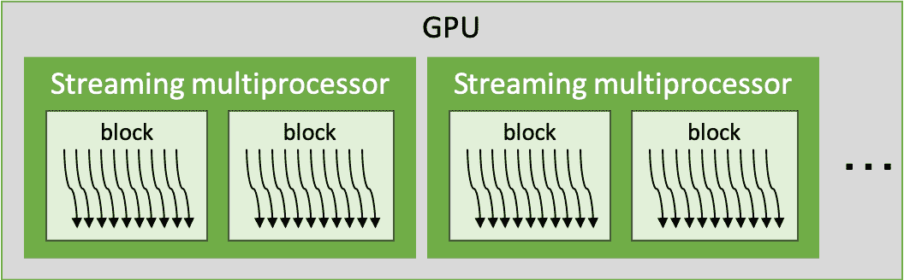

流多处理器以任意和并发的方式执行线程块，执行尽可能多的 GPU 资源。因此，可并行执行的线程块数量取决于块需要的 GPU 资源量以及 GPU 资源的可用量。我们将在接下来的部分中介绍这一点。流多处理器的数量取决于 GPU 规格。例如，Tesla V100 为 80，RTX 2080（Ti）为 48。

CUDA 流多处理器以 32 个线程的组形式控制 CUDA 线程。一个组被称为**warp**。这样，一个或多个 warp 配置一个 CUDA 线程块。以下图显示了它们的关系：

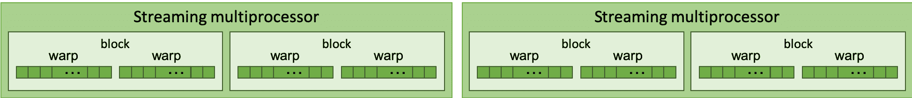

小绿色框是 CUDA 线程，它们被 warp 分组。warp 是 GPU 架构的基本控制单元。因此，它的大小对 CUDA 编程具有隐式或显式的影响。例如，最佳线程块大小是在可以充分利用块的 warp 调度和操作的多个 warp 大小中确定的。我们称之为占用率，这将在下一节中详细介绍。此外，warp 中的 CUDA 线程并行工作，并具有同步操作。我们将在本章的*Warp 级别基元编程*部分讨论这一点。

# 利用 CUDA 块和 warp

现在，我们将研究 CUDA 线程调度及其使用 CUDA 的`printf`进行隐式同步。并行 CUDA 线程的执行和块操作是并发的。另一方面，从设备打印输出是一个顺序任务。因此，我们可以轻松地看到它们的执行顺序，因为对于并发任务来说输出是任意的，而对于并行任务来说是一致的。

我们将开始编写打印全局线程索引、线程块索引、warp 索引和 lane 索引的内核代码。为此，代码可以编写如下：

```cpp
__global__ void index_print_kernel() {
    int idx = blockIdx.x * blockDim.x + threadIdx.x;
    int warp_idx = threadIdx.x / warpSize;
    int lane_idx = threadIdx.x & (warpSize - 1);

    if ((lane_idx & (warpSize/2 - 1)) == 0)
        //thread, block, warp, lane
        printf(" %5d\t%5d\t %2d\t%2d\n", idx, blockIdx.x, 
               warp_idx, lane_idx);
}
```

这段代码将帮助我们理解 warp 和 CUDA 线程调度的并发性。让我们让我们的代码从 shell 获取参数，以便轻松测试各种网格和线程块配置。

然后，我们将编写调用内核函数的主机代码：

```cpp
int main() {
    int gridDim = 4, blockDim = 128;
    puts("thread, block, warp, lane");
    index_print_kernel<<< gridDim, blockDim >>>();
    cudaDeviceSynchronize();
}
```

最后，让我们编译代码，执行它，并查看结果：

```cpp
nvcc -m64 -o cuda_thread_block cuda_thread_block.cu
```

以下结果是输出结果的一个示例。实际输出可能会有所不同：

```cpp
$ ./cuda_thread_block.cu 4 128
thread, block, warp, lane
 64     0     2     0
 80     0     2    16
 96     0     3     0
 112     0     3    16
 0     0     0     0
 16     0     0    16
 ...
 352     2     3     0
 368     2     3    16
 288     2     1     0
 304     2     1    16
```

从结果中，您将看到 CUDA 线程以 warp 大小启动，并且顺序是不确定的。另一方面，lane 输出是有序的。从给定的结果中，我们可以确认以下事实：

+   **无序块执行：**第二列显示线程块的索引。结果表明，它不保证按照块索引的顺序执行。

+   **无序 warp 索引与线程块：**第三列显示块中 warp 的索引。warp 的顺序在块之间变化。因此，我们可以推断 warp 执行顺序没有保证。

+   **在 warp 中执行的分组线程：**第四列显示 warp 中的 lane。为了减少输出数量，应用程序限制只打印两个索引。从每个 warp 内的有序输出中，我们可以类比`printf`函数的输出顺序是固定的，因此没有倒置。

总之，CUDA 线程被分组为 32 个线程，它们的输出和 warp 的执行没有顺序。因此，程序员必须牢记这一点，以便进行 CUDA 内核开发。

# 理解 CUDA 占用率

CUDA 占用率是活动 CUDA warps 与每个流多处理器可以同时执行的最大 warps 的比率。一般来说，更高的占用率会导致更有效的 GPU 利用率，因为有更多的 warp 可用来隐藏停滞 warp 的延迟。然而，它也可能由于 CUDA 线程之间资源争用的增加而降低性能。因此，开发人员理解这种权衡是至关重要的。

找到最佳的 CUDA 占用率的目的是使 GPU 应用程序能够有效地使用 GPU 资源发出 warp 指令。GPU 在流多处理器上使用多个 warp 调度器调度多个 warp。当多个 warp 有效地调度时，GPU 可以隐藏 GPU 指令或内存延迟之间的延迟。然后，CUDA 核心可以执行连续从多个 warp 发出的指令，而未调度的 warp 必须等待，直到它们可以发出下一条指令。

开发人员可以使用两种方法确定 CUDA 占用率：

+   由 CUDA 占用率计算器确定的**理论占用率**：这个计算器是 CUDA 工具包提供的一个 Excel 表。我们可以从内核资源使用和 GPU 流多处理器理论上确定每个内核的占用率。

+   由 GPU 确定的**实现占用率**：实现占用率反映了在流多处理器上并发执行的 warp 的真实数量和最大可用 warp。这种占用率可以通过 NVIDIA 分析器进行度量分析来测量。

理论占用率可以被视为最大的上限占用率，因为占用率数字不考虑指令依赖性或内存带宽限制。

现在，让我们看看这个占用率和 CUDA C/C++之间的关系。

# 设置 NVCC 报告 GPU 资源使用

首先，我们将使用**简单矩阵乘法**（**SGEMM**）内核代码，如下所示：

```cpp
__global__ void sgemm_gpu_kernel(const float *A, const float *B, 
        float *C, int N, int M, int K, alpha, float beta) {
    int col = blockIdx.x * blockDim.x + threadIdx.x;
    int row = blockIdx.y * blockDim.y + threadIdx.y;

    float sum = 0.f;
    for (int i = 0; i < K; ++i) {
        sum += A[row * K + i] * B[i * K + col];
    }
    C[row * M + col] = alpha * sum + beta * C[row * M + col];
}
```

然后，我们将使用以下内核代码调用内核函数：

```cpp
void sgemm_gpu(const float *A, const float *B, float *C,
            int N, int M, int K, float alpha, float beta) {
    dim3 dimBlock(BLOCK_DIM, BLOCK_DIM);
    dim3 dimGrid(M / dimBlock.x, N / dimBlock.y);
    sgemm_gpu_kernel<<< dimGrid, dimBlock >>>(A, B, C, N, M, K, alpha, beta);
}
```

您可能希望提供适当的 GPU 内存及其大小信息。我们将使用 2048 作为`N`，`M`和`K`。内存大小是该数字的平方。我们将把`BLOCK_DIM`设置为`16`。

现在，让我们看看如何使`nvcc`编译器报告内核函数的 GPU 资源使用情况。

# Linux 设置

在 Linux 环境中，我们应该提供两个编译器选项，如下所示：

+   `--resource-usage`（`--res-usage`）：为 GPU 资源使用设置详细选项

+   `-gencode`：指定要编译和生成操作码的目标架构如下：

+   Turing：`compute_75,sm_75`

+   Volta：`compute_70,sm_70`

+   Pascal：`compute_60,sm_60`，`compute_61,sm_61`

如果您不确定您正在使用哪种架构，您可以从 CUDA GPU 网站上找到（[`developer.nvidia.com/cuda-gpus`](https://developer.nvidia.com/cuda-gpus)）。例如，`nvcc`编译命令可以有以下编译选项：

```cpp
$ nvcc -m 64 --resource-usage \
 -gencode arch=compute_70,code=sm_70 \
 -I/usr/local/cuda/samples/common/inc \
 -o sgemm ./sgemm.cu 
```

我们还可以编译代码以针对多个 GPU 架构，如下所示：

```cpp
$ nvcc -m64 --resource-usage \
      -gencode arch=compute_70,code=sm_70 \
      -gencode arch=compute_75,code=sm_75 \
      -I/usr/local/cuda/samples/common/inc \
      -o sgemm ./sgemm.cu
```

如果您想使您的代码与新的 GPU 架构（Turing）兼容，您需要提供以下附加选项：

```cpp
$ nvcc -m64 --resource-usage \
      -gencode arch=compute_70,code=sm_70 \
      -gencode arch=compute_75,code=sm_75 \
      -gencode arch=compute_75,code=compute_75 \
      -I/usr/local/cuda/samples/common/inc \
      -o sgemm ./sgemm.cu
```

如果您想了解更多关于这些选项的信息，您可以在这个文档中找到相关信息：[`docs.nvidia.com/cuda/turing-compatibility-guide/index.html#building-turing-compatible-apps-using-cuda-10-0`](https://docs.nvidia.com/cuda/turing-compatibility-guide/index.html#building-turing-compatible-apps-using-cuda-10-0)。

现在，让我们编译源代码。我们可以从 NVCC 的输出中找到一个资源使用报告。以下结果是使用前面的命令生成的：


NVCC 为每个计算能力报告 CUDA 内核资源使用信息。在前面的输出截图中，我们可以看到每个线程的寄存器数量和常量内存使用情况。

# Windows 设置

当我们开发 Windows 应用程序时，我们可以在 Visual Studio 项目属性对话框中设置这些设置。以下是该对话框的截图：

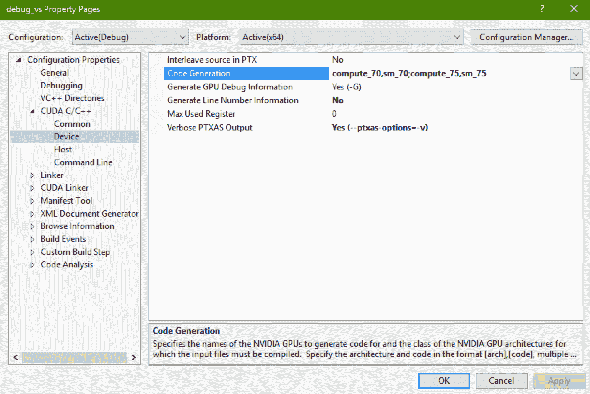

要打开此对话框，我们应该打开 debug_vs 属性页，然后在左侧面板上转到 CUDA C/C++ | 设备选项卡。然后，我们应该设置以下选项如下：

+   Verbose PTXAS Output: No | Yes

+   代码生成：更新选项以指定您的目标架构如下：

+   图灵：`compute_75,sm_75`

+   伏尔塔：`compute_70,sm_70`

+   帕斯卡：`compute_60,sm_60;compute_61,sm_61`

我们可以使用分号(`;`)指定多个目标架构。

现在，让我们构建源代码，我们将在 Visual Studio 的输出面板上看到 NVCC 的报告。然后，你会看到类似以下的输出：

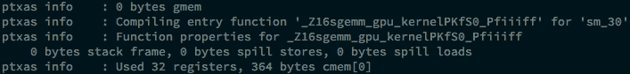

这与 Linux 中 NVCC 的输出相同。

现在，让我们使用资源使用报告来分析内核的占用情况。

# 使用占用率计算器分析最佳占用率

实际上，我们可以使用 CUDA 占用率计算器，它是 CUDA 工具包提供的。使用这个，我们可以通过提供一些内核信息来获得理论上的占用率。计算器是一个 Excel 文件，你可以在以下位置找到它，根据你使用的操作系统：

+   **Windows:** `C:\Program Files\NVIDIA GPU Computing Toolkit\CUDA\<cuda-version>\tools`

+   **Linux:** `/usr/local/cuda/tools`

+   **macOS:** `/Developer/NVIDIA/<cuda-version>/tools`

以下是计算器的屏幕截图：

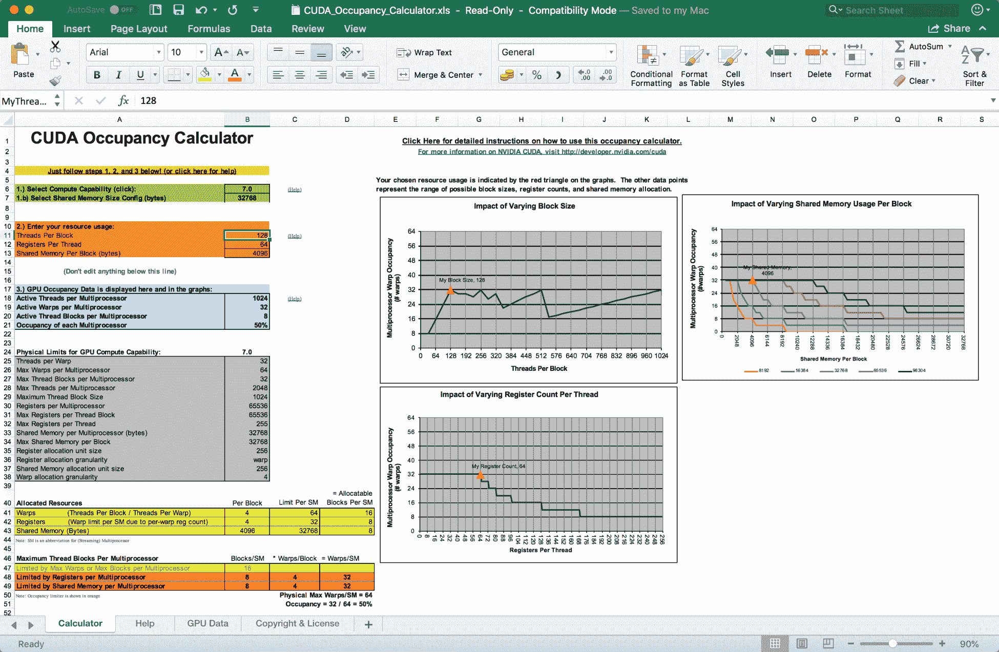

CUDA 占用率计算器

这个计算器有两部分：内核信息输入和占用信息输出。作为输入，它需要两种信息，如下所示：

+   GPU 的计算能力（绿色）

+   线程块资源信息（黄色）:

+   每个 CUDA 线程块的线程

+   每个 CUDA 线程的寄存器

+   每个块的共享内存

计算器在这里显示了 GPU 的占用信息：

+   GPU 占用数据（蓝色）

+   GPU 的 GPU 计算能力的物理限制（灰色）

+   每个块分配的资源（黄色）

+   每个流多处理器的最大线程块（黄色、橙色和红色）

+   根据三个关键的占用资源（线程、寄存器和每个块的共享内存），绘制占用限制图

+   图表上的红色三角形，显示当前的占用数据

现在，让我们把获得的信息放入计算器中。我们可以编辑 Excel 表格中的绿色和橙色区域：

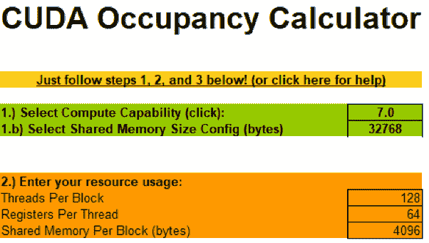

输入你获得的内核资源信息，看看表格如何变化。

根据计算能力和输入数据，占用情况会发生变化，如下面的屏幕截图所示：

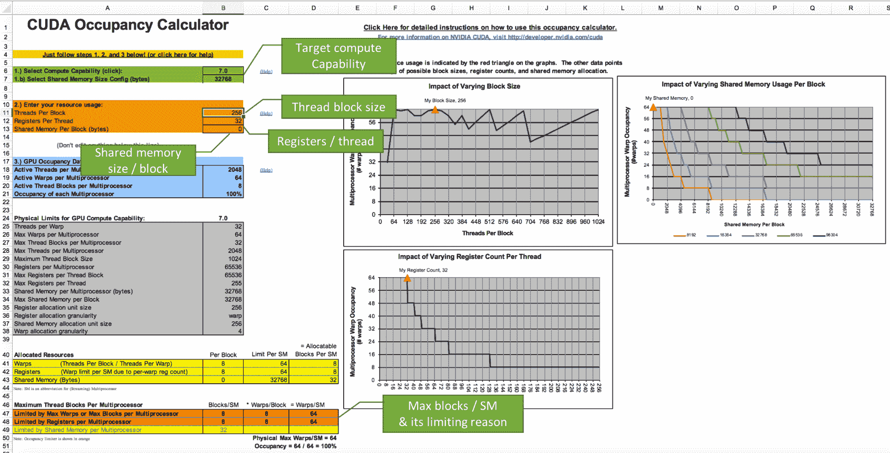

根据计算能力和输入数据的变化

蓝色区域显示了内核函数实现的占用率。在这个屏幕截图中，它显示了 100%的占用率。表格的右侧显示了 GPU 资源的占用率利用图：CUDA 线程、共享内存和寄存器。

一般来说，由于许多原因，内核代码不能达到 100%的理论占用率。然而，设置峰值占用率是有效利用 GPU 资源的开始。

# 占用率调整 - 限制寄存器使用

当内核算法复杂或处理数据类型为双精度时，CUDA 寄存器使用可能会增加。在这种情况下，由于活动 warp 大小有限，占用率会下降。在这种情况下，我们可以通过限制寄存器使用来增加理论上的占用率，并查看性能是否提高。

调整 GPU 资源使用的一种方法是在内核函数中使用`__launch_bound__`限定符。这告诉 NVCC 保证每个流多处理器的最大块大小的最小线程块。然后，NVCC 找到实现给定条件的最佳寄存器大小。如果你在编译时知道使你的算法有效运行的大小，你可以使用这个。标识符可以如下使用：

```cpp
int maxThreadPerBlock = 256;
int minBlocksPerMultiprocessor = 2;
__global__ void
__launch_bound__ (maxThreadPerBlock, minBlocksPerMultiprocessor) foo_kernel() {
    ...
}
```

然后，编译器检查上限资源并减少每个块的限制资源使用。如果其资源使用没有超过上限，编译器会调整寄存器使用，如果 CUDA 可以调度额外的多处理器线程块，如果没有给出第二个参数。或者，编译器会增加寄存器使用以隐藏单线程指令延迟。

此外，我们可以简单地在应用程序级别限制占用寄存器的数量。`--maxrregcount`标志到`NVCC`将指定数量，编译器将重新排列寄存器使用。以下编译命令显示了如何在 Linux 终端中使用该标志：

```cpp
$ nvcc -m64 -I/usr/local/cuda/samples/common/inc -gencode arch=compute_70,code=sm_70 --resource-usage --maxrregcount 24 -o sgemm ./sgemm.cu
```

但是，请记住，以这种方式限制寄存器使用可能会引入由寄存器限制引起的线程性能下降。即使编译器无法将其设置在限制之下，也可以将寄存器分割为本地内存，并且本地变量放置在全局内存中。

# 从分析器获取实现的占用

现在，我们可以使用 Visual Profiler 从分析的度量数据中获取实现的占用。单击目标内核时间轴条。然后，我们可以在属性面板中看到理论和实现的占用。我们还可以从内核延迟菜单中获取更多详细信息。以下屏幕截图显示了我们使用的示例代码的实现性能：

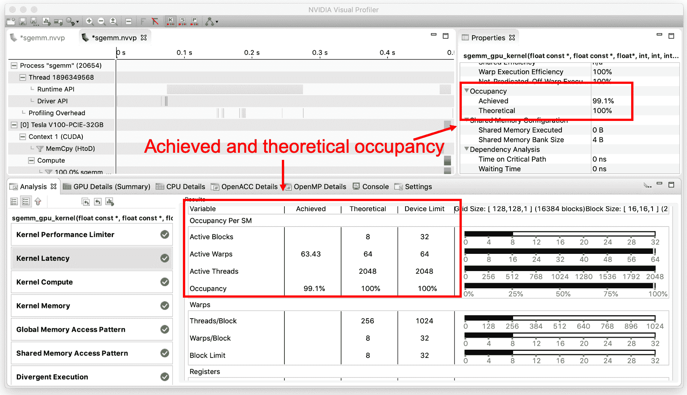

显示实现和理论占用的性能

通过这种占用调整，我们可以设计 CUDA 块大小，充分利用流多处理器中的 warp 调度。然而，这并没有解决我们在上一节中发现的 54.75%的内存限制问题。这意味着多处理器可能会停顿，无法掩盖由于受阻内存请求而产生的内存访问延迟。我们将在本章讨论如何优化这一点，并且在第七章《CUDA 中的并行编程模式》中，我们将讨论矩阵乘法优化。

# 理解并行归约

归约是一种简单但有用的算法，可以获得许多参数的公共参数。这个任务可以按顺序或并行完成。当涉及到并行处理到并行架构时，并行归约是获得直方图、均值或任何其他统计值的最快方式。

以下图表显示了顺序归约和并行归约之间的差异：

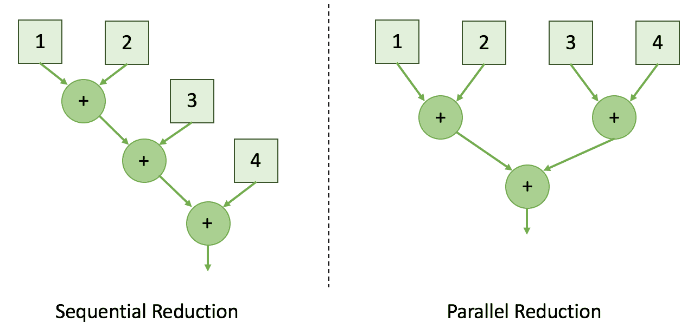

通过并行进行归约任务，可以将并行归约算法的总步骤减少到对数级别。现在，让我们开始在 GPU 上实现这个并行归约算法。首先，我们将使用全局内存实现一个简单的设计。然后，我们将使用共享内存实现另一个归约版本。通过比较这两种实现，我们将讨论是什么带来了性能差异。

# 使用全局内存的天真并行归约

归约的第一种基本方法是使用并行的 CUDA 线程，并使用全局内存共享归约输出。对于每次迭代，CUDA 内核通过将其大小减少两倍来从全局内存获取累积值。归约的工作如下图所示，显示了使用全局内存数据共享的天真并行归约：

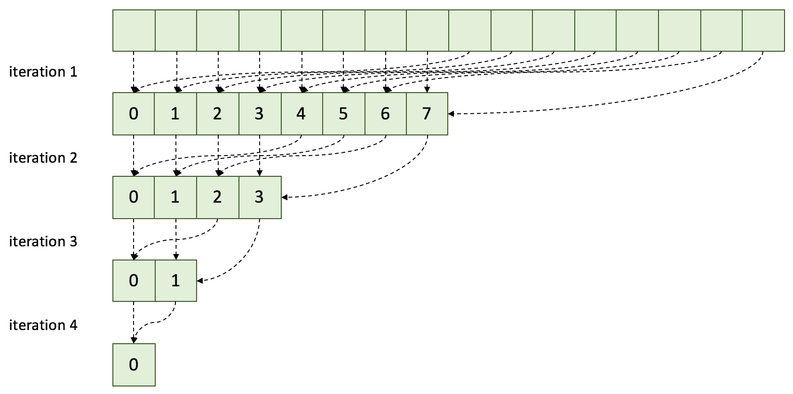

这种方法在 CUDA 中很慢，因为它浪费了全局内存的带宽，并且没有利用任何更快的片上内存。为了获得更好的性能，建议使用共享内存来节省全局内存带宽并减少内存获取延迟。我们将讨论这种方法如何浪费带宽。

现在，让我们实现这个归约。首先，我们将编写归约内核函数，如下所示：

```cpp
__global__ void naive_reduction_kernel
     (float *data_out, float *data_in, int stride, int size) {
     int idx_x = blockIdx.x * blockDim.x + threadIdx.x;
     if (idx_x + stride < size)
         data_out[idx_x] += data_in[idx_x + stride];
}
```

我们将在迭代过程中减半减小步长大小，直到`stride`大小为 1 时调用内核函数。

```cpp
void naive_reduction(float *d_out, float *d_in, int n_threads, int size) {
    int n_blocks = (size + n_threads - 1) / n_threads;
    for (int stride = 1; stride < size; stride *= 2)
        naive_reduction_kernel<<<n_blocks, n_threads>>>(d_out, d_in, stride, size);
}
```

在这个实现中，内核代码使用跨距寻址获取设备内存并输出一个减少结果。主机代码触发每个步骤的减少内核，并且参数大小减半。我们不能有内部内核循环，因为 CUDA 不能保证线程块和流多处理器之间的同步操作。

# 使用共享内存减少内核

在这种减少中，每个 CUDA 线程块减少输入值，并且 CUDA 线程使用共享内存共享数据。为了进行适当的数据更新，它们使用块级内在同步函数`__syncthreads()`。然后，下一个迭代操作上一个减少结果。其设计如下图所示，显示了使用共享内存的并行减少：

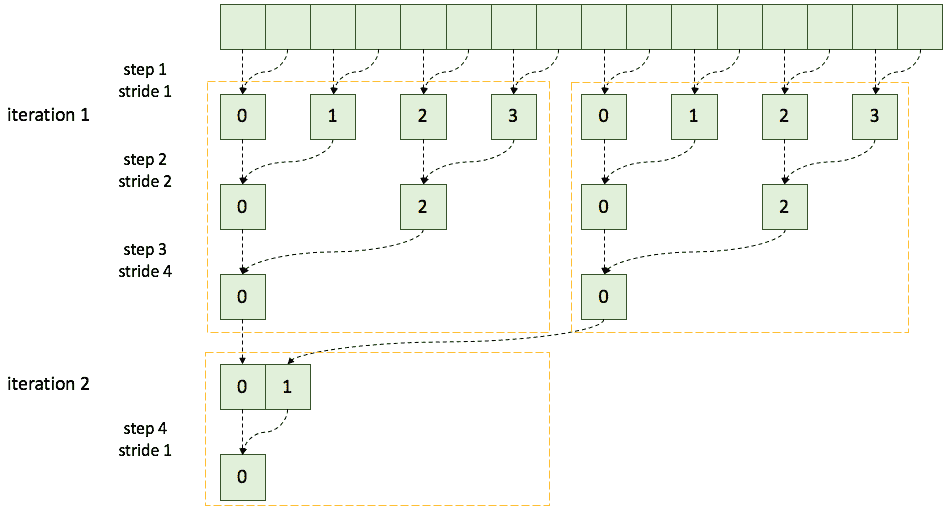

黄点框表示 CUDA 线程块的操作范围。在这个设计中，每个 CUDA 线程块输出一个减少结果。

块级减少允许每个 CUDA 线程块进行减少，并输出单个减少输出。由于它不需要我们将中间结果保存在全局内存中，CUDA 内核可以将过渡值存储在共享内存中。这种设计有助于节省全局内存带宽并减少内存延迟。

与全局减少一样，我们将实现这个操作。首先，我们将编写内核函数，如下所示：

```cpp
__global__ void reduction_kernel(float* d_out, float* d_in, 
                                 unsigned int size) {
    unsigned int idx_x = blockIdx.x * blockDim.x + threadIdx.x;

    extern __shared__ float s_data[];
    s_data[threadIdx.x] = (idx_x < size) ? d_in[idx_x] : 0.f;

    __syncthreads();

    // do reduction
    for (unsigned int stride = 1; stride < blockDim.x; stride *= 2) {
        // thread synchronous reduction
        if ( (idx_x % (stride * 2)) == 0 )
            s_data[threadIdx.x] += s_data[threadIdx.x + stride];

        __syncthreads();
    }

    if (threadIdx.x == 0)
        d_out[blockIdx.x] = s_data[0];
}
```

然后，我们将调用内核函数，如下所示：

```cpp
void reduction(float *d_out, float *d_in, int n_threads, int size)
{
    cudaMemcpy(d_out, d_in, size * sizeof(float), cudaMemcpyDeviceToDevice);
    while(size > 1) {
        int n_blocks = (size + n_threads - 1) / n_threads;
        reduction_kernel
            <<< n_blocks, n_threads, n_threads * sizeof(float), 0 >>>
            (d_out, d_out, size);
        size = n_blocks;
    }
}
```

在这段代码中，我们提供了`n_threads * sizeof (float)`字节，因为每个 CUDA 线程将共享每个字节的单个变量。

# 编写性能测量代码

为了测量每个版本的性能，我们将使用 CUDA 示例`timer`辅助函数：

```cpp
// Initialize timer
StopWatchInterface *timer;
sdkCreateTimer(&timer);
sdkStartTimer(&timer);

... Execution code ...

// Getting elapsed time
cudaDeviceSynchronize(); // Blocks the host until GPU finishes the work
sdkStopTimer(&timer);

// Getting execution time in micro-secondes
float execution_time_ms = sdkGetTimerValue(&timer)

// Termination of timer
sdkDeleteTimer(&timer);
```

这个函数集有助于在微秒级别测量执行时间。此外，建议在性能测量之前调用内核函数，以消除设备初始化开销。有关更详细的实现，请访问`global_reduction.cu`和`reduction.cu`文件中的实现代码。这些代码集在本章中用于评估优化效果以及分析器。

# 两种减少-全局和共享内存的性能比较

现在，我们可以比较两个并行减少操作的执行时间。性能可能会因 GPU 和实现环境而异。分别运行以下命令进行全局减少和使用共享内存进行减少：

```cpp
# Reduction with global memory
$ nvcc -run -m64 -gencode arch=compute_70,code=sm_70 -I/usr/local/cuda/samples/common/inc -o reduction_global ./reduction_global.cpp reduction_global_kernel.cu

# Reduction using shared memory
$ nvcc -run -m64 -gencode arch=compute_70,code=sm_70 -I/usr/local/cuda/samples/common/inc -o reduction_shared ./reduction_shared.cpp reduction_shared_kernel.cu
```

使用我的 Tesla V100 PCIe 卡，两种减少的估计性能如下。元素数量为*2²⁴*个：

| **操作** | **估计时间（毫秒）** | **加速** |
| --- | --- | --- |
| 原始方法（使用全局内存进行减少） | 4.609 | 1.0x |
| 使用共享内存的减少 | 0.624 | 7.4x |

从这个结果中，我们可以看到在减少中使用共享内存共享数据如何快速返回输出。第一个实现版本在`global_reduction.cu`中，第二个版本在`shared_reduction.cu`中，所以您可以自行比较实现。

通过将减少与共享内存结合，我们可以显著提高性能。然而，我们无法确定这是否是我们可以获得的最大性能，并且不知道我们的应用程序有什么瓶颈。为了分析这一点，我们将在下一节中涵盖性能限制器。

# 识别应用程序的性能限制器

之前，我们看到了如何通过保存全局内存来使 CUDA 内核的性能受益。一般来说，使用片上缓存比使用片外内存更好。但是，我们无法确定这种简单类比是否还有很多优化空间。

性能限制因素显示了限制应用程序性能的因素，它最显著地限制了应用程序的性能。根据其分析信息，它分析了计算和内存带宽之间的性能限制因素。根据这些资源的利用率，应用程序可以被分类为四种类型：**计算受限**，**带宽受限**，**延迟受限**和**计算和延迟受限**。以下图表显示了这些类别与计算和内存利用率的关系：

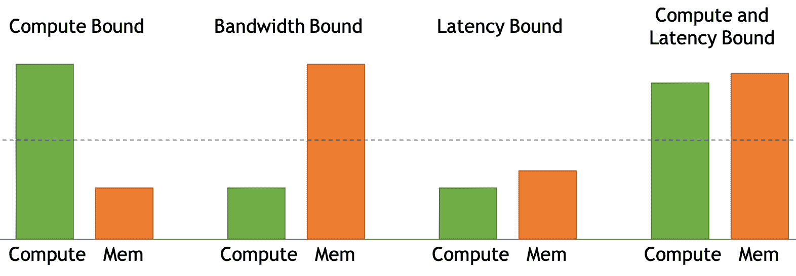

在确定了限制因素之后，我们可以使用下一个优化策略。如果任一资源的利用率很高，我们可以专注于优化该资源。如果两者都未充分利用，我们可以从系统的 I/O 方面应用延迟优化。如果两者都很高，我们可以调查是否存在内存操作停顿问题和与计算相关的问题。

现在让我们看看如何获得利用率信息。

# 找到性能限制因素并进行优化

现在，让我们将此分析应用于两个减少实现。我们将对它们进行比较，并讨论共享内存如何有助于性能限制因素分析以改善性能。首先，让我们使用以下命令对基于全局内存的减少应用程序进行度量分析：

```cpp
$ nvprof -o reduction_global.nvvp ./reduction_global 
$ nvprof --analysis-metrics -o reduction_global_metric.nvvp ./reduction_global
```

然后，我们将从 NVIDIA 分析器获得以下图表，显示了基于全局内存的第一个减少性能的限制因素：

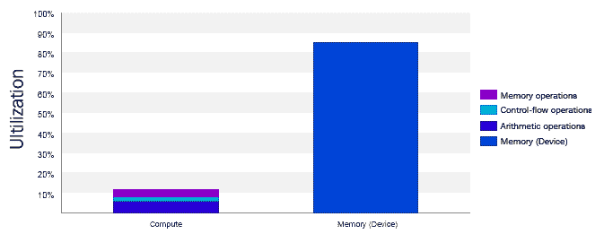

在这张图表上，我们需要查看性能执行比来查看是否通过检查内核延迟分析来平衡。因为，如前图表所示，**计算**和**内存**之间的利用率差距很大，这可能意味着由于内存瓶颈，计算中会有很多延迟。以下图表显示了基于采样的分析结果，我们可以确定 CUDA 核心由于内存依赖而饥饿：

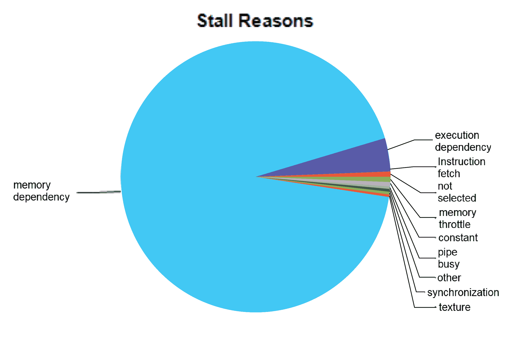

如您所见，由于内存等待，内核执行被延迟。现在，让我们基于共享内存对减少进行分析。我们可以使用以下命令来做到这一点：

```cpp
$ nvprof -o reduction_shared.nvvp ./reduction_shared 
$ nvprof --analysis-metrics -o reduction_shared_metric.nvvp ./reduction_shared
```

然后，我们将获得以下图表，显示了基于共享内存的第二个减少性能的限制因素：

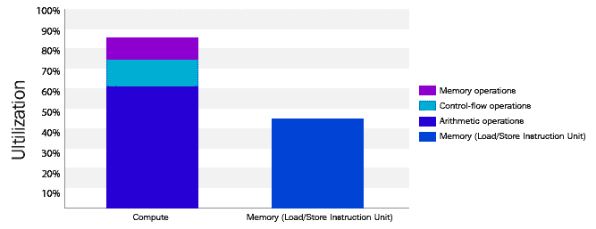

我们可以确定它是计算受限的，内存不会使 CUDA 核心饥饿。

现在让我们回顾我们的核心操作，以优化计算操作。以下代码显示了内核函数中的并行减少部分：

```cpp
for (unsigned int stride = 1; stride < blockDim.x; stride *= 2) {
     if ( (idx_x % (stride * 2)) == 0 )
         s_data[threadIdx.x] += s_data[threadIdx.x + stride];
     __syncthreads();
 }
```

作为算术操作，模运算是一种重型操作。由于`stride`变量是`2`的指数倍数，因此可以用位操作替换，如下所示：

```cpp
for (unsigned int stride = 1; stride < blockDim.x; stride *= 2) {
     if ( (idx_x & (stride * 2 - 1)) == 0 )
         s_data[threadIdx.x] += s_data[threadIdx.x + stride];
     __syncthreads();
 }
```

运行以下命令以查看优化后的输出：

```cpp
$ nvcc -run -m64 -gencode arch=compute_70,code=sm_70 -I/usr/local/cuda/samples/common/inc -o reduction_shared ./reduction_shared.cpp reduction_shared_kernel.cu
```

然后，新的估计时间为**0.399 毫秒**，我们可以实现更优化的性能，如下表所示：

| **操作** | **估计时间（毫秒）** | **加速比** |
| --- | --- | --- |
| 原始方法（使用全局内存进行减少） | 4.609 | 1.0 倍 |
| 使用共享内存进行减少 | 0.624 | 7.4 倍 |
| 将条件操作从`%`更改为`&` | 0.399 | 11.55 倍 |

以下图表显示了更新后的性能限制因素：

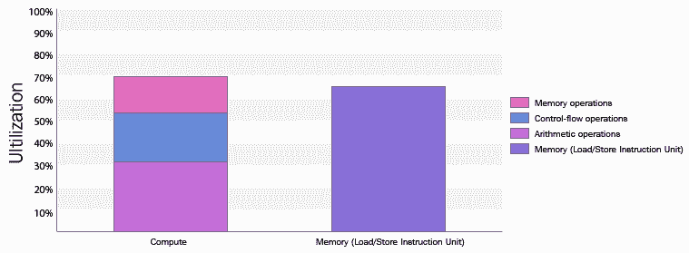

我们可以确定其操作是**计算和延迟受限**。因此，我们可以确定我们可以通过优化计算效率来增加内存利用率。

# 最小化 CUDA warp 分歧效应

在**单指令，多线程**（**SIMT**）执行模型中，线程被分组成 32 个线程的集合，每个集合称为**warp**。如果一个 warp 遇到条件语句或分支，其线程可以分歧并串行执行每个条件。这称为**分支分歧**，它会显著影响性能。

CUDA warp 分歧是指在 warp 中 CUDA 线程的分歧操作。如果条件分支具有`if`-`else`结构，并且 warp 具有此 warp 分歧，所有 CUDA 线程对于分支代码块都有活动和非活动操作部分。

下图显示了 CUDA warp 中的 warp 分歧效应。不处于空闲状态的 CUDA 线程会降低 GPU 线程的有效使用：

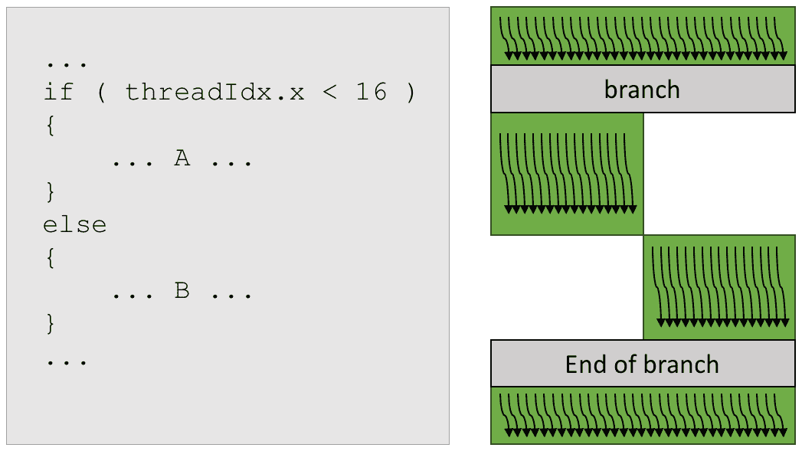

随着分支部分的增加，GPU 调度吞吐量变得低效。因此，我们需要避免或最小化这种 warp 分歧效应。您可以选择几种选项：

+   通过处理不同的 warp 来避免分歧效应

+   通过合并分支部分来减少 warp 中的分支

+   缩短分支部分；只有关键部分进行分支

+   重新排列数据（即转置，合并等）

+   使用协作组中的`tiled_partition`来对组进行分区

# 确定分歧作为性能瓶颈

从先前的减少优化中，您可能会发现由于计算分析中的分歧分支而导致内核效率低下的警告，如下所示：

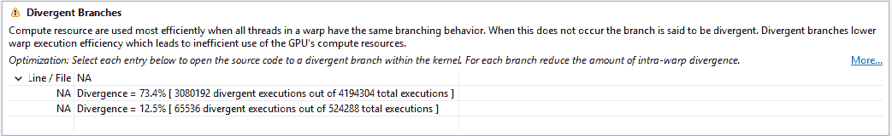

73.4％的分歧意味着我们有一个低效的操作路径。我们可以确定减少寻址是问题所在，如下所示：

```cpp
__global__ void reduction_kernel(float* d_out, float* d_in, unsigned int size) {
    unsigned int idx_x = blockIdx.x * blockDim.x + threadIdx.x;

    extern __shared__ float s_data[];
    s_data[threadIdx.x] = (idx_x < size) ? d_in[idx_x] : 0.f;

    __syncthreads();

    // do reduction
    for (unsigned int stride = 1; stride < blockDim.x; stride *= 2) {
        // thread synchronous reduction
        if ( (idx_x % (stride * 2 - 1)) == 0 )
            s_data[threadIdx.x] += s_data[threadIdx.x + stride];

        __syncthreads();
    }

    if (threadIdx.x == 0)
        d_out[blockIdx.x] = s_data[0];
}
```

在减少寻址方面，我们可以选择以下 CUDA 线程索引策略之一：

+   交错寻址

+   顺序寻址

让我们回顾一下它们，并通过实施这些策略来比较它们的性能。由于我们只会修改减少内核，因此我们可以重用主机代码进行下两个实现。

# 交错寻址

在这种策略中，连续的 CUDA 线程使用交错寻址策略获取输入数据。与之前的版本相比，CUDA 线程通过增加步幅值来访问输入数据。以下图表显示了 CUDA 线程如何与减少项交错：


可以实现以下交错寻址：

```cpp
__global__ void
 interleaved_reduction_kernel(float* g_out, float* g_in, unsigned int size) {
    unsigned int idx_x = blockIdx.x * blockDim.x + threadIdx.x;

    extern __shared__ float s_data[];
    s_data[threadIdx.x] = (idx_x < size) ? g_in[idx_x] : 0.f;
    __syncthreads();

    // do reduction
    // interleaved addressing
    for (unsigned int stride = 1; stride < blockDim.x; stride *= 2) {
        int index = 2 * stride * threadIdx.x;
        if (index < blockDim.x)
            s_data[index] += s_data[index + stride];
        __syncthreads();
    }
    if (threadIdx.x == 0)
        g_out[blockIdx.x] = s_data[0];
}
```

运行以下命令来编译上述代码：

```cpp
$ nvcc -run -m64 -gencode arch=compute_70,code=sm_70 -I/usr/local/cuda/samples/common/inc -o reduction ./reduction.cpp ./reduction_kernel_interleaving.cu
```

在 Tesla V100 上，测得的内核执行时间为 0.446 毫秒。这比之前的版本慢，因为在这种方法中每个线程块都没有完全利用。通过对其指标进行分析，我们可以得到更多细节。

现在我们将尝试另一种寻址方法，该方法旨在使每个线程块计算更多数据。

# 顺序寻址

与之前的版本相比，这具有高度合并的索引和寻址。这种设计更有效，因为当步幅大小大于 warp 大小时就没有分歧。以下图表显示了合并的线程操作：

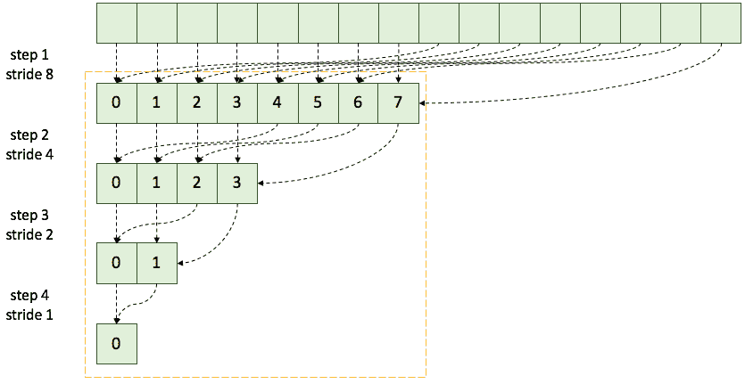

现在，让我们编写一个内核函数，以在减少项上使用顺序寻址。

```cpp
__global__ void
 sequantial_reduction_kernel(float *g_out, float *g_in, 
                             unsigned int size)
{
    unsigned int idx_x = blockIdx.x * blockDim.x + threadIdx.x;

    extern __shared__ float s_data[];

    s_data[threadIdx.x] = (idx_x < size) ? g_in[idx_x] : 0.f;

    __syncthreads();

    // do reduction
    // sequential addressing
    for (unsigned int stride = blockDim.x / 2; stride > 0; 
         stride >>= 1)
    {
        if (threadIdx.x < stride)
            s_data[threadIdx.x] += s_data[threadIdx.x + stride];

        __syncthreads();
    }

    if (threadIdx.x == 0)
        g_out[blockIdx.x] = s_data[0];
}
```

运行以下命令来编译上述代码：

```cpp
$ nvcc -run -m64 -gencode arch=compute_70,code=sm_70 -I/usr/local/cuda/samples/common/inc -o reduction ./reduction.cpp ./reduction_kernel_sequential.cu
```

在 Tesla V100 GPU 上，测得的执行时间为 0.378 毫秒，略快于之前的策略（0.399 毫秒）。

由于避免 warp 分歧，我们可以在原始计算上获得 12.2 倍的性能提升。以下图表显示了更新后的性能限制器分析：

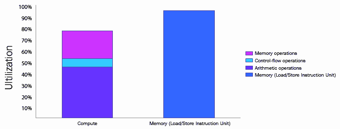

与之前的性能限制器相比，我们可以看到减少了控制流操作并增加了内存利用率。

# 性能建模和平衡限制器

根据性能限制器分析，我们当前的减少性能受到计算延迟的限制，这是由于内存带宽，尽管限制器分析显示每个资源的充分利用。让我们讨论为什么这是一个问题，以及如何通过遵循 Roofline 性能模型来解决这个问题。

# Roofline 模型

Roofline 模型是一种直观的视觉性能分析模型，用于为并行处理单元上的给定计算内核提供估计性能。根据这个模型，并行编程中的开发人员可以确定算法应该受到什么限制，并确定哪些应该进行优化。

以下图表显示了 Roofline 模型的一个示例：


倾斜部分表示内存受限，平坦部分表示算术受限。每个并行算法和实现都有自己的 Roofline 模型，因为它们具有不同的计算能力和内存带宽。有了这个模型，算法可以根据它们的操作密度（flops/bytes）进行放置。如果一个实现不符合这个模型的预期性能，我们可以确定这个版本受到延迟的限制。

考虑到我们并行减少的复杂性，它必须是内存受限的。换句话说，它的操作密度低，因此我们的策略应尽可能最大化内存带宽。

因此，我们需要确认我们的减少内核函数如何使用性能分析器中的内存带宽。以下图表显示了全局内存的带宽使用情况：

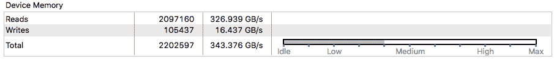

如图所示，我们没有充分利用内存带宽。Tesla V100 GPU 的总带宽为 343.376 GB/s，利用了大约三分之一的带宽，因为这款 GPU 具有 900 GB/s 带宽的 HBM2 内存。因此，下一步是通过让每个 CUDA 线程处理更多数据来增加带宽使用率。这将解决延迟限制的情况，并使我们的应用程序受限于内存带宽。

现在，让我们讨论如何增加内存带宽。

# 通过网格跨步循环最大化内存带宽

我们可以通过一个简单的想法实现这一点。减少问题允许我们使用 CUDA 线程累积输入数据并开始减少操作。以前，我们的减少实现是从输入数据大小开始的。但现在，我们将迭代到一组 CUDA 线程的输入数据，并且该大小将是我们内核函数的网格大小。这种迭代风格称为网格跨步循环。这种技术有许多好处，可以控制多个 CUDA 核心，并在本文中介绍：[`devblogs.nvidia.com/cuda-pro-tip-write-flexible-kernels-grid-stride-loops`](https://devblogs.nvidia.com/cuda-pro-tip-write-flexible-kernels-grid-stride-loops)。

以下代码显示了更新后的减少内核函数：

```cpp
__global__ void reduction_kernel(float *g_out, float *g_in, 
                                 unsigned int size) {
    unsigned int idx_x = blockIdx.x * blockDim.x + threadIdx.x;
    extern __shared__ float s_data[];

    // cumulates input with grid-stride loop 
 // and save to the shared memory
 float input = 0.f;
 for (int i = idx_x; i < size; i += blockDim.x * gridDim.x)
 input += g_in[i];
 s_data[threadIdx.x] = input;
 __syncthreads();

    // do reduction
    for (unsigned int stride = blockDim.x / 2; stride > 0; 
         stride >>= 1) {
        if (threadIdx.x < stride)
            s_data[threadIdx.x] += s_data[threadIdx.x + stride];
        __syncthreads();
    }
    if (threadIdx.x == 0)
        g_out[blockIdx.x] = s_data[0];
}

```

您会发现这个内核函数首先专注于累积输入数据，然后减少加载的数据。

现在，我们需要确定网格大小。为了使我们的 GPU 代码在各种 GPU 目标上运行，我们必须在运行时确定它们的大小。此外，我们需要利用 GPU 中的所有多处理器。CUDA C 提供了相关函数。我们可以使用`cudaOccpancyMaxActiveBlocksPerMultiprocessor()`函数获得占用率感知的每个多处理器的最大活动块数。此外，我们可以使用`cudaDeviceGetAttribte()`函数获得目标 GPU 上的多处理器数量。以下代码显示了如何使用这些函数并调用内核函数：

```cpp
int reduction(float *g_outPtr, float *g_inPtr, int size, int n_threads)
{
    int num_sms;
    int num_blocks_per_sm;
    cudaDeviceGetAttribute(&num_sms, 
                           cudaDevAttrMultiProcessorCount, 0);
    cudaOccupancyMaxActiveBlocksPerMultiprocessor(&num_blocks_per_sm, 
           reduction_kernel, n_threads, n_threads*sizeof(float));
    int n_blocks = min(num_blocks_per_sm * num_sms, (size 
                       + n_threads - 1) / n_threads);

    reduction_kernel<<<n_blocks, n_threads, n_threads * 
                       sizeof(float), 0>>>(g_outPtr, g_inPtr, size);
    reduction_kernel<<<1, n_threads, n_threads * sizeof(float), 
                       0>>>(g_outPtr, g_inPtr, n_blocks);
    return 1;
}
```

这个函数还有一个额外的修改。为了节省占用率计算开销，它再次启动`reduction_kernel()`函数，这次只使用一个块。运行以下命令：

```cpp
$ nvcc -run -m64 -gencode arch=compute_70,code=sm_70 -I/usr/local/cuda/samples/common/inc -o reduction ./reduction.cpp ./reduction_kernel.cu
```

更新后的减少性能为**0.278** **ms**，在 Tesla V100 上比以前的方法快了大约 100 ms。

现在，让我们回顾一下我们如何利用内存带宽。以下图表显示了在 Visual Profiler 中的内存利用分析，并显示了我们如何将内存带宽增加了两倍：

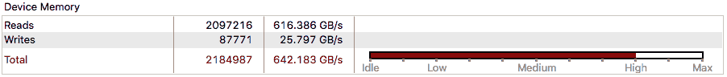

尽管它显示出了增加的带宽，但我们仍然有进一步增加的空间。让我们来看看如何实现更多的带宽。

# 平衡 I/O 吞吐量

从分析器得到的结果来看，局部变量 input 有大量的加载/存储请求。这样大量的 I/O 会影响线程块的调度，因为存在操作依赖。当前数据累积中最糟糕的是它对设备内存有依赖。因此，我们将使用额外的寄存器来发出更多的加载指令以减轻依赖。以下代码显示了我们如何做到这一点：

```cpp
#define NUM_LOAD 4
__global__ void
 reduction_kernel(float *g_out, float *g_in, unsigned int size)
{
    unsigned int idx_x = blockIdx.x * blockDim.x + threadIdx.x;

    extern __shared__ float s_data[];

    // cumulates input with grid-stride loop 
    // and save to the shared memory
    float input[NUM_LOAD] = {0.f};
    for (int i = idx_x; i < size; i += blockDim.x * 
         gridDim.x * NUM_LOAD)
    {
        for (int step = 0; step < NUM_LOAD; step++)
            input[step] += (i + step * blockDim.x * gridDim.x < size) ? 
                g_in[i + step * blockDim.x * gridDim.x] : 0.f;
    }
    for (int i = 1; i < NUM_LOAD; i++)
        input[0] += input[i];
    s_data[threadIdx.x] = input[0];

    __syncthreads();

    // do reduction
    for (unsigned int stride = blockDim.x / 2; stride > 0; 
         stride >>= 1)
    {
        if (threadIdx.x < stride)
            s_data[threadIdx.x] += s_data[threadIdx.x + stride];

        __syncthreads();
    }

    if (threadIdx.x == 0) {
        g_out[blockIdx.x] = s_data[0];
    }
}
```

这段代码使用了三个额外的寄存器来收集全局内存数据。`NUM_LOAD`的值可能会因 GPU 的不同而有所不同，因为它受 GPU 的内存带宽和 GPU 中 CUDA 核心数量的影响：

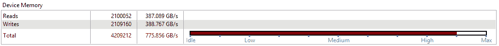

运行以下命令时，使用 Tesla V100 卡的性能达到了**0.264**毫秒：

```cpp
$ nvcc -run -m64 -gencode arch=compute_70,code=sm_70 -I/usr/local/cuda/samples/common/inc -o reduction ./reduction.cpp ./reduction_kernel_opt.cu
```

# warp 级原语编程

CUDA 9.0 引入了新的 warp 同步编程。这一重大变化旨在避免 CUDA 编程依赖隐式 warp 同步操作，并明确处理同步目标。这有助于防止 warp 级同步操作中的疏忽竞争条件和死锁。

从历史上看，CUDA 只提供了一个显式同步 API，即`__syncthreads()`用于线程块中的 CUDA 线程，并依赖于 warp 的隐式同步。下图显示了 CUDA 线程块操作的两个级别的同步：

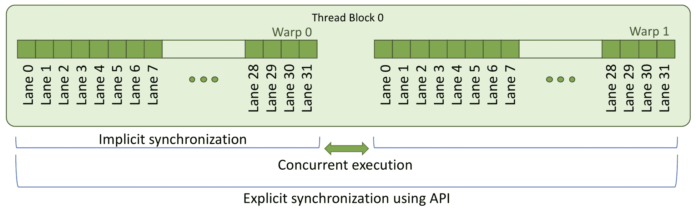

然而，最新的 GPU 架构（Volta 和 Turing）具有增强的线程控制模型，其中每个线程可以执行不同的指令，同时保持其 SIMT 编程模型。下图显示了它是如何改变的：

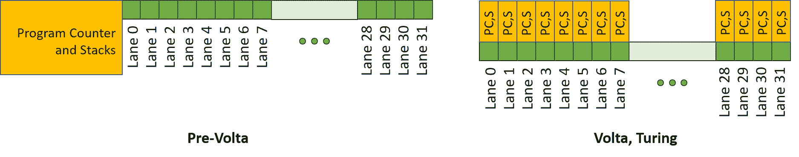

直到 Pascal 架构（左图），线程是在 warp 级别进行调度的，并且它们在 warp 内部隐式同步。因此，CUDA 线程在 warp 中隐式同步。然而，这可能会导致意外的死锁。

Volta 架构对此进行了改进，并引入了**独立线程调度**。这种控制模型使每个 CUDA 线程都有自己的程序计数器，并允许 warp 中的一组参与线程。在这个模型中，我们必须使用显式的同步 API 来指定每个 CUDA 线程的操作。

因此，CUDA 9 引入了显式的 warp 级原语函数：

|  | **warp 级原语函数** |
| --- | --- |
| **识别活动线程** | `__activemask()` |
| **屏蔽活动线程** | `__all_sync()`, `__any_sync()`, `__uni_sync()`, `__ballot_sync()``__match_any_sync()`, `__match_all_sync()` |
| **同步数据交换** | `__shfl_sync()`, `__shfl_up_sync()`, `__shfl_down_sync()`, `__shfl_xor_sync()` |
| **线程同步** | `__syncwarp()` |

有三类 warp 级原语函数，分别是 warp 识别、warp 操作和同步。所有这些函数都隐式地指定了同步目标，以避免意外的竞争条件。

# 使用 warp 原语进行并行归约

让我们看看这如何有益于我们的并行归约实现。这个示例将使用 Cooperative Groups 中的`shfl_down()`函数和 warp 原语函数中的`shfl_down_sync()`。下图显示了`shfl_down_sync()`如何与 shift down 操作一起工作：

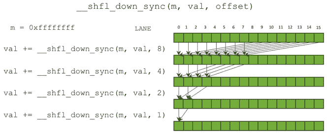

在这个集体操作中，warp 中的 CUDA 线程可以将指定的寄存器值移动到同一个 warp 中的另一个线程，并与其同步。具体来说，集体操作有两个步骤（第三个是可选的）：

1.  识别、屏蔽或投票源 CUDA 线程在一个 warp 中将进行操作。

1.  让 CUDA 线程移动数据。

1.  warp 中的所有 CUDA 线程都在同步（可选）。

对于并行归约问题，我们可以使用`__shfl_down_sync()`进行 warp 级别的归约。现在，我们可以通过以下图来增强我们的线程块级别的归约：

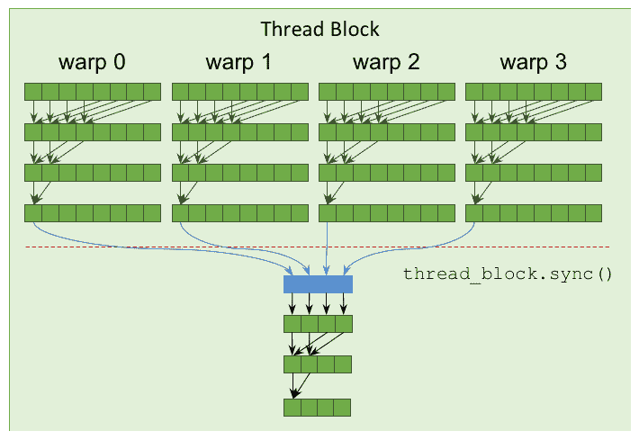

每个 warp 的归约结果都存储在共享内存中，以与其他 warp 共享。然后，通过再次进行 warp-wise 收集，可以获得最终的块级归约。

我们使用`__shfl_down_sync()`，因为我们只需要一个线程进行 warp 级别的归约。如果您需要让所有 CUDA 线程都进行 warp 级别的归约，可以使用`__shfl_xor_sync()`。

第一个块级别的归约的数量是网格的维度，输出存储在全局内存中。通过再次调用，我们可以使用 warp 级别的同步函数构建一个并行归约核。

现在，让我们使用 warp 级别的原始函数来实现 warp 级别的归约。首先，我们将编写一个使用 warp-shifting 函数进行 warp 级别归约的函数。以下代码显示了如何实现这一点：

```cpp
__inline__ __device__ float warp_reduce_sum(float val) {
    for (int offset = warpSize / 2; offset > 0; offset >>= 1) {
        unsigned int mask = __activemask();
        val += __shfl_down_sync(mask, val, offset);
    }
    return val;
}
```

对于 warp-shifting，我们需要让 CUDA 调度程序识别活动线程，并让 warp-shifting 函数进行归约。

第二步是使用先前的 warp 级别归约编写一个块级别的归约函数。我们将在共享内存中收集先前的结果，并从结果中进行第二次归约。以下代码显示了如何实现这一点：

```cpp
__inline__ __device__ float block_reduce_sum(float val) {
    // Shared mem for 32 partial sums
    static __shared__ float shared[32]; 
    int lane = threadIdx.x % warpSize;
    int wid = threadIdx.x / warpSize;

    val = warp_reduce_sum(val); // Warp-level partial reduction
    if (lane == 0)
        shared[wid] = val; // Write reduced value to shared memory
    __syncthreads(); // Wait for all partial reductions

    //read from shared memory only if that warp existed
    if (wid == 0) {
        val = (threadIdx.x < blockDim.x / warpSize) ? shared[lane] : 0;
        val = warp_reduce_sum(val); //Final reduce within first warp
    }
    return val;
}
```

现在，我们将实现归约核函数，累积输入数据，并从我们实现的块级归约中进行归约。由于我们只关注优化 warp 级别的优化，因此整体设计与之前的版本相同。以下代码显示了核函数：

```cpp
__global__ void
reduction_kernel(float *g_out, float *g_in, unsigned int size) {
    unsigned int idx_x = blockIdx.x * blockDim.x + threadIdx.x;
    // cumulates input with grid-stride loop and save to share memory
    float sum[NUM_LOAD] = { 0.f };
    for (int i = idx_x; i < size; i += blockDim.x * gridDim.x * NUM_LOAD) {
        for (int step = 0; step < NUM_LOAD; step++)
            sum[step] += (i + step * blockDim.x * gridDim.x < size) ? g_in[i + step * blockDim.x * gridDim.x] : 0.f;
    }
    for (int i = 1; i < NUM_LOAD; i++)
        sum[0] += sum[i];
    // warp synchronous reduction
    sum[0] = block_reduce_sum(sum[0]);

    if (threadIdx.x == 0)
        g_out[blockIdx.x] = sum[0];
}
```

然后，让我们使用以下命令编译代码：

```cpp
$ nvcc -run -m64 -gencode arch=compute_70,code=sm_70 -I/usr/local/cuda/samples/common/inc -o reduction ./reduction.cpp ./reduction_wp_kernel.cu
```

以下屏幕截图显示了执行时间的减少：

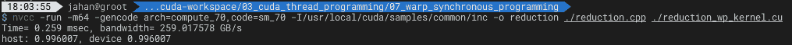

在主机代码修改上，没有从 warp 原语切换到协作组。因此，我们可以对两种归约实现使用相同的主机代码。

我们已经介绍了 CUDA 中的 warp 同步编程。它的应用不仅限于归约，还可以用于其他并行算法：扫描、双调排序和转置。如果您需要了解更多信息，可以查看以下文章：

+   [`on-demand.gputechconf.com/gtc/2017/presentation/s7622-Kyrylo-perelygin-robust-and-scalable-cuda.pdf`](http://on-demand.gputechconf.com/gtc/2017/presentation/s7622-Kyrylo-perelygin-robust-and-scalable-cuda.pdf)

+   [`devblogs.nvidia.com/using-cuda-warp-level-primitives/`](https://devblogs.nvidia.com/using-cuda-warp-level-primitives/)

+   [`devblogs.nvidia.com/faster-parallel-reductions-kepler/`](https://devblogs.nvidia.com/faster-parallel-reductions-kepler/)

+   [`on-demand.gputechconf.com/gtc/2013/presentations/S3174-Kepler-Shuffle-Tips-Tricks.pdf`](http://on-demand.gputechconf.com/gtc/2013/presentations/S3174-Kepler-Shuffle-Tips-Tricks.pdf)

# 灵活处理线程的协作组

CUDA 9.0 引入了一个名为**协作组**的新 CUDA 编程特性。这通过指定组操作来引入了一种新的 CUDA 编程设计模式。使用这个特性，程序员可以编写显式控制 CUDA 线程的 CUDA 代码。

首先，让我们看看协作组是什么，以及它的编程优势。

# CUDA 线程块中的协作组

协作组提供了显式的 CUDA 线程分组对象，帮助程序员更清晰、更方便地编写集体操作。例如，我们需要获取一个掩码来控制 warp 中活动的 CUDA 线程以进行 warp-shifting 操作。另一方面，协作组对象将可用的线程绑定为一个瓦片，并将它们作为一个对象进行控制。这为 CUDA C 编程带来了 C++语言的好处。

协作组的基本类型是`thread_group`。这使得 C++类样式的类型`thread_group`能够提供其配置信息，使用`is_valid()`、`size()`和`thread_rank()`函数。此外，这提供了可以应用于组中所有 CUDA 线程的集体函数。这些函数如下：

|  | thread_group 集体函数 |
| --- | --- |
| **识别活动线程** | `tiled_partition()`, `coalesced_threads()` |
| **屏蔽活动线程** | `any()`, `all()`, `ballot()``match_any()`, `match_all()` |
| **同步数据交换** | `shfl()`, `shfl_up()`, `shfl_down()`, `shfl_xor()` |
| **线程同步** | `sync()` |

这些函数列表类似于 warp 级别的原始函数。因此，warp 级别的原始操作可以用协作组替换。`thread_group`可以被较小的`thread_group`、`thread_block_tile`或`coalesced_group`分割。

协作组还提供了线程块编程的灵活性。使用以下代码行，我们可以处理一个线程块：

```cpp
thread_block block = this_thread_block();
```

`thread_block`提供了 CUDA 内置关键字包装函数，我们使用它来获取块索引和线程索引：

```cpp
dim3 group_index();  // 3-dimensional block index within the grid
dim3 thread_index(); // 3-dimensional thread index within the block
```

我们可以使用`this_thread_block()`来获取一个线程块对象，如下所示：

```cpp
thread_block block = this_thread_block();
```

现在，让我们看看协作组的好处与传统的 CUDA 内置变量相比有什么好处。

# 协作组的好处

使用协作组提供了更多的 C++可编程性，而不是使用传统的 CUDA 内置变量。使用`thread_block`组，您可以将您的内核代码从使用内置变量切换到协作组的索引。但是，协作组的真正力量不仅仅如此。让我们在以下部分介绍其优势。

# 模块化

使用协作组，程序员可以将集体操作的内核代码模块化，对应于屏障目标。这有助于避免假设所有线程都在同时运行而导致的疏忽，从而引发死锁和竞争条件。以下是 CUDA 线程同步的死锁和正常操作的示例：

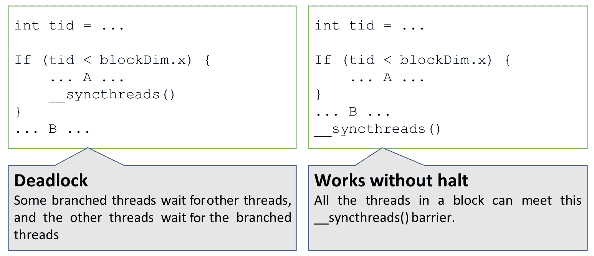

对于左侧的示例，内核代码意图同步 CUDA 线程块中的一部分线程。通过指定屏障目标，此代码最小化了同步开销。然而，它引入了死锁情况，因为`__syncthreads()`调用了一个屏障，等待所有 CUDA 线程到达屏障。然而，`__synchthroead()`无法满足其他线程的要求并等待。右侧的示例显示了良好的操作，因为它没有任何死锁点，因为线程块中的所有线程都可以满足`__syncthreads()`。

在协作组 API 中，CUDA 程序员指定线程组进行同步。协作组使得显式同步目标成为可能，因此程序员可以让 CUDA 线程显式同步。这个项目也可以被视为一个实例，因此我们可以将实例传递给设备函数。

以下代码显示了协作组如何提供显式同步对象并将它们作为实例处理：

```cpp
__device__ bar(thread_group block, float *x) {
    ...
    block.sync();
    ...
}

__global__ foo() {
    bar(this_thread_block(), float *x);
}
```

正如在前面的示例代码中所示，内核代码可以指定同步组并将它们作为`thread_group`参数传递。这有助于我们在子例程中指定同步目标。因此，程序员可以通过使用协作组来防止意外死锁。此外，我们可以将不同类型的组设置为`thread_group`类型并重用同步代码。

# 显式分组线程的操作和避免竞争条件

协作组通过在 warp 中平铺线程来支持 warp 级协作操作。如果 tile 大小与 warp 大小匹配，CUDA 可以省略 warps 的隐式同步，确保正确的内存操作以避免竞争条件。通过消除隐式同步，可以增强 GPU 的性能。从历史上看，有经验的 CUDA 程序员使用分离的 warps 进行 warp 级同步。这意味着 warp 中的协作操作不必与其他 warp 操作同步。这释放了 GPU 的性能。但是，这是有风险的，因为它引入了协作操作之间的竞争条件。

# 动态活动线程选择

CUDA Cooperative Groups 的另一个好处是程序员可以选择 warp 中的活动线程，以避免分支分歧效应。由于 CUDA 是 SIMT 架构，一个指令单元发出一组线程，并且如果它们遇到分支，就无法禁用分歧。但是，从 CUDA 9.0 开始，程序员可以使用`coalesced_threads()`选择在分支块中活动的线程。这通过禁用不参与分支的线程返回聚合的线程。然后，SM 的指令单元发出下一个活动线程组中的活动线程。

# 应用于并行减少

我们将更新以前的减少内核代码以使用协作组。从以前的内核代码中，您可以轻松应用协作组的`thread_block`，如下所示：

```cpp
__global__ void
 reduction_kernel(float* g_out, float* g_in, unsigned int size)
{
    unsigned int idx_x = blockIdx.x * blockDim.x + threadIdx.x;

    thread_block block = this_thread_block();

    extern __shared__ float s_data[];
```

我们不必更新数据输入累积部分，因此让我们为每个线程块更新减少部分。以下代码显示了一个块大小的减少的示例：

```cpp
    // do reduction
    for (unsigned int stride = block.group_dim().x / 2; stride > 0; 
         stride >>= 1) {
        if (block.thread_index().x < stride) {
            s_data[block.thread_index().x] += 
                s_data[block.thread_index().x + stride];
            block.sync(); // threads synchronization in a branch
        }
    }
}
```

使用以下命令的估计操作性能为 0.264 毫秒：

```cpp
$ nvcc -run -m64 -gencode arch=compute_70,code=sm_70 -I/usr/local/cuda/samples/common/inc -o reduction_cg -rdc=true ./reduction.cpp ./reduction_cg_kernel.cu 
```

前面的命令显示了与以前版本相同的性能。

# 协作组以避免死锁

协作组可以支持独立的 CUDA 线程调度。因此，我们可以使用一个组单独控制 CUDA 线程，并显式地对它们进行同步。目标组可以是预定义的 tile，但也可以根据条件分支确定，如下所示：

```cpp
// do reduction
for (unsigned int stride = block.group_dim().x / 2; stride > 0; 
     stride >>= 1) {
    // scheduled threads reduce for every iteration
    // and will be smaller than a warp size (32) eventually.
    if (block.thread_index().x < stride) { 
        s_data[block.thread_index().x] += s_data[
                       block.thread_index().x + stride];

        // __syncthreads(); // (3) Error. Deadlock.
        // block.sync();    // (4) Okay. Benefit of Cooperative Group
    }
    // __syncthreads();     // (1) Okay
    block.sync();           // (2) Okay
}
```

这段代码有四种线程块同步选项。选项`(1)`和`(2)`是具有不同 API 的等效操作。另一方面，选项`(3)`和`(4)`则不是。选项`(3)`引入了 CUDA 线程的死锁，主机无法返回 CUDA 内核，因为活动的 CUDA 线程无法与未激活的 CUDA 线程同步。另一方面，选项`(4)`由于协作组的自动活动线程识别而起作用。这有助于我们避免意外错误并轻松开发复杂的算法。

NVIDIA 提供了有关协作组的详细描述，可以在以下文档中找到：

+   [`devblogs.nvidia.com/cuda-9-features-revealed`](https://devblogs.nvidia.com/cuda-9-features-revealed)

+   [`on-demand.gputechconf.com/gtc/2017/presentation/s7622-Kyrylo-perelygin-robust-and-scalable-cuda.pdf`](http://on-demand.gputechconf.com/gtc/2017/presentation/s7622-Kyrylo-perelygin-robust-and-scalable-cuda.pdf)

您还可以从`cooperative_groups.h`本身了解其架构和完整的 API 列表。

# CUDA 内核中的循环展开

CUDA 也可以像其他编程语言一样受益于循环展开。通过这种技术，CUDA 线程可以减少或消除循环控制开销，例如*循环结束*测试每次迭代，分支惩罚等。

如果 CUDA 可以识别循环的迭代次数，它会自动展开小循环。程序员还可以使用`#pragma unroll`指令向编译器提供提示，或者将循环代码重写为一组独立的语句。应用循环展开很简单，因此您可以轻松应用到当前的工作代码中。

让我们将这应用到我们的并行减少实现中。就像 C/C++中的普通循环展开指令一样，我们可以在`for`循环的顶部放置`#pragma`循环展开指令。NVCC 编译器可以展开循环，因为编译器可以自行获得`group.size()`的确切大小：

```cpp
template <typename group_t>
__inline__ __device__ float
 warp_reduce_sum(group_t group, float val)
{
    #pragma unroll
    for (int offset = group.size() / 2; offset > 0; offset >>= 1)
        val += group.shfl_down(val, offset);
    return val;
}
```

使用以下命令，估计的操作性能为 0.263 毫秒：

```cpp
$ nvcc -run -m64 -gencode arch=compute_70,code=sm_70 -I/usr/local/cuda/samples/common/inc -o reduction_cg -rdc=true ./reduction.cpp ./reduction_cg_kernel.cu
```

如果您更喜欢使用 warp 原始函数，可以像下面这样编写`warp_reduce_sum`。循环代码可以通过用`warpSize`替换`group.size()`来重用，但在这种情况下稍微更快：

```cpp
#define FULL_MASK 0xFFFFFFFF
__inline__ __device__ float
warp_reduce_sum(float val) {
#pragma unroll 5
    for (int offset = 1; offset < 6; offset++)
        val += __shfl_down_sync(FULL_MASK, val, warpSize >> offset);
    return val;
}
```

运行以下命令来编译上述代码：

```cpp
nvcc -run -m64 -gencode arch=compute_70,code=sm_70 -I/usr/local/cuda/samples/common/inc -o reduction_wp -rdc=true ./reduction.cpp ./reduction_wp_kernel.cu
```

其结果是 0.263 毫秒，与先前的结果相同。

使用循环展开存在一个陷阱。展开的代码执行可能导致寄存器使用增加而降低占用率。此外，由于代码执行大小增加，可能会出现更高的指令缓存未命中惩罚。

# 原子操作

在 CUDA 编程中，程序员可以使用原子 API 从多个 CUDA 线程更新共享资源。这些原子 API 保证消除对共享资源的竞争条件，因此我们可以期望并行执行产生一致的输出。这个操作对于获取统计参数（如直方图、均值、总和等）特别有用。我们还可以简化代码实现。例如，可以使用以下代码中的`atomicAdd()`函数编写减少操作：

```cpp
__global__ void
 atomic_reduction_kernel(float *data_out, float *data_in, int size)
 {
     int idx_x = blockIdx.x * blockDim.x + threadIdx.x;
     atomicAdd(&data_out[0], data_in[idx_x]);
 }
```

正如您所看到的，原子函数简化了所需的操作。但是，由于原子操作将所有请求串行化到共享资源，因此其性能较慢。运行以下命令查看执行时间：

```cpp
$ nvcc -run -m64 -gencode arch=compute_70,code=sm_70 -I/usr/local/cuda/samples/common/inc -o mixed_precision_single ./mixed_precision.cu
```

这个显示的内核函数在我的 Tesla V100 上花费了 39 毫秒，比原始版本（4.609 毫秒）慢得多。因此，建议的原子操作使用是只在必要时限制请求。例如，对于并行减少问题，我们可以在某个级别并行减少项目，并使用原子操作输出最终结果。

下图显示了另一种可能的方法。这将块内减少替换为`atomicAdd`：

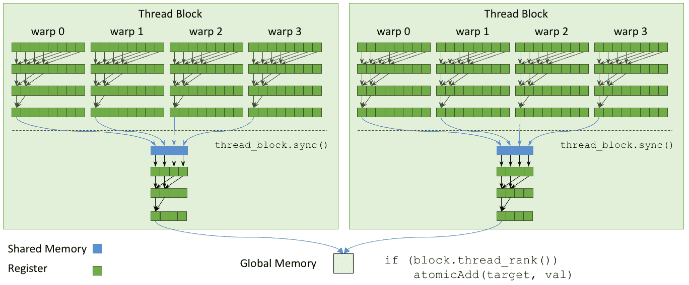

在上图中，我们可以看到有两个减少点：一个是**warp**，一个是**线程块**，并且，块内减少结果通过单个全局内存变量原子地累积。因此，我们可以消除第二次减少迭代。以下截图显示了第二次减少迭代的内核优化优先级（左侧）和性能限制分析（右侧）：

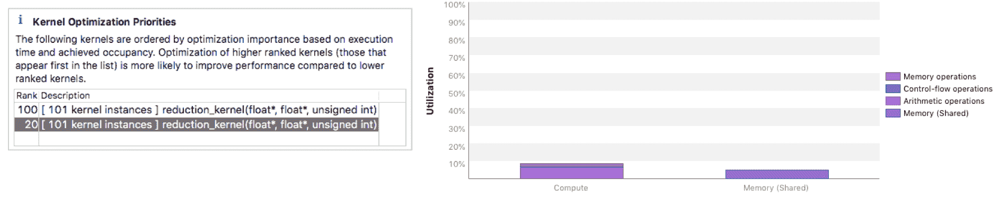

内核优化优先级与性能限制分析（第二次迭代）

换句话说，第二次迭代的性能受其较小的网格大小的延迟限制。因此，通过删除这一点，我们将能够减少执行时间。

现在让我们实现该设计并看看性能如何改变。我们只需要更新减少内核函数的最后部分：

```cpp
__global__ void
 reduction_kernel(float* g_out, float* g_in, unsigned int size)
{
    unsigned int idx_x = blockIdx.x * (2 * blockDim.x) + threadIdx.x;

    thread_block block = this_thread_block();

    // cumulates input with grid-stride loop and save to share memory
    float sum[NUM_LOAD] = { 0.f };
    for (int i = idx_x; i < size; i += blockDim.x 
         * gridDim.x * NUM_LOAD)
    {
        for (int step = 0; step < NUM_LOAD; step++)
            sum[step] += (i + step * blockDim.x * gridDim.x < size) ? 
                         g_in[i + step * blockDim.x * gridDim.x] : 0.f;
    }
    for (int i = 1; i < NUM_LOAD; i++)
        sum[0] += sum[i];
    // warp synchronous reduction
    sum[0] = block_reduce_sum(block, sum[0]);

    sum[0] = block_reduce_sum(sum[0]);

    // Performing Atomic Add per block
    if (block.thread_rank() == 0) {
        atomicAdd(&g_out[0], sum);
    }
}
```

然后，我们将删除第二次迭代函数调用。因此，如果原子操作的延迟短于那个，我们可以消除内核调用延迟并实现更好的性能。运行以下命令：

```cpp
$ nvcc -run -m64 -gencode arch=compute_70,code=sm_70 -I/usr/local/cuda/samples/common/inc -o reduction_atomic_block ./reduction.cpp ./reduction_blk_atmc_kernel.cu
```

幸运的是，在 Tesla V100 上估计的执行时间为 0.259 毫秒，因此我们可以获得稍微增强的结果。

如果您想了解 CUDA C 中原子操作的更多信息，请查看此链接的编程指南：[`docs.nvidia.com/cuda/cuda-c-programming-guide/index.html#atomic-functions`](https://docs.nvidia.com/cuda/cuda-c-programming-guide/index.html#atomic-functions)。

# 低/混合精度操作

混合精度是一种探索低精度并获得高精度结果的技术。这种技术使用低精度计算核心操作，并使用高精度操作生成输出。与高精度计算相比，低精度操作计算具有减少内存带宽和更高的计算吞吐量的优势。如果低精度足以从具有高精度的应用程序中获得目标精度，这种技术可以通过这种权衡来提高性能。NVIDIA 开发者博客介绍了这种可编程性：[`devblogs.nvidia.com/mixed-precision-programming-cuda-8`](https://devblogs.nvidia.com/mixed-precision-programming-cuda-8)。

在这些情况下，CUDA 将其支持扩展到低于 32 位数据类型的低精度工具，例如 8/16 位整数（INT8/INT16）和 16 位浮点数（FP16）。对于这些低精度数据类型，GPU 可以使用一些特定的 API 进行**单指令，多数据**（**SIMD**）操作。在本节中，我们将研究这两种用于混合精度目的的低精度操作的指令。

要从中受益，您需要确认您的 GPU 是否支持低混合精度操作和支持的数据类型。特定 GPU 支持低精度计算是可能的，精度取决于 GPU 芯片组。具体来说，GP102（Tesla P40 和 Titan X），GP104（Tesla P4）和 GP106 支持 INT8；GP100（Tesla P100）和 GV100（Tesla V100）支持 FP16（半精度）操作。Tesla GV100 兼容 INT8 操作，没有性能下降。

CUDA 具有一些特殊的内置函数，可以为低精度数据类型启用 SIMD 操作。

# 半精度操作

CUDA 为半精度浮点数据类型（FP16）提供了内置函数，并且开发人员可以选择 CUDA 是否为每条指令计算一个或两个值。CUDA 还提供了单精度和半精度之间的类型转换函数。由于 FP16 的精度限制，您必须使用转换内置函数来处理单精度值。

现在，让我们实现和测试 GPU 的 FP16 操作。GPU 可以支持高于计算能力 5.3 的这种类型的本机计算。但是有些 GPU 不支持这一点，因此请仔细检查您的 GPU 是否支持这种半精度操作。

CUDA C 中的半精度数据类型是`half`，但您也可以使用`__half`类型。对于 API，CUDA 提供了与此数据类型相关的内置函数，例如`__hfma()`、`__hmul()`和`__hadd()`。这些内置函数还提供了使用`__hfma2()`、`__hmul2()`和`__hadd2()`一次处理两个数据的本机操作。使用这些函数，我们可以编写混合精度操作的核心代码：

```cpp
__global__ void hfma_kernel(half *d_x, half *d_y, float *d_z, int size)
 {
     int idx_x = blockIdx.x * blockDim.x + threadIdx.x;
     int stride = gridDim.x * blockDim.x;

     half2 *dual_x = reinterpret_cast<half2*>(d_x);
     half2 *dual_y = reinterpret_cast<half2*>(d_y);
     float2 *dual_z = reinterpret_cast<float2*>(d_z);

     extern __shared__ float2 s_data[];

 #if __CUDA_ARCH__ >= 530
     for (int i = idx_x; i < size; i+=stride) {
         s_data[threadIdx.x] = __half22float2(__hmul2(dual_y[i], 
                                                      dual_x[i]));
         __syncthreads();
         dual_z[i] = s_data[threadIdx.x];
     }
     #else
     for (int i = idx_x; i < size; i+=stride) {
         s_data[threadIdx.x] = __half22float2(dual_x[i]) * 
                               __half22float2(dual_y[i]);
         __syncthreads();
         dual_z[i] = s_data[threadIdx.x];
     }
     #endif
 }
```

对于那些不支持本机半精度操作的 GPU，我们的代码在编译时检查 CUDA 的计算能力，并确定应采取哪种操作。

以下代码调用了半精度网格大小的核函数，因为每个 CUDA 线程将操作两个数据：

```cpp
int n_threads = 256;
int num_sms;
int num_blocks_per_sm;
cudaDeviceGetAttribute(&num_sms, cudaDevAttrMultiProcessorCount, 0);
cudaOccupancyMaxActiveBlocksPerMultiprocessor(&num_blocks_per_sm,   
    hfma_kernel, n_threads, n_threads*sizeof(float2));
int n_blocks = min(num_blocks_per_sm * num_sms, 
                   (size/2 + n_threads - 1) / n_threads);
hfma_kernel<<< n_blocks, n_threads, n_threads * sizeof(float2) 
               >>>(X.d_ptr_, Y.d_ptr_, Z.d_ptr_, size/2);
```

其他初始化代码和基准代码在示例配方代码中实现，因此请查看它。

我们已经涵盖了 FP16 精度操作中的 FMA 操作。CUDA C 提供了各种半精度操作（[`docs.nvidia.com/cuda/cuda-math-api/group__CUDA__MATH__INTRINSIC__HALF.html`](https://docs.nvidia.com/cuda/cuda-math-api/group__CUDA__MATH__INTRINSIC__HALF.html)）。请查看其他操作。

# 8 位整数和 16 位数据的点积运算和累加（DP4A 和 DP2A）

对于 8 位/16 位整数，CUDA 提供了矢量化的点积操作。这些是 DP4A（四元素点积累加）和 DP2A（两元素点积累加）。使用这些函数，CUDA 开发人员可以进行更快的操作。CUDA 8.0 开发博客通过直观的图示介绍了这些函数 ([`devblogs.nvidia.com/mixed-precision-programming-cuda-8/`](https://devblogs.nvidia.com/mixed-precision-programming-cuda-8/))。以下显示了 GPU 的点积和累加操作的工作原理：

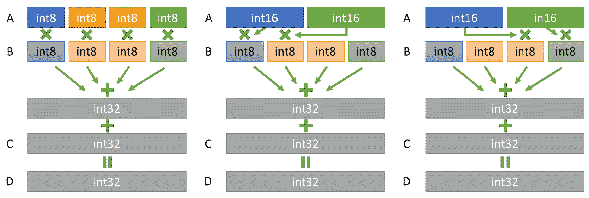

使用这个，你可以编写只有 8 位或 8 位/16 位混合操作的 32 位整数累加。其他操作，如求和、加法和比较，也可以使用 SIMD 内在函数。

如前所述，有特定的 GPU 可以支持 INT8/INT16 操作，具有特殊功能（`dp4a`和`dp2a`）。支持的 GPU 的计算能力必须高于 6.1。

现在，让我们实现一个使用`dp4a`API 的内核函数，如下所示：

```cpp
__global__ void dp4a_kernel(char *d_x, char *d_y, int *d_z, int size)
 {
     int idx_x = blockIdx.x * blockDim.x + threadIdx.x;
     int stride = gridDim.x * blockDim.x;

 #if __CUDA_ARCH__ >= 610
     char4 *quad_x = (char4 *)d_x;
     char4 *quad_y = (char4 *)d_y;

     for (int i = idx_x; i < size; i+=stride)
         d_z[i] = __dp4a(quad_y[i], quad_x[i], 0);
 #else
     for (int i = idx_x; i < size; i+=4*stride) {
         int sum = 0;
         for (int j = 0; j < 4; j++)
             sum += d_y[4 * i + j] * d_x[4 * i + j];
         d_z[i] = sum + 0;
     }
 #endif
 }
```

在这个函数中，`__dp4a`获取两个字符数组，合并四个项目，并输出其点积输出。自帕斯卡以来，这个 API 就得到了支持，具有 CUDA 计算能力（版本 6.1）。但是旧的 GPU 架构，低于版本 6.1，需要使用原始操作。

以下代码显示了我们将如何调用实现的内核函数。由于每个 CUDA 线程将操作四个项目，其网格大小减小了四倍：

```cpp
int n_threads = 256;
int num_sms;
int num_blocks_per_sm;
cudaDeviceGetAttribute(&num_sms, cudaDevAttrMultiProcessorCount, 0);
cudaOccupancyMaxActiveBlocksPerMultiprocessor(&num_blocks_per_sm, 
    dp4a_kernel, n_threads, n_threads*sizeof(int));
int n_blocks = min(num_blocks_per_sm * num_sms, (size/4 + n_threads 
                                                  - 1) / n_threads);
dp4a_kernel<<< n_blocks, n_threads, n_threads * sizeof(int) >>>  
    (X.d_ptr_, Y.d_ptr_, Z.d_ptr_, size/4);
```

其他初始化代码和基准代码都在示例代码中实现，就像前面的示例代码一样。

我们已经介绍了 INT8 的点操作，但 CUDA C 还提供了其他 INT8 类型的 SIMD 内在函数（[`docs.nvidia.com/cuda/cuda-math-api/group__CUDA__MATH__INTRINSIC__SIMD.html`](https://docs.nvidia.com/cuda/cuda-math-api/group__CUDA__MATH__INTRINSIC__SIMD.html)）。请查阅此文档以了解其他操作。

# 性能测量

示例代码有三个混合精度操作的版本：单精度、半精度和 INT8。随着精度的降低，我们可以为每个 CUDA 线程添加更多的操作。

运行以下命令进行单精度、半精度和 INT8 操作：

```cpp
# Single-precision
$ nvcc -run -m64 -gencode arch=compute_70,code=sm_70 -I/usr/local/cuda/samples/common/inc -o mixed_precision_single ./mixed_precision.cu

# Half-precision
$ nvcc -run -m64 -gencode arch=compute_70,code=sm_70 -I/usr/local/cuda/samples/common/inc -o mixed_precision_half ./mixed_precision_half.cu

# INT8 
$ nvcc -run -m64 -gencode arch=compute_70,code=sm_70 -I/usr/local/cuda/samples/common/inc -o mixed_precision_int ./mixed_precision_int.cu
```

以下表格显示了每种精度操作的估计性能：

| 精度 | 测得的性能 |
| --- | --- |
| FP32 | 59.441 GFlops |
| FP16 | 86.037 GFlops |
| INT8 | 196.225 Gops |

由于我们的实现没有经过优化，所以测得的性能比 Tesla V100 的理论性能要低得多。当你对它们进行分析时，它们会报告它们的内存绑定性很高。换句话说，我们需要优化它们，使它们在算术上受限，以接近理论性能。

# 总结

在本章中，我们介绍了如何配置 CUDA 并行操作并对其进行优化。为了做到这一点，我们必须了解 CUDA 的分层体系结构线程块和流多处理器之间的关系。通过一些性能模型——占用率、性能限制分析和 Roofline 模型——我们可以优化更多性能。然后，我们介绍了一些新的 CUDA 线程可编程性，合作组，并学习了如何简化并行编程。我们优化了并行减少问题，并在 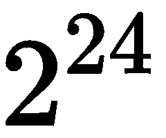 元素中实现了 0.259 毫秒，这是与相同 GPU 相比速度提高了 17.8。最后，我们了解了 CUDA 的半精度（FP16）和 INT8 精度的 SIMD 操作。

本章我们的经验集中在 GPU 的并行处理级别编程上。然而，CUDA 编程包括系统级编程。基本上，GPU 是额外的计算资源，独立于主机工作。这增加了额外的计算能力，但另一方面也可能引入延迟。CUDA 提供了可以利用这一点并隐藏延迟并实现 GPU 的全面性能的 API 函数。我们将在下一章中介绍这一点。
