# CUDA 应用程序分析和调试

CUDA 为开发人员提供了许多编程工具。这些工具包括编译器、分析器、IDE 及其插件、调试器和内存检查器。了解这些工具将有助于您分析您的应用程序，并帮助您完成我们将要涵盖的开发项目。在本章中，我们将介绍这些工具的基本用法，并讨论如何将它们应用到应用程序开发中。

本章将涵盖以下主题：

+   在 GPU 应用程序中进行专注的分析目标范围

+   针对远程机器的可视化分析

+   使用 CUDA 错误调试 CUDA 应用程序

+   使用 CUDA Assert 断言本地 GPU 值

+   使用 Nsight Visual Studio Edition 调试 CUDA 应用程序

+   使用 Nsight Eclipse Edition 调试 CUDA 应用程序

+   使用 CUDA-GDB 调试 CUDA 应用程序

+   使用 CUDA-memcheck 进行运行时验证

# 技术要求

为了完成本章，建议您使用 Pascal 架构之后的 NVIDIA GPU 卡。换句话说，您的 GPU 的计算能力应该等于或大于 60。如果您不确定您的 GPU 架构，请访问 NVIDIA 的网站[`developer.nvidia.com/cuda-gpus`](https://developer.nvidia.com/cuda-gpus)，并确认您的 GPU 的计算能力。

本章的示例代码已经使用 CUDA Toolkit 的 10.1 版本进行开发和测试。一般来说，如果适用的话，建议您使用最新的 CUDA 版本。

# 在 GPU 应用程序中进行专注的分析目标范围

NVIDIA 的 Visual Profiler 是一个方便的工具，用于找出 GPU 应用程序中的瓶颈并理解它们的操作。虽然它提供了应用程序操作的流畅信息，但如果您只想专注于特定代码区域，这些信息可能会显得多余。在这种情况下，限制分析范围更加高效。

分析目标可以是特定的代码块、GPU 和时间。指定代码块称为**专注分析**。当您想要专注于特定内核函数的分析，或者在大型 GPU 应用程序的一部分上进行分析时，这种技术是有用的。在我们介绍专注分析后，将介绍针对 GPU 或时间的分析目标。

# 限制代码中的分析目标

为了从专注的分析中受益，您可能希望在源代码中包含特色的头文件，如下所示：

```cpp
#include <cuda_profiler_api.h>
```

然后，您可以使用`cudaProfilerStart()`和`cudaProfilerStop()`来指定您的分析范围：

```cpp
cudaProfilerStart();
... {target of profile} ...
cudaProfilerStop();
```

现在，您需要使用特定标志`--profile-from-start`来分析您的应用程序。

这个选项不会让分析器开始分析，直到请求到达。如果您想使用 NVIDIA Visual Profiler 来分析您的应用程序，请确保在设置视图中勾选“启动时启用分析”复选框。

以下步骤涵盖了如何使用一些简单的示例代码来控制 NVIDIA 分析器。为了使这更容易，我们将重用我们在第三章中用于矩阵乘法操作的示例代码，*CUDA 线程编程*：

1.  编写一个 CUDA 应用程序，其中包含两个简单的 SGEMM CUDA 内核函数。这两个内核函数是相同的，但名称不同，即`sgemm_kernel_A()`和`sgemm_kernel_B()`。

1.  进行两次迭代调用，如下所示：

```cpp
int n_iter = 5;
for (int i = 0; i < n_iter; i++)
    sgemm_gpu_A(d_A, d_B, d_C, N, M, K, alpha, beta);
for (int i = 0; i < n_iter; i++)
    sgemm_gpu_B(d_A, d_B, d_C, N, M, K, alpha, beta);
```

1.  现在，让我们编译代码并使用`nvprof`进行分析：

```cpp
$ nvcc -m64 -gencode arch=compute_70,code=sm_70 -o sgemm sgemm.cu
$ nvprof -f -o profile-original.nvvp ./sgemm
```

当您使用 Visual Profiler 打开生成的`profile-original.nvvp`文件时，您将得到如下的分析结果：

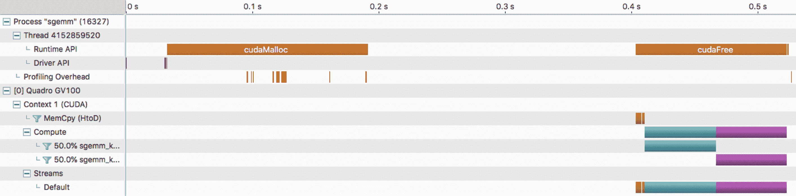

这个时间轴包括了应用程序启动时的整个分析信息。然而，当我们想要优化我们的内核函数时，我们可以说分析结果包含了不必要的信息。

以下步骤涵盖了如何指定分析专注区域：

1.  在源代码顶部放置 `#include <cuda_profiler_api.h>` 以启用专注分析 API。然后，我们可以使用 `cudaProfilerStart()` 和 `cudaProfilerStop()` 来包含我们感兴趣的区域，如下所示：

```cpp
cudaProfilerStart();
for (int i = 0; i < n_iter; i++)
    sgemm_gpu_B(d_A, d_B, d_C, N, M, K, alpha, beta);
cudaProfilerStop();
```

1.  编译您的代码并使用 Visual Profiler 查看更新后的分析结果。我们必须向分析器提供 `--profile-from-start off` 选项，如下所示：

```cpp
$ nvcc -m64 -gencode arch=compute_70,code=sm_70 -o sgemm sgemm.cu
$ nvprof -f -o profile-start-stop.nvvp --profile-from-start off ./sgemm
```

当您打开新生成的分析结果时，分析器只会报告应用程序的指定部分，如下所示：

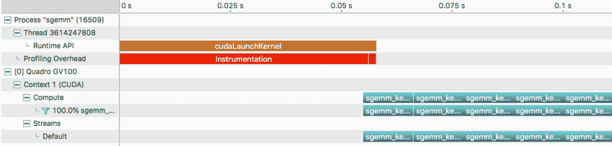

分析结果受限。上面的屏幕截图显示了内核执行的情况，从开始 GPU 执行时开始。因此，您可以省去对应用程序初始化和其他无关操作进行分析的步骤。

总之，专注分析有几个好处，如下所示：

+   这有助于您专注于当前正在开发的模块。

+   它可以让您在分析报告中删除无关的操作，例如：

+   与您的代码无关的外部模块行为

+   应用程序初始化延迟

+   在时间轴视图中查找目标函数时，这有助于节省时间。

# 通过时间或 GPU 限制分析目标

NVIDIA 分析器还有其他可以限制分析目标的选项。您也可以使用以下选项进行专注分析：

+   `--timeout <second>` 选项限制应用程序的执行时间。当您需要分析执行时间较长的迭代操作的应用程序时，此选项非常有用。

+   `--devices <gpu ids>` 选项指定要进行分析的 GPU。该选项帮助您在多 GPU 应用程序中缩小 GPU 内核操作的范围。

此外，如果您只想专注于少数内核函数，您不必收集所有指标。您可以使用 `--kernels`、`--event` 和 `--metrics` 选项向分析器指定您的兴趣。您可以将这些选项与其他分析选项一起使用，如下所示：

```cpp
$ nvprof -f -o profile_kernels_metric.nvvp --kernels sgemm_kernel_B --metrics all ./sgemm
```

将收集的指标导入时间轴分析结果后，您会发现目标内核只有指标信息。

在 CPU 抽样中有许多其他多功能的分析特性，例如标记分析范围、OpenMP 和 OpenACC 分析等。如果您想了解 NVIDIA 分析器的功能，请查看 NVIDIA 的 Jeff Larkin 提供的以下分析器介绍讲座：[`www.olcf.ornl.gov/wp-content/uploads/2018/12/summit_workshop_Profilers.pdf`](https://www.olcf.ornl.gov/wp-content/uploads/2018/12/summit_workshop_Profilers.pdf)。

NVIDIA 的官方分析器用户指南提供了有关 NVIDIA 分析器功能的详细信息 ([`docs.nvidia.com/cuda/profiler-users-guide/index.html`](https://docs.nvidia.com/cuda/profiler-users-guide/index.html.)).

# 使用 NVTX 进行分析

通过专注分析，我们可以使用 `cudaProfilerStart()` 和 `cudaProfilerStop()` 对有限的特定区域进行分析。但是，如果我们想要分析复杂应用程序中的功能性能，这是有限的。对于这种情况，CUDA 分析器通过 **NVIDIA 工具扩展** (**NVTX**) 提供时间轴注释。

使用 NVTX，我们可以对 CUDA 代码进行注释。我们可以使用 NVTX API 如下：

```cpp
nvtxRangePushA("Annotation");
.. { Range of GPU operations } ..
cudaDeviceSynchronization();     // in case if the target code block is pure kernel calls
nvtxRangePop();
```

如您所见，我们可以将一段代码定义为一组代码，并手动注释该范围。然后，CUDA 分析器提供注释的时间轴跟踪，以便我们可以测量代码块的执行时间。这种方法的一个缺点是 NVTX API 是主机函数，因此如果目标代码块是纯 GPU 内核调用，则需要同步主机和 GPU。

要了解更多信息，请将此 NVTX 代码应用于前面的专注分析示例。首先，我们应该包含一个 NVTX 头文件，如下所示：

```cpp
#include "nvToolsExt.h"
```

然后，我们将在几个地方插入 `nvtxRangePushA()` 和 `nvtxRangePop()`，如下所示：

```cpp
    cudaProfileStart();
    // copy initial value for gpu memory
    nvtxRangePushA("Data Transfer");
    cudaMemcpy(d_A, A, N * K * sizeof(float), cudaMemcpyHostToDevice);
    cudaMemcpy(d_B, A, K * M * sizeof(float), cudaMemcpyHostToDevice);
    cudaMemcpy(d_C, A, N * M * sizeof(float), cudaMemcpyHostToDevice);
    nvtxRangePop();

    nvtxRangePushA("Kernel Execution");
    // do operation
    nvtxRangePushA("Kernel A");
    for (int i = 0; i < n_iter; i++)
        sgemm_gpu_A(d_A, d_B, d_C, N, M, K, alpha, beta);
    cudaDeviceSynchronize();
    nvtxRangePop();    // Kernel A

    nvtxRangePushA("Kernel B");
    for (int i = 0; i < n_iter; i++)
        sgemm_gpu_B(d_A, d_B, d_C, N, M, K, alpha, beta);
    cudaDeviceSynchronize();

    nvtxRangePop();    // Kernel B
    nvtxRangePop();    // Kernel Execution
    cudaProfileStop();
```

在上面的代码中，我们已经扩大了关注的配置文件区域，以监视 NVTX 操作。我们还有`Data Transfer`、`Kernel A`、`Kernel B`和`Kernel Execution`作为 NVTX 范围。NVTX 支持多级注释，因此`Kernel A`和`Kernel B`范围将包含在`Kernel Execution`时间轴中。

要编译代码，我们应该为`nvcc`编译器提供`-lnvToolsExt`选项来提供 NVTX API 的定义。我们可以使用以下命令编译代码：

```cpp
$ nvcc -m64 -gencode arch=compute_70,code=sm_70 -lnvToolsExt -o sgemm sgemm.cu
```

然后，NVIDIA 分析器可以在没有额外选项的情况下收集 NVTX 注释。我们可以使用以下命令对应用程序进行分析：

```cpp
$ nvprof -f --profile-from-start off -o sgemm.nvvp ./sgemm.nvvp
```

以下屏幕截图显示了时间轴分析结果。在这个截图中，我们可以看到用绿色标记的标记和范围。这些绿色条有注释：

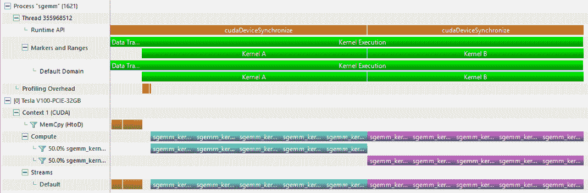

前面的屏幕截图为我们提供了以下信息：

+   我们可以通过 NVTX 注释来确定内存复制操作的位置。

+   我们可以通过包装区域来划分功能位置，例如`kernel A`和`kernel B`。

+   NVTX 注释可以堆叠多个级别的注释。正如我们所看到的，`kernel A`和`kernel B`包含在`kernel execution`注释中。

以下文件不仅介绍了 NVTX，还解释了如何使用 NVTX 来使用不同的颜色：[`devblogs.nvidia.com/cuda-pro-tip-generate-custom-application-profile-timelines-nvtx`](https://devblogs.nvidia.com/cuda-pro-tip-generate-custom-application-profile-timelines-nvtx)。NVTX 的一个应用是使用 NVTX 注释对深度学习网络进行分析。这提供了对网络操作瓶颈的洞察。我们将在本书的第十章《使用 CUDA 进行深度学习加速》中讨论这一点。

# 针对远程机器进行可视化分析

NVIDIA Visual Profiler 还可以分析远程应用程序。这个功能在远程应用程序开发时特别方便，尤其是在服务器端开发应用程序时。

有几种使用可视化分析器的方法，如下所示：

+   在主机上进行 CUDA 应用程序的分析

+   通过在目标端使用`nvprof` CLI 收集配置文件数据，将文件复制到主机并使用 Visual Profiler 打开

+   在目标平台上使用主机机器进行应用程序的分析

在主机机器上直接进行可视化分析非常方便，可以节省开发时间。此外，远程分析提供了与在主机机器上分析 GPU 应用程序相同的用户体验。唯一的例外是我们需要建立远程连接。主机管理的可视化分析提供的另一个好处是分析器会自动按需收集度量信息。

NVIDIA 分析器与主机机器中的 NVIDIA 分析器进行通信并收集分析数据。因此，您需要确认您的主机机器（台式机或笔记本电脑）应连接到远程机器。以下图显示了此连接的概述：

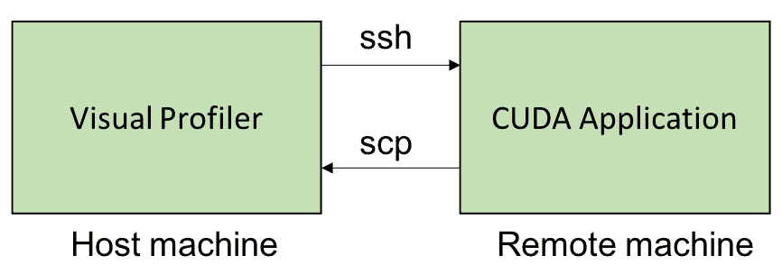

让我们尝试远程分析 GPU 应用程序。以下步骤介绍了如何在 NVIDIA Visual Profiler 中分析远程 GPU 应用程序：

1.  首先，转到文件 | 新建会话。当您单击新建会话菜单时，您将看到以下对话框窗口：

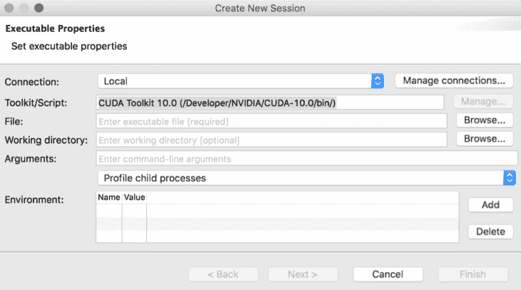

1.  然后，我们需要添加一个连接，方法是转到“管理连接...”菜单。然后，将出现“新的远程连接”对话框。通过单击“添加”按钮并在适当的部分输入远程机器信息来添加远程机器信息。然后，通过单击“完成”按钮关闭对话框。完成后，您将看到以下输出：

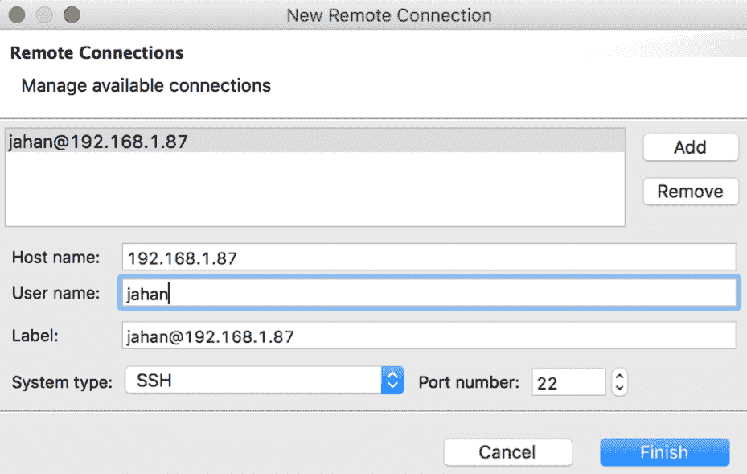

正如我们之前讨论的，主机和远程机器通过 SSH 进行通信，其默认端口号为 22。如果主机机器使用其他端口进行 SSH，您必须在新的远程会话创建对话框中通知它该端口号。

1.  现在，我们需要通过单击 Toolkit/Script*右侧的“管理...”按钮在远程机器上设置 CUDA Toolkit 路径。*一个很好的开始是使用“检测”按钮。它会自动查找`nvcc`路径并自动设置配置信息。如果自动检测失败，您必须手动输入配置信息。完成配置过程后，单击“完成”按钮，如下所示：

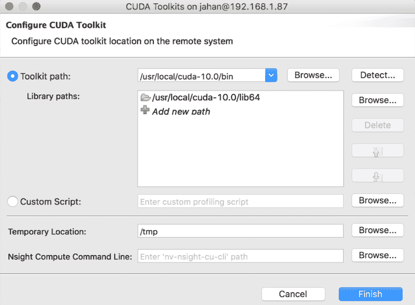

1.  通过单击“浏览”按钮在“文件”文本框的右侧指定 GPU 应用程序的二进制文件。它会要求您的远程机器登录密码。找到应用程序路径并设置应用程序路径。如果需要控制应用程序的行为，还可以输入应用程序的参数。完成应用程序和连接设置后，单击“下一步”按钮设置分析器的选项。

1.  现在，我们将设置分析器选项。NVIDIA Visual Profiler 允许我们使用复选框设置分析器的选项，如下面的屏幕截图所示。单击“完成”，分析器将从应用程序收集分析数据：

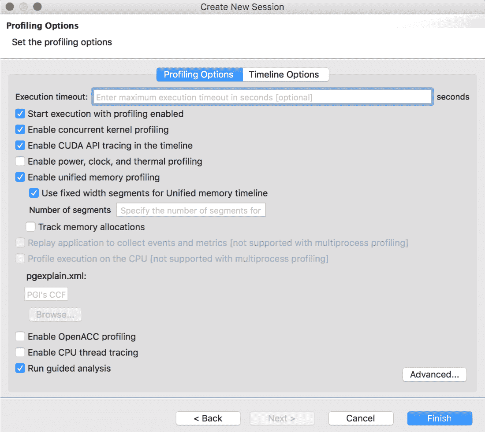

您将在主机机器上看到时间线分析输出。

1.  最后，分析分析时间线图的性能。单击要分析的任何内核函数。单击“执行内核分析”按钮；分析工具将收集相关的度量信息。通过这样做，您可以快速获得有关性能限制器的报告，并找到内核函数的瓶颈。

# 使用 CUDA 错误调试 CUDA 应用程序

具有专用的异常检查和检查错误是使软件具有高质量的基本特征之一。CUDA 函数通过返回每个函数调用的状态来报告错误。不仅如此，CUDA API，而且内核函数和 CUDA 库的 API 调用也遵循这个规则。因此，检测到重复错误是识别 CUDA 执行中错误的开始。例如，假设我们使用`cudaMalloc()`函数分配了全局内存，如下所示：

```cpp
cudaMalloc((void**)&ptr, byte_size);
```

如果全局内存没有足够的空闲空间来分配新的内存空间怎么办？在这种情况下，`cudaMalloc()`函数返回一个错误来报告内存不足异常。通过使用`cudaGetLastError()`可以捕获由内核调用触发的标志。它返回记录的错误状态并重置标志的值。但是要小心处理这个标志：它的返回并不保证错误发生在 GPU 的最后执行，并且需要手动重置标志。

CUDA API 的返回值和`cudaGetLastError()`函数的返回值都是`cudaError_t`类型。这种`cudaError_t`类型是预定义的整数类型，应用程序可以识别发生了哪种类型的错误。例如，此类型定义如下：

```cpp
Enum cudaErorr_t {
    cudaSuccess = 0,
    cudaErrorMemoryAllocation = 2, 
    cudaErrorUnknown = 30,
    cudaErrorNoDevice = 38,
    cudaErrorAssert = 59,
    cudaErrorTooManyPeers = 60,
    cudaErrorNotSupported = 71,
    ....
};
```

记住或翻译所有这些值是不切实际的。为此，CUDA 示例代码提供了一个辅助函数`checkCudaError()`，它位于`common/inc/cuda_helper.h`中。当 CUDA 函数返回错误时，此函数打印出错误消息。其函数定义如下：

```cpp
#define checkCudaErrors(err) { \
    if (err != cudaSuccess) {  \

        fprintf(stderr, "checkCudaErrors() API error = %04d \"%s\" from file <%s>, line %i.\n", \
                err, cudaGetErrorString(err), __FILE__, __LINE__); \
        exit(-1); \
    } \
}
#endif
```

由于此函数被定义为宏，我们可以确定发生错误的行。

我们可以使用这个函数的两种方式。一种是在源代码中包含`cuda_helper.h`文件。另一种是将函数代码复制到代码中的某个位置。

然后，我们将使用`checkCudaErrors()`包装所有的 CUDA API 类，如下所示：

```cpp
checkCudaErrors(cudaMalloc((void **)&d_A, N * K * sizeof(float)));
checkCudaErrors(cudaMalloc((void **)&d_B, K * M * sizeof(float)));
checkCudaErrors(cudaMalloc((void **)&d_C, N * M * sizeof(float)));
```

对于内核函数调用，我们将使用`cudaGetLastError()`函数来获取内核调用的错误标志，如下所示：

```cpp
sgemm_kernel_A<<<dimGrid, dimBlock>>>(A, B, C, N, M, K, alpha, beta);
checkCudaErrors(cudaGetLastError());
```

然而，这段代码有一个问题：内核操作与主机异步，所以`cudaGetLastError()`只能捕获主机端的返回值。很可能错误是在应用程序的某个地方触发的。为了解决这种情况，您可以使用任何主机和设备同步函数；例如：

```cpp
sgemm_kernel_A<<<dimGrid, dimBlock>>>(A, B, C, N, M, K, alpha, beta);
checkCudaErrors(cudaDeviceSynchronize());
```

现在，让我们通过修改源代码来测试错误检测代码。例如，您可以请求`cudaMemcpy`复制比分配大小更大的内存空间。在这种情况下，应用程序会返回一个错误消息，如下所示：

```cpp
$ nvcc -run -m64 -gencode arch=compute_70,code=sm_70 -I/usr/local/cuda/samples/common/inc -lnvToolsExt -o sgemm ./sgemm.cu
CUDA error at sgemm.cu:93 code=11(cudaErrorInvalidValue) "cudaMemcpy(d_A, A, N * K * sizeof(float), cudaMemcpyHostToDevice)"
```

或者，您可以为 CUDA 内核传递一个`NULL`指针，以便内核访问无效的内存空间。在这种情况下，应用程序会在`cudaDeviceSynchronize()`中报告非法地址错误：

```cpp
$ nvcc -run -m64 -gencode arch=compute_70,code=sm_70 -I/usr/local/cuda/samples/common/inc -lnvToolsExt -o sgemm ./sgemm.cu
CUDA error at sgemm.cu:104 code=77(cudaErrorIllegalAddress) "cudaDeviceSynchronize()"
```

这个错误检查宏非常有用，因为它报告了错误发生的源代码位置。然而，这个报告有一个缺点，就是它检测到的错误位置与实际发生的错误位置不匹配。

错误消息应该报告我们复制比分配的内存更大的内存位置导致非法值错误。因此，开发人员可以在内核调用之后立即识别错误消息。然而，这个错误检查代码只在主机上工作。因此，如果 GPU 操作没有正确同步，这可能会混淆 GPU 操作。例如，如果我们没有设置同步，只是检查错误，那么`cudaDeviceSynchronize()`函数可能会报告错误的位置。在这种情况下，我们可以设置`CUDA_LAUNCH_BLOCKING=1`环境变量，使所有内核执行与主机同步：

```cpp
$ ./sgemm
CUDA error at sgemm.cu:104 code=77(cudaErrorIllegalAddress) "cudaDeviceSynchronize()" 
$ CUDA_LAUNCH_BLOCKING=1 ./sgemm
CUDA error at sgemm.cu:36 code=77(cudaErrorIllegalAddress) "cudaGetLastError()"
```

`sgemm.cu`的第 36 行是`cudaGetLastError()`调用，在`sgemm`内核调用之后。这就是我们放置一个预期错误的位置。我们可以在运行时确定正确的错误位置。

有两份官方文件可以帮助您了解不同类型的 CUDA 错误：

+   [`docs.nvidia.com/cuda/cuda-runtime-api/group__CUDART__TYPES.html`](https://docs.nvidia.com/cuda/cuda-runtime-api/group__CUDART__TYPES.html)

+   CUDA Toolkit 根路径中的`include/driver_types.h`

# 使用 CUDA assert 断言本地 GPU 值

即使您的 GPU 应用程序没有任何系统错误，您也需要检查计算结果，以确保执行的结果符合设计要求。为此，CUDA 提供了`assert`函数，它检查参数值是否为零。如果是，这个函数会引发一个错误标志，以便主机可以识别内核函数中存在错误。

断言用于验证操作结果是否符合预期。在 CUDA 编程中，可以从设备代码中调用`assert`函数，并在给定参数为零时停止内核的执行：

```cpp
void assert(int expression);
```

这是`assert`函数的声明，与 C/C++的声明相同。当断言被触发时，应用程序会停止并报告其错误消息。如果应用程序由调试器启动，它会作为断点工作，以便开发人员可以调试给定的信息。例如，输出消息看起来像这样：

```cpp
$ nvcc -run -m64 -gencode arch=compute_70,code=sm_70 -I/usr/local/cuda/samples/common/inc -lnvToolsExt -o sgemm ./sgemm.cu
sgemm.cu:29: void sgemm_kernel_A(const float *, const float *, float *, int, int, int, float, float): block: [16,64,0], thread: [0,0,0] Assertion `sum == 0.f` failed.     
```

由于输出消息指向了确切的 CUDA 块和线程索引，开发人员可以轻松分析指定的 CUDA 线程的执行。

现在，让我们应用断言并看看它如何检测到预期的错误。我们将修改在*GPU 应用程序中的性能优化目标范围*部分中使用的 SGEMM 操作代码。

首先，在内核函数的中间放置断言代码。我们将看到表达式的效果，它应该是 false。断言代码可以编写如下：

```cpp
__global__ void sgemm_kernel_A(const float *A, const float *B, float *C, int N, int M, int K, float alpha, float beta)
  {
      int col = blockIdx.x * blockDim.x + threadIdx.x;
      int row = blockIdx.y * blockDim.y + threadIdx.y;
      float sum = 0.f;
      for (int i = 0; i < K; ++i) 
          sum += A[row * K + i] * B[i * K + col];

      if (row == 0 && col == 0)
 assert(sum == 0.f);

      C[row * M + col] = alpha * sum + beta * C[row * M + col];
  }
```

您可以尝试其他索引值或尝试其他可能的错误。编译代码并运行它以查看输出。以下代码显示了此修改的输出错误：

```cpp
sgemm.cu:29: void sgemm_kernel_A(const float *, const float *, float *, int, int, int, float, float): block: [0,0,0], thread: [0,0,0] Assertion `sum == 0.f` failed.
```

错误消息报告了断言触发的代码位置、内核函数的名称和 GPU 的线程索引。有了这些信息，我们可以很容易地找出应该从哪里开始分析。

实际上，`assert`函数的使用与普通 C/C++编程中的`assert`函数相同。一个区别是`assert`函数在设备代码中起作用。因此，它不仅报告事件位置和表达式，还显示块和线程索引。

然而，使用断言会对应用程序性能产生影响。因此，我们应该只在调试目的时使用断言。建议在生产环境中运行时禁用它。您可以通过在包含`assert.h`之前添加`NDEBUG`预处理宏来在编译时禁用断言。

# 使用 Nsight Visual Studio Edition 调试 CUDA 应用程序

对于 Windows 应用程序开发人员，CUDA Toolkit 提供了 Nsight Visual Studio Edition，它可以在 Visual Studio 中实现 GPU 计算。这个工具作为 Visual Studio 的扩展工作，但您可以构建、调试、分析和跟踪 GPU 应用程序以及主机。如果您的工作平台不是 Windows，则本节中的内容将不适用，您可以跳过它。

CUDA 调试器允许我们监视每个 CUDA 线程的 GPU 内核上的本地值。与普通主机调试一样，您可以在内核代码中设置断点并触发它们。您还可以设置条件，例如其他普通断点。有了这个功能，您可以为特定的 CUDA 线程索引触发断点并查看它们的本地变量。

这个工具可以与 CUDA Toolkit 一起安装。您可以从网站上获取最新版本。这不是强制性的，但是当您的开发环境使用旧的 CUDA Toolkit 和最新的 GPU 及其驱动程序时，建议使用它。访问 NVIDIA Nsight 网页（[`developer.nvidia.com/nsight-visual-studio-edition`](https://developer.nvidia.com/nsight-visual-studio-edition)）下载并安装 Nsight。您需要 NVIDIA 开发人员会员资格才能获取该软件。您还需要安装推荐的显示驱动程序版本。

您可以通过转到 Visual Studio 菜单栏中的菜单 | Nsight 来找到 CUDA 工具。此菜单中有几个工具，其中一些如下：

+   **图形调试**：用于图形（Direct3D、OpenGL 和 Vulkan）应用程序的调试器

+   **CUDA 调试（Next-Gen）**：用于同时调试 CPU 和 GPU 代码的调试器（Turing、Volta 和 Pascal 与最新驱动程序）

+   **CUDA 调试（传统）**：仅用于 GPU 内核的调试器（具有旧驱动程序的 Pascal、Maxwell 和 Kepler）

+   **性能分析**：用于分析当前 GPU 应用程序的性能

+   **CUDA 内存检查器**：用于在运行时检查 GPU 内存违规（如前一节中介绍的）

在本节中，我们将重点放在 CUDA 调试（Next-Gen）上。这是因为 Next-Gen 调试器可以支持包括 Turing 和 Volta 在内的最新架构。CUDA 内存检查器将在本章末尾介绍。

现在，让我们配置一个示例项目，并看看我们如何使用 Nsight Visual Studio Edition 调试应用程序。您可以使用默认的示例代码，或者用我们之前介绍的 CUDA 代码替换代码。您还可以使用`05_debug/05_debug_with_vs`文件中提供的示例代码。这是一些简单的 SAXPY 代码。

将项目属性设置为生成适当的设备目标代码。在项目的属性页面中，您可以指定目标代码版本。在 CUDA C/C++ | 代码生成文本框中列出您想要在其中使用的架构版本：

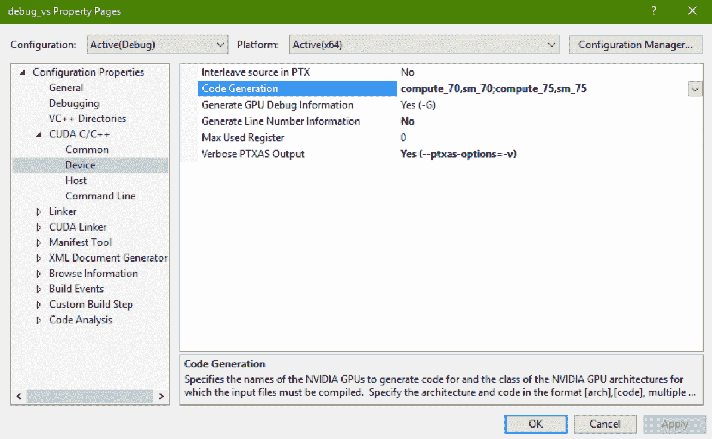

上述截图显示了 CUDA 设备代码生成属性页面。您可以设置几个`nvcc`选项，例如目标 GPU 的计算能力、每个线程的寄存器限制以及在编译时冗长的 CUDA 内核信息。

在第 34 行和第 75 行设置断点，其中第 34 行是内核函数的中间位置，第 75 行是从主机复制数据到设备的位置。然后，使用以下方法之一编译并开始调试：

+   在 Visual Studio 菜单栏中导航到 Nsight，然后单击“开始 CUDA 调试（Next-Gen）”。

+   在“解决方案资源管理器”中右键单击项目，选择“调试|开始 CUDA 调试（Next-Gen）”。

+   转到 Nsight CUDA 调试工具栏，单击“开始 CUDA 调试（Next-Gen）”。

Windows 防火墙可能会询问您是否信任并允许 Nsight 的网络连接。这是正常的，因为 Nsight 使用内部网络来监视 GPU 设备。单击“接受”并继续调试。当前的 Nsight Visual Studio Edition 提供了两种调试选项。这取决于目标 GPU 架构版本。如果您的 GPU 是 Volta 或 Turing，建议使用“Next-Gen”调试。如果您的 GPU 是 Pascal，则适当的调试器取决于驱动程序版本。为了澄清，请访问 NVIDIA 支持的 GPU 列表：[`developer.nvidia.com/nsight-visual-studio-edition-supported-gpus-full-list`](http://developer.nvidia.com/nsight-visual-studio-edition-supported-gpus-full-list)。

应用程序将在应用程序启动的地方停止。继续跟踪。应用程序将在主机的第 75 行和设备的第 34 行停止。从中我们可以了解到，Nsight 可以同时跟踪主机和设备上的 GPU 应用程序。

当黄色箭头停在内核函数中时，您可以查看局部变量。全局索引中的线程索引为`0`。由于 CUDA 并行发出多个 CUDA warp 和 CUDA 线程，因此您可以通过更改`blockIdx`和`threadIdx`来查看其他线程的局部变量。基本的 CUDA 线程调试控制单元是 warp。换句话说，您可以控制调试器以遍历活动 warp。Nsight 调试器在 Nsight 菜单栏中的“上一个活动 warp/下一个活动 warp”菜单中提供了此功能。

以下屏幕截图显示了我们在调试时出现的 Nsight 调试控件：

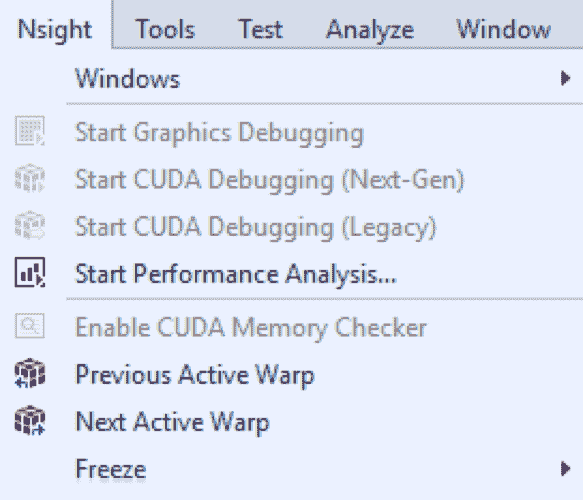

如果更改 warp，您会发现在“Autos”面板中监视的局部变量会随着 warp 的变化而更新索引。例如，以下屏幕截图显示了“Autos”窗口，该窗口报告了活动 warp 中所选线程的局部变量，即正在由主导线程监视的局部变量的值：

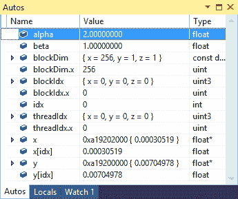

选择的线程更改后，Autos 值会更新。以下屏幕截图显示了通过移动到下一个活动 warp 所做的更改：

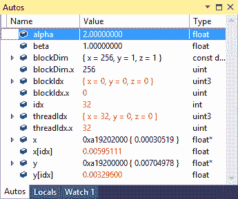

Next-Gen CUDA 调试器提供了三种类型的窗口——warp info、lanes 和 GPU registers。黄色箭头表示当前的 GPU 执行，并以三个方面显示其信息：

+   Warp Info 窗口提供了另一种选择活动 warp 的方法。您可以在菜单栏中从 Nsight | Window | Warp Info 打开该窗口。窗口如下所示：

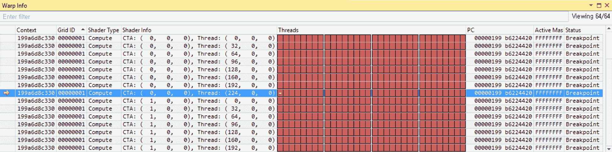

每行表示 CUDA 网格中的活动 warp。第四列“Shader Info”显示了每个 warp 的块和主导线程索引。第五列“threads”显示了 warp 中 CUDA 线程的状态。单元格的颜色表示每个线程的状态。由于我们在断点处观察它们，它们都是红色的，但在调试过程中您会看到其他颜色。以下屏幕截图解释了每种颜色在线程状态方面的含义：

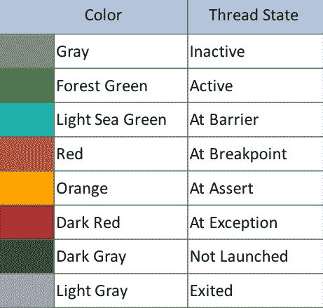

双击任何 warp，查看 autos 窗口中的局部变量是如何更新的。

+   Lanes 窗口允许您在所选活动 warp 内选择特定的 CUDA 线程。一个 lane 指的是 warp 中的一个线程。您可以从 Nsight | Window | Lanes 中打开该窗口。通过双击一个 lane，您可以发现 autos 窗口中的局部变量根据更新的索引而更新：

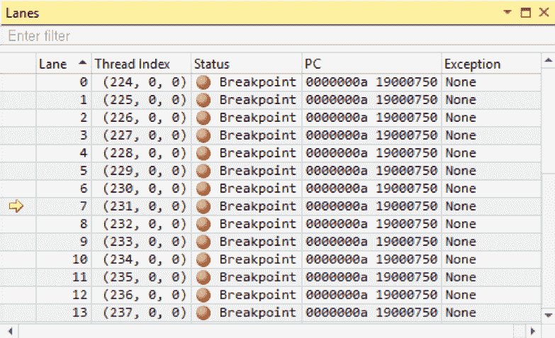

活动 warp 中的 lanes 窗口信息。

寄存器窗口显示了 GPU 寄存器的当前状态。如果它们的值被更新，它们将变为红色。

如果您想了解如何使用 Nsight Visual Studio Edition，请阅读 NVIDIA 官方用户指南。它介绍了如何配置调试环境，如何使用它，以及各种情况下的详细提示。 ([`docs.nvidia.com/nsight-visual-studio-edition/Nsight_Visual_Studio_Edition_User_Guide.htm`](https://docs.nvidia.com/nsight-visual-studio-edition/Nsight_Visual_Studio_Edition_User_Guide.htm))。

# 使用 Nsight Eclipse Edition 调试 CUDA 应用程序

对于 Linux 和 OSX 平台开发，CUDA Toolkit 提供了 Nsight Eclipse Edition。这个工具基于 Eclipse，因此开发人员可以很容易地在 CUDA C 开发中使用这个工具。

Nsight Eclipse Edition 是基于 Eclipse 用于 CUDA 应用程序开发的。您可以使用它来编辑、构建、调试和分析 CUDA 应用程序。它使得在 Linux 和 OSX 中进行 CUDA C/C++开发变得简单。这个工具作为 CUDA Toolkit 的一部分安装，因此您不必单独安装这个工具。但是，如果您使用 Linux，需要配置 Java 7 才能使用它。

Nsight Eclipse Edition 是基于 Eclipse 4.4.0 版本（2014 年发布的 Luna 版本）构建的，并且基于 Java 7 构建。

Nsight 可以通过终端中的`nsight`命令或者 X 窗口应用程序列表中执行。

现在，让我们从终端或 X 窗口桌面打开 Nsight，以便我们可以编译和分析给定的示例。要么创建一个新的 CUDA 项目，要么打开`05_debug/06_debug_with_eclipse`中提供的示例项目。如果要创建项目，请选择 CUDA C/C++项目。空项目只会给您一个空项目，而 CUDA Runtime 项目会给您一个带有一些示例代码的项目。如果要使用示例项目，请使用文件 | 导入 | 导入现有项目到工作区。

现在，让我们在`sgemm`内核函数中设置一个断点。就像在 Eclipse 中的普通 C/C++项目一样，您可以在`nsight`中构建和调试 CUDA 应用程序。在内核函数的起始点（第 23 行）设置一个断点，如下所示：

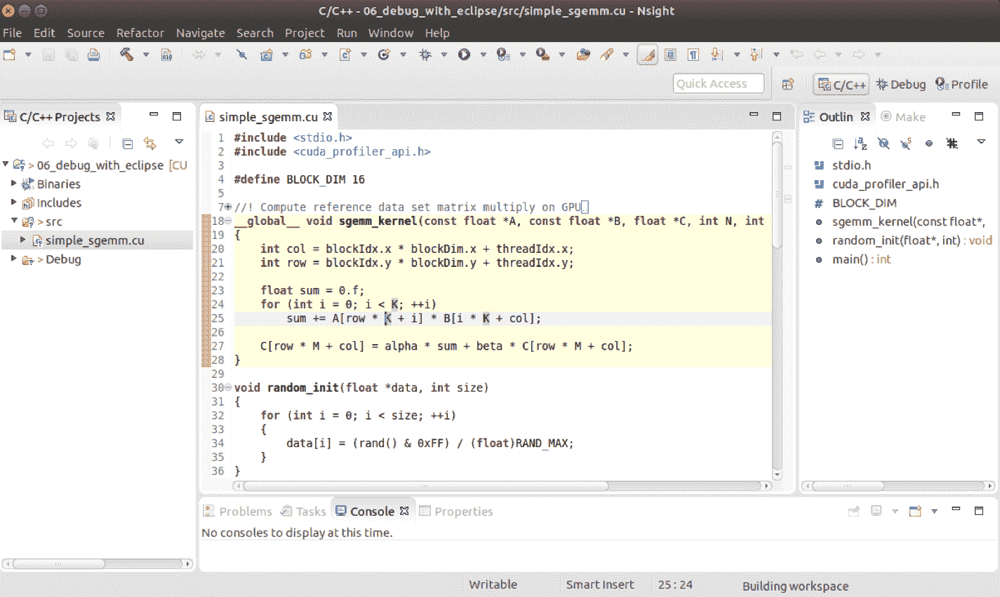

对于内核函数调试来说，一个很好的起点是在线程索引计算之后。设置一个断点来暂停 GPU 的执行。现在，通过单击菜单面板中的绿色 bug 来编译和开始调试。在调试窗口切换调试透视之时，点击继续，直到达到我们设置的断点。

Nsight 允许您监视活动 warp 中的局部变量和寄存器。首先，它会在 CUDA 网格中的领先 CUDA 线程（CUDA 线程`0`）处停止应用程序。然后，您可以从调试窗口切换到其他 CUDA 活动 warp，并使用 CUDA 窗口检查每个 CUDA 线程，就像这样：

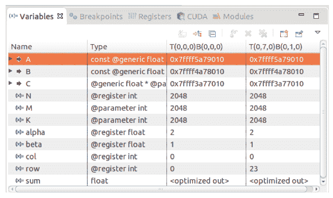

以下截图显示了所选 CUDA 线程的局部变量信息。Nsight 会在这些值更新时更新它们：

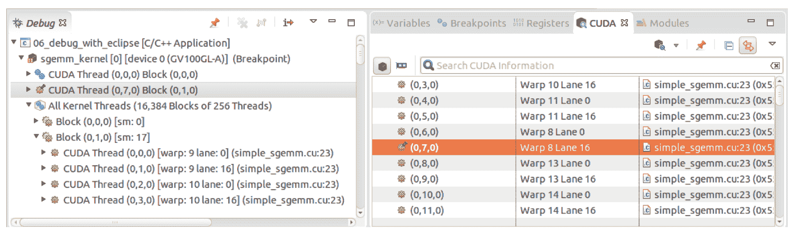

上述截图显示了 Eclipse 的调试透视窗口中的 Debug 窗口和 CUDA 窗口。调试窗口提供了在所选 GPU 上的活动 warp 中进行 CUDA warp 选择的功能，并且可以在所选活动 warp 内进行 lane 选择。

NVIDIA 还有一个 Nsight Eclipse Edition 用户指南。您可以通过访问[`docs.nvidia.com/cuda/nsight-eclipse-edition-getting-started-guide/index.html`](https://docs.nvidia.com/cuda/nsight-eclipse-edition-getting-started-guide/index.html)来了解更多关于这个工具的信息。

# 使用 CUDA-GDB 调试 CUDA 应用程序

CUDA 工具包提供了 CUDA-GDB，它支持 CUDA C/C++调试，用于诸如 C/C++ GDB 之类的程序。这对于直接调试没有 X 窗口环境或远程调试的 CUDA C/C++应用程序非常有用。

要调试 GPU 应用程序，`Makefile`应该包括主机的`-g`调试标志和 GPU 的`-G`调试标志。基本上，CUDA 的 GDB 用法与主机调试相同，只是在 CUDA 操作之外还有一些额外的调试功能。例如，我们可以设置特定的 CUDA 线程和 CUDA 感知断点。

# CUDA-GDB 的断点

让我们看看`cuda-gdb`如何帮助我们检测代码中的错误。我们将在代码中设置断点，并查看主机和 GPU 上的局部值。为此，将工作目录切换到`05_debug/07_debug_with_gdb`目录。我们将通过将其与适当的行匹配来检查`cuda-gdb`的操作。

首先，让我们使用以下命令编译源代码：

```cpp
$ nvcc -run -m64 -g -G -Xcompiler -rdynamic -gencode arch=compute_70,code=sm_70 -I/usr/local/cuda/samples/common/inc -o simple_sgemm ./simple_sgemm.cu
```

然后，我们应该执行`cuda-gdb`，这样我们就可以在终端上调试应用程序，如下所示：

```cpp
$ cuda-gdb simple_sgemm
```

我们可以在代码的特定行上设置断点，如下所示：

```cpp
(cuda-gdb) break simple_gemm.cu:21
```

或者，我们可以按照内核函数的名称设置断点，如下所示。这将在函数的入口点触发断点：

```cpp
(cuda-gdb) break sgemm_kernel
```

如果`cuda-gdb`警告指出*断点希望在未来的共享库加载时挂起*，则回答`y`。您也可以在主机代码上设置断点。

使用断点的一个问题是，断点将根据 CUDA 线程的数量触发。因此，我们应该提供条件信息，以便针对特定的 CUDA 线程设置断点。条件断点如下：

```cpp
(cuda-gdb) break sgemm_kernel if blockIdx.y == 2
```

当然，我们可以修改预定义断点的条件如下：

```cpp
(cuda-gdb) cond 3 // break 3 is defined previously
```

让我们使用`run`命令执行示例应用程序。如果应用程序遇到任何断点，CUDA-GDB 将提供有关它的信息。以下代码显示了应用程序在第`21`行遇到断点时`cuda-gdb`的报告：

```cpp
(cuda-gdb) run
[Switching focus to CUDA kernel 0, grid 1, block (0,0,0), thread (5,0,0), device 0, sm 0, warp 0, lane 5]
Thread 1 "simple_sgemm" hit Breakpoint 1, sgemm_kernel<<<(128,128,1),(16,16,1)>>> (A=0x7fffb6000000, B=0x7fffb7000000, C=0x7fffb4000000, N=2048, M=2048, K=2048, alpha=2, beta=1) at simple_sgemm.cu:21
21 int col = blockIdx.x * blockDim.x + threadIdx.x;
```

现在，是时候使用 GDB 命令来跟踪代码或监视活动变量了。我们可以使用 next（或`n`）、step（或`s`）、continue（或`c`）和 finish（或`fin`）来跟踪内核函数。然而，当我们到达内核代码的末尾并需要在主机和设备之间切换目标硬件时，我们应该使用`continue`命令。

# 使用 CUDA-GDB 检查变量

除了默认的 GDB 命令之外，CUDA-GDB 提供了可以与 CUDA 内核一起使用的调试功能。以下是您可以使用 CUDA-GDB 做的事情。

# 列出内核函数

与普通函数一样，CUDA-GDB 可以在内核函数上设置断点。一旦应用程序被断点停止，您可以列出它们如下：

```cpp
(cuda-gdb) info cuda kernels
Kernel Parent Dev Grid Status   SMs Mask     GridDim  BlockDim Invocation
*      0      -   0    1 Active 0xffffffff (128,128,1) (16,16,1) sgemm_kernel(A=0x7ffff5a79010, B=0x7ffff4a78010, C=0x7ffff3a77010, N=2048, M=2048, K=2048, alpha=2, beta=1)
```

正如您所看到的，前面的输出显示了内核的配置信息和输入参数变量。

# 变量调查

CUDA-GDB 帮助我们通过选择特定的线程块索引和线程索引来跟踪特定的 CUDA 线程。有了这个功能，您可以将当前焦点移动到指定的线程。在这个例子中，块大小为 16，`col`变量被定义为`x`维度上的 CUDA 线程索引。以下代码显示了 CUDA-GDB 如何通过更改线程索引来报告所选的局部变量的值：

```cpp
(cuda-gdb) print col
$1 = <optimized out>
(cuda-gdb) cuda kernel 0 block 1,2,0 thread 3,4,0
21 int col = blockIdx.x * blockDim.x + threadIdx.x;
(cuda-gdb) s
22 int row = blockIdx.y * blockDim.y + threadIdx.y;
(cuda-gdb) p col
$2 = 19
```

检查当前焦点线程的信息：

```cpp
(cuda-gdb) cuda device kernel block thread
kernel 3, block (1,2,0), thread (3,4,0), device 0
```

有了手头的信息，我们可以追踪 CUDA 线程。

如果您想了解有关 CUDA-GDB 的更多信息，请查看 NVIDIA 的用户指南文档：[`docs.nvidia.com/cuda/cuda-gdb/index.html`](https://docs.nvidia.com/cuda/cuda-gdb/index.html)。

# 使用 CUDA-memcheck 进行运行时验证

CUDA 编程的一个困难点是处理内存空间。由于 CUDA 线程并行操作，边界条件或意外的索引操作可能会违反有效的内存空间。CUDA memcheck 是一个运行时测试工具，如果任何 GPU 操作超出了无效的内存空间，它将验证内存访问。该工具检测以下内存错误：

| 名称 | 位置 | 描述 | 精确 |
| --- | --- | --- | --- |
| 内存访问错误 | 设备 | 无效的内存访问（超出边界，未对齐） | O |
| 硬件异常 | 设备 | 硬件错误 | X |
| Malloc/free 错误 | 设备 | 在 CUDA 内核中不正确使用`malloc()`/`free()` | O |
| CUDA API 错误 | 主机 | CUDA API 的错误返回 | O |
| cudaMalloc 内存泄漏 | 主机 | 使用`cudaMalloc()`分配的设备内存未被应用程序释放 | O |
| 设备堆内存泄漏 | 设备 | 在设备代码中使用`malloc()`分配的设备内存未被应用程序释放 | X |

精确（O）表示 memcheck 可以指定崩溃的行和文件。另一方面，不精确（X）表示该工具可以识别错误，但由于并发状态，无法指定错误点。`cuda-memcheck`不需要重新编译进行测试。但是，如果我们使用一些额外的`nvcc`选项进行编译，我们可以跟踪错误点。`nvcc`选项包括生成行号信息的`-lineinfo`和用于保留函数符号的`-Xcompiler -rdynamic`。

基本上，`cuda-memcheck`是一个独立的工具，可以在运行时验证 GPU 应用程序。以下命令显示了它在独立模式下的格式：

```cpp
$ cuda-memcheck [options] <application>
```

这个工具也可以与 CUDA-GDB 一起使用，帮助开发人员识别错误并进行调试。在 CUDA-GDB 命令行中，使用`set cuda memcheck on`命令启用内存检查。这样，CUDA-GDB 可以识别与内存相关的异常。

# 检测内存越界

现在，让我们看看`cuda-memcheck`如何检测内存异常并与 CUDA-GDB 一起工作。为了简化这个过程，我们将编写一些错误的代码，并查看`cuda-memcheck`如何报告结果。让我们从一些干净的代码开始。您可以使用`05_debug/08_cuda_memcheck`中提供的示例代码进行测试。让我们使用`cuda-memcheck`测试代码并验证它：

```cpp
$ nvcc -m64 -g -G -Xcompiler -rdynamic -gencode arch=compute_70,code=sm_70 -I/usr/local/cuda/samples/common/inc -o simple_sgemm ./simple_sgemm.cu
$ cuda-memcheck simple_sgemm
========= CUDA-MEMCHECK
Application finished successfully.========= ERROR SUMMARY: 0 errors
```

现在，让我们将一些错误的代码放入内核函数中，如下所示。如果您愿意，您也可以放入其他错误：

```cpp
For instance, you may add one to the row value.
__global__ void sgemm_kernel(const float *A, const float *B, float *C, int N, int M, int K, float alpha, float beta)
{
    int col = blockIdx.x * blockDim.x + threadIdx.x;
    int row = blockIdx.y * blockDim.y + threadIdx.y;
    row += 1;

    float sum = 0.f;
    for (int i = 0; i < K; ++i)
        sum += A[row * K + i] * B[i * K + col];
    C[row * M + col] = alpha * sum + beta * C[row * M + col];
}
```

让我们编译并启动代码。内核将返回一个 CUDA 错误，`checkCudaErrors()`将报告一个错误消息，如下所示：

```cpp
CUDA error at simple_sgemm_oob.cu:78 code=77(cudaErrorIllegalAddress) "cudaDeviceSynchronize()"
```

然而，如果我们希望确定内核代码中的哪一行是问题的根本原因，这些信息是不够的。使用`cuda-memcheck`，我们可以确定哪个 CUDA 线程和内存空间触发了错误，并给出堆栈地址：

```cpp
$ cuda-memcheck simple_sgemm_oob
```

输出如下：

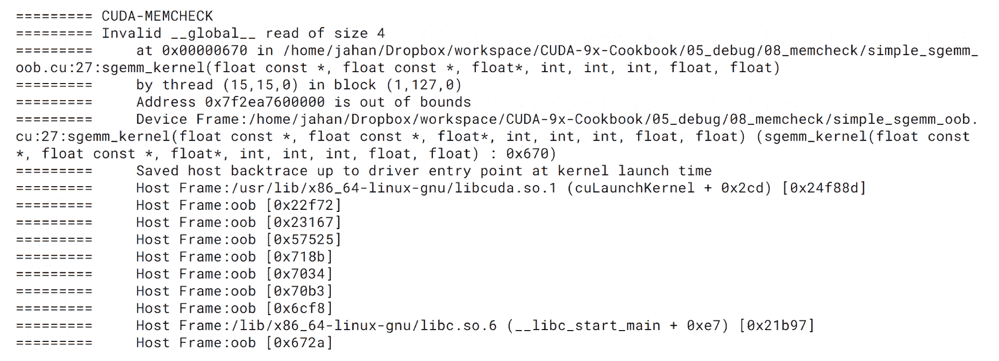

前面的屏幕截图显示了`cuda-memcheck`独立执行的一部分，显示了内核中检测到的所有错误。在这种情况下，`cuda-memcheck`报告检测到在第 27 行发生的内存违规错误。默认情况下，`cuda-memcheck`在检测到错误时会停止应用程序的执行。

在这种情况下，我们可以通过检查相关变量来轻松找到根本原因，使用`cuda-gdb`。为此，我们需要使用`cuda-gdb`启动应用程序，并启用`cuda-memcheck`，如下所示：

```cpp
$ cuda-gdb simple_sgemm_oob
(cuda-gdb) set cuda memcheck on
(cuda-gdb) run
```

这个过程使`cuda-gdb`从`cuda-memcheck`报告非法内存访问检测：

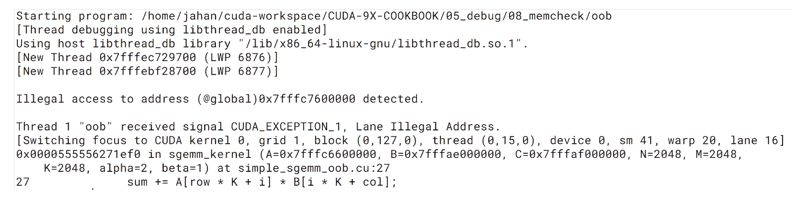

前面的屏幕截图显示了`cuda-gdb`与`cuda-memcheck`的报告。开发人员可以轻松地确定`simple_sgemm_oob.cu`中的第 27 行触发了报告的错误。根据给定的信息，我们可以开始调查哪一块内存访问了无效的空间，如下所示：

```cpp
(cuda-gdb) print A[row * K + i]
Error: Failed to read generic memory at address 0x7fffc7600000 on device 0 sm 41 warp 20 lane 16, error=CUDBG_ERROR_INVALID_MEMORY_SEGMENT(0x7).
(cuda-gdb) print row * K + i
$1 = 4194304
```

在不费吹灰之力的情况下，我们可以确定访问`A[row * K + i]`会触发错误，并且请求的值超出了全局内存（`A`）的分配空间。通过这种方式，您可以轻松地缩小根本原因。

# 检测其他内存错误

CUDA memcheck 工具提供了额外的软件验证功能，其中一些如下：

| **名称** | **描述** | **选项** |
| --- | --- | --- |
| 内存泄漏 | 用于识别内存泄漏 | `--leak-check full` |
| 竞争检查 | 用于分析多个线程之间对共享内存的冲突访问的竞争危险 | `--tool racecheck` |
| 初始化检查 | 在没有初始化的情况下识别设备全局内存访问 | `--tool initcheck` |
| 同步检查 | 验证同步原语的正确使用，如`__syncthreads()`，`__syncwarp()`和协作组 API | `--tool synccheck` |

这些工具假设内存访问是正确的或经过验证的，并且不检查内存错误。因此，您需要确认您的应用程序中不存在内存错误。其他有用的 memcheck 选项包括`--save`，我们可以用它来将输出保存到磁盘，以及`--print-level`，我们可以用它来控制输出的详细级别。

NVIDIA 为`cuda-memcheck`提供了用户指南。该文档将帮助您使用 GPU 验证您的应用程序并检测意外错误 ([`docs.nvidia.com/cuda/cuda-memcheck/index.html`](https://docs.nvidia.com/cuda/cuda-memcheck/index.html))。

# 使用 Nsight Systems 对 GPU 应用程序进行分析

在本节中，我们将介绍新引入的 CUDA 分析器工具，即 Nsys 和 Nvprof。这些分析器支持 Volta 架构及更高版本的 GPU。它是图灵架构 GPU 中的主要分析器。我们将先介绍 Nsys，然后在下一节介绍 Nvprof。

Nsight Systems ([`developer.nvidia.com/nsight-systems`](https://developer.nvidia.com/nsight-systems))是一个系统范围的性能分析工具，可以在时间轴上可视化操作并轻松找到优化点。在时间轴分析方面，Nsight Systems 提供了系统利用率信息，以便我们可以分析瓶颈点。我们可以从 NVIDIA 网站获取 Nsight Systems，但 CUDA 10 默认包含了 Nsight Systems 在工具包中。我们只需要确保它安装正确即可。

对于 CLI，我们应该设置`PATH`以便于我们的操作，因为它的路径与普通的 CUDA 二进制文件分开。我们可以使用以下命令将其包含在`PATH`环境变量中：

```cpp
export PATH=$PATH:/usr/local/cuda/bin:/usr/local/cuda-10.1/NsightSystems-2019.3/Target-x86_64/x86_64
```

Nsys 提供了两个接口：一个用于 GUI，一个用于 CLI。在主机上，我们可以通过 GUI 运行应用程序来收集应用程序的采样信息。在远程机器上，我们可以通过 CLI 收集分析数据，使用以下命令：

```cpp
$ nsys profile -t osrt,cuda,nvtx,cublas,cudnn -o baseline -w true <command>
```

这个选项可以解释如下：

|  | 选项 | 开关 |
| --- | --- | --- |
| 跟踪 | `-t`/`--trace` | `cuda`: 用于跟踪 CUDA 操作，`nvtx`: 用于跟踪`nvtx`标签，`cublas`, `cudnn`, `opengl`,`openacc`: 用于跟踪 API 操作，`osrt`: 用于跟踪 OS 运行时库，`none`: 不进行 API 跟踪 |
| 输出文件 | `-o`/`--output` | 输出文件名 |
| 显示输出 | `-w`/`--show-`output | `true`/`false`: 在终端上打印出分析器的行为 |

例如，我们可以从`02_nvtx` SGEMM 应用程序中获得一个名为`sgemm.qdrep`的分析文件。让我们比较 Nsight Systems 和 NVIDIA Visual Profiler 之间的分析输出。我们可以使用以下命令收集 Nsys 的分析数据：

```cpp
$ nsys profile -t osrt,cuda,nvtx -o sgemm -w true ./sgemm
```

这是来自 Nsys 的分析时间轴视图：

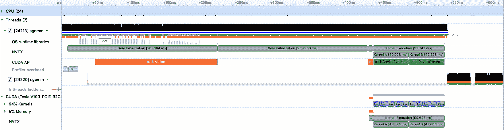

以下屏幕截图显示了来自 NVIDIA Visual Profiler 的分析时间轴视图：

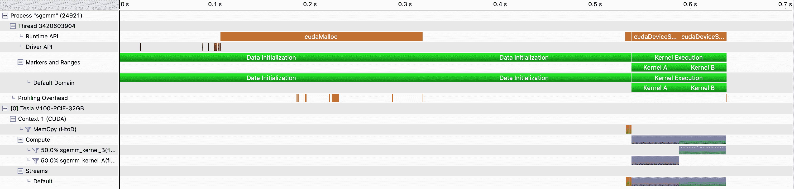

Visual Profiler 显示操作事件块，而 Nsight Systems 同时显示系统利用率。因此，我们可以轻松地看到哪些资源（CPU 核心、GPU 或 PCIe 总线）对性能产生影响。此外，Nsight Systems 提供了更具交互性的性能分析体验。当双击任何函数操作时，Nsight Systems Viewer 会展开时间轴以适应窗口，并帮助我们检查操作。此外，Nsight Systems 使我们能够轻松地发现在某个 NVTX 区域下发生的内核执行次数。在 Visual Profiler 时间轴视图中，内核执行看起来像是单个执行，但 Nsight Systems 显示了分离的执行。

现在我们已经确定了应该优化的函数，我们可以继续使用 Nsight Compute，这是另一个新的性能分析器，用于检查内核函数的 GPU 操作。

# 使用 Nsight Compute 进行内核性能分析

Nsight Compute 是一个用于计算的内核级性能分析器。它收集 GPU 指标信息，并帮助我们专注于 CUDA 内核的优化。换句话说，这个工具涵盖了 Visual Profiler 的性能分析功能。

Nsight Compute 提供两种接口：GUI 和 CLI。GUI 支持主机和远程应用程序性能分析，而 CLI 适用于目标机器。然而，我们可以使用 GUI 获取分析数据并查看结果。

# 使用 CLI 进行性能分析

为了方便使用 Nsight Compute CLI，我们需要在`/usr/local/cuda-10.1/NsightCompute-2019.3/nv-nsight-cu-cli`中设置`PATH`环境变量。然后，我们可以使用以下命令收集性能分析数据：

```cpp
$ nv-nsight-cu-cli -o <output filename> <application command>
```

这个命令收集 GPU 执行指标信息，并将数据保存到指定的文件中。如果我们没有提供输出文件名，Nsight Compute 将把收集到的指标报告输出到控制台，从而在控制台上提供快速的指标性能报告。

由于我们可以指定性能分析目标，我们可以限制 Nsight Compute 收集以下信息：

+   `--kernel-regex`：指定要进行性能分析的内核

+   --设备：专注于对特定 GPU 进行性能分析

当我们需要在控制台上查看报告时，这个功能非常有用。

# 使用 GUI 进行性能分析

通过在 Nsight Compute 中打开一个新项目，我们可以启动性能分析操作。以下截图显示了性能分析配置。对于主机应用程序开发，请连接到本地主机。或者，您可以指定要进行性能分析的目标 GPU 服务器：

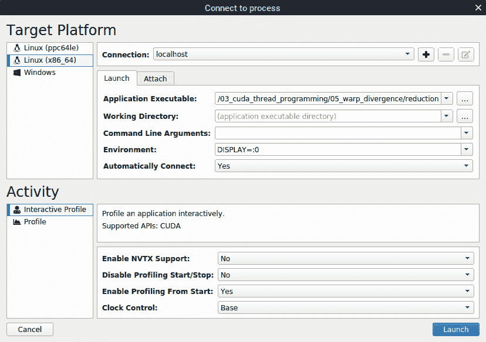

当然，我们也可以打开使用 CLI 工具在目标机器上生成的`nsight-cuprof-report`文件。例如，我们可以使用以下命令创建 sgemm 性能分析文件：

```cpp
$ nv-nsight-cu-cli -o reduction reduction
```

对于 OSX 用户，Nsight Systems 将需要目标`glib`库进行远程性能分析。在这种情况下，我们应该从 Nsight Compute 安装映像中复制该库。它将所需的库提供为一个名为 target 的目录，并将该目录复制到`Applications/NVIDIA Nsight Compute.app/target`目录。

为了方便起见，我们将使用来自第三章 *CUDA 线程编程*的减少示例代码。它有两个不同寻址的并行减少实现。您可以在`03_cuda_thread_programming/05_warp_divergence`目录中找到代码。完成连接和应用程序可执行文本栏的设置后，单击启动按钮。然后，按下*Ctrl* + *I*，*Ctrl* + *K*键以运行到下一个内核函数，然后性能分析器将停在`reduction_kernel_1`处。按下*Ctrl* + *I*，*Ctrl* + *P*键以对此内核进行性能分析。然后您将得到以下输出。这张图片展示了 Nsight Compute 基于 GUI 的第一个内核性能分析：

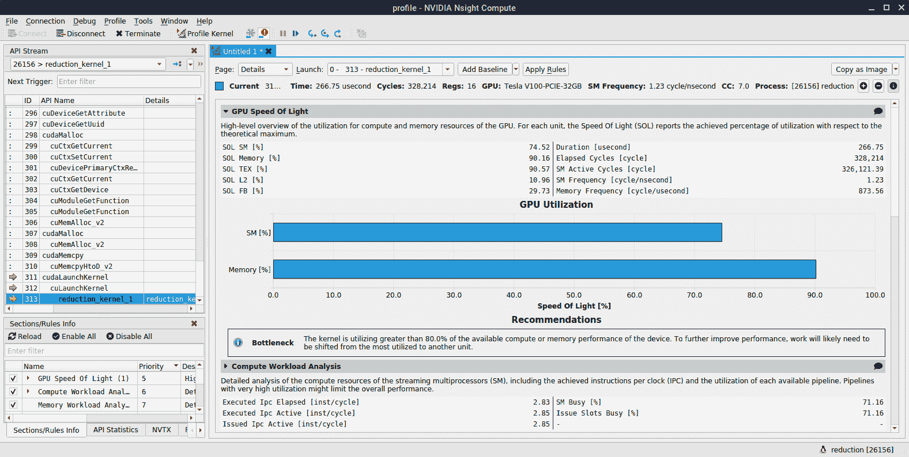

显示基于 GUI 的配置文件（用于第一个内核配置文件）

它提供了交互式配置文件和调试。使用步骤控制调试按钮，我们可以调试 CUDA API 和内核函数。我们还可以使用左侧 API 流面板上的控制按钮移动到下一个内核函数或下一个配置文件范围。在右侧面板上，您可以获取内核的详细配置文件信息。

我们还可以通过启用自动配置文件来自动获取配置文件结果，具体操作如下：转到菜单栏，选择 Profile | Auto Profile。然后，继续进行应用程序。Nsight Systems 将配置所有的内核函数。或者，您可以通过单击窗口顶部的 Profile Kernel 按钮来手动配置内核函数。当我们使用 CLI 收集的配置文件结果时，我们将只看到所有内核函数的配置文件数据。

# 性能分析报告

在交互式配置文件窗口的右侧面板上，我们可以看到 Nsight Compute 提供了性能分析报告。从报告中，我们可以确定性能限制因素并调查未充分利用的资源。此外，Nsight Compute 还根据资源利用统计数据提供优化建议。我们也可以直接从直接配置文件中识别它们。

此外，Nsight Compute 通过分析 GPU 组件的利用率提供优化建议。它找到瓶颈并建议进行推荐的调查以优化内核。

此报告页面提供了每个组件的利用率，如计算、内存、调度器、指令、warp 等。此外，您可以通过扩展每个组件的左上箭头来获取更多详细信息。以下图片显示了内存工作负载分析的示例报告：

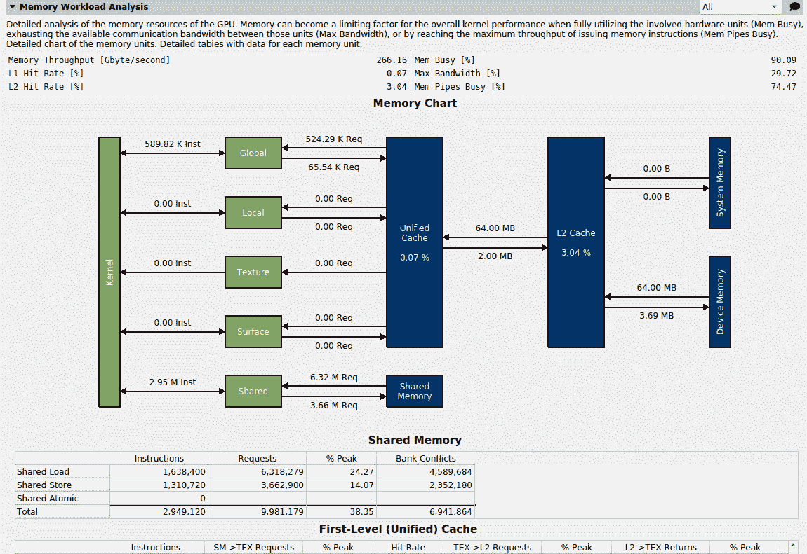

在 Nsight Compute 中，我们可以轻松获取这样的详细信息。在以前的分析器 NVIDIA Profiler 中，我们应该执行每个分析以获取这样的信息。

# 基线比较

在优化过程中，我们应该将新结果与基线操作进行比较。为了使这项任务对我们来说更容易，Nsight Compute 提供了基线比较功能。单击性能报告面板顶部的 Add baseline 按钮，并将其更改为其他内核函数。然后，我们可以使用 Nsight Compute 来比较内核函数的利用率。以下屏幕显示了这一点：

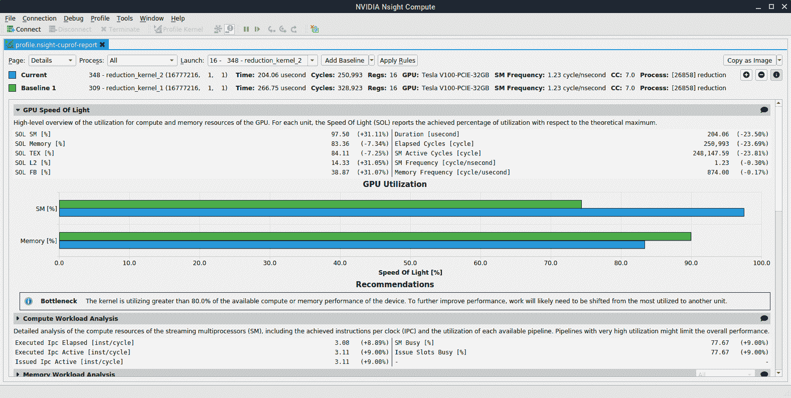

内核函数利用率的比较

如果我们希望追踪我们的优化工作并确定有效的组件，这将非常有用。

# 源视图

Nsight Compute 提供了各种我们可以调查的页面。其中一个有用的页面是 Source 页面。如果 CUDA 应用程序是使用`-lineinfo`选项构建的，Nsight Compute 可以显示与 CUDA C/C++源代码相关的信息和 CUDA SASS 代码。然后，我们可以分析瓶颈代码并调查它与 SASS 代码级别的关系。此外，它提供了一个 Live Registers 数字，以便我们可以调查内核函数中所需寄存器的数量。以下截图显示了 Source 页面：

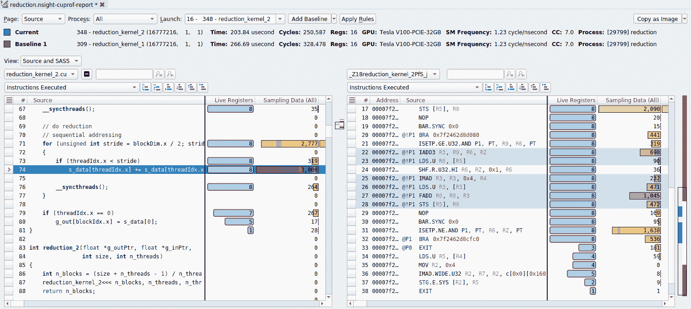

如果您需要了解更多关于此功能的信息，您可以在此文档中找到相关信息-[`docs.nvidia.com/nsight-compute/NsightCompute/index.html#profiler-report-source-page`](https://docs.nvidia.com/nsight-compute/NsightCompute/index.html#profiler-report-source-page)。

Nsight Compute 提供了一个以 CUDA 内核性能分析为中心的操作，我们可以用来验证 Night Systems 和 Nsight Compute 具有不同的优化范围。

# 总结

在本章中，我们已经介绍了如何配置 GPU 应用程序并对其进行调试。了解这些 CUDA 工具将有助于您高效和有效地开发，因为它们可以帮助您找到瓶颈，并在短时间内找到错误和漏洞。

到目前为止，我们一直专注于单个 GPU 应用程序开发。然而，许多 GPU 应用程序使用多个 GPU 来实现更好的性能。在下一章中，我们将介绍如何编写能在多个 GPU 上运行并且具有可扩展性性能的代码。您将学习什么因素会影响性能以及如何实现良好的性能水平。您还将能够应用本章涵盖的工具来加强多 GPU 系统及其经验，解决下一章的问题。
