# 第六章：可扩展的多 GPU 编程

到目前为止，我们一直致力于在单个 GPU 上获得最佳性能。密集节点与多个 GPU 已成为即将到来的超级计算机的迫切需求，特别是自从 ExaFLOP（每秒千亿次操作）系统成为现实以来。 GPU 架构具有高能效，因此近年来，具有 GPU 的系统在 Green500 榜单（[`www.top500.org/green500`](https://www.top500.org/green500)）中占据了大多数前十名。在 2018 年 11 月的 Green500 榜单中，前十名中有七个基于 NVIDIA GPU。

NVIDIA 的 DGX 系统现在在一个服务器中有 16 个 V100 32GB。借助统一内存和诸如 NVLink 和 NvSwitch 之类的互连技术，开发人员可以将所有 GPU 视为一个具有 512GB 内存的大型 GPU（16 个 GPU *每个 32GB）。在本章中，我们将深入讨论编写 CUDA 代码的细节，并利用 CUDA-aware 库在多 GPU 环境中实现节点内和节点间的可伸缩性。

在本章中，我们将涵盖以下主题：

+   使用高斯消元法解线性方程

+   GPUDirect 点对点

+   MPI 简介

+   GPUDirect RDMA

+   CUDA 流

+   额外的技巧

# 技术要求

本章需要一台带有现代 NVIDIA GPU（Pascal 架构或更高版本）的 Linux PC，并安装了所有必要的 GPU 驱动程序和 CUDA Toolkit（10.0 或更高版本）。如果您不确定您的 GPU 架构，请访问 NVIDIA GPU 网站（[`developer.nvidia.com/cuda-gpus`](https://developer.nvidia.com/cuda-gpus)）并确认您的 GPU 架构。本章的代码也可以在 GitHub 上找到：[`github.com/PacktPublishing/Learn-CUDA-Programming`](https://github.com/PacktPublishing/Learn-CUDA-Programming)。

本章中的示例代码是使用 CUDA 版本 10.1 开发和测试的。但是，建议您使用最新版本（CUDA）或更高版本。

由于本章需要展示多 GPU 的交互，我们需要至少两个相同类型和架构的 GPU。还要注意，一些功能，如 GPUDirect RDMA 和 NVLink，仅支持 NVIDIA 的 Tesla 卡。如果您没有像 Tesla P100 或 Tesla V100 这样的 Tesla 卡，不要灰心。您可以安全地忽略其中一些功能。与我们在这里展示的情况相比，性能数字将会有所变化，但相同的代码将仍然有效。

在下一节中，我们将看一个示例，使用流行的高斯算法解决一系列线性方程，以演示如何编写多 GPU。

# 使用高斯消元法解线性方程

为了演示在节点内和节点间使用多个 GPU，我们将从一些顺序代码开始，然后将其转换为节点内和节点间的多个 GPU。我们将解决一个包含*M*个方程和*N*个未知数的线性方程组。该方程可以表示如下：

***A × x = b***

在这里，*A*是一个具有*M*行和*N*列的矩阵，*x*是一个列向量（也称为解向量），具有*N*行，*b*也是一个具有*M*行的列向量。找到解向量涉及在给定*A*和*b*时计算向量*x*。解线性方程组的标准方法之一是高斯消元法。在高斯消元法中，首先通过执行初等行变换将矩阵*A*减少为上三角矩阵或下三角矩阵。然后，通过使用回代步骤解决得到的三角形方程组。

以下伪代码解释了解线性方程所涉及的步骤：

```cpp
1\. For iteration 1 to N (N: number of unknowns) 
    1.1 Find a row with non-zero pivot
    1.2 Extract the pivot row
    1.3 Reduce other rows using pivot row
2 Computing the solution vector through back substitution
```

让我们看一个示例，以便理解算法。假设方程组如下：

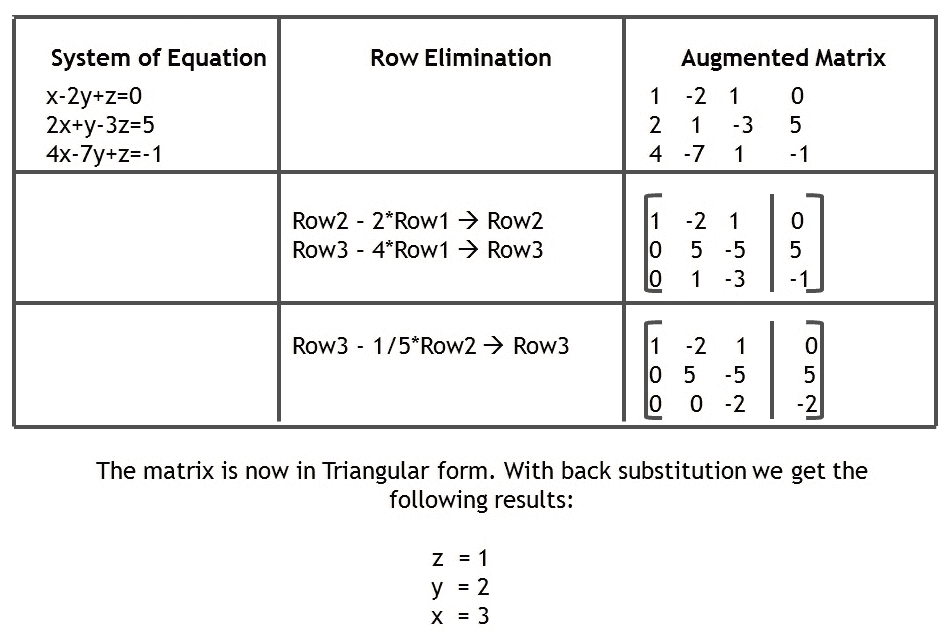

首先，我们将尝试设置基线系统，如下所示：

1.  准备您的 GPU 应用程序。此代码可以在本书的 GitHub 存储库中的`06_multigpu/gaussian`文件夹中找到。

1.  使用`nvcc`编译器编译您的应用程序，如下所示：

```cpp
$ nvcc -o gaussian_sequential.out gaussian_sequential.cu
$ nvcc -o gaussian_single_gpu.out gaussian_single_gpu.cu
$ $ time ./gaussian_sequential.out
$ time ./gaussian_single_gpu.out
```

前面的步骤编译并运行了本章中存在的两个版本的代码：

+   顺序运行的 CPU 代码

+   在单个 GPU 上运行的 CUDA 代码

现在，让我们看看高斯消元的单 GPU 实现中的热点。

# 高斯消元的单 GPU 热点分析

让我们尝试理解和分析顺序和单 GPU 代码以建立基线。在此基础上，我们将增强并添加对多 GPU 运行的支持。

**顺序 CPU 代码**：以下代码显示了顺序实现的提取代码：

```cpp
for( int n = 0; n < N; n++ ){
// M: number of equations, N: number of unknowns
    for( int pr = 0; pr < M; pr++ ){
        // finding the pivot row 
        //if pr satisfies condition for pivot i.e. is non zero 
        break; 
    }
    for( int r = 0; r < M; r++ ){
        // reduce all other eligible rows using the pivot row
        double ratio = AB[r*N+n]/AB[pr*N+n]
        for( int nn = n; nn < N + 1; nn++ ){
            AB[r * N + nn] -= (ratio*AB[pr * N + nn]);
        }
    }
}
```

从视觉上看，发生的操作如下：

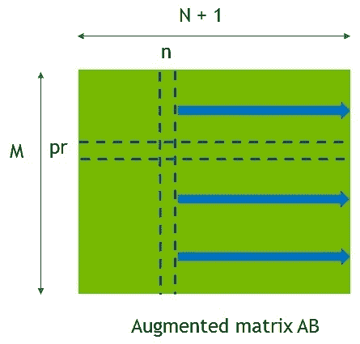

在这里，高斯消元中的行数等于方程的数量，列数等于未知数的数量。在前面的图表中显示的**pr**行是主元行，将用于使用主元素减少其他行。

我们可以做出的第一个观察是，我们正在对增广矩阵进行操作，将*A*矩阵与*b*向量合并。因此，未知数的大小为*N+1*，因为增广矩阵的最后一列是*b*向量。创建增广矩阵有助于我们只处理一个数据结构，即矩阵。您可以使用以下命令对此代码进行分析。分析结果将显示`guassian_elimination_cpu()`函数完成所需的时间最长：

```cpp
$ nvprof --cpu-profiling on ./guassian_sequential.out
```

**CUDA 单 GPU 代码**：通过前几章的学习，我们期望您已经熟悉了如何编写最佳的 GPU 代码，因此我们不会详细介绍单个 GPU 实现。以下摘录显示，在单个 GPU 实现中，三个步骤被称为三个用于找到*N*未知数的核心：

+   `findPivotRowAndMultipliers<<<...>>>`：该核心查找主元行和乘数，应用于行消除。

+   `extractPivotRow<<<>>>`：该核心提取主元行，然后用于执行行消除。

+   `rowElimination<<<>>>`：这是最终的核心调用，在 GPU 上并行进行行消除。

以下代码片段显示了数据在复制到 GPU 后迭代调用的三个核心：

```cpp
<Copy input augmented matrix AB to GPU>
...
for( int n = 0; n < N; n++ ){
// M: number of equations, N: number of unknowns
    findPivotRowAndMultipliers<<<...>>>(); 
    extractPivotRow<<<...>>>(); 
    rowElimination<<<...>>>(); 

}
```

本章的重点是如何增强此单个 GPU 实现以支持多个 GPU。但是，为了填补 GPU 实现中的缺失部分，我们需要对单个 GPU 实现进行一些优化更改：

+   高斯消元算法的性能受内存访问模式的影响很大。基本上，它取决于 AB 矩阵的存储方式：

+   找到主元行更喜欢列主格式，因为如果矩阵以列主格式存储，则提供了合并访问。

+   另一方面，提取主元行更喜欢行主格式。

+   无论我们如何存储*AB*矩阵，内存访问中都无法避免一个合并和一个跨步/非合并的访问。

+   列主格式对于行消除核心也是有益的，因此对于我们的高斯消元核心，我们决定存储 AB 矩阵的转置而不是 AB。AB 矩阵在代码开始时通过`transposeMatrixAB()`函数转置一次。

在下一节中，我们将启用多 GPU P2P 访问并将工作分配给多个 GPU。

# GPU 直接点对点

GPUDirect 技术是为了允许 GPU 在节点内部和跨不同节点之间进行高带宽、低延迟的通信而创建的。该技术旨在消除一个 GPU 需要与另一个 GPU 通信时的 CPU 开销。GPUDirect 可以分为以下几个主要类别：

+   **GPU 之间的点对点（P2P）传输**：允许 CUDA 程序在同一系统中的两个 GPU 之间使用高速**直接内存传输**（**DMA**）来复制数据。它还允许对同一系统中其他 GPU 的内存进行优化访问。

+   **网络和存储之间的加速通信**：这项技术有助于从第三方设备（如 InfiniBand 网络适配器或存储）直接访问 CUDA 内存。它消除了不必要的内存复制和 CPU 开销，从而减少了传输和访问的延迟。此功能从 CUDA 3.1 开始支持。

+   **视频的 GPUDirect**：这项技术优化了基于帧的视频设备的流水线。它允许与 OpenGL、DirectX 或 CUDA 进行低延迟通信，并且从 CUDA 4.2 开始支持。

+   **远程直接内存访问（RDMA）**：此功能允许集群中的 GPU 之间进行直接通信。此功能从 CUDA 5.0 及更高版本开始支持。

在本节中，我们将把我们的顺序代码转换为使用 GPUDirect 的 P2P 功能，以便在同一系统中的多个 GPU 上运行。

GPUDirect P2P 功能允许以下操作：

+   **GPUDirect 传输**：`cudaMemcpy()`启动了从 GPU 1 的内存到 GPU 2 的内存的 DMA 复制。

+   **直接访问**：GPU 1 可以读取或写入 GPU 2 的内存（加载/存储）。

以下图表展示了这些功能：

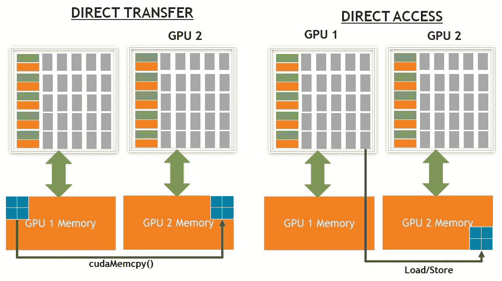

要理解 P2P 的优势，有必要了解 PCIe 总线规范。这是为了通过 InfiniBand 等互连优化与其他节点进行通信而创建的。当我们想要从单个 GPU 优化地发送和接收数据时，情况就不同了。以下是一个样本 PCIe 拓扑，其中八个 GPU 连接到各种 CPU 和 NIC/InfiniBand 卡：

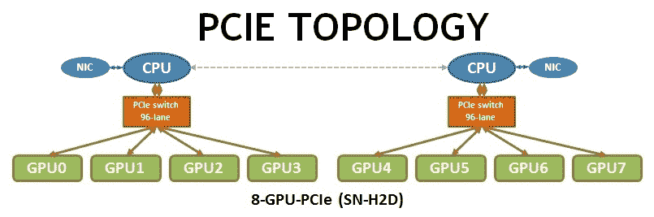

在前面的图表中，GPU0 和 GPU1 之间允许 P2P 传输，因为它们都位于同一个 PCIe 交换机中。然而，GPU0 和 GPU4 不能执行 P2P 传输，因为两个**I/O Hub**（IOHs）之间不支持 PCIe P2P 通信。IOH 不支持来自 PCI Express 的非连续字节进行远程对等 MMIO 事务。连接两个 CPU 的 QPI 链路的性质确保了如果 GPU 位于不同的 PCIe 域上，则不可能在 GPU 内存之间进行直接 P2P 复制。因此，从 GPU0 的内存到 GPU4 的内存的复制需要通过 PCIe 链路复制到连接到 CPU0 的内存，然后通过 QPI 链路传输到 CPU1，并再次通过 PCIe 传输到 GPU4。正如你所想象的那样，这个过程增加了大量的开销，无论是延迟还是带宽方面。

以下图表显示了另一个系统，其中 GPU 通过支持 P2P 传输的 NVLink 互连相互连接：

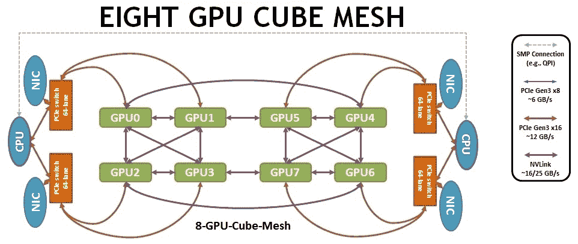

前面的图表显示了一个样本 NVLink 拓扑，形成了一个八立方网格，其中每个 GPU 与另一个 GPU 最多相连 1 跳。

更重要的问题是，*我们如何找出这个拓扑结构以及哪些 GPU 支持 P2P 传输？*幸运的是，有工具可以做到这一点。`nvidia-smi`就是其中之一，它作为 NVIDIA 驱动程序安装的一部分被安装。以下屏幕截图显示了在前面图表中显示的 NVIDIA DGX 服务器上运行`nvidia-smi`的输出：

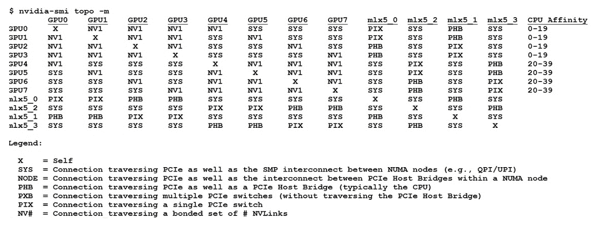

前面的屏幕截图代表了在具有 8 个 GPU 的 DGX 系统上运行`nvidia-smi topo -m`命令的结果。如您所见，通过 SMP 互连（`QPI`/`UPI`）连接到另一个 GPU 的任何 GPU 都无法执行 P2P 传输。例如，`GPU0`将无法与`GPU5`、`GPU6`和`GPU7`进行 P2P 传输。另一种方法是通过 CUDA API 来找出这种传输，我们将在下一节中使用它来转换我们的代码。

现在我们已经了解了系统拓扑，我们可以开始将我们的应用程序转换为单个节点/服务器上的多个 GPU。

# 单节点-多 GPU 高斯消元

准备您的多 GPU 应用程序。此代码可以在本书的 GitHub 存储库中的`06_multigpu/gaussian`中找到。使用`nvcc`编译器编译您的应用程序，如下所示：

```cpp
$ nvcc -o gaussian_multi_gpu_p2p.out gaussian_multi_gpu_p2p.cu
$ time ./gaussian_multi_gpu_p2p.out
```

从单 GPU 实现转换为多 GPU 实现，我们在上一小节中定义的三个内核将被原样使用。但是，线性系统被分成与 GPU 数量相等的部分。这些部分分配给每个 GPU 一个部分。每个 GPU 负责对分配给该 GPU 的部分执行操作。矩阵是按列分割的。这意味着每个 GPU 从所有行中获得相等数量的连续列。用于找到主元的内核在包含主元素的列上启动。主元元素的行索引被广播到其他 GPU。提取的主元行和行消除内核在所有 GPU 上启动，每个 GPU 都在矩阵的自己的部分上工作。以下图显示了行在多个 GPU 之间的分割以及主元行需要广播到其他进程的情况：

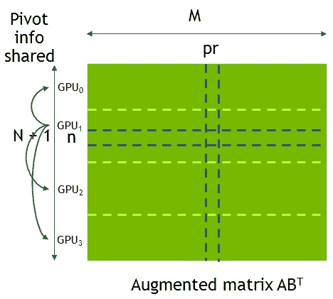

上述图表示了在多个 GPU 上的工作分配。目前，主元行属于**GPU1**，负责将主元行广播到其他 GPU。

让我们试着理解这些代码更改，以及用于启用 P2P 功能的 CUDA API：

1.  在支持的 GPU 之间启用 P2P 访问。以下代码显示了这个步骤的第一步：启用 GPU 之间的 P2P 访问：

```cpp
for( int i = 0; i < nGPUs; i++ ){   
    // setup P2P 
    cudaSetDevice(i);   
    for( int j = 0; j < nGPUs; j++ ) {      
        if (i == j) continue;      
        cudaDeviceCanAccessPeer(&canAccessPeer, i, j);
        if (canAccessPeer)      
            cudaDeviceEnablePeerAccess(j, 0);    
    } 
}
```

在上述代码中使用的关键 API 如下：

+   +   `cudaDeviceCanAccessPeer()`: 检查当前 GPU 是否可以对传递的 GPU ID 进行 P2P 访问

+   `cudaDeviceEnablePeerAccess()`: 如果`cudaDeviceCanAccessPeer()`返回`True`，则启用 P2P 访问

1.  拆分并将内容传输到各自的 GPU：

```cpp
for( int g = 0; g < nGPUs; g++ ){       
    cudaSetDevice(g);       
    //Copy  part ‘g’ of ABT to GPU ‘g’; 
}
```

在上述代码中使用的关键 API 是`cudaSetDevice()`。这将当前上下文设置为作为参数传递的 GPU ID。

1.  找到主元行并通过 P2P 进行广播：

```cpp
for( int n = 0; n < N; n++ ){        
    gp = GPU that holds n;        
    cudaSetDevice(gp);        
    findPivotRowAndMultipliers<<<...>>>();
    for( int g = 0; g < nGPUs; g++ ){ 
        if (g == gp) continue;
        cudaMemcpyPeer(pivotDatag, g, pivotDatagp, gp, numBytes);
     }  ... 
```

用于将传输广播到 GPU 的 API 是`cudaMemcpyPeer()`。

1.  提取主元行并执行行消除：

```cpp
for( int n = 0; n < N; n++ ){
    ...
    for( int g = 0; g < nGPUs; g++ ){  
        cudaSetDevice(g); 
        extractPivotRow<<<...>>>(); 
        rowElimination<<<...>>>();   
    }  
}  
```

如您所见，我们仍在重用相同的内核。唯一的区别是我们使用`cudaSetDevice()` API 告诉 CUDA 运行时内核应该在哪个 GPU 上启动。请注意，`cudaSetDevice()`是一个昂贵的调用，特别是在旧一代的 GPU 上。因此，建议您通过在 CPU 上并行调用`nGPUs`的 for 循环，利用`OpenMP`/`OpenACC`或 CPU 上的任何其他线程机制来调用。

1.  从各自的 CPU 中复制数据回来：

```cpp
for( int g = 0; g < nGPUs; g++ ){ 
    cudaSetDevice(g);  
    Copy  part ‘g’ of reduced ABT from GPU ‘g’ to Host; 
}
```

这五个步骤完成了将单个 GPU 实现转换为单个节点上的多个 GPU 的练习。

作为 CUDA 安装的一部分提供的 CUDA 示例包括一些测试 P2P 带宽性能的示例代码。它可以在`samples/1_Utilities/p2pBandwidthLatencyTest`文件夹中找到。建议您在系统上运行此应用程序，以便了解系统的 P2P 带宽和延迟。

现在我们已经在单个节点上实现了多 GPU，我们将改变方向并在多个 GPU 上运行此代码。但在将我们的代码转换为多个 GPU 之前，我们将提供一个关于 MPI 编程的简短介绍，这主要用于节点间通信。

# MPI 的简要介绍

**消息传递接口**（**MPI**）标准是一种消息传递库标准，已成为在 HPC 平台上编写消息传递程序的行业标准。基本上，MPI 用于在多个 MPI 进程之间进行消息传递。相互通信的 MPI 进程可以驻留在同一节点上，也可以跨多个节点。

以下是一个 Hello World MPI 程序的示例：

```cpp
#include <mpi.h> 
int main(int argc, char *argv[]) {     
    int rank,size;     
    /* Initialize the MPI library */     
    MPI_Init(&argc,&argv);     
    /* Determine the calling process rank and total number of ranks */
    MPI_Comm_rank(MPI_COMM_WORLD,&rank);     
    MPI_Comm_size(MPI_COMM_WORLD,&size);     
    /* Compute based on process rank */     
    /* Call MPI routines like MPI_Send, MPI_Recv, ... */     
    ...     
    /* Shutdown MPI library */     
    MPI_Finalize();     
    return 0; 
}
```

正如您所看到的，MPI 程序涉及的一般步骤如下：

1.  我们包括头文件`mpi.h`，其中包括所有 MPI API 调用的声明。

1.  我们通过调用`MPI_Init`并将可执行参数传递给它来初始化 MPI 环境。在这个语句之后，多个 MPI 等级被创建并开始并行执行。

1.  所有 MPI 进程并行工作，并使用诸如`MPI_Send()`、`MPI_Recv()`等消息传递 API 进行通信。

1.  最后，我们通过调用`MPI_Finalize()`终止 MPI 环境。

我们可以使用不同的 MPI 实现库（如 OpenMPI、MVPICH、Intel MPI 等）来编译此代码：

```cpp
$ mpicc -o helloWorldMPI helloWorldMPI.c
$ mpirun -n 4 --hostfile hostsList ./helloWorldMPI
```

我们使用`mpicc`编译器来编译我们的代码。`mpicc`基本上是一个包装脚本，它在内部扩展编译指令，以包括相关库和头文件的路径。此外，运行 MPI 可执行文件需要将其作为参数传递给`mpirun`。`mpirun`是一个包装器，它帮助在应用程序应该执行的多个节点上设置环境。`-n 4`参数表示我们要运行四个进程，并且这些进程将在主机名存储在文件主机列表中的节点上运行。

在本章中，我们的目标是将 GPU 内核与 MPI 集成，使其在多个 MPI 进程中运行。但我们不会涵盖 MPI 编程的细节。那些不熟悉 MPI 编程的人应该先查看[`computing.llnl.gov/tutorials/mpi/`](https://computing.llnl.gov/tutorials/mpi/)，了解分布式并行编程，然后再进入下一节。

# GPUDirect RDMA

在集群环境中，我们希望在多个节点上利用 GPU。我们将允许我们的并行求解器将 CUDA 代码与 MPI 集成，以利用多节点、多 GPU 系统上的多级并行性。使用 CUDA-aware MPI 来利用 GPUDirect RDMA 进行优化的节点间通信。

GPUDirect RDMA 允许在集群中的 GPU 之间进行直接通信。它首先由 CUDA 5.0 与 Kepler GPU 卡支持。在下图中，我们可以看到 GPUDirect RDMA，即**Server 1**中的**GPU 2**直接与**Server 2**中的**GPU 1**通信：

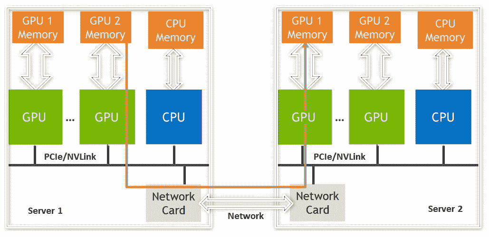

GPUDirect RDMA 工作的唯一理论要求是**网络卡**和**GPU**共享相同的根复杂性。 GPU 和网络适配器之间的路径决定了是否支持 RDMA。让我们重新访问我们在上一节中运行的 DGX 系统上`nvidia-smi topo -m`命令的输出：

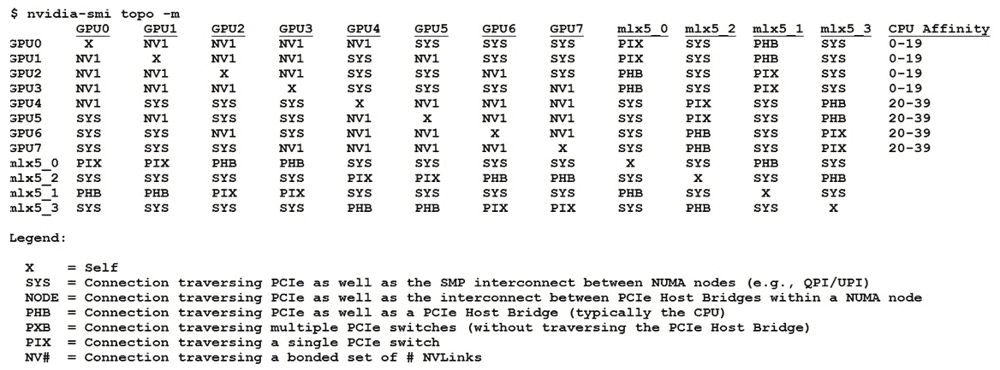

如果我们看一下`GPU4`行，它显示`GPU4`到`mlx5_2`连接类型为`PIX`（通过 PCIe 交换机遍历）。我们还可以看到`GPU4`到`mlx_5_0`连接类型为`SYS`（通过`QPI`遍历）。这意味着`GPU4`可以通过 Mellanox InfiniBand 适配器`mlx_5_2`执行 RDMA 传输，但如果需要从`mlx_5_0`进行传输，则无法进行 RDMA 协议，因为`QPI`不允许。

# CUDA-aware MPI

所有最新版本的 MPI 库都支持 GPUDirect 功能。支持 NVIDIA GPUDirect 和**统一虚拟寻址**（**UVA**）的 MPI 库使以下功能可用：

+   MPI 可以将 API 传输直接复制到/从 GPU 内存（RDMA）。

+   MPI 库还可以区分设备内存和主机内存，无需用户提示，因此对 MPI 程序员透明。

+   程序员的生产率提高了，因为少量应用代码需要更改以在多个 MPI 秩之间传输数据。

正如我们之前提到的，CPU 内存和 GPU 内存是不同的。没有 CUDA-aware MPI，开发人员只能将指向 CPU/主机内存的指针传递给 MPI 调用。以下代码是使用非 CUDA-aware MPI 调用的示例：

```cpp
 //MPI rank 0:Passing s_buf residing in GPU memory 
 // requires it to be transferred to CPU memory
cudaMemcpy(s_buf_h,s_buf_d,size,cudaMemcpyDeviceToHost);
MPI_Send(s_buf_h,size,MPI_CHAR,1,100,MPI_COMM_WORLD);

//MPI rank 1: r_buf received buffer needs to be 
// transferred to GPU memory before being used in GPU
MPI_Recv(r_buf_h,size,MPI_CHAR,0,100,MPI_COMM_WORLD, &status);
cudaMemcpy(r_buf_d,r_buf_h,size,cudaMemcpyHostToDevice);
```

有了 CUDA-aware MPI 库，这是不必要的；GPU 缓冲区可以直接传递给 MPI，如下所示：

```cpp
//MPI rank 0
MPI_Send(s_buf_d,size,MPI_CHAR,1,100,MPI_COMM_WORLD);

//MPI rank n-1
MPI_Recv(r_buf_d,size,MPI_CHAR,0,100,MPI_COMM_WORLD, &status);
```

例如，对于 Open MPI，CUDA-aware 支持存在于 Open MPI 1.7 系列及更高版本中。要启用此功能，需要在编译时配置 Open MPI 库以支持 CUDA，如下所示：

```cpp
$ ./configure --with-cuda
```

拥有 CUDA-aware MPI 并不意味着总是使用 GPUDirect RDMA。如果数据传输发生在网络卡和 GPU 之间共享相同的根复杂，则使用 GPUDirect 功能。尽管如此，即使未启用 RDMA 支持，拥有 CUDA-aware MPI 也可以通过利用诸如消息传输之类的功能使应用程序更有效，如下图所示可以进行流水线处理：

！[](img/d0de7272-eae9-4914-aee2-400f73f125bf.png)

上图显示了具有 GPUDirect 的 CUDA-aware MPI 与不具有 GPUDirect 的 CUDA-aware MPI。两个调用都来自 CUDA-aware MPI，但左侧是 GPUDirect 传输，右侧是没有 GPUDirect 传输。

非 GPUDirect 传输有以下阶段：

+   节点 1：从 GPU1 传输到主机内存

+   节点 1：从主机内存传输到网络适配器暂存区

+   网络：通过网络传输

+   节点 2：从网络暂存区传输到主机内存

+   节点 2：从主机内存传输到 GPU 内存

如果支持 GPUDirect RDMA，则从 GPU 传输直接通过网络进行，涉及主机内存的额外副本都被删除。

现在我们已经掌握了这个概念，让我们开始将代码转换为使用 CUDA-aware MPI 编程启用多 GPU 支持。

# 多节点-多 GPU 高斯消元

准备您的 GPU 应用程序。此代码可以在本书的 GitHub 存储库中的`06_multigpu/gaussian`中找到。使用`nvcc`编译器编译和运行应用程序，如下所示：

```cpp
$ mpicc-o gaussian_multi_gpu_rdma.out gaussian_multi_gpu_rdma.cu
$ mpirun -np 8 ./gaussian_multi_gpu_rdma.out
```

我们使用`mpicc`而不是`nvcc`来编译 MPI 程序。我们使用`mpirun`命令运行可执行文件，而不是直接运行已编译的可执行文件。本节中您将看到的结果是在同一系统上具有 8 个 V100 的 DGX 系统上运行的输出。我们利用 8 个最大 MPI 进程，将每个 GPU 映射为 1 个 MPI 进程。要了解如何将多个 MPI 进程映射到同一 GPU，请阅读本章后面的*MPS*子节。在本练习中，我们使用了已编译为支持 CUDA 的 Open MPI 1.10，如前一节所述。

多 GPU 实现涉及的步骤如下：

1.  MPI 进程的秩 0 生成线性系统（矩阵 A，B）的数据。

1.  转置增广矩阵（AB^T）由根节点在 MPI 进程之间使用`MPI_Scatterv()`按行分割。

1.  每个 MPI 进程并行计算其部分输入：

+   三个内核的处理发生在 GPU 上。

+   在`findPivot`操作后，通过`MPI_Send()`/`Recv()`实现了枢轴的共识。

1.  减少的**转置增广矩阵**（**ABT**）使用`MPI_Gatherv()`在根节点上收集。

1.  根节点执行回代以计算解 X。

展示前面代码的提取样本高斯代码如下：

```cpp
void gaussianEliminationOnGPU() {
    cudaSetDevice(nodeLocalRank); //Set CUDA Device based on local rank
    //Copy  chuck of AB Transpose from Host to GPU; 
   for( int n = 0; n < N; n++ ){ 
       prank = MPI rank that holds n; 
       if (myRank == prank) 
           findPivotRowAndMultipliers<<<...>>>(); 
       bCastPivotInfo(); // from prank to other ranks 
       extractPivotRow<<<...>>>(); 
       rowElimination<<<...>>>(); 
   //Copy  myPartOfReducedTransposeAB from GPU to Host;
}
```

现在，让我们添加多 GPU 支持：

1.  **设置每个 MPI 等级的 CUDA 设备**：在 Open MPI 中，您可以通过使用`MPI_COMM_TYPE_SHARED`作为`MPI_Comm_split_type`的参数来获得 MPI 进程的本地等级，如下面的代码所示：

```cpp
MPI_Comm loc_comm;
MPI_Comm_split_type(MPI_COMM_WORLD, MPI_COMM_TYPE_SHARED, rank, MPI_INFO_NULL, &loc_comm);
int local_rank = -1;
MPI_Comm_rank(loc_comm,&local_rank);
MPI_Comm_free(&loc_comm);
```

现在我们有了本地等级，每个 MPI 进程都使用它来通过`cudaSetDevice()`设置当前 GPU，如下图所示：

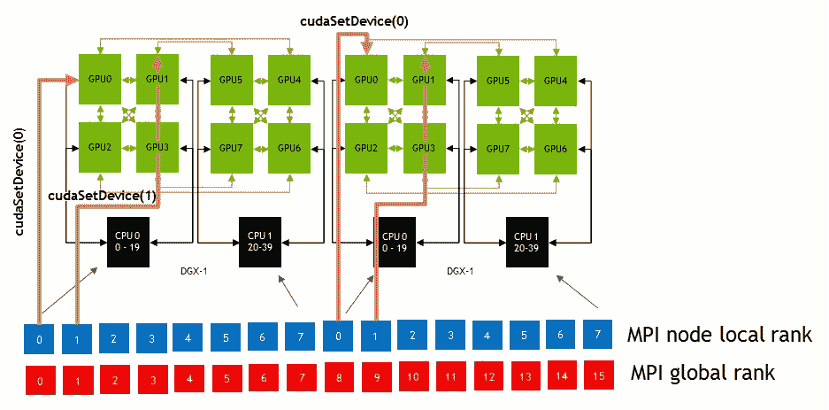

1.  使用`MPI_Scatter`将输入拆分并分发到不同的 MPI 进程：

```cpp
void distributeInputs() {
    MPI_Scatterv(transposeAB, ..., myPartOfTransposeAB, recvCount, MPI_UNSIGNED, 0, MPI_COMM_WORLD); 
} 
```

1.  在 GPU 上执行高斯消元：

```cpp
void gaussianEliminationOnGPU() { 
    cudaSetDevice(nodeLocalRank);
     for( int n = 0; n < N; n++ ){ 
        prank = MPI rank that holds n; 
        if (myRank == prank) 
            findPivotRowAndMultipliers<<<...>>>();
        MPI_Bcast(...); // from prank to other ranks 
        extractPivotRow<<<...>>>(); 
        rowElimination<<<...>>>(); 
}
```

在执行任何操作之前，基于本地等级设置当前 GPU。然后，由负责该行的进程提取枢轴行，然后将枢轴行广播到所有其他 MPI 等级，我们用于消除。

通过使用异步 MPI 调用而不是使用广播 API（如`MPI_Bcast`），可以提高传输时间的整体性能。实际上，不建议使用广播 API；它应该被替换为可以实现相同功能的`MPI_Isend`和`MPI_Irecv`，这些是异步版本。请注意，使调用异步会增加其他方面（如调试）的复杂性。因此，用户需要编写额外的代码来发送和接收数据。

本章提供了在向现有 MPI 程序添加 GPU 支持时的最佳编码实践，并不应被视为 MPI 编程的最佳编程实践的专家指南。

# CUDA 流

流以 FIFO 方式工作，其中操作的顺序按照它们发出的顺序执行。从主机代码发出的请求被放入先进先出队列中。队列由驱动程序异步读取和处理，并且设备驱动程序确保队列中的命令按顺序处理。例如，内存复制在内核启动之前结束，依此类推。

使用多个流的一般想法是，在不同流中触发的 CUDA 操作可能会并发运行。这可能导致多个内核重叠或内核执行中的内存复制重叠。

为了理解 CUDA 流，我们将看两个应用程序。第一个应用程序是一个简单的矢量加法代码，添加了流，以便它可以重叠数据传输和内核执行。第二个应用程序是一个图像合并应用程序，也将在第九章中使用，*使用 OpenACC 进行 GPU 编程*。

首先，根据以下步骤配置您的环境：

1.  准备您的 GPU 应用程序。例如，我们将合并两个图像。此代码可以在本书的 GitHub 存储库的`06_multi-gpu/streams`文件夹中找到。

1.  使用`nvcc`编译器编译您的应用程序如下：

```cpp
$ nvcc --default-stream per-thread -o vector_addition -Xcompiler -fopenmp -lgomp vector_addition.cu
$ nvcc --default-stream per-thread -o merging_muli_gpu -Xcompiler -fopenmp -lgomp scrImagePgmPpmPackage.cu image_merging.cu
$ ./vector addition
$ ./merging_muli_gpu
```

上述命令将创建两个名为`vector_addition`和`merging_multi_gpu`的二进制文件。正如您可能已经注意到的，我们在我们的代码中使用了额外的参数。让我们更详细地了解它们：

+   `--default-stream per-thread`：此标志告诉编译器解析代码中提供的 OpenACC 指令。

+   `-Xcompiler -fopenmp -lgomp`：此标志告诉`nvcc`将这些附加标志传递给 CPU 编译器，以编译代码的 CPU 部分。在这种情况下，我们要求编译器向我们的应用程序添加与 OpenMP 相关的库。

我们将把这一部分分为两部分。应用程序 1 和应用程序 2 分别演示了在单个和多个 GPU 中使用流。

# 应用程序 1-使用多个流来重叠数据传输和内核执行

我们需要遵循的步骤来重叠数据传输和内核执行，或者同时启动多个内核如下：

1.  声明要固定的主机内存，如下面的代码片段所示：

```cpp
cudaMallocHost(&hostInput1, inputLength*sizeof(float));
cudaMallocHost(&hostInput2, inputLength*sizeof(float));
cudaMallocHost(&hostOutput, inputLength*sizeof(float));
```

在这里，我们使用`cudaMallocHost()` API 来分配固定内存的向量。

1.  创建一个`Stream`对象，如下面的代码片段所示：

```cpp
for (i = 0; i < 4; i++) {
 cudaStreamCreateWithFlags(&stream[i],cudaStreamNonBlocking);
```

在这里，我们使用`cudaStreamCreateWithFlags()` API，传递`cudaStreamNonBlocking`作为标志，使此流非阻塞。

1.  调用 CUDA 内核和内存复制时使用`stream`标志，如下面的代码片段所示：

```cpp
for (i = 0; i < inputLength; i += Seglen * 4) {
    for (k = 0; k < 4; k++) {
        cudaMemcpyAsync(... , cudaMemcpyHostToDevice, stream[k]);
        cudaMemcpyAsync(... , cudaMemcpyHostToDevice, stream[k]);
        vecAdd<<<Gridlen, 256, 0, stream[k]>>>(...);
    }
}
```

如我们所见，我们不是通过一次复制整个数组来执行矢量加法，而是将数组分成段，并异步复制这些段。内核执行也是在各自的流中异步进行的。

当我们通过 Visual Profiler 运行这段代码时，我们可以看到以下特点：

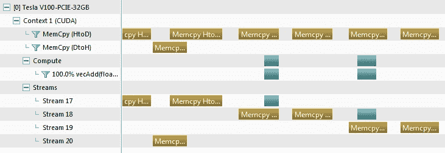

前面的分析器截图显示，蓝色条（基本上是`vector_addition`内核）重叠了内存复制。由于我们在代码中创建了四个流，分析器中也有四个流。

每个 GPU 都有两个内存复制引擎。一个负责主机到设备的传输，另一个负责设备到主机的传输。因此，发生在相反方向的两个内存复制可以重叠。此外，内存复制可以与计算内核重叠。这可以导致*n*路并发，如下图所示：

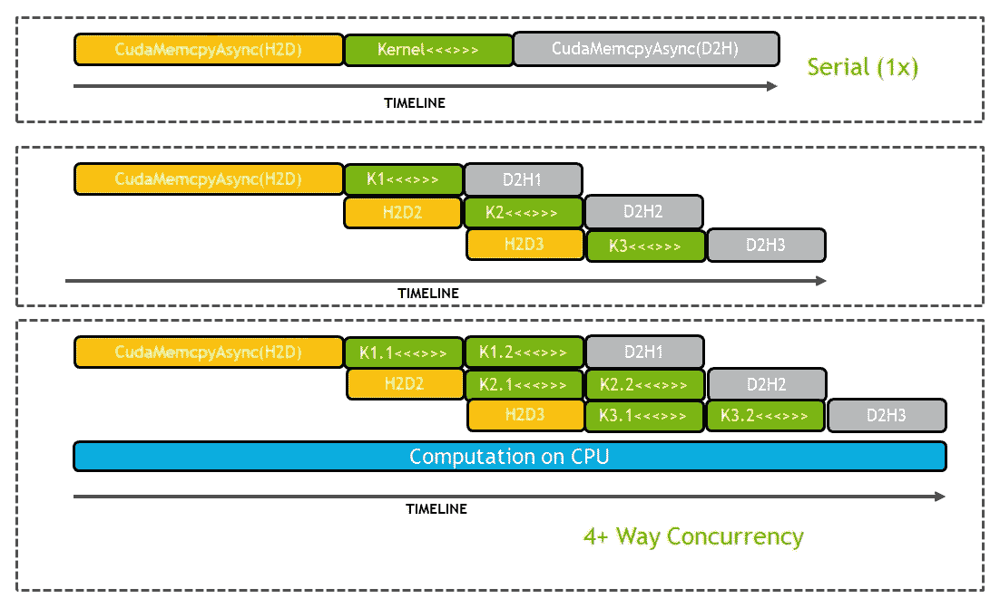

每个 GPU 架构都有一定的约束和规则，根据这些规则，我们将在执行时看到这些重叠。一般来说，以下是一些指导方针：

+   CUDA 操作必须在不同的非 0 流中。

+   使用`cudaMemcpyAsync`时，主机应该使用`cudaMallocHost()`或`cudaHostAlloc()`进行固定。

+   必须有足够的资源可用。

+   不同方向的`cudaMemcpyAsyncs`

+   设备资源（SMEM、寄存器、块等）以启动多个并发内核

# 应用程序 2 - 使用多个流在多个设备上运行内核

为了在多个设备上运行内核并重叠内存传输，我们之前遵循的步骤保持不变，除了一个额外的步骤：设置 CUDA 设备以创建流。让我们看看以下步骤：

1.  创建与系统中 CUDA 设备数量相等的流，如下面的代码片段所示：

```cpp
cudaGetDeviceCount(&noDevices);
cudaStream_t *streams;
streams = (cudaStream_t*) malloc(sizeof(cudaStream_t) * noDevices);
```

我们使用`cudaGetDeviceCount()` API 来获取 CUDA 设备的数量。

1.  在各自的设备中创建流，如下面的代码片段所示：

```cpp
#pragma omp parallel num_threads(noDevices)
{
     int block = omp_get_thread_num();
    cudaSetDevice(block);
    cudaStreamCreate(&streams[block]);
```

我们启动与 CUDA 设备数量相等的 OpenMP 线程，以便每个 CPU 线程可以为其各自的设备创建自己的 CUDA 流。每个 CPU 线程执行`cudaSetDevice()`来根据其 ID 设置当前 GPU，然后为该设备创建流。

1.  在该流中启动内核和内存复制，如下所示：

```cpp
cudaMemcpyAsync(... cudaMemcpyHostToDevice,streams[block]);
cudaMemcpyAsync(..., cudaMemcpyHostToDevice, streams[block]);
merging_kernel<<<gridDim,blockDim,0,streams[block]>>>(...);
cudaMemcpyAsync(...,streams[block]); 
```

在分析器中运行代码后的输出可以在下面的截图中看到，这代表了 Visual Profiler 的时间轴视图。这显示了一个 GPU 的内存复制与另一个 GPU 的内核执行重叠：

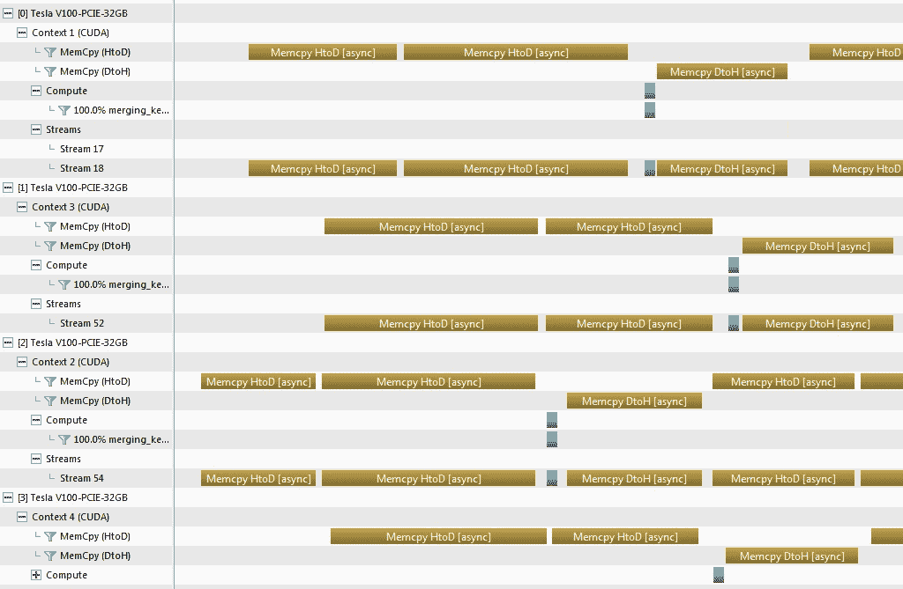

如您所见，我们在拥有四个 V100 的多 GPU 系统上运行了这段代码。不同 GPU 中的内存复制和内核重叠。在这段代码中，我们演示了利用 OpenMP 在不同设备上并行调用 CUDA 内核。这也可以通过利用 MPI 来启动利用不同 GPU 的多个进程来实现。

在下一节中，我们将看一些额外的主题，这些主题可以提高多 GPU 应用程序的性能，并帮助开发人员分析和调试他们的代码。

# 额外的技巧

在本节中，我们将涵盖一些额外的主题，这些主题将帮助我们了解多 GPU 系统的额外特性。

# 使用 InfiniBand 网络卡对现有系统进行基准测试

有不同的基准可用于测试 RDMA 功能。InfiniBand 适配器的一个这样的基准可以在[`www.openfabrics.org/`](https://www.openfabrics.org/)找到。您可以通过执行以下代码来测试您的带宽：

```cpp
$ git clone git://git.openfabrics.org/~grockah/perftest.git
$ cd perftest 
$ ./autogen.sh 
$ export CUDA_H_PATH=<<Path to cuda.h>> 
$ ./configure –prefix=$HOME/test 
$ make all install
```

然后，您可以运行以下命令来测试带宽：

```cpp
For example host to GPU memory (H-G) BW test:
server$ ~/test/bin/ib_write_bw -n 1000 -O -a --use_cuda
client $ ~/test/bin/ib_write_bw -n 1000 -O -a server.name.org

//GPU to GPU memory (G-G) BW test:
server$ ~/test/bin/ib_write_bw -n 1000 -O -a --use_cuda
client $ ~/test/bin/ib_write_bw -n 1000 -O -a --use_cuda server.name.org
```

# NVIDIA 集体通信库（NCCL）

NCCL 提供了常用于深度学习等领域的通信原语的实现。NCCL 1.0 从同一节点内多个 GPU 之间的通信原语实现开始，并发展到支持多个节点上的多个 GPU。NCCL 库的一些关键特性包括以下内容：

+   支持来自多个线程和多个进程的调用

+   支持多个环和树拓扑，以更好地利用节点内和节点间的总线

+   支持 InfiniBand 节点间通信

+   源代码包可以从 GitHub（[`github.com/nvidia/nccl`](https://github.com/nvidia/nccl)）免费下载

NCCL 可以扩展到 24,000 个 GPU，延迟低于 300 微秒。请注意，尽管 NCCL 已被证明是深度学习框架中非常有用和方便的库，但在用于 HPC 应用时存在局限，因为它不支持点对点通信。NCCL 支持集体操作，这在深度学习应用中被使用，例如以下内容：

+   `AllReduce`

+   `AllGather`

+   `ReduceScatter`

+   `Reduce`

+   `Broadcast`

所有 NCCL 调用都作为 CUDA 内核运行，以更快地访问 GPU 内存。它使用较少的线程，实现为一个块。这最终只在一个 GPU SM 上运行，因此不会影响其他 GPU 的利用率。让我们看一下以下代码：

```cpp
ncclGroupStart(); 
for (int i=0; i<ngpus; i++) 
{ 
    ncclAllGather(…, comms[i], streams[i]); 
} 
ncclGroupEnd();
```

正如我们所看到的，NCCL 调用简单，易于调用。

# 使用 NCCL 加速集体通信

**NVIDIA 集体通信库（NCCL）**提供了为多个 NVIDIA GPU 优化的性能集体通信原语。在本节中，我们将看到这个库是如何工作的，以及我们如何从中受益。

并不难找到使用多个 GPU 来训练网络的深度学习模型。由于两个 GPU 并行计算神经网络，我们很容易想象这种技术将随着 GPU 数量的增加而提高训练性能。不幸的是，世界并不那么简单。梯度应该在多个 GPU 之间共享，并且一个 GPU 中的权重更新过程应该等待其他 GPU 的梯度来更新其权重。这是使用多个 GPU 进行深度学习训练的一般过程，并在以下图表中显示：

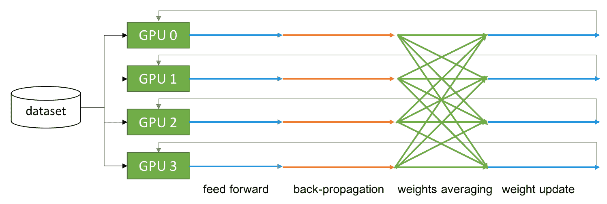

集体通信有许多类型：全局归约、广播、归约、全局收集、归约散射等。在深度学习中，每个 GPU 在传输自己的数据的同时收集另一个 GPU 的数据。因此，我们可以确定深度学习在通信中需要所有类型的归约样式通信。

在 HPC 社区中，包括全局归约在内的集体通信是一个常见的话题。节点内和节点间处理器之间的通信是一个具有挑战性但至关重要的问题，因为它直接关系到可扩展性。正如我们在第六章中提到的，*可扩展的多 GPU 编程*，在*多 GPU 编程*部分，需要仔细考虑与每个 GPU 的通信。开发人员应该设计和实现 GPU 中的集体通信，即使 MPI 已经支持这样的通信模式。

NCCL 提供了一种集体通信，它了解 GPU 拓扑配置。通过使用各种分组和通信命令，您可以应用所需的通信任务。

一个前提是您的系统需要有多个 GPU，因为 NCCL 是一个与多个 GPU 一起工作的通信库。

以下步骤涵盖了如何调用`ncclAllReduce()`来测试和测量系统的 GPU 网络带宽。示例代码实现在`04_nccl`中：

1.  让我们定义一个类型，它将包含、发送和接收每个 GPU 设备的缓冲区和`cudaStream`，如下所示：

```cpp
typedef struct device
{
    float *d_send;
    float *d_recv;
    cudaStream_t stream;
} device_t;
```

1.  在应用程序开始时，我们需要准备一些句柄，以便我们可以控制多个 GPU：

```cpp
cudaGetDeviceCount(&num_dev);
ncclComm_t *ls_comms = new ncclComm_t[num_dev];
int *dev_ids = new int[num_dev];
for (int i = 0; i < num_dev; i++)
    dev_ids[i] = i;
```

1.  然后，我们将创建一个缓冲区，假设我们有数据。对于每个设备，我们将初始化每个设备的项目，如下所示：

```cpp
unsigned long long size = 512 * 1024 * 1024; // 2 GB

// allocate device buffers and initialize device handles
device_t *ls_dev = new device_t[num_dev];
for (int i = 0; i < num_dev; i++) {
    cudaSetDevice(i);
    cudaMalloc((void**)&ls_dev[i].d_send, sizeof(float) * size);
    cudaMalloc((void**)&ls_dev[i].d_recv, sizeof(float) * size);
    cudaMemset(ls_dev[i].d_send, 0, sizeof(float) * size);
    cudaMemset(ls_dev[i].d_recv, 0, sizeof(float) * size);
    cudaStreamCreate(&ls_dev[i].stream);
}
```

1.  在开始 NCCL 通信之前，我们需要初始化 GPU 设备，以便它们知道它们在 GPU 组中的排名。由于我们将用单个进程测试带宽，我们可以安全地调用一个初始化所有设备的函数：

```cpp
ncclCommInitAll(ls_comms, num_dev, dev_ids);
```

1.  如果我们要用多个进程测试带宽，我们需要调用`ncclCommInitRank()`。我们需要为计算进程 ID 和 GPU 排名提供 GPU ID。

1.  现在，我们可以使用 NCCL 完成 all-reduce 操作。以下代码是`ncclAllReduce`的示例实现：

```cpp
ncclGroupStart();
for (int i = 0; i < num_dev; i++) {
    ncclAllReduce((const void*)ls_dev[i].d_send, 
                  (void*)ls_dev[i].d_recv,
        test_size, ncclFloat, ncclSum, 
        ls_comms[i], ls_dev[i].stream);
}
ncclGroupEnd();
```

对于每个设备，我们需要触发流量。为此，我们需要启动和关闭 NCCL 组通信。现在，我们已经实现了一些使用`ncclAllReduce()`的测试代码。让我们通过微基准测试来了解 NCCL 的工作原理。

在多 GPU 系统上测试此代码，运行以下命令：

```cpp
$ nvcc -run -m64 -std=c++11 -I/usr/local/cuda/samples/common/inc -gencode arch=compute_70,code=sm_70 -lnccl -o nccl ./nccl.cu
```

以下图表显示了在 DGX Station 中使用四个 V100 32G GPU 测得的性能。蓝线表示基于 NVLink 的带宽，而橙线表示基于 PCIe 的带宽，通过设置`NCCL_P2P_DISABLE=1 ./ncd`并关闭对等 GPU 来实现：

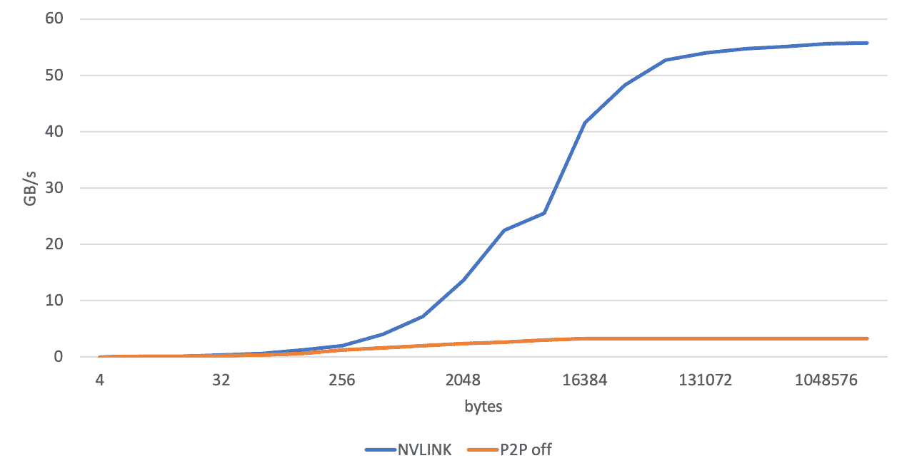

这个 NCCL 测试可能会受到系统配置的影响。这意味着结果可能会有所不同，取决于您系统的 GPU 拓扑结构。

这显示了基于 PCI Express 和基于 NVLINK 的 all-reduce 性能差异。我们可以使用`nvprof`来查看通信。以下屏幕截图显示了通过 NCCL 2.3.7 在 DGX Station 上的 all-reduce 通信：

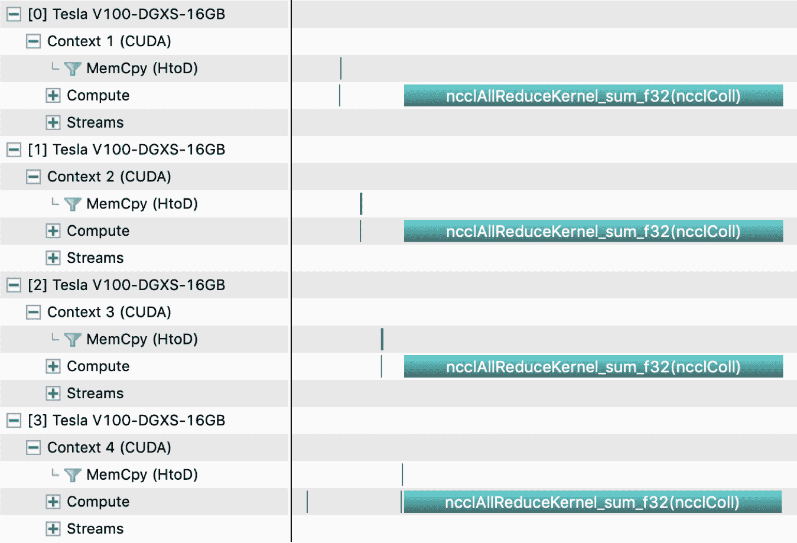

NCCL 越来越快。通过引入新的 GPU 互连技术 NVLink 和 NVSwitch，我们对 NCCL 的经验正在增加，以至于我们可以实现可扩展的性能。

以下链接提供了关于 NCCL 的讨论：[`developer.nvidia.com/gtc/2019/video/S9656/video`](https://developer.nvidia.com/gtc/2019/video/S9656/video)。

# 摘要

在本章中，我们介绍了多 GPU 编程的不同方法。通过示例高斯消元，我们看到了如何将单个 GPU 应用程序工作负载分割到多个 GPU 中，首先是单个节点，然后是多个节点。我们看到了系统拓扑在利用 P2P 传输和 GPUDirect RDMA 等功能方面起着重要作用。我们还看到了如何使用多个 CUDA 流来重叠多个 GPU 之间的通信和数据传输。我们还简要介绍了一些其他主题，可以帮助 CUDA 程序员优化代码，如 MPS 和使用`nvprof`来分析多 GPU 应用程序。

在下一章中，我们将看到大多数 HPC 应用程序中出现的常见模式以及如何在 GPU 中实现它们。
