# 第七章：CUDA 中的并行编程模式

在本章中，我们将涵盖并行编程算法，这将帮助您了解如何并行化不同的算法并优化 CUDA。本章中我们将涵盖的技术可以应用于各种问题，例如我们在第三章中看到的并行减少问题，*CUDA 线程编程*，它可以用于设计神经网络操作中的高效 softmax 层。

在本章中，我们将涵盖以下主题：

+   矩阵乘法优化

+   图像卷积

+   前缀和

+   打包和拆分

+   N 体操作

+   在 CUDA 中使用动态并行性进行快速排序

+   基数排序

+   直方图计算

# 技术要求

为了完成本章，建议您使用 Pascal 架构之后的 NVIDIA GPU 卡。换句话说，您的 GPU 的计算能力应等于或大于 60。如果您不确定您的 GPU 的架构，请访问 NVIDIA GPU 的网站（[`developer.nvidia.com/cuda-gpus`](https://developer.nvidia.com/cuda-gpus)）并确认您的 GPU 的计算能力。

本章中的相同代码已经使用 CUDA 版本 10.1 进行开发和测试。一般来说，如果适用的话，建议使用最新的 CUDA 版本。

# 矩阵乘法优化

虽然我们在许多示例中使用了矩阵乘法代码，但我们并没有调查操作是否被优化。现在，让我们回顾其操作以及如何找到优化的机会。

矩阵乘法是从两个矩阵进行的一组点积运算。我们可以简单地并行化所有 CUDA 线程执行的操作，以生成元素的点积。然而，从内存使用的角度来看，这种操作效率低，因为从内存加载的数据没有被重复使用。为了确认我们的类比，让我们测量性能限制器。以下图表显示了使用 NVIDIA Nsight Compute 的 Tesla V100 卡的 GPU 利用率：

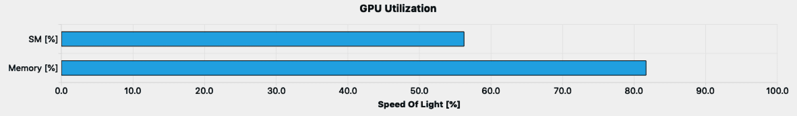

根据我们的性能限制器分析，这种利用率可以归类为内存受限。因此，我们应该审查内存利用率以减少利用率。以下截图显示了内存工作负载分析部分：

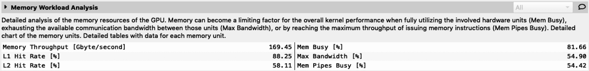

通过这个分析，我们可以看到 L2 缓存命中率低，最大带宽也低。我们可以推测这是因为原始矩阵乘法操作没有重复使用加载的数据，正如我们之前提到的。这可以通过使用共享内存来解决，即重复使用加载的数据并减少全局内存使用。现在，让我们回顾矩阵乘法以及如何优化使用具有小内存空间的共享内存。

矩阵乘法是一组点积运算，使用一些小尺寸矩阵和输出的累积。小矩阵称为瓦片，它们映射到输出矩阵上。每个瓦片将并行计算自己的输出。这个操作可以按以下步骤实现：

1.  确定两个输入和输出矩阵的瓦片大小。

1.  遍历输入瓦片，以及它们的方向（矩阵 A 向右移动，矩阵 B 向下移动）。

1.  在瓦片内计算矩阵乘法。

1.  继续第二步，直到瓦片达到末尾。

1.  刷新输出。

以下图表显示了瓦片矩阵乘法的概念：

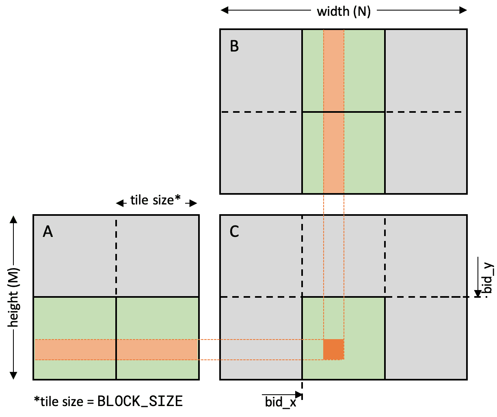

在上图中，我们计算矩阵乘法，*C = AB*。我们从矩阵 A 和矩阵 B 中计算一个较小的矩阵乘法作为瓦片（绿色）。然后，我们分别遍历输入瓦片位置。操作结果累积到先前的输出，以生成矩阵乘法的输出。

这个操作提供了一个优化机会，因为我们可以将大矩阵操作分解为小问题，并将其放置在小内存空间中。在 CUDA 编程中，我们将小矩阵放置在共享内存中，并减少全局内存访问。在我们的实现中，我们将瓦片与 CUDA 线程块匹配。瓦片的位置将由其块索引确定，这是通过`tid_*`变量完成的。

# 实现平铺方法

现在，让我们使用平铺方法实现优化的矩阵乘法。我们将重用之前在第三章中使用的矩阵乘法示例代码，即 CUDA 线程编程。优化后，我们将看看如何提高性能。按照以下步骤开始：

1.  让我们创建一个核函数，这将是我们优化版本的矩阵乘法。我们将在`sgemm`操作中命名核函数为`v2`。这个核函数将计算，因此我们应该分别提供相关参数。我们还将使用`M`、`N`和`K`传递矩阵大小信息：

```cpp
__global__ void sgemm_kernel_v2(const float *A, const float *B, float *C,
    int M, int N, int K, float alpha, float beta) {}
```

1.  对于这个操作，我们将分别使用块索引和线程索引。正如我们之前讨论的，我们需要单独使用块索引来指定瓦片位置。我们将使用线程索引进行瓦片级矩阵乘法。因此，我们需要创建 CUDA 索引参数，如下所示：

```cpp
int bid_x = blockIdx.x * blockDim.x;
int bid_y = blockIdx.y * blockDim.y;
int tid_x = threadIdx.x;
int tid_y = threadIdx.y;
```

1.  之后，我们将使用共享内存作为瓦片，并使用本地寄存器保存输出值：

```cpp
float element_c = 0.f;
__shared__ float s_tile_A[BLOCK_DIM][BLOCK_DIM];
__shared__ float s_tile_B[BLOCK_DIM][BLOCK_DIM];
```

1.  然后，我们将编写一个控制瓦片位置的循环。以下是基于其块大小控制循环的 for 循环代码。请注意，循环大小由`K`决定，考虑到块应该遍历多少次：

```cpp
for (int k = 0; k < K; k += BLOCK_DIM)
{
   ... {step 5 and 6 will cover } ...
}
```

1.  现在，我们将编写代码，将数据输入第二个循环。正如我们之前讨论的，每个瓦片都有自己的移动方向，以及矩阵；瓦片`A`遍历矩阵`A`的列，瓦片`B`遍历矩阵`B`的行。我们根据*矩阵乘法优化*部分中显示的图表来放置它们。之后，我们应该在从全局内存复制数据到共享内存后放置`__syncthreads()`，以避免来自上一次迭代的未更新数据：

```cpp
// Get sub-matrix from A
s_tile_A[tid_y][tid_x] = A[ (bid_y + tid_y) * K + tid_x + k ];
// Get sub-matrix from B 
s_tile_B[tid_y][tid_x] = B[ k * N + bid_x + tid_x ]; 

__syncthreads();
```

1.  然后，我们可以从瓦片中编写矩阵乘法代码。名为`element_c`的本地变量将累积结果：

```cpp
for (int e = 0; e < BLOCK_DIM; e++)
    element_c += s_tile_A[tid_y][e] * s_tile_B[e][tid_x];
```

1.  我们将结果写入全局内存。以下操作应该放置在第二个循环完成后：

```cpp
C[(bid_y + tid_y) * N + (bid_x + tid_x)] = \
 alpha * element_c + beta * C[(bid_y + tid_y) * N + (bid_x + tid_x)];
```

1.  现在，让我们回顾一下这种平铺方法如何有利于矩阵乘法操作。通过在我们的平铺矩阵乘法中使用共享内存，我们可以期望通过使用输入数据减少全局内存流量，从而增强性能。我们可以轻松地通过配置文件结果来确认这一点：

```cpp
$ nvcc -m64 -I/usr/local/cuda/samples/common/inc -gencode arch=compute_70,code=sm_70 -o sgemm ./sgemm.cu 
$ nvprof ./sgemm 

        Type Time(%)    Time Calls      Avg      Min      Max Name
GPU activities: 47.79% 9.9691ms     1 9.9691ms 9.9691ms 9.9691ms sgemm_kernel(...)
 32.52% 6.7845ms     1 6.7845ms 6.7845ms 6.7845ms sgemm_kernel_v2(...)
```

1.  由于我们设计了核心以重用输入数据，增加的块大小可能有助于性能。例如，考虑到 warp 大小和共享内存银行的数量，32 x 32 的块大小可能是最佳的，以避免银行冲突。我们可以轻松地使用配置文件获得其实验结果：

```cpp
 Type Time(%)    Time Calls      Avg       Min       Max Name
GPU activities: 46.52% 8.1985ms     1 8.1985ms  8.1985ms  8.1985ms sgemm_kernel(...)
 31.24% 5.4787ms     1 5.4787ms  5.4787ms  5.4787ms sgemm_kernel_v2(...)
```

正如你所看到的，增加的瓦片大小有利于矩阵乘法操作的性能。现在，让我们分析其性能。

# 平铺方法的性能分析

之前，我们看过了平铺方法以及它如何能够实现良好的性能。让我们回顾一下平铺方法解决了什么问题，并看看接下来我们可以采取哪些步骤。总的来说，覆盖这部分是可选的，因为 NVIDIA 提供了 cuBLAS 和 CUTLASS 库，用于提供优化性能的 GEMM（**通用矩阵乘法**）操作。

下图显示了来自 NVIDIA Nsight Compute 的更新后的 GPU 利用率报告。较低配置文件的更新利用率输出是上配置文件的结果：

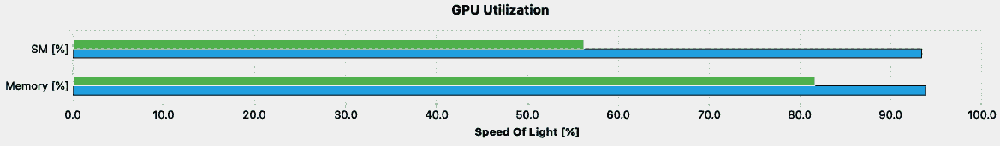

由于两个资源都利用率很高，我们应该审查每个资源的资源使用情况。首先，让我们来审查内存工作量。以下截图显示了更新后的结果：

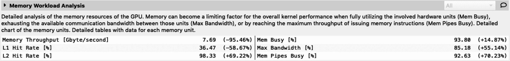

从这个结果可以看出，全局内存访问从最大化内存带宽和减少内存吞吐量进行了优化。此外，L2 缓存命中率也得到了提高。因此，我们的平铺方法将矩阵乘法从全局内存转换为芯片级操作。

然而，这并不意味着我们已经实现了最优化的性能。从内存工作量分析中，我们可以看到内存管道太忙了。这是由于我们从共享内存进行逐元素乘法。为了解决这个问题，我们需要重新映射共享内存中的数据。我们不会在这本书中涉及到这个问题，但你可以在这篇文章中了解到：[`github.com/NervanaSystems/maxas/wiki/SGEMM`](https://github.com/NervanaSystems/maxas/wiki/SGEMM)。

正如我们之前讨论的，cuBLAS 库显示出更快的性能。我们将在第八章的*cuBLAS*部分中介绍其用法。然而，在这个阶段理解平铺方法是有用的，这样我们就可以理解 GPU 如何开始优化。

# 卷积

卷积操作（或滤波）是许多应用中常见的操作，特别是在图像和信号处理以及深度学习中。虽然这个操作是基于输入和滤波器的顺序数据的乘积，但我们对矩阵乘法有不同的方法。

# CUDA 中的卷积操作

卷积操作包括源数据和滤波器。滤波器也被称为核。通过将滤波器应用于输入数据，我们可以获得修改后的结果。下图显示了二维卷积的示意图：

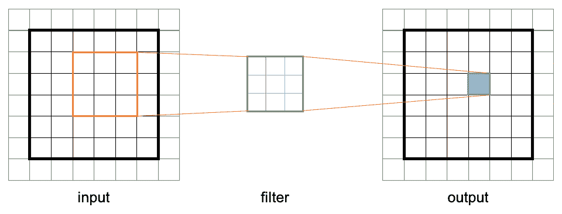

当我们实现卷积操作时，我们需要考虑一些概念，即核和填充。核是一组我们想要应用到源数据的系数。这也被称为滤波器。填充是源数据周围的额外虚拟空间，以便我们可以将核函数应用到边缘。当填充大小为 0 时，我们不允许滤波器移动超出源空间。然而，一般来说，填充大小是滤波器大小的一半。

为了轻松开始，我们可以考虑以下几点来设计核函数：

+   每个 CUDA 线程生成一个滤波输出。

+   每个 CUDA 线程将滤波器的系数应用于数据。

+   滤波器的形状是盒状滤波器。

在满足这些条件的情况下，我们可以有一个简单的卷积操作滤波器，如下所示：

```cpp
__global__ void
convolution_kernel_v1(float *d_output, float *d_input, float *d_filter, int num_row, int num_col, int filter_size)
{
    int idx_x = blockDim.x * blockIdx.x + threadIdx.x;
    int idx_y = blockDim.y * blockIdx.y + threadIdx.y;

    float result = 0.f;
    // iterates over the every value in the filter
    for (int filter_row = -filter_size / 2; 
         filter_row <= filter_size / 2; ++filter_row)
    {
        for (int filter_col = -filter_size / 2; 
             filter_col <= filter_size / 2; ++filter_col)
        {
            // Find the global position to apply the given filter
            // clamp to boundary of the source
            int image_row = min(max(idx_y + filter_row, 0), 
                                static_cast<int>(num_row - 1));
            int image_col = min(max(idx_x + filter_col, 0), 
                                static_cast<int>(num_col - 1));

            float image_value = static_cast<float>(
                                d_input[image_row * num_col + 
                                image_col]);
            float filter_value = d_filter[(filter_row + 
                                           filter_size / 2) * 
                                           filter_size 
                                           + filter_col + 
                                           filter_size / 2];

            result += image_value * filter_value;
        }
    }

    d_output[idx_y * num_col + idx_x] = result;
}
```

这个核函数获取输入数据和滤波器进行操作，并没有重用所有数据。考虑到内存效率带来的性能影响，我们需要设计我们的核心代码，以便可以重用加载的数据。现在，让我们编写卷积的优化版本。

# 优化策略

首先，卷积滤波器是一个只读矩阵，并且被所有 CUDA 线程使用。在这种情况下，我们可以使用 CUDA 的常量内存来利用其缓存操作和广播操作。

在卷积实现设计中，我们使用平铺方法，每个平铺将生成映射位置的滤波输出。我们的平铺设计有额外的空间来考虑卷积滤波器的大小，这为卷积操作提供了所需的数据。这个额外的空间被称为**填充**。下图显示了一个具有 6 x 6 维度和 3 x 3 大小滤波器的线程块的示例。

然后，我们需要为每个线程块在共享内存上有一个 8 x 8 大小的平铺，如下所示：

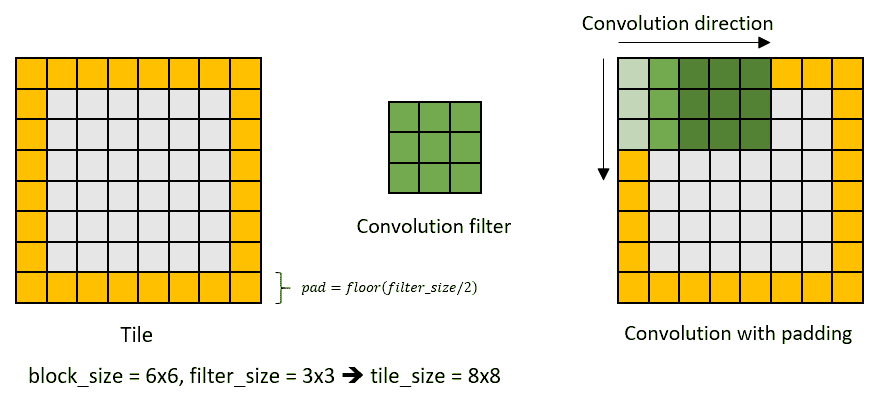

当源地址无效内存空间时，或者填充为零（零填充方法）时，填充区域可以是输入数据。通过这样做，我们可以使瓷砖替换输入全局内存而不会对边界元素产生额外影响。为了填充瓷砖，我们使用线程块大小迭代瓷砖，并通过检查输入数据的边界条件来确定应该填充哪个值。我们的实现将输入数据设置为瓷砖大小的倍数，以便边界条件与每个线程块的瓷砖的填充空间匹配。将源数据映射到瓷砖的简要图示如下：

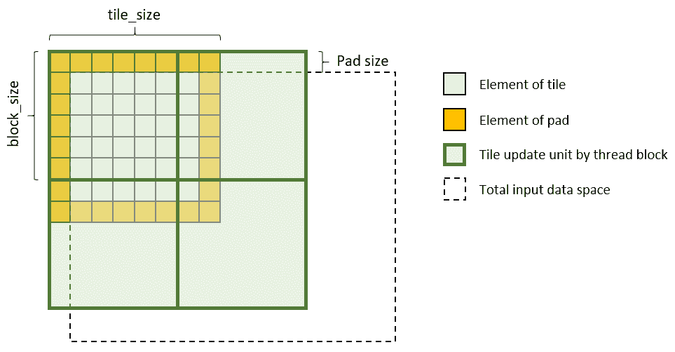

在这个设计中，我们需要做的迭代次数来填充瓷砖是四次。然而，这应该根据滤波器大小进行更改。这样，填充瓷砖的迭代次数由瓷砖大小的上限除以线程块大小确定。其实现很简单，如下面的代码所示：

```cpp
for (int row = 0; row <= tile_size / BLOCK_DIM; row++) {
    for (int col = 0; col <= tile_size / BLOCK_DIM; col++) {
        ... (filter update operation) ...
    }
}
```

现在，让我们使用共享内存作为盒式滤波器来实现优化的卷积操作。

# 使用常量内存优化滤波系数

首先，我们将学习如何优化滤波系数数据的使用。

我们将制作`convolution_kernel()`的修改版本。让我们复制内核代码，并将其中一个重命名为`convolution_kernel_v2()`：

1.  首先，我们将创建一个常量内存空间来存储滤波系数。常量内存的大小是有限的，我们不能对内核代码进行修改。然而，我们可以使用这个常量内存，因为我们的卷积滤波器适合这种条件。我们可以这样使用常量内存：

```cpp
#define MAX_FILTER_LENGTH 128
__constant__ float c_filter[MAX_FILTER_LENGTH * MAX_FILTER_LENGTH];
```

1.  然后，我们可以使用`cudaMemcpyToSymbol()`函数将卷积滤波系数放置在常量内存中：

```cpp
cudaMemcpyToSymbol(c_filter, h_filter, filter_size * filter_size * sizeof(float));
```

1.  让我们切换滤波操作，这样我们就可以使用常量内存。整个内核实现如下。正如你所看到的，只有一个变量的使用发生了变化：

```cpp
__global__ void
convolution_kernel_v2(float *d_output, float *d_input, float *d_filter, int num_row, int num_col, int filter_size)
{
    int idx_x = blockDim.x * blockIdx.x + threadIdx.x;
    int idx_y = blockDim.y * blockIdx.y + threadIdx.y;

    float result = 0.f;
    for (int filter_row = -filter_size / 2; 
         filter_row <= filter_size / 2; ++filter_row)
    {
        for (int filter_col = -filter_size / 2; 
             filter_col <= filter_size / 2; ++filter_col)
        {
            int image_row = idx_y + filter_row;
            int image_col = idx_x + filter_col;

            float image_value = (image_row >= 0 
                                 && image_row < num_row 
                                 && image_col >= 0
                                 && image_col < num_col) ?
                                 d_input[image_row * num_col 
                                         + image_col] : 0.f;
            float filter_value = c_filter[(filter_row 
                                          + filter_size / 2) 
                                          * filter_size 
                                          + filter_col 
                                          + filter_size / 2];

            result += image_value * filter_value;
        }
    }

    d_output[idx_y * num_col + idx_x] = result;
}
```

1.  现在，我们可以通过重复使用`nvprof`来确认性能提升：

```cpp
$ nvcc -run -m64 -I/usr/local/cuda/samples/common/inc -gencode arch=compute_70,code=sm_70 -o convolution ./convolution.cu
$ nvprof ./convolution
           Type Time(%) Time Calls Avg Min Max Name
 12.85% 442.21us     1 442.21us 442.21us 442.21us convolution_kernel_v1(...)
 11.97% 412.00us     1 412.00us 412.00us 412.00us convolution_kernel_v2(...)
```

从这个结果中，我们可以看到减少的内核执行时间。

# 使用共享内存平铺输入数据

现在，我们将使用共享内存来优化输入数据的使用。为了区分我们的下一个优化步骤，让我们复制之前的卷积核函数并将其命名为`convolution_kernel_v3()`：

1.  首先，我们需要预先准备共享内存空间，以便它可以存储输入数据。为了从共享内存中获得滤波操作的好处，我们需要额外的输入数据。为了创建足够的内存空间，我们需要修改内核调用，如下所示：

```cpp
int shared_mem_size = (2*filter_size+BLOCK_DIM) * (2*filter_size+BLOCK_DIM) * sizeof(float);
convolution_kernel_v3<<<dimGrid, dimBlock, shared_mem_size, 0 >>>(d_output, d_input, d_filter, num_row, num_col, filter_size);
```

1.  在内核代码中，我们可以声明共享内存空间如下：

```cpp
extern __shared__ float s_input[];
```

1.  然后，我们可以将输入数据复制到由线程块计算的共享内存中。首先，让我们声明一些帮助控制内存操作的变量：

```cpp
int pad_size = filter_size / 2;
int tile_size = BLOCK_DIM + 2 * pad_size;
```

1.  现在，我们可以按照之前讨论的平铺设计将加载的输入数据复制到共享内存中：

```cpp
for (int row = 0; row <= tile_size / BLOCK_DIM; row++) {
    for (int col = 0; col <= tile_size / BLOCK_DIM; col++) {
        int idx_row = idx_y + BLOCK_DIM * row - pad_size; 
        // input data index row
        int idx_col = idx_x + BLOCK_DIM * col - pad_size; 
        // input data index column
        int fid_row = threadIdx.y + BLOCK_DIM * row; 
        // filter index row
        int fid_col = threadIdx.x + BLOCK_DIM * col; 
        // filter index column

        if (fid_row >= tile_size || fid_col >= tile_size) continue;

        s_input[tile_size * fid_row + fid_col] = \
            (idx_row >= 0 && idx_row < num_row && idx_col >= 0 
                && idx_col < num_col) ? 
                d_input[num_col * idx_row + idx_col] : 0.f;
    }
}

__syncthreads();
```

1.  由于输入内存已更改，我们的卷积代码应该更新。我们可以将卷积代码编写如下：

```cpp
float result = 0.f;
    for (int filter_row = -filter_size / 2; 
         filter_row <= filter_size / 2; ++filter_row)
    {
        for (int filter_col = -filter_size / 2; 
             filter_col <= filter_size / 2; ++filter_col)
        {
            // Find the global position to apply the given filter 
            int image_row = threadIdx.y + pad_size + filter_row;
            int image_col = threadIdx.x + pad_size + filter_col;

            float image_value = s_input[tile_size 
                                        * image_row + image_col]; 
            float filter_value = c_filter[(filter_row 
                                          + filter_size / 2) 
                                          * filter_size 
                                          + filter_col 
                                          + filter_size / 2];

            result += image_value * filter_value;
        }
    }
```

1.  最后，我们可以使用`nvprof`来测量性能增益。从结果中，我们可以确认我们的加速速度比原始操作快了大约 35%：

```cpp
$ nvcc -run -m64 -I/usr/local/cuda/samples/common/inc -gencode arch=compute_70,code=sm_70 -o convolution ./convolution.cu
$ nvprof ./convolution
Processing Time (1) -> GPU: 0.48 ms
Processing Time (2) -> GPU: 0.43 ms
Processing Time (3) -> GPU: 0.30 ms
Processing Time -> Host: 4104.51 ms
... (profiler output) ...
              type Time(%)    Time Calls .    Avg      Min .    Max Name
   GPU activities: 66.85% 2.3007ms     3 766.91us 1.1840us 2.2979ms [CUDA memcpy HtoD]
                   12.85% 442.21us     1 442.21us 442.21us 442.21us convolution_kernel_v1()
                   11.97% 412.00us     1 412.00us 412.00us 412.00us convolution_kernel_v2()
                    8.33% 286.56us     1 286.56us 286.56us 286.56us convolution_kernel_v3()
```

现在，我们已经了解如何利用加载的数据，以便我们可以重复使用它与其他片上缓存而不是全局内存。我们将在下一节中更详细地讨论这个问题。

# 获得更多性能

如果滤波器是对称滤波器或可分离滤波器，我们可以将盒式滤波器分解为两个滤波器：水平滤波器和垂直滤波器。使用两个方向滤波器，我们可以在共享内存使用方面进行更多优化：内存空间和内存利用率。如果您想了解更多信息，请查看名为`convolutionSeparable`的 CUDA 示例，该示例位于`3_Imaging/convolutionSeparable`目录中。其详细说明也包含在相同目录的`doc/convolutionSeparable.pdf`中。

# 前缀和（扫描）

前缀和（扫描）用于从给定的输入数字数组中获得累积数字数组。例如，我们可以按以下方式制作前缀和序列：

| **输入数字** | 1 | 2 | 3 | 4 | 5 | 6 | ... |
| --- | --- | --- | --- | --- | --- | --- | --- |
| **前缀和** | 1 | 3 | 6 | 10 | 15 | 21 | ... |

它与并行减少不同，因为减少只是从给定的输入数据生成总操作输出。另一方面，扫描从每个操作生成输出。解决这个问题的最简单方法是迭代所有输入以生成输出。但是，在 GPU 中这将花费很长时间并且效率低下。因此，温和的方法可以并行化前缀和操作，如下所示：

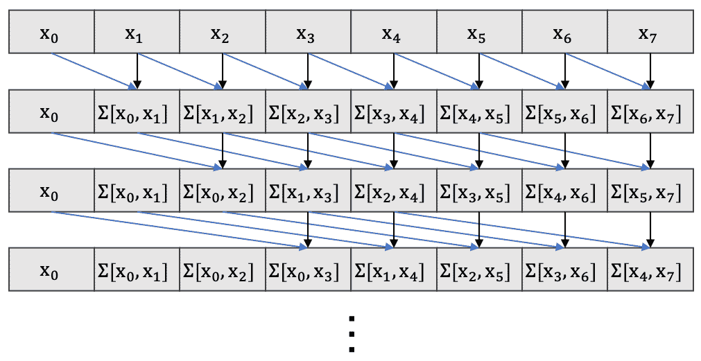

在这种方法中，我们可以使用多个 CUDA 核心来获得输出。但是，这种方法并不会减少迭代的总次数，因为第一个输入元素应该逐个添加到所有输出中。此外，当数组足够大时，我们无法预测输出结果，因此应该启动多个线程块。这是因为在 CUDA 架构中，并非所有计划的 CUDA 线程都同时启动，并且多个 CUDA 线程会发生冲突。为了避免这种情况，我们需要对数组采用双缓冲区方法，这是另一种低效的方法。以下代码显示了它的实现：

```cpp
__global__ void
scan_v1_kernel(float *d_output, float *d_input, int length, int offset) {
    int idx = blockDim.x * blockIdx.x + threadIdx.x;

    float element = 0.f;
    for (int offset = 0; offset < length; offset++) {
        if (idx - offset >= 0)
            element += d_input[idx - offset];
    }
    d_output[idx] = element;
}
```

还有另一种优化方法叫做**Blelloch 扫描**。该方法通过指数增加和减少步长来生成前缀和输出。该方法的过程如下图所示：

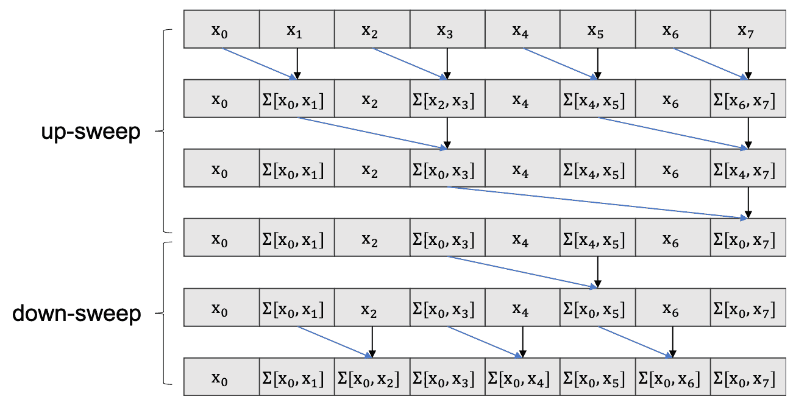

基于步长控制有两个步骤。在增加步长的同时，相应地获得部分总和。然后，在减小步长的同时获得部分总和。每个步骤都有不同的操作模式，但可以根据步长大小来确定。现在，让我们来看一下 Blelloch 扫描的实现并检查更新后的性能。

# Blelloch 扫描实现

以下步骤将向您展示如何实现优化的并行扫描算法：

1.  让我们创建一个可以接受输入和输出内存以及它们的大小的内核函数：

```cpp
__global__ void scan_v2_kernel(float *d_output, float *d_input, int length)
{
    ...
}
```

1.  然后，我们将创建一个 CUDA 线程索引和一个全局索引来处理输入数据：

```cpp
int idx = blockDim.x * blockIdx.x + threadIdx.x;
int tid = threadIdx.x;
```

1.  为了加快迭代速度，我们将使用共享内存。该算法可以生成 CUDA 线程大小的两倍输出，因此我们将额外加载块大小的输入数据到共享内存中：

```cpp
extern __shared__ float s_buffer[];
s_buffer[threadIdx.x] = d_input[idx];
s_buffer[threadIdx.x + BLOCK_DIM] = d_input[idx + BLOCK_DIM];
```

1.  在开始迭代之前，我们将声明偏移变量，该变量计算左操作数和右操作数之间的差距：

```cpp
int offset = 1;
```

1.  然后，我们将添加输入数据，直到偏移量大于输入的长度为止：

```cpp
while (offset < length)
{
    __syncthreads();
    int idx_a = offset * (2 * tid + 1) - 1;
    int idx_b = offset * (2 * tid + 2) - 1;
    if (idx_a >= 0 && idx_b < 2 * BLOCK_DIM) {
        s_buffer[idx_b] += s_buffer[idx_a];
    }
    offset <<= 1;
}
```

1.  之后，我们将通过减小减少大小来再次迭代两次：

```cpp
offset >>= 1;
while (offset > 0) {
    __syncthreads();
    int idx_a = offset * (2 * tid + 2) - 1;
    int idx_b = offset * (2 * tid + 3) - 1;
    if (idx_a >= 0 && idx_b < 2 * BLOCK_DIM) {
        s_buffer[idx_b] += s_buffer[idx_a];
    }
    offset >>= 1;
}
__syncthreads();
```

1.  最后，我们将使用内核函数将输出值存储在全局内存中：

```cpp
d_output[idx] = s_buffer[tid];
d_output[idx + BLOCK_DIM] = s_buffer[tid + BLOCK_DIM];
```

1.  现在，我们可以调用这个扫描内核函数如下：

```cpp
void scan_v2(float *d_output, float *d_input, int length)
{
    dim3 dimBlock(BLOCK_DIM);
    dim3 dimGrid(1);
    scan_v2_kernel<<<dimGrid, dimBlock, 
                     sizeof(float) * BLOCK_DIM * 2>>>
                  (d_output, d_input, length);
    cudaDeviceSynchronize();
}
```

您还可以使用相同的函数接口编写一个朴素扫描版本。现在，让我们回顾一下我们的新版本有多快，以及我们是否可以利用其他优化机会。

1.  以下代码显示了朴素扫描和 Blelloch 扫描性能的分析结果：

```cpp
$ nvcc -m64 -std=c++11 -I/usr/local/cuda/samples/common/inc -gencode arch=compute_70,code=sm_70 -L/usr/local/cuda/lib -o scan ./scan.cu ./scan_v1.cu ./scan_v2.cu
$ nvprof ./scan
            Type Time(%)     Time Calls      Avg      Min      Max Name
 GPU activities:  68.96% 22.751us     1 22.751us 22.751us 22.751us scan_v1_kernel(float*, float*, int)
 12.71% 4.1920us    1 4.1920us 4.1920us 4.1920us scan_v2_kernel(float*, float*, int)
```

正如你所看到的，由于减少了开销，Blolloch 扫描比朴素扫描算法快了大约五倍。我们还可以通过比较不同实现的输出来验证操作结果：

```cpp
input         :: -0.4508 -0.0210 -0.4774  0.2750 ... 0.0398 0.4869
result[cpu]   :: -0.4508 -0.4718 -0.9492 -0.6742 ... 0.3091 0.7960
result[gpu_v1]:: -0.4508 -0.4718 -0.9492 -0.6742 ... 0.3091 0.7960
SUCCESS!!
result[cpu]   :: -0.4508 -0.4718 -0.9492 -0.6742 ... 0.3091 0.7960
result[gpu_v2]:: -0.4508 -0.4718 -0.9492 -0.6742 ... 0.3091 0.7960
SUCCESS!!
```

到目前为止，我们已经介绍了如何设计和实现优化的单个块大小的并行前缀和操作。要在输入数据上使用前缀和操作，需要比块大小更多的数据，我们需要基于我们的块级减少代码构建一个块级前缀和操作。我们将在下一节详细讨论这个问题。

# 构建全局大小扫描

我们实现的前缀和操作在单个线程块内工作。由于第一步有两个输入，而我们在一个线程块中最多可以有 1,024 个 CUDA 线程，因此最大可用大小为 2,048。在不考虑其他线程块操作的情况下，线程块进行上扫描和下扫描。

然而，如果我们执行一个分块扫描操作，这个操作可以被扩大。为了做到这一点，你需要额外的步骤来收集最后一个前缀和的结果，扫描它们，并将每个线程块的结果与每个块的块级扫描值相加。这个过程可以按照以下方式实现：

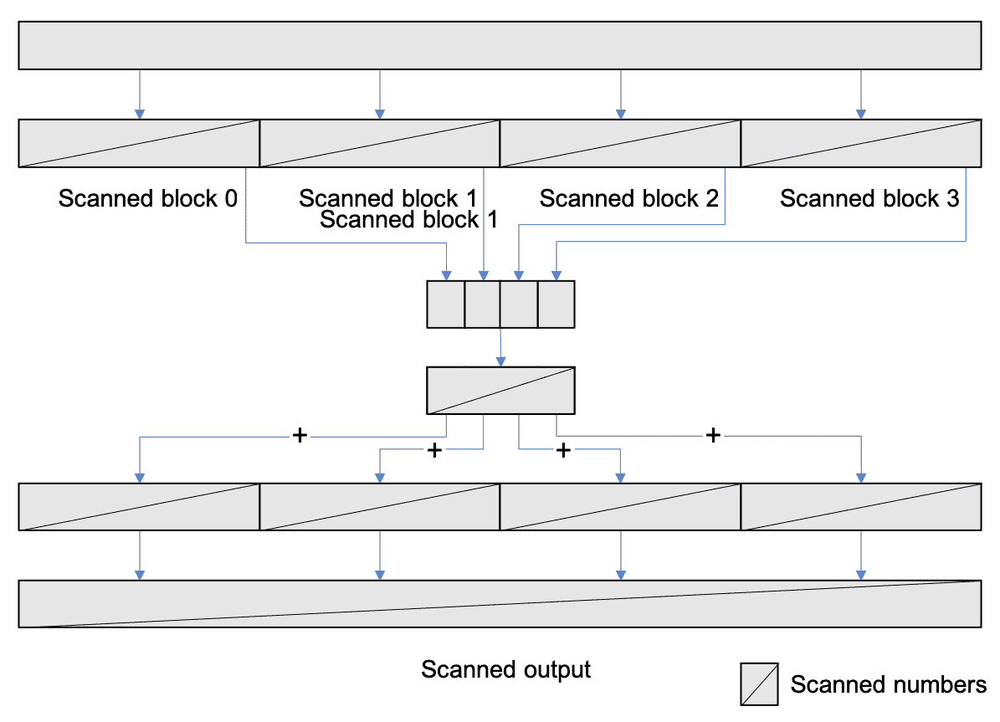

# 追求更好的性能

我们的实现代码执行了最佳操作。然而，我们可以通过减少共享内存的银行冲突来进一步优化。在我们的实现中，CUDA 线程在某些点上访问相同的内存银行。NVIDIA 的 GPU Gem3 在*第三十九章，使用 CUDA 进行并行前缀和（扫描）*（[`developer.nvidia.com/gpugems/GPUGems3/gpugems3_ch39.html`](https://developer.nvidia.com/gpugems/GPUGems3/gpugems3_ch39.html)）中介绍了前缀和（扫描），并在*39.2.3 避免银行冲突*中指出了这个问题。你可以将解决方案调整到我们的实现，但如果这样做，你应该将`NUM_BANKS`更新为`32`，`LOG_NUM_BANKS`更新为`5`。现在，CUDA 架构有 32 个共享内存银行。

# 并行前缀和操作的其他应用

G.E. Blelloch 博士在 1993 年发表了一篇关于他的前缀和算法的文章*前缀和及其应用*（[`www.cs.cmu.edu/~guyb/papers/Ble93.pdf`](https://www.cs.cmu.edu/~guyb/papers/Ble93.pdf)）。通过阅读他的文章，你可以了解更多关于并行前缀和算法及其应用。这些应用包括压缩、分割、分段扫描、快速排序、基数排序和归并排序。

Ahmed Sallm 博士的视频讲座，*使用 CUDA 进行并行处理简介-第 4 讲第 2\3 部分*（[`youtu.be/y2HzWKTqo3E`](https://youtu.be/y2HzWKTqo3E)），对此提供了很好的介绍。它提供了关于前缀和算法如何用于裁剪图形和构建稀疏矩阵的概念介绍。他还提供了关于如何使用排序算法的说明。

# 压缩和分割

之前，我们介绍了如何并行化顺序前缀和算法，并讨论了它如何用于其他应用。现在，让我们来介绍其中一些应用：压缩和分割。压缩操作是一种可以从数组中整合满足给定条件的值的算法。另一方面，分割操作是一种将值分配到指定位置的算法。一般来说，这些算法是顺序工作的。然而，我们将看到并行前缀和操作如何改进它的功能。

压缩操作用于将满足特定条件的特定数据收集到一个数组中。例如，如果我们想要对数组中的正元素使用压缩操作，那么操作如下：

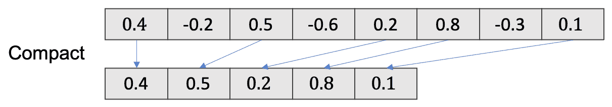

在并行编程中，我们有一种不同的方法，可以利用并行前缀和操作使用多个核心。首先，我们标记数据以检查它是否满足条件（即谓词），然后进行前缀和操作。前缀和的输出将是标记值的索引，因此我们可以通过复制它们来获得收集的数组。下面的图表显示了压缩操作的一个示例：

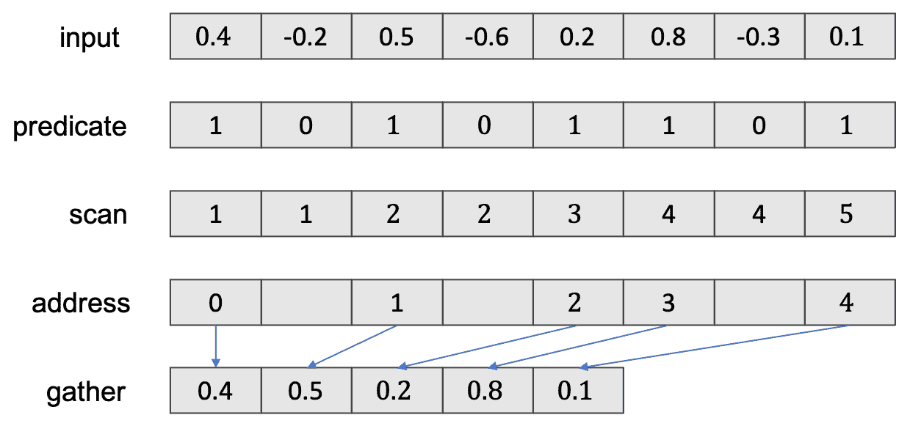

由于所有这些任务都可以并行完成，我们可以在四个步骤中获得收集的数组。

另一方面，拆分意味着将数据分发到多个不同的位置。一般来说，我们会从最初的位置分发数据。下面的图表显示了它的操作示例：

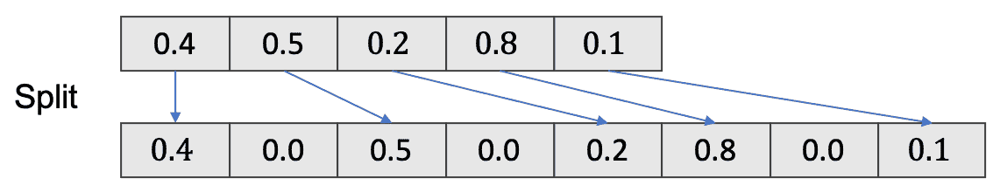

这个例子显示了收集的数组元素是如何分布在它们原来的位置的。我们也可以使用前缀和并行地做到这一点。首先，我们参考谓词数组并进行前缀和操作。由于输出是每个元素的地址，我们可以很容易地分配它们。下面的图表显示了如何进行这个操作：

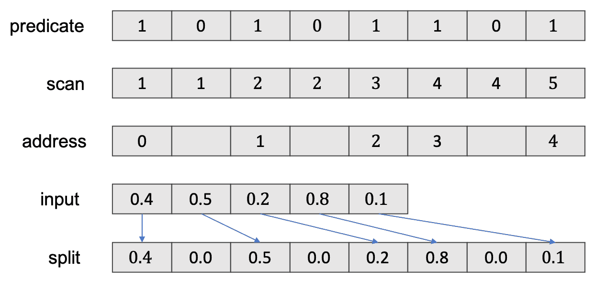`

现在，让我们实现这个并讨论它们的性能限制和应用。

# 实现压缩

压缩操作是一个谓词、扫描、寻址和收集的序列。在这个实现中，我们将从一个随机生成的数字数组中构建一个正数数组。初始版本只能承受单个线程块操作，因为我们只会使用一个块大小的前缀和操作。然而，我们可以了解前缀和如何对其他应用有用，并将这个操作扩展到更大的数组，使用扩展的前缀和操作。

为了实现压缩操作，我们将编写几个核函数，可以为每个步骤执行所需的操作，并调用最后那些：

1.  让我们编写一个核函数，通过检查每个元素的值是否大于零来生成一个谓词数组：

```cpp
__global__ void
predicate_kernel(float *d_predicates, float *d_input, int length)
{
    int idx = blockDim.x * blockIdx.x + threadIdx.x;

    if (idx >= length) return;

    d_predicates[idx] = d_input[idx] > FLT_ZERO;
}
```

1.  然后，我们必须对谓词数组执行前缀和操作。我们将在这里重用之前的实现。之后，我们可以编写一个可以检测扫描数组的地址并将目标元素收集为输出的核函数：

```cpp
__global__ void
pack_kernel(float *d_output, float *d_input, float *d_predicates, float *d_scanned, int length)
{
    int idx = blockDim.x * blockIdx.x + threadIdx.x;

    if (idx >= length) return;

    if (d_predicates[idx] != 0.f)
    {
        // addressing
        int address = d_scanned[idx] - 1;

        // gather
        d_output[address] = d_input[idx];
    }
}
```

1.  现在，让我们一起调用它们来进行压缩操作：

```cpp
// predicates
predicate_kernel<<< GRID_DIM, BLOCK_DIM >>>(d_predicates, d_input, length);
// scan
scan_v2(d_scanned, d_predicates, length);
// addressing & gather (pack)
pack_kernel<<< GRID_DIM, BLOCK_DIM >>>(d_output, d_input, d_predicates, d_scanned, length);
```

1.  现在，我们有了一个从随机生成的数组中收集到的正数数组：

```cpp
$ nvcc -run -m64 -std=c++11 -I/usr/local/cuda/samples/common/inc -gencode arch=compute_70,code=sm_70 -L/usr/local/cuda/lib -o pack_n_split ./pack_n_split.cu
input    :: -0.4508 -0.0210 -0.4774  0.2750 .... 0.0398  0.4869
pack[cpu]::  0.2750  0.3169  0.1248  0.4241 .... 0.3957  0.2958
pack[gpu]::  0.2750  0.3169  0.1248  0.4241 .... 0.3957  0.2958
SUCCESS!!
```

通过使用并行前缀和操作，我们可以很容易地并行实现压缩操作。我们的实现从给定数组中压缩正值，但我们可以将其切换到其他条件并且应用压缩操作而不会有困难。现在，让我们来讨论如何将这些压缩元素分发到原始数组。

# 实现拆分

拆分操作是一个谓词、扫描、地址和拆分的序列。在这个实现中，我们将重用在前一节中创建的地址数组。因此，我们可以跳过之前的步骤，只需从地址数组中实现拆分操作：

1.  让我们编写拆分核函数，如下所示：

```cpp
__global__ void
split_kernel(float *d_output, float *d_input, float *d_predicates, float *d_scanned, int length)
{
    int idx = blockDim.x * blockIdx.x + threadIdx.x;

    if (idx >= length) return;

    if (d_predicates[idx] != 0.f)
    {
        // address
        int address = d_scanned[idx] - 1;

        // split
        d_output[idx] = d_input[address];
    }
}
```

1.  现在，我们可以调用核函数，如下所示：

```cpp
cudaMemcpy(d_input, d_output, sizeof(float) * length, cudaMemcpyDeviceToDevice);
    cudaMemset(d_output, 0, sizeof(float) * length);
    split_kernel<<<GRID_DIM, BLOCK_DIM>>>(d_output, d_input, d_predicates, d_scanned, length);
```

1.  由于我们将使用前一步骤的扫描输出，我们将把它复制到输入并清除原始数组。总的来说，我们可以使用 CUDA 进行并行压缩和拆分。这是我们实现的输出。您可以确认它按预期运行：

```cpp
$ nvcc -run -m64 -std=c++11 -I/usr/local/cuda/samples/common/inc -gencode arch=compute_70,code=sm_70 -L/usr/local/cuda/lib -o pack_n_split ./pack_n_split.cu
input    :: -0.4508 -0.0210 -0.4774  0.2750 .... 0.0398  0.4869
pack[cpu]::  0.2750  0.3169  0.1248  0.4241 .... 0.3957  0.2958
pack[gpu]::  0.2750  0.3169  0.1248  0.4241 .... 0.3957  0.2958
SUCCESS!!
split[gpu]   0.0000  0.0000  0.0000  0.2750 .... 0.0398  0.4869
SUCCESS!!
```

在我们的实现中，我们为正值生成了一个压缩数组和一个拆分数组。由于并行前缀和，我们也可以并行地做到这一点。我们版本的一个主要限制是，它只支持少于 2,048 个元素，因为我们的实现是基于之前的并行前缀和实现的。

# N-body

任何 N 体模拟都是一个在物理力的影响下演化的动力学系统的模拟。随着物体不断相互作用，进行数值近似。N 体模拟在物理学和天文学中被广泛使用，例如，科学家可以了解宇宙中粒子的动态。N 体模拟也在许多其他领域中使用，包括计算流体动力学，以便理解湍流流体流动模拟。

解决 N 体模拟的一个相对简单的方法是利用*O(N²)*复杂度的蛮力技术。这种方法在本质上是尴尬地并行的。在算法规模上有各种优化可以减少计算复杂度。可以用来确定近距离相互作用中的力，而不是将所有对应用于整个模拟。即使在这种情况下，为 CUDA 解决力量创建一个内核也是非常有用的，因为它还将提高远场组件的性能。加速一个组件将卸载其他组件的工作，因此整个应用程序都会从加速一个内核中受益。

# 在 GPU 上实现 N 体模拟

该算法基本上是一个计算力*f[ij]*的所有对算法，对于一个 NN 网格。一个物体*i*上的总力/加速度*F[i]*是该行中所有条目的总和。从并行性的角度来看，这是一个尴尬地并行的任务，复杂度为*O(N²)*。

从性能角度来看，该应用程序受到内存限制，并且会受到内存带宽的限制。好的一点是，许多数据可以被重复使用并存储在高带宽和低延迟的内存中，比如共享内存。在共享内存中重复使用和存储数据可以减少对全局内存的负载，从而有助于达到峰值计算性能。

以下图表显示了我们将使用的策略：

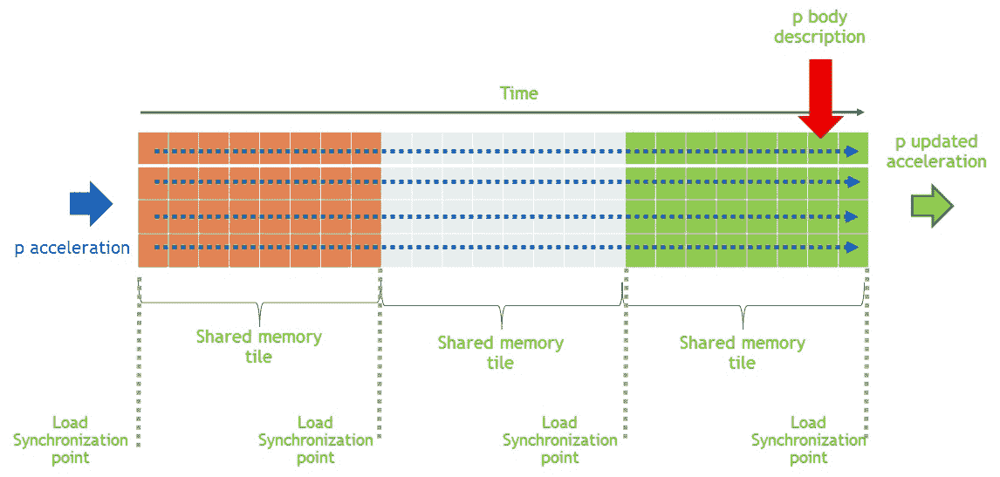

我们不再从全局内存中反复加载内存，而是利用平铺。我们已经在之前的章节中演示了在矩阵乘法中使用平铺，并在图像应用中使用了它。前面的图表显示了每一行都是并行评估的。平铺大小由可以存储在共享内存中而不影响内核占用率的最大元素数量定义。每个块将数据加载到共享内存中，然后执行同步。一旦数据加载到共享内存中，就在每个块中进行力/加速度计算。可以看到，即使单独的行是并行计算的，为了实现最佳的数据重用，每行中的相互作用是顺序进行的。

# N 体模拟实现概述

让我们以伪代码格式回顾一下这个实现，然后解释它的逻辑。在这个例子中，我们使用引力势来说明所有对 N 体模拟中的基本计算形式。实现的代码可以在`07_parallel_programming_pattern/05_n-body`中找到。按照以下步骤开始：

1.  用随机变量初始化 n 空间：

```cpp
data[i] = 2.0f * (rand() / max) - 1.0f
```

1.  在一个中间共享内存空间中声明和存储数据，以便有效地重复使用。同步以确保块内的所有线程都能看到共享内存中的更新值：

```cpp
for (int tile = 0; tile < gridDim.x; tile++) {
... 
__shared__ float3 shared_position[blockDim.x];
float4 temp_position = p[tile * blockDim.x + threadIdx.x];
shared_position[threadIdx.x] = make_float3(temp_position.x, temp_position.y, temp_position.z);
__syncthreads();
...
}
```

1.  通过迭代每个块来计算力：

```cpp
for (int j = 0; j < BLOCK_SIZE; j++) {
    //Calculate Force
    __syncthreads();
}
```

1.  最后，使用以下命令将应用程序编译为`nvcc`编译器：

```cpp
$nvcc -run --gpu-architecture=sm_70 -o n-body n_body.cu 
```

正如你所看到的，实现 N 体模拟是一个尴尬地并行的任务，而且非常简单。虽然我们在这里实现了基本版本的代码，但存在各种算法变体。你可以利用这个版本作为一个模板，根据对算法的更改进行改进。

# 直方图计算

在一个尴尬的并行作业中，理想情况下，您会将计算分配给每个线程，这些线程在独立数据上工作，从而不会发生数据竞争。到目前为止，您可能已经意识到有些模式不适合这个类别。其中一种模式是当我们计算直方图时。直方图模式显示了数据项的频率，例如，我们在每个章节中使用 CUDA 这个词的次数

章节，本章中每个字母出现的次数等。直方图采用以下形式：

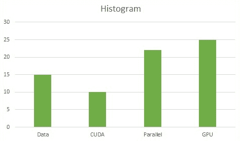

在这一部分，我们将利用原子操作来串行访问数据，以便获得正确的结果。

# 编译和执行步骤

直方图提供了关于手头数据集的重要特征，以及有用的见解。例如，在整个图像中，只有少数区域可能存在感兴趣的区域。有时创建直方图用于找出图像中可能存在感兴趣区域的位置。在这个例子中，我们将使用在整个图像中将图像分成块来计算直方图。让我们开始吧：

1.  准备您的 GPU 应用程序。此代码可以在`07_parallel_programming_pattern/08_histogram`中找到。

1.  使用以下命令将您的应用程序编译为`nvcc`编译器：

```cpp
$ nvcc -c scrImagePgmPpmPackage.cpp 
$ nvcc -c image_histogram.cu
$ nvcc -run -o image_histogram image_histogram.o scrImagePgmPpmPackage.o
```

`scrImagePgmPpmPackage.cpp`文件提供了我们可以用来读取和写入`.pgm`扩展名图像的源代码。直方图计算代码可以在`image_histogram.cu`中找到。

# 理解并行直方图

诸如直方图之类的模式需要原子操作，这意味着以串行方式更新特定地址的值，以消除多个线程之间的争用，从而更新相同的地址。这需要多个线程之间的协调。在这个七步过程中，您可能已经注意到我们使用了私有化。私有化是一种利用低延迟内存（如共享内存）来减少吞吐量和降低延迟的技术，如下图所示：

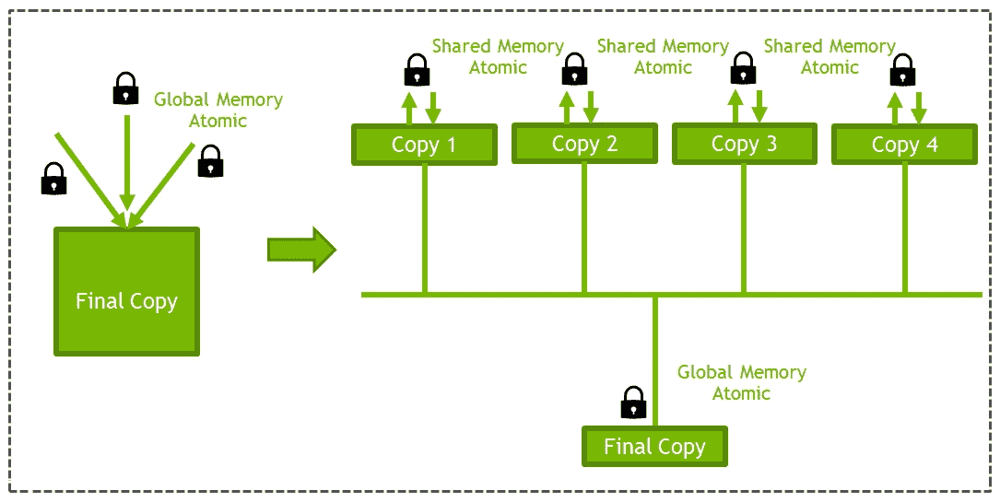

基本上，我们不是在全局内存上使用原子操作，而是在共享内存上使用原子操作。原因现在应该对您来说是相当明显的。与在共享内存/ L1 缓存上执行相同操作相比，在全局内存上执行原子操作的成本更高。从 Maxwell 架构开始，原子操作得到了硬件支持。私有化的共享内存实现应该从 Maxwell 架构开始为您提供 2 倍的性能。但是，请注意，原子操作仅限于特定的函数和数据大小。

# 使用 CUDA 原子函数计算直方图

主要地，我们将利用共享内存上的`atomicAdd()`操作来计算共享内存中每个块的直方图。按照以下步骤在内核中计算直方图：

1.  为每个块分配与每个块的直方图大小相等的共享内存。由于这是一个 char 图像，我们期望元素在 0-255 的范围内：

```cpp
__shared__ unsigned int histo_private[256];
```

1.  将每个块的共享内存数组初始化为`0`：

```cpp
if(localId <256)
    histo_private[localId] = 0;
```

1.  同步这一点，以确保块内的所有线程看到初始化的数组：

```cpp
__syncthreads();
```

1.  从全局/纹理内存中读取图像的数据：

```cpp
unsigned char imageData = tex2D<unsigned char>(texObj,(float)(tidX),(float)(tidY));
```

1.  在共享内存上进行`atomicAdd()`操作：

```cpp
atomicAdd(&(histo_private[imageData]), 1);
```

1.  在写入全局内存之前，在块之间进行同步：

```cpp
__syncthreads();
```

1.  将每个块的直方图写入全局内存：

```cpp
if(localId <256)
    imageHistogram[histStartIndex+localId] = histo_private[localId];
```

现在，我们已经完成了在 GPU 上实现直方图计算。

总之，使用共享原子内存很容易实现直方图。由于硬件对共享原子内存的本机支持，这种方法可以在 Maxwell 架构之后的显卡上获得高性能。

# 使用动态并行性在 CUDA 中进行快速排序

作为任何应用程序的基本构建块的关键算法之一是排序。有许多可用的排序算法已经得到了广泛的研究。最坏时间复杂度、最佳时间复杂度、输入数据特征（数据几乎排序好还是随机的？是键值对吗？是整数还是浮点数？）、原地或非原地内存需求等等，这些都定义了哪种算法适用于哪种应用。一些排序算法属于分治算法的范畴。这些算法适合并行处理，并适用于 GPU 等可以将要排序的数据分割进行排序的架构。其中一个这样的算法是快速排序。正如我们之前所述，快速排序属于分治范畴。它是一个三步方法，如下：

1.  从需要排序的数组中选择一个元素。这个元素作为枢轴元素。

1.  第二步是分区，确定所有元素的位置。所有小于枢轴的元素都移到左边，所有大于或等于枢轴的元素都移到枢轴元素的右边。这一步也被称为分区。

1.  递归地执行步骤 1 和 2，直到所有子数组都被排序。

快速排序的最坏情况复杂度是 O(n²)，这与其他排序过程的最坏情况复杂度为 O(nlogn)相比可能不太理想（例如归并排序和堆排序）。然而，实际上快速排序被认为是有效的。枢轴元素的选择可以经过考虑，有时也可以随机选择，以使最坏情况复杂度几乎不会发生。此外，与其他排序算法相比，快速排序的内存负载和需求较少，例如归并排序需要额外的存储空间。更实际的快速排序实现使用随机化版本。随机化版本的期望时间复杂度为 O(nlogn)。最坏情况复杂度在随机化版本中也是可能的，但它不会发生在特定模式（例如排序好的数组）上，随机化快速排序在实践中表现良好。

虽然我们可以写一整章关于排序算法的特性，但我们计划只覆盖 CUDA 的特性，这将帮助您在 GPU 上高效实现快速排序。在本节中，我们将使用从 CUDA 6.0 和 GPU 架构 3.5 开始引入的动态并行性。

现在，让我们回顾一下动态并行性是如何对排序算法做出贡献的。

# 快速排序和 CUDA 动态并行性

快速排序算法要求递归地启动内核。到目前为止，我们所见过的算法是通过 CPU 一次调用内核。内核执行完毕后，我们返回到 CPU 线程，然后重新启动它。这样做会导致将控制权交还给 CPU，并且可能导致 CPU 和 GPU 之间的数据传输，这是一项昂贵的操作。以前在 GPU 上高效实现需要递归等特性的算法（如快速排序）曾经非常困难。从 GPU 架构 3.5 和 CUDA 5.0 开始，引入了一个名为动态并行性的新特性。

动态并行性允许内核内的线程在不将控制权返回给 CPU 的情况下从 GPU 上启动新的内核。动态一词来自于它基于运行时数据的动态性。多个内核可以同时由线程启动。以下图表简化了这个解释：

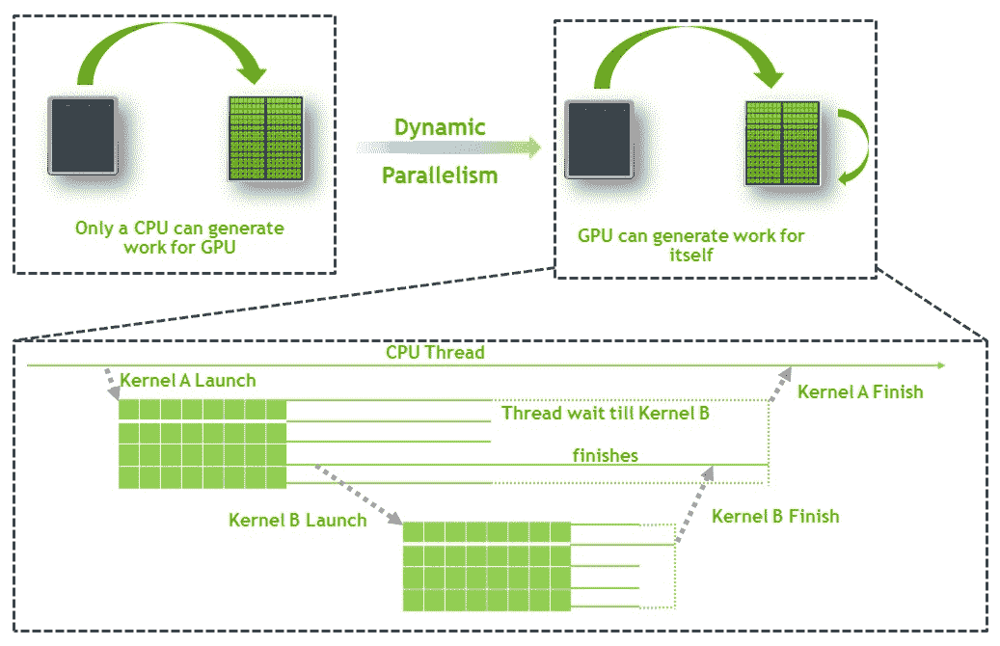

如果我们将这个概念转化为快速排序的执行方式，它会看起来像这样：

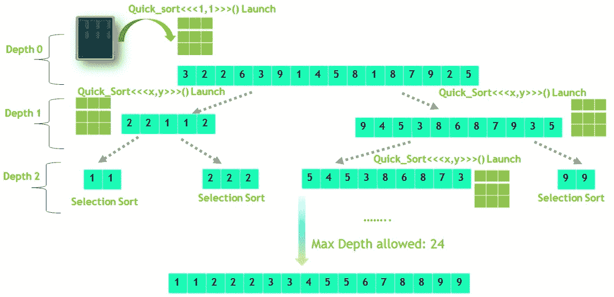

深度 0 是来自 CPU 的调用。对于每个子数组，我们启动两个内核：一个用于左数组，一个用于右数组。递归在达到内核的最大深度或元素数量小于 32（即 warp 大小）后停止。为了使内核的启动在非零流中是异步的，以便子数组内核可以独立启动，我们需要在每次内核启动之前创建一个流：

```cpp
cudaStream_t s;
cudaStreamCreateWithFlags( &s, cudaStreamNonBlocking );
cdp_simple_quicksort<<< 1, 1, 0, s >>>(data, left, nright, depth+1);
cudaStreamDestroy( s );
```

这是一个非常重要的步骤，否则内核的启动可能会被序列化。有关流的更多细节，请参考多 GPU 内核。

# CUDA 的 Quicksort

对于我们的 Quicksort 实现，我们将利用动态并行性来递归启动 GPU 内核。实现 Quicksort 的主要步骤如下：

1.  **CPU 启动第一个内核**：内核以一个块和一个线程启动。左元素是数组的开始，右元素是数组的最后一个元素（基本上是整个数组）：

```cpp
int main(int argc, char **argv)
{ ...
    cdp_simple_quicksort<<< 1, 1 >>>(data, left, right, 0);
}
```

1.  **限制检查**：在从内核内部启动内核之前检查两个条件。首先，检查我们是否已经达到硬件允许的最大深度限制。其次，我们需要检查子数组中要排序的元素数量是否小于 warp 大小（32）。如果其中一个条件为真，那么我们必须按顺序执行选择排序，而不是启动一个新的内核：

```cpp
__global__ void cdp_simple_quicksort( unsigned int *data, int left, int right, int depth )
{ ...

if( depth >= MAX_DEPTH || right-left <= INSERTION_SORT )
 {
     selection_sort( data, left, right );
     return;
 }
```

1.  **分区**：如果满足前面的条件，那么将数组分成两个子数组，并启动两个新的内核，一个用于左数组，另一个用于右数组。如果你仔细看下面的代码，你会发现我们是从内核内部启动内核的：

```cpp
__global__ void cdp_simple_quicksort( unsigned int *data, int left, int right, int depth ) {
...
while(lptr <= rptr)
 {
     // Move the left pointer as long as the 
     // pointed element is smaller than the pivot.
     // Move the right pointer as long as the 
     // pointed element is larger than the pivot.
     // If the swap points are valid, do the swap!

     // Launch a new block to sort the left part.
     if(left < (rptr-data))
     { // Create a new stream for the eft sub array
        cdp_simple_quicksort<<< 1, 1, 0, s 
                            >>>(data, left, nright, depth+1);
     }
    // Launch a new block to sort the right part.
    if((lptr-data) < right)
     {//Create stream for the right sub array
         cdp_simple_quicksort<<< 1, 1, 0, s1 
                             >>>(data, nleft, right, depth+1);
     }
 }
```

1.  **执行代码**：实现的代码可以在`07_parallel_programming_pattern/06_quicksort`中找到。使用以下命令使用`nvcc`编译您的应用程序：

```cpp
$nvcc -o quick_sort --gpu-architecture=sm_70 -rdc=true quick_sort.cu 
```

如你所见，我们在编译中添加了两个标志：

+   `-- gpu-architecture=sm_70`：这个标志告诉`nvcc`为 Volta GPU 编译和生成二进制/`ptx`。如果你没有特别添加这个标志，编译器会尝试从`sm_20`（即 Fermi 代）兼容的代码编译，直到新架构`sm_70`（即 Volta）。由于旧一代的卡不支持动态并行性，编译将失败。

+   `-rdc=true`：这是一个关键参数，它在 GPU 上启用动态并行性。

# 动态并行性指南和约束

虽然动态并行性为我们提供了在 GPU 上移植 Quicksort 等算法的机会，但需要遵循一些基本规则和指南。

**编程模型规则**：基本上，所有 CUDA 编程模型规则都适用：

+   内核启动是每个线程异步的。

+   同步只允许在块内进行。

+   创建的流在一个块内共享。

+   事件可用于创建流间依赖关系。

**内存一致性规则**：

+   子内核在启动时看到父内核的状态。

+   父内核只能在同步后看到子内核所做的更改。

+   本地和共享内存通常是私有的，父内核无法传递或访问。

**指南**：

+   重要的是要理解，每次内核启动都会增加延迟。从另一个内核内部启动内核的延迟随着新架构的推出逐渐减少。

+   虽然启动吞吐量比主机高一个数量级，但最大深度可以设置限制。最新一代卡允许的最大深度是 24。

+   从内核内部执行`cudaDeviceSynchronize()`是一个非常昂贵的操作，应尽量避免。

+   在全局内存上预先分配了额外的内存，以便在启动之前存储内核。

+   如果内核失败，错误只能从主机上看到。因此，建议您使用`-lineinfo`标志以及`cuda-memcheck`来定位错误的位置。

# 基数排序

另一个非常流行的排序算法是基数排序，因为它在顺序机器上非常快。基数排序的基本策略是每个元素都按位排序。让我们看一个简单的例子来解释基数排序涉及的步骤：

假设要排序的元素如下：

| 值 | 7 | 14 | 4 | 1 |
| --- | --- | --- | --- | --- |

这些数字的等效二进制值如下：

| 位 | 0111 | 1110 | 0100 | 0001 |
| --- | --- | --- | --- | --- |

第一步是根据第 0 位进行排序。这些数字的第 0 位如下：

| 0 位 | 1 | 0 | 0 | 1 |
| --- | --- | --- | --- | --- |

根据第 o 位排序基本上意味着所有的零都在左边。所有的 1 都在右边，同时保持元素的顺序：

| 第 0 位上的排序值 | 14 | 4 | 7 | 1 |
| --- | --- | --- | --- | --- |
| 根据第 0 位排序的位 | 1110 | 0100 | 0111 | 0001 |

第 0 位完成后，我们继续到第一位。根据第一位排序后的结果如下：

| 第一位上的排序值 | 4 | 14 | 7 | 1 |
| --- | --- | --- | --- | --- |
| 根据第一位排序的位 | 0100 | 1110 | 0111 | 0001 |

然后，我们继续到下一个更高的位，直到所有的位都结束。最终结果如下：

| 所有位上的排序值 | 1 | 4 | 7 | 1 |
| --- | --- | --- | --- | --- |
| 根据所有位排序的位 | 0001 | 0100 | 0111 | 1110 |

正如您所看到的，在这个例子中我们设置的上限是 4 位。对于更大的数字，比如整数，这将持续到 32 位，因为整数是 32 位的。

现在我们已经了解了这个算法，让我们看看如何在 GPU 中实现它。与本章中的其他部分相比，我们将采取两种方法来展示 CUDA 生态系统，以便我们可以实现/使用基数排序。

**选项 1**：我们将使用翘曲级别来对 32 个元素进行基数排序。这样做的原因是我们希望利用基数排序来向您介绍翘曲级别原语。

**选项 2**：我们将使用 CUDA 工具包的一部分 Thrust 库。它实现了通用基数排序。最好的实现是重用。由于 Thrust 已经提供了最好的基数排序实现之一，我们将使用它。

# 两种方法

为了方便您的理解，让我们从示例代码开始。在这个例子中，我们将使用翘曲级别原语和 Thrust 库来实现/使用基数排序。示例代码可以在`07_parallel_programming_pattern/07_radixsort`中找到。

使用以下命令使用`nvcc`编译器编译您的应用程序：

+   翘曲级别原语版本：

```cpp
$ nvcc -run -o radix_warp_sort radix_warp_sort.cu
```

+   Thrust 库版本：

```cpp
$ nvcc -run -o radix_thrust_sort thrust_radix_sort.cu 
```

这两个例子展示了 GPU 给出的排序输出。现在，让我们详细了解这些操作是如何实现的。

# 方法 1 - 翘曲级别原语

让我们看看 CUDA 翘曲级别原语是如何在代码中实现我们的算法的：

1.  首先，将数据从全局内存加载到共享内存中：

```cpp
__shared__ unsigned int s_data[WARP_SIZE*2];
```

内存的大小等于翘曲大小，*2，以便它可以实现乒乓缓冲区。

1.  从低位到高位循环：

```cpp
for (int i = MIN_BIT_POS; i <= MAX_BIT_POS; i++){ ... }
```

1.  获取当前的掩码：

```cpp
unsigned int bit  = data&bit_mask;
```

1.  获取 1 和 0 的数量（直方图）：

```cpp
unsigned int active = __activemask();
unsigned int ones = __ballot_sync(active,bit);
unsigned int zeroes = ~ones;
```

1.  获取当前位数为零（0）的线程的位置（前缀和）。

1.  获取当前位数为一（1）的线程的位置（前缀和）：

```cpp
if (!bit) // threads with a zero bit
 // get my position in ping-pong buffer
 pos = __popc(zeroes&thread_mask);
 else // threads with a one bit
 // get my position in ping-pong buffer
 pos = __popc(zeroes)+__popc(ones&thread_mask);
```

1.  将数据存储在乒乓共享缓冲区内存中：

```cpp
 s_data[pos-1+offset] = data;
```

1.  重复步骤 2-6，直到达到上限位。

1.  从共享内存中将最终结果存储到全局内存中：

```cpp
d_data[threadIdx.x] = s_data[threadIdx.x+offset];
```

也许对于您来说，直方图和前缀和突然出现可能不太清楚。让我们详细讨论这个实现，以便我们可以理解如何使用翘曲级别原语来实现相同的功能。

在本节的开头，我们描述了如何使用示例进行排序。然而，我们没有涵盖的是如何找出需要交换的元素的位置。基数排序可以使用基本原语（如直方图和前缀和）来实现，因此可以很容易地在 GPU 上实现。

让我们重新审视我们看过的示例，并收集其细节，包括直方图和前缀和的步骤。以下表格显示了在每个位上迭代进行的各种计算：

| 值 | 7 | 14 | 4 | 1 |
| --- | --- | --- | --- | --- |
| 二进制 | 0111 | 1110 | 0100 | 0001 |
| 位 0 | 1 | 0 | 0 | 1 |
| 直方图前缀和 | 2 | 0 | 2 | 2 |
| 偏移 | 0 | 0 | 1 | 1 |
| 新索引（前缀和和偏移） | 2 | 0 | 1 | 3 |

让我们解释前面表格中显示的每一项计算，如下所示：

1.  首先，我们为第 0 位位置的元素构建直方图，包括具有 0 和 1 的元素的数量：

*直方图：零位（2 个值），一位（2 个值）*

1.  然后，我们对这些值进行排他性前缀和。前缀和可以定义为所有先前值的总和。在我们的情况下，我们分别对 0 位和 1 位进行这样的操作。

1.  最后，我们根据前缀和的值移动元素。

我们用来找到直方图和前缀和的 warp 级原语分别是`__ballot_sync()`和`__popc()`。

`__ballot_sync()` API 评估 warp 的所有活动线程的谓词，并返回一个整数，其第 N 位设置为 1，当且仅当谓词对于 warp 的第 N 个线程求值为非零时。`__popc()`用于计算整数的数量，被设置为 1。

在 CUDA 编程模型中，我们已经看到最小的执行单元是一个 warp（32 个线程）。CUDA 提供了各种 warp 级原语，可以进行细粒度控制，在许多应用中可以实现更好的性能。我们在上一节介绍了一个这样的原语`__ballot_sync()`。其他重要的 warp 级原语包括`shuffle`指令，用于特定的 warp 级归约。`shuffle`指令已经在本书中介绍过。如果您已经达到了 CUDA 的忍者程序员水平，那么我们建议您查看 CUDA API 指南，以了解更多这些 warp 级原语。

这完成了使用 warp 级原语描述基数排序。现在，让我们看看基于 Thrust 库的实现。

# 方法 2 - 基于 Thrust 的基数排序

基于 Thrust 的基数排序是基数排序的通用实现，对于不同类型的数据（如整数、浮点数或键值对）都能很好地工作。我们想再次强调排序是一个经过深入研究的算法，因此有其并行实现。因此，我们建议在自己实现之前重用现有的库。

使用 Thrust 进行基数排序的步骤如下：

1.  导入相关的头文件（Thrust 是一个仅包含头文件的库，类似于 STL）：

```cpp
#include <thrust/device_vector.h>
#include <thrust/sort.h>
```

1.  声明并初始化设备向量：

```cpp
//declare a device vector of size N
thrust::device_vector<int> keys(N);
//Generate a random number generator engine
thrust::default_random_engine r(12);
//create a distribution engine which will create integer values
thrust::uniform_int_distribution<int> d(10, 99);
//Fill the array with randon values
for(size_t i = 0; i < v.size(); i++)
    v[i] = d(r);
```

1.  对初始化的设备向量进行排序：

```cpp
thrust::sort(keys.begin(), keys.end());
```

使用这个库提供了一种更简单和更健壮的方法。Thrust 提供了不同类型的排序方法，包括整数和浮点数的基数排序。或者，您可以创建一个自定义比较器来进行自定义排序，例如按照偶数后面是奇数的顺序排序，按降序排序等等。如果您想了解更多关于基于 Thrust 的排序示例，建议您查看 CUDA 提供的示例示例。

现在，我们已经看过了在 GPU 上实现基数排序的两种方法。

# 总结

在本章中，我们看了 CUDA 中常用算法和模式的实现。这些算法和模式是常见的。我们涵盖了矩阵乘法和卷积滤波中的基本优化技术。然后，我们扩展了讨论，介绍了如何通过使用前缀和、N 体、直方图和排序来并行化问题。为此，我们使用了专门的 GPU 知识、库和较低级别的原语。

我们所涵盖的许多算法都是在 CUDA 库中实现的。例如，矩阵乘法在 cuBLAS 库中，而卷积在 CUDNN 库中。此外，我们还涵盖了基数排序实现中的两种方法：使用 Thrust 库或 warp 级原语进行直方图计算。

现在您已经看到了这些模式如何在常用库中实现，下一个合乎逻辑的步骤是看看我们如何可以使用这些库。这就是我们将在下一章中要做的事情。
