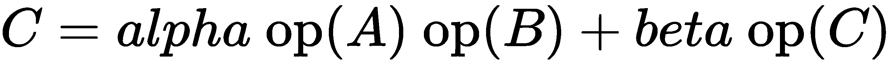
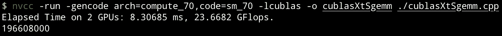
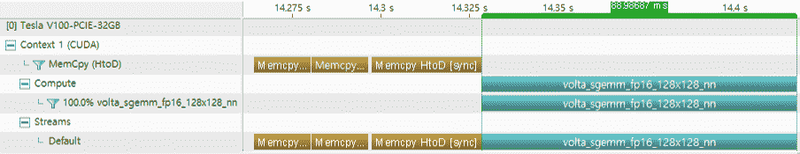
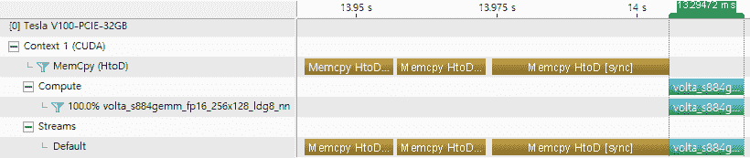
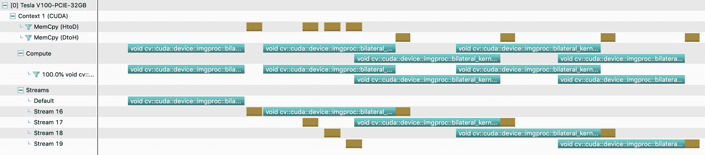

# 使用库和其他语言进行编程

本章还涵盖了其他 GPU 编程方法——使用 GPU 加速库和其他语言进行编程。使用 GPU 加速库进行编程使我们能够开发具有优化内核的应用程序。此外，我们可以使用其他编程语言开发了解 CUDA 加速的 CUDA 软件。这两种方式都提高了可编程性和生产力。此外，我们不必花时间优化已经优化的常见操作。

CUDA 工具包提供了许多线性代数、图像和信号处理以及随机处理的 GPU 加速库。它们包括 cuBLAS（基本线性代数子程序）、cuFFT（快速傅里叶变换）、cuRAND（随机数生成）、NPP（图像和信号处理）、cuSPARSE（稀疏线性代数）、nvGRAPH（图分析）、cuSolver（GPU 中的 LAPACK）、Thrust（CUDA 中的 STL）等。我们还可以使用 OpenCV 库编写 GPU 加速程序。本章将涵盖其中一些库。

我们还可以在 R、MATLAB、Octave 和 Python 中使用 GPU 加速。如今，Python 集成很受欢迎且功能强大，因为 GPU 可以加速许多机器学习和数据科学任务。我们也将这些语言作为入门级内容进行介绍。

本章将涵盖以下主题：

+   使用 cuBLAS 进行线性代数运算

+   使用 cuBLAS 进行混合精度运算

+   用于并行随机数生成的 cuRAND

+   用于 GPU 的快速傅里叶变换的 cuFFT

+   使用 GPU 进行图像和信号处理的 NPP

+   在 OpenCV 中编写 GPU 加速代码

+   编写与 CUDA 配合使用的 Python 代码

+   Octave 和 R 中的零编码加速 NVBLAS

+   MATLAB 中的 CUDA 加速

# 使用 cuBLAS 进行线性代数运算

cuBLAS 库是 GPU 优化的**基本线性代数子程序**（**BLAS**）的标准实现。使用其 API，程序员可以将计算密集型代码优化为单个 GPU 或多个 GPU。cuBLAS 有三个级别。级别 1 执行矢量-矢量运算，级别 2 执行矩阵-矢量运算，级别 3 执行矩阵-矩阵运算。

涵盖每个级别超出了本书的范围。我们只关注如何使用 cuBLAS API 并将其性能扩展到多个 GPU。具体来说，本文将涵盖**单精度浮点矩阵乘法**（**SGEMM**）运算——一个三级运算。

cuBLAS 库是 CUDA 工具包的一部分，因此您可以在不进行额外安装的情况下使用 cuBLAS。此外，您可以使用`cc`或`cpp`文件扩展名，而不是`.cu`，因为您不需要使用 CUDA 特定的内置关键字，如`__global__`或`threadIdx`。以下代码片段显示了 cuBLAS 函数（`cubalsSgemm`）的基本应用：

```cpp
cublasHandle_t handle;
cublasCreate(&handle);

.. { data operation } ..

cublasSgemm(...);

.. { data operation } ..

cublasDestroy(handle);
```

正如你所看到的，cuBLAS API 使用`cublasHandle_t`类型的句柄。

# cuBLAS SGEMM 运算

GEMM 运算可以用以下方程表示：



其中*alpha*和*beta*是标量，*A*、*B*和*C*是以列为主的矩阵。这与以下框中 cuBLAS 函数接口相匹配：

```cpp
cublasStatus_t cublasSgemm(cublasHandle_t handle,
                          cublasOperation_t transa, 
                           cublasOperation_t transb,
                           int m, int n, int k,
                           const float *alpha,
                           const float *A, int lda,
                           const float *B, int ldb,
                           const float *beta,
                           float *C, int ldc);
```

在使用这个 GEMM 函数之前，让我们看一下参数的细节：

+   `transa`和`transb`：cuBLAS 函数的指令，用于确定是否应该对矩阵*A*和*B*进行转置操作。

+   `m`，`n`和`k`：矩阵的维度大小。

+   `alpha`和`beta`：确定如何配置源的输出值的参数。

+   `*A`，`*B`和`*C`：矩阵数据的线性缓冲区。

+   `lda`：矩阵*A*的主列维度。cuBLAS 将矩阵元素与此值对齐。

+   `ldb`：矩阵*B*的主列维度。cuBLAS 将矩阵元素与此值对齐。

要在主机和设备之间传输数据，您可以使用 cuBLAS 的`cublasSetMatrix()`和`cublasGetMatrix()`辅助函数。它们是`cudaMemcpy()`的包装函数，但具有矩阵的维度信息，因此它们有助于增强代码的可读性；当然，您也可以简单地使用`cudaMemcpy()`。

让我们实现一个应用程序，使用 cuBLAS SGEMM 函数进行 GEMM 操作。我们将包括`cublas_v2.h`以使用更新的 cuBLAS API。为了方便起见，我们将使用`getMatrix()`函数从给定的维度获取一个随机生成的矩阵，并使用`printMatrix()`函数打印矩阵元素。代码已在给定的示例代码中实现。在主函数中，我们将从给定的`M`、`N`和`K`初始化三个矩阵—`A`、`B`和`C`。然后我们将计算`cublasSgemm()`如下：

```cpp
cublasHandle_t handle;

    // Prepare input matrices
    float *A, *B, *C;
    int M, N, K;
    float alpha, beta;

    M = 3;    N = 4;    K = 7;
    alpha = 1.f;    beta = 0.f;

    // create cuBLAS handle
    cublasCreate(&handle);

    srand(2019);
    A = getMatrix(K, M);
    B = getMatrix(N, K);
    C = getMatrix(M, N);

    std::cout << "A:" << std::endl;
    printMatrix(A, K, M);
    std::cout << "B:" << std::endl;
    printMatrix(B, N, K);
    std::cout << "C:" << std::endl;
    printMatrix(C, M, N);

    // Gemm
    cublasSgemm(handle, CUBLAS_OP_T, CUBLAS_OP_T, 
        M, N, K, &alpha, A, K, B, N, &beta, C, M);

    cudaDeviceSynchronize();
    std::cout << "C out:" << std::endl;
    printMatrix(C, M, N);

    cublasDestroy(handle);
    cudaFree(A);    cudaFree(B);    cudaFree(C);
    return 0;
```

通过链接 cuBLAS 库使用`nvcc`编译代码：

```cpp
$ nvcc -run -gencode arch=compute_70,code=sm_70 -lcublas -o cublasSgemm ./cublasSgemm.cpp
```

以下代码片段显示了执行的输出：

```cpp
A:
 0.0492 0.4790 0.0226
 0.7750 0.2794 0.8169
 0.3732 0.6248 0.2636
 0.9241 0.5841 0.8532
 0.7188 0.5052 0.5398
 0.9869 0.6572 0.0520
 0.6815 0.7814 0.5988
B:
 0.8957 0.0481 0.7958 0.7825 0.3264 0.5189 0.5018
 0.4559 0.6342 0.0759 0.5051 0.1132 0.0985 0.2802
 0.3926 0.9153 0.6534 0.0174 0.1790 0.5775 0.6015
 0.0322 0.2963 0.1068 0.5720 0.2832 0.7640 0.6240
C:
 0.9647 0.5454 0.2229 0.8604
 0.5935 0.0186 0.6430 0.9198
 0.5375 0.1448 0.3757 0.1718
C out:
 1.1785 2.5682 2.4854 0.6066
 0.5817 0.8091 1.1724 2.0773
 2.0882 1.4503 2.1331 1.8450
```

如`cublasSgemm()`函数调用中所述，矩阵*A*和*B*是转置矩阵。我们将原始的主列大小传递给`cublasSgemm()`函数作为`lda`、`ldb`和`ldc`，我们可以看到操作按预期工作。

# 多 GPU 操作

cuBLAS 库的 cuBLAS-XT API 在多个 GPU 上运行时提供了 cuBLAS 的 3 级操作。使用此 API，您的应用程序可以使用多 GPU 计算操作。此片段显示了使用 cuBLAS-XT 的基本操作：

```cpp
cublasXtHandle_t handle;
cublasXtCreate(&handle);

cudaGetDeviceCount(&num_of_total_devices);
devices = (int *)calloc(num_of_devices, sizeof(int));
for (int i = 0; i < num_of_devices; i++)
    devices[i] = i;
cublasXtDeviceSelect(handle, num_of_devices, devices);

cublasXtSgemm( ... );

cublasXtDestroy(handle);
```

`cublasXtSgemm()`接口与`cublasSgemm()`函数相同，因此我们可以轻松使用多个 GPU 的计算性能。例如，我们可以使用存储库中的示例代码在两个 GPU 上获得以下结果。这种性能可能会因您的 GPU 和系统配置而有所不同：



cuBLAS 库提供了许多多功能的线性代数操作。因此，您应该检查库中提供的必要功能。此外，您将需要一个如何使用该功能的示例。以下项目是文档和示例的链接。因此，建议您在需要基于 cuBLAS 实现应用程序时经常检查这两个文档：

+   英伟达的 cuBLAS 编程指南-参考指南：[`docs.nvidia.com/cuda/cublas/index.html`](https://docs.nvidia.com/cuda/cublas/index.html)

+   <q>GPU 上的矩阵计算</q>*：CUBLAS、CUSOLVER 和 MAGMA 示例* by Andrzej Chrzȩszczyk and Jacob Anders: [`developer.nvidia.com/sites/default/files/akamai/cuda/files/Misc/mygpu.pdf`](https://developer.nvidia.com/sites/default/files/akamai/cuda/files/Misc/mygpu.pdf)

# 使用 cuBLAS 进行混合精度操作

cuBLAS 库支持混合精度计算。这种计算意味着使用不同精度进行操作，例如，使用单精度和半精度变量进行计算，或者使用单精度和字符(`INT8`)进行计算。当我们需要以降低精度获得更高性能，同时又获得更高准确性时，这种技术是有用的。

cuBLAS 库提供了`cublasGemmEx()`和`cublas{S/C}gemmEx()`来支持混合精度操作的 GEMM 运算。它们是`cublas<t>gemm()`的扩展，接受每个*A*、*B*和*C*矩阵的指定数据类型。以下表格显示了`cublasGemmEx()`的精度支持矩阵，以及 cuBLAS 库中其他可替换的 API：

| 计算类型 | A 类型 / B 类型 | C 类型 | 可替换的 API |
| --- | --- | --- | --- |
| `CUDA_R_16F` | `CUDA_R_16F` | `CUDA_R_16F` | `cublasHgemm()` |
| `CUDA_R_32I` | `CUDA_R_8I` | `CUDA_R_32I` | N/A |
| `CUDA_R_32F` | `CUDA_R_16F` | `CUDA_R_16F` | `cublasSgemmEx()` |
| `CUDA_R_8I` | `CUDA_R_32F` |
| `CUDA_R_16F` | `CUDA_R_32F` |
| `CUDA_R_32F` | `CUDA_R_32F` |
| `CUDA_R_64F` | `CUDA_R_64F` | `CUDA_R_64F` | `cublasDgemm()` |
| `CUDA_C_32F` | `CUDA_C_8I` | `CUDA_C_32F` | `cublasCgemmEx()` |
| `CUDA_C_32F` | `CUDA_C_32F` |
| `CUDA_C_64F` | `CUDA_C_64F` | `CUDA_C_64F` | `cublasZgemm()` |

您可以看到`cublasGemmEx()`可以覆盖`cublas{S/C}gemmEx()`函数的操作。因此，我们将在本节中介绍`cublasGemmEx()`。

`cublasGemmEx()`函数的最后一个参数`cublasGemmAlgo_t`指定了矩阵乘法的算法。有了这个参数，我们可以选择是否使用 TensorCore。`CUBLAS_GEMM_DEFAULT`选择 GEMM 算法并在 CUDA 核心上运行。另一方面，`CUBLAS_GEMM_DEFAULT_TENSOR_OP`选择使用张量核心的算法。如果给定条件下 TensorCore 不可用，cuBLAS 会选择使用 CUDA 核心的算法。这种情况可能是没有张量核心的 GPU 或矩阵大小不符合张量核心操作的方式，即以四的倍数（** 4*）。

# 混合精度的 GEMM

现在，让我们尝试使用 cuBLAS GEMM 操作进行混合精度。实现后，我们将介绍矩阵大小如何影响操作。完全实现的版本在`02_sgemm_mixed_precision/cublasGemmEx.cu`中：

1.  此代码使用自定义内存管理类`CBuffer`来简化混合精度和复制的处理，但也可以使用统一内存。对于 cuBLAS 操作，我们应该在代码中包含`cublas_v2.h`：

```cpp
#include <cublas_v2.h>
#include "helper.cuh"    // for CBuffer and printMatrix()
```

1.  现在，让我们实现`main()`函数。首先，我们将创建和初始化`A`、`B`和`C`矩阵。以下代码片段显示了如何使用`CBuffer`类并初始化矩阵：

```cpp
int M = 4, N = 5, K = 6;
CBuffer<half> A, B;
CBuffer<float> C;

A.init(K * M, true);
B.init(N * K, true);
C.init(N * M, true);
```

1.  指定`A`、`B`和`C`的精度类型，并测试各种精度，我们需要指定一些 CUDA 数据类型参数：

```cpp
cudaDataType TYPE_A, TYPE_B, TYPE_C;
if (typeid(*A.h_ptr_) == typeid(float)) {
    TYPE_A = TYPE_B = CUDA_R_32F;
}
else if (typeid(*A.h_ptr_) == typeid(half)) {
    TYPE_A = TYPE_B = CUDA_R_16F;
}
else if (typeid(*A.h_ptr_) == typeid(int8_t)) {
    TYPE_A = TYPE_B = CUDA_R_8I;
}
else {
    printf("Not supported precision\n");
    return -1;
}

if (typeid(*C.h_ptr_) == typeid(float)) {
    TYPE_C = CUDA_R_32F;
}
else if (typeid(*C.h_ptr_) == typeid(int)) {
    TYPE_C = CUDA_R_32I;
}
else {
    printf("Not supported precision\n");
    return -1;
}
```

1.  对于 cuBLAS 操作，我们应该初始化`cublas_handle`、`alpha`和`beta`：

```cpp
float alpha = 1.f, beta = 0.f;
cublasHandle_t cublas_handle;
cublasCreate(&cublas_handle);
```

1.  然后，我们将数据复制到 GPU：

```cpp
A.cuda(true);
B.cuda(true);
C.cuda(true);
```

1.  然后，我们调用`cublasGemmEx()`函数如下：

```cpp
cublasGemmEx(cublas_handle,
                CUBLAS_OP_N, CUBLAS_OP_N,
                M, N, K,
                &alpha, A.d_ptr_, TYPE_A, M, B.d_ptr_, TYPE_B, K,
                &beta,  C.d_ptr_, TYPE_C, M, TYPE_C,
                CUBLAS_GEMM_DEFAULT);
```

1.  要查看矩阵的值，我们可以使用`helper.h`中定义的`printMatrix()`：

```cpp
std::cout << "A:" << std::endl;
printMatrix(A.h_ptr_, K, M);
std::cout << "B:" << std::endl;
printMatrix(B.h_ptr_, N, K);
```

1.  `printMatrix()`使用函数重载方法定义，以允许以其他数据类型相同格式打印半精度值。部分定义如下：

```cpp
template <typename T>
void printMatrix(const T *matrix, const int ldm, const int n) {
    std::cout << "[" << __FUNCTION__ << "]:: 
                Not supported type request" << std::endl;
}
void printMatrix(const float *matrix, const int ldm, const int n) {
    for (int j = 0; j < n; j++) {
        for (int i = 0; i < ldm; i++)
            std::cout << std::fixed << std::setw(8) << 
                         std::setprecision(4) << 
                         matrix[IDX2C(i, j, ldm)];
        std::cout << std::endl;
    }
}
void printMatrix(const half *matrix, const int ldm, const int n) {
    for (int j = 0; j < n; j++) {
        for (int i = 0; i < ldm; i++)
            std::cout << std::fixed << std::setw(8) <<
                         std::setprecision(4) << __half2float(matrix[IDX2C(i, j, ldm)]);
        std::cout << std::endl;
    }
}
... ( functions for other data types ) ...
```

1.  然后，代码将对给定的`A`、`B`和`C`矩阵进行 GEMM 操作。以下是当`M`为`4`，`N`为`5`，`M`为`6`时的输出示例：

```cpp
$ nvcc -run -m64 -std=c++11 -I/usr/local/cuda/samples/common/inc -gencode arch=compute_70,code=sm_70 -lcublas -o cublasGemmEx ./cublasGemmEx.cu
A:
 0.0049 0.0479 0.0023 0.0775 0.0279 0.0817
 0.0373 0.0625 0.0264 0.0924 0.0584 0.0853
 0.0719 0.0505 0.0540 0.0987 0.0657 0.0052
 0.0682 0.0781 0.0599 0.0896 0.0048 0.0796
B:
 0.0624 0.0965 0.0545 0.0223 0.0861
 0.0594 0.0019 0.0643 0.0920 0.0537
 0.0145 0.0376 0.0172 0.0221 0.0881
 0.0285 0.0319 0.0161 0.0677 0.0235
 0.0814 0.0695 0.0414 0.0392 0.0296
 0.0446 0.0688 0.0403 0.0018 0.0971
C:
 0.0509 0.0117 0.0877 0.0445 0.0830
 0.0742 0.0242 0.0136 0.0625 0.0681
 0.0362 0.0046 0.0265 0.0963 0.0638
 0.0070 0.0446 0.0516 0.0194 0.0089
C out:
 0.0153 0.0228 0.0143 0.0292 0.0113
 0.0200 0.0118 0.0214 0.0081 0.0138
 0.0098 0.0168 0.0132 0.0199 0.0125
 0.0269 0.0120 0.0222 0.0085 0.0228
```

现在，让我们尝试其他数据类型，并查看`cublasGemmEx()`如何对给定的矩阵进行操作。提供的示例还输出了操作的执行时间以衡量性能：

+   如果矩阵*A*或矩阵*B*是转置矩阵，我们应该修改什么？

+   是否有任何更适合的矩阵大小进行操作？通过改变大小来比较执行时间。

+   每种数据类型是否有任何更适合的矩阵大小？如果尝试`INT8`精度，会出现错误。如何解决这个问题？改变大小并查看`cublasGemmEx()`如何支持`INT8`操作。

# TensorCore 的 GEMM

TensorCore 提供了张量点运算的加速性能。它支持 Volta 架构中的 FP16，Turing 架构中的`INT8`和`INT4`。因此，我们应该使用降低的精度或混合精度来使用 TensorCore。

之前我们使用`CUBLAS_GEMM_DEFAULT`作为 cuBLAS GEMM 算法，它在操作中使用 CUDA 核心。要使用 TensorCore，我们应该使用`CUBLAS_GEMM_DEFAULT_TENSOR_OP`。为了利用 TensorCore，您的操作数矩阵的每个维度都应该是 4 的倍数。这是 TensorCore 的**WMMA**（**Warp Matrix Multiply Accumulate**的缩写）操作优化的单位大小。例如，矩阵*A*（8,192×8,192）和*B*（8,192×8,192）的矩阵乘法与*A*（8,192×8,192）和*B*（8,192×8,190）的操作相比，性能要高得多。您也可以通过性能分析来确认这个操作。

以下时间线是使用矩阵*A*（8,192×8,192）和矩阵*B*（8,192×8,190）进行矩阵乘法的结果：



此外，这个时间线图像是矩阵*A*(8,192×8,192)和矩阵*B*(8,192×8,192)的矩阵乘法的结果：



两个测试都在 CUDA C/C++中使用`CUBLAS_GEMM_DEFAULT_TENSOR_OP`，但是使用 TensorCore 的 GEMM 操作比使用 CUDA 核心快 6.7 倍。由于 TensorCore 基于矩阵大小可用，`nvcc`将使用特殊的内核函数编译代码，从`volta_s884g`开始。总之，如果要获得 TensorCore 的好处，可以将矩阵填充到 4 的倍数。这可能会增加开销，但是 TensorCore 的性能收益可能会超过开销。

NVIDIA 在其开发博客网站提供了如何使用 cuBLAS 库编程 TensorCores 的方法([`devblogs.nvidia.com/programming-tensor-cores-cuda-9`](https://devblogs.nvidia.com/programming-tensor-cores-cuda-9))。本文档还介绍了其他可用的方法。但是，使用 cuBLAS 库可以为您提供最快的性能，正如来自奥克岭国家实验室的一篇论文所证明的那样——*NVIDIA Tensor Core 可编程性、性能和精度* ([`arxiv.org/pdf/1803.04014.pdf`](https://arxiv.org/pdf/1803.04014.pdf))。

# 用于并行随机数生成的 cuRAND

许多应用程序在模拟或概率分析中使用伪随机数。尽管它的常规用途，但大量的随机数生成过程需要很长时间。一个解决方案是并行生成随机数，但每个多线程应该有不同的随机种子，以便独立生成随机数。

cuRAND 库使 GPU 能够从 GPU 生成大量随机数。此库可从主机代码或设备代码中使用。主机 API 仅允许使用主机代码生成随机数。因此，您可以直接将生成的数据用于其他内核函数。设备 API 允许在内核代码中生成随机数，因此您可以在执行过程中创建具有自己随机生成数的 CUDA 线程。

# cuRAND 主机 API

首先，您需要使用`curandGenerator()`创建所需类型的新生成器。然后，设置所需种子和顺序的生成器选项。例如，您可以使用`curandSetPseudoRandomGeneratorSeed()`生成伪随机生成器：

```cpp
curandGenerator_t curand_gen;
curandCreateGenerator(&curand_gen, CURAND_RNG_PSEUDO_DEFAULT);
curandSetPseudoRandomGeneratorSeed(curand_gen, 2019UL);
```

然后，您可以使用`curandGenerate()`生成随机数。有九种不同的生成函数。例如，您可以使用`curandGenerateUnifrom()`生成均匀分布的浮点值：

```cpp
curandGenerateUniform(curand_gen, random_numbers_on_device_memory, length);
```

cuRAND 编程指南提供了各种生成函数的描述：[`docs.nvidia.com/cuda/curand/host-api-overview.html#generation-functions`](https://docs.nvidia.com/cuda/curand/host-api-overview.html#generation-functions)。

在使用随机数生成后，您可以使用销毁函数终止 cuRAND 生成器：

```cpp
curandDestroyGenerator(curand_gen);
```

现在，让我们实现一个使用几个 cuRAND API 生成随机数的应用程序。完全实现的版本是`03_curand/curand_host.cpp`。因此，您可以根据需要修改代码并测试其他函数。

首先，我们应该包括`curand.h`用于 cuRAND 主机 API 和其他与 CPP 相关的头文件，如下所示：

```cpp
#include <iostream>
#include <iomanip>
#include <curand.h>
```

假设我们将创建一个用随机数初始化的矩阵。我们需要实现`printMatrix()`函数，以便查看生成的随机数，如下所示：

```cpp
#define IDX2C(i, j, ld) (((j) * (ld)) + (i))

template <typename T>
void printMatrix(const T *matrix, const int ldm, const int n)
{
    for (int j = 0; j < ldm; j++) {
        for (int i = 0; i < n; i++)
            std::cout << std::fixed << std::setw(12) 
                    << std::setprecision(4) << matrix[IDX2C(i, j, ldm)];
        std::cout << std::endl;
    }
}
```

然后，我们将按以下方式分配所需的内存空间。现在，我们将实现`main()`函数，该函数初始化随机数并使用`printMatrix()`打印结果。首先，我们将为操作初始化 cuRAND 句柄，如下所示：

```cpp
// create curand generator & set random seed
curandGenerator_t curand_gen;
curandCreateGenerator(&curand_gen, CURAND_RNG_PSEUDO_DEFAULT);
curandSetPseudoRandomGeneratorSeed(curand_gen, 2019UL);
```

您可以根据需要更改随机种子。接下来要做的是分配内存空间。为了简化操作的评估，我们将使用统一内存，因为 cuRAND 函数将在 GPU 上生成随机数：

```cpp
size_t size = M * N;
unsigned int *np_random;
float *fp_random;
cudaMallocManaged((void**)&np_random, sizeof(*np_random) * size);
cudaMallocManaged((void**)&fp_random, sizeof(*fp_random) * size);
```

接下来，我们将在给定的内存空间中生成随机数。我们将使用整数内存空间（`np_random`）进行随机数生成，使用浮点内存空间（`fp_random`）进行均匀分布的随机数生成，如下所示：

```cpp
// random number generation
std::cout << "Generated random numbers" << std::endl;
curandGenerate(curand_gen, np_random, size);
cudaDeviceSynchronize();
printMatrix(np_random, M, N);

// uniform distributed random number generation
std::cout << "Generated uniform random numbers" << std::endl;
curandGenerateUniform(curand_gen, fp_random, size);
cudaDeviceSynchronize();
printMatrix(fp_random, M, N);
```

因为我们使用统一内存，我们可以允许 GPU 和主机共享相同的内存地址，并且可以通过同步它们来查看输出值。最后，我们可以终止 cuRAND 句柄和内存，如下所示：

```cpp
// terminates used resources
curandDestroyGenerator(curand_gen);
cudaFree(np_random);
cudaFree(fp_random);
```

现在，是时候编译和运行代码了。使用 cuRAND API 编译代码应该为`nvcc`编译器提供`-lcurand`。当`M = 3`和`N = 5`时，输出如下：

```cpp
$ nvcc -run -gencode arch=compute_70,code=sm_70 -lcurand -o curand_host curand_host.cpp
Generated random numbers
 3395652512 793372546 2133571103 595847267 2461872808
 595847267 2461872808 500895635 498154070 2385617847
 498154070 2385617847 196336856 388563169 745758309
Generated uniform random numbers
 0.7134 0.0830 0.1458 0.2099 0.6066
 0.2099 0.6066 0.3078 0.5122 0.8856
 0.5122 0.8856 0.3530 0.8477 0.8370
```

我们已经介绍了 CUDA 如何使用主机 API 生成随机数，但在某些情况下，最好设计 CUDA 内核来生成随机数。我们称之为设备 API，我们可以从每个 CUDA 线程获取随机数。

# cuRAND 设备 API

使用设备 API，我们可以在 CUDA 设备上设置生成器种子并生成随机数。

首先，我们需要准备一个`curandState_t`的设备内存空间，以便并行地为 CUDA 线程提供随机种子。这可以像正常的设备内存分配代码一样完成，如下所示：

```cpp
cudaMalloc((void **)&devStates, length * sizeof(curandState_t));
```

在您的内核代码中，我们需要使用`curand_init()`初始化随机种子。这个函数需要种子、序列号和偏移量。然后，这个函数设置状态。对于相同的种子，cuFFT 总是生成相同的状态。要生成随机值，使用`curand()`函数。与主机的生成函数一样，设备 API 有各种生成函数。例如，均匀分布的随机数生成可以这样做：

```cpp
int idx = blockIdx.x * blockDim.x + threadIdx.x;
curand_init(2019UL, idx, 0, &state[idx]);
generated_out[idx] = curand_uniform(&state[idx]);
```

cuRAND 库提供了各种数据类型和随机分布的生成函数。要找到您需要的生成函数，请查看 cuRAND 开发人员指南的设备 API 概述。在随机数生成之后，设备状态缓冲区应该像正常内存一样终止，如下所示：

```cpp
cudaFree(devStates);
```

现在，我们将创建一个使用 cuRAND 设备 API 的应用程序。完全实现的代码是`curand_device.cu`，所以您也可以修改和测试代码。首先，我们应该包括`curand_kernel.h`文件和其他 C++所需的头文件，如下所示：

```cpp
#include <iostream>
#include <iomanip>
#include <curand_kernel.h>
```

我们将编写`setup_kernel()`，为每个 CUDA 线程初始化一个随机种子，如下所示：

```cpp
  __global__ void setup_kernel(curandState_t *state)
  {
      int idx = blockIdx.x * blockDim.x + threadIdx.x;
      // Each thread gets same seed, 
      // a different sequence number, no offset */
      curand_init(2019UL, idx, 0, &state[idx]);
  }
```

编写两个随机数生成函数：`generate_kernel()`和`generate_uniform_kernel()`。我们将生成一个 32 位整数和一个均匀分布的单精度浮点数随机数：

```cpp
__global__ void generate_kernel(unsigned int *generated_out, 
                                curandState_t *state)
{
    int idx = blockIdx.x * blockDim.x + threadIdx.x;
    generated_out[idx] = curand(&state[idx]) & 0xFF;
}

__global__ void generate_uniform_kernel(float *generated_out, 
                                        curandState_t *state)
{
    int idx = blockIdx.x * blockDim.x + threadIdx.x;
    generated_out[idx] = curand_uniform(&state[idx]);
}
```

现在，我们将实现`main()`函数并初始化设备状态缓冲区：

```cpp
cudaMalloc((void **)&devStates, sizeof(curandState) * size);
setup_kernel<<<(size + BLOCK_DIM - 1) / BLOCK_DIM, BLOCK_DIM>>>(devStates);
```

然后，使用`generate_kernel()`生成随机数。为了方便起见，我们将使用统一内存空间，并验证来自主机的输出。之后，我们将打印结果，如下所示：

```cpp
// random number generation
std::cout << "Generated random numbers" << std::endl;
cudaMallocManaged((void**)&np_random, sizeof(*np_random) * size);
generate_kernel<<<(size + BLOCK_DIM - 1) / BLOCK_DIM, BLOCK_DIM>>>
                (np_random, const_cast<curandState_t *>(devStates));
cudaDeviceSynchronize();
printMatrix(np_random, M, N);
```

同样地，我们将使用`generate_uniform_kernel()`创建均匀分布的随机数，如下所示：

```cpp
// uniform distributed random number generation
std::cout << "Generated uniform random numbers" << std::endl;
cudaMallocManaged((void**)&fp_random, sizeof(*fp_random) * size);
generate_uniform_kernel<<<(size + BLOCK_DIM - 1) / BLOCK_DIM, BLOCK_DIM>>>
                (fp_random, const_cast<curandState_t *>(devStates));
cudaDeviceSynchronize();
printMatrix(fp_random, M, N);
```

因为我们使用统一内存，我们可以允许 GPU 和主机共享相同的内存地址，并且可以通过同步它们来查看输出值。最后，我们可以终止 cuRAND 句柄和内存，如下所示：

```cpp
// terminates used resources
curandDestroyGenerator(curand_gen);
cudaFree(np_random);
cudaFree(fp_random);
```

现在，是时候编译和运行代码了。为了使用 cuRAND 编译代码，API 应该为`nvcc`编译器提供`-lcurand`。当`M`等于`3`，`N`等于`5`时，输出如下：

```cpp
$ nvcc -run -gencode arch=compute_70,code=sm_70 -lcurand -o curand_device curand_device.cpp
Generated random numbers
 3395652512 793372546 2133571103 595847267 2461872808
 595847267 2461872808 500895635 498154070 2385617847
 498154070 2385617847 196336856 388563169 745758309
Generated uniform random numbers
 0.8064 0.2783 0.2971 0.2386 0.7491
 0.2386 0.7491 0.4782 0.1060 0.2922
 0.1060 0.2922 0.1823 0.6199 0.9137
```

当您比较主机 API 和设备 API 的输出数字时，生成的随机数是相同的，而均匀随机数不是。如果在第二次随机数生成之前重置随机种子，这个问题可以得到解决。

# cuRAND 与混合精度 cuBLAS GEMM

以前，我们使用 C++随机数生成器来初始化 GEMM 操作的矩阵。当我们想要生成随机数时，这个函数很方便。然而，您可能会发现，在上一节中生成大量随机数需要很长时间。在本节中，我们将介绍 cuRAND API 如何与 cuBLAS GEMM 操作配合使用。完全实现的版本是`gemm_with_curand_host.cpp`文件。让我们看看这是如何实现的：

1.  目前，cuRAND 库中没有低精度的随机数生成器。此外，我们需要将半精度数转换为浮点数以评估输出。因此，我们需要在 GPU 上创建类型转换函数，如下所示：

```cpp
namespace fp16{
__global__ void float2half_kernel(half *out, float *in)
{
    int idx = blockIdx.x * blockDim.x + threadIdx.x;
    out[idx] = __float2half(in[idx]);
}

void float2half(half *out, float *in, size_t length)
{
    float2half_kernel<<< (length + BLOCK_DIM - 1) / BLOCK_DIM, BLOCK_DIM >>>(out, in);
}
```

1.  现在，我们将编写一个使用 cuRAND 主机 API 的随机数生成函数。正如我们之前讨论的，当我们需要使用半精度数据时，我们应该将生成的随机数从浮点数转换为半精度。这个函数可以实现如下：

```cpp
template <typename T>
typename std::enable_if<(std::is_same<T, float>::value), float>::type
*curand(curandGenerator_t generator, size_t length)
{
    T *buffer = nullptr;
    cudaMalloc((void **)&buffer, length * sizeof(float));
    curandGenerateUniform(generator, buffer, length);
    return buffer;
}
template <typename T>
typename std::enable_if<std::is_same<T, half>::value, half>::type
*curand(curandGenerator_t generator, size_t length)
{
    T *buffer = nullptr;
    float *buffer_fp32;

    cudaMalloc((void **)&buffer_fp32, length * sizeof(float));
    curandGenerateUniform(generator, buffer_fp32, length);

    cudaMalloc((void **)&buffer, length * sizeof(T));
    fp16::float2half(buffer, buffer_fp32, length);
    cudaFree(buffer_fp32);

    return buffer;
}
```

1.  在`main()`函数中定义一些控制 GEMM 操作的本地变量：

```cpp
void *d_A, *d_B, *d_C;
cudaDataType AType, BType, CType, computeType;
int M = 8192, N = 8192, K = 8192;
float alpha = 1.f, beta = 1.f;
std::string precision = "fp32";
bool tensor_core = true;
```

在这段代码中，我们确定了 GEMM 操作的大小、数据类型和操作类型。

1.  现在，让我们创建输入缓冲区数组，并设置参数，以及操作精度：

```cpp
if (precision == "fp32") {
    auto *a = curand<float>(curand_gen, M * K);
    auto *b = curand<float>(curand_gen, K * N);
    auto *c = curand<float>(curand_gen, M * N);
    AType = BType = CType = CUDA_R_32F;
    computeType = CUDA_R_32F;
    d_A = a, d_B = b, d_C = c;
}
else if (precision == "fp16") {
    auto *a = curand<half>(curand_gen, M * K);
    auto *b = curand<half>(curand_gen, K * N);
    auto *c = curand<float>(curand_gen, M * N);
    AType = BType = CUDA_R_16F, CType = CUDA_R_32F;
    computeType = CUDA_R_32F;
    d_A = a, d_B = b, d_C = c;
}
else {
    exit(EXIT_FAILURE);
}
```

1.  创建 cuRAND 和 cuBLAS 句柄如下：

```cpp
cublasCreate(&cublas_handle);
curandCreateGenerator(&curand_gen, CURAND_RNG_PSEUDO_DEFAULT);
curandSetPseudoRandomGeneratorSeed(curand_gen, 2019UL);
```

1.  然后，我们应该确定操作类型以使用 TensorCores：

```cpp
cublasGemmAlgo_t gemm_algo = (tensor_core) ? 
                             CUBLAS_GEMM_DEFAULT_TENSOR_OP : CUBLAS_GEMM_DEFAULT;
```

1.  然后，我们可以调用`cublasGemmEx()`函数，提供 FP32 和 FP16 操作，如下所示：

```cpp
cublasGemmEx(cublas_handle, CUBLAS_OP_N, CUBLAS_OP_N,
             M, N, K,
             &alpha, d_A, AType, M, d_B, BType, K,
             &beta,  d_C, CType, M,
             computeType, gemm_algo);
```

与以前的版本相比，GEMM 操作应该表现出类似的性能。但是，您可能会发现整个应用程序的速度得到了提高，因为 GPU 上的并行随机数生成比主机上的生成要快得多。

cuRAND 开发人员指南将帮助您找到其他随机数生成器、选项和分布。该文档位于[`docs.nvidia.com/pdf/CURAND_Library.pdf`](https://docs.nvidia.com/pdf/CURAND_Library.pdf)。

# 用于 GPU 中的快速傅里叶变换的 cuFFT

cuFFT 库为**FFT**（快速傅里叶变换）算法提供了 GPU 加速操作。程序员可以利用 GPU 计算能力转换实数或复数数据，并对转换后的信号应用 GPU 核操作。此外，支持的函数与 FFTW 库匹配，因此我们可以将主机项目迁移到 GPU。

为了处理 FFT 样本的维度信息，需要使用 cuFFT 来使用`cufftPlan1D()`、`cufftPlan2D()`或`cufftPlan3D()`来创建一个计划句柄。如果样本数据具有批处理和步幅布局，我们应该使用`cufftPlanMany()`。如果样本大小大于 4GB，我们应该使用`64`作为计划函数的后缀来支持该大小。例如，`cufftPlanMany64()`支持`cufftPlanMany()`函数之上的更大样本。

cuFFT 库支持多 GPU 操作。首先，您需要使用`cufftCreate()`创建一个空计划。然后，我们可以使用`cufftXtSetGPUs()`指定将执行操作的 GPU 列表。之后，我们可以使用先前介绍过的普通计划生成函数生成一个计划。以下表格显示了计划生成函数的类别：

| 基本计划 | 多 GPU 计划 |
| --- | --- |
| 简单计划 | `cufftPlan{1d,2d,3d}()` | `cufftMakePlan{1d,2d,3d}()` |
| 高级数据布局 | `cufftPlanMany()` | `cufftMakePlanMany()` |
| FP16 操作 | `cufftXtMakePlanMany()` |

然后，您可以使用`cufftExec()`函数对样本数据进行前向（FFT）和反向（IFFT）变换。cuFFT 库提供三种数据转换：复杂到复杂、实到复杂和复杂到实。其操作数据类型可以是浮点数或双精度数。

| 变换方向 | 浮点数 | 双精度 |
| --- | --- | --- |
| 复杂到复杂 | `cufftExecC2C()` `cufftXtExecDescriptorC2C()` | `cufftExecZ2Z()` `cufftXtExecDescriptorZ2Z()` |
| 实到复 | `cufftDExecR2C()` `cufftXtExecDescriptorR2C()` | `cufftExecD2Z()` `cufftXtExecDescriptorD2Z()` |
| 复到实 | `cufftExecC2R()` `cufftXtExecDescriptorC2R()` | `cufftExecZ2D()` `cufftXtExecDesciptorZ2D()` |
| 所有 | `cufftXtExec()` / `cufftXtExecDesciptor()` |

cuFFT 操作要么是*正向*要么是*反向*，操作应该与另一个方向配对。

在函数名称中，将实数据和复杂数据之间进行转换的函数，例如`R2C`和`C2R`，具有隐含的方向信息。这个特性可以帮助您避免必须进行额外的操作来将您的数据从实域转换为复杂数据类型。同时，由于每个计划都有变换方向信息，因此您必须创建一个额外的计划。

另一方面，您必须为复到复变换提供变换方向信息，例如`C2C`和`Z2Z`。对于反演操作，您不必创建另一个 cuFFT 句柄，因为计划应该是相同数据类型的操作。

`cufftXtExec()`和`cufftXtExecDescriptor()`函数可以对任何给定的数据类型执行变换，因为在创建 cuFFT 计划时应该提供每个输入数据的数据类型信息。

# cuFFT 的基本用法

现在让我们尝试使用 cuFFT。完全实现的版本是`04_cufft/cufft.1d.cpp`文件。让我们讨论一下它是如何实现的：

1.  首先，从一些头文件开始：C++，CUDA，cuRAND 和 cuFFT：

```cpp
#include <iostream>
#include <iomanip>
#include <cuda_runtime.h>
#include <cufft.h>
#include <curand.h>
```

1.  在这个 FFT 操作中，我们将进行实到复和复到实的转换。因此，让我们声明一些自定义数据类型，`Real`和`Complex`，以简化代码。可以这样做：

```cpp
typedef cufftReal Real;
typedef cufftComplex Complex;
```

1.  现在，让我们从`main()`函数开始。对于输入的样本数据，我们将使用统一内存以便简化主机和 GPU 之间的数据传输。转换后的数据只能在 GPU 上使用。因此，可以分配内存空间如下：

```cpp
cudaMallocManaged((void**)&p_sample, sizeof(Real) * sample_size * batch_size);
cudaMalloc((void**)&d_freq, sizeof(Complex) * sample_size * batch_size);
```

1.  然后，我们将使用 cuRAND 主机 API 来初始化输入数据如下：

```cpp
curandGenerator_t curand_gen;
curandCreateGenerator(&curand_gen, CURAND_RNG_PSEUDO_DEFAULT);
curandSetPseudoRandomGeneratorSeed(curand_gen, 2019UL);
curandGenerateUniform(curand_gen, p_sample, sample_size * batch_size);
```

1.  而且，我们应该初始化 cuFFT 计划以进行正向和反向变换。由于它们具有不同的数据类型，我们应该分别为实到复和复到实的转换创建两个计划：

```cpp
int rank = 1;
int stride_sample = 1, stride_freq = 1;
int dist_sample = sample_size, dist_freq = sample_size / 2 + 1;
int embed_sample[] = {0};
int embed_freq[] = {0};
cufftPlanMany(&plan_forward, rank, &sample_size,
                             embed_sample, stride_sample, 
                             dist_sample, 
                             embed_freq, stride_freq, dist_freq,
                             CUFFT_R2C, batch_size);
cufftPlanMany(&plan_inverse, rank, &sample_size,
                             embed_freq, stride_freq, dist_freq, 
                             embed_sample, stride_sample, 
                             dist_sample,
                             CUFFT_C2R, batch_size);
```

1.  现在，我们可以使用给定的 cuFFT 计划进行正向或反向变换。为了测量执行时间，我们可以使用 CUDA 事件来包含这些操作：

```cpp
cufftExecR2C(plan_forward, p_sample, d_freq);
cufftExecC2R(plan_inverse, d_freq, p_sample);

```

1.  然后，我们可以使用以下命令编译代码：

```cpp
$ nvcc -run -gencode arch=compute_70,code=sm_70 -lcufft -lcurand -o cufft.1d cufft.1d.cpp
```

`cufft.1d`命令将报告每个步骤的变换时间如下：

```cpp
FFT operation time for 1048576 elements with 512 batch..
Forward (ms): 21.5322
Inverse (ms): 21.4
```

# 混合精度的 cuFFT

cuFFT 库提供了扩展的 CUDA 计算功能，例如 FP16 FFT 操作。完整版本是`cufft.half.cpp`文件。让我们讨论它的实现。

在这段代码中，我们应该使用`cufftXtMakePlanMany()`来创建计划，使用`cufftXtExec()`函数进行变换。`cufftXtMakePlanMany()`允许传递输入和输出数据类型，如果它们是 FP16 或 FP32。此外，我们应该为正向和反向变换创建两个计划，以涵盖实到复和复到实的转换。对于空的 cuFFT 计划，`cufftXtMakePlanMany()`可以指定样本大小、输入数据格式和类型、批处理大小等。例如，计划的创建可以实现如下：

```cpp
int rank = 1;
int stride_sample = 1, stride_freq = 1;
long long int dist_sample = sample_size, dist_freq = sample_size / 2 + 1;
long long embed_sample[] = {0};
long long embed_freq[] = {0};
size_t workSize = 0;
cufftCreate(&plan_forward);
cufftXtMakePlanMany(plan_forward, 
        rank, &sample_size, 
        embed_sample, stride_sample, dist_sample, CUDA_R_16F, 
        embed_freq, stride_freq, dist_freq, CUDA_C_16F, 
        batch_size, &workSize, CUDA_C_16F);
cufftCreate(&plan_inverse);
cufftXtMakePlanMany(plan_inverse,
        rank, &sample_size,
        embed_freq, stride_freq, dist_freq, CUDA_C_16F,
        embed_sample, stride_sample, dist_sample, CUDA_R_16F,
        batch_size, &workSize, CUDA_R_16F);
```

在这个实现中，我们还必须考虑是否提供半精度的输入数据。您可以使用主机随机函数并将它们转换为半精度数据，但是，这段代码向您展示了如何使用 cuRAND 主机 API 来实现此目的，如下所示：

```cpp
template <typename T>
typename std::enable_if<std::is_same<T, half>::value>::type
curand(curandGenerator_t generator, T *buffer, size_t length) {
    float *buffer_fp32;

    cudaMalloc((void **)&buffer_fp32, length * sizeof(float));
    curandGenerateUniform(generator, buffer_fp32, length);

    // convert generated single floating to half floating
    fp16::float2half(buffer, buffer_fp32, length);
    cudaFree(buffer_fp32);
}
```

因此，我们可以为 FFT 提供半精度的均匀分布随机数，并且我们可以使用`cufftXtExec()`进行正向和反向变换。变换性能如下：

```cpp
 FFT operation time for 1048576 elements with 512 batch..
Forward (ms): 15.3236
Inverse (ms): 15.4881
```

# 多 GPU 的 cuFFT

cuFFT 的另一个用途是使用多个 GPU 进行大型 FFT 操作。为了做到这一点，我们必须使用`cufftCreate()`创建一个空的 cuFFT 计划，并使用`cufftXtSetGPUs()`提供 GPU 数量。例如，可以这样做：

```cpp
cufftHandle cufft_plan;
int n_gpu = 2, devices[2] = {0,1};
cufftCreaet(&cufft_plan); // create an empty plan
cufftXtSetGPUs(cufft_plan, n_gpu, devices); // set multi-gpu information
```

GPU 的总数可能会根据系统而有所不同。现在，我们可以使用`cufftXtMakePlanMany()`生成 cuFFT 计划，以指定样本信息。例如，可以这样调用`cufftXtMakePlanMany()`：

```cpp
size_t *work_size = (size_t*) new size_t[num_gpus];
cufftXtMakePlanMany(cufft_plan, 1 &sample_size, 
                    nullptr, 1, 1, CUDA_C_32F, 
                    nullptr, 1, 1,  CUDA_C_32F, 
                    batch_size, work_size, CUDA_C_32F);
```

cuFFT 库提供了`cufftXtMalloc()`，它为目标 GPU 准备 GPU 内存空间。然后，我们可以使用`cufftXtMemcpy()`函数将我们的数据复制到分配的内存中。例如，可以这样实现：

```cpp
cudaLibXtDesc *d_sample;
cufftXtMalloc(cufft_plan, &d_sample, CUFFT_XT_FORMAT_INPLACE);
cufftXtMemcpy(cufft_plan, d_sample, h_sample, CUFFT_COPY_HOST_TO_DEVICE);
```

然后，我们可以使用`cufftXtExecDesciptor()`函数在多个 GPU 上执行 FFT。

```cpp
cufftXtExecDesciptor(cufft_plan, d_sample, d_sample, CUFFT_FORWARD);
```

使用`nvidia-smi`，我们可以监视分布式内存分配和跨 GPU 的执行。经过的时间可能会有所不同，这取决于你的 GPU 和系统配置。

如果你想了解更多关于 cuFFT 库及其函数的信息，cuFFT 库用户指南([`docs.nvidia.com/cuda/cufft/index.html`](https://docs.nvidia.com/cuda/cufft/index.html))是一个很好的参考资料。

CUDA 示例代码是学习如何使用 cuFFT 函数的另一个很好的参考。示例代码放在`NVIDIA_CUDA-10.x_Samples/7_CUDALibraries/CUFFT*`目录中。你可以学习如何使用 CUDA 核心代码应用滤波操作，以及通过 cuFFT 的正向/反向变换来实现。

# NPP 用于 GPU 图像和信号处理

**NPP**（NVIDIA 性能基元）库是一个默认的 CUDA 库，其中包含一组 GPU 加速处理函数，专注于图像和视频处理。虽然它能够在这些领域灵活开发，但开发人员可以节省应用程序开发时间。

NPP 库有两个功能部分：图像处理 API 和信号处理 API。图像处理 API 包括与图像滤波、压缩/解压缩、颜色转换、调整大小、颜色转换、统计操作等相关的工具。信号处理 API 包括滤波、转换等。你可以访问 NPP 的文档([`docs.nvidia.com/cuda/npp`](https://docs.nvidia.com/cuda/npp))，查看它的配置和完整的功能列表。

CUDA 提供了许多基于 NPP 的示例。在本节中，我们将介绍 NPP 库的基本用法并讨论其应用。

# 使用 NPP 进行图像处理

首先，我们将介绍 NPP 库如何简化图像处理任务。在这之前，我们应该安装 FreeImage 库，以便能够轻松地加载和写入 JPEG 压缩图像文件。有三种选项可以用来准备库：

1.  从 Ubuntu 存档中安装：

```cpp
$ sudo apt-get install libfreeimage-dev
```

1.  从源代码构建和安装：

```cpp
$ wget http://downloads.sourceforge.net/freeimage/FreeImage3180.zip
$ unzip FreeImage3180.zip
$ cd FreeImage && make -j && sudo make install
```

1.  使用已经安装了 CUDA Toolkit 的库。CUDA 示例代码中的 NPP 示例代码`7_CUDALibraries/freeImageInteropNPP`使用了 FreeImage 库。对于这个示例，NPP 头文件和库文件安装在 CUDA 示例目录中的`7_CUDALibrires/common/FreeImage`。如果你不想在你的机器上安装其他二进制文件，你可以使用这个。

现在，让我们实现基于 NPP 的图像处理应用程序。完全实现的代码是`05_npp/imageFilter.cpp`。这个文件以头文件开始：

```cpp
#include <iostream>
#include <iomanip>
#include <cassert>
#include <cstring>
#include <cuda_runtime.h>
#include <npp.h>
#include <FreeImage.h>
#include <helper_timer.h>
```

在这个应用程序中，它有`ImageInfo_t`结构来方便地管理图像信息和数据：

```cpp
struct ImageInfo_t
{
    /* image information */
    FIBITMAP* dib; // FreeImage bitmap
    int nHeight;   // image height size
    int nWidth;    // image width size
    int nPitch;    // image pitch size
    int nBPP;      // Bit Per Pixel (i.e. 24 for BGR color)
    int nChannel;  // number of channels 
    BYTE* pData;   // bytes from freeimage library

    /* CUDA */
    Npp8u *pDataCUDA; // CUDA global memory for nppi processing
    int nPitchCUDA;   // image pitch size on CUDA device
};
```

编写`LoadImage()`函数以加载 JPEG 图像。`FreeImage`库支持任何其他图像格式，所以你可以根据需要尝试其他图像。然后，我们将用加载的图像数据填充源图像信息管理结构。`loadImage()`函数的实现如下：

```cpp
void LoadImage(const char *szInputFile, ImageInfo_t &srcImage) {
    FIBITMAP *pSrcImageBitmap = FreeImage_Load(FIF_JPEG, szInputFile, JPEG_DEFAULT);
    if (!pSrcImageBitmap) {
        std::cout << "Couldn't load " << szInputFile << std::endl;
        FreeImage_DeInitialise();
        exit(1);
    }

    srcImage.dib = pSrcImageBitmap;
    srcImage.nWidth = FreeImage_GetWidth(pSrcImageBitmap);
    srcImage.nHeight = FreeImage_GetHeight(pSrcImageBitmap);
    srcImage.nPitch = FreeImage_GetPitch(pSrcImageBitmap);
    srcImage.nBPP = FreeImage_GetBPP(pSrcImageBitmap);
    srcImage.pData = FreeImage_GetBits(pSrcImageBitmap);
    assert(srcImage.nBPP == (unsigned int)24); // BGR color image
    srcImage.nChannel = 3;
}
```

然后，编写一些 NPPI 辅助函数，从图像结构中提供 NPPI 图像大小和 NPPI ROI 大小数据，如下所示：

```cpp
NppiSize GetImageSize(ImageInfo_t imageInfo)
{
    NppiSize imageSize;

    imageSize.width = imageInfo.nWidth;
    imageSize.height = imageInfo.nHeight;

    return imageSize;
}

NppiRect GetROI(ImageInfo_t imageInfo)
{
    NppiRect imageROI;

    imageROI.x = 0;    imageROI.y = 0;
    imageROI.width = imageInfo.nWidth;
    imageROI.height = imageInfo.nHeight;

    return imageROI;
}
```

然后，让我们实现基于 NPPI 的图像调整大小函数。在此函数中，我们将使用一开始讨论的`nppiResize_8u_C3R()`。NPP API 有命名约定规则，以明确说明它们的操作。根据其功能类别，它们的命名以`nppi`开头用于图像处理，以`npps`开头用于信号处理。例如，一个 NPP 图像处理函数`nppiResize_8u_C3R()`以`nppi`前缀开头，它将具有三个通道的无符号字符数据类型的输入数据调整大小到给定的 ROI（您可以在文档中了解更多关于这种约定的细节）：

```cpp
int ResizeGPU(ImageInfo_t &dstImage, ImageInfo_t &srcImage, 
                 NppiSize &dstSize, NppiRect &dstROI, 
                 NppiSize &srcSize, NppiRect &srcROI, scale)
{
    // update output image size
    dstSize.width = dstROI.width = dstImage.nWidth;
    dstSize.height = dstROI.height = dstImage.nHeight;

    nppiResize_8u_C3R(srcImage.pDataCUDA, srcImage.nPitchCUDA, 
                      srcSize, srcROI, 
                      dstImage.pDataCUDA, dstImage.nPitchCUDA, 
                      dstSize, dstROI,
                      NPPI_INTER_LANCZOS);
    return 0;
}
```

为了与 CPU 的性能进行比较，我们将使用 FreeImage 的一个函数，如下所示：

```cpp
void ResizeCPU(const char* szInputFile, ImageInfo_t &dstImage) {
    FreeImage_Rescale(dib, dstImage.nWidth, dstImage.nHeight, FILTER_LANCZOS3);
}
```

现在，让我们实现`main()`函数。首先，我们应该初始化 FreeImage 库并加载一个图像：

```cpp
FreeImage_Initialise();
ImageInfo_t srcImage, dstImage;
LoadImage(szInputFile, srcImage);
```

然后，我们将初始化输入图像的 GPU 内存空间，如下所示。在此过程中，我们将使用 NPPI 函数初始化全局内存空间，并使用`cudaMemcpy2D()`将加载的图像传输到全局内存中：

```cpp
// copy loaded image to the device memory
srcImage.pDataCUDA = 
             nppiMalloc_8u_C3(srcImage.nWidth, srcImage.nHeight, 
                              &srcImage.nPitchCUDA);
cudaMemcpy2D(srcImage.pDataCUDA, srcImage.nPitchCUDA, 
             srcImage.pData, srcImage.nPitch, 
             srcImage.nWidth * srcImage.nChannel * sizeof(Npp8u), 
             srcImage.nHeight,
             cudaMemcpyHostToDevice);
```

之后，我们将初始化输出内存空间，并提供调整后的图像大小信息，如下所示：

```cpp
std::memcpy(&dstImage, &srcImage, sizeof(ImageInfo_t));
dstImage.nWidth *= scaleRatio;
srcImage.nHeight *= scaleRatio;
dstImage.pDataCUDA = 
                nppiMalloc_8u_C3(dstImage.nWidth, dstImage.nHeight, 
                                 &dstImage.nPitchCUDA);
```

然后，我们调用已经实现的`ResizeGPU()`和`ResizeCPU()`函数。对于每个操作，我们将使用`cudaEvent`来测量 GPU 上的执行时间：

```cpp
RunNppResize(dstImage, srcImage, dstImageSize, dstROI, srcImageSize, srcROI, scaleRatio);
RunCpuResize(szInputFile, dstImage);
```

为了验证，我们将结果保存到文件中。为此，我们应该创建一个 FreeImage 位图，并将调整大小后的图像复制到内存空间中。然后，我们可以保存输出图像，如下所示：

```cpp
// Save resized image as file from the device
FIBITMAP *pDstImageBitmap = 
                FreeImage_Allocate(dstImage.nWidth, dstImage.nHeight, 
                                   dstImage.nBPP);

dstImage.nPitch = FreeImage_GetPitch(pDstImageBitmap);
dstImage.pData = FreeImage_GetBits(pDstImageBitmap);

cudaMemcpy2D(dstImage.pData, dstImage.nPitch, 
             dstImage.pDataCUDA, dstImage.nPitchCUDA, 
             dstImage.nWidth * dstImage.nChannel * sizeof(Npp8u),
             dstImage.nHeight, cudaMemcpyDeviceToHost);

FreeImage_Save(FIF_JPEG, pDstImageBitmap, szOutputFile, JPEG_DEFAULT);
```

之后，我们最终可以终止相关资源：

```cpp
nppiFree(srcImage.pDataCUDA);
nppiFree(dstImage.pDataCUDA);

FreeImage_DeInitialise();
```

使用链接的 NPP 和 FreeImage 库使用`nvcc`编译代码：

```cpp
$ nvcc -run -m64 -std=c++11 -I/usr/local/cuda/samples/common/inc -gencode arch=compute_70,code=sm_70 -lnppc -lnppif -lnppisu -lnppig -lnppicom -lnpps -lfreeimage -o imageFilter ./imageFilter.cpp
```

因此，当比例因子为 0.5 f 时，图像大小会减小如下：

```cpp
$ ls -alh *.jpg
-rw-rw-r-- 1 ubuntu ubuntu 91K Nov 13 22:31 flower.jpg
-rw-rw-r-- 1 ubuntu ubuntu 23K Nov 17 02:46 output.jpg
```

使用 V100 测得的经过时间为`0.04576 ms`。它的时间可能会因 GPU 而异：

```cpp
Rescale flower.jpg in 0.5 ratio.
CPU: 23.857 ms
GPU: 0.04576 ms
Done (generated output.jpg)
```

有关 NPP 用于图像处理的更多详细信息，请访问并查看链接的文档：[`on-demand.gputechconf.com/gtc/2014/presentations/HANDS-ON-LAB-S4793-image-processing-using-npp.pdf`](http://on-demand.gputechconf.com/gtc/2014/presentations/HANDS-ON-LAB-S4793-image-processing-using-npp.pdf)。

# 使用 NPP 进行信号处理

NPP 还提供了信号处理功能。与图像处理 API 的主要区别在于，它们不需要图像形状相关的信息。随着我们继续介绍 NPP 函数的基本用法，我们将了解如何从给定的数组中获取总和、最小/最大值、均值和 L2 归一化分布值。完整的代码是`05_npp/statisticsNPP.cpp`。

首先，让我们从所需的头文件开始：

```cpp
#include <iostream>
#include <cuda_runtime.h>
#include <npp.h>
```

我们将使用随机生成的数字作为输入数据：

```cpp
void GetData(float** buffer, size_t size)
{
    (*buffer) = (float*) new float[size];

    for (int i = 0; i < size; i++) {
        (*buffer)[i] = float(rand() % 0xFFFF) / RAND_MAX;
    }
}
```

在调用统计操作函数之前，我们需要一个临时内存空间进行操作。我们可以使用与操作相关的其他 NPP 函数来获取所需的大小，并创建一个公共工作空间内存空间：

```cpp
int GetWorkspaceSize(int signalSize)
{
    int bufferSize, tempBufferSize;

    nppsSumGetBufferSize_32f(signalSize, &tempBufferSize);
    bufferSize = std::max(bufferSize, tempBufferSize);
    nppsMinGetBufferSize_32f(signalSize, &tempBufferSize);
    bufferSize = std::max(bufferSize, tempBufferSize);
    nppsMaxGetBufferSize_32f(signalSize, &tempBufferSize);
    bufferSize = std::max(bufferSize, tempBufferSize);
    nppsMeanGetBufferSize_32f(signalSize, &tempBufferSize);
    bufferSize = std::max(bufferSize, tempBufferSize);
    nppsNormDiffL2GetBufferSize_32f(signalSize, &tempBufferSize);
    bufferSize = std::max(bufferSize, tempBufferSize);

    return bufferSize;
}
```

让我们从`main()`函数开始。首先，我们将开始准备输入数据，并了解所需的工作空间内存空间。我们将准备两种输入数据类型，并使用 NPP 比较它们的差异：

```cpp
GetData(&h_input1, buf_size);
GetData(&h_input2, buf_size);
workspace_size = GetWorkspaceSize(buf_size);
```

之后，我们将为输入/输出和工作空间分配 GPU 内存空间。我们还将按以下方式传输输入数据：

```cpp
cudaMalloc((void **)&d_input1, buf_size * sizeof(float));
cudaMalloc((void **)&d_input2, buf_size * sizeof(float));
cudaMalloc((void **)&d_output, sizeof(float));
cudaMalloc((void **)&d_workspace, workspace_size * sizeof(Npp8u));
```

现在，让我们使用 NPP 函数进行一些简单的统计操作：

```cpp
nppsSum_32f(d_input1, buf_size, d_output, d_workspace);
cudaMemcpy(&h_output, d_output, sizeof(float), cudaMemcpyDeviceToHost);
std::cout << "Sum: " << h_output << std::endl;

nppsMin_32f(d_input1, buf_size, d_output, d_workspace);
cudaMemcpy(&h_output, d_output, sizeof(float), cudaMemcpyDeviceToHost);
std::cout << "Min: " << h_output << std::endl;

nppsMax_32f(d_input1, buf_size, d_output, d_workspace);
cudaMemcpy(&h_output, d_output, sizeof(float), cudaMemcpyDeviceToHost);
std::cout << "Max: " << h_output << std::endl;

nppsMean_32f(d_input1, buf_size, d_output, d_workspace);
cudaMemcpy(&h_output, d_output, sizeof(float), cudaMemcpyDeviceToHost);
std::cout << "Mean: " << h_output << std::endl;
```

NPP 还提供了报告两个输入之间差异的函数，如下所示：

```cpp
nppsNormDiff_L2_32f(d_input1, d_input2, buf_size, d_output, d_workspace); 
cudaMemcpy(&h_output, d_output, sizeof(float), cudaMemcpyDeviceToHost);
std::cout << "NormDiffL2: " << h_output << std::endl;
```

然后，我们终止使用的内存。之后，让我们用以下命令编译代码：

```cpp
$ nvcc -run -m64 -std=c++11 -I/usr/local/cuda/samples/common/inc -gencode arch=compute_70,code=sm_70 -lnppc -lnppif -lnppisu -lnppig -lnppicom -lnpps -o statisticsNPP ./statisticsNPP.cpp
```

因此，我们得到的结果如下：

```cpp
Sum: 0.00100016
Min: 1.30432e-06
Max: 3.04836e-05
Mean: 1.56275e-05
NormDiffL2: 9.46941e-05
```

# NPP 的应用

在本节中，我们已经涵盖了图像处理中的滤波和信号处理中的统计操作。尽管我们尝试了简单的应用程序，但我们可能会发现 NPP 编程比内核实现要容易得多。因此，NPP 被应用于许多媒体转码滤镜、浴图像处理应用程序、计算机视觉或深度学习中的图像预处理等领域。

# 在 OpenCV 中编写 GPU 加速的代码

OpenCV 库在计算机视觉中非常受欢迎。它支持 GPU 编程，以便在计算机视觉领域的更高分辨率下获得更好的性能。在本节中，我们将介绍如何在 OpenGL 中使用 GPU。

# CUDA-enabled OpenCV installation

要开始使用 CUDA 进行 OpenCV 编程，您需要使用启用 CUDA 功能的 OpenCV 库进行编译。按照以下步骤在 Ubuntu 中启用 OpenCV：

```cpp
$ sudo apt-get install -y --no-install-recommends \
 cmake git libgtk2.0-dev pkg-config libavcodec-dev \
    libavformat-dev libswscale-dev \
 libatlas-base-dev gfortran libeigen3-dev \
 libgtkglext1 libgtkglext1-dev
```

如果您的系统可以使用 X 窗口（而不是服务器），请安装其他软件包以启用 GTK 对话框：

```cpp
$ sudo apt-get install -y —no-install-recommends \
 Libgtkglext1 libgtkglext1-dev
```

下载源代码并使用以下命令解压它们。这是在撰写时测试的 OpenCV，这是最新的 OpenCV 版本：

```cpp
# We are install OpenCV 4.1.1
OPENCV_VERSION=4.1.1
OPENCV_DIR=opencv

# Download OpenCV and contrib source codes
mkdir -p ${OPENCV_DIR}
wget -O ${OPENCV_DIR}/opencv-${OPENCV_VERSION}.tar.gz https://github.com/opencv/opencv/archive/${OPENCV_VERSION}.tar.gz
wget -O ${OPENCV_DIR}/opencv_contrib-${OPENCV_VERSION}.tar.gz https://github.com/opencv/opencv_contrib/archive/${OPENCV_VERSION}.tar.gz

# Untar the files
tar -C ${OPENCV_DIR} -xzf ${OPENCV_DIR}/opencv-${OPENCV_VERSION}.tar.gz
tar -C ${OPENCV_DIR} -xzf ${OPENCV_DIR}/opencv_contrib-${OPENCV_VERSION}.tar.gz
```

现在，让我们使用以下命令编译下载的源代码。如果需要，您可以添加其他选项。它的编译需要一些时间：

```cpp
# Build the codes and install
cd ${OPENCV_DIR}/opencv-${OPENCV_VERSION}
mkdir build
cd build
cmake -D CMAKE_BUILD_TYPE=RELEASE \
 -D CMAKE_INSTALL_PREFIX=/usr/local \
 -D ENABLE_PRECOMPILED_HEADERS=OFF \
 -D OPENCV_GENERATE_PKGCONFIG=ON \
 -D WITH_CUDA=ON -D WITH_CUVID=OFF -D BUILD_opencv_cudacodec=OFF \
 -D ENABLE_FAST_MATH=1 \
 -D CUDA_FAST_MATH=1 \
 -D OPENCV_EXTRA_MODULES_PATH=../../opencv_contrib-${OPENCV_VERSION}/modules \
 -D WITH_CUBLAS=1 \
 -D PYTHON_DEFAULT_EXECUTABLE=`which python3` \
 -D INSTALL_PYTHON_EXAMPLES=ON \
 -D BUILD_EXAMPLES=ON ..
make -j$(nproc)
sudo make install -j$(nproc) 
```

要确认安装，请使用以下命令：

```cpp
$ pkg-config —cflags opencv4 -I/usr/local/include/opencv4/opencv -I/usr/local/include/opencv4
```

在 OpenCV 4 中，CUDA 相关的函数和类在 CUDA 命名空间中定义。例如，您可以使用此命令创建 CUDA 全局内存空间：

```cpp
cv::cuda::GpuMat cuda_mem = cv::cuda::GpuMat(src.rows, src.cols, CV_8UC1);
```

然后，设备`cuda_mem`内存空间可以像正常的 CPU 内存类型（`cv::Mat`）一样处理。

# 实现 CUDA-enabled 模糊滤镜

现在，我们将实现一个小型的 GPU-enabled OpenCV 应用程序并比较其性能。让我们首先包括所需的头文件：

```cpp
#include <iostream>
#include <string>
#include "opencv2/opencv.hpp"
```

这是使用 OpenCV 的主机模糊滤镜实现：

```cpp
void BlurHost(std::string filename)
{
    cv::Mat src = cv::imread(filename, 1);
    cv::Mat dst; 
    cv::TickMeter tm;

    tm.reset();
    tm.start();
    cv::bilateralFilter(src, dst, 10, 50, 50);
    tm.stop();

    std::cout << "CPU Time: " << tm.getTimeMilli() << " ms." << std::endl;
    cv::imwrite("result_host.jpg", dst);
}
```

这是 CUDA-enabled 模糊滤镜的实现：

```cpp
void BlurCuda(std::string filename)
{
    cv::Mat src = cv::imread(filename, 1);
    cv::Mat dst;
    cv::cuda::GpuMat src_cuda = cv::cuda::GpuMat(src.rows, 
                                                 src.cols, CV_8UC1);
    cv::cuda::GpuMat dst_cuda = cv::cuda::GpuMat(src.rows, 
                                                 src.cols, CV_8UC1);
    cv::TickMeter tm;

    // warm-up
    cv::cuda::bilateralFilter(src_cuda, dst_cuda, 10, 50, 50);

    tm.reset();
    tm.start();
    src_cuda.upload(src);
    cv::cuda::bilateralFilter(src_cuda, dst_cuda, 10, 50, 50);
    dst_cuda.download(dst);
    tm.stop();

    std::cout << "GPU Time: " << tm.getTimeMilli() 
                  << " ms." << std::endl;
    cv::imwrite("result_cuda.jpg", dst);
}
```

此代码显示了`bilateralFilter()`操作如何与主机匹配，以及 CUDA 如何与 CUDA 命名空间匹配。对于 CUDA 内存操作，`cv::cuda::GpuMat`用于设备内存，并且设备内存提供`upload()`和`download()`成员函数，例如`cudaMemcpy()`。为了测量经过的时间，使用了`cv::TickMeter`。然后，`main()`调用了两种实现，如下所示：

```cpp
  int main(int argc, char *argv[])
  {
      std::string filename("flower.JPG");

      BlurHost(filename);
      BlurCuda(filename);

      return 0;
  }
```

现在，让我们编译代码。我们应该在编译选项中使用``pkg-config --cflag opencv``包含 OpenCV 头文件和库。例如，编译选项可以写成这样：

```cpp
$ nvcc -run -m64 -gencode arch=compute_70,code=sm_70 -I/usr/local/cuda/samples/common/inc `pkg-config opencv4 --cflags --libs` -o blur ./blur.cpp
```

然后，输出结果如下：

```cpp
CPU Time: 57.6544 ms.
GPU Time: 2.97784 ms.
```

执行时间可能会因系统和 GPU 而异。

# 启用多流处理

在 OpenCV 中，CUDA 流使用`cv::cuda::Stream`进行管理。使用这个，我们可以进行基于多流的管道化 GPU 操作：

1.  我们知道，主机内存应该是固定的内存，以便进行异步数据传输：

```cpp
Mat::setDefaultAllocator(cuda::HostMem::getAllocator(cuda::HostMem::PAGE_LOCKED));
```

1.  然后，我们将创建多个流，如下所示：

```cpp
const int num_stream = 4;
cuda::Stream stream[num_stream];
```

1.  然后，我们加载源图像并根据加载的图像信息初始化 GPU 内存，如下所示：

```cpp
Mat src = imread(filename, 1);
Mat dst;
cuda::GpuMat src_cuda[num_stream], dst_cuda[num_stream];
for (int i = 0; i < num_stream; i++)
    src_cuda[i] = cuda::GpuMat(src);
```

1.  现在，我们将使用每个流将图像传输到 GPU，对图像进行模糊处理，然后将其传输回主机：

```cpp
for (int i = 0; i < num_stream; i++) {
    src_cuda[i].upload(src, stream[i]);
    cuda::bilateralFilter(src_cuda[i], dst_cuda[i], 21, 150.f, 
                          150.f, BORDER_DEFAULT, stream[i]);
    dst_cuda[i].download(dst, stream[i]);
}
```

1.  然后，我们必须同步主机和 GPU。为此，我们将使用`cv::Stream.waitForCompletion()`函数，在每个流完成数据传输到主机后进行同步：

```cpp
for (int i = 0; i < num_stream; i++)
    stream[i].waitForCompletion();
```

1.  为了与 CPU 性能进行比较，我们也调用`cv::bilateralFilter()`如下：

```cpp
bilateralFilter(src, dst, 21, 150, 150);
```

其执行时间如下。GPU 执行时间是从多流执行循环到同步的测量时间的平均值：

```cpp
$ nvcc -run -m64 -gencode arch=compute_70,code=sm_70 -I/usr/local/cuda/samples/common/inc `pkg-config opencv4 --cflags --libs` -o blur ./blur.cpp
CPU Time: 84.8649 ms.
GPU Time: 1.60979 ms.
```

1.  为了确认多流操作，我们可以对操作进行分析。以下截图显示了这一点：



对操作进行分析

默认流上的第一个操作是预热执行，接下来是四个多流操作。在这里，我们可以看到 GPU 操作是重叠的。因此，平均执行时间比单流执行时间短。

我们只介绍了 OpenCV 中的双边滤波。然而，许多 OpenCV 功能支持 CUDA 加速，因此您可以获得 GPU 计算的好处。其接口与 CPU 版本一致，因此您可以轻松将 CPU 版本迁移到 GPU。

作为入门级别，有一些来自 GTC 的有用材料：

+   [`on-demand.gputechconf.com/gtc/2013/webinar/opencv-gtc-express-shalini-gupta.pdf`](http://on-demand.gputechconf.com/gtc/2013/webinar/opencv-gtc-express-shalini-gupta.pdf)

+   [`on-demand.gputechconf.com/gtc/2013/webinar/gtc-express-itseez-opencv-webinar.pdf`](http://on-demand.gputechconf.com/gtc/2013/webinar/gtc-express-itseez-opencv-webinar.pdf)

+   [`developer.download.nvidia.com/GTC/PDF/1085_Fung.pdf`](http://developer.download.nvidia.com/GTC/PDF/1085_Fung.pdf)

建议您从 OpenCV 的参考指南开始：[`docs.opencv.org/4.1.1/d2/dbc/cuda_intro.html`](https://docs.opencv.org/4.1.1/d2/dbc/cuda_intro.html)。

# 编写与 CUDA 兼容的 Python 代码

如今，许多人使用 Python 与 CUDA。它不仅作为二进制文件的粘合剂，还使我们能够直接编写 GPU 加速的代码。作为粘合语言，Python 可以调用来自 CUDA C/C++库的 API，使用`pybind11` ([`github.com/pybind/pybind11`](https://github.com/pybind/pybind11)) 或 SWIG ([`swig.org/`](http://swig.org/))。但是，我们必须编写 CUDA C/C++代码并将其集成到 Python 应用程序中。

但是，有一些 Python 软件包—Numba、CuPy 和 PyCUDA—可以使用 Python 进行 GPU 编程。它们为 CUDA 内核提供了本机加速的 API 和包装器。换句话说，我们不必编写 C/C++代码并花费时间进行集成。Numba 提供了矢量化和 CUDA 即时（jit）编译器来加速其操作。它与 NumPy 兼容，因此您可以加速基于 NumPy 的数值计算代码。您还可以通过 jit 编译器在 Python 中编写灵活的 CUDA 代码。CuPy 也与 NumPy 兼容，并加速线性代数算法。它提供了 Pythonic 的可编程性和透明的自定义内核编程，如 Numba。PyCUDA 提供了 CUDA C/C++接口，因此您可以在 Python 代码中编写和使用 CUDA 内核函数。

# Numba – 高性能 Python 编译器

Numba ([`numba.pydata.org/`](https://numba.pydata.org/)) 可以将 Python 函数翻译成在 GPU 上执行，而无需进行任何 C/C++编程。

在 Numba 中，您可以通过将 Numba 装饰器应用于目标函数轻松编写矢量化函数：

```cpp
from numba import vectorize
@vectorize(["float32(float32, float32, float32)"], target='cuda')
def saxpy(scala, a, b):
return scala * a + b
```

如您所见，装饰器指定了参数和返回数据类型，目标指定了代码将在哪种架构上运行。有三种目标：

| 目标 | 描述 | 推荐的数据大小和操作 |
| --- | --- | --- |
| `cuda` | 针对 NVIDIA GPU | 大于 1MB，计算密集型操作 |
| `parallel` | 优化多核 CPU | 小于 1MB，正常操作 |
| `cpu` | 优化单线程操作 | 小于 1KB，低计算密集型操作 |

如果您的函数不返回值，请使用`@guvectorize`，并将参数指定为向量。

Numba 的另一个用途是使用`@cuda.jit`装饰器。这使您能够编写类似以下的 CUDA 特定操作：

```cpp
from numba import cuda

@cuda.jit
def matmul(d_c, d_a, d_b):
    x, y = cuda.grid(2)
    if (x < d_c.shape[0] and y < d_c.shape[1]):
        sum = 0
        for k in range(d_a.shape[1]):
            sum += d_a[x, k] * d_b[k, y]
        d_c[x, y] = sum
```

`cuda.grid()` 关键字提供了 CUDA 线程在网格级别的索引，因此您可以以 Python 的方式编写内核代码，例如 CUDA C/C++代码。调用 CUDA 内核函数可以按以下方式完成：

```cpp
matmuldimGrid, dimBlock
```

现在，让我们安装这个软件包并尝试一些示例。

# 安装 Numba

要在 Python 代码中使用 Numba，您需要安装该软件包，并配置环境变量：

```cpp
$ pip3 install numba
$ export NUMBAPRO_NVVM=/usr/local/cuda/nvvm/lib64/libnvvm.so
$ export NUMBAPRO_LIBDEVICE=/usr/local/cuda/nvvm/libdevice/
```

您需要将环境变量设置放在`.bashrc`或`.zshrc`的末尾，以便将来使用时更加方便。如果它们没有设置，Python 将返回此消息：

```cpp
numba.cuda.cudadrv.error.NvvmSupportError: libNVVM cannot be found. Do `conda install cudatoolkit`:
library nvvm not found
```

# 使用带有@vectorize 装饰器的 Numba

我们将使用`@vectorize`装饰器测试一个简单的`saxpy`操作。这将把一个特定的函数转换为并行工作：

1.  创建`numba_saxpy.py`。

1.  导入`numba`、`numpy`和其他所需的软件包：

```cpp
import numpy as np
from numba import vectorize
from timeit import default_timer as timer
```

1.  使用`@vectorize`装饰器编写一个带有目标`'cuda'`的`saxpy`代码，以便在 CUDA 设备上工作：

```cpp
@vectorize(["float32(float32, float32, float32)"], target='cuda')
def saxpy_cuda(scala, a, b):
    return scala * a + b
```

1.  使用带有`@vecotrize`装饰器和目标为`'parallel'`的 Numba 编写 saxpy 代码，以在多核处理器（主机）上工作：

```cpp
@vectorize(["float32(float32, float32, float32)"], target='parallel')
def saxpy_host(scala, a, b):
    return scala * a + b
```

1.  编写一个操作代码，调用一些 NumPy 生成的输入数据的函数：

```cpp
scala = 2.0
np.random.seed(2019)
print("size \t\t CUDA \t\t CPU")
for i in range(16,20):
    N = 1 << i
    a = np.random.rand(N).astype(np.float32)
    b = np.random.rand(N).astype(np.float32)
    c = np.zeros(N, dtype=np.float32)

    # warm-up
    c = saxpy_cuda(scala, a, b)

    # measuring execution time
    start = timer()
    c = saxpy_host(scala, a, b)
    elapsed_time_host= (timer() - start) * 1e3
    start = timer()
    c = saxpy_cuda(scala, a, b)
    elapsed_time_cuda = (timer() - start) * 1e3
    print("[%d]: \t%.3f ms\t %.3f ms" % (N, elapsed_time_cuda, elapsed_time_host))
```

这段代码报告了各种操作数大小的耗时：

```cpp
size         CUDA        CPU
[65536]:   1.174 ms    0.199 ms
[131072]:  1.362 ms    0.201 ms
[262144]:  2.240 ms    0.284 ms
[524288]:  2.384 ms    0.337 ms
```

在这种情况下，CUDA 的性能比 CPU 慢，因为操作很简单，但数据传输开销很大。

# 使用带有@cuda.jit 装饰器的 Numba

我们还可以使用`@cuda.jit`装饰器编写复杂的操作，以在 GPU 上使用 Numba：

1.  创建`numba_matmul.py`。

1.  导入`numpy`、`numba`和其他所需的软件包：

```cpp
import numpy as np
from numba import cuda
from timeit import default_timer as timer
```

1.  使用`@cuda.jit`装饰器编写矩阵乘法代码：

```cpp
@cuda.jit
def matmul(d_c, d_a, d_b):
    x, y = cuda.grid(2)
    if (x < d_c.shape[0] and y < d_c.shape[1]):
        sum = 0
        for k in range(d_a.shape[1]):
            sum += d_a[x, k] * d_b[k, y]
        d_c[x, y] = sum
```

在这段代码中，我们使用`cuda.grid(dimension_size)`来指定网格中的 CUDA 线程索引，因此，我们可以在 Python 中指定 CUDA 线程的索引。

1.  创建`a`和`b`矩阵作为 NumPy 矩阵：

```cpp
N = 8192
a = np.random.rand(N, N).astype(np.float32)
b = np.random.rand(N, N).astype(np.float32)
```

1.  将 NumPy 生成的数据复制到设备：

```cpp
d_a = cuda.to_device(a)
d_b = cuda.to_device(b)
```

1.  创建将放置在 CUDA 设备内存中的`c`矩阵：

```cpp
d_c = cuda.device_array((N, N))
```

1.  调用矩阵乘法内核函数：

```cpp
start = timer()
matmuldimGrid, dimBlock
elapsed_time_gpu = (timer() - start) * 1e3
```

1.  将输出复制到主机：

```cpp
c = d_c.copy_to_host()
```

1.  将 CUDA 操作与主机进行比较：

```cpp
# matrix multiplication (cpu)
start = timer()
c_host = np.matmul(a, b)
elapsed_time_cpu = (timer() - start) * 1e3

# print elapse times
print("Elapsed Time")
print("GPU: %.3f ms" % elapsed_time_gpu)
print("CPU: %.3f ms" % elapsed_time_cpu)

if (np.allclose(c_host, c)):
print("Done.")
else:
print("GPU and host results are mismatching.")
```

使用`@cuda.jit`装饰器和内置的`cuda.grid()`关键字，这个示例代码展示了在 Python 中实现 Numba 到矩阵乘法是多么简单。这段代码报告了设备和主机上的操作耗时：

```cpp
Elapsed Time
GPU: 104.694 ms
CPU: 1539.005 ms
Done.
```

现在，让我们来介绍 CuPy，它可以在 CUDA 编程中实现更多的 Python 编程。

# CuPy- GPU 加速 Python 矩阵库

CuPy ([`cupy.chainer.org`](https://cupy.chainer.org)) 使用 Python 实现线性代数加速，并通过使用 CUDA 库充分利用 GPU。它与 NumPy 兼容，并提供了愉快的 Python 编程体验。

让我们来介绍它的安装、基本用法和手动内核开发。

# 安装 CuPy

我们可以使用以下命令使用`pip`安装 CuPy。然后它还会安装`cupy`包和 CUDA 依赖项：

```cpp
$ pip3 install cupy-cuda101    # CUDA 10.1
$ pip3 install cupy-cuda101    # CUDA 10.0
$ pip3 install cupy-cuda902    # CUDA 9.2
```

现在，让我们来介绍 CuPy 的基本用法。

# CuPy 的基本用法

我们可以编写一个 saxpy 操作，如下所示：

```cpp
>>> x = cp.arange(5).astype('f') 
>>> x 
array([0., 1., 2., 3., 4.], dtype=float32) 
>>> y = cp.arange(5).astype('f') 
>>> 0.5 * x + y 
array([0\. , 1.5, 3\. , 4.5, 6\. ], dtype=float32)
```

我们还可以使用`matmul()`函数进行矩阵乘法：

```cpp
>>> x = cp.random.uniform(0, 1, (2, 4)).astype('float32') 
>>> y = cp.random.uniform(0, 1, (4, 2)).astype('float32') 
>>> cp.matmul(x, y)
array([[0.6514087, 0.826463 ], 
 [0.7826104, 0.2878886]], dtype=float32)
```

正如我们之前讨论的，CuPy 与 NumPy 兼容。基本上，之前的 CuPy 对象是 CuPy 的数组类型：

```cpp
>>> x = cp.random.uniform(0, 1, (2, 4)).astype('float32') 
>>> type(x) 
<class 'cupy.core.core.ndarray'>
```

但是，我们可以使用`cupy.asnumpy()`函数将其转换为 NumPy 数组，如下所示：

```cpp
type(cp.asnumpy(x))
<class 'numpy.ndarray'>
```

也可以使用`cupy.asnumpy()`函数进行反向操作。因此，我们可以基于这种兼容性进行以下操作：

```cpp
>>> gpu = cp.random.uniform(0, 1, (2, 4)).astype('float32') 
>>> cpu = np.random.uniform(0, 1, (2, 4)).astype('float32')
>>> gpu + cp.asarray(cpu) 
array([[0.8649391 , 1.1412742 , 1.1280626 , 0.38262686],
 [0.44767308, 0.738155 , 0.8397665 , 1.5165564 ]], dtype=float32)
>>> cpu + cp.asnumpy(gpu) 
array([[0.8649391 , 1.1412742 , 1.1280626 , 0.38262686], 
 [0.44767308, 0.738155 , 0.8397665 , 1.5165564 ]], dtype=float32)
```

正如您所看到的，我们可以轻松切换目标计算过程，并且可以从每个平台的优势中受益。现在，让我们来介绍使用 CuPy 进行自定义内核实现。

# 实现自定义内核函数

CuPy 提供了三种自定义内核函数：elementwise、reduction 和 raw kernels。elementwise 内核有助于为每个元素进行自动索引。因此，我们只需编写一个元素的操作。reduction 内核执行减少操作，同时执行用户定义的操作。raw kernel 可以在 Python 代码上直接进行 CUDA C/C++内核编程，因此我们可以对其进行任何操作。在本节中，我们不会涵盖所有内容。但是，您可以从相关文档中了解更多信息-[`docs-cupy.chainer.org/en/stable/tutorial/kernel.html`](https://docs-cupy.chainer.org/en/stable/tutorial/kernel.html)。

让我们讨论用户定义的逐元素内核实现。这是一个逐元素操作的示例：

```cpp
>>> squared_diff = cp.ElementwiseKernel( 
...     'float32 x, float32 y', 
...     'float32 z', 
...     'z = (x - y) * (x - y)', 
...     'squared_diff')
```

然后，我们可以执行逐元素操作，而无需显式的索引操作：

```cpp
>>> x = cp.random.uniform(0, 1, (2, 4)).astype('float32') 
>>> y = cp.random.uniform(0, 1, (2, 4)).astype('float32') 
>>> squared_diff(x, y) 
array([[0.54103416, 0.01342529, 0.01425287, 0.67101586], 
 [0.04841561, 0.09939388, 0.46790633, 0.00203693]], dtype=float32)
>>> squared_diff(x, 0.5) 
array([[0.23652133, 0.22603741, 0.08065639, 0.00647551], 
 [0.00029328, 0.07454127, 0.00666 , 0.18399356]], dtype=float32)
```

正如您在此代码中所看到的，CuPy 提供了一个高度 Pythonic 的接口，并且易于学习。还有许多内部例程，这些例程也与 NumPy 兼容—[`docs-cupy.chainer.org/en/stable/reference/routines.html`](https://docs-cupy.chainer.org/en/stable/reference/routines.html)。换句话说，当我们需要在 NumPy 中进行加速计算时，可以考虑使用 CuPy。

现在，我们将介绍 PyCUDA，它提供了直接的内核编程和隐式内存管理包装器。

# PyCUDA – Pythonic access to CUDA API

PyCUDA（[`documen.tician.de/pycuda/`](https://documen.tician.de/pycuda/)）使我们能够在 Python 代码中编写 CUDA C/C++代码，并在不编译的情况下执行它们。通过这种方式，您可以编写 CUDA C/C++代码，这些代码是特定于 CUDA 的操作。但是，由于 PyCUDA 不会优化您的内核函数，因此您必须自行优化此代码。

这是使用 PyCUDA 生成的代码片段：

```cpp
import pycuda.autoinit     # initialize CUDA devices
from pycuda import driver, compiler, gpuarray
from string import Template

kernel_code_template = Template("""
__global__ void matmul_kernel(float *d_C, float *d_A, float *d_B)
{
    int idx_x = blockIdx.x * blockDim.x + threadIdx.x;
    ...
}
""")

mod = compiler.SourceModule(kernel_code_template.substitute(MATRIX_SIZE=N))
matmul_kernel = mod.get_function("matmul_kernel")
matmul_kernel(driver.Out(C), driver.In(A), driver.In(B), block=(dimBlock, dimBlock, 1), grid=(dimGrid, dimGrid))
```

正如您在此代码中所看到的，我们可以使用相同的 Python 代码编写内核代码。我们还可以使用`driver.In()`和`driver.Out()`保留所需数据传输的标志。这表明 PyCUDA 在调用内核之前应传输数据。数据传输是自动的，我们也可以按以下方式传输数据：

```cpp
d_A = driver.to_device(A) # cudaMemcpyHostToDevice
A = driver.from_device_like(d_A) # cudaMemcpyDeviceToHost
```

现在，让我们安装 PyCUDA 并尝试一些简单的示例。

# 安装 PyCUDA

要使用 PyCUDA，还需要安装该软件包。从网站（[`pypi.org/project/pycuda/`](https://pypi.org/project/pycuda/)）下载 PyCUDA 源文件。目前正在使用 2019.1.1 版本。

然后按照以下方式安装依赖项：

```cpp
$ sudo apt-get install build-essential python-dev python-setuptools libboost-python-dev libboost-thread-dev

$ tar -xzf pycuda-2019.1.2.tar.gz
$ cd pycuda-2019.1.2
$ python3 ./configure.py --cuda-root=/usr/local/cuda --cudadrv-lib-dir=/usr/lib \
 --boost-inc-dir=/usr/include --boost-lib-dir=/usr/lib \
 --boost-python-libname=boost_python-py36 --boost-thread-libname=boost_thread
$ python3 setup.py build
$ sudo python3 setup.py install
```

如果要使用 Python 2，请跳过使用 Python 3 进行`configure.py`命令。配置命令可能会因您的 Python 版本而异。

# 使用 PyCUDA 进行矩阵乘法

我们可以使用 PyCUDA 以以下方式执行矩阵乘法：

1.  创建一个`pycuda_matmul.py`文件。

1.  导入所需的软件包如下：

```cpp
import pycuda.autoinit
from pycuda import driver, compiler, gpuarray
import numpy as np
from string import Template
import timeit
```

1.  编写 CUDA 内核函数代码：

```cpp
kernel_code_template = Template("""
__global__ void matmul_kernel(float *d_C, float *d_A, float *d_B)
{
    int idx_x = blockIdx.x * blockDim.x + threadIdx.x;
    int idx_y = blockIdx.y * blockDim.y + threadIdx.y;

    float sum = 0.f;
    for (int e = 0; e < ${MATRIX_SIZE}; e++)
        sum += d_A[idx_y * ${MATRIX_SIZE} + e] * d_B[e * ${MATRIX_SIZE} + idx_x];
    d_C[idx_y * ${MATRIX_SIZE} + idx_x] = sum;
}
""")
```

1.  使用 NumPy 生成输入/输出矩阵：

```cpp
N = 8192
np.random.seed(2019)
A = np.random.rand(N, N).astype(np.float32)
B = np.random.rand(N, N).astype(np.float32)
C = np.zeros((N, N), dtype=np.float32)
```

1.  编译内核代码：

```cpp
mod = compiler.SourceModule( \
        kernel_code_template.substitute(MATRIX_SIZE=N))
```

1.  从编译模块中获取内核函数：

```cpp
matmul_kernel = mod.get_function("matmul_kernel")
```

1.  使用从主机生成的输入数据创建设备内存：

```cpp
d_A = gpuarray.to_gpu(A)
d_B = gpuarray.to_gpu(B)
d_C = gpuarray.zeros((N, N), dtype=np.float32)
```

1.  配置网格和块维度：

```cpp
dimBlock = 16
dimGrid = int((N + dimBlock - 1) / dimBlock)
```

1.  准备获取 GPU 事件：

```cpp
start = driver.Event()
stop = driver.Event()
```

1.  调用内核函数：

```cpp
print("Started GPU operation...")
start.record()

matmul_kernel(d_C, d_A, d_B, 
    block=(dimBlock, dimBlock, 1), 
    grid=(dimGrid, dimGrid))

stop.record()
stop.synchronize()
gpu_time = stop.time_since(start)
print("GPU Execution Time: %.3f ms" % (gpu_time))
```

1.  从主机启动矩阵乘法，并将其与设备上的结果进行比较：

```cpp
print("Started Host operation...")
start = timeit.default_timer()
c_host = np.matmul(A, B)
host_time = timeit.default_timer() - start

print("CPU Execution Time: %.3f ms" % (host_time * 1e3))

if (np.allclose(c_host, d_C.get())):
    print("Done.")
else:
    print("GPU and host results are mismatching.")
```

此代码还报告了设备和主机上的估计时间：

```cpp
Started GPU operation...
GPU Execution Time: 657.547 ms
Started Host operation...
CPU Execution Time: 1531.133 ms
Done.
```

虽然 PyCUDA 公开了 CUDA C/C++内核代码，但由于性能不及 Numba 执行的操作，这表明需要手动优化内核。

# Octave 和 R 中的零编码加速 NVBLAS

NVBLAS 是用于其他软件包（如 Octave 和 R）的 BLAS 操作的 CUDA 库。通过替换 OpenBLAS 执行的操作，Octave 或开发人员和数据科学家可以轻松享受 GPU 性能。在本章中，我们将介绍如何使用 NVBLAS 加速 Octave 和 R。

NVBLAS 是 cuBLAS 操作的动态库。cuBLAS 库是线性代数操作的 GPU 实现。它替换了 BLAS 库，因此我们可以轻松加速任何应用程序，而无需编码。让我们看看如何从 GEMM 示例代码中实现这一点。

# 配置

要在 Octave 和 R 中使用 NVBLAS，我们需要为 NVBLAS 提供一些工作环境变量。为此，让我们创建一个`nvblas.conf`文件，其中可以找到我们将使用 Octave 和 R 代码示例的目录。`nvblas.conf`文件可以编写如下：

```cpp
NVBLAS_CPU_BLAS_LIB libopenblas.so
NVBLAS_LOGFILE nvblas.log
NVBLAS_GPU_LIST 0
NVBLAS_AUTOPIN_MEM_ENABLED
```

在这个文件中，我们可以看到 NVBLAS 需要了解 CPU 端的 BLAS 库。在本次会话中，我们将使用 OpenBLAS，因此需要使用以下命令在 Ubuntu 中安装它：

```cpp
$ sudo apt-get install libopenblas-base libopenblas-dev
```

此外，我们可以通过为`NVBLAS_GPU_LIST`提供多个 GPU ID 来获得多 GPU 性能。本书提供了 GPU 执行结果，但如果您有多个 GPU，可以尝试提供多个 ID。

要在 Octave 和 R 中使用 NVBLAS，我们应该设置一个环境——`LD_PRELOAD=libnvblas.so`——与您的应用程序执行：

+   对于 Octave 代码，执行以下代码：

```cpp
$ LD_PRELOAD=libnvblas.so octave sgemm.m
```

+   对于 R 脚本，执行以下命令：

```cpp
$ LD_PRELOAD=libnvblas.so Rscript sgemm.R
```

当然，`libnvblas.so`文件应该可以从工作目录访问。它位于`/usr/local/cuda/lib64/`中。

NVBLAS 与存档软件包兼容。因此，使用以下命令安装的 Octave 和 R 软件包可以很好地与我们的测试配合使用：

```cpp
$ sudo apt-get install octave # for octave installation
$ sudo apt-get install r-base # for R installation
```

现在，让我们尝试使用 Octave 和 R 语言来使用 NVBLAS。 

# 加速 Octave 的计算

首先，我们将尝试使用 Octave 来使用 NVBLAS。完全实现的代码是`08_nvblas/sgemm.m`。实现如下：

```cpp
for i = 1:5 
    N = 512*(2^i);
    A = single(rand(N,N));
    B = single(rand(N,N));

    start = clock();
    C = A * B;
    elapsedTime = etime(clock(), start);

    gFlops = 2*N*N*N/(elapsedTime * 1e+9);
    printf("Elapsed Time [%d]: %.3f ms, %.3f GFlops\n", N, elapsedTime, gFlops);
end
```

对于 GPU 操作，使用以下命令执行 Octave 脚本，并将性能与默认情况下的 GPU、NVBLAS 环境库和 CPU 进行比较：

```cpp
$ LD_PRELOAD=libnvblas.so octave sgemm.m
```

然后，我们可以使用`octave sgemm.m`命令启动。输出结果如下：

| CPU | GPU V100 |
| --- | --- |

|

+   `Elapsed Time [1024]: 0.011 ms, 188.909 GFlops`

+   `Elapsed Time [2048]: 0.075 ms, 228.169 GFlops`

+   `Elapsed Time [4096]: 0.212 ms, 647.022 GFlops`

+   `Elapsed Time [8192]: 1.158 ms, 949.763 GFlops`

+   `Elapsed Time [16384]: 7.292 ms, 1206.241 GFlops`

|

+   `Elapsed Time [1024]: 0.010 ms, 208.346 GFlops`

+   `Elapsed Time [2048]: 0.024 ms, 721.731 GFlops`

+   `Elapsed Time [4096]: 0.094 ms, 1465.538 GFlops`

+   `Elapsed Time [8192]: 0.582 ms, 1889.193 GFlops`

+   `Elapsed Time [16384]: 4.472 ms, 1967.037 GFlops`

|

可以看到，随着矩阵大小的增加，GPU 显示出更高的计算吞吐量。

# 加速 R 的计算

现在，我们将尝试使用 NVBLAS 来进行 R 语言的测试，以下是帮助步骤：

1.  首先，让我们编写一个`sgemm.R`文件，执行点操作：

```cpp
set.seed(2019)
for(i in seq(1:5)) {
    N = 512*(2^i)
    A = matrix(rnorm(N², mean=0, sd=1), nrow=N) 
    B = matrix(rnorm(N², mean=0, sd=1), nrow=N) 
    elapsedTime = system.time({C = A %*% B})[3]
    gFlops = 2*N*N*N/(elapsedTime * 1e+9);
    print(sprintf("Elapsed Time [%d]: %3.3f ms, %.3f GFlops", N, elapsedTime, gFlops))
}
```

1.  使用以下命令执行 R 脚本，并比较性能：

```cpp
$ LD_PRELOAD=libnvblas.so Rscript sgemm.R
```

样本代码多次操作，同时增加数据大小。以下表格显示了先前命令的输出：

| CPU | GPU V100 |
| --- | --- |

|

+   `Elapsed Time [1024]: 0.029 ms, 74.051 GFlops`

+   `Elapsed Time [2048]: 0.110 ms, 156.181 GFlops`

+   `Elapsed Time [4096]: 0.471 ms, 291.802 GFlops`

+   `Elapsed Time [8192]: 2.733 ms, 402.309 GFlops`

+   `Elapsed Time [16384]: 18.291 ms, 480.897 GFlops`

|

+   `Elapsed Time [1024]: 0.034 ms, 63.161 GFlops`

+   `Elapsed Time [2048]: 0.063 ms, 272.696 GFlops`

+   `Elapsed Time [4096]: 0.286 ms, 480.556 GFlops`

+   `Elapsed Time [8192]: 1.527 ms, 720.047 GFlops`

+   `Elapsed Time [16384]: 9.864 ms, 891.737 GFlops`

|

从结果中，我们可以看到 CPU 和 GPU 之间的性能差距。此外，我们可以确定当样本大小增加时，GPU 的性能增益也会增加。

如果您对使用 GPU 加速的 R 感兴趣，请访问 NVIDIA 开发博客：[`devblogs.nvidia.com/accelerate-r-applications-cuda/`](https://devblogs.nvidia.com/accelerate-r-applications-cuda/)

# MATLAB 中的 CUDA 加速

MATLAB 是一个高效的、高级的数值分析工具，具有各种工具和函数。该工具从早期阶段就支持 CUDA，配备了**并行计算工具箱**。本节将向我们展示如何使用该工具生成 CUDA 代码。

要启用 GPU 加速，我们需要安装带有并行计算工具箱的 MATLAB。如果您已经有 MATLAB，请检查您的许可证是否包括并行计算工具箱。如果没有，您可以尝试 MATLAB 评估代码。从 MATLAB 的评估网站上，您可以下载任何类型的软件包，除了控制系统。大多数软件包都包含并行计算工具箱，所以您可以尝试这个。但是如果您不考虑使用 MATLAB，可以跳过这一部分。

当我们使用 MATLAB 代码在 GPU 上运行时，您需要使用 gpuArray 来创建设备内存。与*Numba*和*PyCUDA*将它们的主机数据发送到设备的方式相同，MATLAB 的`gpuArray()`创建设备内存并将给定的主机数据传输到设备上：

```cpp
d_A = gpuArray(A);
```

本节假设您已经安装了 MATLAB 和并行计算工具箱。在本节中，我们将重点介绍实现示例代码，并比较主机和 GPU 的性能：

1.  让我们编写一个在 CPU 上运行的`host.m`文件。代码如下：

```cpp
N = 8192;
A = single(rand(N,N));
B = single(rand(N,N));

start = clock();
C = A * B; 
elapsedTime = etime(clock(), start);
gFlops = 2*N*N*N/(elapsedTime * 1e+9);
fprintf("Elapsed Time: %.3f ms, %.3f GFlops\n", elapsedTime, gFlops);
```

现在，让我们使用以下命令执行这两种实现。这是针对 MATLAB 的命令及其输出：

```cpp
$ matlab -r "run('host.m'); exit;" -nodisplay
Elapsed Time: 6.421 ms, 171.243 Gflops
```

1.  然后，让我们编写一个在 GPU 上运行的`cuda.m`文件。我们只需将`gpuArray()`应用于输入矩阵，如下所示：

```cpp
N = 8192;
A = single(rand(N,N));
B = single(rand(N,N));

d_A = gpuArray(A);    'GPU memory allocation
d_B = gpuArray(B);    'GPU memory allocation

start = clock();
d_C = d_A * d_B;
elapsedTime = etime(clock(), start);
gFlops = 2*N*N*N/(elapsedTime * 1e+9);
fprintf("Elapsed Time: %.3f ms, %.3f GFlops\n", elapsedTime, gFlops);
```

这是 GPU 版本的执行代码和执行结果：

```cpp
$ matlab -r "run('cuda.m'); exit;" -nodisplay
Elapsed Time: 0.179 ms, 6140.739 Gflops.
```

正如我们所看到的，GPU 相对于 CPU 表现出更高的性能。

MathWorks 提供了许多关于 MATLAB GPU 计算的示例。如果您想了解更多，请访问他们的网站：[`www.mathworks.com/examples/parallel-computing/category/gpu-computing`](https://www.mathworks.com/examples/parallel-computing/category/gpu-computing)。

# 总结

在这一章中，我们已经介绍了使用 CUDA 库和其他兼容语言的 CUDA 编程方法。我们还介绍了 cuBLAS 的基本用法及其混合精度操作特性。此外，我们还探讨了 cuRAND、cuFFT、NPP 和 OpenCV 库。由于这些库，我们可以轻松实现 GPU 应用程序，正如本章开头所讨论的那样。

我们已经使用其他与 CUDA 兼容的语言实现了一些 GPU 应用程序。首先，我们介绍了几个 Python 包，这些包使 Python 和 CUDA 可以互操作。它们提供了 Python 式的可编程性，并与其他 Python 特性兼容。然后，我们介绍了其他科学计算语言中的 CUDA 加速，例如 Octave、R 和 MATLAB。

现在，我们还有一种 GPU 编程方法要介绍——OpenACC。通过这种方法，我们可以使用诸如`#pragma acc kernels`之类的指令将原始的 C/C++和 Fortran 主机代码转换为在 GPU 上运行。我们将在下一章中介绍这一点。
