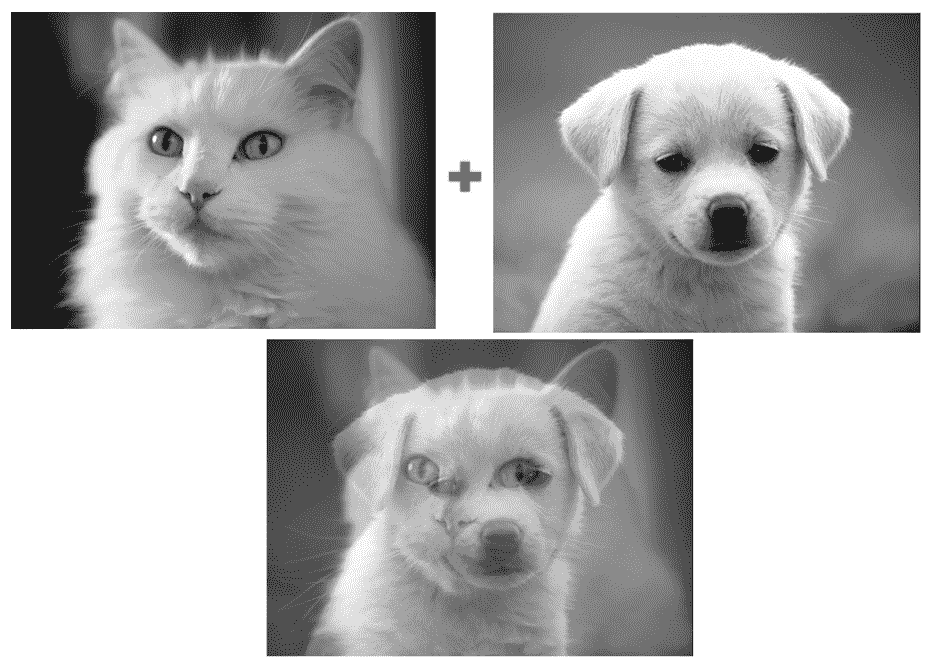
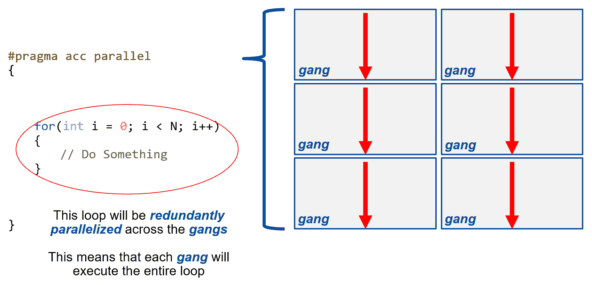
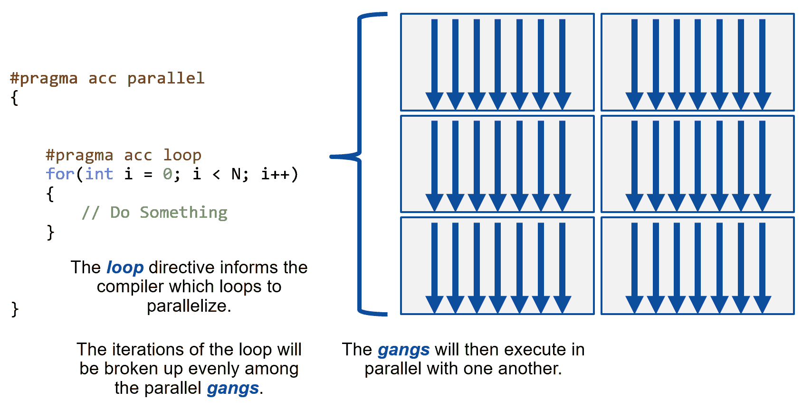
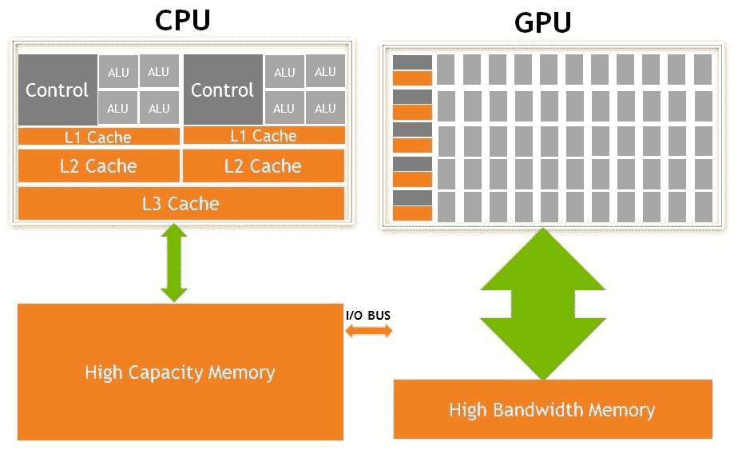
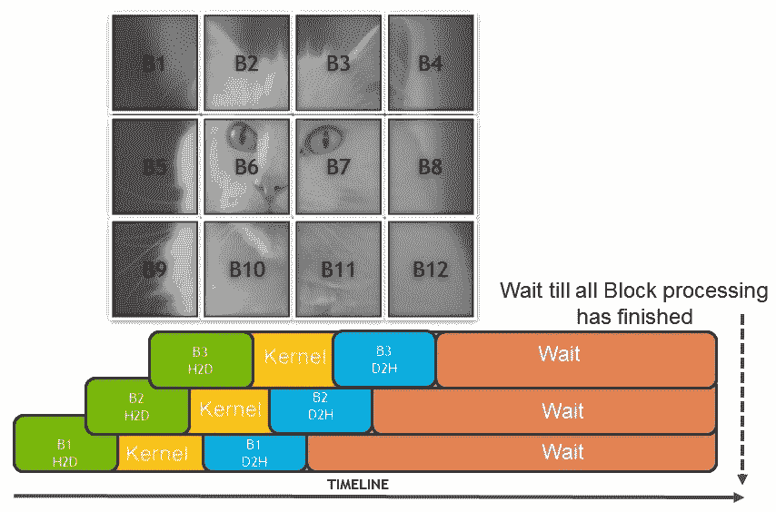
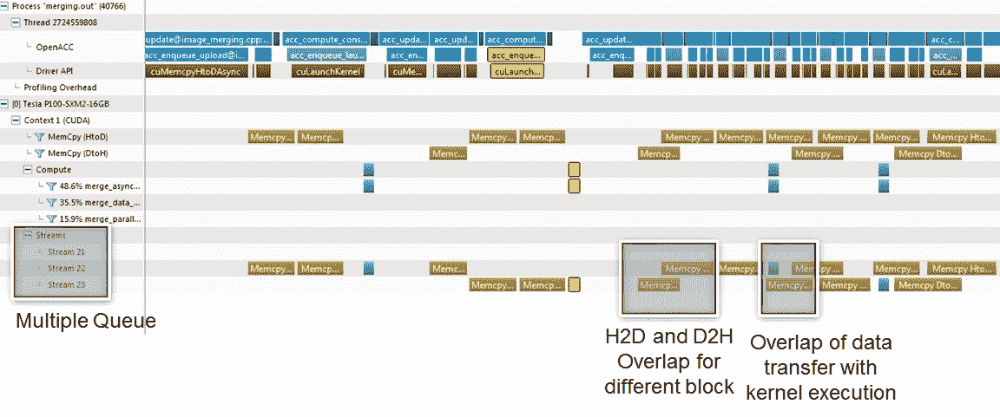
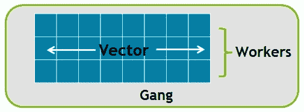

# 使用 OpenACC 进行 GPU 编程

每个处理器架构都提供了不同的编写代码以在处理器上运行的方法。CUDA 也不例外；它也提供了不同的编码方法。近年来变得非常流行的一种方法是使用 OpenACC，它基本上是基于指令的编程。

OpenACC 基本上是一个将异构计算作为一等公民的标准。该标准基本上规定了有两种处理器，即主机和设备/加速器，这与 CUDA 编程模型所述的概念非常相似。

对于希望获得最佳性能的程序员来说，使用诸如 C、C++、Fortran 和 Python 等语言的 CUDA 编程是表达并行性的首选方式。编程语言要求程序员从头开始重新创建他们的顺序程序，同时保持他们的关键操作的串行和并行版本。并行编程语言中创建的并行程序往往只适用于非常少数的平台。

编译器指令将编程语言的灵活性与库的易用性相结合。程序员使用高级指令对代码进行注释，编译器可以使用这些指令来并行化代码，或者可以安全地忽略。这意味着带有编译器指令的代码可以编译为许多不同的并行平台，并且无需维护代码的串行和并行版本。此外，有时需要快速测试和原型化应用程序以在 GPU 上运行。一个这样的例子是将天气代码等代码库（拥有数百万行代码）转换为在 GPU 上运行；使用流行的语言将需要大量的工作。在这种情况下，OpenACC 成为一个合乎逻辑的选择。在 OpenACC 中，开发人员以指令的形式向编译器提供提示。编译器接受这些提示并生成特定于架构的加速器代码。

OpenACC 标准还为代码的开发人员提供了供应商中立性。带有 OpenACC 指令的单一源代码可以重新编译为不同的设备。例如，PGI 编译器目前支持 OpenACC 后端，如 Intel CPU 多核、NVIDIA GPU、Intel Xeon Phi 和 FPGA/ASIC 架构。这对于希望编写供应商中立代码的开发人员来说是一个非常有吸引力的提议。高性能计算中的关键应用程序，如 Vienna Ab-initio Simulation Package（VASP）（分子动力学/量子化学）、Weather Research and Forecasting（WRF）和 ANSYS Fluent（CFD）利用 OpenACC 编程模型来针对 NVIDIA GPU。

总结 OpenACC 的关键要点：

+   当异构计算被视为新的编程模型时，OpenACC 标准得以发展。

+   OpenACC 在各种加速器上提供性能可移植性。

+   OpenACC 并不是 CUDA 编程语言的替代品。当选择的处理器是 NVIDIA 时，OpenACC 编译器在后台生成 CUDA 代码。

近年来，OpenMP 标准也开始纳入异构计算 API。但迄今为止，还没有支持不同处理器架构的编译器，因此我们选择在本书中坚持使用 OpenACC。

本章将涵盖以下主题：

+   OpenACC 指令

+   OpenACC 中的异步编程

+   额外重要的指令和子句

# 技术要求

本章需要一台带有现代 NVIDIA GPU（Pascal 架构或更高）的 Linux/Windows PC。

如介绍中所述，OpenACC 是一个标准，这个标准由不同的编译器实现，如 GCC、PGI 和 CRAY 编译器。我们将在本章中使用的编译器是 PGI。PGI 编译器在 Fortran 社区中非常受欢迎，并且一直在实现 OpenACC 最新规范方面处于领先地位，并且提供了一个可以从 PGI 网站免费下载的社区版。好处是在社区版和付费版本的 PGI 编译器之间在功能上基本没有变化。在本章中，您需要下载 PGI 社区版。

本章的代码也可以在 GitHub 上找到：[`github.com/PacktPublishing/Learn-CUDA-Programming`](https://github.com/PacktPublishing/Learn-CUDA-Programming)。

示例代码示例是使用 PGI 社区版的 19.4 版本开发和测试的。但建议您使用最新的 PGI 版本。

# 使用 OpenACC 在 GPU 上合并图像

为了理解 OpenACC 概念，我们选择了一个简单的计算机视觉算法来合并两个图像。在这段代码中，我们试图合并两个图像，如下所示：



前面的图像演示了一个计算机视觉算法，用于合并两个图像。

我们将在本章后面更多地讨论代码结构。首先，根据以下步骤配置环境：

1.  准备您的 GPU 应用程序。例如，我们将使用一个用于合并两个图像的核算法。此代码可以在`09_openacc/`中找到。

1.  使用`pgc++`编译器编译您的应用程序：

```cpp
$ pgc++ -c -acc -ta=tesla:pinned scrImagePgmPpmPackage.cpp
$ pgc++ -c -acc -ta=tesla:pinned -Minfo=accel image_merging.cpp
$ pgc++ -o merging.out -acc -ta=tesla:pinned -Minfo=accel scrImagePgmPpmPackage.o image_merging.o
$ ./merging.out
```

前面的命令将创建一个名为`blurring.out`的二进制文件。正如您可能已经观察到的，我们正在使用`pgc++`编译器来编译我们的代码。此外，我们向我们的代码传递了一些参数。让我们更详细地了解它们：

+   `-acc`：此标志告诉编译器解析代码中提供的 OpenACC 指令。

+   `-ta`：代表应该为设备代码生成的目标架构。请注意，`-ta=tesla`表示我们的目标是 NVIDIA GPU。其他目标的一些示例包括`-ta=multi-core`，它将多核作为设备目标，`-ta=radeaon`，它将 AMD GPU 作为目标，还有一些其他目标。此外，我们可以添加特定于设备的标志；例如，我们为分配所有 CPU 内存作为固定（不可分页）的 GPU 添加了一个固定标志。

+   `-Minfo`：此选项告诉编译器为我们提供有关编译器采取的步骤的更多信息，使我们的代码并行化。通过说`-Minfo-accel`，我们要求编译器为我们提供与加速器区域相关的更多信息。我们可以将标志更改为`-Minfo=all`，以提供非加速器区域的详细信息。以下输出显示了向我们的代码添加`Minfo`标志的部分输出：

```cpp
.... < More compiler output above>
merge_parallel_pragma(unsigned char *, unsigned char *, unsigned char *, long, long):
    30, Generating copyin(in1[:w*h])
    Generating copyout(out[:w*h])
    Generating copyin(in2[:w*h])
    Accelerator kernel generated
    Generating Tesla code
    30, #pragma acc loop gang /* blockIdx.x */
    32, #pragma acc loop vector(128) /* threadIdx.x */
    32, Loop is parallelizable
... < More compile output below >
```

要理解这个编译输出，我们需要了解 OpenACC pragma，我们将在下一节中进行。稍后我们将重新访问这个编译输出。可以使用`pgc++ --help`找到其他可用标志的更多详细信息。

运行二进制文件后的示例输出如下：

```cpp
$ ./merging.out
Reading image width height and width [1536][2048]
Time taken for serial merge: 0.0028 seconds
Time taken for OpenACC merge(data+kernel): 0.0010 seconds
Time taken for OpenACC merge(kernel only) with Blocking: 0.0002 seconds
 Time taken for OpenACC merge(data _kernel) with blocking: 0.0014 seconds
Time taken for OpenACC merge (data+kernel)with Pipeline Async: 0.0008 seconds
```

前面的输出显示我们正在读取一个大小为 1536*2048 的图像。代码有一个串行实现和三个使用 OpenACC pragma 的并行实现。每个实现的时间在前面的输出中显示。最后一个使用 pipeline 方法的实现显示了最佳时间：`0.0008 秒`。我们将采取增量方法，并在接下来的部分详细介绍每个实现。

该算法的串行实现非常简单，如下面的代码片段所示：

```cpp
void merge_serial(unsigned char *in1, unsigned char*in2, unsigned char *out, long w, long h)
{
    long x, y;
     for(y = 0; y < h; y++) {
         for(x = 0; x < w; x++) {
             out[y * w + x] = (in1[y * w + x]+in2[y * w + x])/2;
         }
     }
}
```

代码没有什么特别之处；基本上，它接受两个输入图像数据（`in1`和`in2`），执行平均操作以合并两个输入，最后存储输出。对于我们来说，关键的是循环是尴尬并行的，适合于 GPU 等架构。如上面的代码输出所示，串行实现花费了`0.0028`秒。请注意，计时可能会因运行代码的系统而略有不同。

在下一节中，我们将向您介绍 OpenACC 指令，以便将示例代码转换为在 GPU 上运行所需的指令。

# OpenACC 指令

在本节中，我们将尝试理解 OpenACC pragma 的语法，并为合并操作实现基本的并行和数据指令。OpenACC pragma 的基本语法如下：

```cpp
#pragma acc <directive> <clauses> 
!$acc parallel [clause [[,] clause]…] 
```

上述命令解释如下：

+   在 C/C++中的`#pragma`被称为“编译器提示”。这些与程序员注释非常相似；但是，编译器实际上会读取我们的 pragma。如果编译器不理解 pragma，它可以忽略它，而不是抛出语法错误。

+   `acc`是我们 pragma 的一个补充。它指定这是一个 OpenACC pragma。任何非 OpenACC 编译器都会忽略此 pragma。

+   `指令`是 OpenACC 中的一个命令，它告诉编译器执行某些操作。目前，我们只会使用允许编译器并行化我们的代码的指令。

+   `子句`是对我们的指令的补充/修改。这些包括但不限于优化。

在本节中，我们将介绍三个指令：*parallel*，*loop*和*data*。我们将展示它们各自的用法，并最终将它们应用到我们的合并算法中。

# 并行和循环指令

并行指令是最直接的指令。它将标记代码的一个区域进行并行化（通常只涉及并行化一个`for`循环），如下面的代码所示：

```cpp
#pragma acc parallel loop 
for (int i = 0; i < N; i++ ) {  
    //loop code 
}
```

我们还可以定义一个并行区域。并行区域可以有多个循环（尽管这通常不推荐！）。并行区域是指最外层花括号内的所有内容，如下面的代码片段所示：

```cpp
#pragma acc parallel
{
    #pragma acc loop
    for (int i = 0; i < N; i++ )
    {
        < loop code >
    }
}
```

包含循环非常重要；否则，您将无法正确地并行化循环。并行指令告诉编译器冗余地并行化代码，如下所示：



循环指令明确告诉编译器我们希望并行化循环，如下面的屏幕截图所示：



循环指令有两个主要用途：

+   标记单个循环进行并行化

+   允许我们明确定义循环的优化/修改

我们将在本章后面讨论循环优化，以及 gang 和 vector；目前，我们将专注于并行化方面。循环指令要正常工作，必须包含在并行指令内：

```cpp
#pragma acc parallel loop
for (int i = 0; i < N; i++ )
{
    //loop code 
}
```

使用并行指令时，必须包含循环指令才能使代码正常运行。我们还可以使用循环指令来并行化多维循环嵌套。在下面的代码片段中，我们看到了一个嵌套循环，并且我们明确为第二个循环提到了循环子句：

```cpp
#pragma acc parallel loop
for (int i = 0; i < N; i++ )
{
    #pragma acc loop
    for( int j = 0; j < M; j++ )
    {
        //loop code
    }
}
```

请注意，在上面的代码片段中，我们没有在内部循环中再次放置并行子句，因为我们已经在从外部循环开始的范围中提到了它。

# 数据指令

OpenACC 并行模型规定我们有一个主机，运行我们的顺序代码（通常是 CPU）。然后我们有我们的设备，这是某种并行硬件。主机和设备通常（虽然并非总是）有单独的内存，程序员可以使用 OpenACC 在两个内存之间移动数据。

正如在第一章中讨论的，GPU 和 CPU 架构在根本上是不同的。GPU 作为吞吐量架构，具有大量计算单元和高速内存带宽。另一方面，CPU 是一种减少延迟的架构，具有大型缓存层次结构，并且提供大容量的主存储器。需要操作的任何数据都需要首先复制到 GPU 内存。（请注意，即使在统一内存的情况下，数据也会在后台以页面的形式由驱动程序复制。）

如下图所示，两种架构（CPU 和 GPU）之间的数据传输通过 I/O 总线进行：



在 OpenACC 中使用 GPU 作为目标架构的目标是仅将并行代码卸载到 GPU 上，而顺序代码将继续在 CPU 上运行。OpenACC 标准允许程序员通过使用 OpenACC **数据指令和数据子句** 显式定义数据管理。数据子句允许程序员在主机和设备（或在我们的情况下，CPU 和 GPU）之间指定数据传输。

**隐式数据管理：**我们可以将数据传输留给编译器，如下例所示：

```cpp
int *A = (int*) malloc(N * sizeof(int));

#pragma acc parallel loop
for( int i = 0; i < N; i++ )
{
    A[i] = 0;
}
```

在前面的代码中，编译器将理解需要从 GPU 复制`A`向量，并为开发人员生成隐式传输。

**显式数据管理：**最好使用显式数据传输来获得对传输更多控制，如下面的代码中使用复制数据子句所示：

```cpp
int *a = (int*) malloc(N * sizeof(int));
#pragma acc parallel loop copy(a[0:N])
for( int i = 0; i < N; i++ )
{
     a[i] = 0;
}
```

在前面的代码片段中，我们使用了复制数据子句。下图解释了运行时到达复制数据指令时执行的步骤：


我们将通过合并代码的详细步骤来解释这些步骤，其中我们将应用数据子句。

其他可用的数据子句如下所列：

| **数据子句** | **描述** | **关键用法** |
| --- | --- | --- |
| `copy(list)` |

+   在设备上分配内存

+   在进入区域时，从主机复制数据到设备

+   在退出区域时，将数据复制到主机

| 这是默认的输入数据结构，被修改后从函数返回 |
| --- |
| `copyin(list)` |

+   在设备上分配内存

+   在进入区域时，从主机复制数据到设备

| 作为子例程的输入的向量 |
| --- |
| `copyout(list)` |

+   在设备上分配内存

+   在退出区域时，将数据复制到主机

| 不覆盖输入数据结构的结果 |
| --- |
| `create(list)` |

+   仅在设备上分配内存

+   不进行复制

| 临时数组 |
| --- |

为了最大化性能，程序员应避免所有不必要的数据传输，因此显式内存管理优于隐式数据管理。

**数组形状：**数组形状是指定数组大小的方式。如果不指定形状，编译器将尝试假定大小。这在 Fortran 中效果很好，因为 Fortran 跟踪数组的大小；然而，在 C/C++中可能不起作用。数组形状也是从数组复制数据的唯一方式（例如，如果只需要复制数组的一半，这可能提高性能，减少不必要的复制），如下面的代码片段所示：

```cpp
#pragma acc parallel loop copy(A[1:N-2])
```

这将复制`A`的所有元素，除了第一个和最后一个元素。

# 将并行、循环和数据指令应用于合并图像代码

现在让我们尝试将并行、循环和数据指令应用于合并顺序代码：

```cpp
void merge_parallel_pragma(unsigned char *in1, unsigned char*in2,unsigned char *out, long w, long h)
{
    long x, y;
    #pragma acc parallel loop gang copyin(in1[:h*w],
                                          in2[:h*w]) 
                                          copyout(out[:h*w])
     for(y = 0; y < h; y++) {
        #pragma acc loop vector
        for(x = 0; x < w; x++) {
            out[y * w + x] = (in1[y * w + x]+in2[y * w + x])/2;
        }
    }
}
```

我们已经使用并行循环指令并行化了两个循环（高度：`y`和宽度：`x`）。此外，我们还明确地添加了数据子句来复制数据。请注意，由于`in1`和`in2`向量只是输入，它们是使用`copyin()`数据子句进行复制的。`out`向量是输出，使用`copyout()`数据子句进行复制。让我们试着理解这个函数的编译器输出：

```cpp
merge_parallel_pragma(unsigned char *, unsigned char *, unsigned char *, long, long):
    30, Generating copyin(in1[:w*h])
        Generating copyout(out[:w*h])
        Generating copyin(in2[:w*h])
        Accelerator kernel generated
        Generating Tesla code
        30, #pragma acc loop gang /* blockIdx.x */
        32, #pragma acc loop vector(128) /* threadIdx.x */
32, Loop is parallelizable
```

前面的编译器输出显示，对于`merge_parallel_pragma`函数，编译器生成了以下操作：

+   在第 30 行，为`in1`和`in2`变量生成了`copyin`。在内核启动前将被复制到 GPU 的数组大小将是`[0:w*h]`。

+   在第 30 行，为`out`变量生成了`copyout`。在 GPU 内核启动后将被复制的数组大小将是`[0:w*h]`。

+   在第 30 和 32 行，生成了 Tesla 内核代码：

+   在第 30 行，外部循环使用了 gang 级并行化。

+   在第 32 行，内部循环使用了矢量级并行化

当代码在 V100 上运行时，整个内核所花费的时间为`0.0010s`。这基本上是串行代码的两倍快。这可能听起来并不令人印象深刻。原因是大部分时间花在了数据传输上，而不是内核计算。为了确认这一点，让我们使用`nvprof`：

```cpp
$ nvprof ./merging.out
==26601== DoneProfiling application: ./merging.out
==26601== Profiling result:
Type Time(%) Time Calls Avg Min Max Name
GPU activities: 67.36% 609.41us 2 304.71us 286.34us 323.08us [CUDA memcpy HtoD]
27.63% 250.02us 1 250.02us 250.02us 250.02us [CUDA memcpy DtoH]
5.01% 45.344us 1 45.344us 45.344us 45.344us merge_parallel_pragma_30_gpu(unsigned char*, unsigned char*, unsigned char*, long, long)
...
```

正如您在前面的分析输出中所观察到的，94%的时间花在了数据传输上，而只有 5%的时间（45 微秒）花在了内核执行上。您可能会问：我怎么知道这是哪个内核？如果您仔细看 GPU 内核的名称，`merge_parallel_pragma_30_gpu`，PGI 编译器在`merge_parallel_pragma`函数的第 30 行生成了一个 CUDA 内核，这就是我们如何将其与在该行号放置的编译指示联系起来的方式。

所以我们知道问题在哪里，但解决方案呢？我们将使用的优化技术是 blocking 来隐藏这种延迟。我们将在接下来的章节中更多地介绍 blocking 技术，并使用异步子句来重叠这个传输。

# OpenACC 中的异步编程

为了实现合并并行代码的更好性能，我们将利用一个叫做 blocking 的概念。Blocking 基本上意味着，我们可以创建数组的块，而不是一次性传输整个输入和输出数组，这些块可以并行传输和操作。以下图表演示了创建块并在内核执行时重叠数据传输：



前面的图表显示了不同的块被传输，这些块的内核执行可以独立于每个块。为了实现这一点，我们需要数据传输命令和内核调用被异步地触发和执行。为了实现 blocking，我们将在本节中引入更多的指令/子句：结构化/非结构化数据指令和`async`子句。我们将展示它们的每一个，并最终将它们应用到我们的基本 OpenACC 合并并行代码中。

# 结构化数据指令

OpenACC 数据指令允许程序员显式地管理设备上的数据（在我们的例子中是 GPU）。以下代码片段显示了标记结构化数据区域的示例：

```cpp
< Initialize data on host (CPU) >
#pragma acc data < data clauses >
{
    //< Code >
}
```

设备内存分配发生在区域的开始，设备内存释放发生在区域的结束。此外，从主机到设备（CPU 到 GPU）的任何数据移动发生在区域的开始，从设备到主机（GPU 到 CPU）的任何数据移动发生在区域的结束。内存分配/释放和数据移动是由程序员包含的子句定义的。

**包含多个计算区域：**一个数据区域可以包含任意数量的并行/内核区域，如下例所示：

```cpp
#pragma acc data copyin(A[0:N]) create(C[0:N])
{
    #pragma acc parallel loop
    for( int i = 0; i < N; i++ )
    {
        C[i] = A[i] + 10;
    }
    #pragma acc parallel loop
    for( int i = 0; i < N; i++ )
    {
        C[i] = C[i] / 10;
    }
}
```

# 非结构化数据指令

有两个非结构化数据指令：

+   **进入数据**：处理设备内存分配，并从主机复制到设备。您可以在进入数据中使用的两个子句是：

+   `create`：这将只执行设备内存分配。

+   `copyin`：这将执行分配以及从设备到设备的内存复制。

+   **退出数据**：处理设备内存释放，并从设备复制到主机。您可以在退出数据中使用的两个子句是：

+   `delete`：这将仅执行设备内存释放。

+   `copyout`：这将首先从设备复制内存到主机，然后执行设备内存释放。

非结构化数据指令不会将数据区域标记为您可以在代码中有多个进入数据和退出数据指令。最好将它们纯粹视为内存分配和释放。使用非结构化数据指令的最大优势是它们能够跨多个函数进行分支。您可以在一个函数中分配数据，并在另一个函数中释放它。我们可以看一个简单的例子：

```cpp
#define N 1024
int* allocate(int size)
{
    int *ptr = (int*) malloc(size * sizeof(int));
    #pragma acc enter data create(ptr[0:size])
    return ptr;
} 
void deallocate(int *ptr)
{
    #pragma acc exit data delete(ptr)
    free(ptr);
}
int main()
{
    int *ptr = allocate(N);
    #pragma acc parallel loop
    for( int i = 0; i < N; i++ )
    {
        ptr[i] = 0;
    }
    deallocate(ptr);
}
```

上面的代码片段显示了分配发生在单独的`allocate()`函数中，删除发生在`deallocate()`中。您可以将相同的概念链接到 C++中构造函数的一部分`enter data create`和析构函数的一部分`exit data delete`。

# OpenACC 中的异步编程

默认情况下，所有 OpenACC 调用都是同步的。这意味着，在每次数据传输或每次对 GPU 的内核调用之后，都会隐式添加同步。CPU 将等待直到 OpenACC 调用完成，然后开始执行下一条指令。为了使调用异步，我们可以在数据和并行指令中使用`async`子句，如下面的代码所示：

```cpp
#pragma acc data copyin(a[:N]) async 
// performing copyin asynchronously 
#pragma acc parallel loop async 
//performing parallel loop asynchronously. 
```

使用`async`的主要好处可以总结如下：

+   如果我们想要同时执行主机和设备代码，我们可以使用`async`启动我们的设备代码，而在执行时我们可以返回到主机继续不相关（非设备相关）的代码。

+   我们可以*排队*多个设备内核启动，以便它们连续执行，这在某些情况下可以减少启动设备内核的开销。

+   我们可以在主机和设备之间同时执行数据移动和设备计算**。**这是我们将应用于我们的代码的优化，并且是`async`的最常见用例。

在幕后，每当我们使用`async`子句时，我们都会向*队列*添加一些*工作*。提交给不同队列的工作可以*异步*执行，而在同一队列中的工作将*顺序*执行（一个接着一个）。当我们使用`async`时，我们可以指定队列号。如果未指定队列号，则将自动使用默认值。

# 将非结构化数据和异步指令应用于合并图像代码

现在让我们尝试将数据指令与`async`子句一起应用于合并并行代码：

```cpp
void merge_async_pipelined(unsigned char *in1, unsigned char*in2,unsigned char *out, long w, long h)
{
    long x, y;
    #pragma acc enter data create(in1[:w*h], in2[:h*w], out[:w*h])
    const long numBlocks = 8;
    const long rowsPerBlock = (h+(numBlocks-1))/numBlocks;
    for(long block = 0; block < numBlocks; block++) {
        long lower = block*rowsPerBlock; // Compute Lower
        long upper = MIN(h, lower+rowsPerBlock); // Compute Upper
        #pragma acc update device(in1[lower*w:(upper-lower)*w],
                                  in2[lower*w:(upper-lower)*w]) 
                                  async(block%2)
        #pragma acc parallel loop present(in1,in2, out) async(block%2)
        for(y = lower; y < upper; y++) {
            #pragma acc loop
            for(x = 0; x < w; x++) {
                out[y * w + x] = (in1[y * w + x]+in2[y * w + x])/2;
            }
        }
        #pragma acc update self(out[lower*w:(upper-lower)*w]) 
                                async(block%2)
    }
#pragma acc wait
#pragma acc exit data delete(in1, in2, out)
}
```

我们已经使用了数据指令和`async`子句来实现阻塞概念。让我们分解整体实现，这将使其更容易理解：

1.  **进入数据区域**：`enter data create`子句在 GPU 中为`in1`和`in2`变量以及`out`分配内存。

1.  **创建块**：我们决定将图像分成八个块。这些块分布在行中。外部的`for`循环用于此目的添加了这个原因。

1.  **异步从主机传输数据到设备**：`acc update device`基本上将数据从主机异步复制到设备，因为我们已经在其中添加了一个`async`子句。

1.  **异步启动并行循环**：`async`子句被添加到并行子句中，以异步启动 GPU 内核。

1.  **异步从设备传输数据到主机**：`acc update self`基本上是将数据从设备异步地复制到主机，因为我们已经在同一个地方添加了一个`async`子句。

1.  **等待**：`acc wait`将确保 CPU 等待，直到所有 OpenACC 启动都完成，然后在所有队列中继续前进。

1.  **退出数据区域**：`acc exit data delete`将删除在`enter data`子句中分配的`in1`和`in2`向量以及`out`。

让我们试着理解`merge_async_pipelined`函数的编译器输出：

```cpp
merge_async_pipelined(unsigned char *, unsigned char *, 
                      unsigned char *, long, long):
     67, Generating enter data create(out[:h*w],in2[:h*w],in1[:h*w])
     74, Generating update device(in1[w*lower:w*(upper-lower)],
                                  in2[w*lower:w*(upper-lower)])
         Generating present(in1[:],out[:],in2[:])
         Accelerator kernel generated
         Generating Tesla code
         74, #pragma acc loop gang /* blockIdx.x */
         76, #pragma acc loop vector(128) /* threadIdx.x */
     76, Loop is parallelizable
     81, Generating update self(out[w*lower:w*(upper-lower)])
     84, Generating exit data delete(out[:1],in2[:1],in1[:1])
```

前面的编译器输出显示，对于`merge_async_pipelined`函数，编译器生成了以下操作：

+   在第 67 行，为`in1`、`in2`和`out`变量生成了`data create`区域。

+   在第 74 行，为`in1`和`in2`调用了`update device`，并且数据传输到设备被限制在上下界之间：`in1[w*lower:w*(upper-lower)],in2[w*lower:w*(upper-lower)]`。

+   在第 74 和 76 行，Tesla 内核代码已经生成。

+   在第 81 行，为`out`变量调用了`update self`，并且数据从设备传输被限制在上下界之间：`out[w*lower:w*(upper-lower)]`。

+   在第 84 行，数据区域结束，并调用`delete`来释放在 GPU 上分配的内存。

当代码在 V100 上运行时，整个内核所花费的时间为 0.0008 秒。为了更详细地了解这一点，让我们回到分析器。这次我们将利用 NVIDIA Visual Profiler 来可视化输出：



使用 NVIDIA Visual Profiler 输出

前面的屏幕截图显示了使用`async`和阻塞后的 Visual Profiler 输出。来自分析器窗口的关键消息如下：

1.  我们看到有三个流被创建和使用。这是因为我们的代码使用了`async(block%2)`，这意味着我们请求了最大 2 个队列。第三个队列是默认队列，在管道执行期间不被使用。

1.  我们看到主机到设备和设备到主机的传输也重叠了，因为 GPU 有两个**直接内存访问**（**DMA**）引擎，因此反向的数据传输也可以重叠。

1.  我们还看到我们的内核执行与数据传输重叠。

到目前为止，我们已经看到了帮助我们将顺序代码转换为在 GPU 上运行的图像合并的关键指令。在下一节中，我们将向您介绍更多的子句，这些子句将帮助您进一步优化您的 OpenACC 代码。

# 其他重要的指令和子句

在本节中，我们将介绍其他重要的广泛使用的指令，可以应用到我们的合并算法中。

# Gang/vector/worker

Gang/worker/vector 定义了我们可以在 OpenACC 中实现的各种并行级别。这种并行在并行化多维循环嵌套时非常有用。OpenACC 允许我们定义一个通用的 gang/worker/vector 模型，适用于各种硬件，但我们将更多地专注于 GPU 特定的实现。下图显示了 OpenACC 并行编程模型：



这个前面的图表代表了一个单一的 gang。当我们并行化我们的`for`循环时，循环迭代将会被均匀地分配给多个 gang。每个 gang 将包含一定数量的线程。这些线程被组织成块。一个 worker 是一行线程。

在前面的图中，有三个 worker，这意味着有三行线程。向量指的是每行有多长。所以在前面的图中，向量是八，因为每行有八个线程。在为 GPU 编程时，默认情况下会自动应用 gang 和 vector 并行。

由于 OpenACC 是一个开放标准并且面向多种硬件，它提供了通用构造。但是这个构造如何映射到特定的目标设备呢？答案很简单；这取决于架构和编译器，因此提供了性能可移植性。如果我们要映射当前 PGI 编译器如何将这个概念映射到 CUDA（NVIDIA GPU），那么它将如下所示：

+   OpenACC gang 映射到 CUDA 块。

+   worker 本质上映射到 CUDA 线程束。

+   OpenACC 向量映射到`threadIdx.x`和（X 维度）。

+   OpenACC worker 映射到`threadIdx.y`（Y 维度）。

再次强调，这是 PGI 编译器如何映射 OpenACC 构造的方式。其他编译器可能会以不同的方式进行映射。特别是对于 NVIDIA GPU，gang worker vector 将定义我们的 GPU 线程的组织。通过添加以下子句，开发人员可以告诉编译器在给定的循环上使用哪些并行级别：

+   `gang`: 标记用于 gang 并行的循环。

+   `worker`: 标记用于工作并行的循环。

+   `vector`: 标记用于向量并行的循环。

以下代码片段有三个循环，并且每个循环的并行性都已经明确定义：外循环为`gang`，中间循环为`worker`循环，最内层循环为`vector`循环：

```cpp
#pragma acc parallel loop gang
for( i = 0; i < size; i++ )
    #pragma acc loop worker
    for( j = 0; j < size; j++ )
        #pragma acc loop vector
        for( k = 0; k < size; k++ )
          c[i][j] += a[i][k] * b[k][j];
```

**调整 gangs、workers 和 vectors：**编译器将为您选择一定数量的 gangs 和 workers 以及向量长度，但您可以使用以下子句进行更改：

+   `num_gangs(N)`: 为并行区域生成`N`个 gangs

+   `num_workers(M)`: 为并行区域生成`M`个 workers。

+   `vector_length(Q)`: 为并行区域使用向量长度`Q`

在以下代码片段的示例中，我们将 gangs 的数量设置为`2`，workers 的数量设置为`2`，向量长度设置为`32`：

```cpp
#pragma acc parallel num_gangs(2) \
  num_workers(2) vector_length(32)
{
  #pragma acc loop gang worker
  for(int x = 0; x < 4; x++){
    #pragma acc loop vector
    for(int y = 0; y < 32; y++){
      array[x][y]++;
    }
  }
}
```

在代码中设置 gangs 的数量很少是一个好主意——让编译器决定。大多数情况下，您可以通过调整向量长度有效地调整循环嵌套。此外，在 GPU 上很少使用 worker 循环。

# 托管内存

OpenACC 提供了一个选项，允许编译器处理内存管理。通过自己管理内存，我们将能够获得更好的性能；但是，允许编译器使用托管内存非常简单。我们不需要对我们的代码进行任何更改，就可以让托管内存正常工作。

为了使用托管内存，我们可以像这样将托管标志传递给`pgc++`编译器：

```cpp
$ pgc++ -c -acc -ta=tesla:managed scrImagePgmPpmPackage.cpp
$ pgc++ -c -acc -ta=tesla:managed -Minfo=accel image_merging.cpp
$ pgc++ -o merging.out -acc -ta=tesla:managed -Minfo=accel scrImagePgmPpmPackage.o image_merging.o
$ ./blurring.out
```

添加了托管子句后，编译器基本上会忽略数据子句，并且托管内存用于在 CPU 和 GPU 之间传输数据。请注意，托管内存仅用于堆数据，而不是栈/静态数据。我们在上一章介绍的统一内存概念将保持不变。

# 内核指令

内核指令允许程序员退一步，完全依赖编译器。使用内核指令的一些示例代码如下：

```cpp
#pragma acc kernels 
for (int i = 0; i < N; i++ ) 
{ 
    //< loop code > 
}
```

就像并行指令示例中一样，我们正在并行化一个循环。请记住，使用并行指令时，必须始终与循环指令配对；否则，代码将无法正确并行化。内核指令不遵循相同的规则；在一些编译器中，添加循环指令可能会限制编译器优化代码的能力。

内核指令是并行指令的完全相反。这意味着编译器做出了很多假设，甚至可能覆盖程序员并行化代码的决定。此外，默认情况下，编译器将尝试优化循环。编译器通常很擅长优化循环，并且有时甚至可以以程序员无法描述的方式优化循环。然而，通常程序员可以通过自己优化循环来获得更好的性能。

如果您遇到编译器拒绝并行化循环的情况，您可以覆盖编译器的决定。（但请记住，通过覆盖编译器的决定，您要对并行化代码造成的任何错误负责！）在这段代码中，我们使用独立子句来向编译器保证我们认为该循环是可以并行化的：

```cpp
#pragma acc kernels loop independent
for (int i = 0; i < N; i++ )
{
    //< loop code >
}
```

Kernel 指令最明显的优势之一是它能够同时并行化许多循环。例如，在下面的代码段中，我们能够通过利用内核区域同时有效地并行化两个循环：

```cpp
#pragma acc kernels
{
    for (int i = 0; i < N; i++ )
    {
        //< loop code >
    } 
... some other sequential code
    for (int j = 0; j < M; j++ )
    {
        //< loop code >
    }
}
```

# Collapse 子句

**collapse 子句**允许我们将多维循环嵌套转换为单一维度循环。这个过程对于增加循环的整体长度（通常增加并行性）和通常有助于内存局部性。让我们看一下语法：

```cpp
#pragma acc parallel loop collapse( 3 )
for(int i = 0; i < N; i++)
{
    for(int j = 0; j < M; j++)
    {
        for(int k = 0; k < Q; k++)
        {
            < loop code >
        }
    }
}
```

该代码将三维循环嵌套合并为单一维度循环。

# Tile 子句

**tile 子句**允许我们将多维循环分解为*瓦片*或*块*。这通常对于增加某些代码的内存局部性很有用。让我们看一下语法：

```cpp
#pragma acc parallel loop tile( 32, 32 )
for(int i = 0; i < N; i++)
{
    for(int j = 0; j < M; j++)
    {
        < loop code >
    }
}
```

前面的代码将我们的循环迭代分成 32 x 32 个瓦片（或块），然后并行执行这些块。

# CUDA 互操作性

正如本章前面提到的，OpenACC 并不是 CUDA 语言的替代品；事实上，开发人员可以开始利用 OpenACC 将热点部分移植到 GPU 上。他们可以开始仅集成 CUDA 内核以用于最关键的功能。有几种方法可以将 OpenACC/CUDA 转换为可互操作的代码。我们将在本节中介绍其中一些。

# DevicePtr 子句

这个子句可以用来映射使用`cudaMalloc`分配的 CUDA 设备指针，并将其传递给 OpenACC。以下代码片段展示了`deviceptr`子句的使用：

```cpp
double *cuda_allocate(int size) {
    double *ptr;
    cudaMalloc((void**) &ptr, size * sizeof(double));
    return ptr;
}
int main() {
    double *cuda_ptr = cuda_allocate(100); 
    // Allocated on the device, but not the host!

    #pragma acc parallel loop deviceptr(cuda_ptr)
    for(int i = 0; i < 100; i++) {
        cuda_ptr[i] = 0.0;
    }
}
```

通常，OpenACC 运行时期望得到一个主机指针，然后将其转换为一些相关的设备指针。`deviceptr`子句是一种告诉 OpenACC 运行时一个给定指针不应该被转换，因为它已经是一个设备指针的方法。

# Routine 指令

最后要讨论的话题是在 OpenACC 并行和内核区域内使用 CUDA 设备函数。这些函数是编译为由 GPU 内核或 OpenACC 区域调用的。为了在我们的 OpenACC 循环中使用 CUDA `__device__`函数，我们还可以使用 routine 指令：

```cpp
//In CUDA code
extern "C" __device__
int cuda_func(int x) {
        return x*x;
}

//In OpenACC Code
#pragma acc routine seq
extern int cuda_func(int);

...

int main() {
    A = (int*) malloc(100 * sizeof(int));
    #pragma acc parallel loop copyout(A[:100])
    for(int i = 0; i < 100; i++) {
        A[i] = cuda_func(i);
    }
}
```

请注意，本章提供了一种实际利用 OpenACC 的方法，不涵盖整个标准 API。有关广泛的 API 信息，请参阅[`www.openacc.org/.`](https://www.openacc.org/)

# 总结

在本章中，我们为您提供了一种利用 GPU 的替代方法。使用 OpenACC 的基于指令的编程方法对于传统应用程序非常受欢迎，对于新应用程序也提供了一种非常简单和可移植的方法。使用这种方法，您可以看到编译器变得更加先进。用户对指令的反馈已经被使用，通过利用指令可以为不同的架构生成最佳的并行代码。

我们介绍了提供指示/提示给编译器的并行指令。我们还利用数据指令来控制数据传输，而不是依赖于托管内存。通过使用异步子句，我们还尝试通过重叠内核和数据传输来优化我们的应用程序。我们探讨了将 OpenACC 构造映射到 CUDA 层次结构，以及 OpenACC 和 CUDA C/C++代码之间的互操作性。

在下一章中，我们将开始将我们对 CUDA 的知识应用于深度学习。
