# 附录

CUDA 是一个并行编程平台。学习 CUDA 不仅意味着学习语言，还意味着具有一些与 GPU 相关的工程技能。这个工程领域可以是监控、环境设置、性能理解、容器化等等。本章提供了一些提示，以帮助工程师使用 GPU。我们可以涵盖更多的主题，但以下主题对于那些想要学习 CUDA 及其 GPU 操作的人来说将是有帮助的。

在本章中，我们将涵盖以下主题：

+   有用的`nvidia-smi`命令

+   Windows 中的 WDDM/TCC 模式

+   性能建模

+   探索基于容器的开发

# 有用的 nvidia-smi 命令

在本节中，我们将涵盖`nvidia-smi`的监控功能和管理操作。`nvidia-smi`是**NVIDIA 管理库**（**NVML**）的**命令行接口**（**CLI**）。该库使得对 NVIDIA 设备进行管理和监控成为可能。`nvidia-smi`还通过该库提供了对设备的直接查询和命令。数据以纯文本或 XML 格式通过`stdout`或文件呈现。它提供了几个管理工具，用于更改设备统计信息。

`nvidia-smi`是一个包装 NVML C/C++ API 的 CLI 应用程序。它通过 NVML 从 NVIDIA 驱动程序获取请求的信息。NVML 还提供了用于其他语言（如 Python 和 Perl）的 API。

基本上，`nvidia-smi`为用户报告了以下已安装的 GPU 统计信息：

+   第一行报告了驱动程序版本和支持的 CUDA 版本

+   第二行显示了 GPU 的统计格式

+   每个连续的行包含每个 GPU 的统计信息，包括以下内容：

+   GPU ID

+   操作模式：

+   持久模式（开/关）

+   **Tesla 计算集群**（**TCC**）/**Windows 显示驱动模型**（**WDDM**）模式

+   风扇速度

+   GPU 温度

+   性能模式

+   功率使用和容量

+   总线 ID

+   内存使用和已安装内存

+   计数的**纠错码**（**ECC**）

+   GPU 利用率

+   计算模式

基本上，`nvidia-smi`可以处理包括 Tesla、Quadro 和 GeForce 在内的所有 NVIDIA GPU 卡。启用的功能可能因型号和类型而异。例如，ECC 错误计数在 Tesla 和 Quadro 卡中可用，而在 GeForce 中不可用，因为它在设备内存中不提供 ECC 功能。

`nvidia-smi`报告的格式在各个操作系统上都是相同的。以下截图显示了 Windows 的输出：

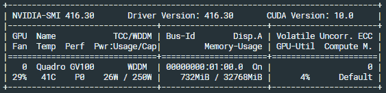

以下截图显示了 Linux 的输出：

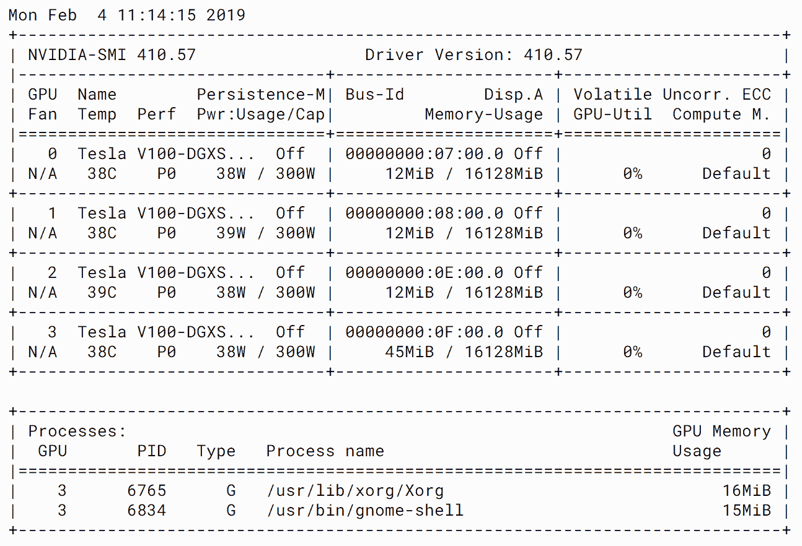

因此，我们可以阅读报告并以相同的格式设置 GPU 操作。现在，让我们继续看一下经常使用的命令。默认的`nvidia-smi` CLI 的用法如下：

```cpp
$ nvidia-smi [option1 [arg]] [option2 [arg]] ...
```

首先，根据监视目的，经常使用以下选项：

+   `-i`，`--id=`：用于选择目标 GPU

+   `-l`，`--loop=`：以指定的秒间隔报告 GPU 的状态

+   `-f`，`--filename=`：用于记录到指定文件中

此列表涵盖了可以帮助我们从 GPU 获取详细信息的`nvidia-smi`选项。

# 获取 GPU 的信息

当我们使用`--query`（`-q`）选项时，`nvidia-smi`报告结构化输出。因此，我们可以了解收集了哪些信息。我们可以获取 GPU 的利用率、功率、内存和时钟速度统计信息。另一方面，如果我们希望连续监视 GPU 的状态，这种格式就不太有用了。

# 获取格式化信息

我们需要监视的基本 GPU 统计信息是功率、温度、核心利用率和内存使用情况。这可以很容易地通过`--query-gpu`命令完成：

```cpp
$ nvidia-smi --query-gpu=timestamp,name,pci.bus_id,driver_version,pstate,pcie.link.gen.max,pcie.link.gen.current,temperature.gpu,utilization.gpu,utilization.memory,memory.used,memory.free,memory.used --format=csv -l 1
```

以下命令显示了我们可以使用的一些选项，以检测时钟调节的性能降低原因：

```cpp
$ nvidia-smi --query-gpu=index,clocks_throttle_reasons.active,clocks_throttle_reasons.gpu_idle,clocks_throttle_reasons.applications_clocks_setting,clocks_throttle_reasons.sw_power_cap,clocks_throttle_reasons.hw_slowdown,clocks_throttle_reasons.hw_thermal_slowdown,clocks_throttle_reasons.hw_power_brake_slowdown,clocks_throttle_reasons.sync_boost --format=csv
```

GPU 时钟调节的原因可能是功率限制、过热和同步提升。功率限制意味着 GPU 的功耗受用户设置或系统中电源供应商的性能限制。过热也是由于散热环境不佳而频繁出现的调节原因。

# 功耗管理模式设置

您可以使用以下命令找出每个 GPU 的最大功耗：

```cpp
$ nvidia-smi -i <device id> -pl N
```

# 设置 GPU 的时钟速度

默认情况下，GPU 的时钟速度会根据需求变化，以节省功耗，最大化功耗效率。为了最大化 GPU 的性能并减少延迟，特别是在基准测试情况下，我们可以确保 GPU 具有最大时钟速度并禁用 GPU 驱动程序。

首先，我们需要将 GPU 设置为持久模式。这样做意味着 GPU 驱动程序模块始终加载到内核中，并减少了初始响应时间。这个选项只在 Linux 上可用，因为 Windows 不会卸载 GPU 驱动程序。持久模式设置命令如下：

```cpp
$ sudo nvidia-persistenced
```

然后，我们可以设置最大支持的时钟。这个值会根据您使用的 GPU 而有所不同：

```cpp
$ nvidia-smi -q -d SUPPORTED_CLOCKS
$ sudo nvidia-smi -ac <Mem clock, Graphics clock>
```

例如，Tesla V100 卡可以使用以下命令进行设置：

```cpp
$ sudo nvidia-smi -ac 877,1380 # V100 PCIe
$ sudo nvidia-smi -ac 877,1530  # V100 SMX
```

# GPU 设备监控

这个命令每秒探测一次所选 GPU 的设备状态：

```cpp
$ nvidia-smi dmon -s pucvmet -i -0
```

以下截图显示了前面命令的结果。我们正在监控的设备状态显示为`0`：

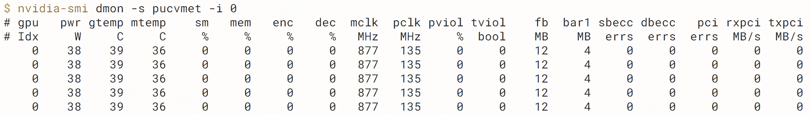

收集到的信息可以使用`-s`选项指定，如下所示：

+   `p`: 功耗和温度

+   `u`: 利用率

+   `c`: 处理器和内存时钟

+   `v`: 功耗和温度违规

+   `m`: FB 和 Bar1 内存

+   `e`: ECC 错误和 PCIe 重播错误

+   `t`: PCIe 接收和发送吞吐量

# 监控 GPU 利用率以及多个进程

如果您在单个 GPU 上使用多个进程操作，可以考虑使用这个命令。这个命令收集 GPU 统计信息，以及它们正在使用的进程。这意味着您可以确定哪个进程被 GPU 共享限制，内存时序的空间等等：

```cpp
$ nvidia-smi pmon -i 0 -s u -o T
```

以下截图显示了带有**进程 ID**（**PID**）的`nvidia-smi`输出，这有助于确定哪个进程正在使用哪个 GPU 资源：

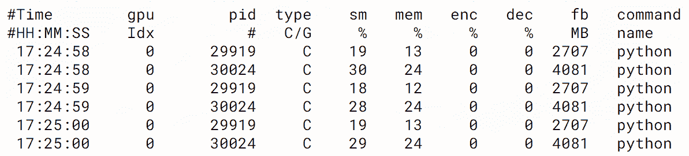

前面截图中的每一列显示了每个 GPU 的计算单元利用率或内存使用情况：

+   `sm%`: CUDA 核心利用率

+   `mem%`: 内存操作的采样时间比率

+   `enc%`/`dec%`: 硬件编码器利用率

+   `fb`: FB 内存使用

# 获取 GPU 拓扑信息

在多 GPU 系统中，使用`nvidia-smi`获取 GPU 拓扑信息非常有用。以下命令是一个显示多 GPU 系统 GPU 拓扑的`nvidia-smi`命令：

```cpp
nvidia-smi topo -m
```

以下截图显示了`nvidia-smi`的输出，显示了系统的拓扑结构。DGX Station 的结果是我们有四个支持 NVLink 的 V100 GPU：

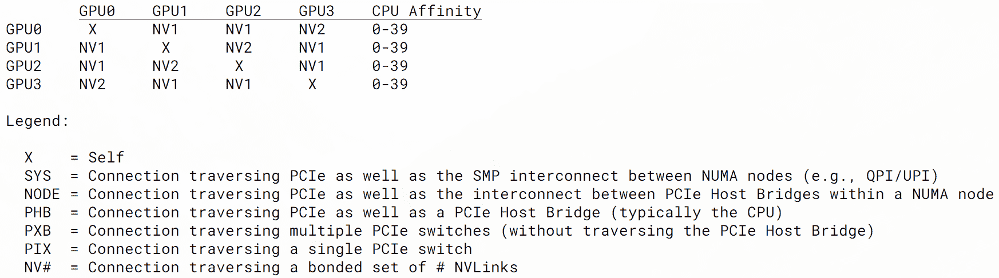

根据这个结果，我们可以确认系统的 GPU 拓扑如下：

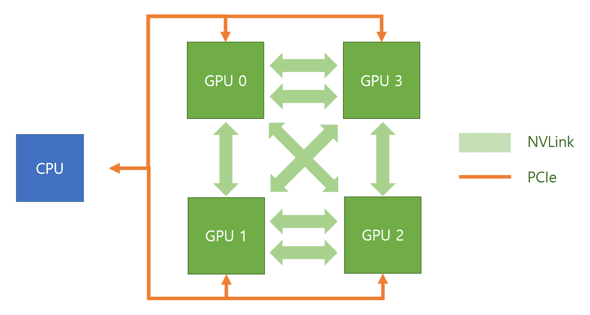

以下命令识别了 GPU 之间的点对点可访问性。我们在第六章 *可伸缩多 GPU 编程*中使用了这个命令：

```cpp
$ nvidia-smi topo -p2p rwnap
```

以下是一个拥有四个 GPU 的系统的`nvidia-smi`拓扑输出：

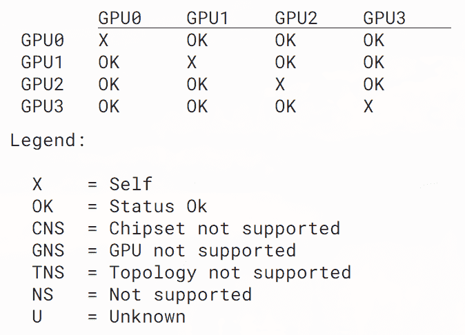

点对点访问是可伸缩性或操作的重要因素。这个命令可以帮助您确认 GPU 和您的系统是否支持 GPU 之间的点对点访问。

# 在 Windows 中的 WDDM/TCC 模式

在 Windows 平台上，NVIDIA GPU 有两种模式：WDDM 和 TCC。WDDM 是视频卡的图形驱动程序，因此它可以渲染桌面和应用程序。如果安装的 GPU 仅用于计算，则显示渲染是无用的开销。在这种情况下，NVIDIA GPU 可以切换到仅专注于计算的模式。这种模式称为 TCC 模式。

WDDM 允许 NVIDIA GPU 与 Windows 的 WDDM 驱动程序合作，用于显示。支持 WDDM 模式是 Windows 图形的要求。另一方面，TCC 模式只用于计算。根据您的 GPU 产品和配置，GPU 的模式可以更改。

操作模式遵循四个 NVIDIA 产品类别，并且其默认模式可以变化，如下所示：

+   **GeForce**：仅支持 WDDM 模式。

+   Quadro/Titan：默认情况下为 WDDM 模式，但也可以在 TCC 模式下使用。

+   **Tesla**：通常默认为 TCC 模式。

+   **Tegra**：仅支持 Linux。没有 WDDM/TCC 问题。

WDDM 模式支持 CUDA 操作和使用 Nsight 调试 CUDA 应用程序，同时也支持显示。作为单个主机机器，您可以做 GPU 能做的一切。但是，TCC 模式禁用了图形驱动程序上的图形，并将 GPU 作为计算加速器启用。换句话说，当显卡不必提供显示时应使用此模式。

TCC 模式在 CUDA 处理中比 WDDM 模式具有一些优势，如下所示：

+   用于大规模计算

+   忽略 Windows 的显示超时间隔（通常为两秒），以启用长于两秒的内核操作

+   减少 Windows 上 CUDA 的核心启动开销

+   支持在 Windows 远程桌面服务中进行 CUDA 处理

+   使非 NVIDIA 集成图形的 NVIDIA GPU 可用，以便您可以保存全局内存

因此，如果 GPU 不提供显示服务，TCC 模式为 GPU 作为加速器带来了最佳配置。

# 设置 TCC/WDDM 模式

要更改 TCC 或 WDDM 模式，请使用`nvidia-smi`实用程序，如下所示：

```cpp
$ sudo nvidia-smi -dm {0|1}
```

`0`表示 WDDM 模式，`1`表示 TCC 模式。

如果要为所选的 GPU 设置 TCC 模式，请使用`-g`选项指定目标 GPU：

```cpp
$ nvidia-smi -g {GPU_ID} -dm {0|1}
```

当您想要将 GPU 用途分开为显示和计算时，此选项非常有用。应用这些设置后，您可能需要*重新启动*您的机器以应用这些更改。

我们可以通过使用`nvidia-smi`来确定 TCC 模式是否已启用。以下截图显示了 TCC 中的 GPU 操作模式：

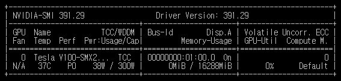

通过查看第一列中 GPU 名称的右侧，我们可以确认 TCC 模式已启用。

# 性能建模

了解应用程序/算法和 GPU 硬件的特性以设定实际加速目标非常重要。这可以通过增加并行性来实现。我们还需要确定在优化应用程序时是否有优化 GPU 的空间。

一个简单的方法是应用阿姆达尔定律。我们可以预测应用程序中可实现的性能增益受到代码顺序部分的限制。例如，只有 50%的代码可以并行执行，而其余部分是顺序的（例如从文件中读取）。如果是这种情况，那么可以实现的最大加速比为 2 倍；也就是说，程序只能运行两倍快。然而，这种性能建模只显示了最大加速比。我们不得不假设我们可以完全并行化并消除代码并行部分的执行时间。

另一种性能建模实践是基于目标架构的性能限制因素进行分析。实际上，我们有硬件规格，其操作引入了不可避免的性能限制。通过分析这些限制，我们可以确定是否有优化的空间，并查看下一组优化策略。

# Roofline 模型

每个核函数可以归类为以下类别之一：

+   **计算受限**：核心函数对每个读取或写入的数据字节进行更多的算术运算。这些应用程序需要硬件提供更多的计算 FLOPS。

+   **内存受限**：应用程序大部分时间都在读写内存，而不是计算。应用程序受到系统内存带宽的影响最大，而不是硬件的 FLOP 评级。

+   **延迟受限**：核心函数的 CUDA 线程大部分时间都在等待而不是执行。出现这种情况有很多原因。主要原因是并行性水平不佳或内存和计算资源的使用不佳。

由于所有这些限制都是由硬件引入的，我们可以绘制目标硬件的峰值性能和内存带宽以及它们的算术强度。性能曲线受硬件的峰值性能限制。我们在第三章中简要提到了这一点，*CUDA 线程编程*，以确定下一个优化策略。以下插图在第三章中使用，*CUDA 线程编程*，展示了屋顶线模型的一个示例：

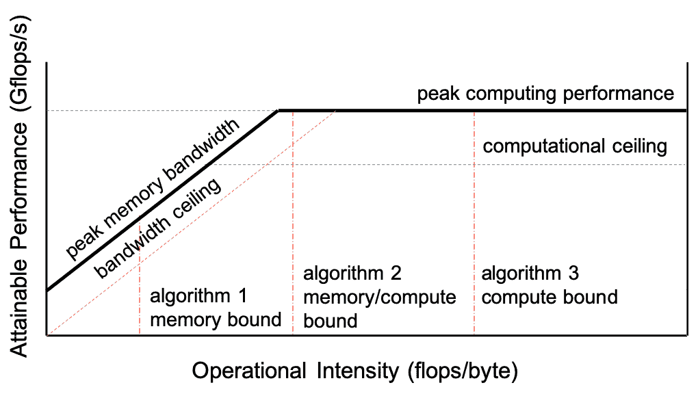

为了进行任何计算，数据需要从内存传输到算术单元。它遍历不同级别的内存层次结构，峰值内存带宽取决于内存类型。算法的峰值性能可以根据其算术强度进行分类。这种强度由计算数据与加载数据的量确定。此外，这些延迟限制因素引入了计算上限。通过针对硬件规格的性能和分析，我们可以确认目标算法是否达到了峰值性能或受到了内存或延迟的限制。在任何情况下，我们都可以确定下一步。在第三章中，*CUDA 线程编程*，我们深入探讨了这一点。在本节中，我们将通过一个示例来关注屋顶线模型，并看看它有多有用。

屋顶线模型考虑了应用程序的操作强度。简单来说，这意味着每个操作都是从主存储器（DRAM）中的字节进行的。虽然还有更复杂的模型考虑了缓存到处理器的传输，但屋顶线模型更专注于从 DRAM 到缓存的数据传输，因此更专注于 CUDA 核心在特定 GPU 架构上所需的 DRAM 带宽。

屋顶线模型陈述如下：

"可达性能（GFLOP/s）= min（峰值浮点性能，峰值内存带宽*操作强度）"

# 分析雅可比方法

让我们尝试理解这个公式，并得到 V100 GPU 卡的屋顶线模型。V100 GPU 的规格如下：

+   80 个 SM，每个 SM 有 32 个 FP64 核心

+   900GB/s 的总带宽

+   L2 缓存：6MB

+   L1 缓存：10MB

+   寄存器：每个 SM 62KB

让我们尝试分析一个简单的雅可比方法：

```cpp
for (int iy = 1; iy < NoRows; iy++)
{
    for ( int ix = 1; ix < NoCols; ix++)
    {
        Anew[ix][iy] = rhs[iy∗nx+ix] 
                     - 0.25f*(Aref[ix-1][iy] + Aref[ix+1][iy] 
                     + Aref[ix][iy-1] + Aref[ix][iy+1]);
    }
}
```

让我们分析上述代码的数据传输：

+   向量（`Anew`，`rhs`，`Aref`）的内存加载：*I[Load]* *= NoRow * NoCol * 3 * 8 字节（双精度）*

+   向量（`Anew`）的存储：*I[store] = NoRow * NoCol * 8 字节*

+   浮点运算：*I[FP] = NoRow * NoCol * 6 FLOP*

以下图表显示了 Tesla V100 卡的屋顶线分析和雅可比方法的算术强度：

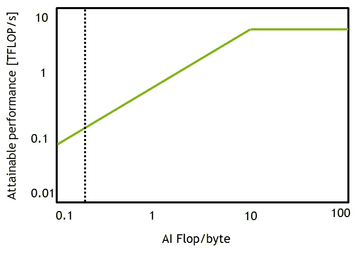

V100 上雅可比的算术强度将是*I[FP]/(I[Load]+I[Strore]) = 0.18 FLOP/字节*

Roofline 模型清楚地显示了算法是内存绑定的，最大可达性能仅为 0.18 FLOP/字节，因此将无法达到 V100 的峰值 FLOP 评级，即 7.8 TFLOPS。然而，我们也可以通过重用获取的数据来预测优化后的可达性能。

Roofline 模型有助于根据硬件特性定义算法的上限性能。

**雅各比方法**

这是一种用于解决线性方程组的迭代算法。其基本操作和 GPU 优化在[`www.olcf.ornl.gov/wp-content/uploads/2016/01/Introduction-to-Accelerated-Computing-with-OpenACC-Jeff-Larkin.pdf`](https://www.olcf.ornl.gov/wp-content/uploads/2016/01/Introduction-to-Accelerated-Computing-with-OpenACC-Jeff-Larkin.pdf)中有解释。

# 探索基于容器的开发

开发人员和维护集群的 IT 管理员面临的一个关键挑战是软件堆栈的复杂性。每个应用程序/框架都有许多依赖关系。当这些依赖关系是不同版本时，复杂性会增加。例如，在 DL 中，Caffe 对 cuDNN 和 Python 的版本有不同的要求，与 TensorFlow 不同。在特定的组织/学院中，有许多用户，每个用户可能使用相同框架的不同版本。安装所有正确的依赖关系并设置正确的环境会导致生产力的损失。花在安装上的时间比实际工作的时间更多。另一个面临的挑战是，即使在相同的系统上运行，由于依赖关系不匹配，不同的个体几乎不可能复制结果/性能数字。例如，GROMACS 分子动力学框架有许多设置，比如编译多线程或**消息传递接口**（**MPI**）支持，MPI 的版本和 MPI 类型。特别是在人工智能领域，另一个挑战是，你能想到的每个软件框架都在快速发展，并且经常添加新的补丁。

容器为这些问题提供了解决方案。使用容器的主要优势如下：

+   **隔离**：容器为应用程序提供环境隔离

+   **随处运行**：容器提供了在不同环境中共享和测试应用程序的简单方法

+   **轻量级**：与基于虚拟机的解决方案相比，容器轻量级，并且几乎没有延迟和开销

两个最著名的容器环境是 Docker 和 Singularity。它们都有各自的优缺点。但请注意，本节不是 Docker 或 Singularity 的详尽指南。

开发人员通常会创建容器并将其发布到网上供他人使用。我们将详细解释由 NVIDIA 维护的名为**Nvidia GPU Cloud**（**NGC**）的一个这样的存储库。NGC 就像是一个为流行的**深度学习**（**DL**）、**高性能计算**（**HPC**）和**虚拟现实**（**VR**）框架提供容器的存储库。NVIDIA 会在不同的 GPU 环境中测试这些应用程序，并在向公众提供之前经过广泛的质量保证过程。这意味着性能是有保证的。

NGC 的类比是 Android 应用商店，为可以在运行 Android 操作系统的不同手机上运行的不同应用程序提供了存储库。这些应用程序经过验证并经过质量保证流程。NGC 的名称有时会让人们感到困惑，开发人员认为它是一个云。应明确指出，它是一个容器的存储库，可以被拉取到具有 GPU 的系统中并在本地运行。该容器可以在具有 GPU 的不同系统上运行，就像它可以在具有 NVIDIA Titan 卡的台式机、具有 Tesla V100 卡的服务器或 NVIDIA AI 超级计算机 DGX 上运行一样。NGC 容器也可以在 AWS 和 Azure 等云平台上运行。

# 主机机器的 NGC 配置

以下步骤涵盖了如何配置 NGC 工作环境以及在 NGC 中查找可用的映像：

1.  **基本安装**：要在 GPU 系统上使用容器，您需要安装以下内容：

+   +   Nvidia 驱动程序

+   Docker

+   `nvidia-docker`

`nvidia-docker`是一个开源项目，它将 NVIDIA 组件和模块加载到容器中。它基本上是 Docker 的包装器。您可以在[`github.com/nvidia/nvidia-docker/wiki/Installation-(version-2.0)`](https://github.com/nvidia/nvidia-docker/wiki/Installation-(version-2.0))上下载并查看安装说明。

1.  **访问 NGC 网站**：现在，您可以转到 NGC 网站选择一个容器（[nvidia.com/ngc](https://www.nvidia.com/en-us/gpu-cloud/)），如下面的屏幕截图所示：

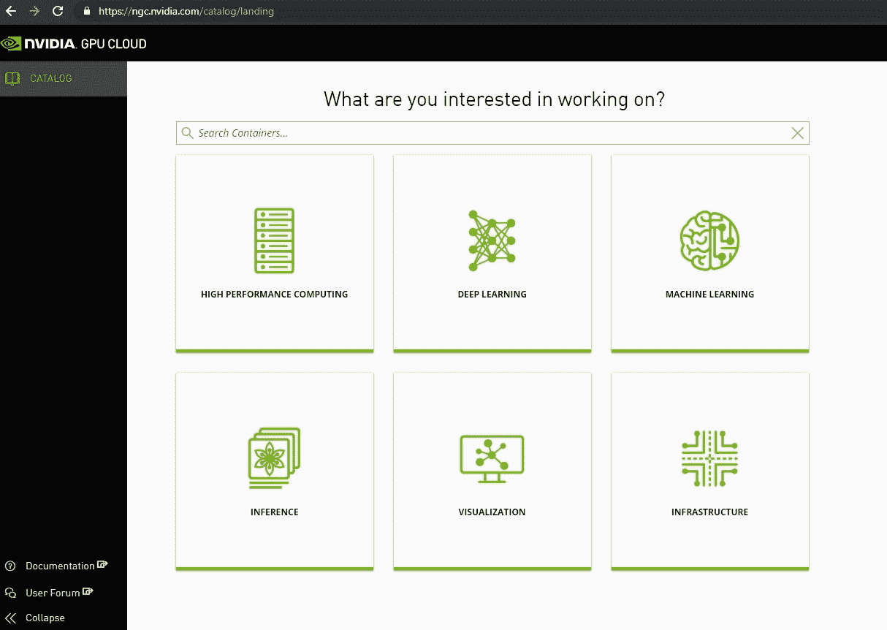

如您所见，容器有六个类别。选择与您相关的类别。NGC 的早期版本要求用户注册，但最近取消了此要求。

# NGC 容器的基本用法

在本节中，我们将介绍如何从 NGC 注册表中拉取容器以及如何自定义我们自己的容器。这与使用 Docker 没有区别，只是我们可以访问 NGC 注册表`nvcr.io`。如果您已经熟悉 Docker 命令，可以跳过本节。

以下步骤解释了如何在本地 Linux 机器上的终端会话中获取和启动 NGC 容器：

1.  找到您想要使用的软件并从 NGC 网站复制命令。

1.  然后，通过将命令粘贴到终端中来拉取容器映像。下面的屏幕截图显示了`pull`命令及其 Docker 操作：

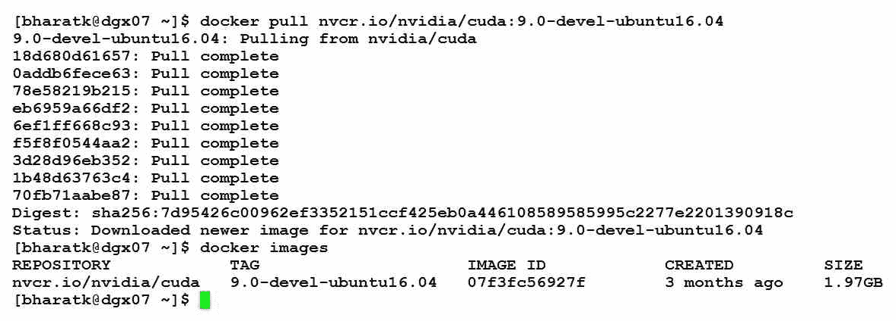

正如您所看到的，Docker 使用基于层的方法。CUDA 容器是在 Ubuntu 的基本层上构建的。此外，Docker images 命令向我们展示了我们机器上本地拉取的容器。

1.  使用以下命令启动拉取的容器：

```cpp
docker run --rm -it --runtime=nvidia nvcr.io/nvidia/cuda:9.0-devel-ubuntu16.04
```

GPU 显示在下面的屏幕截图中：

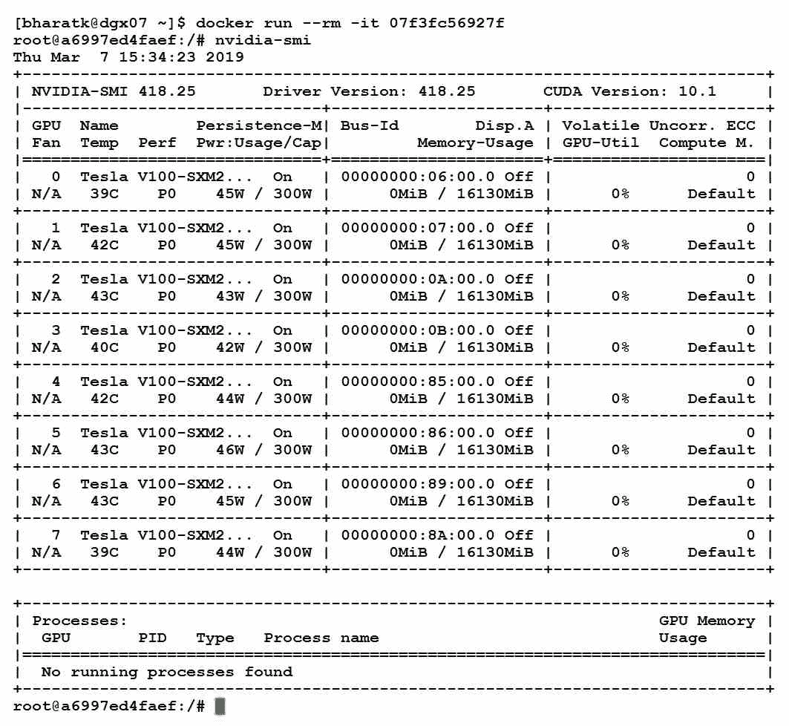

一旦我们运行 Docker，shell 登录会更改，并且我们登录到作为 root 运行的容器中。由于这个原因，我们能够在容器内运行`nvidia-smi`命令。

1.  我们还可以使用容器通过其附加选项访问主机资源。最常用的选项如下：

+   +   -v：用于挂载卷

+   -p：用于端口转发

+   -u：用于用户转发

`nvidia-docker`的基本用法与普通 Docker 用法类似，只是我们可以使用 GPU。这意味着您还可以获得 Docker 的附加好处。

# 从 NGC 容器创建和保存新容器

您还可以向现有容器添加层并保存它们以供将来使用。让我们学习如何做到这一点：

1.  创建一个`Dockerfile`并在基础镜像上创建一些层。例如，我们可以在 NGC PyTorch 容器中更新 APEX（[`github.com/nvidia/apex`](https://github.com/nvidia/apex)）以便我们可以使用其最新版本：

```cpp
FROM nvcr.io/nvidia/pytorch:19.03-py3
RUN git clone https://github.com/NVIDIA/apex /opt/apex && \
 cd /opt/apex && \
 pip install -v --no-cache-dir --global-option="--cpp_ext" --global-option="--cuda_ext" .
```

您还可以将所需的 Ubuntu 软件包或 Python 软件包安装代码添加到该文件中。

1.  然后，我们可以使用`docker build`命令构建一个定制的容器。以下命令显示了 Docker 镜像`build`命令的基本格式：

```cpp
docker build -t <image-name>:<tag> .
```

此命令将找到我们创建的`Dockerfile`并逐行启动每个命令。`Dockerfile`的每一行都将创建一个 Docker 层，因此建议编写一个`RUN`命令来覆盖一个单一目标。

1.  现在，您需要将 Docker 镜像备份到您的私有注册表或创建一个文件。在完成容器后，您可能希望在其他系统中传播或重用该容器。在这种情况下，您可以将 Docker 镜像推送到您的注册表中。例如，如果您在 DockerHub 上有帐户，Docker 提供了一个免费的注册表。您可以使用以下命令将容器推送到注册表中：

```cpp
docker push <DockerHub-ID>/<image-name>:<tag>
```

您还可以创建备份文件并将其复制到本地文件系统上。以下命令向您展示了如何使用压缩创建容器备份：

```cpp
docker save <image-name>:<tag> | gzip > container.tgz
```

然后，您可以使用以下命令加载该镜像：

```cpp
gunzip -c container.tgz | docker load
```

您可以创建一个本地备份镜像而不进行压缩，但通常输出文件太大，无法传送到其他系统。

在本节中，我们已经介绍了 Docker 的一些基本操作。然而，Docker 还提供了其他丰富的功能和好处。尽管 Linux 只能在 Docker 容器中使用 CUDA，但在构建工作环境和帮助您专注于代码开发方面，Docker 会为您节省时间。

# 将默认运行时设置为 NVIDIA Docker

通过对`nvidia-docker`配置进行一些修改，我们可以在不通知 GPU 的情况下启动 GPU 容器。因为我们可以将 GPU 运行时选项设置为`nvidia-docker`，所以我们可以采用 Docker 的运行时设计。为此，您需要将`default-runtime": "nvidia",`作为选项插入到`/etc/docker/daemon.json`中。然后，如果没有其他 Docker 配置，可以将`daemon.json`文件配置如下：

```cpp
{
    "default-runtime": "nvidia",
    "runtimes": {
        "nvidia": {
            "path": "nvidia-container-runtime",
            "runtimeArgs": []
        }
    }
}
```

完成此操作后，使用以下命令重新启动系统或重新启动 Docker 守护程序：

```cpp
sudo systemctl restart docker
```

现在，我们可以在 Docker 命令中享受 GPU 容器而无需使用 GPU 命令选项。

NVIDIA 开发博客提供了关于`nvidia-docker`的介绍，可以在[`devblogs.nvidia.com/gpu-containers-runtime`](https://devblogs.nvidia.com/gpu-containers-runtime/)找到。在这里，您不仅将了解其配置，还将了解如何将其与 Docker compose 或 Linux Containers（LXC）集成。它甚至允许 GPU 容器通过其 GPU 设备插件与 Kubernetes 一起工作。
