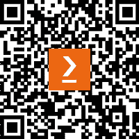

# 前言

Godot 引擎是市场上最受欢迎的免费开源游戏引擎。随着 Godot 4.0 的推出以及许多在 Godot 中制作的热门游戏（如 *Dome Keeper*、*Brotato* 和 *Case of the Golden Idol*）的发布，这种受欢迎程度只增不减。现在学习如何使用这个奇妙的游戏开发工具再合适不过了。

学习如何编程和使用新的游戏引擎可能是一项艰巨的任务。然而，这本书将逐步引导你了解从零开始创建自己游戏的各个方面，从编写我们第一个 GDScript 脚本的基础到更高级的主题。

我们将学习如何使用 GDScript 编程，这是 Godot 引擎的自定义语言，易于学习，但在游戏开发中功能强大且性能出色。然后，我们将深入了解引擎直观的图形界面，并发现其灵活的基于节点的游戏开发方法的所有内容。

# 这本书面向的对象

这本书是为程序员、游戏设计师、游戏开发者和游戏艺术家而写的，他们想要开始使用 Godot 4 创建游戏。如果你是编程或游戏开发的新手，正在寻找新的创意出口，并想尝试 Godot 4 和 GDScript 2.0，这本书适合你。虽然不需要具备编程或 Godot 的先验知识，但随着你在章节中的进步，这本书会逐渐引入更复杂的概念。

# 这本书涵盖的内容

*第一章*，*设置环境*，通过设置我们在 Godot 引擎中创建游戏所需的一切开始本书，并简要概述了引擎以及如何编写脚本。

*第二章*，*熟悉变量和控制流*，解释了变量是什么以及我们如何在其中存储数据的主要概念。从这里，我们将探讨不同的控制流，这些控制流有助于我们在游戏执行过程中做出决策。

*第三章*，*在数组、循环和字典中组织信息*，介绍了两种新的数据类型：数组和字典。这些将帮助我们以更结构化的格式组织数据。在这个过程中，我们将学习两种不同类型的循环，我们可以用它们遍历不同的数据集。

*第四章*，*使用方法和类构建结构*，深入探讨了使用方法编写可重用代码，以及如何将变量和方法结构化到类中。

*第五章*，*如何以及为什么保持代码整洁*，介绍了许多关于编写整洁代码的概念，这将帮助我们创建可重用且易于他人和自己理解的代码。

*第六章*, *在 Godot 中创建自己的世界*，将启动我们的游戏项目。我们首先定义我们将制作的游戏类型，然后逐步制作玩家角色的基础以及他们将在其中移动的环境。

*第七章*, *让角色动起来*，提供了关于矢量数学的复习，这对于在二维空间中移动实体至关重要。然后，我们将编写物理代码使我们的层角色移动，并在游戏运行时进行调试。

*第八章*, *拆分和重用场景*，展示了我们如何轻松地将游戏拆分成多个更小的场景，这些场景更容易管理和维护，随后介绍了如何在项目内部整理所有场景和脚本文件到整洁的文件夹中。

*第九章*, *摄像机、碰撞和可收集物品*，首先制作一个平滑的摄像机，它将跟随玩家角色而不会让现实生活中的玩家感到恶心。在此之后，我们将处理与地形的碰撞并创建可收集物品。

*第十章*, *创建菜单、制作敌人和使用自动加载*，通过教授我们 Godot 引擎的菜单系统来结束我们的单人游戏，随后介绍了可以穿越世界的敌人以及玩家可以用来射击这些敌人的投射物。我们本章以自动加载的介绍结束，通过它可以存储高分。

*第十一章**，多人游戏*，将我们的单人体验转换为多人游戏。我们首先进行计算机网络速成课程。在此之后，我们将学习`MultiplayerSpawner`和`MultiplayerSynchronizer`，以便能够在网络上与其他人一起玩游戏。

*第十二章*, *导出到多个平台*，展示了我们如何将游戏导出到不同的平台，如 Windows、macOS、Linux，甚至网页。我们将通过将我们的游戏上传到 Itch.io（一个流行的独立游戏平台）来结束本章。

*第十三章*, *面向对象编程的继续和高级主题*，介绍了更高级的`super`关键字、静态变量、枚举、lambda 函数、向方法传递值的不同方式以及`tool`关键字。

*第十四章*, *高级编程模式*，为我们提供了编程模式的基础，并探讨了事件总线、对象池和状态机模式，以便我们可以在下一个项目中使用它们。

*第十五章*, *使用文件系统*，介绍了 Godot 引擎的文件系统，并展示了我们如何在游戏中保存和加载数据。

*第十六章*，*接下来是什么？*，为我们留下了一些最后的技巧和资源，以开始下一个游戏项目，并介绍我们可以加入的游戏开发社区。

# 要充分利用本书

您不需要任何关于编程或游戏开发的先验知识。唯一的前提是您愿意学习并愿意改进。在本书中，我提出了您可以进行的多个实验，并包括了测验来测试您的知识。重要的是您花时间做这些，以便知识在您的脑海中巩固。

我们将在本书的第一章介绍如何下载和设置 Godot 引擎，但如果你感到不耐烦，你现在就可以下载 Godot 4.2.1 或更高版本。本书中的所有示例都在 Godot 4.2.1 上进行了测试，但也应该在未来的版本中工作。

| **本书涵盖的软件/硬件** | **操作系统要求** |
| --- | --- |
| Godot 4.2.1 | Windows, macOS, 或 Linux |
| GDScript 2.0 |  |

Godot 引擎是一个非常轻量级的软件，可以在较旧、过时的硬件上轻松运行，但查看最低规格并确保您的计算机能够满足它们是没有坏处的：[`docs.godotengine.org/en/stable/about/system_requirements.html`](https://docs.godotengine.org/en/stable/about/system_requirements.html)。

**如果您正在使用本书的数字版，我们建议您亲自输入代码或从本书的 GitHub 仓库（下一节中有一个链接）获取代码。这样做将帮助您避免与代码复制和粘贴相关的任何潜在错误。**

# 下载示例代码文件

您可以从 GitHub 下载本书的示例代码文件：[`github.com/PacktPublishing/Learning-GDScript-by-Developing-a-Game-with-Godot-4`](https://github.com/PacktPublishing/Learning-GDScript-by-Developing-a-Game-with-Godot-4)。如果代码有更新，它将在 GitHub 仓库中更新。

我们还有其他来自我们丰富的图书和视频目录的代码包，可在[`github.com/PacktPublishing/`](https://github.com/PacktPublishing/)找到。查看它们吧！

# 使用的约定

本书使用了多种文本约定。

`文本中的代码`: 表示文本中的代码单词、数据库表名、文件夹名、文件名、文件扩展名、路径名、虚拟 URL、用户输入和 Twitter 昵称。以下是一个示例：“在*第一章*中，我们学习了如何使用节点的`_ready`方法编写代码。”

代码块设置如下：

```cpp
func deal_damage(amount: float) -> void:
   player_health -= amount
func heal(amount: float) -> void:
   player_health += amount
```

当我们希望您注意代码块中的特定部分时，相关的行或项目将以粗体显示：

```cpp
func minimum(number1, number2):
   if number1 < number2:
      return number1
   else:
      return number2
```

任何命令行输入或输出都应如下编写：

```cpp
unzip Godot_v4.2.1-stable_linux.x86_64.zip -d Godot
```

通过打开**项目**菜单并选择**打开用户数据文件夹**来打开特定项目的`user://`文件夹。”

容器

我们称数组为**容器**，因为我们可以在其中存储和检索其他数据类型的数据片段，如整数、字符串、布尔值等。数组包含其他数据。

容器结构其他数据，使其更容易处理。

# 联系我们

我们始终欢迎读者的反馈。

**一般反馈**：如果您对本书的任何方面有疑问，请通过 customercare@packtpub.com 给我们发邮件，并在邮件主题中提及书名。

**勘误**：尽管我们已经尽一切努力确保内容的准确性，但错误仍然可能发生。如果您在这本书中发现了错误，我们将不胜感激，如果您能向我们报告。请访问[www.packtpub.com/support/errata](http://www.packtpub.com/support/errata)并填写表格。

**盗版**：如果您在互联网上以任何形式遇到我们作品的非法副本，如果您能提供位置地址或网站名称，我们将不胜感激。请通过版权@packtpub.com 与我们联系，并提供材料的链接。

**如果您有兴趣成为作者**：如果您在某个领域有专业知识，并且您有兴趣撰写或为书籍做出贡献，请访问[authors.packtpub.com](http://authors.packtpub.com)。

# 分享您的想法

一旦您阅读了《通过使用 Godot 4 开发游戏学习 GDScript》，我们很乐意听听您的想法！请[点击此处直接转到该书的亚马逊评论页面](https://packt.link/r/1-804-61698-2)并分享您的反馈。

您的评论对我们和科技社区非常重要，并将帮助我们确保我们提供高质量的内容。

# 下载这本书的免费 PDF 副本

感谢您购买这本书！

您喜欢在路上阅读，但又无法携带您的印刷书籍到处走？

您的电子书购买是否与您选择的设备不兼容？

别担心，现在，您每购买一本 Packt 书籍，都可以免费获得该书的 DRM 免费 PDF 版本。

在任何地方、任何设备上阅读。直接从您最喜欢的技术书籍中搜索、复制和粘贴代码到您的应用程序中。

优惠远不止这些，您还可以获得独家折扣、时事通讯和每日收件箱中的精彩免费内容。

按照以下简单步骤获取优惠：

1.  扫描二维码或访问以下链接



[`packt.link/free-ebook/978-1-80461-698-7`](https://packt.link/free-ebook/978-1-80461-698-7)

1.  提交您的购买证明

1.  就这些了！我们将直接将您的免费 PDF 和其他优惠发送到您的电子邮件。

# 第一部分：学习如何编程

在这部分，我们将首先下载免费开源的 Godot 引擎，并设置我们将从零开始开发自己的游戏的环境。然而，在我们开始创建游戏之前，我们将使用 GDScript 编程语言建立编程的坚实基础。

到这部分结束时，你将了解所有关于变量、控制流程、不同的数据类型和容器类型、方法以及类。我们将以关于代码整洁性的章节来结束这部分内容。

本部分包含以下章节：

+   *第一章*, *设置环境*

+   *第二章*, *熟悉变量和控制流程*

+   *第三章*, *在数组、循环和字典中分组信息*

+   *第四章*, *使用方法和类构建结构*

+   *第五章*, *如何以及为什么保持代码整洁*
