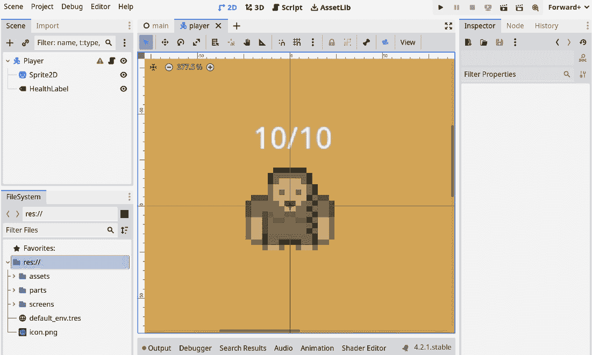
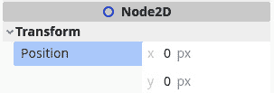
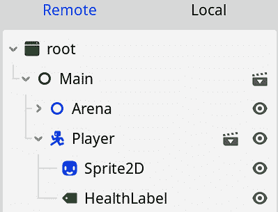
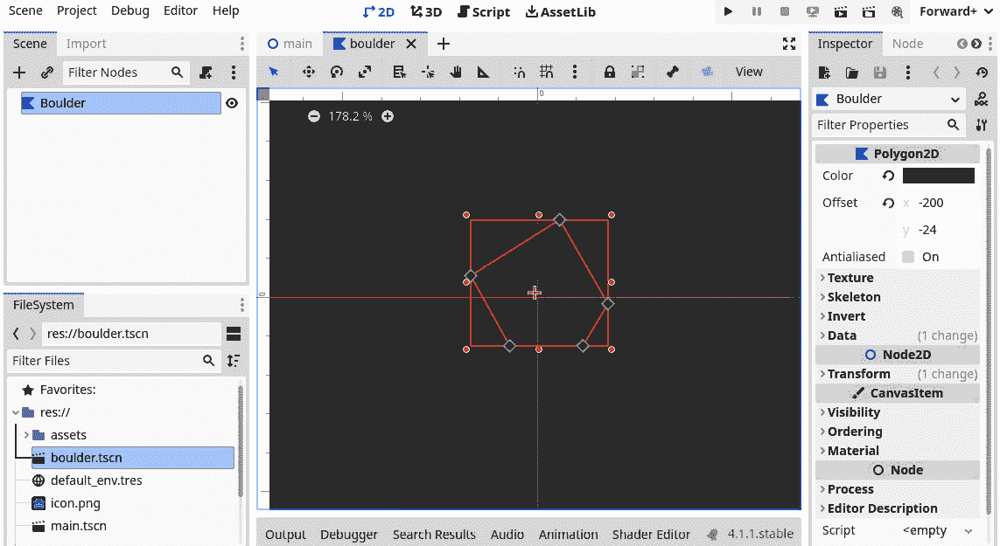
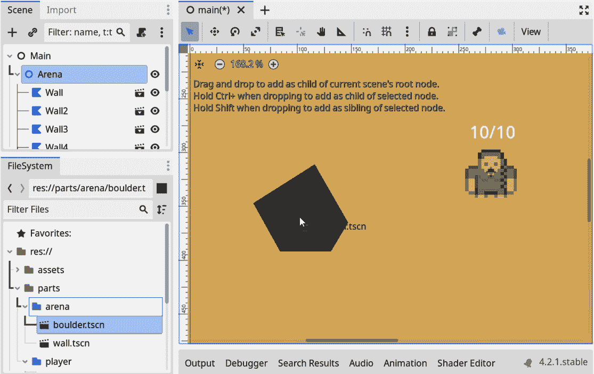
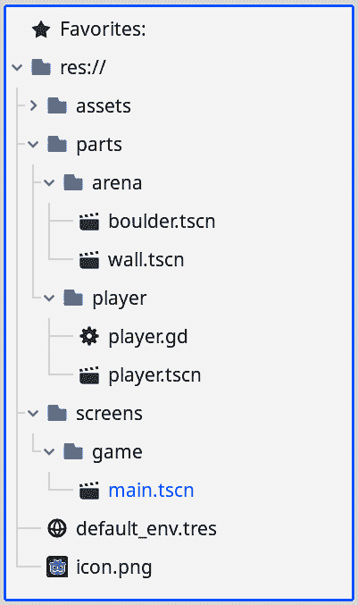

# 第六章：分割和重用场景

有可能在一个 Godot 场景中创建整个游戏，但这可能会变得相当难以管理。我们不仅必须一次又一次地重新创建每个部分，例如每个巨石或敌人，而且如果我们想改变关于岩石的某些内容，我们必须去找每个岩石来更改它们。

这对于任何类型的游戏来说都不具可扩展性。幸运的是，在 Godot 中，有像*场景*这样的东西。在*第二章*中，我们看到了如何从头创建新场景，但在这章中，我们将学习如何为每个元素创建一个场景，这样我们就可以在整个游戏中轻松重用它。这样，我们可以为岩石创建一个场景，并使用它来填充竞技场，而不是使用多个独特的岩石。

除了重用组件之外，单独对游戏中的某些部分进行工作也比有一个大场景要容易得多。以这种方式保存游戏的部分将使我们专注于我们正在工作的内容。

其他游戏引擎也有非常类似的功能。Unity 有预制体，Unreal Engine 有蓝图类，等等。Godot 场景的伟大之处在于，一旦它们在场景树中实例化，它们的行为就像任何其他节点一样。

在本章中，我们将涵盖以下主要主题：

+   将分支保存为新的场景

+   使用保存的场景

+   在项目中组织场景

# 技术要求

就像每一章一样，你可以在本书的 GitHub 仓库中找到本章的最终代码，位于该章节的子文件夹中：[`github.com/PacktPublishing/Learning-GDScript-by-Developing-a-Game-with-Godot-4/tree/main/chapter08`](https://github.com/PacktPublishing/Learning-GDScript-by-Developing-a-Game-with-Godot-4/tree/main/chapter08)。

# 将分支保存为新的场景

在*第二章*的[*创建新场景*]部分，我们学习了如何为不同的代码实验创建新场景。这个过程可以用来创建任何场景。但另一种方法是保存现有场景树的一部分。我们将把场景树的一个分支拆分成一个独立的子场景，我们可以在任何地方重用它。

## 创建独立的玩家场景

让我们将`Player`节点保存为一个独立的场景，这样我们就可以单独对其工作。前往我们的`Main`场景，按照以下步骤操作：

1.  右键点击`Player`节点。

1.  从弹出菜单中选择**保存分支** **为场景**：

图 8.1 – 选择将分支保存为场景以将节点保存为独立场景

1.  现在，我们必须选择新场景的位置和名称。保持一切不变应该就可以了：

图 8.2 – 将场景保存为适当的名称

1.  新的场景现在将打开，并且只包含`Player`节点及其子节点：

图 8.3 – 只包含玩家节点及其子节点的 player.tscn 场景

1.  将“玩家”节点的位置重置为场景内的`(0, 0)`：

图 8.4 – 将根玩家节点的位置重置为(0, 0)

如果你回到主场景，如图*图 8**.3*所示，你会看到原本有一些子节点位于其下的“玩家”节点被一个名为“玩家”的单个节点所取代。这个节点现在代表**玩家**场景内的所有内容。在 2D 编辑器中，从视觉上看没有任何变化；玩家仍然完整地存在，带有其**Sprite2D**和**Health**标签：

图 8.5 – 玩家节点及其子节点被替换为单个节点

如果你运行游戏，什么都不会改变，因为一切都没有改变。我们只是将“玩家”节点拆分成了自己的场景文件。你可以通过进入**远程**树并确认当游戏开始运行时玩家节点会展开到所有部分来检查这一点：

图 8.6 – 当运行游戏时，玩家节点扩展到在远程树中包含所有子节点

在“玩家”节点中也有一个新按钮可用。按下此按钮将直接带我们到“玩家”场景。这对于我们稍后需要处理许多不同场景和节点来说非常方便：

图 8.7 - 将我们直接带到玩家场景的新按钮

现在，玩家有了他们自己的场景，我们可以在其中工作，而无需处理整个游戏中的所有内容。

## 场景的根节点

你还会看到玩家场景的根节点是名为`Player`的`CharacterBody2D`节点，这是我们选择用于它的第七章。场景可以有任意类型的节点作为其根节点。你可以在创建场景时选择此类型，就像我们在第二章中做的那样，或者稍后通过更改节点类型来实现，就像我们在第七章中对“玩家”节点所做的那样。

使用单独的场景文件，我们可以在这个场景内部创建该场景的多个实例。我们将在下一节中看到如何做到这一点。

# 使用保存的场景

由于我们将在游戏中只使用一个玩家，所以我们不会多次重用玩家场景。然而，我们希望重用竞技场内的岩石和墙壁。按照*将分支保存为新场景*部分中的步骤，将一个巨石分离到一个新场景中：

图 8.8 – boulder.tscn 场景

现在，让我们将这个新场景在我们的竞技场中作为默认岩石重用：

1.  返回主场景。从场景中移除所有岩石；我们不再需要它们了。

1.  选择`Arena`节点。通过这样做，我们添加的所有内容都将作为此节点的子节点添加。

1.  现在，将巨石场景从**FileSystem**拖放到 2D 编辑器中。当你还在拖动它时，你会看到巨石的视觉效果弹出：

图 8.9 – 将 boulder.tscn 场景拖放到主场景树中

现在，你可以对场景中的内部墙壁做同样的处理，并用岩石和墙壁重新填充竞技场，使其看起来不那么荒凉。然而，不要对`OuterWalls`做同样的事情 – 我们不会重用它，所以这个可以保持不变。

当放置巨石和墙壁场景时，你可以使用变换参数，如旋转、缩放和倾斜，为实例添加多样性，这样它们就不会看起来太相似。

好玩的是，我们可以在任何场景中使用任何其他场景！

拥有许多较小的场景文件有很多优点，代码的可维护性和易于重用只是其中两个，但它也会使项目的文件结构变得复杂。因此，我们必须考虑如何组织项目中的所有文件。我们将在下一节中这样做。

# 组织场景文件

现在我们有更多文件需要关注，我们不得不开始考虑如何组织它们。让我们将场景分别放入对项目有意义的不同文件夹中。这样，我们总能知道在哪里找到某物或保存一个新场景。

在我们项目的根目录中添加以下文件夹：

+   `parts`：

    +   `environment`

    +   `player`

+   `screens`：

    +   `game`

`parts`文件夹将包含所有属于不同场景的场景，例如玩家、墙壁、敌人、可收集物品、UI 按钮等。

另一方面，`screens`将包含所有可以独立存在的场景，例如游戏屏幕、全屏菜单，如主菜单或暂停菜单等。这些场景由`parts`文件夹中的场景组成。

在项目开始时，我给了你一个`assets`文件夹。这个文件夹用于存放所有艺术资产，从精灵到动画和声音。

现在，将所有场景和脚本移动到适当的文件夹中，如下所示：

图 8.10 – 我们的项目，文件管理更佳

一旦你看过用 Godot 或其他游戏引擎制作的其它游戏项目，你会发现每个人都在他们项目中以自己的方式组织不同的文件。我喜欢将场景和脚本放在同一个文件夹中，例如，因为大多数时候，你都会非常接近地使用和编辑它们。然而，我会将资产，如图片和声音，分开，因为这些更容易在不同的场景中重复使用。

随着时间的推移，你可能为项目发展出一种组织结构，这是完全可以的。只要对你来说最有意义，你就应该使用它，只要你能保持一致性。

# 额外练习 – 锋利斧头

1.  使用我们关于分割场景的知识，尝试制作一个与第一个不同的形状的第二块巨石场景。将第一个巨石场景命名为`boulder01.tscn`，第二个命名为`boulder02.tscn`。

# 概述

重复使用你的工作部分几乎总是个好主意。在本章中，我们学习了如何将场景树中的整个分支作为单独的场景进行重复使用。这将在接下来的章节中派上用场，因为我们现在能够单独处理玩家的摄像机移动，并同时在所有岩石和墙壁上创建碰撞。但这将是下一章的内容。

# 测验时间

+   你如何将场景树中的分支保存为单独的场景？

+   在**文件系统**区域组织我们的场景、脚本和资产是否重要？为什么？
